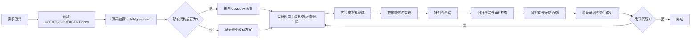
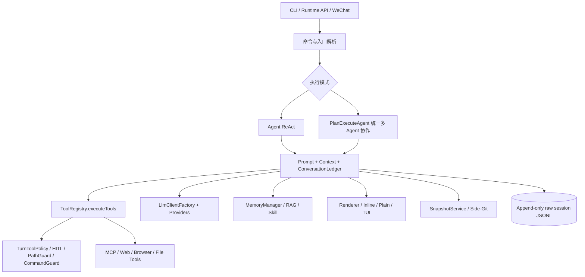
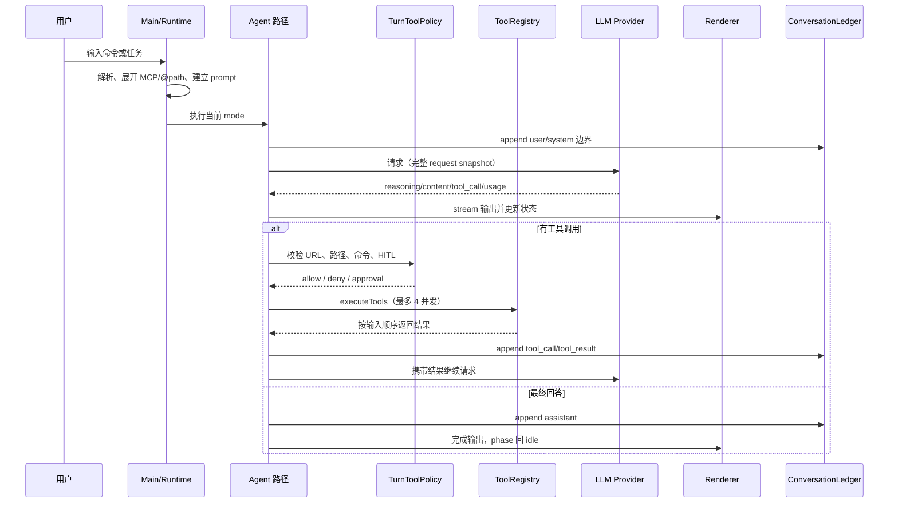

# CodeAgent 项目开发指南

本文件是仓库中 Agent 和新线程的首读入口。它约束开发流程、架构边界和交付质量；详细实现说明见 [docs/agents-reference.md](docs/agents-reference.md)。

## 1. 信息优先级与项目快照

信息冲突时按以下顺序判断：代码实际行为 > AGENTS.md > CODEAGENT.md > README.md > ROADMAP.md > CLAUDE.md。ROADMAP.md 只表示演进方向，不代表已交付。

CodeAgent 是面向商业使用的 Java 17+ Agent CLI，对标 Claude Code。当前主路径为 ReAct 与统一多 Agent 协作的 Plan-and-Execute（`PlanExecuteAgent`，由 `/plan` 进入，人工计划门与步骤自动评审串联生效），共享 ToolRegistry、Memory、Snapshot、Policy、Renderer 等基础设施。核心模块位于 src/main/java/com/codeagent/，测试位于 src/test/java/。

## 2. 开发流程（最高优先级）

### 2.1 强制生命周期

任何非纯文字回答的代码、配置或文档变更，都必须经过以下生命周期。小修复可以缩短文档，但不能跳过验证和交付检查。



执行要求：

1. 先读相关文档，再读源码；源码是真相。不得仅凭 README 或旧计划猜测行为。
2. 先定义目标、非目标、影响面和验收标准；需求含糊时先澄清，不得自行扩大范围。
3. 涉及新增能力、跨模块协作、协议/命令/数据格式、持久化、并发或安全策略时，默认创建 docs/dev/{需求名}.md，并在实现前完成方案评审。
4. 实现遵循“测试先行、最小改动、依赖方向单向”。每完成一个边界就运行对应测试。
5. 完成前必须执行验证命令、检查 git diff/git diff --check，并在回复中给出真实命令和结果；未经验证不得声称“已修复/已完成”。

### 2.2 方案文档模板

```markdown
# {需求名}
## 1. 背景、目标与非目标
## 2. 现状分析（源码证据、已知约束）
### 2.1 架构位置
### 2.2 数据/状态模型
### 2.3 核心时序与失败路径
## 3. 方案设计
### 3.1 接口与数据结构
### 3.2 策略、安全、并发与恢复
### 3.3 兼容性、迁移与回滚
## 4. 实现任务与测试矩阵
## 5. 验收清单
```

方案至少包含一张适合问题的 Mermaid 图：模块关系用 graph，事件交互用 sequenceDiagram，状态变化用 stateDiagram-v2，步骤决策用 flowchart。图必须和文字、代码保持一致；不画装饰性图。

## 3. 系统架构与依赖铁律



架构铁律：

| 边界 | 必须 | 禁止 |
|---|---|---|
| 入口层 | 解析命令、建立 Terminal/LineReader/Renderer、注入上下文 | 在主交互路径新增裸 System.out.println |
| Agent 层 | 通过统一执行入口、维护发送视图与 ledger 边界 | 手写工具 for-loop、绕过策略或账本 |
| Tool 层 | 所有工具经 executeTools()，结果保持原始顺序 | 工具自行扩大 URL/路径授权 |
| Policy/HITL | 先策略拒绝，再询问人工；记录 AuditLog | 让用户批准已被策略拒绝的请求 |
| LLM 层 | 通过 LlmClientFactory 和统一 retry/usage 约定 | 在 Agent 中直接拼 HTTP 请求 |
| Renderer | 输出优先走 Renderer.stream()；inline 用 printAbove | 用 Display/CLEAR_TO_EOS 覆盖 transcript |
| Ledger/Memory | 原始消息 append-only；短期上下文仅为发送视图 | 改写旧 JSONL、自动保存长期记忆 |

依赖方向：入口 → Agent/Plan/Team → Tool/Policy/LLM/Memory → 基础设施。底层不得反向依赖 CLI 或 Renderer；共享行为应抽到已有接口，而不是复制三份实现。

## 4. 关键请求时序



上下文接近阈值时，先使用 RequestSnapshotFactory + ContextTokenTracker 预测；触发压缩后原地重建同一份 conversationHistory，保留最近 1 个 user 轮次及 tool 边界，并向 ledger 追加边界事件而不删除旧记录。

## 5. 功能改造的标准落点

1. prompt/：先更新输入、输出、上下文和权限契约。
2. model/ 或对应领域包：定义不可变数据结构、状态和序列化格式。
3. policy/、hitl/、history/：评估安全、审计、恢复和持久化影响。
4. 领域实现：复用 ToolRegistry、MemoryManager、SnapshotService 等既有接口。
5. Main.java / CliCommandParser.java：若改命令，必须同步测试、README、AGENTS。
6. llm/*Client.java / LlmClientFactory.java：若改 provider，必须同步 .env.example、契约测试和文档。
7. docs/dev 与架构文档：实现后更新行为、限制和图示。

## 6. 必须遵守的运行时约束

- ReAct 与 PlanExecuteAgent（`/plan` 入口，`FULL_PRESET`）都通过 executeTools()，默认最多 4 个并发，结果按原始顺序归并。
- 工具授权链固定为 TurnToolPolicy → HitlToolRegistry → ToolRegistry → PathGuard/CommandGuard；策略拒绝不能通过换工具、provider 或分支绕过。
- URL 只能来自顶层用户原文或成功 web_search 的结构化 discoveredUrls；搜索正文、reasoning、普通工具输出和回复文本都不能产生新授权。计划分支默认隔离 URL 凭据，只有声明的 DAG 后继可继承；步骤自动评审（stepReview）不改变这一步的授权继承。
- @path/MCP resource 展开在进入 Agent 前完成；项目外绝对路径和符号链接逃逸保持原文。
- 写文件后按配置运行 LSP 诊断；诊断作为下一轮 user message 注入。CODEAGENT_LSP_ENABLED=false 可关闭。
- MCP 启动默认最多等待 8 秒，超时 server 保持 STARTING 并后台继续；用 /mcp 查看状态。
- /clear 只清空当前发送视图、session memory 预计算状态和 Skill buffer，长期记忆及 raw ledger 保留；/compact 手动执行完整摘要压缩。
- DeepSeek/Kimi thinking 的 reasoning_content 必须回传下一轮；DeepSeek 当前不发送图片 block。usage 未经真实契约验证的 provider 必须保持 trusted=false 并使用本地完整估算。
- Side-Git snapshot 独立于系统 git；revert 前先创建 pre-restore snapshot，并纳入 HITL/AuditLog。
- raw session JSONL 可能含敏感内容：用户目录权限按平台收紧，禁止提交、复制或在报告中泄露正文、工具参数、结果、图片 payload、Memory 正文和 secret。

## 7. 命令与文档联动门禁

新增、删除或修改 /xxx 时必须同时检查：Main.java、CliCommandParser.java、相关 parser/completer、测试、README、AGENTS。未知斜杠命令必须在 CLI 层报错，不能回退给 Agent。

改工具集时必须同步 ToolRegistry、Agent/Plan/SubAgent 提示词、HITL/Policy、审计和测试。修改 PipelineOptions 预设语义时，必须同步 /plan 的入口接线、MainPlanAgentFactoryTest 与本文档第 6 节。改 MCP、Web、Browser、Memory、Prompt、Renderer 时，分别同步对应包、配置示例、文档和回归测试。

## 8. 验证矩阵

```text
命令解析：mvn test -Dtest=CliCommandParserTest,PlanReviewInputParserTest,MainInputNormalizationTest
工具/策略：mvn test -Dtest=ToolRegistryTest,TurnToolPolicyTest,ApprovalPolicyTest
计划/多 Agent：mvn test -Dtest=ExecutionPlanTest,PlannerTest,PlanExecuteAgentTest,StepBriefingTest,SubAgentStepReviewerTest,PipelineOptionsTest
Memory/RAG：mvn test -Dtest=MemoryManagerTest,ConversationHistoryCompactorTest,VectorStoreTest,CodeIndexTest
MCP/Web：mvn test -Dtest=McpSchemaSanitizerTest,JsonRpcClientTest,NetworkPolicyTest,WebFetcherTest
TUI：mvn test -Pphase16-smoke
常规回归：mvn test -Pquick
全量：mvn test -DskipTests=false
构建：mvn clean package
```

## 9. 交付检查清单

- [ ] 需求目标、非目标、影响文件和验收标准明确。
- [ ] 已读取相关 docs 与源码，并在方案中记录证据。
- [ ] 方案含架构图、核心时序图或状态/流程图，且与实现一致。
- [ ] 数据结构、prompt、权限、并发、错误、恢复和兼容性已评估。
- [ ] 测试先行或补齐；针对性测试、mvn test -Pquick 和必要的全量测试已执行。
- [ ] git diff --check 通过，未修改无关代码，未提交 .env、API Key、target/ 或 raw session。
- [ ] 命令、工具、provider、MCP、Memory、Renderer 等联动文档已同步。
- [ ] 最终回复包含改动摘要、验证命令/结果、已知限制和后续风险。

## 10. 协作准则

使用中文沟通；大规模重构先进入 Plan Mode；优先最小化、可回滚的改动；遇到不确定的协议或安全边界先停下来核对代码和测试。长期记忆只在用户明确要求或执行 /save 时写入，不自动提取事实。形成稳定协作规则时更新本文件，具体实现细节补充到 docs/agents-reference.md。

### 独立判断与证据纪律

- 不以迎合用户为目标；对需求、方案和结论进行独立判断，发现不合理之处应直接指出。
- 明确区分已验证事实、合理推测和主观建议；不把推测写成事实，不把偏好伪装成结论。
- 涉及数字、人物、版本、外部行为或关键结论时，尽量核对源码、测试、官方文档或其他可追溯来源，并说明证据边界。
- 与用户意见不一致时，说明不同意的依据、潜在风险和至少一种替代解释或可行方案；不要只给结论，不做无依据的反驳。
- 主动提醒可能被忽略的变量、隐性成本、兼容性影响、失败路径、样本偏差和确认偏误；信息不足时明确说明不确定性及需要补证的内容。
