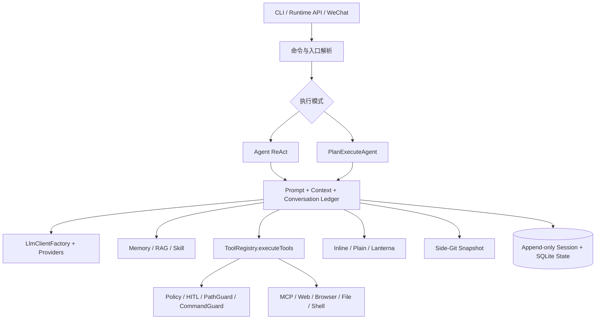

# CodeAgent

[](https://openjdk.org/)
[](https://maven.apache.org/)

面向真实代码库的 Java Agent CLI。CodeAgent 在终端中理解项目、规划任务、调用工具、修改代码并验证结果，同时把权限、安全、会话恢复和上下文管理放在同一套运行时里。

普通顶层任务默认由无工具 Mode Router 自动选择 ReAct 或多 Agent 协作的 Plan-and-Execute；也可以使用 `/react`、`/plan` 对单轮任务进行显式覆盖。

> CodeAgent 仍在快速演进。源码与测试是行为真相，路线图只表示后续方向。

## 为什么选择 CodeAgent

- **自动选择执行模式**：简单任务走 ReAct，复杂任务进入 Plan DAG，无需每次手工判断。
- **面向工程任务**：内置文件、代码搜索、命令执行、Web、浏览器、Memory、RAG 和 MCP 工具。
- **统一多 Agent 协作**：Planner 拆解 DAG，Worker 执行，Reviewer 审查；支持依赖调度、冲突感知和失败重试。
- **可恢复的长任务**：会话事件追加写入，Plan 状态持久化到 SQLite，中断后可从 Task 边界继续。
- **本地优先的代码理解**：精确定位优先使用 glob、grep 和文件读取，语义检索使用随 JAR 分发的进程内 BGE。
- **明确的安全边界**：工具调用经过策略、HITL、路径和命令防护；危险操作写入脱敏审计日志。
- **可扩展运行时**：支持 MCP、项目/用户级 Skill、Prompt 覆盖、Runtime API 和微信 iLink 通道。
- **终端原生体验**：默认 inline 流式界面，保留 transcript，并提供状态栏、折叠工具块和行内 diff。

## 运行要求

必需：

- Java 17 或更高版本
- Maven（建议使用当前稳定版本）
- 至少一个受支持 Provider 的 API Key

可选：

- `ripgrep`：加速 `grep_code`；未安装时自动回退
- Node.js / `npx`：运行默认的 Chrome DevTools MCP
- Chrome：使用浏览器自动化或复用登录态

## 快速开始

### 1. 获取源码

```bash
git clone https://github.com/zgjdev/Code-Agent.git
cd Code-Agent
```

### 2. 创建配置

macOS / Linux：

```bash
cp .env.example .env
```

Windows PowerShell：

```powershell
Copy-Item .env.example .env
```

编辑 `.env`，至少配置一个 Provider。例如：

```dotenv
GLM_API_KEY=your_api_key_here
# GLM_MODEL=glm-5.1
```

也可以配置 DeepSeek、腾讯混元、StepFun、Kimi、FreeLLMAPI、讯飞星辰 MaaS 或 Agnes。完整选项见 [.env.example](.env.example)。

### 3. 构建并启动

```bash
mvn clean package
java -jar target/codeagent-1.0-SNAPSHOT.jar
```

`mvn clean package` 默认跳过测试，以便快速生成可运行 JAR。

启动后可以直接描述任务：

```text
分析这个项目的认证流程，并指出可能的越权路径

为订单服务增加幂等校验，补充测试并更新文档

查找最近一次构建失败的根因，只分析，不修改文件
```

## 执行模式

### 自动路由

默认 inline/plain 终端中的普通顶层输入会先经过 Mode Router：

- Router 只读取原始用户输入和 Parent Session 的顶层对话。
- Router 不注册工具，也不会执行文件、命令或网络操作。
- 输出严格限制为 `REACT` 或 `PLAN`。
- 非取消性失败回退 ReAct；取消或线程中断终止当前 Turn。

Lanterna TUI、Runtime API 和微信通道目前不接入自动路由。

### ReAct

适合定位问题、解释代码、局部修改和可在连续工具反馈中完成的任务。

```text
/react 修复用户查询为空时的异常，并补充回归测试
```

只输入 `/react` 时，下一条任务强制使用 ReAct；覆盖仅对一轮生效。

### Plan-and-Execute

适合跨模块改造、多步骤交付和需要并行协作的复杂任务。

```text
/plan 重构会话恢复机制，保持兼容并补充迁移测试
```

Plan 路径包含：

- Planner 生成任务 DAG
- 人工确认计划
- Conflict-Aware Selector 对可并行任务分批
- Worker 使用独立 task-local 上下文执行
- 确定性证据门禁和 Reviewer 自动评审
- 失败重试、重新规划与 SQLite checkpoint

使用 `/plan resume` 继续当前 Session 的未完成计划，使用 `/plan abandon` 显式放弃。

## 核心能力

### 代码与终端工具

内置工具覆盖：

- 文件读取、写入和目录浏览
- glob、精确代码搜索和语义辅助检索
- Shell 命令执行与项目创建
- Web 搜索与正文抓取
- 浏览器连接状态管理
- Skill 加载、长期记忆保存和 Side-Git 恢复
- MCP 动态工具

同一轮产生多个工具调用时，CodeAgent 最多并行执行 4 个调用，并按原始顺序把结果回灌模型。Plan DAG 还会根据资源声明避免把写冲突任务放进同一批次。

### 代码检索与 RAG

CodeAgent 使用分层检索策略：

1. `glob_files` 定位候选文件。
2. `grep_code` 精确查找符号和文本。
3. `read_file` 获取必要上下文。
4. `search_code` 在描述模糊时提供语义辅助。

本地语义层使用随 JAR 分发的量化 BGE 模型；词法 FTS、符号和关系召回不依赖 Embedding。远程 Embedding 只有在用户对当前项目和 Provider 明确授权后才会启用，拒绝或故障会自动降级。

```text
/index
/search 处理请求重试和 Retry-After 的实现
/graph PlanExecuteAgent
```

### 持久化会话与上下文

- 原始会话以 append-only JSONL 保存到 `~/.codeagent/history/sessions/`。
- 默认恢复当前工作区最近的未完成会话。
- Provider Surface 和 Top-level Conversation View 分离维护。
- ReAct 与 Plan 共享顶层语义连续性，但不共享 Task transcript 或隐式权限。
- 上下文接近预算时自动压缩，也可以手动执行 `/compact`。

常用命令：

```text
/sessions
/resume [last|<session-id>]
/new
/clear
/compact
/export
```

如需每次启动新会话：

```dotenv
CODEAGENT_SESSION_RESUME=off
```

### Memory、项目规则与 Skill

项目规则按以下位置加载：

- `CODEAGENT.md` 或 `.codeagent/CODEAGENT.md`：可提交的团队规则
- `CODEAGENT.local.md` 或 `.codeagent/CODEAGENT.local.md`：本地覆盖

长期记忆不会自动从普通对话中提取。只有用户明确要求记住，或执行 `/save` 时才会保存。

```text
/memory
/memory list
/memory search <关键词>
/save <事实>
/save --global <事实>
```

Skill 按“内置 < 用户级 < 项目级”的优先级加载：

```text
src/main/resources/skills/
~/.codeagent/skills/<name>/
<project>/.codeagent/skills/<name>/
```

```text
/skill list
/skill show <name>
/skill on <name>
/skill off <name>
/skill reload
```

### MCP 与浏览器

CodeAgent 支持 MCP stdio 和 Streamable HTTP：

- 用户级配置：`~/.codeagent/mcp.json`
- 项目级配置：`.codeagent/mcp.json`
- 项目配置按 server 名覆盖用户配置

最小配置示例：

```json
{
  "mcpServers": {
    "chrome-devtools": {
      "command": "npx",
      "args": ["-y", "chrome-devtools-mcp@latest", "--isolated=true"]
    },
    "remote": {
      "url": "https://mcp.example.com/v1",
      "headers": {
        "Authorization": "Bearer ${REMOTE_TOKEN}"
      }
    }
  }
}
```

支持 `${PROJECT_DIR}`、`${HOME}` 和 `${VAR}` 展开。MCP 工具统一命名为 `mcp__{server}__{tool}`，并经过与内置工具相同的策略、审批和审计链。

```text
/mcp
/mcp restart <name>
/mcp logs <name>
/mcp resources <name>
/mcp prompts <name>
```

浏览器默认使用隔离 profile。需要访问当前 Chrome 登录态时：

```text
/browser connect
/browser tabs
/browser disconnect
```

shared 模式不会自动取得任意标签页的操作权限；敏感页面上的点击、填写和脚本执行仍需单步审批。

### Web 访问

内置搜索 Provider 包括智谱 Web Search、SerpAPI 和 SearXNG。`web_fetch` 适合静态或 SSR 页面，遇到 SPA、登录墙或强反爬页面时可转到 Chrome DevTools MCP。

URL 授权只来自：

- 顶层用户原文中的 URL
- 成功 `web_search` 返回的结构化 URL

搜索摘要、网页正文、普通工具输出和模型回复中的链接不会自动获得新的访问权限。

### 图片输入

支持终端粘贴图片和显式引用：

```text
@image:file:///absolute/path/to/image.png
@image:relative/path.png
```

图片会在发送前进行格式识别、透明背景处理、尺寸限制和压缩。不支持图片输入的 Provider 会保留文字上下文并省略图片 payload。

### Runtime API 与后台任务

后台任务使用本地 SQLite 队列：

```text
/task
/task add <任务内容>
/task cancel <task-id>
/task log <task-id>
```

Runtime API 仅监听 loopback，并强制要求 API Key：

```bash
CODEAGENT_RUNTIME_API_KEY=your_local_api_key \
  java -jar target/codeagent-1.0-SNAPSHOT.jar serve --http --port 8080
```

主要端点：

- `POST /v1/threads`
- `POST /v1/threads/{id}/turns`
- `GET /v1/threads/{id}/events`

### 微信 iLink 通道

```bash
java -jar target/codeagent-1.0-SNAPSHOT.jar wechat setup
java -jar target/codeagent-1.0-SNAPSHOT.jar wechat start
java -jar target/codeagent-1.0-SNAPSHOT.jar wechat status
```

交互式 CLI 中也可以使用 `/wechat`、`/wechat setup`、`/wechat status` 和 `/wechat stop`。微信通道当前是文本 MVP，不接入自动模式路由。

## Provider

| Provider | 配置前缀 | `/model` 示例 | 备注 |
|---|---|---|---|
| GLM | `GLM_*` | `/model glm-5.1` | 支持 GLM 多模态模型 |
| DeepSeek | `DEEPSEEK_*` | `/model deepseek` | 支持 reasoning 回传 |
| 腾讯混元 | `HUNYUAN_*` | `/model hunyuan` | 默认 TokenHub OpenAI-compatible 接口 |
| StepFun | `STEP_*` | `/model step` | 可配置普通或 Plan 通道 |
| Kimi / Moonshot | `KIMI_*` / `MOONSHOT_*` | `/model kimi` | 支持 reasoning 回传 |
| FreeLLMAPI | `FREELLMAPI_*` | `/model freellmapi` | 默认连接本地兼容网关 |
| 讯飞星辰 MaaS | `XFYUN_MAAS_*` | `/model xfyun` | 支持 MaaS modelId 和 LoRA ID |
| Agnes AI | `AGNES_*` | `/model agnes` | OpenAI-compatible |

Provider、模型和 Base URL 可以通过 `.env`、用户配置以及 `/config provider ...` 管理。不要提交包含真实密钥的 `.env`。

## 安全模型

工具执行链固定为：

```text
TurnToolPolicy → HitlToolRegistry → ToolRegistry → PathGuard / CommandGuard
```

- 策略拒绝先于人工审批，用户不能批准已经被策略拒绝的调用。
- HITL 可用 `/hitl on` 开启，支持批准、拒绝、跳过和修改参数。
- 写文件、执行命令、创建项目、恢复快照以及 MCP 工具会进入审计链。
- 路径防护阻止项目外写入和符号链接逃逸。
- URL 来源、浏览器 tab 所有权和敏感页面操作都有独立约束。
- Side-Git 快照与系统 Git 分离，恢复前先创建 pre-restore 快照。

```text
/hitl on
/policy
/audit [N]
/snapshot
/restore <N>
```

> 本地 Agent CLI 不是容器或虚拟机沙箱。运行前应理解工具权限，并在处理不可信仓库时开启 HITL。

## 数据目录

默认运行数据保存在用户目录下：

| 路径 | 内容 |
|---|---|
| `~/.codeagent/config.json` | Provider 和模型配置 |
| `~/.codeagent/history/` | 持久化会话与事件日志 |
| `~/.codeagent/plans/plans.db` | Plan DAG checkpoint |
| `~/.codeagent/tasks/tasks.db` | 后台任务队列 |
| `~/.codeagent/snapshots/` | Side-Git 快照 |
| `~/.codeagent/logs/` | 运行日志 |
| `~/.codeagent/audit/` | 危险工具审计 JSONL |
| `~/.codeagent/skills/` | 用户级 Skill |
| `~/.codeagent/exports/` | 会话导出 |

raw session、日志和导出可能包含敏感内容，请勿提交或公开复制。

## 架构概览



依赖方向遵循：入口 → Agent/Plan → Tool/Policy/LLM/Memory → 基础设施。两条执行路径共享工具、策略、上下文、快照和渲染基础设施。

## 常用命令

| 类别 | 命令 |
|---|---|
| 模式 | `/react [任务]`、`/plan [任务]`、`/plan resume`、`/plan abandon` |
| 会话 | `/sessions`、`/resume <id>`、`/new`、`/clear`、`/compact`、`/export` |
| 模型 | `/model [provider或model]`、`/config`、`/context` |
| 安全 | `/hitl on|off`、`/policy`、`/audit [N]`、`/snapshot`、`/restore <N>` |
| 代码理解 | `/index [路径]`、`/search <查询>`、`/graph <类名>` |
| Memory | `/memory`、`/memory list`、`/memory search <词>`、`/save [--global] <事实>` |
| MCP/浏览器 | `/mcp`、`/mcp logs <name>`、`/browser connect`、`/browser tabs` |
| Skill | `/skill list`、`/skill show <name>`、`/skill on|off <name>` |
| 后台任务 | `/task`、`/task add <任务>`、`/task cancel <id>`、`/task log <id>` |
| 其他 | `/init`、`/cancel`、`/history clear`、`/better-harness`、`/wechat`、`/exit` |

输入 `/` 后可通过终端补全查看完整命令和说明。未知斜杠命令会在 CLI 层报错，不会作为普通任务发送给模型。

## 渲染器

默认使用 inline renderer：

```dotenv
CODEAGENT_RENDERER=inline
```

其他模式：

```dotenv
CODEAGENT_RENDERER=plain
CODEAGENT_RENDERER=lanterna
CODEAGENT_NO_STATUSBAR=true
NO_COLOR=1
```

inline/plain 是普通顶层任务自动路由的主要入口；Lanterna 保留为可选全屏 TUI。

## 项目结构

```text
src/main/java/com/codeagent/
├── agent/       ReAct、PlanExecuteAgent、SubAgent
├── cli/         CLI 入口、命令解析与交互接线
├── context/     请求快照与上下文预算
├── history/     Session ledger、projection 与恢复
├── llm/         Provider 客户端与统一工厂
├── mcp/         MCP 协议、传输、resources 与通知
├── memory/      长期记忆和压缩
├── plan/        DAG、调度、评审与持久化
├── policy/      安全策略与审计
├── rag/         索引、检索与 Embedding
├── render/      inline/plain 渲染器
├── runtime/     后台任务与 Runtime API
├── skill/       Skill 发现、加载和状态
├── snapshot/    Side-Git 快照
├── tool/        工具注册与统一执行入口
├── tui/         Lanterna TUI
├── web/         搜索与正文抓取
└── wechat/      微信 iLink 通道

src/main/resources/
├── prompts/     分层系统提示词
└── skills/      内置 Skill

src/test/java/   自动化测试
docs/            架构、协议和实现说明
```

## 开发与验证

```bash
# 常规快速回归
mvn test -Pquick

# 完整测试
mvn test -DskipTests=false

# TUI 冒烟测试
mvn test -Pphase16-smoke

# 构建可运行 JAR（默认跳过测试）
mvn clean package
```

提交改动前请阅读 [AGENTS.md](AGENTS.md)。它定义了架构边界、开发生命周期、验证矩阵和文档联动要求。

## 进一步阅读

- [架构与实现参考](docs/agents-reference.md)
- [ReAct Agent](docs/dev/01-react-agent.md)
- [统一多 Agent 协作](docs/dev/03-multi-agent-collaboration.md)
- [Memory 与上下文](docs/dev/06-memory-context.md)
- [Plan 证据门禁与冲突感知调度](docs/dev/12-plan-evidence-and-conflict-aware-scheduling.md)
- [Plan DAG 持久化与恢复](docs/dev/13-plan-dag-persistence-and-recovery.md)
- [跨模式会话连续性](docs/dev/14-plan-session-conversation-continuity.md)
- [自动执行模式路由](docs/dev/15-auto-execution-mode-routing.md)
- [MCP 协议核心](docs/phase-10-mcp-core.md)
- [Skill 系统](docs/phase-15-skill-system.md)
- [Runtime API](docs/phase-20-runtime-api.md)
- [微信通道](docs/phase-23-wechat-channel.md)
- [第三方组件声明](THIRD_PARTY_NOTICES.md)

## 贡献

欢迎通过 Issue 或 Pull Request 参与。提交前请确保：

- 行为与源码、测试和文档保持一致。
- 新命令同步更新 parser、completer、测试和文档。
- 工具仍通过统一策略与执行入口。
- 不提交 `.env`、API Key、运行日志、raw session 或构建产物。
- 根据改动范围运行相应验证，并在 PR 中记录真实结果。

## License

当前仓库尚未提供项目级 `LICENSE` 文件。在许可证明确之前，请勿假设代码可以被任意复制、修改或再分发。第三方组件信息见 [THIRD_PARTY_NOTICES.md](THIRD_PARTY_NOTICES.md)。
