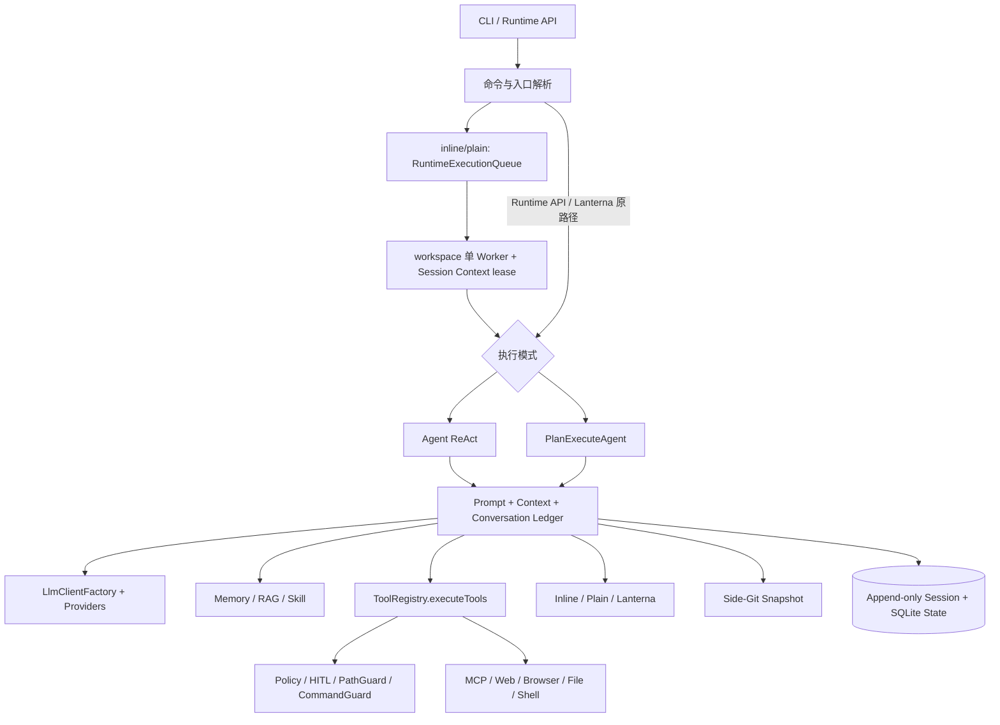

# CodeAgent

[](https://openjdk.org/)
[](https://maven.apache.org/)

面向真实代码库的 Java Agent CLI。CodeAgent 在终端中理解项目、规划任务、调用工具、修改代码并验证结果，同时把权限、安全、会话恢复和上下文管理放在同一套运行时里。

inline/plain CLI 的普通顶层任务会先持久化到本地 Execution 队列，再由无工具 Mode Router 自动选择 ReAct 或多 Agent 协作的 Plan-and-Execute；也可以使用 `/react`、`/plan` 对单轮任务进行显式覆盖。当前任务运行期间仍可继续输入，后续消息会按 Session 序号排队。

> CodeAgent 仍在快速演进。源码与测试是行为真相，路线图只表示后续方向。

## 为什么选择 CodeAgent

- **自动选择执行模式**：简单任务走 ReAct，复杂任务进入 Plan DAG，无需每次手工判断。
- **面向工程任务**：内置文件、代码搜索、命令执行、Web、浏览器、Memory、RAG 和 MCP 工具。
- **统一多 Agent 协作**：Planner 拆解 DAG，Worker 执行，Reviewer 审查；支持依赖调度、冲突感知和失败重试。
- **可靠结构化输出**：Planner、Mode Router、Reviewer 对 JSON contract 做确定性本地校验，格式不合法时最多自动修复一次；已验证的 Provider 还会使用原生 JSON mode / JSON Schema。
- **可恢复的长任务**：会话事件追加写入，Plan 状态持久化到 SQLite，中断后可从 Task 边界继续。
- **本地优先的代码理解**：精确定位优先使用 glob、grep 和文件读取，语义检索默认使用进程内 Qwen3 FP32（1024 维），模型需预先安装。
- **明确的安全边界**：工具调用经过策略、HITL、路径和命令防护；危险操作写入脱敏审计日志。
- **可扩展运行时**：支持 MCP、项目/用户级 Skill、Prompt 覆盖、Runtime API。
- **终端原生体验**：默认 inline 流式界面，保留 transcript，并提供状态栏、折叠工具块和行内 diff。

## 运行要求

必需：

- Java 17 或更高版本
- Maven（建议使用当前稳定版本）
- 至少一个受支持 Provider 的 API Key

可选：

- `ripgrep`：加速 `grep_code`；未安装时自动回退
- Node.js / `npx`：运行默认的 Chrome DevTools MCP
- Chrome：使用浏览器自动化或复用登录态

## 快速开始

### 1. 获取源码

```bash
git clone https://github.com/zgjdev/Code-Agent.git
cd Code-Agent
```

### 2. 创建配置

macOS / Linux：

```bash
cp .env.example .env
```

Windows PowerShell：

```powershell
Copy-Item .env.example .env
```

编辑 `.env`，至少配置一个 Provider。例如：

```dotenv
GLM_API_KEY=your_api_key_here
# GLM_MODEL=glm-5.1
```

也可以配置 DeepSeek、腾讯混元、StepFun、Kimi、FreeLLMAPI、讯飞星辰 MaaS 或 Agnes。完整选项见 [.env.example](.env.example)。

### 3. 构建并启动

```bash
mvn clean package
java -jar target/codeagent-1.0-SNAPSHOT.jar
```

`mvn clean package` 默认跳过测试，以便快速生成可运行 JAR。

启动后可以直接描述任务：

```text
分析这个项目的认证流程，并指出可能的越权路径

为订单服务增加幂等校验，补充测试并更新文档

查找最近一次构建失败的根因，只分析，不修改文件
```

## 执行模式

### 自动路由

默认 inline/plain 终端中的普通顶层输入会先经过 Mode Router：

- Router 只读取原始用户输入和 Parent Session 的顶层对话。
- Router 不注册工具，也不会执行文件、命令或网络操作。
- 输出严格限制为 `REACT` 或 `PLAN`。
- 非取消性失败回退 ReAct；取消或线程中断终止当前 Turn。

Lanterna TUI、Runtime API目前不接入自动路由。

### ReAct

适合定位问题、解释代码、局部修改和可在连续工具反馈中完成的任务。

```text
/react 修复用户查询为空时的异常，并补充回归测试
```

只输入 `/react` 时，下一条任务强制使用 ReAct；覆盖仅对一轮生效。

### Plan-and-Execute

适合跨模块改造、多步骤交付和需要并行协作的复杂任务。

```text
/plan 重构会话恢复机制，保持兼容并补充迁移测试
```

Plan 路径包含：

- Planner 生成任务 DAG
- 人工确认计划
- Conflict-Aware Selector 对可并行任务分批
- Worker 使用独立 task-local 上下文执行
- 确定性证据门禁和 Reviewer 自动评审
- 失败重试、重新规划与 SQLite checkpoint

使用 `/plan resume` 继续当前 Session 的未完成计划，使用 `/plan abandon` 显式放弃。

inline/plain CLI 的 `/plan resume` 会将旧版、尚未绑定 Execution 的活动 Plan 收养到统一队列；已绑定 Execution 的计划随对应任务恢复。恢复保留已完成节点，从未完成的 Task 边界继续，不保证工具副作用恰好执行一次。

## 核心能力

### 代码与终端工具

内置工具覆盖：

- 文件读取、写入和目录浏览
- glob、精确代码搜索和语义辅助检索
- Shell 命令执行与项目创建
- Web 搜索与正文抓取
- 浏览器连接状态管理
- Skill 加载、长期记忆保存和 Side-Git 恢复
- MCP 动态工具

同一轮产生多个工具调用时，CodeAgent 会根据工具名和实际参数在本地推导资源 claim，将冲突调用按原顺序分批；无冲突批次最多并行 4 个调用，并按原始顺序把结果回灌模型。Plan DAG 还会根据 Task 的显式资源声明避免把写冲突任务放进同一批次。

每批完成后会重新解析剩余调用的资源，路径冲突包含硬链接。可能由人工审批修改参数的调用独占执行批次，统一 Web 调用也会检查实际 MCP 后端的审批需求，防止改写目标后与相邻调用竞争；无需审批或已自动放行的调用仍可按资源并行。

### 代码检索与 RAG

CodeAgent 把实时确定性工具与索引式 RAG 分开：

1. `glob_files` 定位候选文件。
2. `grep_code` 精确查找符号和文本。
3. `read_file` 获取必要上下文。
4. `search_code` 在描述模糊时组合 SQLite FTS5 + BM25 关键词检索与 Qwen3 + cosine 语义检索。

词法层规范化中英文、identifier 和 camelCase；查询过滤通用问句词，优先返回全部词项匹配的 BM25 候选，不足时补充任一词项匹配候选并去重。语义层默认使用 Qwen3-Embedding-0.6B ONNX FP32（1024 维）。双路融合统一保留语义候选原序，每四位补充一条关键词候选，不按标识符形状切换优先级。共同命中合并来源，按 chunk 去重，每文件最多三条。字符预算先保留首条，后续优先装入完整片段，再按剩余容量截断暂存片段。Graph 已退出 RAG 融合；符号和关系索引继续服务 `/graph` 与结构地图。远程 Embedding 只有在用户对当前项目和 Provider 明确授权后才会启用，拒绝或故障会自动降级且不影响 FTS。`grep_code` 继续直接搜索当前磁盘，并在 ripgrep 不可用时回退到 Java 实现，不会被 `search_code` 自动调用。

检索还会利用剩余字符预算补充同文件的相关实现：先保留原主片段与顺序，再从扩大的语义候选池中为每个已选文件追加最多两个完整片段，结果标为 `context` 并注明行范围。`search_code` 将预算内正文完整交给 Agent；`/search` 保留简短预览。此优化复用原模型与索引，不需要安装额外重排模型。两个入口均默认 Top10/16000 正文字符，与固定评测配置一致；`search_code` 仍可显式指定 `top_k`（1–30），正文预算保持16000字符。评测数字衡量正文证据覆盖，不等同于最终回答准确率。

首次使用语义检索前，在 PowerShell 执行 `./scripts/install-qwen3-model.ps1`，显式下载并校验固定版本的三个模型文件（约 2.41 GB，未打入 JAR）。默认存放于 `~/.codeagent/models/qwen3-embedding-0.6b/c25a394dd583836952667c12f008335071b3f43d`，可通过 `embedding.localModelDirectory` 或 `EMBEDDING_LOCAL_MODEL_DIR` 指定目录。已有文件可用 `-SourceDirectory <目录>` 离线安装。运行时不联网下载，模型缺失或校验失败仅关闭语义召回，关键词检索仍可用；安装后通过 `/embedding local` 重配，后台自动补齐向量。旧索引保留 FTS，只回填新向量空间。需要回滚时配置 `embedding.mode=local`、`embedding.provider=bge`；长期记忆仍使用 BGE。实验与实施证据见 [模型迁移文档](docs/dev/26-qwen3-embedding-migration.md)。

混合问题按目标和已有线索协作：例如“看一下 store.save()”先实时定位并读取；“保存失败的事务和异常处理”可用 RAG 寻找相关机制。`search_code.query`保留行为描述，`lexical_query`可提供来自问题或已读取源码的词法软线索，不限制语义候选范围；中文夹杂驼峰名称、点号调用等也会自动提取线索。词法线索最多占一半候选池，其余保留原问题关键词补充。RAG 不自动调用 grep，检索请求本身不触发全库回填。

交互式 CLI（inline/plain/TUI）默认在后台维护代码索引：启动时 Hash 校准，保存后去抖更新词法，再异步补齐向量；监听失效或漏事件由每300秒校准兜底。首次启动自动建立词法索引，后续启动复用已有数据并增量更新；模型仍需显式预装。检索诊断 `maintenance_state` 展示更新/补齐状态，`idle` 不保证全库实时新鲜。Runtime API 和 headless 入口不启动后台维护，由宿主显式调用底层索引接口。

部分文件扫描失败时，保留失败诊断及旧索引，正常文件继续补向量；不完整扫描不执行全局缺失删除。向量任务发现源文件过期或读取失败时会安排该路径的词法刷新，避免反复处理旧版本。

可在 `~/.codeagent/config.json` 设置：

```json
{"autoIndex":{"enabled":true,"debounceMillis":1500,"maxDebounceMillis":10000,"reconcileIntervalSeconds":300}}
```

将 `enabled` 设为 `false` 可关闭自动维护，仅查询已有索引。后台不弹远程授权、不下载模型；缺失或故障保留词法索引。队列有界，退出后停止维护，重启重新对账。设计、并发与平台边界见 [40-索引自动维护](docs/dev/40-automatic-code-index-maintenance.md)。

返回结果的`file_freshness`只核对候选文件：`verified`表示检查时内容hash与本次返回片段所绑定的索引版本相同，同进程后台刷新不会用新索引版本验证旧正文；`changed`/`missing`/`unavailable`表示需回到当前源码确认，旧行号不能直接用于修改。`index_empty`表示当前项目没有已索引chunk，不证明项目没有答案；空结果仍带诊断。关键结论和修改前使用`read_file`核实当前实现，避免重复收集相同正文。协作设计与分层评测见 [38-code-search-rag-coordination.md](docs/dev/38-code-search-rag-coordination.md)。

```text
/search 处理请求重试和 Retry-After 的实现
/graph PlanExecuteAgent
```

### 持久化会话与上下文

- 原始会话以 append-only JSONL 保存到 `~/.codeagent/history/sessions/`。
- 默认恢复当前工作区最近的未完成会话。
- Provider Surface 和 Top-level Conversation View 分离维护。
- ReAct 与 Plan 共享顶层语义连续性，但不共享 Task transcript 或隐式权限。
- 上下文接近预算时自动压缩，也可以手动执行 `/compact`。

inline/plain CLI 由 Session Context Registry 管理每个 Session 的 Agent、上下文和 writable 会话句柄。`/new`、`/resume` 在源或目标 Session 有非终态任务时拒绝切换；共享运行态正被其他 Session 执行使用时，也会拒绝修改会话或运行配置。退出会停止当前执行并保留可恢复的非终态任务，相关 Session 保持未关闭；恢复任务不会因关闭终端而继续在独立服务中运行。

常用命令：

```text
/sessions
/resume [last|<session-id>]
/new
/clear
/compact
/export
```

如需每次启动新会话：

```dotenv
CODEAGENT_SESSION_RESUME=off
```

### Memory、项目规则与 Skill

项目规则按以下位置加载：

- `CODEAGENT.md` 或 `.codeagent/CODEAGENT.md`：可提交的团队规则
- `CODEAGENT.local.md` 或 `.codeagent/CODEAGENT.local.md`：本地覆盖

长期记忆不会自动从普通对话中提取。只有用户明确要求记住/更新，或执行 `/save` 时才会写入。检索使用词法 + 本地 BGE 混合召回；同义重复会 no-op，用户明确改变旧偏好/事实时旧记忆会保留为 superseded 历史，新事实成为 active。长期记忆事实持久化在 `~/.codeagent/memory/memory.db`，每条记忆独立行写入；SQLite 使用 WAL + 事务处理并发写入。旧 `long_term_memory.json` 首次升级时一次性迁移，成功后不再作为事实源；BGE embedding 仍只存在进程缓存，不写入 SQLite。

```text
/memory
/memory list
/memory search <关键词>
/save <事实>
/save --global <事实>
```

Skill 按“内置 < 用户级 < 项目级”的优先级加载：

```text
src/main/resources/skills/
~/.codeagent/skills/<name>/
<project>/.codeagent/skills/<name>/
```

```text
/skill list
/skill show <name>
/skill on <name>
/skill off <name>
/skill reload
```

### MCP 与浏览器

CodeAgent 支持 MCP stdio 和 Streamable HTTP：

- 用户级配置：`~/.codeagent/mcp.json`
- 项目级配置：`.codeagent/mcp.json`
- 项目配置按 server 名覆盖用户配置

最小配置示例：

```json
{
  "mcpServers": {
    "chrome-devtools": {
      "command": "npx",
      "args": ["-y", "chrome-devtools-mcp@latest", "--isolated=true"]
    },
    "remote": {
      "url": "https://mcp.example.com/v1",
      "headers": {
        "Authorization": "Bearer ${REMOTE_TOKEN}"
      }
    }
  }
}
```

支持 `${PROJECT_DIR}`、`${HOME}` 和 `${VAR}` 展开。MCP 工具统一命名为 `mcp__{server}__{tool}`，并经过与内置工具相同的策略、审批和审计链。

交互式 CLI 启动时会同时启动已启用的 stdio/HTTP MCP Server。首屏默认最多等待 8 秒；尚未完成的 Server 保持 `starting` 并在后台继续初始化，可通过 `/mcp` 和 `/mcp logs <name>` 查看。Runtime API/后台 headless 任务不会单独创建 MCP Server Manager，因此不能依赖只存在于 MCP 的后端。

```text
/mcp
/mcp restart <name>
/mcp logs <name>
/mcp resources <name>
/mcp prompts <name>
```

浏览器默认使用隔离 profile。需要访问当前 Chrome 登录态时：

```text
/browser connect
/browser tabs
/browser disconnect
```

shared 模式不会自动取得任意标签页的操作权限；敏感页面上的点击、填写和脚本执行仍需单步审批。

### Web 访问

模型只会看到 `web_search` 和 `web_fetch`。所有模型默认调用 AnySearch MCP 的 `search` / `extract`；连接失败、超时、HTTP 5xx 或服务未就绪时，各自最多降级一次到 Step MCP 的 `web_search` / `web_fetch`。认证、额度、业务错误、策略/HITL拒绝及取消不触发降级。SearchProvider 和 direct HTTP 门面已移除。

默认无需配置后端，等价于：

```json
{"webTools":{"search":{"backend":"auto","onUnavailable":"step"},"fetch":{"backend":"auto","onUnavailable":"step"}}}
```

显式 `backend=mcp` 可指定对应 AnySearch 或 Step 工具；`onUnavailable=fail` 禁止降级，旧 `default` 是 `step` 兼容别名。旧 provider/direct 或自定义 Web MCP 配置返回迁移错误。旧 SEARCH_PROVIDER/SERPAPI_KEY/SEARXNG_URL 不再参与搜索；GLM_API_KEY 仍用于 LLM。

交互式 CLI 默认内置 `anysearch`；`ANYSEARCH_API_KEY` 可选，无密钥使用受限匿名访问。设置 `STEP_API_KEY` 后内置 `step_search`，通过普通 API MCP 地址 `https://api.stepfun.com/v1/mcp/web_search/mcp` 提供搜索和抓取降级。用户/项目 `mcp.json` 的同名配置优先，包括 disabled。两家原始 Web 工具保留内部注册，不发给模型；没有 MCP Manager 的 Runtime/headless 入口返回不可用。不自动注册账户或更换密钥。

AnySearch 搜索返回标题、链接和摘要，专用解析器仅在完整包络校验后发布结果 URL；Step 仅接受 MCP `structuredContent.results[].url`。摘要链接、异常格式和抓取正文不生成授权。AnySearch 的 Markdown 契约改变会停止授信；完整格式伪造仍是已知风险。抓取按 `max_chars` 本地截断正文。

抓取继续校验请求 URL 的协议与私网地址，审批改参后再次校验。页面请求由远程 MCP 服务发出，本地无法约束其重定向或验证远端 DNS；`max_chars` 约束返回给模型的正文，不是网络响应上限。Chrome DevTools MCP 保留独立浏览器能力。

URL 授权只来自：

- 顶层用户原文中的 URL
- 成功 `web_search` 返回的结构化 URL

搜索摘要、网页正文、普通工具输出和模型回复中的链接不会自动获得新的访问权限。

### 图片输入

支持终端粘贴图片和显式引用：

```text
@image:file:///absolute/path/to/image.png
@image:relative/path.png
```

图片会在发送前进行格式识别、透明背景处理、尺寸限制和压缩。不支持图片输入的 Provider 会保留文字上下文并省略图片 payload。

### Runtime API 与统一执行队列

inline/plain CLI 的普通输入、`/react <任务>`、`/plan <任务>` 和 `/task add <任务>` 共用本地 SQLite `runtime_executions` 队列。`/task` 现在是统一 Execution 的查询与控制兼容入口：

```text
/task
/task add <任务内容>
/task cancel <execution-id>
/task log <execution-id>
```

当前 workspace 的顶层 Execution 严格串行；Plan 内部仍可按资源声明并行执行最多 4 个无冲突 DAG 节点。`/cancel` 取消当前 RUNNING Execution。Lanterna TUI、Runtime HTTP API 暂未接入该队列。

Agent 运行时可以直接输入下一条任务并回车，无需 `/task add`。新任务排队等待，开始执行时读取前序任务完成后的最新 Session 上下文；它不会中途修改正在运行的任务。等待 HITL 审批或 Plan 人工评审时，普通输入优先作为交互回答处理，无效审批输入不会变成任务；此时使用 `/task add <任务>` 可以明确追加任务。

实现与恢复限制见 [统一后台执行运行时](docs/dev/31-unified-background-execution-runtime.md)。

Runtime API 仅监听 loopback，并强制要求 API Key：

```bash
CODEAGENT_RUNTIME_API_KEY=your_local_api_key \
  java -jar target/codeagent-1.0-SNAPSHOT.jar serve --http --port 8080
```

主要端点：

- `POST /v1/threads`
- `POST /v1/threads/{id}/turns`
- `GET /v1/threads/{id}/events`

## Provider

| Provider | 配置前缀 | `/model` 示例 | 备注 |
|---|---|---|---|
| GLM | `GLM_*` | `/model glm-5.1` | 支持 GLM 多模态模型 |
| DeepSeek | `DEEPSEEK_*` | `/model deepseek` | 支持 reasoning 回传 |
| 腾讯混元 | `HUNYUAN_*` | `/model hunyuan` | 默认 TokenHub OpenAI-compatible 接口 |
| StepFun | `STEP_*` | `/model step` | 可配置普通或 Plan 通道 |
| Kimi / Moonshot | `KIMI_*` / `MOONSHOT_*` | `/model kimi` | 支持 reasoning 回传 |
| FreeLLMAPI | `FREELLMAPI_*` | `/model freellmapi` | 默认连接本地兼容网关 |
| 讯飞星辰 MaaS | `XFYUN_MAAS_*` | `/model xfyun` | 支持 MaaS modelId 和 LoRA ID |
| Agnes AI | `AGNES_*` | `/model agnes` | OpenAI-compatible |

Provider、模型和 Base URL 可以通过 `.env`、用户配置以及 `/config provider ...` 管理。不要提交包含真实密钥的 `.env`。

## 安全模型

工具执行链固定为：

```text
TurnToolPolicy → HitlToolRegistry → ToolRegistry → PathGuard / CommandGuard
```

- 策略拒绝先于人工审批，用户不能批准已经被策略拒绝的调用。
- HITL 可用 `/hitl on` 开启，支持批准、拒绝、跳过和修改参数。
- 写文件、执行命令、创建项目、恢复快照以及 MCP 工具会进入审计链。
- 路径防护阻止项目外写入和符号链接逃逸。
- URL 来源、浏览器 tab 所有权和敏感页面操作都有独立约束。
- Side-Git 快照与系统 Git 分离，恢复前先创建 pre-restore 快照。

```text
/hitl on
/policy
/audit [N]
/snapshot
/restore <N>
```

> 本地 Agent CLI 不是容器或虚拟机沙箱。运行前应理解工具权限，并在处理不可信仓库时开启 HITL。

## 数据目录

默认运行数据保存在用户目录下：

| 路径 | 内容 |
|---|---|
| `~/.codeagent/config.json` | Provider、模型与 Web Tool 路由配置 |
| `~/.codeagent/history/` | 持久化会话与事件日志 |
| `~/.codeagent/plans/plans.db` | Plan DAG checkpoint |
| `~/.codeagent/memory/memory.db` | 长期记忆事实与生命周期状态 |
| `~/.codeagent/tasks/tasks.db` | inline/plain CLI 的统一 Runtime Execution 队列；旧 `runtime_tasks` 只迁移为 legacy row |
| `~/.codeagent/snapshots/` | Side-Git 快照 |
| `~/.codeagent/logs/` | 运行日志 |
| `~/.codeagent/audit/` | 危险工具审计 JSONL |
| `~/.codeagent/skills/` | 用户级 Skill |
| `~/.codeagent/exports/` | 会话导出 |

raw session、日志和导出可能包含敏感内容，请勿提交或公开复制。

## 架构概览


```mermaid
graph TB
    CLI[CLI / Runtime API] --> ENTRY[命令与入口解析]
    ENTRY --> QUEUE[inline/plain: RuntimeExecutionQueue]
    QUEUE --> WORKER[workspace 单 Worker + Session Context lease]
    WORKER --> MODE{执行模式}
    ENTRY -->|Runtime API / Lanterna 原路径| MODE
    MODE --> REACT[Agent ReAct]
    MODE --> PLAN[PlanExecuteAgent]
    REACT --> CORE[Prompt + Context + Conversation Ledger]
    PLAN --> CORE
    CORE --> LLM[LlmClientFactory + Providers]
    CORE --> MEMORY[Memory / RAG / Skill]
    CORE --> TOOLS[ToolRegistry.executeTools]
    TOOLS --> POLICY[Policy / HITL / PathGuard / CommandGuard]
    TOOLS --> EXT[MCP / Web / Browser / File / Shell]
    CORE --> RENDER[Inline / Plain / Lanterna]
    CORE --> SNAP[Side-Git Snapshot]
    CORE --> SESSION[(Append-only Session + SQLite State)]
```

依赖方向遵循：入口 → Agent/Plan → Tool/Policy/LLM/Memory → 基础设施。两条执行路径共享工具、策略、上下文、快照和渲染基础设施。

## 常用命令

| 类别 | 命令 |
|---|---|
| 模式 | `/react [任务]`、`/plan [任务]`、`/plan resume`、`/plan abandon` |
| 会话 | `/sessions`、`/resume <id>`、`/new`、`/clear`、`/compact`、`/export` |
| 模型 | `/model [provider或model]`、`/config`、`/context` |
| 安全 | `/hitl on|off`、`/policy`、`/audit [N]`、`/snapshot`、`/restore <N>` |
| 代码理解 | `/search <查询>`、`/graph <类名>` |
| Memory | `/memory`、`/memory list`、`/memory search <词>`、`/save [--global] <事实>` |
| MCP/浏览器 | `/mcp`、`/mcp logs <name>`、`/browser connect`、`/browser tabs` |
| Skill | `/skill list`、`/skill show <name>`、`/skill on|off <name>` |
| 执行队列 | `/task`、`/task add <任务>`、`/task cancel <execution-id>`、`/task log <execution-id>` |
| 其他 | `/init`、`/cancel`、`/history clear`、`/better-harness`、`/exit` |

输入 `/` 后可通过终端补全查看完整命令和说明。未知斜杠命令会在 CLI 层报错，不会作为普通任务发送给模型。

## 渲染器

默认使用 inline renderer：

```dotenv
CODEAGENT_RENDERER=inline
```

其他模式：

```dotenv
CODEAGENT_RENDERER=plain
CODEAGENT_RENDERER=lanterna
CODEAGENT_NO_STATUSBAR=true
NO_COLOR=1
```

inline/plain 是普通顶层任务自动路由的主要入口；Lanterna 保留为可选全屏 TUI。

## 项目结构

```text
src/main/java/com/codeagent/
├── agent/       ReAct、PlanExecuteAgent、SubAgent
├── cli/         CLI 入口、命令解析与交互接线
├── context/     请求快照与上下文预算
├── history/     Session ledger、projection 与恢复
├── llm/         Provider 客户端与统一工厂
├── mcp/         MCP 协议、传输、resources 与通知
├── memory/      长期记忆和压缩
├── plan/        DAG、调度、评审与持久化
├── policy/      安全策略与审计
├── rag/         索引、检索与 Embedding
├── render/      inline/plain 渲染器
├── runtime/     统一执行队列、交互 Broker 与 Runtime API
├── skill/       Skill 发现、加载和状态
├── snapshot/    Side-Git 快照
├── tool/        工具注册与统一执行入口
├── tui/         Lanterna TUI
└── web/         搜索与正文抓取

src/main/resources/
├── prompts/     分层系统提示词
└── skills/      内置 Skill

src/test/java/   自动化测试
docs/
├── implementation/  核心实现过程（9篇）
├── dev/             功能改造、实验与验收记录
└── superpowers/     历史工作流记录
```

## 开发与验证

```bash
# 常规快速回归
mvn test -Pquick

# 完整测试
mvn test -DskipTests=false

# TUI 冒烟测试
mvn test -Pphase16-smoke

# 构建可运行 JAR（默认跳过测试）
mvn clean package
```

提交改动前请阅读 [AGENTS.md](AGENTS.md)。它定义了架构边界、开发生命周期、验证矩阵和文档联动要求。

## 进一步阅读

核心实现过程按从零搭建的依赖顺序整理为九篇：

1. [运行时与Agent基础](docs/implementation/01-runtime-and-agent-foundation.md)
2. [工具、安全与恢复](docs/implementation/02-tools-policy-and-recovery.md)
3. [上下文、记忆与检索](docs/implementation/03-context-memory-and-retrieval.md)
4. [MCP与Web接入](docs/implementation/04-mcp-and-web-integration.md)
5. [浏览器会话与隔离](docs/implementation/05-browser-session-and-guard.md)
6. [Skill与Prompt装配](docs/implementation/06-skills-and-prompt-assembly.md)
7. [终端渲染与输入](docs/implementation/07-terminal-rendering-and-input.md)
8. [Runtime API](docs/implementation/08-runtime-api.md)
9. [验证与评测](docs/implementation/09-verification-and-evaluation.md)

各次功能改造、实验和验收保留在 [docs/dev](docs/dev/)。

- [第三方组件声明](THIRD_PARTY_NOTICES.md)

## 贡献

欢迎通过 Issue 或 Pull Request 参与。提交前请确保：

- 行为与源码、测试和文档保持一致。
- 新命令同步更新 parser、completer、测试和文档。
- 工具仍通过统一策略与执行入口。
- 不提交 `.env`、API Key、运行日志、raw session 或构建产物。
- 根据改动范围运行相应验证，并在 PR 中记录真实结果。

## License

当前仓库尚未提供项目级 `LICENSE` 文件。在许可证明确之前，请勿假设代码可以被任意复制、修改或再分发。第三方组件信息见 [THIRD_PARTY_NOTICES.md](THIRD_PARTY_NOTICES.md)。
