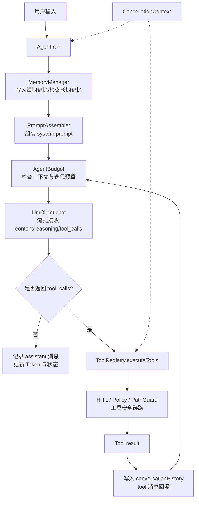
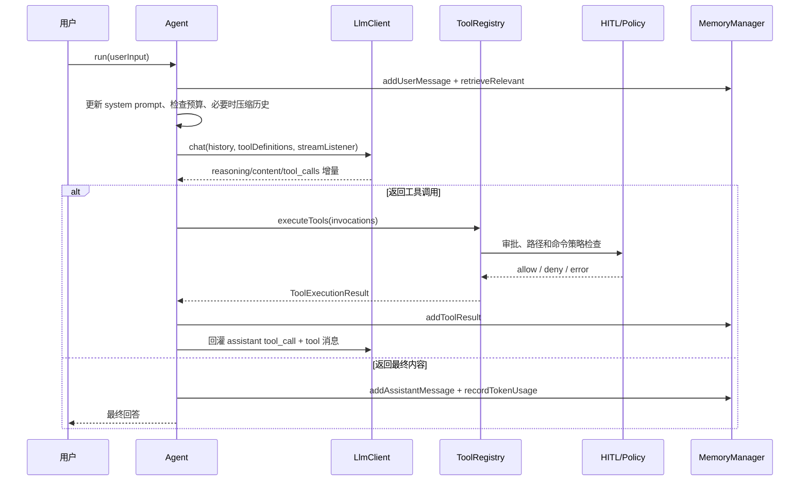
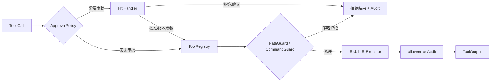

# ReAct Agent 执行框架

## 1. 功能定位

`Agent` 是 CodeAgent 默认的单 Agent 执行入口，负责把一次用户请求转换成可持续推进的「推理—行动」循环：维护多轮对话历史，调用 `LlmClient` 获取模型输出，在模型返回 `tool_calls` 时交给 `ToolRegistry` 执行，再把工具结果以 `tool` 消息回灌给模型，直到模型返回最终回答、任务被取消或兜底预算触发。

- 源码入口：`Agent.run(String)` — `src/main/java/com/codeagent/agent/Agent.java:127`
- 主循环：`Agent.java:153`
- 工具执行入口：`ToolRegistry.executeTools(List)` — `src/main/java/com/codeagent/tool/ToolRegistry.java:1196`

覆盖的工具范围包括文件读写、目录与代码搜索、Shell 命令、RAG 语义检索、联网、浏览器、Memory、Skill 和快照。工具能力统一由注册表暴露，`Agent` 本身不为任何一类工具写分支。

## 2. 设计意图

### 2.1 一次普通 Chat 调用解决不了什么

一次普通的 Chat Completions 调用只有输入和输出，可以回答问题，但无法可靠完成需要外部状态的任务。

例如「定位登录失败原因并修复代码」至少包含：查找登录模块 → 读取相关类 → 搜索异常信息 → 判断根因 → 修改文件 → 运行测试 → 根据测试结果继续修改。这些动作不是一次文本生成能完成的，模型必须在执行过程中观察真实结果再决定下一步。

ReAct 的意图就是把一次性问答变成**受控的反馈循环**。

### 2.2 CodeAgent 中的 ReAct 定义

这里的 ReAct **不是**让模型输出固定格式的 `Thought/Action/Observation` 文本，而是直接依赖模型原生 Tool Calling 协议：

- `reasoning` — 模型的推理增量
- `content` — 面向用户的正文增量
- `tool_calls` — 模型选择的工具及 JSON 参数
- `tool` message — 执行环境返回的观察结果

运行时只负责维护协议、执行工具、控制边界；**具体下一步由模型根据完整消息历史决定**。

### 2.3 为什么循环写在 Agent 而不是 LlmClient

`LlmClient` 的职责是一次模型请求，`Agent` 的职责是多次模型请求之间的状态推进。把循环写进 Provider Client 会产生三个问题：每个 Provider 都要重复工具调度逻辑；记忆、安全和取消能力难以复用；Provider 协议差异会污染 Agent 业务状态。因此系统把「单次推理」和「多步执行」分层。

## 3. 总体架构与关键流程

### 3.1 总体架构



核心依赖关系：

- `Agent` — 维护 ReAct 主循环和对话历史（`Agent.java:45`）
- `LlmClient` — 统一模型请求、流式事件、Tool Call 和 Token 用量（`src/main/java/com/codeagent/llm/LlmClient.java`）
- `ToolRegistry` — 注册内置工具和动态 MCP 工具，并统一执行入口
- `MemoryManager` — 管理短期记忆、长期记忆和上下文预算
- `PromptAssembler` — 按模式、审批策略、项目上下文和 Skill 组装 Prompt（`Agent.java:313`）
- `ConversationHistoryCompactor` — 在上下文接近阈值时压缩历史（`Agent.java:323`）
- `Renderer` — 把 reasoning、工具调用和最终内容输出到 CLI 渲染层

### 3.2 一轮请求时序



### 3.3 核心对象与职责边界

#### Agent

`Agent` 是用例协调者，持有的运行状态（`Agent.java:47-58`）：

| 字段 | 类型 | 作用 |
|---|---|---|
| `llmClient` | `LlmClient` | 当前模型 Provider |
| `toolRegistry` | `ToolRegistry` | 工具定义与执行入口 |
| `conversationHistory` | `List<Message>` | 实际发送给模型的协议历史 |
| `memoryManager` | `MemoryManager` | 短期、长期记忆与 Token 统计 |
| `historyCompactor` | `ConversationHistoryCompactor` | 对真实请求历史做压缩 |
| `skillRegistry` | `SkillRegistry` | 当前可用 Skill 索引 |
| `skillContextBuffer` | `SkillContextBuffer` | 下一轮待注入 Skill 正文 |
| `renderer` | `Renderer` | 终端输出抽象 |

`Agent` 不直接实现文件系统、网络或 Shell 操作，这些副作用全部交给工具层。

注意 `conversationHistory` 是 `ArrayList`，由 `Agent` 单线程持有，**没有加锁**。这是后面「并行工具」一节能安全并发的前提：并发只发生在工具执行阶段，消息历史的读写在主循环单线程完成。

#### LlmClient

`LlmClient` 定义一次聊天请求的最小协议（接口 `LlmClient.java:9`，`chat` 方法 `LlmClient.java:11-13`）。

输入由两部分组成：`List<Message>`（system/user/assistant/tool 消息）和 `List<Tool>`（模型可选的工具 Schema）。

输出 `ChatResponse`（`LlmClient.java:204`）包含 `role`、`content`、`reasoningContent`、`toolCalls`、`inputTokens`、`outputTokens`、`cachedInputTokens`。

该接口还声明 Provider 能力：最大上下文窗口、是否支持 Prompt Cache、是否支持原生工具调用（`LlmClient.java:27`）、是否支持图片输入（`LlmClient.java:31`）。

`Message` 的工厂方法决定了消息协议形态（`LlmClient.java:73-102`）：`system` / `user(String)` / `user(List<ContentPart>)` / `assistant(String)` / `assistant(reasoning, content)` / `assistant(content, toolCalls)` / `assistant(reasoning, content, toolCalls)` / `tool(toolCallId, content)`。

#### ToolRegistry

`ToolRegistry` 同时承担三项职责：维护工具元数据、把 JSON 参数映射为具体操作、统一处理并发、超时、取消和审计。内置工具在构造阶段注册，MCP 工具在 Server 启动后动态注册。`Agent` 只依赖统一的 `getToolDefinitions()` 和 `executeTools()`。

#### AgentBudget

`AgentBudget`（`src/main/java/com/codeagent/agent/AgentBudget.java`）是主循环的**兜底保险阀**，设计目标是把「是否继续下一轮」的主导权交给 LLM 自己。

它记录当前迭代次数、累计输入/输出/cached Token、最近工具调用签名（`AgentBudget.java:49-54`），并提供四个退出原因（`AgentBudget.java:35-40`）：`WITHIN_BUDGET`、`TOKEN_BUDGET_EXCEEDED`、`STAGNATION_DETECTED`、`HARD_ITERATION_LIMIT`。

#### Renderer

`Renderer` 把运行时逻辑与终端表现分开。Agent 只发出语义事件：开始 thinking、reasoning 增量、content 增量、工具调用列表、工具结果摘要、状态栏更新。Inline、Lanterna 和 Plain 模式可以使用不同表现方式。

### 3.4 Agent.run 完整调用链

#### 入参准备（`Agent.java:128-132`）

1. 记录输入长度日志。
2. 调用 `pruneHistoricalImagePayloads()`（`Agent.java:336`）——把历史消息里的图片 `ContentPart` 移除，并替换成一条「图片附件已省略 N 张」的文本提示（`LlmClient.java:131-151`）。目的是避免同一张历史截图在后续每一轮重复计费。
3. 把用户输入写入短期记忆。
4. `storeExplicitBrowserMemoryHint()`（`Agent.java:420`）——如果输入命中浏览器登录记忆提示，写入一条 **global 作用域**的长期事实。

#### 检索记忆并重建 system prompt（`Agent.java:135-137`）

从 `ContextProfile` 读取记忆上下文预算，调用 `MemoryManager.buildContextForQuery()` 检索相关记忆。检索结果**不追加成普通聊天消息**，而是通过 `updateSystemPromptWithMemory()`（`Agent.java:309`）整体替换 `conversationHistory[0]`。这样既保持角色语义稳定，也便于下一轮替换掉旧检索结果。

#### 注入 Skill 与图片引用（`Agent.java:140-143`）

`prependSkillBodies()`（`Agent.java:375`）drain `SkillContextBuffer`，把 Skill 正文前置到本轮用户输入之前，只注入一次。之后由 `ImageReferenceParser.userMessage()` 解析 `@image:` 引用：纯文本消息保持字符串 content，含图消息转换为 `ContentPart` 列表。

#### 主循环（`Agent.java:153-259`）

进入 `while (true)`。每次迭代开始前依次执行：

1. **取消检查**（`Agent.java:154`）——已取消则推送 idle 状态并返回「已取消当前任务」。
2. **注入 LSP 诊断**（`Agent.java:162` → `355`）——把待处理的 LSP 诊断作为一条 user 消息追加进历史。
3. **评估是否压缩历史**（`Agent.java:163` → `323`）——按 `ContextProfile.compressionTriggerTokens()` 判断，必要时压缩。
4. **检查兜底预算**（`Agent.java:164`）——非 `WITHIN_BUDGET` 时返回 `"❌ " + budget.describeExit(reason)`。
5. 递增迭代计数（`Agent.java:174`）。
6. 取工具定义（`Agent.java:177`）——**仅当 `llmClient.supportsTools()` 才取，否则传 `null`**。
7. 调用 `llmClient.chat(conversationHistory, toolDefinitions, streamRenderer)`（`Agent.java:183`）。
8. LLM 返回后**再次检查取消**（`Agent.java:189`）。
9. 累计 Token 用量（`Agent.java:196`）。

#### 分支 A：模型返回工具调用（`Agent.java:199-226`）

1. 保存 reasoning 到本轮 transcript（`Agent.java:200`）。
2. 用工具调用签名喂给停滞检测（`Agent.java:202`）。
3. 把 assistant 消息连同 `tool_calls` 写入历史（`Agent.java:204`）——**这一步不可省**，见 §3.6.4。
4. `streamRenderer.resetBetweenIterations()`（`Agent.java:213`）flush 当前流式片段。
5. 把工具调用交给 Renderer 展示（`Agent.java:214`）。
6. `executeToolCalls()` 批量执行（`Agent.java:216` → `653`）。
7. 逐个结果双写：`memoryManager.addToolResult(name, result)` 写入短期记忆，`conversationHistory.add(Message.tool(id, result))` 写入协议历史（`Agent.java:217-220`）。**注意两者拿到的是同一份完整结果**，截断只发生在 `MemoryManager` 内部。
8. `appendImageToolMessages()`（`Agent.java:221` → `763`）——若某工具结果带图片 part，在文本 tool 消息之后**再追加一条 user 消息**承载图片。
9. `continue` 回到循环顶部。

#### 分支 B：模型返回最终内容（`Agent.java:228-252`）

1. 保存最终 reasoning。
2. 追加 assistant 正文消息（`Agent.java:230`）。
3. 写入短期记忆。
4. 记录累计 Token 用量。
5. 状态切回 idle。
6. 收尾流式 Renderer。
7. 返回结果：若本轮有流式输出且未开启 `returnFinalResponseWhenStreamed`，返回空字符串（内容已经实时打印过）；否则返回 `formatUserFacingResponse(reasoning, content)`（`Agent.java:778`）。

#### 异常路径（`Agent.java:254-258`）

`try` 块覆盖整个迭代体，`catch (IOException e)` 记录日志、收尾流式区域并返回 `"❌ 调用 LLM 失败: " + e.getMessage()`——**直接退出整个 run，不重试、不伪造工具结果**。

### 3.5 主循环控制骨架

```text
准备当前轮：更新记忆与 system prompt，追加 user message
while 未结束:
    先检查取消、注入 LSP 诊断、压缩历史、检查兜底预算
    递增迭代计数，取工具定义
    调用 LLM，并累计 usage
    如果返回 tool calls:
        保存 assistant tool_calls
        批量执行工具，按原顺序回灌 tool results
        continue
    保存最终 assistant message 并返回
```

这个骨架的重点不是语法，而是退出条件：模型不再请求工具时正常完成；取消、停滞、Token 预算、硬轮数上限可以提前结束。工具失败通常作为结果回灌，让模型决定修正参数、换工具或解释失败，而不是在执行层终止整轮。

### 3.6 工具调用协议详解

#### 3.6.1 工具定义如何提供给模型

`ToolRegistry.getToolDefinitions()` 遍历内置工具和 MCP 工具，每个定义包含唯一工具名、面向模型的描述和 JSON Schema 参数。MCP 工具名使用 `mcp__{server}__{tool}` 命名空间，避免不同 Server 的同名工具互相覆盖。

不支持原生工具调用的 Provider 会收到 `null` 工具列表（`Agent.java:177-179`），`PromptAssembler` 同时移除工具章节，避免模型伪造工具标签。

#### 3.6.2 Tool Call 增量如何合并

流式模型可能把一个 Tool Call 拆成多个 SSE chunk：第一个 chunk 只含 ID，后续 chunk 分别携带函数名和 arguments 字符串片段。`AbstractOpenAiCompatibleClient` 使用 accumulator 按 `index` 合并：

```text
chunk 1: index=0, id=call_1, name="read"
chunk 2: index=0, arguments="{\"pa"
chunk 3: index=0, arguments="th\":\"A.java\"}"

result: ToolCall(
    id="call_1",
    name="read",
    arguments="{\"path\":\"A.java\"}"
)
```

这一步必须保留字符串拼接顺序，**不能对每个 SSE chunk 独立解析 JSON 参数**。

#### 3.6.3 多工具并发

`ToolRegistry.executeTools()`（`ToolRegistry.java:1196`）分两条路径：

- **单个调用**（`ToolRegistry.java:1205-1210`）：**直接在调用线程内联执行**，不创建线程池。这是常见路径，省掉线程创建开销。
- **多个调用**（`ToolRegistry.java:1212-1217`）：创建固定线程池，并发度为 `min(invocations.size, MAX_PARALLEL_TOOLS)`，即**最多 4 路并行**；线程为 daemon，命名 `codeagent-tool-executor`。

`invokeAll(tasks, timeout, unit)`（`ToolRegistry.java:1232`）返回的 Future 列表与输入任务列表**同序**，结果按下标逐个读取（`ToolRegistry.java:1235-1255`）。因此即使第二个工具先完成，最终结果仍位于第二个位置——这是消息协议稳定性的关键。

工具执行前和方法内部各有一次取消检查（`ToolRegistry.java:1200`、`1222`），取消时直接返回失败结果而不实际执行。

#### 3.6.4 Tool result 的错误语义

工具执行失败**不会**直接抛回 Agent 主循环，而是被转换成结构化 `ToolExecutionResult`：

| 情况 | 结果类型 | 源码位置 |
|---|---|---|
| 超过批次超时，Future 被取消 | `timedOut` | `ToolRegistry.java:1238-1241` |
| 工具抛异常 | `failed`，取 `cause.getMessage()` | `ToolRegistry.java:1248-1254` |
| 执行中被中断 | `failed`（并恢复中断标志） | `ToolRegistry.java:1245-1247` |
| 取消后再执行 | `failed`「用户取消了此次工具调用」 | `ToolRegistry.java:1200-1204` |

错误文本仍作为 tool message 回灌给模型，模型可以修正参数后重试、改用其他工具、向用户说明限制或停止执行。

**为什么必须保存 assistant 的 `tool_calls` 消息**：OpenAI-compatible 协议要求 `tool` 消息通过 `tool_call_id` 引用先前 assistant 消息中声明的调用。缺失该 assistant 消息会破坏协议序列，下一轮可能被 Provider 判定为非法请求。

### 3.7 流式输出设计

#### 3.7.1 StreamRenderer 的状态机

`StreamRenderer`（`Agent.java:815`）实现 `LlmClient.StreamListener`，把 `reasoning_content` 与 `content` 分区展示。终端是线性的、无法回头修改已写出的文字，因此它维护了若干状态位和三个缓冲区：

| 缓冲区 | 用途 |
|---|---|
| `pendingReasoning` | 尚未决定是否展示的 reasoning 增量 |
| `visibleReasoning` | 已展示的 reasoning，用于生成 thinking 引用块 |
| `lateReasoning` | content 开始**之后**才到达的 reasoning |

关键规则：

1. **`content` 出现之前**，reasoning 只要有实质内容（非空白）就流式打印在「🧠 思考过程」下；同一次用户输入只打印一次该标题。
2. **纯空白的 reasoning delta 先暂存**，不触发标题——避免出现空的「思考过程」。
3. 非 thinking-panel 路径还要求 pending 内容**已包含换行**才打印标题（`Agent.java:898-900`），同样是为了不产生孤立标题。
4. **`content` 一出现就收尾 reasoning 区**，用低调标记进入正文（`Agent.java:937`）。
5. **`lateReasoning` 兜底**（`Agent.java:877-881`）：如果服务器把思考内容追加在答案之后，这些 delta 被缓冲，最终在 `resetBetweenIterations()`（`Agent.java:970-979`）或 `finish()`（`Agent.java:1005-1014`）里以「🧠 补充思考」标题独立展示，**不会污染回复区**。

#### 3.7.2 工具调用时为什么要重置 Renderer

一轮 LLM 响应可能先输出 reasoning、随后请求工具。如果不结束当前 Markdown 缓冲区，HITL 提示可能插入到尚未 flush 的文本中间，造成标题和内容错位。

`resetBetweenIterations()`（`Agent.java:953`）会 flush 当前 reasoning/content、清理 live thinking 区域、为下一轮创建新的 Markdown Renderer，并重置所有状态位。它**不会清空已经写入 transcript 的正文**。

#### 3.7.3 流式输出的返回值

CLI 中正文已经通过 Renderer 输出时，默认返回空字符串，不再重复打印（`Agent.java:247-250`）。非交互通道可以设置 `returnFinalResponseWhenStreamed`，这样微信或 Runtime API 能拿到完整结果，同时终端仍可流式展示。

### 3.8 取消、超时和预算控制

#### 3.8.1 取消模型

`CancellationContext`（`src/main/java/com/codeagent/runtime/CancellationContext.java`）同时维护全局引用和 `InheritableThreadLocal`：主线程创建 `CancellationToken`，子线程能继承同一个 Token，因此工具线程和后台执行线程可以观察同一取消信号。

取消是**协作式**的——系统在安全检查点主动读取状态，而不是随时强杀 Java 线程。当前检查点有两处：迭代开始前（`Agent.java:154`）和 LLM 返回后（`Agent.java:189`），工具层另有两处（`ToolRegistry.java:1200`、`1222`）。

#### 3.8.2 命令超时

`execute_command` 使用 `Process.waitFor(timeout)`，超时后调用 `destroyForcibly()`（`ToolRegistry.java:1316` 等三处）。输出读取由独立线程处理，避免进程输出缓冲区塞满后互相等待；读取本身也有超时，超时返回「(命令已结束，但输出读取超时)」（`ToolRegistry.java:1368`）。

命令输出会被截断到 `MAX_COMMAND_OUTPUT_CHARS` 并追加「...(输出已截断)」（`ToolRegistry.java:1346-1358`）。

#### 3.8.3 工具批次超时

多个工具通过 `invokeAll(tasks, toolBatchTimeoutSeconds, unit)` 执行（`ToolRegistry.java:1232`）。超时的 Future 被标记为 canceled，工具层为其生成 `timedOut` 结果。**已完成工具的结果不会因同批次其他工具超时而丢失**，因为结果是在 `invokeAll` 返回后按下标逐个读取的。

批次超时默认值由构造函数派生：`max(commandTimeout + 5, 默认批次超时)`（`ToolRegistry.java:112`），保证批次超时不会早于单条命令超时触发。

#### 3.8.4 兜底预算与停滞检测

`AgentBudget` 提供三道保险阀，**按「先到先触发」判定**，`check()` 内的检查顺序是固定的（`AgentBudget.java:123-134`）：

1. `STAGNATION_DETECTED` —— 停滞状态已置位
2. `TOKEN_BUDGET_EXCEEDED` —— 累计 input + output 超过预算
3. `HARD_ITERATION_LIMIT` —— 累计迭代轮数达到上限

停滞检测的实现（`AgentBudget.java:107`）：把每轮工具调用规范化成「工具名|参数;」的签名字符串，保留最近 `stagnationWindow` 条；当窗口填满且**所有签名完全相同**时才置位停滞标志（`AgentBudget.java:117-120`）。一旦置位便保持，后续 `check()` 持续返回停滞。注意：**模型返回空工具调用时会清空签名窗口**（`AgentBudget.java:108-111`），因为那意味着模型正在输出正文而非重复劳动。

这比单纯设置最大轮数更早发现死循环；硬轮数仍作为最后兜底。

### 3.9 安全执行链



审批和策略**不是同一层**。HITL 回答「允许」只表示用户同意执行意图；`PathGuard` 和 `CommandGuard` 仍可以拒绝违反系统边界的参数。这样可以避免把用户确认误当成沙箱能力。

拦截顺序为 `HitlToolRegistry` → `ToolRegistry` → `PathGuard`/`CommandGuard`，且**用户无法批准被策略拒绝的请求**。

### 3.10 典型场景推演

#### 场景：查找并修复编译错误

用户输入：「修复 UserService 中的编译错误并运行测试。」

1. Agent 把请求写入历史。
2. 模型调用 `grep_code` 搜索 `UserService`。
3. grep 结果以 tool message 回灌。
4. 模型调用 `read_file` 读取命中行附近代码。
5. 模型分析符号或类型错误。
6. 模型调用 `write_file`。
7. HITL 开启时请求文件写入审批。
8. `PathGuard` 校验文件位于项目根目录内。
9. 写入完成后触发 LSP 诊断。
10. 下一轮把诊断作为 user 消息注入（`Agent.java:355-363`）。
11. 模型调用 `execute_command` 运行针对性测试。
12. 命令结果回灌。
13. 测试失败则模型继续定位；通过则输出最终总结。

#### 场景：联网信息与本地代码结合

1. 模型调用 `web_search`。
2. `ToolRegistry` 根据 Provider 和 MCP 状态选择 StepSearch 或内置 `SearchProvider`。
3. 搜索摘要回灌给模型，Renderer 额外打印一行结果摘要（`Agent.java:688`）。
4. 模型再读取本地配置文件。
5. 两类结果共同存在于 `conversationHistory`。
6. 模型基于外部资料和本地实现给出结论。

系统**不会**在本地代码问题中强制联网——是否调用 Web 工具由模型结合工具描述和任务目标自主决定。

#### 场景：需要登录态的浏览器操作

浏览器能力通过 Chrome DevTools MCP 注册到统一 `ToolRegistry`，因此走的是同一套工具协议和审批链路。

## 4. 设计意图 vs 实际实现

以下是文档意图与代码实际行为存在差异的地方。每条给出源码位置，具体数值以源码为准。

| 主题 | 设计意图 | 实际实现 | 源码位置 |
|---|---|---|---|
| Token 预算 | 作为防止无限推理的硬约束 | **默认不生效**。`AgentBudget` 的 token 预算默认取 `Integer.MAX_VALUE`，实质不限，只有显式设置 `-Dcodeagent.react.token.budget` 才成为硬限。`ContextProfile` 仍按 80% × window 计算 `agentTokenBudget`，但那只用于 `/context` 展示 | `AgentBudget.java:80`、`AgentBudget.java:76-78` |
| 退出原因集合 | 会以为包含「连续异常」等条件 | 枚举**只有 4 个**：`WITHIN_BUDGET` / `TOKEN_BUDGET_EXCEEDED` / `STAGNATION_DETECTED` / `HARD_ITERATION_LIMIT`，**没有**连续异常计数器 | `AgentBudget.java:35-40` |
| LLM 异常 | 可能设想为可重试、可降级 | 单次 `IOException` 就 `return`，**退出整个循环**，不重试 | `Agent.java:254-258` |
| 兜底判定顺序 | 通常是并列条件 | 顺序固定：停滞 → Token → 硬轮数 | `AgentBudget.java:123-134` |
| 停滞检测 | 泛化的「重复调用」 | 精确到「工具名 + 参数」字符串**完全相同**，且要填满整个窗口才置位；空工具调用会**清空**窗口 | `AgentBudget.java:107-121` |
| 单工具执行 | 认为都走线程池 | 单个调用**内联执行**，只有 2 个及以上才创建线程池 | `ToolRegistry.java:1205-1217` |
| 工具结果的截断 | 容易理解为「回灌给模型的就是截断版」 | 回灌进 `conversationHistory` 的是**完整结果**；截断只发生在写入短期记忆的副本上（`MemoryManager` 内的 `MAX_TOOL_RESULT_CHARS`） | `Agent.java:217-220` vs `MemoryManager.java:105-112` |
| 历史图片处理 | 以为保留原始元数据 | 图片 `ContentPart` 被**移除**，替换为一条「图片附件已省略 N 张」的文本提示 | `LlmClient.java:131-151`、`Agent.java:336-353` |
| reasoning 到达顺序 | 假定 reasoning 一定在 content 之前 | 后到的 reasoning 被缓冲，最终以「🧠 补充思考」单独展示 | `Agent.java:877-881`、`970-979` |
| 无工具 Provider | 以为只是发空列表 | 直接传 `null` 工具列表 | `Agent.java:177-179` |
| 浏览器共享会话 | 文档曾称「遇到登录页/权限不足/用户要求登录态才连共享 Chrome」 | **代码中不存在这个启发式**。浏览器能力通过 Chrome DevTools MCP 注册，是否使用共享会话由 MCP 侧配置和显式命令决定，Agent 不做自动判定 | `src/main/java/com/codeagent/browser/`、`ToolRegistry` MCP 注册路径 |

## 5. 设计取舍

### 5.1 循环 vs 预生成完整步骤

ReAct 循环的代价是调用轮次不可精确预估、更依赖预算和停滞控制、执行过程不如 DAG 可预测。收益是每一步都基于真实工具结果，适合信息不足、路径不确定的任务，且工具失败后可以动态调整策略。

因此**简单探索任务用 ReAct，复杂且依赖明确的任务用 Plan 模式**（见 `02-dag-orchestration.md`）。

### 5.2 工具失败回灌 vs 立即终止

工具失败也是一种 Observation。文件不存在时模型可以改用 `glob_files` 搜索正确路径；如果任何工具失败都终止 Agent，会丢失自主纠错能力。

**只有 LLM 通道本身失败、用户取消或兜底预算耗尽才结束主循环**——这三类是运行时无法通过模型自身推理恢复的。

### 5.3 为什么把 Token 预算默认关掉

`AgentBudget` 的类注释给出了明确取舍：长上下文模型（200k / 1M 窗口）配合套餐用户存在「无限 token」诉求，如果默认以 80% × window 作为硬限，用户会被预算墙卡住。

因此默认策略改为「**让 LLM 自然停在它该停的地方**」，死循环防护交给停滞检测和硬轮数两道兜底；需要严格成本控制的场景（CI、自动化批跑）通过系统属性显式启用硬预算。

代价是：默认配置下 Agent 的运行成本不设上限，完全依赖模型自身判断和停滞检测。

### 5.4 为什么单工具内联、多工具才开池

绝大多数工具调用只返回一个工具。为一个调用创建线程池、提交任务、再 `invokeAll` 等待，纯属浪费。因此把单调用路径改成内联执行（`ToolRegistry.java:1205-1210`），只有真正需要并行时才付线程池的成本。

代价是两条路径的行为不完全一致——例如批次超时保护只在多调用路径上生效，单调用路径的超时只能靠工具自身实现（如命令超时）。

### 5.5 为什么不把 CommandGuard 称为沙箱

`CommandGuard` 是规则拦截器（黑名单式快速拒绝），不能提供进程、网络、内核或文件系统隔离。因此项目明确把安全模型描述为「审批 + 路径校验 + 命令快速拒绝 + 审计」，而不是容器或 VM 沙箱。

## 6. 失败与边界矩阵

| 失败点 | 检测方式 | 当前处理 | 是否继续循环 |
|---|---|---|---|
| 用户取消（迭代前） | `CancellationContext.isCancelled()` | 返回取消提示 | 否 |
| 用户取消（LLM 返回后） | `CancellationContext.isCancelled()` | 收尾流式区并返回取消提示 | 否 |
| 用户取消（工具执行中） | 工具层检查点 | 生成取消失败结果 | 是 |
| LLM 网络异常 | 捕获 `IOException` | 记录日志并返回错误 | **否（直接退出）** |
| LLM 空响应 | Provider 校验 content/reasoning/tools | 抛出 `IOException` | 否 |
| Tool 参数非法 | Jackson / 工具参数校验 | 生成工具错误结果 | 是 |
| Tool 不存在 | Registry 查找失败 | 返回未知工具结果 | 是 |
| HITL 拒绝 | 审批结果 | 记录 deny audit | 是 |
| 路径逃逸 | `PathGuard` | 抛 `PolicyException` | 是 |
| 危险命令 | `CommandGuard` | 拒绝并审计 | 是 |
| 命令超时 | `waitFor` 返回 false | `destroyForcibly()` 并返回超时 | 是 |
| 命令输出读取超时 | 读取线程超时 | 返回「输出读取超时」文本 | 是 |
| 工具批次超时 | Future canceled | `timedOut` result | 是 |
| 上下文过长 | 压缩阈值 | 总结旧历史 | 是 |
| 压缩调用失败 | `Exception` / 空摘要 | 记录 warn、保留原历史 | 是 |
| 重复工具停滞 | `AgentBudget` 签名窗口 | 终止并说明原因 | 否 |
| 达到硬迭代上限 | `AgentBudget` | 终止并说明原因 | 否 |

## 7. 测试策略与证据

### 7.1 单元测试关注点

- Agent 收到 Tool Call 后是否追加 assistant `tool_calls` 消息。
- Tool result 是否使用正确 call ID 回灌。
- 多工具执行结果是否保持输入顺序。
- 取消是否能在 LLM 前后生效。
- 相同工具签名是否触发停滞判断；空工具调用是否清空窗口。
- `clearHistory` 是否保留 system 并清空短期状态。
- reasoning 和 content 是否进入不同 Renderer 回调；后到的 reasoning 是否进入「补充思考」。
- 不支持工具的 Provider 是否收到 `null` 工具列表。
- LSP 诊断是否在下一轮模型调用前注入。
- Web 搜索是否按当前 Provider 能力选择实现。
- `AgentBudget` 的 `check()` 优先级顺序是否符合预期。

### 7.2 集成测试关注点

- MockWebServer 返回分片 SSE 时能否正确拼接正文。
- Tool Call arguments 跨 chunk 时能否正确组装 JSON。
- 工具批次包含成功、失败和超时时是否完整回灌。
- HITL 修改参数后是否执行修改后的参数。
- `PathGuard` 拒绝时是否写入 deny audit。
- 流式输出后是否避免正文重复打印。

### 7.3 手工验收关注点

- 连续执行读文件、写文件、测试命令时 transcript 是否稳定。
- Thinking 区是否只清理自己的行。
- 工具块展开/折叠是否不影响对话历史。
- `/cancel` 是否及时停止长时间任务。
- 切换模型后工具能力和上下文窗口是否同步更新。

## 8. 面试讲解模板

### 8.1 30 秒版本

我实现了一个 Java ReAct Agent Runtime。每轮把多轮历史和工具 Schema 发送给模型；如果模型返回 Tool Call，就通过统一 `ToolRegistry` 执行并按协议回灌 tool result，直到模型输出最终答案。运行时还处理了流式 reasoning、并行工具、超时取消、停滞检测以及 HITL 和路径策略，保证 Agent 能持续执行同时不无限循环或越权操作。

### 8.2 2 分钟版本

系统把职责拆成三层。模型层通过 `LlmClient` 屏蔽不同 Provider 的 SSE、Tool Calling 和图片协议差异；Agent 层维护 conversation history 和 ReAct 状态机；工具层负责真正的文件、Shell、Web 和 MCP 操作。

模型返回多个工具时，工具层最多 4 路并行执行，但按原始 Tool Call 顺序回灌，保证消息协议稳定。单个工具则内联执行，避免不必要的线程池开销。

为了处理不确定执行，我增加了停滞检测（连续多轮工具名与参数完全相同则判定死循环）和硬轮数兜底；Token 预算在长上下文场景下默认不设硬限，需要成本控制时用系统属性显式开启。写操作还经过 HITL、`PathGuard`、`CommandGuard` 和 `AuditLog`。这个设计使模型推理、工具副作用、安全策略和 UI 渲染彼此解耦。

## 9. 高频面试问答

### Q1：ReAct 和普通 Tool Calling 有什么区别？

Tool Calling 是单次模型响应的一种输出格式；ReAct Runtime 负责跨多次模型调用维护「调用工具 → 获得结果 → 继续推理」的循环。

### Q2：如何判断 Agent 已经完成任务？

模型在某轮不再返回 Tool Call、而是返回最终 content 时正常结束。运行时还会在取消、预算耗尽、停滞或 LLM 异常时非正常结束。

### Q3：为什么必须保存 assistant 的 tool_calls 消息？

下一条 `tool` 消息必须通过 `tool_call_id` 引用先前 assistant 消息中的 call ID（`LlmClient.java:102`）。缺失该消息会破坏 Provider 的 Tool Calling 协议序列。

### Q4：多个工具并发为什么还能保持顺序？

输入先转成有序 `Callable` 列表，`invokeAll` 返回同序 Future 列表，结果按索引读取并回灌（`ToolRegistry.java:1220-1255`）。

### Q5：如何避免无限循环？

三层机制，**按优先级**：停滞检测 → Token 预算 → 硬迭代上限（`AgentBudget.java:123-134`）。任一条件触发都会结束循环并返回明确原因。

需要补两句诚实说明：Token 预算**默认不开启**（默认值实质不限），所以实际生效的主要是停滞检测和硬轮数上限。

### Q6：工具失败是否会导致整个 Agent 失败？

通常不会。失败被转换成 tool result，让模型决定重试、换工具或结束；只有 LLM 通道失败、用户取消和兜底预算终止主循环。

### Q7：为什么取消不是简单调用 `Thread.stop`？

`Thread.stop` 可能在共享状态更新中间强制终止线程，留下不一致状态。项目使用共享 Token 在安全点协作取消，并对外部进程使用显式销毁（`destroyForcibly()`）。

### Q8：reasoning 如何处理？

Provider 层解析 reasoning 增量，Renderer 单独显示。需要续传 reasoning 的 Provider（如 DeepSeek 思考模式）会在下一轮历史中保留；其他 Provider 只记录和展示。特别地，**在 content 之后才到达的 reasoning 会被缓冲为「补充思考」**，不污染正文区（`Agent.java:877-881`）。

### Q9：工具安全怎么保证？

写操作和外部 MCP 先经过 HITL，再由 `PathGuard`、`CommandGuard` 和 `BrowserGuard` 检查硬策略，最后写审计日志。审批不能绕过策略拒绝。

### Q10：为什么 ToolRegistry 看起来职责较多？

它是工具边界的门面，集中处理注册、Schema、执行和横切策略。具体文件、网络、浏览器和 MCP 实现仍在各自模块中；后续可按工具域拆分注册器，但统一执行入口应保留。

### Q11：流式 Tool Call 为什么难处理？

函数名和 JSON arguments 可能被拆成任意多个 SSE chunk。必须按 `index` 累积字符串，收到结束信号后再构造完整 Tool Call。

### Q12：怎样支持不具备原生工具调用的模型？

通过 `supportsTools()` 声明能力（`LlmClient.java:27`）。Agent 传 `null` 工具列表，`PromptAssembler` 同时移除工具章节，避免模型伪造工具标签。

### Q13：上下文压缩为什么放在 LLM 调用前？

真正决定是否超窗的是即将发送的 `conversationHistory`。在调用前评估可以确保新增的 LSP 诊断和工具结果也计入预算（`Agent.java:162-164`）。

### Q14：图片结果怎么回灌？

`ToolOutput` 可以携带 image parts。Agent 在文本 tool 消息之后追加一条包含图片 `ContentPart` 的 user 消息（`Agent.java:763-776`）；不支持图片的 Provider 会在序列化阶段降级为文本提示。

### Q15：如何观察 Agent 当前状态？

`currentStatus()`（`Agent.java:294`）汇总模型名、上下文窗口、当前上下文估算、HITL 状态和 phase，由 Renderer 展示在状态栏。注意 `ctx` 表示**下一轮仍会携带的上下文估算**，`in/out/cache` 表示**最近任务的累计调用统计**，两者不要混用。

### Q16：为什么不直接把工具结果都写入长期记忆？

工具结果通常是一次性状态，自动持久化会污染长期事实。项目只写入短期记忆，长期记忆需要用户明确保存（`/save`）。

### Q17：为什么要截断工具结果？

完整结果保留在 `conversationHistory` 供当前 Agent 使用；写入短期记忆的**副本**限制长度（`MemoryManager.java:105-112`），防止记忆检索被单个大输出占满。

### Q18：如何扩展新工具？

注册工具名、描述、JSON Schema 和 executor 即可，Agent 不需要修改；MCP 工具也通过相同 Registry 动态加入。

### Q19：当前实现最大的边界是什么？

安全策略不是容器或 VM 沙箱，仍运行在本机进程权限下。此外 Token 是估算值，复杂工具副作用也无法通过 ReAct 本身自动回滚。

### Q20：下一步怎样增强可靠性？

可以增加持久化运行检查点、幂等工具语义、细粒度超时预算、结构化 Trace、模型级重试策略和隔离执行环境。

## 10. 简历条陈与源码证据

| 简历原句 | 代码证据 |
|---|---|
| 基于 LLM 的 ReAct Agent 执行循环 | `Agent.run()` 主循环 `while (true)` — `Agent.java:127`、`Agent.java:153` |
| 多轮对话 | `conversationHistory` 的 system/user/assistant/tool 序列 — `Agent.java:49`、`Agent.java:204`、`Agent.java:219`、`Agent.java:230` |
| 流式输出 | `LlmClient.StreamListener` — `LlmClient.java:196-201`；`Agent.StreamRenderer` — `Agent.java:815` |
| reasoning | `ChatResponse.reasoningContent` — `LlmClient.java:204`；`onReasoningDelta` — `Agent.java:870` |
| tool call | 分支判定 `Agent.java:199`；`ToolRegistry.getToolDefinitions()` / `executeTools()` — `ToolRegistry.java:1196` |
| tool result 回灌 | `Message.tool(toolCallId, content)` — `LlmClient.java:102`；回灌点 `Agent.java:217-220` |
| 任务取消 | `CancellationContext` 检查点 — `Agent.java:154`、`Agent.java:189`、`ToolRegistry.java:1200` |
| 异常处理 | `IOException` 退出路径 — `Agent.java:254-258`；工具异常转结果 — `ToolRegistry.java:1243-1254` |
| 并行工具（最多 4 路） | `MAX_PARALLEL_TOOLS = 4` — `ToolRegistry.java:63`；并发度 `ToolRegistry.java:1212` |
| 文件读写、代码搜索 | `ToolRegistry` 内置工具注册（`read_file` / `write_file` / `glob_files` / `grep_code` / `search_code`） |
| 命令执行 | `execute_command` 超时与截断 — `ToolRegistry.java:1316`、`1346-1358` |
| 联网 | `web_search` / `web_fetch` — `src/main/java/com/codeagent/web/`、Renderer 摘要 `Agent.java:688-730` |
| 浏览器操作 | Chrome DevTools MCP 经 `ToolRegistry` 注册 — `src/main/java/com/codeagent/browser/`、`src/main/java/com/codeagent/mcp/` |
| 安全策略 | HITL → `ToolRegistry` → `PathGuard`/`CommandGuard` → `AuditLog` — `src/main/java/com/codeagent/policy/`、`src/main/java/com/codeagent/hitl/` |

## 11. 当前实现边界

- ReAct 运行状态主要保存在内存，不是逐迭代持久化状态机。
- 取消依赖各执行点主动检查，不能保证阻塞中的第三方 SDK 立即响应。
- **Token 预算默认不生效**，默认配置下运行成本不设上限。
- `ToolRegistry` 的并发上限是进程内线程池，不是跨机器分布式调度。
- LLM 单次调用失败即退出，没有模型级重试。
- `AgentBudget` 的 Token 是统计与估算值，不等同于 Provider 的精确计费系统。
- `CommandGuard` 是黑名单式快速拒绝，不能替代操作系统级隔离。
- 浏览器能力依赖 Chrome DevTools MCP，外部 Server 不可用时无法执行浏览器工具。
- Web 内容存在防爬、SPA 和网络策略边界，需要浏览器路径或明确降级。
- Tool Call 是否合理最终仍依赖模型，运行时只提供协议和安全约束。
- 单工具内联执行路径不受批次超时保护。
