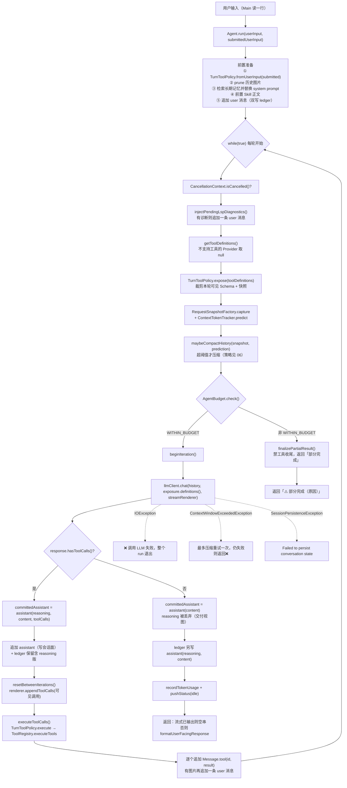
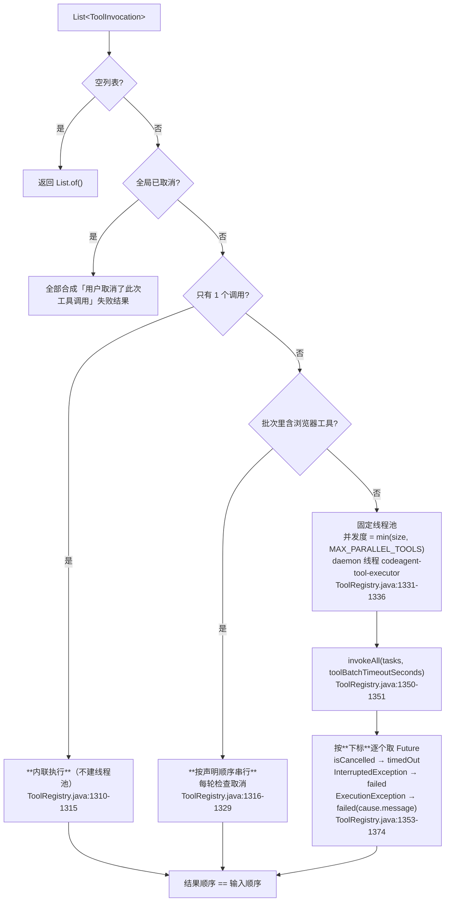
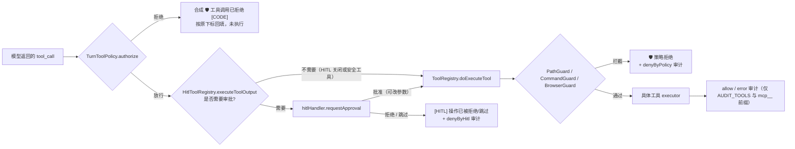

# ReAct Agent 执行框架

> **本文怎么读**
>
> - 读者假设：会写 Java、懂工程常识，但**完全没有接触过 Agent / ReAct / 工具调用循环**。第 0 部分专门补这些前置概念，有经验的读者可以直接跳到第 1 部分。
> - 本文描述的是**代码实际做了什么**，包括"定义了但没人调用""参数形同虚设""注释说的和实现的不是一回事"这类真实落差。它不是"Agent 通用教程"，也不会把将来可能做的持久化状态机、结构化 Trace 写成已交付能力。
> - 所有 `file:line` 对应当前源码（包名已从 `com.paicli` 重命名为 `com.codeagent`，行号与旧版文档整体不同）。正文有意**不写具体常量数值**（数值会随代码调整而过期），需要精确值时按行号自行核对。**例外**：简历原句里出现过的数字（多路并行、重试次数）会给出具体值，因为面试必被追问。
> - 上下文压缩的**策略细节**（阈值怎么算、Session Memory 与完整摘要如何选择）不在本文范围，见 `06-memory-context.md` 关于压缩阈值与 Session Memory 的讨论；durable session 的事件流与恢复见 `09-persistent-session-and-short-term-memory.md`。本文只讲清**单轮 ReAct 循环本身怎么跑**：一次工具调用的完整时序、prompt 组装、账本边界、循环终止条件。

---

# 第 0 部分　前置知识

## 0.1 一次普通的模型调用解决不了什么

一次普通的 Chat Completions 请求只有"输入"和"输出"两个动作：你把消息列表发过去，模型吐一段文字回来。它可以回答问题，但无法完成需要外部状态的任务。

例如「定位登录失败原因并修复代码」，实际要做的是一串彼此依赖的动作：

```
查找登录模块 → 读取相关类 → 搜索异常信息 → 判断根因
→ 修改文件 → 运行测试 → 根据测试结果继续修改（或回滚）
```

这里的关键不是"模型会不会写代码"，而是**每一步的输入取决于上一步的真实结果**：不读到登录类的真实内容，就不知道异常信息的搜索关键词；不跑一次测试，就不知道改对了没有。这些信息在一次文本生成里是不存在的。

ReAct 的思路就是把这个过程变成**受控的反馈循环**：让模型先决定"我要读哪个文件"，由外部程序真的去读，把结果作为新的输入再喂回模型，如此往复，直到模型认为可以给出最终回答。

## 0.2 Tool Calling 协议：模型怎么"请求执行一个动作"

模型本身不能读文件。它能做的是**在输出里声明"我想调用某个函数，参数是这些"**，然后由宿主程序去执行，再把执行结果作为一条新消息发回去。

这套约定叫 Tool Calling（工具调用），在 OpenAI 兼容的协议里长这样：

| 角色 | 内容 | 含义 |
|---|---|---|
| `system` | 一段固定的系统提示 | 定义角色、可用工具说明、行为约束 |
| `user` | 用户输入 | 人的请求 |
| `assistant` | `content`（可选）+ `tool_calls`（可选） | 模型输出。**有 `tool_calls` 就表示它要求执行动作** |
| `tool` | `content` + `tool_call_id` | 宿主程序把执行结果塞回给模型 |

一条 `tool` 消息必须通过 `tool_call_id` 精确指回某一条 `assistant` 消息里声明的那个调用（`LlmClient.java:117-119`）。这不是风格问题，而是协议要求：**缺了那条 assistant 消息，`tool` 消息就变成了孤儿，下一次请求可能被服务端判定为非法**（见第 3.4 节和 Q3）。

所以一个最小可用的循环长这样：

```
把 system + user 发给模型
模型返回 assistant(content, tool_calls)
如果 tool_calls 非空：
    执行每个 tool_call → 得到结果
    把 assistant(content, tool_calls) 追加进历史      ← 不能省
    把 tool(result) 逐个追加进历史
    回到"发给模型"
否则：
    把 assistant(content) 追加进历史，返回 content
```

## 0.3 本项目对 ReAct 的具体实现选择

ReAct 这个词最初来自论文里那种"让模型输出 `Thought: ... / Action: ... / Observation: ...` 纯文本"的做法——宿主程序要用正则去解析模型的自然语言，非常脆弱。

**本项目不做文本协议解析**，直接用模型原生的 Tool Calling：

- `reasoning_content` — 模型的思考增量（部分 Provider 才返回，见 `AbstractOpenAiCompatibleClient.java:290-299`）
- `content` — 面向用户的正文增量
- `tool_calls` — 结构化数组，每个元素有 `id` / `function.name` / `function.arguments`（`LlmClient.java:205-207`）

运行时只负责维护协议、执行工具、控制边界；**"下一步做什么"完全由模型根据完整消息历史自己决定**。这带来一个直接的后果：本项目的 ReAct 循环**没有"计划"这一层数据结构**，也没有可枚举的步骤列表，只有一条不断增长的 `List<Message>`。

> 对照：需要"先把步骤规划出来再执行"的场景走的是 Plan 模式，那是另一条执行路径，见 `02-dag-orchestration.md`。

## 0.4 名词速查

| 名词 | 在本文里的含义 |
|---|---|
| run / 一次任务 | 用户敲一次回车触发的一个完整过程，从 `Agent.run()` 开始到返回字符串结束 |
| iteration / 轮次 | run 内部的**一次模型调用**。一轮 = 一次 `llmClient.chat(...)` |
| tool call | 模型在某一轮输出里声明的、要求执行的一个动作 |
| tool result | 该动作的执行结果，以 `tool` 消息形式回灌 |
| 回灌 | 把 tool result 追加进消息历史，作为下一轮模型的输入 |
| `conversationHistory` | **发送视图**：真正会发给模型的消息列表 |
| ledger / 账本 | append-only 的 JSONL 审计文件，只追加、不修改（`ConversationLedger.java:40`） |
| session / durable session | 可恢复的会话事件流（`SessionStore`），与账本是两个独立文件 |
| `AgentBudget` | 循环的兜底保险阀：Token、停滞、硬轮数 |
| HITL | Human-in-the-loop：危险操作执行前弹给用户审批 |
| 流式 / streaming | 模型边生成边推 SSE 分片，宿主边收边打印 |
| 交付视图去 reasoning | 终轮写进 `conversationHistory` 的 assistant 消息**不含** reasoning，账本里保留完整版 |

---

# 第 1 部分　整体地图

## 1.1 一条真实请求的完整链路



**读这张图要抓住三件事：**

1. **只有两个出口是正常的**：模型不返回 `tool_calls`（分支 B），或者兜底预算命中（`finalizePartialResult`）。其余出口都是异常/取消。
2. **每一轮都会重新裁剪工具列表**（`expose`）+ 重新预测上下文（`capture`/`predict`），不是"run 开始时算一次"。
3. **工具失败不是循环的出口**：失败被转换成 tool result 回灌，让模型自己决定重试还是换招（第 3.4 节）。

## 1.2 分层与文件清单

| 层次 | 核心类 | 职责 | 不负责什么 |
|---|---|---|---|
| 入口层 | `Main`（ReAct 分支） | 读输入、展开 `@path`、建 Agent、驱动 `run` | 不理解 ReAct 协议 |
| 循环层 | `Agent` | 主循环、消息历史、流式渲染、账本写入、收尾 | 不实现任何具体工具 |
| 预算层 | `AgentBudget` | Token / 停滞 / 硬轮数三道保险阀 | 不感知 UST 内容，只看签名和计数 |
| 工具边界层 | `TurnToolPolicy` | 每轮工具可见性裁剪 + 调用授权 + 合成拒绝结果 | 不做路径/命令策略校验 |
| 工具执行层 | `ToolRegistry`（+ `HitlToolRegistry`） | 注册、参数映射、并发/超时/取消、审计、Guard | 不为任何一类工具在 Agent 里写分支 |
| 模型层 | `LlmClient` / `AbstractOpenAiCompatibleClient` | SSE 解析、Tool Call 增量合并、传输层重试 | 不维护跨轮状态 |
| prompt 层 | `PromptAssembler` / `PromptRepository` | 按模式拼接 system prompt | 不读对话历史 |
| 审计层 | `ConversationLedger` | append-only JSONL 原始消息账本 | 不参与恢复（恢复是 `SessionStore` 的事） |
| 会话持久化 | `SessionStore` / `SessionReplayer` | 事件流 + 投影恢复发送视图 | 与账本是两个独立文件 |
| 记忆层 | `MemoryManager` | 长期记忆检索 + Token 统计 | **不保存短期消息副本**（`MemoryManager.java:19-24`） |

核心文件：

```
agent/
├── Agent.java               主循环 + StreamRenderer（1619 行，单文件含内部类）
├── AgentBudget.java         三道保险阀
└── AgentMessage.java        历史消息的轻量视图
tool/
├── ToolRegistry.java        工具注册表 + executeTools
└── TurnToolPolicy.java      每轮语义边界
llm/
├── LlmClient.java           消息/ToolCall/ChatResponse 的协议定义
├── AbstractOpenAiCompatibleClient.java  SSE 解析 + 重试
└── LlmRetryPolicy.java      重试分类与退避
prompt/PromptAssembler.java  组装 system prompt
history/ConversationLedger.java  JSONL 账本
```

## 1.3 外部接线点

ReAct 路径的接线集中在 `Main` 一处（`Main.java:337-341`）：

| 接线 | 代码位置 | 作用 |
|---|---|---|
| `new Agent(llmClient, hitlToolRegistry)` | `Main.java:337` | 把 HITL 注册表注入 Agent；`HitlToolRegistry` 在 `Main.java:239` 构造 |
| `setConversationLedger(...)` | `Main.java:338` | 打开/绑定 JSONL 账本（不接时 Agent 用 `ConversationLedger.disabled()`，`Agent.java:67`） |
| `setExternalContextSupplier(mcpServerManager::resourceIndexForPrompt)` | `Main.java:339` | system prompt 里的 MCP resource 索引 |
| `setSkillRegistry` / `setSkillContextBuffer` | `Main.java:340-341` | Skill 索引 + 正文延迟注入 |
| `attachSession(initialSession)` | `Main.java:362` | 绑定可恢复会话 |
| `setRenderer(...)` / `setHitlEnabledSupplier(...)` | `Main.java:403-404` | 终端表现与状态栏 |
| 真正驱动一次 run | `Main.java:1026` | `runTask = () -> reactAgent.run(taskInput, submittedInput)` |
| 外层取消支持 | `Main.java:1030-1032` → `Main.java:1369-1371` | 在**另一个单线程**里跑 `run`，主线程监听 ESC |

**两个入参的差别值得单独说**（`Main.java:992-994` → `Agent.java:215`）：

```java
// Main.java:992-994
String submittedInput = input;                  // 用户真实敲进去的原文
input = mentionExpander.expand(input);          // @file 展开后的投喂内容
input = localPathMentionExpander.expand(input);
```

- `userInput`（展开后）**喂给模型**，也决定 system prompt 里的记忆检索关键词（`Agent.java:227`）
- `submittedUserInput`（原始）**只用来构造工具授权策略**（`Agent.java:217-220`）

这条分离有测试兜底：`AgentWebSearchDecisionTest.java:81`（`expandedMentionContentCannotGrantToolsOrGroundUrls`）断言把 URL 藏在展开出来的文件正文里，**不能**让模型获得抓取该 URL 的授权。

## 1.4 四件容易混淆的东西

| 名字 | 是什么 | 关键区别 |
|---|---|---|
| `conversationHistory` | `ArrayList<Message>`，发送视图 | 会被 `/clear`、图片裁剪、压缩**替换或删除**条目（`Agent.java:64`） |
| `ConversationLedger` | JSONL 文件，只追加 | 同样的操作只往里写"发生了什么"，不改历史 |
| `SessionStore`（durable session） | `events.jsonl` + checkpoint | 记录**可回放**的结构化事件（surface replace/clear），恢复时用它重建发送视图 |
| `MemoryManager` | 长期记忆 | 与短期消息无关；`Agent` 只调 `buildContextForQuery` 与 `recordTokenUsage`（`Agent.java:227`、`Agent.java:356`） |

还有一处**数值上的混淆**要提前拆开：

- `ContextProfile.compressionTriggerTokens()` 是**压缩阈值**，由 `ContextProfile.autoCompactTriggerTokens(window)` 算出（`ContextProfile.java:66-68`、`ContextProfile.java:93-96`），服务对象是"历史有多满"。
- `ContextProfile.agentTokenBudget` 是按窗口比例算出来的"单次 run 的 Token 上限"（字段声明 `ContextProfile.java:20`，在 `from(...)` 里赋值 `ContextProfile.java:38-44`，取值函数 `ContextProfile.java:82-85`）。

第二个字段在当前代码里**没有任何生产读取方**（除了声明点 `ContextProfile.java:20`）：全局只有 `AgentBudget.java:79` 的一句注释提到它，以及 `ContextProfileTest.java:21`、`:33` 的断言。而且那句注释说它"用于 `/context` 与 token stats 的软提示显示"——**`Agent.getContextStatus()` 实际并不打印它**（`Agent.java:707-760` 的通篇输出里没有这个字段）。真实约束 ReAct 的 Token 上限来自 `AgentBudget`，与 `ContextProfile.agentTokenBudget` 无关（见第 5 部分）。

---

# 第 2 部分　一轮 ReAct 循环的逐步展开

## 2.1 入口：`Agent.run` 的两个重载

```java
public String run(String userInput) {                    // Agent.java:207
    return run(userInput, userInput);
}

public String run(String userInput, String submittedUserInput) {   // Agent.java:215
```

单参重载把"投喂内容"和"授权来源"设成同一个字符串（`Agent.java:208`）——这在校验类测试里用得多，CLI 永远走双参版本。

## 2.2 前置准备（`Agent.java:216-238`，在主循环之外）

按顺序做五件事，任何一步抛异常都会让整个 run 提前返回：

1. **构造本轮策略**（`Agent.java:217-220`）

   ```java
   TurnToolPolicy turnToolPolicy = TurnToolPolicy.fromUserInput(
           submittedUserInput,
           toolRegistry.isSharedBrowserSession(),          // ToolRegistry.java:184-186
           toolRegistry.hasAgentOwnedCurrentBrowserPage()); // ToolRegistry.java:188-190
   ```

   注意这个对象在**整个 run 期间是同一个实例**，不是每轮重建。它内部的可变状态（已落地的 URL 集合、浏览器上下文标志）会随轮次累积（`TurnToolPolicy.java:142-148`）。

2. **`pruneHistoricalImagePayloads()`**（`Agent.java:222` → `Agent.java:598-623`）
   把历史消息里的图片 `ContentPart` 全部剥掉，替换成一段文本提示（`LlmClient.java:142-167`）。目的是避免同一张历史截图在后续每轮重复计费。

3. **检索长期记忆并整体替换 system prompt**（`Agent.java:226-228`）
   检索结果**不追加成普通聊天消息**，而是通过 `updateSystemPromptWithMemory`（`Agent.java:538-557`）替换 `conversationHistory[0]`。这样角色语义稳定，下一轮也容易覆盖掉上一轮的记忆注入。若新 system 与旧的完全相等，方法直接 return，不产生账本条目（`Agent.java:540-542`）。

4. **前置 Skill 正文**（`Agent.java:231` → `Agent.java:647-654`）
   `skillContextBuffer.drain()` 只会成功一次，正文被拼在用户原文之前，只注入一轮。

5. **追加 user 消息**（`Agent.java:232-234`）
   纯文本输入保持字符串 `content`；含 `@image:` 引用时转成 `ContentPart` 列表（`ImageReferenceParser.userMessage`）。这一步走 `appendConversationMessage`，因此**同时写入 ledger**（`Agent.java:1091-1098`）。

第 1、5 步所在 try 块只捕 `SessionPersistenceException`（`Agent.java:235-238`），返回 `"Failed to persist conversation state: ..."`。

## 2.3 主循环开头：每轮都要重做的六件事（`Agent.java:249-276`）

```java
while (true) {                                   // Agent.java:249
    if (CancellationContext.isCancelled()) { ... return "⏹️ 已取消当前任务。"; }   // :250-254
    injectPendingLspDiagnostics();                                               // :256
    List<LlmClient.Tool> toolDefinitions = llmClient.supportsTools()
            ? toolRegistry.getToolDefinitions() : null;                          // :257-259
    TurnToolPolicy.ToolExposure toolExposure = turnToolPolicy.expose(toolDefinitions); // :260
    RequestSnapshot requestSnapshot = requestSnapshotFactory.capture(...);       // :261-262
    ContextTokenTracker.ContextPrediction prediction = contextTokenTracker.predict(requestSnapshot); // :263
    if (maybeCompactHistory(requestSnapshot, prediction)) { ...重新 capture + predict... } // :264-268
    AgentBudget.ExitReason exitReason = budget.check();                          // :269
    if (exitReason != WITHIN_BUDGET) return finalizePartialResult(...);           // :270-273
    int iteration = budget.beginIteration();                                     // :275
```

顺序上有三个必须知道的点：

- **工具定义先冻结再预测 Token**。注释写得很清楚："工具定义必须先冻结，token 预测与实际 `chat()` 使用同一份列表"（`Agent.java:255`）。否则预测和实际请求会算出不同的上下文占用。
- **压缩发生在预算检查之前**（`Agent.java:264` 早于 `Agent.java:269`）。也就是说如果压缩把上下文压下来了，本轮仍有机会继续跑。
- **`beginIteration()` 在预算检查之后**（`Agent.java:275`）。所以 `budget.iteration()` 在第一次 `check()` 时还是 0（`AgentBudget.java:91-93` 是 `++iteration`）。硬轮数上限因此表现为"跑满 N 轮后，进入第 N+1 轮之前退出"——`AgentBudgetTest.java:124-134` 正是这么断言的（`beginIteration()` 两次后 `check()` 返回 `HARD_ITERATION_LIMIT`）。

`injectPendingLspDiagnostics`（`Agent.java:625-635`）取 `toolRegistry.flushPendingLspDiagnostics()`；非空才追加一条 user 消息（并打印 `report.displayText()`）。这是"上一轮 `write_file` 后的编译诊断"回到模型的通道，测试见 `AgentLspDiagnosticsTest.java:21`。

## 2.4 调用模型与流式渲染（`Agent.java:278-297`）

```java
streamRenderer.beginThinking();                                   // :281
LlmClient.ChatResponse response = llmClient.chat(
        conversationHistory, toolExposure.definitions(), streamRenderer);  // :283-287
if (CancellationContext.isCancelled()) { ... return "⏹️ 已取消当前任务。"; }  // :289-295
budget.recordTokens(response.inputTokens(), response.outputTokens(), response.cachedInputTokens()); // :297
```

注意传给 `chat` 的是 `toolExposure.definitions()`，**不是** `toolDefinitions`（`Agent.java:285`）。即使 `supportsTools()` 为 true，`expose()` 也可能把列表裁成空（例如输入只是裸标题）。此时 Provider 收到的是**空列表而非 null**——这一点与旧版行为不同，见第 5 部分。

### `StreamRenderer` 的状态机（`Agent.java:1335-1618`）

终端是线性的，无法回头修改已写出的文字，所以这个类用三个缓冲区和若干标志位来处理"reasoning 和 content 交替到达"的乱序问题：

| 缓冲区 | 用途 | 源码 |
|---|---|---|
| `pendingReasoning` | 尚未决定是否展示的 reasoning 增量 | `Agent.java:1338` |
| `visibleReasoning` | 已展示的 reasoning，thinking panel 路径用来生成引用块 | `Agent.java:1339` |
| `lateReasoning` | `content` 开始**之后**才到达的 reasoning | `Agent.java:1340` |

关键规则（每条都有测试）：

1. **`content` 出现之前**，reasoning 只要有实质内容就打印在「🧠 思考过程」下；同一次用户输入只打印一次标题（`Agent.java:1609-1617`、`Agent.java:1421`）。测试：`AgentStreamRendererTest.java:64`（跨工具轮次标题只出现一次）。
2. **纯空白 delta 先暂存**，不触发标题——避免出现空的"思考过程"（`Agent.java:1413-1417`、测试 `AgentStreamRendererTest.java:23`）。重置轮次时也做同样判断（`Agent.java:1550-1555`、测试 `AgentStreamRendererTest.java:46`）。
3. **非 thinking-panel 路径还要求 pending 已包含换行**才打印标题（`Agent.java:1418-1420`）。
4. **`content` 一出现就收尾 reasoning 区**（`Agent.java:1442-1461`）。
5. **`lateReasoning` 兜底**：`contentStarted == true` 之后到达的 reasoning 被缓冲（`Agent.java:1397-1401`），最终在 `resetBetweenIterations()`（`Agent.java:1490-1499`）或 `finish()`（`Agent.java:1525-1534`）里以「🧠 补充思考」独立展示。
6. 支持 thinking panel 的 Renderer 走另一条路：reasoning 交给 `renderer.appendThinking`，结束时再打印一次引用块（`Agent.java:1403-1411`、`Agent.java:1571-1607`）。测试：`AgentStreamRendererTest.java:87`。

`resetBetweenIterations()`（`Agent.java:1473-1508`）被工具分支显式调用（`Agent.java:324`），注释解释了原因：**HITL 提示可能插入到尚未 flush 的 Markdown 缓冲区中间，造成标题和内容错位**。

## 2.5 分支 A：模型返回工具调用（`Agent.java:311-340`）

逐步：

1. **保存 reasoning 到本轮 transcript**（`Agent.java:312`，累积到 `reasoningTranscript`）
2. **喂停滞检测**（`Agent.java:314` → `AgentBudget.recordToolCalls`）
3. **构造两种 assistant 消息**（`Agent.java:299-304`）

   ```java
   LlmClient.Message assistantMessage = LlmClient.Message.assistant(
           response.reasoningContent(), response.content(), response.toolCalls());   // :299-300
   LlmClient.Message committedAssistant = response.hasToolCalls()
           ? assistantMessage
           : LlmClient.Message.assistant(response.content());                        // :301-303
   ```

   这是整个类里最重要的一处行为差异：
   - **带 tool_calls 的轮次**：`committedAssistant` **保留 reasoning**，会进入下一轮的请求历史（`Agent.java:316`）
   - **终轮**：`committedAssistant` = `assistant(content)`，**reasoning 被丢弃**，只进账本（`Agent.java:347-353`）

   代码注释给的官方理由（`Agent.java:344-345`）：兼容"不要求终轮回传 reasoning"的 Provider。

4. **写会话面 + 写账本**（`Agent.java:316-319`）
   `appendCommittedConversationMessage(committedAssistant)`（`Agent.java:1100-1103`）只改内存列表；紧跟着 `conversationLedger.appendMessage("react", "agent", "llm_response", assistantMessage)`（`Agent.java:317-318`）写**含 reasoning 的完整版**。两个视图在这一刻分叉。
5. **持久化 tool_call 事件**（`Agent.java:319` → `Agent.java:1141-1154`）：每个调用写 `TOOL_CALL` 与 `TOOL_EXECUTION_STARTED` 两条事件。
6. **flush 流式渲染器**（`Agent.java:324`）
7. **只把"通过授权的调用"展示给用户**（`Agent.java:325-326` → `TurnToolPolicy.visibleToolCalls`，`TurnToolPolicy.java:287-301`）。这是防止"幻觉出来的抓取"在终端上被展示成真实行为。
8. **执行**（`Agent.java:328-329` → `Agent.java:955-977`）
9. **逐个回灌**（`Agent.java:330-334`）：`Message.tool(toolResult.id(), toolResult.result())`，source 标记 `"tool_execution"`
10. **图片补充消息**（`Agent.java:335` → `Agent.java:1074-1089`）：若某工具结果带 image part，在文本 tool 消息**之后再追加一条 user 消息**承载图片（因为 `tool` role 的消息不带 `ContentPart`）
11. `continue` 回到循环顶部。

**回灌的是完整结果，没有截断**：`Agent.java:330-334` 直接把 `toolResult.result()` 塞进历史。`MemoryManager` 侧不存在任何 `MAX_TOOL_RESULT_CHARS` 之类的裁剪（`MemoryManager.java` 全类没有短期消息字段）。唯一的截断点在工具自己内部（见第 3.4 节）。

## 2.6 分支 B：模型返回最终内容（`Agent.java:342-372`）

1. `appendReasoning` + `appendCommittedConversationMessage(committedAssistant)`（`Agent.java:343-346`）——此时 `committedAssistant` 已是不含 reasoning 的版本
2. 账本另写完整版（`Agent.java:347-353`）
3. `memoryManager.recordTokenUsage(...)`（`Agent.java:356`）
4. `pushStatus(budget, startNanos, "idle")`（`Agent.java:357`）
5. 收尾流式区域并决定返回值（`Agent.java:367-372`）：

```java
if (streamRenderer.hasStreamedOutput()) {
    streamRenderer.finish();
    return returnFinalResponseWhenStreamed ? (response.content() == null ? "" : response.content().trim()) : "";
}
streamRenderer.clearThinkingPanel();
return formatUserFacingResponse(reasoningTranscript.toString(), response.content());
```

- 交互式 CLI 里正文已经实时打印过，默认返回空串避免重复打印（`Main.java:1038-1041` 只在非空时再 println）
- 非交互通道（微信 / Runtime API）通过 `setReturnFinalResponseWhenStreamed(true)` 拿到完整内容（`Agent.java:181-183`）
- `formatUserFacingResponse`（`Agent.java:1298-1309`）只在 `renderer().rendersReasoning()` 为真时才把 thinking 拼进返回值，否则只返回答案本身

## 2.7 预算命中的收尾路径（`Agent.java:410-462`）

`AgentBudget.check()` 一旦返回非 `WITHIN_BUDGET`，循环不会直接返回错误字符串，而是走一次**无工具收尾**：

```java
appendConversationMessage(
        LlmClient.Message.user(budget.finalizationInstruction(exitReason)),
        "budget_finalization");                         // Agent.java:421-423
renderer().stream().println(AnsiStyle.section("⚠️ 执行预算已触发，正在整理部分结果")); // :424
LlmClient.ChatResponse response = llmClient.chat(
        conversationHistory, List.of(), streamRenderer);   // Agent.java:428-431  ← 空工具列表
```

- 收尾指令由 `AgentBudget.finalizationInstruction` 生成（`AgentBudget.java:190-195`）：明说"不要再调用任何工具"，并要求按"已完成 / 已验证 / 未完成或阻塞 / 建议下一步"四段给出最佳努力的结果
- 返回内容被包成 `"⚠️ 部分完成（" + describeExit(reason) + "）"`（`Agent.java:436` → `Agent.java:464-467`）
- 收尾调用自身抛 `IOException` 时降级为 `"收尾调用失败：..."`（`Agent.java:456-461`）

测试：`AgentBudgetFinalizationTest.java:22` 用显式硬轮数触发，断言第二次请求拿到**空工具列表**、历史里含"不要再调用任何工具"、结果包含 `部分完成`。

> **这里有一处持久化不对称，面试可能被追问**：收尾指令那条 user 消息走的是 `appendConversationMessage`，会写 durable session 的 surface 与 ledger（`Agent.java:421`）；但收尾返回的 assistant 结果是用裸 `conversationHistory.add(...)` + `historyVersion++` 追加的（`Agent.java:437-438`），**没有 `persistMessage`**，只额外写了 ledger（`Agent.java:439-443`）。同时这条收尾调用也没有 `REQUEST_STARTED` / `REQUEST_FINISHED` / `PROVIDER_USAGE` 事件（对比正常路径 `Agent.java:280`、`Agent.java:304`）。读代码可以确定的是这个不对称本身；它会不会造成恢复后的视图缺条（取决于 `SessionReplayer` 对不完整请求的处理），需要跑一次真实恢复才能验证，本文不做断言。

## 2.8 异常路径（`Agent.java:374-402`）

三个 catch 的顺序不能调（`ContextWindowExceededException` 是 `IOException` 的子类，`ContextWindowExceededException.java:8`）：

| catch | 触发点 | 行为 |
|---|---|---|
| `SessionPersistenceException`（`Agent.java:374-377`） | `persistEvent` 包住 `IOException`/`IllegalStateException` 后抛出（`Agent.java:1184-1194`） | 收尾流式区，返回 `"Failed to persist conversation state: ..."` |
| `ContextWindowExceededException`（`Agent.java:378-396`） | Provider 返回 4xx 且响应体命中一组英文关键词（`AbstractOpenAiCompatibleClient.java:239-247`） | **最多压缩重试一次**（`overflowRetries < 1`，`Agent.java:380`）：成功压缩则 `historyVersion++` + `invalidate` + `continue`；失败则返回 `"❌ 上下文窗口超限: ..."` |
| `IOException`（`Agent.java:397-402`） | 其他网络/协议失败 | 记录日志、收尾流式区，返回 `"❌ 调用 LLM 失败: ..."`——**整个 run 退出，不重试、不伪造工具结果** |

溢出恢复这条路径还有两个细节：

- 它调用的是 `autoCompactionManager.compactNow(conversationHistory)`（`Agent.java:383`），**传的是活的列表**，不是像 `maybeCompactHistory` 那样先复制成 candidate（`Agent.java:578`）。
- 它**不走 `commitCompaction`**，因此不写 `COMPACTION_START` / `COMPACTION_SUMMARY` / `COMPACTION_END` 事件，也不做 session surface 的 `replace`（对比 `Agent.java:1226-1277`）。结果就是：内存里的历史被压了，但 durable session 的事件流里没有这次压缩的记录。

**注意 Provider 层已经先做过传输重试**：`AbstractOpenAiCompatibleClient.java:80-107` 在 3 次尝试内（1 次原始 + 最多 2 次重试，`LlmRetryPolicy.java:37`）对可重试故障做指数退避 + jitter（`LlmRetryPolicy.java:158-172`），但有一个硬条件——**一旦已经向 StreamListener 交付过内容就不再重放**（`AbstractOpenAiCompatibleClient.java:92-93` 的 `!progress.hasConsumableOutput()`）。测试：`AbstractOpenAiCompatibleClientRetryTest.java:89`、`:104`。

## 2.9 循环终止条件汇总

| 终止原因 | 判定位置 | 出口形态 |
|---|---|---|
| 模型不再请求工具 | `Agent.java:311` 分支判断为假 | 正常返回，`content`（或空串） |
| 用户取消（迭代前） | `Agent.java:250` | `"⏹️ 已取消当前任务。"` |
| 用户取消（LLM 返回后） | `Agent.java:289` | 同上 |
| 停滞检测命中 | `Agent.java:269-273` → `AgentBudget.java:128-130` | `finalizePartialResult` → `"⚠️ 部分完成（...）"` |
| Token 预算耗尽 | `AgentBudget.java:131-133` | 同上 |
| 硬轮数上限 | `AgentBudget.java:134-136`（仅显式配置时参与判定） | 同上 |
| 上下文窗口超限且恢复失败 | `Agent.java:378-396` | `"❌ 上下文窗口超限: ..."` |
| Provider 调用失败 | `Agent.java:397-402` | `"❌ 调用 LLM 失败: ..."` |
| 会话持久化失败 | `Agent.java:374-377` | `"Failed to persist conversation state: ..."` |

**没有"连续 N 次工具失败就停"这类计数器**。失败的工具调用也是正常的 Observation，回灌后模型自己决定。

---

# 第 3 部分　工具执行与安全边界

## 3.1 工具定义怎么给到模型

`ToolRegistry.getToolDefinitions()`（`ToolRegistry.java:1080-1085`）把内部 Map 按**名字排序**后映射成 `LlmClient.Tool(name, description, parameters)`，参数是 Jackson `JsonNode` 形态的 JSON Schema。排序是为了让同一份工具集合每次生成完全相同的请求体（便于 prompt cache 命中）；测试 `ToolRegistryTest.java:43` 断言顺序稳定。

内置工具在构造阶段注册（`ToolRegistry.java:108-129`，九组：文件、Shell、代码、RAG、Web、浏览器、Memory、Skill、快照），MCP 工具在 Server 启动后通过 `registerMcpToolOutput` 动态加入（`ToolRegistry.java:1100-1112`），名字统一是 `mcp__{server}__{tool}`，避免不同 Server 的同名工具互相覆盖（`ToolRegistry.java:1103`、`:1133`）。

**不支持工具调用的 Provider 现在收到的是空列表，不是 null**：

```java
List<LlmClient.Tool> toolDefinitions = llmClient.supportsTools()
        ? toolRegistry.getToolDefinitions()
        : null;                                                   // Agent.java:257-259
TurnToolPolicy.ToolExposure toolExposure = turnToolPolicy.expose(toolDefinitions);  // Agent.java:260
```

`expose(null)` 返回 `ToolExposure.none()`，而它的紧凑构造器把 null 归一化成 `List.of()`（`TurnToolPolicy.java:247-248`、`TurnToolPolicy.java:970-982`）。所以 `Agent.java:285` 传下去的是空列表。两者在**线上行为上等价**，因为客户端只判断 `tools != null && !tools.isEmpty()`（`AbstractOpenAiCompatibleClient.java:365`），null 和空列表都不产生 `tools` 字段。这个差异只影响"代码路径怎么讲"，不影响协议。

## 3.2 `TurnToolPolicy`：每轮的工具语义边界

它把一件事拆成三步，都在 `Agent` 里被显式调用：

| 步骤 | 方法 | 调用点 | 做什么 |
|---|---|---|---|
| 裁剪可见性 | `expose(definitions)` | `Agent.java:260` | 返回 `ToolExposure`：可见定义 + 名字集合 + 已落地 URL + 浏览器上下文标志快照 |
| 展示过滤 | `visibleToolCalls(calls, exposure)` | `Agent.java:325-326` | 只把能通过同一个授权闸门的调用交给 Renderer |
| 执行 + 合成拒绝 | `execute(registry, invocations, exposure)` | `Agent.java:971` | 逐个授权，被拒的合成结果**按原下标回填** |

`execute` 的回填逻辑是消息协议稳定性的关键（`TurnToolPolicy.java:313-341`）：

```java
List<ToolExecutionResult> merged = new ArrayList<>(Collections.nCopies(invocations.size(), null)); // :313
// ... 授权：allowed / denied(merged.set(i, blockedResult(...)))                                    // :316-325
List<ToolExecutionResult> executed = registry.executeTools(allowed);                                // :331
for (int i = 0; i < allowed.size(); i++) {
    merged.set(allowedIndexes.get(i), i < resultCount ? executed.get(i) : missingResult(allowed.get(i))); // :337
}
```

即：**调用列表的下标与结果列表的下标严格一一对应**，无论中间发生了拒绝、缺少结果还是乱序完成。

`expose` 的裁剪规则（`TurnToolPolicy.java:246-281`）：

- `actionable == false`（输入只是标题/摘录）→ 直接返回空列表
- 用户明确说不要联网 → 过滤掉所有潜在外部工具（`TurnToolPolicy.java:260-262`）
- 只允许本地文本处理 → 过滤掉外部 Web 工具（`TurnToolPolicy.java:263-265`）
- 还没有任何可信 URL → 过滤掉 `web_fetch`（`TurnToolPolicy.java:266-268`）
- 浏览器工具按各自的可见性规则单独判断（`TurnToolPolicy.java:269-272` → `:641-683`）

`authorize`（`TurnToolPolicy.java:361-425`）则兜住"模型幻觉出来的调用"，四类拒绝码定义在 `TurnToolPolicy.java:927-932`：

| 拒绝码 | 触发条件 |
|---|---|
| `NO_ACTION` | 输入不构成任务（`TurnToolPolicy.java:365-368`） |
| `WEB_FORBIDDEN` | 用户明确禁网（`TurnToolPolicy.java:372-375`） |
| `UNGROUNDED_URL` | URL 不在"用户原文出现过"或"本轮 `web_search` 结构化结果发现过"的集合里（`TurnToolPolicy.java:399-419`） |
| `TOOL_NOT_ADVERTISED` | 工具未向本轮开放（`TurnToolPolicy.java:420-423`） |

URL 的可信来源只认**结构化元数据**：`observeSearchResultUrls` 读的是 `ToolExecutionResult.discoveredUrls()`（`TurnToolPolicy.java:461-469`），而不是解析搜索结果的正文文本。测试 `TurnToolPolicyTest.java:93`（`searchQueryEchoCannotLaunderAModelGuessedUrl`）、`:115`、`:144`、`:245`（本地工具输出不能凭空生产授权 URL）覆盖了这条边界。

拒绝结果的文本形态是 `"🛡️ 工具调用已拒绝 [CODE]: message"`（`TurnToolPolicy.java:487-496`），并会被 `Agent.emitToolResultSummary` 针对性打印一行（`Agent.java:984-986`）。

## 3.3 `ToolRegistry.executeTools` 的三条路径



**"最多 4 路并行"就在这里**：并发度是 `Math.min(invocations.size(), MAX_PARALLEL_TOOLS)`（`ToolRegistry.java:1331`），`MAX_PARALLEL_TOOLS` 定义在 `ToolRegistry.java:63`，值为 **4**（这是简历原句里的数字，必须能当场答出）。线程池在 `finally` 里 `shutdownNow()`（`ToolRegistry.java:1381-1383`）——每批新建、用完销毁，不做复用。

顺序保证有两层：`invokeAll` 返回的 Future 列表与任务列表同序（`ToolRegistry.java:1350-1351`），随后按 `futures.get(i)` 逐下标读取（`ToolRegistry.java:1354-1356`）；即使第二个工具先完成，结果仍落在第二个位置。测试 `ToolRegistryTest.java:329` 断言两个工具确实**同时**进入执行区（用 `peak` 计数验证并发）且结果保持传入顺序；`ToolRegistryTest.java:363` 断言含浏览器工具的批次 `peak == 1` 且按声明顺序执行。

**浏览器批次退化为串行的原因**：所有浏览器工具共享同一个 Chrome 会话，页面状态是全局的，并行导航/点击会互相覆盖（类注释 `ToolRegistry.java:1294-1300`。其中"含浏览器工具就整体串行"是保守策略——`read_file` 这种本地工具也一起被串行化了，测试 `ToolRegistryTest.java:396` 正是用 `new_page` + `read_file` 验证了这一点）。

`isBrowserToolName` 的判定在 `TurnToolPolicy.java:719-721`，是按名字前缀匹配的静态方法。

## 3.4 工具失败的语义：永远是结果，不是异常

`doExecuteTool`（`ToolRegistry.java:1165-1235`）把所有失败都转成 `ToolOutput`：

| 情况 | 结果 | 位置 |
|---|---|---|
| 全局已取消 | `"用户取消了此次工具调用"` | `ToolRegistry.java:1166-1168` |
| 工具名不存在 | `"未知工具: " + name` | `ToolRegistry.java:1169-1172` |
| `PathGuard` / `CommandGuard` / 浏览器 Guard 拦截 | `PolicyException` → `"🛡️ 策略拒绝: ..."`，并写 `deny` 审计 | `ToolRegistry.java:1222-1227` |
| 其他异常 | `"工具执行失败: " + message`，并写 `error` 审计 | `ToolRegistry.java:1228-1234` |
| 批次超时导致 Future 被取消 | `"工具执行超时（N秒），已取消"`，`timedOut = true` | `ToolRegistry.java:1357-1359`、`ToolRegistry.java:1568-1580` |
| 结果数少于调用数 | `"工具执行失败: 执行器未返回对应结果"` | `TurnToolPolicy.java:498-507` |
| 策略拒绝（授权层） | `"🛡️ 工具调用已拒绝 [CODE]: ..."`，**从未进入 Registry** | `TurnToolPolicy.java:487-496` |

`ToolExecutionResult` 的紧凑构造器保证 `successful && !timedOut` 与 `imageParts`/`discoveredUrls` 永不为 null（`ToolRegistry.java:1533-1537`），成功/失败/超时三个工厂方法在 `ToolRegistry.java:1547-1580`。

**"失败"的判定还有一层文本嗅探**：`looksLikeFailureText`（`ToolRegistry.java:1251-1271`）靠前缀匹配（`🛡️`、`❌`、`[HITL]`、`工具执行失败`、`未知工具` 等）把工具自己返回的字符串重新分类成失败。这意味着**工具只要返回以这些前缀开头的正常内容，就会被误标为失败**（进而 `successful == false`，影响 `TurnToolPolicy.observe` 是否更新浏览器状态）。这是实现上的粗糙处，不是设计目标。

### 结果截断发生在工具内部，不是 Agent

旧文档称"命令输出截断是整条链路里唯一的截断点"，**这个说法不成立**。当前至少四处：

| 工具 | 截断方式 | 位置 |
|---|---|---|
| `read_file` | 达到行数上限后追加 `...(已截断，可用 offset=N 继续读取)` | `ToolRegistry.java:396` |
| `grep_code` | 达到字符预算或 `head_limit` 后追加 `partial: true（...）` 与 `suggested_reads` | `ToolRegistry.java:506-508` |
| `web_fetch` | 返回正文超过 `max_chars`（默认取自 `DEFAULT_FETCH_MAX_CHARS`）时截断 | `ToolRegistry.java:655-657`、`:1049` |
| `execute_command` | 超过 `MAX_COMMAND_OUTPUT_CHARS` 后追加 `...(输出已截断)` | `ToolRegistry.java:1505` |
| `write_file` | 超过 `MAX_WRITE_FILE_BYTES` 直接拒绝写入（不是截断） | `ToolRegistry.java:283-285` |

共同点：**截断信息作为正文的一部分返回给模型**，由模型自己决定要不要 `read_file` 续读或缩小查询范围。Agent 层对此完全无感知。

## 3.5 超时与取消

| 机制 | 实现 | 位置 |
|---|---|---|
| 单条命令超时 | `process.waitFor(commandTimeoutSeconds, SECONDS)` 超时后 `destroyForcibly()` + `outputFuture.cancel(true)` | `ToolRegistry.java:1436-1442` |
| 命令输出读取超时 | `outputFuture.get(2, SECONDS)`，超时返回"命令已结束，但输出读取超时" | `ToolRegistry.java:1510-1517` |
| 批次超时 | `invokeAll(tasks, toolBatchTimeoutSeconds, SECONDS)` | `ToolRegistry.java:1350-1351` |
| 批次超时与命令超时的关系 | 构造器派生：`max(commandTimeout + 5, DEFAULT_TOOL_BATCH_TIMEOUT_SECONDS)` | `ToolRegistry.java:112-114` |
| 取消（协作式） | `CancellationContext.isCancelled()` 在 6 处检查 | `Agent.java:250`、`Agent.java:289`、`ToolRegistry.java:1305`、`:1320`、`:1341`、`:1166` |

**单调用内联路径不受批次超时保护**（`ToolRegistry.java:1310-1315` 完全不经过 `invokeAll`），单次执行的超时只能靠工具自己实现——`execute_command` 自己实现了 `waitFor` 超时，其他工具（如 `web_fetch`）的超时依赖 HTTP 客户端配置。这是三条路径行为不一致的具体表现。

命令输出用独立线程读取（`ToolRegistry.java:1434`）是为了避免子进程输出塞满缓冲区后与父进程互相等待；`ProcessBuilder` 用 `redirectErrorStream(true)` 把 stderr 并进 stdout（`ToolRegistry.java:1427`），工作目录设为项目根（`ToolRegistry.java:1426`）。

## 3.6 安全执行链



`HitlToolRegistry` 通过覆写 `executeToolOutput` 插到执行链上（`HitlToolRegistry.java:30-54`），因此**并行批次里的每个工作线程也会各自触发审批**（`ToolRegistry.java:1345` 的虚调用落到覆写版本）。审批处理器自身是 `synchronized`（`TerminalHitlHandler.java:71`、`RendererHitlHandler.java:40`），所以并发审批会串行排队，不会交错读同一个终端。

审批的适用范围由 `ApprovalPolicy.requiresApproval` 决定：危险工具集合 + 所有 `mcp__` 工具（`ApprovalPolicy.java:31-33`）。审计只对 `AUDIT_TOOLS`（`write_file` / `execute_command` / `create_project` / `revert_turn`）和 `mcp__` 前缀的工具生效（`ToolRegistry.java:81`、`ToolRegistry.java:1394-1396`）。

**审批与策略不是同一层**：用户批准只表示"同意执行意图"，`PathGuard` / `CommandGuard` 仍可拒绝违反系统边界的参数——`HitlToolRegistry.java:41-44` 的浏览器预检查被拦时故意**回落**到父类执行，让策略层给出拒绝原因，而不是掩盖它。

## 3.7 流式 Tool Call 的增量合并（Provider 层）

模型返回的 Tool Call 可能被拆成多个 SSE 分片：第一片只有 `id`，后续分片各自携带函数名与一部分 arguments 字符串。合并逻辑在 `mergeToolCallDeltas`（`AbstractOpenAiCompatibleClient.java:462-487`）：

- 以分片里的 `index` 作为累积器的下标（`AbstractOpenAiCompatibleClient.java:468`）
- `name` 和 `arguments` 都是**字符串追加**（`AbstractOpenAiCompatibleClient.java:478-486`）

这带来一个硬性约束：**不能对每个分片独立解析 JSON 参数**，必须等流结束后统一拼装（`buildToolCalls`，`AbstractOpenAiCompatibleClient.java:489-500`）。另外 `id` 为空的分片会被跳过——最终只有带有效 `id` 的累积器才会形成 Tool Call（`AbstractOpenAiCompatibleClient.java:498-499`）。

流结束时若 `content`、`reasoning`、`toolCalls` 全空，抛 `IOException("API返回空内容...")`（`AbstractOpenAiCompatibleClient.java:222-227`），最终表现为 Agent 的 `"❌ 调用 LLM 失败: ..."`。

---

# 第 4 部分　跟着真实场景走一遍

## 场景一：修一个编译错误并跑测试

用户输入：`修复 UserService 中的编译错误并运行测试`

1. `Main.java:992-994`：`submittedInput` = 原文；`taskInput` = 展开 `@path` 之后的文本（本例没有 mention，两者相同）
2. `Agent.java:217-220`：用 `submittedUserInput` 构造 `TurnToolPolicy`；`looksActionable` 命中 `STRONG_LOCAL_ACTION` 一类正则，`actionable = true`（`TurnToolPolicy.java:509-545`）
3. `Agent.java:226-228`：检索长期记忆，替换 `conversationHistory[0]`
4. `Agent.java:232-234`：追加 user 消息（写 ledger）
5. 循环第 1 轮：`expose` 返回完整工具列表；`predict` 未超阈值；`check()` 返回 `WITHIN_BUDGET`
6. 模型调用 `grep_code` → `TurnToolPolicy.authorize` 放行（本地工具、无 URL 约束）→ 单调用路径**内联执行**（`ToolRegistry.java:1310-1315`）→ 结果回灌
7. 第 2 轮：模型调用 `read_file` 读取命中行附近代码
8. 第 3 轮：模型调用 `write_file`。此时 `HitlToolRegistry` 介入（`write_file` 属于危险工具，`ApprovalPolicy.java:31-33`），弹审批；批准后 `PathGuard` 校验路径在项目内，`AuditLog` 记一行 `allow`
9. 写入触发 LSP 诊断入队；**下一轮开头** `injectPendingLspDiagnostics` 把诊断作为 user 消息注入（`Agent.java:256` → `Agent.java:625-635`），测试见 `AgentLspDiagnosticsTest.java:21`
10. 模型调用 `execute_command` 跑测试；输出超过上限时带 `...(输出已截断)` 返回（`ToolRegistry.java:1505`）
11. 测试失败 → 结果回灌 → 模型继续定位；通过 → 返回最终 `content`，循环在分支 B 结束（`Agent.java:342-372`）

**要点**：整个过程 Agent 没有为任何一类工具写分支，也没有"当前处于第几步"的状态机。步骤完全由模型每轮重新决定。

## 场景二：用户只发了一条公众号标题

1. `looksActionable` 判定为非任务（`TurnToolPolicy.java:509-545`，标题后缀正则 `TurnToolPolicy.java:70`；测试 `TurnToolPolicyTest.java:48`）
2. `expose` 返回空列表（`TurnToolPolicy.java:247-248`）
3. 模型即使幻觉出 `web_fetch`，`authorize` 也以 `NO_ACTION` 拒绝（`TurnToolPolicy.java:365-368`），合成一条 `🛡️ 工具调用已拒绝 [NO_ACTION]: ...` 结果回灌
4. 模型在下一轮被要求先澄清；Agent 继续循环直到模型不再请求工具

测试：`AgentWebSearchDecisionTest.java:41` 断言"底层 `ToolRegistry` 一次都没被执行"、首轮工具列表为空、`tool` 消息里含 `NO_ACTION`；`TurnToolPolicyTest.java:29` 在策略层断言同样三件事。

**注意一个细节**：第 3 步的拒绝**没有终止循环**——模型会拿到拒绝结果并再来一轮（`ToolRegistry` 侧的执行计数为 0，但模型调用次数为 2，`AgentWebSearchDecisionTest.java:65-67`）。

## 场景三：预算终于触发了

设 `-Dcodeagent.react.hard.max.iterations` 显式配成一个小值（默认是"不限"，见第 5 部分）：

1. 第 1 轮正常跑；`check()` 时 `iteration` 仍为 0（因为 `beginIteration` 在 `check` 之后），未命中
2. 第 2 轮跑完工具；回到循环顶部，`check()` 发现 `iteration >= hardMaxIterations`（`AgentBudget.java:134-136`）→ 进入 `finalizePartialResult`
3. 追加"不要再调用任何工具"的 user 消息（`Agent.java:421-423`），终端打印 `⚠️ 执行预算已触发，正在整理部分结果`
4. 用**空工具列表**再调一次模型（`Agent.java:428-431`）
5. 返回 `"⚠️ 部分完成（达到显式硬轮数上限（N），将停止工具执行并收尾）\n\n<模型整理的内容>"`（`Agent.java:436`、`AgentBudget.java:172-184`）
6. 若这次收尾调用也失败，返回 `"⚠️ 部分完成（...）\n\n收尾调用失败：..."`（`Agent.java:456-461`）

断言在 `AgentBudgetFinalizationTest.java:22-53`：两次请求、第二次工具列表为空、历史含收尾指令、结果含 `部分完成`。

---

# 第 5 部分　设计意图 vs 实际实现

以下是文档意图与代码实际行为存在差异的地方。每条给出源码位置，具体数值以源码为准。

| 主题 | 设计意图 | 实际实现 | 源码位置 |
|---|---|---|---|
| Token 预算 | 防止无限推理的硬约束 | **默认不生效**：`readIntProperty("codeagent.react.token.budget", Integer.MAX_VALUE)`，只有显式设系统属性才是硬限 | `AgentBudget.java:83-87` |
| 硬轮数上限 | 默认有一层轮数保护 | **默认也是无限**；`HARD_ITERATION_LIMIT` 只在 `hasHardIterationLimit()` 为真时参与判定 | `AgentBudget.java:45-46`、`AgentBudget.java:134-136`、`AgentBudget.java:164-166` |
| `fromLlmClient(llmClient)` | 签名暗示按模型/窗口定制预算 | **入参完全未被使用**：方法体只读三个系统属性；`fromSystemProperties()` 就是 `fromLlmClient(null)` | `AgentBudget.java:74-88` |
| `ContextProfile.agentTokenBudget` | 注释称"用于 `/context` 与 token stats 的软提示显示" | 全局**没有生产读取方**，`Agent.getContextStatus()` 不打印该字段；除声明点 `ContextProfile.java:20` 外，唯一引用是那句注释和单测断言 | `AgentBudget.java:79`、`ContextProfile.java:20`、`Agent.java:707-760`、`ContextProfileTest.java:21` |
| 退出原因集合 | 可能以为含"连续异常"等条件 | 枚举**只有四个**：`WITHIN_BUDGET` / `TOKEN_BUDGET_EXCEEDED` / `STAGNATION_DETECTED` / `HARD_ITERATION_LIMIT`，**没有**失败计数器 | `AgentBudget.java:37-42` |
| 兜底判定顺序 | 通常是并列条件 | 顺序固定：停滞 → Token → 硬轮数，先到先返回 | `AgentBudget.java:127-138` |
| 停滞检测 | 泛化的"重复调用" | 精确到"工具名 + 参数"字符串**完全相同**（`signatureOf` 用 `name|arguments;` 拼接），且要填满整个窗口才置位；**空工具调用会清空窗口** | `AgentBudget.java:111-125`、`AgentBudget.java:197-203` |
| `recordTokens(int,int)` | 两参重载看来是常用入口 | **无任何生产调用方**，只有单测在用（生产代码全部走三参版本） | `AgentBudget.java:95-97`、`AgentBudgetTest.java:24` |
| 预算命中的退出 | 以为返回一条错误字符串 | 走 `finalizePartialResult`：追加收尾指令 → 用**空工具列表**再调一次模型 → 返回「⚠️ 部分完成」；只有收尾调用自身失败才降级成错误文本 | `Agent.java:270-273`、`Agent.java:410-462` |
| 收尾路径的持久化 | 以为所有消息都按同一规则落库 | **不对称**：收尾指令（user）走 `appendConversationMessage` 会写 session surface + ledger；收尾结果（assistant）只 `conversationHistory.add` + ledger，**没有 `persistMessage`**，也没有 `REQUEST_STARTED`/`PROVIDER_USAGE` 事件 | `Agent.java:421-423` vs `Agent.java:437-443` vs `Agent.java:1105-1139` |
| 溢出恢复的压缩 | 以为和自动压缩走同一条写入路径 | 直接用**活列表**调 `compactNow(conversationHistory)`，**不走 `commitCompaction`**，因此不写 `COMPACTION_*` 事件、不做 surface `replace`；只 `historyVersion++` + `invalidate` | `Agent.java:383-386` vs `Agent.java:1226-1277` |
| 溢出恢复重试次数 | 以为会一直重试到成功 | 局部计数器 `overflowRetries` 只允许 **1 次**恢复尝试 | `Agent.java:244`、`Agent.java:380-382` |
| 不支持工具的 Provider | 旧文档称"传 `null` 工具列表" | 现在传的是 `toolExposure.definitions()`，`expose(null)` 归一化为**空列表**；客户端对 null 和空列表处理一致（都不产生 `tools` 字段） | `Agent.java:257-260`、`Agent.java:285`、`TurnToolPolicy.java:970-982`、`AbstractOpenAiCompatibleClient.java:365` |
| 工具结果的截断 | 旧文档称"命令输出截断是唯一截断点" | **至少五处**：`read_file` 行数上限、`grep_code` 字符/条数预算、`web_fetch` 字符上限、`execute_command` 输出上限、`write_file` 字节上限（拒绝而非截断） | `ToolRegistry.java:396`、`:506-508`、`:655-657`、`:1049`、`:1505`、`:283-285` |
| 单工具执行 | 以为都走线程池 | 单调用**内联执行**、浏览器批次**串行**、其余才建线程池——三条路径行为不一致（超时保护只在并行路径上） | `ToolRegistry.java:1310-1315`、`:1316-1329`、`:1331-1336` |
| 失败判定 | 以为 `successful` 由执行路径决定 | 还有一层**文本前缀嗅探**：工具返回以 `🛡️`/`❌`/`工具执行失败` 等开头的正常内容也会被标成失败 | `ToolRegistry.java:1237-1239`、`:1251-1271` |
| ReAct 的 browser lease | 借出后应归还 | `TurnToolPolicy.execute` 里 `acquireBrowserLease()`，**ReAct 路径从不调用 `releaseBrowserLease()`**；只有 `SubAgent` / `PlanExecuteAgent` / `AgentOrchestrator` 有对应释放 | `TurnToolPolicy.java:328-330`、`TurnToolPolicy.java:344-351`、`SubAgent.java:265`、`PlanExecuteAgent.java:570`、`AgentOrchestrator.java:543` |
| 该 lease 的实际作用 | 以为是一把跨轮互斥锁 | **在 ReAct 里不构成互斥**：`browserLeaseCoordinator` 是**实例字段**（每次 `fromUserInput` 新建），ReAct 不 `fork()`，而 `browserLeaseHeld` 为真时 `acquire` 直接 return——同一 policy 的第二次 acquire 是空操作 | `TurnToolPolicy.java:148`、`TurnToolPolicy.java:165`、`TurnToolPolicy.java:181`、`TurnToolPolicy.java:353-359` |
| 终轮 assistant 双写 | 以为交付视图和账本一致 | **分裂**：带 tool_calls 的轮次保留 reasoning（`assistant(reasoning, content, toolCalls)`），终轮丢弃 reasoning 只写 `assistant(content)`；账本两条路径都保留完整版 | `Agent.java:299-303`、`Agent.java:316-318`、`Agent.java:346-353` |
| "Agent 是账本的唯一双写者" | 旧文档明确这么写 | **不成立**：Plan / Team / Planner / Harness 都在写账本 | `PlanExecuteAgent.java:306`、`SubAgent.java:216`、`AgentOrchestrator.java:171`、`Planner.java:73`、`BetterHarnessRunner.java:261` |
| 账本写入失败 | 以为会向上冒泡 | `ConversationLedger.append` 内部 `catch (IOException)` 只打 error 日志，**调用方完全无感**（与 `SessionStore` 路径的 `SessionPersistenceException` 形成对比） | `ConversationLedger.java:180-196` |
| system prompt 刷新 | 以为每轮重建只是一次内存替换 | 只要新 system 与旧的不同就**追加一条账本条目**（`memory_context_refresh`），所以账本会随轮次增长多条 full system prompt | `Agent.java:538-557` |
| durable session 下的压缩 | 以为压缩总能生效 | `commitCompaction` 在 session 路径下要求特定形状，否则抛 `SessionPersistenceException("unsupported compaction shape")`，被 `maybeCompactHistory` 的 catch 吞成 `false` → 本轮不压缩，**下一轮还会再试一次** | `Agent.java:1239-1244`、`Agent.java:592-594` |
| 会话事件写入成本 | 以为 append 是 O(1) | `SessionHandle.append` 每次都执行 `replayer.replay(manifest, events)`——**全量重放所有事件**。ReAct 单轮会写多条事件，整场会话呈 O(N²) | `SessionStore.java:520-542`、`SessionReplayer.java:46-56`；对比启动时用的增量 `replayFrom`（`SessionStore.java:84-86`） |
| 图片裁剪与 session 下标 | 以为两者无耦合 | `pruneHistoricalImagePayloads` 用 `conversationHistory` 的下标 `i` 直接索引 `sessionHandle.projection().activeSurface().get(i)`，隐含"两者严格同序同长"；这是**推断的耦合**（未运行验证会否越界） | `Agent.java:601-613` |
| 取消 | 以为能立刻打断任何东西 | 协作式：Agent 层 2 个检查点 + 工具层 4 个；`runWithCancelSupport` 会 `future.cancel(true)`，但阻塞在第三方 SDK 内部时不一定响应 | `Agent.java:250`、`Agent.java:289`、`ToolRegistry.java:1305`、`:1320`、`:1341`、`:1166`、`Main.java:1387-1393` |
| LLM 异常 | 以为 Agent 层会重试 | Agent 层单次 `IOException` 即 `return` 退出整个 run；重试只发生在 Provider 层的传输阶段，且**已交付流式内容后不再重放** | `Agent.java:397-402`、`AbstractOpenAiCompatibleClient.java:80-107` |
| 失败的工具调用 | 可能以为会导致 run 失败 | 全部转成 tool result 回灌；只有 LLM 通道失败、用户取消、预算终止主循环 | `ToolRegistry.java:1222-1234`、`Agent.java:330-334` |
| LSP 诊断注入时机 | 以为在执行前注入 | 在**迭代开头**（`Agent.java:256`）注入，位置在预算检查之前——预算命中时也会先注入诊断再收尾 | `Agent.java:256` vs `Agent.java:269-273` |

---

# 第 6 部分　设计取舍

## 6.1 循环 vs 预先生成完整步骤

**ReAct 循环**：每一步基于真实工具结果，适合信息不足、路径不确定的任务；工具失败后能动态改策略。

**代价**：轮次不可预估，依赖预算与停滞控制；执行过程不如 DAG 可预测、不可枚举。

**当前判断**：简单探索走 ReAct，步骤明确且依赖复杂走 Plan 模式（见 `02-dag-orchestration.md`）。两条路径共用 `LlmClient`、`ToolRegistry`、`AgentBudget` 与账本。

## 6.2 工具失败回灌 vs 立即终止

文件不存在时模型可以改用 `glob_files` 找正确路径；如果任何工具失败都终止 Agent，自主纠错能力立刻归零。

**代价**：错误信息作为正文进历史，会反复占据上下文；同一条失败可能被模型重试多次（`execute_command` 反复超时是最常见的一种），只能靠停滞检测兜底——而停滞检测要求"工具名 + 参数完全相同"，**换一个参数重试同一把工具不会被判定为停滞**。

## 6.3 为什么把 Token 预算和硬轮数默认关掉

`AgentBudget` 的类注释给出了明确取舍（`AgentBudget.java:28-33`）：长上下文模型（200k / 1M 窗口）配合套餐用户存在"无限 token"诉求，如果默认以窗口比例作硬限，用户会被预算墙卡住。

因此默认策略是"**让 LLM 自然停在它该停的地方**"，死循环防护交给停滞检测；需要严格成本控制的场景（CI、自动化批跑）通过 `-Dcodeagent.react.token.budget=N` 或 `-Dcodeagent.react.hard.max.iterations=N` 显式启用（`AgentBudget.java:83-87`、`AgentBudget.java:205-216`）。

**代价**：默认配置下运行成本与轮次都不设上限；防护实际上只依赖停滞检测一条。这里的"默认安全"是靠假设模型不会陷入**参数完全相同**的死循环来维持的。

## 6.4 为什么单工具内联、浏览器串行、其余才开池

绝大多数工具调用只返回一个工具，为一个调用建池、提交、`invokeAll` 是纯开销（`ToolRegistry.java:1310-1315`）。浏览器工具共享同一会话、页面状态是全局的，并行会互相覆盖（`ToolRegistry.java:1316-1329`）。

**代价**：三条路径行为不一致——批次超时保护只在并行路径上生效；串行路径上一旦某个浏览器工具卡住，整批都会卡住且只能靠工具自身超时或用户取消。

## 6.5 为什么保留两份"历史"

`conversationHistory` 只是发送视图，`/clear`、图片裁剪、压缩都会改写它；一旦改写，原始 LLM 响应就永久丢失。账本是 append-only 的 JSONL，保证"跑过一次就有据可查"（`ConversationLedger.java:28-39`）。

**代价**：同一条消息可能在三处出现（内存、账本、session 事件流），且三者的一致性靠调用点自觉——第 5 部分列出的"收尾路径不写 session"就是自觉失效的一个例子。账本文件还可能含完整 prompt、工具参数与结果、reasoning 正文，所以目录/文件权限在 POSIX 上被收紧到仅当前用户（`ConversationLedger.java:46-49`、`:220-244`）。

## 6.6 为什么用原生 Tool Calling 而不是文本协议

省掉正则解析这一层脆弱环节，参数天然是结构化 JSON，也能用 `tool_call_id` 做严格的请求-响应配对。

**代价**：能力被 Provider 绑定——不支持原生 tools 的 Provider 直接拿不到工具（`LlmClient.java:29-31`），只能靠 prompt 说明"当前不支持工具，不要伪造工具标签"（`PromptAssembler.java:100-107`）。

## 6.7 为什么在 Agent 之前再加 `TurnToolPolicy`

HITL 与 `PathGuard`/`CommandGuard` 都是"已经决定要调用某个工具之后"的检查。`TurnToolPolicy` 解决的是另一个问题：**哪些工具在语义上有资格被调用**（URL 有没有来源、浏览器操作幅度是否被授权、输入是否构成任务）。它通过裁剪 Schema 减少幻觉空间，通过 `authorize` 兜住幻觉调用，并用合成拒绝结果维持 tool_call / tool_result 的一一对应。

**代价**：策略是大量正则启发式的集合（`TurnToolPolicy.java:34-131`），对表述极其敏感；误判会表现为"工具莫名不可见"，且这类问题从终端上看不出原因。ReAct 路径的 lease 只有 acquire 没有 release（第 5 部分），属未完成部分。

---

# 第 7 部分　失败与边界矩阵

| 失败点 | 检测方式 | 当前处理 | 是否继续循环 |
|---|---|---|---|
| 用户取消（迭代前） | `CancellationContext.isCancelled()` | 返回 `⏹️ 已取消当前任务。` | 否 |
| 用户取消（LLM 返回后） | 同上 | 收尾流式区后返回取消提示 | 否 |
| 用户取消（工具执行中） | 工具层 4 个检查点 | 合成取消失败结果 | 是 |
| 输入无实际任务 | `looksActionable` | `expose` 裁空 + `NO_ACTION` 拒绝全部调用 | 是 |
| 策略拒绝（授权层） | `authorize` 返回 deny | 合成 `🛡️ 工具调用已拒绝 [CODE]`，未执行 | 是 |
| 工具不存在 | Registry 查表失败 | `未知工具: name` | 是 |
| 工具参数非法 | Jackson / 工具内校验 | `工具执行失败: ...` | 是 |
| 路径逃逸 | `PathGuard` | `PolicyException` → `🛡️ 策略拒绝` + deny 审计 | 是 |
| 危险命令 | `CommandGuard` | 拒绝 + 审计 | 是 |
| 危险工具 / MCP 工具 | `ApprovalPolicy.requiresApproval` | 弹 HITL；拒绝写 `denyByHitl` | 是 |
| 命令超时 | `waitFor` 返回 false | `destroyForcibly()` + `outputFuture.cancel(true)` | 是 |
| 命令输出读取超时 | `Future.get(2, SECONDS)` 超时 | `(命令已结束，但输出读取超时)` | 是 |
| 工具批次超时 | Future 被取消 | `timedOut` 结果 | 是 |
| 单工具执行卡死 | **无批次超时保护**（内联路径） | 依赖工具自身超时 | 是（但可能永久阻塞） |
| 工具返回带失败前缀的正常文本 | `looksLikeFailureText` | 被标成 `successful = false`，可能影响浏览器状态推断 | 是 |
| LLM 传输故障（未交付流式内容） | `LlmRetryPolicy.isRetryableFailure` | 3 次尝试内退避重试（1 次原始 + 最多 2 次重试） | 由 Agent 决定 |
| LLM 传输故障（已交付流式内容） | `progress.hasConsumableOutput()` | **不再重放**，直接抛 | 否 |
| LLM 返回空内容 | 三要素全空 | 抛 `IOException("API返回空内容...")` | 否 |
| LLM 其他 `IOException` | Agent 层 catch | 返回 `❌ 调用 LLM 失败: ...` | **否（直接退出）** |
| 上下文窗口超限 | 4xx + 响应体关键词 | 最多压缩重试 1 次；仍失败返回 `❌ 上下文窗口超限` | 否（恢复失败时） |
| 会话持久化失败 | `SessionPersistenceException` | 返回 `Failed to persist conversation state: ...` | 否 |
| 账本落盘失败 | `ConversationLedger.append` 内部 catch | 只打 error 日志，**调用方无感** | 是 |
| 压缩失败（无 session） | `compactIfNeeded` 返回 false | 保留原历史，打印 warn，继续 | 是 |
| 压缩失败（有 session，形状不符） | `commitCompaction` 抛 `unsupported compaction shape` | 被 catch 成 `false`，本轮不压缩 | 是（下一轮会再试） |
| 收尾调用自身失败 | `IOException` | 返回 `⚠️ 部分完成（...）\n\n收尾调用失败：...` | 否 |
| 重复工具停滞 | 签名窗口填满且全同 | 无工具收尾，返回「部分完成」 | 否 |
| 达到显式硬迭代上限 | `AgentBudget.check()` | 无工具收尾，返回「部分完成」 | 否 |
| 显式 Token 预算耗尽 | `AgentBudget.check()` | 无工具收尾，返回「部分完成」 | 否 |

---

# 第 8 部分　测试策略与证据

## 8.1 已存在的单测覆盖（逐条核对源码）

| 测试 | 覆盖内容 | 关键行 |
|---|---|---|
| `AgentBudgetTest` | 默认 Token 不限、默认轮数不限、停滞检测与窗口重置、停滞优先于 Token、构造参数校验、系统属性可覆盖 | `AgentBudgetTest.java:93`、`:102`、`:32`、`:48`、`:68`、`:77`、`:124`、`:144` |
| `AgentBudgetFinalizationTest` | 显式硬轮数触发后：第二次请求**工具列表为空**、历史含"不要再调用任何工具"、结果含 `部分完成` | `AgentBudgetFinalizationTest.java:22`、`:43-53` |
| `AgentConversationLedgerTest` | 账本保留 tool_call / tool_result / 终轮含 reasoning 的 assistant；`/clear` 与压缩只改交付视图、账本不变 | `AgentConversationLedgerTest.java:28`、`:72` |
| `AgentStreamRendererTest` | 空白 reasoning 不触发标题、跨轮次标题只打印一次、thinking panel 走 `appendThinking` | `AgentStreamRendererTest.java:23`、`:46`、`:64`、`:87` |
| `AgentWebSearchDecisionTest` | 普通请求不预置联网；裸标题的幻觉 `web_fetch` 被拒且 Registry 零执行；**展开的 mention 内容不能授予工具权限** | `AgentWebSearchDecisionTest.java:27`、`:41`、`:81`、`:109` |
| `AgentLspDiagnosticsTest` | 编辑后的诊断在下一次 LLM 调用前作为 user 消息注入 | `AgentLspDiagnosticsTest.java:21` |
| `AgentClearHistoryTest` | `/clear` 重建 system prompt 并丢弃待注入 Skill 上下文 | `AgentClearHistoryTest.java:25` |
| `AgentMemoryHintTest` | 明确的"记住 Chrome 登录态"请求写入长期记忆 | `AgentMemoryHintTest.java:24` |
| `AgentSessionResumeTest` | 会话恢复只保留一条 system、tool 对话被持久化、恢复后用量锚点重建、持久化失败阻止 Provider 调用 | `AgentSessionResumeTest.java:28`、`:52`、`:73`、`:93`、`:110` |
| `ToolRegistryTest` | **并行执行且保持顺序**、**浏览器批次串行**、批次超时、`ToolExecutionResult` 失败状态、工具定义顺序稳定、命令超时 | `ToolRegistryTest.java:329`、`:363`、`:413`、`:30`、`:43`、`:220` |
| `TurnToolPolicyTest` | 裸标题零暴露 + 三个幻觉调用全部被拒；只有结构化搜索结果能落地 URL；查询回显不能洗白 URL；浏览器能力随上下文逐步开放 | `TurnToolPolicyTest.java:29`、`:63`、`:93`、`:115`、`:144`、`:245`、`:270` |
| `AbstractOpenAiCompatibleClientRetryTest` | 仅重试瞬时 HTTP 状态；确定性 4xx 不重试；已交付输出后不重放流 | `AbstractOpenAiCompatibleClientRetryTest.java:25`、`:44`、`:62`、`:89`、`:104` |
| `LlmRetryPolicyTest` | 指数退避 + 有界 jitter、`Retry-After` 上限、瞬时/永久失败分类、取消时停止 sleep | `LlmRetryPolicyTest.java:25`、`:34`、`:44`、`:59` |

## 8.2 回归命令

```bash
mvn test -Dtest=AgentBudgetTest,AgentBudgetFinalizationTest,AgentConversationLedgerTest,AgentStreamRendererTest,AgentWebSearchDecisionTest,AgentLspDiagnosticsTest,AgentClearHistoryTest,AgentMemoryHintTest,AgentSessionResumeTest,ToolRegistryTest,TurnToolPolicyTest,AbstractOpenAiCompatibleClientRetryTest,LlmRetryPolicyTest
```

`AGENTS.md` 里 ReAct 场景的推荐命令更窄，覆盖失败语义与边界即可。

## 8.3 尚未覆盖、值得补测的边界

- `ContextWindowExceededException` 的溢出恢复分支（压缩成功/失败各一次），以及它是否写 `COMPACTION_*` 事件
- 预算收尾路径在 **durable session 已绑定**时的落库结果（assistant 是否缺条）
- `finalizePartialResult` 中 `appendConversationMessage` 抛 `SessionPersistenceException` 时的行为（该调用点不在 try 内）
- durable session 下压缩命中 `unsupported compaction shape` 的降级路径与"每轮重复尝试"
- 单调用内联路径的超时行为（当前只能靠工具自身实现）
- `looksLikeFailureText` 前缀误判对 `successful` 与浏览器状态推断的连锁影响
- `pruneHistoricalImagePayloads` 在 session 下标与内存历史错位时的行为
- `AgentBudget` 三条件同时成立时 `describeExit` 的取值（当前只测了停滞优先于 Token）

---

# 第 9 部分　面试讲解模板

## 9.1 30 秒版

我实现了一个 Java ReAct Agent 执行运行时。每一轮我把多轮消息历史和**裁剪过的工具 Schema** 发给模型；模型返回 Tool Call 时，先经过一层确定性的工具边界授权，再通过统一的 `ToolRegistry` 执行，然后按协议把 tool result 原序回灌，直到模型不再请求工具为止。运行时还处理了流式 reasoning、并行工具（最多 4 路）、工具批次超时、协作式取消、停滞检测，以及 HITL 与路径/命令策略，保证 Agent 能持续执行又不会无限循环或越权。

## 9.2 2 分钟版

系统按职责分三层。模型层用 `LlmClient` 屏蔽各家 Provider 的 SSE、Tool Calling 和图片协议差异；Agent 层维护 `conversationHistory` 和 ReAct 循环；工具层负责真正的文件、Shell、Web、MCP 操作。另外有两份独立记录：append-only 的 `ConversationLedger`（JSONL）和可恢复的 durable session（事件流 + checkpoint）。之所以要分开，是因为 `conversationHistory` 只是**发送视图**——图片裁剪、`/clear`、上下文压缩都会替换或删除它的条目。

循环本身刻意保持简单：没有"计划"数据结构，退出条件就是模型不再返回 Tool Call。每轮开头重新做四件事——冻结工具定义、裁剪本轮可见的 Schema、做一次上下文预测并判断是否需要压缩、检查兜底预算。工具定义和 Token 预测必须用同一份列表，否则预测和实际请求会对不上。

工具执行分三条路径：单个调用内联执行省掉线程池开销；批次里含浏览器工具时按声明顺序串行，因为共享浏览器会话的页面状态不能并行改；其余多调用才建固定线程池，**上限 4 路并行**，并且结果严格按原始 Tool Call 顺序回灌以保证消息协议稳定。工具失败不会终止循环——它被转成结构化的 tool result 让模型自己纠错。

为了处理不确定执行，我加了停滞检测和可选的硬轮数兜底；Token 预算在长上下文场景下默认不设硬限，需要成本控制时用系统属性显式开启。预算命中后不是直接报错退出，而是禁掉工具让模型做一次最佳努力收尾，返回"部分完成"。

**它的边界我会主动说**：Token 预算和硬轮数默认不生效，默认只靠停滞检测；`AgentBudget.fromLlmClient` 的入参其实没被使用；终轮的 reasoning 不会进交付视图（只在账本里）；ReAct 路径的 browser lease 只 acquire 不 release，而且那把锁在当前调用方式下不构成互斥；收尾路径的消息没有走完整的会话持久化；会话每次 append 都会全量重放事件。这些不是遗漏，是我清楚它们在哪。

---

# 第 10 部分　高频面试问答

### Q1：ReAct 和普通 Tool Calling 有什么区别？

Tool Calling 是单次模型响应的输出格式；ReAct Runtime 负责跨多次模型调用维护"调用工具 → 获得结果 → 继续推理"的循环，并管理历史、边界、预算与取消。本项目的循环骨架就是 `Agent.java:249-403` 的一个 `while (true)`。

### Q2：如何判断 Agent 已经完成任务？

模型在某轮不再返回 `tool_calls`、而是返回最终 `content` 时正常结束（`Agent.java:311` 的分支判断）。此外还有取消、预算命中、Provider 失败等非正常结束；预算类结束会先做一次无工具收尾，返回"部分完成"而不是空手退出（`Agent.java:410-462`）。

### Q3：为什么必须保存 assistant 的 `tool_calls` 消息？

下一条 `tool` 消息必须通过 `tool_call_id` 引用先前 assistant 消息里声明的调用（`LlmClient.java:117-119`）。缺失该消息会破坏 Tool Calling 协议序列，下一轮可能被 Provider 判为非法请求。所以 `Agent.java:316` 在任何情况下都会先追加 assistant 消息，再追加 tool 结果。

### Q4：多个工具并发为什么还能保持顺序？

三层保证：`TurnToolPolicy.execute` 先用 `Collections.nCopies` 建一个与调用等长的结果槽数组（`TurnToolPolicy.java:313`），被拒的调用按原下标 `set`（`TurnToolPolicy.java:323`）；`invokeAll` 返回同序 Future 列表（`ToolRegistry.java:1350-1351`）；最后按下标逐个读取（`ToolRegistry.java:1354-1356`）。测试 `ToolRegistryTest.java:329` 用 `peak` 计数验证并发、用结果内容验证顺序。

### Q5：如何避免无限循环？

三层机制，判定顺序固定（`AgentBudget.java:127-138`）：停滞检测（窗口内工具签名全同）→ 显式 Token 预算 → 显式硬迭代上限。

**必须补一句诚实说明**：后两者**默认值为 `Integer.MAX_VALUE` / `UNLIMITED_ITERATIONS`，实质不生效**（`AgentBudget.java:83-87`）。所以默认配置下真正起作用的只有停滞检测，而它只对"工具名 + 参数完全相同"的重复敏感（`AgentBudget.java:197-203`）。

### Q6：工具失败是否会导致整个 Agent 失败？

通常不会。失败被转成 tool result 让模型决定重试、换工具或结束（`ToolRegistry.java:1222-1234`）。只有 LLM 通道失败、用户取消、预算终止会结束主循环。但有一个例外值得知道：单工具内联执行路径没有批次超时保护（`ToolRegistry.java:1310-1315`），工具内部卡死时循环会被永久阻塞。

### Q7：为什么取消不是直接 `Thread.stop`？

`Thread.stop` 可能在共享状态更新到一半时强杀线程，留下不一致的 `conversationHistory`。项目用共享 Token 在安全点协作取消（`CancellationContext`），对外部进程用显式 `destroyForcibly()`（`ToolRegistry.java:1438`）。代价是"能多快停下来"取决于检查点的密度：Agent 层只有 2 处，工具层 4 处。

### Q8：reasoning 如何处理？

Provider 层解析增量并回调节点（`AbstractOpenAiCompatibleClient.java:290-299`），`StreamRenderer` 分区展示（`Agent.java:1335-1618`）。需要续传 reasoning 的 Provider（DeepSeek / Kimi / Hunyuan，以及 `isGlm53()` 为真的 GLM）会在下一轮请求中带上 `reasoning_content`（`DeepSeekClient.java:51-53`、`KimiClient.java:37-39`、`HunyuanClient.java:40-42`、`GLMClient.java:45-47`、`AbstractOpenAiCompatibleClient.java:341-344`）。

三个容易答错的点：① 带 tool_calls 的轮次 reasoning **保留**在历史里，只有**终轮**交付视图会丢（`Agent.java:299-303`）；② `content` 之后才到的 reasoning 被缓冲成「补充思考」（`Agent.java:1397-1401`）；③ 账本在任何情况下都保留完整 reasoning（`Agent.java:317-318`、`Agent.java:347-353`）。

### Q9：工具安全怎么保证？

四层，按顺序：`TurnToolPolicy` 做语义边界（是否构成任务、URL 有无来源、浏览器操作幅度是否被授权）→ `HitlToolRegistry` 对危险工具和 MCP 工具弹审批 → `PathGuard` / `CommandGuard` / `BrowserGuard` 做硬策略 → `AuditLog` 记录 allow / deny / error。**用户批准不能绕过策略拒绝**：`HitlToolRegistry` 在浏览器预检查被拦时会回落给父类执行，让策略层给出拒绝原因（`HitlToolRegistry.java:41-44`）。

### Q10：为什么 `ToolRegistry` 看起来职责这么多？

它是工具边界的门面：注册、Schema、执行、以及并发/超时/取消/审计/LSP/快照/浏览器 Guard 这些横切逻辑都集中在这里。具体实现仍在各自模块。后续可以按工具域拆注册器，但**统一执行入口应当保留**——顺序保证、超时语义和审计都挂在它上面。

### Q11：流式 Tool Call 为什么难处理？

函数名和 JSON arguments 可能被拆成任意多个 SSE 分片，且分片只带 `index`。必须按 `index` 累积**字符串**，等流结束后再统一拼装成完整 Tool Call（`AbstractOpenAiCompatibleClient.java:462-500`）；对分片单独解析 JSON 必然失败。另外 `id` 可能只在第一个分片里出现，所以累积器要保留第一个非空 id（`AbstractOpenAiCompatibleClient.java:475-478`）。

### Q12：怎样支持不具备原生工具调用的模型？

通过 `supportsTools()` 声明能力（`LlmClient.java:29-31`）。Agent 侧传下去的是一个空工具列表（`Agent.java:257-260` + `TurnToolPolicy.java:970-982`；注意旧说法"传 null"已不准确，但客户端对两者处理一致，`AbstractOpenAiCompatibleClient.java:365`）；`PromptAssembler` 同时移除工具章节并注入"不要伪造工具标签"的说明（`PromptAssembler.java:25-34`、`:100-107`）。

### Q13：上下文压缩为什么放在 LLM 调用前？

真正决定是否超窗的是**即将发出的这份请求**，所以在调用前评估才能把本轮新注入的 LSP 诊断、重置后的 system prompt 一起算进去（`Agent.java:256` 注入诊断，`Agent.java:261-268` 才做预测与压缩）。另外这里用的是"复制成 candidate → 压缩成功才 commit"的两段式（`Agent.java:578-590`、`Agent.java:1226-1277`），避免压缩中途失败破坏发送视图。

### Q14：图片结果怎么回灌？

`ToolOutput` 可以携带 image parts，`ToolExecutionResult.hasImageParts()` 暴露它（`ToolRegistry.java:1582-1584`）。Agent 在文本 tool 消息**之后**追加一条 user 消息承载图片（`Agent.java:1074-1089`），因为 `tool` role 不支持多模态 part。历史里的旧图片会在下一轮开始前被剥掉（`Agent.java:598-623`）。

### Q15：如何观察 Agent 当前状态？

`currentStatus(phase)`（`Agent.java:523-533`）汇总模型名、上下文窗口、**下一轮仍会携带的上下文估算**和 HITL 状态；`pushStatus` 还会带上累计 in/out/cached token、预估成本与耗时（`Agent.java:914-943`）。注意 `ctx` 与 `in/out/cache` 是两种口径，不要混用；`/context` 则打印更细的分类占用（`Agent.java:707-760`）。

### Q16：为什么不把工具结果写入长期记忆？

工具结果通常是一次性状态，自动持久化会污染长期事实。当前 `MemoryManager` **不含任何短期消息字段**（`MemoryManager.java:19-24`），Agent 只把结果放进 `conversationHistory`；长期记忆需要用户明确 `/save`（`Main.java:659`）。

### Q17：工具结果会被截断吗？

会，但截断发生在**工具内部**，不是 Agent 层：`read_file` 行数上限（`ToolRegistry.java:396`）、`grep_code` 字符/条数预算（`ToolRegistry.java:506-508`）、`web_fetch` 字符上限（`ToolRegistry.java:1049`）、`execute_command` 输出上限（`ToolRegistry.java:1505`）。Agent 回灌进历史的永远是这个（可能已截断的）工具输出本身，中间没有任何二次裁剪（`Agent.java:330-334`）。

### Q18：如何扩展一个新工具？

注册工具名、描述、JSON Schema 和 executor 即可，Agent 不需要改（`ToolRegistry.java:108-129` 的注册函数就是模板），MCP 工具也通过同一个 Registry 动态加入（`ToolRegistry.java:1100-1112`）。但要注意两件事：① 新增联网/浏览器类工具要同步更新 `TurnToolPolicy` 的分类正则，否则会因未分类而被策略当普通工具放行；② 如果新工具的结果可能以 `🛡️`、`❌` 等前缀开头，会被 `looksLikeFailureText` 误判（`ToolRegistry.java:1251-1271`）。

### Q19：当前实现最大的边界是什么？

三条：① 默认没有硬性 Token/轮数上限，成本与轮次都不设限；② 运行状态只在内存里，账本只追加、不提供回放恢复（恢复能力在 durable session 那条路径上，见 `09-persistent-session-and-short-term-memory.md`）；③ `TurnToolPolicy` 依赖正则启发式，误判表现为"工具莫名不可见"。

### Q20：下一步怎样增强可靠性？

补上：预算收尾路径的完整持久化；溢出恢复压缩也走 `commitCompaction`；ReAct 的 browser lease 释放点（或直接删掉这把无效的锁）；`SessionHandle.append` 改成增量 replay（现在的全量重放是 O(N²) 的成因，`SessionStore.java:542`）；单工具内联路径的超时保护；把 `AgentBudget.fromLlmClient` 的入参真正用起来或直接删掉。

### Q21：停滞检测的判定有什么坑？

三个：① 判定的是"工具名 + 参数"字符串完全相同（`AgentBudget.java:197-203`），**换一个关键词重试同一把搜索工具不会被判为停滞**；② 必须填满整个窗口才置位（`AgentBudget.java:118-124`），窗口默认 3；③ 一旦置位就**保持**，之后 `check()` 永远返回 `STAGNATION_DETECTED`（`AgentBudget.java:121-124`）。另外模型返回空工具调用会清空窗口（`AgentBudget.java:112-115`），因为那说明它正在输出正文而不是重复劳动。

### Q22：这一轮的模型调用失败后，历史会处在什么状态？

`appendConversationMessage` 之前的部分已经写进内存与账本。以第一轮为例：user 消息已追加（`Agent.java:232`），`chat` 抛 `IOException` 时 assistant 消息还没生成，所以历史停在 user 之后，run 直接返回错误（`Agent.java:397-402`）。会话事件流里会留下 `REQUEST_STARTED`/`REQUEST_SNAPSHOT` 但没有 `REQUEST_FINISHED`（`Agent.java:280` vs `Agent.java:304`），恢复时由 `SessionReplayer` 把它当作不完整请求处理。

---

# 第 11 部分　简历条陈与源码证据

> 说明：本仓库里没有留存 ReAct 这一条的简历原文，下面是按现有条陈拆出的能力点。**"4 路并行"是简历原句里出现的数字，必须能当场答出**：`MAX_PARALLEL_TOOLS = 4`（`ToolRegistry.java:63`），并发度 `Math.min(invocations.size(), MAX_PARALLEL_TOOLS)`（`ToolRegistry.java:1331`）。

| 简历能力点 | 代码证据 |
|---|---|
| 基于 LLM 的 ReAct Agent 执行循环 | `run(String)` — `Agent.java:207`；`run(String, String)` — `Agent.java:215`；主循环 `while (true)` — `Agent.java:249-403` |
| 多轮对话 | `conversationHistory` 的 system/user/assistant/tool 序列 — `Agent.java:64`、`Agent.java:87`、`Agent.java:95`、`Agent.java:316`、`Agent.java:330-334`、`Agent.java:346`；账本 `ConversationLedger.appendMessage` — `ConversationLedger.java:118-123` |
| 流式输出 | `LlmClient.StreamListener` — `LlmClient.java:211-217`；`Agent.StreamRenderer` — `Agent.java:1335-1618`；SSE 分片解析 — `AbstractOpenAiCompatibleClient.java:200-214` |
| reasoning | `ChatResponse.reasoningContent` — `LlmClient.java:219-220`；`onReasoningDelta` — `Agent.java:1389-1435`；终轮账本保留完整版 — `Agent.java:347-353` |
| tool call | 分支判定 — `Agent.java:311`；`TurnToolPolicy.expose` — `Agent.java:260`；`ToolRegistry.getToolDefinitions` / `executeTools` — `ToolRegistry.java:1080-1085`、`ToolRegistry.java:1301-1384` |
| tool result 回灌 | `Message.tool(toolCallId, content)` — `LlmClient.java:117-119`；回灌点（完整结果）— `Agent.java:330-334` |
| 任务取消 | `CancellationContext` 检查点 — `Agent.java:250`、`Agent.java:289`、`ToolRegistry.java:1305-1309`、`:1320-1322`、`:1341-1343`、`:1166-1168` |
| 异常处理 | `IOException` 退出路径 — `Agent.java:397-402`；上下文超限恢复 — `Agent.java:378-396`；工具异常转结果 — `ToolRegistry.java:1228-1234`；收尾失败降级 — `Agent.java:456-461` |
| 并行工具（最多 4 路） | `MAX_PARALLEL_TOOLS` — `ToolRegistry.java:63`；并发度 — `ToolRegistry.java:1331`；同序回灌 — `ToolRegistry.java:1353-1375`；浏览器批次串行 — `ToolRegistry.java:1316-1329`；单调用内联 — `ToolRegistry.java:1310-1315` |
| 兜底预算与停滞检测 | `AgentBudget` 三条件 — `AgentBudget.java:127-138`；签名窗口 — `AgentBudget.java:111-125`；无工具收尾指令 — `AgentBudget.java:190-195`；收尾执行 — `Agent.java:410-462` |
| 文件读写、代码搜索 | 内置工具注册 — `ToolRegistry.java:120-128`；`read_file` / `write_file` / `glob_files` / `grep_code` — `ToolRegistry.java:253`、`:273`、`:341`、`:352`；`search_code` — `ToolRegistry.java:597` |
| 命令执行 | `execute_command` 超时与截断 — `ToolRegistry.java:1436-1442`、`ToolRegistry.java:1488-1508`；输出读取超时 — `ToolRegistry.java:1510-1517` |
| 联网 | `web_search` / `web_fetch` 注册 — `ToolRegistry.java:637-660`；StepSearch 路由 — `ToolRegistry.java:1215-1217`；Renderer 一行摘要 — `Agent.java:979-996` |
| 浏览器操作 | 浏览器工具注册 — `ToolRegistry.java:661-687`；Chrome 工具检查 — `ToolRegistry.java:1283-1288`；每轮可见性 — `TurnToolPolicy.java:641-683` |
| 安全策略 | `TurnToolPolicy` → HITL → `ToolRegistry` → `PathGuard`/`CommandGuard` → `AuditLog` — `TurnToolPolicy.java:304-342`、`HitlToolRegistry.java:36-54`、`ToolRegistry.java:1218-1234`、`ApprovalPolicy.java:31-33` |
| 原始会话审计 | append-only JSONL 账本，POSIX 权限收紧 — `ConversationLedger.java:87-109`、`ConversationLedger.java:118-132`、`ConversationLedger.java:165-197` |
| 会话持久化与恢复 | `SessionStore.SessionHandle.append` — `SessionStore.java:520-560`；投影 — `SessionProjection.java:30-32`；恢复 — `Agent.attachSession` — `Agent.java:118-150` |

---

# 第 12 部分　当前实现边界

## 12.1 已经实现的

完整的 ReAct 循环（前置准备 → 每轮裁剪工具/预测上下文/压缩/预算检查 → 模型调用 → 工具授权与执行 → 原序回灌 → 图片补充消息）、流式 reasoning/content 分区渲染（含 lateReasoning 兜底）、三条工具执行路径、工具批次超时与协作式取消、停滞检测与可选硬预算、HITL 审批与路径/命令策略、append-only 账本、可恢复的 durable session、`/clear` 与 `/compact`。

## 12.2 尚未实现的

逐迭代持久化的运行状态机（只有事件流，没有"从第 N 轮继续"的能力）、结构化 Trace、ReAct 路径的 browser lease 释放、收尾路径的完整会话持久化、增量 session replay、单工具内联路径的超时保护。

## 12.3 逐条列出需要知道的限制

- **默认没有硬性预算**：Token 上限与硬轮数都默认是"无限"，实际防护只有停滞检测（`AgentBudget.java:83-87`）。
- **`AgentBudget.fromLlmClient(llmClient)` 的入参未被使用**（`AgentBudget.java:78-88`）；`ContextProfile.agentTokenBudget` 也没有生产读取方（`ContextProfile.java:20`、`AgentBudget.java:79`）。
- **终轮 reasoning 不在交付视图里**：只进账本（`Agent.java:301-303`、`Agent.java:347-353`）。若下游要复用 reasoning，必须读账本而不是历史。
- **ReAct 的 browser lease 只 acquire 不 release**，且 coordinator 是实例字段、ReAct 不 fork，所以那把锁在当前调用方式下不构成互斥（`TurnToolPolicy.java:165`、`TurnToolPolicy.java:328-330`、`TurnToolPolicy.java:344-351`）。
- **收尾路径的持久化不对称**：assistant 结果不写 session surface，取消尾调用也没有 request 事件（`Agent.java:437-443`）。
- **溢出恢复压缩不写 COMPACTION 事件**，也不做 surface replace（`Agent.java:383-386`）。
- **Durable session 下压缩可能被形状校验拒绝**（`Agent.java:1239-1244`），表现为"每轮都尝试压缩但一直不成功"。
- **`SessionHandle.append` 每次全量重放事件**（`SessionStore.java:542`），ReAct 单轮会写多条事件，整场会话的时间成本是平方级。
- **账本落盘失败被静默吞掉**（`ConversationLedger.java:193-196`）。
- **单工具内联路径没有批次超时保护**（`ToolRegistry.java:1310-1315`）。
- **失败判定含文本前缀嗅探**：工具返回以 `🛡️`/`❌`/`工具执行失败` 等开头的正文会被标成失败（`ToolRegistry.java:1251-1271`）。
- **`TurnToolPolicy` 是正则启发式集合**，对表述敏感，误判表现为"工具莫名不可见"（`TurnToolPolicy.java:34-131`）。
- **取消失协作式的**：阻塞在第三方 SDK 内部时不保证及时响应（检查点清单见第 3.5 节）。
- **Tool Call 的质量最终取决于模型**，运行时只提供协议、顺序保证和安全约束。

## 12.4 最准确的定位

> 它是面向本地 CLI 的**单 Agent ReAct 执行运行时**：把"模型想做什么"翻译成受边界约束的、有顺序保证的工具执行，并把结果按协议回灌，直到模型自己停下。它不是工作流引擎，不是分布式调度器，也不是沙箱。

**它的三条主线互相独立**：工具执行路径（并发/串行/内联）决定性能与顺序，`TurnToolPolicy` 决定"能不能调"，`AgentBudget` 决定"还要不要继续"。理解这三条主线的分工，比记住任何单个常量更重要。
