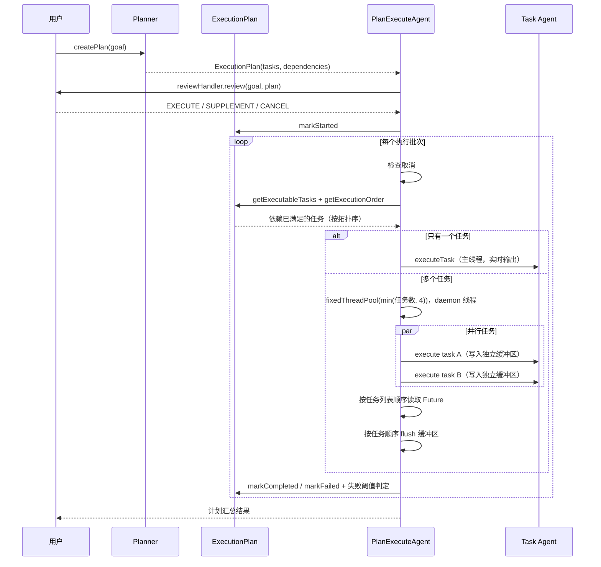
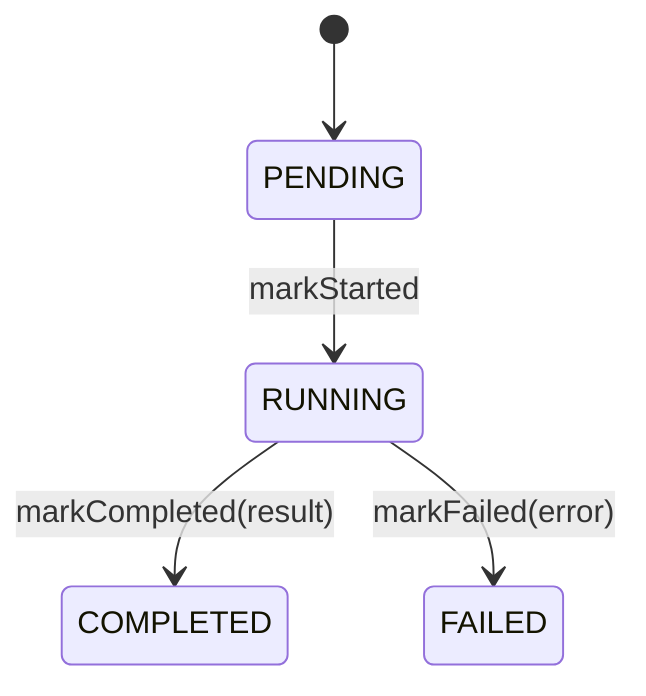

# Plan-and-Execute DAG 任务编排

## 1. 功能定位

Plan-and-Execute 是 CodeAgent 在 ReAct 之外提供的第二种执行范式：先把一次复杂目标交给模型拆解成带依赖关系的 `Task` 集合，形成一个**有向无环图（DAG）**，再用显式调度器按依赖推进。`Planner` 负责把自然语言目标转成结构化计划并做 JSON 清洗、任务 ID 规范化与依赖映射；`ExecutionPlan` 是图聚合根，负责拓扑排序、环检测、可执行集合与进度计算；`PlanExecuteAgent` 负责计划审阅、批次调度、单任务内部的多轮 Tool Calling 循环，以及最终结果汇总。与 ReAct「走一步看一步」不同，这里的任务边界在执行前就已经被固定下来，因此可以提前展示、并行调度和按依赖汇聚。

- 源码入口：`PlanExecuteAgent.run(String)` — `src/main/java/com/codeagent/agent/PlanExecuteAgent.java:221`
- 主调度循环：`PlanExecuteAgent.executePlan(ExecutionPlan, StreamState)` — `PlanExecuteAgent.java:274`
- 计划生成：`Planner.createPlan(String)` — `src/main/java/com/codeagent/plan/Planner.java:51`
- 拓扑排序：`ExecutionPlan.computeExecutionOrder()` — `src/main/java/com/codeagent/plan/ExecutionPlan.java:94`

## 2. 设计意图

### 2.1 ReAct 在复杂任务中的局限

ReAct 适合「边探索边决定下一步」。但对于依赖关系明确、步骤之间可以并行或必须串行的复杂任务，纯 ReAct 有三个问题：

- 模型不一定在开始时形成完整任务边界，容易遗漏或重复步骤。
- 相互独立的步骤被串行执行，浪费可并行的机会。
- 用户无法在执行前审查整体方案，高风险动作缺少一次整体确认。

Plan-and-Execute 的意图就是把「制定计划」和「执行步骤」拆开：先构造一个显式 DAG，再按依赖关系推进。

### 2.2 DAG 带来的工程价值

DAG 是 Directed Acyclic Graph，即有向无环图。在任务编排中：

- 节点表示任务，边表示前置依赖。
- 无环约束保证存在可完成的拓扑顺序。
- 同一拓扑层（依赖都已满足）中的任务可以并行执行。

它把模型生成的自然语言计划，转换成**可验证、可调度、可解释**的结构。

### 2.3 本项目的职责拆分

| 组件 | 职责 |
|---|---|
| `Planner` | 让模型生成计划，清洗 JSON，规范化任务 ID 与依赖 |
| `ExecutionPlan` | 维护任务图和拓扑/批次算法，不涉及 LLM |
| `PlanExecuteAgent` | 用户审阅、批次调度、并发控制、单任务执行 |
| `Task` | 单个节点的状态、结果与时间戳 |

这种拆分避免把 JSON 解析、图算法和 LLM 循环全部塞进一个类。需要强调的是：**一个 DAG 节点不等于一次模型调用**，节点内部仍是一个受迭代上限约束的小型 ReAct 循环（见 §3.5）。

## 3. 总体架构与关键流程

### 3.1 总体架构


### 3.2 一次计划执行时序



### 3.3 核心领域模型

`ExecutionPlan`（`ExecutionPlan.java:8`）是 DAG 的聚合根，主要字段：

| 字段 | 含义 |
|---|---|
| `id` / `goal` | 计划唯一标识、用户原始目标 |
| `tasks` | `LinkedHashMap`，按 ID 保存任务并保持插入顺序 |
| `executionOrder` | DFS 拓扑排序后的稳定顺序 |
| `status` | 计划状态（`CREATED` / `RUNNING` / `COMPLETED` / `FAILED` / `CANCELLED`） |
| `summary` | Planner 生成的计划摘要（仅用于展示，见 §4） |
| `startTime` / `endTime` | 执行时间范围 |

`Task`（`Task.java:8`）表示一个可独立执行的工作单元：`id`、`description`、`type`、`dependencies`、`dependents`、`status`、`result`、`error`、`startTime`、`endTime`。`TaskType` 有 `PLANNING` / `FILE_READ` / `FILE_WRITE` / `COMMAND` / `ANALYSIS` / `VERIFICATION`（`Task.java:20-27`），它只影响节点 Prompt 的 `taskType` 变量，**不是 Java 执行分支**。

### 3.4 任务状态机现状



`TaskStatus` 的枚举值只有 `PENDING` / `RUNNING` / `COMPLETED` / `FAILED` / `SKIPPED`（`Task.java:29-35`），**没有 `CANCELLED`**。虽然定义了 `markSkipped()`（`Task.java:97-100`），但全仓库没有任何调用点，因此 `SKIPPED` 是不可达状态；`PlanStatus.CANCELLED`（`ExecutionPlan.java:23`）同样从未被赋值。取消不会落到任务或计划的状态上，而是直接让 `executePlan` 提前返回一段取消文案（`PlanExecuteAgent.java:283-285`、`PlanExecuteAgent.java:498-501`）。

### 3.5 executePlan 完整调用链

#### 入口与审阅（`PlanExecuteAgent.java:221-272`）

1. `run(String)` 把用户输入写入短期记忆（`PlanExecuteAgent.java:223`），先检查一次取消（`PlanExecuteAgent.java:226`）。
2. `runWithPlan()` 调用 `planner.createPlan(goal)`（`PlanExecuteAgent.java:249`）。
3. `reviewAndExecutePlan()` 循环读取 `PlanReviewHandler` 的决策（`PlanExecuteAgent.java:253-272`）：`CANCEL` 返回 `PlanRunOutcome.canceled`（不写回 assistant 历史）；`SUPPLEMENT` 把补充要求拼进目标后重新规划；空反馈按 `EXECUTE` 处理，避免审阅界面卡死。
4. `run()` 根据 `PlanRunOutcome.persistAssistantMessage()` 决定是否把结果写回历史（`PlanExecuteAgent.java:230-232`）。

#### 调度循环（`PlanExecuteAgent.java:274-349`）

1. `plan.markStarted()`（`PlanExecuteAgent.java:278`）。
2. 每轮先检查取消（`PlanExecuteAgent.java:283`），再用 `getExecutableTasksInOrder(plan)` 取「依赖已满足」且按 `executionOrder` 排好的任务（`PlanExecuteAgent.java:351-360`）。
3. 可执行集合为空则跳出循环（`PlanExecuteAgent.java:287-289`）。
4. `executeTaskBatch()` 执行整批（`PlanExecuteAgent.java:291`）。
5. 主线程**按批次结果顺序**逐个更新任务状态：成功 `markCompleted`（`PlanExecuteAgent.java:296`），失败 `markFailed`（`PlanExecuteAgent.java:310`）。
6. 失败时判断进度阈值（`PlanExecuteAgent.java:314`）：低于 50% 就走 `planner.replan` 并递归回到审阅（`PlanExecuteAgent.java:316-317`）；否则把失败信息累积进 `finalResult`（`PlanExecuteAgent.java:320-323`）。
7. 循环结束后：既未全部完成又无失败 → 标记计划失败并返回「存在未满足依赖」（`PlanExecuteAgent.java:327-330`）；有失败 → 「计划部分完成，有任务失败」（`PlanExecuteAgent.java:336-342`）；否则 `markCompleted` 并返回汇总（`PlanExecuteAgent.java:344-348`）。

#### 单任务内部循环（`PlanExecuteAgent.java:442-558`）

1. 用 `PromptAssembler.assemble(PromptMode.PLAN, ...)` 组装节点 system prompt，只注入 `taskType`、`taskDescription`、项目记忆、外部上下文和 Skill 索引（`PlanExecuteAgent.java:444-451`）。
2. `buildTaskContext()` 拼出用户侧输入（`PlanExecuteAgent.java:457` → `846-872`），随后追加长期记忆检索结果与 Skill 正文（`PlanExecuteAgent.java:458-461`）。
3. 进入 `while (iteration < MAX_TASK_ITERATIONS)`（`PlanExecuteAgent.java:478`），每轮先注入待处理的 LSP 诊断、按需压缩历史（`PlanExecuteAgent.java:486-487`），再调 `llmClient.chat`（`PlanExecuteAgent.java:489-493`）。
4. 无 Tool Call 时任务收尾返回（`PlanExecuteAgent.java:514-529`）；有 Tool Call 时保存 assistant `tool_calls` 消息（`PlanExecuteAgent.java:533-537`）、`resetBetweenIterations()` 收尾流式区（`PlanExecuteAgent.java:541`）、执行工具并把结果回灌进 `messages`（`PlanExecuteAgent.java:543-548`）。
5. 迭代次数耗尽后**不抛异常**，而是把累计的工具文本结果作为任务结果返回（`PlanExecuteAgent.java:552-557`，详见 §4）。

### 3.6 主调度伪代码

```text
executePlan(plan):
    plan.markStarted()
    while true:
        if cancelled: return 取消文案
        executable = plan 中依赖已满足的任务，按 executionOrder 排序
        if executable 为空: break
        results = executeTaskBatch(executable)
        for r in results:                       # 主线程顺序更新
            if r 成功: r.task.markCompleted(r.result)
            else:
                r.task.markFailed(r.error)
                if plan.getProgress() < 50%:     # 阈值判定在批次内
                    return reviewAndExecutePlan(planner.replan(plan, r.error))
                累积失败信息到 finalResult
    if 未全部完成 且 无失败: plan.markFailed(); return "存在未满足依赖"
    return 汇总（有失败 → 部分完成；否则 markCompleted）
```

### 3.7 拓扑排序与批次计算

`computeExecutionOrder()`（`ExecutionPlan.java:94-108`）对每个未访问节点做 DFS，`topologicalSort()`（`ExecutionPlan.java:110-135`）维护 `visited` 与 `visiting` 两个集合：节点重新出现在 `visiting` 中即命中回边，返回 `false` 表示有环。`Planner.parsePlan` 在解析阶段直接调用它，有环就抛 `IOException("计划中存在循环依赖")`（`Planner.java:140-142`），因此环永远进不了调度阶段。

```text
computeExecutionOrder:
    order = [], visited = {}, visiting = {}
    for task in tasks:
        if task not in visited and not dfs(task): return false
    return true

dfs(task):
    if task in visiting: return false      # 回边 → 有环
    if task in visited: return true
    visiting.add(task)
    for dep in task.dependencies:
        if dep exists and not dfs(dep): return false
    visiting.remove(task); visited.add(task); order.add(task)
    return true
```

批次有两个不同用途的入口，**不要混用**：

- `getExecutionBatches()`（`ExecutionPlan.java:266-292`）：只看图结构，按「依赖是否位于已完成集合」分层，批次为空即 `break`。用于计划预览（`summarize()`，`ExecutionPlan.java:243`）。
- `getExecutableTasks()`（`ExecutionPlan.java:85-89`）：看**运行时状态**，逐任务走 `Task.isExecutable()`（`Task.java:114-123`）。这是真正驱动调度的集合。

### 3.8 典型场景推演

用户目标：

> 修改用户模块和订单模块的日志格式，最后运行回归测试。

Planner 可能生成：

```json
{
  "tasks": [
    {"id": "t1", "description": "检查用户模块日志实现", "dependencies": []},
    {"id": "t2", "description": "检查订单模块日志实现", "dependencies": []},
    {"id": "t3", "description": "修改用户模块日志", "dependencies": ["t1"]},
    {"id": "t4", "description": "修改订单模块日志", "dependencies": ["t2"]},
    {"id": "t5", "description": "运行回归测试", "dependencies": ["t3", "t4"]}
  ]
}
```

解析后任务 ID 会被规范化为 `task_<序号>`（`Planner.java:109`），依赖 ID 同步重映射（`Planner.java:128-134`）。理论批次为 `{t1,t2}` → `{t3,t4}` → `{t5}`（`getExecutionBatches`，`ExecutionPlan.java:266`）。前两批各有两个互不依赖的任务，会走并行路径；`t5` 必须等两个修改任务都 `COMPLETED` 后才进入可执行集合。并行执行时每个任务写自己的 `ByteArrayOutputStream`，主线程在批次末尾按任务顺序 flush（`PlanExecuteAgent.java:389-429`），因此即使 `t2` 先完成，终端输出仍按计划顺序呈现。

## 4. 设计意图 vs 实际实现

以下是文档意图与代码实际行为存在差异的地方。每条给出源码位置，具体数值以源码为准。

| 主题 | 设计意图 | 实际实现 | 源码位置 |
|---|---|---|---|
| 任务取消状态 | 以为取消会让任务进入「已取消」状态 | **不存在**。`TaskStatus` 没有 `CANCELLED`，取消只是让调度循环提前 `return` 取消文案，任务状态保持不变 | `Task.java:29-35`、`PlanExecuteAgent.java:283-285` |
| 任务跳过状态 | 以为前置任务失败会让后继任务 `SKIPPED` | `SKIPPED` 枚举值存在、`markSkipped()` 也有实现，但**全仓库无任何调用点**，是不可达状态；前置失败只会让后继任务停留在 `PENDING` | `Task.java:97-100`、`ExecutionPlan.java:329` |
| 计划取消状态 | 以为 `PlanStatus.CANCELLED` 会被赋值 | 枚举值声明了，但**从未被赋值**；取消路径不碰 `plan.status` | `ExecutionPlan.java:23`、`PlanExecuteAgent.java:260-262` |
| 节点 Prompt 内容 | 文档称节点 Prompt 包含「当前计划摘要」 | **不含**。`buildTaskContext` 只拼「总目标 + 当前任务 + 依赖任务结果」；`PromptMode.PLAN` 也只注入 taskType/taskDescription，计划 `summary` 仅用于 `summarize()` 展示 | `PlanExecuteAgent.java:846-872`、`PlanExecuteAgent.java:444-451` |
| 缺失依赖 | 文档称依赖不存在会让任务「无法推进」 | **静默丢弃**。解析期 `idMapping` 查不到就保留原 ID，`getTask` 为 null 时直接跳过，依赖不入边；`buildTaskContext` 同样 `continue` 跳过 null 依赖。结果是该任务**没有任何依赖，立刻可执行** | `Planner.java:128-134`、`PlanExecuteAgent.java:856-858` |
| 节点迭代耗尽 | 文档称耗尽后返回节点失败 | 循环结束后把累计的 `allResults` 作为**成功结果**返回（`TaskRunResult` 无 error），调度层随即 `markCompleted` | `PlanExecuteAgent.java:552-557`、`PlanExecuteAgent.java:478`、`PlanExecuteAgent.java:296` |
| replan 输入 | 文档列出「失败任务」作为 replan 输入 | `Planner.replan` 只传三样：原目标、`failureReason` 字符串、`COMPLETED` 任务列表；**不传失败任务清单** | `Planner.java:171-189` |
| 50% 阈值判定位置 | 以为在整批完成后再判定 | 判定在**逐条处理批次结果的循环内部**（`for (TaskExecutionResult ...)`），因此首个失败任务就可能触发 replan，此时同批兄弟任务尚未 `markCompleted`，进度被低估，剩余结果直接丢弃 | `PlanExecuteAgent.java:292`、`PlanExecuteAgent.java:314-317` |
| 最终结果汇总 | 以为会收集所有任务结果 | `buildFinalResult` 只取**叶子任务**（`getDependents().isEmpty()`），且**跳过有过流式输出的任务**；叶子为空时回退到「最后一个非流式、非空」的任务结果 | `PlanExecuteAgent.java:874-903` |
| 单任务 vs 多任务输出 | 以为所有任务都走缓冲 | 只有单任务批次把真实 `out` 传给节点（**实时流式输出**）；多任务批次才创建每任务独立缓冲，主线程按顺序 flush | `PlanExecuteAgent.java:364-375`、`PlanExecuteAgent.java:383-429` |
| 线程池生命周期 | 少见显式说明 | 线程为 **daemon**，命名 `codeagent-plan-executor`；批次结束在 `finally` 中调用 `shutdownNow()` | `PlanExecuteAgent.java:383-387`、`PlanExecuteAgent.java:432-434` |
| 简单目标快速路径 | 以为一定调用模型规划 | `isSimpleGoal` 先排多步骤提示词（「然后/并且/再/最后/同时/先/之后/接着/以及」），再卡长度阈值，最后要求命中动作词（「列出/查看/读取/显示/执行/运行/搜索/当前目录/文件」）；命中则走 `createMinimalPlan` 单节点计划，不调 LLM | `Planner.java:192-229` |
| 任务 ID | 以为沿用模型给的 ID | 解析后统一重命名为 `task_<序号>`，并建立 `idMapping` 供依赖重映射 | `Planner.java:104-117` |
| 「无法推进」分支 | 以为这是常见失败路径 | `if (!plan.isAllCompleted() && !plan.hasFailed())` 需要存在「既未完成也未失败」的前置任务；环在解析期已被拒绝、`SKIPPED` 从未设置，因此该分支在 Planner 正常产出的计划上基本不可达 | `PlanExecuteAgent.java:327-330` |
| 未知任务类型 | 以为会报错 | `parseTaskType` 的 `default` 静默回退为 `ANALYSIS` | `Planner.java:150-159` |

## 5. 设计取舍

### 5.1 DFS 拓扑排序 vs Kahn 算法

当前用 DFS + 递归栈（`ExecutionPlan.java:110-135`）。优点是实现紧凑、可直接用 `visiting` 集合检测环、适合小规模任务图。Kahn 算法更容易直接产出分层批次和定位入度异常，代价是要额外维护入度表。当前计划规模小，DFS 够用。

代价：批次结构靠 `getExecutionBatches` 单独算一遍，与拓扑顺序是两套代码，容易出现「理论批次」和「运行时批次」不一致的理解成本。

### 5.2 显式线程池 vs CompletableFuture

当前显式使用 `ExecutorService` + `Future`（`PlanExecuteAgent.java:383-420`）。优点：并发度一眼可见、提交顺序与结果顺序天然对齐、和同步的 `ToolRegistry` API 配合简单。CompletableFuture 适合更复杂的异步组合，但会引入更深的异常链和上下文传播复杂度。

代价：并发上限写死在调度器里（`PlanExecuteAgent.java:383`），没有按任务权重或资源压力动态调节。

### 5.3 DAG 节点：一次 Tool Call vs 一个小型 ReAct 循环

当前每个节点是一个可多轮推理的 Agent 任务，能自行探索和纠错。代价是节点耗时与副作用不完全可预测，也无法给单节点做精确时间预算。如果需要确定性工作流，可以增加「只允许单工具动作」的节点类型。

### 5.4 独立缓冲区 vs 直接共享 stdout

并行任务同时产生 reasoning、content 和工具日志，共享 `PrintStream` 会让字符级输出交错，transcript 无法对应计划。因此每个任务写自己的 `ByteArrayOutputStream`，批次末尾按任务顺序整体 flush（`PlanExecuteAgent.java:389-429`）。代价是**牺牲了并行任务的逐字符实时显示**——用户看到的是延迟到批次末尾的整块输出。

### 5.5 未知依赖：静默丢弃 vs 解析期拒绝

`parsePlan` 发现依赖 ID 不存在时选择静默跳过（`Planner.java:128-134`），好处是模型偶发笔误不会让整个计划报废。代价是**语义被悄悄改写**：本应等待依赖的任务变成了无依赖任务，可能提前执行并产生错误结果。更严格的做法是在解析期直接拒绝并让模型重试。

### 5.6 计划先审阅 vs 直接执行

计划可能包含写文件、执行命令或外部服务调用。先审阅让用户看到整体方案后补充约束或取消，与工具级 HITL 互补：计划审阅确认方向，工具审批确认具体高风险动作。代价是多一次交互往返，且重新规划会重新进入审阅（`PlanExecuteAgent.java:253-272`），自动化场景需要传入「总是执行」的 handler。

## 6. 失败与边界矩阵

| 失败点 | 检测方式 | 当前处理 | 影响范围 | 源码位置 |
|---|---|---|---|---|
| Planner LLM 异常 | 捕获 `IOException` | 由 `run` 包成「执行失败」并写入历史 | 整个计划 | `PlanExecuteAgent.java:237-242` |
| Planner 返回空/非法 JSON | Jackson 解析异常 | 抛出，计划不进入执行 | 整个计划 | `Planner.java:90-96` |
| 计划 JSON fence | `replaceAll` 清洗 | 去除 ```` ```json ```` 与 ```` ``` ```` | — | `Planner.java:92-94` |
| 环依赖 | DFS `visiting` 命中 | 抛 `IOException("计划中存在循环依赖")` | 整个计划 | `Planner.java:140-142`、`ExecutionPlan.java:113` |
| 未知任务类型 | `parseTaskType` default | 回退为 `ANALYSIS` | 单任务 | `Planner.java:150-159` |
| 未知依赖 ID | `idMapping` / `getTask` 未命中 | **静默丢弃该依赖**，任务变为立即就绪 | 单任务（语义被改写） | `Planner.java:128-134`、`PlanExecuteAgent.java:856-858` |
| 用户取消审阅 | `PlanReviewAction.CANCEL` | 返回取消文案，不写 assistant 历史 | 整个计划 | `PlanExecuteAgent.java:260-262` |
| 用户取消执行 | `CancellationContext` | 批次开始前、节点迭代前/后检查，返回取消文案 | 剩余任务 | `PlanExecuteAgent.java:283`、`479`、`498` |
| 并行线程抛异常 | `ExecutionException` | 解包 cause，包装为任务失败 | 单任务 | `PlanExecuteAgent.java:413-419` |
| 等待被中断 | `InterruptedException` | 恢复中断位，包装为任务失败 | 单任务 | `PlanExecuteAgent.java:410-412` |
| 节点迭代耗尽 | `iteration < MAX_TASK_ITERATIONS`（常量，`PlanExecuteAgent.java:437`） | **不报错**，把累计工具结果当成功返回，随后任务被标记完成 | 单任务 | `PlanExecuteAgent.java:552-557`、`PlanExecuteAgent.java:296` |
| 工具失败 | Tool result 语义 | 作为 tool 消息回灌，交给节点模型纠错 | 单工具/节点 | `PlanExecuteAgent.java:543-548` |
| 早期任务失败 | 进度低于 50% | 带 `failureReason` 调 `replan`，回到审阅 | 后续计划 | `PlanExecuteAgent.java:314-317` |
| 后期任务失败 | 进度不低于 50% | 累积失败信息，保留已完成结果，返回「部分完成」 | 失败节点及其依赖 | `PlanExecuteAgent.java:320-323`、`PlanExecuteAgent.java:336-342` |
| 依赖失败 | 前置任务为 `FAILED` | 后继任务永远不满足 `isExecutable`，停留在 `PENDING`，循环因无可执行任务而退出 | 剩余节点 | `Task.java:114-123`、`PlanExecuteAgent.java:287-289` |
| 无可执行任务且无失败 | `getExecutableTasks` 返回空 | 标记计划失败并返回「存在未满足依赖」（正常计划上基本不可达） | 剩余节点 | `PlanExecuteAgent.java:327-330` |

## 7. 测试策略与证据

以下只列出仓库中**确实存在**的测试与其断言点，避免把设计意图当成已覆盖。

### 7.1 ExecutionPlanTest（`src/test/java/com/codeagent/plan/ExecutionPlanTest.java`）

| 用例 | 覆盖点 | 位置 |
|---|---|---|
| `computeExecutionOrderRespectsDependencies` | 链式依赖的拓扑顺序 | `ExecutionPlanTest.java:13` |
| `executableTasksWaitUntilDependenciesComplete` | 依赖未完成时不可执行、完成后进入可执行集合 | `ExecutionPlanTest.java:27` |
| `addDependencyMutatesTaskState` | `addDependency` 写入依赖列表 | `ExecutionPlanTest.java:43` |
| `addTaskBuildsDependentRelationship` | `addTask` 自动登记反向 `dependents` | `ExecutionPlanTest.java:52` |
| `executableTasksCanExposeParallelBatch` | 多根节点的可执行集合与收敛 | `ExecutionPlanTest.java:64` |
| `summarizeKeepsPlanPreviewCompact` | 摘要紧凑、含批次与可执行数、不输出完整 DAG | `ExecutionPlanTest.java:84` |
| `executionBatchesFollowDagLayers` | 批次按 DAG 分层 | `ExecutionPlanTest.java:104` |

### 7.2 PlannerTest（`src/test/java/com/codeagent/plan/PlannerTest.java`）

| 用例 | 覆盖点 | 位置 |
|---|---|---|
| `createsMinimalPlanForSimpleGoalWithoutCallingLlm` | 简单目标走快速路径，单节点、类型推断正确，且**断言 LLM 未被调用** | `PlannerTest.java:16` |
| `delegatesComplexGoalToLlmPlannerPath` | 复杂目标走 LLM；JSON 解析、依赖映射（原 ID → 规范化 ID）、项目记忆注入 system prompt | `PlannerTest.java:29` |

### 7.3 PlanExecuteAgentTest（`src/test/java/com/codeagent/agent/PlanExecuteAgentTest.java`）

| 用例 | 覆盖点 | 位置 |
|---|---|---|
| `shouldWritePlanExecutionArtifactsBackToShortTermMemoryOnly` | 节点内 Tool Call → 回灌 → 最终 content 的多轮路径；结果只写短期记忆、不写长期记忆 | `PlanExecuteAgentTest.java:34` |
| `shouldNotExtractFactsWhenPlanIsCanceled` | 审阅取消返回固定文案且不提取事实 | `PlanExecuteAgentTest.java:85` |
| `shouldNotRepeatStreamedTaskOutputInFinalPlanSummary` | 任务正文已流式输出后，最终汇总不重复正文 | `PlanExecuteAgentTest.java:109` |
| `shouldNotPrintEmptyTaskReasoningHeadingAndShouldUseOutputLabel` | 纯空白 reasoning 不打印「任务思考」标题；流式正文标注为「任务输出」而非「任务结果」 | `PlanExecuteAgentTest.java:134` |

### 7.4 尚未覆盖（诚实清单）

仓库中**没有**针对以下行为的测试，它们是当前实现的可信度缺口：

- 环依赖检测与 `parsePlan` 抛错路径（`ExecutionPlanTest` 未包含环用例）。
- `replan` 触发与 50% 阈值分支。
- `PlanExecuteAgent` 的多任务并行路径、并发峰值与结果顺序。
- `buildFinalResult` 的叶子筛选与流式跳过逻辑。
- 未知依赖被静默丢弃的语义。
- 节点迭代耗尽时返回「成功」的行为。
- 线程池中断、超时与 `shutdownNow()` 后的状态一致性。

### 7.5 手工验收关注点

- 多任务批次中，不同任务的输出块是否按计划顺序整体出现、无字符交错。
- 单任务批次是否实时流式输出（与多批次的延迟整块输出形成对比）。
- 计划审阅的「补充要求」路径是否重新规划并再次进入审阅。
- 任务失败后，依赖它的任务是否确实不再执行、并在汇总中体现。

## 8. 面试讲解模板

### 8.1 30 秒版本

我在 ReAct 之外实现了一套 Plan-and-Execute 模式。Planner 用模型把复杂目标解析成带依赖的 Task DAG，并把模型给的 ID 规范化；ExecutionPlan 用 DFS 做拓扑排序和环检测，按依赖是否满足计算可执行集合；PlanExecuteAgent 把同一批次中互不依赖的任务放进固定线程池，最多 4 路并行，每个任务写独立输出缓冲、主线程按计划顺序回放，保证并行执行和稳定展示顺序。任务失败时按进度阈值决定重新规划还是保留部分结果，执行前还支持用户审阅和补充。

### 8.2 2 分钟版本

这套编排把「计划生成」「图算法」「调度执行」三层拆开。Planner 负责让模型输出结构化 JSON，做 fence 清洗、任务 ID 归一化和依赖映射，并对简单目标走不调用模型的快速路径；ExecutionPlan 是纯数据结构，负责拓扑排序、环检测、批次计算和进度；PlanExecuteAgent 只关心怎么把图跑起来。

调度循环每轮取「依赖全部完成」的任务，按拓扑顺序排好。单个任务走主线程串行并实时流式输出；多个任务才建固定线程池，上限 4 路并行，每个节点在独立缓冲区里写日志，主线程按提交顺序读 Future、再按任务顺序 flush，所以并发不会打乱 transcript。节点本身不是一次调用，而是一个受迭代上限约束的小循环，内部还能多轮 Tool Call、注入 LSP 诊断和压缩历史。

任务状态只由主线程按顺序更新，避免多线程争抢聚合状态。失败处理上，早期失败会带失败原因重新规划并重新进入用户审阅；后期失败保留已完成结果并明确报告「部分完成」。需要诚实说明的是：迭代耗尽的节点会以累计的工具结果被标记为完成，而不是失败；缺失的依赖会被静默丢弃而不是让任务卡住——这两点是我在写文档时对照源码才发现的实现与意图的差距。

## 9. 高频面试问答

### Q1：为什么使用 DAG，而不是让模型直接一步步执行？

DAG 能显式表达前置依赖，同时识别可并行任务；无环约束保证存在合法拓扑顺序。它把自然语言计划转换成可验证、可调度的结构，也让用户在执行前就能审查整体方案。

### Q2：如何检测循环依赖？

DFS 中维护 `visiting` 递归栈。再次访问 `visiting` 中的节点表示存在回边（`ExecutionPlan.java:113`）。`Planner.parsePlan` 在解析阶段就调用 `computeExecutionOrder()`，有环直接抛 `IOException`（`Planner.java:140-142`）。

### Q3：如何计算并行批次？

静态批次由 `getExecutionBatches()` 按「依赖是否位于已完成集合」逐层选出（`ExecutionPlan.java:266-292`）；运行时真正驱动调度的是 `getExecutableTasks()` + `Task.isExecutable()`（`ExecutionPlan.java:85`、`Task.java:114`）。批次为空即退出，避免死循环。

### Q4：为什么并发上限是 4？

这是进程内资源保护值，用于限制并发的模型与工具请求。它硬编码在调度器里，见 `PlanExecuteAgent.java:383`。选择固定上限是为了行为简单可预测，代价是不能按任务权重动态调节。

### Q5：并行结果如何保持顺序？

两层保证：输入按 `executionOrder` 排序后提交，`Future` 按提交顺序读取（`PlanExecuteAgent.java:407-420`）；每个任务的输出写独立 `ByteArrayOutputStream`，批次末尾按任务顺序 flush（`PlanExecuteAgent.java:423-429`）。

### Q6：任务失败后为什么不是全部终止？

已完成任务可能仍有价值。代码按失败时的进度决定：低于 50% 触发 `replan`，否则保留部分结果（`PlanExecuteAgent.java:314-323`）。但要注意判定发生在逐条处理批次结果的循环里，因此首个失败任务就可能触发，此时同批其他任务还没标记完成。

### Q7：重新规划会绕过用户确认吗？

不会。`replan` 之后会重新进入 `reviewAndExecutePlan()`（`PlanExecuteAgent.java:316-317`），继续经过 `PlanReviewHandler`。

### Q8：DAG 节点内部如何执行？

每个节点有自己独立的消息列表，内部是一个受迭代上限约束的循环（`PlanExecuteAgent.java:478`，常量见 `PlanExecuteAgent.java:437`），可以多轮 Tool Call、注入 LSP 诊断、按需压缩历史，也能流式输出。

### Q9：如何处理无效依赖？

需要区分两件事。实际上**依赖 ID 不存在时会被静默丢弃**（`Planner.java:128-134`），任务会变成无依赖、立刻可执行——这是实现与意图的差距。而「依赖存在但前置任务失败」时，后继任务会永久停留在 `PENDING`，循环因无可执行任务而退出（`Task.java:114-123`）。更严格的做法是在解析期校验全部依赖 ID。

### Q10：任务状态由谁更新？

并行线程只返回 `TaskExecutionResult`（`PlanExecuteAgent.java:65-77`）；主调度线程按批次结果顺序更新 `Task` 的状态（`PlanExecuteAgent.java:292-324`）。这样可以减少多线程直接修改计划聚合状态的竞争。

### Q11：计划审阅和 HITL 有何区别？

计划审阅针对整体执行方案，HITL 针对具体危险 Tool Call。前者确认方向，后者确认具体高风险动作。

### Q12：如何处理用户补充要求？

`SUPPLEMENT` 会把补充内容拼进原目标后重新调用 Planner（`PlanExecuteAgent.java:269-270`），不会在原图上做不透明的局部修改。空反馈按执行处理，避免审阅界面因无内容陷入循环（`PlanExecuteAgent.java:264-267`）。

### Q13：为什么设置节点最大迭代次数？

防止单节点因工具调用反复循环而占用整个计划。常量定义在 `PlanExecuteAgent.java:437`。**需要特别注意**：迭代耗尽后节点不会失败，而是把累计的工具结果当作成功返回并被 `markCompleted`（`PlanExecuteAgent.java:552-557`），因此这条兜底实际会产出「未完成的成功」。

### Q14：并行任务修改同一文件怎么办？

当前依赖 Planner 正确建立冲突任务间的依赖。DAG 只表达显式依赖，如果两个任务写同一文件而 Planner 没有建边，可能产生逻辑冲突。进一步增强可以引入资源声明、路径写锁或静态写集分析。

### Q15：为什么失败阈值用 50%？

它是简单的成本启发式，不是业务保证：早期失败时推倒重来更划算，后期失败时保留已完成工作。当前实现把判定放在批次结果循环内部（`PlanExecuteAgent.java:314`），所以它对「同批其他任务」的完成情况感知偏保守，进度是被低估的。

### Q16：如何保证任务结果能传给下游？

`buildTaskContext` 从**已完成依赖**中提取结果，加入下游节点 Prompt（`PlanExecuteAgent.java:846-872`）。非依赖节点的结果不会被无条件注入。注意节点 Prompt 里**没有**「计划摘要」，只有总目标、当前任务和依赖结果。

### Q17：DAG 能持久化吗？

不能。Plan 的执行状态主要在内存（`ExecutionPlan` 里只有 `status` 和时间戳）。后台 DurableTask 是另一套 SQLite 持久化任务机制，与这里的 DAG 调度不是同一套。

### Q18：如何测试并发确实发生？

可以用受控 Latch 或 Barrier 的假 `LlmClient`，让两个节点同时进入执行点，并断言最大并发数与最终顺序，不能只比较总耗时。目前 `PlanExecuteAgent` 的并行路径**还没有这样的测试**，这是已知缺口。

### Q19：最终汇总如何生成？

`buildFinalResult` 只收集叶子任务（`getDependents().isEmpty()`）且跳过已流式输出的任务；如果叶子为空或全部被跳过，回退到「最后一个非流式、非空」的任务结果（`PlanExecuteAgent.java:874-903`）。这意味着中间节点的结果不会出现在最终汇总里。

### Q20：下一步如何演进？

可以增加图持久化与断点恢复、资源锁与写集分析、任务权重与关键路径估算、节点级重试与超时预算、在解析期严格校验依赖 ID、修正「迭代耗尽返回成功」与「缺失依赖静默丢弃」两个语义问题，以及补上并行路径与 replan 分支的测试。

## 10. 简历条陈与源码证据

| 简历原句 | 代码证据 |
|---|---|
| DAG任务编排：构建 Plan-and-Execute 任务编排能力 | `Planner.createPlan` — `Planner.java:51`；调度入口 `PlanExecuteAgent.executePlan` — `PlanExecuteAgent.java:274`；职责拆分见 `ExecutionPlan.java:8` |
| 将复杂目标拆解为带依赖关系的 DAG 任务 | 解析并建立依赖/被依赖关系 — `Planner.java:107-137`；`Task.dependencies` / `dependents` — `Task.java:15-16`；`ExecutionPlan.addTask` 自动登记反向边 — `ExecutionPlan.java:48-57` |
| 通过拓扑排序 | `computeExecutionOrder()` — `ExecutionPlan.java:94`；DFS 与环检测 `topologicalSort()` — `ExecutionPlan.java:110-135` |
| 和执行批次调度任务 | 静态批次 `getExecutionBatches()` — `ExecutionPlan.java:266`；运行时可执行集合 `getExecutableTasks()` — `ExecutionPlan.java:85`；批次执行 `executeTaskBatch()` — `PlanExecuteAgent.java:362`；带顺序的可执行集合 `getExecutableTasksInOrder` — `PlanExecuteAgent.java:351` |
| 无依赖任务支持最多 4 路并行执行 | `Executors.newFixedThreadPool(Math.min(size, 4))` — `PlanExecuteAgent.java:383`；单任务走串行内联路径 — `PlanExecuteAgent.java:364-375` |
| 并保留工具结果的原始顺序 | Future 按提交顺序读取 — `PlanExecuteAgent.java:407-420`；各任务独立 `ByteArrayOutputStream` 并按任务顺序 flush — `PlanExecuteAgent.java:389-429`；工具结果按原序回灌 — `PlanExecuteAgent.java:544-548` |
| （隐含）计划审阅 | `PlanReviewHandler` / `PlanReviewDecision` — `PlanExecuteAgent.java:79-101`、`PlanExecuteAgent.java:253-272` |
| （隐含）失败重新规划 | `Planner.replan` 与 50% 阈值分支 — `Planner.java:171`、`PlanExecuteAgent.java:314-317` |
| （隐含）节点内多轮工具调用 | `executeTask` 的迭代循环 — `PlanExecuteAgent.java:478-550`，结果汇总返回 — `PlanExecuteAgent.java:552-557` |

## 11. 当前实现边界

- DAG 执行状态主要在内存，没有计划级断点恢复或持久化。
- 并发是单进程线程池，不是分布式工作流引擎；并发上限硬编码在 `PlanExecuteAgent.java:383`。
- **`TaskStatus.SKIPPED` 是不可达状态**（`markSkipped()` 定义了但无调用点），`PlanStatus.CANCELLED` 从未被赋值，取消不落到状态机上。
- **节点迭代耗尽返回「成功」**：`executeTask` 会把累计工具结果作为成功结果返回并让调度器 `markCompleted`，语义上等价于「未完成的成功」。
- **缺失依赖被静默丢弃**：未知依赖 ID 不会让任务卡住，而是让它变成无依赖任务立刻执行，属于被悄悄改写的语义。
- **50% 阈值判定在批次结果循环内部**，可能在同批兄弟任务标记前触发，导致进度被低估且剩余结果被丢弃。
- `buildFinalResult` 只汇总叶子任务并跳过流式输出，中间节点的结果不会进入最终输出。
- 单任务批次实时流式输出、多任务批次延迟整块输出，两条路径的用户体验不一致。
- 任务冲突依赖 Planner 显式建边，没有自动资源冲突检测、写集分析或路径锁。
- 任务没有权重、优先级或关键路径估算，批次顺序仅由插入顺序与 DFS 后序决定。
- 节点副作用不会因后续失败自动回滚；用户可以结合 Side-Git 快照恢复 pre-turn 状态。
- Planner 的 JSON 结构仍受模型输出质量影响；未知任务类型静默回退为 `ANALYSIS`。
- 计划摘要（`ExecutionPlan.summary`）只用于 `summarize()` 展示，不会注入任何任务 Prompt。
