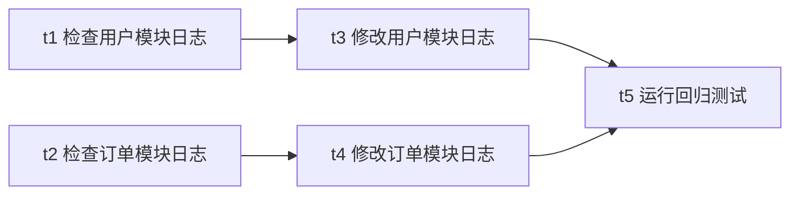
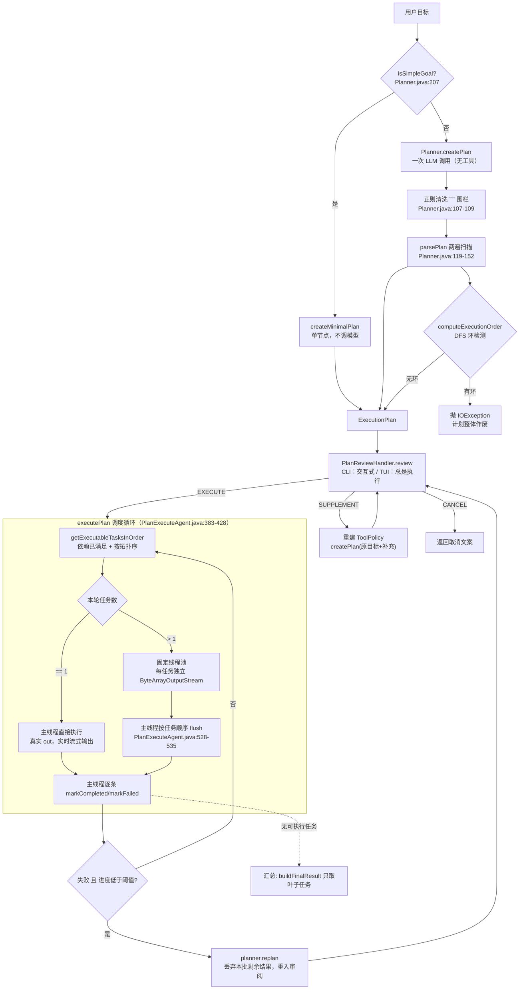
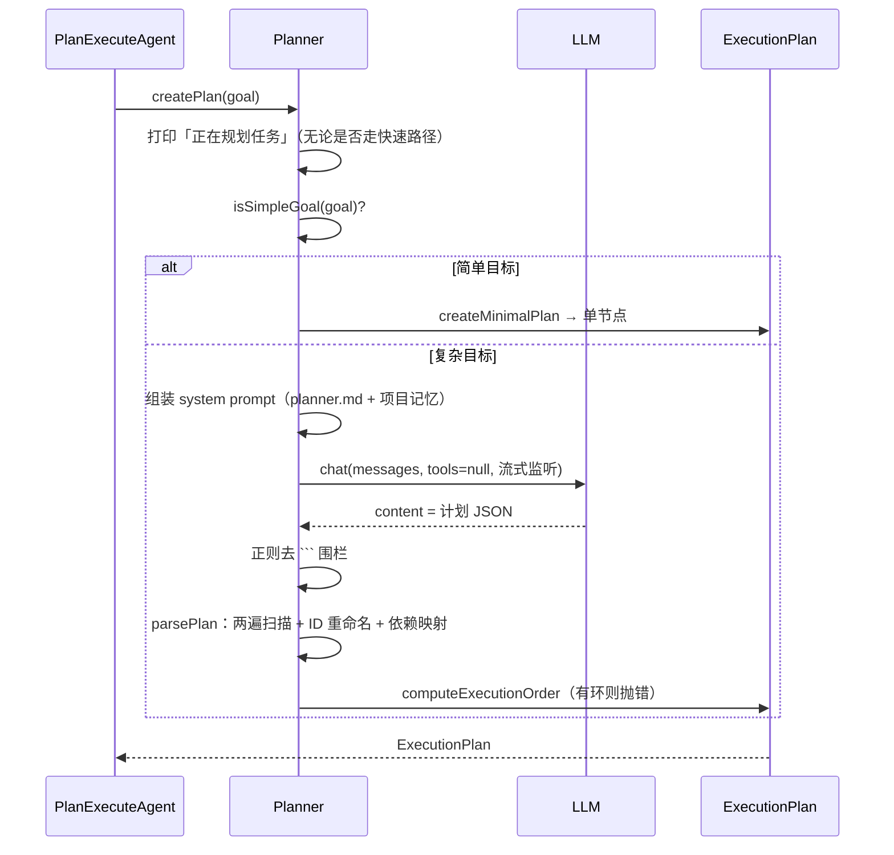
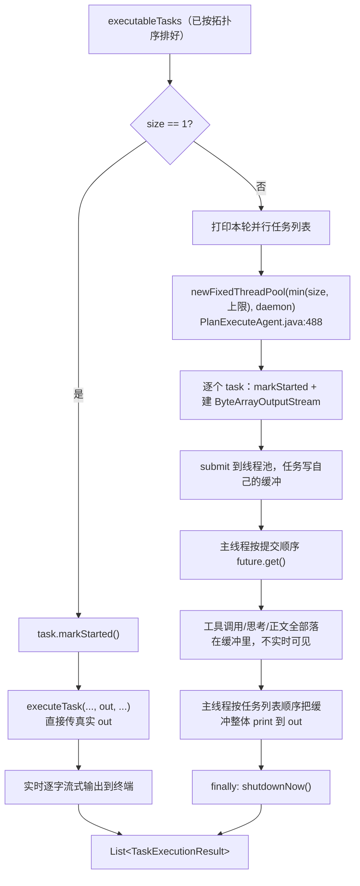
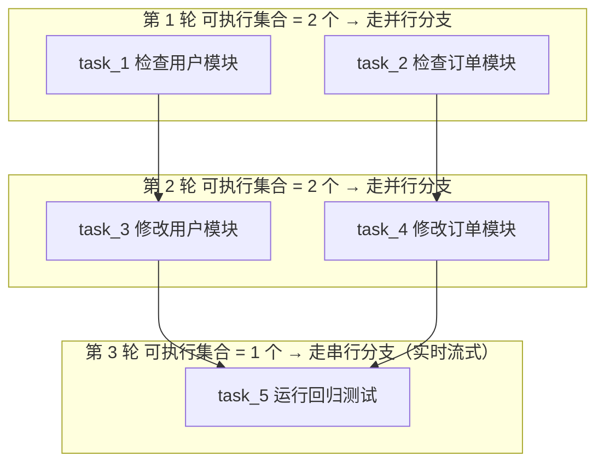

# Plan-and-Execute DAG 任务编排

> **本文怎么读**
>
> - 读者假设：会写 Java、懂工程常识，但**没有接触过 DAG 任务编排，也没写过「先规划再执行」两阶段的 Agent**。第 0 部分专门补这些前置概念，有经验的读者可以直接跳到第 1 部分。
> - 本文描述的是**代码实际做了什么**，包括"写了但没人调用""定义了但到不了""注释说的和实现不是一回事""文档说并行、实际常常退化成串行"这类真实落差。它不是"工作流引擎通用教程"，也不会把将来可能做的持久化、断点恢复或资源锁写成已交付能力。
> - 所有 `file:line` 对应当前源码。正文有意**不写具体常量数值**（数值会随代码调整而过期），需要精确值时按行号自行核对。唯一的例外是简历原句里已经写死的数字（例如"最多 4 路并行"），因为面试一定会被追问，必须能对上代码。
> - 范围界定：本文只讲**单个 `PlanExecuteAgent` 内部**——计划怎么生成、依赖怎么表达、任务怎么按依赖被调度、结果怎么回填。跨角色的 Planner/Worker/Reviewer 协作闭环是另一套东西，见姊妹篇 `03-multi-agent-collaboration.md`。

---

# 第 0 部分　前置知识

## 0.1 这个模块要解决什么问题

ReAct 模式（见 `01-react-agent.md`）的工作方式是"走一步看一步"：模型每轮看一眼当前上下文，决定调哪个工具，看完结果再决定下一步。

对"读一下这个文件"这类任务，这种方式很合适。但对下面这种目标就不合适了：

> "把用户模块和订单模块的日志格式统一，然后跑一遍回归测试。"

问题有三个：

| 问题 | 具体表现 |
|---|---|
| 边界不清 | 模型可能读到一半才发现还有第三个模块，也可能重复读同一个文件。步骤清单从来没被显式写下来过 |
| 无法预审 | 用户只能在模型已经开始改文件之后才知道它打算改什么。没有"先看方案再放行"的机会 |
| 无法并行 | 用户模块和订单模块互不依赖，本该同时做；"走一步看一步"天然是串行的一条线 |

Plan-and-Execute 的思路很直接：**把"想"和"做"拆成两个阶段**。第一阶段让模型一次性产出完整的步骤清单和步骤之间的依赖关系；第二阶段由一个显式的调度器按依赖关系把这些步骤跑完。

第一阶段产出物的名字叫**执行计划**（`ExecutionPlan`），第二阶段干活的类叫 `PlanExecuteAgent`。

## 0.2 什么是 DAG

DAG = Directed Acyclic Graph，**有向无环图**。在这个项目里它的三个要素是：

- **节点**（node）＝ 一个任务，代码里是 `Task`（`src/main/java/com/codeagent/plan/Task.java:8`）。
- **有向边**（directed edge）＝ "我必须等你做完才能开始"，代码里是 `Task.dependencies`（`Task.java:15`）。
- **无环**（acyclic）＝ 不允许 A 等 B、B 等 A 这种死锁。这条约束不是靠"希望模型别写错"来保证的，而是靠一段真正的环检测代码（见 0.4）。

把上面那个目标画出来就是这样：



读这张图要抓住两件事：

1. **边表示"依赖"，不表示"顺序"。** `t1` 和 `t2` 之间没有任何边，意思是"谁先谁后都行"——这才有并行的可能。
2. **"同一时刻可以开始的任务"是一层一层算出来的**，不是模型给的顺序。第一层是 `{t1, t2}`，第二层是 `{t3, t4}`，第三层是 `{t5}`。这个分层过程叫**拓扑排序**（topological sort）。

## 0.3 为什么"无环"必须真的去检查

如果模型写出了环，比如 `t3` 依赖 `t4`、`t4` 又依赖 `t3`，那么：

- 没有任何一个任务满足"依赖都已完成"，任何一个调度器都推不动它；
- 朴素的拓扑排序算法会在这里无限递归，直接把栈撑爆。

所以环检测必须是一段独立代码，而且在**计划进入执行之前**就要跑掉。本项目的做法是在解析阶段就跑一次拓扑排序，失败就抛异常（`Planner.java:155-157`），环根本进不了调度循环。这是"显式图结构"相比"自然语言步骤列表"最直接的收益之一。

## 0.4 拓扑排序与"可执行集合"

**拓扑排序**的输出是一个线性顺序，保证"任何一个任务都排在它所有依赖的后面"。本项目用的是 DFS 版本（`ExecutionPlan.java:94-135`），伪代码见 3.10。

但要驱动调度，光有一个线性顺序不够，还需要**每一刻哪些任务可以开始**。这个集合的判定条件很朴素：

> 一个任务可以执行 ＝ 它的状态还是"未开始"，并且它声明的**每一个**依赖的状态都是"已完成"。

代码就是 `Task.isExecutable`（`Task.java:114-123`）。调度循环每一轮都重算一遍这个集合，所以执行批次是**运行时动态划分**的，不是计划阶段预先算好的。

这里有个容易混的点，本文后面会反复回到它：

| 方法 | 依据 | 用途 |
|---|---|---|
| `getExecutionBatches()`（`ExecutionPlan.java:266-292`） | 只看**图结构**，逐层剥 | **只用于计划预览**（`summarize()`，`ExecutionPlan.java:243-264`） |
| `getExecutableTasks()`（`ExecutionPlan.java:85-89`） | 看**运行时状态**（`Task.isExecutable`） | **真正驱动调度** |

两者算出来的批次在正常情况下一致，但它们是两套独立代码，一个算错了另一个不会发现。

## 0.5 "并行"在这个项目里有三层，别混

说"A 和 B 并行"时，必须先说清楚是哪一层：

| 层次 | 并行的对象 | 上限来自 | 代码位置 |
|---|---|---|---|
| 批次并行 | 同一轮里依赖都已满足的**任务** | `PlanExecuteAgent.executeTaskBatch` 里的线程池 | `PlanExecuteAgent.java:488` |
| 任务内工具并行 | 同一个任务一轮里模型返回的**多个工具调用** | `ToolRegistry` 里的固定上限 | `ToolRegistry.java:63`、`:1331-1336` |
| 计划阶段 | —— | **没有并行**，就一次 LLM 调用 | `Planner.java:78` |

而且前两层是**嵌套**的：批次里的每个任务各自又会开自己的工具线程池。所以严格说，"这个系统最多并行多少个工具"没有单一答案，代码里也**没有全局并发预算**（见第 12 部分）。

还有一条约束值得先记住：批次里的任务是并发跑的，但**任务状态只由主线程更新**，工作线程只负责跑和返回结果（`PlanExecuteAgent.java:394-427`）。这是刻意的设计，代价和收益在 5.2 里说。

## 0.6 名词速查

| 名词 | 在这里的含义 |
|---|---|
| `ExecutionPlan` | 计划聚合根。持有 `Task` 集合、拓扑顺序、计划级状态 |
| `Task` | 一个节点。有 id、描述、类型、依赖列表、被依赖列表、状态、结果 |
| `Planner` | 让模型产出计划 JSON，并把它解析成 `ExecutionPlan` |
| `PlanExecuteAgent` | 调度器 + 单个任务的内部循环 |
| `PlanReviewHandler` | 计划生成后、执行前的一次用户确认回调 |
| `AgentBudget` | **单个任务内部循环**的退出兜底（Token / 停滞 / 显式轮数），不是计划级预算 |
| 批次（batch） | 调度循环一轮里同时取出的那批可执行任务 |
| 叶子任务 | 没有任何任务依赖它的任务（`getDependents().isEmpty()`） |
| CLI 命令 | 用户在交互界面直接敲的 `/xxx` |
| Tool Call | 模型在任务内部一轮里请求调用某个工具 |

---

# 第 1 部分　整体地图

## 1.1 三层拆分

这个模块最大的设计特征是**把三件事拆到三个地方**：



注意图里有个**回边**：执行中失败会带失败原因回到规划——但走的是"重新生成一个**全新的** `ExecutionPlan`"，不是在原图上做局部修改（`PlanExecuteAgent.java:419-420`、`Planner.java:186-205`）。

## 1.2 分层与文件清单

| 层次 | 核心类 | 职责 | 不负责什么 |
|---|---|---|---|
| 规划层 | `Planner` | 让模型输出结构化 JSON、清洗、ID 规范化、依赖映射、简单目标快速路径、重新规划 | 不理解图算法，不管调度 |
| 图结构层 | `ExecutionPlan` | 拓扑排序、环检测、可执行集合、静态批次、进度 | 不碰 LLM，不开线程 |
| 调度层 | `PlanExecuteAgent` | 审阅、批次划分、并发与输出顺序、单任务内部循环、状态更新、结果汇总 | 不做图算法，不解析 JSON |
| 模型层 | `Task` | 单节点状态机与依赖/被依赖列表 | 不知道自己的批次 |
| 预算层 | `AgentBudget` | 单任务内部循环的退出判定与收尾指令 | 不感知计划，不知道有几个任务 |

相关源码：

```
plan/
├── Planner.java        规划器：LLM → JSON → ExecutionPlan
├── ExecutionPlan.java  计划聚合根：图算法 + 预览
└── Task.java           节点：状态机 + 依赖边

agent/
├── PlanExecuteAgent.java  调度器 + 单任务 ReAct 循环（同一文件，共 1190 行）
└── AgentBudget.java       单任务退出预算

cli/
├── PlanReviewInputParser.java  审阅交互的纯文本解析（可单测）
prompts/modes/
├── planner.md          规划阶段 system prompt 片段
└── plan.md             任务执行阶段 system prompt 片段
```

## 1.3 外部接线点

只有四条入口能真正走到 DAG：

| 入口 | 行为 | 源码位置 |
|---|---|---|
| CLI `/plan`（无参数） | 置「下一个任务用计划模式」标志，下一条输入才触发；执行完自动复位 | 解析 `CliCommandParser.java:129-131`；置标志 `Main.java:664-669`；消费并复位 `Main.java:1005-1014`、`Main.java:1036-1037` |
| CLI `/plan <任务>` | 直接把 payload 当作本次输入，立即走计划模式 | 解析 `CliCommandParser.java:133-135`；同一分支 `Main.java:664-671` → `Main.java:1005` |
| TUI `/plan <任务>` | 立即执行，**固定自动审阅（EXECUTE），不弹交互审阅**；不接受无参数形式 | `TuiSessionController.java:211-224`、`:264-273` |
| Runtime API / 后台 DurableTask | **绕过 DAG**，走 `runHeadlessTask` → 普通 `Agent`（ReAct） | `Main.java:1107`、`Main.java:1142-1153`、`Main.java:1157` |

三个 CLI/TUI 差异必须知道：

1. **CLI 的审阅是真交互**（`Main.java:1581-1655`），TUI 传的是固定 `EXECUTE`（`TuiSessionController.java:269`），命令行的 `--headless` 路径则根本不经过这里。
2. **TUI 没有调用 `setParentSession`**（对比 `Main.java:1341-1342`），所以 TUI 下计划任务不会写子会话记录；CLI 下会（见 3.4）。
3. 计划模式一旦进入，工具集仍是 `reactAgent.getToolRegistry()` 那一份（`Main.java:1336`），不是新建的。

## 1.4 边界：DAG 不覆盖什么

- **不做计划的持久化与恢复**。计划全在内存，`ExecutionPlan` 只有 `status` 和两个时间戳（`ExecutionPlan.java:13-16`）。进程被杀 = 计划没了。Runtime API 和后台任务用的是另一套机制，且**完全不走 DAG**。
- **不做跨进程/分布式调度**。就是单进程内的一个 `ExecutorService`。
- **不做资源冲突检测**。两个任务写同一个文件但模型没建边，代码不会拦。
- **不做任务级重试**。任务失败只有两个走向：整个计划重新规划，或者保留已完成结果继续往下走（见 3.6）。

## 1.5 三个容易混淆的东西

| 名字 | 是什么 | 与 DAG 的关系 |
|---|---|---|
| `PlanExecuteAgent` | Plan-and-Execute 的调度器 | 本文主角 |
| `AgentOrchestrator` | Planner / Worker / Reviewer 三角色协作，另一个模式 | **无关**，走 `/team`，见 `03-multi-agent-collaboration.md` |
| `DurableTaskManager` / `RuntimeApiServer` | 后台任务与 HTTP API | **无关**，它们内部跑的是普通 ReAct Agent（`Main.java:1142-1153`） |

特别提醒最后一行：**看到"计划"或"任务"字样时不要默认它走 DAG**。`/plan` 是唯一一条用户可见的 DAG 入口。

---

# 第 2 部分　计划阶段：从自然语言到 DAG

## 2.1 `Planner.createPlan(String)`

入口在 `src/main/java/com/codeagent/plan/Planner.java:59`。整个方法只有四步：



### 要点一：规划阶段没有工具

```java
// Planner.java:78
LlmClient.ChatResponse response = llmClient.chat(messages, null, streamRenderer);
```

第二个参数是工具列表，传的是 `null`。**规划器不能读文件、不能搜索、不能执行命令**，它做出计划所依据的全部外部信息就是：

- 用户在 CLI/TUI 里敲的那句话；
- `CODEAGENT.md` 项目记忆（作为 system prompt 的一部分，`Planner.java:68-70`、`:92-100`）。

这是一个值得主动说明的取舍：计划是"盲规划"。它带来的直接后果是——**计划的正确性完全依赖模型对这段描述的推断**，模型看不到真实目录结构。所以节点提示词里那句"如果是 ANALYSIS 或 VERIFICATION 类型，请基于以上上下文直接给出结果"（`PlanExecuteAgent.java:1155`）以及 `plan.md` 里"涉及理解代码库时优先现用现查"的指示，是在补这个缺口。

### 要点二：流式输出只流"思考"，不流 JSON

`PlanningStreamRenderer`（`Planner.java:282-315`）只实现了 `onReasoningDelta`，**没有实现 `onContentDelta`**。所以用户看到的规划过程是模型的推理片段（标题"🧠 规划思考"，`Planner.java:298`），最终那段 JSON 不会被逐字打出来。

### 要点三：进度提示先于快速路径判定

`out.println("📋 正在规划任务: " + goal)` 在 `isSimpleGoal` 判定**之前**（`Planner.java:60` vs `:62`）。所以即使走的是"根本不调模型"的快速路径，终端上也会先出现"正在规划任务"。这是一个输出语义上的小落差，容易让人以为一定调了模型。

## 2.2 简单目标的快速路径

`isSimpleGoal`（`Planner.java:207-244`）是一个纯字符串规则的三段判定，顺序很重要：

1. **先排多步骤提示词**：只要目标里出现"然后 / 并且 / 并 / 再 / 最后 / 同时 / 先 / 之后 / 接着 / 以及"中的任意一个，立刻判定为"不简单"（`Planner.java:217-229`）。
2. **再看长度**：超过一个固定上限也会被排掉（`Planner.java:231-233`）。
3. **最后要求命中动作词**：必须包含"列出 / 查看 / 读取 / 显示 / 执行 / 运行 / 搜索 / 当前目录 / 文件"之一（`Planner.java:235-243`）。

命中的话走 `createMinimalPlan`（`Planner.java:246-254`）：造一个单节点计划，节点描述就是原始目标，类型由 `inferSimpleTaskType` 猜（`Planner.java:264-280`），**一次模型调用都不发生**。`PlannerTest.createsMinimalPlanForSimpleGoalWithoutCallingLlm`（`src/test/java/com/codeagent/plan/PlannerTest.java:16`）断言了这一点——它注入的 client 一旦被调用就抛异常。

这段规则有两个真实的粗糙处，都值得知道：

**一是单个汉字"并"的误伤。** 第 1 步匹配的是 `normalized.contains("并")`（`Planner.java:219`），它把"合并两个配置文件""并发处理"这种词也当成多步骤提示词，于是这类目标会被送去调模型。方向上是安全的（宁可多想一步），但说明这个判定是关键词匹配而不是语义判断。

**二是 `inferSimpleTaskType` 里的运算符优先级。** 代码是：

```java
// Planner.java:266-267
if (normalized.contains("读取") || normalized.contains("打开") || normalized.contains("查看")
        && normalized.contains("文件")) {
    return Task.TaskType.FILE_READ;
}
```

Java 里 `&&` 优先级高于 `||`，所以实际语义是 `读取 || 打开 || (查看 && 文件)`：**"查看"必须和"文件"一起出现才命中，而"读取"和"打开"单独出现就会命中**——包括"读取情绪""打开思路"这类和目标毫无关系的表达。

需要说清楚的是，这个误判的**后果几乎为零**：`TaskType` 只影响节点提示词里 `taskType` 这个变量的替换文本（`PlanExecuteAgent.java:580`、`prompts/modes/plan.md:5`），不构成任何 Java 执行分支。所以这是一个"规则写歪了但不影响行为"的缺陷，讲的时候要主动说清它为什么不严重。

## 2.3 `parsePlan`：两遍扫描

`parsePlan`（`Planner.java:105-160`）的结构是刻意的两遍，原因是**依赖可以前向引用**——模型完全可能让 `task_2` 依赖后面才出现的 `task_5`。

**第 0 步：清洗围栏。**

```java
// Planner.java:107-109
String cleaned = planJson.replaceAll("```json\\s*", "")
        .replaceAll("```\\s*", "")
        .trim();
```

注意这是**全文 `replaceAll`**，不是"只剥开头结尾那对围栏"。如果某个任务的描述文本里恰好含三个反引号，也会被一并删掉。

**第 1 步：建任务 + 建 ID 映射。**

```java
// Planner.java:122-132
for (JsonNode taskNode : tasksNode) {
    String originalId = taskNode.path("id").asText();
    String newId = "task_" + taskIndex++;
    idMapping.put(originalId, newId);
    ...
    plan.addTask(new Task(newId, description, type));
}
```

两个真实行为：

- **模型给的 ID 一律被丢弃并重命名**为 `task_<序号>`，序号按 JSON 数组顺序递增。模型写 `foo`、`bar` 也一样。这么做的收益是下游所有拼接（依赖映射、日志、汇总）都拿到稳定可预期的 ID。
- **ID 重复会静默覆盖映射。** `idMapping` 是 `HashMap`，如果模型输出了两个 `id` 相同的节点（或者两个节点**都没有 `id` 字段**——`path("id").asText()` 对缺失字段返回空串），后一个会覆盖前一个的映射，于是所有引用该 ID 的依赖边全部指向**最后一个**任务。这是解析层面一个没有告警的边界。

**第 2 步：建依赖。**

```java
// Planner.java:140-152
JsonNode depsNode = taskNode.path("dependencies");
if (depsNode.isArray()) {
    for (JsonNode depNode : depsNode) {
        String originalDepId = depNode.asText();
        String newDepId = idMapping.getOrDefault(originalDepId, originalDepId);
        Task dep = plan.getTask(newDepId);
        if (dep != null) {
            task.addDependency(newDepId);
            dep.addDependent(task.getId());
        }
    }
}
```

这里埋着**本文最重要的一处语义落差**：`getOrDefault` 在映射表里查不到时**保留原 ID**，随后 `getTask` 返回 `null`，然后 `if (dep != null)` 把这条依赖**整个丢掉，不留任何日志**。

后果不是"任务卡住"，而是**"任务提前跑"**：本来应该等某个任务的任务，变成了没有任何依赖的根任务，在第一批就被调度。这属于被悄悄改写的语义，不是"防御性跳过"。

**第 3 步：环检测。**

```java
// Planner.java:155-157
if (!plan.computeExecutionOrder()) {
    throw new IOException("计划中存在循环依赖");
}
```

有环直接抛，整份计划作废。

## 2.4 计划提示词的契约

`PromptMode.PLANNER` 对应的片段是 `src/main/resources/prompts/modes/planner.md`，它规定了两件事：

- 输出格式：一个 `summary` 加一个 `tasks` 数组，每个任务有 `id` / `description` / `type` / `dependencies`（`planner.md:13-27`）；
- 输出规则：任务 ID 唯一（`:31`）、按执行顺序排列（`:33`）、**简单任务只生成 1-3 个任务、不要为凑步数引入无关步骤**（`:35`）、复杂任务拆 5-10 个子任务（`:36`）。

两点必须指出：

**第一，提示词里没有任何"请识别可并行分支"的指令。** 规则 3 说的反而是"任务应该按执行顺序排列"。如果模型把这理解成一条线性链（每个任务依赖前一个），那么每个调度批次都只有一个任务，**批次并行这条代码路径永远不会被触发**。也就是说："4 路并行"是真实实现了的能力，但它是否被用上取决于模型是否主动产出互不依赖的节点，提示词并没有引导它这么做。这是本模块最需要主动坦白的一点（详见第 5 部分和第 12 部分）。这是根据提示词文本和调度代码推断的行为，未实际构造多批数据集统计触发率。

**第二，`summary` 在生产路径里根本没人读。** 它被存进 `ExecutionPlan.summary` 字段（`Planner.java:112`、`:116`），但全仓库唯一的读取方 `getSummary()`（`ExecutionPlan.java:38`）只被单测 `PlannerTest.java:21`、`:54` 调用。容易看错的陷阱是：名字很像的 `ExecutionPlan.summarize()`（`ExecutionPlan.java:243-264`）**和 `summary` 字段毫无关系**——它渲染的是 `goal`（`:248`）加任务数、批次、状态，调用点是 CLI 审阅界面（`Main.java:1586`、`:1612`）。所以规划模型产出的那句摘要，从头到尾没有任何出口：既不进 CLI 预览，也不进任务提示词。

## 2.5 数据模型

`ExecutionPlan`（`ExecutionPlan.java:8`）：

| 字段 | 含义 |
|---|---|
| `id` | `plan_<毫秒时间戳>`（`Planner.java:179-181`） |
| `goal` | 计划目标。**注意它是可变语义的**，见 3.9 |
| `tasks` | `LinkedHashMap`，按插入顺序保存（`ExecutionPlan.java:29`） |
| `executionOrder` | DFS 拓扑排序结果，字符串 ID 列表 |
| `status` | `CREATED / RUNNING / COMPLETED / FAILED / CANCELLED`（`ExecutionPlan.java:18-24`） |
| `summary` | 规划模型产出的摘要；**生产路径零读取**，只有单测读 `getSummary()` |
| `startTime` / `endTime` | 计划级时间戳 |

`Task`（`Task.java:8-18`）：

| 字段 | 说明 |
|---|---|
| `id` / `description` / `type` | `type` 是 `TaskType` 枚举，**只用于提示词替换** |
| `dependencies` | 我依赖谁（出边的反向侧） |
| `dependents` | 谁依赖我。由 `ExecutionPlan.addTask`（`ExecutionPlan.java:48-57`）和 `Planner.parsePlan`（`Planner.java:148`）两处登记，`addDependent` 内部去重（`Task.java:68-72`） |
| `status` | `PENDING / RUNNING / COMPLETED / FAILED / SKIPPED`（`Task.java:29-35`） |
| `result` / `error` | 文本结果 / 失败原因 |
| `startTime` / `endTime` | 任务级时间戳 |

一个容易被忽略但很能说明作者意识的细节：`status`、`result`、`error`、两个时间戳都声明为 **`volatile`**（`Task.java:12-18`），而 `dependencies` / `dependents` 是普通 `ArrayList`。这正是 0.5 说的并发模型——状态会被别的线程读到，但依赖边在解析完就不再变。

`TaskType` 的枚举里有 `PLANNING`，但 `Planner.parseTaskType` 的 `switch` 没有这个分支（`Planner.java:165-174`），`inferSimpleTaskType` 也不会返回它，所以**这个枚举值永远不会出现在任何计划里**（已 grep 全仓库确认）。

---

# 第 3 部分　执行阶段：把图跑起来

## 3.1 入口与审阅

`PlanExecuteAgent.run(String, String)`（`PlanExecuteAgent.java:299`）是第一阶段的外壳：

1. 记录 `submittedPolicyInput`，并用它构造本轮 `TurnToolPolicy`（`PlanExecuteAgent.java:301-305`）。这一步决定了本轮允许哪些工具、URL 授权范围。
2. 写一条 `user_input` 到会话账本（`:306-307`）。
3. 规划前的取消检查（`:310-314`）。注意：此时**还没有任何计划**，直接返回取消文案。
4. `runWithPlan`（`:342-345`）→ `reviewAndExecutePlan`（`:347-372`）→ `executePlan`（`:374-452`）。
5. 整个 `try` 包着 `catch (Exception e)`，任何异常（包括规划期的 JSON 解析异常、`IOException("计划中存在循环依赖")`）都会变成 `"❌ 执行失败: " + e.getMessage()` 返回并写进历史（`:327-336`）。

`reviewAndExecutePlan` 是一个 `while (true)`，逐轮问 `PlanReviewHandler`：

| 决策 | 处理 | 源码位置 |
|---|---|---|
| `EXECUTE` | 执行计划 | `PlanExecuteAgent.java:350-352` |
| `CANCEL` | 返回 `"⏹️ 已取消本次计划执行。"`，**不写回 assistant 历史** | `:354-356`、`:60-62` |
| `SUPPLEMENT` 但反馈为空 | **按 EXECUTE 处理** | `:358-361` |
| `SUPPLEMENT` 有反馈 | 把补充要求拼进目标 → **重建 Tool Policy** → 重新 `createPlan` → 回到循环开头再问一次 | `:363-371` |

三个细节值得记住：

- **空反馈按执行处理**，是为了避免审阅界面在用户没输入内容时死循环。
- **重新规划会重新进入审阅**，也就是用户会看到第二次计划预览。
- SUPPLEMENT 时 `submittedPolicyInput` 是**累加**的（`:365`），所以"第二轮补充了不需要联网"能收紧策略，两轮的补充内容都会参与判定。`PlanExecuteAgentTest.noWebSupplementTightensToolPolicyBeforeReplanning`（`src/test/java/com/codeagent/agent/PlanExecuteAgentTest.java:261`）覆盖的是这条。

CLI 的审阅实现（`Main.java:1581-1655`）是逐键读取：回车 = 执行（`:1602-1605`）、ESC = 折叠/取消（`:1608-1617`）、`I` = 输入补充（`:1620-1626`）、`Ctrl+O` = 展开完整计划（`:1629-1634`）。如果终端读不到单键，会回退到行输入模式（`:1642-1652`）。两种模式都通过 `PlanReviewInputParser`（`src/main/java/com/codeagent/cli/PlanReviewInputParser.java:17-39`）把文本映射成决策：空串/`y`/`yes`/`run`/`/run` → EXECUTE，``（单字符 ESC）/`cancel`/`esc`/`/cancel` → CANCEL，**其余任何文本一律当补充要求**。这个类是 package-private 且无 I/O 依赖，所以有独立单测（`src/test/java/com/codeagent/cli/PlanReviewInputParserTest.java:11-39`）。

## 3.2 调度主循环

`executePlan`（`PlanExecuteAgent.java:374-452`）用一段简洁的伪代码就能说清：

```text
executePlan(plan):
    plan.markStarted()
    finalResult = ""
    while true:
        if 已取消: return 取消文案            # 不动任何状态
        executable = 依赖已满足的任务，按 executionOrder 重排
        if executable 为空: break
        results = executeTaskBatch(executable)   # 可能并发
        for r in results:                        # 主线程顺序处理
            if r 成功:
                r.task.markCompleted(r.result)
                记录 trustedUrls / streamedOutput
            else:
                r.task.markFailed(error)
                if plan.getProgress() < 阈值:     # 见 PlanExecuteAgent.java:417
                    return reviewAndExecutePlan(replan(plan, error)).result()   # 直接返回，放弃本批剩余结果
                累积失败信息到 finalResult         # 同批剩余结果继续处理
    if 既未全部完成 且 无失败: markFailed(); return "存在未满足依赖"
    summary = finalResult 非空 ? finalResult : buildFinalResult(plan)
    if hasFailed(): return "计划部分完成，有任务失败" + summary
    markCompleted(); return "计划执行完成" + summary
```

几个必须点明的行为：

**（1）进度阈值判定在"逐条处理批次结果"的循环内部**（`PlanExecuteAgent.java:394` 的 `for` 里嵌着 `:417` 的 `if`）。这意味着判定发生时，**同批中排在后面的兄弟任务还没被 `markCompleted`**，`getProgress()` 收集到的完成数偏少，阈值更容易被触发。同时 `:420` 是直接 `return`，所以这一批**已经被执行过**（工作已经做完、副作用已经发生）的剩余任务：既不标记完成也不标记失败，`Task` 状态永远停在 `RUNNING`（`markStarted` 在 `:498` 已经调用过），随后整个 `ExecutionPlan` 对象被丢弃。

**（2）replan 没有次数上限。** `:417-420` 是唯一的 replan 触发点，`Planner.replan`（`Planner.java:186-205`）里也没有任何计数或退避，`PlanExecuteAgent` 里同样没有。所以如果一份计划的首个任务持续失败，形成的是"重新规划 → 执行 → 首个任务失败 → 再重新规划"的循环：每次规划失败时 `getProgress()` 都是同一个很小的值，条件恒成立。

> **这是推断，未实际构造该场景运行验证。** CLI 模式下人类可以在每次出现的审阅界面按 ESC 退出，所以不会真的无限跑；但 **TUI 的 `/plan` 传的是固定 `EXECUTE` 的 handler**（`TuiSessionController.java:269`），`PlanExecuteAgent` 构造器默认的 handler 也是固定 `EXECUTE`（`PlanExecuteAgent.java:137`、`:166`），这两条路径没有人工闸门。

**（3）"存在未满足依赖"分支基本不可达。** `:430` 的条件是"既没全部完成、也没有失败任务"，而在 Planner 正常产出的计划上，任务只有三种归宿：被 `markCompleted`、被 `markFailed`、或者因为前两者都没发生而不在可执行集合里。最后一种要求某个任务 `PENDING` 且依赖全是 `COMPLETED`——那它必然可执行。所以这个分支要靠"依赖 ID 存在但对应任务不存在"这种状态才能进入，而 `Planner.parsePlan` 不会产生这种状态（`:145-149` 的 `if (dep != null)` 挡住了）。**只有直接调用公开的 `Task.addDependency`（`Task.java:74`）塞一个不存在的 ID，才可能构造出来。**

**（4）replan 会丢掉外层计划已经完成的任务结果。** `:420` 的返回值直接被 `PlanExecuteAgent.java:351` 包进 `PlanRunOutcome.executed(...)`，外层 `executePlan` 的 `finalResult` 与 `streamedTaskOutputs` 全部作废，最终答复里不会包含外层那些**已经成功完成**的任务结果。这些内容仍然在会话账本和子会话里（见 3.4），只是不再出现在计划汇总中。

## 3.3 批次执行：单任务串行 vs 多任务并行

`executeTaskBatch`（`PlanExecuteAgent.java:465-541`）只有两个分支，分界线是**本轮可执行任务数是否恰好为 1**：



四条事实：

- **并行只在"本轮多于一个任务"时发生。** 单任务走的是主线程内联调用（`:468-480`），不建线程池，且用的是真实 `out`——所以**单任务批次是实时流式输出**。
- **并行批次牺牲实时性换顺序稳定。** 每个任务拿到独立的 `ByteArrayOutputStream`（`:499-501`），批次跑完后主线程按任务列表顺序整体 flush（`:528-535`），因此即使任务 B 先跑完，终端上仍是 A 的内容在前。代价是并行任务的输出**延后到整批结束才出现，且是整块的**。
- **3 个内部顺序保证**：提交顺序 = `executableTasks` 顺序 = `executionOrder` 过滤后的顺序（`getExecutableTasksInOrder`，`:454-463`）；`future` 按提交顺序读取（`:512-526`）；flush 也按同一顺序。这三处一致，所以 transcript 与计划顺序对齐。
- **线程是 daemon、有固定名字，批次结束在 `finally` 里 `shutdownNow()`**（`:488-492`、`:538-540`）。这意味着**任务没有超时**：池子不会因为某个任务卡住而被回收，`future.get()` 也没有超时参数。一个卡死的任务会让整个批次挂住。

## 3.4 单个任务：一个小型 ReAct 循环

这是最容易被误解的一点：**一个 DAG 节点不等于一次模型调用**。`executeTaskWithPolicy`（`PlanExecuteAgent.java:574-736`）内部是一个 `while (true)`，节点可以多轮推理、多轮调工具。

进入循环前的准备：

| 步骤 | 说明 | 位置 |
|---|---|---|
| 组装 system prompt | `PromptMode.PLAN` + 项目记忆 + `taskType` / `taskDescription` + 外部上下文 + Skill 索引 | `:578-585` |
| 拼用户侧输入 | `buildTaskContext`（总目标 + 当前任务 + 依赖任务结果） | `:591` → `:1122-1157` |
| 追加长期记忆检索 | 以任务描述为查询 | `:588-594` |
| 追加 Skill 正文 | 从 `SkillContextBuffer` drain | `:595` |
| 建独立消息列表 | 每个任务一份，不共享 | `:598-606` |
| 建预算 | `AgentBudget.fromLlmClient`，**每任务一个** | `:610` |
| 建子会话（CLI 下） | `parentSession.createChild("plan", "task:<id>")`，用 `ThreadLocal` 存放 | `:554-559`、`:128` |

循环体每轮：

1. 取消检查（`:613-617`）。
2. `budget.check()` ≠ `WITHIN_BUDGET` → 走 `finalizePartialTask` 并返回（`:619-631`）。
3. 冻结工具暴露集 → 抓请求快照 → 预测 token（`:635-652`），必要时压缩历史（`:653-657`）。
4. `llmClient.chat`（`:658-662`）。
5. 记 token；无 tool call → **任务收尾返回**（`:690-709`）；有 tool call → 记录签名、打印、回灌 assistant 消息（`:712-718`）→ `resetBetweenIterations()`（`:722`）→ 执行工具并把结果作为 `tool` 消息回灌（`:724-733`）。

三个行为需要单独说：

**（1）无 tool call 时的返回有两种。** 正常情况下返回 `response.content()`（`:708`）。但如果模型给的 content 是空的、而历史里已经攒了工具结果，则返回**所有工具结果的拼接**（`:702-706`）。这是"模型只调工具不写总结"时的兜底。

**（2）多轮工具调用的并发。** `executeToolCalls`（`:840-861`）把工具调用交给 `taskToolPolicy.execute` → `ToolRegistry.executeTools`。工具层的并发规则是：只有一个调用时内联执行；**批次里含任何浏览器工具就整批串行**；否则开固定上限的线程池（`ToolRegistry.java:1310-1336`）。此外，`TurnToolPolicy` 在每个任务 fork 时**共享同一个浏览器租约协调器**（`TurnToolPolicy.java:181` 复用 `browserLeaseCoordinator`），任务申请到租约后在整个任务生命周期结束时才释放（`PlanExecuteAgent.java:570`）。所以**并行批次的多个任务里，需要浏览器的那些会互相排队**——这是有意的，避免共享页面状态被交叉覆盖。

**（3）子会话只在 CLI 路径存在。** `parentSession` 由 `Main.java:1342` 注入；TUI 没有注入，`childSession.get()` 恒为 `null`，`persistChildMessage` 直接返回（`:892-912`）。所以"计划任务的消息持久化粒度到任务级"这个能力**只在 CLI 下生效**。

## 3.5 预算兜底：不报错、不失败，而是收尾

`AgentBudget` 的设计目标写在类注释里（`AgentBudget.java:11-34`）：**把"是否继续下一轮"的主导权交给模型自己**，预算只做三道保险阀——

| 保险阀 | 触发条件 | 默认 |
|---|---|---|
| Token 预算 | 累计 input+output 达到上限 | 显式配置才生效 |
| 停滞检测 | 最近若干轮的"工具名+参数"完全相同 | 默认启用 |
| 硬轮数 | 迭代轮数达到上限 | 显式配置才生效 |

判定按"先到先触发"（`AgentBudget.java:127-138`），读取顺序是"Java system property 优先、否则默认值"（`:74-88`、`:205-216`）。默认不设硬限这件事有单测守着（`AgentBudgetTest.java:93`、`:102`）。

命中预算后的处理是 `finalizePartialTask`（`PlanExecuteAgent.java:739-785`）：

1. 往消息里追加一条"不要再调用任何工具"的收尾指令（`:753-757`，指令正文由 `AgentBudget.finalizationInstruction` 生成，`AgentBudget.java:190-195`）；
2. 用**空工具列表**再调一次模型（`:762`）；
3. 收尾调用的 content 为空则回退到累积的工具结果（`:775-777`）；
4. 打上前缀返回（`formatPartialResult`，`:787-790`，前缀形如 `⚠️ 部分完成（<退出原因>）`）。

**关键落差：这个返回值是一个没有 `error` 的 `TaskRunResult`（`:784`），调度层把它当成功 `markCompleted`（`:397-399`）。** 也就是说，"预算耗尽"最终表现为**任务状态 = 已完成，结果文本带"部分完成"前缀**，而不是任务失败。这是有意的取舍（不丢弃已完成的工作），但面试时一定要主动说明状态与文案的不一致。

顺带一个测试侧的落差：`AgentBudgetFinalizationTest.explicitIterationLimitUsesOneToolFreeFinalizationCall`（`src/test/java/com/codeagent/agent/AgentBudgetFinalizationTest.java:22`）验证的是**ReAct 路径**（`:39` 构造的是 `new Agent(...)`，`:41` 调用 `agent.run(...)`），**没有任何测试覆盖计划任务的 `finalizePartialTask`**。

## 3.6 状态更新与失败处理

状态更新的唯一执行者是主调度线程（`PlanExecuteAgent.java:394-427`）。工作线程只返回一个不可变记录：

```java
// PlanExecuteAgent.java:76-90
private record TaskExecutionResult(Task task, String result, boolean streamedOutput,
                                   TurnToolPolicy.TrustedUrlContext trustedUrls, Exception error)
```

失败处理分两档，分界线是**失败发生时** `plan.getProgress()`（只统计 `COMPLETED`，`ExecutionPlan.java:150-156`）与阈值的关系：

| 档位 | 触发条件 | 行为 | 副作用 |
|---|---|---|---|
| 早期失败 | 进度低于阈值 | 带 `error.getMessage()` 调 `planner.replan`，**直接 `return`** 嵌套的审阅结果 | 本批剩余结果全丢；同批已执行的兄弟任务永久停在 `RUNNING`；外层已完成任务的结果不进汇总 |
| 后期失败 | 进度不低于阈值 | 把 `"任务 <id> 失败: <原因>"` 追加进 `finalResult`，**继续处理剩余结果并继续调度** | 该任务的依赖者永远不满足 `isExecutable`，循环最终因"无任务可执行"退出 |

那么最后那次判断**永远也轮不到**。

所以一份带依赖链的计划里，一个中段任务失败 = 它之后的所有任务都不会执行，最终答复是"⚠️ 计划部分完成，有任务失败"加失败清单。这符合直觉，但要说明它是"被动的"——代码里没有任何地方显式地把后继任务标记为跳过，它们只是永远等不到依赖完成（`Task.java:114-123`）。

`Planner.replan` 的输入是**三样**（`Planner.java:186-205`）：原目标、失败原因字符串、`COMPLETED` 任务列表。**不传失败任务清单，也不传未完成任务的清单**。另外因为 `replan` 最后调的是 `createPlan(拼好的上下文)`（`:204`），而这个上下文的长度必然超过快速路径的长度上限（`:231`），所以**重新规划一定走 LLM 路径**，不会命中"简单目标"分支。

这带来一个不小心的副作用：新计划的 `goal` 不再是用户的原始目标，而是：

```
原任务: <原目标>
失败原因: <错误信息>
已完成的任务:
- task_1: ...
- task_2: ...

请制定新的执行计划，避开之前的问题。
```

而 `buildTaskContext` 把 `plan.getGoal()` 原样打印成"总目标："（`PlanExecuteAgent.java:1125`）。于是重新规划之后，**每个节点提示词里的"总目标"变成了这段复盘文本**。它通常仍然有用（信息量更大），但它已经不是用户的原话，讲的时候要说明这是刻意的还是顺带的——从代码看是顺带的。

## 3.7 输出顺序与展示

| 场景 | 输出行为 | 位置 |
|---|---|---|
| 单任务批次 | 直接写真实 `out`，逐字流式 | `PlanExecuteAgent.java:476` |
| 并行批次 | 写各自缓冲，批次末尾按任务顺序整体 flush | `:499-501`、`:528-535` |
| 任务完成 | 流式过的任务只打"完成"，未流式的打结果前若干字符 | `:403-408` |
| 任务失败 | 打 `❌ 失败 [id]: 原因` | `:415` |
| 工具调用 | 按工具名分组打印摘要行 | `:914-955` |

`TaskStreamRenderer`（`PlanExecuteAgent.java:994-1120`）负责单任务内的展示，有三个行为值得知道：

- reasoning 和 content 分别渲染，标题是"🧠 任务思考 [id]"和"🤖 任务输出 [id]"。
- **纯空白的 reasoning 不会打印标题**（`:1021-1025`），这是为了避免终端上出现一个空标题。
- **Content 的标题故意用"输出"而不是"结果"**：因为 content 可能只是 tool-call 之前的叙述，不是最终结果（`:1057-1058`）。`PlanExecuteAgentTest.shouldNotPrintEmptyTaskReasoningHeadingAndShouldUseOutputLabel`（`PlanExecuteAgentTest.java:183`）就是钉这条的。
- `resetBetweenIterations`（`:1085-1101`）在每次工具执行前收尾并重置渲染器状态，防止 Markdown renderer 的 pending 文本被 HITL 提示"跨过去"导致标题错位（注释见 `:1081-1084`）。
- 工具执行后如果模型又补了 reasoning，会以"🧠 补充思考"单独输出（`:1107-1119`）。

## 3.8 结果回填给下游

`buildTaskContext`（`PlanExecuteAgent.java:1122-1157`）决定下游任务能看到什么：

| 拼进提示词的内容 | 位置 |
|---|---|
| `总目标：<plan.goal>` | `:1125` |
| `当前任务：<description>` | `:1126` |
| 无依赖 → `依赖任务：无` | `:1128-1129` |
| 有依赖 → 逐个依赖的 `id / 描述 / 状态`，**以及它的完整结果文本** | `:1131-1145` |
| 依赖分支经 `web_search` 产出的 URL 清单 | `:1147-1153` |
| 固定收尾语（ANALYSIS / VERIFICATION 可直接作答） | `:1155` |

三条要点：

- **只注入直接依赖的结果**，不是所有已完成任务的结果，也不是计划摘要。所以"任务结果沿 DAG 边流动"是准确的说法。
- **URL 的继承是"类型化"的**：只有 `web_search` 成功返回的结构化 URL 会随边传递（`TurnToolPolicy.TrustedUrlContext`，`TurnToolPolicy.java:938`），从依赖结果**正文里解析出的 URL 不会获得授权**。`PlanExecuteAgentTest.dependentTaskInheritsOnlyTypedSearchUrlProvenance`（`PlanExecuteAgentTest.java:289`）覆盖的正是这条。
- 依赖结果可能很长（一个任务的结果就是模型最后一段输出），直接拼进下游提示词，因此**长链计划的上下文会随深度增长**。代码在这里没有任何截断。

## 3.9 最终汇总：只取叶子

`buildFinalResult`（`PlanExecuteAgent.java:1159-1188`）的规则是：

1. 取所有**叶子任务**（`getDependents().isEmpty()`）；
2. 跳过**有流式输出**的（它们已经实时打到终端过了）；
3. 跳过结果为空白的；
4. 逐个拼成 `[task_id] 结果`；
5. 如果第 1-3 步筛完为空，回退到"所有任务里最后一个非流式、结果非空的任务"的结果（`:1182-1187`）。

推论：

- **中间节点的结果永远不会进最终汇总**。在一条线性链里，只有最后一个任务的结果会被汇总。
- 如果叶子任务全都流式输出过（很常见，因为单任务批次总是流式），`planSummary` 就是空串，最终答复退化成只有标题那一行。
- `PlanExecuteAgentTest.shouldNotRepeatStreamedTaskOutputInFinalPlanSummary`（`PlanExecuteAgentTest.java:158`）断言的终态正是 `"✅ 计划执行完成！"` 这一行——**没有正文**。它把这个行为固定了下来。

## 3.10 拓扑排序与静态批次

DFS 版本（`ExecutionPlan.java:94-135`）：

```text
computeExecutionOrder:
    executionOrder.clear()
    visited = {}, visiting = {}
    for task in tasks:                       # 按插入顺序遍历
        if task not in visited:
            if not dfs(task): return false   # 有环
    return true

dfs(task):
    if task.id in visiting: return false     # 回边 → 有环
    if task.id in visited:  return true
    visiting.add(task.id)
    for depId in task.dependencies:
        if tasks.get(depId) != null:
            if not dfs(tasks.get(depId)): return false
    visiting.remove(task.id); visited.add(task.id); executionOrder.add(task.id)
    return true
```

注意几个细节：

- 依赖里**查不到的任务会被跳过**（`:124` 的 `if (dep != null)`），不报错。
- `executionOrder` 是**后序追加**的，所以顺序是"依赖在前、本任务在后"，符合拓扑序要求。
- `topologicalSort` 是**递归**的。任务数极多且链路极长时理论上会栈溢出，实践中计划规模很小，不是现实风险。
- `getExecutionOrder()`（`:140-145`）在 `executionOrder` 为空时**自动补算一次**，但**不检查返回值**。如果对一份带环的图手工构造 `ExecutionPlan`（绕过 `Planner`），`getExecutionOrder()` 会返回一个**残缺的顺序**而不报错。

静态批次 `getExecutionBatches()`（`ExecutionPlan.java:266-292`）是另一套代码：维护 `remaining` 和 `completed` 两个集合，每轮把所有"依赖都在 `completed` 里"的任务取出作为一层，取到空层就 `break`。它**只服务于 `summarize()` 的预览**，不参与调度。

## 3.11 真实场景推演

目标："统一用户模块和订单模块的日志格式，然后跑回归测试。"

模型可能产出的计划（ID 会在解析时被改写成 `task_1..task_5`，这里直接写规范化后的）：

```json
{
  "summary": "统一日志格式并回归",
  "tasks": [
    {"id": "t1", "description": "检查用户模块日志实现", "type": "FILE_READ", "dependencies": []},
    {"id": "t2", "description": "检查订单模块日志实现", "type": "FILE_READ", "dependencies": []},
    {"id": "t3", "description": "修改用户模块日志",   "type": "FILE_WRITE", "dependencies": ["t1"]},
    {"id": "t4", "description": "修改订单模块日志",   "type": "FILE_WRITE", "dependencies": ["t2"]},
    {"id": "t5", "description": "运行回归测试",       "type": "COMMAND",    "dependencies": ["t3", "t4"]}
  ]
}
```

真实的调度轨迹（批次是**运行时**算出来的，不是 `getExecutionBatches()`）：



逐步说明：

1. `getExecutableTasksInOrder` 返回 `[task_1, task_2]`（都是根任务，按拓扑序）。
2. `size != 1` → 建线程池（并发度取"任务数"和硬编码上限中的较小者，`PlanExecuteAgent.java:488`），两个任务各自写缓冲；主线程按 `task_1`、`task_2` 的顺序 `future.get()`，再按同样顺序把两块缓冲打到终端。
3. 主线程逐条 `markCompleted`。若 `task_1` 失败且此刻进度低于阈值，**`task_2` 的结果会被丢弃**，`task_2` 停在 `RUNNING`，并带失败原因重新规划。
4. 第 2 轮同理。第 3 轮只剩 `task_5`，走单任务内联路径，**实时流式输出**。
5. 汇总时叶子任务只有 `task_5`；如果它流式输出过，终态就是一行"计划执行完成"。

**如果模型把计划写成严格的线性链**（`t2` 依赖 `t1`、`t3` 依赖 `t2`……），那么三轮的批次大小全是 1，**每一轮都走串行路径，并行分支一次都不会进入**。这就是第 2.4 节说的那个"能力实现了但可能不被触发"的风险点。

---

# 第 4 部分　跟着三个真实场景走一遍

## 场景一：最简单路径，完全不碰模型规划

用户在 CLI 敲 `/plan 列出当前目录的文件`。

1. `CliCommandParser` 命中 `/plan ` 前缀，`payload` 非空（`CliCommandParser.java:133-135`）。
2. `Main` 的 `SWITCH_PLAN` 分支把 `input` 设成 payload（`Main.java:664-671`），随后命中计划模式分支（`Main.java:1005-1014`）。
3. `Planner.createPlan` 发现长度和动作词都命中快速路径 → `createMinimalPlan`，**0 次 LLM 调用**（`Planner.java:62-63`、`:246-254`）。
4. 审阅界面出现，用户回车 → `EXECUTE`（`Main.java:1602-1605`）。
5. `executePlan` → 单任务批次 → 内联执行 → 实时流式 → `buildFinalResult` 大概率返回空（结果已流式）→ 终态是"计划执行完成"一行。
6. `nextTaskUsePlanMode` 复位（`Main.java:1036`），下一条输入回到 ReAct。

**要点**："简单目标一步做完、不调模型"是刻意实现的优化，`PlannerTest` 用"一调用就抛异常"的 client 钉住了它（`PlannerTest.java:16`、`:60-69`）。

## 场景二：多任务并行 + 依赖结果回填

目标："搜索目标文章并抓取正文。"（对应 `PlanExecuteAgentTest.dependentTaskInheritsOnlyTypedSearchUrlProvenance`，`PlanExecuteAgentTest.java:289`）

1. 计划是两节点一条边：`search` → `fetch`。
2. 第 1 轮只有一个可执行任务 → 串行路径。`search` 调用 `web_search`，成功结果里带回结构化 URL。
3. `TaskExecutionResult.success` 把 `taskToolPolicy.trustedUrlContext()` 一起带出（`PlanExecuteAgent.java:78-81`），主线程存进 `taskTrustedUrls`（`:399`）。
4. 第 2 轮 `fetch` 执行时，`executeTask` 先收集依赖的 URL 上下文，再 `forkWithTrustedUrls` 得到一个**只继承这些 URL 授权**的策略副本（`:549-553`、`TurnToolPolicy.java:223-235`）。
5. `buildTaskContext` 同时把 URL 清单写进提示词（`:1147-1153`）——模型既从提示词里知道"可以用这个 URL"，工具层也真的放行。
6. 测试断言第 3 次请求（即第二个任务的首轮）的工具列表里有 `web_fetch`（`PlanExecuteAgentTest.java:315-317`）。

**要点**：跨任务传递的是**结构化授权**，不是"把结果文本里的链接抠出来相信它"。这是 AGENTS.md 里那条 URL 授权链约束在计划模式下的具体落法。

## 场景三：执行中失败并重新规划

1. 3 个任务的计划，`task_1` 是根，`task_2`、`task_3` 依赖它。
2. 第 1 轮串行跑 `task_1`，失败。主线程 `markFailed`（`PlanExecuteAgent.java:413`）。
3. `plan.getProgress()` 此时是 0（没有任何 `COMPLETED`），低于阈值 → 打印"🔄 尝试重新规划..."，调 `planner.replan`（`:417-419`）。
4. replan 拼出"原任务 / 失败原因 / 已完成的任务"的上下文并调模型（`Planner.java:186-205`），拿到一份**全新的** `ExecutionPlan`。
5. `reviewAndExecutePlan(replanned, ...)` 被嵌套调用（`:420`），于是**用户会再看到一次计划预览**；CLI 下面可以再按 ESC 取消。
6. 若用户取消，内层返回取消文案，但外层 `PlanRunOutcome.executed(...)` 会把 `persistAssistantMessage` 重新置为 `true`（`:351`、`:56-58`），所以取消文案**仍然会写进 assistant 历史**——这与"顶层取消不写历史"的语义不一致。

**要点**：第 6 步是一个真实的语义不一致，值得主动说出来。

---

# 第 5 部分　设计意图 vs 实际实现

以下是文档意图/直觉预期与代码实际行为存在差异的地方。每条给出源码位置，具体数值以源码为准。

| 主题 | 设计意图 / 直觉 | 实际实现 | 源码位置 |
|---|---|---|---|
| 任务取消状态 | 取消会让任务进入"已取消" | **`TaskStatus` 没有 `CANCELLED`**，取消的落法见下两行 | `Task.java:29-35` |
| 批次间取消 | 取消会更新计划状态 | pre-batch 取消**不动任何状态**，直接返回文案，计划停在 `RUNNING` | `PlanExecuteAgent.java:384-386` |
| 任务内取消 | 取消会让任务失败 | **被当作成功**。返回 `"⏹️ 已取消任务 [<id>]。"` 且 `TaskRunResult` 无 `error`，主线程随即 `markCompleted` | `PlanExecuteAgent.java:613-617`、`:667-671`、`:397-399` |
| 任务跳过状态 | 前置任务失败会让后继任务 `SKIPPED` | `SKIPPED` 枚举值存在、`markSkipped()` 也有实现，但**全仓库无任何调用点**；前置失败只会让后继永久停在 `PENDING` | `Task.java:34`、`:97-100`、`:114-123` |
| 计划取消状态 | `PlanStatus.CANCELLED` 会被赋值 | 枚举值声明了，**从未被赋值** | `ExecutionPlan.java:23` |
| `setStatus` | 外部可以改状态 | `Task.setStatus` 与 `ExecutionPlan.setStatus` 都是 public，但**无任何调用点** | `Task.java:64`、`ExecutionPlan.java:43` |
| 计划汇总结果 | 会收集所有任务的结果 | `buildFinalResult` **只取叶子任务**，且**跳过已流式输出**的；全被筛掉时回退到"最后一个非流式非空结果" | `PlanExecuteAgent.java:1159-1188` |
| 计划摘要进提示词 | 节点提示词包含计划摘要 | **不含**，而且比"不进提示词"更彻底：`summary` 字段全仓只有单测读（`PlannerTest.java:21`、`:54`），CLI 预览显示的是 `goal` 而非 `summary` | `ExecutionPlan.java:38`、`:248`、`Main.java:1586` |
| 缺失依赖 | 依赖 ID 不存在会让任务卡住或报错 | **静默丢弃**：`idMapping` 查不到就保留原 ID，`getTask` 为 null 则整条边不入图 → 该任务变成**无依赖、立刻可执行** | `Planner.java:144-149` |
| 重复任务 ID | 模型给的 ID 唯一 | 不校验。`idMapping` 是 `HashMap`，重复 ID 后者覆盖前者，依赖边全部指向最后一个；**缺失 `id` 字段的节点会得到空串 ID，同样互相覆盖** | `Planner.java:123-125` |
| JSON 围栏清洗 | 只剥开头结尾那对围栏 | 用 `replaceAll` **全文替换**，任务描述里的三反引号也会被删 | `Planner.java:107-109` |
| 简单目标类型推断 | 按"动作词 + 文件"组合判断 | `&&` 与 `\|\|` 混用，实际是 `读取 \|\| 打开 \|\| (查看 && 文件)`：**"读取"/"打开"不带"文件"也会命中**；但 `TaskType` 只影响提示词变量，不影响执行分支 | `Planner.java:266-267`、`PlanExecuteAgent.java:580` |
| 规划阶段进度提示 | 提示出现即代表调了模型 | 提示在快速路径判定**之前**打印，无模型的单节点计划也会显示"正在规划任务" | `Planner.java:60` vs `:62` |
| 规划阶段能看到项目 | 计划基于真实代码结构 | **规划调用不传工具**（第二个参数为 `null`），规划器只能看到用户描述和 `CODEAGENT.md` | `Planner.java:78`、`:68-70` |
| 规划流式输出 | 流式打印计划 JSON | `PlanningStreamRenderer` **只实现 reasoning 回调**，JSON 不流式 | `Planner.java:292-305` |
| 失败阈值判定位置 | 批次跑完后统一判定 | 判定在**逐条处理批次结果的循环内部**，首个失败任务即可触发，此时同批兄弟尚未 `markCompleted`，进度被低估 | `PlanExecuteAgent.java:394`、`:417` |
| 重新规划的开销 | 只重做失败的部分 | `replan` 生成**全新计划**并**递归进入审阅**（可能再次交互）；外层计划已完成的结果不进最终汇总；`replan` 无重试上限 | `PlanExecuteAgent.java:419-420`、`Planner.java:186-205` |
| 被放弃批次的任务状态 | 会有明确终态 | 触发 replan 时直接 `return`，**同批剩余任务（已执行完、`markStarted` 过）永久停在 `RUNNING`**，计划对象被丢弃 | `PlanExecuteAgent.java:420`、`:498` |
| 重新规划后的"总目标" | 仍是用户原话 | `replan` 用上下文当 goal，`buildTaskContext` 把 `plan.getGoal()` 原样写进"总目标："，于是**节点提示词里的目标变成复盘文本** | `Planner.java:189-204`、`PlanExecuteAgent.java:1125` |
| 重新规划后取消的持久化 | 嵌套取消应保持"不写历史" | `PlanRunOutcome.executed(...)` 重新包裹返回的字符串，`persistAssistantMessage` 被置回 `true` | `PlanExecuteAgent.java:420`、`:351`、`:56-58` |
| 节点预算耗尽 | 应返回节点失败 | **返回成功**：`finalizePartialTask` 的 `TaskRunResult` 无 `error`，前缀 `⚠️ 部分完成(...)`，调度层照常 `markCompleted` | `PlanExecuteAgent.java:784`、`:397-399` |
| 预算机制 | 旧文档说的固定迭代上限 | **该常量已不存在**，替换为 `AgentBudget` 的三道保险阀：停滞检测默认生效，token 预算与硬轮数默认不限 | `AgentBudget.java:17-19`、`:45-46`、`:127-138` |
| 计划级预算 | 有整份计划的成本上限 | 没有。`AgentBudget` **每个任务单独创建**，跨任务不累计 | `PlanExecuteAgent.java:610` |
| 并行触发条件 | 文档说"无依赖任务支持 4 路并行" | 代码确实实现（固定上限线程池），但**只有本轮可执行任务数 > 1 才走并行**；`planner.md` 反而要求"任务按执行顺序排列"，模型产出线性链时并行分支永远不进入 | `PlanExecuteAgent.java:468` vs `:482-492`、`prompts/modes/planner.md:33` |
| 并行输出实时性 | 并行任务实时显示 | 并行任务的输出**全部缓冲到批次末尾才整块 fiush**，牺牲逐字实时；单任务批次才实时 | `PlanExecuteAgent.java:499-501`、`:528-535` |
| 任务超时 | 单个任务有超时 | **没有**。`future.get()` 无超时参数，线程池也不会因卡死任务被回收 | `PlanExecuteAgent.java:513-525`、`:538-540` |
| 零任务计划 | 空 `tasks` 会报错 | 合法 JSON 但 `tasks` 缺失/为空 → 0 任务计划：`getProgress()` 对空集返回 1.0、`isAllCompleted()` 对空集恒真 → 报告"计划执行完成" | `Planner.java:113-116`、`ExecutionPlan.java:151`、`:161-164`、`PlanExecuteAgent.java:448-451` |
| 未知任务类型 | 会报错 | `parseTaskType` 的 `default` **静默回退为 `ANALYSIS`** | `Planner.java:165-174` |
| `TaskType.PLANNING` | 是一个可用的任务类型 | **从未被产出**（`parseTaskType` 无该分支，`inferSimpleTaskType` 也不返回它） | `Task.java:21`、`Planner.java:165-174`、`:264-280` |
| `getExecutionOrder()` | 有环时能发现 | 自动补算但**不检查 `computeExecutionOrder()` 的返回值**，手工构造的环形图会得到残缺顺序而不报错 | `ExecutionPlan.java:140-145` |
| 静态批次与运行时批次 | 一套批次算法 | **两套独立实现**：`getExecutionBatches` 只看图结构（仅供预览），调度用的是 `getExecutableTasks` + `isExecutable` | `ExecutionPlan.java:266-292` vs `:85-89`、`Task.java:114-123` |
| TUI 与 CLI 的计划能力 | 行为一致 | TUI **只有带参数形式**、**固定自动执行不弹审阅**、**不注入 `parentSession`**（任务级子会话记录不生效） | `TuiSessionController.java:211-224`、`:269`、`:265-272` |
| Runtime API / 后台任务走 DAG | 都是"Agent 能力" | **完全绕过 DAG**，内部是普通 ReAct `Agent` | `Main.java:1107`、`:1142-1153`、`:1157` |
| 死代码 | — | `PlanRunOutcome.failed(...)` 定义了但无调用点；`ExecutionPlan.getRootTasks()`、`ExecutionPlan.getDuration()`、`Task.getDuration()`、`Task.setResult(...)` 也都没有调用点 | `PlanExecuteAgent.java:64-66`、`ExecutionPlan.java:76-80`、`:201-205`、`Task.java:65`、`:105-109` |

---

# 第 6 部分　设计取舍

## 6.1 两次 LLM 调用 vs 一次（拆成规划 + 执行）

**选了**：先花一次调用产出结构化计划，再逐节点执行。

**好处**：计划是显式数据结构，于是"先展示给用户确认"、"按依赖调度"、"把前序结果喂给后继"这三件事才有落脚点。这是 ReAct 结构上做不到的。

**代价**：多一次调用和一次往返；规划器不看代码就出计划（`Planner.java:78`），计划质量对描述质量高度敏感；计划一旦定下来，执行阶段的探索空间就被这个结构约束了。

## 6.2 任务内仍然保留完整的 ReAct 循环

**选了**：一个节点不是"一次工具调用"，而是一个可以多轮推理、自己纠错的小 Agent（`PlanExecuteAgent.java:612-735`）。

**好处**：计划的粒度不必精确到工具调用级别，模型在节点内仍有自治空间；单点失败常常能被节点自己救回来，不用重规划整份计划。

**代价**：节点耗时和副作用范围不可预测；无法给单节点做精确时间预算（`AgentBudget` 默认不设 token / 轮数硬限，`AgentBudget.java:45-46`）；最终汇总时很难说清"这个节点的产出到底是什么"。

## 6.3 状态只由主线程更新

**选了**：工作线程只返回 `TaskExecutionResult`，`markCompleted` / `markFailed` 全部在主线程按顺序做（`PlanExecuteAgent.java:394-427`）。

**好处**：`ExecutionPlan` 这个聚合根不需要任何锁；`getProgress()`、`isAllCompleted()`、`hasFailed()` 这些聚合查询天然一致，不会读到"写了一半"的状态。这也让 `Task` 的 `volatile` 字段足以支撑跨线程可见性。

**代价**：并发度被批次粒度锁死——同一批里任务之间不可能有"先完成后触发后继"的流水线重叠，后继任务必须等整批结束（包括最慢的那个）才开始。所以"批次"其实是**屏障（barrier）**，不是连续流水。

## 6.4 每任务独立缓冲 vs 共享 stdout

**选了**：并行任务各写自己的 `ByteArrayOutputStream`，批次末尾按任务顺序整体 flush（`PlanExecuteAgent.java:499-535`）。

**好处**：终端上不会出现两个任务的字符交错，transcript 与计划顺序一一对应，用户能读懂。

**代价**：**丢了并行任务的实时性**。一个需要跑两分钟的任务，用户在批次结束前看不到任何输出；而且内存里要同时持有所有并行任务的完整输出。这在"任务输出超大"时是真实的内存成本。

## 6.5 缺失依赖静默丢弃 vs 解析期拒绝

**选了**：`Planner.java:144-149` 查不到就跳过，不留记录。

**好处**：模型偶发笔误不会让整份计划报废——规划本身要花一次 LLM 调用，报废的代价不低。

**代价**：**语义被悄悄改写成"提前执行"**，而不是"无法执行"。这比"卡住"更危险：卡住至少是可见的失败，提前执行会产生基于缺失前序的结果，且没有任何告警。更严格的做法是在解析期收集所有未知依赖 ID，要么直接拒绝并让模型重试，要么至少打一条 WARN。

## 6.6 预算耗尽选择收尾而不是判失败

**选了**：命中预算后禁掉工具、追加一条"不要再调用任何工具"的指令、再要一次最佳努力的结果（`PlanExecuteAgent.java:739-785`、`AgentBudget.java:190-195`）。

**好处**：不丢弃已经完成的工作，节点还能给出"已完成 / 已验证 / 未完成 / 建议下一步"四段式交代。

**代价**：收尾结果的 `TaskRunResult` **没有 `error`**，调度层按成功 `markCompleted`。于是"任务完成"这个状态与"结果带 ⚠️ 部分完成 前缀"是矛盾的，最终汇总里也看不出来这个节点其实是被预算掐断的。

## 6.7 进度阈值决定"重规划还是保留"

**选了**：失败的时机决定策略——早期失败就重来，后期失败就保留部分成果（`PlanExecuteAgent.java:417`）。

**好处**：一个简单的启发式，避开"每次失败都推倒重来"的成本。

**代价有两个**：一是判定发生在批次结果循环内部（`:394` + `:417`），读到的进度**系统性偏低**；二是 `replan` 没有次数上限，配合固定 `EXECUTE` 的审阅实现（TUI、默认构造器）会形成无人工闸门的循环。

## 6.8 DFS 拓扑排序 vs Kahn 算法

**选了**：DFS + 递归栈 + `visiting` 集合（`ExecutionPlan.java:110-135`）。

**好处**：实现紧凑，环检测不需要额外数据结构，任务图规模小时开销可忽略。

**代价**：DFS 后序天然产出一个线性顺序，**不产出分层信息**，所以"预览用的分层批次"要另写一遍 `getExecutionBatches()`（`:266-292`）——这就是 0.4 里那两套代码并存的由来。Kahn 算法（按入度剥层）能同时给出拓扑序和分层，代价是要额外维护入度表并处理"入度永不归零"的环判定。

---

# 第 7 部分　失败与边界矩阵

| 失败点 | 检测方式 | 当前处理 | 影响范围 | 源码位置 |
|---|---|---|---|---|
| 规划 LLM 抛异常 | `catch (Exception)` | 包成 `"❌ 执行失败: ..."` 并写入历史 | 整份计划 | `PlanExecuteAgent.java:327-336` |
| 规划返回非法 JSON | Jackson 解析异常 | 向上抛，同上 | 整份计划 | `Planner.java:111` |
| JSON 带 markdown 围栏 | 正则 `replaceAll` | 全文删除三反引号（可能误删描述里的） | — | `Planner.java:107-109` |
| 合法 JSON 但 `tasks` 缺失/为空 | 无检测 | **0 任务计划**，直接报"计划执行完成" | 整份计划（静默成功） | `Planner.java:113-116`、`PlanExecuteAgent.java:448-451` |
| 循环依赖 | DFS `visiting` 命中 | 抛 `IOException("计划中存在循环依赖")`，计划作废 | 整份计划 | `Planner.java:155-157`、`ExecutionPlan.java:113-115` |
| 依赖 ID 不存在 | `idMapping` / `getTask` 未命中 | **静默丢弃该边**，任务变成根任务立刻执行 | 单任务（语义被改写） | `Planner.java:144-149` |
| 模型输出重复 ID / 缺 ID | 无检测 | 映射被后者覆盖，依赖边指向最后一个同名任务 | 单任务（语义被改写） | `Planner.java:123-125` |
| 未知任务类型 | `parseTaskType` default | 回退为 `ANALYSIS` | 单任务（提示词变量） | `Planner.java:165-174` |
| 用户取消审阅 | `PlanReviewAction.CANCEL` | 返回取消文案，**不写 assistant 历史** | 整份计划 | `PlanExecuteAgent.java:354-356` |
| 补充要求为空 | 反馈 trim 后为空 | 按 EXECUTE 处理，避免界面卡死 | — | `PlanExecuteAgent.java:358-361` |
| 批次间取消 | `CancellationContext.isCancelled()` | 返回取消文案，**不改任何状态** | 剩余任务 | `PlanExecuteAgent.java:384-386` |
| 任务内取消 | 每轮 + chat 后各查一次 | 返回"已取消任务"字符串，**被当成功 `markCompleted`** | 单任务（状态被误置） | `PlanExecuteAgent.java:613-617`、`:667-671`、`:397-399` |
| 并行线程抛异常 | `future.get()` 的 `ExecutionException` | 解包 cause，包装为任务失败 | 单任务 | `PlanExecuteAgent.java:519-525` |
| 主线程等待被中断 | `InterruptedException` | 恢复中断位，包装为任务失败；后续 `get()` 会再次抛出 | 单任务（后续可能连锁） | `PlanExecuteAgent.java:516-518` |
| 节点预算耗尽 | `AgentBudget.check()` | **不报错**，一次无工具收尾，返回"⚠️ 部分完成"并被标记完成 | 单任务 | `PlanExecuteAgent.java:619-631`、`:739-785` |
| 收尾调用本身失败 | `catch (IOException)` | content 变成"收尾调用失败：..."，仍按成功返回 | 单任务 | `PlanExecuteAgent.java:770-773` |
| 工具失败 | Tool result 语义 | 作为 `tool` 消息回灌，交给节点模型自己纠错 | 单工具 / 单任务 | `PlanExecuteAgent.java:724-733` |
| 任务失败（进度低） | `getProgress() < 阈值` | 带失败原因 `replan` 并递归进入审阅；**本批剩余结果丢弃，同批兄弟永久 RUNNING**；**replan 无次数上限** | 后续整份新计划 | `PlanExecuteAgent.java:417-420` |
| 任务失败（进度不低） | 同上，条件不成立 | 累积失败信息，继续处理剩余结果 | 失败节点及其全部后继 | `PlanExecuteAgent.java:423-426` |
| 依赖失败 | 前置为 `FAILED` | 后继永远不满足 `isExecutable`，停在 `PENDING`，循环因无可执行任务退出 | 剩余节点 | `Task.java:114-123`、`PlanExecuteAgent.java:388-390` |
| 无可执行任务且无失败 | `getExecutableTasks` 为空 | 标记计划失败并返回"存在未满足依赖"（Planner 正常产出的计划上基本不可达） | 剩余节点 | `PlanExecuteAgent.java:430-433` |
| 任务卡死不返回 | **无检测** | `future.get()` 无超时，整批挂住 | 整个批次 | `PlanExecuteAgent.java:513-525` |
| 重新规划后的取消 | 嵌套 `PlanRunOutcome` 被丢弃 | 取消文案被外层重新包成 `executed`，`persistAssistantMessage` = true | 整份计划（历史语义不一致） | `PlanExecuteAgent.java:420`、`:351` |
| 汇总为空 | `buildFinalResult` 筛完为空 | 返回只有标题那一行（"计划执行完成"或"部分完成，有任务失败"） | 输出内容 | `PlanExecuteAgent.java:435-451` |

---

# 第 8 部分　测试策略与证据

以下只列出仓库中**确实存在**、且已逐条打开确认的测试。

## 8.1 图算法层

`src/test/java/com/codeagent/plan/ExecutionPlanTest.java`：

| 用例 | 覆盖点 | 位置 |
|---|---|---|
| `computeExecutionOrderRespectsDependencies` | 三级链式依赖的拓扑顺序是 `task_1, task_2, task_3` | `ExecutionPlanTest.java:13` |
| `executableTasksWaitUntilDependenciesComplete` | 依赖未完成时不可执行；`markCompleted` 后进入可执行集合 | `:27` |
| `addDependencyMutatesTaskState` | `addDependency` 写入依赖列表 | `:43` |
| `addTaskBuildsDependentRelationship` | `addTask` 自动登记反向 `dependents` | `:52` |
| `executableTasksCanExposeParallelBatch` | 两个根任务同时可执行，收敛后进入下一个 | `:64` |
| `summarizeKeepsPlanPreviewCompact` | 摘要文本形状：`任务数 / 并行批次 / 当前可执行`、首批与最终收敛，且**不含 ASCII 边框** | `:84`、`:97-100` |
| `executionBatchesFollowDagLayers` | `getExecutionBatches` 按 DAG 分层 | `:104`、`:120-121` |

## 8.2 规划层

`src/test/java/com/codeagent/plan/PlannerTest.java`：

| 用例 | 覆盖点 | 位置 |
|---|---|---|
| `createsMinimalPlanForSimpleGoalWithoutCallingLlm` | 简单目标走快速路径：单节点、`summary` 文案、类型推断为 `COMMAND`，且**用"一调用即抛异常"的 client 证明模型未被调用** | `PlannerTest.java:16`、`:19-25`、`:60-69` |
| `delegatesComplexGoalToLlmPlannerPath` | 复杂目标走 LLM：`summary` 解析、**原 ID → 规范化 ID 的依赖重映射**、项目记忆被注入 system prompt | `:29`、`:54-57` |

## 8.3 调度层

`src/test/java/com/codeagent/agent/PlanExecuteAgentTest.java`：

| 用例 | 覆盖点 | 位置 |
|---|---|---|
| `shouldKeepPlanExecutionArtifactsInTheTaskConversationOnly` | 任务内 Tool Call → 结果回灌 → 最终 content 的多轮路径；任务提示词里能看到总目标与工具结果；**长期记忆不被写入** | `PlanExecuteAgentTest.java:38`、`:77-84` |
| `shouldContinuePlanTaskBeyondLegacyFiveIterationLimit` | 计划任务可超过旧的固定轮数上限（断言 7 次工具调用），前提是清除硬轮数属性 | `:88`、`:123` |
| `shouldNotExtractFactsWhenPlanIsCanceled` | 审阅取消返回固定文案，长期记忆为 0 | `:134`、`:153-154` |
| `shouldNotRepeatStreamedTaskOutputInFinalPlanSummary` | 任务正文已流式输出后，最终汇总**不重复正文**（终态恰好是标题那一行） | `:158`、`:179` |
| `shouldNotPrintEmptyTaskReasoningHeadingAndShouldUseOutputLabel` | 空白 reasoning 不打印"任务思考"标题；流式正文标为"任务输出"而非"任务结果" | `:183`、`:219-223` |
| `supplementRebuildsToolPolicyBeforeReplanning` | 补充含联网意图 → replan 后重建策略、首轮工具列表即含 `web_search` | `:227`、`:253-257` |
| `noWebSupplementTightensToolPolicyBeforeReplanning` | 补充明确"不需要联网" → 收紧策略，`web_search` 不被调用也不暴露 | `:261`、`:283-285` |
| `dependentTaskInheritsOnlyTypedSearchUrlProvenance` | 两任务链下，后置任务的**首轮**就继承前置 `web_search` 的类型化 URL 授权 | `:289`、`:313-317` |

注意这组测试用的 `Planner` 是子类覆盖的 `StubPlanner` / `TwoTaskWebPlanner`（`:336-363`），**计划是硬编码的单节点或两节点链**。

`src/test/java/com/codeagent/cli/MainPlanAgentFactoryTest.java`：

| 用例 | 覆盖点 | 位置 |
|---|---|---|
| `planModeReusesReactToolRegistryMemoryManagerAndLedger` | `Main.createPlanAgent` 复用的是 ReAct 侧的同一套 `ToolRegistry` / `MemoryManager` / `ConversationLedger`，且 ledger 也传给了内部的 `Planner`（用反射断言字段同一性） | `MainPlanAgentFactoryTest.java:21`、`:31-40` |

## 8.4 交互解析层

`src/test/java/com/codeagent/cli/PlanReviewInputParserTest.java`：空白 → EXECUTE（`:11`）、`/cancel` → CANCEL（`:19`）、单字符 ESC → CANCEL（`:27`）、普通文本 → SUPPLEMENT（`:35`）。

## 8.5 预算层（注意：只覆盖 ReAct 路径）

`src/test/java/com/codeagent/agent/AgentBudgetTest.java`：初值在预算内（`:16`）、Token 累计触发（`:22`）、停滞检测（`:32`）、工具签名变化会重置停滞（`:48`）、硬轮数（`:57`）、**停滞优先于 Token 预算**（`:68`）、构造参数校验（`:77`）、默认 Token 预算不受限（`:93`）、默认轮数不受限（`:102`）、系统属性可启用/覆盖（`:124`、`:144`）。

`src/test/java/com/codeagent/agent/AgentBudgetFinalizationTest.java`：显式轮数上限下走一次无工具收尾调用（`:22`）。**但它构造的是 `new Agent(...)` 并调用 `agent.run(...)`（`:39`、`:41`），验证的是 ReAct 路径**，计划任务的 `finalizePartialTask` 没有被这个测试覆盖。

## 8.6 尚未覆盖（诚实清单）

仓库中**没有**针对以下行为的测试，它们是当前实现的可信度缺口：

- **计划任务的多任务并行路径**：并发上限、`future` 顺序、缓冲 flush 顺序、以及"并行确实发生过"——`PlanExecuteAgentTest` 里的计划全是单节点或两节点链，且 `StubPlanner` 让节点串行，**没有任何一个用例进入 `executeBatch` 的多任务分支**。
- **环依赖检测**：`ExecutionPlanTest` 没有环用例，`Planner.parsePlan` 抛 `IOException` 的路径也没测。
- **0 任务计划被报告为"执行完成"**。
- **`replan` 触发、进度阈值分支、以及 replan 无上限的循环**。
- **触发 replan 时同批兄弟任务停在 `RUNNING`** 的状态一致性。
- **`buildFinalResult` 的叶子筛选与流式跳过**在中度复杂图上的行为（现有用例只覆盖了单节点）。
- **缺失依赖被静默丢弃**、**重复 ID 覆盖映射**。
- **计划任务的 `finalizePartialTask`**（"部分完成"前缀 + 被标记为完成）。
- **任务内取消被 `markCompleted`** 的语义。
- **任务超时 / `shutdownNow()` 之后的状态一致性**。
- **`AgentBudget` 的停滞检测在计划任务里的效果**（`AgentBudgetTest` 只测类本身，不测计划路径）。

## 8.7 手工验收关注点

- 造一个三批计划，观察第 1、2 批的终端输出是否**按计划顺序整块出现、无字符交错**，第 3 批（单任务）是否**逐字实时出现**。
- 观察并行批次下"⚡ 本轮并行执行 N 个任务"这行提示，确认并行分支真的被触发（`PlanExecuteAgent.java:486`）。
- 让一个中段任务失败，确认它的后继任务确实不再执行，且最终答复是"部分完成"。
- 让首个任务失败，确认出现"🔄 尝试重新规划"、重新进入审阅，并观察被放弃批次里兄弟任务的状态。
- 在 TUI 里跑 `/plan <必然失败的任务>`，观察是否会陷入反复重规划（这是本文标为"推断"的那条，值得实测确认）。

## 8.8 回归命令

`AGENTS.md` 里计划相关场景的推荐命令：

```bash
mvn test -Dtest=ExecutionPlanTest,PlanExecuteAgentTest,AgentOrchestratorTest
```

本文涉及的全部相关测试（含规划、交互解析、预算）：

```bash
mvn test -Dtest=ExecutionPlanTest,PlannerTest,PlanExecuteAgentTest,PlanReviewInputParserTest,MainPlanAgentFactoryTest,AgentBudgetTest,AgentBudgetFinalizationTest
```

---

# 第 9 部分　面试讲解模板

## 9.1 30 秒版

我在 ReAct 之外实现了一套 Plan-and-Execute：`Planner` 让模型把复杂目标拆成带依赖的 `Task` DAG，并做 JSON 清洗、任务 ID 规范化、依赖映射和环检测；`ExecutionPlan` 是纯数据的聚合根，负责 DFS 拓扑排序、可执行集合和进度；`PlanExecuteAgent` 负责审阅、批次调度和并发。同一批次里互不依赖的任务放进固定线程池，**最多 4 路并行**，每个任务写独立输出缓冲，主线程按计划顺序回读，保证并发不打乱 transcript；节点内部是一个受 `AgentBudget` 约束的小型 ReAct 循环。执行前支持用户审阅和补充要求，失败时按进度阈值决定重新规划还是保留部分结果。

## 9.2 2 分钟版

这套编排的骨架是三层拆分：规划、图结构、调度。

规划层 `Planner` 让模型输出结构化 JSON，做围栏清洗、把模型给的任意 ID 重命名为 `task_<序号>` 并同步重映射依赖，然后跑一次环检测，有环直接拒绝，不会带进调度。简单目标有一条不调模型的快速路径。需要注意的是规划调用**不传工具**，规划器看不到真实代码，只依赖用户描述和 `CODEAGENT.md` 项目记忆。

图结构层 `ExecutionPlan` 不做任何 I/O：DFS 拓扑排序 + `visiting` 集合做环检测，可执行集合由 `Task.isExecutable`（依赖全部完成且自己是 PENDING）判定，另有一套只看图结构的静态批次算法，但**只用于预览**。

调度层 `PlanExecuteAgent` 每轮取可执行集合、按拓扑序重排。如果一个批次只有一个任务，走主线程内联、实时流式输出；多个任务才建固定线程池，每个任务写自己的字节缓冲，主线程按提交顺序读 `Future`、按任务顺序 flush，所以并行不会让输出交错。**任务状态只由主线程更新**，工作线程只返回一个不可变结果记录，这样并发不需要给聚合根加锁；代价是批次是个屏障，后继任务要等最慢的兄弟跑完。

节点内部不是一次调用，而是一个可以多轮 Tool Call、注入 LSP 诊断、按需压缩历史的循环，退出由 `AgentBudget` 的三道保险阀决定，默认都不设硬限。任务结果沿 DAG 边传递，URL 授权也是类型化继承的——只传 `web_search` 结构化返回的 URL，不认正文里的链接。

**我会主动说的几个实现落差**：并行是真实实现的，但提示词要求"任务按执行顺序排列"，模型产出线性链时并行分支永远进不去；缺失依赖是静默丢弃、让任务提前执行，不是让任务卡住；预算耗尽和任务内取消的返回值都不带 error，所以会被 `markCompleted`，任务状态和"部分完成"文案是矛盾的；`replan` 没有次数上限，配合固定自动执行的审阅实现会形成无人工闸门的循环；最终汇总只取叶子任务、还跳过流式输出过的，中间节点结果不进汇总。

---

# 第 10 部分　高频面试问答

### Q1：为什么要 DAG，直接让模型一步步执行不行吗？

ReAct 是"走一步看一步"，任务边界从来没被显式写下来过，用户无法在执行前审查整体方案，互相独立的步骤也只能串行。DAG 把计划变成可验证、可调度、可解释的结构：依赖显式、无环可检测、同层可并行（`ExecutionPlan.java:8`、`Task.java:15`）。

### Q2：怎么检测循环依赖？

DFS 里维护 `visited` 和 `visiting` 两个集合，节点重新出现在 `visiting` 中就是回边（`ExecutionPlan.java:110-135`）。`Planner.parsePlan` 在解析阶段就调用 `computeExecutionOrder()`，失败抛 `IOException("计划中存在循环依赖")`（`Planner.java:155-157`），所以环永远进不了调度阶段。

### Q3：批次是怎么算出来的？

**两套代码，别混。** 静态批次 `getExecutionBatches()` 只看图结构、逐层剥离（`ExecutionPlan.java:266-292`），**只给 `summarize()` 做预览**。真正驱动调度的是 `getExecutableTasks()` + `Task.isExecutable()`（`ExecutionPlan.java:85-89`、`Task.java:114-123`），再由 `getExecutableTasksInOrder` 按拓扑序重排（`PlanExecuteAgent.java:454-463`）。所以批次是运行时动态划分的，任务状态一变，批次就重新算。

### Q4：怎么保证并行执行？上限是哪来的？

`executeTaskBatch` 在"本轮可执行任务数 > 1"时建固定线程池，并发度取"任务数"和硬编码上限（4）中的较小者，线程是 daemon、命名 `codeagent-plan-executor`（`PlanExecuteAgent.java:488-492`）。**诚实的补充**：上限是字面量，没有配置项，也没有按任务权重或资源压力动态调节；而且只有本轮多于一个任务才走这条路径（`:468`）。

### Q5：并行输出的顺序怎么保证不乱？

三层保证：提交顺序 = `executableTasks` 顺序 = 拓扑序过滤结果；`Future` 按提交顺序读取（`PlanExecuteAgent.java:512-526`）；每个任务写独立 `ByteArrayOutputStream`，主线程按任务顺序整体 flush（`:499-501`、`:528-535`）。工具结果也按原始调用顺序回灌消息（`:724-733`）。

### Q6：并行任务不会互相写坏状态吗？

不会写到计划上：工作线程只返回 `TaskExecutionResult`（`PlanExecuteAgent.java:76-90`），`markCompleted`/`markFailed` 全在主线程按顺序做（`:394-427`）。`Task` 的 `status`/`result`/`error` 声明为 `volatile`（`Task.java:12-18`），够用。浏览器有一个跨任务共享的租约锁，需要浏览器的并行任务会排队，任务结束才释放（`TurnToolPolicy.java:181`、`PlanExecuteAgent.java:570`）。

### Q7：并行的代价是什么？

三样：一是**输出不实时**，并行任务的日志全落在缓冲里，批次结束才整块显示；二是**批次是屏障**，后继任务要等最慢的兄弟跑完才能开始，没有流水线重叠；三是**没有任务超时**，`future.get()` 无超时参数，一个卡死的任务会让整批挂住（`PlanExecuteAgent.java:513-525`）。

### Q8：任务失败之后会发生什么？

分两档，看失败那一刻 `plan.getProgress()` 与阈值的关系（`PlanExecuteAgent.java:417`）。低于阈值就带失败原因 `replan`，并**直接 return**，本批剩余结果全部丢弃；不低于阈值就把失败信息累积进 `finalResult`，继续往下调度。**要注意**：判定嵌在"逐条处理批次结果"的循环里，此时同批兄弟还没被标记完成，进度被系统性低估，所以更容易触发全局重规划（`:394` + `:417`）。

### Q9：重新规划是无限制的吗？

**不是设计成有限制的**。`PlanExecuteAgent.java:417-420` 是唯一的触发点，`Planner.replan`（`Planner.java:186-205`）里也没有计数或退避。CLI 下人类可以在每次出现的审阅界面按 ESC 退出；但 TUI 传的是固定 `EXECUTE` 的 handler（`TuiSessionController.java:269`），构造器的默认 handler 也是固定 `EXECUTE`（`PlanExecuteAgent.java:137`、`:166`），这两条路径没有人工闸门。这是我认为需要修的缺陷。

### Q10：DAG 的依赖关系会被真正遵守吗？

遵守，但有一个例外。正常运行下，`isExecutable` 要求**每一个**依赖都是 `COMPLETED`（`Task.java:114-123`），所以顺序是硬的。例外是**依赖 ID 不存在时会被静默丢弃**（`Planner.java:144-149`）：本应等待的任务变成无依赖的根任务，在第一批就执行。这是"语义被悄悄改写"，不是"任务卡住"，性质更接近静默错误。

### Q11：节点内部怎么执行的？

每个节点有独立的消息列表和一个 `while (true)` 循环（`PlanExecuteAgent.java:598-735`），内部可以多轮 Tool Call、注入 LSP 诊断、按需压缩历史、流式输出。退出要么是模型不再调用工具（`:690-709`），要么是 `AgentBudget` 命中。

### Q12：预算耗尽后节点会失败吗？

**不会，这是最需要主动说明的一点。** `finalizePartialTask` 会追加一条"不要再调用任何工具"的收尾指令、用空工具列表再要一次结果、打上 `⚠️ 部分完成` 前缀，然后作为一个**没有 error** 的 `TaskRunResult` 返回（`PlanExecuteAgent.java:739-785`）。调度层照常 `markCompleted`（`:397-399`）。所以最终状态是"任务已完成"，但结果文案说"部分完成"，两者矛盾。

### Q13：为什么要引入 `AgentBudget` 而不是固定轮数上限？

旧实现有固定迭代上限，现在换成三道保险阀：Token 预算、停滞检测（连续若干轮工具名+参数完全相同）、可选硬轮数，都按"先到先触发"判定（`AgentBudget.java:127-138`）。设计意图写在类注释里：**把"继续不继续"的决定权交回模型**，只在异常情况下兜底（`AgentBudget.java:11-34`）。默认两道硬限都不设，只有显式 system property 才启用（`:74-88`）。代价是长任务可能跑很久，没有时间上限。

### Q14：最终汇总是怎么生成的？

`buildFinalResult`（`PlanExecuteAgent.java:1159-1188`）只取**叶子任务**（`getDependents().isEmpty()`），并**跳过已经流式输出过**的任务，被筛空时回退到"最后一个非流式、结果非空的任务"。所以**中间节点的结果不会出现在最终答复里**；如果所有叶子都流式输出过，汇总就是空，终态只剩一行"计划执行完成"。

### Q15：前序任务的结果怎么传给后继？

`buildTaskContext`（`PlanExecuteAgent.java:1122-1157`）只拼**直接依赖**的 id、描述、状态和完整结果，加上总目标和当前任务。没有计划摘要，也没有非依赖任务的结果。代价是长链计划的上下文会随深度线性增长，代码里没有截断。

### Q16：URL 授权是怎么跨任务传递的？

只传**类型化证据**：任务结束时把 `TurnToolPolicy.TrustedUrlContext`（`TurnToolPolicy.java:938`）随 `TaskExecutionResult` 带出（`PlanExecuteAgent.java:78-81`、`:399`），下游执行时用 `forkWithTrustedUrls` 得到一个只继承这些 URL 的独立策略副本（`:549-553`、`TurnToolPolicy.java:223-235`）。从依赖结果正文里解析出的链接**不会**获得授权——这条有专门测试（`PlanExecuteAgentTest.java:289`）。

### Q17：计划审阅和工具级 HITL 有什么区别？

计划审阅针对**整体方案**，发生在执行之前，用户可以选择执行 / 补充要求重新规划 / 取消（`PlanExecuteAgent.java:347-372`）。工具级 HITL 针对**单个高风险 Tool Call**，发生在执行之中。两者互补：前者确认方向，后者确认具体动作。

### Q18：补充要求是在原图上改吗？

不是。`SUPPLEMENT` 会把补充内容拼进原目标、**重建 Tool Policy**、然后调 `createPlan` 生成**全新计划**，再回到循环开头重新审阅（`PlanExecuteAgent.java:363-371`）。新的补充内容是**累加**到 `submittedPolicyInput` 上的（`:365`），所以多轮补充会叠加生效。这样做的好处是不做不透明的局部图修改，代价是用户可能要多看几次计划预览。

### Q19：DAG 能持久化 / 断点恢复吗？

不能。计划全在内存，`ExecutionPlan` 只有 `status` 和两个时间戳（`ExecutionPlan.java:13-16`）。Runtime API 和后台 `DurableTask` 内部走的是普通 ReAct `Agent`（`Main.java:1142-1153`），**完全绕过 DAG**。做得比较细的是**任务级可观测性**：CLI 下每个任务会开一个子会话（`PlanExecuteAgent.java:556-559`、`:892-912`），任务的消息可以按任务粒度回放。

### Q20：为什么单个任务不是一个 Tool Call？

因为节点粒度和工具粒度不匹配。计划由模型生成、无法保证精确到工具调用级别，如果节点只能执行一次工具调用，任何一个需要"读三个文件再总结"的任务都要拆成四个节点，计划会变得又长又脆。当前选择是节点内部保留完整的多轮能力，代价是节点耗时和副作用不可预测，也无法做精确的时间预算。

### Q21：并行任务会不会改同一个文件？

有可能，代码不拦。DAG 只表达**显式声明的依赖**，如果模型把两个写同一文件的任务并列成互不依赖，它们会并发执行。要更强保证需要引入资源声明、路径写锁或静态写集分析，当前都没有（第 12 部分）。

### Q22：如何测试并发确实发生？

要用受控的 `Latch` / `Barrier` 假 `LlmClient`，让两个任务同时到达执行点，断言**最大并发数**和**最终输出顺序**，不能只比总耗时（耗时受环境影响大）。**目前的 `PlanExecuteAgentTest` 没有任何用例进入多任务分支**，这是明确的测试缺口。

### Q23：为什么会有"简单目标不调模型"的快速路径？

因为一次"列出当前目录文件"的规划调用纯属浪费：既花延迟又花 token，而计划结构必然是单节点。`isSimpleGoal` 用关键词做三段判定（多步骤提示词 → 长度 → 动作词，`Planner.java:207-244`），命中就造单节点计划直接执行。取舍是这条判定很粗糙——单个汉字"并"就会把它挡掉（`:219`），所以只当一个省钱的启发式，不当语义判断。

### Q24：为什么最终答复经常只有一行"计划执行完成"？

因为单任务批次的输出是实时流式的，`streamedTaskOutputs` 记了下来（`PlanExecuteAgent.java:400`），`buildFinalResult` 会把已流式的任务跳过（`:1166-1168`），于是汇总为空。这是刻意的——避免用户先看到一遍正文、最后又看到一遍。`PlanExecuteAgentTest.shouldNotRepeatStreamedTaskOutputInFinalPlanSummary`（`PlanExecuteAgentTest.java:158`）把这个行为固定住了。

### Q25：这个模块最脆弱的地方在哪？

三处，按我认为的严重程度排：一是**依赖丢失时的语义改写**（任务提前执行而不是卡住，且无告警，`Planner.java:144-149`）；二是**replan 无上限**叠加"固定自动执行"的审阅实现（`PlanExecuteAgent.java:417-420`）；三是**"预算耗尽/任务内取消"都以成功状态落库**，让状态与语义脱节（`:397-399`、`:784`）。

---

# 第 11 部分　简历条陈与源码证据

简历原句：

> DAG任务编排：构建 Plan-and-Execute 任务编排能力，将复杂目标拆解为带依赖关系的 DAG 任务，通过拓扑排序和执行批次调度任务，无依赖任务支持最多 4 路并行执行，并保留工具结果的原始顺序。

| 简历原句 | 代码证据 |
|---|---|
| 构建 Plan-and-Execute 任务编排能力 | 规划入口 `Planner.createPlan` — `Planner.java:59`；调度入口 `PlanExecuteAgent.executePlan` — `PlanExecuteAgent.java:374`；三层拆分见 `ExecutionPlan.java:8`、`PlanExecuteAgent.java:52` |
| 将复杂目标拆解为带依赖关系的 DAG 任务 | 模型输出 JSON 契约 — `prompts/modes/planner.md:13-27`；解析与建边（含反向 `dependents`）— `Planner.java:119-152`；`Task.dependencies` / `dependents` — `Task.java:15-16`；`ExecutionPlan.addTask` 登记反向边 — `ExecutionPlan.java:48-57` |
| 通过拓扑排序 | `computeExecutionOrder()` — `ExecutionPlan.java:94`；DFS 与环检测 `topologicalSort()` — `ExecutionPlan.java:110-135`；解析期拒绝环 — `Planner.java:155-157` |
| 和执行批次调度任务 | 运行时可执行集合 `getExecutableTasks()` — `ExecutionPlan.java:85`；按拓扑序重排 `getExecutableTasksInOrder` — `PlanExecuteAgent.java:454-463`；批次执行 `executeTaskBatch()` — `PlanExecuteAgent.java:465-541`；预览用静态批次 `getExecutionBatches()` — `ExecutionPlan.java:266-292` |
| 无依赖任务支持最多 4 路并行执行 | `Executors.newFixedThreadPool(Math.min(executableTasks.size(), 4), ...)` — `PlanExecuteAgent.java:488`；单任务走串行内联路径（不建池）— `PlanExecuteAgent.java:468-480`。**面试时需说明**：并行仅在本轮可执行任务数大于 1 时才发生 |
| 并保留工具结果的原始顺序 | `Future` 按提交顺序读取 — `PlanExecuteAgent.java:512-526`；各任务独立 `ByteArrayOutputStream` 并按任务顺序 flush — `PlanExecuteAgent.java:499-501`、`:528-535`；工具结果按原序回灌消息 — `PlanExecuteAgent.java:724-733` |
| （隐含）计划审阅与补充要求 | `PlanReviewHandler` / `PlanReviewDecision` — `PlanExecuteAgent.java:92-114`；决策循环 — `PlanExecuteAgent.java:347-372`；CLI 逐键交互 — `Main.java:1581-1655`；文本决策解析 — `PlanReviewInputParser.java:17-39` |
| （隐含）失败重新规划 | `Planner.replan` — `Planner.java:186-205`；进度阈值分支 — `PlanExecuteAgent.java:417-420` |
| （隐含）节点内多轮工具调用 | `executeTaskWithPolicy` 的 `while (true)` — `PlanExecuteAgent.java:612-735`；预算兜底收尾 — `PlanExecuteAgent.java:739-785`；预算三条件 — `AgentBudget.java:127-138` |
| （隐含）任务级可观测性 | CLI 下每任务开子会话 — `PlanExecuteAgent.java:556-559`、`:892-912`；CLI 装配 `parentSession` — `Main.java:1341-1342`（**TUI 未装配**，`TuiSessionController.java:265-272`） |

---

# 第 12 部分　当前实现边界

## 12.1 已经实现的

一次 LLM 调用的计划生成 + 简单目标零调用快速路径；模型 ID 规范化与依赖重映射；解析期 DFS 环检测；运行时批次划分与按拓扑序重排；单任务串行实时输出 / 多任务固定线程池并行 + 顺序 flush；任务级状态聚合（只有主线程写）；任务内多轮 Tool Call、LSP 诊断注入、上下文压缩、Token/停滞/轮数三道预算；依赖结果与类型化 URL 授权沿边传递；执行前审阅（执行 / 补充重新规划 / 取消）；失败时的进度阈值分档处理；叶子任务汇总；CLI 下任务级子会话记录。

## 12.2 尚未实现的

计划持久化与断点恢复、任务级重试、任务超时、replan 次数上限与退避、资源冲突检测（写集分析 / 路径锁）、任务权重与关键路径估算、计划级成本预算、动态并发调节、并发度的可配置化、依赖 ID 的解析期严格校验。

## 12.3 逐条列出需要知道的限制

- **并行是真实实现的，但触发有条件**：只有本轮可执行任务数大于 1 才建线程池（`PlanExecuteAgent.java:468` vs `:488`）。`planner.md` 要求"任务按执行顺序排列"（`prompts/modes/planner.md:33`）而没有要求"识别可并行分支"，模型产出线性链时并行分支永远进不去。**这是根据提示词文本与调度代码推断的行为，未实际统计触发率。**
- **并发度硬编码且无全局预算**：`PlanExecuteAgent.java:488` 里的上限是字面量；批次并行与任务内工具并行**嵌套**（`ToolRegistry.java:63`、`:1331-1336`），两层相乘，代码里没有统一的总并发闸门。
- **没有任务超时**：`future.get()` 无超时，`shutdownNow()` 只在批次结束后执行（`PlanExecuteAgent.java:513-525`、`:538-540`）。
- **缺失依赖被静默丢弃**：未知依赖 ID 不会让任务卡住，而是让它变成无依赖任务**立刻执行**，属于被悄悄改写的语义（`Planner.java:144-149`）。
- **重复 / 缺失的任务 ID 会静默覆盖映射**：依赖边全部指向最后一个同名任务（`Planner.java:123-125`）。
- **`TaskStatus.SKIPPED` 是不可达状态**（`markSkipped()` 无调用点），`PlanStatus.CANCELLED` 从未被赋值，`Task.setStatus` / `ExecutionPlan.setStatus` 都无调用点（`Task.java:34`、`:64`、`:97-100`、`ExecutionPlan.java:23`、`:43`）。
- **任务内取消被当作成功**：取消字符串经 `TaskRunResult` 无 error 返回，任务被 `markCompleted`（`PlanExecuteAgent.java:613-617`、`:667-671`、`:397-399`）。
- **预算耗尽返回"部分完成"但状态是完成**：`finalizePartialTask` 的返回值无 error，调度器照常标记完成（`PlanExecuteAgent.java:784`、`:397-399`）。
- **`replan` 无次数上限**，且"进度低于阈值"几乎总会再次成立；在固定 `EXECUTE` 的审阅实现下（TUI、默认构造器）没有人工闸门（`PlanExecuteAgent.java:137`、`:166`、`:417-420`、`TuiSessionController.java:269`）。
- **触发 replan 时被放弃批次的任务会永久停在 `RUNNING`**：`markStarted` 已调用，但直接 `return` 跳过了状态更新，且整个计划对象被丢弃（`PlanExecuteAgent.java:420`、`:498`）。
- **replan 之后"总目标"不再是用户原话**，而是"原任务 / 失败原因 / 已完成任务"的复盘文本（`Planner.java:189-204`、`PlanExecuteAgent.java:1125`）。
- **重新规划后的取消会被重新标记为需要持久化**：嵌套 `PlanRunOutcome` 的 `persistAssistantMessage` 被外层覆盖（`PlanExecuteAgent.java:420`、`:351`、`:56-58`）。
- **进度阈值判定可能在同一批兄弟任务标记之前触发**，导致进度被低估且剩余结果被丢弃（`PlanExecuteAgent.java:394`、`:417`）。
- **合法 JSON 但 `tasks` 缺失/为空会被报告为"计划执行完成"**，属于静默成功边界（`Planner.java:113-116`、`PlanExecuteAgent.java:448-451`）。
- **只有叶子任务进最终汇总**，且已流式输出过的会被跳过；中间节点结果不会出现在最终答复里（`PlanExecuteAgent.java:1159-1188`）。
- **单任务批次实时流式、多任务批次延迟整块输出**，两条路径的用户体验不一致（`PlanExecuteAgent.java:476` vs `:499-535`）。
- **规划阶段看不到代码**：规划调用不传工具，只依赖用户描述和 `CODEAGENT.md`（`Planner.java:78`、`:68-70`）。
- **规划 JSON 的围栏清洗是全文 `replaceAll`**，任务描述里的三反引号会被误删（`Planner.java:107-109`）。
- **`TaskType` 只影响提示词变量**，不构成 Java 执行分支；`PLANNING` 从未被产出；`inferSimpleTaskType` 的 `&&`/`||` 优先级让"读取"/"打开"不带"文件"也命中 `FILE_READ`（`PlanExecuteAgent.java:580`、`Task.java:21`、`Planner.java:165-174`、`:264-280`）。
- **规划模型产出的 `summary` 字段无任何出口**：`getSummary()` 只有单测调用；CLI 审阅界面显示的"计划摘要"其实是 `summarize()` 渲染的 `goal` 与任务统计（`ExecutionPlan.java:38`、`:243-264`、`Main.java:1586`）。
- **静态批次与运行时批次是两套代码**，前者只服务预览，两者不一致时不会有任何提示（`ExecutionPlan.java:266-292` vs `:85-89`）。
- **TUI 与 CLI 能力不对等**：TUI 只有带参数形式、固定自动执行、不注入 `parentSession`（`TuiSessionController.java:211-224`、`:269`、`:265-272`）。
- **Runtime API 与后台任务不走 DAG**，内部是普通 ReAct Agent（`Main.java:1107`、`:1142-1153`、`:1157`）。
- **计划不可持久化**：进程退出即丢失，没有断点恢复、没有计划级审计文件（`ExecutionPlan.java:13-16`）。
- **死代码**：`PlanRunOutcome.failed(...)`、`ExecutionPlan.getRootTasks()`、`ExecutionPlan.getDuration()`、`Task.getDuration()`、`Task.setResult(...)` 都无调用点（`PlanExecuteAgent.java:64-66`、`ExecutionPlan.java:76-80`、`:201-205`、`Task.java:65`、`:105-109`）。

## 12.4 最准确的定位

> 它是**单进程内、内存态、面向单个 Agent 会话的显式任务图调度器**，不是工作流引擎，也不是分布式编排系统。它的价值在于把"模型的自然语言计划"变成"可预审、可检测环、可按依赖推进、可观测到任务粒度"的结构，而不是提供高可用或大规模并发能力。

**并行是它最容易被夸大的部分**：代码确实实现了批次并行，但触发条件取决于模型是否产出互不依赖的节点，而提示词并没有引导模型这么做。讲这条时，最稳的说法是"实现了按批次的并行调度能力，并按计划顺序回放输出"，而不是"一定能 4 路并行"。
