# 多 Agent 协作的 Plan-and-Execute

> **合并说明（2026-09-18）**
>
> 本文由原 `02-dag-orchestration.md`（DAG 任务编排）与 `03-multi-agent-collaboration.md`（Multi-Agent 协作）合并而成，现在同时覆盖简历里这两条项目描述。原 02 已删除。
>
> 合并的依据来自代码本身：`515984b` 把 Plan-and-Execute 与 Planner-Worker-Reviewer 两套平行实现合并为唯一的 `PlanExecuteAgent`，原 `/team` 的独立实现（`AgentOrchestrator` + `ExecutionStep` + `StepStatus`）及其 CLI/TUI 接线一并删除。既然只剩一个入口 `/plan`，DAG 编排与多 Agent 协作就是同一个子系统的两个侧面——分两篇写必然产生重复与漂移，原来的 02 就是这么变旧的。
>
> 合并前 vs 合并后的能力归属对照：
>
> | 原 `/team` 实现 | 现在的位置 | 是否保留 |
> |---|---|---|
> | `AgentOrchestrator.run` 的主循环与批次调度 | `PlanExecuteAgent.executePlan` / `executeTaskBatch` | 保留 |
> | `ExecutionStep` + `StepStatus` | `plan.Task` + `Task.TaskStatus` | 保留 |
> | `AgentOrchestrator.parsePlan`（`steps`/`tasks` 双字段） | `Planner.parsePlan`（只读 `tasks`，含循环检测） | 保留（字段收敛） |
> | `buildStepContext`（依赖结果 + 可信 URL） | `StepBriefing.render()` | 保留 |
> | `parseReviewApproval` / `parseReviewIssues` | `ReviewResponseParser` | 保留 |
> | `runStepWithPolicy` 的审查重试循环 | `PlanExecuteAgent.applyStepReview` | 保留 |
> | 三角色（Planner / Worker / Reviewer）子 Agent | **仅剩 Reviewer 一个 `SubAgent`**；规划走 `Planner` 类，执行走 `PlanExecuteAgent` 自身 | 收敛 |
> | `AgentMessage` 六种消息类型（其中三种从未被调用） | 收敛为 `TASK` / `RESULT` / `ERROR` 三种 | 收敛 |
> | `/team` 斜杠命令、TUI `RunMode.TEAM` | 删除；`/team` 在 CLI 层报未知命令 | 删除 |
> | `PromptMode.TEAM_REVIEWER` / `modes/team-reviewer.md` | 未改名（该名字仍在生效） | 保留 |
>
> 原 12 号合并方案中的迁移决策、任务表和验收结果已回填到本文，不再保留第二份 Plan-and-Execute 事实源。

> **本文怎么读**
>
> - 读者假设：会写 Java、懂工程常识，但**没有接触过 DAG 任务编排，也没写过「先规划再执行」两阶段的 Agent**。第 0 部分专门补这些前置概念，有经验的读者可以直接跳到第 1 部分。
> - 本文描述的是**代码实际做了什么**，包括「定义了但没人读」「写了但没人调用」「注释说的和实现不是一回事」「提示词有两个互相冲突的规则」这类真实落差；也记录**已经修掉的缺陷**（并行审查的数据竞争、失败重规划的无限递归）及其修法与回归测试。它不是通用工作流引擎教程，也不是「多 Agent 架构最佳实践」，不会把将来可能做的持久化、断点恢复、共享黑板或分布式 Worker 写成已交付能力。
> - 所有 `file:line` 对应当前源码。正文有意**不写具体常量数值**（数值会随代码调整而过期），需要精确值时按行号自行核对；常量按**名字**引用。唯一的例外是简历原句里已经写死的数字（例如「最多 4 路并行」），因为面试一定会被追问，必须能对上代码。
> - 全文按**一次 `/plan` 任务的完整生命周期**组织：任务进来 → 规划建 DAG → 人工计划门 → 批次调度 → 单任务执行 → 步骤自动评审 → 失败重规划 → 汇总。

---

# 第 0 部分　前置知识

## 0.1 这个模块要解决什么问题

ReAct 模式（见 `01-react-agent.md`）的工作方式是「走一步看一步」：模型每轮看一眼当前上下文，决定调哪个工具，看完结果再决定下一步。

对「读一下这个文件」这类任务，这种方式很合适。但对下面这种目标就不合适了：

> 「把用户模块和订单模块的日志格式统一，然后跑一遍回归测试。」

问题有三个：

| 问题 | 具体表现 |
|---|---|
| 边界不清 | 模型可能读到一半才发现还有第三个模块，也可能重复读同一个文件。步骤清单从来没被显式写下来过 |
| 无法预审 | 用户只能在模型已经开始改文件之后才知道它打算改什么。没有「先看方案再放行」的机会 |
| 无法并行 | 用户模块和订单模块互不依赖，本该同时做；「走一步看一步」天然是串行的一条线 |

Plan-and-Execute 的思路很直接：**把「想」和「做」拆成两个阶段**。第一阶段让模型一次性产出完整的步骤清单和步骤之间的依赖关系；第二阶段由一个显式的调度器按依赖关系把这些步骤跑完。

第一阶段产出物的名字叫**执行计划**（`ExecutionPlan`），第二阶段干活的类叫 `PlanExecuteAgent`。

## 0.2 什么是 DAG

DAG = Directed Acyclic Graph，**有向无环图**。在这个项目里它的三个要素是：

- **节点**（node）＝ 一个任务，代码里是 `Task`（`plan/Task.java:8`）。
- **有向边**（directed edge）＝「我必须等你做完才能开始」，代码里是 `Task.dependencies`（`Task.java:15`）。
- **无环**（acyclic）＝ 不允许 A 等 B、B 等 A 这种死锁。这条约束不是靠「希望模型别写错」来保证的，而是靠一段真正的环检测代码（见 0.3）。

把上面那个目标画出来就是这样：

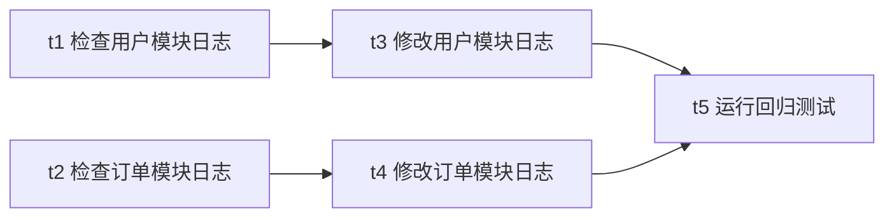

读这张图要抓住两件事：

1. **边表示「依赖」，不表示「顺序」。** `t1` 和 `t2` 之间没有任何边，意思是「谁先谁后都行」——这才有并行的可能。
2. **「同一时刻可以开始的任务」是一层一层算出来的**，不是模型给的顺序。第一层是 `{t1, t2}`，第二层是 `{t3, t4}`，第三层是 `{t5}`。这个分层过程叫**拓扑排序**（topological sort）。

## 0.3 为什么「无环」必须真的去检查

如果模型写出了环，比如 `t3` 依赖 `t4`、`t4` 又依赖 `t3`，那么：

- 没有任何一个任务满足「依赖都已完成」，任何一个调度器都推不动它；
- 朴素的拓扑排序算法会在这里无限递归，直接把栈撑爆。

所以环检测必须是一段独立代码，而且在**计划进入执行之前**就要跑掉。本项目的做法是在解析阶段就跑一次拓扑排序，失败就抛异常（`Planner.java:155-157`），环根本进不了调度循环。这是「显式图结构」相比「自然语言步骤列表」最直接的收益之一。

## 0.4 拓扑排序与「可执行集合」

**拓扑排序**的输出是一个线性顺序，保证「任何一个任务都排在它所有依赖的后面」。本项目用的是 DFS 版本（`ExecutionPlan.java:94-135`），伪代码见 10.2。

但要驱动调度，光有一个线性顺序不够，还需要**每一刻哪些任务可以开始**。这个集合的判定条件很朴素：

> 一个任务可以执行 ＝ 它的状态还是「未开始」，并且它声明的**每一个**依赖的状态都是「已完成」。

代码就是 `Task.isExecutable`（`Task.java:114-123`）。调度循环每一轮都重算一遍这个集合，所以执行批次是**运行时动态划分**的，不是计划阶段预先算好的。

这里有个容易混的点，后面会反复回到它：

| 方法 | 依据 | 用途 |
|---|---|---|
| `getExecutionBatches()`（`ExecutionPlan.java:266-292`） | 只看**图结构**，逐层剥 | **只用于计划预览**（`summarize()`，`ExecutionPlan.java:243-264`） |
| `getExecutableTasks()`（`ExecutionPlan.java:85-89`） | 看**运行时状态**（`Task.isExecutable`） | **真正驱动调度** |

两者算出来的批次在正常情况下一致，但它们是两套独立代码，一个算错了另一个不会发现。

## 0.5 「并行」在这个项目里有三层，别混

说「A 和 B 并行」时，必须先说清楚是哪一层：

| 层次 | 并行的对象 | 上限来自 | 代码位置 |
|---|---|---|---|
| 批次并行 | 同一轮里依赖都已满足的**任务** | `PlanExecuteAgent.executeTaskBatch` 里的线程池 | `PlanExecuteAgent.java:513` |
| 任务内工具并行 | 同一个任务一轮里模型返回的**多个工具调用** | `ToolRegistry` 里的固定上限 | `ToolRegistry.java:63`、`:1331-1336` |
| 计划阶段 | —— | **没有并行**，就一次 LLM 调用 | `Planner.java:78` |

而且前两层是**嵌套**的：批次里的每个任务各自又会开自己的工具线程池。所以严格说，「这个系统最多并行多少个工具」没有单一答案，代码里也**没有全局并发预算**（见 13.3）。

还有一条约束值得先记住：批次里的任务是并发跑的，但**任务状态只由主线程更新**，工作线程只负责跑和返回结果（`PlanExecuteAgent.java:413-451`）。这是刻意的设计，代价和收益在 5.4 里说。

## 0.6 「Agent」在这里指什么

在没有接触过这个主题时，最容易把「Agent」理解成「一个部署好的服务」或者「一个进程」。本项目里的 Agent **就是一个类**：

- `Agent`（`agent/Agent.java`）是一个 ReAct 循环实现：把对话历史 + 工具定义发给大模型，模型要么返回工具调用，要么返回最终答案；返回工具调用就执行工具、把结果塞回历史、再问一次，直到模型给出最终答案。
- 循环本身是纯 Java 代码，每一轮的「思考」来自大模型。**Agent 不是模型，是围绕模型的一层循环 + 工具 + 历史管理。**

所以「多 Agent」在这个项目里**不等于多进程、多服务、多模型**。它指的是：

> 同一个 JVM 里，由外层代码把一次任务分派给**承担不同责任的执行体**——一部分是 `SubAgent` 实例，一部分是普通类（`Planner`）或编排器自身的方法——每个执行体配一套不同的系统提示词、各自独立一份对话历史，由编排代码决定谁先跑、谁后跑、把谁的输出喂给谁。

这一点必须先接受，否则后面所有「角色」的描述都会读歪。

## 0.7 为什么单个 Agent 不够：三个责任位置

假设用户说：「帮我把 `pom.xml` 的 Java 版本升到 17，然后跑一遍测试确认没退化」。

单个 ReAct Agent 会用同一个会话把这两件事做完，但会碰到三个具体问题：

**问题一：自我确认偏差。** 模型刚写完代码，紧接着自己判断「改好了」。它对自己的修改有天然的信息优势——它「记得」自己的意图，于是倾向于认为结果符合意图。它缺的不是智力，是**独立性**：没有人拿着「验收标准」去检查「实际产物」。

**问题二：上下文互相污染。** 规划需要的上下文是「全局目标 + 可拆解性」；执行需要的是「工具用法 + 具体步骤 + 上一步的产物」；审查需要的是「验收标准 + 实际结果」。把这三类塞进同一份对话历史，每一轮模型调用都要背着大量与当前判断无关的噪音，token 成本随轮数线性上涨，而且关键验收标准会被中间的工具输出淹没。

**问题三：长链路没有断点。** 一步做错了，后面的步骤会基于错误结果继续往下走，最后一句话总结「任务完成」。中间没有任何一个环节有机会说「等等，这一步的输出不对」。

合并后的实现用三个责任位置回应这三件事，但**它们不是三个同构的子 Agent**（这是与合并前最大的区别）：

| 责任 | 由谁承担 | 独立对话历史？ | 能调工具？ |
|---|---|---|---|
| 规划（只看全局） | `Planner` 类（`plan/Planner.java`） | 每次规划临时构造 `messages`，不跨轮累积 | 否（`chat(messages, null, ...)`） |
| 执行（只看当前步骤和依赖产物） | `PlanExecuteAgent.executeTaskWithPolicy` 内部的一段 ReAct 循环 | 每个任务一个新的 `messages` 列表 | 是（经 `TurnToolPolicy`） |
| 审查（只看任务描述和实际结果） | 一个 `SubAgent`（`AgentRole.REVIEWER`） | 是（`conversationHistory`），但**每步结束后清空** | 否（`shouldUseTools()` 对 REVIEWER 返回 false） |

关键结论：**合并把「三个角色 = 三个子 Agent」改成了「不同责任位置用不同的执行体」**。规划不再是一个子 Agent 实例，执行也不再是——只有审查还保留 `SubAgent` 这个可复用的对话运行时。这是一个**减重**方向的收敛，不是能力削减。

## 0.8 角色之间靠什么传递产物

概念上，「多智能体协作」需要一个「消息总线」或「共享黑板」。本项目**没有这两样东西**。实际传递产物只有四条通路，务必分清：

| 通路 | 载体 | 方向 | 代码位置 |
|---|---|---|---|
| 规划请求 | 一次性 `List<Message>`（system 提示词 + user 目标） | `Planner` ← 目标 | `Planner.java:67-72` |
| 任务下发 | `StepBriefing`（一个 record）渲染出的字符串 | 编排器 → 任务执行体 | `StepBriefing.java:20-55`、`PlanExecuteAgent.java:649` |
| 审查请求 | 两段字符串拼接 | 编排器 → Reviewer | `SubAgentStepReviewer.java:24`、`SubAgent.java:507` |
| 审查结论 | `StepReviewDecision`（一个 record） | Reviewer → 编排器 → 同一任务的下一轮 | `StepReviewDecision.java:6-15`、`PlanExecuteAgent.java:614-628` |

和合并前的关键区别：**审查结论不再走自由文本 + 二次解析**。合并前，`approved` 与 `issues` 由两个独立方法（`parseReviewApproval` / `parseReviewIssues`）从同一段文本分别解析，理论上可以给出互相矛盾的结论；现在 `ReviewResponseParser` 在 `SubAgentStepReviewer` 内部一次解析出 `StepReviewDecision`，交给编排器的已经是结构化结论。

`AgentMessage` 也从六种类型收敛为三种（`AgentMessage.java:19-23`）。原先定义的 `FEEDBACK` / `APPROVAL` / `REJECTION` 三个工厂方法在 `src/main` 里从未被调用——这个「定义了但没人用」的缺陷在合并时被直接删除，而不是留着当装饰。**现在应该只有三种类型，且三种都有调用点。**

## 0.9 一个必须先打破的错觉

很多关于多 Agent 的介绍会画成「规划者把计划交给执行者，执行者把结果交给检查者，检查者不满意就退回」。这张图在本项目里**部分成立、部分不成立**，必须在读代码前就分清：

| 常见描述 | 本项目实际 |
|---|---|
| 三个角色互相迭代 | **规划者只在每次规划时被调用一次**，全程不参与后续任务执行，也不看审查反馈 |
| 角色之间来回对话 | 角色之间**没有直接对话**。每一跳都经过编排器中转，且传递的是拼好的字符串 |
| 检查者把结果退回执行者 | **成立**。这是唯一一处真正的回环（`PlanExecuteAgent.java:603-629`） |
| 三个角色是三个独立实现 | **不成立**。只有 Reviewer 是独立类（`SubAgent`）；规划是 `Planner` 类，执行是编排器自己的方法 |
| 规划者会因执行失败而重规划 | **部分成立**。只在「进度低于阈值」时触发（`PlanExecuteAgent.java:441-451`），且**不受审查反馈驱动**；整轮受 `MAX_REPLANS_PER_RUN` 封顶（`:136`） |

还有一层容易忽略：**`SubAgent` 不继承 `Agent`**。`SubAgent` 的类声明处没有 `extends`（`SubAgent.java:52`），它是另写一份的 ReAct 循环。所以项目里存在**两套平行的 ReAct 实现**——一套给主 Agent（ReAct 模式）用，一套给 `SubAgent`（当前只有 Reviewer）用。区别在于：**计划任务执行走的是第三套实现**——`PlanExecuteAgent.executeTaskWithPolicy` 里自己写了一遍类似的循环（`PlanExecuteAgent.java:631-794`）。所以严谨地说，这个项目里有**三处 ReAct 循环**，共享的只有底层的 `LlmClient`、`ToolRegistry`、`TurnToolPolicy` 和上下文压缩工具，主循环代码各自维护。

## 0.10 名词速查

| 名词 | 含义 | 代码位置 |
|---|---|---|
| 目标（goal） | 用户这条任务的自然语言原文（含可能的补充要求） | `ExecutionPlan.getGoal()` |
| 计划（plan） | 一组带依赖的任务 + 拓扑执行顺序 | `plan/ExecutionPlan.java` |
| 任务（task） | 计划里的一个节点，有 id / 描述 / 类型 / 依赖 / 状态 / 结果 | `plan/Task.java` |
| `Planner` | 让模型产出计划 JSON，并把它解析成 `ExecutionPlan` | `plan/Planner.java` |
| `PlanExecuteAgent` | 调度器 + 单个任务的内部 ReAct 循环 | `agent/PlanExecuteAgent.java` |
| 批次（batch） | 某一轮「所有依赖已满足」的任务集合，批内并行、批间串行 | `PlanExecuteAgent.executeTaskBatch` |
| 简报（briefing） | 编排器交给任务执行体的全部上下文，唯一渲染点 | `StepBriefing.render()` |
| 人工计划门 | 计划生成后暂停等人确认/补充/取消 | `PlanReviewHandler` |
| 步骤自动评审 | 每个任务执行完由 Reviewer 判定通过与否 | `StepReviewer` |
| 审查结论 | 结构化结果 `(approved, feedback)` | `StepReviewDecision` |
| `AgentBudget` | **单个任务内部循环**的退出兜底（Token / 停滞 / 显式轮数），不是计划级预算 | `agent/AgentBudget.java` |
| 叶子任务 | 没有任何任务依赖它的任务（`getDependents().isEmpty()`） | `Task.getDependents()` |
| 批次内并行 | 同一轮里依赖都已满足的**任务**并发跑 | `PlanExecuteAgent.executeTaskBatch` |
| Tool Call | 模型在任务内部一轮里请求调用某个工具 | `ToolRegistry` |
| CLI 命令 | 用户在交互界面直接敲的 `/xxx` | `cli/CliCommandParser.java` |

---

# 第 1 部分　整体地图

## 1.1 三层拆分

这个模块最大的设计特征是**把三件事拆到三个地方**：

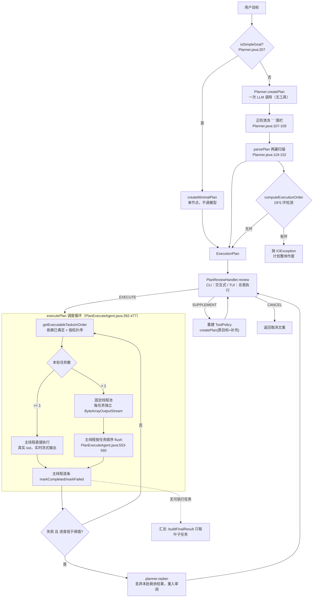

注意图里有个**回边**：执行中失败会带失败原因回到规划——但走的是「重新生成一个**全新的** `ExecutionPlan`」，不是在原图上做局部修改（`PlanExecuteAgent.java:441-451`、`Planner.java:186-205`）。这条回边**受 `MAX_REPLANS_PER_RUN` 封顶**（见 8.2）。

## 1.2 一次 `/plan` 任务的端到端形状

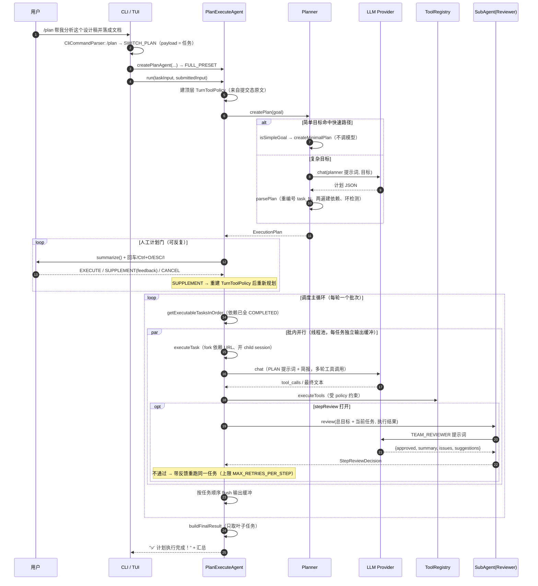

## 1.3 分层与文件清单

| 层次 | 核心类 | 职责 | 不负责什么 |
|---|---|---|---|
| 规划层 | `Planner` | 让模型输出结构化 JSON、清洗、ID 规范化、依赖映射、简单目标快速路径、重新规划 | 不理解图算法，不管调度 |
| 图结构层 | `ExecutionPlan` | 拓扑排序、环检测、可执行集合、静态批次、进度 | 不碰 LLM，不开线程 |
| 调度层 | `PlanExecuteAgent` | 审阅、批次划分、并发与输出顺序、单任务内部循环、状态更新、结果汇总、账本 | 不做图算法，不解析 JSON |
| 模型层 | `Task` | 单节点状态机与依赖/被依赖列表 | 不知道自己的批次 |
| 预算层 | `AgentBudget` | 单任务内部循环的退出判定与收尾指令 | 不感知计划，不知道有几个任务 |
| 编排接口 | `StepReviewer`、`StepReviewDecision` | 审查接口与结构化结论 | 不实现审查逻辑 |
| 审查适配 | `SubAgentStepReviewer` | 把 `SubAgent` 包装成 `StepReviewer`，两层失败策略 | 不管重试次数 |
| 审查解析 | `ReviewResponseParser` | fail-closed 判定 + 意见三级回退 | 不发请求 |
| 审查运行时 | `SubAgent` | Reviewer 用的角色化 ReAct 循环 | 不继承 `Agent` |
| 上下文 | `StepBriefing` | 下行简报的唯一渲染点 | 不做检索 |

相关源码：

```
plan/
├── Planner.java        规划器：LLM → JSON → ExecutionPlan
├── ExecutionPlan.java  计划聚合根：图算法 + 预览
└── Task.java           节点：状态机 + 依赖边

agent/
├── PlanExecuteAgent.java   调度器 + 单任务 ReAct 循环
├── AgentBudget.java        单任务退出预算
├── StepBriefing.java       下行简报渲染
├── StepReviewer.java       审查接口
├── StepReviewDecision.java 结构化审查结论
├── SubAgentStepReviewer.java  审查适配器
├── ReviewResponseParser.java  审查结论解析
├── SubAgent.java           Reviewer 的角色化 ReAct 运行时
└── PipelineOptions.java    两个开关与三个预置

cli/
├── PlanReviewInputParser.java  审阅交互的纯文本解析（可单测）
prompts/modes/
├── planner.md          规划阶段 system prompt 片段
├── plan.md             任务执行阶段 system prompt 片段
└── team-reviewer.md    审查阶段 system prompt 片段
```

## 1.4 外部接线点

能真正走到 DAG 的入口有四个，但都属于同一个 `/plan` 命令：

| 入口 | 行为 | 源码位置 |
|---|---|---|
| CLI `/plan`（无参数） | 置「下一个任务用计划模式」标志，下一条输入才触发；执行完自动复位 | 解析 `CliCommandParser.java:128-130`；置标志 `Main.java:659-663`；消费并复位 `Main.java:992-1014` |
| CLI `/plan <任务>` | 直接把 payload 当作本次输入，立即走计划模式 | 解析 `CliCommandParser.java:132-134`；同一分支 `Main.java:659-666` → `Main.java:992` |
| TUI `/plan <任务>` | 立即执行，**固定自动审阅（EXECUTE），不弹交互审阅**；不接受无参数形式 | `TuiSessionController.java:211-224`、`:250-261` |
| Runtime API / 后台 DurableTask | **绕过 DAG**，走 `runHeadlessTask` → 普通 `Agent`（ReAct） | `Main.java:1082-1084`、`:1119-1130`、`:1132-1134` |

三个 CLI/TUI 差异必须知道：

1. **CLI 的审阅是真交互**（`Main.java:1551-1625`），TUI 传的是固定 `EXECUTE`（`TuiSessionController.java:255`），命令行的 `--headless` 路径则根本不经过这里。
2. **TUI 没有调用 `setParentSession`**（对比 `Main.java:1305`、`:1321`），所以 TUI 下计划任务不会写子会话记录；CLI 下会（见 9.4）。
3. 计划模式一旦进入，工具集仍是 `reactAgent.getToolRegistry()` 那一份（`Main.java:1298`、`:1314`），不是新建的。

生产代码里构造 `PlanExecuteAgent` 的地方有**三处**，且三处都硬编码 `FULL_PRESET`：

1. `Main.java:1294`（可注入 `PlanReviewHandler` 的工厂，供测试使用）
2. `Main.java:1309`（CLI 交互用，注入终端计划门）
3. `TuiSessionController.java:252`（TUI，**没有注入终端计划门**——见 2.2）

`PlanExecuteAgent` 的构造器有 **8 个重载，其中 5 个是 `public`**；不带 `PipelineOptions` 的重载一律落到默认值 `PLAN_PRESET`（`PlanExecuteAgent.java:172`、`:184`）。也就是说：**`/plan` 的 `FULL_PRESET` 是入口层显式选定的，不是类默认值。**

## 1.5 边界：这个模块不覆盖什么

- **不做计划的持久化与恢复**。计划全在内存，`ExecutionPlan` 只有 `status` 和两个时间戳（`ExecutionPlan.java:13-16`）。进程被杀 = 计划没了。Runtime API 和后台任务用的是另一套机制，且**完全不走 DAG**。
- **不做跨进程/分布式调度**。就是单进程内的一个 `ExecutorService`。
- **不做资源冲突检测**。两个任务写同一个文件但模型没建边，代码不会拦。
- **不做任务级重试**（除了审查驱动的重跑）。任务失败只有两个走向：整个计划重新规划，或者保留已完成结果继续往下走（见 8.1）。
- **不讲主 ReAct 循环**。`/clear`、压缩、Snapshot 语义见 `01-react-agent.md`。

## 1.6 容易混淆的东西

| 名字 | 是什么 | 与本模块的关系 |
|---|---|---|
| `PlanExecuteAgent` | Plan-and-Execute 的调度器 + 单任务循环 | 本文主角 |
| `AgentOrchestrator`（已删除） | Planner / Worker / Reviewer 三角色协作，合并前的另一个模式 | **无关**，已并入 `PlanExecuteAgent` |
| `DurableTaskManager` / `RuntimeApiServer` | 后台任务与 HTTP API | **无关**，它们内部跑的是普通 ReAct Agent（`Main.java:1119-1130`） |
| `SubAgent` | 角色化的另一份 ReAct 循环，当前只服务 Reviewer | 与主 `Agent` 平行，不继承它 |

另外五个容易混的点：

1. **「两个开关」和「两个预设」不是一回事。** `PipelineOptions` 是一个 record（两个布尔），`PLAN_PRESET` / `TEAM_PRESET` / `FULL_PRESET` 是三个预置取值。入口只用 `FULL_PRESET`，另外两个保留在构造层（见 2.4）。
2. **`Task.TaskType` 与执行策略无关。** `type` 只被写进简报和 `plan.md` 提示词的占位符，Java 侧没有任何按类型分派的分支。
3. **`Task.TaskStatus` 与 `ExecutionPlan.PlanStatus` 是两套状态。** 任务级有五个状态（含 `RUNNING` / `SKIPPED`），计划级只有五个完全不同的取值（`CREATED` / `RUNNING` / `COMPLETED` / `FAILED` / `CANCELLED`）。
4. **「计划门」和「步骤评审」都在 `reviewAndExecutePlan` / `executePlan` 里，但作用域不同。** 前者一次任务可能过多次（每次重新规划后都会再问），后者对每个任务各一次。
5. **`StepReviewDecision` 和 `PlanReviewDecision` 是两个不同的 record。** 前者是 Reviewer 的结论（`approved` + `feedback`），后者是人工计划门的决定（`EXECUTE` / `SUPPLEMENT` / `CANCEL`）。名字像，类型完全不同。

特别提醒：**看到「计划」或「任务」字样时不要默认它走 DAG**。`/plan` 是唯一一条用户可见的 DAG 入口。

---

# 第 2 部分　唯一入口与两个开关

## 2.1 `/plan` = 人工计划门 + 步骤自动评审串联

`CliCommandParser` 只有两个分支产出 `SWITCH_PLAN`：

```java
if (trimmed.equalsIgnoreCase("/plan")) {
    return new ParsedCommand(CommandType.SWITCH_PLAN, null);
}

if (trimmed.regionMatches(true, 0, "/plan ", 0, 6)) {
    return new ParsedCommand(CommandType.SWITCH_PLAN, trimmed.substring(6).trim());
}
```

（`CliCommandParser.java:128-134`。）裸 `/plan` 表示「下一条任务走计划模式」，带 payload 的 `/plan <任务>` 表示「直接执行这条任务」。

CLI 的派发条件是「上一条设了标志 **或** 本次命令是 `SWITCH_PLAN`」（`Main.java:992`），两条路最终都走 `createPlanAgent(...)` → `FULL_PRESET`。

所以一次 `/plan <任务>` 的完整开关状态是：

| 开关 | 取值 | 生效方式 |
|---|---|---|
| `humanPlanGate` | true | 计划生成后调用注入的 `PlanReviewHandler`，由它决定执行 / 补充重规划 / 取消 |
| `stepReview` | true | 每个任务执行完都调一次 `applyStepReview`，任务内部现建 `SubAgentStepReviewer` |

## 2.2 两个开关各自真正的闸门在哪（重要落差）

**`humanPlanGate` 这个字段在 `src/main` 里从未被读取。**

```bash
# 只有 PipelineOptions 自身、以及单测读它（PlanExecuteAgent 一次都没读过）
$ grep -rn "humanPlanGate" src/main/java src/test/java
src/main/java/com/codeagent/agent/PipelineOptions.java:7:public record PipelineOptions(boolean humanPlanGate, boolean stepReview) {
src/test/java/com/codeagent/agent/PipelineOptionsTest.java:12:        assertTrue(PipelineOptions.PLAN_PRESET.humanPlanGate());
src/test/java/com/codeagent/agent/PipelineOptionsTest.java:18:        assertFalse(PipelineOptions.TEAM_PRESET.humanPlanGate());
src/test/java/com/codeagent/agent/PipelineOptionsTest.java:24:        assertTrue(PipelineOptions.FULL_PRESET.humanPlanGate());
```

`PlanExecuteAgent` 读到 `pipelineOptions` 后只用了 `.stepReview()`（`PlanExecuteAgent.java:587`）。人工计划门是否真的拦人，取决于**注入的 `PlanReviewHandler` 是什么实现**，而 `reviewAndExecutePlan` 无条件调用它（`PlanExecuteAgent.java:367`）：

| 调用方 | 注入的 `PlanReviewHandler` | 实际行为 |
|---|---|---|
| CLI（`Main.createPlanReviewHandler`，`Main.java:1551+`） | 打印 `plan.summarize()` 并读单键 | 真的停下等人 |
| TUI（`TuiSessionController.java:255`） | `(goal, plan) -> PlanExecuteAgent.PlanReviewDecision.execute()` | **橡皮图章：从不询问用户** |
| 测试 | 自定义 lambda | 按测试需要 |

这是一个必须诚实交代的设计落差：

- `humanPlanGate` 目前是**声明性元数据**，不是可执行的开关。想让它真正生效，得让构造器根据它决定包一层默认 handler（或干脆删掉这个字段，只留 `PlanReviewHandler` 一个真相来源）。
- **TUI 路径下「计划门」实际上是关的**，尽管它传的是 `FULL_PRESET`。用户按 `/plan` 会直接开始执行，看不到计划。CLI 与 TUI 在这里**不等价**。

`stepReview` 这个开关是真的：它直接决定 `executeTask` 里要不要调 `applyStepReview`（`PlanExecuteAgent.java:587-590`）。为 `false` 时任务只执行一次、不进审查；为 `true` 时任务内部现建一个 Reviewer（`PlanExecuteAgent.java:610-611`），用完即弃。

## 2.3 为什么删掉 `/team`

原 `/team` 与 `/plan` 曾经是两套平行实现（`AgentOrchestrator` vs `PlanExecuteAgent`），合并后它们的能力已经完全重合，重复入口只会制造歧义：用户在两个命令之间做选择，却没有语义差异。因此 `/team` 的命令、类型与接线被整体删除，**能力一个都没少**：

| 原来的 `/team` 能力 | 现在的承载 |
|---|---|
| 三角色子 Agent | Reviewer 用 `SubAgent`；规划/执行由 `Planner` 与 `PlanExecuteAgent` 承担 |
| 步骤级依赖上下文 | `StepBriefing` |
| 审查 + 重试上限 | `applyStepReview`（`MAX_RETRIES_PER_STEP`） |
| 无依赖步骤并行 | `executeTaskBatch` 的并行分支 |
| 步骤级 URL 凭据隔离 | `forkWithTrustedUrls` |
| child session 审计 | `PlanExecuteAgent.executeTask`（注意：TUI 不注入 `parentSession`，见 9.4） |

`/team` 现在会走到解析器末尾的兜底分支（`CliCommandParser.java:334-336`）：

```java
if (trimmed.startsWith("/")) {
    return new ParsedCommand(CommandType.UNKNOWN_COMMAND, trimmed);
}
```

即**在 CLI 层报未知命令，不会下发给 Agent**。这条约束有测试钉住（`CliCommandParserTest` 的两个 `rejectsRemovedTeamSlashCommand*` 用例）。

## 2.4 为什么保留 `PLAN_PRESET` / `TEAM_PRESET`

`PipelineOptions` 目前有三个预置（`PipelineOptions.java:9-11`）：

| 预置 | humanPlanGate | stepReview | CLI 可达？ | 用途 |
|---|---|---|---|---|
| `PLAN_PRESET` | true | false | **否** | 只有人工计划门；构造层默认值 |
| `TEAM_PRESET` | false | true | **否** | 只有步骤自动评审 |
| `FULL_PRESET` | true | true | 是（`/plan`） | 两个环节串联 |

保留前两个的理由是：它们是「两个独立开关」这个设计在**构造层**的表达。删掉它们，`PipelineOptions` 就退化成「一个恒为 `(true,true)` 的常量」，两个布尔参数也就没存在的必要了。它们现在的作用是：

1. 作为单测的输入（`PlanExecuteAgentTest` 用 `PLAN_PRESET` 验证「评审关闭时每任务只跑一次」，用 `TEAM_PRESET` 验证「只有评审」）。
2. 作为 `PlanExecuteAgent` 的默认值——但注意这个默认值只影响**直接 `new`** 的调用方，CLI/TUI 都显式传 `FULL_PRESET`。

**代价要讲清楚：`PLAN_PRESET` / `TEAM_PRESET` 在 CLI 上不可达，所以「不要评审」目前没有命令行出口。** 用户想跳过步骤评审，只能改代码或换模式。

---

# 第 3 部分　规划：从任务生成 DAG

## 3.1 `Planner.createPlan` 的四步

入口在 `plan/Planner.java:59`。整个方法只有四步：

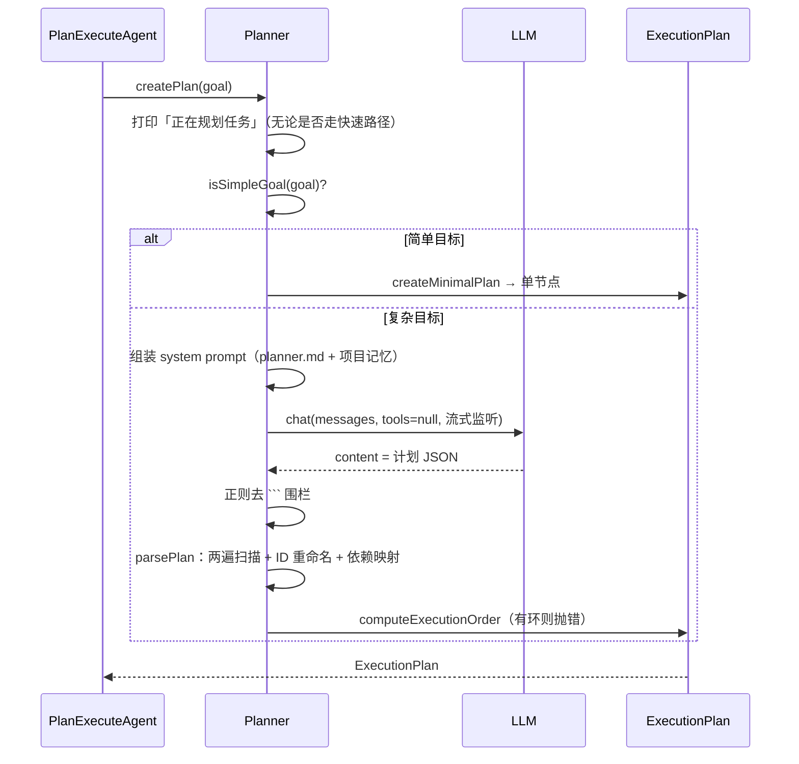

### 要点一：规划阶段没有工具

```java
// Planner.java:78
LlmClient.ChatResponse response = llmClient.chat(messages, null, streamRenderer);
```

第二个参数是工具列表，传的是 `null`。**规划器不能读文件、不能搜索、不能执行命令**，它做出计划所依据的全部外部信息就是：

- 用户在 CLI/TUI 里敲的那句话；
- `CODEAGENT.md` 项目记忆（作为 system prompt 的一部分，`Planner.java:68-70`、`:92-100`）。

这是一个值得主动说明的取舍：计划是「盲规划」。它带来的直接后果是——**计划的正确性完全依赖模型对这段描述的推断**，模型看不到真实目录结构。而且**规划提示词里没有任何「先去查一下再规划」的指示**——那条「优先用 `glob_files` / `grep_code` / `read_file` 现用现查」的文本在**执行体**提示词 `plan.md:8` 里，不在 `planner.md` 里。所以盲区在规划阶段没有任何补偿手段，只能在执行阶段被部分吸收：真正去查文件的是每个任务自己的执行体，它拿到的是上一层的**结论文本**，看不到规划时本该有的全局结构。

规划阶段唯一的外部信息补充是项目记忆（`CODEAGENT.md`）。这意味着**人工计划门是这条盲规划链上唯一的纠错点**——用户在按下 Enter 之前看到的是 `plan.summarize()` 或 `plan.visualize()`，也就是模型凭空推出来的图。而 2.2 说过：真正的闸门不是 `PipelineOptions.humanPlanGate`，而是注入的 `PlanReviewHandler`，TUI 注入的那份是恒 `execute()` 的橡皮图章。**两个落差叠起来就是：在 TUI 里，一份盲规划出来的计划会在没有任何人工确认的情况下直接执行。**

### 要点二：流式输出只流「思考」，不流 JSON

`PlanningStreamRenderer`（`Planner.java:282-315`）只实现了 `onReasoningDelta`，**没有实现 `onContentDelta`**。所以用户看到的规划过程是模型的推理片段（标题「🧠 规划思考」，`Planner.java:298`），最终那段 JSON 不会被逐字打出来。

### 要点三：进度提示先于快速路径判定

`out.println("📋 正在规划任务: " + goal)` 在 `isSimpleGoal` 判定**之前**（`Planner.java:60` vs `:62`）。所以即使走的是「根本不调模型」的快速路径，终端上也会先出现「正在规划任务」。这是一个输出语义上的小落差，容易让人以为一定调了模型。

## 3.2 规划者不是一个子 Agent

合并前，规划者是 `new SubAgent("planner", AgentRole.PLANNER, ...)`，有自己的常驻对话历史。现在规划由 `Planner` 类承担，每次规划临时构造两条消息：

```java
List<LlmClient.Message> messages = Arrays.asList(
        LlmClient.Message.system(promptAssembler.assemble(PromptMode.PLANNER, ...)),
        LlmClient.Message.user("请为以下任务制定执行计划：\n" + goal)
);
LlmClient.ChatResponse response = llmClient.chat(messages, null, streamRenderer);
```

（`Planner.java:67-78`。）两点值得注意：

- **`tools` 参数是 `null`**——规划阶段完全不暴露工具。规划者只能凭提示词和项目记忆（`CODEAGENT.md`）拆解任务，不能自己读代码再决定怎么拆。这是有意的：规划阶段如果允许读文件，token 成本会随项目规模爆炸，而且拆解质量取决于它读了哪些文件，不可预期。
- **没有跨调用累积的历史**——每次 `createPlan` 都是干净的上下文。所以「重新规划」不会记得上一次为什么失败，只能靠调用方把失败原因写进 goal 字符串（`Planner.replan` 就是这么做的，`Planner.java:186-205`）。

## 3.3 简单目标的快速路径

`isSimpleGoal`（`Planner.java:207-244`）是一个纯字符串规则的三段判定，顺序很重要：

1. **先排多步骤提示词**：只要目标里出现「然后 / 并且 / 并 / 再 / 最后 / 同时 / 先 / 之后 / 接着 / 以及」中的任意一个，立刻判定为「不简单」（`Planner.java:217-229`）。
2. **再看长度**：超过一个固定上限也会被排掉（`Planner.java:231-233`）。
3. **最后要求命中动作词**：必须包含「列出 / 查看 / 读取 / 显示 / 执行 / 运行 / 搜索 / 当前目录 / 文件」之一（`Planner.java:235-243`）。

命中的话走 `createMinimalPlan`（`Planner.java:246-254`）：造一个单节点计划，节点描述就是原始目标，类型由 `inferSimpleTaskType` 猜（`Planner.java:264-280`），**一次模型调用都不发生**。`PlannerTest.createsMinimalPlanForSimpleGoalWithoutCallingLlm`（`plan/PlannerTest.java:17`）断言了这一点——它注入的 client 一旦被调用就抛异常。

这段规则有两个真实的粗糙处，都值得知道：

**一是单个汉字「并」的误伤。** 第 1 步匹配的是 `normalized.contains("并")`（`Planner.java:219`），它把「合并两个配置文件」「并发处理」这种词也当成多步骤提示词，于是这类目标会被送去调模型。方向上是安全的（宁可多想一步），但说明这个判定是关键词匹配而不是语义判断。

**二是 `inferSimpleTaskType` 里的运算符优先级。** 代码是：

```java
// Planner.java:266-267
if (normalized.contains("读取") || normalized.contains("打开") || normalized.contains("查看")
        && normalized.contains("文件")) {
    return Task.TaskType.FILE_READ;
}
```

Java 里 `&&` 优先级高于 `||`，所以实际语义是 `读取 || 打开 || (查看 && 文件)`：**「查看」必须和「文件」一起出现才命中，而「读取」和「打开」单独出现就会命中**——包括「读取情绪」「打开思路」这类和目标毫无关系的表达。

需要说清楚的是，这个误判的**后果几乎为零**：`TaskType` 只影响节点提示词里 `taskType` 这个变量的替换文本（`PlanExecuteAgent.java:638`、`prompts/modes/plan.md:5`），不构成任何 Java 执行分支。所以这是一个「规则写歪了但不影响行为」的缺陷，讲的时候要主动说清它为什么不严重。

## 3.4 `parsePlan`：两遍扫描

`parsePlan`（`Planner.java:105-160`）的结构是刻意的两遍，原因是**依赖可以前向引用**——模型完全可能让 `task_2` 依赖后面才出现的 `task_5`。

**第 0 步：清洗围栏。**

```java
// Planner.java:107-109
String cleaned = planJson.replaceAll("```json\\s*", "")
        .replaceAll("```\\s*", "")
        .trim();
```

注意这是**全文 `replaceAll`**，不是「只剥开头结尾那对围栏」。如果某个任务的描述文本里恰好含三个反引号，也会被一并删掉。

**第 1 步：建任务 + 建 ID 映射。**

```java
// Planner.java:122-132
for (JsonNode taskNode : tasksNode) {
    String originalId = taskNode.path("id").asText();
    String newId = "task_" + taskIndex++;
    idMapping.put(originalId, newId);
    ...
    plan.addTask(new Task(newId, description, type));
}
```

两个真实行为：

- **模型给的 ID 一律被丢弃并重命名**为 `task_<序号>`，序号按 JSON 数组顺序递增。模型写 `foo`、`bar` 也一样。这么做的收益是下游所有拼接（依赖映射、日志、汇总）都拿到稳定可预期的 ID。
- **ID 重复会静默覆盖映射。** `idMapping` 是 `HashMap`，如果模型输出了两个 `id` 相同的节点（或者两个节点**都没有 `id` 字段**——`path("id").asText()` 对缺失字段返回空串），后一个会覆盖前一个的映射，于是所有引用该 ID 的依赖边全部指向**最后一个**任务。这是解析层面一个没有告警的边界。

**第 2 步：建依赖。**

```java
// Planner.java:140-152
JsonNode depsNode = taskNode.path("dependencies");
if (depsNode.isArray()) {
    for (JsonNode depNode : depsNode) {
        String originalDepId = depNode.asText();
        String newDepId = idMapping.getOrDefault(originalDepId, originalDepId);
        Task dep = plan.getTask(newDepId);
        if (dep != null) {
            task.addDependency(newDepId);
            dep.addDependent(task.getId());
        }
    }
}
```

这里埋着**本部分最重要的一处语义落差**：`getOrDefault` 在映射表里查不到时**保留原 ID**，随后 `getTask` 返回 `null`，然后 `if (dep != null)` 把这条依赖**整个丢掉，不留任何日志**。

后果不是「任务卡住」，而是**「任务提前跑」**：本来应该等某个任务的任务，变成了没有任何依赖的根任务，在第一批就被调度。这属于被悄悄改写的语义，不是「防御性跳过」。这个区别在面试里很重要——说成「任务会一直 PENDING」是错的。

**第 3 步：环检测。**

```java
// Planner.java:155-157
if (!plan.computeExecutionOrder()) {
    throw new IOException("计划中存在循环依赖");
}
```

有环直接抛，整份计划作废。

## 3.5 计划提示词的契约

`PromptMode.PLANNER` 对应的片段是 `src/main/resources/prompts/modes/planner.md`，它规定了两件事：

- 输出格式：一个 `summary` 加一个 `tasks` 数组，每个任务有 `id` / `description` / `type` / `dependencies`（`planner.md:13-27`）；
- 输出规则：任务 ID 唯一（`:31`）、按执行顺序排列（`:33`）、**简单任务只生成 1-3 个任务、不要为凑步数引入无关步骤**（`:35`）、复杂任务拆 5-10 个子任务（`:36`）。

两点必须指出：

**第一，提示词确实显式引导了并行分支，但和「按执行顺序排列」同时存在，是一对需要靠模型自己权衡的张力。** 规则 3 说「任务应该按执行顺序排列」，规则 9 说「多个任务可以独立完成时，不要互相添加 `dependencies`，保持为空」、规则 10 说「只有后一个任务确实需要前一个任务的结果时，才写 `dependencies`」（`planner.md:33`、`:39-40`）。

值得记账的是：**规则 9 和 10 是本次合并新增的**（提交 `515984b` 给 `planner.md` 只加了两行，就是这两条）。加之前提示词里唯一的顺序指令就是规则 3「按执行顺序排列」，没有任何引导模型产出互不依赖节点的文本——也就是说，**批次并行这条代码路径在这次合并之前虽然存在，但提示词层面没有被引导去触发它**。这次合并把「代码支持并行」和「提示词要求并行」对齐了。

仍然要主动说明的残余风险：规则 3 和规则 9 在字面上是冲突的（「按执行顺序排列」对一个 DAG 是模糊要求）。模型是否稳定地选规则 9 决定了批次并行是否真的被用上——**我可以确定提示词现在有这条指令，但没有实际构造多批计划统计触发率**，所以「4 路并行在实践中用得有多频繁」仍是未验证项（详见 12.1 和 14.3）。

**第二，`summary` 在生产路径里根本没人读。** 它被存进 `ExecutionPlan.summary` 字段（`Planner.java:112`、`:116`），但全仓库唯一的读取方 `getSummary()`（`ExecutionPlan.java:38`）只被单测 `PlannerTest.java:22`、`:55` 调用。容易看错的陷阱是：名字很像的 `ExecutionPlan.summarize()`（`ExecutionPlan.java:243-264`）**和 `summary` 字段毫无关系**——它渲染的是 `goal`（`:248`）加任务数、批次、状态，调用点是 CLI 审阅界面（`Main.java:1556`、`:1582`）。所以规划模型产出的那句摘要，从头到尾没有任何出口：既不进 CLI 预览，也不进任务提示词。

## 3.6 数据模型

`ExecutionPlan`（`ExecutionPlan.java:8`）：

| 字段 | 含义 |
|---|---|
| `id` | `plan_<毫秒时间戳>`（`Planner.java:179-181`） |
| `goal` | 计划目标。**注意它是可变语义的**，见 8.3 |
| `tasks` | `LinkedHashMap`，按插入顺序保存（`ExecutionPlan.java:29`） |
| `executionOrder` | DFS 拓扑排序结果，字符串 ID 列表 |
| `status` | `CREATED / RUNNING / COMPLETED / FAILED / CANCELLED`（`ExecutionPlan.java:18-24`） |
| `summary` | 规划模型产出的摘要；**生产路径零读取**，只有单测读 `getSummary()` |
| `startTime` / `endTime` | 计划级时间戳 |

`Task`（`Task.java:8-18`）：

| 字段 | 说明 |
|---|---|
| `id` / `description` / `type` | `type` 是 `TaskType` 枚举，**只用于提示词替换** |
| `dependencies` | 我依赖谁（出边的反向侧） |
| `dependents` | 谁依赖我。由 `ExecutionPlan.addTask`（`ExecutionPlan.java:48-57`）和 `Planner.parsePlan`（`Planner.java:148`）两处登记，`addDependent` 内部去重（`Task.java:68-72`） |
| `status` | `PENDING / RUNNING / COMPLETED / FAILED / SKIPPED`（`Task.java:29-35`） |
| `result` / `error` | 文本结果 / 失败原因 |
| `startTime` / `endTime` | 任务级时间戳 |

一个容易被忽略但很能说明作者意识的细节：`status`、`result`、`error`、两个时间戳都声明为 **`volatile`**（`Task.java:12-18`），而 `dependencies` / `dependents` 是普通 `ArrayList`。这正是 0.5 说的并发模型——状态会被别的线程读到，但依赖边在解析完就不再变。

`TaskType` 的枚举里有 `PLANNING`，但 `Planner.parseTaskType` 的 `switch` 没有这个分支（`Planner.java:165-174`），`inferSimpleTaskType` 也不会返回它，所以**这个枚举值永远不会出现在任何计划里**（已 grep 全仓库确认）。

---

# 第 4 部分　人工计划门

## 4.1 不是子 Agent 的一跳

`PlanExecuteAgent.run(String, String)`（`PlanExecuteAgent.java:316`）是整个流程的外壳：

1. 记录 `submittedPolicyInput`，并用它构造本轮 `TurnToolPolicy`（`:318-322`）。这一步决定了本轮允许哪些工具、URL 授权范围。
2. 写一条 `user_input` 到会话账本（`:323-324`）。
3. 规划前的取消检查（`:327-331`）。注意：此时**还没有任何计划**，直接返回取消文案。
4. `runWithPlan`（`:359-362`）→ `reviewAndExecutePlan`（`:364-390`）→ `executePlan`（`:392-477`）。
5. 整个 `try` 包着 `catch (Exception e)`，任何异常（包括规划期的 JSON 解析异常、`IOException("计划中存在循环依赖")`）都会变成 `"❌ 执行失败: " + e.getMessage()` 返回并写进历史（`:344-353`）。

`reviewAndExecutePlan` 是一个 `while (true)`，逐轮问 `PlanReviewHandler`：

| 决策 | 处理 | 源码位置 |
|---|---|---|
| `EXECUTE` | 执行计划 | `PlanExecuteAgent.java:368-370` |
| `CANCEL` | 返回 `"⏹️ 已取消本次计划执行。"`，**不写回 assistant 历史** | `:372-374`、`:60-62` |
| `SUPPLEMENT` 但反馈为空 | **按 EXECUTE 处理** | `:376-379` |
| `SUPPLEMENT` 有反馈 | 把补充要求拼进目标 → **重建 Tool Policy** → 重新 `createPlan` → 回到循环开头再问一次 | `:381-388` |

三个细节值得记住：

- **空反馈按执行处理**，是为了避免审阅界面在用户没输入内容时死循环。
- **重新规划会重新进入审阅**，也就是用户会看到第二次计划预览。
- SUPPLEMENT 时 `submittedPolicyInput` 是**累加**的（`:383`），所以「第二轮补充了不需要联网」能收紧策略，两轮的补充内容都会参与判定。`PlanExecuteAgentTest.noWebSupplementTightensToolPolicyBeforeReplanning`（`PlanExecuteAgentTest.java:265`）覆盖的是这条。

CLI 的审阅实现（`Main.java:1551-1625`）是逐键读取：回车 = 执行（`:1572-1575`）、ESC = 折叠/取消（`:1578-1587`）、`I` = 输入补充（`:1590-1596`）、`Ctrl+O` = 展开完整计划（`:1599-1605`）。如果终端读不到单键，会回退到行输入模式（`:1612-1622`）。两种模式都通过 `PlanReviewInputParser`（`cli/PlanReviewInputParser.java:17-39`）把文本映射成决策：空串/`y`/`yes`/`run`/`/run` → EXECUTE，单字符 ESC/`cancel`/`esc`/`/cancel` → CANCEL，**其余任何文本一律当补充要求**。这个类是 package-private 且无 I/O 依赖，所以有独立单测（`cli/PlanReviewInputParserTest.java:11-39`）。

## 4.2 补充要求会重建工具策略（安全语义）

这是一个容易被忽略但很重要的细节。收到 `SUPPLEMENT` 后，编排器不只是重新规划：

```java
String revisedGoal = plan.getGoal() + "\n补充要求：" + feedback;
submittedPolicyInput = submittedPolicyInput + "\n补充要求：" + feedback;
turnToolPolicy = TurnToolPolicy.fromUserInput(
        submittedPolicyInput,
        toolRegistry.isSharedBrowserSession(),
        toolRegistry.hasAgentOwnedCurrentBrowserPage());
plan = planner.createPlan(revisedGoal);
```

（`PlanExecuteAgent.java:381-388`。）

**为什么必须重建**：`TurnToolPolicy` 决定这次任务允许访问哪些 URL。补充要求是**用户新输入的自然语言**，属于「顶层用户原文」——按授权规则，用户原文里的 URL 应当获得授权。如果不重建，用户在补充要求里写的 URL 会被当成「来自模型输出的 URL」而拒绝，体验上就是「我明明给了链接它却说没权限」。

反方向也成立，但不是「只会扩大」：补充要求会基于**累计后的完整用户原文重新计算**策略。新 URL 可以扩大 URL 白名单；「不需要联网」这类显式否定则会把 web 能力收紧。它不会删除先前提交的文字，而是让后来的约束与此前原文一起参与判定。这两种方向分别由 `supplementRebuildsToolPolicyBeforeReplanning` 与 `noWebSupplementTightensToolPolicyBeforeReplanning` 钉住（`PlanExecuteAgentTest.java:231`、`:265`）。

**一个真实的合并收益**：合并前，`PlanExecuteAgent` 的计划门与「步骤评审」是两套独立的失败策略；现在两者共用同一个返回路径，`CANCEL` 语义明确区分了「用户主动取消」与「执行失败」（前者不持久化 assistant 消息，见 `PlanRunOutcome.canceled`，`PlanExecuteAgent.java:60-62`）。

---

# 第 5 部分　调度：把 DAG 跑起来

## 5.1 主循环与批次划分

`executePlan`（`PlanExecuteAgent.java:392-477`）用一段伪代码就能说清：

```text
executePlan(plan):
    plan.markStarted()
    finalResult = ""
    while true:
        if 已取消: return 取消文案            # 不动任何状态
        executable = 依赖已满足的任务，按 executionOrder 重排
        if executable 为空: break
        results = executeTaskBatch(executable)   # 可能并发
        for r in results:                        # 主线程顺序处理
            if r 成功:
                r.task.markCompleted(r.result)
                记录 trustedUrls / streamedOutput
            else:
                r.task.markFailed(error)
                if plan.getProgress() < 阈值 且 未达重规划上限:
                    return reviewAndExecutePlan(replan(plan, error), depth + 1).result()
                累积失败信息到 finalResult         # 同批剩余结果继续处理
    if 既未全部完成 且 无失败: markFailed(); return "存在未满足依赖"
    summary = finalResult 非空 ? finalResult : buildFinalResult(plan)
    if hasFailed(): return "计划部分完成，有任务失败" + summary
    markCompleted(); return "计划执行完成" + summary
```

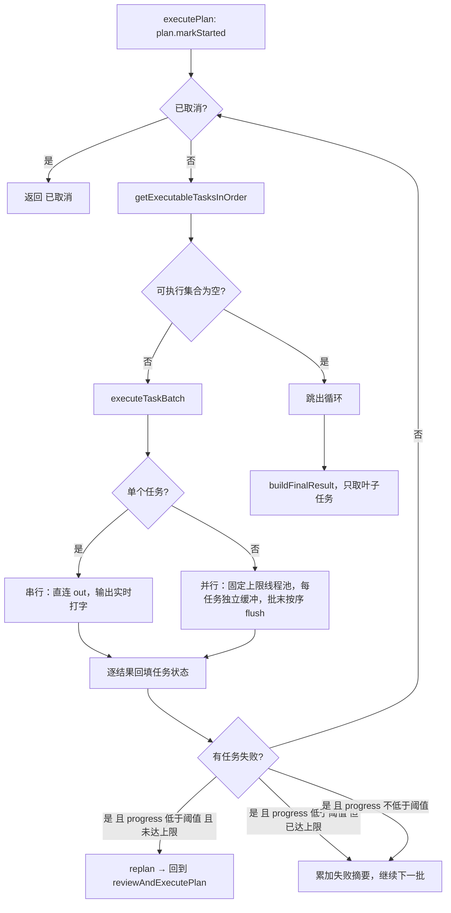

三个要点：

1. **可执行集合的语义是「依赖已全部 COMPLETED」**，不是「依赖已完成或失败」。所以一个任务失败后，它的后继任务会**永远保持 PENDING**，最终被报告成「计划未能继续推进」而不是「跳过」（`PlanExecuteAgent.java:455-458`）。
2. **重规划是「重新开始」而不是「接着跑」，而且有次数上限**：`planner.replan` 生成一个全新的 `ExecutionPlan`，然后 `reviewAndExecutePlan(replanned, streamState, depth + 1)` 会**再次过人工计划门**（`:447-450`）。所以用户在长任务中途可能被问第二次计划。上限由 `MAX_REPLANS_PER_RUN` 决定（`:136`）；达到上限后终端打一行「⚠️ 已达到最大重规划次数，保留当前结果」并回到失败摘要路径（`:442-445`）。**这条上限是后补的——在此之前这里的递归没有边界**，详见 8.2。
3. **重规划的触发条件是 `plan.getProgress() < 0.5`**，而 `getProgress` 只统计 `COMPLETED` 占比（`ExecutionPlan.java:150-156`）。也就是说：一个 3 任务计划里第 1 个就失败（进度 0）时，会重规划；已经完成 2/3 再失败（进度 0.67）时，**不会重规划**，只累加失败摘要。

## 5.2 批次执行：单任务串行 vs 多任务并行

`executeTaskBatch`（`PlanExecuteAgent.java:490-566`）只有两个分支，分界线是**本轮可执行任务数是否恰好为 1**：

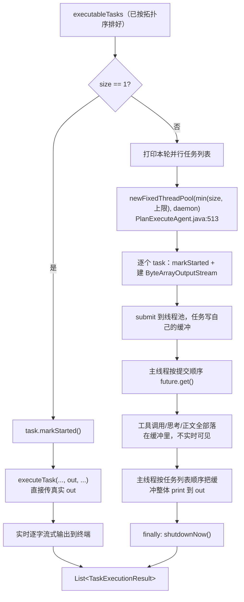

四条事实：

- **并行只在「本轮多于一个任务」时发生。** 单任务走的是主线程内联调用（`:493-505`），不建线程池，且用的是真实 `out`——所以**单任务批次是实时流式输出**。
- **并行批次牺牲实时性换顺序稳定。** 每个任务拿到独立的 `ByteArrayOutputStream`（`:524-526`），批次跑完后主线程按任务列表顺序整体 flush（`:553-560`），因此即使任务 B 先跑完，终端上仍是 A 的内容在前。代价是并行任务的输出**延后到整批结束才出现，且是整块的**。
- **3 个内部顺序保证**：提交顺序 = `executableTasks` 顺序 = `executionOrder` 过滤后的顺序（`getExecutableTasksInOrder`，`:479-488`）；`future` 按提交顺序读取（`:538-551`）；flush 也按同一顺序。这三处一致，所以 transcript 与计划顺序对齐。
- **线程是 daemon、有固定名字，批次结束在 `finally` 里 `shutdownNow()`**（`:513-517`、`:563-565`）。这意味着**任务没有超时**：池子不会因为某个任务卡住而被回收，`future.get()` 也没有超时参数。一个卡死的任务会让整个批次挂住。

## 5.3 任务执行体不是 SubAgent

合并前后差异最大的一处。现在每个任务的执行就是 `PlanExecuteAgent` 的一个方法（`executeTaskWithPolicy`，`PlanExecuteAgent.java:631-794`），里面写着一段完整的 ReAct 循环：

| 环节 | 合并前（`SubAgent`） | 合并后（`PlanExecuteAgent`） |
|---|---|---|
| 系统提示词 | `promptMode()` 按角色映射 | 固定 `PromptMode.PLAN` + `{{taskType}}` / `{{taskDescription}}` |
| 历史 | 常驻 `conversationHistory`，跨任务复用后清空 | **每个任务一个新建的局部 `messages`**，天然无残留 |
| 工具暴露 | `shouldUseTools()` 按角色判定 | `llmClient.supportsTools()` + `TurnToolPolicy.expose` |
| 预算 | `AgentBudget.fromLlmClient` | 同左，但**每次重试都新建一份**（见 7.5） |
| 流式渲染 | `SubAgentStreamRenderer` | `TaskStreamRenderer`（带 taskId 标签） |
| 上下文压缩 | 共享 `AutoCompactionManager` | 同左 |

**每个任务一个新建的 `messages` 列表**（`PlanExecuteAgent.java:656`）是这一层最重要的性质：它从结构上消除了「上一个任务的工具输出污染下一个任务上下文」这类问题，代价是任务之间**完全不能共享会话记忆**——能传下去的只有 `StepBriefing` 里显式写的依赖结果。

## 5.4 状态只由主线程更新

状态更新的唯一执行者是主调度线程（`PlanExecuteAgent.java:413-451`）。工作线程只返回一个不可变记录：

```java
// PlanExecuteAgent.java:76-90
private record TaskExecutionResult(Task task, String result, boolean streamedOutput,
                                   TurnToolPolicy.TrustedUrlContext trustedUrls, Exception error)
```

这么设计的原因和代价：

- **收益**：`Task` 的状态机只有一个写入者，所以不需要锁；`volatile`（`Task.java:12-18`）只够保证工作线程读到的可见性，不承担互斥。批内并发不会出现「两个任务互相覆盖状态」。
- **代价**：主线程必须等整批 `future.get()`（`:538-551`）拿全结果后才逐个回填，所以**批次是一道屏障**——后继任务要等最慢的兄弟跑完才能开始，没有流水线重叠（见 13.3）。

## 5.5 输出隔离与顺序

并行批次里每个任务有**两个隔离机制**（`PlanExecuteAgent.java:513-566`、`:571-601`）：

- **输出隔离**：每个任务一个 `ByteArrayOutputStream` + `PrintStream`，批内并行时互不交错；批次结束后按 `executableTasks` 的顺序统一 flush 到真实 `out`（`:553-560`）。所以用户看到的是「按任务顺序连续输出」，而不是「谁先跑完谁先打印」。
- **会话隔离（仅注入 `parentSession` 时）**：任务开始时 `parentSession.createChild("plan", "task:" + id)`，任务结束 `recordChildResult` 并关闭（`:581-595`）。child session 句柄存在 `ThreadLocal` 里（`:128`），所以并行线程各自指向自己的 child。当前 CLI 会注入，TUI 不会注入，因此 TUI 没有任务级 child session（见 9.4）。

**注意 `finally` 里做了两件事**：`taskToolPolicy.releaseBrowserLease()`（`:599`）——浏览器租约必须成对释放，否则下一个任务拿不到浏览器；以及 `childSession.remove()` 防 `ThreadLocal` 泄漏（线程池里的线程会被复用）。

输出展示的对照表：

| 场景 | 输出行为 | 位置 |
|---|---|---|
| 单任务批次 | 直接写真实 `out`，逐字流式 | `PlanExecuteAgent.java:500-501` |
| 并行批次 | 写各自缓冲，批次末尾按任务顺序整体 flush | `:524-526`、`:553-560` |
| 任务完成 | 流式过的任务只打「完成」，未流式的打结果前若干字符 | `:422-427` |
| 任务失败 | 打 `❌ 失败 [id]: 原因` | `:434` |
| 工具调用 | 按工具名分组打印摘要行 | `:972-1005` |

`TaskStreamRenderer`（`PlanExecuteAgent.java:1052-1178`）负责单任务内的展示，有四个行为值得知道：

- reasoning 和 content 分别渲染，标题是「🧠 任务思考 [id]」和「🤖 任务输出 [id]」。
- **纯空白的 reasoning 不会打印标题**（`:1079-1083`），这是为了避免终端上出现一个空标题。
- **Content 的标题故意用「输出」而不是「结果」**：因为 content 可能只是 tool-call 之前的叙述，不是最终结果（`:1115-1116`）。`PlanExecuteAgentTest.shouldNotPrintEmptyTaskReasoningHeadingAndShouldUseOutputLabel`（`PlanExecuteAgentTest.java:187`）就是钉这条的。
- `resetBetweenIterations`（`:1143-1159`）在每次工具执行前收尾并重置渲染器状态，防止 Markdown renderer 的 pending 文本被 HITL 提示「跨过去」导致标题错位（注释见 `:1139-1142`）；工具执行后如果模型又补了 reasoning，会以「🧠 补充思考」单独输出（`:1165-1177`）。

## 5.6 凭据隔离在调度层的位置

每个任务 `turnToolPolicy.forkWithTrustedUrls(直接依赖的 URL)`（`PlanExecuteAgent.java:574-578`）。完整语义见 9.1，这里只记一句：**fork 发生在任务开始之前，继承集合是「DAG 直接前驱成功返回的结构化 URL」**，不是所有已完成任务的 URL。

---

# 第 6 部分　单个任务内部

## 6.1 一个 DAG 节点不等于一次模型调用

这是最容易被误解的一点。`executeTaskWithPolicy`（`PlanExecuteAgent.java:631-794`）内部是一个 `while (true)`，节点可以多轮推理、多轮调工具。

进入循环前的准备：

| 步骤 | 说明 | 位置 |
|---|---|---|
| 组装 system prompt | `PromptMode.PLAN` + 项目记忆 + `taskType` / `taskDescription` + 外部上下文 + Skill 索引 | `:636-643` |
| 拼用户侧输入 | `buildStepBriefing(...).render()` | `:649` → `:1180-1192` |
| 追加长期记忆检索 | 以任务描述为查询 | `:646-652` |
| 追加 Skill 正文 | 从 `SkillContextBuffer` drain | `:653` |
| 建独立消息列表 | 每个任务一份，不共享 | `:655-664` |
| 建预算 | `AgentBudget.fromLlmClient`，**每任务一个** | `:668` |
| 建子会话（CLI 下） | `parentSession.createChild("plan", "task:<id>")`，用 `ThreadLocal` 存放 | `:581-583`、`:128` |

循环体每轮：

1. 取消检查（`:671-675`）。
2. `budget.check()` 不是「预算内」→ 走 `finalizePartialTask` 并返回（`:677-689`）。
3. 冻结工具暴露集 → 抓请求快照 → 预测 token（`:692-706`），必要时压缩历史（`:707-715`）。
4. `llmClient.chat`（`:716-720`）。
5. 记 token；无 tool call → **任务收尾返回**（`:748-767`）；有 tool call → 记录签名、打印、回灌 assistant 消息（`:770-776`）→ `resetBetweenIterations()`（`:780`）→ 执行工具并把结果作为 `tool` 消息回灌（`:782-792`）。

三个行为需要单独说：

**（1）无 tool call 时的返回有两种。** 正常情况下返回 `response.content()`（`:766`）。但如果模型给的 content 是空的、而历史里已经攒了工具结果，则返回**所有工具结果的拼接**（`:760-764`）。这是「模型只调工具不写总结」时的兜底。

**（2）多轮工具调用的并发。** `executeToolCalls`（`:898-919`）把工具调用交给 `taskToolPolicy.execute` → `ToolRegistry.executeTools`。工具层的并发规则是：只有一个调用时内联执行；**批次里含任何浏览器工具就整批串行**；否则开固定上限的线程池（`ToolRegistry.java:1310-1336`）。此外，`TurnToolPolicy` 在每个任务 fork 时**共享同一个浏览器租约协调器**（`TurnToolPolicy.java:181` 复用 `browserLeaseCoordinator`），任务申请到租约后在整个任务生命周期结束时才释放（`PlanExecuteAgent.java:599`）。所以**并行批次的多个任务里，需要浏览器的那些会互相排队**——这是有意的，避免共享页面状态被交叉覆盖。

**（3）子会话只在 CLI 路径存在。** `parentSession` 由 `Main.java:1321` 注入；TUI 没有注入，`childSession.get()` 恒为 `null`，`persistChildMessage` 直接返回（`:950-970`）。所以「计划任务的消息持久化粒度到任务级」这个能力**只在 CLI 下生效**。

## 6.2 简报：`StepBriefing` 渲染了什么

`buildStepBriefing`（`PlanExecuteAgent.java:1180-1192`）构造一个 `StepBriefing` record，真正的拼装发生在 `StepBriefing.render()`（`agent/StepBriefing.java:20-55`）。它决定下游任务能看到什么：

| 拼进提示词的内容 | 位置 |
|---|---|
| `总目标：<plan.goal>` | `StepBriefing.java:22` |
| `当前任务：<id> / <描述> / 类型=<type>` | `:23-26` |
| 依赖任务结果：无依赖时写「无」 | `:28-30` |
| 有依赖 → 逐个依赖的 `id / 描述 / 状态`，**以及它的完整结果文本** | `:32-40` |
| 依赖分支经 `web_search` 产出的 URL 清单（非空时才出现） | `:43-47` |
| 上一次结果被审查拒绝的原因（非空时才出现） | `:49-52` |

三条要点：

- **只注入直接依赖的结果**，不是所有已完成任务的结果，也不是计划摘要。所以「任务结果沿 DAG 边流动」是准确的说法。
- **URL 的继承是「类型化」的**：只有 `web_search` 成功返回的结构化 URL 会随边传递（`TurnToolPolicy.TrustedUrlContext`，`TurnToolPolicy.java:938`），从依赖结果**正文里解析出的 URL 不会获得授权**。`PlanExecuteAgentTest.dependentTaskInheritsOnlyTypedSearchUrlProvenance`（`PlanExecuteAgentTest.java:293`）覆盖的正是这条。
- 依赖结果可能很长（一个任务的结果就是模型最后一段输出），直接拼进下游提示词，因此**长链计划的上下文会随深度增长**。代码在这里没有任何截断。

一个事实性提醒：这份简报里**没有固定的收尾指令**。早期版本在末尾追加过一句「如果是 ANALYSIS 或 VERIFICATION 类型，请基于以上上下文直接给出结果」，合并时连同 `buildTaskContext` 一起删掉了；现在唯一的条件是 `retryFeedback`（`:49-52`），只在审查拒绝后才出现。

## 6.3 预算兜底：不报错、不失败，而是收尾

`AgentBudget` 的设计目标写在类注释里（`agent/AgentBudget.java:11-34`）：**把「是否继续下一轮」的主导权交给模型自己**，预算只做三道保险阀——

| 保险阀 | 触发条件 | 默认 |
|---|---|---|
| Token 预算 | 累计 input+output 达到上限 | 显式配置才生效 |
| 停滞检测 | 最近若干轮的「工具名+参数」完全相同 | 默认启用 |
| 硬轮数 | 迭代轮数达到上限 | 显式配置才生效 |

判定按「先到先触发」（`AgentBudget.java:127-138`），读取顺序是「Java system property 优先、否则默认值」（`:74-88`、`:205-216`）。默认不设硬限这件事有单测守着（`AgentBudgetTest.java:93`、`:102`）。

命中预算后的处理是 `finalizePartialTask`（`PlanExecuteAgent.java:797-843`）：

1. 往消息里追加一条「不要再调用任何工具」的收尾指令（`:811-815`，指令正文由 `AgentBudget.finalizationInstruction` 生成，`AgentBudget.java:190-195`）；
2. 用**空工具列表**再调一次模型（`:820`）；
3. 收尾调用的 content 为空则回退到累积的工具结果（`:833-835`）；
4. 打上前缀返回（`formatPartialResult`，`:845-848`，前缀形如 `⚠️ 部分完成（<退出原因>）`）。

**关键落差：这个返回值是一个没有 `error` 的 `TaskRunResult`（`:842`），调度层把它当成功 `markCompleted`（`:416-428`）。** 也就是说，「预算耗尽」最终表现为**任务状态 = 已完成，结果文本带「部分完成」前缀**，而不是任务失败。这是有意的取舍（不丢弃已完成的工作），但面试时一定要主动说明状态与文案的不一致。

顺带一个测试侧的落差：`AgentBudgetFinalizationTest.explicitIterationLimitUsesOneToolFreeFinalizationCall`（`agent/AgentBudgetFinalizationTest.java:22`）验证的是**ReAct 路径**（`:39` 构造的是 `new Agent(...)`，`:41` 调用 `agent.run(...)`），**没有任何测试覆盖计划任务的 `finalizePartialTask`**。

---

# 第 7 部分　步骤自动评审与重试闭环

## 7.1 唯一一处真正的回环

第 0.3 节说 DAG 无环。但整个模块里有一处**真实的回边**，它绕过 DAG 图本身：某个任务跑完后被 Reviewer 判不通过，就在**任务内部**重跑同一个任务，而不是回到调度层。

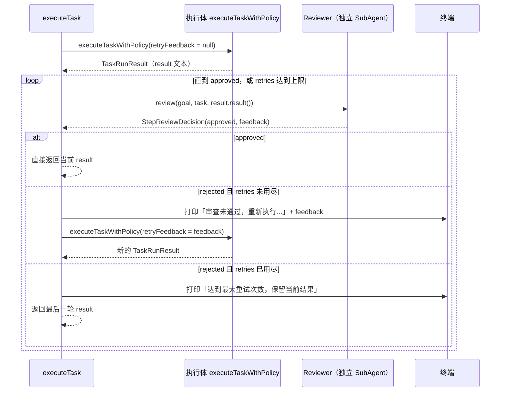

调用点只有一处：`PlanExecuteAgent.executeTask` 里的一个开关（`PlanExecuteAgent.java:587-590`），条件是 `pipelineOptions.stepReview()`。也就是说，只有走 `/plan`（`FULL_PRESET`）才会进这个循环；`PLAN_PRESET` 下这段代码根本不执行——**但 `PLAN_PRESET` 在 `src/main` 里不可达**（见 2.4）。真正有意义的说法是：`stepReview` 现在恒为 `true`，这个开关是测试用的。

循环体本身在 `applyStepReview`（`PlanExecuteAgent.java:603-629`），上限常量是 `MAX_RETRIES_PER_STEP`（`:135`）。**上限不是「重试到通过为止」**——用尽之后不是失败，而是把最后一轮的结果当成功返回（这一点和 6.3 的预算兜底是同一类取舍，见 7.7）。

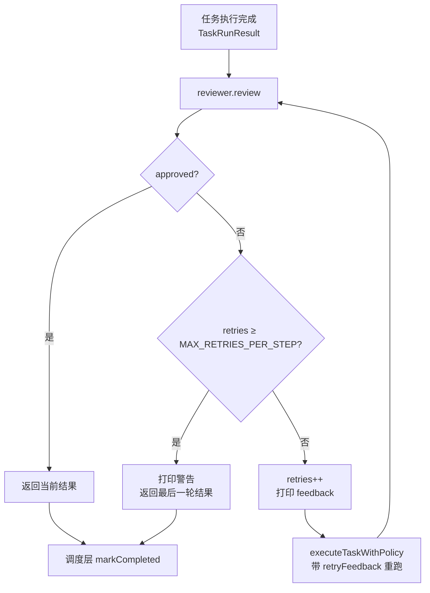

三条路径最终都落到 `task.markCompleted(...)`（`PlanExecuteAgent.java:416-428`）——区别只在终端上有没有警告。这是后面几处落差的共同根源。

## 7.2 Reviewer 拿到什么、拿不到什么

审查输入的拼装在两跳里完成：

```java
// SubAgentStepReviewer.java:24-25
String originalTask = "总目标：" + goal + "\n当前任务：" + task.getDescription();
AgentMessage reviewResult = reviewer.review(originalTask, stepResult, out);

// SubAgent.java:507（再包一层）
String reviewInput = "原始任务：" + originalTask + "\n\n执行结果：\n" + executionResult;
```

| 内容 | 是否可见 | 说明 |
|---|---|---|
| 总目标 | ✅ | 传的是 `plan.getGoal()`。补充要求场景下 goal 已被拼成「原目标 + 补充要求」（`PlanExecuteAgent.java:382`），所以 Reviewer 能看到补充要求 |
| 当前任务描述 | ✅ | |
| 该任务的最终文本结果 | ✅ | 工具型任务时这里是工具输出的拼接（`PlanExecuteAgent.java:760-766`） |
| 依赖任务的结论 | ❌ | 依赖结果全部进了执行体简报（`StepBriefing.java:28-40`），**没有进审查输入** |
| 工具调用记录（工具名、参数、原始返回） | ❌ | 只有最终文本 |
| 该任务实际产生的文件内容 / diff | ❌ | 执行体没把内容写进最终文本，Reviewer 就看不到 |
| 任何工具 | ❌ | `SubAgent.shouldUseTools()` 对 REVIEWER 返回 `false`（`SubAgent.java:557-562`） |
| 上一轮被拒绝的原因 | ❌ | 每次 `review` 后立即 `reviewer.clearHistory()`（`SubAgentStepReviewer.java:26`），Reviewer 的会话被清空，**第二轮审查不知道第一轮拒过** |

**结论：Reviewer 是纯文本审查器。** 它无法做「去读一下那个文件确认改对了没」这种验证，只能基于「任务描述 + 一段文本」判断。所以它能发现的是「结果明显不满足描述」「格式不完整」「与描述无关」；发现不了「文件写坏了但汇报说成功」。这是当前审查能力的硬边界，面试时要主动说。

## 7.3 两层失败策略：调用失败放行，结论不可解析拒绝

`SubAgentStepReviewer.review` 有两条独立的失败路径，策略相反：

```java
// SubAgentStepReviewer.java:28-34
if (reviewResult.type() == AgentMessage.Type.ERROR) {
    return StepReviewDecision.approve();                        // 路径 A：放行
}
if (ReviewResponseParser.parseApproved(reviewResult.content())) {
    return StepReviewDecision.approve();
}
return StepReviewDecision.reject(ReviewResponseParser.parseIssues(reviewResult.content()));  // 路径 B：拒绝
```

| 路径 | 触发条件 | 策略 | 意图 |
|---|---|---|---|
| A. 审查调用本身失败 | `AgentMessage.type() == ERROR`（LLM 调用抛异常等） | **fail-open：判通过** | 不能因为审查服务不可用，就作废一个已经跑完、可能完全正确的任务 |
| B. 返回了内容但无法确认通过 | 空内容 / 缺 `approved` 字段 / 非 JSON 且无肯定关键词 | **fail-closed：判不通过** | 审查的可信度来自「明确说了通过」，模糊就当作没通过 |

两条路径都落到 `markCompleted`，所以**「未验证却记为已完成」这个状态在本模块里没有被建模**。合并前的实现把一个审查报错分成两处分别处理（首次报错标 `COMPLETED`、重试期间报错无条件通过并打印「✅ 重试后审查通过」），合并后统一成单点 `approve()`，去掉了那句误导性输出；但本质问题没变，因为 `Task.TaskStatus` 里没有「已完成但未验证」这个取值。

## 7.4 `ReviewResponseParser`：fail-closed 的具体判据

`parseApproved`（`ReviewResponseParser.java:19-49`）的判定顺序：

1. 内容 `null` 或空 → `false`（并 `log.warn`）。
2. 先剥掉 Markdown 代码围栏再 `readTree`（`stripFences`，`ReviewResponseParser.java:75-77`）——即便提示词要求「只输出 JSON」，模型仍可能包一层 ```` ```json ````。
3. `approved` 字段缺失或为 `null` → `false`。
4. 字段存在 → `asBoolean(false)`。默认值是 `false`，所以 `"approved": "yes"` 这类非布尔值也判不通过。
5. JSON 解析抛异常 → 走**关键词兜底**：出现任一否定关键词（`未通过` / `不通过` / `不合格` / `有问题` / `"approved": false`）即 `false`；否则必须出现肯定关键词（`通过` / `合格` / `"approved": true`）才 `true`；两者都没有 → `false`。

第 5 步有个值得记住的细节：**否定关键词优先，且两者会互相误伤**。「审查未通过」里含「通过」，因为否定词先判定，结果 `false`（正确）；反过来「本次没有问题」含「有问题」，会被判不通过——这是 fail-closed 方向上的**误判**，代价可接受但要知道它存在。

`parseIssues`（`ReviewResponseParser.java:51-73`）是三级回退：`issues` 数组 → `suggestions` 数组 → `summary` 字符串 → 硬编码文案「审查未通过，请改进执行结果」（`:72`）。

**这里保留了一处旧缺陷**：三级都取不到时，Reviewer 的原始自由文本被丢弃，执行体拿到的是那句硬编码文案。而结合 7.5 的能力退化，重试拿到的有效信息就更少了。

## 7.5 重试的边界与四个真实上限

重试循环的写法（`PlanExecuteAgent.java:614-628`）：

```java
while (true) {
    StepReviewDecision decision = reviewer.review(goal, task, result.result());
    if (decision.approved()) {
        return result;
    }
    if (retries >= MAX_RETRIES_PER_STEP) {
        out.println("⚠️ 任务 [" + task.getId() + "] 达到最大重试次数，保留当前结果\n");
        return result;
    }
    retries++;
    result = executeTaskWithPolicy(goal, plan, task, streamState, out, dependencyUrls,
            decision.feedback(), taskToolPolicy);
}
```

四个边界，前三个是设计，第四个是合并引入的退化：

**边界一：重试不重新入队，只在任务内部循环。** 注意重试调的是 `executeTaskWithPolicy`，**不是 `executeTask`**（`:626-627`）。差别有三：不新建 child session、不重新 fork 工具策略、不重新申请浏览器租约。重试期间用的是**同一个** `taskToolPolicy` 实例。这是有意的（同一任务的授权范围不变），但也意味着**一个已经消耗掉的授权在重试里依然是无效的**（如果策略在第一次执行中消耗了某类授权）。

**边界二：`applyStepReview` 内部没有取消检查。** `executeTaskWithPolicy` 在循环开头和 LLM 调用后各有一次 `CancellationContext.isCancelled()` 检查（`:671-675`、`:725-729`），但 `applyStepReview` 的 `while (true)` 里没有。所以 `/cancel` 的响应点是「下一次进入执行体」而不是「本轮审查结束」——取消后最坏情况是要多等一次 Reviewer 调用。

**边界三：每次重试都是一份全新的 `AgentBudget`。** 预算在 `executeTaskWithPolicy` 里构造（`:668`），而重试会重新进入这个方法，所以「预算耗尽」这个兜底**不能跨重试累计**。一个任务最多可以跑到 `(MAX_RETRIES_PER_STEP + 1) × 单次预算` 的迭代量。

**边界四（合并引入的能力退化）：重试的执行体没有上一轮的记忆。** 这是最需要主动交代的一处。`executeTaskWithPolicy` 每次都用 `new ArrayList<>()` 起一份全新的 `messages`（`:656`），只有 system prompt 和当轮的 task input 两条：

```java
// PlanExecuteAgent.java:655-664
String actor = "task:" + task.getId();
List<LlmClient.Message> messages = new ArrayList<>();
appendTaskMessage(messages, actor, "system_prompt", LlmClient.Message.system(prompt));
appendTaskMessage(messages, actor, "task_input", ImageReferenceParser.userMessage(taskInput, ...));
```

对比合并前：任务执行体的对话历史是**跨重试复用**的，被拒绝时执行体「记得」自己上一轮做了什么、调了哪些工具、拿到了什么返回，可以据此定向修改。合并后这条路断了——**重试唯一的增量信息是 `decision.feedback` 那段文本**，它通过 `StepBriefing.render()` 变成一行「之前的结果被审查拒绝，原因：\n…」写进 task input（`StepBriefing.java:49-52`）。

后果有两层：

1. 结合 7.4 的硬编码文案问题，如果 Reviewer 的输出无法解析出 `issues` / `suggestions` / `summary`，那么重试的输入里**关于「哪里不对」的信息为零**，重试接近于「同一提示词再抽一次样」。
2. 重试期间的工具调用痕迹仍然会写进 ledger（`appendTaskMessage` → `conversationLedger.appendMessage`，`:942-948`），所以**审计链是完整的**，丢的只是「模型自己的短期记忆」。这也是为什么这个退化没有在测试里暴露：行为上仍然能通过（多试一次可能就过了），只是效率与定向性变差。

**与合并前相比，这里不是纯退化。** 合并前跨重试复用历史带来两个问题：上下文会随重试轮数线性膨胀，且被拒绝的那份错误产物会一直留在上下文里污染后续判断。合并后的「干净重来 + 一行反馈」在提示词层面更可控。所以面试时准确的表述是**取舍**而不是「变差了」：换掉的是「模型自我修补能力」，换来的是「上下文可预测」。

## 7.6 并行批次下 Reviewer 的数据竞争（已修复）

**合并引入，同批修复。** 合并时 `applyStepReview` 最初把 Reviewer 当作 `PlanExecuteAgent` 的字段构造一次，所有任务共享：

```java
// 修复前（示意）
private final StepReviewer stepReviewer = new SubAgentStepReviewer(new SubAgent(...), out);
```

而 `executeTaskBatch` 在依赖满足的任务数大于 1 时会起一个最多 4 线程的池并发跑它们（`PlanExecuteAgent.java:513`）。于是最多 4 条线程同时调用**同一个** `SubAgent`：

- `SubAgent.conversationHistory` 是裸 `ArrayList`（声明 `SubAgent.java:60`，构造于 `:80`），没有任何同步；
- `SubAgent.historyVersion` 是裸 `long`（`SubAgent.java:67`），`appendTaskMessage` 里 `historyVersion++` 是非原子读改写；
- `reviewer.clearHistory()` 会 `conversationHistory.clear()`（`SubAgent.java:524`），一条线程清空时另一条正在读。

这是**真实的并发缺陷**，不是理论风险：并发写 `ArrayList` 可能抛 `ConcurrentModificationException`、可能丢元素、也可能因为扩容竞争产生结构损坏。它的隐蔽之处在于**不必然复现**，只会偶发。而且 `reviewer.review()` 之后紧跟 `clearHistory()` 意味着两条线程的会话会互相清空，即使没抛异常，审查结论也可能串到别的任务上（A 的结果被 B 的 Reviewer 评判）。

**修复**：把 Reviewer 的构造搬进 `applyStepReview`，每个任务一份（`PlanExecuteAgent.java:610-611`）：

```java
// 每个任务独占一个 Reviewer：并行批次最多 4 个任务同时进来，
// 共享实例会让多条线程写同一份 SubAgent 会话历史。
StepReviewer reviewer = new SubAgentStepReviewer(
        new SubAgent("reviewer", AgentRole.REVIEWER, llmClient, toolRegistry), out);
```

代价是每个任务多一次对象构造 + 一份 system prompt 组装，相对一次 LLM 调用的开销可以忽略。

**回归测试**：`PlanExecuteAgentTest.parallelStepReviewDoesNotShareReviewerHistory`（`agent/PlanExecuteAgentTest.java:432`）。这里是这个 bug 最该被说清楚的一点：**并发缺陷的测试是「不必然失败」的**。这个用例能钉住「每个任务各调一次 review、结论互不串台」这类可观测断言，但无法证明「不再有数据竞争」——它没有断言线程安全本身。所以这里的说法只能是「修复 + 有覆盖该路径的回归测试」，不能说「已证明无竞争」。

## 7.7 审查失败的三种降级路径

把前面几节合起来，一个任务的「审查不通过」一共有三种结局，全部表现为成功：

| 结局 | 触发 | 任务状态 | 终端表现 |
|---|---|---|---|
| 重试后通过 | 某轮 `approved == true` | `COMPLETED` | 「审查未通过，重新执行...」→ 后续正常输出 |
| 重试次数用尽 | `retries` 达 `MAX_RETRIES_PER_STEP` | `COMPLETED` | 末轮打印「⚠️ 达到最大重试次数，保留当前结果」 |
| 审查调用本身失败 | `AgentMessage.type() == ERROR` | `COMPLETED` | **无任何提示**（静默放行） |

第三行是唯一一处**完全无声**的降级。可以争论它是否有问题：审查是「附加闸门」，附加闸门失效时不应阻断主流程，这是路径 A 的设计意图。但代价是**失败信息连一行日志都没有**——`SubAgentStepReviewer.review` 在 `ERROR` 分支直接 `approve()`，既不打印也不记 ledger 事件。想看「这个任务到底审查过没有」，只能从 ledger 里找有没有对应 actor 的记录（`SubAgent.clearHistory` 会为每次审查写一条 `history_clear` 事件，见 9.4）。

---

# 第 8 部分　失败与重规划

前面第 7 部分讲的是「结果不达标但没出错」；这一部分讲**任务真的抛异常**时会发生什么。

## 8.1 进度阈值：什么时候重规划，什么时候直接收尾

任务失败的处置在调度循环里（`PlanExecuteAgent.java:432-452`），入口只有一个条件：

```java
// PlanExecuteAgent.java:432-441
Exception error = batchResult.error();
task.markFailed(error.getMessage());
out.println("❌ 失败 [" + task.getId() + "]: " + error.getMessage() + "\n");
finalResult.append("任务 ").append(task.getId()).append(" 失败: ").append(error.getMessage());

if (plan.getProgress() < 0.5) {          // ← 唯一的阈值
    ...重新规划...
}
```

`getProgress()` 是「状态为 `COMPLETED` 的任务数 / 总任务数」（`ExecutionPlan.java:150-156`）。注意分子只数 `COMPLETED`——失败任务既不进分子，也不从分母里去掉，所以阈值比较的是**原始任务总数的完成比例**。

| 失败时进度 | 处置 | 最终结果前缀 |
|---|---|---|
| < 50% | 触发重规划（受 `MAX_REPLANS_PER_RUN` 封顶，见 8.2） | 「⚠️ 原计划有任务失败，已按重规划结果继续执行。」 |
| ≥ 50% | **不重规划**，把失败记进 `finalResult`，继续处理本批剩余结果 | 「⚠️ 计划部分完成，有任务失败。」 |

「≥50% 不重规划」的意图是：进度过半说明大方向对，为一个节点推翻整个计划不划算。但这条规则只看**数量**，不看**这是哪个节点**——一个进度 60% 的计划里，被卡住的若是唯一的关键路径汇聚点，剩下 40% 会全部不可执行，而系统不会重规划。这属于「知道就好、不必修」的取舍：修它需要「关键路径上的失败」这类更贵的判定。

失败任务还有一个静默后果。它 `markFailed` 之后永远不会再变成 `COMPLETED`，而 `Task.isExecutable` 要求每个依赖都是 `COMPLETED`（`Task.java:114-123`），所以依赖它的后继**永远不可执行、不报错、不提示**，只是让 `getExecutableTasksInOrder` 返回空集并 `break` 出主循环（`PlanExecuteAgent.java:406-409`）。最终走到 `hasFailed()` 分支，报告「计划部分完成，有任务失败」——**被跳过的任务是沉默的**，报告里只有失败节点的名字。

顺带说清楚那条看起来像兜底的分支（`PlanExecuteAgent.java:455-459`）：

```java
if (!plan.isAllCompleted() && !plan.hasFailed()) {
    plan.markFailed();
    return "⚠️ 计划未能继续推进，存在未满足依赖的任务。";
}
```

它要求「既没全完成、又没有任何任务失败」。有任务失败时 `hasFailed()` 为 true，所以这条**在日常运行中几乎不可达**；真正能让它触发的只有「存在依赖边指向不存在的任务」这类畸形图——而 3.4 说过，未知依赖在解析期就被丢掉了，根本产生不了这种边。可以把它当作一条不会走到的保险。

## 8.2 失败重规划的无限递归（已修复）

**旧缺陷，不是合并引入的**——同样的代码也在合并前的提交里。

重规划链的形状是：

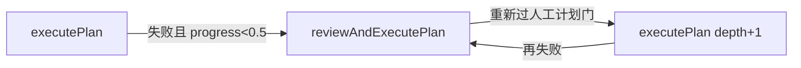

也就是 `executePlan` → `reviewAndExecutePlan` → `executePlan` 的**直接互递归，没有深度参数**。三个放大效应让它必然爆栈而不是「偶尔慢一点」：

1. **每一轮都真实打一次 LLM**：`Planner.replan` → `createPlan` 是一次规划请求（`Planner.java:186-205`）。
2. **goal 文本逐轮嵌套**：`replan` 拼出的新 goal 里含旧 goal 原文（`Planner.java:190`），而 `createPlan` 把它原样设成新计划的 goal（`Planner.java:115`）。于是「原任务: 原任务: …」一层层套下去，token 成本递增。
3. **触发条件不随失败次数改变**：判定只看 `getProgress() < 0.5`。失败原因不变时，每一轮都重新满足条件。

实测表现是日志里连续几十行「🔄 重新规划，原因: …」，随后 `StackOverflowError`，栈顶在两个方法之间无限交替（旧行号：`reviewAndExecutePlan(PlanExecuteAgent.java:367)` / `executePlan(PlanExecuteAgent.java:436)`）。

**修复**：加深度参数并封顶。`runWithPlan` 以 0 起步（`:361`），`reviewAndExecutePlan` 透传（`:364-365`），`executePlan` 接收（`:392`），递归前检查：

```java
// PlanExecuteAgent.java:442-451
if (plan.getProgress() < 0.5) {
    if (replanDepth >= MAX_REPLANS_PER_RUN) {
        out.println("⚠️ 已达到最大重规划次数，保留当前结果\n");
        continue;
    }
    out.println("🔄 尝试重新规划...\n");
    ExecutionPlan replanned = planner.replan(plan, error.getMessage());
    return "⚠️ 原计划有任务失败，已按重规划结果继续执行。\n"
            + finalResult + "\n"
            + reviewAndExecutePlan(replanned, streamState, replanDepth + 1).result();
}
```

上限常量是 `MAX_REPLANS_PER_RUN`（`:136`），取值 1——也就是**整次 `/plan` 最多重规划一次**。

修法里有两个容易被忽略的正确性细节：

- **达到上限后是 `continue`，不是 `return`。** 继续处理本批剩余结果，然后外层 `while(true)` 重新计算可执行集合，让不受影响的后续任务照常跑完——而不是整轮作罢。
- **重规划成功时，外层已经发生的失败被显式拼进返回值**（`+ finalResult +`，`:449`）。修复前那句裸的 `return reviewAndExecutePlan(replanned, …)` 会把外层攒好的失败摘要**直接丢掉**，最终报告里只剩重规划之后的情况，用户看不到「其实前面失败过一次」。这是一个独立的记账 bug，和爆栈一起被这次修复覆盖了。

**回归测试**：`PlanExecuteAgentTest.capsReplanningWhenEarlyFailureKeepsRecurring`（`PlanExecuteAgentTest.java:484`）。它让 `Planner.createPlan` / `replan` 每次产出一个只有单个任务、且该任务必然失败的计划，于是「失败 → 重规划 → 再失败」必然重复。断言两件事：`replan` **只被调用一次**（封顶生效），且最终结果里**同时出现**外层任务与重规划后任务的失败（不丢账）。修复前该用例以 `StackOverflowError` 失败。

**仍然存在的两处不对称**，值得主动说：

1. **`replanDepth` 只在「任务失败」这条路径上递增。** 人工计划门上的「补充要求 → 重新规划」是 `reviewAndExecutePlan` 自己的 `while (true)`（`:366-389`），**从不递增深度**。所以那一圈循环是无上限的。它之所以可以接受，是因为每一轮都要用户输入一次补充要求——**是人驱动的，不是自动放大**。但换成自动审批的 plan review handler（`:368` 那句 `decision == null || EXECUTE` 就放行的实现），这个前提就没了。
2. **`Planner.replan` 内部没有重试预算。** 重规划本身是一次裸的 LLM 调用，失败（比如 JSON 解析失败）会向上抛 `IOException`，然后被 `run(String, String)` 的 catch 接住，整个运行以「❌ 执行失败」结束（`:344-353`）——外层封顶保护不了这一层。

## 8.3 重规划后的目标漂移

`Planner.replan` 的实现方式是「**把失败信息伪装成 goal，再调一次 `createPlan`**」：

```java
// Planner.java:186-205
public ExecutionPlan replan(ExecutionPlan failedPlan, String failureReason) throws IOException {
    out.println("🔄 重新规划，原因: " + failureReason + "\n");
    StringBuilder context = new StringBuilder();
    context.append("原任务: ").append(failedPlan.getGoal()).append("\n");
    context.append("失败原因: ").append(failureReason).append("\n");
    context.append("已完成的任务:\n");
    for (Task task : failedPlan.getAllTasks()) {
        if (task.getStatus() == Task.TaskStatus.COMPLETED) {
            context.append("- ").append(task.getId()).append(": ")
                    .append(task.getDescription()).append("\n");
        }
    }
    context.append("\n请制定新的执行计划，避开之前的问题。");
    return createPlan(context.toString());
}
```

这条捷径省掉了一份「重规划提示词」，但也带来一个真实后果：**新计划的 `goal` 不再是用户的目标，而是这段拼接文本**。而 `goal` 在后续会被反复用到：

| 用途 | 位置 | 后果 |
|---|---|---|
| 每个任务的简报首行「总目标：…」 | `StepBriefing.java:22` | 重规划后所有任务的提示词里，总目标变成「原任务: … 失败原因: … 请制定新的执行计划，避开之前的问题。」 |
| Reviewer 的 `originalTask` | `SubAgentStepReviewer.java:24` | 审查者拿到的「总目标」同样被替换 |
| 最终报告的兜底文案 | `Planner.buildMinimalSummary`（`:256-262`） | 只影响快速路径 |
| 再次重规划的嵌套基底 | `Planner.java:190` | 8.2 的第 2 点：goal 逐轮嵌套 |

**为什么这通常不出问题**：执行体提示词里同时有 `taskDescription` 变量（`PlanExecuteAgent.java:639`），任务描述本身是准确的，所以总目标被污染对单步执行的影响有限。真正被削弱的只有「全局视角」——执行体和 Reviewer 都更难判断「这一步是否偏离了用户原本的意图」。

**一处需要澄清的推断**：`createPlan` 开头会做 `isSimpleGoal` 判定（`Planner.java:62-64`），而重规划的拼接文本里含「已完成的任务」「请制定新的执行计划」等词、长度也远超阈值，所以**重规划不会走快速路径**。这是对字符串内容的静态推断，方向确定；我没有构造边界样本去证明它，但要让这段文本同时不命中多步线索词、长度不超过阈值、又含「文件」这类关键词，实际不可构造。

---

# 第 9 部分　凭据、账本与资源隔离

## 9.1 顶层策略与 DAG 后代继承

URL/路径授权在计划模式下是**跟着 DAG 结构走**的，这是「多 Agent」在这个项目里唯一一处有实际安全含义的机制。

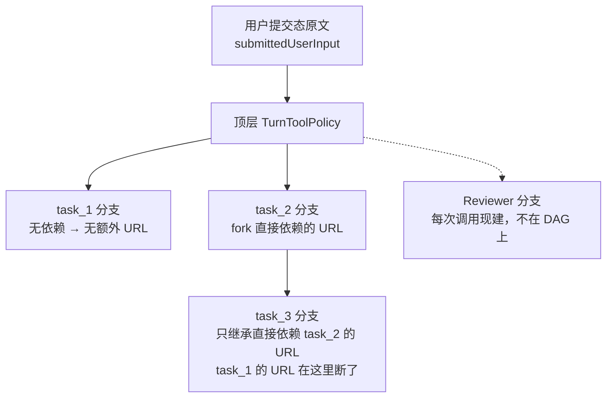

三条规则：

- **顶层策略由「用户提交态原文」构造**（`PlanExecuteAgent.java:319-322`），不是展开后的任务文本。CLI 传两个参数：`taskInput` 是展开过 `@path` / MCP resource 的版本，`submittedInput` 是用户原样输入（`Main.java:1000`）。策略只看后者，避免「展开进来的路径/URL」被误当成用户授权。
- **每个任务派生自己的分支**：`turnToolPolicy.forkWithTrustedUrls(直接依赖的 URL)`（`PlanExecuteAgent.java:574-578`）。纯 fork，不扩大。
- **继承集合只含直接依赖**，不传递展开——所以长链中间的 URL 会在下游断掉（图里 task_1 → task_3 那条虚线）。这个边界有测试钉住：`PlanExecuteAgentTest.dependentTaskInheritsOnlyTypedSearchUrlProvenance`（`PlanExecuteAgentTest.java:293`）。

「补充要求 → 重新规划」是唯一会**重建并扩大**顶层策略的路径：把补充要求拼进 `submittedPolicyInput` 后重新 `TurnToolPolicy.fromUserInput(...)`（`PlanExecuteAgent.java:383-387`，详见 4.2）。而这个扩张不会流回已完成的批次——它只影响重规划出来的新计划。

## 9.2 Reviewer 不在凭据链上——但它也没有工具

`SubAgentStepReviewer` 创建 `SubAgent` 时**没有调用** `setTurnToolPolicy`（无参构造路径下 `SubAgent.java:71` 的字段保持 `null`），所以每次 `execute` 都会现建一份「按显式任务内容授权」的策略：

```java
// SubAgent.java:256-261
TurnToolPolicy activeToolPolicy = turnToolPolicy == null
        ? TurnToolPolicy.forExplicitTask(
                task.content(),                                  // ← 审查输入！
                toolRegistry.isSharedBrowserSession(),
                toolRegistry.hasAgentOwnedCurrentBrowserPage())
        : turnToolPolicy.fork();
```

这里 `task.content()` 是审查输入，**里面含被审查任务的执行结果**（`SubAgent.review` 拼出来的 `reviewInput`，`SubAgent.java:507`）。也就是说：**执行结果文本里出现的 URL 会被当作「显式任务内容」进入 Reviewer 的授权集合**——而按全局授权规则，只有用户原文与 `web_search` 的结构化结果能产生授权。

严格讲这是一个越权点。实际危害为零，因为 `shouldUseTools()` 对 REVIEWER 返回 `false`（`SubAgent.java:557-562`），Reviewer **根本没有工具可调**。

**这条要记住的是安全性质的来源**：它成立是因为「没工具」，而不是因为「策略正确」。一旦未来给 Reviewer 开工具（比如让它能读文件做验证——这在 7.2 里正好是它最缺的能力），这行代码立刻变成一个真实的 URL 授权漏洞。这是一个「当前无害、但改动相邻功能时会引爆」的隐患。

## 9.3 浏览器租约

浏览器是共享资源，租约必须成对释放，否则后续任务拿不到浏览器而失败。计划模式下的释放点在 `executeTask` 的 `finally`：

```java
// PlanExecuteAgent.java:596-599
} finally {
    childSession.remove();
    if (child != null) child.close();
    taskToolPolicy.releaseBrowserLease();
}
```

这一处在并行批次下是关键——批里最多 4 个任务并发，每个任务一份 `taskToolPolicy`（`:579` 的 `forkWithTrustedUrls`），各自独立申请与释放。

**已知的测试缺口**：**没有测试覆盖「并行批次的租约是否成对释放」**。`runsIndependentTasksInParallel`（`PlanExecuteAgentTest.java:405`）验证的是并发跑起来了，不是租约回收正确。所以这里目前只有代码审查级别的保证（见 14.3）。

## 9.4 账本：`plan` 模式条目与 child session

`PlanExecuteAgent` 往共享 `ConversationLedger` 写的内容**全部是 `mode = "plan"`**，actor 分三类：

| actor | 写什么 | 位置 |
|---|---|---|
| `plan-agent` | `user_input`、`run_result`、`run_error`、`run_cancelled` 事件 | `PlanExecuteAgent.java:324`、`:334-338`、`:347-351`、`:328-329` |
| `planner` | `system_prompt`、`planning_request`、`llm_response` | `Planner.java:73`、`:74`、`:79-83` |
| `task:<id>` | system prompt、task input、每轮 llm_response、工具结果、LSP 诊断、图像工具结果 | 经 `appendTaskMessage`（`PlanExecuteAgent.java:942-948`）与 `persistChildMessage` |

`appendTaskMessage` 是任务侧的唯一写入口，一次做三件事：进本地 `messages`、`historyVersion++`、写账本。**账本是 append-only 原始流水，不是发送视图**——压缩和清空只改 `messages`，账本只追加边界事件，不删旧记录。压缩事件就写成一条 `compaction` 事件带前后消息数（`PlanExecuteAgent.java:257-266`）。

任务的详细消息还会写进 child session（`persistChildMessage`，`PlanExecuteAgent.java:950-970`），前提是注入了 `parentSession`：

| 入口 | `setParentSession`？ | 结果 |
|---|---|---|
| CLI（`Main.java:1305`、`:1321`） | 是 | 每个任务一个 child session，含完整消息流水 |
| TUI（`TuiSessionController.java:252-260`） | **否** | 没有 child session，只有共享账本里的条目 |

所以 CLI 与 TUI 在「可审计粒度」上也不等价：TUI 下拿不到任务级的独立会话文件。这和 2.2 的计划门接线差异是两个独立问题。

**一处口径不一致**：审查侧写账本用的是**旧模式名 `"team"`**。`SubAgentStepReviewer` 每次 `review` 之后调 `reviewer.clearHistory()`（`SubAgentStepReviewer.java:26`），而 `SubAgent.clearHistory` 会追加一条 `history_clear` 事件，其中 mode 硬编码为 `"team"`：

```java
// SubAgent.java:518-523
conversationLedger.appendEvent(
        "history_clear",
        "team",                    // ← /team 已删除，但这里的字符串留下了
        name,                      // actor = "reviewer"
        "task_boundary",
        Map.of("discardedViewMessages", Math.max(0, conversationHistory.size() - 1)));
```

于是**每次步骤审查都会往账本写一条 mode 为 `team`、actor 为 `reviewer` 的事件**。这不影响功能，但会让「按 mode 过滤账本」的查询把审查记录漏到计划模式之外。同类残留还有几处纯注释/文案（`SkillContextBuffer.java:19` 的「三个 SubAgent 角色」、`Renderer.java:122`、`ProjectInitializer` 的 pitfalls 文案），统一列在 17.1。

---

# 第 10 部分　汇总与图算法

这一部分收掉三块「最后一步」的代码：计划怎么变成最终回答，DAG 怎么排序，以及那个**看起来在算批次、其实不算**的方法。

## 10.1 `buildFinalResult`：只取叶子

计划执行完后，如果没有任何失败，最终答案由 `buildFinalResult` 生成（`PlanExecuteAgent.java:1194-1223`）。它的策略是**只取叶子任务的结论**：

```java
// PlanExecuteAgent.java:1196-1211
List<Task> leafTasks = plan.getAllTasks().stream()
        .filter(task -> task.getDependents().isEmpty())     // ← 没有后继 = 叶子
        .toList();

for (Task task : leafTasks) {
    if (Boolean.TRUE.equals(streamedTaskOutputs.get(task.getId()))) {
        continue;                                            // 已经流式打过了，不重复
    }
    if (task.getResult() == null || task.getResult().isBlank()) {
        continue;
    }
    ...
    result.append("[").append(task.getId()).append("] ").append(task.getResult());
}
```

三道过滤，各有目的：

| 过滤 | 目的 |
|---|---|
| 只取 `getDependents().isEmpty()` | 中间节点的结论已经通过简报传给了后继（`StepBriefing.java:32-40`），再输出一遍是重复 |
| 跳过已流式输出的任务 | 终端上已经逐字打过一遍了（`TaskStreamRenderer`），最终摘要里再来一次就是重播 |
| 跳过空结果 | —— |

**叶子判定用的是图结构，不是「有没有后继」的运行时状态**（`getDependents()` 是解析期建立的静态关系）。所以一个「本来是中间节点、因为后继失败而没跑完」的任务不会被当成叶子——这种情况下最终报告走的是 8.1 的失败前缀路径，而不是这个汇总。

**兜底分支值得单独说**（`PlanExecuteAgent.java:1217-1222`）：

```java
return plan.getAllTasks().stream()
        .filter(task -> !Boolean.TRUE.equals(streamedTaskOutputs.get(task.getId())))
        .filter(task -> task.getResult() != null && !task.getResult().isBlank())
        .reduce((first, second) -> second)      // ← 取最后一个有结果的任务
        .map(Task::getResult)
        .orElse("");
```

当**所有叶子要么被流式输出、要么结果为空**时，退化成「取最后一个有结果的任务」。注意这是**列表顺序的最后一个**（`getAllTasks()` 是 `LinkedHashMap` 的 `values()`，顺序 = 解析顺序），不是「拓扑序最后一个」也不是「最重要的那个」。这是一个任意的选择，只在「叶子全空」这种畸形情形下生效，但它的输出会被当成最终答案——所以报告里可能出现一个和用户问题无关的中间结论。

`buildFinalResult` 的**调用条件**也要记住：只有当没有任何任务失败时才用它（`PlanExecuteAgent.java:461-463`）：

```java
String planSummary = finalResult.isEmpty()
        ? buildFinalResult(plan, streamedTaskOutputs)
        : finalResult.toString();
```

一有失败，`finalResult` 就被失败信息填过，于是**整个叶子汇总被跳过**，最终报告只剩失败描述。这是一个真实的行为落差：一个 5 步计划里第 5 步失败，用户拿到的报告里可能完全没有前 4 步的成果。值得面试时主动说。

## 10.2 拓扑排序：DFS 版本的伪代码

`ExecutionPlan` 用的是经典三色 DFS（白/灰/黑）：

```
computeExecutionOrder():                          # ExecutionPlan.java:94-108
    executionOrder.clear()
    visited  = {}                                 # 黑：已完成
    visiting = {}                                 # 灰：在当前 DFS 栈上
    for each task in tasks:                       # HashMap 遍历顺序，不稳定
        if task not in visited:
            if not topologicalSort(task, visited, visiting):
                return false                      # 有环
    return true

topologicalSort(task, visited, visiting):         # ExecutionPlan.java:110-135
    if task in visiting:  return false            # 灰→灰 = 回边 = 有环
    if task in visited:   return true
    visiting.add(task)
    for each depId in task.dependencies:
        dep = tasks[depId]
        if dep != null:                           # ← 图 1 的静默跳过
            if not topologicalSort(dep, visited, visiting):
                return false
    visiting.remove(task)
    visited.add(task)
    executionOrder.add(task)                      # 后序位置：依赖先入列
    return true
```

顺着依赖递归、在**后序**位置入列，得到的就是「依赖在前」的线性顺序。三个细节：

1. **`visiting` 集合就是环检测本身。** 不需要单独的检测阶段——DFS 撞到灰色节点就说明有回边。这也是为什么 0.3 说「环检测和拓扑排序是同一段代码」。
2. **`:124` 的 `if (dep != null)` 会静默跳过缺失依赖**（和 3.4 的 `parsePlan` 是同一类处理）。它让排序不会因为一个畸形 ID 就崩，代价是排序结果可能**漏掉一条本应存在的先后约束**。
3. **`tasks` 的遍历顺序来自 `HashMap.values()`，不稳定。** 所以同一张图多次运行可能得到**不同的合法拓扑序**（都满足约束，但顺序不同）。因为调度靠的是 `getExecutableTasks()` 而不直接用这个顺序，这个不稳定性对执行没有影响；`getExecutionOrder()` 只被用来给同一批可执行任务**排个稳定的相对顺序**（`getExecutableTasksInOrder`，`PlanExecuteAgent.java:479-488`）。

**一处需要澄清的潜在隐患**：`getExecutionOrder()` 有个自动补算的写法（`ExecutionPlan.java:140-145`）：

```java
public List<String> getExecutionOrder() {
    if (executionOrder.isEmpty()) {
        computeExecutionOrder();          // ← 返回的 boolean 被丢弃
    }
    return new ArrayList<>(executionOrder);
}
```

这里**没有检查返回值**——如果此时图里有环，`computeExecutionOrder()` 返回 `false` 且 `executionOrder` 是不完整的，方法会**静默返回一份残缺顺序**。

**但这条路径在当前代码里不可达**：所有生成 `ExecutionPlan` 的地方都会先显式检查——`Planner.parsePlan` 抛 `IOException`（`Planner.java:155-157`）、`Planner.createMinimalPlan` 抛 `IllegalStateException`（`:250-252`）——等到有人调 `getExecutionOrder()` 时 `executionOrder` 已经非空，`if` 不成立。所以这是**一个将来的隐患，不是当前的漏洞**：只要有人新增一条绕过 `computeExecutionOrder` 的构造路径，它就会变成一个静默给出错误顺序的洞。

## 10.3 `getExecutionBatches()`：只给预览用

这个方法（`ExecutionPlan.java:266-292`）名字像「调度批次」，但**它不参与调度**。实现是「逐层剥洋葱」：

```java
// ExecutionPlan.java:275-289
while (!remaining.isEmpty()) {
    List<Task> batch = remaining.values().stream()
            .filter(task -> completed.containsAll(task.getDependencies()))
            .toList();
    if (batch.isEmpty()) {
        break;                                  // 剥不动了（有环）就停，不报错
    }
    batches.add(batch);
    for (Task task : batch) {
        remaining.remove(task.getId());
        completed.add(task.getId());
    }
}
```

和真正的调度循环（`getExecutableTasksInOrder`）对比：

| | `getExecutionBatches()` | `getExecutableTasksInOrder()` |
|---|---|---|
| 判定依据 | **纯图结构**：依赖是否在「已剥出」集合里 | **运行时状态**：`Task.isExecutable` 要求依赖 `COMPLETED` |
| 有环时 | 静默 `break`，返回残缺批次 | 不可达（解析期已拦截） |
| 失败任务 | 不感知 | 会让后继永久不可执行（8.1） |
| 调用者 | 只有 `summarize()`（`ExecutionPlan.java:244`）→ CLI 计划预览（`Main.java:1556`、`:1582`） | 调度主循环 |

**所以预览里那个「并行批次: N」是静态图上的层数，不是运行时会真的跑出的批次数。** 注意 `summarize()` 同时混用了两种口径：批次用静态方法，而「当前可执行: N」用运行时方法（`:245` 的 `getExecutableTasks()`）——预览阶段所有任务都是 `PENDING`，所以这个数是根任务个数。

**这也解释了一处容易混淆的测试面**：`ExecutionPlanTest` 里对批次的断言（`plan/ExecutionPlanTest.java:118`）验证的是预览逻辑，与调度行为无关；调度行为由 `PlanExecuteAgentTest.runsIndependentTasksInParallel`（`PlanExecuteAgentTest.java:405`）覆盖。两个名字都像在说「并行」，但守护的是两套代码。

---

# 第 11 部分　跟着三个真实场景走一遍

前面是按层拆的。这一部分按**时间顺序**把三层串起来，每个场景只标关键状态变化和关键代码位置。三个场景覆盖了三条主要代码路径：单任务快速路径、多任务并行、失败重规划。

## 11.1 场景一：单任务快速路径

用户输入：`/plan 查看当前目录的文件`

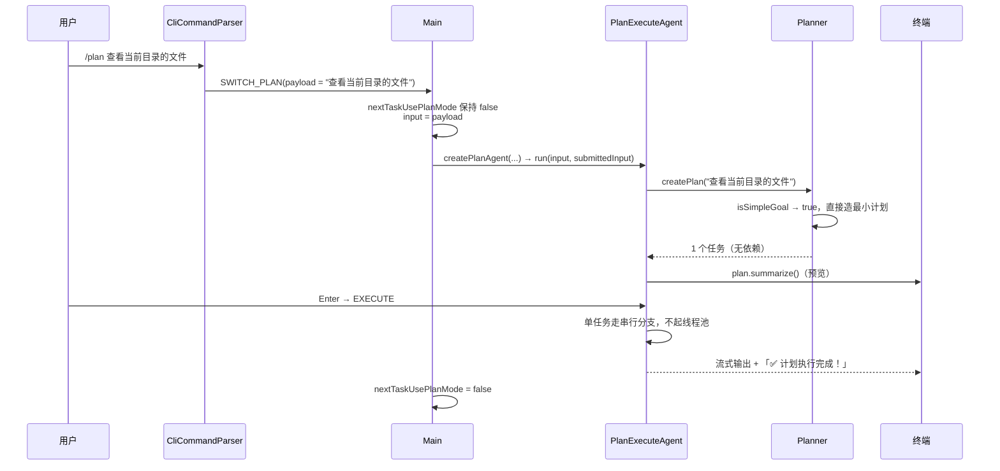

关键点：

- **`/plan` 带参数时走的是 `command.type() == SWITCH_PLAN` 这条判定**，`nextTaskUsePlanMode` 一直是 `false`（`Main.java:659-666`、`:992`）。两种写法（先 `/plan` 再输入任务、直接 `/plan <任务>`）最终都进同一个 `createPlanAgent`。
- **快速路径在规划之前就返回**：`isSimpleGoal` 命中时根本不发规划请求，直接造一个任务（`Planner.java:62-64`、`:246-254`）。判定规则是「没命中任何多步线索词 + 长度 ≤ 阈值 + 含某个动作关键词」，`查看` 和 `文件` 都命中（`:207-244`）。
- **仍然是 Plan-and-Execute 的全套流程**：一样过人工计划门，一样有 task 级账本条目，一样受 `stepReview` 约束。差别只在「计划是算出来的还是模型给的」。

## 11.2 场景二：多任务并行 + 依赖结果回填

用户输入：`/plan 搜索最新的 Java LTS 版本，然后写一份总结到 NOTES.md`

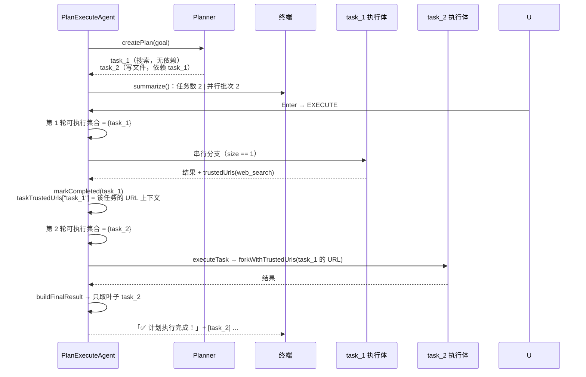

关键点：

- **这个例子里其实是「两批各一个任务」，不是并行。** 因为 task_2 依赖 task_1，每轮可执行集合只有一个元素，走的是串行分支（`PlanExecuteAgent.java:493-505`）。要触发真正的并行，模型必须产出**互不依赖**的节点——而提示词并不引导它这么做（见 12.1）。
- **「并行批次: 2」是预览里的静态层数**（10.3），和实际调度无关。
- **依赖结果回填有两条路**：任务结论通过简报写进后继的 task input（`StepBriefing.java:32-40`），凭据通过 `taskTrustedUrls` 映射取值（`PlanExecuteAgent.java:574-577`）。前者是文本，后者是授权——两者的传递范围都限定在**直接依赖**。
- **最终答案只含叶子 `task_2` 的结论**（10.1）。task_1 的搜索结论已经在简报里传给 task_2 了，不会再单独输出。

## 11.3 场景三：任务失败 + 重规划

用户输入：`/plan 重构这个模块并更新文档`，其中 task_2 因文件不存在而抛异常。

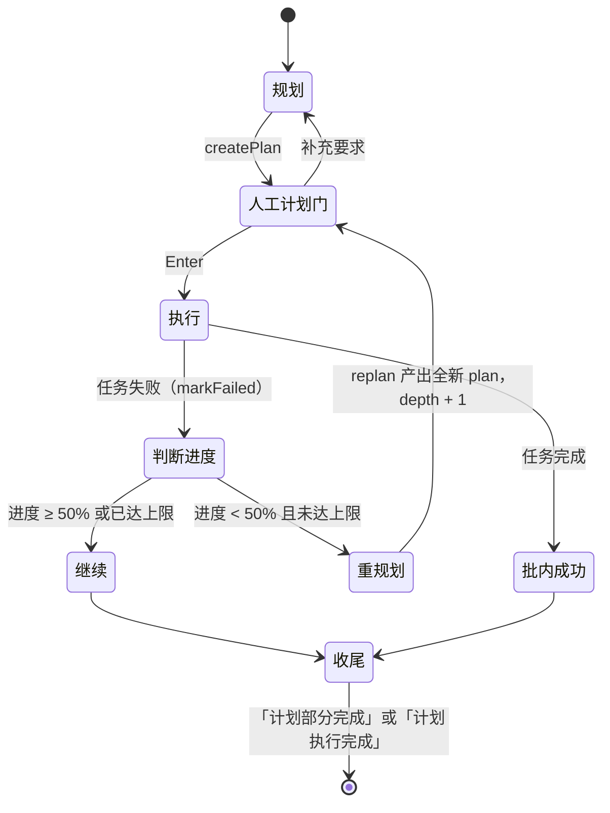

关键点：

- **失败不影响同批的其他任务**：本批结果逐个处理，成功的照常 `markCompleted`（`PlanExecuteAgent.java:416-428`），失败的进失败摘要（`:432-440`）。
- **阈值只看已完成比例**（`:441`），不看失败的是哪个节点（8.1）。
- **重规划会再问一次用户**：`reviewAndExecutePlan(replanned, …, depth + 1)` 重新过人工计划门（`:448-451`）。所以在 CLI 上一个长任务中途可能被问第二次「按当前计划执行？」。
- **重规划后 goal 变成拼接文本**（8.3），新计划的每个任务简报首行都会是那段「原任务 / 失败原因 / 已完成的任务」。
- **上限是 1 次**（`MAX_REPLANS_PER_RUN`），达到上限就打「⚠️ 已达到最大重规划次数，保留当前结果」并继续推进剩余可执行任务（`:443-446`）。
- **最终报告会同时包含外层失败和新计划的失败**（`:449` 的字符串拼接），不会因为重规划而丢掉前一段的账。注意此时 `finalResult` 非空，所以**不会走 `buildFinalResult`**，叶子汇总被跳过（10.1）。

---

# 第 12 部分　设计意图 vs 实际实现

这一部分只收「意图看起来是 A，代码实际是 B」的落差。前面各章展开过的，这里只留一句结论加指针，不重复论证。

## 12.1 并行触发：从「代码支持」到「提示词要求」

| | 内容 |
|---|---|
| 自然语言意图 | 「4 路并行执行 DAG 里同一轮就绪的任务」 |
| 代码侧 | ✅ 真的实现了：`executeTaskBatch` 在批次大小 > 1 时起 `min(size, 4)` 线程的池，各任务独立缓冲区、按序 flush（`PlanExecuteAgent.java:513`、`:553-561`） |
| 提示词侧（合并前） | ❌ 只有规则 3「任务应该按执行顺序排列」，**没有任何引导产出无依赖节点的文本** |
| 提示词侧（合并后） | ⚠️ 规则 9「多个任务可以独立完成时，不要互相添加 `dependencies`」、规则 10「只有确实需要前一个任务的结果时才写 `dependencies`」（`planner.md:39-40`） |

**这是本次合并最重要的一处「能力补齐」**：提交 `515984b` 对 `planner.md` 的改动只有两行，就是规则 9 和 10。加之前的状态是「代码能并行，但没人告诉模型去造并行」——批次并行这条路径虽然存在，却缺少触发它的引导。加之后意图和实现对齐了。

**但仍有两点必须诚实标出**：

1. **规则 3 与规则 9 字面冲突。** 「按执行顺序排列」对一张 DAG 是模糊要求，模型可能理解成「线性链」。两个规则谁优先由模型自己权衡。
2. **触发率未实测。** 我能确定的是「提示词现在有这条指令」和「代码路径可达」，**不能**确定「实践中多任务计划有多大比例真的产出无依赖节点」。要证实它需要构造多批真实任务统计批次大小分布——本项目没有这样的测试或数据集。所以正确的说法是「已引导、未度量」。

这个落差之所以值得排在第一位，是因为它决定了 5.2、11.2 里那些并行代码是否真的被走到。一个面试官如果问「你测过并行吗」，诚实的答案是「有单元测试覆盖并行路径，但没有数据说明它在真实任务里被触发的频率」。

## 12.2 步骤审查：意图是质检闸门，实际是三路降级全通

| | 内容 |
|---|---|
| 意图 | 「自动质检，不通过就打回重做」 |
| 实际 | 三种不通过都没有真正终止任务，全部以 `COMPLETED` 收场（见 7.7） |

三个具体落差：

- **审查调用失败 = 静默放行**（`SubAgentStepReviewer.java:28-30`），且不打印、不记 ledger。
- **重试次数用尽 = 保留当前结果视为成功**（`PlanExecuteAgent.java:619-621`），只打一行警告。
- **「未验证」没有被建模**：`Task.TaskStatus` 里没有对应取值（`Task.java:29-35`），所以下游和后继拿到的是一个和「真实通过」无法区分的 `COMPLETED`。

意图本身是合理的（附加闸门失效不应阻断主流程），**落差在于「没有向用户表达不确定性」**。一个 5 步计划里有 2 步是「重试用尽后保留」的，最终报告和全部通过的报告长得一样。

## 12.3 重试：意图是让执行体自我修补，实际是干净上下文重抽

见 7.5 的边界四。一句话版本：合并前重试复用执行体会话，模型记得自己上一轮做了什么；合并后每次 `new ArrayList<>()`（`PlanExecuteAgent.java:656`），唯一的增量信息是 `StepBriefing` 里的那行反馈（`StepBriefing.java:49-52`）。

**这是取舍不是纯退化**：换掉的是定向修补能力，换来的是上下文可预测（不会随重试线性膨胀、错误产物不会污染后续判断）。

## 12.4 「多 Agent」：名字是复数，实际只有一类子 Agent

| 角色 | 合并前 | 现在 | 位置 |
|---|---|---|---|
| Planner | `SubAgent(AgentRole.PLANNER)` | **不是子 Agent**，是普通类 `Planner`，每次规划临时发两条消息 | `Planner.java:59-90` |
| Worker | `SubAgent(AgentRole.WORKER)` | **不是子 Agent**，是 `PlanExecuteAgent.executeTaskWithPolicy` 这个方法 | `PlanExecuteAgent.java:631` |
| Reviewer | `SubAgent(AgentRole.REVIEWER)` | ✅ 仍是 `SubAgent`，唯一的生产使用者 | `PlanExecuteAgent.java:610-611` |

所以严格讲，**现在只有 Reviewer 是「子 Agent」**：只有它通过 `SubAgent` 类、有自己的 `AgentRole`、有自己的 system prompt 选择（`SubAgent.promptMode()`，`:133-139`）。

**代码里留下的对应痕迹**（不影响运行，但看代码时容易误判）：

- `AgentRole.PLANNER` / `AgentRole.WORKER` 在 `src/main` 里**没有任何构造点**，只有测试在构造（`SubAgentTest.java:50-54`）；枚举值本身还带着「规划者」「执行者」的描述文案（`AgentRole.java:7-9`）。
- `SubAgent.shouldUseTools()` 返回 `role == AgentRole.WORKER`（`SubAgent.java:561`）——在生产路径里**永远为 `false`**。
- `SubAgent.executeWithPolicy` 带着注释「Caller-owned branch policy; the same instance may span reviewer retries」（`SubAgent.java:269-270`），但外部已无调用方（`AgentOrchestrator` 已删除），只剩内部 `execute` 走它。
- `PromptMode.TEAM_REVIEWER` 与 `prompts/modes/team-reviewer.md` **仍在用**（Reviewer 的提示词就是它，`SubAgent.java:137`），不是残留。
- `SubAgent.clearHistory` 写的 ledger mode 是 `"team"`（`SubAgent.java:520`），这是真残留（见 9.4）。

**面试时应该怎么讲**：「多 Agent」在这个项目里的准确含义是**责任与上下文隔离**，不是多个模型。三类角色共享同一个 `LlmClient` 和同一个 `ToolRegistry`，隔离的是「system prompt + 对话历史 + 是否暴露工具」这三件事。这是有意的取舍——多模型会带来成本、延迟和一致性三重复杂度，而这个模块要解决的问题（计划、执行、检查三种提示词不可混用）用隔离上下文就够了。

## 12.5 盲规划 × 橡皮图章：两处落差叠加后的结果

单独看两处落差都不严重，叠加起来是一个值得警惕的组合：

| 落差 | 单独影响 | 位置 |
|---|---|---|
| 规划阶段无工具、无「先查再规划」提示词 → 盲规划 | 计划可能建立在错误的目录结构假设上 | 3.1 |
| TUI 注入恒 `execute()` 的 review handler → 人工计划门失效 | 用户没有机会否决计划 | `TuiSessionController.java:255`、2.2 |

**叠加后：在 TUI 里，一份凭模型推断生成的计划会在零人工确认的情况下直接进入执行。** CLI 下不存在这个问题（终端审阅界面会等一个按键，`Main.java:1572-1575`）。

这是本项目里我最建议主动交代的一条：它不是 bug，是两处各自合理的取舍在特定入口下的合成效果，而**没有任何代码或文档指出这个组合**。修法也很轻（TUI 接一个真实的计划门，或者至少在恒 `execute()` 时打印一行「计划已自动执行」），但当前没有做。

---

# 第 13 部分　失败与边界矩阵

## 13.1 失败模式全表

按「用户能看到什么」排序，从最吵到最静：

| # | 失败模式 | 触发点 | 任务/计划状态 | 用户可见信号 | 后果 |
|---|---|---|---|---|---|
| 1 | 规划输出不是合法 JSON | `mapper.readTree` 抛异常（`Planner.java:111`） | 无计划 | 「❌ 执行失败: …」 | 整次运行终止 |
| 2 | 计划有环 | `computeExecutionOrder()` 返回 false（`Planner.java:155-157`） | 无计划 | 「❌ 执行失败: 计划中存在循环依赖」 | 整次运行终止 |
| 3 | 任务执行抛异常且进度 < 50% | `executePlan` 的失败分支（`:441-451`） | 该任务 `FAILED` | 「❌ 失败 […]」+「🔄 尝试重新规划...」 | 重新规划一次（受上限 1 次约束） |
| 4 | 任务执行抛异常且进度 ≥ 50% | 同上，但条件不成立 | 该任务 `FAILED` | 「❌ 失败 […]」 | 依赖它的后继静默不可执行，报告「计划部分完成，有任务失败」 |
| 5 | 预算耗尽（token/停滞/硬轮数） | `finalizePartialTask`（`:797-843`） | 该任务 **`COMPLETED`** | 「⚠️ 部分完成（<原因>）」前缀 | 状态与文案不一致（6.3） |
| 6 | 步骤审查重试用尽 | `applyStepReview`（`:619-621`） | 该任务 **`COMPLETED`** | 一行「⚠️ 达到最大重试次数」 | 未验证结果被当作通过（7.7） |
| 7 | 步骤审查调用本身失败 | `SubAgentStepReviewer.java:28-30` | 该任务 **`COMPLETED`** | **无任何输出** | 静默放行，连日志都没有（7.7） |
| 8 | 未知依赖 ID | `Planner.parsePlan`（`:146-149`） | 该任务变成根任务 | **无任何输出** | 依赖约束被静默丢弃，任务提前跑（3.4） |
| 9 | 重规划达到上限 | `executePlan`（`:443-446`） | 计划 `FAILED` | 「⚠️ 已达到最大重规划次数，保留当前结果」 | 保留失败摘要继续推进（8.2） |
| 10 | 用户中断（`/cancel`） | `CancellationContext.isCancelled()` | 计划 `CANCELLED` | 「⏹️ 已取消当前计划执行。」 | 已完成的账保留；停在任务边界（5.4） |

**第 8 行是唯一一条「静默改语义」**（第 7 行是静默降级），也是最容易在代码审查里漏掉的一条，因为它藏在一个看起来是防御性写法的 `if (dep != null)` 里。

## 13.2 边界条件

| 边界 | 行为 | 依据 |
|---|---|---|
| 计划只有 1 个任务 | 走串行分支，**不起线程池** | `PlanExecuteAgent.java:493-505` |
| 计划有 4 个以上同轮就绪任务 | 池大小封顶为 4，超出的排队 | `:513` |
| 任务无依赖 | 简报里显式打印「依赖任务结果：（无）」而不是省略该段 | `StepBriefing.java:28-30` |
| 任务有依赖但依赖结果为空 | 简报里该依赖行显示为空内容，不额外标注 | `StepBriefing.java:32-40` |
| 依赖凭据列表为空 | **整段 URL 章节被省略** | `StepBriefing.java:43-47`；测试 `StepBriefingTest.omitsUrlSectionWhenNoTrustedUrls`（`:53`） |
| 首次执行（无重试） | **不出现**「之前的结果被审查拒绝」章节 | `StepBriefing.java:49-52`；测试 `StepBriefingTest.omitsRetrySectionOnFirstAttempt`（`:60`） |
| 最终汇总时叶子结果为空 | 退化成「取列表最后一个有结果的任务」 | `PlanExecuteAgent.java:1217-1222`（10.1） |
| 最终汇总时所有叶子都已流式输出 | 同上兜底 | 同上 |
| 存在失败任务 | **跳过整段叶子汇总**，报告只有失败描述 | `PlanExecuteAgent.java:461-463`（10.1） |
| 简单目标 | 完全不调模型，直接造单任务计划 | `Planner.java:62-64`、`:246-254`（3.3） |
| 简单目标命中但含多个线索词 | 不走快速路径 | `Planner.java:217-229`（3.3） |
| TUI 下执行计划 | 没有 child session，只有共享账本 | 9.4 |

## 13.3 并发上限与批次屏障

把 0.5 的三层并行加上上限，才是完整的并发图景：

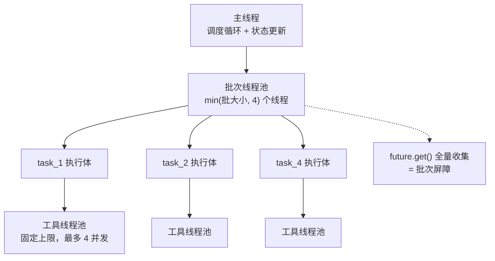

两个必须记住的结论：

**第一，没有全局并发预算。** 最坏情况的并发工具调用数是 `批次池大小 × 工具池上限`——**这个乘积没有任何一处代码去约束它**。批次池是「按批大小动态创建、跑完即 shutdown」的（`PlanExecuteAgent.java:513-517`、`:564`），工具池是 `ToolRegistry` 里的固定上限（`ToolRegistry.java:63`），两者互相不知道对方存在。

**第二，批次是一道屏障。** 主线程必须等整批 `future.get()` 全部返回才逐个回填状态（`:538-551`），所以：

- **后继任务要等最慢的兄弟跑完才能开始**，没有流水线重叠。一个批次里 4 个任务分别耗时 1s / 1s / 1s / 60s，那这 60s 里另外三条线程全程空闲，而且下一批一个字都动不了。
- **代价换的是状态简单**：正因为主线程在屏障后面独占更新状态，`Task` 的 `status` / `result` 才只需 `volatile` 而不需要锁（`Task.java:12-18`，见 3.6）。

**这个取舍值得主动说明**：如果改成「任务完成即回填、后继就绪即提交」，吞吐会明显提高，但状态更新就变成多线程竞争，`getExecutableTasks()` 也会在「部分依赖完成」的中间态被调用，需要重新设计一致性模型。当前实现选的是「吞吐换简单」，不是「没想过要优化」。

**一条实测边界**：并行路径的覆盖测试 `runsIndependentTasksInParallel`（`PlanExecuteAgentTest.java:405`）验证的是「独立任务确实并发跑」，但**没有测试批次屏障的耗时特征**，也没有测试「池大小封顶为 4」这个上限本身（见 14.3）。

---

# 第 14 部分　测试策略与证据

## 14.1 怎么跑这个模块的测试

**关键前提：仓库的 `pom.xml` 默认 `<skipTests>true</skipTests>`**（`pom.xml:21`，注释在 `:20`）。直接 `mvn test` **不会跑任何测试**，必须显式打开：

```bash
# 本模块的定向测试集（9 个测试类）
JAVA_HOME="/c/Program Files/Java/jdk-17" mvn test -DskipTests=false \
  -Dtest=ExecutionPlanTest,PlannerTest,PlanExecuteAgentTest,StepBriefingTest,\
SubAgentStepReviewerTest,PipelineOptionsTest,ReviewResponseParserTest,\
StepReviewDecisionTest,SubAgentTest
```

本文件写作时（2026-09-18，提交 `87c0136`）的实际结果：

```text
ExecutionPlanTest:        Tests run:  7, Failures: 0, Errors: 0, Skipped: 0
PlannerTest:              Tests run:  6, Failures: 0, Errors: 0, Skipped: 0
PlanExecuteAgentTest:     Tests run: 15, Failures: 0, Errors: 0, Skipped: 0
StepBriefingTest:         Tests run:  7, Failures: 0, Errors: 0, Skipped: 0
SubAgentStepReviewerTest: Tests run:  3, Failures: 0, Errors: 0, Skipped: 0
PipelineOptionsTest:      Tests run:  3, Failures: 0, Errors: 0, Skipped: 0
ReviewResponseParserTest: Tests run: 10, Failures: 0, Errors: 0, Skipped: 0
StepReviewDecisionTest:   Tests run:  3, Failures: 0, Errors: 0, Skipped: 0
SubAgentTest:             Tests run:  6, Failures: 0, Errors: 0, Skipped: 0
```

合计 **60 个用例，0 失败**。（注意 `mvn` 输出是 GBK；在 git bash 里需要 `iconv -f GBK -t UTF-8` 才能正常阅读。）

**一处必须知道的覆盖落差：`-Pquick` 不跑这个模块。** `quick` profile 只做了一件事——排除 5 个慢测试类（`pom.xml:199-206`：`McpServerManagerTest`、`StdioTransportTest`、`StreamableHttpTransportTest`、`ToolRegistryTest`、`WebFetcherTest`），它**不会**自动纳入 `agent/` 或 `plan/` 下的测试。所以如果日常回归只跑 `mvn test -Pquick`，那么**本模块的全部 60 个用例都不在网内**——包括那三条修复了真实缺陷的回归测试。要覆盖它们必须显式 `-Dtest=` 或跑 `mvn test -DskipTests=false`。

## 14.2 钉住关键行为的测试

按「它守护哪个行为」分组，而不是按类名：

**DAG 与图算法**

| 行为 | 测试 |
|---|---|
| 拓扑排序尊重依赖 | `ExecutionPlanTest.computeExecutionOrderRespectsDependencies`（`:13`） |
| 依赖未完成时任务不可执行 | `ExecutionPlanTest.executableTasksWaitUntilDependenciesComplete`（`:27`） |
| `addTask` 建立双向关系 | `ExecutionPlanTest.addTaskBuildsDependentRelationship`（`:52`） |
| 预览批次按图层划分 | `ExecutionPlanTest.executionBatchesFollowDagLayers`（`:104`） |
| 前向引用依赖能正确映射 | `PlannerTest.mapsDependencyDeclaredBeforeItsTarget`（`:89`） |
| 简单目标不调 LLM | `PlannerTest.createsMinimalPlanForSimpleGoalWithoutCallingLlm`（`:17`） |
| 非 JSON 输出抛异常 | `PlannerTest.throwsWhenPlannerOutputIsNotParseableJson`（`:136`） |
| Markdown 围栏被剥掉 | `PlannerTest.parsesPlanWrappedInMarkdownFence`（`:62`） |

**Multi-Agent 角色隔离**

| 行为 | 测试 |
|---|---|
| 三个角色的工具暴露不同 | `SubAgentTest.shouldOnlyEnableToolsForWorker`（`:49`） |
| 简报渲染总目标/任务/类型 | `StepBriefingTest.rendersGoalCurrentTaskAndType`（`:14`） |
| 依赖结果完整保留 | `StepBriefingTest.keepsDependencyResultsInFull`（`:24`） |
| 无依赖时显式标注 | `StepBriefingTest.reportsEmptyDependenciesExplicitly`（`:36`） |
| 首次执行不出现重试章节 | `StepBriefingTest.omitsRetrySectionOnFirstAttempt`（`:60`） |
| 重试时带上反馈 | `StepBriefingTest.includesRetryFeedbackWhenRetrying`（`:67`） |

**审查与降级策略**

| 行为 | 测试 |
|---|---|
| `approved: true` 放行 | `SubAgentStepReviewerTest.approvesWhenReviewerReturnsApprovedTrue`（`:25`） |
| 拒绝时携带 `issues` | `SubAgentStepReviewerTest.rejectsAndCarriesIssues`（`:33`） |
| **审查调用 LLM 失败仍放行**（fail-open） | `SubAgentStepReviewerTest.approvesWhenReviewerCallFailsAtLlmLayer`（`:41`） |
| 缺 `approved` 字段 → 拒绝 | `ReviewResponseParserTest.rejectsWhenApprovedFieldMissing`（`:22`） |
| 关键词兜底 | `ReviewResponseParserTest.fallsBackToKeywordsWhenJsonUnparseable`（`:33`） |
| 无肯定关键词 → 拒绝 | `ReviewResponseParserTest.rejectsUnparseableContentWithoutExplicitApproval`（`:40`） |
| 三级回退后落硬编码文案 | `ReviewResponseParserTest.defaultIssueMessageWhenNothingParseable`（`:63`） |
| 重试直到通过 | `PlanExecuteAgentTest.stepReviewRetriesUntilReviewerApproves`（`:325`） |
| 评审关闭时每任务只跑一次 | `PlanExecuteAgentTest.stepReviewDisabledKeepsSingleAttemptPerTask`（`:353`） |
| 重试用尽保留结果 | `PlanExecuteAgentTest.fallsBackToExistingOutcomeAfterRetriesExhausted`（`:377`） |

**两个已修缺陷的回归测试**

| 缺陷 | 测试 | 断言 |
|---|---|---|
| Reviewer 共享实例导致数据竞争 | `PlanExecuteAgentTest.parallelStepReviewDoesNotShareReviewerHistory`（`:432`） | 并行批次里每个任务各调一次 review，结论不串台 |
| 失败重规划无限递归 → `StackOverflowError` | `PlanExecuteAgentTest.capsReplanningWhenEarlyFailureKeepsRecurring`（`:484`） | `replan` 只调一次 + 外层失败不丢账 |
| 补充要求后未重建工具策略 | `PlanExecuteAgentTest.supplementRebuildsToolPolicyBeforeReplanning`（`:231`） | 重建发生 |
| 无 URL 的补充要求应收紧策略 | `PlanExecuteAgentTest.noWebSupplementTightensToolPolicyBeforeReplanning`（`:265`） | 收紧发生 |

**凭据与输出**

| 行为 | 测试 |
|---|---|
| 只继承直接依赖的结构化 URL | `PlanExecuteAgentTest.dependentTaskInheritsOnlyTypedSearchUrlProvenance`（`:293`） |
| 独立任务真的并行 | `PlanExecuteAgentTest.runsIndependentTasksInParallel`（`:405`） |
| 流式输出不重复进最终汇总 | `PlanExecuteAgentTest.shouldNotRepeatStreamedTaskOutputInFinalPlanSummary`（`:162`） |

## 14.3 覆盖缺口

按「风险高低」排序，不是按「好不好补」：

| 缺口 | 为什么是缺口 | 现状 |
|---|---|---|
| **批次池上限 = 4 无断言** | 上限被改成 8 或去掉，测试全绿 | 只有 `:513` 这行代码本身 |
| **浏览器租约成对释放无断言**（9.3） | 并行下租约泄漏会让后续任务拿不到浏览器 | 无 |
| **批次屏障的并发时序无断言** | `runsIndependentTasksInParallel` 证明「并发发生了」，不证明「批次边界正确」 | 无 |
| **并行触发率无数据**（12.1） | 无法回答「4 路并行实际用得多不多」 | 无数据集、无统计 |
| **`finalizePartialTask` 无测试**（6.3） | 「预算耗尽记成成功」这条路径完全无覆盖；`AgentBudgetFinalizationTest` 测的是 ReAct 路径 | 无 |
| **未知依赖被静默丢弃无断言**（3.4 / 13.1 第 8 行） | 静默改语义的行为没有任何测试钉住 | 无 |
| **`-Pquick` 不含本模块**（14.1） | 日常回归网漏掉 60 个用例 | pom 配置 |
| **`getExecutionOrder()` 丢返回值无断言**（10.2） | 当前不可达，但无测试防止未来变得可达 | 无 |
| **数据竞争本身无断言**（7.6） | 并发缺陷测试无法证明「无竞争」，只能证明「该路径被走到」 | 属固有局限，非疏漏 |

**对这份清单的定位**：它是一份「已知边界」而不是「待办清单」。前两条（池上限、租约）是我认为真正值得补的；触发率那条需要的是度量手段而不是测试；最后一条是并发测试的固有限制，加再多测试也消不掉。

---

# 第 15 部分　面试怎么讲

## 15.1 30 秒版

> 我把项目里原本两套独立的编排实现合并成了一个模式：一个 `/plan` 入口，串起「人工计划门 → DAG 调度 → 步骤自动评审 → 失败重试」。规划器把任务拆成有依赖关系的 DAG，调度层每一轮算出依赖已满足的任务，单个串行、多个按最多 4 路并行跑，每个任务带一份统一的 `StepBriefing` 上下文；任务跑完由独立的 Reviewer 子 Agent 判定通过与否，不通过就带着反馈重跑；任务抛异常时按完成进度决定是否重新规划。合并过程中修了两个真实缺陷：并行下共享 Reviewer 的数据竞争，和失败重规划的无限递归爆栈。

## 15.2 2 分钟版

（在 30 秒版基础上，按这个顺序展开）

1. **入口与开关**：`/plan` 走 `FULL_PRESET`，人工计划门和步骤自动评审两个环节串联。`PipelineOptions` 的两个布尔是「两个独立开关」的表达，但注意 `humanPlanGate` 在生产代码里从未被读取，真正的闸门是注入的 `PlanReviewHandler`。
2. **规划**：`Planner` 是普通类不是子 Agent，一次 LLM 调用、**不暴露工具**——所以是盲规划。产出 JSON 经两遍扫描建图：第一遍建任务并重编号，第二遍建依赖边。有环直接抛异常，环进不了调度。
3. **调度**：主循环每轮算可执行集合，只在主线程更新任务状态（所以 `Task` 的状态字段只需 `volatile`）。多任务时起 `min(size, 4)` 的线程池，每个任务独立输出缓冲，`future.get()` 全量收集后按序 flush——**批次是一道屏障**，这是「吞吐换状态简单」的取舍。
4. **任务内部**：每个任务是一段独立的 ReAct 循环，工具走统一的 `executeTools`，预算由 `AgentBudget` 三道保险阀兜底；预算耗尽不失败，而是收尾成「部分完成」。
5. **审查**：Reviewer 是唯一真正用 `SubAgent` 的角色。两层失败策略方向相反——调用失败 fail-open 放行，结论无法解析 fail-closed 拒绝。
6. **凭据**：URL 授权按 DAG 边隔离，每个任务 `fork` 自己的策略，只继承直接依赖的结构化 URL。
7. **两个已修缺陷**：并行下共享 Reviewer 的 `ArrayList` 数据竞争（改成每任务现建），以及 `executePlan` ↔ `reviewAndExecutePlan` 无深度上限的互递归（`StackOverflowError`，加 `MAX_REPLANS_PER_RUN` 封顶）。

## 15.3 被问到「合并」时怎么答

这道题的关键是**不要把它讲成「删代码」**：

> 合并的动机是两套实现解决的是同一个问题——「把复杂任务拆开、分工执行、检查结果、失败了怎么办」。旧的两套各有缺口：Plan-and-Execute 有 DAG 和计划门但没有独立审查，Planner-Worker-Reviewer 有审查但没有图结构，只能按线性步骤跑。合并的方式是**以 Plan-and-Execute 为主线，把多 Agent 的角色隔离能力接进来**：保留 DAG 与计划门，把审查改成独立的 Reviewer 子 Agent，把两套各自的「步骤上下文拼装」统一成 `StepBriefing`。
>
> 合并的判据不是「代码更少」，而是「原来两个入口只有一个能进去」。合并后删掉了 `/team` 和 `AgentOrchestrator`，因为保留一个入口是这次重构的目的；但同时保留了 `PLAN_PRESET` / `TEAM_PRESET` 两个预置，因为它们是「两个开关独立」这个设计在构造层的表达，删掉它们 `PipelineOptions` 就退化成一个常量了。
>
> 代价要主动说：合并引入过两个缺陷——并行下共享 Reviewer 的数据竞争、失败重规划的无限递归。前者是「旧实现是每步各建一个 Reviewer，合并时把这个保护丢了」；后者的代码在合并前就存在，但并行带来的失败更频繁，把它暴露出来了。还有一个能力退化：重试现在跑在干净上下文里，执行体不记得上一轮做了什么，只能靠 Reviewer 的反馈文本。

## 15.4 高频问答（按主题）

### A. 整体定位

**Q：Multi-Agent 比单 Agent 多了什么？**
多了三个**责任位置**的隔离，以及它们在 DAG 上的传递关系：规划（意图 → 图）、执行（图节点 → 结果）、检查（结果 → 通过/不通过）。单 Agent 的 ReAct 循环里这三种提示词会混在一份上下文里互相污染。

**Q：三个角色是三个模型吗？**
不是。共享同一个 `LlmClient` 和同一个 `ToolRegistry`。隔离的是三件事：system prompt、对话历史、是否暴露工具。

**Q：三个角色是三个类吗？**
不是，只有 Reviewer 是。Planner 是普通类（`Planner`），Worker 是 `PlanExecuteAgent.executeTaskWithPolicy` 这个方法，Reviewer 才是 `SubAgent`。

**Q：`SubAgent` 和主 `Agent` 是什么关系？**
没有继承关系，是两个独立的 ReAct 循环实现。项目里一共三处 ReAct 循环（主 `Agent`、`SubAgent`、`PlanExecuteAgent.executeTaskWithPolicy`），没有抽公共内核——这是已知的技术债。

**Q：`AgentRole` 里三个角色在生产路径都用到了吗？**
只有 `REVIEWER`。`PLANNER` / `WORKER` 在 `src/main` 里没有任何构造点，只有测试在构造；`shouldUseTools()` 里的 `WORKER` 分支生产不可达。

### B. 规划与 DAG

**Q：DAG 是从哪来的？**
模型返回的 JSON。`Planner` 只负责解析与建图，不负责推理图的正确性——所以才有环检测。

**Q：为什么规划阶段不给工具？**
规划阶段允许读文件会让 token 成本随项目规模爆炸，而且拆解质量取决于它读了哪些文件，不可预期。代价是「盲规划」，纠错只能靠人工计划门。

**Q：环是怎么处理的？**
`parsePlan` 建完图立刻跑拓扑排序，失败就抛 `IOException`，整份计划作废。环进不了调度循环。

**Q：模型给的依赖 ID 是未知的怎么办？**
这条依赖边被**静默丢弃**，任务变成根任务、在第一批就执行。这是「提前跑」而不是「卡住」——说成「任务永远 PENDING」是错的。

**Q：简单目标有什么特殊处理？**
`isSimpleGoal` 命中时完全不调模型，直接造一个单任务计划。判定是「无多步线索词 + 长度不超阈值 + 含某个动作关键词」。

**Q：拓扑序稳定吗？**
不稳定。`tasks` 是 `HashMap`，多次运行可能得到不同的合法拓扑序。不影响执行，因为调度看的是 `getExecutableTasks()`，拓扑序只用来给同一批任务排相对顺序。

### C. 调度与并发

**Q：并行的调度粒度是什么？**
每轮一个批次。主线程算出「依赖全部已完成」的任务集合，单个就串行跑，多个就起 `min(size, 4)` 的线程池并行跑。

**Q：最多并行多少个？**
分层看：批次并行最多 4；每个任务自己的工具调用并行另有固定上限。两者嵌套，**没有全局并发预算**。

**Q：怎么保证并行输出不乱？**
每个任务写自己的 `ByteArrayOutputStream`，主线程在 `future.get()` 全部返回后按任务顺序 flush 到 stdout。

**Q：状态更新有并发问题吗？**
没有，因为**所有任务状态只由主线程更新**：`markStarted` 在提交前、`markCompleted` / `markFailed` 在屏障后。这是批次屏障换来的简单性，也是 `Task` 的状态字段只需 `volatile` 的原因。

**Q：并行写文件会冲突吗？**
没有检测机制，靠提示词层面让模型避免出这种计划。这是已知缺口。

**Q：怎么验证并行是真的？**
`PlanExecuteAgentTest.runsIndependentTasksInParallel`。但要诚实说：它证明的是「并发发生了」，不证明批次边界时序正确，也没有断言池上限是 4。

**Q：为什么不用共享黑板或消息队列？**
当前是单进程线程池，责任位置之间靠编排器拼字符串传递。这是刻意的范围控制，代价是产物（`Task.result`）只存活在内存里。

### D. 审查与重试

**Q：Reviewer 拿到什么？**
只有三段文本：总目标、当前任务描述、该任务的最终结果文本。**拿不到**依赖结论、工具调用记录、文件内容。

**Q：Reviewer 有工具吗？**
没有。`shouldUseTools()` 对 REVIEWER 返回 `false`。所以它是纯文本审查器，发现不了「文件写坏了但汇报说成功」。

**Q：Reviewer 的输出怎么变成决定？**
`ReviewResponseParser` 解析成 `StepReviewDecision(approved, feedback)`，之后没人再碰原始文本。这比「两个方法从同一段文本分别解析 approved 和 issues」可靠，因为结论只有一个入口。

**Q：Reviewer 输出不规范怎么办？**
fail-closed：空内容、缺 `approved` 字段、非 JSON 且无肯定关键词，一律判不通过。JSON 解析失败时会走关键词兜底，且否定词优先。

**Q：那关键词兜底会不会误判？**
会。「本次没有问题」含「有问题」，会被判不通过。这是 fail-closed 方向上的代价，可接受但要知道。

**Q：审查调用本身失败呢？**
fail-open：判通过。理由是不能因为审查服务不可用就作废一个已经跑完的任务。代价是**完全静默**——不打印、不记 ledger。

**Q：最多重试几次？**
`MAX_RETRIES_PER_STEP` 是 2，语义是「首次执行之外的额外尝试」，所以一个任务最多执行 3 次。

**Q：重试的时候给执行体什么？**
只有一段反馈文本，通过 `StepBriefing` 变成「之前的结果被审查拒绝，原因：…」。**执行体不记得自己上一轮做了什么**——每次重试都是全新的 `messages`。这是合并引入的能力退化。

**Q：为什么每次都新建 `AgentBudget`？**
因为预算在 `executeTaskWithPolicy` 内部构造，重试会重新进入这个方法。所以「预算耗尽」的兜底不跨重试累计，最坏消耗是重试倍数。

**Q：审查一直不通过会怎样？**
保留最后一轮结果，标记 `COMPLETED`，只打一行警告。任务状态和「真实通过」无法区分。

**Q：并行批次的审查有什么坑？**
合并时一度共享单个 Reviewer 实例，而它的 `conversationHistory` 是裸 `ArrayList`——真实的并发缺陷。现已改为每任务现建。注意并发缺陷的测试**不必然失败**，回归测试能钉住「结论不串台」，不能证明「无竞争」。

**Q：为什么审查结论要结构化？**
Reviewer 的本质是一次 LLM 调用，输出只能是文本；「结构化」是在适配层做的。好处是结论只有一个入口，不可能自相矛盾。

### E. 失败与重规划

**Q：任务失败后干什么？**
按完成比例分两档：进度 < 50% 触发重规划（受上限封顶）；≥ 50% 直接记进失败摘要、不重规划，继续推进剩余任务。

**Q：为什么阈值是 50%？**
意图是「进度过半说明大方向对，为一个节点推翻整个计划不划算」。但它只看数量，不看失败的是哪个节点——关键路径汇聚点失败也不会重规划。

**Q：重规划会重新问计划门吗？**
会。`reviewAndExecutePlan(replanned, …, depth + 1)` 重新走一遍人工计划门，所以长任务中途可能被问第二次。

**Q：重规划有次数上限吗？**
有，`MAX_REPLANS_PER_RUN` 是 1。加之前这里没有边界——`executePlan` ↔ `reviewAndExecutePlan` 是无深度参数的互递归，每轮真实打一次 LLM，而且 `replan` 会把 goal 逐层嵌套，触发条件又始终不变，实测能把栈打穿。

**Q：那人工计划门的「补充要求」有上限吗？**
没有，那一圈 `while(true)` 不递增 `replanDepth`。它可接受是因为每轮都要用户输入——人驱动的，不是自动放大。但如果换成自动放行的 review handler，这个前提就没了。

**Q：重规划后最终报告会丢账吗？**
不会。修复时一并处理了「外层的失败摘要被丢弃」这个记账 bug——重规划返回时显式拼上了外层已发生的失败。

**Q：重规划之后 goal 还是用户的目标吗？**
不是。`replan` 把「原任务 + 失败原因 + 已完成的任务」拼成新 goal 再调 `createPlan`。所以新计划里每个任务简报的「总目标」都是这段拼接文本，Reviewer 看到的也是。任务描述本身是准确的，所以影响有限。

**Q：预算耗尽是失败吗？**
不是。`finalizePartialTask` 返回一个没有 `error` 的结果，调度层当成功 `markCompleted`。最终表现为「任务状态 = 已完成，结果文本带『部分完成』前缀」。

### F. 凭据与审计

**Q：URL 凭据是怎么隔离的？**
顶层策略由用户提交态原文构造（不是展开 `@path` 之后的文本），每个任务 `forkWithTrustedUrls` 自己的分支，只继承**直接依赖**成功返回的结构化 URL。所以「只有用户原文和 `web_search` 结果能产生授权」这条规则在计划模式下是按 DAG 边传播的。

**Q：URL 隔离有什么边界？**
不展开传递依赖——长链条中间的 URL 会断掉。这是有意收紧，有测试钉住。

**Q：Reviewer 在凭据链上吗？**
不在，它每次调用现建一份策略。而且它的策略输入里含被审查任务的执行结果文本——严格讲是个越权点。实际危害为零，因为 Reviewer 没有工具。**记住这个安全性质是「因为没工具」而成立，不是「因为策略正确」**。

**Q：账本记录了什么？**
`mode` 恒为 `plan`，actor 有三类：`plan-agent`（用户输入/最终结果/错误/取消）、`planner`（提示词/请求/响应）、`task:<id>`（每个任务的完整消息流水）。账本是 append-only 原始流水，压缩只改发送视图、不回写账本。

**Q：CLI 和 TUI 在审计上一样吗？**
不一样。CLI 注入了 `parentSession`，每个任务有独立 child session；TUI 没注入，只有共享账本里的条目。

**Q：有一处口径不一致吗？**
有。审查侧 `SubAgent.clearHistory` 写的 ledger mode 硬编码是 `"team"`——`/team` 已删除但字符串留下了。所以每次步骤审查都会写一条 mode 为 `team` 的事件。

### G. 工程取舍

**Q：如何控制 Token 成本？**
规划只调一次、规划阶段不暴露工具、每个任务新建消息列表（跨任务不累积）、审查输入只有两段文本、重试有上限、和主 Agent 一样走上下文压缩。**反方向也要说**：依赖结果是全文注入无截断，每次重试新建预算，所以成本上限并不紧。

**Q：这个实现最大的可靠性缺口是什么？**
按严重程度：一是「未验证」没有被建模成独立状态（fail-open 和重试耗尽都记成 `COMPLETED` 且无明显提示）；二是 Reviewer 缺少验证所需的证据（无工具、无依赖结果、无工具记录）；三是重试路径没有取消检查；四是依赖结果全文注入无截断。

**Q：下一步怎么演进？**
优先补可靠性：给任务加「未验证」终态，让 fail-open 在汇总里可见；补重试路径的取消检查；修 `parsePlan` 的未知依赖静默丢弃。能力上再考虑给 Reviewer 喂编译/测试/静态分析的机器证据，以及让 `Planner` 真正消费结构化审查反馈做重规划。

**Q：为什么保留 `PLAN_PRESET` / `TEAM_PRESET`？**
它们现在的作用是「两个独立开关」这个设计在构造层的表达，以及作为单测输入。删掉它们 `PipelineOptions` 就退化成一个恒为 `(true, true)` 的常量，两个布尔参数也就没存在必要了。代价是「不要评审」目前没有命令行出口。

---

# 第 16 部分　简历条陈与源码证据

> **本文件同时承载原来两条简历描述。** 原先 `docs/dev/02-dag-orchestration.md` 讲「DAG 任务编排」、`docs/dev/03-multi-agent-collaboration.md` 讲「Multi-Agent 协作」，对应简历里两条独立的项目描述。2026-09-18 合并后两条描述由同一份代码支撑（同一个 `PlanExecuteAgent`、同一个入口），因此合并成一篇，**两条简历句都保留**，各自配一份证据表。

## 16.1 简历句一：DAG 任务编排

**原句：**

> DAG任务编排：构建 Plan-and-Execute 任务编排能力，将复杂目标拆解为带依赖关系的 DAG 任务，通过拓扑排序和执行批次调度任务，无依赖任务支持最多 4 路并行执行，并保留工具结果的原始顺序。

| 简历表述 | 代码证据 |
|---|---|
| 构建 Plan-and-Execute 任务编排能力 | 规划入口 `Planner.createPlan` — `Planner.java:59`；调度入口 `PlanExecuteAgent.executePlan` — `PlanExecuteAgent.java:392`；顶层编排 — `:359-361` |
| 将复杂目标拆解为带依赖关系的 DAG 任务 | 模型输出 JSON 契约 — `prompts/modes/planner.md:13-27`；解析与建边（含反向 `dependents`）— `Planner.java:122-152`；`Task.dependencies` / `dependents` — `Task.java:15-16`；反向边登记 — `ExecutionPlan.java:48-57` |
| 通过拓扑排序 | `computeExecutionOrder()` — `ExecutionPlan.java:94-108`；DFS 与三色环检测 `topologicalSort()` — `:110-135`；解析期拒绝环 — `Planner.java:155-157` |
| 和执行批次调度任务 | 运行时可执行集合 `getExecutableTasks()` — `ExecutionPlan.java:85-89`；按拓扑序重排 `getExecutableTasksInOrder` — `PlanExecuteAgent.java:479-488`；批次执行 `executeTaskBatch()` — `:490-566`；预览用静态批次 `getExecutionBatches()` — `ExecutionPlan.java:266-292` |
| 无依赖任务支持最多 4 路并行执行 | `Executors.newFixedThreadPool(Math.min(executableTasks.size(), 4), …)` — `PlanExecuteAgent.java:513`；单任务走串行内联路径（不建池）— `:493-505`。**面试时必须补一句**：并行仅在本轮可执行任务数大于 1 时才发生 |
| 并保留工具结果的原始顺序 | `Future` 按提交顺序读取 — `PlanExecuteAgent.java:538-551`；各任务独立 `ByteArrayOutputStream` 并按任务顺序 flush — `:519-526`、`:553-561`；工具结果按原序回灌消息 — `:782-792` |
| （隐含）计划审阅与补充要求 | `PlanReviewHandler` / `PlanReviewDecision` — `PlanExecuteAgent.java:92-105`；决策循环 — `:364-389`；CLI 逐键交互 — `Main.java:1551-1625`；文本决策解析 `PlanReviewInputParser` |
| （隐含）失败重新规划 | `Planner.replan` — `Planner.java:186-205`；进度阈值与封顶 — `PlanExecuteAgent.java:441-451` |
| （隐含）节点内多轮工具调用 | `executeTaskWithPolicy` 的 `while (true)` — `PlanExecuteAgent.java:670-792`；预算兜底收尾 `finalizePartialTask` — `:797-843`；预算三条件 — `AgentBudget.java:127-138` |
| （隐含）任务级可观测性 | CLI 下每任务开子会话 — `PlanExecuteAgent.java:581-584`、`:950-970`；CLI 装配 `parentSession` — `Main.java:1305`、`:1321`（**TUI 未装配**，`TuiSessionController.java:252-260`） |

**这条句子完全成立，不需要修订。** 唯一要主动补充的口径是「4 路并行」的前提——见 12.1。

## 16.2 简历句二：Multi-Agent 协作（建议修订）

**原句（已不能准确描述当前实现）：**

> Multi-Agent协作闭环：实现 Planner-Worker-Reviewer 多 Agent 协作架构，支持角色化提示词、步骤级上下文传递、Reviewer 结果解析、失败反馈和最多 2 次自动重试，形成「规划—执行—审查—重试」的闭环。

**为什么不准确**：合并后只有 Reviewer 还是独立子 Agent，规划与执行不再由 `SubAgent` 承担，`AgentOrchestrator` 与 `ExecutionStep` 已删除。原句的「三角色同构」描述已经不成立（见 12.4）。

**建议改写为：**

> 统一多 Agent 协作 Plan-and-Execute：把原 Plan-and-Execute 与 Planner-Worker-Reviewer 两套实现合并为单一模式，一个 `/plan` 入口串联「人工计划门 → DAG 调度 → 步骤自动评审 → 失败重试」；步骤级上下文用统一的 `StepBriefing` 传递，审查结论结构化承载并支持最多 2 次自动重试；无依赖步骤按批并行（最多 4 并发），每步独立工具策略分支实现 URL 凭据按 DAG 边隔离。

| 简历表述 | 代码证据 |
|---|---|
| 统一多 Agent 协作 Plan-and-Execute | 唯一入口 `FULL_PRESET` — `PipelineOptions.java:11`、`CliCommandParser.java:128-138`、`Main.java:992-1001`；CLI 装配 `Main.java:1302`、`:1318` |
| 人工计划门 | `PlanReviewHandler` + 三种决定 — `PlanExecuteAgent.java:92-105`、`:364-389`；CLI 终端门 — `Main.java:1551-1625` |
| 步骤自动评审 | 每任务现建 Reviewer — `PlanExecuteAgent.java:610-611`；审查重试闭环 — `:603-629` |
| 步骤级上下文传递 | `StepBriefing` 唯一渲染点 — `StepBriefing.java:20-55`；注入点 — `PlanExecuteAgent.java:649` |
| 审查结论结构化承载 | `StepReviewDecision` — `StepReviewDecision.java:6-15`；`ReviewResponseParser` — `ReviewResponseParser.java:19-73` |
| 失败反馈 | 反馈进简报 — `StepBriefing.java:49-52`；回灌同一任务 — `PlanExecuteAgent.java:626-627` |
| 最多 2 次自动重试 | `MAX_RETRIES_PER_STEP`（`PlanExecuteAgent.java:135`）与重试 `while` — `:614-628`；语义是首次执行**之外**的额外尝试 |
| 「规划—执行—审查—重试」闭环 | `:359-361` → `:364-389` → `:392-477` → `:603-629` → 汇总 `:1194-1223` |
| 无依赖步骤按批并行（最多 4 并发） | `PlanExecuteAgent.java:490-566`；并发路径测试 — `PlanExecuteAgentTest.java:405` |
| URL 凭据按 DAG 边隔离 | 顶层策略来自提交态原文 — `PlanExecuteAgent.java:319-322`；每任务 `forkWithTrustedUrls` — `:574-578`；只继承直接依赖 — `:1180-1191`；测试 — `PlanExecuteAgentTest.java:293` |
| 子 Agent 运行时 | `SubAgent` 的角色化 ReAct 循环（现服务 Reviewer）— `SubAgent.java:502-510`、`:557-562` |
| child session 审计 | **CLI 路径**的任务级 child session — `PlanExecuteAgent.java:581-584`、`:950-970`；CLI 装配 — `Main.java:1305`、`:1321`；TUI 未注入，见 9.4 |

---

# 第 17 部分　当前实现边界

## 17.1 残留命名与死代码

合并以「删入口、留能力」为原则，但有些字符串、注释和 API 没有跟着清理。**都不影响功能**，但读代码时容易误判，值得一次列清。

**残留命名**（会出现在运行时输出里）：

| 残留 | 位置 | 影响 |
|---|---|---|
| ledger mode 硬编码 `"team"` | `SubAgent.java:520` | 每次步骤审查都往账本写一条 mode 为 `team` 的事件，按 mode 过滤会漏（9.4） |
| `PromptMode.TEAM_REVIEWER` / `modes/team-reviewer.md` | `PromptMode.java:7`、`SubAgent.java:137` | **不是残留**，Reviewer 的提示词就是它，只是名字还叫 Team |
| 「三个 SubAgent 角色（Planner / Worker / Reviewer）」注释 | `SkillContextBuffer.java:19` | 纯注释，与实际（只有 Reviewer）不符 |
| `AgentRole.PLANNER` / `WORKER` 的「规划者」「执行者」文案 | `AgentRole.java:7-9` | 枚举在生产不可达（12.4），文案仍在 |
| `Renderer.java:122` 注释里列 `SubAgent.SubAgentStreamRenderer` | `Renderer.java:122` | 纯注释 |
| pitfalls 文案「Agent/Plan/SubAgent 提示词」 | `ProjectMemoryInitializer.java:100` | 会写进用户项目的 `CODEAGENT.md`，属于面向外的文案 |

**死代码**（定义了但 `src/main` 无调用点，只有定义处能 grep 到）：

| 符号 | 位置 |
|---|---|
| `Task.markSkipped()` / `TaskStatus.SKIPPED` | `Task.java:97-100`、`:29-35` |
| `PlanStatus.CANCELLED` | `ExecutionPlan.java:23` |
| `Task.setStatus(...)` | `Task.java:64` |
| `ExecutionPlan.setStatus(...)` | `ExecutionPlan.java:43` |
| `PlanRunOutcome.failed(String)` | `PlanExecuteAgent.java:64-66` |
| `ExecutionPlan.getRootTasks()` | `ExecutionPlan.java:76-80` |
| `ExecutionPlan.getDuration()` | `ExecutionPlan.java:201-205` |
| `Task.getDuration()` | `Task.java:105-109` |
| `Task.setResult(...)` | `Task.java:65` |

`TaskStatus.SKIPPED` 不可达这件事有实际含义：**「跳过」这个语义在数据模型里有位置，但代码里从没有人写入它**。这也是 12.2 说「未验证」态缺失的同一个根因——任务终态只有「完成」和「失败」两种被真正使用。

## 17.2 已实现 / 未实现

**已经实现的**：唯一入口 `/plan`（两个环节串联）、规划阶段不暴露工具、简单目标零调用快速路径、计划 JSON 解析与稳定重编号、解析期环检测、按依赖的分层调度、单任务串行与多任务并行两条路径、并行输出缓冲与按序 flush、步骤级上下文统一渲染（全文注入）、结构化审查结论、fail-closed 的结论解析、三级回退的意见提取、按任务的审查重试闭环、每任务独立的 URL 凭据分支与直接依赖继承、CLI 路径的每任务 child session 审计、补充要求重建工具策略、失败重规划（含次数封顶与不丢账）、CLI 与 TUI 两条接线、`/team` 的 CLI 层拒绝（有测试钉住）。TUI 不注入 `parentSession`，因此没有任务级 child session。

**尚未实现的**：「未验证」独立终态、确定性证据门禁（编译/测试/静态检查喂给 Reviewer）、重试复用执行上下文、重试路径的取消检查、审查反馈驱动的重规划（现在只把反馈当文本喂回去）、步骤状态持久化与断点恢复、资源写集与文件级锁、共享黑板 / 结构化 Artifact、远程 Worker / 消息队列 / 租约心跳、CLI 侧关闭步骤评审的开关、三处 ReAct 循环的公共内核抽取。

## 17.3 逐条限制

**并发与调度**

- **并行触发依赖模型**：代码实现了批次并行，提示词也已有引导（规则 9/10），但触发率**没有度量**（12.1）。
- **并发度硬编码、无全局预算**：批次池上限是字面量，批次并行与任务内工具并行**嵌套相乘**，没有统一闸门（13.3）。
- **没有任务超时**：`future.get()` 无超时，`shutdownNow()` 只在批次结束后执行（`PlanExecuteAgent.java:538-551`、`:564`）。一个卡死的任务会让整个批次挂住。
- **批次是一道屏障**：后继要等最慢的兄弟跑完，没有流水线重叠（13.3）。
- **进度阈值判定可能在同一批兄弟任务标记之前触发**：失败任务之前的兄弟已 `markCompleted`，之后的还没；此时算出的进度可能低于实际，从而**误触发重规划**，并且该批剩余结果被直接丢弃（`PlanExecuteAgent.java:413-451`）。
- **触发重规划时被放弃批次的任务会停在 `RUNNING`**：`markStarted()` 已调用，但 `return reviewAndExecutePlan(...)` 跳过了状态更新。该 `ExecutionPlan` 对象随即被丢弃，所以**没有外部可观察影响**，只是「状态机里存在一个没有被收尾的取值」。

**规划与解析**

- **缺失依赖 ID 被静默丢弃**：任务不再是「被阻塞」，而是变成无依赖任务**立刻执行**（`Planner.java:146-149`、13.1 第 8 行）。
- **重复 / 缺失的任务 `id` 会静默覆盖映射**：依赖边全部指向最后一个同名任务（`Planner.java:123-125`、3.4）。
- **围栏清洗是全文 `replaceAll`**：任务描述里的三反引号会被误删（`Planner.java:107-109`、3.4）。
- **规划模型产出的 `summary` 字段无任何出口**：`getSummary()` 只有单测调用；CLI 显示的计划摘要其实是 `summarize()` 渲染的 goal + 统计（3.5、`ExecutionPlan.java:38`）。
- **规划阶段完全看不到代码**（3.1）。
- **`getExecutionOrder()` 丢弃 `computeExecutionOrder()` 的返回值**：当前所有构造路径都已提前检查，所以不可达；但没有任何测试防止它将来变得可达（10.2）。
- **`TaskType` 只影响提示词变量**，不构成 Java 执行分支（`PlanExecuteAgent.java:638`）。

**成功与失败的口径**

- **预算耗尽返回「部分完成」但状态是「完成」**：`finalizePartialTask` 的返回值无 `error`，调度层照常 `markCompleted`（`PlanExecuteAgent.java:842`、`:416-428`、6.3）。
- **重试耗尽后拒绝结论被 `COMPLETED` 覆盖**，只留一句警告（`:619-621`、7.7）。
- **审查调用失败被记为 `COMPLETED` 且完全静默**（`SubAgentStepReviewer.java:28-30`、7.7）。
- **重试在干净上下文里重跑**，执行体不记得上一轮（`:656`、7.5）。相对合并前是退化。
- **每次重试新建 `AgentBudget`**：预算不跨重试累计，最坏消耗是重试倍数（`:668`、7.5）。
- **重试循环内没有取消检查**（`:614-628`；只有 `:671`、`:725` 两处检查、7.5）。
- **任务粒度的取消被当作成功**：`TaskRunResult` 根本没有 `error` 字段，取消字符串经 `success` 路径返回，任务被 `markCompleted`（`PlanExecuteAgent.java:69-74`、`:673`、`:727`）。计划粒度的取消（`CancellationContext`）会走 `:403-405` 返回取消文案，这两条路径的行为不一致。
- **`parseIssues` 全部解析失败时返回硬编码文案**，Reviewer 原文被丢弃（`ReviewResponseParser.java:69-72`、7.4）。
- **关键词兜底会误判**：「本次没有问题」含「有问题」，会被判不通过（`ReviewResponseParser.java:35-40`、7.4）。
- **空计划会被报成「计划执行完成」**：`isAllCompleted()` 对空任务集合返回 `true`（`ExecutionPlan.java:161-164`）。
- **只有叶子任务进最终汇总**，已流式输出过的会跳过；一有失败就**整段跳过汇总**（10.1）。

**凭据与资源**

- **URL 继承只看直接依赖**，不展开传递依赖（`PlanExecuteAgent.java:574-578`、9.1）。
- **Reviewer 的策略输入含被审查任务的执行结果**（`SubAgent.java:256-261`）；当前因它无工具而不可利用，属「靠没工具而安全」（9.2）。
- **Reviewer 拿不到验证所需的证据**：没有依赖结果、没有工具调用记录、没有工具，只有「总目标 + 当前任务 + 最终文本」（`SubAgentStepReviewer.java:24`、`SubAgent.java:507`、`:557-562`、7.2）。它是概率模型，不是形式化验证器。
- **依赖结果全文注入、无截断**：简报长度随上游结果线性增长（`StepBriefing.java:32-40`）。
- **并行任务共享同一 workspace**，没有资源冲突检测（写集分析 / 路径锁）。

**接口与可观测性**

- **计划门可以无限次反复**：`reviewAndExecutePlan` 是 `while(true)`，`SUPPLEMENT` 没有次数上限（`PlanExecuteAgent.java:366-389`、8.2）。
- **`SUPPLEMENT` 且 feedback 为空会被静默当作 `EXECUTE`**（`:376-379`、4.1）。
- **`humanPlanGate` 是声明性字段，不是可执行开关**（2.2）。
- **TUI 的人工计划门是橡皮图章，且没有任务级 child session**（2.2、9.4）。
- **单任务批次实时流式、多任务批次延迟整块输出**，两条路径的用户体验不一致（`PlanExecuteAgent.java:500` vs `:519-561`）。
- **静态批次与运行时批次是两套代码**，不一致时没有任何提示（10.3）。
- **计划产物只在内存里**：`Task.result` 不持久化，进程退出即丢失；child session 只记录消息流水，不提供结构化产物恢复。
- **Runtime API 与后台任务不走 DAG**，内部是普通 ReAct Agent（`Main.java:1119-1130`）。

## 17.4 最准确的定位

> 它是**单进程内、内存态、面向单个 Agent 会话的显式任务图调度器**，不是工作流引擎，也不是分布式编排系统。价值在于把「模型的自然语言计划」变成「可预审、可检测环、可按依赖推进、可观测到任务粒度」的结构，而不是提供高可用或大规模并发能力。

**最容易被夸大的两处**，讲的时候要主动收口：

1. **并行**：代码实现了按批次的并行调度，并按计划顺序回放输出。但触发取决于模型是否产出互不依赖的节点，**提示词现在有引导、触发率没有度量**。稳的说法是「实现了按批次的并行调度能力」，而不是「一定能 4 路并行」。
2. **「多 Agent」**：准确含义是**责任与上下文隔离**（system prompt / 对话历史 / 工具暴露三件事），不是多个模型，也不是多个进程——现在更是只有 Reviewer 一个角色真的走子 Agent 运行时（12.4）。

---
