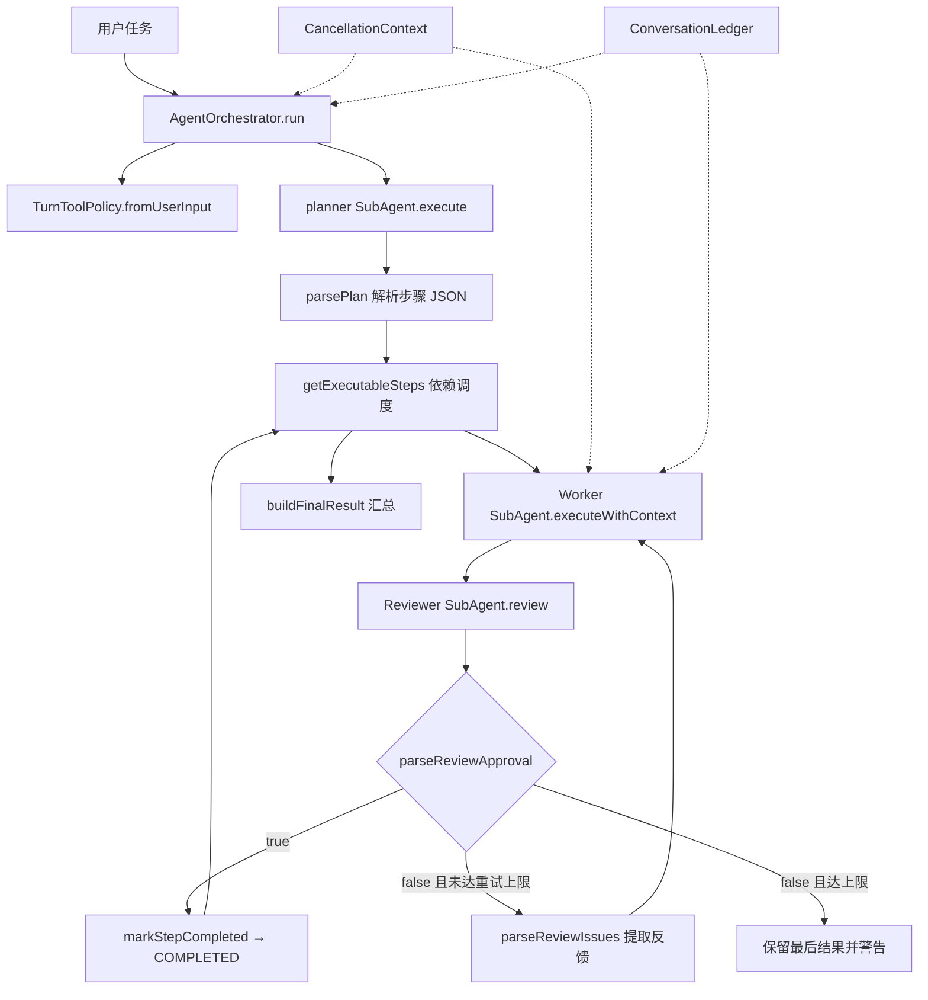
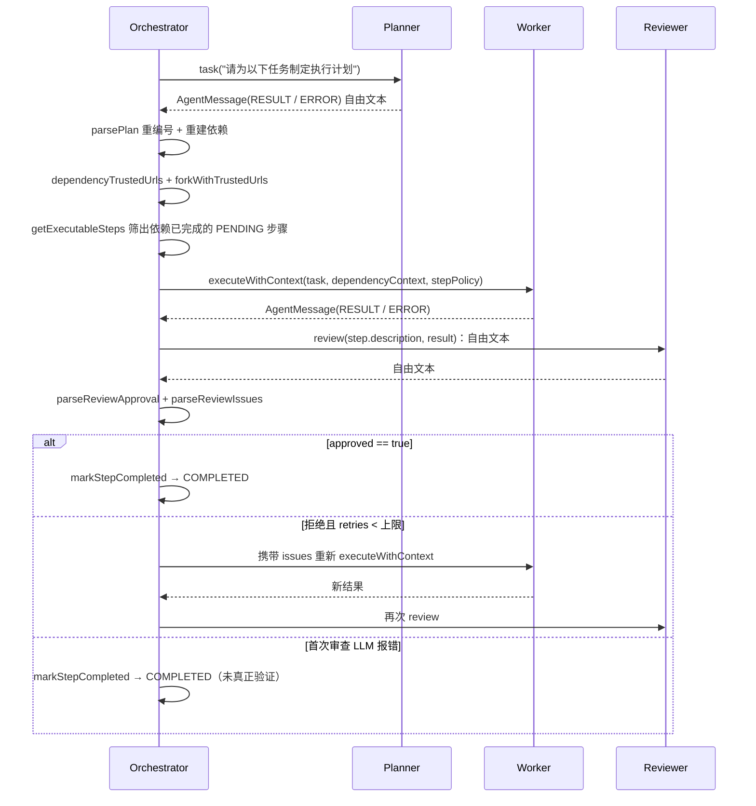

# Planner-Worker-Reviewer Multi-Agent 协作闭环

## 1. 功能定位

`AgentOrchestrator` 是 CodeAgent 团队模式（`/team`）的执行入口：它把一次用户请求交给 `planner` 拆解成带依赖的步骤列表，按「所有依赖已完成」的规则挑出可执行步骤，串行或并行地交给 `workers` 执行，再把每个步骤的执行结果交给 `reviewer` 独立审查；审查不通过时把问题反馈回同一 Worker 重新执行，单步骤最多自动重试 **2 次**。Orchestrator 自身不执行任何工具，只负责解析、调度、上下文裁剪、策略分支和结果汇总，真正的 LLM 推理与工具调用发生在 `SubAgent` 内部。

本文以当前源码为唯一事实来源；与旧版文档冲突处一律以代码行为为准，包括实现缺陷（见 §4、§6、§11）。

- 源码入口：`AgentOrchestrator.run(String)` — `src/main/java/com/codeagent/agent/AgentOrchestrator.java:151`；带提交态重载 `run(String, String)` — `AgentOrchestrator.java:156`
- 规划者：`planner` 字段 — `AgentOrchestrator.java:51`，构造 — `AgentOrchestrator.java:106`
- 执行者池：`workers` 字段 — `AgentOrchestrator.java:52`，构造 — `AgentOrchestrator.java:107-110`
- 检查者：`reviewer` 字段 — `AgentOrchestrator.java:53`，构造 — `AgentOrchestrator.java:111`
- 单步执行体：`runStep(...)` — `AgentOrchestrator.java:528`
- 角色化 Mini-Agent：`SubAgent` — `src/main/java/com/codeagent/agent/SubAgent.java:44`
- CLI 触发点：`/team` 解析 — `src/main/java/com/codeagent/cli/CliCommandParser.java:118-124`；分发 — `src/main/java/com/codeagent/cli/Main.java:912-920`；`createTeamAgent(...)` — `Main.java:1206-1212`

## 2. 设计意图

### 2.1 单 Agent 的职责冲突

单个 Agent 同时规划、执行和评价自己的结果时，容易产生自我确认偏差，输出「我已完成」的自我判断而缺少独立验收；执行轮次一多，最初的验收标准还会被工具输出淹没。

三类工作对上下文的需求恰好不同：**规划**需要全局目标和拆解能力，**执行**需要工具规则和具体步骤，**审查**需要验收标准和结果证据。把三类上下文塞进同一会话，只会让每一次模型调用都背负大量与当前判断无关的噪音。

### 2.2 角色拆分目标

项目采用 Planner、Worker、Reviewer 三角色（`AgentRole.java:6-9`）。目标不是模拟组织层级，而是**隔离推理职责**：每个角色拥有独立 Prompt 模式（`SubAgent.promptMode()` — `SubAgent.java:116-122`）和独立对话历史（`SubAgent.java:52`）。Orchestrator 负责决定消息流向下一个角色。

`promptMode()` 把角色映射到 `TEAM_PLANNER` / `TEAM_WORKER` / `TEAM_REVIEWER` 三种 `PromptMode`（`SubAgent.java:116-122`；模板枚举 `src/main/java/com/codeagent/prompt/PromptMode.java:7-9`），system prompt 由 `PromptAssembler` 在构造时组装（`SubAgent.java:107-114`）。

### 2.3 与 Plan-and-Execute 的区别

两者都能处理依赖步骤。Plan-and-Execute 的核心是结构化 DAG 调度（见 `02-dag-orchestration.md`）；Multi-Agent 的核心是**角色分工 + 结果审查**。在 Multi-Agent 中，每个 Worker 结果还要经过 Reviewer，审查不通过时反馈被送回 Worker 重新执行——这是 Plan-and-Execute 没有的环节。

### 2.4 一个必须提前说明的实现事实

`SubAgent` **不继承** `Agent`（`SubAgent.java:44` 类声明无 `extends`；`Agent` 独立声明于 `src/main/java/com/codeagent/agent/Agent.java:47`）。两者是**两套平行的 ReAct 实现**：主循环、流式渲染器、工具执行、历史清理等逻辑各自维护，`SubAgent` 只是「角色化 + 可注入依赖上下文」的另一份实现。这意味着 `Agent` 上的改进不会自动流到团队模式，反之亦然。

## 3. 总体架构与关键流程

### 3.1 总体架构



### 3.2 一次团队任务时序

注意 `SubAgent.review()` 返回的是**自由文本** `AgentMessage`（`SubAgent.java:406-410`），审批与问题由 Orchestrator 事后用两个独立方法解析，而不是 Reviewer 直接返回结构体。



### 3.3 核心对象与职责边界

#### AgentOrchestrator

`AgentOrchestrator` 是协作流程控制器，持有的运行状态（`AgentOrchestrator.java:50-58`）：

| 字段 | 类型 | 作用 |
|---|---|---|
| `llmClient` | `LlmClient` | 所有角色共享的模型通道（`:50`） |
| `planner` | `SubAgent` | 生成步骤计划的角色实例（`:51`） |
| `workers` | `List<SubAgent>` | 可被步骤独占领取的执行者池，数量即并行上限（`:52`） |
| `reviewer` | `SubAgent` | 串行路径复用的检查者实例（`:53`） |
| `memoryManager` | `MemoryManager` | 保存总任务对话与最终结果（`:54`） |
| `toolRegistry` | `ToolRegistry` | 所有角色共享的工具入口（`:55`） |
| `out` | `PrintStream` | 串行路径的输出目标（`:56`） |
| `conversationLedger` | `ConversationLedger` | 共享会话账本，默认 disabled（`:57`） |
| `externalContextSupplier` | `Supplier<String>` | MCP resource 等外部上下文（`:58`） |

构造器还会把上下文档位、当前模型与作用域记忆回写进共享 `ToolRegistry`（`AgentOrchestrator.java:102-105`）。Orchestrator 不直接执行工具，把执行全部委托给 `SubAgent`。

#### SubAgent

`SubAgent` 是**角色化的 Mini Agent Runtime**（`SubAgent.java:44`）。它持有的字段（`SubAgent.java:48-59`）：名称 `name`（`:48`）、`role`（`:49`）、`llmClient`（`:50`）、`toolRegistry`（`:51`）、独立 `conversationHistory`（`:52`）、`externalContextSupplier`（`:53`）、`skillRegistry`（`:54`）、`skillContextBuffer`（`:55`）、`AutoCompactionManager`（`:56`）、`conversationLedger`（`:57`）、`turnToolPolicy`（`:58`）、默认 `PromptAssembler`（`:59`）。

构造时用 `getSystemPrompt()` 生成首条 system 消息（`SubAgent.java:69`、`:107-114`）。**注意**：`SubAgent` 没有 `AgentBudget` 字段；预算对象每次执行时作为局部变量新建（`SubAgent.java:241`）。

#### AgentRole

角色枚举把业务名称映射到展示名与职责描述（`AgentRole.java:6-9`），是「角色化提示词」的最小载体；仅三项，无其它角色（`AgentRoleTest.shouldHaveThreeRoles` — `src/test/java/com/codeagent/agent/AgentRoleTest.java:10-13`）。

#### AgentMessage

`AgentMessage` 是 Agent 间通信对象，`record` 携带 `fromAgent` / `fromRole` / `content` / `type`（`AgentMessage.java:14-19`），并声明 6 种消息类型（`AgentMessage.java:20-27`）。工厂方法包括 `task`（`AgentMessage.java:32`）、`result`（`:39`）、`feedback`（`:46`）、`approval`（`:53`）、`rejection`（`:60`）、`error`（`:67`）。其中 `FEEDBACK` / `APPROVAL` / `REJECTION` 三个工厂方法在 `src/main` **没有任何调用点**（见 §4）。

#### ExecutionStep

Orchestrator 内部用 `ExecutionStep` record 表达步骤（`AgentOrchestrator.java:61-63`）：`id` / `description` / `type` / `dependencies` / `result` / `status`。record 不可变，状态更新通过 `withResult` / `withFailed` / `started` 创建新实例并由 `updateStep` 写回列表（`AgentOrchestrator.java:64-78`、`:435-442`）。状态机只有四个值：`PENDING` / `RUNNING` / `COMPLETED` / `FAILED`（`AgentOrchestrator.java:81-83`）。

### 3.4 AgentOrchestrator.run 完整调用链

#### 前置与规划阶段（`AgentOrchestrator.java:157-199`）

1. 由提交态输入构造本轮 `TurnToolPolicy` 并下发给 planner / workers / reviewer（`:158-164`）。
2. 用户输入写入共享账本 `conversationLedger`（`:165-169`）。
3. 取消检查，取消则返回取消提示（`:170-174`）。
4. 打印「第一阶段：规划」并构造 `AgentMessage.task("orchestrator", …)` 交给 `planner.execute(planMessage, out)`（`:177-182`）。
5. `planner.clearHistory()`（`:183`）——下一次团队任务不会继承上一份计划上下文。
6. 再次取消检查（`:184-186`）。
7. 三类失败早退：`ERROR` → 「规划阶段失败」（`:188-190`）、空内容 → 「规划失败」（`:191-193`）、`parsePlan` 返回空 → 「无法解析执行计划」（`:196-199`）。

#### 解析阶段（`AgentOrchestrator.java:262-322`）

`parsePlan()` 先剥离 Markdown JSON fence（`:264-266`），优先读 `steps` 数组，为空则兼容 `tasks`（`:269-274`），然后**两遍解析**：第一遍创建步骤并把模型 ID 重编号为 `step_N`，同时建立 `idMapping`（`:286-294`）；第二遍按映射重建依赖（`:297-315`）。返回空列表表示解析失败，`run` 直接终止（`:197-199`）。

#### 调度与执行阶段（`AgentOrchestrator.java:205-239`）

进入 `while (true)`：每轮先做取消检查，再 `getExecutableSteps()` 取可执行批次（`:211-218`）。

1. **单步批次**（`:221-232`）：`executable.get(0)`，按 `singleStepCursor % workers.size()` 轮转取一个 Worker（`:224-225`），构造依赖上下文与 `stepPolicy` 后调用 `runStep(...)`（`:226-231`），结束后 `worker.clearHistory()`（`:232`）。
2. **多步批次**（`:233-238`）：打印批次信息并交给 `runBatchParallel(...)`（`:235-237`）。

#### 收尾（`AgentOrchestrator.java:241-256`）

循环退出后，所有仍为 `PENDING` 的步骤被逐个打印「因前置步骤失败被跳过」（`:242-246`），由 `buildFinalResult(steps)` 生成汇总（`:249`），写入账本后返回（`:250-256`）。

### 3.5 闭环控制骨架

```text
解析 Planner 输出，建立步骤与依赖映射
while 未取消且仍有可执行步骤:
    取所有依赖已完成的 PENDING 步骤
    单步骤 -> 轮转取一个 Worker，串行执行并实时流式输出
    多步骤 -> 并行批次，每步独占一个 Worker 与独立 Reviewer
    对每个步骤：Worker 执行 -> Reviewer 审查
        approved  -> COMPLETED
        拒绝      -> 携带 issues 重试，直到通过或达到重试上限
        审查报错  -> 直接标记 COMPLETED（未验证）
    保存最新结果并更新步骤状态
把无法再推进的 PENDING 步骤报告为「因前置失败被跳过」
汇总所有步骤状态与结果预览
```

并行路径用 `try/finally` 归还 Worker 并释放浏览器租约（`AgentOrchestrator.java:490-496`、`:536-538`）；并行步骤各自创建独立 Reviewer，避免共享会话历史（`:475-477`）。

### 3.6 Worker 执行模型与依赖上下文

Worker 不是普通函数，而是带工具能力的 `SubAgent`。它通过 `shouldUseTools()` 拿到工具定义——**只有 WORKER 角色返回 true**（`SubAgent.java:456-458`），Planner 与 Reviewer 的工具列表为 `null`（`SubAgent.java:257-259`）。因此一个步骤可以搜代码、读文件、改实现、跑测试并根据错误继续修复，直到模型不再请求工具。

`buildStepContext()`（`AgentOrchestrator.java:642-671`）只挑选当前步骤**直接依赖且已完成**的步骤（`:648`），拼接步骤 ID、描述和结果预览；预览超过固定字符上限时截断并追加省略号（`:651-656`）。不相关步骤不会进入上下文——这是按图边裁剪，而不是复制全局历史。

`executeWithContext` 把依赖上下文拼在原任务之前（`SubAgent.java:388-397`），因此 Worker 看到的是「总任务上下文 + 依赖结果 + 当前任务」。

### 3.7 步骤级策略分支、URL provenance 与共享账本

这是旧版文档遗漏、但当前源码已存在的一层机制：

- **每步独立策略分支**：串行路径在 `run()` 内对每个步骤调用 `turnToolPolicy.forkWithTrustedUrls(dependencyUrls)`（`AgentOrchestrator.java:228`），并行路径在提交任务前同样 fork（`:470`）。`forkWithTrustedUrls` 只把已完成依赖分支的**typed URL provenance** 注入子分支，不解析依赖结果正文里的 URL（`src/main/java/com/codeagent/tool/TurnToolPolicy.java:219-235`）。
- **依赖 URL 汇总**：`dependencyTrustedUrls` 按步骤依赖取各依赖的 `TrustedUrlContext`（`AgentOrchestrator.java:673-680`）；`buildStepContext` 会把这些「经 web_search 验证的 URL」显式写进 Worker 上下文（`:661-668`）。
- **结果回写 provenance**：步骤完成时 `markStepCompleted` 除写入结果，还把当前分支的 `stepPolicy.trustedUrlContext()` 存入 `stepTrustedUrls`（`AgentOrchestrator.java:682-689`），供下游依赖消费。
- **浏览器租约释放**：`runStep` 用 `finally` 保证每个步骤结束后调用 `stepPolicy.releaseBrowserLease()`（`AgentOrchestrator.java:533-539`）；`SubAgent.execute` / `executeWithContext` 的无策略重载也各自在 finally 释放（`SubAgent.java:218-222`、`:381-385`）。
- **共享会话账本**：`conversationLedger` 默认 disabled（`AgentOrchestrator.java:57`），`setConversationLedger` 会分发到 planner、全部 workers 与 reviewer（`:139-146`）。CLI 创建团队 Agent 时接入 ReAct Agent 的账本（`Main.java:1210`）。`SubAgent` 在任务输入、LLM 响应、工具执行、system prompt 刷新、历史清空、图片裁剪、预算收尾等节点追加记录（`SubAgent.java:300-306`、`:418-423`、`:442-447` 等）。
- **Skill 共享 buffer**：`setSkillSystem` 把同一 `SkillRegistry` 与**同一个** `SkillContextBuffer` 下发给三个角色（`AgentOrchestrator.java:127-137`）；类注释明确说明「角色独立 buffer」未启用（`:122-126`）。

### 3.8 串行与并行

- **串行**：只有一个可执行步骤时直接执行，输出直连调用方的 `PrintStream`，保持实时打字观感。取 Worker 的方式是 `singleStepCursor % workers.size()` 轮转（`AgentOrchestrator.java:224-225`），**串行路径同样走 Worker 池**，只是每次只用一个。
- **并行**：`runBatchParallel()`（`AgentOrchestrator.java:450`）创建固定线程池，`parallelism = Math.min(batch.size(), workers.size())`（`:454`）；线程为 daemon 且命名 `codeagent-multi-agent`（`:455-459`）。Worker 通过 `LinkedBlockingQueue` 池化分配，`workerPool.take()` 保证一个 Worker 不会被两个步骤并发占用（`:460`、`:479`）。每个步骤创建自己的 `reviewer-{stepId}`（`:475-477`）和 `ByteArrayOutputStream` 缓冲（`:465-467`），避免多线程改写同一 `System.out`。
- **顺序稳定**：所有 Future `get()` 完成后 `executor.shutdownNow()`（`:501-511`），再按 batch 内 step 顺序 flush 各缓冲（`:513-520`），用户看到的执行过程因此保持稳定顺序。
- **异常兜底**：步骤任务捕获 `InterruptedException`（恢复中断位）与 `RuntimeException`，都通过 `updateStep` 置为 `FAILED` 并写入本步骤缓冲（`:482-489`）。

### 3.9 Planner 输出协议

推荐 JSON：

```json
{
  "steps": [
    { "id": "research", "description": "定位相关实现", "type": "ANALYSIS", "dependencies": [] },
    { "id": "modify",   "description": "根据定位结果修改代码", "type": "CODE",     "dependencies": ["research"] },
    { "id": "verify",   "description": "执行针对性测试", "type": "TEST",     "dependencies": ["modify"] }
  ]
}
```

模型 ID 可能是数字、中文、重复或带空格，系统统一重编号为 `step_1`、`step_2`…（`AgentOrchestrator.java:288`），依赖通过 `idMapping` 同步转换（`:304`），让日志、缓冲区和状态更新使用稳定标识。兼容 `tasks` 字段是为了复用 Plan-and-Execute 的 Prompt 或旧输出（`:271-274`）。`type` 有默认值字面量 `"COMMAND"`（`:292`），但**调度期从不读取**（见 §4）。

### 3.10 Reviewer 审查协议

Reviewer 不接收 Worker 的历史，只接收「原始任务 + 执行结果」的拼接文本（`SubAgent.java:407`），保证它从验收视角独立评价。`review()` 复用通用执行路径，因此同样受角色化 system prompt 与预算兜底约束（`SubAgent.java:406-410`）。

推荐输出：

```json
{ "approved": false, "issues": ["没有执行测试", "未说明修改文件"] }
```

`parseReviewApproval()`（`AgentOrchestrator.java:345-378`）遵循 fail-closed：空内容拒（`:346-349`）、JSON 缺 `approved` 拒（`:356-359`）、无法解析 JSON 时**必须同时不含否定关键词且含肯定关键词**才放行，否则拒绝（`:361-377`）。

`parseReviewIssues()`（`AgentOrchestrator.java:383-419`）逐级回退取反馈：`issues` 数组（`:393-400`）→ `suggestions` 数组（`:402-409`）→ `summary` 字符串（`:411-415`）→ 全部失败时返回一条硬编码中文文案（`:418`）。

### 3.11 重试闭环

`retryCount` 是 `ConcurrentHashMap<String, Integer>`，key 为步骤 ID（`AgentOrchestrator.java:206`），因此并行批次中的步骤各算各的。

拒绝后构造反馈上下文：原依赖上下文 + 「之前的执行结果被审查拒绝，原因：」 + issues（`AgentOrchestrator.java:602`），复用同一个 `taskMsg` 与同一个 `stepPolicy` 再次 `executeWithContext`（`:603-604`）。`MAX_RETRIES_PER_STEP` 限制的是首次执行**之后**的额外尝试（`AgentOrchestrator.java:48`、`:596`），因此单步最多自动重试 **2 次**。

## 4. 设计意图 vs 实际实现

以下逐条列出设计意图与代码实际行为的差异。行号为当前源码位置。

| 主题 | 设计意图 | 实际实现 | 源码位置 |
|---|---|---|---|
| 审查反馈不可解析时 | 声称「保留原始 Reviewer 内容作为反馈」，让 Worker 至少看到审查文本 | **原始内容从不被使用**。`parseReviewIssues()` 按 `issues` → `suggestions` → `summary` 逐级回退，全部失败时返回一条**硬编码**文案「审查未通过，请改进执行结果」 | `AgentOrchestrator.java:393-415`、`AgentOrchestrator.java:418` |
| 取消检查点 | 声称「规划、执行和重试之间都会检查取消」 | 重试的 `while` 循环内部**没有任何取消检查**；`runStep` 只在首次 `executeWithContext` **之前**和**之后**各检查一次。重试期间用户取消不会中断本步骤 | `AgentOrchestrator.java:547`、`:555` vs `AgentOrchestrator.java:596-632` |
| Reviewer 重试期间失败 | 声称「保留结果但**不**宣称已验证」 | 代码直接把 `approved = true` 并清空 issues 后 `break`，随后打印「✅ 步骤[…] 重试后审查通过」——**主动宣称验证通过**，与意图相反 | `AgentOrchestrator.java:623-627`、`AgentOrchestrator.java:635-636` |
| 「有结果但未验证」终态 | 描述为一个独立的最终状态 | **该状态不存在**。首次 Reviewer 调用报错时走 `markStepCompleted(result.content())` → `COMPLETED`（`:576-580`），于是 `buildFinalResult` 的 `allCompleted` 可以为 true 并输出「协作任务完成」 | `AgentOrchestrator.java:576-580`、`AgentOrchestrator.java:711-715` |
| 时序图 `review()` 返回值 | 画成 Reviewer 返回结构化 `{approved, issues}` | `SubAgent.review()` 返回**自由文本** `AgentMessage`；`approved` 与 `issues` 由 Orchestrator 事后用 `parseReviewApproval` 和 `parseReviewIssues` **两个独立方法**分别解析，二者结论甚至可能不一致 | `SubAgent.java:406-410`、`AgentOrchestrator.java:583`、`AgentOrchestrator.java:593` |
| `ExecutionStep.type` | 容易理解为按类型分派不同执行策略 | `parsePlan` 把 `type` 默认值取为字面量 `"COMMAND"`（`:292`），而**调度期从不读取 `type`**——`getExecutableSteps` 只看 `status` 与 `dependencies` | `AgentOrchestrator.java:292`、`AgentOrchestrator.java:327-338` |
| 步骤 ID 与依赖引用 | 以为有解析期校验 | 缺失/空 `"id"` 时 `asText()` 返回空串，`idMapping.put("", newId)` 在**空串键上互相覆盖**（`:287-289`）；未知依赖经 `getOrDefault(dep, dep.asText())` **回退为原始字符串**（`:304`），`statusMap.get(dep)` 永远为 null，该步骤**永久 PENDING**（`:336`） | `AgentOrchestrator.java:287-289`、`:304`、`:336` |
| 串行路径的 Worker | 以为串行不用池 | 用 `singleStepCursor % workers.size()` 轮转取 Worker，**串行也走池**，只是每次占一个 | `AgentOrchestrator.java:224-225` |
| 重试全部返回 ERROR | 以为会回退到原始结果重试 | `acceptedResult` 只在重试**返回非空内容**时更新（`:619`）；重试全部 ERROR 时 `acceptedResult` 保留进入循环前的值（可能是首次执行的原结果），最终照样 `withResult` 落库 | `AgentOrchestrator.java:605-610`、`:619`、`:634` |
| `SubAgent` 的预算与工具边界 | 旧文称 `SubAgent` 持有 `AgentBudget` 字段 | **不是字段**：每次执行在 `SubAgent.java:241` 新建局部变量，`:245-248` 检查退出原因，`:321-360` 收尾，且收尾请求传**空工具列表**（`:337-340`）。工具仅 WORKER 可见（`:456-458`）、LSP 诊断注入（`:460-470`）、历史图片裁剪（`:428-451`）、按压缩阈值压缩历史（`:124-148`） | `SubAgent.java:241`、`:245-248`、`:321-360`、`:456-458` |
| Agent 与 SubAgent 的关系 | 旧文称「与 `Agent` 主循环结构对称」，易被理解为继承或复用 | **无继承，两套平行实现**：`SubAgent` 类声明无 `extends`，主循环、流式渲染器、工具执行各自复制一份 | `SubAgent.java:44` vs `Agent.java:47` |
| 并行批次线程模型 | 旧文未完整说明 | daemon 线程、`parallelism = min(batch, workers)`、Worker 从阻塞队列 take、结束后 `shutdownNow`，再按序 flush 缓冲 | `AgentOrchestrator.java:454-459`、`:479`、`:511-520` |
| 汇总结果里的预览 | 以为返回完整结果 | `buildFinalResult` 对预览做**固定字符上限截断**并追加省略号；完整输出已在执行阶段流式打印过 | `AgentOrchestrator.java:734-739` |
| AgentMessage 消息类型 | 文档称典型类型含「任务、结果、反馈、错误」 | `FEEDBACK` / `APPROVAL` / `REJECTION` 三个工厂方法**已定义但在 `src/main` 无任何调用点**（仅在 `AgentMessageTest` 单测中被调用）；运行时实际只发 `TASK`、`RESULT`、`ERROR`，审查结论走自由文本解析而非消息类型 | `AgentMessage.java:20-27`、`:46-62` vs `AgentOrchestrator.java:180`、`:553`、`SubAgent.java:310`、`:315` |
| 步骤级策略与 URL provenance | 旧文完全未提 | 每步 fork `TurnToolPolicy`，依赖 web_search 的 typed URL 会沿依赖边传递给下游 Worker 的工具 schema，并在步骤结束时释放浏览器租约 | `AgentOrchestrator.java:228`、`:470`、`:661-668`、`:682-689`、`TurnToolPolicy.java:223-235` |

## 5. 设计取舍

| 备选方案 | 为什么没选 | 代价 |
|---|---|---|
| Reviewer 用确定性规则（测试、编译、静态检查）替代 LLM | 规则无法理解开放式任务质量，也不产生自然语言改进建议 | 当前 Reviewer 是概率模型，输出不确定、需要解析非严格文本、增加模型调用成本。可靠场景应把测试/编译证据一并喂给 Reviewer |
| 每个 SubAgent 各持一套 `ToolRegistry` | MCP Server 工具注册难以同步，HITL 状态可能不一致，审计分散 | 共享 Registry 保证能力与安全策略一致（`AgentOrchestrator.java:101-105`），但工具实现必须考虑并发安全 |
| 把完整团队历史复制给每个 Agent | Token 成本随步骤数快速放大 | 只传直接依赖的结果预览（`AgentOrchestrator.java:648-656`）省 Token，但要求 Planner 必须正确描述依赖，且长结果细节会丢失 |
| 达到重试上限后标记 `FAILED` | 完全丢弃会浪费已完成的部分工作 | 当前保留最后结果并打印警告（`AgentOrchestrator.java:638`），适合人工复核；高风险自动化仍应改成 FAILED |
| 串行路径不走池、直接持有固定 Worker | 轮转取池实现更简单，且复用同一条 `runStep` 路径 | 串行也承担池的取用开销，且轮转会让「哪个 Worker 处理了哪一步」不可预测（`AgentOrchestrator.java:224-225`） |
| Reviewer 报错时标记步骤为「未验证」 | 需要一个额外的步骤状态或标记位 | 当前复用 `markStepCompleted → COMPLETED`，可用性优先但丢失了「已验证 / 未验证」的区别，汇总里也无法区分（`AgentOrchestrator.java:576-580`、`:711-715`） |
| `Agent` 与 `SubAgent` 共用一套循环实现（抽取基类） | 避免大范围重构 `Agent` 的既有行为 | 两套实现逻辑重复，`SubAgent` 的流式渲染/工具执行/清历史改动需人工同步（`SubAgent.java:44` vs `Agent.java:47`） |
| 三个角色共享同一 SkillContextBuffer | 角色级 buffer 隔离需要额外生命周期管理 | 简化实现；预算/技能正文注入的顺序可能被角色间共享（`AgentOrchestrator.java:122-137`） |

## 6. 失败与边界矩阵

| 场景 | 检测点 | 当前处理 | 最终状态 |
|---|---|---|---|
| 用户在规划前取消 | `CancellationContext.isCancelled()`（`:170`） | 写 `run_cancelled` 事件并返回取消提示 | 任务取消 |
| 用户在规划后取消 | 检查点 `:184` | 直接返回取消提示 | 任务取消 |
| 用户在批次间取消 | 检查点 `:212` | 退出调度循环 | 任务取消 |
| 用户在单步执行前/后取消 | 检查点 `:547`、`:555` | `withFailed("用户取消")` | FAILED |
| Planner LLM 错误 | `AgentMessage.Type.ERROR`（`:188`） | 立即返回 | 规划失败 |
| Planner 空响应 | `isBlank()` 校验（`:191`） | 立即返回 | 规划失败 |
| 计划 JSON 非法 / 无 steps 数组 | `parsePlan` 返回空列表（`:276-279`、`:318-321`） | 立即返回 | 规划失败 |
| 步骤 id 缺失/重复为空 | `idMapping.put("")` 覆盖（`:289`） | 无显式校验 | 映射错误、依赖可能错接 |
| 依赖引用未知 ID | `getOrDefault` 回退原始串（`:304`） | 无显式校验 | 该步骤永久 PENDING、被报告为跳过 |
| Worker LLM 报错 | `Type.ERROR`（`:561`） | `withFailed(content)` | FAILED |
| Worker 返回空结果 | `isBlank()` 校验（`:566`） | `withFailed("执行结果为空")` | FAILED |
| Reviewer 返回空 / 非法 JSON | `parseReviewApproval` fail-closed（`:346-377`） | 视为拒绝 | 进入重试 |
| Reviewer JSON 缺 `approved` | `isMissingNode` / `isNull`（`:356`） | 视为拒绝 | 进入重试 |
| **首次 Reviewer 调用失败** | `Type.ERROR`（`:576-580`） | `markStepCompleted(result.content())`，**未真正验证** | **COMPLETED** |
| **重试期间 Reviewer 调用失败** | `Type.ERROR`（`:623-627`） | `approved = true` 并打印「重试后审查通过」（`:635-636`） | COMPLETED（宣称通过） |
| 重试期间 Worker 报错 | `:605-610` | `issues` 覆盖为错误信息，`approved=false`，`continue` | 继续重试或到上限 |
| 重试期间 Worker 空结果 | `:611-617` | `acceptedResult = "执行结果为空"`，`continue` | 继续重试或到上限 |
| 两次重试后仍拒绝 | 重试上限（`:596`） | 保留最后结果并打印警告（`:638`） | COMPLETED（有风险结果） |
| 依赖步骤失败 | `getExecutableSteps` 过滤（`:334-336`） | 后续步骤不执行 | PENDING → 报告跳过 |
| 并行 Worker 等待被中断 | `InterruptedException`（`:482-485`） | 恢复中断位，`withFailed` | 单步 FAILED |
| 并行任务运行时异常 | `RuntimeException`（`:486-489`） | 记录日志，`withFailed` | 单步 FAILED |
| 预算/轮数安全阀命中 | `AgentBudget.check()`（`SubAgent.java:245-248`） | 禁用工具、执行一次最佳努力收尾，返回「部分完成」 | SubAgent 返回 RESULT（部分完成） |

## 7. 测试策略与证据

### 7.1 计划解析（`src/test/java/com/codeagent/agent/AgentOrchestratorTest.java`）

- 标准 `steps` 数组 → 步骤与描述（`shouldParseSimplePlan:52-72`）。
- 多步骤依赖重编号为 `step_N` 且依赖同步映射（`shouldParseMultiStepPlanWithDependencies:75-115`）。
- Markdown fence 剥离（`shouldParsePlanWithMarkdownCodeBlock:118-138`）。
- 兼容 `tasks` 字段（`shouldParsePlanWithTasksField:141-161`）。
- 空串、非 JSON、缺 `steps` 均返回空列表（`shouldReturnEmptyListForInvalidJson:164-171`）。

### 7.2 调度与审查解析（`AgentOrchestratorTest.java`）

- 依赖未完成时只返回前置步骤，完成后才返回后续步骤（`shouldGetExecutableSteps:174-193`）。
- 两个无依赖步骤同时可执行（`shouldGetMultipleExecutableStepsForParallelTasks:196-207`）。
- 审批解析：`true` / `false` / 空 / 否定关键词 / 肯定关键词 / 缺字段（`shouldParseReviewApproval:210-237`）。
- `issues` 数组解析、`summary` 回退、非法 JSON 回退到硬编码文案（`shouldParseReviewIssues:240-255`、`shouldFallbackToSummaryForIssues:258-264`、`shouldHandleInvalidReviewJson:267-271`）。

### 7.3 协作流程（`AgentOrchestratorTest.java`）

- 拒绝两次后第三次通过，最终结果只含最后结果（`shouldRetryRejectedStepUntilApproval:274-313`）。
- 两个独立步骤并发峰值达到预期，且最终结果同时包含两步（`shouldRunIndependentStepsInParallel:316-363`，用阻塞式假 Worker + 并发计数器断言并发峰值）。
- 前置失败导致后续步骤保持 PENDING，最终汇总区分失败与未执行（`shouldReportIncompleteRunWhenFailureBlocksRemainingSteps:383-418`）。
- 依赖步骤继承前置 web_search 的 typed URL provenance，下游 Worker 首轮 schema 出现 `web_fetch`（`dependentTeamStepInheritsTypedSearchUrlProvenance:421-454`）。
- planner / workers / reviewer 共享同一 `ConversationLedger` 实例（`shouldShareOneLedgerAcrossPlannerWorkersAndReviewer:33-49`）。

### 7.4 SubAgent 行为（`src/test/java/com/codeagent/agent/SubAgentTest.java`）

- `shouldUseTools` 只对 WORKER 为真（`shouldOnlyEnableToolsForWorker:23-30`）。
- 迟到的 reasoning 进入「补充思考」且排在正文之后（`shouldRouteLateReasoningToSupplementalSection:33-58`）。
- tool-call 迭代后重新打印「执行思考」「执行输出」标题（`shouldPrintFreshHeadingsAcrossToolIterations:61-118`）。
- 纯空白 reasoning 不产生空的思考标题（`shouldNotEmitEmptyReasoningHeadingForWhitespaceDeltas:121-140`）。
- 显式硬轮数预算命中后返回「部分完成」，且收尾请求的工具列表为空（`explicitIterationLimitReturnsPartialResultWithToolsDisabled:143-175`）。

### 7.5 角色与消息（`AgentRoleTest.java` / `AgentMessageTest.java`）

- 三个角色、展示名与描述非空（`AgentRoleTest.java:10-28`）。
- 六种消息类型与各工厂方法（`AgentMessageTest.java:10-74`）——注意这里只验证工厂方法本身，不验证团队流程会使用 `FEEDBACK` / `APPROVAL` / `REJECTION`。

### 7.6 当前测试未覆盖的点

- 重试期间取消无效（无对应测试）。
- 重试期间 Reviewer 报错被计为「通过」（无对应测试）。
- 步骤 `id` 缺失或依赖引用未知 ID 的解析行为（无对应测试）。
- `buildFinalResult` 将「首次审查失败」计为 allCompleted（无对应测试）。
- 浏览器租约在串行/并行路径是否真的成对释放（无直接测试）。

## 8. 面试讲解模板

### 8.1 30 秒版本

我实现了 Planner-Worker-Reviewer 多 Agent 协作模式。Planner 先生成带依赖的步骤，Orchestrator 按「依赖已全部完成」筛出可执行步骤，把依赖结果裁剪后传给 Worker；Worker 完成后由独立 Reviewer 审查，审查不通过就把问题反馈回 Worker，单步骤最多自动重试 2 次。无依赖步骤可以并行，每步独占一个 Worker 和独立 Reviewer，避免历史竞争和日志交错。Orchestrator 自己不做工具调用，也不做模型推理，只做解析、调度、策略分支和汇总。

### 8.2 2 分钟版本

这个设计的核心不是创建多个模型实例，而是**隔离角色责任和上下文**。三个角色共享同一个 `LlmClient` 和 `ToolRegistry`，区别只来自 Prompt 模式和独立对话历史。Orchestrator 把模型生成的 JSON 重编号成稳定 step ID，再按依赖状态分批调度。

并行时 Worker 从阻塞队列独占领取，每个步骤创建独立 Reviewer，因为 `SubAgent` 内部有可变对话历史，共享实例会让多个线程写入同一消息序列。并行输出写入步骤本地缓冲区，全部完成后按 step 顺序 flush，保证用户看到的日志连续稳定。每个步骤还会 fork 一份工具策略分支，只把依赖分支里 web_search 产生的 typed URL 传给下游，并在结束时释放浏览器租约。

审查侧遵循 fail-closed：JSON 缺 `approved` 或无法解析且没有明确肯定关键词，一律判为拒绝。拒绝原因会被提取并追加到 Worker 的下一次上下文，每步最多自动重试 2 次；依赖失败的步骤保持 PENDING 并被报告为跳过。

我也要诚实说明几处降级：首次 Reviewer 调用报错时，步骤会被标记为 COMPLETED，实际并未验证；重试期间 Reviewer 报错甚至会被当成通过。重试循环内也缺少取消检查。另外 `SubAgent` 和主 `Agent` 是两份平行实现，没有继承关系，这些都属于可用性优先的取舍，不是真正的验证保证。

## 9. 高频面试问答

### Q1：Multi-Agent 比单 Agent 多了什么？

核心是职责和上下文隔离。规划、执行、审查分别使用不同 Prompt 模式和独立历史，由 Orchestrator 显式传递信息（`SubAgent.java:116-122`、`AgentOrchestrator.java:51-53`）。

### Q2：为什么 Reviewer 能减少问题？

Reviewer 只接收「原始任务 + 执行结果」，不继承 Worker 的自我解释（`SubAgent.java:407`）。但它仍是概率模型，不能替代确定性测试。

### Q3：如何避免 Agent 之间上下文污染？

每个 `SubAgent` 维护独立 `conversationHistory`（`SubAgent.java:52`）；Planner 执行后立即清空历史（`AgentOrchestrator.java:183`），Worker 在步骤结束后清空（`:232`；并行路径在 finally `:492`），只传递明确的依赖结果和审查反馈。

### Q4：为什么并行步骤要创建独立 Reviewer？

Reviewer 有可变历史。共享同一个实例会让多个线程写入同一消息序列，导致 Tool Call 或审查上下文交叉。所以并行路径为每个步骤创建 `reviewer-{stepId}`（`AgentOrchestrator.java:475-477`）。

### Q5：Worker 为什么可以复用？

Worker 从 `LinkedBlockingQueue` 独占领取（`AgentOrchestrator.java:460`、`:479`），在 `finally` 中清空历史后归还（`:490-494`）。任意时刻一个 Worker 只服务一个步骤。

### Q6：Reviewer 输出不规范怎么办？

先按 fail-closed 判断是否通过：空内容、缺 `approved`、非 JSON 且无肯定关键词一律拒绝（`AgentOrchestrator.java:345-378`）。问题列表则逐级回退取 `issues` → `suggestions` → `summary`（`:393-415`）。需要补一句诚实说明：**如果三者都没有，返回的是一条硬编码文案，而不是 Reviewer 的原始输出**（`AgentOrchestrator.java:418`）。

### Q7：为什么最多重试 2 次？

限制成本和循环风险。`MAX_RETRIES_PER_STEP` 限制的是首次执行之后的额外尝试（`AgentOrchestrator.java:48`、`:596`）。

### Q8：重试时传什么信息？

保留原依赖上下文，追加「之前的执行结果被审查拒绝，原因：」和提取出的 issues（`AgentOrchestrator.java:602`）。这样 Worker 知道要修正什么，而不是盲目重复。

### Q9：依赖结果如何传递？

只传当前步骤直接依赖且已完成的结果预览（`AgentOrchestrator.java:648-656`），通过图边控制上下文范围；此外还会额外传递依赖分支经 web_search 验证的 URL（`:661-668`）。

### Q10：如何处理 Planner 生成错误依赖？

依赖无法满足时步骤保持 PENDING 并被报告为跳过（`AgentOrchestrator.java:242-246`）。当前**没有**解析期的未知 ID 校验——未知依赖回退为原始字符串，`statusMap.get` 返回 null，步骤永远不会变成可执行（`:304`、`:336`）。这是可以改进的点。

### Q11：多 Agent 是否意味着多模型？

不一定。当前三个角色共享同一个 `LlmClient`（`AgentOrchestrator.java:50`、`:106-111`），区别主要来自 Prompt、历史和职责。

### Q12：工具是否也隔离？

工具 Registry 共享，保证能力和安全策略一致（`AgentOrchestrator.java:101-105`）。对话历史隔离，工具副作用作用于同一个 workspace。

### Q13：并行写文件会冲突吗？

可能。当前依赖 Planner 避免冲突；更强方案是声明资源写集并增加文件级锁。

### Q14：Reviewer 服务失败为什么仍保留结果？

严格说，代码不止「保留结果」：首次 Reviewer 报错时用 `markStepCompleted` 把步骤标成 COMPLETED（`AgentOrchestrator.java:576-580`）；**重试期间报错时更是直接把 `approved` 置为 true**（`:623-627`），并打印「重试后审查通过」。这是纯可用性降级，不能等同于审查验证通过，面试中应当主动指出这一偏差。

### Q15：如何让 Reviewer 更可靠？

向它提供编译、测试、静态分析等机器证据；要求结构化 Schema；对高风险结论使用确定性门禁。

### Q16：为什么不让 Reviewer 直接修改代码？

Reviewer 只负责评价，保持职责单一。修改建议通过 issues 回到 Worker，责任链清晰。实现上 Reviewer 的工具列表确实为 `null`（`SubAgent.java:257-259`、`:456-458`）。

### Q17：如何控制 Token 成本？

只传依赖结果预览、清理角色历史、限制重试次数，并复用历史压缩机制（`SubAgent.java:124-148`、`AgentOrchestrator.java:651-656`）。

### Q18：如何验证真正并行？

用阻塞式假 Worker 和并发计数器测试，断言两个任务同时进入执行区，并验证输出顺序仍稳定。项目中的 `shouldRunIndependentStepsInParallel` 正是这样做的（`AgentOrchestratorTest.java:316-363`）。

### Q19：当前实现与分布式 Agent 平台有何差异？

当前是单进程线程池协作，没有远程 Worker、消息队列、租约、心跳和分布式恢复。

### Q20：`SubAgent` 和主 `Agent` 是什么关系？

**没有继承关系**，是两份平行实现（`SubAgent.java:44` vs `Agent.java:47`）。主循环、流式渲染器、工具执行、清历史等逻辑各自维护，改进需要人工同步。面试中可作为「未来可抽取公共 ReAct 内核」的演进点。

### Q21：下一步如何演进？

增加共享黑板、结构化 Artifact、资源锁、动态角色选择、Reviewer 证据门禁、持久化步骤和分布式任务队列；工程上优先修复审查失败被误判为通过、补上重试路径的取消检查，并把 `Agent` / `SubAgent` 的公共循环抽出来。

## 10. 简历条陈与源码证据

简历原句：「Multi-Agent协作闭环：实现 Planner-Worker-Reviewer 多 Agent 协作架构，支持角色化提示词、步骤级上下文传递、Reviewer 结果解析、失败反馈和最多 2 次自动重试，形成"规划—执行—审查—重试"的闭环。」

| 简历原句 | 代码证据 |
|---|---|
| Planner-Worker-Reviewer 多 Agent 协作架构 | 三角色字段与 `SubAgent` 构造 — `AgentOrchestrator.java:51-53`、`AgentOrchestrator.java:106-111`；角色枚举 — `AgentRole.java:6-9` |
| 角色化提示词 | `SubAgent.promptMode()` 映射三种 `PromptMode` — `SubAgent.java:116-122`；system prompt 组装 — `SubAgent.java:107-114` |
| 步骤级上下文传递 | `buildStepContext()` 只取直接依赖的已完成步骤与结果预览 — `AgentOrchestrator.java:642-671`；注入点在 `executeWithContext` — `SubAgent.java:388-397` |
| Reviewer 结果解析 | `parseReviewApproval()` — `AgentOrchestrator.java:345-378`；`parseReviewIssues()` — `AgentOrchestrator.java:383-419` |
| 失败反馈 | 反馈上下文拼接原依赖 + issues — `AgentOrchestrator.java:602` |
| 最多 2 次自动重试 | `MAX_RETRIES_PER_STEP`（值 2）与重试 `while` — `AgentOrchestrator.java:48`、`AgentOrchestrator.java:596` |
| 规划—执行—审查—重试闭环 | `run()` 的规划 → 调度 → `runStep`（Worker → Reviewer → retry）→ 汇总 — `AgentOrchestrator.java:151`、`AgentOrchestrator.java:528`、`:634-639` |
| 按依赖调度 | `getExecutableSteps()` 过滤 PENDING + 依赖全 COMPLETED — `AgentOrchestrator.java:327-338` |
| 并行执行 | `runBatchParallel()` Worker 池 + 独立 Reviewer + 稳定 flush — `AgentOrchestrator.java:450-521` |
| 子 Agent 运行时 | `SubAgent.executeWithPolicy()` 的 ReAct 循环、工具执行、预算兜底 — `SubAgent.java:226-318`、`:321-360` |
| 步骤级工具策略 / URL provenance | 每步 `forkWithTrustedUrls` + 依赖 URL 注入 + 租约释放 — `AgentOrchestrator.java:228`、`:661-668`、`:682-689`、`TurnToolPolicy.java:223-235` |

## 11. 当前实现边界

- 所有角色运行在同一 JVM 进程，没有远程 Worker、消息队列或租约心跳。
- 三个角色默认共享同一模型 Provider，共享同一 `ToolRegistry` 与同一个 `SkillContextBuffer`（`AgentOrchestrator.java:122-137`，类注释明确说明角色级 buffer 隔离未启用）。
- 步骤状态与审查状态没有持久化恢复，进程退出即丢失（共享的 `ConversationLedger` 只做追加审计，不负责恢复调度状态）。
- **首次 Reviewer 调用失败会被记为 COMPLETED**，汇总可能报告「协作任务完成」，而该步骤实际未经验证（`AgentOrchestrator.java:576-580`、`:711-715`）。
- **重试期间 Reviewer 调用失败会被直接当作通过**，并打印「重试后审查通过」（`AgentOrchestrator.java:623-627`、`:635-636`）。
- 重试的 `while` 循环内没有取消检查，重试期间的用户取消不会中断该步骤（`AgentOrchestrator.java:596-632`；仅 `:547`、`:555` 两处检查）。
- `parseReviewIssues()` 在结构解析全部失败时返回硬编码文案，Reviewer 的原始自由文本不会进入 Worker 反馈（`AgentOrchestrator.java:418`）。
- `ExecutionStep.type` 有默认值但调度期从不读取，本质上是一个未被消费的字段（`AgentOrchestrator.java:292`、`:327-338`）。
- 步骤 `id` 缺失会在映射表空串键上互相覆盖；未知依赖回退为原始字符串导致步骤永久 PENDING，均无解析期校验（`AgentOrchestrator.java:289`、`:304`、`:336`）。
- 依赖上下文只保存结果预览（有固定字符上限），长结果细节会丢失（`AgentOrchestrator.java:651-656`）。
- `SubAgent` 与 `Agent` 是两套平行实现，没有继承或抽取公共 ReAct 内核（`SubAgent.java:44` vs `Agent.java:47`），改动需要人工同步。
- `AgentMessage` 的 `FEEDBACK` / `APPROVAL` / `REJECTION` 三个工厂方法在 `src/main` 无调用点，审计结论实际走自由文本解析（`AgentMessage.java:46-62`）。
- 并行步骤共享同一 workspace，没有资源冲突检测。
- 达到重试上限后保留结果并标记 COMPLETED，不适用于必须严格拒绝的高风险自动化场景。
- Reviewer 是概率模型，不是形式化验证器。
