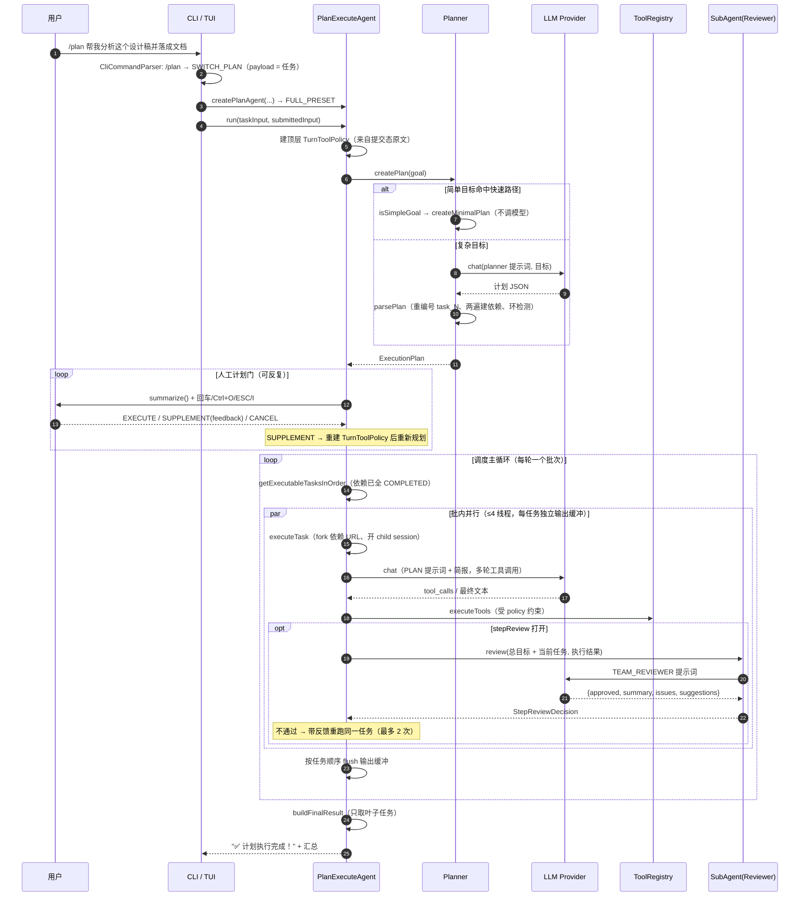
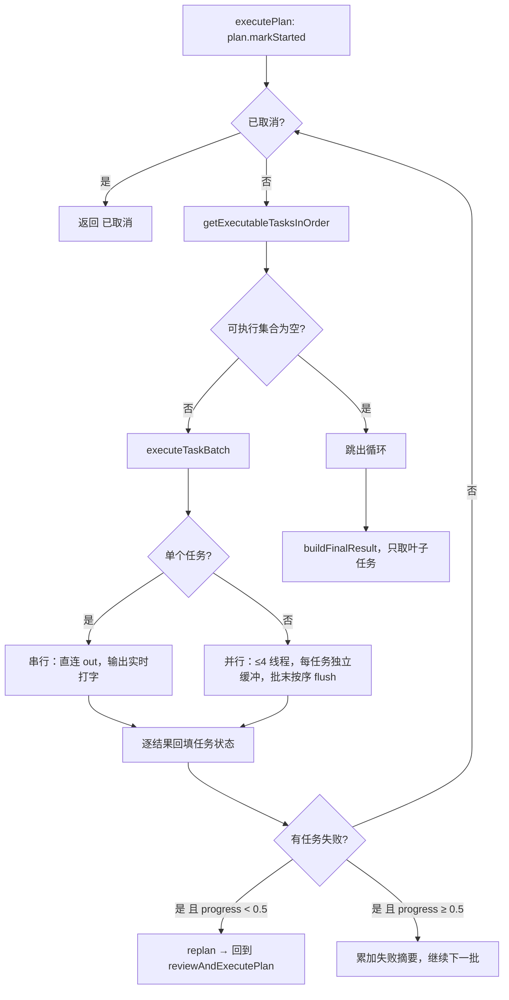
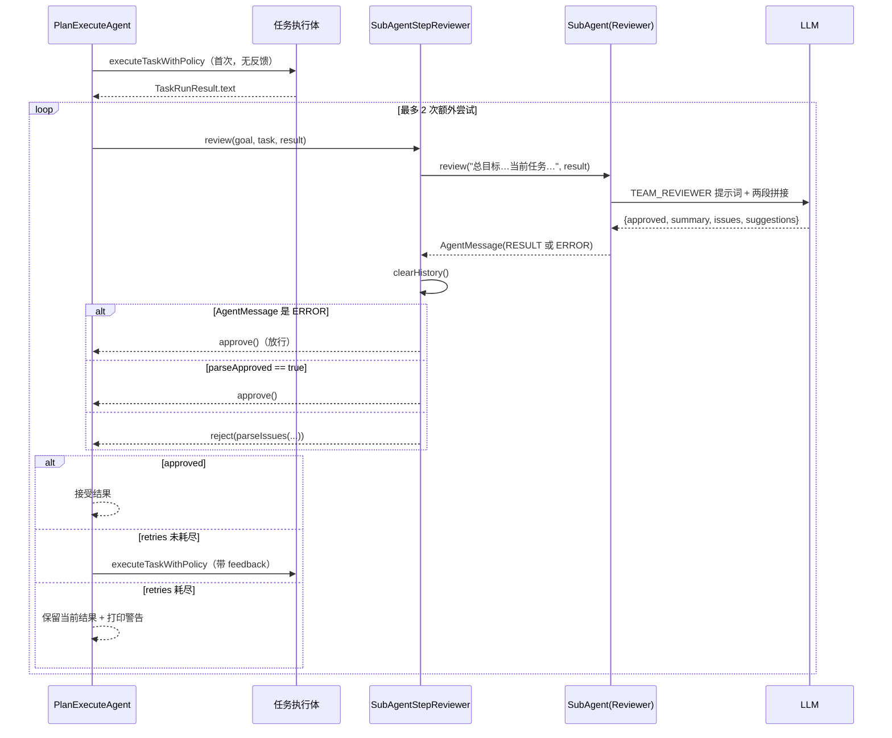
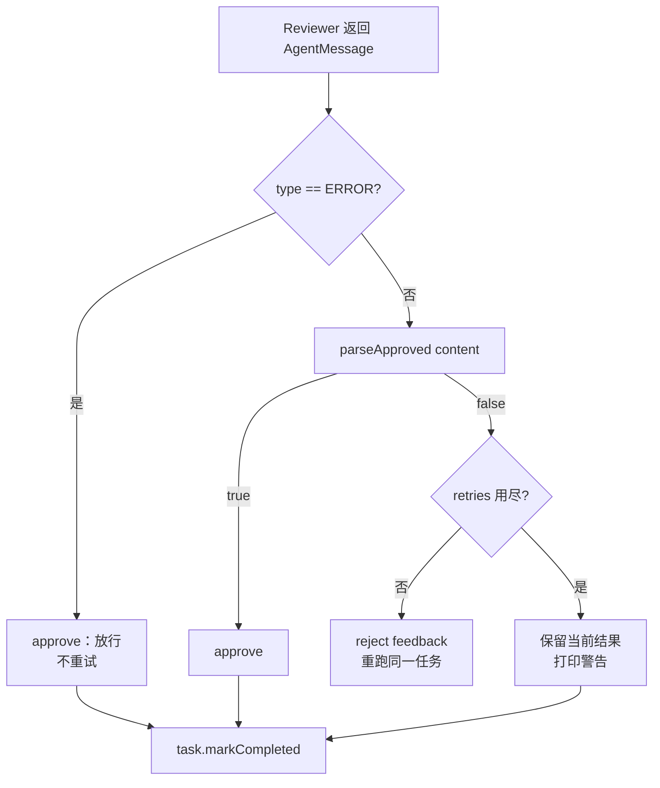
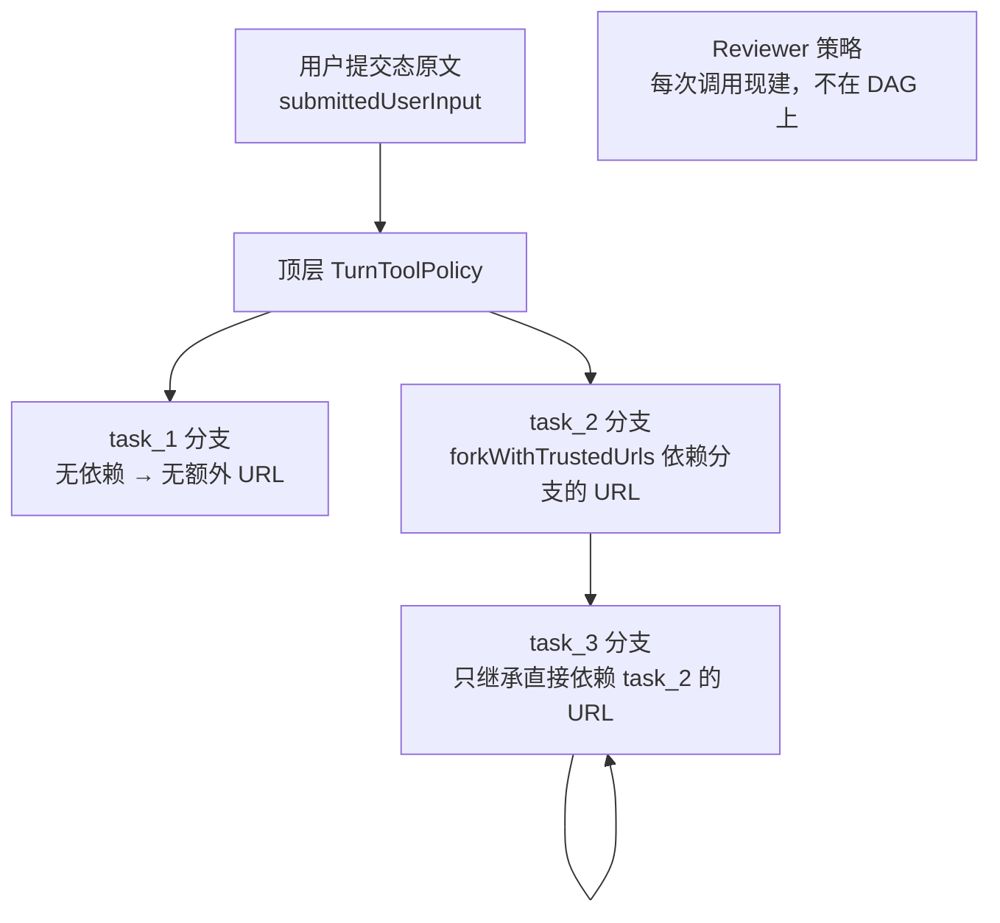

# 多 Agent 协作的 Plan-and-Execute 闭环

> **⚠️ 合并说明（2026-09-17）**
>
> 本文原为「Planner-Worker-Reviewer 三角色协作（`/team`）」的实现说明，现已**全文重写**为合并后的统一实现。
>
> 原 `/team` 的独立实现（`AgentOrchestrator` + `ExecutionStep` + `StepStatus`）与其 CLI/TUI 接线已删除；现在只有一个入口 `/plan`，对应 `PlanExecuteAgent` + `FULL_PRESET`。合并方案、任务表与验收矩阵见 [12-unified-multi-agent-plan-and-execute.md](12-unified-multi-agent-plan-and-execute.md)。
>
> 合并前 vs 合并后的能力归属对照：
>
> | 原实现 | 现在的位置 | 是否保留 |
> |---|---|---|
> | `AgentOrchestrator.run` 的主循环与批次调度 | `PlanExecuteAgent.executePlan` / `executeTaskBatch` | 保留 |
> | `ExecutionStep` + `StepStatus` | `plan.Task` + `Task.TaskStatus` | 保留 |
> | `AgentOrchestrator.parsePlan`（`steps`/`tasks` 双字段） | `Planner.parsePlan`（只读 `tasks`，含循环检测） | 保留（字段收敛） |
> | `buildStepContext`（依赖结果 + 可信 URL） | `StepBriefing.render()` | 保留 |
> | `parseReviewApproval` / `parseReviewIssues` | `ReviewResponseParser` | 保留 |
> | `runStepWithPolicy` 的审查重试循环 | `PlanExecuteAgent.applyStepReview` | 保留 |
> | 三角色（Planner / Worker / Reviewer）子 Agent | **仅剩 Reviewer 一个 `SubAgent`**；规划走 `Planner` 类，执行走 `PlanExecuteAgent` 自身 | 收敛 |
> | `AgentMessage` 六种消息类型（其中三种从未被调用） | 收敛为 `TASK` / `RESULT` / `ERROR` 三种 | 收敛 |
> | `/team` 斜杠命令、TUI `RunMode.TEAM` | 删除；`/team` 在 CLI 层报未知命令 | 删除 |
> | `PromptMode.TEAM_REVIEWER` / `modes/team-reviewer.md` | 未改名（该名字仍在生效） | 保留 |

> **本文怎么读**
>
> - 读者假设：会写 Java、懂工程常识，但**没有接触过「多智能体协作」**。第 0 部分从概念讲起，有相关经验的读者可以直接跳到第 1 部分。
> - 本文描述的是**代码实际做了什么**，包括「定义了但没人读」「审查调用失败反而算通过」「并行批次下 Reviewer 有数据竞争」这类真实落差。它不是「多 Agent 架构最佳实践」，也不会把将来可能做的共享黑板、分布式 Worker、持久化调度写成已交付能力。
> - 所有 `file:line` 对应当前源码。正文有意**不写具体常量数值**（数值会随代码调整而过期），需要精确值时按行号自行核对。**例外**是简历原句里出现过的数字，那几个面试必被追问，全文保留。
> - 与姊妹篇的分工：本文聚焦**跨角色的协作闭环**——谁规划、谁执行、谁评审、产物怎么传递、凭据怎么隔离、审查怎么回灌。计划解析、拓扑排序、批次调度、任务内 ReAct 循环、预算兜底等**执行器内部细节**留给 [02-dag-orchestration.md](02-dag-orchestration.md)，本文只做交叉引用。

---

# 第 0 部分　前置知识

## 0.1 先说清楚「Agent」在这里指什么

在没有接触过这个主题时，最容易把「Agent」理解成「一个部署好的服务」或者「一个进程」。本项目里的 Agent **就是一个类**：

- `Agent`（`src/main/java/com/codeagent/agent/Agent.java`）是一个 ReAct 循环实现：把对话历史 + 工具定义发给大模型，模型要么返回工具调用，要么返回最终答案；返回工具调用就执行工具、把结果塞回历史、再问一次，直到模型给出最终答案。
- 循环本身是纯 Java 代码，每一轮的「思考」来自大模型。**Agent 不是模型，是围绕模型的一层循环 + 工具 + 历史管理。**

所以「多 Agent」在这个项目里**不等于多进程、多服务、多模型**。它指的是：

> 同一个 JVM 里，由外层代码把一次任务分派给**承担不同责任的执行体**——一部分是 `SubAgent` 实例，一部分是普通类（`Planner`）或编排器自身的方法——每个执行体配一套不同的系统提示词、各自独立一份对话历史，由编排代码决定谁先跑、谁后跑、把谁的输出喂给谁。

这一点必须先接受，否则后面所有「角色」的描述都会读歪。

## 0.2 为什么单个 Agent 不够

假设用户说：「帮我把 `pom.xml` 的 Java 版本升到 17，然后跑一遍测试确认没退化」。

单个 ReAct Agent 会用同一个会话把这两件事做完，但会碰到三个具体问题：

**问题一：自我确认偏差。** 模型刚写完代码，紧接着自己判断「改好了」。它对自己的修改有天然的信息优势——它「记得」自己的意图，于是倾向于认为结果符合意图。它缺的不是智力，是**独立性**：没有人拿着「验收标准」去检查「实际产物」。

**问题二：上下文互相污染。** 规划需要的上下文是「全局目标 + 可拆解性」；执行需要的是「工具用法 + 具体步骤 + 上一步的产物」；审查需要的是「验收标准 + 实际结果」。把这三类塞进同一份对话历史，每一轮模型调用都要背着大量与当前判断无关的噪音，token 成本随轮数线性上涨，而且关键验收标准会被中间的工具输出淹没。

**问题三：长链路没有断点。** 一步做错了，后面的步骤会基于错误结果继续往下走，最后一句话总结「任务完成」。中间没有任何一个环节有机会说「等等，这一步的输出不对」。

合并后的实现用三个责任位置回应这三件事，但**它们不是三个同构的子 Agent**（这是与合并前最大的区别）：

| 责任 | 由谁承担 | 独立对话历史？ | 能调工具？ |
|---|---|---|---|
| 规划（只看全局） | `Planner` 类（`plan/Planner.java`） | 每次规划临时构造 `messages`，不跨轮累积 | 否（`chat(messages, null, ...)`） |
| 执行（只看当前步骤和依赖产物） | `PlanExecuteAgent.executeTaskWithPolicy` 内部的一段 ReAct 循环 | 每个任务一个新的 `messages` 列表 | 是（经 `TurnToolPolicy`） |
| 审查（只看任务描述和实际结果） | 一个 `SubAgent`（`AgentRole.REVIEWER`） | 是（`conversationHistory`），但**每步结束后清空** | 否（`shouldUseTools()` 对 REVIEWER 返回 false） |

关键结论：**合并把「三个角色 = 三个子 Agent」改成了「不同责任位置用不同的执行体」**。规划不再是一个子 Agent 实例，执行也不再是——只有审查还保留 `SubAgent` 这个可复用的对话运行时。这是一个**减重**方向的收敛，不是能力削减。

## 0.3 角色之间靠什么传递产物

概念上，「多智能体协作」需要一个「消息总线」或「共享黑板」。本项目**没有这两样东西**。实际传递产物只有四条通路，务必分清：

| 通路 | 载体 | 方向 | 代码位置 |
|---|---|---|---|
| 规划请求 | 一次性 `List<Message>`（system 提示词 + user 目标） | `Planner` ← 目标 | `Planner.java:67-72` |
| 任务下发 | `StepBriefing`（一个 record）渲染出的字符串 | 编排器 → 任务执行体 | `StepBriefing.java:20-55`、`PlanExecuteAgent.java:642` |
| 审查请求 | 两段字符串拼接 | 编排器 → Reviewer | `SubAgentStepReviewer.java:24`、`SubAgent.java:507` |
| 审查结论 | `StepReviewDecision`（一个 record） | Reviewer → 编排器 → 同一任务的下一轮 | `StepReviewDecision.java:6-15`、`PlanExecuteAgent.java:608-620` |

和合并前的关键区别：**审查结论不再走自由文本 + 二次解析**。合并前，`approved` 与 `issues` 由两个独立方法（`parseReviewApproval` / `parseReviewIssues`）从同一段文本分别解析，理论上可以给出互相矛盾的结论；现在 `ReviewResponseParser` 在 `SubAgentStepReviewer` 内部一次解析出 `StepReviewDecision`，交给编排器的已经是结构化结论。

`AgentMessage` 也从六种类型收敛为三种（`AgentMessage.java:19-23`）。原先定义的 `FEEDBACK` / `APPROVAL` / `REJECTION` 三个工厂方法在 `src/main` 里从未被调用——这个「定义了但没人用」的缺陷在合并时被直接删除，而不是留着当装饰。**现在应该只有三种类型，且三种都有调用点。**

## 0.4 一个必须先打破的错觉

很多关于多 Agent 的介绍会画成「规划者把计划交给执行者，执行者把结果交给检查者，检查者不满意就退回」。这张图在本项目里**部分成立、部分不成立**，必须在读代码前就分清：

| 常见描述 | 本项目实际 |
|---|---|
| 三个角色互相迭代 | **规划者只在每次规划时被调用一次**，全程不参与后续任务执行，也不看审查反馈 |
| 角色之间来回对话 | 角色之间**没有直接对话**。每一跳都经过编排器中转，且传递的是拼好的字符串 |
| 检查者把结果退回执行者 | **成立**。这是唯一一处真正的回环（`PlanExecuteAgent.java:600-622`） |
| 三个角色是三个独立实现 | **不成立**。只有 Reviewer 是独立类（`SubAgent`）；规划是 `Planner` 类，执行是编排器自己的方法 |
| 规划者会因执行失败而重规划 | **部分成立**。只在「进度 < 一半」时触发一次重规划（`PlanExecuteAgent.java:439-443`），且**不受审查反馈驱动** |

还有一层容易忽略：**`SubAgent` 不继承 `Agent`**。`SubAgent` 的类声明处没有 `extends`（`SubAgent.java:52`），它是另写一份的 ReAct 循环。所以项目里存在**两套平行的 ReAct 实现**——一套给主 Agent（ReAct 模式、计划任务执行）用，一套给 `SubAgent`（当前只有 Reviewer）用。区别在于：**计划任务执行走的是第三套实现**——`PlanExecuteAgent.executeTaskWithPolicy` 里自己写了一遍类似的循环（`PlanExecuteAgent.java:663-786`）。所以严谨地说，这个项目里有**三处 ReAct 循环**，共享的只有底层的 `LlmClient`、`ToolRegistry`、`TurnToolPolicy` 和上下文压缩工具，主循环代码各自维护。

## 0.5 名词速查

| 名词 | 含义 | 代码位置 |
|---|---|---|
| 目标（goal） | 用户这条任务的自然语言原文（含可能的补充要求） | `ExecutionPlan.getGoal()` |
| 计划（plan） | 一组带依赖的任务 + 拓扑执行顺序 | `plan/ExecutionPlan.java` |
| 任务（task） | 计划里的一个节点，有 id / 描述 / 类型 / 依赖 / 状态 / 结果 | `plan/Task.java` |
| 批次（batch） | 某一轮「所有依赖已满足」的任务集合，批内并行、批间串行 | `PlanExecuteAgent.executeTaskBatch` |
| 简报（briefing） | 编排器交给任务执行体的全部上下文，唯一渲染点 | `StepBriefing.render()` |
| 人工计划门 | 计划生成后暂停等人确认/补充/取消 | `PlanReviewHandler` |
| 步骤自动评审 | 每个任务执行完由 Reviewer 判定通过与否 | `StepReviewer` |
| 审查结论 | 结构化结果 `(approved, feedback)` | `StepReviewDecision` |

---

# 第 1 部分　整体地图

## 1.1 一次 `/plan` 任务的端到端形状



## 1.2 分层与文件清单

| 层 | 文件 | 职责 |
|---|---|---|
| 入口 | `cli/CliCommandParser.java:128-133` | 把 `/plan` 解析为 `SWITCH_PLAN`，payload 为任务正文 |
| 入口 | `cli/Main.java:1294-1323` | 两个 `createPlanAgent` 重载；`FULL_PRESET` 固定写在这里 |
| 入口 | `cli/Main.java:1551+` | `createPlanReviewHandler`：终端上的计划门（读单键） |
| 入口 | `tui/TuiSessionController.java:250-260` | TUI 的 `case PLAN` |
| 编排 | `agent/PlanExecuteAgent.java` | 计划门、批次调度、任务执行、审查回灌、汇总、账本 |
| 规划 | `plan/Planner.java` | 简单目标快速路径、计划 JSON 解析、重规划 |
| 计划模型 | `plan/ExecutionPlan.java`、`plan/Task.java` | 拓扑排序、可执行集合、状态与结果 |
| 上下文 | `agent/StepBriefing.java` | 下行简报的唯一渲染点 |
| 审查适配 | `agent/StepReviewer.java`、`agent/StepReviewDecision.java` | 审查接口与结构化结论 |
| 审查实现 | `agent/SubAgentStepReviewer.java` | 把 `SubAgent` 包装成 `StepReviewer`，两层失败策略 |
| 审查解析 | `agent/ReviewResponseParser.java` | fail-closed 判定 + 意见三级回退 |
| 审查运行时 | `agent/SubAgent.java` | Reviewer 用的角色化 ReAct 循环 |
| 提示词 | `prompts/modes/planner.md`、`plan.md`、`team-reviewer.md` | 三份模板，分别服务规划 / 任务执行 / 审查 |
| 测试 | `agent/PlanExecuteAgentTest.java`、`StepBriefingTest.java`、`ReviewResponseParserTest.java`、`SubAgentStepReviewerTest.java`、`PipelineOptionsTest.java`、`cli/MainPlanAgentFactoryTest.java`、`agent/AgentConversationLedgerTest.java` | 见第 11 部分 |

## 1.3 外部接线点（只有两处）

生产代码里构造 `PlanExecuteAgent` 的地方只有两处，且两处都硬编码 `FULL_PRESET`：

1. `cli/Main.java:1294-1307`（可注入 `PlanReviewHandler` 的工厂，供测试使用）
2. `cli/Main.java:1309-1323`（CLI 交互用，注入终端计划门）

TUI 自己 `new` 了一个（`tui/TuiSessionController.java:250-260`），也是 `FULL_PRESET`，但**没有注入终端计划门**——见 2.2。

`PlanExecuteAgent` 的构造器有 7 个重载，只有两个是 `public`；不带 `PipelineOptions` 的重载一律落到默认值 `PLAN_PRESET`（`PlanExecuteAgent.java:172`、`:184`）。也就是说：**`/plan` 的 `FULL_PRESET` 是入口层显式选定的，不是类默认值。**

## 1.4 边界：本文讲什么、不讲什么

- 讲：计划门与评审两个开关怎么生效、审查闭环、审查结论怎么解析与回灌、凭据与账本怎么隔离、并行批次下 Reviewer 的问题。
- 不讲（去 [02-dag-orchestration.md](02-dag-orchestration.md)）：`parsePlan` 的两遍扫描细节、拓扑排序算法、批次调度循环、任务内 ReAct 的多轮细节、预算兜底收尾、最终汇总取叶子的理由。
- 不讲（去 [01-react-agent.md](01-react-agent.md)）：主 `Agent` 的 ReAct 循环、`/clear` 与压缩、Snapshot 语义。

## 1.5 五个容易混淆的东西

1. **「两个开关」和「两个预设」不是一回事。** `PipelineOptions` 是一个 record（两个布尔），`PLAN_PRESET` / `TEAM_PRESET` / `FULL_PRESET` 是三个预置取值。入口只用 `FULL_PRESET`，另外两个保留在构造层（见 2.4）。
2. **`Task.TaskType` 与执行策略无关。** `type` 只被写进简报和 `plan.md` 提示词的占位符，Java 侧没有任何按类型分派的分支（`PlanExecuteAgent.java:631`）。
3. **`Task.TaskStatus` 与 `ExecutionPlan.PlanStatus` 是两套状态。** 任务级有五个状态（含 `RUNNING` / `SKIPPED`），计划级只有五个完全不同的取值（`CREATED` / `RUNNING` / `COMPLETED` / `FAILED` / `CANCELLED`）。
4. **「计划门」和「评审」都在 `reviewAndExecutePlan` / `executePlan` 里，但作用域不同。** 前者一次任务可能过多次（每次重新规划后都会再问），后者对每个任务各一次。
5. **`StepReviewDecision` 和 `PlanReviewDecision` 是两个不同的 record。** 前者是 Reviewer 的结论（`approved` + `feedback`），后者是人工计划门的决定（`EXECUTE` / `SUPPLEMENT` / `CANCEL`）。名字像，类型完全不同。

---

# 第 2 部分　唯一入口与两个开关

## 2.1 `/plan` = 人工计划门 + 步骤自动评审串联

`CliCommandParser` 只有两个分支产出 `SWITCH_PLAN`：

```java
if (trimmed.equalsIgnoreCase("/plan")) {
    return new ParsedCommand(CommandType.SWITCH_PLAN, null);
}
if (trimmed.regionMatches(true, 0, "/plan ", 0, 6)) {
    return new ParsedCommand(CommandType.SWITCH_PLAN, trimmed.substring(6).trim());
}
```

（`CliCommandParser.java:128-134`。）裸 `/plan` 表示「下一条任务走计划模式」，带 payload 的 `/plan <任务>` 表示「直接执行这条任务」。

CLI 的派发条件是「上一条设了标志 **或** 本次命令是 `SWITCH_PLAN`」（`Main.java:990-1005`），两条路最终都走 `createPlanAgent(...)` → `FULL_PRESET`。

所以一次 `/plan <任务>` 的完整开关状态是：

| 开关 | 取值 | 生效方式 |
|---|---|---|
| `humanPlanGate` | true | 计划生成后调用注入的 `PlanReviewHandler`，由它决定执行 / 补充重规划 / 取消 |
| `stepReview` | true | 构造期创建 `SubAgentStepReviewer`，每个任务执行完都过一遍审查 |

## 2.2 两个开关各自真正的闸门在哪（重要落差）

**`humanPlanGate` 这个字段在 `src/main` 里从未被读取。**

```bash
# 只有 PipelineOptions 自身、PlanExecuteAgent 构造 stepReviewer、以及单测
$ grep -rn "humanPlanGate" src/main/java src/test/java
src/main/java/com/codeagent/agent/PipelineOptions.java:7:public record PipelineOptions(boolean humanPlanGate, boolean stepReview) {
src/test/java/com/codeagent/agent/PipelineOptionsTest.java:12:        assertTrue(PipelineOptions.PLAN_PRESET.humanPlanGate());
```

`PlanExecuteAgent` 读到 `pipelineOptions` 后只用了 `.stepReview()`（`PlanExecuteAgent.java:185`）。人工计划门是否真的拦人，取决于**注入的 `PlanReviewHandler` 是什么实现**，而 `reviewAndExecutePlan` 无条件调用它（`PlanExecuteAgent.java:371`）：

| 调用方 | 注入的 `PlanReviewHandler` | 实际行为 |
|---|---|---|
| CLI（`Main.createPlanReviewHandler`，`Main.java:1551+`） | 打印 `plan.summarize()` 并读单键 | 真的停下等人 |
| TUI（`TuiSessionController.java:254`） | `(goal, plan) -> PlanExecuteDecision.execute()` | **橡皮图章：从不询问用户** |
| 测试 | 自定义 lambda | 按测试需要 |

这是一个必须诚实交代的设计落差：

- `humanPlanGate` 目前是**声明性元数据**，不是可执行的开关。想让它真正生效，得让构造器根据它决定包一层默认 handler（或干脆删掉这个字段，只留 `PlanReviewHandler` 一个真相来源）。
- **TUI 路径下「计划门」实际上是关的**，尽管它传的是 `FULL_PRESET`。用户按 `/plan` 会直接开始执行，看不到计划。CLI 与 TUI 在这里**不等价**。

`stepReview` 这个开关是真的：它直接决定 `stepReviewer` 字段是不是 `null`（`PlanExecuteAgent.java:185-189`），而 `applyStepReview` 只在非 `null` 时被调用（`PlanExecuteAgent.java:584-587`）。

## 2.3 为什么删掉 `/team`

原 `/team` 与 `/plan` 曾经是两套平行实现（`AgentOrchestrator` vs `PlanExecuteAgent`），合并后它们的能力已经完全重合，重复入口只会制造歧义：用户在两个命令之间做选择，却没有语义差异。因此 `/team` 的命令、类型与接线被整体删除，**能力一个都没少**：

| 原来的 `/team` 能力 | 现在的承载 |
|---|---|
| 三角色子 Agent | Reviewer 用 `SubAgent`；规划/执行由 `Planner` 与 `PlanExecuteAgent` 承担 |
| 步骤级依赖上下文 | `StepBriefing` |
| 审查 + 最多 2 次重试 | `applyStepReview` |
| 无依赖步骤并行 | `executeTaskBatch` 的并行分支 |
| 步骤级 URL 凭据隔离 | `forkWithTrustedUrls` |
| child session 审计 | `PlanExecuteAgent.executeTask`（注意：TUI 不注入 `parentSession`，见 6.5） |

`/team` 现在会走到解析器末尾的兜底分支（`CliCommandParser.java:334-336`）：

```java
if (trimmed.startsWith("/")) {
    return new ParsedCommand(CommandType.UNKNOWN_COMMAND, trimmed);
}
```

即**在 CLI 层报未知命令，不会下发给 Agent**。这条约束有测试钉住（`CliCommandParserTest` 中两个 `rejectsRemovedTeamSlashCommand*` 用例）。

## 2.4 为什么保留 `PLAN_PRESET` / `TEAM_PRESET`

`PipelineOptions` 目前有三个预置（`PipelineOptions.java:9-11`）：

| 预置 | humanPlanGate | stepReview | CLI 可达？ | 用途 |
|---|---|---|---|---|
| `PLAN_PRESET` | true | false | **否** | 只有人工计划门；构造层默认值 |
| `TEAM_PRESET` | false | true | **否** | 只有步骤自动评审 |
| `FULL_PRESET` | true | true | 是（`/plan`） | 两个环节串联 |

保留前两个的理由是：它们是「两个独立开关」这个设计在**构造层**的表达。删掉它们，`PipelineOptions` 就退化成「一个恒为 `(true,true)` 的常量」，两个布尔参数也就没存在的必要了。它们现在的作用是：

1. 作为单测的输入（`PlanExecuteAgentTest` 用 `PLAN_PRESET` 验证「评审关闭时每任务只跑一次」，用 `TEAM_PRESET` 验证「只有评审」）。
2. 作为 `PlanExecuteAgent` 的默认值——但注意这个默认值只影响**直接 `new`** 的调用方，CLI/TUI 都显式传 `FULL_PRESET`。

**代价要讲清楚：`PLAN_PRESET` / `TEAM_PRESET` 在 CLI 上不可达，所以「不要评审」目前没有命令行出口。** 用户想跳过步骤评审，只能改代码或换模式。

---

# 第 3 部分　规划阶段的协作面

> 计划 JSON 的解析细节、简单目标快速路径的判定条件、重规划的实现，见 [02-dag-orchestration.md](02-dag-orchestration.md) 第 2 部分。这里只讲与「多 Agent 协作」有关的三件事。

## 3.1 规划者不是一个子 Agent

合并前，规划者是 `new SubAgent("planner", AgentRole.PLANNER, ...)`，有自己的常驻对话历史。现在规划由 `Planner` 类承担（`plan/Planner.java`），每次规划临时构造两条消息：

```java
List<LlmClient.Message> messages = Arrays.asList(
        LlmClient.Message.system(promptAssembler.assemble(PromptMode.PLANNER, ...)),
        LlmClient.Message.user("请为以下任务制定执行计划：\n" + goal)
);
LlmClient.ChatResponse response = llmClient.chat(messages, null, streamRenderer);
```

（`Planner.java:67-78`。）两点值得注意：

- **`tools` 参数是 `null`**——规划阶段完全不暴露工具。规划者只能凭提示词和项目记忆（`CODEAGENT.md`）拆解任务，不能自己读代码再决定怎么拆。这是有意的：规划阶段如果允许读文件，token 成本会随项目规模爆炸，而且拆解质量取决于它读了哪些文件，不可预期。
- **没有跨调用累积的历史**——每次 `createPlan` 都是干净的上下文。所以「重新规划」不会记得上一次为什么失败，只能靠调用方把失败原因写进 goal 字符串（`Planner.replan` 就是这么做的，`Planner.java:186-205`）。

## 3.2 人工计划门：三种决定

`PlanReviewHandler` 是一个函数式接口（`PlanExecuteAgent.java:92-94`），返回 `PlanReviewDecision`，取值有三种（`PlanExecuteAgent.java:96-100`）：

| 决定 | 含义 | 编排器的后续动作 |
|---|---|---|
| `EXECUTE` | 按当前计划执行 | 进 `executePlan` |
| `SUPPLEMENT(feedback)` | 补充要求后重新规划 | 拼进 goal 与策略输入，重新 `createPlan`，**再次过计划门** |
| `CANCEL` | 取消 | 返回「⏹️ 已取消本次计划执行。」，不写 `run_result` |

`reviewAndExecutePlan` 是一个 `while(true)`（`PlanExecuteAgent.java:369-394`），所以「补充 → 重新规划 → 再问」可以反复进行，**没有次数上限**。`feedback` 为空字符串时会被当成 `EXECUTE` 处理（`PlanExecuteAgent.java:380-383`）——这是一个静默降级：用户说了「补充」但没写内容，计划会直接开始执行。

CLI 上的三种输入对应：回车 → `EXECUTE`；`I` → 读一行补充要求 → `SUPPLEMENT`；ESC → 折叠或 `CANCEL`（`Main.java:1551+`）。

**一个真实的合并收益**：合并前，`PlanExecuteAgent` 的计划门与「步骤评审」是两套独立的失败策略；现在两者共用同一个返回路径，`CANCEL` 语义明确区分了「用户主动取消」与「执行失败」（前者不持久化 assistant 消息，见 `PlanRunOutcome.canceled`，`PlanExecuteAgent.java:60-62`）。

## 3.3 补充要求会重建工具策略（安全语义）

这是一个容易被忽略但很重要的细节。收到 `SUPPLEMENT` 后，编排器不只是重新规划：

```java
String revisedGoal = plan.getGoal() + "\n补充要求：" + feedback;
submittedPolicyInput = submittedPolicyInput + "\n补充要求：" + feedback;
turnToolPolicy = TurnToolPolicy.fromUserInput(
        submittedPolicyInput,
        toolRegistry.isSharedBrowserSession(),
        toolRegistry.hasAgentOwnedCurrentBrowserPage());
plan = planner.createPlan(revisedGoal);
```

（`PlanExecuteAgent.java:385-392`。）

**为什么必须重建**：`TurnToolPolicy` 决定这次任务允许访问哪些 URL。补充要求是**用户新输入的自然语言**，属于「顶层用户原文」——按 CLAUDE.md §6 的授权规则，用户原文里的 URL 应当获得授权。如果不重建，用户在补充要求里写的 URL 会被当成「来自模型输出的 URL」而拒绝，体验上就是「我明明给了链接它却说没权限」。

反方向也成立：补充要求**只会扩大**授权集合（把新原文加进 `submittedPolicyInput`），不会撤销原有授权。这有测试钉住：`supplementRebuildsToolPolicyBeforeReplanning` 与 `noWebSupplementTightensToolPolicyBeforeReplanning`（`PlanExecuteAgentTest.java:229`、`:263`）。

---

# 第 4 部分　调度与执行阶段

> 批次调度、任务内 ReAct 循环、预算兜底、最终汇总的完整推演见 [02-dag-orchestration.md](02-dag-orchestration.md) 第 3 部分。这里只讲与协作相关的接口。

## 4.1 主循环与批次



（`PlanExecuteAgent.java:396-474`。）

三个要点：

1. **可执行集合的语义是「依赖已全部 COMPLETED」**，不是「依赖已完成或失败」。所以一个任务失败后，它的后继任务会**永远保持 PENDING**，最终被报告成「计划未能继续推进」而不是「跳过」（`PlanExecuteAgent.java:452-455`）。
2. **重规划是「重新开始」而不是「接着跑」**：`planner.replan` 生成一个全新的 `ExecutionPlan`，然后 `reviewAndExecutePlan(replanned, ...)` 会**再次过人工计划门**（`PlanExecuteAgent.java:441-442`）。所以用户在长任务中途可能被问第二次计划。
3. **重规划的触发条件是 `plan.getProgress() < 0.5`**，而 `getProgress` 只统计 `COMPLETED` 占比（`ExecutionPlan.java:150-156`）。也就是说：一个 3 任务计划里第 1 个就失败（进度 0）时，会重规划；已经完成 2/3 再失败（进度 0.67）时，**不会重规划**，只累加失败摘要。

## 4.2 任务执行体不是 SubAgent

合并前后差异最大的一处。现在每个任务的执行就是 `PlanExecuteAgent` 的一个方法（`executeTaskWithPolicy`，`PlanExecuteAgent.java:624-787`），里面写着一段完整的 ReAct 循环：

| 环节 | 合并前（`SubAgent`） | 合并后（`PlanExecuteAgent`） |
|---|---|---|
| 系统提示词 | `promptMode()` 按角色映射 | 固定 `PromptMode.PLAN` + `{{taskType}}` / `{{taskDescription}}` |
| 历史 | 常驻 `conversationHistory`，跨任务复用后清空 | **每个任务一个新建的局部 `messages`**，天然无残留 |
| 工具暴露 | `shouldUseTools()` 按角色判定 | `llmClient.supportsTools()` + `TurnToolPolicy.expose` |
| 预算 | `AgentBudget.fromLlmClient` | 同左，但**每次重试都新建一份**（见 5.5） |
| 流式渲染 | `SubAgentStreamRenderer` | `TaskStreamRenderer`（带 taskId 标签） |
| 上下文压缩 | 共享 `AutoCompactionManager` | 同左 |

**每个任务一个新建的 `messages` 列表**（`PlanExecuteAgent.java:649`）是这一层最重要的性质：它从结构上消除了「上一个任务的工具输出污染下一个任务上下文」这类问题，代价是任务之间**完全不能共享会话记忆**——能传下去的只有 `StepBriefing` 里显式写的依赖结果。

## 4.3 child session 与输出缓冲

并行批次里每个任务有**两个隔离机制**（`PlanExecuteAgent.java:510-563`、`:568-598`）：

- **输出隔离**：每个任务一个 `ByteArrayOutputStream` + `PrintStream`，批内并行时互不交错；批次结束后按 `executableTasks` 的顺序统一 `flush` 到真实 `out`（`PlanExecuteAgent.java:550-557`）。所以用户看到的是「按任务顺序连续输出」，而不是「谁先跑完谁先打印」。
- **凭据隔离**：每个任务 `turnToolPolicy.forkWithTrustedUrls(直接依赖的 URL)`（`PlanExecuteAgent.java:571-575`），详见第 6 部分。
- **会话隔离**：任务开始时 `parentSession.createChild("plan", "task:" + id)`，任务结束 `recordChildResult` 并关闭（`PlanExecuteAgent.java:578-590`）。child session 句柄存在 `ThreadLocal` 里（`PlanExecuteAgent.java:128`），所以并行线程各自指向自己的 child。

**注意 `finally` 里做了两件事**：`taskToolPolicy.releaseBrowserLease()`（`PlanExecuteAgent.java:596`）——浏览器租约必须成对释放，否则下一个任务拿不到浏览器；以及 `childSession.remove()` 防 `ThreadLocal` 泄漏（线程池里的线程会被复用）。

---

# 第 5 部分　审查与重试闭环（本文核心）

## 5.1 这是唯一一处真正的回环



关键代码：（`PlanExecuteAgent.java:600-622`、`SubAgentStepReviewer.java:23-35`。）

## 5.2 Reviewer 拿到什么、拿不到什么

`SubAgentStepReviewer` 拼的审查输入是：

```java
String originalTask = "总目标：" + goal + "\n当前任务：" + task.getDescription();
AgentMessage reviewResult = reviewer.review(originalTask, stepResult, out);
```

（`SubAgentStepReviewer.java:24-25`；`SubAgent.review` 再拼成 `"原始任务：" + originalTask + "\n\n执行结果：\n" + executionResult`，`SubAgent.java:507`。）

| 内容 | 是否给 Reviewer | 说明 |
|---|---|---|
| 总目标（含补充要求） | ✅ | 合并后新增——旧实现只给 `step.description()`，字段名叫 `originalTask` 却传步骤描述 |
| 当前任务描述 | ✅ | |
| 该任务最终文本结果 | ✅ | 如果是工具型任务，这里可能是工具输出的拼接（`PlanExecuteAgent.java:753-756`） |
| 依赖任务的结论 | ❌ | 全部依赖结果都进了执行体简报，**没有进审查输入** |
| 工具调用记录（谁调了哪个工具、参数、原始返回） | ❌ | 只有最终文本 |
| 该任务实际产生的文件内容 / diff | ❌ | 若执行体没把内容写进最终文本，Reviewer 看不到 |
| 任何工具 | ❌ | `shouldUseTools()` 对 REVIEWER 返回 `false`（`SubAgent.java:557-562`） |

**结论**：Reviewer 是**纯文本审查器**。它无法执行「去读一下那个文件确认改对了没」这种验证，只能基于「任务描述 + 一段文本」做判断。所以它能发现的是「结果明显不满足描述」「格式不完整」「与描述无关」，发现不了「文件写坏了但汇报说成功」。这是当前审查能力的硬边界，面试时必须主动说。

另外，`SubAgentStepReviewer` 的 `goal` 参数传入的是 `plan.getGoal()`；在「补充要求」场景下 goal 已经被拼成 `原目标 + "\n补充要求：" + feedback`（`PlanExecuteAgent.java:386`），所以 Reviewer 能看到补充要求——这是合并后修好的一处。

## 5.3 两层失败策略：调用失败放行，结论不可解析拒绝

这是本节最需要讲清楚的设计点。`SubAgentStepReviewer.review` 有**两条独立的失败路径**，策略相反：

```java
if (reviewResult.type() == AgentMessage.Type.ERROR) {
    return StepReviewDecision.approve();      // 路径 A：放行
}
if (ReviewResponseParser.parseApproved(reviewResult.content())) {
    return StepReviewDecision.approve();
}
return StepReviewDecision.reject(ReviewResponseParser.parseIssues(reviewResult.content()));  // 路径 B：拒绝
```

（`SubAgentStepReviewer.java:28-34`。）

| 路径 | 触发条件 | 策略 | 理由（意图） |
|---|---|---|---|
| A. 审查调用本身失败 | `reviewResult.type() == ERROR`（LLM 调用抛异常等） | **fail-open：判通过** | 不能因为审查服务不可用就作废一个已经跑完、可能完全正确的任务 |
| B. 审查返回了内容但无法确认通过 | 空内容 / 缺 `approved` / 非 JSON 且无肯定关键词 | **fail-closed：判不通过** | 审查的可信度来自「明确说了通过」，模糊就当作没通过 |



两条路径最终都落到 `task.markCompleted(...)`（`PlanExecuteAgent.java:419-421`），**区别只在终端上有没有一句警告**。这就是接下来几个落差的根源。

**与合并前的对比**：旧实现把「审查报错」分成两处分别处理（首次报错标 `COMPLETED`、重试期间报错无条件 `approved = true` 并打印「✅ 重试后审查通过」）。合并后统一成单点 `approve()`，不再有「宣称重试后通过」这种误导性输出——但**「未验证却记为已完成」这个本质问题仍然存在**，因为它没有被建模成一个独立状态。

## 5.4 `ReviewResponseParser`：fail-closed 的具体判据

`parseApproved`（`ReviewResponseParser.java:19-49`）的判定顺序：

1. 内容为 `null` 或空 → `false`（并 `log.warn`）。
2. 先剥掉 Markdown 代码围栏再 `readTree`（`stripFences`，`ReviewResponseParser.java:75-77`）——因为即使提示词说「只输出 JSON」，模型仍可能包一层 ```` ```json ````。
3. `approved` 字段缺失或为 `null` → `false`。
4. 字段存在 → `asBoolean(false)`——注意默认值是 `false`，所以 `"approved": "yes"` 这种非布尔值也会判不通过。
5. JSON 解析抛异常 → 走**关键词兜底**：只要出现任一否定关键词（`未通过` / `不通过` / `不合格` / `有问题` / `"approved": false`）即 `false`；否则必须出现肯定关键词（`通过` / `合格` / `"approved": true`）才 `true`；两者都没有 → `false`。

第 5 步有个细节值得注意：**否定关键词优先于肯定关键词**，且它们会互相误伤——「审查未通过」里含「通过」，但因为否定词先判定，结果是 `false`（正确）；反过来说「本次没有问题」会因为含「有问题」被判不通过（**误判，fail-closed 方向的代价**）。

`parseIssues`（`ReviewResponseParser.java:51-73`）是三级回退：`issues` 数组 → `suggestions` 数组 → `summary` 字符串 → 硬编码文案「审查未通过，请改进执行结果」`（`ReviewResponseParser.java:72`）。

**这里仍保留了一处旧缺陷**：三级都取不到时，Reviewer 的原始自由文本被**丢弃**，执行体拿到的是那句硬编码文案。也就是说一个「approved=false 但只写了自然语言说明」的 Reviewer 输出，会让重试拿不到任何有用反馈——重试只能靠执行体自己的历史（它记得自己上一轮做了什么）来改进。

## 5.5 重试的边界与三个真实上限

```java
int retries = 0;
while (true) {
    StepReviewDecision decision = stepReviewer.review(goal, task, result.result());
    if (decision.approved()) {
        return result;
    }
    if (retries >= MAX_RETRIES_PER_STEP) {
        out.println("⚠️ 任务 [" + task.getId() + "] 达到最大重试次数，保留当前结果\n");
        return result;
    }
    retries++;
    result = executeTaskWithPolicy(goal, plan, task, streamState, out, dependencyUrls,
            decision.feedback(), taskToolPolicy);
}
```

（`PlanExecuteAgent.java:605-621`，`MAX_RETRIES_PER_STEP` 定义在 `:135`。）

语义要精确：`retries` 计的是**首次执行之后的额外尝试数**，所以一个任务最多被执行体执行 3 次、被审查 3 次。注意首次审查发生在 `retries = 0` 时，所以「拒绝 → 重试」这个配对是 3 组中的前 2 组 + 最后一次拒绝直接耗尽。

三个值得讲清的边界：

1. **重试反馈不含上一次的结果本身。** 传给执行体的是 `decision.feedback()`，它会以「之前的结果被审查拒绝，原因：…」的形式进简报（`StepBriefing.java:49-52`）；上一次的结果**不在简报里**。重试之所以有效，靠的是别的机制——但合并后每个任务用的是**新建的 `messages`**，重试之间**没有**共享历史……

   ⚠️ 这是合并引入的一处**能力退化**，必须讲。合并前，重试复用同一个 `SubAgent`，它的常驻 `conversationHistory` 未被清空，所以执行体能「记得」自己上一轮做了什么（旧文档把这一点列为「重试生效的真实原因」）。现在 `executeTaskWithPolicy` 每次调用都新建 `messages`（`PlanExecuteAgent.java:649`），**重试是在完全干净的上下文里重跑的**。它能改进的唯一依据就是那句 `feedback`。而 `feedback` 在极端情况下可能是硬编码文案（见 5.4）。结论：**当前的「审查-重试」闭环在信息量上比合并前更弱。**
2. **重试期间没有取消检查。** `CancellationContext.isCancelled()` 在 `executeTaskWithPolicy` 的循环里有检查（`PlanExecuteAgent.java:664`、`:718`），但 `applyStepReview` 的 `while` 里一次都没有。用户按 ESC 后，当前任务的「审查 + 重试」会继续跑完（最多 2 次额外执行），直到下一次回到 `executeTaskWithPolicy` 的循环开头才生效。
3. **每次重试都新建一份 `AgentBudget`**（`PlanExecuteAgent.java:661`）。所以「预算耗尽 → 收尾返回部分完成」的结果如果被审查拒绝，重试会拿到**全新的预算**继续烧 token。最坏情况下，一个任务的 token 消耗是最初预算的 3 倍。

## 5.6 并行批次下 Reviewer 的数据竞争（未修复）

这是 2026-09-17 重写本文时新发现的一处**真实缺陷**，必须单独列出来。

构造器只创建一个 `SubAgent` 实例，包在一个 `SubAgentStepReviewer` 里：

```java
this.stepReviewer = this.pipelineOptions.stepReview()
        ? new SubAgentStepReviewer(
                new SubAgent("reviewer", AgentRole.REVIEWER, llmClient, this.toolRegistry),
                this.out)
        : null;
```

（`PlanExecuteAgent.java:185-189`。）

这个**唯一实例**被所有任务共享。而 `executeTaskBatch` 在可执行任务多于一个时会开线程池并行（`PlanExecuteAgent.java:510-531`）。于是并行批次里，多个线程会同时进入 `applyStepReview` → `stepReviewer.review(...)` → `reviewer.execute(...)` → `reviewer.review(...)`，而 `SubAgent` 内部：

- `conversationHistory` 是**普通 `ArrayList`**（`SubAgent.java:80`），不是线程安全集合；
- `clearHistory()` 直接对它 `clear()` + `add()`（`SubAgent.java:515-528`）；
- `historyVersion` 是**普通 `long`**（`SubAgent.java:67`），多处 `historyVersion++`；
- `SubAgent` 中**没有任何 `synchronized`**。

结论：**这是数据竞争**（并发写同一个 `ArrayList`），后果可能是数组越界/`ConcurrentModificationException`、审查输入串台（A 任务的执行结果被送去审查 B 任务的结论）、或历史被另一个线程清空导致上下文错乱。

为什么之前没被发现：

- 旧 `/team` 实现**为每个并行步骤新建 `reviewer-{stepId}`**，专门避免这一点；合并时这个保护没有跟着搬过来。
- 唯一覆盖并行的测试 `runsIndependentTasksInParallel`（`PlanExecuteAgentTest.java:403`）用的是 `PLAN_PRESET`，`stepReview = false`，所以并行路径根本不进审查。
- 而 `/plan` 现在是 `FULL_PRESET`，**并行 + 审查是这个入口的默认路径**。

**这是一处需要修复的回归**：最小修法是给 `SubAgentStepReviewer` 加同步（串行化所有审查调用），或者回到「每个任务一个 Reviewer 实例」。本文只报告，不在本次文档任务里顺手改代码——修复要单独走一遍「先写触发竞争的测试 → 再改」的流程。

## 5.7 审查失败的三种降级路径

| 情形 | 检测点 | 处理 | 最终任务状态 | 终端可见性 |
|---|---|---|---|---|
| 审查调用报错（`AgentMessage.ERROR`） | `SubAgentStepReviewer.java:28` | `approve()`，不重试 | `COMPLETED` | **无任何警告** |
| 审查结论无法确认通过 | `ReviewResponseParser.java:19-49` | `reject(...)`，进重试 | 重试耗尽后仍 `COMPLETED` | 「审查未通过，重新执行…」+「达到最大重试次数，保留当前结果」 |
| 重试耗尽仍不通过 | `PlanExecuteAgent.java:612-615` | 保留最后一次结果 | `COMPLETED` | 同上 |

三种情形下 `buildFinalResult` 都不会区分「真通过」与「未验证/被拒绝后放行」，最终都可能输出「✅ 计划执行完成！」。**审查结论不进入最终状态**——它只影响「要不要再跑一次」，不影响汇总的措辞。

---

# 第 6 部分　凭据、账本与资源隔离

## 6.1 顶层策略与 DAG 后代继承



- 顶层策略由**用户提交态原文**构造（`PlanExecuteAgent.java:324-327`），不是展开后的任务文本。CLI 传的是 `run(taskInput, submittedInput)` 两个参数——`taskInput` 是展开过 `@path` / MCP resource 的版本，`submittedInput` 是用户原样输入（`Main.java:1000`）。策略只看后者，避免「展开进来的路径/URL」被当成用户授权。
- 每个任务派生自己的分支：`turnToolPolicy.forkWithTrustedUrls(直接依赖的 URL)`（`PlanExecuteAgent.java:571-575`）。
- 传给下游的 URL 来自**直接依赖**分支的 `trustedUrlContext()`（`PlanExecuteAgent.java:571-574`），不展开传递依赖——所以长链条中间的 URL 会断掉。这个边界有测试：`dependentTaskInheritsOnlyTypedSearchUrlProvenance`（`PlanExecuteAgentTest.java:291`）。
- `SUPPLEMENT` 会重建顶层策略并**扩大**授权集合（见 3.3）。

## 6.2 Reviewer 不在凭据链上——但它也没有工具

`SubAgentStepReviewer` 创建 `SubAgent` 时**没有调用** `setTurnToolPolicy`，所以 `turnToolPolicy` 字段一直是 `null`，每次 `execute` 都会现建一份：

```java
TurnToolPolicy activeToolPolicy = turnToolPolicy == null
        ? TurnToolPolicy.forExplicitTask(
                task.content(),
                toolRegistry.isSharedBrowserSession(),
                toolRegistry.hasAgentOwnedCurrentBrowserPage())
        : turnToolPolicy.fork();
```

（`SubAgent.java:255-261`。）

这里 `task.content()` 是审查输入，**里面含被审查任务的执行结果**。也就是说：执行结果文本里出现的 URL，会被当成「显式任务内容」进入 Reviewer 的策略——而按授权规则，只有用户原文与 `web_search` 的结构化结果能产生授权。严格讲这是一个**越权点**，但实际危害为零，因为 `shouldUseTools()` 对 REVIEWER 返回 `false`，Reviewer 根本没有工具可调（`SubAgent.java:557-562`）。**要记住的是：这个安全性质是「因为没工具」而成立的，不是「因为策略正确」而成立的。** 一旦未来给 Reviewer 开工具，这行就成了真实的 URL 授权漏洞。

## 6.3 浏览器租约

`executeTask` 的 `finally` 里 `taskToolPolicy.releaseBrowserLease()`（`PlanExecuteAgent.java:593-597`）。这一点在并行批次下是关键：浏览器是**共享资源**，租约必须成对释放，否则后续任务会拿不到浏览器而失败。合并前旧实现也在每步释放。**当前没有测试覆盖「并行批次的租约是否成对释放」**（见 11.6）。

## 6.4 账本：plan 模式条目 + child session

`PlanExecuteAgent` 往共享 `ConversationLedger` 写的内容，全部是 `mode = "plan"`，actor 有三类：

| actor | 写什么 | 位置 |
|---|---|---|
| `plan-agent` | `user_input`、`run_result`、`run_error`、`run_cancelled` | `PlanExecuteAgent.java:328-329`、`:339-343`、`:352-356`、`:333-335` |
| `planner` | `system_prompt`、`planning_request`、`llm_response` | `Planner.java:73-74`、`:79-83` |
| `task:<id>` | `system_prompt`、`task_input`、`llm_response`、`tool_execution`、`lsp_diagnostics`、`image_tool_result`、`budget_finalization*` | `PlanExecuteAgent.java:650-657`、`:742-748`、`:765-769`、`:779-784`、`:871-875` |

`appendTaskMessage` 是任务侧的唯一写入口（`PlanExecuteAgent.java:935-941`），它同时做三件事：进本地 `messages`、`historyVersion++`、写账本。**账本是 append-only 的原始流水，不是发送视图**——压缩和清空只影响 `messages`，不回写账本（压缩事件以 `compaction` 事件追加，`PlanExecuteAgent.java:263-271`）。

任务的详细消息还会写进 child session（`persistChildMessage`，`PlanExecuteAgent.java:943-963`），前提是注入了 `parentSession`：

| 入口 | `setParentSession`？ | 结果 |
|---|---|---|
| CLI（`Main.java:1305`、`:1321`） | 是 | 每个任务一个 child session，含完整消息流水 |
| TUI（`TuiSessionController.java:250-260`） | **否** | 没有 child session，只有共享账本里的条目 |

**所以 CLI 与 TUI 在「可审计粒度」上也不等价**：TUI 下拿不到任务级的独立 session 文件。这与 2.2 的计划门橡皮图章是两个独立的接线差异。

---

# 第 7 部分　跟着三个真实场景走一遍

## 场景一：一条被审查拒绝后通过的步骤

```
/plan 把 README 里的安装章节补上 Windows 说明，并检查宽度
```

1. `Planner.createPlan` 走模型路径，产出 2 个任务：`task_1`（改 README）、`task_2`（校验，依赖 `task_1`）。
2. 计划门打印 `summarize()`，用户按回车 → `EXECUTE`。
3. 第一轮可执行集合 = {`task_1`}（单任务）→ 串行路径，输出直连终端，实时打字。
4. 执行体多轮工具调用（`read_file` → `write_file`），最终输出「已补充 Windows 安装说明」。
5. `applyStepReview` 首次审查：Reviewer 只看到「总目标 + task_1 描述 + 那句最终文本」。它无法读文件，于是只能说「未看到具体改动内容」→ `approved = false`。
6. `parseIssues` 取到 `issues` 数组 → 反馈非空 → 重试。
7. **重试在全新 `messages` 里重跑**（见 5.5），唯一依据是那句反馈。执行体这次把改动内容写进最终文本。
8. 第二次审查：`approved = true` → 接受 → `task.markCompleted`。
9. 下一轮可执行 = {`task_2`}，同样走审查。
10. `buildFinalResult` 只取叶子任务（`task_2`）的非流式结果。

**这一步最值得面试时讲的是第 5 步**：Reviewer 的拒绝理由不是「你改错了」，而是「我看不到证据」。也就是说，**这条闭环的有效性高度依赖执行体「把做了什么写进最终文本」**，而这在提示词里并没有硬性要求。

## 场景二：两个无依赖任务的并行批次

```
/plan 分别统计 src 下 Java 文件和测试文件的行数
```

1. 规划器（提示词第 9 条明确要求）不给两个统计任务加依赖 → 同一批次。
2. `executeTaskBatch` 判定 `size() > 1` → 开 `min(size, 4)` 线程池，每个任务一个 `ByteArrayOutputStream`。
3. 每个线程各自：fork 一份策略分支（无依赖 → 无额外 URL）、开 child session、跑自己的 ReAct 循环。
4. 两个任务都完成后，按 `task_1`、`task_2` 的顺序把缓冲刷到终端——用户看到的是连续的两段，不会交错。
5. **每个任务各自走一次 `applyStepReview`** → 这就是 5.6 说的数据竞争路径：两个线程同时调用同一个 `SubAgent` 实例。

## 场景三：一个任务失败后的两种走向

```
/plan 跑测试并修复失败用例，然后提交
```

1. 假设 3 个任务：`task_1`（跑测试）、`task_2`（修复）、`task_3`（提交，依赖 `task_2`）。
2. `task_1` 的执行体抛异常 → `TaskExecutionResult.failure` → `task.markFailed` → 打印「❌ 失败 […]: …」。
3. `plan.getProgress()` = 0/3 = 0 < 0.5 → **触发重规划**：`planner.replan` 把「已完成的任务」（这里是空）和失败原因拼成新 goal，生成全新计划 → `reviewAndExecutePlan` → **再问一次计划门**。
4. 如果用户这次选 `SUPPLEMENT`，goal 会变成两层叠加（原目标 + 第一次补充 + 第二次补充），工具策略也再次重建。
5. 反过来，如果失败发生在已完成 2/3 之后（进度 0.67 ≥ 0.5），**不重规划**，只把失败摘要累加进 `finalResult`，最终返回「⚠️ 计划部分完成，有任务失败。」+ 摘要。

---

# 第 8 部分　设计意图 vs 实际实现

以下逐条列出设计意图与代码实际行为的差异。行号为当前源码位置。

| 主题 | 设计意图 / 常见理解 | 实际实现 | 源码位置 |
|---|---|---|---|
| `humanPlanGate` 开关 | 以为它控制要不要停下问人 | **`src/main` 里从未被读取**；真正决定的是注入的 `PlanReviewHandler` 实现 | `PipelineOptions.java:7`、`PlanExecuteAgent.java:184-185`、`:371` |
| TUI 的计划门 | 以为 `FULL_PRESET` ⇒ 会停下等人 | TUI 注入的是 `(goal, plan) -> execute()`，**从不询问用户** | `TuiSessionController.java:250-257` |
| TUI 的审计粒度 | 以为 CLI/TUI 等价 | TUI **不调用 `setParentSession`**，没有任务级 child session | `TuiSessionController.java:259` vs `Main.java:1305`、`:1321` |
| 并行批次的 Reviewer | 以为每步独占一个 Reviewer（旧实现如此） | **单个 `SubAgent` 实例被所有并行任务共享**，无任何同步 → 数据竞争 | `PlanExecuteAgent.java:185-189`、`:510-531` vs `SubAgent.java:80`、`:67` |
| Reviewer 的输入 | 以为含依赖上下文与工具证据 | 只有「总目标 + 当前任务 + 最终文本」；无依赖结果、无工具记录、无工具 | `SubAgentStepReviewer.java:24`、`SubAgent.java:507`、`:557-562` |
| 重试的上下文 | 以为重试能利用上一轮的执行轨迹 | 每次 `executeTaskWithPolicy` **新建 `messages`**，重试在干净上下文里重跑，只能靠 `feedback` | `PlanExecuteAgent.java:649`、`:619-620` |
| 审查意见的兜底 | 以为解析不出结构就保留原文当反馈 | 三级结构都取不到时返回**硬编码文案**，Reviewer 原文被丢弃 | `ReviewResponseParser.java:69-72` |
| 审查调用失败 | 以为至少会标记「未验证」 | `StepReviewDecision.approve()`，**无警告**，任务标 `COMPLETED` | `SubAgentStepReviewer.java:28-30`、`PlanExecuteAgent.java:419-421` |
| 重试耗尽 | 以为会标 `FAILED` | 保留最后结果并 `markCompleted`，拒绝结论被覆盖 | `PlanExecuteAgent.java:612-615` |
| 取消语义 | 以为执行期间随时可中断 | 重试 `while` 内**无取消检查**，只在 `executeTaskWithPolicy` 循环首尾检查 | `PlanExecuteAgent.java:664`、`:718` vs `:607-621` |
| 预算与重试的交互 | 以为预算耗尽就结束 | 每次重试**新建 `AgentBudget`**，最坏消耗 3 倍预算 | `PlanExecuteAgent.java:661` |
| 结果传递的完整性 | 旧文档称「依赖结果只传预览、有固定字符上限」 | **合并后改为全文注入，无截断** | `StepBriefing.java:37-39`、`StepBriefingTest.java:24` |
| Planner 是否重规划 | 以为执行失败会带审查反馈重规划 | 只在 `progress < 0.5` 时触发，且**与审查反馈无关** | `PlanExecuteAgent.java:439-443` |
| `AgentRole.PLANNER` / `WORKER` | 以为三个角色都在生产路径上 | `src/main` 里**只在 Reviewer 处实例化 `SubAgent`**；`shouldUseTools()` 的 WORKER 分支生产不可达 | `PlanExecuteAgent.java:187`、`SubAgent.java:557-562` |
| `AgentMessage` 类型 | 旧文档称六种类型、三种从未被调用 | **已收敛为三种**（`TASK`/`RESULT`/`ERROR`），三种都有调用点 | `AgentMessage.java:19-23` vs `SubAgent.java:408`、`:413`、`:451` |
| 审查结论的传递 | 旧实现是「自由文本 + 两个独立方法分别解析」 | 现在是 `ReviewResponseParser` 一次解析出 `StepReviewDecision` | `StepReviewDecision.java:6-15`、`SubAgentStepReviewer.java:31-34` |
| `Task.TaskStatus.RUNNING` | 旧实现里该状态不可达（`started()` 无调用点） | **可达**：批次执行前会 `task.markStarted()` | `PlanExecuteAgent.java:494`、`:520`、`Task.java:80-83` |
| `parsePlan` 的未知依赖 | 以为解析期会校验 | `idMapping.getOrDefault` 静默回退原始串 → 该任务永久 PENDING | `Planner.java:144-150`（详见 doc 02） |
| `StepBriefing` 里的 URL | 以为继承传递依赖 | 只注入**直接依赖**分支的 URL | `PlanExecuteAgent.java:571-575`、`:1181-1183` |
| `turnToolPolicy` 的补充分支 | 以为策略只建一次 | `SUPPLEMENT` 会重建并**扩大**授权集合 | `PlanExecuteAgent.java:387-391` |
| Reviewer 的 URL 策略 | 以为它在某条凭据链上 | 每次调用现建，输入含执行结果文本（潜在越权点，但无工具故无害） | `SubAgent.java:255-261` |

---

# 第 9 部分　设计取舍

| 备选方案 | 为什么没选 | 代价 |
|---|---|---|
| 保留两个入口 `/plan` + `/team` | 合并后两者能力完全重合，留两个只制造选择成本 | 无（删除是纯收益） |
| 保留三套预设并给 CLI 全部出口 | 需要给 `/plan` 加 `--no-review` 之类开关，把简单的模式选择变成选项矩阵 | 当前 `/plan` **无法关闭步骤评审**，只能改代码 |
| 用 `humanPlanGate` 字段真正控制计划门 | 计划门的「怎么问」与「要不要问」是两件事，混在一个布尔里表达力不足 | 字段成为声明性元数据，易被误读（见第 8 部分第 1 行） |
| 让 `Planner` 在失败时带审查反馈重规划 | 需要把审查反馈结构化进 goal，且要定义「多少次重规划算够」 | 重规划只看「进度是否过半」，与审查结论脱钩 |
| 每个并行任务建一个 Reviewer 实例（旧实现做法） | 每步一个实例能彻底消除竞争，但实例创建与系统提示词组装有成本 | **当前没选，导致 5.6 的数据竞争** |
| 给 `SubAgentStepReviewer` 加同步 | 一行 `synchronized` 就能消除竞争 | 并行批次的审查被串行化，墙壁时间变长（但审查本身不是瓶颈） |
| Reviewer 用确定性门禁（编译、测试、静态检查）补强 | 规则无法评价开放式任务质量，也写不出自然语言改进建议 | 当前 Reviewer 是纯文本概率模型，**看不到任何工具证据** |
| 把用户原始任务 + 依赖结果 + 工具记录一并传给 Reviewer | 上下文随步骤数增长，token 成本失控 | 当前 Reviewer **无法判断「局部正确但整体跑偏」**的结果 |
| 审查调用失败时判「未验证」而不是放行 | 需要给任务加第三种终态，`TaskStatus` 与汇总都要改 | 当前 fail-open 保住了已完成的工作，但把「未验证」报成 `COMPLETED` |
| 重试复用同一份 `messages` 而不是重建 | 复用能让执行体记得上一轮做了什么（旧实现如此） | 当前每次重建，重试信息量更弱（见 5.5 第 1 点） |
| 依赖结果只传预览 | 全文注入让简报随上游结果线性膨胀，长文件/diff 会挤占窗口 | 当前选全文注入，保真度换 token（有测试钉住「不截断」） |
| 每任务独立 `ToolRegistry` | MCP 注册难同步，HITL 与审计状态会分裂 | 共享 Registry 保证能力与安全策略一致，但工具实现必须并发安全 |

---

# 第 10 部分　失败与边界矩阵

| 场景 | 检测点 | 当前处理 | 最终状态 |
|---|---|---|---|
| 规划前取消 | `CancellationContext`（`PlanExecuteAgent.java:332`） | 写 `run_cancelled` 并返回取消提示 | 任务取消，不写 `run_result` |
| 计划门 CANCEL | `PlanExecuteAgent.java:376-378` | 返回取消提示 | 任务取消，不写 `run_result` |
| 计划门 SUPPLEMENT 但 feedback 为空 | `PlanExecuteAgent.java:380-383` | **静默降级为 EXECUTE** | 开始执行 |
| 计划 JSON 非法 / 缺 `tasks` | `Planner.java:111-113` | `tasksNode` 为空 → 计划零任务 | `isAllCompleted()` 对空集合返回 true → 汇总可能报「完成」 |
| 计划存在循环依赖 | `Planner.java:155-157` | 抛 `IOException("计划中存在循环依赖")` | 由 `run` 捕获 → 「❌ 执行失败」 |
| 依赖引用未知 ID | `Planner.java:144-150` | 静默丢弃该依赖边 | 该任务不被阻塞（与旧文档描述的「永久 PENDING」相反） |
| 任务内取消 | `PlanExecuteAgent.java:664`、`:718` | 返回「⏹️ 已取消任务 […]」 | 任务视为完成（`markCompleted`），文本是取消提示 |
| 批次之间取消 | `PlanExecuteAgent.java:406-408` | 退出调度循环 | 「⏹️ 已取消当前计划执行。」 |
| 任务执行抛异常 | `PlanExecuteAgent.java:499-501`、`:528-530` | `TaskExecutionResult.failure` → `markFailed` | FAILED，**跳过审查** |
| 后续任务依赖 FAILED | `Task.isExecutable`（`Task.java:114-123`） | 依赖必须 `COMPLETED` → 后续保持 PENDING | PENDING，汇总报「计划未能继续推进」 |
| 任务失败且进度 < 0.5 | `PlanExecuteAgent.java:439-443` | 重新规划 → 回到计划门 | 重规划（可能反复） |
| 任务失败且进度 ≥ 0.5 | `PlanExecuteAgent.java:445-448` | 累加失败摘要 | 「⚠️ 计划部分完成，有任务失败。」 |
| 预算耗尽 | `finalizePartialTask`（`PlanExecuteAgent.java:790-836`） | 无工具收尾调用，返回「⚠️ 部分完成」 | 视为成功 → **进审查** |
| 审查调用报 ERROR | `SubAgentStepReviewer.java:28-30` | `approve()` | COMPLETED，无警告 |
| 审查返回空 / 非法 JSON | `ReviewResponseParser.java:19-49` | fail-closed 判拒绝 | 进重试 |
| 审查 JSON 缺 `approved` | `ReviewResponseParser.java:27-30` | 判拒绝 | 进重试 |
| 审查结论无法取到任何 issues | `ReviewResponseParser.java:69-72` | 硬编码文案 | 进重试（反馈可能是套话） |
| 重试期间执行体抛异常 | `PlanExecuteAgent.java:619-620` 抛到 `executeTask` | 该异常从 `applyStepReview` 冒出 → 被批次捕获 → `failure` | FAILED |
| 重试次数耗尽 | `PlanExecuteAgent.java:612-615` | 保留最后结果 + 警告 | COMPLETED |
| 重试期间用户取消 | **无检查点** | 审查 + 重试继续跑完 | 不受影响 |
| 并行批次多个任务同时进审查 | **同一 `SubAgent` 实例** | 并发写 `ArrayList` | **未定义**：可能异常、串台或历史错乱 |
| 并行任务被中断 | `PlanExecuteAgent.java:538-540` | 恢复中断位，记为 failure | 单任务 FAILED |
| 并行输出为空 | `PlanExecuteAgent.java:553` | 跳过 flush | 该任务无终端输出 |
| 并行写同一文件 | 无冲突检测 | 依赖规划者避免冲突（`planner.md` 第 9-10 条） | 可能互相覆盖 |
| 浏览器租约未释放 | `finally` 释放（`PlanExecuteAgent.java:596`） | 正常路径成对 | 无测试覆盖 |
| 进程退出 | 无持久化调度状态 | 内存中的 `Task` 全丢 | 不可恢复（child session 只有消息流水） |

---

# 第 11 部分　测试策略与证据

## 11.1 端到端编排（`src/test/java/com/codeagent/agent/PlanExecuteAgentTest.java`，13 个用例）

| 测试 | 覆盖内容 | 行 |
|---|---|---|
| `shouldKeepPlanExecutionArtifactsInTheTaskConversationOnly` | 任务产物只留在任务会话里 | `:40` |
| `shouldContinuePlanTaskBeyondLegacyFiveIterationLimit` | 任务内轮数上限放宽后能继续 | `:90` |
| `shouldNotExtractFactsWhenPlanIsCanceled` | 取消不触发长期记忆写入 | `:136` |
| `shouldNotRepeatStreamedTaskOutputInFinalPlanSummary` | 已流式输出的任务不再重复出现在汇总 | `:160` |
| `shouldNotPrintEmptyTaskReasoningHeadingAndShouldUseOutputLabel` | 纯空白 reasoning 不打印空标题；标签用「输出」 | `:185` |
| `supplementRebuildsToolPolicyBeforeReplanning` | 补充要求后重建策略（含新 URL 授权） | `:229` |
| `noWebSupplementTightensToolPolicyBeforeReplanning` | 补充要求不含 URL 时策略收紧 | `:263` |
| `dependentTaskInheritsOnlyTypedSearchUrlProvenance` | 只继承直接依赖的 typed URL，下游首轮 schema 出现 `web_fetch` | `:291` |
| `stepReviewRetriesUntilReviewerApproves` | 连续被拒后重试至通过 | `:323` |
| `stepReviewDisabledKeepsSingleAttemptPerTask` | **`stepReview = false` 时每任务只跑一次**（用 `PLAN_PRESET`） | `:351` |
| `fallsBackToExistingOutcomeAfterRetriesExhausted` | 重试耗尽保留既有结果 | `:375` |
| `runsIndependentTasksInParallel` | 并发峰值 = 2（用 `PLAN_PRESET`，**不进审查**） | `:403` |
| `reportsIncompleteRunWhenFailureBlocksRemainingTasks` | 前置失败导致后续 PENDING，汇总区分 | `:426` |

## 11.2 简报（`StepBriefingTest.java`，7 个用例）

| 测试 | 覆盖内容 | 行 |
|---|---|---|
| `rendersGoalCurrentTaskAndType` | 目标 / 任务 id / 描述 / 类型 | `:14` |
| `keepsDependencyResultsInFull` | **依赖结果不截断**（与旧文档说法相反，是当前行为的钉子） | `:24` |
| `reportsEmptyDependenciesExplicitly` | 无依赖时显式输出「无」 | `:36` |
| `listsTrustedDependencyUrlsWhenPresent` | 有 URL 时列出 | `:43` |
| `omitsUrlSectionWhenNoTrustedUrls` | 无 URL 时不输出该段 | `:53` |
| `omitsRetrySectionOnFirstAttempt` | 首次执行不带「审查拒绝」段 | `:60` |
| `includesRetryFeedbackWhenRetrying` | 重试时带上反馈 | `:67` |

## 11.3 审查结论解析（`ReviewResponseParserTest.java`，10 个用例）

| 测试 | 覆盖内容 | 行 |
|---|---|---|
| `approvesExplicitTrueField` / `rejectsExplicitFalseField` | `approved` 显式真/假 | `:12`、`:17` |
| `rejectsWhenApprovedFieldMissing` | 缺字段 → 拒绝（fail-closed） | `:22` |
| `rejectsEmptyContent` | 空内容 → 拒绝 | `:27` |
| `fallsBackToKeywordsWhenJsonUnparseable` | 非 JSON 走关键词兜底 | `:33` |
| `rejectsUnparseableContentWithoutExplicitApproval` | 非 JSON 且无肯定词 → 拒绝 | `:40` |
| `stripsMarkdownFencesBeforeParsing` | 剥 Markdown 围栏 | `:45` |
| `extractsIssuesArray` | `issues` 数组 | `:50` |
| `fallsBackToSuggestionsThenSummary` | 三级回退 | `:56` |
| `defaultIssueMessageWhenNothingParseable` | 全部不可解析 → 硬编码文案 | `:63` |

## 11.4 审查适配（`SubAgentStepReviewerTest.java`，3 个用例）

| 测试 | 覆盖内容 | 行 |
|---|---|---|
| `approvesWhenReviewerReturnsApprovedTrue` | 通过路径 | `:25` |
| `rejectsAndCarriesIssues` | 拒绝路径携带 issues | `:33` |
| `approvesWhenReviewerCallFailsAtLlmLayer` | **LLM 层失败 → 放行**（fail-open 的钉子） | `:41` |

## 11.5 预设、角色、消息与账本

| 测试 | 覆盖内容 | 行 |
|---|---|---|
| `PipelineOptionsTest.planPresetKeepsTheHumanGateAndSkipsAutoReview` | `PLAN_PRESET = (true,false)` | `:11` |
| `PipelineOptionsTest.teamPresetSkipsTheHumanGateAndEnablesAutoReview` | `TEAM_PRESET = (false,true)` | `:17` |
| `PipelineOptionsTest.fullPresetEnablesBothInSeries` | `FULL_PRESET = (true,true)` | `:23` |
| `MainPlanAgentFactoryTest.planModeReusesReactToolRegistryMemoryManagerAndLedger` | 计划 Agent 与 ReAct Agent 共享 ToolRegistry / MemoryManager / Ledger（含 `planner` 的 ledger） | `:23` |
| `MainPlanAgentFactoryTest.planModeEnablesHumanGateAndStepReview` | `assertSame(FULL_PRESET, …)` + `stepReviewer != null` | `:46` |
| `AgentConversationLedgerTest.reactLedgerPreservesToolProtocolAndFinalReasoning` | ReAct 侧的 tool_call / tool_result / assistant 条目 | `:28` |
| `AgentConversationLedgerTest.fullPresetKeepsRunningWithThePlanLedgerContract` | **统一后只产生 `plan` 模式条目**；Reviewer 子 Agent 不共享父账本 | `:144` |
| `AgentConversationLedgerTest.planModeWritesIntoTheSharedLedgerWithTaskActor` | 任务条目的 actor 是 `task:task_1` | `:109` |
| `AgentRoleTest`（4 个用例） | 三角色枚举、显示名、描述、`valueOf` | `:10-34` |
| `AgentMessageTest`（5 个用例） | **只有三种消息类型**（`shouldHaveThreeMessageTypes`） | `:10-43` |
| `CliCommandParserTest.rejectsRemovedTeamSlashCommandWithoutPayload` / `…WithPayload` | `/team` 在 CLI 层报 `UNKNOWN_COMMAND`，payload 为整条输入 | — |

## 11.6 当前测试未覆盖的点

- **并行批次 + 步骤评审**（即 5.6 的数据竞争）。现有并行测试用 `PLAN_PRESET`，绕不开评审就无法触发。
- 审查调用报错时任务被记为 `COMPLETED` 的**编排层**后果（`SubAgentStepReviewerTest` 只测到适配器的返回，没测 `applyStepReview` 之后的状态）。
- 重试耗尽后拒绝结论被覆盖（`fallsBackToExistingOutcomeAfterRetriesExhausted` 测了结果保留，但没断言「未验证」）。
- 重试期间的取消行为。
- 每次重试新建 `AgentBudget` 导致的 token 放大。
- 并行批次的浏览器租约是否成对释放。
- TUI 计划路径的端到端接线（含「计划门是橡皮图章」这一既定事实）。
- `parsePlan` 的未知依赖 / `dependencies` 非数组 / `id` 缺失（见 doc 02）。
- `Planner.replan` 生成的计划是否会再次经过计划门（有代码路径，无测试）。

## 11.7 回归命令

```bash
# AGENTS.md 验证矩阵里的「计划 / 多 Agent」条目
mvn test -DskipTests=false -Dtest=ExecutionPlanTest,PlannerTest,PlanExecuteAgentTest,StepBriefingTest,SubAgentStepReviewerTest,PipelineOptionsTest

# 本文涉及的更完整范围
mvn test -DskipTests=false -Dtest=PlanExecuteAgentTest,StepBriefingTest,ReviewResponseParserTest,SubAgentStepReviewerTest,StepReviewDecisionTest,PipelineOptionsTest,SubAgentTest,AgentRoleTest,AgentMessageTest,AgentConversationLedgerTest,MainPlanAgentFactoryTest,CliCommandParserTest

# 常规回归
mvn test -DskipTests=false -Pquick
```

> 注意 `pom.xml` 把 `<skipTests>` 默认设为 `true`，所以命令行必须显式带 `-DskipTests=false`，否则会「构建成功但一个测试都没跑」。

---

# 第 12 部分　面试讲解模板

## 12.1 30 秒版

我在 Java Agent CLI 里做了统一的多 Agent 协作 Plan-and-Execute。一个入口 `/plan`，两个环节串联：先由规划器把任务拆成带依赖的 DAG，停下来给用户确认或补充；确认后按「依赖已全部完成」筛出可执行任务，同一轮就绪的任务最多四个线程并行跑，每个任务有自己的工具策略分支和 child session。每个任务执行完交给独立的 Reviewer 子 Agent 审查，不通过就把意见回灌给同一个任务最多重试两次。规划、执行、审查三个责任位置用的是不同的执行体——不是三个同构子 Agent。

## 12.2 2 分钟版

这个设计的核心不是「造出多个模型」，而是**隔离责任和上下文**。三个责任位置的载体不同：规划是 `Planner` 类，每次调用临时构造消息、不给工具；执行是编排器自己的一个方法，每个任务新建一份消息列表；只有审查还保留一个 `SubAgent` 实例，走 `TEAM_REVIEWER` 提示词。它们共用同一个 `LlmClient`、同一个 `ToolRegistry`，区别只在提示词和作用域。

编排器把规划器输出的 JSON 重编号成稳定的 `task_N`，按依赖状态分批调度。单任务串行、输出直连终端保持实时打字；多任务并行时每个任务写自己的输出缓冲，批次结束后按任务顺序统一 flush。每个任务 fork 一份独立的工具策略分支，只把直接依赖分支里 `web_search` 验证过的 URL 传给下游，「URL 凭据按 DAG 边隔离」这条约束是有测试的。

审查侧分两层失败策略，这是我最想讲的一点：**如果审查调用本身失败，判通过**——不能因为审查服务挂了就作废一个可能完全正确的任务；**如果审查返回了内容但无法确认通过，判不通过**，也就是 fail-closed。审查结论不再走自由文本二次解析，而是结构化成一个 record，同时携带通过标志和改进意见，意见按 `issues` → `suggestions` → `summary` 三级回退。

**我要诚实说的几处限制**：第一，`humanPlanGate` 这个字段在 main 里从来没被读取过，计划门是否真的拦人完全取决于注入的 handler——CLI 会停下等人，TUI 传的是个直接放行的 lambda，所以 TUI 下计划门是橡皮图章。第二，审查调用失败会被记为 `COMPLETED`，没有任何警告，"未验证"没有被建模成一个状态。第三，重试耗尽后保留结果并标 `COMPLETED`，Reviewer 的拒绝结论不体现在汇总里。第四，Reviewer 是纯文本审查器——只有任务描述和最终文本，没有工具、没有依赖结果、没有工具调用记录，所以它没法核实"我跑了测试"这类声明。第五，也是我最近才发现的一处回归：并行批次里所有任务共享同一个 `SubAgent` 实例去审查，而 `SubAgent` 的历史是普通 `ArrayList`、没有任何同步，所以这是数据竞争——旧的三角色实现是为每个并行步骤各建一个 Reviewer 才避开的，合并时这个保护丢了。

## 12.3 合并类问题怎么答

如果面试官问「你为什么把两个模式合并成一个」，答案是三句话：

1. **能力重合**：`/team` 的三角色流程和 `/plan` 的先规划后执行，在步骤级审查、依赖上下文、并行调度、URL 隔离上完全重合，留着就是两套需要同步维护的实现。
2. **收敛而不是裁剪**：三个角色里只有审查需要独立的对话运行时，规划和执行用普通类/方法就够了——原来「三角色都是 `SubAgent`」是把统一的实现方式当成了目的。
3. **删掉的是入口和死代码**：`/team` 命令、`AgentOrchestrator`、`ExecutionStep`、`StepStatus`，以及 `AgentMessage` 里从未被调用的三种消息类型。能力一项没少，且有测试矩阵覆盖。

---

# 第 13 部分　高频面试问答

### Q1：Multi-Agent 比单 Agent 多了什么？

多的是**责任与上下文隔离**，不是模型数量。规划只看全局、执行只看当前任务与依赖产物、审查只看任务描述与结果，三者由编排器显式传递（`Planner.java:67-72`、`PlanExecuteAgent.java:642`、`SubAgentStepReviewer.java:24`）。代价是多一次规划调用 + 每任务一次审查调用的成本。

### Q2：三个角色是三个模型吗？

不是。规划、执行、审查共用同一个 `LlmClient` 实例（`PlanExecuteAgent.java:178` 保存、`:181` 交给 `Planner`、`:187` 交给 Reviewer）。区别只在提示词和消息列表。

### Q3：三个角色是三个类吗？

不是。规划是 `Planner` 类，执行是 `PlanExecuteAgent.executeTaskWithPolicy` 方法，审查是一个 `SubAgent` 实例（`PlanExecuteAgent.java:187`）。合并前它们都是 `SubAgent` 的实例，现在只有审查还是。

### Q4：`SubAgent` 和主 `Agent` 是什么关系？

**没有继承**，是两套平行实现（`SubAgent.java:52` 无 `extends`）。合并后项目里有**三处** ReAct 循环：主 `Agent`、`SubAgent`（服务 Reviewer）、`PlanExecuteAgent.executeTaskWithPolicy`（服务计划任务）。共享的只有底层 `LlmClient` / `ToolRegistry` / `TurnToolPolicy` / 压缩工具。

### Q5：`AgentRole` 里三个角色在生产路径上都用到了吗？

`REVIEWER` 是唯一在生产代码里被实例化的（`PlanExecuteAgent.java:187`）。`PLANNER` / `WORKER` 目前只在测试里出现，所以 `SubAgent.shouldUseTools()` 里 `role == WORKER` 那个分支**生产不可达**（`SubAgent.java:557-562`）。这是一个可以清理的残留。

### Q6：审查结论是怎么传回来的？

结构化 record：`StepReviewDecision(boolean approved, String feedback)`（`StepReviewDecision.java:6-15`），由 `SubAgentStepReviewer` 从 Reviewer 的文本里解析出来。合并前是「自由文本 + 两个独立方法分别解析 `approved` 和 `issues`」，理论上可以给出互相矛盾的结论；现在一次解析、一个对象。

### Q7：Reviewer 输出不规范怎么办？

`ReviewResponseParser` fail-closed：空内容、缺 `approved`、非 JSON 且无肯定关键词，一律判不通过（`ReviewResponseParser.java:19-49`）。意见按 `issues` → `suggestions` → `summary` 三级回退（`:51-73`）。**诚实补充**：三级都取不到时返回硬编码文案「审查未通过，请改进执行结果」，Reviewer 的原文被丢弃（`:72`）。

### Q8：审查调用本身失败呢？

判通过（`SubAgentStepReviewer.java:28-30`）。理由是不能因为审查不可用就作废已完成的工作。**代价必须一起说**：这条路径下任务被标成 `COMPLETED`，终端上没有任何警告，`buildFinalResult` 可能输出「✅ 计划执行完成！」。它是「fail-open」的自觉选择，不是 bug，但「未验证」没有被建模成状态是缺陷。

### Q9：为什么最多重试 2 次？

限制成本和循环风险。`MAX_RETRIES_PER_STEP` 限制的是首次执行之后的额外尝试（`PlanExecuteAgent.java:135`、`:612-616`），所以一个任务最多被执行 3 次、被审查 3 次。还有一处放大器要主动交代：每次重试都新建 `AgentBudget`（`:661`），所以最坏情况下一个任务烧掉 3 份预算。

### Q10：重试的时候给执行体什么？

只有一句反馈，以「之前的结果被审查拒绝，原因：…」的形式进简报（`StepBriefing.java:49-52`），**不含上一次的结果本身**。合并前重试复用同一个 `SubAgent`、历史未清空，所以执行体还记得自己上一轮做了什么；现在 `executeTaskWithPolicy` 每次新建 `messages`（`PlanExecuteAgent.java:649`），**重试是在干净上下文里重跑的**——这是合并带来的一处能力退化。

### Q11：审查一直不通过会怎样？

重试耗尽后保留当前结果并打印「⚠️ 任务 […] 达到最大重试次数，保留当前结果」（`PlanExecuteAgent.java:612-615`），任务状态仍是 `COMPLETED`。拒绝结论不会体现在最终汇总的状态里。

### Q12：依赖结果怎么传递？

通过 `StepBriefing`（`StepBriefing.java:20-55`），只取**直接依赖且已完成**的任务，并且**结果全文注入、不截断**（`:37-39`，有测试 `keepsDependencyResultsInFull` 钉住）。这是合并后的行为变化——旧实现只传带字符上限的预览。代价是简报随上游结果线性膨胀。

### Q13：URL 凭据是怎么隔离的？

顶层策略从**用户提交态原文**构建（`PlanExecuteAgent.java:324-327`；CLI 传的 `submittedInput` 是未展开的原文），每个任务用 `forkWithTrustedUrls(直接依赖的 TrustedUrlContext)` 派生独立分支（`:571-575`）。所以「分支默认隔离，只有声明的 DAG 后继可继承」成立，测试是 `dependentTaskInheritsOnlyTypedSearchUrlProvenance`。

### Q14：URL 隔离有什么边界？

两个。一是继承只看**直接依赖**，不展开传递依赖（`PlanExecuteAgent.java:571-574`），长链中间的 URL 会断。二是 **Reviewer 不在任何凭据链上**：`SubAgentStepReviewer` 从不调用 `setTurnToolPolicy`，所以每次审查都现建一份策略，且输入文本里含被审查任务的执行结果（`SubAgent.java:255-261`）——严格说这是越权点，但因为 Reviewer 没有工具而不可利用。这是「靠没工具而安全」，不是「靠策略正确而安全」。

### Q15：并行的调度粒度是什么？

按依赖分层。每轮取当前所有依赖已满足的任务作为一个批次，批内并行、批间串行（`PlanExecuteAgent.java:405-450`），线程池大小是 `min(任务数, 4)`（`:510`）。不是「谁空出来谁上」的持续调度。

### Q16：并行写文件会冲突吗？

可能。当前完全依赖规划者在提示词层面避免给互相独立的任务加依赖，没有资源写集声明、没有文件级锁、没有冲突检测（`planner.md` 第 9-10 条是唯一的约束）。

### Q17：怎么验证并行是真的？

用阻塞式 stub + 并发峰值计数器。`PlanExecuteAgentTest.runsIndependentTasksInParallel`（`:403`）断言两个任务同时挂在 `chat()` 里、峰值为 2。**注意这个测试用的是 `PLAN_PRESET`**，所以它验证的是并行调度，不覆盖并行 + 审查的路径。

### Q18：并行批次的审查有什么问题？

**有数据竞争**。构造器只创建一个 `SubAgent` 作为 Reviewer（`PlanExecuteAgent.java:185-189`），而并行批次会多线程同时进入 `applyStepReview` → 同一个实例的 `execute`。`SubAgent.conversationHistory` 是普通 `ArrayList`（`SubAgent.java:80`），`historyVersion` 是普通 `long`（`:67`），类里没有任何 `synchronized`。后果包括并发修改异常、审查输入串台、历史被别的线程清空。旧实现为每个并行步骤各建一个 `reviewer-{stepId}`，正是为了避开这一点；合并时这个保护没有被搬过来，而 `/plan` 现在是 `FULL_PRESET`，所以**并行 + 审查是默认路径**。最小修法是给审查加同步或恢复每任务一个实例。

### Q19：规划者会被再次调用吗？

会，但只在两种情况下：用户选「补充要求」后重新规划（`PlanExecuteAgent.java:385-392`，可反复），以及任务失败且 `plan.getProgress() < 0.5` 时的重规划（`:439-443`）。**审查反馈不会触发重规划**——重规划看的是进度阈值，不是审查结论。

### Q20：重规划之后还会再问一次计划门吗？

会。`executePlan` 里检测到失败后调用 `reviewAndExecutePlan(replanned, ...)`（`PlanExecuteAgent.java:442`），而那个方法的 `while` 第一件事就是调 `reviewHandler.review`（`:371`）。所以长任务中途用户可能被问第二次计划。

### Q21：计划门的三种结果分别做什么？

`EXECUTE` 直接执行；`SUPPLEMENT` 把补充要求拼进 goal 和策略输入、重新规划、**再次过门**；`CANCEL` 返回取消提示且不持久化 assistant 消息（`PlanExecuteAgent.java:370-393`、`PlanRunOutcome.canceled`）。注意 `feedback` 为空时的 `SUPPLEMENT` 会被**静默降级**为 `EXECUTE`（`:380-383`）。

### Q22：`humanPlanGate` 这个开关生效吗？

**不生效**。`grep -rn humanPlanGate src/main/java` 只会命中声明处（`PipelineOptions.java:7`）；`PlanExecuteAgent` 只读了 `.stepReview()`（`:185`）。人工计划门是否真的拦人取决于注入的 `PlanReviewHandler` 实现：CLI 会停下读单键（`Main.java:1551+`），**TUI 传的是直接放行的 lambda**（`TuiSessionController.java:254`）。所以 TUI 下「计划门」实际是关的，尽管它传 `FULL_PRESET`。

### Q23：`stepReview` 为什么不能从命令行关掉？

因为 `/plan` 固定映射到 `FULL_PRESET`（`Main.java:1302`、`:1318`），没有 `--no-review` 之类开关；`PLAN_PRESET` / `TEAM_PRESET` 现在只有构造层可达。想跳过步骤评审只能改代码。这是「入口最小化」换来的代价，取舍见第 9 部分。

### Q24：为什么保留 `PLAN_PRESET` / `TEAM_PRESET`？

它们是「两个独立开关」在构造层的表达，也是单测的输入（`PlanExecuteAgentTest` 用 `PLAN_PRESET` 验证评审关闭、用 `TEAM_PRESET` 验证只有评审）。删掉就退化成「一个恒为 `(true,true)` 的常量」，两个布尔参数也没必要存在了。

### Q25：账本记录了什么？

全部是 `mode = "plan"` 的条目，actor 有三类：`plan-agent`（`user_input` / `run_result` / `run_error` / `run_cancelled`）、`planner`（`system_prompt` / `planning_request` / `llm_response`）、`task:<id>`（任务内的完整消息流水）。`AgentConversationLedgerTest.fullPresetKeepsRunningWithThePlanLedgerContract` 断言**只产生 plan 模式条目**，且 Reviewer 子 Agent 不共享父账本。任务的详细轨迹在 child session 里——但 **TUI 不注入 `parentSession`**，所以 TUI 下连 child session 都没有（`TuiSessionController.java:250-260` vs `Main.java:1305`、`:1321`）。

### Q26：为什么不用共享黑板或消息队列？

当前是单进程线程池，责任位置之间靠编排器拼字符串传递。没有黑板、没有消息队列、没有远程 Worker、没有心跳和租约续期。这是刻意的范围控制：先把闭环跑通，代价是产物只存活在内存里（`Task.result`），进程退出即丢失。

### Q27：如何控制 Token 成本？

规划只调一次、规划阶段不暴露工具、每个任务新建消息列表（跨任务不累积）、任务结束即释放、审查输入只有两段文本、重试次数有上限、和主 Agent 一样走上下文压缩（`PlanExecuteAgent.java:704`）。**反方向的问题也要说**：依赖结果是全文注入无截断（`StepBriefing.java:37-39`），每次重试新建预算（`:661`），所以成本上限并不紧。

### Q28：这个实现最大的可靠性缺口是什么？

按严重程度：一是并行批次下 Reviewer 的数据竞争（`PlanExecuteAgent.java:185-189`、`:510-531`）；二是审查调用失败被记为 `COMPLETED` 且无警告（`SubAgentStepReviewer.java:28-30`）；三是重试耗尽后拒绝结论被 `COMPLETED` 覆盖（`PlanExecuteAgent.java:612-615`）；四是 Reviewer 缺少验证所需的证据（无工具、无依赖结果、无工具记录）；五是重试期间没有取消检查（`:607-621`）；六是重试在干净上下文里重跑，闭环信息量弱于合并前。

### Q29：下一步怎么演进？

优先修可靠性：给审查加同步或恢复「每任务一个 Reviewer」（消除数据竞争）；给任务加「未验证」终态，让 fail-open 的路径在汇总里可见；补重试路径的取消检查；把重试的 `messages` 改为复用（恢复「执行体记得上一轮」的能力）；修 `parsePlan` 的未知依赖与 `id` 校验。能力上再考虑给 Reviewer 喂编译/测试/静态分析的机器证据，以及让 `Planner` 真正消费结构化审查反馈做重规划。

### Q30：为什么审查结论要结构化，但仍是从文本解析出来的？

因为 Reviewer 的本质是一次 LLM 调用，输出只能是文本；所谓「结构化」是在**适配层**做的：`ReviewResponseParser` 把文本解析成 `StepReviewDecision`，之后再没有人需要碰原始文本（`SubAgentStepReviewer.java:31-34`）。这比合并前「两个独立方法从同一段文本分别解析出 `approved` 和 `issues`」更可靠，因为结论只有一个入口、不可能自相矛盾。

---

# 第 14 部分　简历条陈与源码证据

> **⚠️ 简历原句需要修订。** 下面这句已经不能准确描述当前实现：合并后只有 Reviewer 还是独立子 Agent，规划与执行不再由 `SubAgent` 承担，`AgentOrchestrator` 与 `ExecutionStep` 也已删除。

简历原句（**建议修订前保留对照**）：

> Multi-Agent协作闭环：实现 Planner-Worker-Reviewer 多 Agent 协作架构，支持角色化提示词、步骤级上下文传递、Reviewer 结果解析、失败反馈和最多 2 次自动重试，形成「规划—执行—审查—重试」的闭环。

建议改写为（保留可验证的事实与数字，去掉已不成立的「三角色同构」表述）：

> 统一多 Agent 协作 Plan-and-Execute：把原 Plan-and-Execute 与 Planner-Worker-Reviewer 两套实现合并为单一模式，一个入口 `/plan` 串联「人工计划门 → DAG 调度 → 步骤自动评审 → 失败重试」；步骤级上下文用统一的 `StepBriefing` 传递，审查结论结构化承载并支持最多 2 次自动重试；无依赖步骤按批并行（最多 4 并发），每步独立工具策略分支实现 URL 凭据按 DAG 边隔离。

| 简历表述 | 代码证据 |
|---|---|
| 统一多 Agent 协作 Plan-and-Execute | `PipelineOptions.FULL_PRESET` 与唯一入口 — `PipelineOptions.java:11`、`CliCommandParser.java:128-134`、`Main.java:1302`、`:1318` |
| 人工计划门 | `PlanReviewHandler` + 三种决定 — `PlanExecuteAgent.java:92-100`、`:369-394`；CLI 终端门 — `Main.java:1551+` |
| DAG 调度 | `getExecutableTasksInOrder` + `ExecutionPlan.getExecutableTasks` — `PlanExecuteAgent.java:476-485`、`ExecutionPlan.java:85-89`；环检测 — `Planner.java:155-157` |
| 步骤自动评审 | `stepReviewer` 构造 — `PlanExecuteAgent.java:185-189`；审查回灌 — `:600-622` |
| 步骤级上下文传递 | `StepBriefing` 唯一渲染点 — `StepBriefing.java:20-55`；注入点 — `PlanExecuteAgent.java:642` |
| 审查结论结构化承载 | `StepReviewDecision` + `ReviewResponseParser` — `StepReviewDecision.java:6-15`、`ReviewResponseParser.java:19-73` |
| 失败反馈 | 反馈进简报「之前的结果被审查拒绝，原因：」 — `StepBriefing.java:49-52`；回灌同一任务 — `PlanExecuteAgent.java:619-620` |
| 最多 2 次自动重试 | `MAX_RETRIES_PER_STEP`（值 2）与重试 `while` — `PlanExecuteAgent.java:135`、`:607-621`；语义是首次执行后的额外尝试 |
| 规划—执行—审查—重试闭环 | 规划 → 计划门 → 调度 → 任务执行 → 审查 → 重试 → 汇总 — `PlanExecuteAgent.java:364-367`、`:369-394`、`:396-474`、`:600-622`、`:1187-1216` |
| 无依赖步骤按批并行（最多 4 并发） | 批次切分 + `min(size,4)` 线程池 + 独立输出缓冲 + 按序 flush — `PlanExecuteAgent.java:487-563`；并发峰值测试 — `PlanExecuteAgentTest.java:403` |
| URL 凭据按 DAG 边隔离 | 顶层策略来自提交态原文 — `PlanExecuteAgent.java:324-327`；每任务 `forkWithTrustedUrls` — `:571-575`；只继承直接依赖 — `:1181-1183`；测试 — `PlanExecuteAgentTest.java:291` |
| 子 Agent 运行时 | `SubAgent` 的角色化 ReAct 循环（现服务 Reviewer） — `SubAgent.java:52`、`:502-510`、`:557-562` |
| child session 审计 | 任务级 child session — `PlanExecuteAgent.java:578-590`、`:943-963` |

---

# 第 15 部分　当前实现边界

## 15.1 已经实现的

唯一入口 `/plan`（`FULL_PRESET`：人工计划门 + 步骤自动评审串联）、规划阶段不暴露工具、简单目标快速路径、计划 JSON 解析与稳定重编号、环检测、按依赖分层调度、单任务串行与多任务并行两条路径、并行输出缓冲与按序 flush、步骤级依赖上下文统一渲染（全文注入）、结构化审查结论、fail-closed 的结论解析、三级回退的审查意见提取、按任务的审查重试闭环（最多 2 次额外尝试）、每任务独立的 URL 凭据分支与直接依赖继承、每任务 child session 审计、补充要求重建工具策略、重规划、CLI 与 TUI 两条接线、`/team` 的 CLI 层拒绝（有测试钉住）。

## 15.2 尚未实现的

「未验证」独立终态、审查调用的并发安全、确定性证据门禁（编译/测试/静态检查喂给 Reviewer）、重试复用上下文、重试路径的取消检查、审查反馈驱动的重规划、步骤状态持久化恢复、资源写集与文件级锁、共享黑板 / 结构化 Artifact、远程 Worker / 消息队列 / 租约心跳、CLI 侧关闭步骤评审的开关、`Agent` / `SubAgent` / `PlanExecuteAgent` 三处 ReAct 循环的公共内核抽取、`AgentRole.PLANNER` / `WORKER` 的残留清理。

## 15.3 逐条列出需要知道的限制

- **并行批次下 Reviewer 有数据竞争**：单个 `SubAgent` 实例被所有并行任务共享，其 `conversationHistory` 是普通 `ArrayList`、`historyVersion` 是普通 `long`、类内无 `synchronized`（`PlanExecuteAgent.java:185-189`、`:510-531`、`SubAgent.java:80`、`:67`）。旧实现为每个并行步骤各建一个 Reviewer，合并时该保护缺失；`/plan` 走 `FULL_PRESET`，因此这是默认路径。
- **`humanPlanGate` 是声明性字段，不是可执行开关**：`src/main` 里从未被读取（`PipelineOptions.java:7`；`PlanExecuteAgent.java:184-185`）。真正生效的是注入的 `PlanReviewHandler`。
- **TUI 的人工计划门是橡皮图章**：注入的是直接放行 lambda，用户看不到计划（`TuiSessionController.java:250-257`）。
- **TUI 没有任务级 child session**：不调用 `setParentSession`（`TuiSessionController.java:250-260` vs `Main.java:1305`、`:1321`）。
- **审查调用失败被记为 `COMPLETED` 且无警告**，汇总可能输出「✅ 计划执行完成！」（`SubAgentStepReviewer.java:28-30`、`PlanExecuteAgent.java:419-421`）。
- **重试次数耗尽后拒绝结论被覆盖**：保留最后结果并标记 `COMPLETED`，只留一句警告（`PlanExecuteAgent.java:612-615`）。
- **重试在干净上下文里重跑**：每次 `executeTaskWithPolicy` 新建 `messages`，执行体不记得上一轮做了什么，改进只能靠 `feedback`（`PlanExecuteAgent.java:649`）。这是相对合并前的退化。
- **每次重试新建 `AgentBudget`**：预算耗尽的收尾结果被拒绝后，重试会拿到全新预算，最坏消耗 3 倍（`PlanExecuteAgent.java:661`）。
- **重试循环内没有取消检查**：按 ESC 后当前任务的审查 + 重试会跑完（`PlanExecuteAgent.java:607-621`；仅 `:664`、`:718` 两处检查）。
- **`parseIssues` 全部解析失败时返回硬编码文案**，Reviewer 原文被丢弃（`ReviewResponseParser.java:69-72`）。
- **关键词兜底会误判**：出现「有问题」这类词（含否定语境）会让一段实际上是肯定的文本被判不通过（`ReviewResponseParser.java:35-40`）。
- **Reviewer 拿不到验证所需的证据**：没有依赖结果、没有工具调用记录、没有工具，只有「总目标 + 当前任务 + 最终文本」（`SubAgentStepReviewer.java:24`、`SubAgent.java:507`、`:557-562`）。
- **Reviewer 的策略输入含被审查任务的执行结果文本**（`SubAgent.java:255-261`）。当前因 Reviewer 无工具而不可利用，但这是「靠没工具而安全」。
- **URL 继承只看直接依赖**，不展开传递依赖（`PlanExecuteAgent.java:571-575`、`:1181-1183`）。
- **依赖结果全文注入、无截断**：简报长度随上游结果线性增长（`StepBriefing.java:37-39`，测试 `StepBriefingTest.java:24`）。
- **计划的 `summary` 字段被解析但不展示**：`ExecutionPlan.setSummary` 只在创建时写入（`Planner.java:112-116`、`:247-248`），`ExecutionPlan.summarize()` 输出的是任务数与批次信息，不含 summary。
- **`Task.TaskType` 不影响 Java 侧执行路径**：只作为变量写进 `plan.md` 提示词（`PlanExecuteAgent.java:631`）。
- **`AgentRole.PLANNER` / `WORKER` 在生产不可达**：`src/main` 里只在 Reviewer 处实例化 `SubAgent`；`shouldUseTools()` 的 WORKER 分支生产不可达（`PlanExecuteAgent.java:187`、`SubAgent.java:557-562`）。
- **`Task.TaskStatus.RUNNING` 可达**：批次执行前会 `markStarted()`（`PlanExecuteAgent.java:494`、`:520`）；但 `SKIPPED` 仍不可达——`markSkipped()` 在 `src/main` 无调用点（`Task.java:97-100`）。
- **计划门可以无限次反复**：`reviewAndExecutePlan` 是 `while(true)`，`SUPPLEMENT` 没有次数上限（`PlanExecuteAgent.java:369-394`）。
- **`SUPPLEMENT` 且 feedback 为空会被静默当作 `EXECUTE`**（`PlanExecuteAgent.java:380-383`）。
- **空计划会被报成「完成」**：`ExecutionPlan.isAllCompleted()` 对空任务集合返回 true（`ExecutionPlan.java:161-164`）。
- **依赖引用未知 ID 时该边被静默丢弃**（`Planner.java:144-150`），任务不再被阻塞——与旧文档描述的「永久 PENDING」相反，读旧文档要注意这一点。
- **`grep -rn humanPlanGate` 只能命中声明处**，这是判断该字段是否生效的最快方式。
- **产物只在内存里**：`Task.result` 不持久化，进程退出即丢失；child session 只记录消息流水，不提供结构化产物恢复。
- **并行步骤共享同一 workspace**，没有资源冲突检测，依赖规划者在提示词层面避免依赖（`prompts/modes/planner.md` 第 9-10 条）。
- **项目里有三处 ReAct 循环**（主 `Agent`、`SubAgent`、`PlanExecuteAgent.executeTaskWithPolicy`），没有公共内核，流式渲染、工具执行、预算收尾的改动需要人工同步。
- **`PromptMode.TEAM_REVIEWER` 与 `modes/team-reviewer.md` 的名称仍是 "Team"**：合并时按范围约定未改名，但这条路径现在服务于统一的 `/plan`（`PromptMode.java:7`、`PlanExecuteAgent.java:187`）。
- **Reviewer 是概率模型，不是形式化验证器**；它看不到工具证据，因此「执行体声称做过的事」在审查阶段无法被核实。
