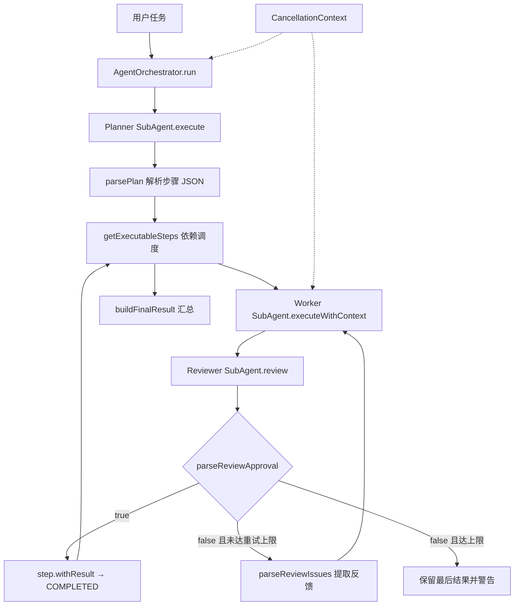
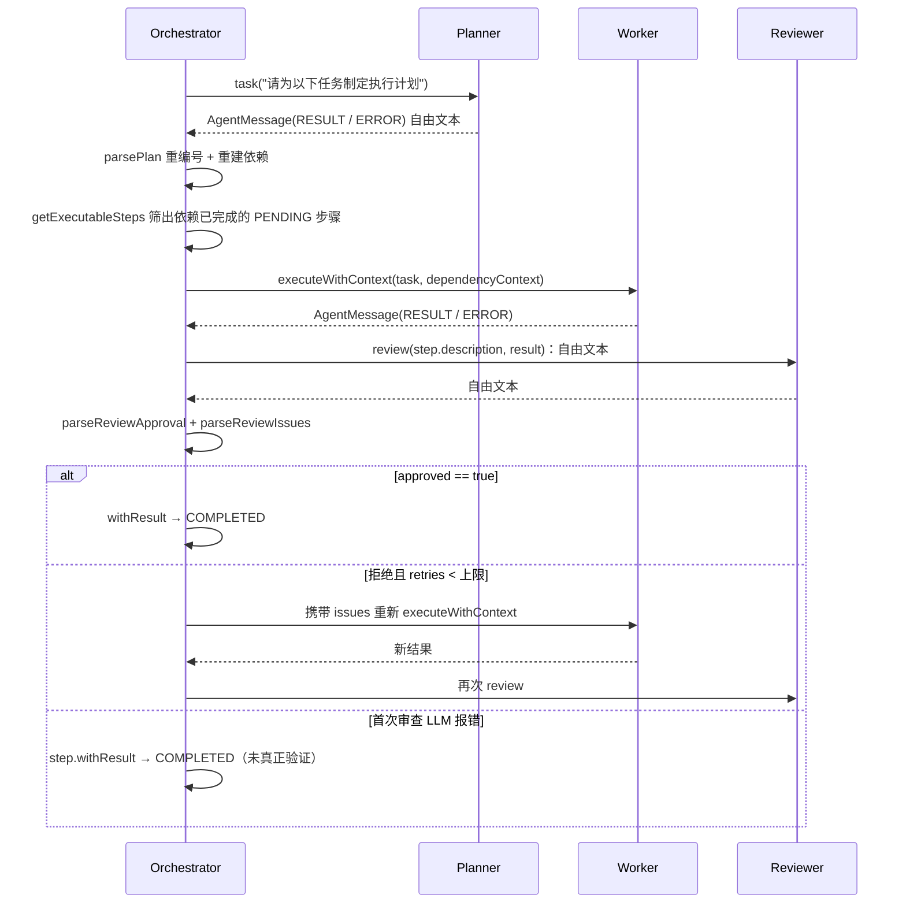

# Planner-Worker-Reviewer Multi-Agent 协作闭环

## 1. 功能定位

`AgentOrchestrator` 是 CodeAgent 的团队模式执行入口：它把一次用户请求交给 `Planner` 拆解成带依赖的步骤列表，按「所有依赖已完成」的规则挑出可执行步骤，串行或并行地交给 `Worker` 执行，再把每个步骤的执行结果交给 `Reviewer` 独立审查；审查不通过时把问题反馈回 `Worker` 重新执行，单步骤最多自动重试 2 次。Orchestrator 自身不执行任何工具，只负责解析、调度、上下文裁剪和结果汇总，真正的 LLM 推理与工具调用发生在 `SubAgent` 内部。

- 源码入口：`AgentOrchestrator.run(String)` — `src/main/java/com/codeagent/agent/AgentOrchestrator.java:138`
- 规划者：`planner` 字段 — `AgentOrchestrator.java:102`
- 执行者池：`workers` 字段 — `AgentOrchestrator.java:103-106`
- 检查者：`reviewer` 字段 — `AgentOrchestrator.java:107`
- 单步执行体：`runStep(...)` — `AgentOrchestrator.java:481`
- 角色化 Mini-Agent：`SubAgent` — `src/main/java/com/codeagent/agent/SubAgent.java:41`
- CLI 触发点：`/team` 命令与 `createTeamAgent(...)` — `src/main/java/com/codeagent/cli/Main.java:823`、`Main.java:1543`

## 2. 设计意图

### 2.1 单 Agent 的职责冲突

单个 Agent 同时规划、执行和评价自己的结果时，容易产生自我确认偏差，输出「我已完成」的自我判断而缺少独立验收；执行轮次一多，最初的验收标准还会被工具输出淹没。

三类工作对上下文的需求恰好不同：**规划**需要全局目标和拆解能力，**执行**需要工具规则和具体步骤，**审查**需要验收标准和结果证据。把三类上下文塞进同一会话，只会让每一次模型调用都背负大量与当前判断无关的噪音。

### 2.2 角色拆分目标

项目采用 Planner、Worker、Reviewer 三角色（`AgentRole.java:7-9`）。目标不是模拟组织层级，而是**隔离推理职责**：每个角色拥有独立 Prompt 模式（`SubAgent.promptMode()` — `SubAgent.java:93-99`）和独立对话历史（`SubAgent.java:49`）。Orchestrator 负责决定消息流向下一个角色。

### 2.3 与 Plan-and-Execute 的区别

两者都能处理依赖步骤。Plan-and-Execute 的核心是结构化 DAG 调度；Multi-Agent 的核心是**角色分工 + 结果审查**。在 Multi-Agent 中，每个 Worker 结果还要经过 Reviewer，审查不通过时反馈被送回 Worker 重新执行——这是 Plan-and-Execute 没有的环节（见 `02-dag-orchestration.md`）。

## 3. 总体架构与关键流程

### 3.1 总体架构



### 3.2 一次团队任务时序

注意 `SubAgent.review()` 返回的是**自由文本**（`SubAgent.java:279-283`），审批与问题由 Orchestrator 事后用两个独立方法解析，而不是 Reviewer 直接返回结构体。



### 3.3 核心对象与职责边界

#### AgentOrchestrator

`AgentOrchestrator` 是协作流程控制器，持有的运行状态（`AgentOrchestrator.java:47-54`）：

| 字段 | 类型 | 作用 |
|---|---|---|
| `llmClient` | `LlmClient` | 所有角色共享的模型通道 |
| `planner` | `SubAgent` | 生成步骤计划的角色实例 |
| `workers` | `List<SubAgent>` | 可被步骤独占领取的执行者池，数量即并行上限 |
| `reviewer` | `SubAgent` | 串行路径复用的检查者实例 |
| `memoryManager` | `MemoryManager` | 保存总任务对话与最终结果 |
| `toolRegistry` | `ToolRegistry` | 所有角色共享的工具入口 |
| `out` | `PrintStream` | 串行路径的输出目标 |
| `externalContextSupplier` | `Supplier<String>` | MCP resource 等外部上下文 |

Orchestrator 不直接执行工具，把执行全部委托给 `SubAgent`。

#### SubAgent

`SubAgent` 是**角色化的 Mini Agent Runtime**，与 `Agent` 主循环结构对称（`SubAgent.java:41`）。它持有名称、`AgentRole`、`LlmClient`、`ToolRegistry`、独立 `conversationHistory`（`SubAgent.java:49`）、`ConversationHistoryCompactor`（`SubAgent.java:53`）和默认 `PromptAssembler`（`SubAgent.java:54`）。

构造时用 `getSystemPrompt()` 生成首条 system 消息（`SubAgent.java:64`）；`promptMode()` 把角色映射到 `TEAM_PLANNER` / `TEAM_WORKER` / `TEAM_REVIEWER` 三种 `PromptMode`（`SubAgent.java:93-99`）。

#### AgentRole

角色枚举把业务名称映射到展示名与职责描述（`AgentRole.java:6-9`），是「角色化提示词」的最小载体。

#### AgentMessage

`AgentMessage` 是 Agent 间通信对象，`record` 携带 `fromAgent` / `fromRole` / `content` / `type`（`AgentMessage.java:14`），并声明 6 种消息类型（`AgentMessage.java:20-27`）。工厂方法包括 `task`（`AgentMessage.java:32`）、`result`（`AgentMessage.java:39`）、`feedback`（`AgentMessage.java:46`）、`approval`（`AgentMessage.java:53`）、`rejection`（`AgentMessage.java:60`）、`error`（`AgentMessage.java:67`）。

#### ExecutionStep

Orchestrator 内部用 `ExecutionStep` record 表达步骤（`AgentOrchestrator.java:57-59`）：`id` / `description` / `type` / `dependencies` / `result` / `status`。record 不可变，状态更新通过 `withResult` / `withFailed` / `started` 创建新实例并 `set` 回列表（`AgentOrchestrator.java:64-74`）。状态机只有四个值：`PENDING` / `RUNNING` / `COMPLETED` / `FAILED`（`AgentOrchestrator.java:77-79`）。

### 3.4 AgentOrchestrator.run 完整调用链

#### 规划阶段（`AgentOrchestrator.java:140-168`）

1. 用户输入写入总任务记忆（`AgentOrchestrator.java:140`）。
2. 取消检查（`AgentOrchestrator.java:141`）。
3. 构造 `AgentMessage.task("orchestrator", …)` 交给 `planner.execute(planMessage, out)`（`AgentOrchestrator.java:149-151`）。
4. `planner.clearHistory()`（`AgentOrchestrator.java:152`）——下一次团队任务不会继承上一份计划上下文。
5. 再次取消检查（`AgentOrchestrator.java:153`）。
6. 三类失败早退：`ERROR` → 「规划阶段失败」（`:157-159`）、空内容 → 「规划失败」（`:160-162`）、`parsePlan` 返回空 → 「无法解析执行计划」（`:165-168`）。

#### 解析阶段（`AgentOrchestrator.java:222-282`）

`parsePlan()` 先剥离 Markdown JSON fence（`:224-226`），优先读 `steps` 数组，为空则兼容 `tasks`（`:231-239`），然后**两遍解析**：第一遍创建步骤并把模型 ID 重编号为 `step_N`，同时建立 `idMapping`（`:246-254`）；第二遍按映射重建依赖（`:258-275`）。返回空列表表示解析失败，`run` 直接终止（`:166`）。

#### 调度与执行阶段（`AgentOrchestrator.java:175-203`）

进入 `while (true)`：每轮先做取消检查，再 `getExecutableSteps()` 取可执行批次（`:180-186`）。

1. **单步批次**（`:189-196`）：`executable.get(0)`，按 `singleStepCursor % workers.size()` 轮转取一个 Worker（`:192-193`），构造依赖上下文后调用 `runStep(...)`，结束后 `worker.clearHistory()`。
2. **多步批次**（`:197-202`）：打印批次信息并交给 `runBatchParallel(...)`。

#### 收尾（`AgentOrchestrator.java:205-216`）

循环退出后，所有仍为 `PENDING` 的步骤被逐个打印「因前置步骤失败被跳过」（`:206-210`），由 `buildFinalResult(steps)` 生成汇总（`:213`），写入总任务记忆后返回（`:214-216`）。

### 3.5 闭环控制骨架

```text
解析 Planner 输出，建立步骤与依赖映射
while 未取消且仍有可执行步骤:
    取所有依赖已完成的 PENDING 步骤
    单步骤 -> 轮转取一个 Worker，串行执行并实时流式输出
    多步骤 -> 并行批次，每步独占一个 Worker 与独立 Reviewer
    对每个步骤：Worker 执行 -> Reviewer 审查
        approved  -> COMPLETED
        拒绝      -> 携带 issues 重试，直到通过或达到重试上限
        审查报错  -> 直接 withResult -> COMPLETED（未验证）
    保存最新结果并更新步骤状态
把无法再推进的 PENDING 步骤报告为「因前置失败被跳过」
汇总所有步骤状态与结果预览
```

Worker 的获取与归还在并行路径用 `try/finally` 形成资源边界（`AgentOrchestrator.java:443-449`）；并行步骤各自创建独立 Reviewer，避免共享会话历史。

### 3.6 Worker 执行模型与依赖上下文

Worker 不是普通函数，而是带工具能力的 `SubAgent`。它通过 `shouldUseTools()` 拿到工具定义——**只有 WORKER 角色返回 true**（`SubAgent.java:316-318`），Planner 与 Reviewer 的工具列表为 `null`（`SubAgent.java:209`）。因此一个步骤可以搜代码、读文件、改实现、跑测试并根据错误继续修复，直到模型不再请求工具。

`buildStepContext()`（`AgentOrchestrator.java:580-599`）只挑选当前步骤**直接依赖且已完成**的步骤（`:585`），拼接步骤 ID、描述和结果预览；预览超过固定字符上限时截断并追加省略号（`:589-591`）。不相关步骤不会进入上下文——这是按图边裁剪，而不是复制全局历史。

### 3.7 串行与并行

- **串行**：只有一个可执行步骤时直接执行，输出直连调用方的 `PrintStream`，保持实时打字观感。注意取 Worker 的方式是 `singleStepCursor % workers.size()` 轮转（`AgentOrchestrator.java:192-193`），**串行路径同样走 Worker 池**，只是每次只用一个。
- **并行**：`runBatchParallel()`（`AgentOrchestrator.java:410`）创建固定线程池，线程为 daemon 且命名 `codeagent-multi-agent`（`:413-417`）；`parallelism = Math.min(batch.size(), workers.size())`（`:412`）。Worker 通过 `LinkedBlockingQueue` 池化分配，`workerPool.take()` 保证一个 Worker 不会被两个步骤并发占用（`:418`、`:433`）。每个步骤创建自己的 `reviewer-{stepId}`（`:430-431`）和 `ByteArrayOutputStream` 缓冲（`:422-425`），避免多线程改写同一 `System.out`。
- **顺序稳定**：所有 Future `get()` 完成后 `executor.shutdownNow()`（`:454-464`），再按 batch 内 step 顺序 flush 各缓冲（`:467-473`），用户看到的执行过程因此保持稳定顺序。

### 3.8 Planner 输出协议

推荐 JSON：

```json
{
  "steps": [
    { "id": "research", "description": "定位相关实现", "type": "ANALYSIS", "dependencies": [] },
    { "id": "modify",   "description": "根据定位结果修改代码", "type": "CODE",     "dependencies": ["research"] },
    { "id": "verify",   "description": "执行针对性测试", "type": "TEST",     "dependencies": ["modify"] }
  ]
}
```

模型 ID 可能是数字、中文、重复或带空格。系统统一重编号为 `step_1`、`step_2`（`AgentOrchestrator.java:248`），依赖通过 `idMapping` 同步转换（`:264`），让日志、缓冲区和状态更新使用稳定标识。兼容 `tasks` 字段是为了复用 Plan-and-Execute 的 Prompt 或旧输出（`:232-234`）。

### 3.9 Reviewer 审查协议

Reviewer 不接收 Worker 的历史，只接收「原始任务 + 执行结果」的拼接文本（`SubAgent.java:280`），保证它从验收视角独立评价。

推荐输出：

```json
{ "approved": false, "issues": ["没有执行测试", "未说明修改文件"] }
```

`parseReviewApproval()`（`AgentOrchestrator.java:305-338`）遵循 fail-closed：空内容拒（`:306-309`）、JSON 缺 `approved` 拒（`:316-320`）、无法解析 JSON 时**必须同时不含否定关键词且含肯定关键词**才放行，否则拒绝（`:322-336`）。

`parseReviewIssues()`（`AgentOrchestrator.java:343-379`）逐级回退取反馈：`issues` 数组（`:353-360`）→ `suggestions` 数组（`:362-369`）→ `summary` 字符串（`:372-375`）→ 全部失败时返回一条硬编码中文文案（`:378`）。

### 3.10 重试闭环

`retryCount` 是 `ConcurrentHashMap<String, Integer>`，key 为步骤 ID（`AgentOrchestrator.java:175`），因此并行批次中的步骤各算各的。

拒绝后构造反馈上下文：原依赖上下文 + 「之前的执行结果被审查拒绝，原因：」 + issues（`AgentOrchestrator.java:541`），复用同一个 `taskMsg` 再次 `executeWithContext`（`:542`）。`MAX_RETRIES_PER_STEP` 限制的是首次执行**之后**的额外尝试（`AgentOrchestrator.java:45`、`:535`），因此单步最多自动重试 2 次。

### 3.11 示例：新增一个查看队列统计的命令

用户任务：「新增一个查看任务队列统计的命令，并检查实现质量。」

Planner 可拆成：读命令解析模块 → 设计行为（依赖上一步）→ 实现命令 → 跑测试；同时可加一条「核对文档」与「跑测试」并行。Worker 完成「实现命令」后，Reviewer 可能指出：命令未加入补全器、未覆盖空队列、文档命令表未更新。这些 issues 回灌给 Worker，第二次执行补齐遗漏，Reviewer 再判断。

## 4. 设计意图 vs 实际实现

以下逐条列出文档意图与代码实际行为的差异，具体数值以源码为准。

| 主题 | 设计意图 | 实际实现 | 源码位置 |
|---|---|---|---|
| 审查反馈不可解析时 | 声称「保留原始 Reviewer 内容作为反馈」，让 Worker 至少看到审查文本 | **原始内容从不被使用**。`parseReviewIssues()` 按 `issues` → `suggestions` → `summary` 逐级回退，全部失败时返回一条**硬编码**文案「审查未通过，请改进执行结果」 | `AgentOrchestrator.java:353-375`、`AgentOrchestrator.java:378` |
| 取消检查点 | 声称「规划、执行和重试之间都会检查取消」 | 重试的 `while` 循环内部**没有任何取消检查**；`runStep` 只在首次 `executeWithContext` **之前**和**之后**各检查一次。重试期间用户取消不会中断本步骤 | `AgentOrchestrator.java:486`、`AgentOrchestrator.java:494` vs `AgentOrchestrator.java:535-570` |
| Reviewer 重试期间失败 | 声称「保留结果但**不**宣称已验证」 | 代码直接把 `approved = true` 并清空 issues 后 `break`，随后打印「✅ 步骤[…] 重试后审查通过」——**主动宣称验证通过**，与文档相反 | `AgentOrchestrator.java:561-566`、`AgentOrchestrator.java:573-574` |
| 「有结果但未验证」终态 | 描述为一个独立的最终状态 | **该状态不存在**。首次 Reviewer 调用报错时走 `step.withResult(result.content())` → `COMPLETED`（`:515-519`），于是 `buildFinalResult` 的 `allCompleted` 可以为 true 并输出「协作任务完成」 | `AgentOrchestrator.java:515-519`、`AgentOrchestrator.java:621-630` |
| 时序图 `review()` 返回值 | 画成 Reviewer 返回结构化 `{approved, issues}` | `SubAgent.review()` 返回**自由文本** `AgentMessage`；`approved` 与 `issues` 由 Orchestrator 事后用 `parseReviewApproval` 和 `parseReviewIssues` **两个独立方法**分别解析，二者结论甚至可能不一致 | `SubAgent.java:279-283`、`AgentOrchestrator.java:522`、`AgentOrchestrator.java:532` |
| `ExecutionStep.type` | 容易理解为按类型分派不同执行策略 | `parsePlan` 把 `type` 默认值取为字面量 `"COMMAND"`（`:252`），而**调度期从不读取 `type`**——`getExecutableSteps` 只看 `status` 与 `dependencies` | `AgentOrchestrator.java:252`、`AgentOrchestrator.java:287-298` |
| 步骤 ID 与依赖引用 | 以为有解析期校验 | 缺失/空 `"id"` 时 `asText()` 返回空串，`idMapping.put("", newId)` 在**空串键上互相覆盖**；未知依赖经 `getOrDefault(dep, dep.asText())` **回退为原始字符串**，`statusMap.get(dep)` 永远为 null，该步骤**永久 PENDING** | `AgentOrchestrator.java:247-249`、`AgentOrchestrator.java:264`、`AgentOrchestrator.java:296` |
| 串行路径的 Worker | 以为串行不用池 | 用 `singleStepCursor % workers.size()` 轮转取 Worker，**串行也走池**，只是每次占一个 | `AgentOrchestrator.java:192-193` |
| 重试全部返回 ERROR | 以为会回退到原始结果重试 | `acceptedResult` 只在重试**成功返回内容**时更新（`:557`）；重试全部 ERROR 时它保留进入循环前的值，即**可能是首次执行的原结果**，最终照样 `withResult` 落库 | `AgentOrchestrator.java:543-557`、`AgentOrchestrator.java:572` |
| `SubAgent` 的独立预算与工具边界 | 文档几乎没提 `SubAgent` 自身行为 | `SubAgent` 有**自己的** `AgentBudget`（token / 停滞 / 硬轮数兜底退出，`:189-198`）、LSP 诊断注入（`:203`）、`shouldUseTools()` 仅对 WORKER 为真（`:316-318`）、历史图片裁剪（`:294-311`）、按 `compactionTriggerTokens()` 压缩历史（`:106`） | `SubAgent.java:186-198`、`SubAgent.java:203`、`SubAgent.java:316-318`、`SubAgent.java:294-311`、`SubAgent.java:106` |
| 并行批次线程模型 | 未说明 | daemon 线程、`parallelism = min(batch, workers)`、结束后 `shutdownNow` | `AgentOrchestrator.java:412-417`、`AgentOrchestrator.java:464` |
| 汇总结果里的预览 | 以为返回完整结果 | `buildFinalResult` 对预览做**固定字符上限截断**并追加省略号；完整输出已在执行阶段流式打印过 | `AgentOrchestrator.java:645-647` |
| AgentMessage 消息类型 | 文档称典型类型含「任务、结果、反馈、错误」 | `FEEDBACK` / `APPROVAL` / `REJECTION` 三个工厂方法**已定义但 Orchestrator 从不使用**；运行时实际只发 `TASK`、`RESULT`、`ERROR`，审查结论走的是自由文本解析而非消息类型 | `AgentMessage.java:20-27`、`AgentMessage.java:46-62` vs `AgentOrchestrator.java:149`、`AgentOrchestrator.java:492`、`SubAgent.java:245` |

## 5. 设计取舍

| 备选方案 | 为什么没选 | 代价 |
|---|---|---|
| Reviewer 用确定性规则（测试、编译、静态检查）替代 LLM | 规则无法理解开放式任务质量，也不产生自然语言改进建议 | 当前 Reviewer 是概率模型，输出不确定、需要解析非严格文本、增加模型调用成本。可靠场景应把测试/编译证据一并喂给 Reviewer |
| 每个 SubAgent 各持一套 `ToolRegistry` | MCP Server 工具注册难以同步，HITL 状态可能不一致，审计分散 | 共享 Registry 保证能力与安全策略一致（`AgentOrchestrator.java:97-101`），但工具实现必须考虑并发安全 |
| 把完整团队历史复制给每个 Agent | Token 成本随步骤数快速放大 | 只传直接依赖的结果预览（`AgentOrchestrator.java:585`）省 Token，但要求 Planner 必须正确描述依赖，且长结果细节会丢失 |
| 达到重试上限后标记 `FAILED` | 完全丢弃会浪费已完成的部分工作 | 当前保留最后结果并打印警告（`AgentOrchestrator.java:576`），适合人工复核；高风险自动化仍应改成 FAILED |
| 串行路径不走池、直接持有固定 Worker | 轮转取池实现更简单，且复用同一条 `runStep` 路径 | 串行也承担池的取用开销，且轮转会让「哪个 Worker 处理了哪一步」不可预测（`AgentOrchestrator.java:192-193`） |
| Reviewer 报错时标记步骤为「未验证」 | 需要一个额外的步骤状态或标记位 | 当前复用 `withResult → COMPLETED`，可用性优先但丢失了「已验证 / 未验证」的区别，汇总里也无法区分（`AgentOrchestrator.java:515-519`、`:621-625`） |

## 6. 失败与边界矩阵

| 场景 | 检测点 | 当前处理 | 最终状态 |
|---|---|---|---|
| 用户在规划前取消 | `CancellationContext.isCancelled()`（`:141`） | 直接返回取消提示 | 任务取消 |
| 用户在规划后取消 | 检查点 `:153` | 直接返回取消提示 | 任务取消 |
| 用户在批次间取消 | 检查点 `:180` | 退出调度循环 | 任务取消 |
| 用户在单步执行前/后取消 | 检查点 `:486`、`:494` | `withFailed("用户取消")` | FAILED |
| Planner LLM 错误 | `AgentMessage.Type.ERROR`（`:157`） | 立即返回 | 规划失败 |
| Planner 空响应 | `isBlank()` 校验（`:160`） | 立即返回 | 规划失败 |
| 计划 JSON 非法 / 无 steps 数组 | `parsePlan` 返回空列表（`:236-239`、`:278-281`） | 立即返回 | 规划失败 |
| 步骤 id 缺失/重复为空 | `idMapping.put("")` 覆盖（`:249`） | 无显式校验 | 映射错误、依赖可能错接 |
| 依赖引用未知 ID | `getOrDefault` 回退原始串（`:264`） | 无显式校验 | 该步骤永久 PENDING、被报告为跳过 |
| Worker LLM 报错 | `Type.ERROR`（`:500`） | `withFailed(content)` | FAILED |
| Worker 返回空结果 | `isBlank()` 校验（`:505`） | `withFailed("执行结果为空")` | FAILED |
| Reviewer 返回空 / 非法 JSON | `parseReviewApproval` fail-closed | 视为拒绝 | 进入重试 |
| Reviewer JSON 缺 `approved` | `isMissingNode`（`:316`） | 视为拒绝 | 进入重试 |
| **首次 Reviewer 调用失败** | `Type.ERROR`（`:515-519`） | `withResult(result.content())`，**未真正验证** | **COMPLETED** |
| **重试期间 Reviewer 调用失败** | `Type.ERROR`（`:561-566`） | `approved = true` 并打印「重试后审查通过」 | COMPLETED（宣称通过） |
| 重试期间 Worker 报错 | `:543-548` | `issues` 覆盖为错误信息，`continue` | 继续重试或到上限 |
| 重试期间 Worker 空结果 | `:549-555` | `acceptedResult = "执行结果为空"`，`continue` | 继续重试或到上限 |
| 两次重试后仍拒绝 | 重试上限（`:535`） | 保留最后结果并打印警告 | 有风险结果 |
| 依赖步骤失败 | `getExecutableSteps` 过滤（`:295-297`） | 后续步骤不执行 | PENDING → 报告跳过 |
| 并行 Worker 等待被中断 | `InterruptedException`（`:435-438`） | 恢复中断位，`withFailed` | 单步 FAILED |
| 并行任务运行时异常 | `RuntimeException`（`:439-442`） | 记录日志，`withFailed` | 单步 FAILED |

## 7. 测试策略与证据

### 7.1 计划解析（`AgentOrchestratorTest.java`）

- 标准 `steps` 数组 → 步骤与描述（`shouldParseSimplePlan`）。
- 多步骤依赖重编号为 `step_N` 且依赖同步映射（`shouldParseMultiStepPlanWithDependencies`）。
- Markdown fence 剥离（`shouldParsePlanWithMarkdownCodeBlock`）。
- 兼容 `tasks` 字段（`shouldParsePlanWithTasksField`）。
- 空串、非 JSON、缺 `steps` 均返回空列表（`shouldReturnEmptyListForInvalidJson`）。

### 7.2 调度与审查解析（`AgentOrchestratorTest.java`）

- 依赖未完成时只返回前置步骤，完成后才返回后续步骤（`shouldGetExecutableSteps`）。
- 两个无依赖步骤同时可执行（`shouldGetMultipleExecutableStepsForParallelTasks`）。
- 审批解析：`true` / `false` / 空 / 否定关键词 / 肯定关键词 / 缺字段（`shouldParseReviewApproval`）。
- `issues` 数组解析、`summary` 回退、非法 JSON 回退到硬编码文案（`shouldParseReviewIssues`、`shouldFallbackToSummaryForIssues`、`shouldHandleInvalidReviewJson`）。

### 7.3 协作流程（`AgentOrchestratorTest.java`）

- 拒绝两次后第三次通过，最终结果只含最后结果（`shouldRetryRejectedStepUntilApproval`）。
- 两个独立步骤并发峰值达到预期，且最终结果同时包含两步（`shouldRunIndependentStepsInParallel`）。
- 前置失败导致后续步骤保持 PENDING，最终汇总区分失败与未执行（`shouldReportIncompleteRunWhenFailureBlocksRemainingSteps`）。

### 7.4 SubAgent 行为（`SubAgentTest.java`）

- `shouldUseTools` 只对 WORKER 为真（`shouldOnlyEnableToolsForWorker`）。
- 迟到的 reasoning 进入「补充思考」且排在正文之后（`shouldRouteLateReasoningToSupplementalSection`）。
- tool-call 迭代后重新打印「执行思考」「执行输出」标题（`shouldPrintFreshHeadingsAcrossToolIterations`）。
- 纯空白 reasoning 不产生空的思考标题（`shouldNotEmitEmptyReasoningHeadingForWhitespaceDeltas`）。

### 7.5 当前测试未覆盖的点

- 重试期间取消无效（无对应测试）。
- 重试期间 Reviewer 报错被计为「通过」（无对应测试）。
- 步骤 `id` 缺失或依赖引用未知 ID 的解析行为（无对应测试）。
- `buildFinalResult` 将「首次审查失败」计为 allCompleted（无对应测试）。

## 8. 面试讲解模板

### 8.1 30 秒版本

我实现了 Planner-Worker-Reviewer 多 Agent 协作模式。Planner 先生成带依赖的步骤，Orchestrator 按「依赖已全部完成」筛出可执行步骤，把依赖结果裁剪后传给 Worker；Worker 完成后由独立 Reviewer 审查，审查不通过就把问题反馈回 Worker，单步骤最多自动重试 2 次。无依赖步骤可以并行，每步独占一个 Worker 和独立 Reviewer，避免历史竞争和日志交错。Orchestrator 自己不做工具调用，也不做模型推理，只做解析、调度和汇总。

### 8.2 2 分钟版本

这个设计的核心不是创建多个模型实例，而是**隔离角色责任和上下文**。三个角色共享同一个 `LlmClient` 和 `ToolRegistry`，区别只来自 Prompt 模式和独立对话历史。Orchestrator 把模型生成的 JSON 重编号成稳定 step ID，再按依赖状态分批调度。

并行时 Worker 从阻塞队列独占领取，每个步骤创建独立 Reviewer，因为 `SubAgent` 内部有可变对话历史，共享实例会让多个线程写入同一消息序列。并行输出写入步骤本地缓冲区，全部完成后按 step 顺序 flush，保证用户看到的日志连续稳定。

审查侧遵循 fail-closed：JSON 缺 `approved` 或无法解析且没有明确肯定关键词，一律判为拒绝。拒绝原因会被提取并追加到 Worker 的下一次上下文，每步最多自动重试 2 次；依赖失败的步骤保持 PENDING 并被报告为跳过。

我也要诚实说明两处降级：首次 Reviewer 调用报错时，步骤会被标记为 COMPLETED，实际并未验证；重试期间 Reviewer 报错甚至会被当成通过。这些属于可用性优先的取舍，不是真正的验证保证。

## 9. 高频面试问答

### Q1：Multi-Agent 比单 Agent 多了什么？

核心是职责和上下文隔离。规划、执行、审查分别使用不同 Prompt 模式和独立历史，由 Orchestrator 显式传递信息（`SubAgent.java:93-99`、`AgentOrchestrator.java:102-107`）。

### Q2：为什么 Reviewer 能减少问题？

Reviewer 只接收「原始任务 + 执行结果」，不继承 Worker 的自我解释（`SubAgent.java:280`）。但它仍是概率模型，不能替代确定性测试。

### Q3：如何避免 Agent 之间上下文污染？

每个 `SubAgent` 维护独立 `conversationHistory`（`SubAgent.java:49`）；Planner 执行后立即清空历史（`AgentOrchestrator.java:152`），Worker 在步骤结束后清空（`:196`、`:445`、`SubAgent.java:288-292`），只传递明确的依赖结果和审查反馈。

### Q4：为什么并行步骤要创建独立 Reviewer？

Reviewer 有可变历史。共享同一个实例会让多个线程写入同一消息序列，导致 Tool Call 或审查上下文交叉。所以并行路径为每个步骤创建 `reviewer-{stepId}`（`AgentOrchestrator.java:430-431`）。

### Q5：Worker 为什么可以复用？

Worker 从 `LinkedBlockingQueue` 独占领取（`AgentOrchestrator.java:433`），在 `finally` 中清空历史后归还（`:443-448`）。任意时刻一个 Worker 只服务一个步骤。

### Q6：Reviewer 输出不规范怎么办？

先按 fail-closed 判断是否通过：空内容、缺 `approved`、非 JSON 且无肯定关键词一律拒绝（`AgentOrchestrator.java:305-338`）。问题列表则逐级回退取 `issues` → `suggestions` → `summary`（`:353-375`）。需要补一句诚实说明：**如果三者都没有，返回的是一条硬编码文案，而不是 Reviewer 的原始输出**（`AgentOrchestrator.java:378`）。

### Q7：为什么最多重试 2 次？

限制成本和循环风险。`MAX_RETRIES_PER_STEP` 限制的是首次执行之后的额外尝试（`AgentOrchestrator.java:45`、`:535`）。

### Q8：重试时传什么信息？

保留原依赖上下文，追加「之前的执行结果被审查拒绝，原因：」和提取出的 issues（`AgentOrchestrator.java:541`）。这样 Worker 知道要修正什么，而不是盲目重复。

### Q9：依赖结果如何传递？

只传当前步骤直接依赖且已完成的结果预览（`AgentOrchestrator.java:585`、`:589-591`），通过图边控制上下文范围。

### Q10：如何处理 Planner 生成错误依赖？

依赖无法满足时步骤保持 PENDING 并被报告为跳过（`AgentOrchestrator.java:206-210`）。当前**没有**解析期的未知 ID 校验——未知依赖回退为原始字符串，`statusMap.get` 返回 null，步骤永远不会变成可执行（`:264`、`:296`）。这是可以改进的点。

### Q11：多 Agent 是否意味着多模型？

不一定。当前三个角色共享同一个 `LlmClient`（`AgentOrchestrator.java:102-107`），区别主要来自 Prompt、历史和职责。

### Q12：工具是否也隔离？

工具 Registry 共享，保证能力和安全策略一致（`AgentOrchestrator.java:97-101`）。对话历史隔离，工具副作用作用于同一个 workspace。

### Q13：并行写文件会冲突吗？

可能。当前依赖 Planner 避免冲突；更强方案是声明资源写集并增加文件级锁。

### Q14：Reviewer 服务失败为什么仍保留结果？

严格说，代码不止「保留结果」：首次 Reviewer 报错时用 `step.withResult(...)` 把步骤标成 COMPLETED（`AgentOrchestrator.java:515-519`）；**重试期间报错时更是直接把 `approved` 置为 true**（`:561-566`），并打印「重试后审查通过」。这是纯可用性降级，不能等同于审查验证通过，面试中应当主动指出这一偏差。

### Q15：如何让 Reviewer 更可靠？

向它提供编译、测试、静态分析等机器证据；要求结构化 Schema；对高风险结论使用确定性门禁。

### Q16：为什么不让 Reviewer 直接修改代码？

Reviewer 只负责评价，保持职责单一。修改建议通过 issues 回到 Worker，责任链清晰。注意这一点是设计意图——实现上 Reviewer 的工具列表确实为 `null`（`SubAgent.java:209`、`:316-318`）。

### Q17：如何控制 Token 成本？

只传依赖结果预览、清理角色历史、限制重试次数，并复用历史压缩机制（`SubAgent.java:101-113`、`AgentOrchestrator.java:589-591`）。

### Q18：如何验证真正并行？

用阻塞式假 Worker 和并发计数器测试，断言两个任务同时进入执行区，并验证输出顺序仍稳定。项目中的 `shouldRunIndependentStepsInParallel` 正是用 `CountDownLatch` 做的（`AgentOrchestratorTest.java:293-340`）。

### Q19：当前实现与分布式 Agent 平台有何差异？

当前是单进程线程池协作，没有远程 Worker、消息队列、租约、心跳和分布式恢复。

### Q20：下一步如何演进？

增加共享黑板、结构化 Artifact、资源锁、动态角色选择、Reviewer 证据门禁、持久化步骤和分布式任务队列。优先级较高的是修复审查失败被误判为通过、以及补上重试路径的取消检查。

## 10. 简历条陈与源码证据

简历原句：「Multi-Agent协作闭环：实现 Planner-Worker-Reviewer 多 Agent 协作架构，支持角色化提示词、步骤级上下文传递、Reviewer 结果解析、失败反馈和最多 2 次自动重试，形成"规划—执行—审查—重试"的闭环。」

| 简历原句 | 代码证据 |
|---|---|
| Planner-Worker-Reviewer 多 Agent 协作架构 | 三角色字段与 `SubAgent` 构造 — `AgentOrchestrator.java:102-107`；角色枚举 — `AgentRole.java:6-9` |
| 角色化提示词 | `SubAgent.promptMode()` 映射三种 `PromptMode` — `SubAgent.java:93-99`；system prompt 组装 — `SubAgent.java:84-91` |
| 步骤级上下文传递 | `buildStepContext()` 只取直接依赖的已完成步骤与结果预览 — `AgentOrchestrator.java:580-599`；注入点在 `executeWithContext` — `SubAgent.java:262-270` |
| Reviewer 结果解析 | `parseReviewApproval()` — `AgentOrchestrator.java:305-338`；`parseReviewIssues()` — `AgentOrchestrator.java:343-379` |
| 失败反馈 | 反馈上下文拼接原依赖 + issues — `AgentOrchestrator.java:541` |
| 最多 2 次自动重试 | `MAX_RETRIES_PER_STEP` 与重试 `while` — `AgentOrchestrator.java:45`、`AgentOrchestrator.java:535` |
| 规划—执行—审查—重试闭环 | `run()` 的规划 → 调度 → `runStep`（Worker → Reviewer → retry）→ 汇总 — `AgentOrchestrator.java:138`、`AgentOrchestrator.java:481`、`AgentOrchestrator.java:619` |
| 按依赖调度 | `getExecutableSteps()` 过滤 PENDING + 依赖全 COMPLETED — `AgentOrchestrator.java:287-298` |
| 并行执行 | `runBatchParallel()` Worker 池 + 独立 Reviewer + 稳定 flush — `AgentOrchestrator.java:410-474` |
| 子 Agent 运行时 | `SubAgent.execute()` 的 ReAct 循环、工具执行、预算兜底 — `SubAgent.java:173-253` |

## 11. 当前实现边界

- 所有角色运行在同一 JVM 进程，没有远程 Worker、消息队列或租约心跳。
- 三个角色默认共享同一模型 Provider，共享同一 `ToolRegistry` 与同一个 `SkillContextBuffer`（`AgentOrchestrator.java:118-133`，类注释明确说明角色级 buffer 隔离未启用）。
- 步骤状态与审查状态没有持久化恢复，进程退出即丢失。
- **首次 Reviewer 调用失败会被记为 COMPLETED**，汇总可能报告「协作任务完成」，而该步骤实际未经验证（`AgentOrchestrator.java:515-519`、`:621-625`）。
- **重试期间 Reviewer 调用失败会被直接当作通过**，并打印「重试后审查通过」（`AgentOrchestrator.java:561-566`、`:573-574`）。
- 重试的 `while` 循环内没有取消检查，重试期间的用户取消不会中断该步骤（`AgentOrchestrator.java:535-570`）。
- `parseReviewIssues()` 在结构解析全部失败时返回硬编码文案，Reviewer 的原始自由文本不会进入 Worker 反馈（`AgentOrchestrator.java:378`）。
- `ExecutionStep.type` 有默认值但调度期从不读取，本质上是一个未被消费的字段（`AgentOrchestrator.java:252`、`:287-298`）。
- 步骤 `id` 缺失会在映射表空串键上互相覆盖；未知依赖回退为原始字符串导致步骤永久 PENDING，均无解析期校验（`AgentOrchestrator.java:249`、`:264`、`:296`）。
- 依赖上下文只保存结果预览（有固定字符上限），长结果细节会丢失（`AgentOrchestrator.java:589-591`）。
- 并行步骤共享同一 workspace，没有资源冲突检测。
- 达到重试上限后保留结果，不适用于必须严格拒绝的高风险自动化场景。
- Reviewer 是概率模型，不是形式化验证器。
