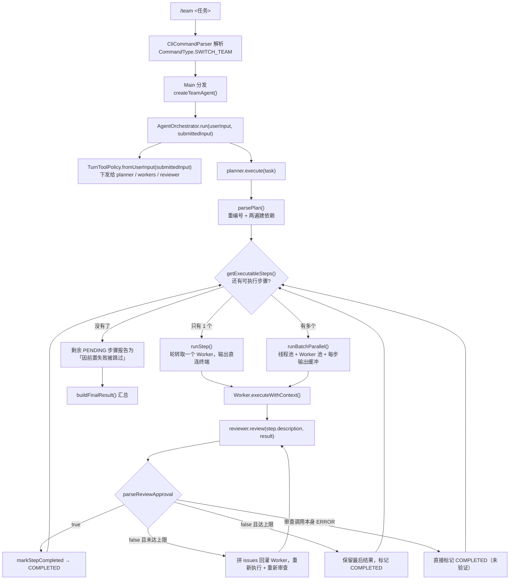
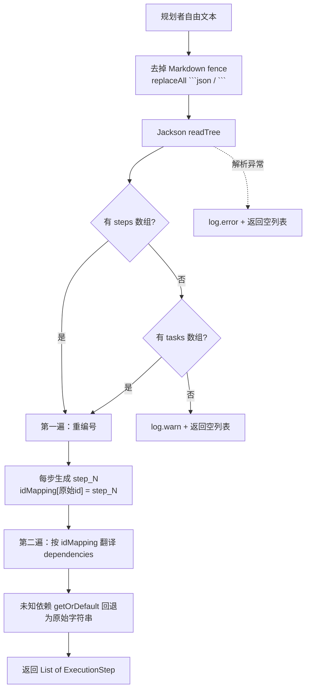
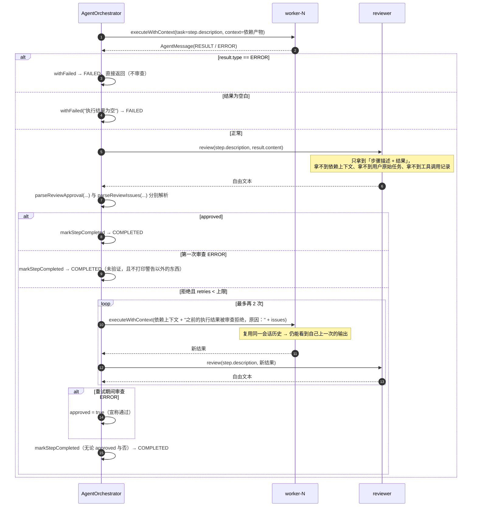
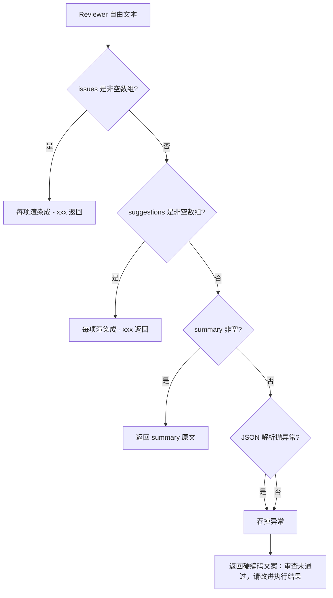

# Planner-Worker-Reviewer Multi-Agent 协作闭环

> **本文怎么读**
>
> - 读者假设：会写 Java、懂工程常识，但**没有接触过「多智能体协作」**。第 0 部分从概念讲起，有相关经验的读者可以直接跳到第 1 部分。
> - 本文描述的是**代码实际做了什么**，包括「定义了但没人调用」「审查意见被丢弃」「审查报错反而算通过」这类真实落差。它不是「多 Agent 架构最佳实践」，也不会把将来可能做的共享黑板、分布式 Worker、持久化调度写成已交付能力。
> - 所有 `file:line` 对应当前源码。正文有意**不写具体常量数值**（数值会随代码调整而过期），需要精确值时按行号自行核对。**例外**是简历原句里出现过的数字，那几个面试必被追问，全文保留。
> - 与姊妹篇的分工：本文聚焦**跨角色的协作闭环**——谁规划、谁执行、谁评审、产物怎么传递、凭据怎么隔离。单个计划执行器内部的计划解析细节、失败重规划留给 `02-dag-orchestration.md`，按主题交叉引用。

---

# 第 0 部分　前置知识

## 0.1 先说清楚「Agent」在这里指什么

在没有接触过这个主题时，最容易把「Agent」理解成「一个部署好的服务」或者「一个进程」。本项目里的 Agent **就是一个类**：

- `Agent`（`src/main/java/com/codeagent/agent/Agent.java:59`）是一个 ReAct 循环实现：把对话历史 + 工具定义发给大模型，模型要么返回工具调用，要么返回最终答案；返回工具调用就执行工具、把结果塞回历史、再问一次，直到模型给出最终答案。
- 循环本身是纯 Java 代码，每一轮的「思考」来自大模型。**Agent 不是模型，是围绕模型的一层循环 + 工具 + 历史管理。**

所以「多 Agent」在这个项目里**不等于多进程、多服务、多模型**。它指的是：

> 同一个 JVM 里，用**同一个类**造出多个实例，每个实例配一套不同的系统提示词、各自独立一份对话历史，由外层代码决定谁先跑、谁后跑、把谁的输出喂给谁。

这一点必须先接受，否则后面所有「角色」的描述都会读歪。

## 0.2 为什么单个 Agent 不够

假设用户说：「帮我把 `pom.xml` 的 Java 版本升到 17，然后跑一遍测试确认没退化」。

单个 ReAct Agent 会用同一个会话把这两件事做完，但会碰到三个具体问题：

**问题一：自我确认偏差。** 模型刚写完代码，紧接着自己判断「改好了」。它对自己的修改有天然的信息优势——它「记得」自己的意图，于是倾向于认为结果符合意图。它缺的不是智力，是**独立性**：没有人拿着「验收标准」去检查「实际产物」。

**问题二：上下文互相污染。** 规划需要的上下文是「全局目标 + 可拆解性」；执行需要的是「工具用法 + 具体步骤 + 上一步的产物」；审查需要的是「验收标准 + 实际结果」。把这三类塞进同一份对话历史，每一轮模型调用都要背着大量与当前判断无关的噪音，token 成本随轮数线性上涨，而且关键验收标准会被中间的工具输出淹没。

**问题三：长链路没有断点。** 一步做错了，后面的步骤会基于错误结果继续往下走，最后一句话总结「任务完成」。中间没有任何一个环节有机会说「等等，这一步的输出不对」。

三个角色就是把这三件事拆开：**规划者负责拆解（只看全局），执行者负责动手（只看当前步骤和依赖产物），检查者负责验收（只看任务描述和实际结果）**。

## 0.3 角色之间靠什么传递产物

概念上，「多智能体协作」需要一个「消息总线」或「共享黑板」。本项目**没有这两样东西**。实际传递产物只有三条通路，务必分清：

| 通路 | 载体 | 方向 | 代码位置 |
|---|---|---|---|
| 任务下发 | `AgentMessage`（一个 Java record） | Orchestrator → 某个角色 | `AgentMessage.java:14-19` |
| 依赖产物 | 拼成一段字符串，塞进任务内容前面 | 已完成步骤 → 当前步骤的 Worker | `AgentOrchestrator.java:648-677`、`SubAgent.java:488-497` |
| 审查意见 | 拼成一段字符串，追加在上下文后面 | Reviewer → 同一个 Worker 的重试 | `AgentOrchestrator.java:608-610` |

关键在于：**`AgentMessage` 虽然定义了 6 种消息类型（`AgentMessage.java:20-27`），但运行时真正被发出的只有 `TASK`、`RESULT`、`ERROR` 三种**。审查结论、审查反馈不是通过消息类型传递的，而是 Orchestrator 从 Reviewer 的自由文本里**事后解析**出来的（见 5.3、5.4）。

## 0.4 一个必须先打破的错觉

很多关于多 Agent 的介绍会画成「规划者把计划交给执行者，执行者把结果交给检查者，检查者不满意就退回」。这张图**在本项目里部分成立、部分不成立**，必须在读代码前就分清：

| 常见描述 | 本项目实际 |
|---|---|
| 三个角色互相迭代 | **规划者只被调用一次**，全程不参与后续轮次，也不做重新规划 |
| 角色之间来回对话 | 角色之间**没有直接对话**。每一跳都经过 Orchestrator 中转，且传递的是拼好的字符串 |
| 检查者把结果退回执行者 | **成立**。这是唯一一处真正的回环（`AgentOrchestrator.java:602-638`） |
| 三个角色是三个独立实现 | **不成立**。三个角色都是 `SubAgent` 的实例，区别只在构造时传入的 `AgentRole`（`AgentOrchestrator.java:108-113`） |

还有一层更容易忽略：**`SubAgent` 不继承 `Agent`**。`SubAgent` 的类声明处没有 `extends`（`SubAgent.java:52`），它是另写一份的 ReAct 循环（`SubAgent.java:296-416`）。所以项目里存在**两套平行的 ReAct 实现**——一套给单 Agent 模式用，一套给团队模式用。两边的主循环、流式渲染、工具执行、历史清理逻辑各自维护，改动需要人工同步。

## 0.5 名词速查

| 名词 | 在这里的含义 |
|---|---|
| Orchestrator（编排器） | `AgentOrchestrator`，团队模式的入口和总调度。**自己不调用任何工具、不直接调模型** |
| Planner / Worker / Reviewer | 三个逻辑角色，本项目里都是 `SubAgent` 实例 |
| SubAgent | 角色化的「迷你 Agent 运行时」，一个类，三种角色靠提示词和历史区分 |
| 步骤（step） | 规划者拆出来的一个子任务，Orchestrator 用 `ExecutionStep` record 表达 |
| 依赖（dependency） | 步骤之间的显式前置关系。只有依赖全部完成的步骤才可执行 |
| 批次（batch） | 某一轮里所有「依赖已满足」的步骤。只有一个就走串行，多个就走并行 |
| Reviewer 审查 | Reviewer 对 Worker 输出给出「是否通过 + 问题列表」，Orchestrator 事后解析 |
| 重试 | 审查未通过时让同一个 Worker 带着问题重新执行该步骤 |
| `TurnToolPolicy` | 每轮任务级的工具边界对象，决定哪些工具对模型可见、哪些 URL 被授权 |
| URL provenance（URL 凭据） | 「这个 URL 是被授权访问的」这条事实的来源链条。只能来自用户原文或成功的 `web_search` 结果 |
| child session | 每个子角色单独落盘的会话文件，用于审计（不是共享账本） |

---

# 第 1 部分　整体地图

## 1.1 一次 `/team` 任务的端到端形状



按批次并行意味着**这不是一个持续调度器**：每一轮先把当前「依赖已满足」的步骤全部取出来（`AgentOrchestrator.java:221`），执行完这一批，再重新计算下一批（`AgentOrchestrator.java:217-245`）。所以任务的推进是按依赖**分层**推进的，而不是「谁先空出 Worker 谁先上」。

## 1.2 分层与文件清单

| 层次 | 核心类 | 职责 | 不负责什么 |
|---|---|---|---|
| CLI 接线层 | `CliCommandParser`、`Main`、`TuiSessionController` | 解析 `/team`、创建 Orchestrator、把账本与 session 注入 | 不参与任何调度决策 |
| 编排层 | `AgentOrchestrator` | 计划解析、依赖调度、并行/串行选择、结果汇总 | **不调用工具、不直接调模型** |
| 角色执行层 | `SubAgent` | 单角色的 ReAct 循环、流式渲染、工具执行、预算兜底 | 不知道自己是第几个角色之外的信息 |
| 角色定义 | `AgentRole`、`PromptMode`、`prompts/modes/team-*.md` | 把角色映射到系统提示词 | 无逻辑 |
| 通信层 | `AgentMessage` | 角色间消息载体 | 实际只用到 3 种类型 |
| 边界层 | `TurnToolPolicy` | 工具可见性、URL 授权、浏览器租约 | 不做调度 |

核心源码集中在 `src/main/java/com/codeagent/agent/`：

```
agent/
├── AgentOrchestrator.java   编排器（团队模式入口）
├── SubAgent.java            角色化迷你 Agent 运行时
├── AgentRole.java           三角色枚举
├── AgentMessage.java        角色间消息 record
├── Agent.java               单 Agent ReAct 实现（与 SubAgent 无继承关系）
├── PlanExecuteAgent.java    Plan-and-Execute 实现（另一条独立路径）
└── AgentBudget.java         预算安全阀（SubAgent 每次执行时新建局部实例）
```

角色提示词在 `src/main/resources/prompts/modes/`：`team-planner.md`、`team-worker.md`、`team-reviewer.md`。

## 1.3 外部接线点（只有两处）

| 入口 | 触发方式 | 代码位置 |
|---|---|---|
| CLI `/team` | 用户敲命令，只置一个「下一条任务用团队模式」的标记 | 解析 `CliCommandParser.java:137-143`；置标记 `Main.java:672-679`；分发 `Main.java:1015-1023`；构造 `Main.java:1346-1353` |
| CLI `/team <任务>` | 直接带载荷，跳过标记 | 解析 `CliCommandParser.java:141-143`；分发同上 |
| TUI 团队模式 | TUI 内切换模式 | `TuiSessionController.java:274-282` |

**CLI 与 TUI 的接线并不等价**（这是旧文档没写的落差）：

| 注入项 | CLI（`Main.java:1346-1353`） | TUI（`TuiSessionController.java:274-282`） |
|---|---|---|
| `ConversationLedger` | 注入 ReAct Agent 的账本（`:1350`） | 注入（`:280`） |
| `parentSession` | 注入（`:1351`） | **未注入** |
| MCP resource 外部上下文 | 注入（`:1020`） | **未注入** |
| Skill 系统 | 注入（`:1021`） | **未注入** |

后果：TUI 下的团队模式，子角色不会产生 child session 审计记录（`SubAgent.executeWithPolicy` 的 `parentSession == null` 快速路径，`SubAgent.java:272-273`），也拿不到 MCP resource 索引和技能索引。

## 1.4 边界：本文讲什么、不讲什么

- **本文讲**：角色怎么造出来、计划怎么进调度、依赖产物怎么裁剪下发、审查结论怎么解析和回灌、URL 凭据怎么沿依赖边隔离、有哪些降级路径。
- **本文不讲**：`parsePlan` 之后单个计划内部的更细粒度语义（交给 `02-dag-orchestration.md`）；`SubAgent` 内部 ReAct 循环与上下文压缩的逐行细节（与单 Agent 模式共享同一套机制，见 `01-react-agent.md`）；session 持久化与恢复（见 `09-persistent-session-and-short-term-memory.md`）。

## 1.5 四个容易混淆的东西

| 名字 | 是什么 | 容易搞错的地方 |
|---|---|---|
| `AgentOrchestrator` vs `PlanExecuteAgent` vs `Agent` | 三种执行模式各自一个入口类 | 三者**互相独立**，不共享调度代码。`PlanExecuteAgent` 有失败重规划（`PlanExecuteAgent.java:419`），`AgentOrchestrator` **没有** |
| `Agent` vs `SubAgent` | 两份平行的 ReAct 实现 | **没有继承关系**。`Agent.java:59` 与 `SubAgent.java:52` 各自声明 |
| `AgentRole` vs `PromptMode` | 前者是逻辑角色，后者是提示词模板 | 两者是一一映射的，`SubAgent.promptMode()` 做这层翻译（`SubAgent.java:133-139`） |
| `ConversationLedger` vs child session | 两套审计机制，**在团队模式下只用了后者** | 见 6.5，这是本文改动最大的结论 |

---

# 第 2 部分　角色是怎么造出来的

## 2.1 三角色枚举

`AgentRole` 只有三项（`AgentRole.java:6-9`），每项带一个中文展示名和一句职责描述，由 `AgentRoleTest` 断言数量、展示名与非空描述（`AgentRoleTest.java:9-27`）。

`PromptMode` 里对应三项模板（`PromptMode.java:7-9`）：`TEAM_PLANNER` → `modes/team-planner.md`、`TEAM_WORKER` → `modes/team-worker.md`、`TEAM_REVIEWER` → `modes/team-reviewer.md`。映射发生在 `SubAgent.promptMode()`（`SubAgent.java:133-139`），一个 `switch` 表达式。

## 2.2 SubAgent 的构造与字段

构造器只做四件事（`SubAgent.java:74-83`）：存下 name / role / llmClient / toolRegistry、把当前 provider 与模型名回写进共享 `ToolRegistry`（`:79`）、新建一份 `ArrayList` 作为对话历史（`:80`）、把系统提示词作为第一条 message 放进去（`:82`）。

它持有的关键字段（`SubAgent.java:56-72`）：

| 字段 | 作用 | 注意 |
|---|---|---|
| `conversationHistory` | **每个实例独立一份**的对话历史 | 这是「上下文隔离」的全部实现，`:60` |
| `conversationLedger` | 审计账本 | 默认 disabled（`:68`）；团队模式下**没有任何代码去注入它**（`setConversationLedger` 全仓库无调用方），见 6.5 |
| `turnToolPolicy` | 本轮的工具边界 | 由 Orchestrator 统一下发，`:71` |
| `childSession` | `ThreadLocal` 的 child session 句柄 | 并行路径下每个线程一份，`:70` |
| `promptAssembler` | 系统提示词组装器 | `final` 字段，构造时创建，`:72` |
| `autoCompactionManager` | 历史压缩 | 阈值来自 `ToolRegistry` 的 context profile，`:64` |

**`SubAgent` 没有 `AgentBudget` 字段**。预算对象每次执行任务时在方法里新建（`SubAgent.java:311`），用完即弃。所以预算的累计状态**不跨任务保留**——这是与「Agent 持有长期状态」这类想象的差别。

## 2.3 系统提示词不是一份，是拼出来的

`getSystemPrompt()`（`SubAgent.java:124-131`）委托给 `PromptAssembler.assemble`，后者按固定顺序拼接多个模板（`PromptAssembler.java:20-48`）：base → （可选的无工具说明）→ 人格 → **当前角色模板** → 审批模式 → 运行时上下文 → Project Context → Skills → 上下文管理 → handoff。

其中「当前角色模板」由 `mode.resourcePath()` 决定（`PromptAssembler.java:36`），也就是 `SubAgent` 通过 `promptMode()` 传进来的那一份。

模板可以覆盖：`PromptRepository` 会先读 classpath 内置模板，再用 `~/.codeagent/prompts/` 覆盖，最后用项目内 `.codeagent/prompts/` 覆盖（`PromptRepository.java:33-42`、`:55-68`，路径越靠后优先级越高）。这是一条可运维的扩展点：**用户不改代码就能替换角色提示词**。

## 2.4 只有 Worker 能调用工具

`shouldUseTools()` 只对 `WORKER` 返回 true（`SubAgent.java:557-562`）。在循环里，这决定了发给模型的工具定义是完整的工具列表还是 `null`（`SubAgent.java:326-328`）；而 `TurnToolPolicy.expose(null)` 会直接返回一个**空的工具暴露对象**（`TurnToolPolicy.java:247-249`）。

双重后果：

1. Planner 和 Reviewer **看不到任何工具**，系统提示词里也会去掉 `## Tools` / `## Tool Policy` 段（`PromptAssembler.java:95-98`）。
2. 即使模型幻觉出一个工具调用，`expose` 出来的可见名字集合为空，`authorize` 会以 `TOOL_NOT_ADVERTISED` 拒绝（`TurnToolPolicy.java:420-423`），并且这个调用**不会在终端上被渲染成「已执行」**——`SubAgent` 打印工具调用前会先过一遍 `TurnToolPolicy.visibleToolCalls`（`SubAgent.java:369-370`、`TurnToolPolicy.java:287-301`）。

这条在测试里有直接断言：`SubAgentTest.shouldOnlyEnableToolsForWorker`（`SubAgentTest.java:48-56`）对三种角色分别反射调用 `shouldUseTools()` 并断言结果。

## 2.5 角色化流式渲染

`SubAgentStreamRenderer`（`SubAgent.java:723-865`）按角色换标题文字：思考区用「规划思考 / 执行思考 / 审查思考」（`SubAgent.java:795-801`），结果区用「规划结果 / 执行输出 / 审查结果」（`SubAgent.java:803-811`）。

其中 `WORKER` 故意用「执行输出」而不是「执行结果」，源码注释写明了理由：Worker 可能在 tool_call 之前先自言自语（narrate），用「结果」会暗示已完成（`SubAgent.java:804-805`）。这是一个刻意的措辞选择，不是随手写的。

渲染器还有一段容易踩坑的逻辑：如果服务器先下发 content、再补发 reasoning，迟到的 reasoning 会被累积到 `lateReasoning`，在 `finish()` 或迭代切换时以「补充思考」单独展示（`SubAgent.java:742-793`、`:817-842`、`:844-864`），避免混进结果区。测试 `SubAgentTest.shouldRouteLateReasoningToSupplementalSection`（`SubAgentTest.java:58-84`）和 `shouldPrintFreshHeadingsAcrossToolIterations`（`:86-144`）覆盖了这个行为。

## 2.6 Orchestrator 的构造：共享什么、不共享什么

`AgentOrchestrator` 的字段（`AgentOrchestrator.java:51-60`）：

| 字段 | 类型 | 说明 |
|---|---|---|
| `llmClient` | `LlmClient` | **三个角色共用同一个模型通道**（`:51`、`:108-113`） |
| `planner` | `SubAgent` | 单个实例（`:52`） |
| `workers` | `List<SubAgent>` | 固定大小的池，池大小即并行上限（`:53`、`:109-112`） |
| `reviewer` | `SubAgent` | 串行路径复用的实例（`:54`） |
| `memoryManager` | `MemoryManager` | **见下方落差说明**（`:55`） |
| `toolRegistry` | `ToolRegistry` | 三个角色共享（`:56`） |
| `out` | `PrintStream` | 串行路径的输出目标（`:57`） |
| `conversationLedger` | `ConversationLedger` | 默认 disabled（`:58`） |
| `parentSession` | `SessionStore.SessionHandle` | 用于给子角色开 child session（`:59`） |
| `externalContextSupplier` | `Supplier<String>` | MCP resource 索引（`:60`） |

构造器还会做三件副作用（`AgentOrchestrator.java:104-107`）：把上下文档位、当前模型、项目路径与「作用域记忆保存器」回写进共享 `ToolRegistry` 与 `MemoryManager`。

> **真实落差：`memoryManager` 字段基本是摆设。** 旧文档称它「保存总任务对话与最终结果」。实际代码里，`memoryManager` 字段只在构造器里被赋值一次（`AgentOrchestrator.java:114`），并在此前被调用三个 setter（`:104-107`）——**此后再没有任何写操作**，既没有保存任务对话，也没有保存最终结果。它唯一的对外出口是 `getMemoryManager()`（`AgentOrchestrator.java:430-432`），而该方法**全仓库没有任何调用方**。最终结果只通过 `run()` 的返回值交给调用方（`AgentOrchestrator.java:262`）。

`setSkillSystem` 把同一个 `SkillRegistry` 和**同一个** `SkillContextBuffer` 下发给三个角色（`AgentOrchestrator.java:129-139`），类注释明确说明「角色独立 buffer 未启用」（`:124-128`）。后果是：任何角色调用 `drain()` 都会把技能正文从共享 buffer 里取走，另外两个角色就拿不到了（`SubAgent.prependSkillBodies`，`SubAgent.java:202-209`）。

## 2.7 SubAgent 与 Agent：两套平行实现

`SubAgent` 的类声明不含 `extends`（`SubAgent.java:52`），主 `Agent` 独立声明在 `Agent.java:59`。两者各自实现 ReAct 主循环、流式渲染、工具执行、历史清理、LSP 诊断注入、预算收尾。

**这意味着**：对主 `Agent` 的任何改进都不会自动流到团队模式，反之亦然。这是一处**维护成本**，不是设计亮点，面试时应当主动承认。作为对照，`SubAgent.java:313` 的注释自己写着「与 `Agent.java` 对称」——开发者知道这是复制关系。

---

# 第 3 部分　规划阶段

## 3.1 Planner 的调用契约：全程只调一次

```java
// AgentOrchestrator.java:186-189
AgentMessage planMessage = AgentMessage.task("orchestrator",
        "请为以下任务制定执行计划：\n" + userInput);
AgentMessage planResult = planner.execute(planMessage, out);
planner.clearHistory();
```

四个要点：

1. **只有一次调用。** 后续无论 Worker 如何失败、审查如何拒绝，`planner` 都不会被再次调用。没有重新规划、没有计划修正——这与 `PlanExecuteAgent` 有 `replan`（`PlanExecuteAgent.java:419`）形成鲜明对比。
2. **规划前先清历史（`:189`）。** 上一轮团队任务留下的计划上下文不会带进这一轮。
3. **注意清理时机**：`clearHistory()` 在**拿到结果之后立即**执行，无论结果是成功还是 ERROR。也就是说，如果规划阶段报错，你在日志/终端里看到的那段规划上下文，在内存里已经被清掉了。
4. **规划者被调用的时机，在取消检查与账本写入之后**（`:171-188`）。

## 3.2 规划者看得到什么、看不到什么

Planner 收到的是一个 `AgentMessage.task("orchestrator", "请为以下任务制定执行计划：\n" + userInput)`（`AgentOrchestrator.java:186-187`）。

- 它看到的是**用户原文**，不是「已展开的 `@path` / MCP resource 正文」。
- 它看不到任何工具（2.4 节），所以它的输出必须是一份**纯文本计划**。
- 它执行时会 `fork()` 出一份独立的 URL 分支（`SubAgent.java:261`），因此规划期间即使发生联网行为，发现的 URL 也不会流给 Worker（详见第 6 部分）。

## 3.3 规划者的输出协议

`modes/team-planner.md` 要求纯 JSON：

```json
{
  "summary": "任务摘要",
  "steps": [
    {
      "id": "step_1",
      "description": "步骤描述，要具体明确",
      "type": "FILE_READ | FILE_WRITE | COMMAND | ANALYSIS | VERIFICATION",
      "dependencies": []
    }
  ]
}
```

模板还带了 8 条规则（`team-planner.md:21-30`），其中第 7 条是**并行指令**：

> 「多个步骤可以独立完成时，不要添加依赖，保持 `dependencies` 为空，让编排器并行分配给多个 Worker」

第 8 条是反向约束：「只有后一步确实需要前一步结果时，才写 dependencies」。这两条决定了并行度——**并行完全依赖规划者主动声明「这些步骤无关」**，Orchestrator 不做任何冲突分析。

注意模板里的 `type` 取值是 5 类，但代码里的默认值是 `"COMMAND"`（`AgentOrchestrator.java:298`）。这个不一致在 3.5 节会说明为什么无害。

## 3.4 `parsePlan`：重编号 + 两遍建依赖

`parsePlan`（`AgentOrchestrator.java:268-328`）的流程：



关键实现细节：

- **fence 剥离用的是正则替换**，先去掉 ```json 再去掉 ```，最后 trim（`:270-272`）。所以「模型在 JSON 外面多说了两句话」是解析不了的，会走到 `catch` 分支。
- **兼容 `tasks` 字段**（`:277-280`），注释写明是为了复用 Plan-and-Execute 的格式。这条有测试覆盖（`AgentOrchestratorTest.shouldParsePlanWithTasksField`，`AgentOrchestratorTest.java:140-161`）。
- **重编号为 `step_N`**（`:294`）。原始 ID 可能是数字、中文、带空格，重编号让日志、缓冲区、状态更新都有稳定标识。测试断言 `s1/s2/s3` 被重编为 `step_1/step_2/step_3` 且依赖被同步翻译（`AgentOrchestratorTest.java:106-114`）。
- **第二遍替换依赖时用的是位置下标**：`int idx = stepIndex - 2;`（`:314`）。因为两遍都按 `stepsNode` 的自然顺序遍历，所以下标对齐成立。

## 3.5 解析期的三处真实缺陷

**缺陷一：缺失或空的 `id` 会在空串键上互相覆盖。**
`stepNode.path("id").asText()` 在字段缺失时返回空串（`:293`），随后 `idMapping.put(originalId, newId)` 以空串为 key 写入（`:295`）。如果计划里有多个步骤没写 `id`，后一个会把前一个的映射覆盖掉。更糟的是：这些步骤自身的 `id` 已经是 `step_N`，而别的步骤若用空串做依赖引用，翻译结果会指向**最后一个**缺 id 的步骤。

**缺陷二：未知依赖不会被拒绝，而是回退为原始字符串。**
`idMapping.getOrDefault(dep.asText(), dep.asText())`（`:310`）。假设规划者写了 `"dependencies": ["research"]` 但根本没有 id 为 `research` 的步骤，那么这个依赖就保持字面量 `"research"` 进入 `ExecutionStep.dependencies`。之后 `getExecutableSteps` 里 `statusMap.get("research")` 永远返回 `null`（`:342`），该步骤**永远不可执行**，最终被报告为「因前置步骤失败被跳过」。

> **注意措辞**：用户看到的提示是「因前置失败被跳过」（`AgentOrchestrator.java:250`），但真实原因可能是「依赖 ID 根本不存在」。**提示文案和实际原因不是一回事**，这是排查时的常见误导。

这两点都**没有解析期校验**，也**没有对应测试**。

**缺陷三：`"dependencies"` 不是数组时被静默忽略。**
第二遍里只有 `depsNode.isArray()` 为真才替换依赖（`:307`）。如果模型写成 `"dependencies": "step_1"`（字符串而不是数组），这一步的依赖保持空列表——**该步骤会被当作无依赖步骤立刻执行**，而不是报错。这是一个静默的语义降级。

## 3.6 `ExecutionStep`、`StepStatus` 与 `type` 字段

`ExecutionStep` 是一个 package-private 的 record（`AgentOrchestrator.java:63-65`）：`id` / `description` / `type` / `dependencies` / `result` / `status`。因为 record 不可变，状态更新靠三个「派生新实例」的方法：

| 方法 | 产出 | 代码位置 |
|---|---|---|
| `withResult(String)` | 新实例，状态 `COMPLETED` | `AgentOrchestrator.java:70-72` |
| `withFailed(String)` | 新实例，状态 `FAILED` | `AgentOrchestrator.java:74-76` |
| `started()` | 新实例，状态 `RUNNING` | `AgentOrchestrator.java:78-80` |

写回统一走 `updateStep`，一个 `synchronized` 的位置查找（`AgentOrchestrator.java:441-448`）——并发路径下多个步骤会同时改这个列表。

> **真实落差一：`StepStatus.RUNNING` 永远不会出现。**
> `started()` 方法**在全仓库（`src/main` 与 `src/test`）没有任何调用点**。`StepStatus` 枚举声明了四个值（`AgentOrchestrator.java:83-85`），但运行时只会出现 `PENDING`、`COMPLETED`、`FAILED` 三种。`RUNNING` 是死状态。
> 「步骤正在执行」这件事只能从终端输出里看出来，从数据结构上完全不可观测。
>
> **真实落差二：`type` 字段从定义那天起就没人读过。**
> 解析时给了默认值 `"COMMAND"`（`:298`），第二遍建依赖时把它原样复制（`:317`），此后再无任何读取。`summarizeSteps` 不打印它（`AgentOrchestrator.java:697-707`），调度不看它，`runStep` 不按它分派。模板里那 5 类 `type` 对执行路径**零影响**。
> 唯一被 `type` 影响的是**提示词**：`team-worker.md:5` 里说「如果是 `ANALYSIS` 或 `VERIFICATION` 类型任务，且上下文已经足够，请直接输出分析结果」——这句约束靠模型自己读懂，Java 侧不校验。

---

# 第 4 部分　调度与执行阶段

## 4.1 主循环

```java
// AgentOrchestrator.java:217-245（结构摘要）
while (true) {
    if (CancellationContext.isCancelled()) return "⏹️ 已取消当前多 Agent 任务。";
    List<ExecutionStep> executable = getExecutableSteps(steps);
    if (executable.isEmpty()) break;
    batchIndex++;
    if (executable.size() == 1) {
        // 串行：轮转取一个 Worker，直接流式输出
    } else {
        // 并行：runBatchParallel
    }
}
```

`getExecutableSteps` 的筛选规则只有两条（`AgentOrchestrator.java:339-343`）：

1. 状态是 `PENDING`
2. 所有依赖的状态都是 `COMPLETED`

注意第二条的严格性：依赖是 `FAILED` 的步骤**不会**变成可执行，也不会变成 `FAILED`，它会一直是 `PENDING`，最后在 `:248-252` 被逐条打印成「因前置步骤失败被跳过」。

**批次边界的含义**：只要某一轮里有 n 个步骤同时满足条件，这 n 个步骤会一次性全部提交给并行执行器。所以「串行 vs 并行」完全由规划者声明的依赖结构决定，不由代码动态判断。

## 4.2 单步批次：串行但也走 Worker 池

```java
// AgentOrchestrator.java:229-238
ExecutionStep step = executable.get(0);
SubAgent worker = workers.get(singleStepCursor % workers.size());
singleStepCursor++;
List<TurnToolPolicy.TrustedUrlContext> dependencyUrls = dependencyTrustedUrls(step, stepTrustedUrls);
TurnToolPolicy stepPolicy = turnToolPolicy.forkWithTrustedUrls(dependencyUrls);
String context = buildStepContext(steps, step, dependencyUrls);
runStep(step, steps, retryCount, worker, reviewer, context, out, stepPolicy, stepTrustedUrls);
worker.clearHistory();
```

- **串行路径也走 Worker 池**，只是每轮取一个，用取模轮转。后果是「哪个 Worker 处理了哪一步」对观察者不可预测——同一份计划，流水上可能看到 `worker-1` 和 `worker-2` 交替。
- **输出直连终端的 `PrintStream`**（`out` 来自构造器，`AgentOrchestrator.java:57`），保持「实时打字」观感；并行路径则不是（见 4.3）。
- **`worker.clearHistory()` 在步骤结束后执行**（`:238`）。这个顺序很关键：它意味着**同一 Worker 在处理同一个步骤的多次重试之间，历史是保留的**（详见 5.6）。
- 串行路径复用构造器里那一个 `reviewer` 实例。

## 4.3 多步批次：线程池 + Worker 池 + 输出缓冲

`runBatchParallel`（`AgentOrchestrator.java:456-527`）：

```mermaid
sequenceDiagram
    participant O as Orchestrator 主线程
    participant TP as 线程池 (daemon)
    participant WP as LinkedBlockingQueue&lt;SubAgent&gt;
    participant BUF as ByteArrayOutputStream
    participant T as 终端

    O->>TP: parallelism = min(batch.size, workers.size)
    O->>WP: 用 workers 初始化池
    loop 每个步骤
        O->>BUF: 新建一个缓冲流
        O->>O: forkWithTrustedUrls + buildStepContext（主线程完成）
        O->>TP: submit 任务
    end
    TP->>TP: new SubAgent("reviewer-{stepId}")
    TP->>WP: take() 独占一个 Worker
    TP->>BUF: Worker + Reviewer 的输出写进本步骤缓冲
    TP->>WP: finally offer() 归还 Worker
    O->>TP: 逐个 f.get() 等待全部完成
    O->>TP: shutdownNow()
    O->>T: 按 batch 内 step 顺序 flush 各缓冲
```

几个实现要点：

- **线程池大小 = `Math.min(batch.size(), workers.size())`**（`:460`）。线程是 daemon 且统一命名（`:461-465`）。
- **Worker 用 `LinkedBlockingQueue` 池化**（`:466`），容量就是 Worker 数量，因此 `take()` 保证一个 Worker 不会被两个步骤并发占用（`:485`）。
- **`dependencyUrls` 与 `buildStepContext` 在主线程提前算好**（`:474-477`），不在子线程里读 `steps` 列表——避免与 `updateStep` 的并发写冲突。
- **每个并行步骤新建一个 `reviewer-{stepId}`**（`:481-482`）。理由写在类注释里：`SubAgent` 内部有可变的对话历史，共享实例会让多个线程写同一份消息序列（`AgentOrchestrator.java:44`）。这个 `localReviewer` 还会单独继承 `parentSession`（`:483`），因为它不在构造器注入的那批角色里。
- **输出缓冲后按序 flush**（`:467`、`:520-526`）。用户看到的执行过程有稳定顺序，而不是交错的行。缓冲为空时不打印（`:522`）。
- **异常兜底有两条**：`InterruptedException` 恢复中断位并置 `FAILED`（`:488-491`），`RuntimeException` 记日志并置 `FAILED`（`:492-495`）。两者都会往本步骤的缓冲里写一条错误行。
- **finally 一定归还 Worker**（`:496-502`）：`worker.clearHistory()` 然后 `workerPool.offer(worker)`。注意这里**同时**在清理历史，所以并行的 Worker 也不会带着上一个步骤的历史进入下一个批次。

真实并行度在测试里被直接量过：`AgentOrchestratorTest.shouldRunIndependentStepsInParallel`（`AgentOrchestratorTest.java:315-363`）用 `CountDownLatch` 做屏障，断言两个 Worker 的 `chat()` 调用同时挂起、并发峰值为 2。

## 4.4 依赖上下文的裁剪

`buildStepContext`（`AgentOrchestrator.java:648-677`）只做两件事：

**第一件：收集当前步骤「直接依赖且已完成」的步骤结果。**

```java
// AgentOrchestrator.java:653-665（结构摘要）
for (ExecutionStep step : steps) {
    if (step.status() == StepStatus.COMPLETED && currentStep.dependencies().contains(step.id())) {
        context.append("已完成的依赖步骤 [").append(step.id()).append("]: ")
               .append(step.description()).append("\n");
        // 结果预览，超过固定字符上限时截断并追加 "..."
    }
}
```

两个「只」值得强调：**只取直接依赖**（不递归展开传递依赖），**只取已完成**（失败的依赖不会出现在上下文里）。没有被依赖的步骤产物完全不会进入——这是按图边裁剪，不是复制全局历史。

**第二件：把依赖分支的「可信 URL」显式写进上下文**（`:667-674`），格式是一份 URL 列表，标题写明「依赖分支经 web_search 验证的 URL（可供当前步骤抓取/导航）」。这部分见第 6 部分。

注入点在 `SubAgent.executeWithContext`（`SubAgent.java:488-497`）：

```java
// SubAgent.java:490-492
String enrichedContent = task.content();
if (context != null && !context.isEmpty()) {
    enrichedContent = context + "\n\n当前任务：" + task.content();
}
```

所以 Worker 看到的最终 user 消息是：**「总任务上下文（依赖描述 + 结果预览 + 依赖 URL）」+「当前任务：<步骤描述>」**。

> **真实代价**：结果预览有固定字符上限（`AgentOrchestrator.java:658-660`），超出部分被截断为 `...`。长文件内容、大段代码 diff、完整测试输出都会在传递时丢失。规划者的依赖声明写得越笼统，下游丢信息越多。

## 4.5 Worker 的执行模型

Worker 就是普通 `SubAgent` + 一个额外的上下文前缀。它的循环（`SubAgent.executeWithPolicyCore`，`SubAgent.java:296-416`）用一句话概括：

> 只要模型还请求工具，就执行工具、把结果追加进历史、再问一次；模型不再请求工具时，把 `content` 作为结果返回。

每一步迭代都会：

1. 检查预算安全阀（`SubAgent.java:315-318`）。命中时走 `finalizePartialResult`：注入一条收尾指令、**用空工具列表**再问一次模型、把答复包装成「⚠️ 部分完成（原因）」返回（`SubAgent.java:419-460`，`:435-438`）。这条路径返回的是 `RESULT` 而不是 `ERROR`，所以 Orchestrator 会把它当正常结果交给 Reviewer 审查。测试见 `SubAgentTest.explicitIterationLimitReturnsPartialResultWithToolsDisabled`（`SubAgentTest.java:168-201`）。
2. 注入上一轮遗留的 LSP 诊断（`SubAgent.java:323`、`:564-574`）——写文件后的诊断会作为一条 user message 进入下一轮。
3. 用 `activeToolPolicy.expose(...)` 冻结本轮的工具暴露（`SubAgent.java:329`），再做请求快照与上下文预测（`:333-335`），必要时压缩历史（`:343-346`）。
4. 调用模型（`:347-351`）。

工具调用分支里，渲染器会先 `resetBetweenIterations()` 再执行工具（`SubAgent.java:379-382`）。源码注释解释了原因：`TerminalMarkdownRenderer` 按换行 flush，如果 content 结尾没有换行就弹出 HITL 提示，标题会错位（`:377-378`）。

Worker 的 `IOException` 会被捕获并转换成 `AgentMessage.error(...)`（`SubAgent.java:410-414`），而不是抛给 Orchestrator。这是后面 5.7 节三种降级路径的起点。

---

# 第 5 部分　审查与重试闭环

## 5.1 这是唯一一处真正的回环



## 5.2 Reviewer 拿到什么、拿不到什么

`reviewer.review(step.description(), result.content(), out)`（`AgentOrchestrator.java:579`）内部拼成（`SubAgent.java:506-510`）：

```java
String reviewInput = "原始任务：" + originalTask + "\n\n执行结果：\n" + executionResult;
AgentMessage reviewTask = AgentMessage.task("orchestrator", reviewInput);
return execute(reviewTask, out);
```

**这是本项目多角色协作里信息量最大的一处落差**，逐条说清楚：

| Reviewer 拿到 | Reviewer 拿不到 |
|---|---|
| 步骤描述（字段名叫「原始任务」，但传进来的是 `step.description()`） | **用户的原始任务**。Reviewer 永远不知道整个任务的全局目标 |
| Worker 输出的最终文本 | **Worker 的工具调用记录**。Worker 说「我跑了测试并全部通过」，Reviewer 看不到任何证据 |
| 无 | **依赖步骤的结果**。所以 Reviewer 无法判断这一步的输出是否与前置结论自洽 |
| 无 | 任何工具（`SubAgent.java:557-562`），它只能凭文本判断 |

**「原始任务」这个字段名是误导性的**：`review()` 的第一个参数名叫 `originalTask`，但唯一的调用点传的是 `step.description()`。全仓库没有任何地方把用户原始任务传给 Reviewer。

另一个细节：`review()` 调用的是 3 参数的 `execute(task, out)`（`SubAgent.java:509`），它内部会 `fork()` 一份工具策略（`SubAgent.java:261`）。而 Reviewer 的 `turnToolPolicy` 是 Orchestrator 在 `run()` 开头统一下发的**顶层策略**（`AgentOrchestrator.java:170`），**不是当前步骤的 `stepPolicy`**。所以 Reviewer 的 URL 授权来自用户原文，与它正在审查的那一步的依赖链**无关**（详见 6.4）。

## 5.3 Reviewer 的输出协议

`modes/team-reviewer.md:12-25` 要求：

```json
{
  "approved": true,
  "summary": "检查摘要",
  "issues": [],
  "suggestions": []
}
```

并在末尾强制「只输出 JSON，不要有其他内容」（`team-reviewer.md:25`）。模板本身只列举了 4 条检查要点（任务是否完成、结果是否正确、是否遗漏细节、格式是否规范，`team-reviewer.md:5-10`）——**没有任何要求 Reviewer 去核实工具证据**。这与 5.2 节的信息缺失是同一个问题的两面。

## 5.4 `parseReviewApproval`：fail-closed

`AgentOrchestrator.java:351-384`。策略是「解析不出来就判不通过」：

| 输入 | 结果 | 行 |
|---|---|---|
| `null` 或空串 | 拒绝 | `:352-355` |
| JSON 缺 `approved` 字段或为 null | 拒绝 | `:362-365` |
| JSON 有 `approved` | 取它的布尔值，缺失时默认 `false` | `:366` |
| 非 JSON，且含否定关键词 | 拒绝 | `:370-376` |
| 非 JSON，不含否定也不含肯定关键词 | 拒绝 | `:378-381` |
| 非 JSON，含肯定关键词且不含否定 | **通过** | `:382` |

否定关键词表里既含中文（未通过 / 不通过 / 不合格 / 有问题），也含**序列化后的 JSON 片段** `"approved": false`（`:370-372`）。这是为了兜住「模型把 JSON 说成一段散文」的情况。

肯定关键词的判断有一个**顺序陷阱**值得注意：先查否定、再查肯定（`:375-381`）。这意味着「之前不通过，现在通过了」这样一句话会被判为**拒绝**，因为 `不通过` 命中了否定表。

测试覆盖了全部六种分支（`AgentOrchestratorTest.shouldParseReviewApproval`，`AgentOrchestratorTest.java:209-237`）。

## 5.5 `parseReviewIssues`：三级回退 + 硬编码兜底

`AgentOrchestrator.java:389-425`，逐级尝试：



**真实落差：Reviewer 的原始文本在最后一级被彻底丢弃。**

`issues` 为空、`suggestions` 为空、`summary` 也为空（或者整段根本不是 JSON）时，返回的是一句**硬编码**的中文文案（`AgentOrchestrator.java:424`），而不是 Reviewer 写的东西。于是 Worker 在重试时看到的「审查意见」可能是这句空话——**它知道被拒了，但不知道为什么**。

这条有测试覆盖（`AgentOrchestratorTest.shouldHandleInvalidReviewJson`，`AgentOrchestratorTest.java:266-271`），测试名和断言内容都明确确认了这个行为。

**另一处不一致**：`approved` 和 `issues` 是从**同一段文本里用两个独立方法分别解析**的。虽然 `parseReviewIssues` 优先级是 `issues > suggestions > summary`，而 `parseReviewApproval` 只看 `approved` 字段，两者在正常情况下是自洽的；但当成对的 JSON 里 `approved=true` 且 `issues` 非空时（模型自相矛盾的输出），代码会判定「通过」，同时把 issues 解析出来——**这份 issues 会被直接扔掉**，因为通过的分支不进入重试循环（`AgentOrchestrator.java:592-596`）。

## 5.6 重试闭环的真实边界

重试循环本体（`AgentOrchestrator.java:602-638`）：

```java
while (!approved && retries < MAX_RETRIES_PER_STEP) {
    retries++;
    retryCount.put(step.id(), retries);
    out.println("⚠️ 步骤 [" + step.id() + "] 审查未通过，正在重新执行...");
    out.println("   反馈: " + issues + "\n");

    String feedbackContext = context + "\n\n之前的执行结果被审查拒绝，原因：\n" + issues;
    AgentMessage retryResult = worker.executeWithContext(
            taskMsg, feedbackContext, out, stepPolicy);
    ...
}
```

**「最多 2 次自动重试」是简历原句里的数字，这里核对一遍**：`MAX_RETRIES_PER_STEP = 2`（`AgentOrchestrator.java:49`），循环条件是 `retries < MAX_RETRIES_PER_STEP`，且 `retries` 在循环体开头自增（`:602-604`）。所以它限制的是**首次执行之后的额外尝试次数**——一个步骤合计最多被 Worker 执行 3 次（1 次首次 + 2 次重试）。这个语义与简历原句「最多 2 次自动重试」一致。

**关键机制：重试之所以有效，靠的是 Worker 的历史没被清。**

`feedbackContext` 只包含「依赖上下文 + 一句拒绝原因 + issues」（`:608`）——**它不包含上一次的执行结果本身**。但 Worker 的 `conversationHistory` 在重试之间是保留的（`worker.clearHistory()` 只在整步结束后调用，`:238` 与 `:498`），所以 Worker 在第二次执行时能看到自己刚才说了什么、调了哪些工具。这是重试能「知道要改什么」的真正原因，而不是 `feedbackContext` 里那几行字。

**重试用的是同一个 `stepPolicy` 实例**（`:610`）。`SubAgent` 的 4 参数 `executeWithContext` 是「调用方持有策略」的版本（`SubAgent.java:269` 的注释写明「the same instance may span reviewer retries」），它**不做 fork、也不释放租约**——租约由外层的 `runStep` 的 `finally` 统一释放（`AgentOrchestrator.java:539-544`）。

**`acceptedResult` 的语义**（`:590`、`:618`、`:625`）——循环结束后落库的结果：

| 重试路径 | `acceptedResult` | 最终状态 |
|---|---|---|
| 某次重试后审查通过 | 那次的输出 | `COMPLETED` + 打印「重试后审查通过」 |
| 重试返回 ERROR | **保持进入循环前的值**（首次执行的原结果，除非之前某次成功更新过） | `COMPLETED` |
| 重试返回空白 | 字符串「执行结果为空」 | `COMPLETED` |
| 循环跑完仍未通过 | 最后一次非空输出 | `COMPLETED` + 打印「超过最大重试次数，保留当前结果」 |

**四种情况最终都是 `COMPLETED`，没有任何一种变成 `FAILED`。** 一个被 Reviewer 连续拒绝的步骤，在 `buildFinalResult` 里会和真正通过的步骤一样显示 ✅，只有紧挨着的那行文字提示不同（`AgentOrchestrator.java:643-645`）。

**重试循环内没有任何取消检查。** `runStepWithPolicy` 只在首次 `executeWithContext` 之前和之后各检查一次取消（`AgentOrchestrator.java:553`、`:561`）。用户在执行过程中按 ESC，重试阶段的多次模型调用不会被中断。

## 5.7 审查失败的三种降级路径

这是本节最重要的部分。审查环节本身出错时，代码有三个不同的处理，**每一个都在放宽而非收紧**：

| 触发点 | 代码 | 处理 | 打印的文案 | 数据后果 |
|---|---|---|---|---|
| **首次审查**调用报 ERROR | `AgentOrchestrator.java:582-586` | `markStepCompleted(result.content())` | 「⚠️ 步骤 […] 审查阶段 LLM 调用失败，保留当前执行结果」 | 状态 `COMPLETED`，**从未被验证过** |
| **重试期间审查**报 ERROR | `AgentOrchestrator.java:629-634` | `approved = true; issues = ""; break;` | 「✅ 步骤 […] 重试后审查通过」 | 状态 `COMPLETED`，而且**终端上明确宣称审查通过** |
| 重试次数耗尽仍未通过 | `AgentOrchestrator.java:640-645` | `markStepCompleted(acceptedResult)` | 「⚠️ 步骤 […] 超过最大重试次数，保留当前结果」 | 状态 `COMPLETED`，Reviewer 的拒绝结论被覆盖 |

第一条和第三条的措辞至少是诚实的（「保留当前结果」「审查阶段失败」）。**第二条是明确的问题**：`reviewer` 调用失败，代码把 `approved` 置为 `true` 并打印「重试后审查通过」。这是把「无法验证」当成「验证通过」报告给用户。

`buildFinalResult`（`AgentOrchestrator.java:715-749`）只按 `status` 统计：只要所有步骤都是 `COMPLETED`，第一行就是「✅ 多 Agent 协作任务完成！」（`:717`、`:720-721`）。由于 5.6 节所述「四种重试结局全是 COMPLETED」加上本节三条降级路径，**「协作任务完成」这句话的保证强度比字面看起来弱得多**。

这三条路径**没有任何单元测试覆盖**。

---

# 第 6 部分　跨角色的凭据与资源隔离

`AGENTS.md` 第 6 节有一条运行时约束：

> 「URL 只能来自顶层用户原文或成功 web_search 的结构化 discoveredUrls……**Plan/Team 分支默认隔离 URL 凭据，只有声明的 DAG 后继可继承**。」

这一节逐条核对这条约束在代码里的落点——它成立，但有边界。

## 6.1 顶层策略的诞生

```java
// AgentOrchestrator.java:164-170
TurnToolPolicy turnToolPolicy = TurnToolPolicy.fromUserInput(
        submittedUserInput,
        toolRegistry.isSharedBrowserSession(),
        toolRegistry.hasAgentOwnedCurrentBrowserPage());
planner.setTurnToolPolicy(turnToolPolicy);
workers.forEach(worker -> worker.setTurnToolPolicy(turnToolPolicy));
reviewer.setTurnToolPolicy(turnToolPolicy);
```

**同一条策略实例被下发给三个角色。** 由 `TurnToolPolicy` 的类注释（`TurnToolPolicy.java:23-31`）可知：策略只从「用户实际提交的文本」构建，**绝不从展开后的 `@path` / MCP resource 正文或规划者生成的任务文本里构建**。所以 URL 白名单的根，是用户原文里出现的 URL（构造时提取并规范化，`TurnToolPolicy.java:168`）。

注意这里是 `fromUserInput(submittedUserInput, ...)`：`run(userInput, submittedUserInput)` 的双参数重载把「用于策略判断的提交态输入」和「用于任务展开的输入」分开（`AgentOrchestrator.java:157-162`）。CLI 调用点传的就是两个不同的值（`Main.java:1022`）。

## 6.2 `fork` 与 `forkWithTrustedUrls`

两个方法只差一件事：

```java
// TurnToolPolicy.java:214-217
public TurnToolPolicy fork() { return new TurnToolPolicy(this); }

// TurnToolPolicy.java:223-235
public TurnToolPolicy forkWithTrustedUrls(Collection<TrustedUrlContext> dependencyContexts) {
    TurnToolPolicy child = fork();
    if (dependencyContexts != null) {
        dependencyContexts.stream().filter(Objects::nonNull)
                .flatMap(context -> context.urls().stream())
                .forEach(url -> { child.groundedUrls.add(url); child.searchResultUrls.add(url); });
    }
    return child;
}
```

拷贝构造器（`TurnToolPolicy.java:171-188`）复制的是**值**：`actionable`、`webForbidden`、`browserIntent` 等判定标志逐个拷贝，`groundedUrls` / `searchResultUrls` 是**集合拷贝**（`:182-183`），而 `browserLeaseCoordinator` 是**引用共享**（`:181`，因为租约是跨分支的全局锁）。

`fork()` 是「隔离」的落点：父分支之后发现的 URL 不会回流到子分支，子分支发现的也不会回流到父分支。

`trustedUrlContext()`（`TurnToolPolicy.java:238-240`）返回的是一个**不可变、且构造器私有**的对象（`TurnToolPolicy.java:938-948`），URL 只能由「成功的 `web_search`」路径写入（`observeSearchResultUrls`，`:461-469`）。这就是「typed provenance」的含义：**不是从正文里正则抓 URL，而是从搜索工具的结构化 `discoveredUrls` 字段取**。

## 6.3 每一步的 fork 与 DAG 后继继承

每处理一个步骤，都会先算「这个步骤的直接依赖产出了哪些可信 URL」，再据此 fork：

- 串行路径：`AgentOrchestrator.java:232-234`
- 并行路径：`AgentOrchestrator.java:474-476`

```java
// AgentOrchestrator.java:679-686
private static List<TurnToolPolicy.TrustedUrlContext> dependencyTrustedUrls(
        ExecutionStep step, Map<String, TurnToolPolicy.TrustedUrlContext> stepTrustedUrls) {
    return step.dependencies().stream()
            .map(stepTrustedUrls::get)
            .filter(Objects::nonNull)
            .toList();
}
```

注意 `step.dependencies()`——**只看直接依赖**，不展开传递依赖。所以一条链 A→B→C 里，C 只能继承 B 自己产出的 URL，**拿不到 A 给 B 的 URL**。

URL 的产出与回写发生在步骤完成时：

```java
// AgentOrchestrator.java:688-695
private void markStepCompleted(List<ExecutionStep> steps, ExecutionStep step, String result,
                               TurnToolPolicy stepPolicy,
                               Map<String, TurnToolPolicy.TrustedUrlContext> stepTrustedUrls) {
    updateStep(steps, step.id(), step.withResult(result));
    stepTrustedUrls.put(step.id(), stepPolicy.trustedUrlContext());
}
```

`stepTrustedUrls` 是 `ConcurrentHashMap`（`:213`），并行路径下各步骤线程各写各的键。

**结论：`AGENTS.md` 那条约束成立**——Team 分支确实默认隔离 URL 凭据，只有声明的 DAG 直接后继能继承，且继承的是结构化 provenance 而不是正文 URL。测试 `AgentOrchestratorTest.dependentTeamStepInheritsTypedSearchUrlProvenance`（`AgentOrchestratorTest.java:420-454`）验证了这条：第二步的 Worker 首轮工具 schema 里出现了 `web_fetch`，而它自己从没搜索过。

## 6.4 两个边界的说明

**边界一：Reviewer 不在步骤的凭据链上。**
Reviewer 的 `turnToolPolicy` 是 `run()` 开头下发的顶层策略（`AgentOrchestrator.java:170`），而它的 `review()` 走的是普通 `execute()`（`SubAgent.java:509`），内部 `fork()` 的是**这份顶层策略**。

后果：

- Reviewer 看到的 URL 白名单 = 用户原文里的 URL，**与它正在审查的步骤无关**。
- Reviewer 自己 `web_search` 发现的 URL 只进入它自己这一次 fork 的分支，**永远不会回流到 Worker**（每次 `execute()` 都新建 fork，状态不累积）。
- 反过来说，Worker 在依赖链里拿到的那些 URL，Reviewer 也**看不到**。

这既是一处「隔离过严」（Reviewer 无法验证依赖链上的抓取行为），也是一处「隔离方向不一致」（凭据链只覆盖 Worker，不覆盖 Reviewer）。

**边界二：浏览器租约是跨分支的共享锁。**
`acquireBrowserLease` / `releaseBrowserLease`（`TurnToolPolicy.java:344-359`）操作的是 `BrowserLeaseCoordinator` 里那把 `ReentrantLock`，而 coordinator 在 fork 时是**引用共享**的（`:181`）。因此：

- 任何分支执行浏览器工具时都会去抢同一把锁，实现「同一时刻只有一个分支在操作浏览器」。
- 串行路径的释放点在 `runStep` 的 `finally`（`AgentOrchestrator.java:539-544`）。
- 无调用方持有策略的重载各自 `finally` 释放（`SubAgent.java:265`、`:484`）。

`runStep` 里那层 `try/finally` 的注释说明了原因：4 参数版本的 `executeWithContext` 是「调用方持有」，重试期间会跨越多次 Worker 调用，所以释放必须外包给最外层的 `runStep`。

## 6.5 审计：为什么共享账本在团队模式下几乎不起作用

这是本次重写改动最大的一处结论。

`AgentOrchestrator.setConversationLedger`（`AgentOrchestrator.java:141-145`）**只给自己的字段赋值**，不再向下分发：

```java
public void setConversationLedger(ConversationLedger conversationLedger) {
    this.conversationLedger = conversationLedger == null
            ? ConversationLedger.disabled()
            : conversationLedger;
}
```

对比 `setParentSession`（`:147-152`），后者**会**逐一分发给 planner、workers、reviewer。两个 setter 的行为不一致，这是 commit `37cde25`（feat: isolate child agent sessions）刻意改的。

后果：

| 审计机制 | 团队模式下记录了什么 |
|---|---|
| 共享 `ConversationLedger` | **只有 Orchestrator 自己的三条**：`user_input`（`AgentOrchestrator.java:171-175`）、`run_result`（`:256-260`）、取消事件（`:177-178`）。三个角色一条都不写 |
| child session | 每个角色每次执行开一份独立 session 文件，逐条追加消息，并在结束后向父 session 记录一条 `CHILD_RESULT`（`SubAgent.java:278-282`、`SessionStore.java:466-480`） |

有两条测试把这个行为钉死了：

- `AgentOrchestratorTest.shouldNotShareOneWritableLedgerAcrossPlannerWorkersAndReviewer`（`AgentOrchestratorTest.java:32-49`）用反射断言 Orchestrator 的 `conversationLedger` 与 planner / workers / reviewer 的**不是同一个对象**（`assertNotSame`）。这个测试在 `37cde25` 之前叫 `shouldShareOneLedgerAcrossPlannerWorkersAndReviewer`，断言的是 `assertSame`。
- `AgentConversationLedgerTest.teamModeAttributesEntriesToPlannerWorkerReviewerAndOrchestrator`（`AgentConversationLedgerTest.java:143-181`）跑完一次完整的团队任务后，断言账本里**有** actor 为 `orchestrator` 的条目，且**没有** actor 为 `planner`、`worker-1`、`reviewer` 的条目（`:177-180`）。

> **真实含义**：想通过 `ConversationLedger` 回放一次团队任务的全过程是做不到的。要看角色的详细轨迹，得去翻 child session 文件（`SubAgentTest.executionUsesAChildSessionAndRecordsItsResult` 覆盖了这条，`SubAgentTest.java:26-46`）。而 TUI 路径根本没注入 `parentSession`（1.3 节），所以 TUI 下连 child session 也没有。
>
> 另外，`SubAgent.setConversationLedger`（`SubAgent.java:99-111`）在**整个仓库（`src/main` 与 `src/test`）里没有任何调用方**。`AgentConversationLedgerTest` 里那几个 `setConversationLedger` 调用分别打在 `Agent`（`:43`、`:83`）和 `PlanExecuteAgent`（`:126`）上，没有一个落到 `SubAgent`。也就是说，「让某个角色单独往共享账本里写」这条能力在运行时是关断的。

---

# 第 7 部分　跟着三个真实场景走一遍

## 场景一：一条被审查拒绝两次后通过的步骤

1. CLI 收到 `/team 把 README 的安装步骤补全`，`Main.java:672-679` 置标记，`:1015-1023` 走进团队分支，`createTeamAgent`（`:1346-1353`）构造 Orchestrator。
2. `run()` 用 `submittedUserInput` 建策略并下发给三角色（`AgentOrchestrator.java:164-170`）。
3. planner 被调用一次（`:188`），返回一份 `steps` JSON，随后历史被清（`:189`）。
4. `parsePlan` 重编号为 `step_N` 并建依赖（`:268-328`）。
5. 若只有一个可执行步骤，走串行（`:227-238`）：`dependencyUrls` 为空（无依赖）→ `forkWithTrustedUrls([])` → `buildStepContext` 只有一行「总任务上下文：」（`:650-651`，因为没有已完成依赖）。
6. Worker 用 ReAct 循环读文件、改文件（`SubAgent.java:296-416`），返回 RESULT。
7. `runStepWithPolicy` 调 `reviewer.review(step.description(), result.content(), out)`（`:579`），Reviewer 只看到这一句步骤描述和 Worker 的总结。
8. Reviewer 返回 `{"approved": false, "issues": ["没有说明修改了哪个文件"]}`。
9. `parseReviewApproval` 返回 false（`:589`），`parseReviewIssues` 拿到 issues（`:599`）。
10. 重试：`feedbackContext = 依赖上下文 + "之前的执行结果被审查拒绝，原因：" + issues`（`:608`），同一个 Worker、同一个 `stepPolicy` 再执行一次（`:609-610`）。**Worker 此时还能看到自己上一轮的工具调用记录**，因为它自己的历史没被清。
11. 第二次仍被拒，第三次通过。循环退出，`markStepCompleted(acceptedResult)` → `COMPLETED`（`:640`），打印「✅ 步骤 […] 重试后审查通过」（`:642`）。
12. `worker.clearHistory()`（`:238`）。下一轮批次重新算可执行步骤。
13. `buildFinalResult` 输出「✅ 多 Agent 协作任务完成！」+ 每个步骤的状态标记与结果预览（`:715-749`）。

> **测试对照**：`AgentOrchestratorTest.shouldRetryRejectedStepUntilApproval`（`AgentOrchestratorTest.java:273-313`）用一段预设响应序列完整模拟了这条路径，并断言最终结果里只包含第三次（最后一次）的输出。

## 场景二：两个无依赖步骤真正并行

1. planner 返回两个 `dependencies: []` 的步骤。
2. 第一轮 `getExecutableSteps` 返回两个（`:221`），`executable.size() != 1` → `runBatchParallel`（`:243`）。
3. 打印「⚡ 批次 #1：2 个独立步骤并行执行（最多 N 个并发 Worker）」（`:241-242`）。
4. 每个步骤新建缓冲流、新建 `reviewer-{stepId}`、提交任务（`:470-505`）。
5. 每个任务 `workerPool.take()` 独占一个 Worker，执行 Worker + Reviewer 全过程，输出写进自己的缓冲（`:485-487`）。
6. `f.get()` 等全部结束，`shutdownNow()`（`:507-517`）。
7. 按 batch 内顺序把缓冲打印到终端（`:520-526`）。
8. 下一轮再算可执行步骤——如果某个第三步骤依赖这两个，此时才会变成可执行。

> **测试对照**：`AgentOrchestratorTest.shouldRunIndependentStepsInParallel`（`:315-363`）用 `CountDownLatch` 做屏障 + 并发峰值计数器，断言峰值为 2。这是「真的并行」而不是「看起来并行」的硬证据。

## 场景三：一个依赖步骤因审查失败被降级

1. planner 返回 A、B 两步，B 依赖 A且 A 是唯一可执行步骤。
2. A 执行后交给 Reviewer。Reviewer 那次模型调用超时/报错，`reviewResult.type() == ERROR`。
3. 代码走 `AgentOrchestrator.java:582-586`：打印「⚠️ 步骤 [step_1] 审查阶段 LLM 调用失败，保留当前执行结果」，然后 `markStepCompleted`。**A 从未被验证，但状态是 `COMPLETED`。**
4. 下一轮 B 变得可执行（因为 A 是 `COMPLETED`），B 的依赖上下文里带上了 A 的结果预览（`:653-665`）。
5. `buildFinalResult` 里所有步骤都是 `COMPLETED`，第一行输出「✅ 多 Agent 协作任务完成！」（`:720-721`）。

**这个场景说明**：终端的「协作任务完成」不等于「每一步都被审查通过」。要向用户解释这一点，得看 `runStepWithPolicy` 里那三条降级路径（5.7 节）。

---

# 第 8 部分　设计意图 vs 实际实现

以下逐条列出设计意图与代码实际行为的差异。行号为当前源码位置。

| 主题 | 设计意图 / 常见理解 | 实际实现 | 源码位置 |
|---|---|---|---|
| 共享会话账本 | 三个角色把消息写进同一个 `ConversationLedger` | `setConversationLedger` **只给自己赋值，不再分发**；角色侧改走 child session。测试已从 `assertSame` 改为 `assertNotSame` | `AgentOrchestrator.java:141-145`、`AgentOrchestratorTest.java:32-49`、`AgentConversationLedgerTest.java:143-181` |
| `SubAgent.setConversationLedger` | 可让单个角色单独记账 | 定义在 `:99-111`，**`src/main` 无任何调用方**，只在单测里被调用 | `SubAgent.java:99-111` |
| Reviewer 的「原始任务」 | 以为 Reviewer 拿到的是用户原始任务 | `review()` 首参名 `originalTask`，两处调用点传的都是 `step.description()`；**用户原始任务从未传给 Reviewer** | `SubAgent.java:506-510`、`AgentOrchestrator.java:579`、`:626` |
| Reviewer 能否验证工具证据 | 以为 Reviewer 会核对测试/编译证据 | 只收到「步骤描述 + Worker 最终文本」，**没有工具记录、没有依赖上下文**；提示词也不要求核实证据 | `SubAgent.java:507`、`team-reviewer.md:5-10` |
| 审查意见的兜底 | 以为「解析不出结构就保留原文当反馈」 | 全部结构都取不到时返回**硬编码文案**，Reviewer 原文被丢弃 | `AgentOrchestrator.java:417-424` |
| 重试期间审查报错 | 以为至少会标记为「未验证」 | `approved = true; issues = ""; break;`，并打印「✅ 重试后审查通过」 | `AgentOrchestrator.java:629-634`、`:642` |
| 首次审查报错 | 以为会保留一个「未验证」独立状态 | 走 `markStepCompleted` → `COMPLETED`，`buildFinalResult` 因此可以输出「任务完成」 | `AgentOrchestrator.java:582-586`、`:717`、`:720-721` |
| 重试次数耗尽 | 以为会标记 `FAILED` | 保留最后结果并标记 `COMPLETED`，Reviewer 的拒绝结论被覆盖 | `AgentOrchestrator.java:640-645` |
| 重试时的取消响应 | 以为重试期间按 ESC 能中断 | `runStepWithPolicy` 只在首次执行前后各查一次取消（`:553`、`:561`）；**重试 `while` 内无检查** | `AgentOrchestrator.java:553`、`:561` vs `:602-638` |
| `StepStatus.RUNNING` | 以为有「执行中」状态可观测 | `started()` **全仓库无调用点**，`RUNNING` 永不出现 | `AgentOrchestrator.java:78-80`、`:83-85` |
| `ExecutionStep.type` | 以为按类型分派不同执行策略 | 解析给默认值 `"COMMAND"`，第二遍原样复制，**之后无人读取**；`summarizeSteps` 也不打印 | `AgentOrchestrator.java:298`、`:317`、`:697-707` |
| `memoryManager` 字段 | 旧文档称「保存总任务对话与最终结果」 | 只在构造器里赋值（`:114`）并调用三个 setter（`:104-107`），此后再无写操作；`getMemoryManager()`（`:430-432`）全仓库无调用方 | `AgentOrchestrator.java:55`、`:104-107`、`:114`、`:430-432` |
| 依赖未知 ID | 以为解析期会校验 | `getOrDefault` 回退为原始字符串，`statusMap.get` 恒为 `null`，该步骤**永久 PENDING**，最终被报成「因前置失败被跳过」 | `AgentOrchestrator.java:310`、`:342`、`:250` |
| 步骤 id 缺失 | 以为会报错 | `asText()` 返回空串，`idMapping.put("")` **在空串键上互相覆盖** | `AgentOrchestrator.java:293-295` |
| `dependencies` 非数组 | 以为会报错 | 只有 `isArray()` 为真才建依赖，**字符串形式被静默忽略**，步骤变成无依赖立即执行 | `AgentOrchestrator.java:307-320` |
| 并行调度粒度 | 以为「谁空出 Worker 谁先上」 | 每轮取**当前所有**可执行步骤成一个批次，批次内并行、批间串行；推进按依赖分层 | `AgentOrchestrator.java:221-244` |
| 串行路径的 Worker | 以为串行不用池 | 用 `singleStepCursor % workers.size()` 轮转取池，串行也占池，只是每次一个 | `AgentOrchestrator.java:230-231` |
| Reviewer 的 URL 凭据 | 以为 Reviewer 与它审查的步骤共享同一条凭据链 | Reviewer 用的是 `run()` 开头的**顶层策略**的 fork，与 `stepPolicy` 无关 | `AgentOrchestrator.java:170` vs `:234`、`:476`；`SubAgent.java:509`、`:261` |
| `AgentMessage` 消息类型 | 文档称典型类型含「任务、结果、反馈、错误」 | `FEEDBACK` / `APPROVAL` / `REJECTION` 三个工厂方法**在 `src/main` 无任何调用点**（只在 `AgentMessageTest` 被调用）；审查结论走自由文本解析 | `AgentMessage.java:20-27`、`:46-62` vs `AgentOrchestrator.java:186`、`:559`、`SubAgent.java:408` |
| `Agent` 与 `SubAgent` 的关系 | 旧文档引用 `Agent.java:47` 且易被读成继承关系 | **无继承**，两套平行实现；`Agent` 类声明实际在 `Agent.java:59` | `SubAgent.java:52` vs `Agent.java:59` |
| `SubAgent` 的预算 | 旧文档称「`SubAgent.java:241` 新建局部变量」 | 结论正确但行号过期：现在在 `SubAgent.java:311`；收尾请求传空工具列表（`:435-438`） | `SubAgent.java:311`、`:315-318`、`:419-460` |
| 三个角色的 Skill buffer | 旧文档说「共享同一 buffer，类注释说明未启用」 | 结论正确，行号更新到 `:129-139`，注释在 `:124-128` | `AgentOrchestrator.java:124-139` |
| TUI 团队模式 | 以为 CLI 与 TUI 等价 | TUI **不注入** `parentSession` / MCP 上下文 / Skill 系统 | `TuiSessionController.java:274-282` vs `Main.java:1019-1022`、`:1350-1351` |
| `summarizeSteps` 的状态图标 | 以为会区分四种状态 | 只有「是 `COMPLETED` 就 ✅，否则 ⏳」两种 | `AgentOrchestrator.java:702-704` |
| 依赖上下文范围 | 以为包含全部上游 | 只取**直接依赖**且已完成的步骤（不递归传递依赖）；URL 继承同样只看直接依赖 | `AgentOrchestrator.java:653-654`、`:682-685` |
| 重试的反馈内容 | 以为会把上一次结果一并附上 | `feedbackContext` 只含依赖上下文 + 拒绝原因 + issues；重试能生效**靠的是 Worker 自身历史未被清** | `AgentOrchestrator.java:608`、`:238`、`:498` |

---

# 第 9 部分　设计取舍

| 备选方案 | 为什么没选 | 代价 |
|---|---|---|
| Reviewer 用确定性门禁（编译、测试、静态检查）替代或补强 LLM 审查 | 规则无法评价开放式任务质量，也写不出自然语言改进建议 | 当前 Reviewer 是概率模型，输出需要解析、结论不确定；且它**看不到任何工具证据**。可靠场景应把测试/编译输出喂给它 |
| 把用户原始任务和依赖结果一并传给 Reviewer | 会让 Reviewer 的上下文随步骤数增长 | 当前 Reviewer 拿不到全局目标与依赖结论，**无法判断局部正确但整体跑偏的结果** |
| 每个子角色各持一套 `ToolRegistry` | MCP 工具注册难以同步，HITL 与审计状态会分裂 | 共享 Registry 保证能力与安全策略一致（`AgentOrchestrator.java:104-107`），但工具实现必须考虑并发安全 |
| 把完整团队历史复制给每个角色 | Token 成本随步骤数快速放大 | 只传直接依赖的结果预览（`:648-665`）省 Token，但要求规划者正确描述依赖，且长结果细节会在预览截断处丢失 |
| 让 Failed 的步骤真正标 `FAILED` | 会丢弃已完成的部分工作 | 当前一律标 `COMPLETED` 并保留结果（`:640-644`），汇总因此无法区分「真通过」与「拒绝后放行」 |
| 引入共享黑板 / Artifact 存储 | 需要额外的生命周期、并发与清理设计 | 当前产物只存在 `ExecutionStep.result` 这个内存字段里，**进程退出即丢失**（child session 里只有消息流水，没有结构化产物） |
| 每个角色各持一个 `SkillContextBuffer` | 角色级 buffer 需要额外的生命周期管理 | 当前共享同一 buffer，任何角色 `drain()` 都会把技能正文取走（`AgentOrchestrator.java:124-128`、`SubAgent.java:202-209`） |
| 让 Planner 在失败时重新规划 | `PlanExecuteAgent` 已经有 `replan`（`PlanExecuteAgent.java:419`），团队模式复用它需要额外的审查反馈结构化 | 当前是**一次性规划**，依赖结构错了只能等用户重跑 |
| 串行路径不走池、直接持有固定 Worker | 轮转取池实现更简单，且复用同一条 `runStep` 路径 | 串行也承担取用开销，且「哪个 Worker 处理了哪一步」不可预测（`AgentOrchestrator.java:230-231`） |
| 抽出 `Agent` / `SubAgent` 共用的 ReAct 内核 | 避免大范围重构主 `Agent` 的既有行为 | 两套实现重复，流式渲染、工具执行、预算收尾的改动需人工同步（`SubAgent.java:52` vs `Agent.java:59`） |

---

# 第 10 部分　失败与边界矩阵

| 场景 | 检测点 | 当前处理 | 最终状态 |
|---|---|---|---|
| 用户在规划前取消 | `CancellationContext.isCancelled()`（`:176`） | 写 `run_cancelled` 事件并返回取消提示 | 任务取消 |
| 用户在规划后取消 | 检查点 `:190` | 直接返回取消提示 | 任务取消 |
| 用户在批次之间取消 | 检查点 `:218` | 退出调度循环，走收尾 | 任务取消（残留 PENDING 被报告跳过） |
| 用户在单步执行前 / 后取消 | 检查点 `:553`、`:561` | `withFailed("用户取消")` | FAILED |
| **用户在重试期间取消** | **无检查点** | 重试循环继续跑完（最多 2 次额外尝试） | 不受影响 |
| Planner LLM 报错 | `Type.ERROR`（`:194`） | 立即返回错误提示 | 规划失败 |
| Planner 返回空内容 | `isBlank()`（`:197`） | 立即返回 | 规划失败 |
| 计划 JSON 非法 / 无 `steps` 与 `tasks` | `parsePlan` 返回空列表（`:284`、`:326`） | 立即返回并附原始输出 | 规划失败 |
| 步骤 `id` 缺失 | 无校验（`:293-295`） | 空串键互相覆盖 | 映射错乱，依赖可能错接 |
| `dependencies` 不是数组 | `isArray()` 门禁（`:307`） | 静默忽略 | 该步骤被当作无依赖立即执行 |
| 依赖引用未知 ID | `getOrDefault` 回退原始串（`:310`） | 无校验 | 该步骤永久 PENDING，被报成「因前置失败被跳过」 |
| Worker LLM 报错 | `Type.ERROR`（`:567`） | `withFailed(result.content())` | FAILED，**跳过审查** |
| Worker 返回空白 | `isBlank()`（`:572`） | `withFailed("执行结果为空")` | FAILED |
| Worker 预算耗尽 | `AgentBudget.check()`（`SubAgent.java:315-318`） | 空工具列表做一次收尾，返回「部分完成」 | RESULT → 进入审查 |
| Reviewer 返回空 / 非法 JSON | fail-closed（`:352-381`） | 判为拒绝 | 进入重试 |
| Reviewer JSON 缺 `approved` | `isMissingNode` / `isNull`（`:362-365`） | 判为拒绝 | 进入重试 |
| **首次 Reviewer 调用报 ERROR** | `Type.ERROR`（`:582-586`） | `markStepCompleted`，**未验证** | COMPLETED |
| **重试期间 Reviewer 报 ERROR** | `Type.ERROR`（`:629-634`） | `approved = true`，打印「重试后审查通过」 | COMPLETED（宣称通过） |
| 重试期间 Worker 报 ERROR | `:611-616` | `issues` 覆盖为错误信息，`continue` | 继续重试或耗尽 |
| 重试期间 Worker 返回空白 | `:617-623` | `acceptedResult = "执行结果为空"`，`continue` | 继续重试或耗尽 |
| 重试次数耗尽仍未通过 | `:602`、`:640-645` | 保留最后结果 + 警告 | COMPLETED |
| 依赖步骤 FAILED | `getExecutableSteps` 过滤（`:339-343`） | 后续步骤保持 PENDING | PENDING → 报告跳过 |
| 并行 Worker 等待被中断 | `InterruptedException`（`:488-491`） | 恢复中断位，`withFailed` | 单步 FAILED |
| 并行任务运行时异常 | `RuntimeException`（`:492-495`） | 记日志，`withFailed` | 单步 FAILED |
| 并行输出为空 | `buf.size() > 0` 判断（`:522`） | 跳过 flush | 该步骤无终端输出 |
| 三个角色写同一个 workspace | 无冲突检测 | 依赖规划者避免冲突 | 并发写文件可能互相覆盖 |
| 角色间 Skill buffer 竞争 | 无隔离（`AgentOrchestrator.java:124-128`） | 先 `drain()` 的角色拿到技能正文 | 后执行的角色拿不到 |
| 进程退出 | 无持久化调度状态 | 内存中的 `ExecutionStep` 全丢 | 任务不可恢复（child session 只有消息流水） |

---

# 第 11 部分　测试策略与证据

## 11.1 计划解析（`src/test/java/com/codeagent/agent/AgentOrchestratorTest.java`）

| 测试 | 覆盖内容 | 行 |
|---|---|---|
| `shouldParseSimplePlan` | 标准 `steps` 数组解析 | `:51-72` |
| `shouldParseMultiStepPlanWithDependencies` | 重编号为 `step_N` 且依赖同步映射 | `:74-115` |
| `shouldParsePlanWithMarkdownCodeBlock` | Markdown fence 剥离 | `:117-138` |
| `shouldParsePlanWithTasksField` | 兼容 `tasks` 字段 | `:140-161` |
| `shouldReturnEmptyListForInvalidJson` | 空串 / 非 JSON / 缺 `steps` / 空数组 | `:163-171` |

## 11.2 调度与审查解析（`AgentOrchestratorTest.java`）

| 测试 | 覆盖内容 | 行 |
|---|---|---|
| `shouldGetExecutableSteps` | 依赖未完成只返回前置，完成后返回后续 | `:173-193` |
| `shouldGetMultipleExecutableStepsForParallelTasks` | 两个无依赖步骤同时可执行 | `:195-207` |
| `shouldParseReviewApproval` | `true` / `false` / null / 空串 / 否定关键词 / 肯定关键词 / 缺字段 | `:209-237` |
| `shouldParseReviewIssues` | `issues` 数组解析 | `:239-255` |
| `shouldFallbackToSummaryForIssues` | `issues` 空数组时回退到 `summary` | `:257-264` |
| `shouldHandleInvalidReviewJson` | 非法 JSON 回退到硬编码文案 | `:266-271` |

## 11.3 协作流程（`AgentOrchestratorTest.java`）

| 测试 | 覆盖内容 | 行 |
|---|---|---|
| `shouldNotShareOneWritableLedgerAcrossPlannerWorkersAndReviewer` | 反射断言 Orchestrator 的账本与三角色**不是同一个对象** | `:32-49` |
| `shouldRetryRejectedStepUntilApproval` | 连续被拒两次后第三次通过；最终结果只含最后一次输出 | `:273-313` |
| `shouldRunIndependentStepsInParallel` | 阻塞式 stub + 并发计数器，断言并发峰值 = 2 | `:315-363` |
| `shouldReportIncompleteRunWhenFailureBlocksRemainingSteps` | 前置失败导致后续保持 PENDING，汇总区分 ❌ 与 ⏳ | `:382-418` |
| `dependentTeamStepInheritsTypedSearchUrlProvenance` | 依赖步骤继承前置 `web_search` 的 typed URL，下游首轮 schema 出现 `web_fetch` | `:420-454` |

## 11.4 SubAgent 行为（`src/test/java/com/codeagent/agent/SubAgentTest.java`）

| 测试 | 覆盖内容 | 行 |
|---|---|---|
| `executionUsesAChildSessionAndRecordsItsResult` | 子角色执行会开 child session 并向父 session 记录 `childSessionId` | `:26-46` |
| `shouldOnlyEnableToolsForWorker` | 反射调用 `shouldUseTools()`，仅 WORKER 为真 | `:48-56` |
| `shouldRouteLateReasoningToSupplementalSection` | 迟到的 reasoning 进入「补充思考」且排在正文之后 | `:58-84` |
| `shouldPrintFreshHeadingsAcrossToolIterations` | 工具迭代后重新打印「执行思考」「执行输出」 | `:86-144` |
| `shouldNotEmitEmptyReasoningHeadingForWhitespaceDeltas` | 纯空白 reasoning 不产生空标题 | `:146-166` |
| `explicitIterationLimitReturnsPartialResultWithToolsDisabled` | 硬轮数预算命中后返回「部分完成」，收尾请求工具列表为空 | `:168-201` |

## 11.5 角色、消息与账本

| 测试 | 覆盖内容 | 行 |
|---|---|---|
| `AgentRoleTest.shouldHaveThreeRoles` | 恰好三个角色 | `AgentRoleTest.java:9-13` |
| `AgentRoleTest.shouldHaveCorrectDisplayNames` | 规划者 / 执行者 / 检查者 | `AgentRoleTest.java:15-20` |
| `AgentRoleTest.shouldHaveNonEmptyDescriptions` | 描述非空 | `AgentRoleTest.java:22-27` |
| `AgentRoleTest.shouldValueOfByName` | `valueOf` 映射 | `AgentRoleTest.java:29-34` |
| `AgentMessageTest` 各用例 | 六种消息类型与六个工厂方法 | `AgentMessageTest.java:9-74`（类型枚举断言在 `:60-65`，`valueOf` 在 `:66-74`） |
| `AgentConversationLedgerTest.teamModeAttributesEntriesToPlannerWorkerReviewerAndOrchestrator` | 账本里**只有** `orchestrator` 的条目，没有三角色的 | `AgentConversationLedgerTest.java:143-181` |

注意最后一行的**测试名与实际断言方向相反**：测试名读起来像「条目归属于 Planner、Worker、Reviewer 和 Orchestrator」，但断言的是后三者**不存在**（`:178-180`）。读测试名很容易得出反结论。

## 11.6 当前测试未覆盖的点

- 重试期间取消无效（无测试）。
- 重试期间 Reviewer 报错被计为「通过」（无测试）。
- 首次 Reviewer 报错被计为 `COMPLETED`（无测试）。
- 步骤 `id` 缺失 / 依赖引用未知 ID / `dependencies` 非数组的解析行为（无测试）。
- `buildFinalResult` 把「首次审查失败」算进 `allCompleted`（无测试）。
- 并行批次的浏览器租约是否成对释放（无测试）。
- TUI 团队模式的端到端接线（无测试）。
- 三角色共享 `SkillContextBuffer` 时的 `drain()` 竞争（无测试）。

## 11.7 回归命令

`AGENTS.md` 验证矩阵里的「计划 / 多 Agent」条目：

```bash
mvn test -Dtest=ExecutionPlanTest,PlanExecuteAgentTest,AgentOrchestratorTest
```

本文涉及的更完整范围：

```bash
mvn test -Dtest=AgentOrchestratorTest,SubAgentTest,AgentRoleTest,AgentMessageTest,AgentConversationLedgerTest
```

`AGENTS.md` 里的常规回归是 `mvn test -Pquick`。

---

# 第 12 部分　面试讲解模板

## 12.1 30 秒版

我在 Java Agent CLI 里实现了 Planner-Worker-Reviewer 三角色协作。规划者把用户任务拆成带依赖的步骤，编排器按「依赖已全部完成」筛出可执行步骤，把直接依赖的结果裁剪成上下文交给执行者；执行者完成后由独立的检查者审查，不通过就把问题反馈回同一个执行者，单步骤最多自动重试 2 次。无依赖的步骤并行执行，每步独占一个 Worker 和独立 Reviewer。编排器自己不调工具也不直接推理，只做解析、调度、策略分支和汇总。

## 12.2 2 分钟版

这个设计的核心不是「造出多个模型」，而是**隔离角色责任和上下文**。三个角色共用同一个 `LlmClient` 和同一个 `ToolRegistry`，区别只来自 `AgentRole` → `PromptMode` 映射出来的角色提示词，以及各自独立的对话历史。`SubAgent` 是角色化的迷你 ReAct 运行时，它没有继承主 `Agent`，是另写的一份实现——这点我会主动说，因为这意味着两边的改进需要人工同步。

编排器把规划者输出的 JSON 重编号成稳定的 `step_N`，再按依赖状态分批调度。串行路径输出直连终端，保持实时打字；并行路径用线程池 + Worker 阻塞队列池化分配，每个步骤写自己的输出缓冲，批次结束后按步骤顺序统一 flush，用户看到的日志是连续的。每个步骤还会 fork 一份独立的工具策略分支，只把直接依赖分支里 `web_search` 产生的结构化 URL 传给下游，所以「URL 凭据按 DAG 边隔离」这条约束是成立的，而且在测试里被验证过。

审查侧遵循 fail-closed：JSON 缺 `approved`、内容为空、或者无法解析且没有明确的肯定关键词，一律判为拒绝。拒绝原因会被从 `issues` → `suggestions` → `summary` 逐级提取，拼进执行者的下一次上下文。依赖失败的步骤保持 PENDING 并被报告为「因前置失败被跳过」。

**我要诚实说的几处降级**：第一，如果第一次审查调用本身报错，步骤会被直接标记为 `COMPLETED`，从未被验证，而汇总会输出「任务完成」。第二，重试期间审查报错更严重——代码把 `approved` 置为 true 并打印「重试后审查通过」。第三，重试次数耗尽后也是标记 `COMPLETED` 而不是 `FAILED`，Reviewer 的拒绝结论被覆盖。第四，重试循环内没有取消检查。第五，Reviewer 只拿到「步骤描述 + 执行结果」，拿不到用户原始任务、依赖上下文和工具调用记录，所以它无法验证「我跑了测试」这类声明。

**还有一个容易被问到的点**：共享的 `ConversationLedger` 在团队模式下几乎不起作用，因为 `setConversationLedger` 不再向三个角色分发，角色侧改走 child session 审计；这一点有测试明确断言账本里只有 `orchestrator` 的条目。

---

# 第 13 部分　高频面试问答

### Q1：Multi-Agent 比单 Agent 多了什么？

多的是**职责与上下文隔离**，不是模型数量。规划、执行、审查各自只有一份与当前判断相关的上下文，由编排器显式传递（`AgentOrchestrator.java:186-188`、`:559-560`、`:579`）。代价是多一次审查调用的成本，以及信息在「角色间拼字符串」传递时的损耗。

### Q2：三个角色是三个模型吗？

不是。三个 `SubAgent` 共享同一个 `LlmClient` 实例（`AgentOrchestrator.java:51`、`:108-113`）。区别来自 `promptMode()` 映射的角色提示词（`SubAgent.java:133-139`）和各自独立的 `conversationHistory`（`SubAgent.java:60`）。

### Q3：三个角色是三个类吗？

不是，是 `SubAgent` 的三个实例。`SubAgent` **不继承**主 `Agent`（`SubAgent.java:52` vs `Agent.java:59`），两者是两套平行实现，改动需人工同步。

### Q4：Worker 之间怎么隔离？

两层：一是每个 Worker 有独立的 `conversationHistory`（`SubAgent.java:60`），每步结束后清空（`AgentOrchestrator.java:238`、`:498`）；二是并行路径下每个步骤新建独立的 `reviewer-{stepId}`，避免多线程写同一份历史（`AgentOrchestrator.java:481-482`）。

### Q5：Worker 复用是怎么做的？

并行路径用 `LinkedBlockingQueue<SubAgent>` 池化（`AgentOrchestrator.java:466`），`take()` 独占、`finally` 里 `offer()` 归还并在同一个 finally 里清历史（`:496-502`）。串行路径不走队列，用轮转取池（`:230-231`）。

### Q6：Reviewer 拿到什么？

只有「步骤描述 + 执行结果」两段拼接（`SubAgent.java:507`）。**拿不到用户原始任务、依赖步骤结果、工具调用记录，也没有任何工具**（`SubAgent.java:557-562`）。字段名 `originalTask` 是误导性的——调用点传的是 `step.description()`（`AgentOrchestrator.java:579`）。

### Q7：Reviewer 输出不规范怎么办？

先 fail-closed 判是否通过：空内容、缺 `approved`、非 JSON 且无肯定关键词，一律拒绝（`AgentOrchestrator.java:351-384`）。问题列表逐级回退 `issues` → `suggestions` → `summary`（`:399-421`）。**诚实补充**：三者都取不到时返回一条硬编码文案，Reviewer 原文被丢弃（`:424`）。

### Q8：为什么最多重试 2 次？

限制成本和循环风险。`MAX_RETRIES_PER_STEP` 限制的是首次执行之后的额外尝试（`AgentOrchestrator.java:49`、`:602`），所以一个步骤最多被 Worker 执行 3 次。

### Q9：重试的时候传什么给 Worker？

原依赖上下文 + 一句「之前的执行结果被审查拒绝，原因：」+ 提取出的 issues（`AgentOrchestrator.java:608`）。**注意这里不含上一次的执行结果本身**——重试之所以有效，是因为 Worker 自己的历史在整步结束前不会被清（`:238`），它还能看到自己上一轮做了什么。

### Q10：Reviewer 报错时会怎样？

两个不同的行为。首次审查报错：`markStepCompleted` 把步骤标成 `COMPLETED`，打印一句警告，`buildFinalResult` 因此可能输出「任务完成」（`AgentOrchestrator.java:582-586`、`:720-721`）。重试期间审查报错：把 `approved` 置为 true 并打印「✅ 重试后审查通过」（`:629-634`、`:642`）。后者是把「无法验证」报告成「验证通过」，面试中应当主动指出。

### Q11：审查一直不通过会怎样？

重试次数耗尽后 `markStepCompleted(acceptedResult)`，**状态仍是 `COMPLETED`**，只打印一句「超过最大重试次数，保留当前结果」（`AgentOrchestrator.java:640-645`）。Reviewer 的拒绝结论不会体现在最终汇总的状态标记里。

### Q12：依赖结果怎么传递？

只传当前步骤**直接依赖且已完成**的步骤描述与结果预览（`AgentOrchestrator.java:653-665`），预览有固定字符上限（`:658-660`）。此外还会把依赖分支经 `web_search` 验证的 URL 写进上下文（`:667-674`）。这是按图边裁剪，不是复制全局历史。

### Q13：URL 凭据是怎么隔离的？

`run()` 从**用户提交态文本**构建顶层 `TurnToolPolicy`（`AgentOrchestrator.java:164-167`），然后每个步骤用 `forkWithTrustedUrls(直接依赖的 TrustedUrlContext)` 派生出独立子分支（`:234`、`:476`）。`fork` 复制值、不共享可变 URL 集合（`TurnToolPolicy.java:171-188`）；`TrustedUrlContext` 只能由成功的 `web_search` 的结构化 `discoveredUrls` 写入（`:461-469`、`:938-948`）。所以「Plan/Team 分支默认隔离 URL 凭据，只有声明的 DAG 后继可继承」成立，且有测试验证（`AgentOrchestratorTest.java:420-454`）。

### Q14：URL 隔离有什么边界？

两个。一是 **Reviewer 不在步骤的凭据链上**：它的策略是 `run()` 开头那份顶层策略的 fork（`AgentOrchestrator.java:170`、`SubAgent.java:509`），与它正在审查的 `stepPolicy` 无关，它自己搜到的 URL 也不会回流给 Worker。二是继承只看**直接依赖**，不展开传递依赖（`:682-685`），所以长链中间的 URL 会断掉。

### Q15：并行的调度粒度是什么？

按依赖分层。每轮取**当前所有**依赖已满足的步骤作为一个批次（`AgentOrchestrator.java:221`），批次内并行、批间串行，`while` 循环重新计算下一批（`:217-245`）。不是「谁空出 Worker 谁先上」的持续调度。

### Q16：并行写文件会冲突吗？

可能。当前完全依赖规划者避免冲突，没有资源写集声明、没有文件级锁、没有冲突检测。要增强就应该让规划者声明每个步骤的写集，在调度层做互斥。

### Q17：怎么验证并行是真的？

用阻塞式 stub 客户端 + `CountDownLatch` 屏障 + 并发峰值计数器。`AgentOrchestratorTest.shouldRunIndependentStepsInParallel`（`:315-363`）断言两个 Worker 同时挂在 `chat()` 里、峰值为 2。

### Q18：`ExecutionStep` 的状态机有几个状态？

枚举声明了四个（`AgentOrchestrator.java:83-85`），但 `RUNNING` **永不可达**——产生它的 `started()` 方法全仓库无调用点（`:78-80`）。实际只有 `PENDING` / `COMPLETED` / `FAILED` 三态。

### Q19：规划者会被再次调用吗？

不会。整个 `run()` 里 `planner.execute()` 只出现在一处（`AgentOrchestrator.java:188`）。团队模式**没有重新规划**。作为对照，`PlanExecuteAgent` 有 `replan`（`PlanExecuteAgent.java:419`）。

### Q20：审查意见在什么情况下会被完全忽略？

三种：一是 `approved=true` 但 `issues` 非空的矛盾输出——通过分支不会进重试，issues 被丢弃（`AgentOrchestrator.java:592-596`）；二是重试期间审查报错，`issues` 被显式清空（`:632`）；三是重试耗尽后拒绝结论被 `COMPLETED` 覆盖（`:640-645`）。

### Q21：共享账本记录了什么？

只有 `orchestrator` 自己的条目：`user_input`（`AgentOrchestrator.java:171-175`）、`run_result`（`:256-260`）、取消事件（`:177-178`）。三角色的轨迹在各自的 child session 里（`SubAgent.java:278-282`、`SessionStore.java:466-480`）。`AgentConversationLedgerTest.java:177-180` 直接断言账本里没有 planner / worker-1 / reviewer 的条目。

### Q22：为什么不用共享黑板或消息队列？

当前是单进程线程池，角色之间靠编排器拼字符串传递。没有黑板、没有消息队列、没有远程 Worker、没有心跳和租约续期。这是刻意的范围控制：先把闭环跑通，代价是产物只能存活在内存里（`ExecutionStep.result`），进程退出即丢失。

### Q23：如何控制 Token 成本？

只传直接依赖的结果预览（有截断）、每步结束清空角色历史、规划者只调一次、重试次数有上限、`SubAgent` 复用与单 Agent 相同的上下文压缩机制（`SubAgent.java:141-190`）。代价是长结果细节会在预览截断处丢失。

### Q24：这个实现最大的可靠性缺口是什么？

四条，按严重程度：一是审查失败被当成通过（`AgentOrchestrator.java:582-586`、`:629-634`）；二是重试耗尽后拒绝结论被 `COMPLETED` 覆盖（`:640-645`）；三是 Reviewer 缺少验证所需的证据（拿不到工具记录和依赖上下文）；四是重试循环内没有取消检查（`:602-638`）。

### Q25：下一步怎么演进？

优先补可靠性与可观测性：把「已审查通过」与「未验证」在状态机里区分开；给 Reviewer 喂编译 / 测试 / 静态分析的机器证据；补上重试路径的取消检查；修复 `id` 缺失与未知依赖的解析期校验。工程上再把 `Agent` / `SubAgent` 的公共 ReAct 内核抽出来，避免两份实现继续漂移。

### Q26：为什么审查结论要走自由文本解析，而不是结构化消息？

因为 `SubAgent.review()` 只是把两段字符串拼起来，再走普通 `execute()`（`SubAgent.java:506-509`），最终仍由 `AgentMessage.result(...)` 返回自由文本（`SubAgent.java:408`）。`FEEDBACK` / `APPROVAL` / `REJECTION` 三个类型虽然在 `AgentMessage` 里定义了（`AgentMessage.java:46-62`），但在 `src/main` 里**一次都没被用过**。结果是 `approved` 和 `issues` 由两个独立方法从同一段文本分别解析（`AgentOrchestrator.java:589`、`:599`），两者理论上可以给出不一致的结论。

---

# 第 14 部分　简历条陈与源码证据

简历原句：

> Multi-Agent协作闭环：实现 Planner-Worker-Reviewer 多 Agent 协作架构，支持角色化提示词、步骤级上下文传递、Reviewer 结果解析、失败反馈和最多 2 次自动重试，形成「规划—执行—审查—重试」的闭环。

| 简历原句 | 代码证据 |
|---|---|
| Planner-Worker-Reviewer 多 Agent 协作架构 | 三角色字段与构造 — `AgentOrchestrator.java:52-54`、`:108-113`；角色枚举 — `AgentRole.java:6-9` |
| 角色化提示词 | `SubAgent.promptMode()` 映射三种 `PromptMode` — `SubAgent.java:133-139`；模板枚举 — `PromptMode.java:7-9`；组装链 — `PromptAssembler.java:20-48`；三份模板 — `prompts/modes/team-planner.md`、`team-worker.md`、`team-reviewer.md` |
| 步骤级上下文传递 | `buildStepContext()` 只取直接依赖的已完成步骤与结果预览 — `AgentOrchestrator.java:648-677`；注入点 — `SubAgent.java:488-497`；URL 依赖注入 — `AgentOrchestrator.java:667-674` |
| Reviewer 结果解析 | `parseReviewApproval()` fail-closed — `AgentOrchestrator.java:351-384`；`parseReviewIssues()` 三级回退 — `:389-425` |
| 失败反馈 | 反馈上下文拼接原依赖 + 拒绝原因 + issues — `AgentOrchestrator.java:608`；回灌同一 Worker 与同一 `stepPolicy` — `:609-610` |
| 最多 2 次自动重试 | `MAX_RETRIES_PER_STEP`（值 2）与重试 `while` — `AgentOrchestrator.java:49`、`:602`；语义是首次执行后的额外尝试 |
| 规划—执行—审查—重试闭环 | `run()` 的规划 → 解析 → 调度 → `runStepWithPolicy`（Worker → Reviewer → retry）→ 汇总 — `AgentOrchestrator.java:162`、`:186-188`、`:217-245`、`:547` |
| 按依赖调度 | `getExecutableSteps()` 过滤 PENDING + 依赖全 COMPLETED — `AgentOrchestrator.java:333-344` |
| 并行执行 | `runBatchParallel()` 线程池 + Worker 池 + 独立 Reviewer + 稳定 flush — `AgentOrchestrator.java:456-527` |
| 子 Agent 运行时 | `SubAgent.executeWithPolicyCore()` 的 ReAct 循环、工具执行、预算收尾 — `SubAgent.java:296-416`、`:419-460` |
| 步骤级工具策略 / URL provenance | 每步 `forkWithTrustedUrls` + 依赖 URL 注入 + 租约释放 — `AgentOrchestrator.java:234`、`:476`、`:667-674`、`:688-695`、`TurnToolPolicy.java:219-235` |

---

# 第 15 部分　当前实现边界

## 15.1 已经实现的

三角色角色化提示词、一次性规划、计划 JSON 解析与稳定重编号、按依赖分层调度、单步串行与多步并行两条路径、并行输出缓冲与有序 flush、Worker 池化复用、步骤级依赖上下文裁剪、Reviewer 独立实例（并行路径按步骤创建）、fail-closed 的审查结论解析、三级回退的审查意见提取、按步骤的重试闭环、每步独立的 URL 凭据分支与 DAG 后继继承、浏览器租约跨分支互斥、child session 审计、CLI 与 TUI 两条接线。

## 15.2 尚未实现的

共享黑板 / 结构化 Artifact、步骤状态与审查结论的持久化恢复、重新规划、Reviewer 的确定性证据门禁、重试路径的取消检查、解析期的步骤 ID 与依赖校验、资源写集与文件级锁、远程 Worker / 消息队列 / 租约心跳、角色级 Skill buffer 隔离、`Agent` 与 `SubAgent` 公共 ReAct 内核的抽取。

## 15.3 逐条列出需要知道的限制

- **首次 Reviewer 调用失败会被记为 `COMPLETED`**，且汇总可能输出「✅ 多 Agent 协作任务完成！」（`AgentOrchestrator.java:582-586`、`:717`、`:720-721`）。
- **重试期间 Reviewer 调用失败会被直接当作通过**，并打印「✅ 重试后审查通过」（`AgentOrchestrator.java:629-634`、`:642`）。
- **重试次数耗尽后拒绝结论被覆盖**：保留最后结果并标记 `COMPLETED`，只留一句警告（`AgentOrchestrator.java:640-645`）。
- **重试循环内没有取消检查**，用户在执行期间取消不会中断本步骤（`AgentOrchestrator.java:602-638`；仅 `:553`、`:561` 两处检查）。
- **`parseReviewIssues` 在结构解析全部失败时返回硬编码文案**，Reviewer 的原始自由文本不会进入 Worker 反馈（`AgentOrchestrator.java:424`）。
- **Reviewer 拿不到验证所需的证据**：没有用户原始任务、没有依赖结果、没有工具调用记录、没有工具（`SubAgent.java:507`、`:557-562`）。字段名 `originalTask` 与实际传入内容不符（`AgentOrchestrator.java:579`）。
- **Reviewer 不在步骤的 URL 凭据链上**：它用的是顶层策略的 fork，与 `stepPolicy` 无关；它发现的 URL 也不会回流（`AgentOrchestrator.java:170`、`SubAgent.java:509`、`:261`）。
- **URL 继承只看直接依赖**，不展开传递依赖（`AgentOrchestrator.java:682-685`）。
- **步骤 `id` 缺失会在空串键上互相覆盖**；**未知依赖回退为原始字符串导致步骤永久 PENDING**；**`dependencies` 非数组会被静默忽略并当无依赖执行**。三者均无解析期校验（`AgentOrchestrator.java:293-295`、`:310`、`:307`）。
- **`StepStatus.RUNNING` 不可达**：`started()` 全仓库无调用点，「执行中」这个状态在外层不可观测（`AgentOrchestrator.java:78-80`、`:83-85`）。
- **`ExecutionStep.type` 从不被读取**：模板里的 5 类 `type` 对 Java 侧执行路径零影响，只对 Worker 提示词的措辞有影响（`AgentOrchestrator.java:298`、`:317`、`team-worker.md:5`）。
- **`memoryManager` 字段基本是摆设**：只在构造器里赋值一次（`:114`），构造期之外无任何写操作，`getMemoryManager()` 全仓库无调用方（`AgentOrchestrator.java:55`、`:104-107`、`:430-432`）。
- **共享 `ConversationLedger` 在团队模式下只记录 Orchestrator 自己的条目**；`SubAgent.setConversationLedger` 在 `src/main` 无调用方。角色的详细轨迹在 child session 里，而 **TUI 路径没有注入 `parentSession`**，所以 TUI 下连 child session 也没有（`AgentOrchestrator.java:141-145`、`SubAgent.java:99-111`、`TuiSessionController.java:274-282`）。
- **三角色共享同一个 `SkillContextBuffer`**：任何角色 `drain()` 都会把技能正文取走，后执行的角色拿不到（`AgentOrchestrator.java:124-139`、`SubAgent.java:202-209`）。
- **`AgentMessage` 的 `FEEDBACK` / `APPROVAL` / `REJECTION` 三个工厂方法在 `src/main` 无调用点**；审查结论走自由文本解析，`approved` 与 `issues` 由两个独立方法分别解析（`AgentMessage.java:46-62`、`AgentOrchestrator.java:589`、`:599`）。
- **产物只在内存里**：`ExecutionStep.result` 不持久化，进程退出即丢失；child session 只记录消息流水，不提供结构化产物恢复（`AgentOrchestrator.java:63-65`）。
- **依赖上下文只保存结果预览（有固定字符上限）**，长文件内容、diff、完整测试输出会在传递时被截断（`AgentOrchestrator.java:658-661`）。
- **并行步骤共享同一 workspace**，没有资源冲突检测，依赖规划者主动声明独立步骤（`prompts/modes/team-planner.md:29`）。
- **`SubAgent` 与 `Agent` 是两套平行实现**，没有继承或公共 ReAct 内核（`SubAgent.java:52` vs `Agent.java:59`）。
- **CLI 与 TUI 的团队接线不等价**：TUI 缺 `parentSession`、MCP 外部上下文与 Skill 系统（`Main.java:1019-1022`、`:1350-1351` vs `TuiSessionController.java:274-282`）。
- **Reviewer 是概率模型，不是形式化验证器**；它看不到工具证据，因此「Worker 声称做过的事」在审查阶段无法被核实。
