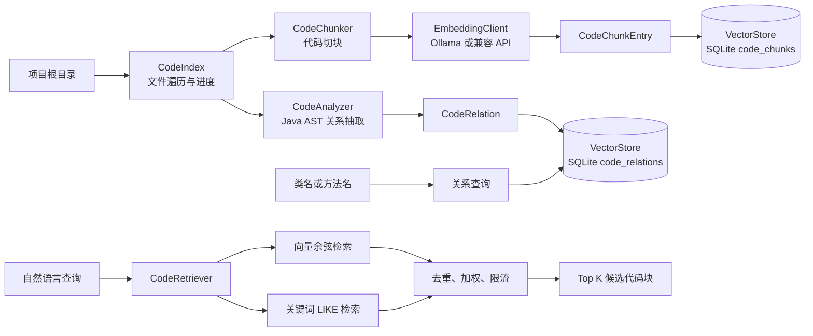
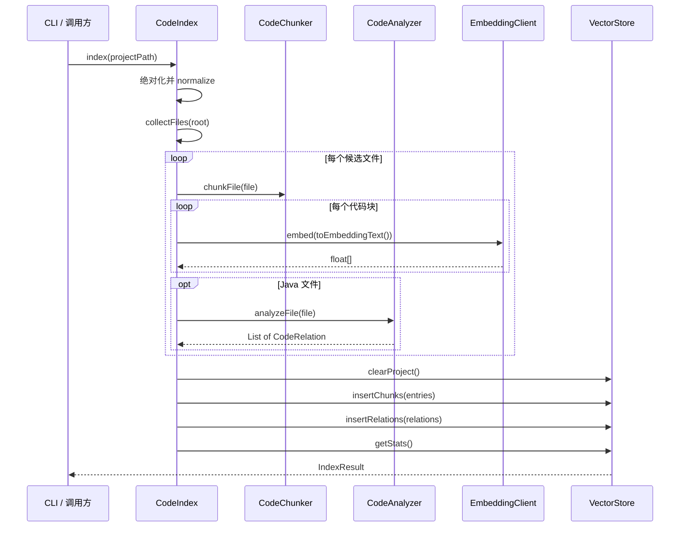
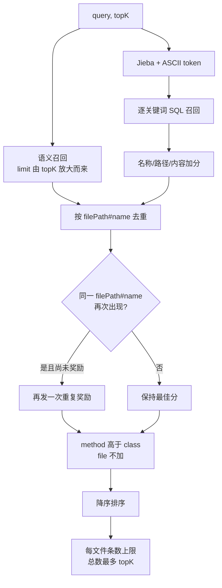

# 代码库 RAG 与关系图谱

> 本文以当前代码实际行为为准，说明代码索引、混合检索和静态关系查询如何实现。它不是对"通用 RAG"概念的泛讲，也不会把未来可选的向量数据库、增量索引或符号解析能力写成已经交付的功能。凡标注数值均为便于定位的行为描述，具体常量以源码为准。

## 1. 功能定位

`CodeIndex` + `CodeRetriever` 是 CodeAgent 面向"用户只知道描述、不知道符号名"场景的辅助召回层：索引端遍历项目白名单源码文件，对 Java 用 AST 切出类块和方法块、对其他文本按字符预算沿行分段，为每个块生成 Embedding 并写入 SQLite；同时用 JavaParser 抽取 imports、extends、implements、contains、calls 五类静态关系写入独立表。查询端 `CodeRetriever.hybridSearch` 融合语义检索与关键词检索，按文件路径与名称去重、加权、限制单文件条数后返回 Top K，关系图则提供一跳导航线索。它**不替代** `grep_code` / `glob_files` / `read_file` 的精确定位，而是为模糊问题补充候选。

- 索引入口：`CodeIndex.index(String)` — `src/main/java/com/codeagent/rag/CodeIndex.java:57`
- 混合检索入口：`CodeRetriever.hybridSearch(String, int)` — `src/main/java/com/codeagent/rag/CodeRetriever.java:50`
- 语义 / 关键词检索：`CodeRetriever.semanticSearch` — `CodeRetriever.java:35`；`CodeRetriever.keywordSearch` — `CodeRetriever.java:43`
- 关系图查询：`CodeRetriever.getRelationGraph` — `CodeRetriever.java:152`；`VectorStore.getOutgoingRelations` — `src/main/java/com/codeagent/rag/VectorStore.java:255`
- CLI 入口：`/index` — `src/main/java/com/codeagent/cli/Main.java:721`；`/search` — `Main.java:733`；`/graph` — `Main.java:757`
- Agent 工具：`search_code` 注册 — `src/main/java/com/codeagent/tool/ToolRegistry.java:578`

## 2. 设计意图

### 2.1 文件级索引粒度过粗

如果把整个源码文件作为一个向量，大文件中多个职责会被压成同一个语义表示。查询某个具体方法时，类的其他成员会稀释有效信号，而且整个文件容易超过 Embedding 模型输入限制。

当前实现对 Java 使用 AST 切出类级和方法级代码块，对其他文本文件按字符预算沿行边界分段。这样既保留局部语义，又能返回文件、类型和成员名称。

### 2.2 纯语义检索会丢失代码标识符

自然语言向量适合召回概念相近的代码，但 `ConversationHistoryCompactor`、`runTurn`、`CODEAGENT_RUNTIME_DIR` 这类标识符本身是极强信号。只依赖向量可能把拼写精确的结果排在相似概念之后。

当前实现将语义检索和关键词检索合并，针对名称、路径、内容、代码块类型以及重复命中分别加权。

### 2.3 相似代码不等于结构相关代码

Embedding 能回答"看起来像什么"，不能可靠回答"谁实现了这个接口""这个类包含哪些方法""哪个方法调用了这个名字"。因此索引阶段额外使用 JavaParser 抽取静态关系，并写入独立关系表。

### 2.4 索引必须与项目隔离

多个项目共用同一个 SQLite 文件，但每条代码块和关系都带规范化后的 `project_path`。查询和清理都以该字段过滤，避免不同项目的结果混在一起。

## 3. 总体架构与关键流程

### 3.1 总体架构



架构按职责分为五层：

| 层次 | 核心类 | 职责 | 不负责什么 |
|---|---|---|---|
| 编排层 | `CodeIndex` | 遍历文件、调用切块和分析、生成向量、统一持久化 | 不理解具体 AST 节点 |
| 结构层 | `CodeChunker` | 把文件变成可检索代码块 | 不生成向量、不排序 |
| 分析层 | `CodeAnalyzer` | 从 Java AST 抽取静态关系 | 不做类型解析和运行时追踪 |
| 存储层 | `VectorStore` | SQLite 表、事务写入、余弦计算、关键词和关系查询 | 不是专用 ANN 向量数据库 |
| 检索层 | `CodeRetriever` | 组合语义和关键词结果并重排 | 不读取最新磁盘源码验证结果 |

### 3.2 核心数据模型

`CodeChunk`（`src/main/java/com/codeagent/rag/CodeChunk.java:13-14`）字段为 `filePath`、`chunkType`（`file`/`class`/`method`）、`name`、`content`、`startLine`、`endLine`。

`toEmbeddingText()`（`CodeChunk.java:42-44`）不只发送源码正文，而是拼成 `[类型:名称] 内容`。这是一个轻量的元数据注入：即使方法体本身没有出现方法名，向量仍能携带成员身份。

`CodeChunkEntry`（`VectorStore.java:347`）把 `CodeChunk` 与 `float[] embedding` 绑定，只在索引写入阶段使用，避免领域对象依赖向量生成过程。

`SearchResult`（`VectorStore.java:352-353`）保存文件路径、块类型、名称、内容和 `similarity`。这里的 `similarity` 在混合检索后不再是纯余弦值，而是"余弦或关键词基础分 + 多项业务加权"的综合排序分，适合排序，不能解释为严格概率，也不能拿固定阈值跨模型比较。

`CodeRelation`（`CodeRelation.java:12-13`）由 `fromFile`、`fromName`、`toFile`、`toName`、`relationType` 构成。目标文件经常为 `null`，因为当前实现没有符号求解器。

### 3.3 索引端到端调用链



入口把字符串路径转换为绝对路径并 `normalize()`（`CodeIndex.java:58`）。路径不存在时直接返回块数和关系数都为 0 的 `IndexResult` 并报告错误（`CodeIndex.java:59-63`），而不是继续创建空索引。当前只检查"是否存在"，没有在入口显式检查"是否为目录"。

先 `collectFiles` 形成完整文件列表（`CodeIndex.java:67-69`），再逐文件处理；进度在每处理若干文件或处理到最后一个时输出（`CodeIndex.java:79-81`）。代价是超大仓库需要先在内存保存所有 `Path`。

切块、Embedding 或 Java 分析发生异常时，异常在**文件粒度**被捕获，记录警告后继续处理其他文件（`CodeIndex.java:97-101`）。因此单个乱码文件、临时网络问题或 AST 解析问题不会终止整次扫描。但注意这会产生"部分索引"：`IndexResult` 没有 `partial` 字段，最终只报告成功写入的块数和关系数，用户需从进度输出或日志判断哪些文件失败。

扫描阶段先在内存积累全部 `CodeChunkEntry` 和 `CodeRelation`，最后打开 `VectorStore` 统一写入（`CodeIndex.java:105-108`）：`clearProject()` → `insertChunks()` → `insertRelations()`。仓库规模上升时，正文和向量都堆在内存中，峰值内存会成为限制。

### 3.4 文件遍历策略

`collectFiles`（`CodeIndex.java:129-174`）在 `preVisitDirectory` 中按目录名硬编码排除常见非代码目录，并跳过所有以 `.` 开头的目录（`CodeIndex.java:136-141`）；在 `visitFile` 中只把后缀命中白名单的文件加入列表（`CodeIndex.java:150-158`）。`visitFileFailed` 返回 `CONTINUE`，单文件读取失败不阻断扫描（`CodeIndex.java:165-167`）。

边界是：规则不读 `.gitignore`，用户自定义生成目录若不在名单内仍会被索引；隐藏目录中的有效源码也会被排除。白名单不是内容嗅探，后缀正确但实际为二进制的文件会在 `Files.readString` 时失败，再由文件级容错跳过。

### 3.5 代码切块设计

**非 Java 文件**（`CodeChunker.chunkLargeText` — `CodeChunker.java:50-78`）：不超过字符上限时整个文件作为单个 `file` 块（`CodeChunker.java:51-53`）；超过上限时按换行分段，段名为 `filePath + "#" + segIndex`（`CodeChunker.java:62-64`、`72-75`）。选择按行而不是固定字符切割，是为了避免从语句或配置行中间截断。

**Java 文件**（`CodeChunker.chunkJavaFile` — `CodeChunker.java:80-125`）：JavaParser 使用 Java 17 语言级别（`CodeChunker.java:25-26`），解析成功后遍历所有 `ClassOrInterfaceDeclaration`：为每个类或接口生成一个 `class` 块（`CodeChunker.java:101-103`），并为每个直接方法生成 `method` 块（`CodeChunker.java:112-115`）。类块内容只取声明头部，方法实现由方法块负责，减少大面积重复。

**解析失败降级**（`CodeChunker.java:84-87`）：解析失败或没有 CompilationUnit 时退回按行文本切块；AST 成功但没有类或接口时同样回退（`CodeChunker.java:120-122`）。一个尚未编译通过的源码文件仍有机会通过关键词或语义被搜到。

需要区分两个不同的字符上限：`CodeChunker` 的分段预算只直接约束文本分段，Java 方法块没有二次分段，超长方法可以完整保存在 SQLite 中；真正发送给 Embedding API 时，`EmbeddingClient` 另有一次输入截断（`EmbeddingClient.java:41`、`EmbeddingClient.java:52-54`）。这意味着超长方法后半部分不参与向量计算，但仍可被 SQL 关键词检索命中。

### 3.6 静态关系抽取

`CodeAnalyzer.analyzeFile`（`src/main/java/com/codeagent/rag/CodeAnalyzer.java:38`）解析失败时返回空关系列表而不抛错（`CodeAnalyzer.java:43-46`）。五类关系：

| 类型 | 来源 | 实现位置 | 示例语义 |
|---|---|---|---|
| `imports` | `ImportDeclaration` | `CodeAnalyzer.java:59-69` | 当前文件导入某个非 JDK 类型；过滤 `java.*` / `javax.*`，`fromName` 写为 `file` |
| `extends` | 类的 extended types | `CodeAnalyzer.java:76-79` | `Child` 继承 `Parent` |
| `implements` | 类的 implemented types | `CodeAnalyzer.java:82-85` | `ServiceImpl` 实现 `Service` |
| `contains` | 类的方法声明 | `CodeAnalyzer.java:88-92` | `Agent` 包含 `Agent.run`（只使用方法名，不含重载签名） |
| `calls` | `MethodCallExpr` | `CodeAnalyzer.java:95-104` | 向父节点回溯最近 `MethodDeclaration`，生成 `调用者类.方法 -> 被调用方法名` |

该策略简单、低成本，但存在明确边界：不使用 JavaParser Symbol Solver；不解析接收者类型；只保存被调用方法的简单名称；同名方法无法消歧；反射、动态代理、方法句柄和运行时分派无法识别；构造器调用不属于 `MethodCallExpr`；字段访问和数据流也不在关系模型中。因此准确表述应是"基于 AST 的轻量静态关系图"，不能称为完整调用图或知识图谱推理引擎。

### 3.7 Embedding 生成

`EmbeddingClient`（`src/main/java/com/codeagent/rag/EmbeddingClient.java`）按 provider 分流（`EmbeddingClient.java:56-60`）：

| Provider | 请求端点 | 请求字段 | 鉴权 |
|---|---|---|---|
| Ollama | `/api/embeddings`（`EmbeddingClient.java:63-64`） | `model`、`prompt` | 默认无 Bearer Token |
| OpenAI 兼容 | `/embeddings`（`EmbeddingClient.java:85-86`） | `model`、`input` | 可选 Bearer Token |

`openai`、`zhipu`、`glm` 走兼容接口，未知 provider 回退到 Ollama 路径。默认 provider 是 `ollama`，默认模型是 `nomic-embed-text:latest`（`EmbeddingClient.java:27-28`），base URL 由 `getEnv` 读取，缺省时回落到 `inferDefaultUrl(provider)`（`EmbeddingClient.java:29`）。配置读取顺序是系统环境变量优先，再读取同名 Java system property，最后使用默认值（`EmbeddingClient.java:140-150`）。

OkHttp 连接超时为 30 秒、读取超时为 120 秒（`EmbeddingClient.java:16-19`）。非 2xx、空响应体、响应 JSON 缺少向量数组都会抛出 `IOException`（`EmbeddingClient.java:74-75`、`121-127`）。空输入直接返回长度为 0 的向量（`EmbeddingClient.java:47-49`）。当前没有在表里记录 provider、模型名或维度，也没有索引版本校验；切换模型后应重新执行索引。

### 3.8 SQLite 存储设计

数据库默认位于 `~/.codeagent/rag/codebase.db`，可用 system property `codeagent.rag.dir` 修改目录（`VectorStore.java:24-31`）。多个项目共用同一个文件，通过规范化的项目绝对路径隔离。

`code_chunks` 表（`VectorStore.java:37-48`）：

| 列 | 类型 / 约束 |
|---|---|
| `id` | `INTEGER PRIMARY KEY AUTOINCREMENT` |
| `project_path` | `TEXT NOT NULL` |
| `file_path` | `TEXT NOT NULL` |
| `chunk_type` | `TEXT NOT NULL` |
| `name` | `TEXT NOT NULL` |
| `content` | `TEXT NOT NULL` |
| `embedding_json` | `TEXT`（可空） |
| `created_at` | `TIMESTAMP DEFAULT CURRENT_TIMESTAMP` |

`code_relations` 表（`VectorStore.java:51-62`）：

| 列 | 类型 / 约束 |
|---|---|
| `id` | `INTEGER PRIMARY KEY AUTOINCREMENT` |
| `project_path` | `TEXT NOT NULL` |
| `from_file` | `TEXT NOT NULL` |
| `from_name` | `TEXT NOT NULL` |
| `to_file` | `TEXT`（可空） |
| `to_name` | `TEXT`（可空） |
| `relation_type` | `TEXT NOT NULL` |
| `created_at` | `TIMESTAMP DEFAULT CURRENT_TIMESTAMP` |

索引（`VectorStore.java:65-70`）：`code_chunks` 上建 `idx_project`、`idx_file`、`idx_type`；`code_relations` 上建 `idx_rel_project`、`idx_rel_from`、`idx_rel_to`。

向量以 JSON 数组保存，而不是 SQLite 二进制或向量扩展。这让实现只依赖 JDBC 和 Jackson，便于本地部署和调试；代价是存储体积较大，查询时需要逐行反序列化。

写入事务：`insertChunks`（`VectorStore.java:102-127`）和 `insertRelations`（`VectorStore.java:132-157`）各自关闭自动提交、执行 JDBC batch、成功后 commit、失败后 rollback，并在 finally 恢复原 autoCommit 状态。但整个"清理旧索引 + 写代码块 + 写关系"**不是一个总事务**：`clearProject()`（`VectorStore.java:87-97`）先独立执行，随后两个插入各自提交。因此清理成功但写入失败会留下空索引，代码块写入成功但关系写入失败会留下只有代码块的新索引；当前没有双缓冲，也没有版本表可回滚。

### 3.9 语义检索

`VectorStore.search`（`VectorStore.java:162-190`）读取当前项目的全部代码块，跳过空向量（`VectorStore.java:171-173`），把 `embedding_json` 反序列化为 `float[]`，在 JVM 内计算查询向量与每个候选向量的余弦相似度，按分数降序排序（`VectorStore.java:188`），截取 Top K（`VectorStore.java:189`）。

`cosineSimilarity`（`VectorStore.java:303-319`）带两处显式守卫：两端维度不同时直接返回 0、不抛异常（`VectorStore.java:304-306`）；任一向量范数为 0 时返回 0（`VectorStore.java:315-317`）。这是 O(N × D) 的精确全扫描，其中 N 是当前项目代码块数，D 是向量维度。对几百到几千块的本地项目实现简单且足够；大仓库需要 ANN 索引、分片或专用向量存储。

### 3.10 关键词检索与查询分词

关键词路径不调用 Embedding，而是在当前项目内用参数化 SQL 匹配 `name` 或 `content`（`VectorStore.java:196-199`）。`%`、`_` 和反斜杠先转义再拼 LIKE 模式（`VectorStore.java:201`），避免用户输入意外改变匹配范围。每个命中项的初始分数是一个固定的关键词基础分（`VectorStore.java:215`）。由于 SQL 本身没有直接匹配 `file_path`，"仅路径命中但名称和正文不命中"的块不会被召回，路径加分只作用于已经由名称或正文召回的候选。

`RagQueryTokenizer`（`src/main/java/com/codeagent/rag/RagQueryTokenizer.java:26-50`）先用 Jieba 分词，再用 ASCII 正则额外提取 `[A-Za-z][A-Za-z0-9_.$-]{1,}` 形式的标识符（`RagQueryTokenizer.java:21`），最后用 `LinkedHashSet` 去重并保持发现顺序。`isUsefulToken`（`RagQueryTokenizer.java:52-68`）会丢弃过短的 token，并过滤一组低信息停用词；`isMeaningful`（`RagQueryTokenizer.java:70-74`）还要求 token 至少包含一个汉字或字母数字。两路提取很重要，因为中文分词器未必会完整保留驼峰类名或 `foo.bar` 形式，ASCII 正则可以补回这些强信号。

### 3.11 混合检索与重排



`hybridSearch`（`CodeRetriever.java:50-82`）的执行顺序与关键点：

1. **语义候选集**：语义阶段的 limit 不是直接取最终数量，而是按 `topK` 的一个倍数放大、并与一个固定下限取较大值（`CodeRetriever.java:55`），给后续融合和限流留出候选。
2. **语义结果合并**（`CodeRetriever.java:56-58`）。
3. **关键词召回**：对分词结果逐个关键词做 LIKE 查询并加权（`CodeRetriever.java:61-66`）。
4. **去重键**：`filePath#name`（`CodeRetriever.java:86`）。同一代码块被多次召回时只保留一个结果。
5. **重复命中奖励**：同一键再次出现时先取两次分数的最大值，再额外加分；`dualMatchBonused`（`CodeRetriever.java:52`）保证该奖励每个键只发一次。**注意这里只判断"键是否重复"，不区分来源**——语义 + 关键词、或两条语义命中（如重载方法），都会触发。
6. **关键词加权**：见 `boostKeywordMatch`（`CodeRetriever.java:103-128`）。名称命中权重最高、路径与内容命中并列次之，具体数值见源码。设计上把总分控制在关键词基础分之上、且不超过语义分上限，避免关键词结果压过强语义结果。
7. **类型奖励**：方法块高于类块，文件块不加（`CodeRetriever.java:71-75`）。原因是"怎么实现"类问题通常由具体方法或类声明更直接回答。
8. **排序与每文件限流**：降序排序后调用 `limitPerFile`（`CodeRetriever.java:80-81`、`133-147`），对每个文件设置条数上限，防止一个大类的多个相似方法占满全部 Top K。该规则提高覆盖面，但可能丢掉同一核心文件中的其他高价值方法。

这里不是简单把"语义分 + 所有关键词分"无条件相加：合并逻辑先取已存在分与候选分的最大值，再只发一次重复奖励。因此 `similarity` 只用于当前候选集排序。

### 3.12 关系图查询与结果展示

`getRelationGraph(name)` 查询 `from_name = name OR to_name = name`（`VectorStore.java:226-250`），返回与指定名称直接相连的一跳关系。`getOutgoingRelations(name)` **只按 `from_name` 过滤**（`VectorStore.java:255-259`），不匹配 `to_name`。当前没有多跳遍历、环检测、路径搜索、模糊名称匹配、包名和重载消歧，也没有与向量结果自动联动展开邻居。

如果用户输入 `Agent.run`，关系表中 calls 起点可能命中；如果输入完整方法签名，而关系只保存方法名，则不会自动归一化。调用方需要先从代码块名称提取适合图查询的名字。

检索结果展示由 `SearchResultFormatter` 承担（`src/main/java/com/codeagent/rag/SearchResultFormatter.java:16`）：`formatForCli`（`SearchResultFormatter.java:21-39`）与 `formatForTool`（`SearchResultFormatter.java:41-59`）都会先输出一段不含额外 LLM 调用的简短摘要（`buildSummary` — `SearchResultFormatter.java:61-94`），再逐条打印 `[类型:名称]`、相似度和路径。CLI `/search` 用 `formatForCli`（`Main.java:750`），Agent 工具 `search_code` 用 `formatForTool`（`ToolRegistry.java:607`）。

### 3.13 典型场景推演

**场景一："上下文快满时在哪里压缩"**

1. `search_code` 把自然语言发送到 `CodeRetriever.hybridSearch`（`ToolRegistry.java:602`）。
2. 语义召回找到 `ConversationHistoryCompactor` 和 `MemoryManager`。
3. "上下文、压缩"等中文关键词补充正文命中。
4. method/class 类型得到加分。
5. 每文件条数上限避免一个文件占满列表。
6. Agent 再用 `read_file` 查看 `compactIfNeeded`（`ConversationHistoryCompactor.java:77`）和调用方 `Agent.maybeCompactHistory`（`src/main/java/com/codeagent/agent/Agent.java:323`）。

检索负责缩小候选集，最终结论仍来自源码阅读。

**场景二："谁实现了某接口"**

先按接口名查询关系图，查找 `relation_type = implements` 且 `to_name` 等于接口简单名的边，得到实现类名称和源文件，再用 `read_file` 验证类声明。如果实现通过外部库、生成代码或解析失败文件提供，当前关系图可能没有记录。

**场景三："某个方法被谁调用"**

查询目标方法的简单名称，找到 `calls` 关系中相同 `to_name` 的边，将所有结果视为候选调用者，再回到源码核对接收者类型和重载。因为 calls 不做符号解析，同名方法会产生假阳性，不能直接据此实施重构。

## 4. 设计意图 vs 实际实现

以下是文档意图与代码实际行为存在差异的地方。每条给出源码位置，具体数值以源码为准。

| 主题 | 设计意图 | 实际实现 | 源码位置 |
|---|---|---|---|
| 类块行范围 | 类块"取声明开始处到后 5 行" | `extractLines` 的循环是**闭区间**（起点 `startLine - 1`、条件 `i < endLine`），因此实际包含起始行，行数比标签描述多一行；同时又用 `Math.min(classStart + N, classEnd)` 按类结束行截断 | `CodeChunker.java:98`、`CodeChunker.java:127-135` |
| 代码块行号 | 以为 `startLine`/`endLine` 在切块时统一计算并贯穿使用 | class/method 块确实带真实起止行（`CodeChunker.java:101-103`、`112-115`），但**整文件文本块硬编码两个字段都为 0**（`CodeChunk.java:20`）；且两字段都不入库，查询结果拿不到行号 | `CodeChunk.java:19-21`、`VectorStore.java:37-48` |
| 查询停用词 | 文档只列了少数几个低信息词 | `isUsefulToken` 实际过滤的停用词集合更大，还额外丢弃过短 token，并要求 token 含汉字或字母数字；完整集合与阈值见源码 | `RagQueryTokenizer.java:52-74` |
| Embedding 默认地址 | 以为全局只有单一默认 base URL | `inferDefaultUrl` 按 provider 返回**不同**默认：`zhipu`/`glm` 落到智谱开放平台地址，`ollama` 与未知 provider 才落到本地地址；`EMBEDDING_BASE_URL` 可覆盖 | `EmbeddingClient.java:29`、`EmbeddingClient.java:132-138` |
| 重复命中的加分 | 流程图标注为"双路命中"，语义 + 关键词各一路 | `mergeResult` 只判断同一个 `filePath#name` 键是否第二次出现，**与来源无关**：两条语义命中（如重载方法）同样会触发；奖励由 `dualMatchBonused` 保证每个键只发一次 | `CodeRetriever.java:84-101`（键 `:86`、发放 `:93-96`） |
| `code_chunks` 表结构 | 只笼统说"主键、项目路径、文件路径、类型、名称、正文、向量 JSON、时间" | 精确列为 `id` / `project_path` / `file_path` / `chunk_type` / `name` / `content` / `embedding_json` / `created_at`，`embedding_json` 可空 | `VectorStore.java:37-48` |
| `code_relations` 表结构 | 只笼统说"两端文件和名称、类型、时间" | 精确列为 `id` / `project_path` / `from_file` / `from_name` / `to_file` / `to_name` / `relation_type` / `created_at`，`to_file`/`to_name` 可空 | `VectorStore.java:51-62` |
| 索引 | 文档未列索引名 | 实际建立 `idx_project`、`idx_file`、`idx_type`（均在 `code_chunks`）与 `idx_rel_project`、`idx_rel_from`、`idx_rel_to`（均在 `code_relations`） | `VectorStore.java:65-70` |
| 关键词评分权重 | 文档只说"名称、路径、内容、双路命中分别加权" | 关键词命中以一个固定基础分起算（`VectorStore.java:215`）；`boostKeywordMatch` 中名称命中权重最高、文件路径与内容命中并列次之，实现为多个 `if` 累加 | `CodeRetriever.java:103-128` |
| 类型奖励 | 文档写 method/class 加分 | 常量以 `switch` 内联在 `hybridSearch` 中，method 高于 class，file 记 0 | `CodeRetriever.java:71-75` |
| 语义候选上限 | 文档写为 `max(topK*2, 10)` | 关系是"按 `topK` 的一个倍数放大，并与一个固定下限取较大值" | `CodeRetriever.java:55` |
| 文本分段命名与 endLine | 文档写段名为 `filePath#序号` | 命名确认如此；但**提前收尾的分段把 `endLine` 写成"触发溢出的那一行的索引（从 0 计数）"**，而最后一段写 `lines.length`，两者口径不一致 | `CodeChunker.java:62-64`、`CodeChunker.java:72-75` |
| 结果格式化 | 文档未提该组件 | 存在 `SearchResultFormatter`（CLI 与 tool 两种格式），并有对应单测 | `SearchResultFormatter.java:21`、`SearchResultFormatter.java:41`、`SearchResultFormatterTest.java:11` |
| 出边查询 | 文档写"只查询从该名称出发的边" | 确认 SQL 仅按 `from_name` 过滤，不匹配 `to_name` | `VectorStore.java:255-259` |
| 余弦计算守卫 | 文档只写"任一向量范数为 0 返回 0" | 还有显式的**维度一致性守卫**：两端维度不同直接返回 0，不抛异常 | `VectorStore.java:303-317` |
| 文件收集 | 文档描述排除目录与后缀白名单 | 确认 `collectFiles` 用目录名硬编码排除 + 后缀白名单；不读 `.gitignore`，以 `.` 开头的目录一律跳过 | `CodeIndex.java:129-174`（排除 `:136-141`、白名单 `:150-158`） |

## 5. 设计取舍

### 5.1 SQLite JSON 向量 vs 专用向量库

当前选择 SQLite 是为了零额外服务、本地单文件持久化和部署简单。几千块规模下全扫描可接受，也方便直接检查数据。

代价是 O(ND) 查询、JSON 反序列化成本和缺少 ANN。达到数万或更多代码块时，应迁移到 sqlite-vec、pgvector、Milvus、Qdrant 或其他向量能力，而不是继续微调 JVM 排序。

### 5.2 AST 切块 vs 固定窗口

AST 切块保留类和方法边界，结果更适合代码问答；固定窗口支持所有语言、对语法错误更稳。当前方案只对 Java 使用 AST，其他语言统一文本分段，在语言深度与实现范围之间取平衡。

### 5.3 轻量关系 vs 完整符号图

简单 AST 遍历成本低，不要求构建 classpath，也能提供 imports/extends/implements/contains/calls 导航。缺点是同名歧义和目标文件缺失。

如果引入 JavaParser Symbol Solver，需要处理 Maven 依赖、源码集、生成代码和解析失败，准确度提高但初始化复杂度显著增加。

### 5.4 全量重建 vs 增量索引

全量重建逻辑确定，不需要维护文件哈希、删除检测和版本迁移，适合手动 `/index`。缺点是重复 Embedding 和发布窗口不原子。

增量方案至少需要文件内容哈希、模型版本、块稳定 ID、已删除文件清理和事务发布，不能只按修改时间盲目追加。

### 5.5 RAG vs 实时代码探索

RAG 擅长模糊语义召回，但索引可能过期；实时 `grep_code` 精确且反映当前磁盘，但要求用户或模型已有关键词。项目将两者定义为互补能力，而不是让 RAG 接管所有代码定位。

## 6. 失败与边界矩阵

| 失败点 | 检测方式 | 当前处理 | 数据影响 |
|---|---|---|---|
| 项目路径不存在 | `Files.exists` 检查 | 返回 0/0 的 `IndexResult` 并报错 | 不打开数据库 |
| 单文件无法读取 | `visitFileFailed` 返回 `CONTINUE` | 跳过并继续遍历 | 该文件缺失 |
| Java AST 解析失败 | `ParseResult.isSuccessful` | 切块退回文本分段，关系返回空 | 正文仍可检索，但无关系 |
| 某块 Embedding 失败 | 文件级 `catch` | 跳过当前文件后续处理 | 可能留下该文件前面已生成的块 |
| Embedding 非 2xx / 响应格式错误 | `postJson` 抛出 `IOException` | 向上冒泡，本次文件或查询失败 | 该次索引或查询失败 |
| 查询向量维度不一致 | `cosineSimilarity` 维度守卫 | 相似度返回 0 | 语义排序失真 |
| 向量范数为 0 | `cosineSimilarity` 零向量守卫 | 相似度返回 0 | 该候选得分失真 |
| clear 成功、insert 失败 | 分步提交 | 返回持久化失败 | 旧项目索引可能已清空 |
| 关系写入失败 | 独立事务 | 代码块可能已提交 | 图数据缺失 |
| 语义检索时 Embedding 服务不可用 | `hybridSearch` 先执行语义路径 | 异常直接向上抛出，不自动降级关键词 | 本次混合检索失败 |
| 空查询 | `EmbeddingClient.embed` 空输入 | 返回空向量 | 相似度多为 0 |
| `topK` 非正数 | 检索器入口未统一校验 | 调用方需传正整数 | 可能触发截取边界问题 |
| 超长单行 | 文本分段 | 单行本身无法再拆，块可能超预算 | 向量输入被截断，存储正文完整 |
| 两个同名方法 | calls 关系 | 目标无法消歧 | 图查询假阳性 |

## 7. 测试策略与证据

### 7.1 已存在的单测覆盖（经核对）

- `CodeChunkerTest`（`src/test/java/com/codeagent/rag/CodeChunkerTest.java:11`）：断言 `.java` 文件切出 class 块和 method 块，以及 `toEmbeddingText()` 的 `[class:名称]` 格式（`CodeChunkerTest.java:26-50`）。注意该用例输入的仍是 `.java` 文件，**并未真正覆盖非 Java 文本分段路径**。
- `CodeAnalyzerTest`（`CodeAnalyzerTest.java:11`）：对示例类断言 extends、implements、contains、imports 四类关系（`CodeAnalyzerTest.java:22-38`）；**未断言 calls**。
- `VectorStoreTest`（`VectorStoreTest.java:12`）：插入与向量搜索（`:32-54`）、关键词搜索（`:57-65`）、关系存储与 `getRelations`（`:68-75`）、`clearProject`（`:78-85`）。
- `CodeRetrieverTest`（`CodeRetrieverTest.java:12`）：验证自然语言查询中的代码关键词会把目标方法提升到首位（`CodeRetrieverTest.java:32-63`）。
- `CodeIndexTest`（`CodeIndexTest.java:10`）：不存在路径返回 0/0（`:13-18`）、索引测试资源目录（`:20-28`）、进度监听器收到开始/发现/完成消息（`:30-41`）。
- `SearchResultFormatterTest`（`SearchResultFormatterTest.java:9`）：CLI 输出包含"搜索摘要"与首条结果（`:11-28`）。
- `EmbeddingClientTest`（`EmbeddingClientTest.java:7`）：默认 provider/模型、自定义配置、空输入返回空数组（`:9-29`）。

### 7.2 回归命令

```bash
mvn test -Dtest=CodeChunkerTest,CodeAnalyzerTest,VectorStoreTest,CodeIndexTest,CodeRetrieverTest,SearchResultFormatterTest,EmbeddingClientTest
```

### 7.3 尚未覆盖、值得补测的边界

- 非 Java 文本超预算分段的段名与行号口径。
- Java 17 新语法、AST 失败回退、嵌套类和方法重载。
- calls 关系、JDK import 过滤、重载同名歧义。
- 两个项目的数据隔离、LIKE 通配符转义、batch 中途失败回滚。
- 重复命中奖励只发一次、每文件条数上限、method/class 类型奖励。
- Embedding 维度不一致与空向量的返回行为。
- 真实 Embedding 服务相关的集成测试应注入确定性 fake client 并使用临时数据库目录，避免环境依赖。

## 8. 面试讲解模板

### 8.1 30 秒版

我为 Java Agent CLI 实现了本地代码库 RAG。索引端用 JavaParser 按类和方法切块，同时抽取继承、实现、导入、包含和方法调用关系；通过可配置的 Ollama 或 OpenAI 兼容 Embedding 生成向量，存入 SQLite。查询端融合余弦语义检索和关键词检索，并对名称命中、代码块类型和重复召回加权，再限制单文件条数。这个能力定位为模糊语义辅助，精确定位仍使用实时代码搜索。

### 8.2 2 分钟版

这个模块解决的是用户不知道准确符号名时如何找到实现。入口 `CodeIndex` 遍历白名单源码文件，Java 文件由 `CodeChunker` 使用 Java 17 AST 生成类块和方法块，解析失败退回按行文本分段；`CodeAnalyzer` 在同一 AST 思路下提取五类静态关系。每个块把类型和名称与源码一起送入 Embedding，向量和正文写入 SQLite，关系写入独立表，向量以 JSON 保存以换取零运维部署。

查询时先按 `topK` 放大语义候选集，再用 Jieba 和 ASCII 正则提取关键词执行 LIKE 检索。结果按 `filePath#name` 去重，名称、路径、正文、重复召回以及 method/class 类型分别加分，最后对每个文件限制条数。当前向量在 JVM 内全量计算余弦，所以适合本地中小仓库；它的优势是部署简单，边界是大规模性能、索引发布非原子（clear、块、关系分步提交）、关系没有符号求解以及混合查询没有 Embedding 失败降级。

## 9. 高频面试问答

### Q1：为什么不直接把整个文件做 Embedding？

大文件包含多个职责，会稀释具体方法的语义，而且容易超过模型输入限制。类和方法粒度让结果更聚焦，也能把成员名称加入向量文本。

### Q2：为什么同时需要关键词检索？

代码标识符是精确信号，向量模型可能弱化大小写、拼写和特殊符号。关键词路径能把类名、方法名和配置键直接召回，再与语义结果融合。

### Q3：混合分数是概率吗？

不是。它是余弦值或关键词基础分叠加业务奖励后的排序分，只用于当前候选集排序，不能当成置信概率跨模型比较。

### Q4：为什么每个文件要限制结果条数？

避免一个大文件的相似方法占满 Top K，提高跨文件覆盖率。代价是可能丢掉同文件的其他高分方法，这是召回多样性与局部完整性的取舍。

### Q5：关系图准确吗？

它是轻量静态近似。extends、implements、contains 相对直接，imports 无法区分项目与第三方类型，calls 只记录简单方法名，没有接收者类型和重载消歧，必须回读源码验证。

### Q6：为什么使用 SQLite？

目标是本地 CLI 的零运维持久化。SQLite 单文件、JDBC 成熟、便于调试；在几千代码块规模下全扫描可以接受。规模扩大后再换 ANN 或专用向量库。

### Q7：索引是否原子更新？

不是。`clearProject`、代码块 batch 和关系 batch 是分开的提交边界（`VectorStore.java:87-97`、`102-127`、`132-157`）。中途失败可能清掉旧索引或留下只有代码块的状态。更可靠的方案是版本化写入后原子切换 active version。

### Q8：Embedding 服务不可用时会自动走关键词吗？

单独的关键词 API（`CodeRetriever.keywordSearch` — `CodeRetriever.java:43`）不依赖 Embedding，但当前 `hybridSearch` 先调用语义路径（`CodeRetriever.java:56`），语义异常会直接终止，并没有自动降级。要增强时应隔离两路异常并返回降级元数据。

### Q9：如何处理源码语法错误？

Java AST 切块失败时退回文本分段（`CodeChunker.java:84-87`），因此正文仍能进入索引；关系分析失败则返回空关系（`CodeAnalyzer.java:43-46`），不阻断其他文件。

### Q10：为什么向量以 JSON 保存？

实现简单、无需数据库扩展、可直接检查。缺点是体积和反序列化成本高，也无法使用数据库内向量索引。

### Q11：检索复杂度是多少？

语义检索读取当前项目全部向量并在 JVM 计算余弦，时间复杂度约 O(ND)，排序约 O(N log N)。适用于中小仓库，不适合超大规模在线服务。

### Q12：切换 Embedding 模型后为什么要重建？

不同模型的向量空间和维度不一致。表中当前也没有模型版本元数据，混用会导致相似度失真，或维度不一致时被守卫判为 0（`VectorStore.java:304-306`）。

### Q13：startLine/endLine 有什么用？

类块和方法块在切块阶段会写入真实起止行（`CodeChunker.java:101-103`、`112-115`），但**整文件文本块把两字段硬编码为 0**（`CodeChunk.java:20`）；而且两个字段都不持久化到 SQLite，查询结果不能直接依赖它定位行号。这是可以完善的点。

### Q14：为什么 RAG 不作为精确代码搜索首选？

RAG 依赖预索引且结果是相关性排序，可能过期或出现语义误召回。已知标识符时，实时 grep 更准确、更容易解释。

### Q15：如何做增量索引？

为文件记录内容哈希和模型版本，使用稳定块 ID 比较新增、更新、删除，只重新生成变化块的向量；写入新版本后再原子发布，不能简单追加。

### Q16：如何让 calls 更准确？

接入 JavaParser Symbol Solver，构建项目 classpath，解析接收者类型、重载签名和目标声明文件；同时要处理依赖不可用和生成源码等失败路径。

### Q17：为什么 CodeIndex 串行调用 Embedding？

串行便于控制本地模型压力和远程限流，也让进度和错误归属清晰。性能不足时可以做有界并发，但必须加 provider 限流、重试和发布原子性。

### Q18：怎样评价检索质量？

建立代码问题与期望文件/方法的 golden set，统计 Recall@K、MRR 和首条命中率；分别比较纯语义、纯关键词和混合排序，并记录不同语言和查询类型。

### Q19：当前最大的可靠性边界是什么？

索引发布不是仓库级原子事务，且 partial 文件没有结构化报告。其次是混合查询没有 Embedding 失败降级。

### Q20：当前最大的规模边界是什么？

所有向量以 JSON 存在 SQLite，查询时全量读取并在 JVM 计算余弦。块数和维度增长后，延迟、内存和反序列化成本都会线性增加。

## 10. 简历条陈与源码证据

简历原句：

> 代码库RAG与关系图谱：基于 SQLite 和 JavaParser 实现代码库 RAG 能力，将代码按文件、类、方法切分并生成 Embedding，同时抽取 imports、extends、implements、calls等代码关系，支持语义检索、关键词检索和关系图查询。

| 简历原句 | 代码证据 |
|---|---|
| 基于 SQLite | JDBC 连接 `jdbc:sqlite:` — `VectorStore.java:31`；表结构与索引 `VectorStore.java:37-70` |
| 基于 JavaParser | `CodeChunker` 与 `CodeAnalyzer` 各自构造 Java 17 级别 `JavaParser` — `CodeChunker.java:25-26`、`CodeAnalyzer.java:32-33` |
| 按文件切分 | 非 Java 整文件块 / 按行分段 — `CodeChunker.java:39-41`、`CodeChunker.java:50-78` |
| 按类、方法切分 | class 块与 method 块 — `CodeChunker.java:92-117`；块类型定义 `CodeChunk.java:19-37` |
| 生成 Embedding | `toEmbeddingText()` — `CodeChunk.java:42-44`；索引调用 `embeddingClient.embed(...)` — `CodeIndex.java:89` |
| 抽取 imports | `extractImports` — `CodeAnalyzer.java:59-69` |
| 抽取 extends / implements | `CodeAnalyzer.java:76-79`、`CodeAnalyzer.java:82-85` |
| 抽取 calls | `CodeAnalyzer.java:95-104`；包含关系 `CodeAnalyzer.java:88-92` |
| 语义检索 | `CodeRetriever.semanticSearch` — `CodeRetriever.java:35-38`；余弦全扫描 `VectorStore.java:162-190` |
| 关键词检索 | `CodeRetriever.keywordSearch` — `CodeRetriever.java:43-45`；LIKE 转义 `VectorStore.java:195-221` |
| 关系图查询 | `CodeRetriever.getRelationGraph` — `CodeRetriever.java:152-154`；一跳查询 `VectorStore.java:226-250`；出边 `VectorStore.java:255-277` |

## 11. 当前实现边界

已经实现：Java 类和方法切块、非 Java 文本分段、两类 Embedding 接口、SQLite 持久化、JVM 余弦搜索、关键词召回、混合重排、单文件限流、结果格式化及一跳关系查询。

尚未实现：仓库级原子发布、增量索引、ANN、模型版本与维度校验、混合检索自动降级、Java 符号求解、多跳图遍历和搜索结果行号持久化。

- 索引是串行执行的：`CodeIndex` 逐文件、逐块调用 Embedding（`CodeIndex.java:77-101`），大仓库耗时与块数线性增长。
- `VectorStore` 持有单个 JDBC Connection，未声明线程安全（`VectorStore.java:19`），`CodeRetriever` 应按一次检索生命周期使用并通过 `close()` 释放（`CodeRetriever.java:164-166`）。
- 索引发布非原子，`IndexResult` 缺少 `partial` 字段，无法报告哪些文件失败。
- 整文件文本块的行号为占位值，且行号未入库，检索结果不能直接用于精确定位。
- 关系图为静态近似，"calls" 不做符号求解，目标文件常为 `null`。
- 混合检索不具备 Embedding 失败后的自动关键词降级。

这组边界决定了该模块最准确的定位：它是面向本地 Agent 的轻量代码语义辅助与静态关系导航，不是大型代码搜索平台，也不是编译器级程序分析系统。
