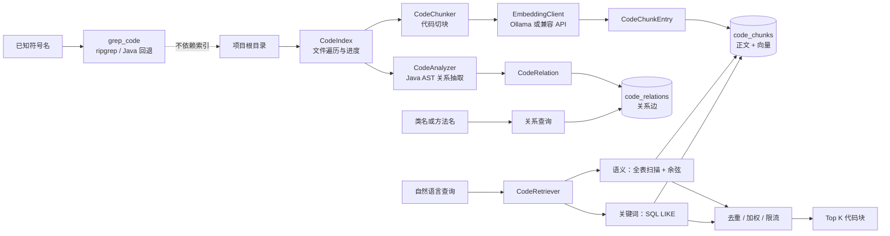
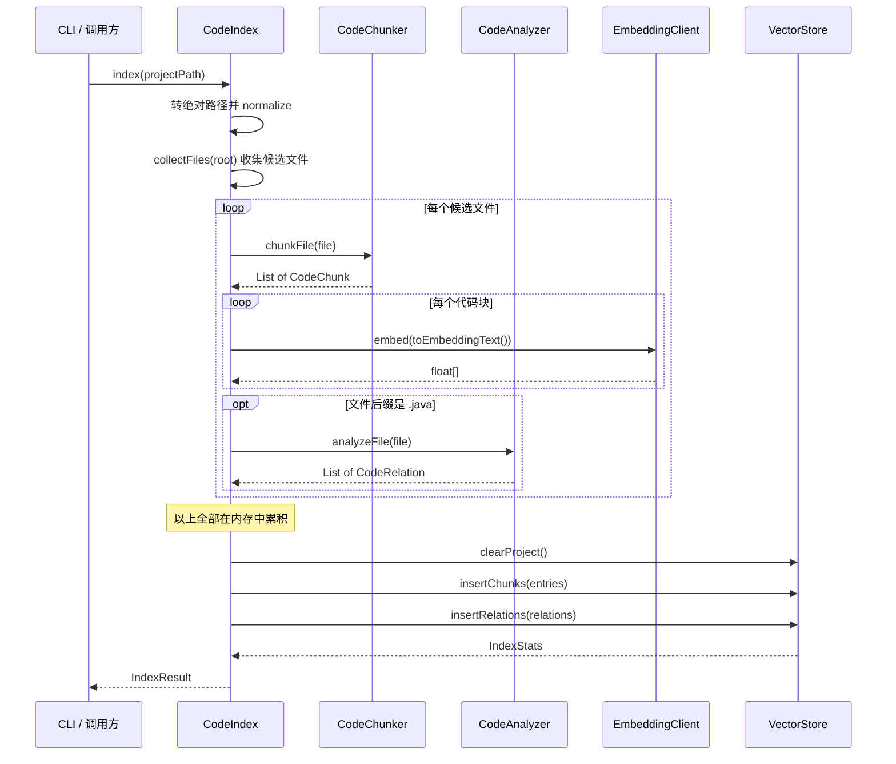
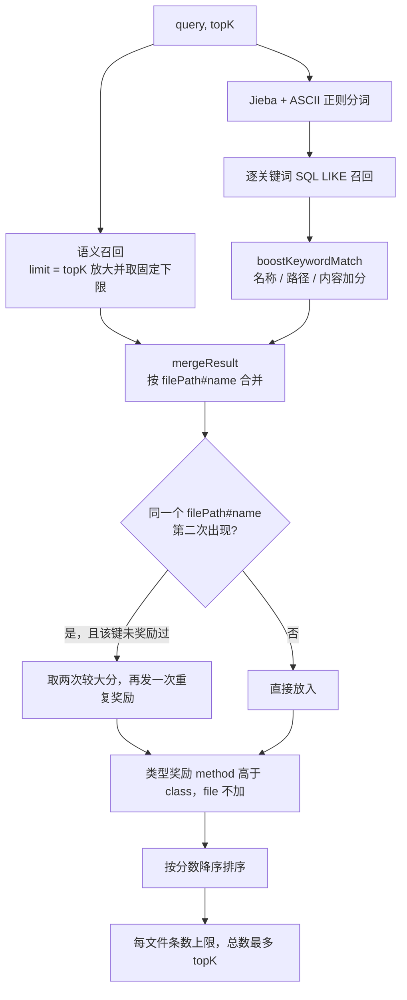

# 代码库 RAG 与关系图谱（v1 历史实现）

> 本文主体记录已冻结的 v1 行为，包含当时的外部 Embedding 依赖与 JSON 向量设计，仅供迁移和回滚分析。当前 v2 的实际架构、配置、隐私授权、增量索引与降级语义见 [20-local-first-layered-retrieval-implementation-plan.md](20-local-first-layered-retrieval-implementation-plan.md)，不得把下文 v1 描述当成现行使用说明。

> **本文怎么读**
>
> - 读者假设：会写 Java、懂工程常识，但**没有接触过 RAG、向量检索或编译器前端**。第 0 部分专门补这些前置概念，有经验的读者可以直接跳到第 1 部分。
> - 本文描述的是**代码实际做了什么**，包括"算了但没入库""定义了但没人调用"这类真实落差。它不是"通用 RAG 教程"，也不会把将来可能做的向量数据库、增量索引或符号解析写成已交付能力。
> - 所有 `file:line` 对应当前源码。正文有意**不写具体常量数值**（数值会随代码调整而过期），需要精确值时按行号自行核对。

---

# 第 0 部分　前置知识

## 0.1 这个模块要解决什么问题

假设用户输入这么一句话：

> "上下文快满的时候，代码是在哪里压缩的？"

用户知道**意思**，但不知道**名字**——实现这件事的类叫 `ConversationHistoryCompactor`，方法叫 `compactIfNeeded`。这时已有的搜索工具都帮不上忙：

| 工具 | 为什么帮不上 |
|---|---|
| `grep_code` | 要求先有关键词。用户不知道方法名，搜什么？ |
| `read_file` | 要求先知道文件路径 |
| `glob_files` | 只能按文件名模式找 |

用户手上唯一拥有的东西，是**一段自然语言的描述**。RAG 就是为了接住这种输入而存在的：把"意思"变成"候选代码位置"。

反过来看同样重要：如果用户直接说"给我看 `memory_manager` 的实现"，那**根本不该走 RAG**，应该走 `grep_code`。RAG 依赖预建的索引、结果是概率排序、可能过期；已知名字时实时搜索更准、更可解释。**理解这个边界，比理解算法细节更重要**，后面第 1.3 节还会展开。

## 0.2 Embedding：把一段文字变成一串数字

**概念**：Embedding（嵌入）是一段文字经过某个模型后得到的一串固定长度的小数。可以把它想成给这段文字在一张高维地图上标了个**坐标**：

```
"用户登录的实现"     → [0.12, -0.45, 0.03, ...]   ← 几百到上千个数
"UserService.login"  → [0.11, -0.43, 0.05, ...]   ← 坐标很接近
"数据库连接池配置"   → [-0.30, 0.22, 0.71, ...]   ← 坐标很远
```

几个必须理解的性质：

1. **它是模型算出来的，不是本地规则算的。** 本项目自己不做这件事，而是通过 `EmbeddingClient` 调用外部服务：默认是本地 Ollama，也支持 OpenAI 兼容的远程 API（`src/main/java/com/codeagent/rag/EmbeddingClient.java:56-60`）。所以索引过程依赖网络/本地模型服务，不是纯离线。
2. **长度是固定的。** 同一个模型产出的向量长度一致，不同模型之间可能不同。
3. **不同模型的坐标系不互通。** 用 A 模型算出来的向量，和用 B 模型算出来的是两套坐标，放一起比较没有意义。这条性质直接决定了"换 Embedding 模型必须重建索引"（见第 10 部分 Q12）。

## 0.3 余弦相似度：怎么判断两个坐标"像不像"

拿到两个向量之后，需要一把尺子来量它们有多像。本项目用的尺子是**余弦相似度**——看两个向量的**夹角**，而不是看距离：

| 夹角 | 余弦值 | 含义 |
|---|---|---|
| 0°，同方向 | 1 | 语义高度一致 |
| 90°，垂直 | 0 | 毫不相关 |
| 180°，相反 | -1 | 语义相反 |

代码就在 `VectorStore.cosineSimilarity`（`src/main/java/com/codeagent/rag/VectorStore.java:303-319`）：一个手写的循环，累加点积和模长，最后相除。**没有任何数学库参与，也没有数据库参与。**

这一点很关键，也是本项目最有辨识度的设计：**向量被当成字符串存在数据库里，相似度是在 Java 内存里算的**。原因见 0.5 节和 3.1 节。

## 0.4 代码块（chunk）：为什么不整个文件一个向量

一个 800 行的文件里，可能包含一个实体类、一个 Service、几个工具方法。如果整文件压成一个向量，这些不同职责的语义会互相稀释，最后得到一个"什么都是、什么都不精确"的表示；而且大文件很容易超出 Embedding 模型的输入长度上限。

所以要先**切块**。类比：图书馆不会给整本书做一张索引卡，而是按章节建索引。

本项目的切块粒度是三种（`CodeChunk.java:13-37`）：

| 类型 | 对应什么 | 什么时候产生 |
|---|---|---|
| `class` | 一个类或接口 | Java 文件 AST 解析成功 |
| `method` | 一个方法 | 同上 |
| `file` | 整个文件 / 文件的一段 | 非 Java 文件；或 Java 解析失败时的兜底 |

## 0.5 AST：怎么"读懂"Java 代码的结构

用正则表达式切 Java 是不可靠的：一个大括号可能出现在字符串里、注释里、注解里，正则会数错。要把代码切得准，得先**真正解析**它。

AST（抽象语法树）就是源码被解析后的结构化对象树。有了它，"这个类从第几行到第几行、里面有哪几个方法"就是可以直接查询的对象属性，不用猜。

本项目用 **JavaParser**，并且配置成 Java 17 语言级别（`CodeChunker.java:25-26`、`CodeAnalyzer.java:32-33`），这样 `text block`（`"""`）、`record`、`sealed class` 这些新语法才能被正确解析。

> **这里埋着一个真实行为**：切块时只匹配 `ClassOrInterfaceDeclaration`（`CodeChunker.java:92`）。JavaParser 里 `record` 和 `enum` 是**另外的节点类型**，不会被这个过滤条件命中。所以一个只包含 `record` 的文件，走不到 AST 分块成功分支，会退化到"整个文件一个块"。详见第 2.3 节和第 5 部分。

## 0.6 关键词检索与混合检索

向量擅长"意思"，但代码里最强的信号往往是**精确的标识符**：`CODEAGENT_RUNTIME_DIR`、`runTurn`、`compactIfNeeded`。这类东西向量模型未必保留优势——它可能把拼写精确的结果排在"语义相近但其实是另一个东西"的代码之后。

所以本项目把两条路合起来用，称为**混合检索**：

- **语义路**：把查询也变成向量，和所有代码块算余弦相似度
- **关键词路**：从查询里分词，拿词去数据库做 `LIKE` 模糊匹配
- **合并**：两路结果按 `文件路径#名称` 去重，再按一套加权规则重新排序

分词这一步还有个小坑：中文没有空格，不能简单按空格切。所以用了 Jieba 分词器，并额外用正则把 `[A-Za-z][A-Za-z0-9_.$-]{1,}` 形式的标识符捞回来（`RagQueryTokenizer.java:21`）——因为中文分词器未必会把驼峰类名当成一个整体。详见 3.2 节。

## 0.7 名词速查

| 名词 | 在这里的含义 |
|---|---|
| 索引（index） | 动词，指"把代码库预先处理成可检索数据"这个动作。不是数据库里的 index |
| TopK | 只取排序最前的 K 条结果 |
| provider | Embedding 服务的类型，本项目支持 `ollama` / `openai` / `zhipu` / `glm` |
| 向量 / embedding | 0.2 节说的那串小数 |
| 知识图谱 | 本文里指"谁继承谁、谁实现谁、谁调用谁"这类关系数据，不是推理引擎 |
| CLI 命令 | 用户在交互界面直接敲的 `/xxx` |
| Agent 工具 | 模型在 ReAct 循环里自主调用的函数，如 `search_code`。**同一能力，两条入口，行为不完全一样**（见 3.6 节） |

---

# 第 1 部分　整体地图

## 1.1 两个互相独立的能力

这个模块提供**两种能力**，它们共享同一个数据库文件，但在代码路径上互不相干：



**读这张图要抓住两件事：**

1. 左边是**索引阶段**（离线、由用户手动触发一次），右边是**查询阶段**（在线、每次提问都发生）。两阶段通过 SQLite 文件解耦，不是同一进程内的持续连接。
2. **混合检索只查 `code_chunks`，完全不碰 `code_relations`。** 关系图谱是一条独立的旁路，它**不参与检索排序**，没有"顺着调用关系再展开几个相关块"这种增强。所以准确的说法是"RAG + 独立的静态关系查询"，而不是"RAG 用了图谱做增强"。

## 1.2 分层与文件清单

| 层次 | 核心类 | 职责 | 不负责什么 |
|---|---|---|---|
| 编排层 | `CodeIndex` | 遍历文件、调用切块和分析、生成向量、统一持久化 | 不理解具体 AST 节点 |
| 结构层 | `CodeChunker` | 把文件变成可检索代码块 | 不生成向量、不排序 |
| 分析层 | `CodeAnalyzer` | 从 Java AST 抽取静态关系 | 不做类型解析和运行时追踪 |
| 存储层 | `VectorStore` | 建表、事务写入、余弦计算、关键词和关系查询 | 不是专用 ANN 向量数据库 |
| 检索层 | `CodeRetriever` | 组合语义和关键词结果并重排 | 不读取最新磁盘源码验证结果 |
| 展示层 | `SearchResultFormatter` | 把结果格式化成可读文本 | 不额外调用 LLM |

全部源码集中在 `src/main/java/com/codeagent/rag/`，共 11 个类：

```
rag/
├── CodeIndex.java            索引编排（入口）
├── CodeChunker.java          切块
├── CodeChunk.java            块的数据模型
├── CodeAnalyzer.java         关系抽取
├── CodeRelation.java         关系的数据模型
├── EmbeddingClient.java      调 Embedding 服务
├── VectorStore.java          SQLite：建表 + 读写 + 余弦计算
├── CodeRetriever.java        检索封装（混合检索在这里）
├── RagQueryTokenizer.java    查询分词
├── SearchResultFormatter.java 结果格式化
└── （SearchResult 等 record 定义在 VectorStore 内部）
```

**外部接线点只有 4 处**：

| 入口 | 触发方式 | 代码位置 |
|---|---|---|
| `/index [路径]` | 用户敲命令 | 解析 `CliCommandParser.java:193-198`；执行 `Main.java:917-928` |
| `/search <查询>` | 用户敲命令 | 解析 `CliCommandParser.java:201-206`；执行 `Main.java:929-951` |
| `/graph <类名>` | 用户敲命令 | 解析 `CliCommandParser.java:209-214`；执行 `Main.java:953-986` |
| `search_code` 工具 | 模型自主调用 | 注册 `ToolRegistry.java:597-631` |

## 1.3 边界：RAG 不替代实时代码搜索

这一点在项目里被刻意设计过，不是顺带的结果：

- **已知符号或字符串** → `grep_code`。它不读任何索引，直接搜磁盘最新内容。实现上优先用本机 ripgrep，ripgrep 不可用或执行失败时回退到纯 Java 扫描（`RipgrepCodeSearchEngine.java:35-36`、`:74`、`:185`、`:202-203`）。
- **只有模糊描述** → `search_code`（RAG）。

工具自己的描述也在强调这个分工：`search_code` 的说明里明确写了"精确符号/字符串定位请优先用 `grep_code`/`glob_files`/`read_file`"（`ToolRegistry.java:599`）。

**为什么要这样分工**：RAG 依赖预建索引，索引会过期（用户改了代码但没重新 `/index`），而且它返回的是相关性排序而不是精确匹配。把 RAG 当成代码定位的首选，会引入"索引和源码不一致"这类难排查的问题。

## 1.4 三个容易混淆的东西

读到"项目里有 SQLite"时，很容易以为它们是一回事。实际上：

| 名字 | 存什么 | 与 RAG 的关系 |
|---|---|---|
| `~/.codeagent/rag/codebase.db` | 代码块 + 向量 + 关系 | **就是本文的主角** |
| `~/.codeagent/tasks/tasks.db` | 后台任务队列 | 无关 |
| `~/.codeagent/runtime/runtime.db` | Runtime API 线程与事件流 | 无关 |
| `~/.codeagent/history/**` | 会话账本（JSONL 文件，不是 SQLite） | 无关 |

尤其注意最后一行：**长期记忆（Memory 模块）不用向量、也不用这个数据库**。`memory` 包中没有出现任何 `VectorStore` / `EmbeddingClient` 引用，它的持久化是 JSON 文件加关键词检索，这是另一个刻意的取舍（见姊妹篇 `06-memory-context.md` 中「分层记忆」与「设计取舍：关键词检索还是向量检索」两节）。不要把"记忆"和"RAG"混成一个系统。

---

# 第 2 部分　索引阶段：把代码变成可检索数据

## 2.1 入口：`CodeIndex.index(String)`

入口方法在 `src/main/java/com/codeagent/rag/CodeIndex.java:57`。整个过程只有四步：



**第一个设计要点：先收集全部路径，再处理。**

`collectFiles` 先把整个项目扫一遍，把所有候选文件的 `Path` 存进内存列表，然后才开始处理（`CodeIndex.java:67-69`）。代价是超大仓库需要先在内存里装下所有路径。

路径先被转成绝对路径并 `normalize()`（`CodeIndex.java:58`）。如果路径不存在，直接返回一个"0 个块、0 条关系"的结果并报错（`CodeIndex.java:59-63`），而不是继续建一个空索引。注意这里**只检查"是否存在"，没有检查"是不是目录"**。

**第二个设计要点：容错的粒度为「文件」。**

```java
// CodeIndex.java:97-101
} catch (Exception e) {
    String message = "   ⚠️ 索引失败: " + file + " - " + e.getMessage();
    emit(message);
    log.warn("code index failed for file {}", file, e);
}
```

切块失败、Embedding 网络失败、AST 解析失败——任何一种异常都在这层被吞掉，记个警告，**继续处理下一个文件**。好处是单个乱码文件或临时网络抖动不会毁掉整次索引。

代价是会产生"部分索引"：`IndexResult` 只有 `chunkCount`、`relationCount`、`message` 三个字段（`CodeIndex.java:176`），**没有 `partial` 标志**。用户只能从进度输出或日志里自己发现哪些文件失败了。

**第三个设计要点：内存里攒完再写库。**

所有 `CodeChunkEntry` 和 `CodeRelation` 先在内存里累积，最后才打开 `VectorStore` 一次性写入（`CodeIndex.java:105-108`）。语义上这是"全量替换"：先 `clearProject()` 删掉本项目的旧数据，再插入新的。

仓库变大时，正文和向量都会堆在内存里，峰值内存会成为新的瓶颈。

## 2.2 文件遍历：哪些文件会被索引

`collectFiles`（`CodeIndex.java:129-174`）用两条硬编码规则筛选：

**规则一：按目录名排除。** 在 `preVisitDirectory` 里跳过 `node_modules`、`target`、`build`、`.git`、`.idea`、`.vscode`、`dist`、`out`，以及**所有以 `.` 开头的目录**（`CodeIndex.java:136-141`）。

**规则二：按后缀白名单收录。** 在 `visitFile` 里只收录 `.java`、`.py`、`.js`、`.ts`、`.go`、`.rs`、`.c`、`.cpp`、`.h`、`.md`、`.xml`、`.properties`、`.yaml`、`.yml`、`.json`、`.sh`、`.gradle`、`.kt`（`CodeIndex.java:150-158`）。

单文件读取失败时返回 `CONTINUE`，不中断整个遍历（`CodeIndex.java:165-167`）。

**边界要说清楚**：

- **不读 `.gitignore`**。用户自定义的生成目录只要不在这份名单里，照样会被索引。
- **隐藏目录里的有效源码会被排除**。以 `.` 开头一律跳过，`.github/workflows/*.yml` 这类不会进索引。
- 白名单只看后缀，不做内容嗅探。后缀是 `.java` 但内容其实是二进制的文件，会在 `Files.readString` 阶段抛异常，再被前面的文件级容错跳过。

## 2.3 切块：`CodeChunker`

切块策略分两种情况（`CodeChunker.java:34-45`）。

### 情况 A：非 Java 文件 → 按字符预算分段

`chunkLargeText`（`CodeChunker.java:50-78`）：

- 内容不超过字符上限：**整个文件作为一个 `file` 块**（`CodeChunker.java:51-53`）
- 超过上限：按换行切段，段名是 `文件路径#序号`（`CodeChunker.java:62-64`、`:72-75`）

按**行**而不是按固定字符数切，是为了避免从一条语句或一行配置中间截断。

### 情况 B：Java 文件 → AST 分块

`chunkJavaFile`（`CodeChunker.java:80-125`），解析成功后遍历所有 `ClassOrInterfaceDeclaration`：

- 每个类/接口生成一个 `class` 块（`CodeChunker.java:101-103`）
- 类里每个直接方法生成一个 `method` 块（`CodeChunker.java:112-115`）

这里有个**容易被误解的实现细节**：`class` 块的 `content` **不是整个类的代码**，而只是从类声明起始行往后取固定几行的"声明头部"（`CodeChunker.java:98`）。设计意图是"类块负责身份，方法块负责实现，避免大段重复"。

### 情况 C：兜底

解析失败、或没有 `CompilationUnit`、**或 AST 成功了但没找到任何类/接口**，都会退回到按行文本分段（`CodeChunker.java:84-87`、`:120-122`）。

最后这一种情况值得展开：`findAll(ClassOrInterfaceDeclaration.class)` **只匹配类和接口**。JavaParser 把 `record` 和 `enum` 建模成另外的节点类型，所以：

> **一个只包含 `record`（或只包含 `enum`）的 `.java` 文件，不会产生任何 `class`/`method` 块，而是整个文件变成若干 `file` 块。**

在 `docs/dev/` 这一批文档对应的项目里，`record` 用得非常多（`CodeChunk`、`CodeRelation`、`IndexStats`、`SearchResult` 都是 record），所以这条兜底路径**在实际使用中经常被触发**。这个行为本身不算错误（正文仍然可被关键词检索命中），但意味着"Java 文件一定有类块"这个假设不成立。

### 两个不同的字符上限，别混

| 上限 | 作用范围 | 后果 |
|---|---|---|
| `CodeChunker` 的分段预算（`CodeChunker.java:29`） | 只约束**非 Java 文本分段** | Java 方法块**没有二次分段**，超长方法会完整存进 SQLite |
| `EmbeddingClient` 的输入截断（`EmbeddingClient.java:41`、`:52-54`） | 真正发给 Embedding API 之前 | 超长方法的后半部分**不参与向量计算**，但仍能被 SQL 关键词检索命中 |

也就是说：一个超长方法，在语义检索里只代表它的前半段，在关键词检索里却是全文。这是两条检索路径的召回能力不一致的一个具体来源。

## 2.4 向量生成：`EmbeddingClient`

按 provider 分流（`EmbeddingClient.java:56-60`）：

| Provider | 请求端点 | 请求字段 | 鉴权 |
|---|---|---|---|
| Ollama | `/api/embeddings`（`:63-64`） | `model`、`prompt` | 默认无 Bearer Token |
| OpenAI 兼容 | `/embeddings`（`:85-86`） | `model`、`input` | 可选 Bearer Token |

`openai`、`zhipu`、`glm` 都走兼容接口；**未知 provider 静默回退到 Ollama 路径**（`EmbeddingClient.java:59`）。

默认 provider 是 `ollama`，默认模型是本地嵌入模型，默认 base URL 和默认密钥都在构造器里读取（`EmbeddingClient.java:26-31`）。base URL 缺省时回落到 `inferDefaultUrl(provider)`，而这个方法**按 provider 返回不同的默认地址**（`EmbeddingClient.java:132-138`）。

配置读取顺序：**系统环境变量优先，其次同名 Java system property，最后默认值**（`EmbeddingClient.java:140-150`）。对应的环境变量在 `.env.example:59-64`。

异常处理：非 2xx、空响应体、响应 JSON 缺少向量数组，都抛 `IOException`（`EmbeddingClient.java:74-75`、`:96-98`、`:121-127`）。

**一个当前的缺口**：表里**没有记录 provider、模型名、向量维度，也没有索引版本号**。所以数据库本身无法判断"这份索引是用哪个模型建的"。切换模型后必须人工记得重建索引，否则会拿到维度不匹配或语义错乱的结果。

## 2.5 关系抽取：`CodeAnalyzer`

`analyzeFile`（`CodeAnalyzer.java:38`）解析失败时返回**空列表而不抛错**（`CodeAnalyzer.java:43-46`）。五类关系：

| 类型 | 来源节点 | 实现位置 | 语义 |
|---|---|---|---|
| `imports` | `ImportDeclaration` | `CodeAnalyzer.java:59-69` | 当前文件导入了某个非 JDK 类型 |
| `extends` | 类的 extended types | `CodeAnalyzer.java:76-79` | `Child` 继承 `Parent` |
| `implements` | 类的 implemented types | `CodeAnalyzer.java:82-85` | `ServiceImpl` 实现 `Service` |
| `contains` | 类的方法声明 | `CodeAnalyzer.java:88-92` | `Agent` 包含 `Agent.run` |
| `calls` | `MethodCallExpr` | `CodeAnalyzer.java:95-104` | 调用者方法 → 被调用方法名 |

`calls` 的提取方式值得单独说：它从调用表达式**向父节点回溯**，找到最近的 `MethodDeclaration` 作为调用者（`findParentMethod` — `CodeAnalyzer.java:108-117`），再生成 `调用者类.方法 -> 被调用方法名`。

**这五类关系的实现里藏着几个真实落差，逐条说：**

1. **`imports` 做了 JDK 过滤，`calls` 没做。** `imports` 明确跳过 `java.*` 和 `javax.*`（`CodeAnalyzer.java:64`）；但 `calls` 的注释写着"只记录同项目内的调用"（`CodeAnalyzer.java:28`、`:94`），**实现里没有任何过滤**——`System.out.println`、`.stream()`、`.map()` 这些 JDK 调用全都会入库。两者标准不一致。
2. **`imports` 的 `fromName` 是写死的字符串 `file`**（`CodeAnalyzer.java:66`），不是真实名称。所以按类名查图时，查不到这个类的 import 记录。
3. **`to_file` 永远是 `null`。** 所有五个构造点都传 `null`（`CodeAnalyzer.java:66`、`:78`、`:84`、`:91`、`:102`），没有符号求解器，无法知道目标定义在哪个文件。表里建了这一列，但从来没有被填过。
4. **`calls` 的 `to_name` 只是方法简单名**，没有解析到声明类。所以"被调用方法名"相同但属于不同类时，无法区分（假阳性）。重载方法也区分不了。
5. `contains` 用的是 `类名.方法名`（`CodeAnalyzer.java:91`），同样不含重载签名。

**准确表述应该是"基于 AST 的轻量静态关系图"**，不能称为完整调用图，更不能称为知识图谱推理引擎。不做的事包括：不构建 classpath、不做类型解析、不跟踪反射/动态代理/方法句柄/运行时分派、构造器调用不属于 `MethodCallExpr`、字段访问和数据流也不在模型里。

## 2.6 落库：`VectorStore` 的两张表

数据库默认在用户主目录的 `.codeagent/rag` 目录下，可用 system property `codeagent.rag.dir` 改目录（`VectorStore.java:24-31`），库文件名固定为 `codebase.db`（`VectorStore.java:30`）。多个项目**共用同一个文件**，靠规范化的项目绝对路径列隔离。

`code_chunks` 表（`VectorStore.java:37-48`）：

| 列 | 类型 / 约束 | 存什么 |
|---|---|---|
| `id` | `INTEGER PRIMARY KEY AUTOINCREMENT` | 自增编号 |
| `project_path` | `TEXT NOT NULL` | 项目绝对路径（隔离用） |
| `file_path` | `TEXT NOT NULL` | 文件路径 |
| `chunk_type` | `TEXT NOT NULL` | `file` / `class` / `method` |
| `name` | `TEXT NOT NULL` | 类名、方法签名、或 `路径#序号` |
| `content` | `TEXT NOT NULL` | 代码正文 |
| `embedding_json` | `TEXT`（可空） | **向量，JSON 数组字符串** |
| `created_at` | `TIMESTAMP DEFAULT CURRENT_TIMESTAMP` | 写入时间 |

`code_relations` 表（`VectorStore.java:51-62`）：

| 列 | 类型 / 约束 | 存什么 |
|---|---|---|
| `id` | `INTEGER PRIMARY KEY AUTOINCREMENT` | 自增编号 |
| `project_path` | `TEXT NOT NULL` | 项目绝对路径 |
| `from_file` | `TEXT NOT NULL` | 起点文件 |
| `from_name` | `TEXT NOT NULL` | 起点名称（类名或 `类名.方法名`） |
| `to_file` | `TEXT`（可空） | 终点文件 —— **实际恒为 `null`** |
| `to_name` | `TEXT`（可空） | 终点名称（简单名） |
| `relation_type` | `TEXT NOT NULL` | `imports` / `extends` / `implements` / `contains` / `calls` |
| `created_at` | `TIMESTAMP DEFAULT CURRENT_TIMESTAMP` | 写入时间 |

索引（`VectorStore.java:65-70`）：`code_chunks` 上建 `idx_project`、`idx_file`、`idx_type`；`code_relations` 上建 `idx_rel_project`、`idx_rel_from`、`idx_rel_to`。

**为什么向量存成 JSON 字符串？** 因为 SQLite 没有数组类型，而引入向量扩展（如 sqlite-vec）会增加部署依赖。存成 JSON 的代价在 3.1 节展开。

### 事务边界：不是一次总事务

`insertChunks`（`VectorStore.java:102-127`）和 `insertRelations`（`VectorStore.java:132-157`）各自的做法是：关闭自动提交 → JDBC batch → 成功 commit / 失败 rollback → finally 恢复原 autoCommit 状态。

但是：

```
clearProject()      ← 独立提交
insertChunks()      ← 独立提交
insertRelations()   ← 独立提交
```

**这三步是一个"逻辑事务"，但物理上是三个独立的提交边界。** 后果：

- 清理成功但插入失败 → 留下一个**空索引**（比没索引更坏：`getStats()` 返回 0，`/search` 会提示"尚未索引"，但用户以为索引过了）
- 块写入成功但关系写入失败 → 留下**只有块、没有关系**的索引，`/graph` 查不到东西但 `/search` 正常

没有双缓冲，也没有版本表可以回滚。更可靠的做法是"写入新版本 → 原子切换 active version"，当前没有实现。

### 还有一个运维层面的缺口：没有 schema 迁移

建表用的是 `CREATE TABLE IF NOT EXISTS`，DDL 直接内联在 `initTables()` 里（`VectorStore.java:35-82`），项目里**没有任何 `.sql` 文件、没有版本号表、没有 `ALTER TABLE`**。

含义：**给表加一列不会对已存在的数据库生效**。老用户的 `codebase.db` 已经存在，`IF NOT EXISTS` 会让整条 `CREATE` 语句被跳过，新列永远加不上，随后新代码一 `INSERT` 就报 `no such column`。

实践上的后果就是：**改表结构 = 必须让用户删库重跑 `/index`**。对 RAG 库来说这个代价可以接受（数据能靠源码重新生成），但值得知道这是当前的事实行为，不是"应该有人写过了吧"。

## 2.7 索引阶段的数据模型

`CodeChunk`（`CodeChunk.java:13-14`）：`filePath`、`chunkType`、`name`、`content`、`startLine`、`endLine`。

`toEmbeddingText()`（`CodeChunk.java:42-44`）值得注意——**送给 Embedding 的不只是源码正文**，而是拼成 `[类型:名称] 正文`：

```java
return String.format("[%s:%s] %s", chunkType, name, content);   // CodeChunk.java:43
```

这是一个轻量的元数据注入：即使方法体里从没出现方法名，向量也能携带"我是哪个类的哪个方法"这个身份信息。

`CodeChunkEntry`（`VectorStore.java:347`）把 `CodeChunk` 和 `float[] embedding` 绑在一起，只在索引写入阶段使用。

`CodeRelation`（`CodeRelation.java:12-13`）：`fromFile`、`fromName`、`toFile`、`toName`、`relationType`。

---

# 第 3 部分　检索阶段：把问题变成结果

## 3.1 语义检索：全表扫描 + 内存余弦

`VectorStore.search`（`VectorStore.java:162-190`）做的事，用一句话说清楚：

> **把当前项目的所有代码块全捞出来，在 JVM 里逐个算余弦相似度，排序，取前 K 个。**

```java
// VectorStore.java:163
String sql = "SELECT file_path, chunk_type, name, content, embedding_json FROM code_chunks WHERE project_path = ?";
```

注意这条 SQL：`WHERE` 只有一个 `project_path`，**没有 `LIMIT`，也没有任何基于向量的排序条件**——因为数据库根本不懂 `embedding_json` 里那串字符串是向量。所以：

1. 全项目扫描，把所有行读进内存
2. 逐行把 `embedding_json` 反序列化成 `float[]`（`jsonToEmbedding` — `VectorStore.java:329-335`）
3. 逐行算余弦（`cosineSimilarity` — `:303-319`）
4. 在内存里降序排序（`:188`）
5. 截取前 K 个（`:189`）

复杂度约 **O(N × D)**，N 是当前项目的代码块数，D 是向量维度。对几百到几千块的本地项目，这个做法简单、可调试、无依赖；到数万块量级就必须换 ANN 索引或专用向量库了。

### `cosineSimilarity` 的两处守卫

```java
// VectorStore.java:304-306
if (a.length != b.length) {
    return 0.0;
}
```

```java
// VectorStore.java:315-317
if (normA == 0.0 || normB == 0.0) {
    return 0.0;
}
```

维度不一致直接返回 0（**不抛异常**），零向量也返回 0。这两处守卫本身是防御性的，但配合上"静默"的风格会产生一个值得注意的现象：

- **块侧的"空向量"实际上不会由索引流程产生。** 因为 `toEmbeddingText()` 永远至少包含 `[类型:名称] ` 这个前缀，`EmbeddingClient.embed` 收到的输入永远非空，所以不会返回长度为 0 的向量。`search` 里那个 `continue` 跳过空 `embedding_json` 的分支（`VectorStore.java:171-173`），对正常索引数据是够不到的。
- **真正会命中守卫的是查询侧的空输入。** `/search` 命令已经拦掉了空 payload（`Main.java:931-934`），但 `search_code` 工具的 `query` 参数只标了必填（`ToolRegistry.java:601`），**没有校验空白串**。如果模型传进来一个空串，`embed("")` 返回空向量（`EmbeddingClient.java:47-49`），随后所有候选的相似度都因维度守卫变成 0，排序退化成"按合并顺序取前 K 条"——**不报错，但结果毫无意义**。
- 如果 Embedding 服务异常返回了空数组，那个块会被写入 `[]`，此后该块相似度恒为 0，**永远不会被语义检索召回，且没有任何日志**。

## 3.2 关键词检索与查询分词

关键词路径**不调用 Embedding**，直接在项目内用参数化 SQL 匹配 `name` 或 `content`（`VectorStore.java:195-221`）：

```sql
-- VectorStore.java:196-199
SELECT file_path, chunk_type, name, content FROM code_chunks
WHERE project_path = ? AND (name LIKE ? ESCAPE '\' OR content LIKE ? ESCAPE '\')
```

两个实现细节：

**一是转义。** `%`、`_` 和反斜杠先被转义再拼接成 LIKE 模式（`VectorStore.java:201`），避免用户输入里的 `%` 意外扩大匹配范围。

**二是 SQL 层面不匹配 `file_path`。** 命中范围只有 `name` 和 `content` 两列。这意味着"路径里有关键词、但名称和正文都没有"的块**根本不会被召回**——后面 `boostKeywordMatch` 里的"路径加分"，只作用于那些**已经**被名称或正文召回的候选。这一点容易误解。

每个命中项的初始分数是一个固定的关键词基础分（`VectorStore.java:215`）。

### 分词：`RagQueryTokenizer`

`RagQueryTokenizer`（`RagQueryTokenizer.java:26-50`）用**两路**提取 token：

1. **Jieba 分词**（`RagQueryTokenizer.java:33`）——处理中文
2. **ASCII 正则**（`RagQueryTokenizer.java:21`、`:41-47`）——额外捞出 `[A-Za-z][A-Za-z0-9_.$-]{1,}` 形式的标识符

为什么需要第二路：中文分词器未必会把驼峰类名或 `foo.bar` 形式当成一个整体保留下来，正则可以把这些强信号补回来。

过滤规则在 `isUsefulToken`（`:52-68`）：丢弃过短 token，并过滤一组低信息停用词（`怎么`、`如何`、`什么`、`哪些`、`实现` 等，见 `:63-66`）。`isMeaningful`（`:70-74`）还额外要求 token 至少包含一个汉字或字母数字。

最后用 `LinkedHashSet` 去重并**保持发现顺序**（`RagQueryTokenizer.java:27`）。

## 3.3 混合检索与重排：`hybridSearch`

这是整个检索侧最核心的方法，`CodeRetriever.hybridSearch`（`CodeRetriever.java:50-82`）：



逐步说明：

1. **语义候选集放大**（`CodeRetriever.java:55`）：语义阶段的 limit **不是**最终数量，而是按 `topK` 的一个倍数放大、再与一个固定下限取较大值。目的是给后面的融合和限流留出候选池。
2. **关键词召回**（`CodeRetriever.java:61-66`）：对分词结果**逐个关键词**做 LIKE 查询并加权。
3. **去重键是 `filePath#name`**（`CodeRetriever.java:86`）。同一个代码块被多次召回时只保留一个结果。
4. **重复命中奖励**（`CodeRetriever.java:91-96`）：同一个键第二次出现时，先取两次分数的**最大值**，再额外加分；`dualMatchBonused`（`CodeRetriever.java:52`）保证这个奖励**每个键只发一次**。

   > **这里有个容易画错的点**：判断依据只有"这个键是否重复出现过"，**与来源无关**。语义 + 关键词双路命中会触发，**两条语义命中（比如重载方法）同样会触发**。

5. **关键词加权**（`boostKeywordMatch` — `CodeRetriever.java:103-128`）：名称命中权重最高，文件路径和内容命中并列次之，实现上是多个 `if` 累加。设计上把总分控制在"关键词基础分之上、语义分上限之下"（注释见 `CodeRetriever.java:109`），避免关键词结果压过强语义结果。具体幅度见源码。
6. **类型奖励**（`CodeRetriever.java:71-75`）：按 `chunkType` 加一个内联常量，`method` 高于 `class`，`file` 不加。理由是"怎么实现"这类问题通常由具体方法或类声明回答得更直接。
7. **每文件限流**（`limitPerFile` — `CodeRetriever.java:133-147`，调用处 `:81`）：降序排序后，限制同一文件最多保留若干条，总数不超过 `topK`。防止一个大类的多个相似方法占满全部结果。

**关键结论：这里的 `similarity` 已经不是余弦值了。** 它是"余弦值 或 关键词基础分"叠加多项业务奖励后的**综合排序分**。它适合排序，但：

- 不能当概率解释
- 不能拿固定阈值跨模型比较
- 混合检索后的分数只在"本次候选集内"有意义

## 3.4 结果怎么展示：`SearchResultFormatter`

`SearchResultFormatter`（`SearchResultFormatter.java:16`）提供两个入口：

| 方法 | 用在哪 | 片段长度上限 |
|---|---|---|
| `formatForCli`（`:21-39`） | CLI `/search`（`Main.java:946`） | 较短（`:34`） |
| `formatForTool`（`:41-59`） | Agent 工具 `search_code`（`ToolRegistry.java:626`） | 较长（`:55`） |

两者都会先输出一段**摘要**（`buildSummary` — `:61-94`），再逐条打印 `[类型:名称]`、相似度和路径。摘要是**纯字符串拼接，不额外调用 LLM**（类注释 `:10-15` 说明了这一点），内容大致是"最相关的入口是哪个、结果集中在哪几个文件、这次排序参考了哪些关键词"。摘要里用到的关键词就是 `RagQueryTokenizer` 的分词结果，最多取前几个（`:70-72`）。

正文片段为空时显示占位文本（`:98-100`）；路径过长时会截取末几段（`shortenPath` — `:107-114`）。

## 3.5 关系图查询：`/graph`

`getRelationGraph(name)` 委托给 `VectorStore.getRelations`，SQL 是 `from_name = name OR to_name = name`（`VectorStore.java:226-250`），返回与指定名称**直接相连的一跳关系**。

`VectorStore` 里还有一个 `getOutgoingRelations(name)`，只按 `from_name` 过滤（`VectorStore.java:255-277`）。**它没有任何调用方**，是未被 `/graph` 或 `search_code` 使用的预留 API（唯一引用在 `VectorStoreTest` 之外不存在）。

当前关系图**没有**：多跳遍历、环检测、路径搜索、模糊名称匹配、包名和重载消歧。也**没有**与向量检索结果联动展开邻居。

使用上有个实际约束：如果用户输入 `Agent.run`，`calls` 关系的起点可能命中；但如果输入的是完整方法签名，而关系里只保存了方法名，**不会自动归一化**。调用方需要自己先从代码块名称里提取出适合查图的名字。CLI 的 `/graph` 也没有做这个转换（`Main.java:953-986`）。

展示上，`/graph` 用一组硬编码的箭头符号区分关系类型（`Main.java:972-976`），`toName` 为 `null` 时显示 `unknown`（`Main.java:978`）。

## 3.6 同一能力，两条入口，行为并不相同

`/search` 命令和 `search_code` 工具最终都调用 `hybridSearch`，但**项目路径的来源不同**：

| 入口 | 项目路径来源 | 代码位置 |
|---|---|---|
| CLI `/index [路径]` | 命令参数，缺省为 `.`；同时把绝对路径同步给 `ToolRegistry` 和 `MemoryManager` | `Main.java:917-928` |
| CLI `/search`、`/graph` | **固定用 `"."`**，即当前工作目录 | `Main.java:936`、`Main.java:960` |
| `search_code` 工具 | `ToolRegistry.projectPath` 实例字段，默认是 `user.dir`，被 `/index` 改写 | `ToolRegistry.java:87`、`:134-138`、`:615` |

后果：**如果用户执行 `/index /other/project`，`/search` 仍然去当前工作目录找索引**，两者落到不同的 `project_path`，于是报"尚未索引"或检索不到刚索引的内容。而 `search_code` 工具因为被同步过路径，反而能正常工作。

路径在进入 `VectorStore` 前会被转成绝对路径并 `normalize()`（`CodeRetriever.java:24`、`:29`），所以 `.` 和 `user.dir` 默认情况下是一致的——不一致只发生在 `/index` 被指定了别的路径之后。

---

# 第 4 部分　跟着三个真实场景走一遍

## 场景一："上下文快满时在哪里压缩"

1. 用户或模型发出 `search_code`，自然语言描述进入 `CodeRetriever.hybridSearch`（`ToolRegistry.java:621`）。
2. 语义召回找到 `ConversationHistoryCompactor`、`MemoryManager` 这些候选。
3. 中文关键词（"上下文""压缩"）在正文里补充命中，得到加权。
4. `method` / `class` 类型得到加分，排到前面。
5. 每文件条数上限避免一个大文件占满列表。
6. **模型接着用 `read_file` 打开候选文件**，读 `ConversationHistoryCompactor.compactIfNeeded`（`ConversationHistoryCompactor.java:74`）和它的调用方 `Agent.maybeCompactHistory`（`Agent.java:569`，调用点 `Agent.java:264`）。

**要点：检索只负责把候选集从"整个仓库"缩小到"几个文件"，最终结论仍然来自读源码。** RAG 不产生答案，只产生候选。

## 场景二："谁实现了某接口"

1. `/graph ServiceInterface`（或模型自行判断后查图）。
2. 在 `code_relations` 里找 `relation_type = 'implements'` 且 `to_name` 等于该接口简单名的边。
3. 拿到实现类的名称和源文件。
4. 用 `read_file` 打开源码验证类声明。

**可能查不到的情况**：实现类来自外部库、来自生成代码，或该文件 AST 解析失败（`CodeAnalyzer.java:43-46` 返回空列表不报错）。另外接口的简单名相同但包不同时无法区分。

## 场景三："某个方法被谁调用"

1. 用目标方法的**简单名**查 `calls` 关系里的 `to_name`。
2. 把所有命中的边当作**候选调用者**。
3. 必须回到源码核对接收者类型和重载。

**不能说"就是这些人调的"**：`calls` 不做符号解析，同名方法会产生假阳性。用它来指导重构是危险的。

---

# 第 5 部分　设计意图 vs 实际实现

以下是文档意图与代码实际行为存在差异的地方。每条给出源码位置，具体数值以源码为准。

| 主题 | 设计意图 | 实际实现 | 源码位置 |
|---|---|---|---|
| 类块行范围 | 类块"从声明起始行向后取固定行数" | 端点由 `Math.min(classStart + 固定偏移, classEnd)` 决定，且 `extractLines` 的循环是**闭区间**（起点 `startLine - 1`、条件 `i < min(endLine, lines.length)`），因此实际包含起始行，实际行数比"偏移量"多一行 | `CodeChunker.java:98`、`:127-136` |
| 类块行号与内容不匹配 | 以为块的 `startLine`/`endLine` 覆盖范围等于 `content` 范围 | 类块 `content` 只有声明头部若干行，但 `startLine`/`endLine` 记的是**整个类**的起止行（`CodeChunker.java:101-103`）；整文件小文本块又把两个字段硬编码为 0（`CodeChunk.java:20`） | `CodeChunk.java:19-21`、`CodeChunker.java:98-103` |
| 代码块行号持久化 | 以为 `startLine`/`endLine` 会随索引写库 | class/method 块确实带真实起止行，但 `code_chunks` **没有行号列**，`insertChunks` 只写 6 个业务列，检索结果拿不到行号 | `VectorStore.java:37-48`、`:103-106` |
| Java 文件一定产出类块 | 以为 `findAll` 能覆盖所有类型声明 | 只匹配 `ClassOrInterfaceDeclaration`；`record` 和 `enum` 是别的节点类型，**不会被命中**，该文件退化为整文件文本分段 | `CodeChunker.java:92`、`:120-122` |
| `file_path` 是相对路径 | 变量名叫 `relativePath` | 实际是绝对路径：`Index` 传入的是 `toAbsolutePath().normalize()` 后的根目录，`walkFileTree` 产出的子路径同样是绝对路径 | `CodeIndex.java:58`、`CodeChunker.java:36`、`:41` |
| 非 Java 分段行号口径 | 旧文档称收尾段的 `endLine` 用 0 基索引、与末段口径不一致 | 实际是一致的 **1-based**：收尾段写触发溢出行的下标 `i`，恰好等于该段最后一行的 1-based 行号；新段 `startLine = i + 1`；末段 `endLine = lines.length` 同样正确 | `CodeChunker.java:61-75` |
| `imports` 的 `fromName` | 以为是可查询的类名 | 写死为字符串 `file`（`CodeAnalyzer.java:66`），所以按类名查图查不到该类的 import | `CodeAnalyzer.java:59-69` |
| `calls` 的过滤范围 | 注释写"只记录同项目内的调用" | **没有任何过滤**，JDK 调用（`System.out.println`、`.stream()` 等）全部入库；而 `imports` 反而做了 `java.`/`javax.` 过滤，两者不一致 | `CodeAnalyzer.java:28`、`:64`、`:94-104` |
| `to_file` 列 | 表里建了该列，应记录目标文件 | 所有构造点都传 `null`，**永远是 NULL**，图谱无法跨文件跳转 | `CodeAnalyzer.java:66`、`:78`、`:84`、`:91`、`:102` |
| `getOutgoingRelations` | 文档写"只查询从该名称出发的边" | SQL 确认仅按 `from_name` 过滤、不匹配 `to_name`；且该方法**当前无调用方**，是死代码 | `VectorStore.java:255-277` |
| 余弦计算守卫 | 文档只写"任一向量范数为 0 返回 0" | 还有显式的**维度一致性守卫**：两端维度不同直接返回 0，不抛异常 | `VectorStore.java:303-317` |
| 空向量守卫的实际作用 | 以为块侧会产生空向量并被跳过 | `toEmbeddingText()` 恒带 `[类型:名称]` 前缀，索引侧输入永不空，跳过分支够不到；真正会命中守卫的是**空查询**（工具层未校验空白串）和 provider 异常返回空数组 | `CodeChunk.java:42-44`、`VectorStore.java:171-173`、`:304-306`、`ToolRegistry.java:601` |
| 关键词索引效率 | 建了 `idx_project`/`idx_file`/`idx_type`，以为查找走索引 | `LIKE '%词%'` 左通配开头**无法利用索引**，必然全表扫描；`getRelations` 的 `from_name = ? OR to_name = ?` 跨两列 OR 也基本只能吃到一个索引。真正有效的主要是 `idx_project` | `VectorStore.java:65-70`、`:196-199`、`:229` |
| 语义检索的 SQL | 以为有向量相关的排序或限流 | SQL 只按 `project_path` 过滤，**无 LIMIT、无向量条件**，全量读回 JVM 后排序取 TopK | `VectorStore.java:163`、`:188-189` |
| 重复命中的加分 | 流程图标注为"双路命中"，语义 + 关键词各一路 | `mergeResult` 只判断同一个 `filePath#name` 键是否第二次出现，**与来源无关**：两条语义命中（如重载方法）同样会触发；奖励由 `dualMatchBonused` 保证每个键只发一次 | `CodeRetriever.java:84-101`（键 `:86`、发放 `:93-96`） |
| 关键词召回范围 | 以为路径也参与 LIKE 匹配 | SQL 只匹配 `name`/`content` 两列；路径加分只作用于**已被名称或正文召回**的候选 | `VectorStore.java:196-199`、`CodeRetriever.java:103-128` |
| 索引发布原子性 | 以为"清空 + 写入"是一个事务 | 是三个独立提交边界，中途失败会留下空索引或只有块的索引；`IndexResult` 也只有三个统计字段，无法报告哪些文件失败 | `VectorStore.java:87-97`、`:102-127`、`:132-157`、`CodeIndex.java:176` |
| schema 演进 | 以为改表结构加个列就行 | DDL 内联在 `initTables()`，`CREATE TABLE IF NOT EXISTS` 对已存在的库**整条跳过**，新列不会生效 | `VectorStore.java:35-82` |
| 文件收集 | 文档描述排除目录与后缀白名单 | 确认用目录名硬编码排除 + 后缀白名单；**不读 `.gitignore`**，以 `.` 开头的目录一律跳过 | `CodeIndex.java:129-174`（排除 `:136-141`、白名单 `:150-158`） |
| Embedding 默认地址 | 以为全局只有单一默认 base URL | `inferDefaultUrl` 按 provider 返回**不同**默认：`zhipu`/`glm` 落到智谱开放平台地址，`ollama` 与未知 provider 才落到本地地址；`EMBEDDING_BASE_URL` 可覆盖 | `EmbeddingClient.java:29`、`:132-138` |
| CLI 项目路径一致性 | 以为 `/index <路径>` 后 `/search` 会在同一项目上检索 | `/index` 同步路径给 `ToolRegistry`/`MemoryManager`，但 `/search` 与 `/graph` **固定用 `"."`**，索引非 `.` 路径时二者落到不同 `project_path` | `Main.java:917-928`、`:936`、`:960` |
| 结果格式化 | 文档未提该组件 | 存在 `SearchResultFormatter`（CLI 与 tool 两种格式，片段长度上限不同），并有对应单测 | `SearchResultFormatter.java:21`、`:41`、`SearchResultFormatterTest.java:11` |
| 实时精确搜索 | 文档只对比 `grep_code` 概念 | 实现上是 `RipgrepCodeSearchEngine` 优先、`JavaCodeSearchEngine` 回退两个实现 | `ToolRegistry.java:351`、`:466`、`RipgrepCodeSearchEngine.java:35-36`、`:202-203` |
| Embedding 模型版本 | 以为表里有模型信息可用于校验 | 表里**没有** provider / 模型名 / 维度 / 索引版本字段，无法判断索引是用哪个模型建的 | `VectorStore.java:37-62` |
| 记忆与 RAG 的关系 | 容易被认为共用向量存储 | `memory` 包无任何 `VectorStore`/`EmbeddingClient` 引用，长期记忆是 JSON 文件 + 关键词检索 | 见 `06-memory-context.md`「分层记忆」一节 |

---

# 第 6 部分　设计取舍

## 6.1 SQLite JSON 向量 vs 专用向量库

**选了**：SQLite 存 JSON 向量 + JVM 内存算余弦。

**好处**：零额外服务、单文件持久化、部署极简、可以直接用 `sqlite3` 打开检查数据。

**代价**：O(N·D) 查询、每次查询都要反序列化全部向量、没有 ANN 加速。

**何时该换**：到数万代码块量级时，应迁移到 sqlite-vec、pgvector、Milvus、Qdrant 等方案，而不是继续在 JVM 排序上微调。

## 6.2 AST 切块 vs 固定窗口

**AST 切块**：保留类和方法边界，结果更适合代码问答，可以返回准确的成员名。**只对 Java 有效**。

**固定窗口**：支持所有语言，对语法错误更稳，但切出来的块边界没有语义。

**当前选择**：Java 走 AST，其他语言统一文本分段。在语言深度和实现范围之间取平衡。

## 6.3 轻量关系 vs 完整符号图

**轻量 AST 遍历**：成本低，不需要构建 classpath，就能提供 imports/extends/implements/contains/calls 的导航线索。

**代价**：同名歧义、目标文件缺失（`to_file` 恒 null）、JDK 调用混入 `calls`。

**如果引入 Symbol Solver**：需要处理 Maven 依赖解析、源码集、生成代码、解析失败降级，准确度会显著提高，但初始化复杂度也显著上升。当前判断是不值得。

## 6.4 全量重建 vs 增量索引

**全量重建**：逻辑确定，不需要维护文件哈希、删除检测和版本迁移。契合"用户手动敲 `/index`"的使用方式。

**代价**：每次都要重新算所有块的 Embedding（如果 Embedding 走远程 API，这就是真金白银和时间），且发布过程非原子。

**增量方案至少需要**：文件内容哈希、模型版本、稳定的块 ID、已删除文件清理、事务化的版本发布。**不能只按文件修改时间盲目追加**——时间戳变化不等于语义变化，反过来语义变了时间戳也可能没变（比如 git checkout）。

## 6.5 RAG vs 实时代码探索

| | RAG（`search_code`） | 实时探索（`grep_code`/`glob_files`/`read_file`） |
|---|---|---|
| 输入要求 | 自然语言描述 | 已知符号、字符串或路径模式 |
| 数据来源 | 预建索引，可能过期 | 磁盘当前内容 |
| 结果性质 | 相关性排序，可能误召回 | 精确匹配，可解释 |
| 依赖 | Embedding 服务 + SQLite | 无（ripgrep 可选） |

**项目把两者定义为互补**：默认走实时探索，RAG 只在"关键词不明确"时兜底，而不是让 RAG 接管所有代码定位。这是一个有意的产品决定，也是这个模块最值得讲的取舍之一。

---

# 第 7 部分　失败与边界矩阵

| 失败点 | 检测方式 | 当前处理 | 数据影响 |
|---|---|---|---|
| 项目路径不存在 | `Files.exists` | 返回 0/0 的 `IndexResult` 并报错 | 不打开数据库 |
| 路径存在但不是目录 | 无检查 | 继续走遍历流程 | 行为未定义 |
| 单文件无法读取 | `visitFileFailed` 返回 `CONTINUE` | 跳过并继续遍历 | 该文件缺失 |
| Java AST 解析失败 | `ParseResult.isSuccessful` | 切块退回文本分段，关系返回空列表 | 正文仍可检索，但无关系 |
| Java 文件只有 `record`/`enum` | 无显式检测 | AST 成功但类块为空 → 退回文本分段 | 无 class/method 块，只有 file 块 |
| 某块 Embedding 失败 | 文件级 `catch` | 跳过当前文件后续处理 | 可能留下该文件前面已生成的块 |
| Embedding 非 2xx / 响应格式错误 | `postJson` 抛 `IOException` | 向上冒泡，本次文件或查询失败 | 该次索引或查询失败 |
| provider 返回空向量数组 | 无检测 | 写入 `[]` | 该块相似度恒为 0，**静默永不召回** |
| 查询向量维度不一致 | `cosineSimilarity` 维度守卫 | 相似度返回 0 | 语义排序失真 |
| 向量范数为 0 | `cosineSimilarity` 零向量守卫 | 相似度返回 0 | 该候选得分失真 |
| `embedding_json` 为 NULL/空串 | `search` 的跳过分支 | 不进入候选集 | 该块无法被语义召回（正常索引数据够不到此分支） |
| `search_code` 传入空白 `query` | 无校验 | 空向量 → 全部相似度为 0 | 返回无意义的前 K 条，不报错 |
| clear 成功、insert 失败 | 分步提交 | 返回携带错误消息的 0/0 `IndexResult` | 旧索引已清空，留下空索引 |
| 关系写入失败 | 独立事务 | 代码块已提交 | 图数据缺失，`/graph` 查不到 |
| 语义检索时 Embedding 服务不可用 | `hybridSearch` 先走语义路径 | 异常直接向上抛出，**不自动降级关键词** | 本次混合检索整体失败 |
| `/index` 到非 cwd 路径后 `/search` | 无校验 | `/search` 用 cwd 打开另一个 `project_path` | 报"尚未索引"或检索不到刚索引的内容 |
| 超长单行 | 文本分段 | 单行无法再拆，块可能超预算 | 向量输入被截断，存储正文完整 |
| 两个同名方法 | `calls` 关系 | 目标无法消歧 | 图查询假阳性 |
| 接口/类简单名跨包重名 | `getRelations` 按名匹配 | 无法区分 | 图查询假阳性 |
| 表结构升级 | `CREATE TABLE IF NOT EXISTS` | 已存在的库整条跳过 | 新列不生效，需删库重建 |
| `getOutgoingRelations` | 无调用方 | 死代码 | 无运行时影响 |

---

# 第 8 部分　测试策略与证据

## 8.1 已存在的单测覆盖（逐条核对）

| 测试 | 覆盖内容 | 关键行 |
|---|---|---|
| `CodeChunkerTest` | `.java` 文件切出 class 块和 method 块；`toEmbeddingText()` 的 `[class:名称]` 格式 | `CodeChunkerTest.java:11`、`:25-41`、`:43-50` |
| `CodeAnalyzerTest` | 对示例类断言 extends、implements、contains、imports 四类关系 | `CodeAnalyzerTest.java:11`、`:15-39` |
| `VectorStoreTest` | 插入与向量搜索、关键词搜索、关系存储与 `getRelations`、`clearProject` | `VectorStoreTest.java:12`、`:31`、`:56`、`:67`、`:77` |
| `CodeRetrieverTest` | 用自定义 stub `EmbeddingClient` 验证自然语言查询中的代码关键词会把目标方法提升到首位；当前测试用原始 `/tmp/...` 作为存储 project key，而生产检索会规范化项目路径，Windows 下两者不一致 | `CodeRetrieverTest.java:12`、`:31-64` |
| `CodeIndexTest` | 不存在路径返回 0/0；索引测试资源目录；进度监听器收到开始/发现/完成消息；后两项使用默认 `EmbeddingClient`，会依赖本机 Ollama | `CodeIndexTest.java:10`、`:12`、`:20`、`:30` |
| `SearchResultFormatterTest` | CLI 输出包含搜索摘要与首条结果 | `SearchResultFormatterTest.java:9`、`:11-28` |
| `EmbeddingClientTest` | 默认 provider/模型、自定义配置、空输入返回空数组 | `EmbeddingClientTest.java:7`、`:9`、`:16`、`:24` |

**四个已确认的测试缺陷或环境边界，必须知道：**

1. **`testNonJavaFile` 并没有测非 Java 文件。** 它传入的仍是 `.java` 路径（`CodeChunkerTest.java:17`），代码注释也承认"因为是 `.java` 后缀，会被 AST 解析"（`:21`）。所以**非 Java 文本分段这条路径完全没有测试覆盖**。
2. **`CodeAnalyzerTest` 没有断言 `calls`。** 只断言了 extends / implements / contains / imports 四类（`CodeAnalyzerTest.java:22-38`），而 `calls` 恰恰是问题最多的那一类。
3. **`CodeIndexTest` 不是确定性的纯单测。** 它没有注入 fake `EmbeddingClient`，默认会访问 Ollama；本机未启动相应服务时，文件会被逐个跳过，块数断言和进度断言失败。
4. **`CodeRetrieverTest` 的 project key 在 Windows 下不一致。** 测试直接用 `/tmp/...` 写入 `VectorStore`，而 `CodeRetriever` 会把项目路径规范化成 Windows 绝对路径再查询；生产的 `CodeIndex` 和 `CodeRetriever` 两端都会规范化，不存在这个错配。

## 8.2 回归命令

```bash
mvn test -Dtest=CodeChunkerTest,CodeAnalyzerTest,VectorStoreTest,CodeIndexTest,CodeRetrieverTest,SearchResultFormatterTest,EmbeddingClientTest
```

`AGENTS.md` 里 RAG 场景的推荐命令更窄：

```bash
mvn test -Dtest=CodeChunkerTest,CodeAnalyzerTest,VectorStoreTest,CodeIndexTest
```

## 8.3 尚未覆盖、值得补测的边界

- 非 Java 文本超预算分段的段名与 1-based 行号口径（当前测试名与内容不符）
- 整文件小文本块行号占位（0/0）与分段块行号并存的行为
- 只含 `record` / `enum` 的 Java 文件的切块结果
- Java 17 新语法、AST 失败回退、嵌套类和方法重载
- `calls` 关系内容、JDK 调用是否混入、重载同名歧义
- 两个项目的数据隔离、LIKE 通配符转义、batch 中途失败回滚
- 重复命中奖励只发一次、每文件条数上限、method/class 类型奖励
- Embedding 维度不一致与空向量的返回行为、provider 返回空数组的静默失效
- `search_code` 传入空白查询的行为
- CLI `/index <path>` 后 `/search` 的项目路径一致性

**测试环境约定**：涉及数据库的用例通过 `codeagent.rag.dir` 指向临时目录（如 `VectorStoreTest.java:19`），避免污染真实索引。需要验证索引/检索逻辑的单测应注入确定性的 fake client，并确保写入与查询使用同一种 project key 规范化规则。当前 `CodeIndexTest` 尚未注入 fake，`CodeRetrieverTest` 虽使用 stub，但在 Windows 下仍有 project key 错配；因此上面的整组命令目前不是跨平台、无外部依赖的绿色基线。

---

# 第 9 部分　面试讲解模板

## 9.1 30 秒版

我为 Java Agent CLI 实现了本地代码库 RAG。索引端用 JavaParser 按类和方法切块，同时抽取继承、实现、导入、包含和方法调用关系；通过可配置的 Ollama 或 OpenAI 兼容 Embedding 生成向量，存入 SQLite。查询端融合余弦语义检索和关键词检索，并对名称命中、代码块类型和重复召回加权，再限制单文件条数。这个能力定位为模糊语义辅助，精确定位仍使用实时代码搜索。

## 9.2 2 分钟版

这个模块解决的是"用户不知道准确符号名时如何找到实现"。入口 `CodeIndex` 遍历白名单源码文件，Java 文件由 `CodeChunker` 使用 Java 17 AST 生成类块和方法块，解析失败或没解析出类时退回按行文本分段；`CodeAnalyzer` 在同一 AST 思路上提取五类静态关系。每个块把类型和名称与源码一起送入 Embedding，向量和正文写入 SQLite，关系写入独立表。向量以 JSON 保存，换取零运维部署。

查询时先按 `topK` 放大语义候选集，再用 Jieba 和 ASCII 正则提取关键词执行 LIKE 检索。结果按 `filePath#name` 去重，名称、路径、正文、重复召回以及 method/class 类型分别加分，最后对每个文件限制条数。当前向量在 JVM 内全量计算余弦，所以适合本地中小仓库。

**它的边界我会主动说**：索引发布非原子（clear、块、关系分步提交）、行号不入库、关系没有符号求解、混合查询没有 Embedding 失败降级、schema 没有迁移机制、`code_relations.to_file` 恒为 null，以及关系图谱**不参与检索排序**。这些不是遗漏，是我清楚它们在哪。

---

# 第 10 部分　高频面试问答

### Q1：为什么不直接把整个文件做 Embedding？

大文件包含多个职责，会稀释具体方法的语义，而且容易超过模型输入限制。类和方法粒度让结果更聚焦，也能把成员名称注入向量文本（`CodeChunk.java:42-44`）。

### Q2：为什么同时需要关键词检索？

代码标识符是精确信号，向量模型可能弱化大小写、拼写和特殊符号。关键词路径能把类名、方法名和配置键直接召回，再与语义结果融合。补充一句：中文场景还必须有 Jieba 分词加 ASCII 正则两路提取（`RagQueryTokenizer.java:33`、`:41-47`）。

### Q3：混合后的分数是概率吗？

不是。它是余弦值或关键词基础分叠加业务奖励后的排序分，只用于**当前候选集内**排序，不能当置信概率，也不能跨模型比较。

### Q4：为什么每个文件要限制结果条数？

避免一个大类的多个相似方法占满 Top K，提高跨文件覆盖率。代价是可能丢掉同一文件里的其他高价值方法——这是召回多样性与局部完整性的取舍。

### Q5：关系图准确吗？

是轻量静态近似。extends、implements、contains 相对直接；imports 无法区分项目内与第三方类型，且 `fromName` 写死为 `file`；calls 只记录简单方法名、不解析接收者类型、还会把 JDK 调用一起收进来，必须回读源码验证。

### Q6：为什么使用 SQLite？

目标是本地 CLI 的零运维持久化。SQLite 单文件、JDBC 成熟、便于直接用 `sqlite3` 检查数据；在几千代码块规模下全扫描可以接受。规模扩大后再换 ANN 或专用向量库。

### Q7：索引是原子更新的吗？

不是。`clearProject`、代码块 batch 和关系 batch 是**分开的提交边界**（`VectorStore.java:87-97`、`:102-127`、`:132-157`）。中途失败可能清掉旧索引或留下只有代码块的状态，而且失败时返回的统计是 0/0，不能反映已提交的部分数据。更可靠的方案是版本化写入后原子切换 active version。

### Q8：Embedding 服务不可用时会自动走关键词吗？

不会。单独的关键词 API（`CodeRetriever.keywordSearch` — `CodeRetriever.java:43-45`）不依赖 Embedding，但 `hybridSearch` **先调语义路径**（`CodeRetriever.java:56`），语义异常会直接终止整个混合检索，没有自动降级。要增强就应该隔离两路异常并返回降级元数据。

### Q9：如何处理源码语法错误？

Java AST 切块失败时退回文本分段（`CodeChunker.java:84-87`），正文仍能进入索引；关系分析失败返回空列表（`CodeAnalyzer.java:43-46`），不阻断其他文件。

### Q10：为什么向量以 JSON 保存？

实现简单、无需数据库扩展、可直接检查。缺点是体积和反序列化成本高，也无法使用数据库内向量索引。

### Q11：检索复杂度是多少？

语义检索读取当前项目全部向量并在 JVM 计算余弦，时间复杂度约 O(N·D)，排序约 O(N log N)。适用于中小仓库，不适合超大规模在线服务。

### Q12：切换 Embedding 模型后为什么要重建？

不同模型的向量空间和维度不一致。而表里**没有记录模型名和维度**，无法自动检测，混用会导致相似度失真，或维度不一致时被守卫静默判为 0。

### Q13：`startLine`/`endLine` 有什么用？

切块阶段确实会写入真实起止行（`CodeChunker.java:101-103`、`:112-115`），但三个问题让它们无法使用：整文件小文本块把两字段硬编码为 0（`CodeChunk.java:20`）；类块的 `content` 只有声明头部，行号却覆盖整个类；最关键是**两字段都不持久化**，`code_chunks` 没有行号列（`VectorStore.java:37-48`）。所以检索结果不能用来精确定位。

### Q14：为什么 RAG 不作为精确代码搜索首选？

RAG 依赖预索引且返回相关性排序，可能过期或语义误召回。已知标识符时，实时 `grep_code`（ripgrep 优先、Java 回退）更准确、更容易解释。项目在工具描述里也明确写了这个优先级（`ToolRegistry.java:599`）。

### Q15：如何做增量索引？

为文件记录内容哈希和模型版本，使用稳定块 ID 比较新增、更新、删除，只对变化块重新生成向量；写入新版本后再原子发布。注意不能只按修改时间判断。

### Q16：如何让 calls 更准确？

接入 JavaParser Symbol Solver，构建项目 classpath，解析接收者类型、重载签名和目标声明文件（这同时能填上恒为 null 的 `to_file`）；同时要处理依赖不可用、生成源码等失败路径。

### Q17：为什么 `CodeIndex` 串行调用 Embedding？

串行便于控制本地模型压力和远程限流，也让进度和错误归属清晰。性能不足时可以做有界并发，但必须补上 provider 限流、重试和发布原子性。

### Q18：怎样评价检索质量？

建立"代码问题 → 期望文件/方法"的 golden set，统计 Recall@K、MRR 和首条命中率；分别比较纯语义、纯关键词和混合排序，并记录不同语言和查询类型。**需要说明的是**：当前仓库的 `CodeSearchGoldenSetTest`（`src/test/java/com/codeagent/tool/CodeSearchGoldenSetTest.java`）覆盖的是 `grep_code` + `read_file` 的实时路径，**并不评测 RAG**。

### Q19：这个模块的失败是静默的吗？

有一部分是。最典型的是 provider 返回空向量数组时，该块会被写入 `[]`，此后相似度恒为 0、永远不被召回、**没有任何日志或报错**。`search_code` 传入空白查询同理——不报错，但返回的排序毫无意义。而索引阶段的文件级容错也只是打警告、继续跑。

### Q20：当前最大的可靠性边界是什么？

索引发布不是仓库级原子事务，失败后 `IndexResult` 也不报告哪一步、哪些文件失败。其次是混合查询没有 Embedding 失败降级，以及行号不入库导致结果无法精确定位。

### Q21：当前最大的规模边界是什么？

所有向量以 JSON 存在 SQLite，查询时全量读取并在 JVM 计算余弦。块数和维度增长后，延迟、内存和反序列化成本都会线性增加。

### Q22：这个模块和"长期记忆"是同一套向量设施吗？

不是，这是两个完全独立的系统。`memory` 包不含任何 `VectorStore` / `EmbeddingClient` 引用；长期记忆用 JSON 文件持久化、关键词检索召回（详见 `06-memory-context.md` 的「分层记忆」一节）。所以项目里"向量检索"只存在于代码库 RAG 这一处。

---

# 第 11 部分　简历条陈与源码证据

简历原句：

> 代码库RAG与关系图谱：基于 SQLite 和 JavaParser 实现代码库 RAG 能力，将代码按文件、类、方法切分并生成 Embedding，同时抽取 imports、extends、implements、calls等代码关系，支持语义检索、关键词检索和关系图查询。

| 简历原句 | 代码证据 |
|---|---|
| 基于 SQLite | JDBC 连接 `jdbc:sqlite:` — `VectorStore.java:31`；表结构与索引 `VectorStore.java:37-70` |
| 基于 JavaParser | `CodeChunker` 与 `CodeAnalyzer` 各自构造 Java 17 级别 `JavaParser` — `CodeChunker.java:25-26`、`CodeAnalyzer.java:32-33` |
| 按文件切分 | 非 Java 整文件块 / 按行分段 — `CodeChunker.java:34-45`、`:50-78` |
| 按类、方法切分 | class 块与 method 块 — `CodeChunker.java:98-116`；块类型定义 `CodeChunk.java:13-37` |
| 生成 Embedding | `toEmbeddingText()` — `CodeChunk.java:42-44`；索引调用 `embeddingClient.embed(...)` — `CodeIndex.java:89` |
| 抽取 imports | `extractImports` — `CodeAnalyzer.java:59-69` |
| 抽取 extends / implements | `CodeAnalyzer.java:76-79`、`:82-85` |
| 抽取 calls | `CodeAnalyzer.java:95-104`；包含关系 `:88-92` |
| 语义检索 | `CodeRetriever.semanticSearch` — `CodeRetriever.java:35-38`；余弦全扫描 `VectorStore.java:162-190` |
| 关键词检索 | `CodeRetriever.keywordSearch` — `CodeRetriever.java:43-45`；LIKE 转义与查询 `VectorStore.java:195-221` |
| 关系图查询 | `CodeRetriever.getRelationGraph` — `CodeRetriever.java:152-154`；一跳查询 `VectorStore.java:226-250`；出边（当前无调用方）`VectorStore.java:255-277` |

---

# 第 12 部分　当前实现边界

## 12.1 已经实现的

Java 类和方法切块、非 Java 文本分段、两类 Embedding 接口（Ollama / OpenAI 兼容）、SQLite 持久化、JVM 余弦搜索、关键词召回、混合重排、单文件限流、结果格式化、一跳关系查询；`/index`、`/search`、`/graph` 三个 CLI 命令与 `search_code` 工具均已接线。语义索引与检索是否可用仍取决于已配置的 Embedding 服务；默认 Ollama 不可达时索引会跳过失败文件，不能表述为无条件可工作。

## 12.2 尚未实现的

仓库级原子发布、增量索引、ANN 索引、Embedding 模型版本与维度校验、混合检索的自动降级、Java 符号求解、多跳图遍历、检索结果行号持久化、schema 迁移机制。

## 12.3 逐条列出需要知道的限制

- **索引是串行的**：`CodeIndex` 逐文件、逐块调用 Embedding（`CodeIndex.java:77-101`），耗时与块数线性增长；且全部结果先堆在内存里。
- **发布非原子**：`clearProject`、`insertChunks`、`insertRelations` 是三个独立提交边界。`IndexResult` 只有三个统计字段（`CodeIndex.java:176`），无法报告哪些文件失败。
- **`VectorStore` 未声明线程安全**：它持有单个 JDBC Connection（`VectorStore.java:19`），`CodeRetriever` 应按"一次检索一个生命周期"使用并通过 `close()` 释放（`CodeRetriever.java:163-166`）。CLI 与工具路径都是用 try-with-resources 这么做的（`Main.java:936`、`ToolRegistry.java:615`）。
- **行号不可用**：整文件小文本块行号为占位 0/0，类块行号与其 `content` 范围不匹配，且都不入库。
- **`record` / `enum` 文件不走 AST 分块**，退化为整文件文本块。
- **CLI 项目路径可能错配**：`/index <非 cwd 路径>` 与 `/search`、`/graph` 的路径来源不同（前者 payload 并同步给工具，后者固定 cwd）。
- **关系图是静态近似**：`calls` 不做符号求解且混入 JDK 调用；`to_file` 恒为 null；`imports` 的 `fromName` 写死为 `file`；`getOutgoingRelations` 是未被调用的死代码。
- **图谱不参与检索**：`hybridSearch` 只查 `code_chunks`，没有基于关系的扩展或重排。
- **混合检索无降级**：Embedding 失败会让整次混合检索失败。
- **表结构无法演进**：`CREATE TABLE IF NOT EXISTS` 意味着加列对已有数据库不生效，只能删库重跑 `/index`。
- **空向量与空白查询会静默失效**：不报错，但结果无意义或该块永不召回。

## 12.4 最准确的定位

> 它是面向本地 Agent 的**轻量代码语义辅助**与**静态关系导航**，不是大型代码搜索平台，也不是编译器级程序分析系统。

**精确代码定位始终由实时探索路径承担**：`glob_files` / `grep_code` / `read_file`。RAG 只在"用户知道意思、不知道名字"时提供候选集，最终结论仍需回到源码。
