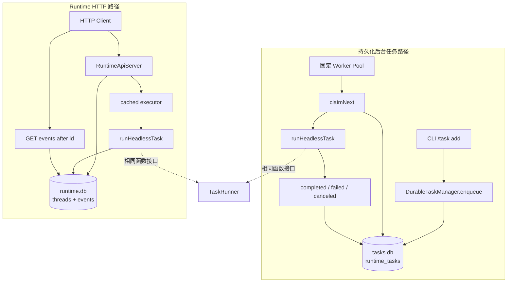
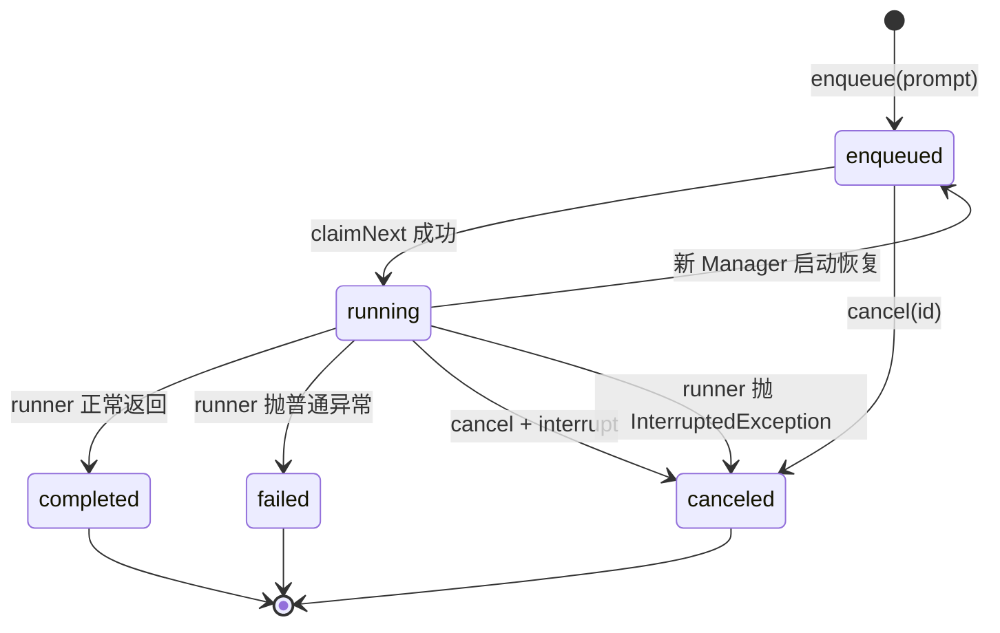
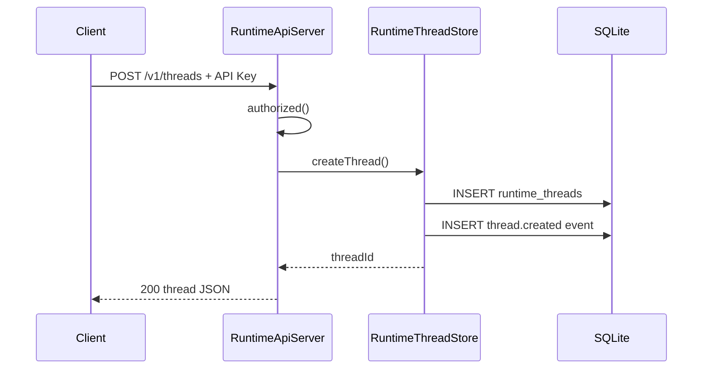
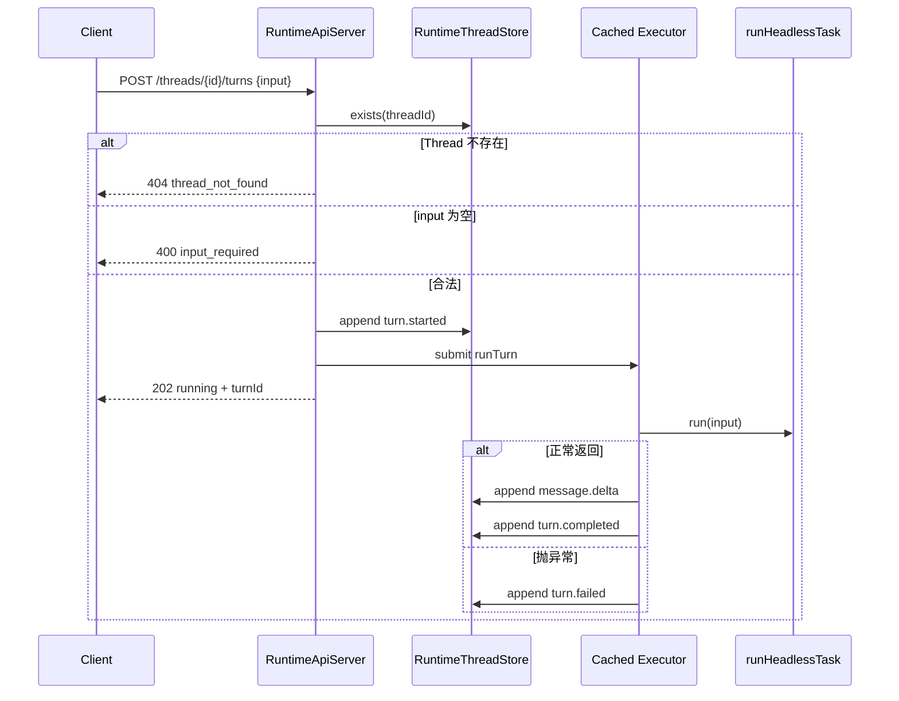

# 异步任务与 Runtime API

## 1. 功能定位

「Runtime 层」不是一个类，而是两个相关但**相互独立**的子系统：其一是 `DurableTaskManager`，把一次执行抽象成带身份、状态和持久化记录的**后台任务队列**，用 SQLite 存状态、用固定 Worker Pool 领取并运行；其二是 `RuntimeApiServer`，用 JDK 内置 `HttpServer` 暴露 Thread / Turn / Event 的 **HTTP 接口**，把同步的 Agent 调用包装成可异步提交、可按游标读取事件的运行实体。两者共享的唯一抽象是函数式接口 `TaskRunner`（`src/main/java/com/codeagent/runtime/task/TaskRunner.java:4-6`），让子系统不直接依赖 `Agent` 类，可以在生产里接 Agent、在测试里接 lambda。

- 后台任务入口：`DurableTaskManager` — `src/main/java/com/codeagent/runtime/task/DurableTaskManager.java:18`；构造与恢复 `DurableTaskManager.java:27-39`；`enqueue` `DurableTaskManager.java:86`；`claimNext` `DurableTaskManager.java:206`；`workerLoop` `DurableTaskManager.java:160`
- HTTP API 入口：`RuntimeApiServer` — `src/main/java/com/codeagent/runtime/api/RuntimeApiServer.java:17`；路由入口 `handleThreads` `RuntimeApiServer.java:57`
- Thread/Event 存储：`src/main/java/com/codeagent/runtime/api/RuntimeThreadStore.java:11`
- 真实执行体：`runHeadlessTask` — `src/main/java/com/codeagent/cli/Main.java:911-916`；两条路径的接线点 `Main.java:322-324`（CLI 启动后台任务）、`Main.java:918-924`（`openTaskManager`）、`Main.java:871-878`（`serve` 启动 HTTP）

需要强调：两个子系统都**已经端到端接到真实 Agent**——CLI 的 `/task add` 与 HTTP 的 `POST turns` 最终都调用 `runHeadlessTask`，后者每次新建 `Agent` 并 `agent.run(prompt)`（`Main.java:911-916`）。但两条路径**彼此不通**：HTTP Turn 不会写入任务队列表，后台任务也不产生 Thread/Event。详细差异见 §3.4 与 §4。

## 2. 设计意图

### 2.1 同步 CLI 循环解决不了什么

CLI 默认的 Agent 调用是同步的：用户提交输入，当前交互流程执行 LLM 和工具循环，直到返回答案或失败。这适合人在终端前等待，但解决不了以下诉求：

- 提交长任务后离开终端，稍后查询状态。
- 进程重启后仍能发现未完成的任务。
- 外部程序通过 HTTP 创建一次执行并读取事件。
- 多个任务共享有限的 Worker 并发，而不是每个请求无限创建线程。
- 明确区分排队、运行、完成、失败和取消。

这里的 Runtime 不是 JVM Runtime 的同义词，而是「承载 Agent 执行的生命周期层」。它把一次函数调用提升为具有身份、状态、持久化和外部接口的运行实体。

### 2.2 两条路径的定义

- **持久化后台任务路径**：以数据库状态行为事实来源，追求「任务不丢、可取消、可重启恢复」。它由 `DurableTaskManager` 承担，CLI 通过 `/task` 命令族驱动（`TaskCommandFormatter.java:8`）。
- **Runtime HTTP 路径**：以 Thread 为事件归属容器、以自增事件 ID 为游标，追求「外部客户端可异步提交、可增量读取过程」。它由 `RuntimeApiServer` + `RuntimeThreadStore` 承担。

两者解决的问题相近，但可靠性语义不同，因此文档始终分开讲。

## 3. 总体架构与关键流程

### 3.1 两条路径总体架构



两条路径只共享 `TaskRunner` 函数接口，它把「一次 prompt 执行成结果」抽象出来：

```java
String run(String prompt) throws Exception;
```

当前没有以下连接：

- HTTP `POST /turns` 不会写入 `runtime_tasks`，也不经过固定 Worker Pool。
- Runtime API 使用自己的 cached thread pool（`RuntimeApiServer.java:23-27`）。
- 后台任务没有 Thread/Turn/Event 模型。
- Runtime API 没有后台任务的状态查询和取消端点。

简历可以把它们合并为「异步任务与 Runtime API 能力」，技术讲解时必须明确它们是两个子系统。

### 3.2 子系统一：持久化后台任务

#### 3.2.1 核心对象

| 对象 | 职责 | 源码 |
|---|---|---|
| `DurableTaskManager` | 建表、入队、查询、领取、运行、取消、恢复和关闭 | `DurableTaskManager.java:18` |
| `DurableTask` | 任务不可变快照，含状态、结果、错误和时间字段 | `DurableTask.java:5-15` |
| `TaskStatus` | 五态生命周期枚举及数据库字符串转换 | `TaskStatus.java:4-8` |
| `TaskRunner` | 把 prompt 执行为结果的可替换函数边界 | `TaskRunner.java:4-6` |

`DurableTask` 不是运行线程本身，而是从数据库某一时刻读出的状态快照。调用方要观察最新状态，需要再次 `find(id)`（`DurableTaskManager.java:128`）。

#### 3.2.2 数据库与配置

默认数据库为 `~/.codeagent/tasks/tasks.db`，目录优先级是 system property `codeagent.task.dir` → 环境变量 `CODEAGENT_TASK_DIR` → 用户目录下 `.codeagent/tasks`（`DurableTaskManager.java:45-54`）。Worker 数量由 `workerCount()` 派生，同样是 system property `codeagent.task.workers` → 环境变量 `CODEAGENT_TASK_WORKERS` → 内置默认值，无法解析时回退，合法值下限被夹到 1（`DurableTaskManager.java:56-69`）。具体常量值以源码为准。

#### 3.2.3 runtime_tasks 表

| 字段 | 用途 |
|---|---|
| `id` | `task_` 前缀的任务 ID，主键 |
| `status` | `enqueued/running/completed/failed/canceled` |
| `prompt` | 去除首尾空白后的任务输入 |
| `result` | 成功结果；取消时可保留已有结果 |
| `created_at` | 入队时间 |
| `started_at` | 最近一次被领取的开始时间 |
| `finished_at` | 终态时间 |
| `updated_at` | 最近状态更新时间 |
| `duration_ms` | 本次执行时长 |

建表语句见 `DurableTaskManager.java:276-289`，并在 `status` 与 `created_at` 上各建一个索引（`DurableTaskManager.java:290-291`），分别服务状态过滤和 FIFO 领取/列表排序。

#### 3.2.4 任务生命周期



`completed`、`failed`、`canceled` 是终态。`DurableTask.terminal()` 只对这三种状态返回 true（`DurableTask.java:16-20`）。

#### 3.2.5 入队、查询与原子领取

`enqueue` 是 synchronized 方法：先拒绝 null 或纯空白 prompt（`DurableTaskManager.java:87-89`），再生成 `task_` 加 UUID 片段作为 ID，插入一条 `enqueued` 记录，`notifyAll()` 唤醒等待中的 Worker，最后通过 `find(id)` 重读并返回数据库快照（`DurableTaskManager.java:86-106`）。数据库异常被包装成 `IllegalStateException`（`DurableTaskManager.java:103-105`）。

`list(limit)` 按 `created_at DESC` 返回最近任务（`DurableTaskManager.java:111-114`），limit 被上下界夹紧（`DurableTaskManager.java:109`）。这个排序用于用户查看最近任务，**不等于** Worker 的调度顺序；Worker 领取使用 `created_at ASC`，即先入先出。

`find(id)` 对空 ID 返回 `Optional.empty()`，合法 ID 走参数化查询（`DurableTaskManager.java:128-140`）。状态字符串通过 `TaskStatus.from` 解析（`DurableTaskManager.java:311`）；`from` 对 null 或未知值回退为 `ENQUEUED`——向后兼容，但也可能把数据库脏值重新投入执行。

`claimNext()` 在 synchronized 临界区内关闭 autoCommit（`DurableTaskManager.java:206-251`）：

1. 查询最早的 `enqueued` 任务（`DurableTaskManager.java:210-222`）。
2. **若 SELECT 没有命中任何行，直接 `commit()` 并返回 null**（`DurableTaskManager.java:223-226`）。这里走的是 commit，不是 rollback。
3. 用 `WHERE id = ? AND status = enqueued` 更新为 `running`，同时写 `started_at` / `updated_at`（`DurableTaskManager.java:228-242`）。
4. **若 UPDATE 影响 0 行则 rollback 并返回 null**（`DurableTaskManager.java:238-241`），表示任务已不再可领取。
5. 更新成功后 `commit()`，然后**在 autoCommit 仍为 false 时**用 `find(task.id())` 重读一次并返回（`DurableTaskManager.java:243-244`）；autoCommit 直到 `finally` 才恢复（`DurableTaskManager.java:248-250`）。
6. SQL 异常 rollback（`DurableTaskManager.java:245-247`）。

即使未来不依赖 Java 锁，带旧状态条件的 UPDATE 也相当于一次 compare-and-set，防止把已取消或已领取任务误标为 running。当前单个 Manager 只有一条 JDBC Connection（`DurableTaskManager.java:36`），所有访问又由 synchronized 串行化；多个 Manager 实例同时连接同一个数据库时，SQLite 锁和条件 UPDATE 才承担跨实例竞争控制。

#### 3.2.6 Worker 循环与并发语义

`start()` 是 synchronized 且检查 `running`，重复调用不会重复创建线程池（`DurableTaskManager.java:71-75`）。Worker 使用固定大小线程池，线程名为 `codeagent-task-worker` 并设为 daemon（`DurableTaskManager.java:76-80`）。构造 Manager 不会自动启动线程池：构造负责创建目录、打开连接、建表和恢复 running（`DurableTaskManager.java:27-39`），调用方必须显式 `start()` 才会消费队列。

每个 Worker 重复以下步骤：

```text
while manager is running:
    task = claimNext()
    if no task:
        wait 一个短的限定时间
        continue
    register current thread by task id
    call runner.run(prompt)
    persist completed / failed / canceled
    remove running thread mapping
```

（控制流程见 `DurableTaskManager.java:160-204`，等待超时见 `DurableTaskManager.java:167`，不复制实现代码。）关键点是数据库状态是事实来源，`runningTasks` 只保存进程内「任务 ID → 执行线程」映射（`DurableTaskManager.java:23`、`172`），用于取消时发出 interrupt。

领取数据库任务是串行的，真正的 `TaskRunner.run` 在锁外执行（`DurableTaskManager.java:174-181`），因此最多可以有 `workerCount` 个任务并行；数据库查询、状态写入和取消仍经过 Manager 对象锁。这避免长时间持有 Java 锁阻塞其他任务。`TaskRunner` 契约本身不要求线程安全——当前默认 runner 是 `runHeadlessTask`，每次调用新建 `Agent`（`Main.java:911-916`），因此不存在共享可变 conversation history 的问题；问题只在调用方自己传入共享状态的 runner 时才出现。

#### 3.2.7 完成、失败、取消与恢复

**正常完成**：runner 返回后，Worker 在锁内重读最新状态，若任务已被取消就不覆盖为 completed，否则写入结果、完成时间和时长（`DurableTaskManager.java:176-181`）。这个二次状态检查解决取消与正常返回的竞争。

**runner 抛 `InterruptedException`**：Worker 清除当前线程的中断标记（`Thread.interrupted()`），并把任务写为 canceled、错误为「任务线程被中断」（`DurableTaskManager.java:182-186`）。清标记很重要，否则这个池线程回到下一轮后可能立即在阻塞点再次失败。

**runner 抛普通异常**：记录为 failed，结果写空字符串，error 保存 `e.getMessage()`（`DurableTaskManager.java:187-193`）。message 为 null 时 error 也可能为 null；当前没有持久化异常类型和堆栈。

**取消 `cancel(id)`**：对不存在或已终态任务返回 false（`DurableTaskManager.java:143-146`）。对 enqueued 或 running 返回 true，移除映射并 `Thread.interrupt()` 执行线程，再写 canceled（`DurableTaskManager.java:147-153`）。尚未运行的任务没有线程可中断，只写 canceled，后续 `claimNext` 只查 enqueued 因而不会领取它。

**进程重启恢复**：Manager 构造时执行 `recoverRunningTasks()`（`DurableTaskManager.java:295-306`），把数据库里所有 `running` 改回 `enqueued`。语义是 **at-least-once**：进程可能在外部副作用已完成、但 completed 尚未落库时崩溃，重启后任务会再次执行，可能重复副作用。恢复从整个 prompt 重新开始，不保存 Agent 当前迭代或工具调用位置，是「重新排队重跑」而不是断点续跑。此外恢复 SQL 会把数据库内所有 running 都改回 enqueued——若两个进程共享同一 `tasks.db`，新实例启动可能重置另一个仍在真实执行的任务，因此当前模型默认单进程拥有该数据库。

**关闭 `close()`**：将 `running=false`、`notifyAll()` 唤醒 Worker、`shutdownNow()` 中断池线程并等待一个短超时，然后关闭 Connection（`DurableTaskManager.java:329-345`）。若 runner 正常响应中断会被写成 canceled；若忽略中断且超过等待时长，连接可能先关闭，任务保留 running，下一次启动再恢复为 enqueued。

### 3.3 子系统二：Runtime HTTP API

#### 3.3.1 对外接口

| 方法 | 路径 | 成功状态 | 作用 |
|---|---|---:|---|
| POST | `/v1/threads` | 200 | 创建 Thread 并写 `thread.created` |
| POST | `/v1/threads/{id}/turns` | 202 | 接收 input，异步执行一个 Turn |
| GET | `/v1/threads/{id}/events?after=N` | 200 | 返回 ID 大于 N 的事件批次 |

路由实现见 `RuntimeApiServer.java:65-77`。当前没有 GET Thread、Thread 列表、Turn 查询、Turn 取消、Thread 删除或健康检查接口。

#### 3.3.2 安全前置条件

构造 `RuntimeApiServer` 时 API Key 不能为空，否则抛 `IllegalArgumentException`，服务不会启动（`RuntimeApiServer.java:30-32`）。配置来自 system property `codeagent.runtime.api.key` → 环境变量 `CODEAGENT_RUNTIME_API_KEY`（`RuntimeApiServer.java:41-47`）。服务只绑定 `127.0.0.1`（`RuntimeApiServer.java:36`），降低意外暴露到局域网的风险。客户端可用 `Authorization: Bearer <key>` 或 `X-CodeAgent-API-Key: <key>`，任一种精确匹配即可（`RuntimeApiServer.java:130-134`）。当前使用普通字符串比较，不含 key 轮换、权限范围、速率限制或审计主体。

#### 3.3.3 Thread 与 Event 存储

默认数据库为 `~/.codeagent/runtime/runtime.db`，优先级是 system property `codeagent.runtime.dir` → 环境变量 `CODEAGENT_RUNTIME_DIR` → 默认目录（`RuntimeThreadStore.java:24-33`）。它与 `tasks.db` 是两个文件，也由不同 Store 管理。

`runtime_threads` 表只有 `id` 和 `created_at`（`RuntimeThreadStore.java:107-112`），Thread ID 使用 `thread_` 加 UUID 片段（`RuntimeThreadStore.java:36`）。Thread 只是事件归属容器，**不持久化** Agent conversation history、system prompt、模型、workspace 或状态，因此「创建 Thread」不能等同于创建可恢复的有状态 Agent 会话。

`runtime_events` 表含自增 `id`、`thread_id`、`type`、`data`、`created_at`（`RuntimeThreadStore.java:113-121`），并对 `(thread_id, id)` 建联合索引（`RuntimeThreadStore.java:122`）。自增 ID 同时承担事件顺序和增量游标。当前没有外键约束；正常调用由 Store 和 API 先检查 Thread 存在（`RuntimeThreadStore.java:50-59`）。

`createThread`、`exists`、`appendEvent`、`events`、`close` 都是 synchronized（`RuntimeThreadStore.java:35`、`50`、`61`、`79`、`126`），保护单 Connection 不被多个 API/Turn 线程并发使用。锁只覆盖数据库操作，不覆盖 runner 执行。

#### 3.3.4 创建 Thread 的链路



创建 Thread 和追加 `thread.created` 是两次独立 SQL 操作，没有显式总事务（`RuntimeThreadStore.java:37-44`）。如果 Thread 插入成功而事件插入失败，API 会返回 500，但 Thread 记录可能已经存在。

#### 3.3.5 提交 Turn 的链路



实现见 `RuntimeApiServer.java:84-113`。Turn ID 使用 `turn_` 加 `System.nanoTime()` 的十六进制文本（`RuntimeApiServer.java:95`），适合单 JVM 生成短 ID，但没有 UUID 那样的跨进程唯一保证。

`message.delta` 这个名字容易造成误解：runner **完整结束后**才追加一次完整结果（`RuntimeApiServer.java:102-106`），并不是在模型生成过程中逐 token 写入多个 delta。

#### 3.3.6 SSE 事件读取的真实语义

每条事件输出标准 SSE 结构（`RuntimeApiServer.java:157-165`）：

```text
id: 12
event: turn.completed
data: {"turn_id":"turn_x","status":"completed"}
```

响应 Content-Type 是 `text/event-stream; charset=utf-8`（`RuntimeApiServer.java:123`）。客户端传 `after=N`，Store 返回当前 Thread 中 `id > N` 的事件并按 ID 升序排列（`RuntimeThreadStore.java:79-103`）；参数缺失、为空或无法解析时按 0 处理（`RuntimeApiServer.java:141-155`）。

`handleEvents` 查询一次数据库、把当时已有的事件全部格式化，用**固定 `Content-Length`** 返回，然后关闭响应流（`RuntimeApiServer.java:115-128`，尤其 `124`）。它**不保持连接等待新事件，也没有 heartbeat**。因此实际使用方式是短轮询 SSE 快照：客户端保存最后一个事件 ID，稍后再次 GET。它使用 SSE 编码格式，但实时性来自客户端轮询，不是服务端持续推送。

#### 3.3.7 API 并发模型

JDK `HttpServer` 使用一个自定义 cached thread pool（`RuntimeApiServer.java:23-27`、`38`）。HTTP 请求处理和 `runTurn` 都提交到同一 Executor（`RuntimeApiServer.java:98`）。线程命名为 `codeagent-runtime-api`，且是 daemon（`RuntimeApiServer.java:24-25`）；监听端口由 `Main` 通过 `parseServePort` 从命令行 `--port` 派生、失败时回退默认值（`Main.java:871`、`Main.java:895-909`）。

优点是实现轻量、不引入 Web 框架，空闲线程可复用，Turn 提交后立即返回 202。边界包括：cached pool 没有固定并发上限，突发 Turn 可能创建很多线程；没有队列背压、租户配额和 429；同一 Thread 可以同时提交多个 Turn 并并发执行，事件按实际落库时间交错；`TaskRunner` 若不是线程安全的会出现共享状态问题；Server 关闭只 interrupt executor 任务，没有 Turn 状态恢复（`RuntimeApiServer.java:186-190`）。

### 3.4 两套子系统的状态对照

| 概念 | Durable Task | Runtime API Turn |
|---|---|---|
| 持久化身份 | task ID | thread ID + turn ID（仅在事件 data 中） |
| 排队状态 | `enqueued` | 无独立记录 |
| 运行状态 | `running` 行 | `turn.started` 事件 |
| 成功 | `completed` + result | `message.delta` + `turn.completed` |
| 失败 | `failed` + error | `turn.failed` |
| 取消 | Manager API 支持 | 未实现 |
| 重启恢复 | running 重置 enqueued | 未实现执行恢复 |
| 并发上限 | 固定 workerCount | cached pool，无显式上限 |
| 消费方式 | find / list | GET SSE 格式事件批次 |

这个对照表是理解当前架构最重要的一点：两条路径解决的问题相近，但可靠性语义不同。

### 3.5 典型场景推演

#### 场景：后台执行长任务

1. CLI 启动时创建 `DurableTaskManager` 并 `start()`（`Main.java:322-324`）。
2. `/task add <内容>` 触发 `enqueue` 写入 enqueued（`TaskCommandFormatter.java:16-19`）。
3. 空闲 Worker 原子领取为 running。
4. runner（`runHeadlessTask`）执行 Agent。
5. 调用方用 `/task` 或 `/task log <id>` 反复查看状态（`TaskCommandFormatter.java:10-15`、`26-30`）。
6. 成功结果持久化；进程重启后未完成 running 会重新排队。

#### 场景：取消运行任务

1. `/task cancel <id>` 调用 `cancel`（`TaskCommandFormatter.java:20-25`）。
2. Manager 验证任务未终态。
3. 正在运行则对绑定线程调用 interrupt。
4. 数据库立即落 canceled。
5. runner 后续返回时，Worker 重读状态，不覆盖 canceled。

#### 场景：外部客户端提交 Turn

1. 客户端携带 API Key 创建 Thread。
2. 服务端持久化 Thread 和 created 事件。
3. 客户端提交 input，立即得到 202 和 turnId。
4. executor 异步调用 runner。
5. 客户端用 after 游标短轮询事件。
6. 看到 completed 或 failed 后停止轮询。

#### 场景：同一 Thread 连续提交两轮

当前服务不会把第一轮结果自动作为第二轮输入，也不保证顺序。两个 Turn 可能并发、事件交错。若外部要维持对话，上层必须提供有状态 runner，或服务端增加 Thread 级消息历史和串行调度。

## 4. 设计意图 vs 实际实现

以下是文档意图与代码实际行为存在差异的地方。每条给出源码位置，具体数值以源码为准。

| 主题 | 设计意图 | 实际实现 | 源码位置 |
|---|---|---|---|
| HTTP 未匹配请求 | 以为未匹配的路径或方法一律返回 404 `not_found` | **鉴权先于路由**：`authorized()` 在方法/路径匹配之前执行。因此在 API 上下文内未匹配的路径（如 `/v1/threads/x/bogus`）若 key 缺失或错误，返回的是 401 而不是 404；带正确 key 才会落到 404 `not_found`。此外，路径前缀不匹配 servlet context 的请求根本不会进入 handler，得到的是 JDK `HttpServer` 自己的**空 body 404**，不是 JSON 错误体 | `RuntimeApiServer.java:57-82`（鉴权 `59-62`，路由 `63-78`），context 注册 `RuntimeApiServer.java:37` |
| Worker 被中断的两种后果 | 文档只描述了 runner 被中断后任务转 canceled | **存在第二条有害路径**：runner 内部的中断由内层 catch 处理，清标记后 Worker 继续存活（`182-186`）；但如果 Worker 在 `wait(...)` 或 `claimNext` 期间被中断，异常落到**外层** `catch (InterruptedException)`，它只恢复中断标志就 `return`。该 Worker 线程**永久退出**，线程池可用 worker 数量随之减少 | 内层 `DurableTaskManager.java:182-186`；外层 `DurableTaskManager.java:197-199`；等待点 `DurableTaskManager.java:166-169` |
| runner 与共享状态 | 旧版文档曾警告「封装可变 conversation history 的单 Agent」会污染上下文 | 这是**假设情形**。`Main` 把 `TaskRunner` 接到 `runHeadlessTask`，后者**每次调用新建 `ToolRegistry` 和 `Agent`**，不存在共享可变会话；线程安全隐患只在调用方自行传入有状态 runner 时才成立 | `Main.java:918-924`（接线）、`Main.java:911-916`（每次新建 Agent） |
| `claimNext` 的空结果 | 文档只记录了 UPDATE 影响 0 行时 rollback | **还有一条 commit 路径**：SELECT 没查到 enqueued 行时直接 `commit()` 并返回 null（而非 rollback）。另外成功领取后是用 `find(task.id())` 重读返回的，此时 autoCommit **仍为 false**，直到 `finally` 才恢复 | 空结果 `DurableTaskManager.java:223-226`；成功重读 `DurableTaskManager.java:243-244`；恢复 autoCommit `DurableTaskManager.java:248-250` |
| `duration_ms` 的基准 | 以为时长来自数据库 `started_at` | 正常执行路径的时长来自 **Worker 本地时钟**，且在 `claimNext` 之后才捕获 `Instant startedAt`（`173`）。取消 enqueued 任务时走的是 `cancel()` 分支，传的是数据库里的 `startedAt`（此时通常为 null），于是 `duration_ms` 记为 0 | 本地起点 `DurableTaskManager.java:173`；计算 `DurableTaskManager.java:253-255`；取消传参 `DurableTaskManager.java:151` |
| `recoverRunningTasks` 重置范围 | 以为会重置整行时间字段 | 恢复 SQL **只写 `status` 与 `updated_at`**，`started_at`、`finished_at`、`duration_ms` 保持上一次运行的陈旧值 | `DurableTaskManager.java:295-306` |
| `TaskStatus.from` 匹配规则 | 以为只按数据库字符串 `value` 匹配 | 同时匹配字符串 `value` 和枚举 `name`，且两者都**不区分大小写**；null 或未知值回退 `ENQUEUED` | `TaskStatus.java:20-30`（尤其 `25`） |
| API executor 线程与端口 | 未说明线程属性与端口来源 | 线程命名 `codeagent-runtime-api`、设为 daemon；端口由 `parseServePort(args, 默认)` 从 `--port` 解析，参数非法时回退默认值 | 线程 `RuntimeApiServer.java:23-27`；端口 `Main.java:871`、`Main.java:895-909` |
| SSE 端点语义 | 容易以为是长连接推送 | 是**一次性快照**：查询一次、格式化已有事件、用固定 `Content-Length` 返回、关闭流，无 heartbeat、不等待新事件 | `RuntimeApiServer.java:115-128` |
| `message.delta` 含义 | 以为逐 token 流式写入 | runner **完整结束**后才写一次完整结果 | `RuntimeApiServer.java:102-113` |
| 创建 Thread 的原子性 | 以为 Thread 与 `thread.created` 同事务 | 两次独立 SQL，无显式总事务；Thread 插入成功而事件失败时会返回 500 但 Thread 可能已存在 | `RuntimeThreadStore.java:37-44` |
| 两套子系统连接 | 简历可合并描述 | **未打通**：HTTP Turn 不写 `runtime_tasks`、不用固定 Worker Pool、用独立 `runtime.db`；后台任务也不产生 Thread/Event | `RuntimeApiServer.java:36-38`、`RuntimeThreadStore.java:24-33` vs `DurableTaskManager.java:45-54` |
| 无头执行的审批链 | 以为与交互式 CLI 一致 | `runHeadlessTask` 用**普通 `ToolRegistry`**（非交互式用的 `hitlToolRegistry`）构造 Agent，因此后台任务与 HTTP Turn 都**不经过 HITL 交互审批** | `Main.java:911-916` vs 交互式装配 `Main.java:318` |

## 5. 设计取舍

### 5.1 SQLite 还是消息队列

SQLite 适合单机 CLI：无需外部服务，任务与事件重启后仍在，JDBC 调试简单。代价是不提供分布式租约、消费者组、死信队列和高吞吐。若产品变成多节点 Agent 服务，应迁移到具备可见性超时和确认机制的队列，或在数据库中实现 lease/heartbeat 模型。

### 5.2 固定 Worker Pool 还是每任务创建线程

固定池给后台任务明确的并发上限，避免任务突发耗尽资源；Runtime API 的 cached pool 更轻量，但缺少背压。两者体现了不同成熟度——这是有意为之的分层，不是遗漏。

### 5.3 interrupt 还是强制停止

Java 没有安全的通用强制终止线程方式。interrupt 保持协作式取消，不会在任意指令处破坏共享状态。代价是所有阻塞层都要尊重中断或取消令牌；若 runner 内部调用的 HTTP 客户端或工具不响应 interrupt，取消延迟取决于下层实现。当前没有把 CancellationToken 注入 `TaskRunner`，只能依赖线程中断。而 §4 记录的「外层 catch 让 Worker 永久退出」是这套机制的**代价外溢**：一个本意用于协作取消的信号，在等待点可能误杀长期消费者线程。

### 5.4 状态表还是事件溯源

后台任务用当前状态行，查询简单；Runtime API 用事件流，客户端能观察过程。完整 Runtime 可以两者结合：状态表用于快速读取，事件表用于审计和流式消费。当前二者是两套独立存储，没有共享一致性。

### 5.5 恢复为 enqueued 还是标 failed

重新排队优先保证任务不丢，但带来至少一次执行；标 failed 避免重复副作用，却要求用户手动重试。当前选择适合可重入的 Agent 任务，副作用任务需要幂等保护。代价是恢复 SQL 无条件重置所有 running，多实例场景会互相干扰。

### 5.6 为什么 SSE 只是快照

用 `HttpServer` 实现长连接推送需要保持响应流、处理客户端断连和心跳，复杂度显著上升。当前选择「查询一次即返回」，用标准 SSE 编码换取客户端易解析和未来可升级性；代价是实时性由客户端轮询频率决定。

## 6. 失败与边界矩阵

| 失败点 | 检测方式 | 当前处理 | 备注 |
|---|---|---|---|
| prompt 为空 | `enqueue` 前置校验 | 抛 `IllegalArgumentException` | `DurableTaskManager.java:87-89` |
| Worker 配置非法 | `workerCount()` 解析失败 | 回退内置默认值 | `DurableTaskManager.java:64-68` |
| 重复 `start()` | 检查 `running` | 幂等返回 | `DurableTaskManager.java:71-75` |
| 两个 Worker 争同一任务 | synchronized + 条件 UPDATE | 只有更新成功者获得 | `DurableTaskManager.java:228-241` |
| Worker 在等待点被中断 | 外层 `catch (InterruptedException)` | **线程永久退出，池缩水** | `DurableTaskManager.java:197-199` |
| runner 普通异常 | 捕获 `Exception` | 落 failed，Worker 继续 | 只存 message，无堆栈 `DurableTaskManager.java:187-193` |
| runner 响应 interrupt | 内层 `catch (InterruptedException)` | 清标记并落 canceled | `DurableTaskManager.java:182-186` |
| runner 忽略 interrupt | — | 状态仍 canceled，底层可能继续产生副作用 | `DurableTaskManager.java:143-153` |
| 完成与取消竞争 | 完成前重读状态 | 不覆盖 canceled | `DurableTaskManager.java:177-180` |
| 进程崩溃 | 构造时 `recoverRunningTasks` | running 重排 enqueued | at-least-once，可能重复副作用 `DurableTaskManager.java:295-306` |
| 两 Manager 共享 DB | 条件 UPDATE | 减少重复领取，但新实例恢复会干扰活跃实例 | 当前默认单进程 |
| API Key 未配置 | 构造校验 | 抛 `IllegalArgumentException`，服务不启动 | `RuntimeApiServer.java:30-32` |
| 缺失或错误 Key | `authorized()` | 401 `unauthorized` | 在路由之前执行 `RuntimeApiServer.java:59-62` |
| API 前缀内未匹配路径 | 路由兜底 | 带正确 key 才返回 404 `not_found` | `RuntimeApiServer.java:78` |
| 前缀外路径 | 不进入 handler | JDK 空 body 404 | context 注册 `RuntimeApiServer.java:37` |
| Thread 不存在 | `store.exists` | 404 `thread_not_found` | `RuntimeApiServer.java:85-88`、`116-119` |
| input 缺失或空白 | `body.path("input")` | 400 `input_required` | `RuntimeApiServer.java:89-93` |
| 非法 JSON | 未单独捕获 | 进入统一 catch，通常 500 | `RuntimeApiServer.java:79-81` |
| Store / 处理器异常 | 统一 `catch (Exception)` | 500，error 含转义后的异常消息 | `RuntimeApiServer.java:79-81`、`176-184` |
| runner 异常（HTTP） | 202 已返回 | 后续写 `turn.failed` 事件 | `RuntimeApiServer.java:109-112` |
| 大量并发 Turn | cached executor 接收 | 无背压，线程可能膨胀 | `RuntimeApiServer.java:23-27` |
| Event 消费中断 | `after` 游标 | 可续拉 | 无保留期和清理策略 |
| API 进程重启 | events 仍在 SQLite | 未完成 Turn 不会恢复 | 无恢复逻辑 |
| 同 Thread 并发 Turn | Store 写入串行 | 业务事件交错、会话不隔离 | `RuntimeThreadStore.java:61` |

异常消息会进行反斜杠、引号和换行转义，避免直接破坏 JSON 字符串（`RuntimeApiServer.java:176-184`）；响应仍通过字符串手工组装，而不是统一 DTO 序列化。

## 7. 测试策略与证据

### 7.1 后台任务测试（已核实）

`src/test/java/com/codeagent/runtime/task/DurableTaskManagerTest.java` 现有三个用例，覆盖：

- 入队后由 Worker 执行并持久化结果，且 `list` 能查到（`DurableTaskManagerTest.java:13-28`）。
- 手工把任务标为 running 后，新建 Manager 会把它恢复为 enqueued（`DurableTaskManagerTest.java:30-41`）。
- 运行中任务取消后进入 canceled（`DurableTaskManagerTest.java:43-61`）。

### 7.2 HTTP API 测试（已核实）

`src/test/java/com/codeagent/runtime/api/RuntimeApiServerTest.java` 现有两个用例，覆盖：

- 创建 Thread、提交 Turn，并轮询 SSE 事件直到出现 `turn.started` / `message.delta` / `turn.completed`（`RuntimeApiServerTest.java:17-42`）。
- 缺少 API Key 时返回 401（`RuntimeApiServerTest.java:44-59`）。

测试使用 `@TempDir` 创建独立 SQLite 文件，runner 使用确定性 lambda，不调用真实 LLM，因此生命周期测试快速稳定。

### 7.3 尚未被自动化覆盖（诚实清单，非事实声明）

以下行为在上表中出现，但当前测试文件未覆盖，不应在面试中宣称「已测」：排队任务取消与终态重复取消；多 Worker 的唯一领取；runner 普通异常与忽略 interrupt；Worker 在等待点被中断后池缩水；HTTP 侧不存在 Thread、空 input、非法 JSON、`X-CodeAgent-API-Key`、`after` 游标与并发 Turn。

常用回归命令：

```bash
mvn test -Dtest=DurableTaskManagerTest,RuntimeApiServerTest,CancellationContextTest
```

## 8. 面试讲解模板

### 8.1 30 秒版本

我为 Agent CLI 实现了本地异步运行时。后台任务使用 SQLite 持久化五态生命周期，通过固定 Worker Pool 原子领取任务，支持运行中 interrupt 取消和进程重启后重新排队；另外提供基于 JDK `HttpServer` 的 Runtime API，可创建 Thread、异步提交 Turn，并通过带 after 游标的 SSE 格式事件读取执行结果。两条路径共享 `TaskRunner` 抽象、都接到同一个 `runHeadlessTask` 执行真实 Agent，但当前数据库和调度器彼此独立。

### 8.2 2 分钟版本

后台任务的核心是 `runtime_tasks` 状态表。入队写 enqueued，Worker 在关闭 autoCommit 的临界区内选择最早任务，并用带旧状态条件的 UPDATE 改为 running；runner 在锁外执行，所以领取串行但任务可按 Worker 数并发。完成、失败和取消都持久化，取消同时 interrupt 执行线程，完成前还会重读状态避免覆盖 canceled。启动时把遗留 running 恢复为 enqueued，因此是至少一次执行语义，副作用任务需自行幂等。

HTTP 侧把 Thread 和 Event 存在另一份 SQLite 中，Turn 接口先落 started 事件，再异步调用同一个 runner，成功写 `message.delta` 和 completed，失败写 failed。事件接口按自增 ID 和 after 游标返回 SSE 格式批次。我会主动说明几个边界：它不是长连接推送，只是一次性快照加客户端轮询；HTTP Turn 没有接入持久任务队列，也没有 Turn 取消和会话历史恢复；Worker 在等待点被中断会永久退出线程池。演进方向是有界执行器、Thread 串行 mailbox、owner 租约和版本化事件协议。

## 9. 高频面试问答

### Q1：这里的 Runtime 是什么？

它是承载 Agent 执行生命周期的服务层：负责身份、状态、调度、取消、恢复和外部接口，而不只是一次 `agent.run()` 方法调用。要注意它当前由后台任务队列和 HTTP API 两个子系统构成，不是单一服务。

### Q2：如何防止两个 Worker 执行同一任务？

领取在 synchronized 和数据库事务中完成，UPDATE 带 `status = enqueued` 条件，只有更新成功的 Worker 才获得任务（`DurableTaskManager.java:228-241`）。

### Q3：为什么说恢复是 at-least-once？

进程可能在外部副作用完成后、状态提交前崩溃。重启把 running 重新排队会再次执行，不能保证 exactly-once（`DurableTaskManager.java:295-306`）。

### Q4：如何做到 exactly-once？

通用 exactly-once 很难。通常通过业务幂等键、唯一约束、事务 outbox 和可检测检查点，把重复执行变成无害，而不是只依赖队列状态。

### Q5：取消为什么用 interrupt？

Java 不应使用 `Thread.stop` 强杀线程。interrupt 是协作式信号，能让阻塞调用退出并给 runner 清理资源的机会（`DurableTaskManager.java:147-150`）。

### Q6：runner 忽略 interrupt 怎么办？

数据库仍保持 canceled，完成逻辑重读状态后不会覆盖它，但底层执行可能继续。更完善的方案是向 LLM、HTTP 和工具层传 CancellationToken，并设置超时。

### Q7：Worker 异常后还会继续循环吗？

分两种。runner 抛普通异常或 `InterruptedException`，异常被**内层** catch 消化、记录到任务行，Worker 返回池中继续处理后续任务（`DurableTaskManager.java:182-193`）。但 Worker 在 `wait(...)` 或 `claimNext` 期间被打断时，异常落到**外层** catch，它恢复中断标志后直接 `return`，该 Worker 线程永久退出、池缩水（`DurableTaskManager.java:197-199`）。这是当前实现一个需要注意的边界。

### Q8：启动恢复会有什么多实例问题？

当前无条件把所有 running 重置 enqueued，新实例可能干扰另一个活跃实例（`DurableTaskManager.java:295-306`）。因此默认是单进程数据库，不是分布式队列。

### Q9：Runtime API 和 DurableTaskManager 已经打通了吗？

没有。它们共享 `TaskRunner` 接口，但 HTTP Turn 直接提交 cached executor、使用独立 `runtime.db`，不经过 `tasks.db` 和固定 Worker Pool。不过两者都通过 `runHeadlessTask` 执行真实 Agent。

### Q10：SSE 是实时长连接吗？

当前不是。服务端返回查询时已经存在的一批 SSE 格式事件并关闭连接（`RuntimeApiServer.java:115-128`），客户端用 after 游标短轮询。

### Q11：为什么还使用 SSE 格式？

事件具备 id、type、data 的标准结构，客户端容易按游标消费，未来也能在不改变事件模型的情况下升级为长连接推送（`RuntimeApiServer.java:157-165`）。

### Q12：同一 Thread 的 Turn 会串行吗？

不会。它们提交到 cached executor 并发执行，事件可能交错，也没有自动共享 conversation history（`RuntimeApiServer.java:98`）。

### Q13：Thread 是否等于 Agent 会话？

当前只是一组持久化事件的归属容器。`runtime_threads` 表只有 `id` 和 `created_at`，没有消息历史、模型和 workspace，因此不能宣称能恢复完整 Agent 会话（`RuntimeThreadStore.java:107-112`）。

### Q14：为什么 API 必须配置 Key 且只监听本机？

Agent 能执行工具，接口风险高。强制 Key 防止本机其他进程无意调用，loopback 绑定避免默认暴露到网络（`RuntimeApiServer.java:30-32`、`36`）；两者仍不能替代更完整的权限和审计。

### Q15：非法 JSON 为什么是 500？

当前 Jackson 解析异常进入统一 catch，没有映射为 400（`RuntimeApiServer.java:79-81`）。这是已知 HTTP 语义边界，应该增加输入异常分类。

### Q16：为什么后台任务用固定池，API 用 cached pool？

固定池体现任务队列的资源控制；API 当前实现偏 MVP，cached pool 简化异步提交，但缺少背压。统一 Runtime 时应使用有界执行器。

### Q17：事件如何断点续读？

事件 ID 自增，客户端保存最后 ID，下次请求 `after=lastId`，数据库只返回更大的事件并按升序排列（`RuntimeThreadStore.java:79-103`）。

### Q18：事件表如何清理？

当前没有保留策略。生产化需要按 Thread 终态和时间归档或删除，并保证活跃消费者游标不会被提前截断。

### Q19：一个未匹配的 HTTP 路径会返回什么？

不一定。鉴权在路由之前：在 API 上下文内未匹配路径若 key 缺失或错误先返回 401；带正确 key 才返回 404 `not_found`。路径前缀根本不属于该 context 时，请求不进入 handler，得到 JDK 自己的空 404（`RuntimeApiServer.java:57-82`、`37`）。

### Q20：下一步如何统一？

让 `POST Turn` 创建 durable task，Worker 执行时持续追加 Thread Event；增加有界队列、Turn 状态/取消、Thread 级串行、owner lease 和事件长连接推送。

## 10. 简历条陈与源码证据

简历原句：

> 异步任务与 Runtime API：使用 SQLite 持久化任务队列和状态，支持 enqueued/running/completed/failed/canceled 生命周期、Worker Pool、取消及运行中任务恢复；通过 HTTP API 创建 Thread、提交 Turn，并以 SSE 获取事件流。

这句话没有声称 HTTP Turn 由 durable queue 执行。逐项证据如下：

| 简历原句 | 代码证据 |
|---|---|
| 使用 SQLite 持久化任务队列和状态 | 连接与建表 `DurableTaskManager.java:36`、`274-293` |
| enqueued/running/completed/failed/canceled 生命周期 | 枚举 `TaskStatus.java:4-8`；终态判断 `DurableTask.java:16-20`；状态写入 `DurableTaskManager.java:253-268` |
| Worker Pool | 固定池与 daemon 线程 `DurableTaskManager.java:76-84`；循环 `DurableTaskManager.java:160-204` |
| 取消 | `DurableTaskManager.java:142-154`；CLI 入口 `TaskCommandFormatter.java:20-25` |
| 运行中任务恢复 | `DurableTaskManager.java:295-306`（构造期调用 `DurableTaskManager.java:38`） |
| 通过 HTTP API 创建 Thread | 路由 `RuntimeApiServer.java:65-68`；存储 `RuntimeThreadStore.java:35-48` |
| 提交 Turn | 路由与异步提交 `RuntimeApiServer.java:70-73`、`84-100` |
| 以 SSE 获取事件流 | 读取与编码 `RuntimeApiServer.java:115-128`、`157-165`；游标 `RuntimeThreadStore.java:79-103` |
| 端到端接真实 Agent（诚实标注） | 后台任务接线 `Main.java:918-924`；HTTP 接线 `Main.java:871-878`；执行体 `Main.java:911-916`；CLI 启动 `Main.java:322-324` |

## 11. 当前实现边界

已实现：单机 SQLite 任务队列、五态生命周期、固定 Worker Pool、FIFO 领取、事务与条件更新、运行中取消、启动重排队；Thread 创建、异步 Turn、持久事件及 after 游标读取；两条路径都通过 `runHeadlessTask` 驱动真实 Agent。

尚未实现 / 需注意：

- HTTP Turn 与 durable queue 未统一，两套数据库、两套调度器各自独立。
- SSE 是一次性快照 + 客户端轮询，不是长连接推送。
- HTTP 侧没有 Turn 取消、Thread 会话历史和同 Thread 串行。
- **Worker 在等待点被中断会永久退出线程池**，可用 worker 数可能随运行时间下降。
- `claimNext` 重读在 autoCommit 关闭状态下进行；`duration_ms` 基于 Worker 本地时钟，取消 enqueued 任务时记为 0；`recoverRunningTasks` 不重置时间字段。
- 无头执行不走 HITL 交互审批。
- 至少一次语义缺少显式幂等协议；无重试/死信、幂等键、租约心跳、多实例调度、事件保留策略和 API 限流。

准确定位是：一个面向本地 Agent 的单机运行时基础设施原型，已具备持久任务和事件 API 的核心骨架，但还不是分布式工作流平台。
