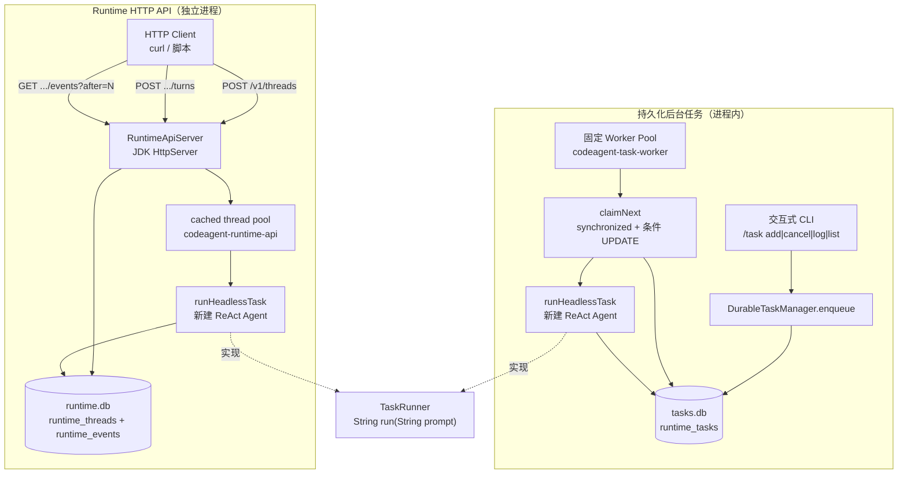
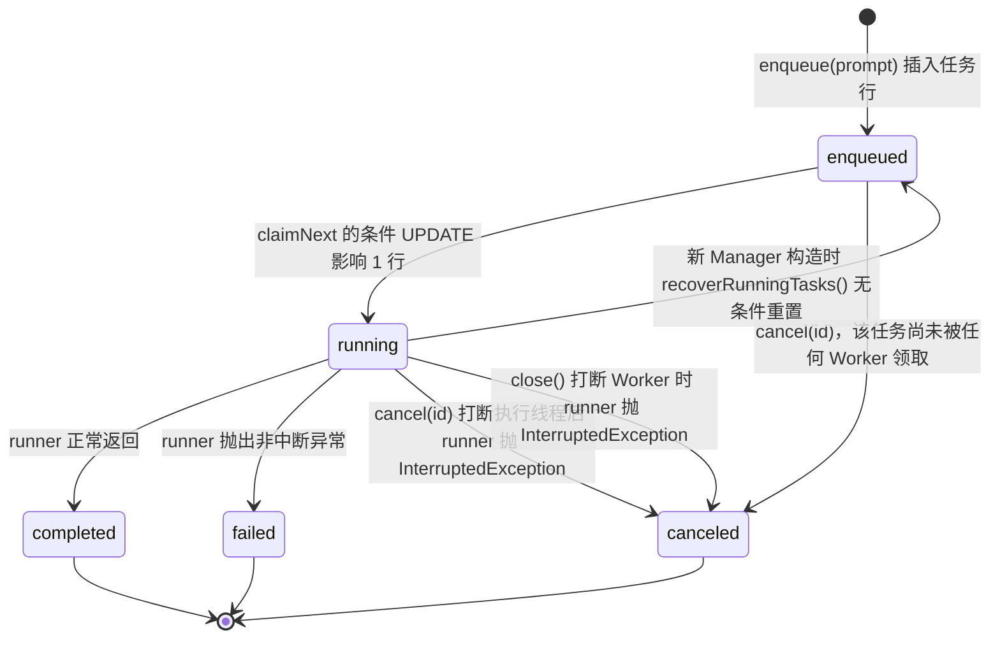
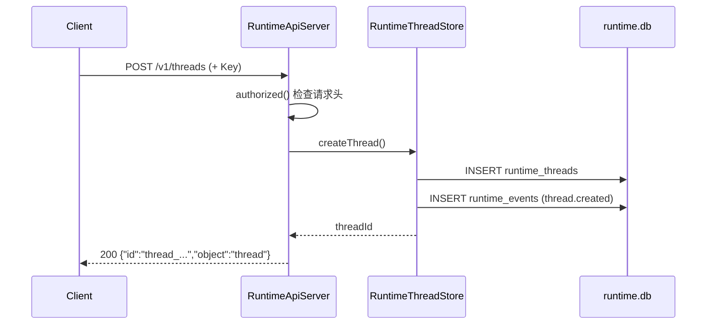
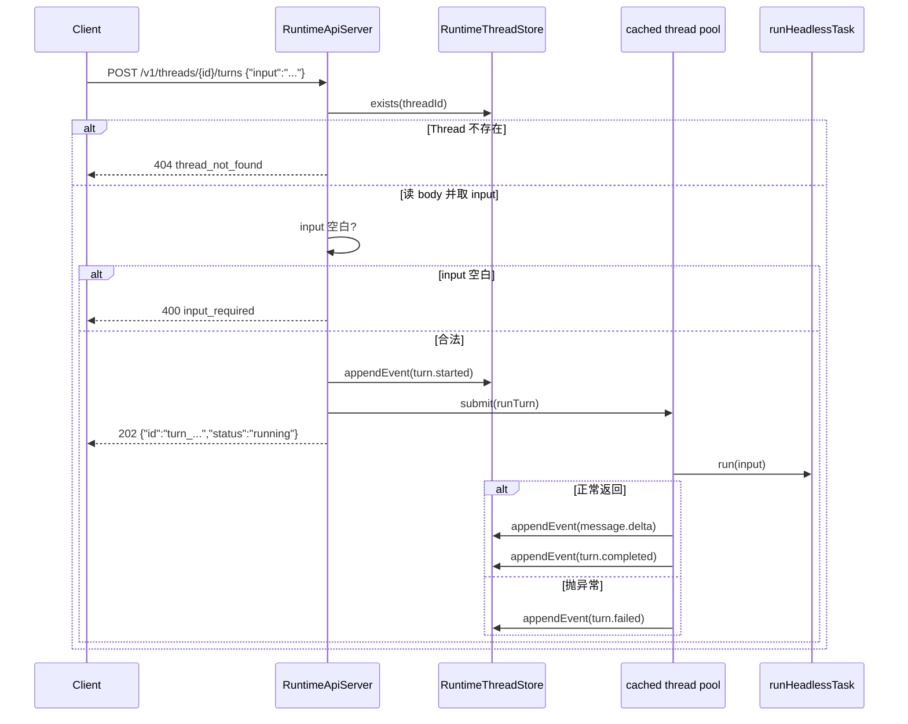
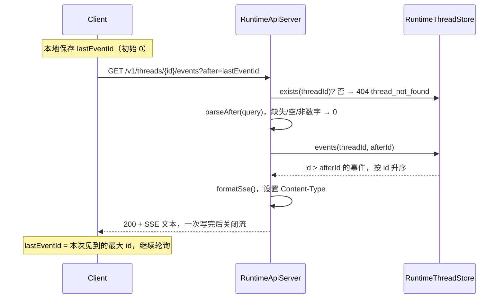

# 异步任务与 Runtime API

> **本文怎么读**
>
> - 读者假设：会写 Java、懂工程常识，但**没有接触过持久化任务队列、HTTP 服务端接口或事件流**。第 0 部分专门补这些前置概念，有经验的读者可以直接跳到第 1 部分。
> - 本文描述的是**代码实际做了什么**，包括「算了但没入库」「定义了但没人调用」「注释说的和实现的不是一回事」「某个配置形同虚设」这类真实落差。它不是「分布式任务队列教程」，也不会把将来可能做的租约、背压、幂等键写成已交付能力。
> - 所有 `file:line` 对应当前源码。正文有意**不写具体常量数值**（数值会随代码调整而过期），需要精确值时按行号自行核对。唯一的例外是必须点名的地址字面量 `127.0.0.1`。
> - 本文涉及 SQLite，但不解释 SQLite 是什么，需要背景请看 `04-code-rag-graph.md` 关于 SQLite 表结构与事务边界的讨论。

---

# 第 0 部分　前置知识

## 0.1 交互式 CLI 循环解决不了什么

默认的 CodeAgent CLI 是这样的：用户敲一句输入，程序在**当前线程**里跑完 LLM 调用与工具循环，把答案打印在终端上，然后再等下一句输入。这种「同步一问一答」适合人坐在终端前等着。

它解决不了四件事：

| 诉求 | 同步循环为什么不行 |
|---|---|
| 提交一个要跑很久的任务，然后关掉终端 | 任务活在进程的内存和调用栈里，进程一走就没了 |
| 进程被 kill 之后，恢复没跑完的任务 | 没有任何地方记录了「有哪些任务没跑完」 |
| 别的程序（脚本、编辑器插件、CI）发起一次执行 | 没有对外接口，只有终端 |
| 限制同时运行的任务数量 | 每个请求都直接开一个线程，没有上限概念 |

Runtime 层就是为了接住这四件事。注意这里的「Runtime」**不是 JVM Runtime**，而是「承载 Agent 执行的生命周期层」：把一次函数调用升级成具有身份、状态、持久化记录和外部接口的**运行实体**。

## 0.2 什么是持久化任务队列

「任务队列」这个词容易被想复杂。它的最小形态只有三样东西：

1. **一张表**，每一行代表一个待办或已办的任务，行里有状态字段。
2. **一个生产者**：往表里插一行，状态写 `enqueued`（已入队）。
3. **一个消费者**：反复去看表里有没有 `enqueued` 的行，有就把它改成 `running` 然后干活。

「持久化」的意思是：**这张表在磁盘上（这里是 SQLite），不在内存里**。所以进程重启后，表还在，行还在，状态还在。这是它和 `ExecutorService` 的 `submit()` 最本质的区别——`submit()` 返回的 `Future` 一旦进程死掉就什么都不剩了。

一句类比：`Future` 是「叫号小票」，丢了就只能重排；持久化任务队列是「医院挂号系统」，你人走了号还在系统里。

## 0.3 为什么要有固定大小的 Worker，而不是每任务一个线程

最直觉的实现是「来一个任务开一个线程」。问题是：任务是用户提交的，用户可以一次提交一百个；每个 Agent 任务又会调 LLM、读文件、起子进程。线程数量不受控，机器资源就不受控。

所以生产者只负责「写表」，**消费者是预先起好的固定几个线程**，它们循环地「领一个、干一个、再领一个」。这样并发上限天然等于 worker 数量，跟提交量无关。

代价是：任务现在要**排在别人后面**，所以需要一个明确的排序规则（这里是先入先出），以及一个「没人抢同一个任务」的保证。

## 0.4 状态机、compare-and-set 与「谁抢到了这个任务」

任务行有一个状态字段，它只能沿固定的方向走，这叫**状态机**：

```
enqueued → running → completed / failed
   ↓          ↓
canceled   canceled
```

状态机的价值在于：它把一个模糊的问题（"这个任务现在怎么样了"）变成了一个可以从数据库里直接读出来的确定值。

但状态机带来一个新问题：**多个 worker 同时看到同一条 `enqueued` 行，怎么保证只有一个去执行？**

朴素做法是「先查再改」：

```sql
SELECT ... WHERE status = 'enqueued' LIMIT 1;   -- 两个 worker 都查到了 task_abc
UPDATE ... SET status = 'running' WHERE id = 'task_abc';  -- 两个都执行了，任务跑了两遍
```

正确的做法是让**条件本身参与更新**，也就是 compare-and-set（CAS）：

```sql
UPDATE ... SET status = 'running'
WHERE id = 'task_abc' AND status = 'enqueued';   -- 只有一行能成功，另一行影响 0 行
```

`UPDATE` 返回的「影响行数」就是那把裁判锤：返回 1 的那个 worker 拿到了任务，返回 0 的那个知道「我输了，继续找下一个」。这个技巧在本文的第 2.5 节会被逐行拆开。

## 0.5 什么是 HTTP Runtime API

「API」在这个语境里指：程序 A 通过**网络请求**让程序 B 做事。这里 B 是 CodeAgent 本体，A 是任何会发 HTTP 的东西（curl、Python 脚本、另一个 Agent）。

一次 HTTP 交互由三部分组成：**方法**（`POST` 提交、`GET` 读取）、**路径**（`/v1/threads` 这种）、**请求体 / 响应体**（JSON）。

本项目**没有引入 Web 框架**，用的是 JDK 自带的 `com.sun.net.httpserver.HttpServer`。这是有意的最小依赖选择，代价是路由、参数解析、序列化都要手写（见第 3 部分）。

HTTP 请求天然是同步的：客户端发出去，等服务端回。但 Agent 执行要几十秒甚至更久，让客户端一直挂着不现实。所以这里的做法是**提交即返回**：`POST` 立刻返回一个「已受理」的状态码和任务 ID，真正的执行放到后台线程里，客户端之后再来问结果——这叫**异步接口**。

## 0.6 什么是事件流、游标与 SSE

「事件流」是把一次执行的**过程**也记下来，而不是只留最终结果。比如一次 LLM 调用会依次产生：

```
turn.started  →  message.delta  →  turn.completed
```

每条事件有一个**严格递增的整数 ID**，客户端记下「我读到哪了」，下次带着这个 ID 来问「比它大的都给我」。这个 ID 就叫**游标（cursor）**。游标的语义必须精确到「大于」还是「大于等于」——差一个等号就会重复消费或漏消费（见第 3.6 节）。

**SSE（Server-Sent Events）** 是一种文本编码格式，专门用来在 HTTP 里传事件。它的样子是每条事件几行 `key: value`，事件之间空一行：

```
id: 12
event: turn.completed
data: {"turn_id":"turn_x","status":"completed"}
```

请注意：**SSE 只规定了格式，没有规定必须长连接推送**。这一点是本文最容易误解的地方之一——本项目的实现是「查一次、格式化、返回、关连接」，实时性来自客户端反复来问（短轮询），而不是服务端主动推。协议格式和传输语义是两件事。

## 0.7 名词速查

| 名词 | 在这里的含义 |
|---|---|
| 任务 / task | 一条 `runtime_tasks` 表记录，代表一次待执行的 Agent 调用 |
| worker | 循环「领任务、执行、写状态」的固定线程 |
| lease / 租约 | 一个任务被某个消费者「独占一段时间」的机制。**本项目没有**，只有状态字段 |
| at-least-once | 保证任务至少被完整执行一次，可能重复。与 exactly-once（恰好一次）相对 |
| Thread / Turn | HTTP 侧的两个概念。Thread 是事件归属容器，Turn 是「一轮输入」 |
| 游标 | 客户端记录的最后已消费事件 ID |
| CAS | compare-and-set，带旧状态条件的 UPDATE |
| 无头执行（headless） | 没有人盯着终端、不需要交互审批的执行方式 |
| HITL | Human-in-the-loop，工具调用前弹人工审批 |
| ReAct | 「想一想、调个工具、再想一想」的单 agent 循环。当前与统一多 Agent 协作的 Plan-and-Execute 并列；后者只从 `/plan` 进入 |
| 交互式 CLI | 用户敲 `/xxx` 命令的那个终端界面 |

---

# 第 1 部分　整体地图

## 1.1 两个子系统，只共享一个函数接口

「Runtime 层」在当前代码里**不是一层的名字，也不是一个类**，而是两个相互独立、只在类型层面共享一个函数接口的子系统：



两条路径共享的唯一抽象是这个函数接口：

```java
String run(String prompt) throws Exception;   // src/main/java/com/codeagent/runtime/task/TaskRunner.java:5
```

它让两个子系统都不直接依赖 `Agent` 类：生产环境接一个 lambda，测试里也接一个 lambda（`DurableTaskManagerTest.java:17`、`RuntimeApiServerTest.java:20`）。`TaskRunner` 的完整定义在 `TaskRunner.java:3-6`。

**当前不存在的连接**（这几条决定了本文必须分两半讲）：

| 不存在的连接 | 证据 |
|---|---|
| HTTP 提交 Turn 不写 `runtime_tasks`，也不经过固定 Worker Pool | `RuntimeApiServer.java:96-99` 只写事件表、只提交自己的 executor |
| 后台任务不产生任何 Thread / Turn / Event | `DurableTaskManager.java` 全文没有 `RuntimeThreadStore` 引用 |
| 两套数据库文件、目录、Store 各自独立 | `DurableTaskManager.java:45-54` vs `RuntimeThreadStore.java:24-33` |
| 两条路径不能在同一个进程里同时提供 | `Main.java:218-222` 命中 `serve` 分支后 `return`，永远不会走到启动任务管理器的 `Main.java:374` |

所以简历可以把它们合并成「异步任务与 Runtime API 能力」，但技术讲解时必须说清这是两个子系统。

## 1.2 分层与文件清单

| 层次 | 核心类 | 职责 | 不负责什么 |
|---|---|---|---|
| 任务编排 | `DurableTaskManager` | 建表、入队、领取、执行、取消、恢复、关闭 | 不实现 Agent 逻辑 |
| 任务模型 | `DurableTask` / `TaskStatus` | 行快照与状态枚举 | 不持有线程，不是运行实体 |
| 执行契约 | `TaskRunner` | 把 prompt 变成字符串的可替换边界 | 不传达中间进度、不支持审批 |
| CLI 渲染 | `TaskCommandFormatter` | `/task` 子命令分发与文本输出 | 不直接碰 SQL |
| HTTP 入口 | `RuntimeApiServer` | 鉴权、路由、SSE 编码、异步提交 | 不持久化 Thread，不调度后台任务 |
| HTTP 存储 | `RuntimeThreadStore` | Thread 与 Event 两张表 | 不存会话历史、不存模型信息 |

源码全部在 `src/main/java/com/codeagent/runtime/` 下：

```
runtime/
├── CancellationContext.java      取消令牌的进程内上下文（与后台任务无直接关系，见 6.3）
├── CancellationToken.java        取消标志
├── api/
│   ├── RuntimeApiServer.java     HTTP 服务端（鉴权 / 路由 / SSE）
│   ├── RuntimeThreadStore.java   runtime.db 的 JDBC 封装
│   └── RuntimeEvent.java         事件行的 record
└── task/
    ├── DurableTaskManager.java   SQLite 任务队列本体
    ├── DurableTask.java          任务行快照（record）
    ├── TaskStatus.java           五态枚举
    ├── TaskRunner.java           唯一共享契约
    └── TaskCommandFormatter.java /task 命令
```

## 1.3 外部接线点：只有三处

| 入口 | 触发方式 | 代码位置 |
|---|---|---|
| 启动后台任务管理器 | 交互式 CLI 启动时无条件创建并 `start()`，注册 shutdown hook | 创建 `Main.java:374`；`start()` `Main.java:375`；hook `Main.java:376` |
| 启动 Runtime API | 命令行 `serve --http [--port N]` | 判定 `Main.java:1054-1059`；分发 `Main.java:218-222`；实现 `Main.java:1095-1124` |
| `/task` 命令族 | 用户敲命令 | 解析 `CliCommandParser.java:273-278`；分发 `Main.java:808-811`；实现 `TaskCommandFormatter.java:8-40` |

两个细节值得单独记：

- **`serve` 的判定同时要求两件事**：第一个参数是 `serve`，并且参数列表里**任意位置**出现 `--http`（`Main.java:1054-1059`）。所以 `serve` 单独出现不会启动 API，会掉进普通交互式 CLI；`--http` 出现在别的子命令后面也不会触发。
- **端口解析是静默回退的**：`--port` 后面的值解析失败时直接返回内置默认端口，不报错（`Main.java:1126-1140`）。也就是说把 `--port` 写成非数字，服务仍然会起来，只是监听的地方跟你想的不一样。

## 1.4 边界：无头路径是 ReAct-only

这是最容易被过度宣传的一点，必须主动澄清。

`runHeadlessTask` 的全文只有几行（`Main.java:1119-1130`），它做的事是：新建一个**普通 `ToolRegistry`**、设置项目路径、新建一个**普通 `Agent`**、挂上会话账本（失败就忽略）、然后 `agent.run(prompt)`。

对照交互式循环里的两条执行分支：

| 执行模式 | 交互式 CLI | 无头路径（后台任务 / HTTP Turn） |
|---|---|---|
| ReAct | Mode Router 选择或 `/react` 显式覆盖 | **唯一支持** |
| Plan-and-Execute | Mode Router 选择或 `/plan` 显式覆盖 | 不支持 |

原因不是「忘了接」，而是契约形状决定的：`TaskRunner` 只有 `run(String prompt)`（`TaskRunner.java:5`），**没有回传中间计划、审批请求或子 agent 消息的通道**。Plan 依赖 `PlanExecuteAgent.PlanReviewHandler` 的人工审阅（`Main.java:1291-1322`）。没有终端的执行环境里，这条路无处落脚。

由此还顺出一个重要事实：**无头执行不经过 HITL 审批**。它用的是 `new ToolRegistry()`（`Main.java:1120`），而交互式路径用的是 `HitlToolRegistry`（`Main.java:239`，装配进 Agent 在 `Main.java:337`）。工具仍然受各自的策略约束，但不会弹人工确认。

## 1.5 四个容易混淆的持久化位置

项目里到处是「本地文件」，很容易把它们当成一个系统：

| 路径 | 存什么 | 属于本文吗 |
|---|---|---|
| `~/.codeagent/tasks/tasks.db` | 后台任务队列（`runtime_tasks` 一张表） | **是**，第 2 部分 |
| `~/.codeagent/runtime/runtime.db` | HTTP 的 Thread 与 Event（两张表） | **是**，第 3 部分 |
| `~/.codeagent/rag/codebase.db` | 代码块、向量、关系图谱 | 否，见 `04-code-rag-graph.md` |
| `~/.codeagent/history/**` | 会话账本（JSONL 文件，**不是 SQLite**） | 否，见 `06-memory-context.md` |

前两个都是 SQLite，但**是两个不同文件、两个不同的连接、两套不同的配置键**（`DurableTaskManager.java:45-54` / `RuntimeThreadStore.java:24-33`）。不要因为都叫「运行时」就以为它们是一个库。

---

# 第 2 部分　持久化后台任务

## 2.1 生命周期与入口



对应源码：状态枚举在 `TaskStatus.java:3-8`，终态判断在 `DurableTask.java:16-20`。

**读这张图要注意两点：**

1. `cancel(id)` 是**立刻**把行写成 `canceled` 的（`DurableTaskManager.java:151`），不是等 runner 停下来才写。所以一个正在跑的任务，在数据库里可能已经是终态 `canceled`，而它的线程还在真实执行。runner 之后无论正常返回还是抛中断，代码都会**重读状态**并拒绝覆盖（`DurableTaskManager.java:177-180`、`:189-190`）。这是这张图里唯一处理得比较讲究的竞争点。
2. 图中 `running --> enqueued` 是**无条件**的：只要行的状态是 `running` 就会被改回去，不看是谁在跑（`DurableTaskManager.java:295-306`）。这带来了第 7 部分会展开的多实例互相干扰问题。

## 2.2 配置、建库，以及两个必须知道的事实

**数据库位置**（`DurableTaskManager.java:45-54`，入口 `openDefault` `:41-43`）：

```
system property  codeagent.task.dir
  → 环境变量      CODEAGENT_TASK_DIR
    → 默认        <user.home>/.codeagent/tasks/tasks.db
```

**Worker 数量**（`DurableTaskManager.java:56-69`）：

```
system property  codeagent.task.workers
  → 环境变量      CODEAGENT_TASK_WORKERS
    → 内置默认值
```

解析失败（非数字）时静默回退内置默认值（`:66-68`）；解析出的值被夹到一个合法下限（`:65`）；构造器对传入值再夹一次（`Main.java` 之外，见 `DurableTaskManager.java:30`）。这两处夹取保证了「worker 数不会小于 1」。

构造器还会顺手做三件事：创建父目录、打开 JDBC 连接、建表、执行 `recoverRunningTasks()`（`DurableTaskManager.java:31-38`）。**它不会自动启动线程池**——`start()` 是调用方显式调的（`Main.java:375`）。测试里能看到这个区别：生命周期用例都先 `manager.start()`，而恢复用例只 `enqueue` 不 `start`（`DurableTaskManagerTest.java:19`、`:52` vs `:33-38`）。

### 事实一：初始化失败会让整个 CLI 起不来（fail-fast，与全项目风格不一致）

`openTaskManager` 只有一条路径：捕获**任何** `Exception`（不只是 `SQLException`）并包成 `IllegalStateException` 往上抛（`Main.java:1132-1137`）。而 `main` 里那个大 `try` **只 catch `IOException`**（`Main.java:1025-1027`）。`IllegalStateException` 继承自 `RuntimeException`，不会被捕获，于是它逃出 `main`，JVM 打印堆栈并以非零码退出。

对比同一个 `try` 块里其它组件的处理方式：

| 组件 | 初始化失败时的行为 | 代码位置 |
|---|---|---|
| MCP server | 写进启动提示，继续 | `Main.java:294-304` |
| 内置 skill 解压 | 写进启动提示，继续 | `Main.java:313-317` |
| 会话账本 | 降级为 `ConversationLedger.disabled()`，继续 | `Main.java:328-335` |
| 可恢复会话 | 写进启动提示，继续 | `Main.java:345-368` |
| RAG 检索 | 根本不是启动期依赖，每次调用时 try-with-resources 临时打开 | `Main.java:936`、`Main.java:960` |
| **后台任务管理器** | **抛 `IllegalStateException`，交互式 CLI 完全无法启动** | `Main.java:374`、`1155-1161`、`1048-1051` |

也就是说：**一个功能上属于「可有可无」的后台任务队列，成了交互式 CLI 的硬启动依赖。** 如果 `tasks.db` 的父目录建不出来、数据库文件损坏、或者 SQLite 因为别的进程持锁而让建表/恢复语句失败（`recoverRunningTasks` 是一条写 `UPDATE`，`DurableTaskManager.java:295-306`），用户就连主界面都进不去。这个不一致是可以修的——按其它组件的写法包一层 `try/catch` 然后降级（例如禁用 `/task`）即可。

顺便对比一下另一个入口：`serve` 路径失败时是**打印错误再 `System.exit(1)`**（`Main.java:1120-1123`），语义清晰，也不会留下半个初始化的进程。

### 事实二：表和 DDL 内联在 Java 里，没有 schema 迁移机制

建表语句是直接写在 Java 字符串里的（`DurableTaskManager.java:274-293`），用的是 `CREATE TABLE IF NOT EXISTS`，加两个 `CREATE INDEX IF NOT EXISTS`。`RuntimeThreadStore` 同样（`RuntimeThreadStore.java:105-124`）。

项目里**没有 `.sql` 文件、没有版本号表、没有 `ALTER TABLE`**。含义非常具体：

> **给 `runtime_tasks` 或 `runtime_events` 加一列，对已存在的数据库不生效。** 老用户的 `tasks.db` 已经在磁盘上，`IF NOT EXISTS` 会让整条 `CREATE` 被跳过，新列永远加不上，随后新代码一 `INSERT` 就报 `no such column`。

实践后果是「改表结构 = 让用户删库」。对任务队列表来说，删库意味着丢掉历史任务记录；对事件表来说，意味着丢掉所有 Thread 的历史（虽然它们本来也没什么用，见 3.3）。这与 `04-code-rag-graph.md` 里对 RAG 表结构的结论是同一种问题——但那里的数据可以靠源码重建，这里的不能。

配置键本身还有一个容易踩的坑，见 2.8 节末尾。

## 2.3 `runtime_tasks` 表存什么

| 列 | 类型 / 约束 | 存什么 |
|---|---|---|
| `id` | `TEXT PRIMARY KEY` | 任务 ID，带固定前缀加一段 UUID 片段（`DurableTaskManager.java:90`） |
| `status` | `TEXT NOT NULL` | `enqueued` / `running` / `completed` / `failed` / `canceled` |
| `prompt` | `TEXT NOT NULL` | 已 `trim()` 的输入（`:98`） |
| `result` | `TEXT`（可空） | 成功结果；取消时保留旧值；写入时 `null` 会被替换成空串（`:262`） |
| `error` | `TEXT`（可空） | 失败原因或取消原因；**可以真的是 NULL**（`:263`） |
| `created_at` | `TEXT NOT NULL` | 入队时间（ISO-8601 字符串） |
| `started_at` | `TEXT`（可空） | 最近一次被领取的时间 |
| `finished_at` | `TEXT`（可空） | 进入终态的时间 |
| `updated_at` | `TEXT`（可空） | 最近一次状态写入时间 |
| `duration_ms` | `INTEGER DEFAULT 0` | 本次执行时长；**不加 `NOT NULL`** |

索引两条：`status` 上的一个（服务状态过滤）、`created_at` 上的一个（服务 FIFO 领取和列表排序）（`DurableTaskManager.java:290-291`）。

**时间列全是 `TEXT` 而不是 SQLite 的时间类型**，读写靠 `Instant.toString()` / `Instant.parse()`（`:322-327`）。好处是可读、时区无关；代价是任何非 `Instant.parse` 能接受的字符串都会在读行时抛 `DateTimeParseException`（这个异常不是 `SQLException`，会直接穿过 `find` 的 catch 冒出去）。

## 2.4 入队、列表、点查

三个读入口都简单，但各自的「夹取」和「静默」值得记一下。

**`enqueue`**（`DurableTaskManager.java:86-106`，`synchronized`）：拒绝 `null` 和纯空白，抛 `IllegalArgumentException`（`:87-89`）→ 生成 ID（`:90`）→ 插入一条 `status = enqueued` 的记录，只写 `created_at`（`:92-100`）→ `notifyAll()` 唤醒正在等的 Worker（`:101`）→ **`find(id)` 重读一次数据库**并把读回来的快照返回（`:102`），而不是直接把内存对象返回。数据库异常被包成 `IllegalStateException`（`:103-105`）。

注意 `enqueue` 没有开事务也没有关 autoCommit，它是一条自动提交的 `INSERT`。

**`list(limit)`**（`:108-126`）：按 `created_at DESC` 取最近的若干条，`limit` 被夹到一个合法区间（`:109`）。排序方向是**给用户看最近任务**用的，**不是 Worker 的调度顺序**——Worker 领的是最旧的（见 2.5）。

**`find(id)`**（`:128-140`）：空 ID 直接返回 `Optional.empty()`，否则参数化查询。状态字符串经 `TaskStatus.from` 解析。

**`TaskStatus.from` 有一条静默回退**（`TaskStatus.java:20-30`）：匹配时同时接受枚举的 `value()` 和 `name()`，且两者都忽略大小写（`:25`）；**`null` 或任何无法识别的字符串一律回退成 `ENQUEUED`**（`:21-22`、`:29`）。后果是：如果 `status` 列因为人工修改、字符集问题或未来的枚举变更而存了一个脏值，这个任务不会报错、不会标失败，而是**被当成新任务重新执行一遍**。这是一处「读取失败伪装成正常状态」的静默行为。

## 2.5 原子领取：`claimNext` 逐行拆解

这是整个后台任务子系统里最核心的一段代码，`DurableTaskManager.java:206-251`。它是 `synchronized`，并且在临界区内**关闭 autoCommit**，形成显式事务。

```text
setAutoCommit(false)
  ├─ SELECT * WHERE status='enqueued' ORDER BY created_at ASC LIMIT 1
  ├─ if 没有命中        → commit() 并 return null          ← 走的是 commit，不是 rollback
  ├─ UPDATE SET status='running', started_at=now, updated_at=now
  │         WHERE id=? AND status='enqueued'
  ├─ if 影响 0 行        → rollback() 并 return null        ← 被别人抢走了
  ├─ commit()
  └─ return find(task.id())                                ← autoCommit 仍为 false
catch SQLException → rollback() 并向上抛
finally → setAutoCommit(true)
```

四个值得单独讲的点：

1. **「没拿到任务」不是错误，所以走 `commit` 而不是 `rollback`**（`:223-226`）。两者在只有一条 SELECT 的事务里效果一样，但语义清晰：空结果是正常的轮询结果。
2. **只有两条 SQL 是「决策性」的**：SELECT 挑候选、UPDATE 做 CAS。UPDATE 的 `WHERE` 里同时有 `id` 和 `status = enqueued`（`:228-237`），这才是防止两个 Worker 跑同一个任务的关键（`:238-241`）。
3. **成功后返回值是从数据库重读的**（`:244`），而且此时 autoCommit **还是 false**（直到 `finally` 才恢复，`:248-250`）。重读保证返回的快照和落库状态一致（例如 `started_at` 是真值），但也意味着 `claimNext` 的事务里夹了一次 `find`。
4. **所有这些串行化都发生在单个 Manager 实例的锁上**，因为整个类只有一条 JDBC 连接（`DurableTaskManager.java:22`、`:36`）。锁只在**单进程内**有效；**跨进程**的互斥完全依赖 SQLite 的写锁加那条条件 UPDATE。这也解释了为什么 `recoverRunningTasks` 的无条件重置在多实例下会出事（第 7 部分）。

## 2.6 Worker 循环与并发语义

`start()`（`DurableTaskManager.java:71-84`，`synchronized`）检查 `running` 标志做幂等短路，然后建一个固定大小线程池，线程名统一、设为 daemon，并按 worker 数量提交同样数量的 `workerLoop`。

`workerLoop` 的控制流（`:160-204`）：

```text
while (running):
    task = claimNext()
    if task == null:
        synchronized(this) { wait(一个固定超时) }    ← 超时是为了不依赖 notifyAll 也能醒
        continue
    runningTasks.put(taskId, 当前线程)               ← 进程内「任务 → 执行线程」映射
    startedAt = Instant.now()                        ← 本地时钟，不是数据库的 started_at
    try:
        result = runner.run(task.prompt())            ← 在锁外执行
        synchronized: 重读状态；若不是 canceled 就写 completed
    catch InterruptedException: 清标记；写 canceled
    catch Exception:            重读状态；若不是 canceled 就写 failed
    finally: runningTasks.remove(taskId)
```

并发语义可以一句话概括：**领取是串行的，执行是并行的**。`claimNext` 在对象锁内，而真正的 `runner.run` 在锁外（`:174-181`），所以最多有「worker 数量」个任务同时在跑，而所有数据库访问仍然被同一把锁串行化。这是有意的设计——长时间持有 Java 锁会阻塞其它任务的状态写入和取消。

还有一个隐含的线程安全结论：`TaskRunner` 的契约**不要求线程安全**，因为默认实现每次调用都新建 `ToolRegistry` 和 `Agent`（`Main.java:1119-1130`）。风险只在调用方自己传进一个有状态的 runner 时才出现。

### 缺陷一：Worker 在等待点被中断会永久退出，而且不会被补充

`workerLoop` 有**两层** `catch (InterruptedException)`，它们的后果完全不同：

| 中断发生在哪 | 谁捕获 | 后果 |
|---|---|---|
| `runner.run()` 内部 | **内层**（`:182-186`） | 清中断标记、把任务写 `canceled`、**Worker 继续存活** |
| `wait(...)`（`:166-169`）或 `claimNext()` 期间 | **外层**（`:197-199`） | 恢复中断标记后直接 `return`，**该线程永久退出** |

而线程池**不会补充**：`start()` 在 `running` 为 true 时直接返回（`:71-75`），全类没有任何 refill 逻辑。所以每死一个 Worker，可用并发就永久少一个；长期运行的进程里池会单向萎缩，最后可能缩到 0（`running` 仍为 true，`start()` 被幂等短路挡住，谁也救不回来）。

一条具体的触发链：runner 忽略中断（比如某个 HTTP 客户端不响应 interrupt）但正常返回 → **中断标记留在池线程上**（内层 catch 没被触发，因为 runner 没抛异常）→ 该 Worker 下一轮进 `wait(...)` 立即抛 `InterruptedException` → 外层 catch → 线程死。

这是一个真实的取舍代价：`interrupt` 本意是给**任务**的协作式取消信号，意外地变成了**消费者线程**的自杀开关。

### 缺陷二：`catch (Exception ignored)` 让 Worker 保活，但没有退避

外层还有一个 `catch (Exception ignored)`（`:200-202`），注释写着「Worker 循环必须存活；单独的失败已经尽可能记在任务行上」。这条设计本身是对的——比如 `claimNext` 因为数据库短暂不可用而抛 `SQLException` 时，任务行不会被污染成 `failed`，Worker 也不会死。

但它**没有任何退避**：捕获之后循环立刻回到顶部，再次调用 `claimNext()`。如果数据库处于持续失败状态（文件被删、磁盘满、连接坏掉），这个 Worker 会变成**紧循环空转**，把 CPU 打满并且刷不出任何日志。正确做法是异常路径上也要有一个等待。

> 这是从代码结构推断的行为，我**没有**实际制造数据库故障去验证它——但循环体里除 `wait`/`runner.run` 之外没有任何阻塞点，所以推断成立。

## 2.7 完成、失败、取消、恢复、关闭

### 正常完成（`DurableTaskManager.java:176-181`）

runner 返回后，Worker 在锁内**重读**任务行；只有当前状态不是 `canceled` 时，才写入 `completed` 加结果。这个二次检查解决「用户刚点了取消、runner 恰好同时返回」的竞争。

### runner 抛普通异常（`:187-193`）

先做同样的「不是 canceled 才写」检查，然后落 `failed`，`result` 写空串，`error` 取 `e.getMessage()`。

两个落差：**`getMessage()` 可以是 `null`**，此时 `error` 列就真的是 NULL（`:263` 不做空值替换，只有 `result` 做，见 `:262`）；**异常类型和堆栈完全不持久化**——只有一行字符串。排查后台任务失败时，信息量取决于那个异常消息写得好不好。

### runner 抛 `InterruptedException`（`:182-186`）

先 `Thread.interrupted()` **清掉当前线程的中断标记**，再把任务写 `canceled`、错误文本为固定的一句话。清标记是必要的：否则这个池线程回到下一轮会在阻塞点立刻再次失败。

注意这里**不检查任务当前状态**——它是无条件写入的。也就是说，一个正常完成的任务如果在 runner 返回前恰好被 `close()` 打扰，写进去的就是 `canceled`。

### 取消（`cancel(id)`，`:142-154`，`synchronized`）

```
find(id) → 不存在或者是终态 → return false
runningTasks.remove(id) → 若有线程绑定则 interrupt()     ← 从映射里取出并移除
markTerminal(id, CANCELED, 保留旧 result, "用户取消", 旧 startedAt)
notifyAll()
return true
```

三个细节：

- **interrupt 只是「尽力而为」**。它不能强杀线程（Java 没有安全的 `Thread.stop`），能不能停下来取决于 runner 内部有没有在阻塞点检查中断。
- **数据库状态与真实执行状态会脱钩**：行已经是 `canceled`，而线程可能还在跑、还在调 LLM、还在产生副作用。
- **`duration_ms` 在取消路径上基本没有意义**：`markTerminal` 的时长是 `now - startedAt`，而取消 `enqueued` 任务时传入的 `startedAt` 是数据库里的值——对于还没被领取的任务它**就是 null**，于是时长记为 0（`:255`）。同时 `finished_at` 会被写成当前时间，造成「有结束时间但没有开始时间」的奇怪行。取消一个 `running` 任务时传入的是数据库里的 `started_at`，这是**跨线程读到的墙钟时间**，和正常完成路径用的 Worker 本地时钟（`:173`）不是同一个基准。

### 启动恢复（`recoverRunningTasks`，`:295-306`，构造期调用 `:38`）

```sql
UPDATE runtime_tasks SET status = 'enqueued', updated_at = ?
WHERE status = 'running'
```

四个必须说清的点：

1. **只改两列。** `started_at`、`finished_at`、`duration_ms` 原样保留上一轮的陈旧值。所以一个被恢复的任务在 `/task log` 里会显示「从未开始的开始时间」或「上一次运行留下的时长」。
2. **语义是 at-least-once，不是断点续跑。** 进程可能在「外部副作用已经完成、但 `completed` 还没落库」的窗口里崩溃，重启后任务会**从头再跑一遍 prompt**。`DurableTask` 里没有「当前迭代到第几轮」「已调用过哪些工具」这类信息，恢复就是重新排队。
3. **它是无条件的，不看任务属于谁。** 如果两个进程共享同一个 `tasks.db`，新实例启动会把另一个**正在真实执行**的任务重置成 `enqueued`，然后自己的 Worker 再领一遍。当前模型事实上是**单进程独占这个数据库**。
4. **它只覆盖崩溃，不覆盖正常退出。** 见下一条。

### 关闭（`close()`，`:329-345`）

`running = false` → `notifyAll()` 唤醒等待的 Worker → `shutdownNow()` 中断池线程 → 等待一个短超时 → 关闭 Connection。它由 shutdown hook 调用（`Main.java:376`），所以 Ctrl+C 或正常退出都会走到这里。

把这条和恢复放在一起看，会得到一个反直觉的结论：

> **正常退出时，正在执行的任务会被打断并标记为 `canceled`（终态），因此下次启动不会被恢复；只有「非正常崩溃」留下的 `running` 行才会被重新排队。**
>
> 路径：`close()` → `shutdownNow()` → Worker 在 `runner.run()` 里收到中断 → 内层 catch（`:182-186`）→ 写 `canceled`。而 `canceled` 是终态，`recoverRunningTasks` 只扫 `running`。

如果 runner 不响应中断，等待超时后连接先被关闭，Worker 再去写状态就会抛 `SQLException` → 被 `markTerminal` 包成 `IllegalStateException`（`:270`）→ 落到外层 `catch (Exception ignored)` 被吞掉。结果是**任务行保持 `running`**，等下一次启动才会被恢复。也就是说「runner 不听中断」反而让任务更容易被恢复——这个行为不是设计的，是两段错误处理的巧合。

## 2.8 CLI 的 `/task` 命令族

解析在 `CliCommandParser.java:273-278`（裸 `/task` 等价于 `/task list`），分发在 `Main.java:808-811`，实现在 `TaskCommandFormatter.java:8-40`：

| 输入 | 行为 | 实现 |
|---|---|---|
| `/task` / `/task list` | 列出最近任务 | `TaskCommandFormatter.java:10-12` |
| `/task list N` | 按 N 列出（N 解析失败回退默认值） | `:13-15`、`:82-91` |
| `/task add <内容>` | `enqueue`，输出任务 ID 和查看提示 | `:16-19` |
| `/task cancel <id>` | `cancel`，成功/失败两种文案 | `:20-25` |
| `/task log <id>` | 格式化单任务详情 | `:26-30`、`:61-80` |
| 其它 | 打印可用子命令列表 | `:31-39` |

因为匹配用的是 `regionMatches("add ", ...)` 这种**带尾随空格**的前缀，`/task add` 后面不带内容时不会当子命令处理，而是掉进「未知子命令」分支——这个行为是巧合但结果合理。

渲染侧有两处值得一提：列表里会无条件打印 `duration_ms`（`:53`），所以 `enqueued` 任务会显示 `0ms`；详情页只在 `startedAt`/`finishedAt` 非空时才打印对应行（`:66-71`），所以取消一个未执行的任务会看到「结束」却没有「开始」。

### `/task` 的一个隐藏知识：配置键不能写进 `.env`

`.env.example:135-149` 列出了这四个键：

```
CODEAGENT_TASK_DIR / CODEAGENT_TASK_WORKERS
CODEAGENT_RUNTIME_API_KEY / CODEAGENT_RUNTIME_DIR
```

但这两个类**只读 `System.getProperty` 和 `System.getenv`**（`DurableTaskManager.java:46-48`、`:57-59`；`RuntimeApiServer.java:42-44`；`RuntimeThreadStore.java:25-27`）。而项目里 `.env` 文件的读取是**按 key 白名单硬编码的**，只覆盖 LLM 相关配置（`CodeAgentConfig.java:279-295`，读取点是 `:125-272` 的各个 provider 分支）和日志配置（`Main.java:2941-2947`）。

所以：**把 `CODEAGENT_TASK_WORKERS=4` 写进 `.env` 文件里不会生效**，必须作为真实进程环境变量导出（或在启动命令前内联），或者用 `-Dcodeagent.task.workers=4`。

`.env.example` 里对这一点是**自相矛盾的**：`CODEAGENT_RUNTIME_API_KEY` 那几行给的是内联示例（正确，`:143`），而 `CODEAGENT_TASK_DIR` / `CODEAGENT_TASK_WORKERS` / `CODEAGENT_RUNTIME_DIR` 是孤立的赋值行（`CODEAGENT_TASK_WORKERS=2` 那种写法，`:137`、`:139`、`:149`），看起来像是放进 `.env` 就能用——但那些键根本不会被读取。这是一条很容易在演示时翻车的落差。

---

# 第 3 部分　Runtime HTTP API

## 3.1 对外接口只有三个

| 方法 | 路径 | 成功状态 | 作用 |
|---|---|---:|---|
| `POST` | `/v1/threads` | 200 | 创建 Thread，同时追加 `thread.created` 事件 |
| `POST` | `/v1/threads/{id}/turns` | 202 | 接收 `input`，异步跑一次 Agent |
| `GET` | `/v1/threads/{id}/events?after=N` | 200 | 返回 ID 大于 N 的事件批次（SSE 格式） |

一条 catch-all 兜底返回 404 `not_found`（`RuntimeApiServer.java:78`）。路由用 `equals` 加两条正则匹配（`:65`、`:70`、`:74`）。

**当前没有的接口**：查单个 Thread、列 Thread、删 Thread、查 Turn、取消 Turn、健康检查、限流。也没有 `PUT`/`DELETE`/`PATCH` 的任何支持——方法不匹配会落到 404 而不是 405（`:78`），因为路由判断只看「方法 + 路径是否都匹配」。

## 3.2 鉴权与绑定

- **启动时强制要求 Key**：`apiKey` 为 `null` 或空白就直接抛 `IllegalArgumentException`，服务根本不会起来（`RuntimeApiServer.java:30-32`）。配置来源是 `-Dcodeagent.runtime.api.key` → 环境变量 `CODEAGENT_RUNTIME_API_KEY`（`configuredApiKey` — `:41-47`）。
- **只绑定回环地址**：`new InetSocketAddress("127.0.0.1", port)`（`:36`），所以局域网里的别的机器连不上。
- **两种请求头任选其一，精确相等**：`Authorization: Bearer <key>` 或 `X-CodeAgent-API-Key: <key>`（`authorized` — `:130-134`）。用的是 `String.equals`，**不是**恒定时间比较（理论上可被计时攻击，本地场景可忽略）。

**鉴权的执行顺序非常关键**：`authorized()` 在方法/路径判断**之前**（`:59-62` vs `:63-78`）。这导致同一个「路径不存在」有三层完全不同的表现：

| 请求情况 | 结果 | 原因 |
|---|---|---|
| Key 缺失或错误，路径在 `/v1/threads` 前缀内 | 401 `unauthorized`（JSON） | 鉴权先执行 |
| Key 正确，路径在前缀内但不匹配任何路由 | 404 `not_found`（JSON） | catch-all（`:78`） |
| 路径前缀根本不匹配 context | JDK 自己的 404，**空 body** | 请求没进 handler；context 注册在 `:37` |

这类「同一个 404 有不同 body」的差异在写客户端时很折磨人。旧文档把它归纳为「未匹配的路径或方法一律返回 404」，是不准确的。

## 3.3 Thread 与 Event 两张表

数据库位置（`RuntimeThreadStore.java:24-33`）：

```
system property  codeagent.runtime.dir
  → 环境变量      CODEAGENT_RUNTIME_DIR
    → 默认        <user.home>/.codeagent/runtime/runtime.db
```

`runtime_threads`（`:107-112`）——**只有两列**：

| 列 | 说明 |
|---|---|
| `id` | `TEXT PRIMARY KEY`，前缀加 UUID 片段（`:36`） |
| `created_at` | `TEXT NOT NULL` |

所以 **Thread 不是一个 Agent 会话**。它没有消息历史、没有 system prompt、没有模型名、没有 workspace、没有状态字段。它只是一个「事件归属容器」，用来把事件按 `thread_id` 分组。「创建 Thread」和「创建可恢复的有状态会话」是两件不同的事，后者在 `SessionStore` 里（见 `06-memory-context.md`），两者**没有任何代码关联**。

`runtime_events`（`:113-121`）：

| 列 | 说明 |
|---|---|
| `id` | `INTEGER PRIMARY KEY AUTOINCREMENT`，**就是游标** |
| `thread_id` | `TEXT NOT NULL` |
| `type` | `TEXT NOT NULL`，事件类型字符串 |
| `data` | `TEXT NOT NULL`，**手写拼接的 JSON 字符串**，`null` 时写 `{}`（`:68`） |
| `created_at` | `TEXT NOT NULL` |

索引一条：`(thread_id, id)` 联合索引（`:122`），正好服务「按 Thread 取 ID 大于 N」这个查询。

**没有外键约束**。引用完整性由调用方保证：Turn 和 Events 两个接口都先 `store.exists(threadId)` 再往下走（`RuntimeApiServer.java:85`、`:116`）。

与后台任务表一样，**这里也没有 schema 迁移机制**（`CREATE TABLE IF NOT EXISTS`，`:105-124`）。

**`appendEvent` 的返回值没有被任何地方使用**（`RuntimeThreadStore.java:61-77`，返回自增主键 `:71-73`；五处调用点 `:43`、`RuntimeApiServer.java:96`、`:105`、`:107`、`:110` 全部丢弃）。它本来可以让服务端把事件 ID 直接回给客户端，现在客户端只能靠轮询发现。

## 3.4 创建 Thread 的链路



`createThread()` 是 `synchronized`（`RuntimeThreadStore.java:35`），内部**先插 Thread 再插事件，两次独立的 SQL 自动提交**（`:37-44`）。没有显式事务包住。后果：如果 Thread 插入成功而事件插入失败，会抛出 `IllegalStateException`，API 层转成 500，但**那条 Thread 记录已经留在库里了**，而且它的 `thread.created` 事件永久缺失。这个 Thread 之后仍然可用（`exists` 会返回 true），只是事件流开头少一条。

## 3.5 提交 Turn 的链路



实现见 `RuntimeApiServer.java:84-113`。四个要点：

1. **校验顺序是「先资源、后数据」**：`store.exists` 在 `:85`，读 body 在 `:89`。所以对着一个不存在的 Thread 提交一个空 body，拿到的是 404 而不是 400。body 的问题只在 Thread 存在之后才可能暴露。
2. **body 解析用的是 `MAPPER.readTree`**（`:89`），随后 `body.path("input").asText("")`（`:90`）。空 body 的处理依赖 Jackson 的行为——本项目锁的是 Jackson 2.16（`pom.xml:27-29`），自 2.10 起 `readTree` 对空输入返回 `MissingNode` 而不是 `null`，因此空 body 会走到 400 `input_required` 而不是 NPE。**这是根据 Jackson 版本的推断，仓库里没有针对空 body 的测试**（见第 8 部分）。
3. **事件先落库，再提交任务**（`:96-99`）。因此存在一个窗口：`turn.started` 已经写入，而 `executor.submit` 失败（例如服务正在关闭、executor 已被 `shutdownNow`）→ 抛 `RejectedExecutionException` → 被外层统一 catch 转成 500 → 库里留下一个**永远不会有终态事件的 Turn**。这属于「算了但没入库」的镜像问题：**入库了但永远算不完**。
4. **`message.delta` 不是流式增量。** runner **完整跑完之后**才追加一次完整结果（`:104-108`）。这个名字来自 OpenAI Assistants API 的命名习惯，实际语义是「本次结果消息」。不要把它讲成「逐 token 流式输出」。

**Turn ID 的生成方式**是 `"turn_" + Long.toHexString(System.nanoTime())`（`:95`）。它只在单进程内近似唯一，没有跨进程保证；更重要的是 **`turn_id` 没有独立的表，也没有唯一约束**——它只是被塞进事件 `data` 的 JSON 字符串里。所以：无法按 turn 查询事件，无法列出某个 Thread 的所有 Turn，也无法靠数据库发现 ID 碰撞。

## 3.6 事件读取与游标语义



**游标是严格大于**：SQL 是 `WHERE thread_id = ? AND id > ?`，排序 `ORDER BY id ASC`（`RuntimeThreadStore.java:81-85`）。客户端应该把 `after` 设成「已经见过的最大 ID」，这样既不重复也不遗漏。`after=0`（或缺省）返回该 Thread 的全部事件，因为自增 ID 从 1 开始。

`parseAfter`（`RuntimeApiServer.java:141-155`）用最朴素的方式解析 query：按 `&` 切、找 `after=` 前缀、`Long.parseLong`，**任何失败都返回 0**。没有 URL 解码，所以 `after=%31` 这种编码形式不会被识别（会静默变成 0，也就是**从头重放所有事件**）。参数重复时取第一个匹配项。

**响应格式与传输语义**（`handleEvents` — `:115-128`）：

- Content-Type 是 `text/event-stream; charset=utf-8`（`:123`）。
- 每条事件的编码是 `id:` / `event:` / `data:` 三行加一个空行（`formatSse` — `:157-165`）。
- **查一次、写完、关闭**（`:124-127`）：不保持连接等新事件，没有 heartbeat，没有 `retry:` 字段，也**不发送终止标记**。
- 因此真实用法只能是**短轮询**：客户端保存最后一个事件 ID，过一会儿再问一次。

这里有一个容易被讲错的实现细节：`sendResponseHeaders(200, body.length)`（`:124`）在 **`body.length == 0`** 时（也就是「本次没有新事件」），按 JDK `HttpServer` 的语义参数 0 表示**长度未知、改用 chunked 传输编码**，而不是「零长度的固定长度响应」。所以同一个接口在不同情况下会用两种传输方式返回：有事件时是 `Content-Length`，无事件时是 `Transfer-Encoding: chunked`。客户端的读取逻辑（读到流结束）两种都能工作，但如果有人依赖 `Content-Length` 做断言就会出错。**这一条是根据 JDK 的 `sendResponseHeaders` 契约推断的，我没有实际抓包验证。**

**JSON 转义是不完整的**：`escape()`（`:176-184`）处理了反斜杠、双引号、回车、换行四种字符，`data` 字段因此不会因为换行而破坏 SSE 的行结构。但 **其它控制字符（制表符、`\b`、`\f` 以及其余 C0 控制字符）不会转义**，直接落进 JSON 字符串里就会产生非法 JSON。由于 Agent 的结果文本原则上可以是任意内容，这是一处真实的健壮性缺口。

**没有保留期与清理策略**：事件表只增不减，没有任何删除或归档逻辑（`RuntimeThreadStore` 全文只有 `createThread` / `exists` / `appendEvent` / `events` / `close`）。长期运行会持续增长。

## 3.7 并发模型与端口

- **JDK `HttpServer` 的 executor 被替换成一个 cached thread pool**（`RuntimeApiServer.java:23-27`、`:38`），线程名统一、设为 daemon。HTTP 请求处理线程和异步的 `runTurn` **共用同一个池**（`:98` 也提交到 `executor`）。
- **cached pool 没有上限也没有队列**：每个并发请求都可能新建线程，池空闲时会回收。突发大量 Turn 会把线程数推高，没有背压、没有 429、没有排队。
- **同一个 Thread 上的多个 Turn 会并发执行**，事件按真实落库时间交错。服务端不会把第一个 Turn 的结果自动作为第二个 Turn 的输入——**Thread 里没有对话历史这个概念**。想做多轮对话，客户端得自己在 `input` 里带上上下文，或者换一个自己维护历史的 runner。
- **Store 的写入是串行的**：`createThread`、`exists`、`appendEvent`、`events`、`close` 都是 `synchronized`（`RuntimeThreadStore.java:35`、`:50`、`:61`、`:79`、`:126-127`），因为整个 Store 只有一条 JDBC 连接（`:12`）。锁只覆盖数据库操作，**不覆盖 runner 执行**。
- **关闭不做清理**：`close()` 是 `server.stop(0)` 加 `executor.shutdownNow()`（`:186-190`），没有等待、没有把「正在跑的 Turn」标记成失败。已提交的任务行没有，已提交的**事件**会缺终态。

端口方面：`parseServePort(args, 内置默认端口)`（`Main.java:1126-1140`）从 `--port` 取值，非法时静默回退默认值；`Main.java:1102` 把结果传给构造器。传 0 会让操作系统分配临时端口，实际端口通过 `server.port()` 打印出来（`Main.java:1115`，`RuntimeApiServer.port()` `:53-55`）——这一点在 `docs/phase-20-runtime-api.md` 的验证命令里用到了。

---

# 第 4 部分　跟着四个真实场景走一遍

## 场景一：在后台跑一个长任务

1. 用户启动交互式 CLI，`DurableTaskManager` 被创建（构造期就会恢复上次遗留的 `running`，`Main.java:374` → `DurableTaskManager.java:38`），随后 `start()` 起好 Worker（`Main.java:375`），并注册 shutdown hook（`Main.java:376`）。
2. 用户输入 `/task add 把那篇长文总结成三句话`。解析成 `TASK` 命令（`CliCommandParser.java:277-278`），分发到 `TaskCommandFormatter.handle`（`Main.java:808-811`），走到 `enqueue` 分支（`TaskCommandFormatter.java:16-19`）。
3. `enqueue` 插一条 `enqueued` 行，`notifyAll()` 唤醒一个空闲 Worker（`DurableTaskManager.java:100-101`），然后把读回来的快照打印成「已提交 + 一条查看命令」。
4. 某个 Worker 从 `wait(超时)` 醒来或被 `notifyAll` 唤醒，`claimNext` 用条件 UPDATE 把行改成 `running`（`:228-242`）。
5. Worker 在锁外调用 runner，runner 是 `prompt -> runHeadlessTask(prompt, llmClientRef.get())`（`Main.java:1134`），`runHeadlessTask` 新建 `ToolRegistry` 与 `Agent` 并 `agent.run(prompt)`（`Main.java:1119-1130`）。
6. 用户用 `/task` 或 `/task log <id>` 反复查看状态（`TaskCommandFormatter.java:10-15`、`:26-30`）。注意 `DurableTask` 只是某一时刻的快照，要看最新状态必须再查一次（`DurableTaskManager.java:128`）。
7. runner 返回后，Worker 重读状态并写 `completed` 与结果（`:176-181`）。

**一个容易忽略的细节**：runner 里读的是 `llmClientRef.get()`（`Main.java:1134`），也就是**执行那一刻**的 LLM 客户端。用户在界面里用 `/model` 切换 provider 会更新这个引用（`Main.java:706-707`）。所以：队里排着的任务用什么模型跑，取决于它被领取的时刻，**不取决于它被提交的时刻**。用户提交时看到的模型名和执行时用的可能不是同一个。

## 场景二：取消一个正在跑的任务

1. `/task cancel <id>` → `TaskCommandFormatter.java:20-25` → `DurableTaskManager.cancel`。
2. `find(id)`，不存在或已是终态 → 返回 false，CLI 打印「未找到可取消的后台任务」（`:22-24`）。
3. 否则从 `runningTasks` 映射里取出执行线程（若该任务还没被领取，映射里没有它，取出来是 `null`）并 `interrupt()`（`DurableTaskManager.java:147-150`）。
4. **立刻**把行写成 `canceled`，错误文本「用户取消」，`duration_ms` 在未领取时记为 0（`:151`、`:253-255`）。
5. 如果 runner 在阻塞点响应了中断，它会抛 `InterruptedException`，Worker 内层 catch 再写一次 `canceled`（`:182-186`）。
6. 如果 runner 忽略中断继续跑完并返回，`completed` 分支会重读状态，发现是 `canceled` 就**不改写**（`:177-180`）。数据库里仍然是 `canceled`，但底层副作用可能已经真实发生了。

**这一步的连带风险**：如果中断恰好落在 Worker 的 `wait(...)` 上，或者 runner 忽略中断但留下了中断标记，执行该任务的 Worker 线程会永久退出（第 2.6 节的缺陷一），且不会被补充。

## 场景三：外部客户端提交一轮

1. 客户端带 Key 创建 Thread → 得到 `thread_xxx`。
2. 客户端 `POST /v1/threads/thread_xxx/turns`，body 是 `{"input":"..."}`。
3. 服务端先查 Thread 是否存在（`RuntimeApiServer.java:85`），再解析 body（`:89`）、校验 input 非空白（`:91-93`）。
4. 写 `turn.started` 事件（`:96-97`），把 `runTurn` 提交到进程内的 cached pool（`:98`），**立刻返回 202** 和 turn ID（`:99`）。
5. `runTurn` 在新线程里调用同一个 `runHeadlessTask`（`Main.java:1107`），成功则追加 `message.delta` 和 `turn.completed`（`:105-108`），失败则追加 `turn.failed`（`:109-112`）。
6. 客户端用 `after=` 游标反复 `GET /v1/threads/thread_xxx/events`，每次把 `after` 更新为见到的最大 ID，直到看见 `turn.completed` 或 `turn.failed`（`RuntimeApiServerTest.java:36-40` 就是这么做的）。

**要说清的边界**：这次执行**没有**进 `runtime_tasks`，**没有**受 Worker 数量限制，**没有**取消端点，**没有**重试，进程重启后**不会**恢复。它和场景一共享的只有 `TaskRunner` 这个函数形状和执行体本身。

## 场景四：Ctrl+C 退出时正在跑的两种命运

这个场景是理解「恢复到底覆盖了什么」的最好例子。

1. 用户在任务 A 正在跑的时候按 Ctrl+C（或正常 `exit`）。
2. shutdown hook 调用 `taskManager.close()`（`Main.java:376`）。
3. `close()` 关掉 `running` 标志、`notifyAll()`、`shutdownNow()` 中断池线程（`DurableTaskManager.java:330-340`）。
4. **命运取决于 runner 是否响应中断**：
   - 响应（抛 `InterruptedException`）→ 内层 catch → 任务 A 被写成 **`canceled`**（终态）→ **下次启动不会被恢复**，用户看到的是一个「被取消」的任务，需要自己重新提交。
   - 不响应且超过等待时长 → 连接先关闭 → 写状态失败被外层 catch 吞掉 → 任务行**保持 `running`** → 下次启动被 `recoverRunningTasks` 重置为 `enqueued` → **自动重跑**。

也就是说，「关闭时正在跑的任务会不会重跑」在当前实现里**不是一个设计决定，而是 runner 的中断响应行为决定的**。

---

# 第 5 部分　设计意图 vs 实际实现

以下是文档意图与代码实际行为存在差异的地方。每条给出源码位置，具体数值以源码为准。

| 主题 | 设计意图 | 实际实现 | 源码位置 |
|---|---|---|---|
| 任务管理器初始化失败 | 以为和其它组件一样降级继续 | **fail-fast**：`openTaskManager` 把异常包成 `IllegalStateException` 抛出，而 `main` 的大 `try` 只 catch `IOException`，异常逃出 `main`，**交互式 CLI 完全起不来** | `Main.java:1132-1137`、`374`、`1025-1027` |
| 对比：其它组件初始化失败 | — | MCP / skill 解压 / 可恢复会话写启动提示继续；会话账本降级为 `disabled()`；RAG 是每次调用时临时打开 | `Main.java:294-304`、`:313-317`、`:328-335`、`:345-368`、`:936` |
| 配置读取来源 | 以为 `.env` 里写 `CODEAGENT_TASK_*` / `CODEAGENT_RUNTIME_*` 就能用 | 这两个类**只读** `System.getProperty` / `System.getenv`；`.env` 文件的解析是按 key 白名单硬编码的，只覆盖 LLM 与日志配置 | `DurableTaskManager.java:46-48`、`:57-59`；`RuntimeApiServer.java:42-44`；`RuntimeThreadStore.java:25-27` vs `CodeAgentConfig.java:279-295`、`Main.java:2941-2947` |
| 配置示例文件 | 以为示例里的键都能直接抄进 `.env` | `.env.example` 把 `CODEAGENT_TASK_DIR` / `CODEAGENT_TASK_WORKERS` / `CODEAGENT_RUNTIME_DIR` 写成孤立赋值行，与「必须作为真实环境变量」的事实不符 | `.env.example:135-149` |
| schema 演进 | 以为加一列就行 | DDL 内联在 Java 里用 `CREATE TABLE IF NOT EXISTS`，**没有迁移机制**；对已存在的库整条 `CREATE` 被跳过，新列不生效 | `DurableTaskManager.java:274-293`；`RuntimeThreadStore.java:105-124` |
| Worker 中断的两条路径 | 只描述了 runner 被中断后任务转 canceled | 内层 catch 让 Worker 存活（`:182-186`）；**Worker 在 `wait(...)` / `claimNext()` 期间被中断时，外层 catch 恢复标志后直接 `return`，线程永久退出**（`:197-199`） | `DurableTaskManager.java:182-186`、`197-199`、`:166-169` |
| 死掉的 Worker 是否补充 | 以为固定池会维持并发度 | **没有 refill**：`start()` 在 `running` 为 true 时提前返回，全类没有补线程逻辑。池会单向萎缩 | `DurableTaskManager.java:71-75`、`:197-199` |
| 异常路径的重试节奏 | 以为 Worker 有退避 | `catch (Exception ignored)` 后立刻回循环顶部，**没有等待**；数据库持续失败时 Worker 变成紧循环空转 | `DurableTaskManager.java:200-202`、`:160-170` |
| `claimNext` 无任务时的事务收尾 | 文档只写了 UPDATE 影响 0 行时 rollback | **还有一条 commit 路径**：SELECT 没命中时直接 `commit()` 返回 null（不是 rollback） | `DurableTaskManager.java:223-226` |
| `claimNext` 成功后的返回值 | 以为直接返回 SELECT 到的对象 | 是 `find(task.id())` **重读**，且此时 autoCommit **仍为 false**，直到 `finally` 才恢复 | `DurableTaskManager.java:244`、`:248-250` |
| `duration_ms` 的基准 | 以为来自数据库 `started_at` | 正常路径来自 **Worker 本地时钟**，且在 `claimNext` 之后才取（`:173`）；取消 `enqueued` 任务时传入的是数据库里**为 null** 的 `startedAt`，于是记 0 并写出一个「有 finished_at、无 started_at」的行 | `DurableTaskManager.java:173`、`:151`、`:253-255` |
| `recoverRunningTasks` 的重置范围 | 以为会重置整行时间字段 | SQL **只写 `status` 与 `updated_at`**，`started_at` / `finished_at` / `duration_ms` 保留上一次的陈旧值 | `DurableTaskManager.java:295-306` |
| 恢复覆盖的场景 | 「重启后未完成的任务会重新排队」 | 只覆盖**崩溃**留下的 `running`；**正常退出**时执行中的任务会被 interrupt 写成 `canceled`（终态），**不会**被恢复 | `DurableTaskManager.java:295-306`、`:330-340`、`:182-186` |
| `TaskStatus.from` 的匹配 | 以为只按数据库字符串匹配 | 同时匹配 `value` 与枚举 `name`，都忽略大小写；**`null` 或未知值静默回退 `ENQUEUED`**，脏状态会被当成新任务重跑 | `TaskStatus.java:20-30`（尤其 `:25`、`:29`） |
| runner 失败的记录内容 | 以为能看出异常类型 | 只存 `e.getMessage()` 一行字符串，**无类型、无堆栈**；message 为 null 时 `error` 列是 NULL | `DurableTaskManager.java:187-193`、`:263` |
| `result` 与 `error` 的空值处理 | 以为统一 | `result` 的 null 会被换成空串（`:262`），`error` **不做替换**（`:263`）——两者标准不一致 | `DurableTaskManager.java:262-263` |
| 优雅关闭的语义 | 以为关闭会把在跑的任务重新排队 | 取决于 runner 是否响应中断：响应 → 写 `canceled`（不可恢复）；不响应 → 保持 `running`（下次启动恢复）。**行为由巧合决定，不是设计** | `DurableTaskManager.java:330-340`、`:182-186`、`:295-306` |
| 后台任务用哪个模型 | 以为沿用提交时的模型 | runner 读的是 `llmClientRef.get()`，即**执行那一刻**的客户端；`/model` 切换会改变后续被领取任务所用的模型 | `Main.java:1134`、`:706-707` |
| HTTP 未匹配请求的返回 | 以为一律 404 | **鉴权先于路由**：前缀内未匹配路径在 Key 缺失时返回 401；带正确 Key 才是 404；**前缀外路径不进入 handler，得到 JDK 的空 body 404** | `RuntimeApiServer.java:57-82`（鉴权 `:59-62`）、`:37` |
| HTTP 方法不匹配 | 以为会返回 405 | 没有 405：方法不匹配会落到 catch-all 的 404 | `RuntimeApiServer.java:65-78` |
| `handleTurn` 的校验顺序 | 以为先校验 body | **先 `exists` 再读 body**：Thread 不存在时 404 优先于 400 | `RuntimeApiServer.java:85` vs `:89` |
| 空 body 的行为 | 未说明 | 依赖 Jackson 2.16：`readTree` 对空输入返回 `MissingNode`，因此走到 400 `input_required`；**无测试覆盖，属按版本文档推断** | `RuntimeApiServer.java:89-93`、`pom.xml:27-29` |
| Turn 的提交顺序 | 以为「要么全成、要么全不成」 | `turn.started` **先落库**，再 `submit`；submit 失败时留下一个**永远没有终态事件**的 Turn | `RuntimeApiServer.java:96-99` |
| `message.delta` 含义 | 以为逐 token 流式写入 | runner **完整结束后**才写一次完整结果 | `RuntimeApiServer.java:104-108` |
| 创建 Thread 的原子性 | 以为 Thread 与 `thread.created` 同事务 | 两次独立自动提交；Thread 插入成功而事件失败会返回 500，但 **Thread 行已经存在** | `RuntimeThreadStore.java:37-44` |
| Thread 的语义 | 容易被当成 Agent 会话 | `runtime_threads` 只有 `id` 和 `created_at`，**没有历史、模型、workspace、状态**；不可删、不可列 | `RuntimeThreadStore.java:107-112` |
| Turn 的可查询性 | 以为 turn 是一等实体 | `turn_id` **没有独立表、没有唯一约束**，只存在于事件 `data` 的 JSON 文本里；无法按 turn 查询 | `RuntimeApiServer.java:95-99`、`RuntimeThreadStore.java:113-121` |
| Turn ID 的唯一性 | 以为是 UUID 级 | `Long.toHexString(System.nanoTime())`，只在单进程内近似唯一 | `RuntimeApiServer.java:95` |
| `appendEvent` 的返回值 | 以为服务端会把事件 ID 回给客户端 | 返回值在所有调用点被丢弃 | `RuntimeThreadStore.java:71-73`；调用点 `:43`、`RuntimeApiServer.java:96`、`:105`、`:107`、`:110` |
| SSE 响应长度 | 文档写「固定 Content-Length」 | 有事件时是固定长度；**没有新事件时（长度 0）按 JDK 语义退化为 chunked**，同接口两种传输方式 | `RuntimeApiServer.java:122-124` |
| SSE 的实时性 | 容易被当成服务端推送 | 查一次、写完、关流，无长连接、无 heartbeat、无重连提示；实时性来自客户端轮询 | `RuntimeApiServer.java:115-128` |
| `after` 参数解析 | 以为支持标准 query 编码 | 手工 `split("&")` + 前缀匹配，**不做 URL 解码**，失败一律回退 0（会从头重放全部事件） | `RuntimeApiServer.java:141-155` |
| JSON 转义完整性 | 文档称转义可避免破坏 JSON | 只转义 `\` `"` `\r` `\n` 四种；**其它控制字符未处理**，可能产出非法 JSON | `RuntimeApiServer.java:176-184` |
| 事件保留策略 | — | 只有插入，没有删除/归档；表只增不减 | `RuntimeThreadStore.java:61-103` |
| 无头执行的审批链 | 以为与交互式 CLI 一致 | `runHeadlessTask` 用**普通 `ToolRegistry`**，不经过 HITL 交互审批 | `Main.java:1120`、`:1122` vs 交互式装配 `Main.java:239`、`:337` |
| 取消机制是否统一 | 以为两条路径共用一套取消信号 | 交互式 CLI 用 `CancellationContext.startRun()` 建 token，配合 ESC 监听与 `future.cancel(true)`；TUI 与微信通道也各自建 token（`TuiSessionController.java:254`、`WechatAgentSession.java:74`）；**无头任务不建 token，只靠线程 interrupt** | `Main.java:1369-1370`、`:1387-1392`、`:1403-1407`、`:1419`；消费点 `Agent.java:250`、`:289`、`ToolRegistry.java:1166`、`:1305`、`LlmRetryPolicy.java:79` vs `DurableTaskManager.java:147-151` |
| `serve` 与交互式 CLI 的关系 | 以为可以同时用 | `serve` 分支在 `main` 最前面 `return`，所以 **API 进程里没有后台任务管理器**，交互式进程里也没有 API | `Main.java:218-222` vs `:374` |
| 端口解析 | 以为非法端口会报错 | 解析失败**静默回退**内置默认端口，服务照常起来 | `Main.java:1126-1140` |

---

# 第 6 部分　设计取舍

## 6.1 为什么是 SQLite 而不是消息队列

**选了**：单文件 SQLite + JDBC，任务状态就是表里的一行。

**好处**：零外部服务、零运维、进程重启后数据还在，可以直接用 `sqlite3` 打开看；对本地 CLI 这个形态是恰当的（连接与建表 `DurableTaskManager.java:36`、`:274-293`）。

**代价**：没有消费者的可见性超时（visibility timeout）、没有确认机制（ack）、没有死信队列、没有投递重试、没有消费者组。任务被领取后如果 Worker 和数据库之间的连接坏了，那条 `running` 行会一直挂着直到下次启动被无条件重置。

**什么时候该换**：一旦出现「多台机器跑同一批任务」「需要按优先级/延迟调度」「需要精确的重试次数与退避」这些需求，就应该换成具备租约与确认语义的队列（或自己在表里实现 lease + heartbeat）。现在的实现连租约都没有——`running` 就是一个没有过期时间的标记。

## 6.2 固定 Worker Pool 还是每任务一个线程

后台任务侧选了**固定池**：并发上限由配置决定，与提交量无关，不会因为用户一次提交一百个任务就把机器打爆（`DurableTaskManager.java:76-83`）。

HTTP 侧选了 **cached pool**：实现最省事，提交即返回，空闲线程自动回收（`RuntimeApiServer.java:23-27`）。

两者是有意的不同成熟度，但都在同一处暴露了短板：固定池**不会补充死掉的线程**（2.6 节缺陷一），cached pool **没有上限也没有背压**。统一演进的方向应该是有界执行器 + 拒绝策略，而不是继续在两个极端之间选。

## 6.3 interrupt 还是强制停止

Java 没有安全的通用强制终止手段。`Thread.stop()` 已废弃，因为它可能在任意指令处破坏共享状态。所以取消只能用 `interrupt()`（`DurableTaskManager.java:147-150`），它是**协作式**的：需要被中断的代码主动在阻塞点退出。

代价有三层：

1. **能不能停下来取决于下层实现**。如果 runner 里的 HTTP 客户端或某个工具不响应中断，取消只是把数据库状态改了，真实执行还在继续，甚至还在产生副作用。
2. **无头路径没有第二条取消通道**。`TaskRunner` 只有 `run(String prompt)`（`TaskRunner.java:5`），没有注入 `CancellationToken`。而交互式 CLI、TUI、微信通道各自都会建 token（`Main.java:1369-1370`、`TuiSessionController.java:254`、`WechatAgentSession.java:74`），`Agent`、`ToolRegistry`、`LlmRetryPolicy` 都在检查它（`Agent.java:250`、`:289`、`ToolRegistry.java:1166`、`:1305`、`LlmRetryPolicy.java:79`）。**无头执行拿不到这个机制**。
3. **代价外溢到 Worker 线程本身**（2.6 节缺陷一）：一个本意用于「取消任务」的信号，在等待点会变成「杀死消费者线程」，而且杀掉的线程不会被补回来。

顺带澄清一个容易混淆的点：`CancellationContext` / `CancellationToken` 和后台任务的取消**不是同一套机制**。前者是一个进程内的 `AtomicReference` + `InheritableThreadLocal`（`CancellationContext.java:6-7`、`:12-34`），配合 ESC 键监听使用（`Main.java:1387-1392`）；后者是线程 interrupt 加数据库状态。两者目前没有任何代码交汇。

## 6.4 状态表还是事件溯源

后台任务用**当前状态行**：`/task log` 一次查询就能给出完整答案，实现简单（`DurableTaskManager.java:274-293`）。

Runtime API 用**事件流**：客户端能观察到过程（`RuntimeThreadStore.java:113-121`），代价是每次都要自己维护游标，且没有「当前状态」可以直接查——想知道一个 Turn 结没结束，只能把事件拉出来找 `turn.completed`。

一个成熟的 Runtime 通常会**两者都留**：状态表用于快速读取和调度，事件表用于审计和流式消费。当前是两套独立存储，各自只有一半。

## 6.5 恢复为 enqueued 还是标 failed

**重新排队**优先保证「任务不丢」：进程崩了，任务还会跑完。代价是必然带来 at-least-once——崩溃窗口内已经发生的副作用会重复一次。

**标 failed** 避免了重复副作用，但要求用户自己发现并重新提交，而且「失败」这个标签并不准确（其实是从未完成）。

当前选择适合可重入的 Agent 任务（重跑一遍 prompt 一般不致命）。真要做副作用任务，需要业务侧的幂等键，而不是只靠队列状态——这也是为什么当前实现**没有**做 exactly-once 声明。此外，无条件重置所有 `running`（`DurableTaskManager.java:295-306`）在多实例场景下会互相干扰，这是「简单实现」换来的第二个代价。

## 6.6 为什么 SSE 只是快照

用 JDK `HttpServer` 做真正的长连接推送，要处理：保持响应流、写 heartbeat、检测客户端断连、为每个连接维护一个「有新事件就唤醒」的通知机制、以及连接数上限。这些加起来远超 MVP 的复杂度。

当前选择「查一次即返回」加标准 SSE 编码：客户端实现简单（读到流结束解析文本），将来要升级成长连接也不用改事件模型，只要改传输层。代价是实时性完全由客户端轮询频率决定，而且「没有新事件」时的响应会退化成 chunked（3.6 节）。

## 6.7 为什么没有把统一 `/plan` 接进无头路径

无头 runner 的契约是「一个 prompt 进、一个字符串出」（`TaskRunner.java:5`）。统一的 Plan-and-Execute 路径需要人工计划审阅，并通过 Renderer 展示计划与步骤进度（创建与审阅接线见 `Main.java:1294-1322`、`:1551-1625`）；当前无头契约没有承载这些交互和中间事件的通道。

所以取舍是：用一个**极窄的契约**覆盖最常见的「长任务扔后台跑」场景，代价是无头能力只覆盖两种执行模式里的 ReAct，而且没有 HITL 审批（`Main.java:1120`）。要支持无头 `/plan`，得先扩展契约（审阅策略、事件回调，或注入一个 `CancellationToken` + 进度 sink），而不是在 `Main` 里加个分支就完事。

---

# 第 7 部分　失败与边界矩阵

| 失败点 | 检测方式 | 当前处理 | 备注 |
|---|---|---|---|
| `prompt` 为 null 或纯空白 | `enqueue` 前置校验 | 抛 `IllegalArgumentException` | `DurableTaskManager.java:87-89` |
| 入队时数据库异常 | `catch SQLException` | 包成 `IllegalStateException` | `DurableTaskManager.java:103-105` |
| **任务库初始化失败** | 构造期抛异常 | **包成 `IllegalStateException` 逃出 `main`，交互式 CLI 起不来** | `Main.java:1155-1161`、`1048-1051` |
| Worker 数配置非法 | `workerCount()` 解析失败 | 静默回退内置默认值 | `DurableTaskManager.java:56-69` |
| 重复 `start()` | 检查 `running` | 幂等返回，**同时意味着死线程不被补充** | `DurableTaskManager.java:71-75` |
| 两个 Worker 争同一任务 | `synchronized` + 条件 UPDATE | 只有影响 1 行的那个获得 | `DurableTaskManager.java:228-241` |
| 跨进程争同一任务 | SQLite 写锁 + 条件 UPDATE | 单条 UPDATE 仍然安全；**但启动恢复会互相干扰** | `DurableTaskManager.java:295-306` |
| `claimNext` 无任务 | SELECT 未命中 | `commit()` 后返回 null（不是 rollback） | `DurableTaskManager.java:223-226` |
| Worker 在等待点被中断 | 外层 `catch (InterruptedException)` | **线程永久退出，池缩水且不补充** | `DurableTaskManager.java:197-199`、`:71-75` |
| `claimNext` 抛 `SQLException` | 外层 `catch (Exception ignored)` | Worker 保活、任务行不被污染；**但没有退避，会紧循环空转** | `DurableTaskManager.java:200-202` |
| runner 抛普通异常 | 内层 `catch (Exception)` | 重读状态后落 `failed`，Worker 继续 | 只存 message，无堆栈 `:187-193` |
| runner 抛 `InterruptedException` | 内层 catch | 清中断标记、落 `canceled` | `:182-186` |
| runner 忽略 interrupt | 无检测 | 数据库仍是 `canceled`，底层可能继续产生副作用；残留中断标记可能在下轮等待点杀死 Worker | `:147-151`、`:197-199` |
| 完成与取消竞争 | 完成前重读状态 | 不覆盖 `canceled` | `:177-180`、`:189-190` |
| 关闭时 runner 写状态时连接已关 | `markTerminal` 抛 `IllegalStateException` | 被外层 `catch (Exception ignored)` 吞掉，任务行保持 `running` | `:269-271`、`:200-202` |
| 进程崩溃 | 构造期 `recoverRunningTasks` | `running` 重排 `enqueued`，时间字段保留陈旧值 | at-least-once，可能重复副作用 `:295-306` |
| 正常退出时任务在跑 | shutdown hook → `close()` | 视 runner 是否响应中断：写 `canceled`（不可恢复）或保持 `running`（下次恢复） | `:330-340`、`:182-186` |
| `status` 列出现未知字符串 | `TaskStatus.from` | **静默回退 `ENQUEUED`**，任务会被重跑 | `TaskStatus.java:20-30` |
| 时间列出现非 ISO 字符串 | `Instant.parse` | 抛 `DateTimeParseException`（非 `SQLException`，会穿过 `find` 的 catch） | `DurableTaskManager.java:322-327` |
| 表结构升级 | `CREATE TABLE IF NOT EXISTS` | 已存在的库整条跳过，新列不生效 | `DurableTaskManager.java:274-293`、`RuntimeThreadStore.java:105-124` |
| API Key 未配置 | 构造校验 | 抛 `IllegalArgumentException`，服务不启动 | `RuntimeApiServer.java:30-32` |
| `serve` 端口被占用 / 启动失败 | `HttpServer.create` 抛 `IOException` | 打印错误后 `System.exit(1)` | `Main.java:1120-1123` |
| 缺失或错误的 Key | `authorized()` | 401 `unauthorized`，**在路由之前执行** | `RuntimeApiServer.java:59-62` |
| 前缀内未匹配路径 | catch-all | 带正确 Key 才是 404 `not_found` | `RuntimeApiServer.java:78` |
| 路径前缀外 | 不进入 handler | JDK 自己的空 body 404 | context 注册 `RuntimeApiServer.java:37` |
| 方法不匹配（如 `GET /v1/threads`） | 无 405 处理 | 落到 404 `not_found` | `RuntimeApiServer.java:65-78` |
| Thread 不存在（Turn / Events） | `store.exists` | 404 `thread_not_found`，且**优先于 body 校验** | `RuntimeApiServer.java:85-88`、`:116-119` |
| `input` 缺失或空白 | `body.path("input").asText("")` | 400 `input_required` | `RuntimeApiServer.java:89-93` |
| `input` 是数组/对象而非字符串 | `asText("")` 的隐式行为 | 取决于 Jackson 的 `asText`，通常得到空串或字符串化结果 → 走 400 或产生意外输入 | `RuntimeApiServer.java:90`（未单独处理） |
| 空 body | 未单独捕获 | 按 Jackson 2.16 语义走 400；**无测试** | `RuntimeApiServer.java:89`、`pom.xml:27-29` |
| 非法 JSON | 未单独捕获 | 进入统一 catch → 500（若 Thread 不存在则先 404） | `RuntimeApiServer.java:89`、`:79-81` |
| Store / 处理器异常 | 统一 `catch (Exception)` | 500，error 含转义后的异常消息 | `RuntimeApiServer.java:79-81`、`:176-184` |
| 响应头已发出后再抛异常 | 无检测 | 再调 `sendResponseHeaders` 会抛 `IOException`，逃出 handler（原因：`writeJson` 未检查响应是否已提交）。**属按 JDK 契约推断，未实际触发验证** | `RuntimeApiServer.java:79-81`、`:167-174` |
| runner 异常（HTTP） | 202 已返回 | 后续追加 `turn.failed` 事件 | `RuntimeApiServer.java:109-112` |
| `executor.submit` 被拒绝 | 无检测 | 500，且 `turn.started` 已落库 → **悬挂 Turn** | `RuntimeApiServer.java:96-99` |
| Thread 建好但 `thread.created` 写入失败 | 无事务 | 500，Thread 行已存在 | `RuntimeThreadStore.java:37-44` |
| 大量并发 Turn | cached executor 接收 | 无背压、无线程上限、无 429 | `RuntimeApiServer.java:23-27` |
| 同 Thread 并发 Turn | Store 写入串行 | 事件交错；**没有对话历史**，后一轮不会看到前一轮 | `RuntimeThreadStore.java:61` |
| Event 消费中断 | `after` 游标 | 可续拉；但 `after` 值无法解析时会静默变成 0（全量重放） | `RuntimeThreadStore.java:79-103`、`RuntimeApiServer.java:141-155` |
| 事件表增长 | 无检测 | 只增不减，无保留期 | `RuntimeThreadStore.java:61-103` |
| API 进程重启 | 事件仍在 SQLite | 未完成的 Turn **不会恢复**，也没有终态事件 | 无恢复逻辑 |
| API 关闭时有 Turn 在跑 | `shutdownNow()` | 无标记、无等待，那个 Turn 永远没有终态事件 | `RuntimeApiServer.java:186-190` |

---

# 第 8 部分　测试策略与证据

## 8.1 已存在的测试（逐条核对）

后台任务：`src/test/java/com/codeagent/runtime/task/DurableTaskManagerTest.java`，三个用例。

| 用例 | 断言了什么 | 关键行 |
|---|---|---|
| `runsEnqueuedTaskAndPersistsResult` | 入队 → Worker 执行 → 状态为 `completed`、结果为 `done:hello`、`list` 能查到 | `DurableTaskManagerTest.java:14-28` |
| `recoversRunningTasksAsEnqueued` | 用反射把行改成 `running`（`:87-96`），**关掉第一个 Manager 再新建**，新实例把它读成 `enqueued` | `:30-41` |
| `cancelsRunningTask` | 一个 `Thread.sleep` 的 runner，等它进入 `running` 后 `cancel`，最终状态为 `canceled` | `:43-61` |

第二个用例有个值得注意的实现方式：它不通过公共 API 造 `running` 状态，而是**反射拿私有字段 `connection` 直接执行 UPDATE**（`:88-95`）。这说明「如何让一个任务处于 running」在当前 API 表面上是不可表达的——只能测试内部状态。

HTTP API：`src/test/java/com/codeagent/runtime/api/RuntimeApiServerTest.java`，两个用例。

| 用例 | 断言了什么 | 关键行 |
|---|---|---|
| `exposesThreadTurnAndSseEvents` | 201? 否——建 Thread 得 200、提交 Turn 得 202；轮询事件直到出现 `turn.started` / `message.delta` / `reply:hello` / `turn.completed` | `:17-42` |
| `rejectsMissingApiKey` | 不带 Key 请求 `/v1/threads` 得 401 | `:44-59` |

第一个用例顺带确认了一个事实：测试用的 runner 是 `prompt -> "reply:" + prompt`（`:20`），**不打真实 LLM**，所以整套 HTTP 测试是确定性的、毫秒级的。

取消令牌：`src/test/java/com/codeagent/runtime/CancellationContextTest.java`，一个用例，验证子线程在父线程调用 `clear` 之后仍持有自己的 token（`:14-34`）。它验证的是 `InheritableThreadLocal` 加全局 `AtomicReference` 的隔离语义（`CancellationContext.java:6-7`、`:19-34`），**与后台任务的 interrupt 取消没有任何关系**。

三个测试文件都用 `@TempDir` 创建独立数据库，因此不会污染真实的 `~/.codeagent`。

## 8.2 尚未被自动化覆盖（诚实清单，不是事实声明）

以下行为在上面提到过，但**当前没有任何测试覆盖**，面试时不能说「已测」：

- 排队任务（尚未领取）的取消；对终态任务重复取消返回 false。
- 多个 Worker 争抢同一条任务时的唯一领取（现有用例只用了单个 Worker）。
- runner 抛普通异常 → `failed`；runner 抛 `InterruptedException` → `canceled`。
- **Worker 在等待点被中断后池萎缩**，以及「没有 refill」这个论断本身。
- `claimNext` 抛异常后的紧循环空转。
- `TaskStatus.from` 对未知字符串回退 `ENQUEUED`。
- `recoverRunningTasks` 不重置时间字段。
- HTTP 侧：Thread 不存在、空 `input`、空 body、非法 JSON、`X-CodeAgent-API-Key` 头、`after` 游标语义（含非法值）、同 Thread 并发 Turn、`executor` 拒绝后留下的悬挂 Turn。
- SSE 编码的边界：`data` 里的控制字符、空事件批次时的传输方式。
- `openTaskManager` 失败导致 CLI 起不来的实际表现。
- 无头执行是否真的不经过 HITL（当前是从 `Main.java:1143` 用的 `ToolRegistry` 推断）。

## 8.3 回归命令

```bash
mvn test -Dtest=DurableTaskManagerTest,RuntimeApiServerTest,CancellationContextTest
```

`docs/phase-20-runtime-api.md` 给的是更宽的一组（含 `CliCommandParserTest`）：

```bash
mvn test -Dtest=DurableTaskManagerTest,RuntimeApiServerTest,CliCommandParserTest
```

该文档还提供了手工验证 Runtime API 的启动命令（`CODEAGENT_RUNTIME_API_KEY=... java -jar ... serve --http --port 0`，见 `docs/phase-20-runtime-api.md`），这是当前唯一验证「真实进程里的 HTTP 端到端」的方式。

---

# 第 9 部分　面试讲解模板

## 9.1 30 秒版

我为 Agent CLI 实现了本地异步运行时，由两个独立子系统组成。后台任务用 SQLite 存五态生命周期，通过固定 Worker Pool 用带状态条件的事务 UPDATE 原子领取，支持运行中 interrupt 取消和进程重启后把崩溃遗留的任务重新排队。另一个是用 JDK 内置 `HttpServer` 实现的 Runtime API，可以创建 Thread、异步提交 Turn、用 after 游标按 SSE 格式读取事件。两者只共享一个单 prompt 的 `TaskRunner` 接口，数据库和调度器完全独立，都接到同一个无头 ReAct 执行体。要主动说明的是：两条无头路径都只跑 ReAct，不支持统一 `/plan`，也不经过 HITL 审批。

## 9.2 2 分钟版

后台任务的核心是一张 `runtime_tasks` 表。入队写 `enqueued`，Worker 循环从最旧的 `enqueued` 开始领；领取在一个显式事务里完成：先 SELECT 候选，再用 `WHERE id = ? AND status = enqueued` 的 UPDATE 做 compare-and-set，只有影响 1 行的那个 Worker 拿到任务，这样就避免了两个 Worker 跑同一个任务。runner 在锁外执行，所以领取是串行的但执行可以按 Worker 数并行。完成、失败、取消都写回任务行，取消同时 interrupt 执行线程；完成前会重读状态，避免覆盖已经写入的 `canceled`。启动时把遗留的 `running` 无条件重置为 `enqueued`，因此是 at-least-once 语义，副作用任务需要自己做幂等。

HTTP 侧把 Thread 和 Event 存在另一个 SQLite 文件里。`POST /turns` 先写 `turn.started` 事件，再把 runner 提交到一个 cached 线程池并立刻返回 202；成功追加 `message.delta` 和 `turn.completed`，失败追加 `turn.failed`。事件接口按自增 ID 和严格大于的 after 游标返回一批 SSE 文本。我会主动说明边界：它不是长连接推送，是一次性快照加客户端轮询；HTTP Turn 没有接入持久任务队列，没有取消和恢复；Thread 只有 id 和时间，不等于 Agent 会话；创建 Thread 和它的第一条事件不是同一个事务。

**我会主动讲的三个真实缺陷**：第一，`DurableTaskManager` 初始化失败会抛 `IllegalStateException` 逃出 `main`（那里只 catch `IOException`），导致整个交互式 CLI 起不来——而 MCP、会话账本、会话恢复、RAG 都是降级继续，这是明显的不一致。第二，Worker 如果在 `wait` 或 `claimNext` 期间被中断，外层 catch 会直接 `return` 让线程永久退出，而 `start()` 的幂等短路意味着没有任何补线程逻辑，并发度会单向衰减到 0。第三，两张库表的 DDL 是内联的 `CREATE TABLE IF NOT EXISTS`，没有 schema 迁移，给已存在的库加列不生效。

演进方向是：runner 契约扩展（回调或取消令牌 + 进度事件）、HTTP Turn 落到 durable queue、有界执行器与背压、租约和心跳、幂等键、事件保留策略。

---

# 第 10 部分　高频面试问答

### Q1：这里的 Runtime 指什么？

指承载 Agent 执行生命周期的服务层：负责身份、状态、调度、取消、恢复和对外接口，而不是一次 `agent.run()` 调用。要强调它当前由两个**彼此不通**的子系统构成，共享的契约只有一个单 prompt 的 `TaskRunner`（`TaskRunner.java:5`）。

### Q2：两个 Worker 怎么保证不跑同一个任务？

两层：单进程内 `claimNext` 是 `synchronized` 的（`DurableTaskManager.java:206`），整个类共用一条 JDBC 连接；跨进程（或多 Manager）则靠那条带 `status = enqueued` 条件的 UPDATE，只有影响行数为 1 的调用者获得任务（`:228-241`）。

### Q3：为什么说恢复是 at-least-once？

进程可能在「外部副作用已完成、`completed` 还没提交」的窗口里崩溃。重启时 `recoverRunningTasks` 把 `running` 重置为 `enqueued`（`DurableTaskManager.java:295-306`），任务会**带着原始 prompt 从头再跑**——`DurableTask` 里没有任何「跑到第几轮、调过哪些工具」的信息。

### Q4：那怎么做到 exactly-once？

通用的 exactly-once 很难，通常不是靠队列状态，而是靠业务侧的幂等键 + 唯一约束 + 事务化 outbox，把「重复执行」变成「无副作用」。当前实现连幂等键的位子都没留，所以我没有做这个声明。

### Q5：取消为什么用 interrupt？

Java 没有安全的强制终止手段，`Thread.stop` 会破坏共享状态。`interrupt` 是协作式信号，能让阻塞调用退出并给 runner 清理的机会（`DurableTaskManager.java:147-150`）。代价在后面几问。

### Q6：runner 忽略 interrupt 会怎样？

数据库立刻就是 `canceled`（`:151`），而且 runner 之后返回也不会覆盖（`:177-180`）；但底层执行可能继续，副作用照旧。更糟的是残留的中断标记会让该 Worker 下一轮在等待点永久退出（`:197-199`）。交互式路径有 `CancellationToken` 可以层层检查（`Main.java:1369-1370`、`Agent.java:250`），**无头路径拿不到**。

### Q7：Worker 抛异常后还会继续循环吗？

分两种。runner 内部的异常由**内层** catch 消化（`:182-193`），Worker 继续跑下一个任务。但 Worker 在 `wait(...)` 或 `claimNext()` 期间被打断时，异常落到**外层** catch，它恢复中断标记后直接 `return`，线程永久退出（`:197-199`）；又因为 `start()` 在 `running` 为 true 时提前返回（`:71-75`），池不会被补充，可用并发会一直减少。

### Q8：启动恢复会造成什么多实例问题？

它无条件把所有 `running` 重置为 `enqueued`（`DurableTaskManager.java:295-306`），不看任务属于哪个进程。所以两个进程共享同一个 `tasks.db` 时，后启动的实例会把另一个**正在真实执行**的任务重新排队。当前模型事实上是单进程独占该库。

### Q9：正常退出时在跑的任务会恢复吗？

**不会**。`close()` 走 `shutdownNow()`（`:330-340`），runner 响应中断就会把任务写成 `canceled`，而 `canceled` 是终态，`recoverRunningTasks` 只扫 `running`。只有不响应中断、写状态失败的那条路径才会留下 `running` 从而被恢复。所以「重启恢复」实际上只覆盖崩溃场景，而且这一点是从两段错误处理的组合里「长出来的」，不是刻意设计的。

### Q10：`duration_ms` 可靠吗？

不完全可靠。正常完成路径用的是 **Worker 本地时钟**，而且是在 `claimNext` 之后才取的（`DurableTaskManager.java:173`），跟数据库里的 `started_at` 不是同一个基准；取消一个还没被领取的任务时传入的 `startedAt` 是为 null 的数据库值，于是时长记为 0，并且会写下一个「有结束时间、没有开始时间」的行（`:151`、`:253-255`）。

### Q11：任务状态能用数据库里的字符串直接判断吗？

要小心。`TaskStatus.from` 同时匹配 `value` 和枚举 `name`（都忽略大小写），**`null` 或任何未知字符串都回退成 `ENQUEUED`**（`TaskStatus.java:20-30`）。也就是说脏状态不会报错，而是被当成「新任务可以执行」。

### Q12：`claimNext` 里为什么「没任务」走 commit 而不是 rollback？

两者在只有一条 SELECT 的事务里结果相同，但语义上「没抢到」不是错误（`DurableTaskManager.java:223-226`），而「UPDATE 影响 0 行」才是竞争失败，那里用的是 rollback（`:238-241`）。

### Q13：Runtime API 怎么鉴权？够安全吗？

启动时强制要求 Key，缺失直接抛异常（`RuntimeApiServer.java:30-32`）；只绑定回环地址（`:36`）；支持 `Authorization: Bearer` 和 `X-CodeAgent-API-Key` 两种请求头，精确相等（`:130-134`）。够本地用，但**不够多用户**：没有 key 轮换、没有权限范围、没有速率限制、没有审计主体，比较也不是恒定时间的。而且它只有一层 Key 认证——**Agent 能执行工具，所以这个接口本质上是一个「远程命令执行」入口**，别把它暴露到回环之外。

### Q14：未匹配的路径会返回什么？

不一定，取决于三层之一：Key 缺失或错误时返回 401（鉴权在路由之前，`RuntimeApiServer.java:59-62`）；Key 正确但路径不在路由表里返回 404 `not_found`（`:78`）；路径前缀根本不匹配 context 时请求根本不进 handler，得到 JDK 自己的**空 body 404**（context 注册在 `:37`）。而且没有 405——方法不匹配也是 404。

### Q15：`POST /turns` 的校验顺序有什么坑？

它**先检查 Thread 存在，再读 body**（`RuntimeApiServer.java:85` vs `:89`）。所以对着不存在的 Thread 提交空 body，拿到的是 404 而不是 400。这是「先资源、后数据」取舍的直接结果（这个顺序本身是合理的，但要知道它会掩盖 body 错误）。

### Q16：非法 JSON 为什么是 500？

Jackson 的解析异常落进了统一 catch，没有单独映射成 400（`RuntimeApiServer.java:79-81`、`:89`）。另外 `input` 不是字符串时只靠 `asText("")` 兜底（`:90`），没有类型校验。这属于已知的 HTTP 语义边界。

### Q17：SSE 是实时的吗？

不是。服务端查一次库、把所有已产生的事件格式化、写完就关流（`RuntimeApiServer.java:115-128`），没有长连接、没有 heartbeat。实时性完全由客户端轮询频率决定。顺带一个实现细节：**没有新事件时 body 长度为 0，按 JDK `sendResponseHeaders` 的语义会退化成 chunked 传输**，所以同一个接口在两种情况下用两种传输方式。

### Q18：`message.delta` 是流式的吗？

不是。runner **完整跑完之后**才写一条包含完整结果的 `message.delta`（`RuntimeApiServer.java:104-108`）。这个名字借用了 OpenAI Assistants 的习惯，实际语义是「本次结果消息」。真正的逐 token 流式需要 runner 接受一个进度回调，而 `TaskRunner` 根本没有这个参数（`TaskRunner.java:5`）。

### Q19：事件游标怎么用？

事件 ID 是 SQLite 的自增主键，查询是 `WHERE thread_id = ? AND id > ? ORDER BY id ASC`（`RuntimeThreadStore.java:81-85`），**严格大于**。客户端保存已见到的最大 ID 作为下次的 `after`。`after` 缺省或解析失败会退化成 0，也就是从头重放全部事件（`RuntimeApiServer.java:141-155`），而且解析不做 URL 解码。

### Q20：Turn 是一等实体吗？能查能取消吗？

不能。`turn_id` 只是一个 `System.nanoTime()` 的十六进制字符串（`RuntimeApiServer.java:95`），**没有独立表、没有唯一约束**，只被嵌在事件 `data` 的 JSON 文本里。所以无法按 turn 查询、列出或取消——想取消只能等它自己结束。

### Q21：Thread 等于 Agent 会话吗？

不等于。`runtime_threads` 只有 `id` 和 `created_at`（`RuntimeThreadStore.java:107-112`），没有消息历史、模型、workspace、状态；不可删、不可列。同一个 Thread 连续提交两个 Turn，第二个不会看到第一个的结果（`RuntimeApiServer.java:89-98` 只用 `input`）。可恢复的会话能力在 `SessionStore` / 会话账本那条线上（见 `06-memory-context.md`），与 Runtime API **没有任何代码关联**。

### Q22：HTTP Turn 和后台任务打通了吗？

没有，而且是不能同时存在的。共享的只有 `TaskRunner` 这个函数形状（`TaskRunner.java:5`）和执行体 `runHeadlessTask`（`Main.java:1119-1130`）；HTTP 不写 `runtime_tasks`、不经过固定 Worker Pool、用独立的 `runtime.db`（`RuntimeApiServer.java:96-99`、`RuntimeThreadStore.java:24-33`）；后台任务也不产生任何事件。另外 `serve` 分支在 `main` 最前面就 `return` 了（`Main.java:218-222`），所以 API 进程里连任务管理器都没有。

### Q23：无头路径能跑统一 `/plan` 吗？

不能。`TaskRunner` 只有 `run(String prompt)`（`TaskRunner.java:5`），`runHeadlessTask` 只构造普通 `Agent`（`Main.java:1122`）。统一 `/plan` 的审阅与进度展示只接在交互循环（`Main.java:992-1001`、`:1294-1322`、`:1551-1625`）。而且无头执行用的是普通 `ToolRegistry`（`Main.java:1120`），**不经过 HITL 审批**。

### Q24：为什么 `DurableTaskManager` 初始化失败会让整个 CLI 起不来？

因为 `openTaskManager` 把异常包成 `IllegalStateException` 抛出（`Main.java:1155-1161`），而 `main` 的大 `try` 只 catch `IOException`（`Main.java:1048-1051`）——`IllegalStateException` 逃出 `main`，JVM 打印堆栈退出。对比同一个 `try` 里的其它组件：MCP、skill 解压、可恢复会话都是写个提示继续（`Main.java:294-304`、`:313-317`、`:345-368`），会话账本降级为 `disabled()`（`:328-335`），RAG 压根不是启动期依赖（`:936`）。这是明显的不一致，应该按同样的方式降级（比如禁用 `/task` 而保留主界面）。

### Q25：表结构以后怎么改？

现在改不了。DDL 内联在 Java 里、用 `CREATE TABLE IF NOT EXISTS`（`DurableTaskManager.java:274-293`、`RuntimeThreadStore.java:105-124`），对已存在的库整条 `CREATE` 会被跳过，新列永远加不上，然后新代码一写就报 `no such column`。加列等于让用户删库。要做的是引入一个小的版本表加顺序执行的迁移脚本——不需要上 Flyway/Liquibase，但必须有个能记录「已经迁到第几版」的地方。

### Q26：`.env` 里写 `CODEAGENT_TASK_WORKERS` 为什么不生效？

因为这两个类只读 `System.getProperty` 和 `System.getenv`（`DurableTaskManager.java:46-48`、`:57-59`；`RuntimeApiServer.java:42-44`；`RuntimeThreadStore.java:25-27`），而项目里的 `.env` 解析是**按 key 白名单硬编码**的，只覆盖 LLM 与日志配置（`CodeAgentConfig.java:279-295`、`Main.java:2941-2947`）。所以必须作为真实环境变量导出，或者用 `-D` 系统属性。`.env.example:135-149` 把这几行写成孤立的赋值行，容易误导。

### Q27：为什么后台任务用固定池，API 用 cached pool？

固定池体现任务队列的资源控制（`DurableTaskManager.java:76-83`）；API 侧是 MVP 取向，cached pool 让「提交即返回」的实现最简单（`RuntimeApiServer.java:23-27`）。但两边都有短板：固定池不补充死线程，cached pool 没有上限和背压。统一演进时应该换成一个有界执行器加明确的拒绝策略。

### Q28：如果让你重做，最先改哪三件？

第一，把 `TaskRunner` 从 `String run(String prompt)` 扩成带回调的契约（进度、取消令牌、结构化结果、计划审阅策略），这一处同时解锁了取消语义、真实流式事件和无头 `/plan` 的可能性。第二，把 HTTP Turn 落到 durable queue 上执行，让两条路径共用调度、取消和恢复——顺序放在「扩契约」之后，因为 `turn.started` 和 `running` 现在是两个独立的真相来源。第三，加 schema 迁移、幂等键与租约/心跳。前两件是架构问题，第三件是运维问题。

---

# 第 11 部分　简历条陈与源码证据

简历原句：

> 异步任务与 Runtime API：使用 SQLite 持久化任务队列和状态，支持 enqueued/running/completed/failed/canceled 生命周期、Worker Pool、取消及运行中任务恢复；通过 HTTP API 创建 Thread、提交 Turn，并以 SSE 获取事件流。

这句话**没有**声称 HTTP Turn 由 durable queue 执行，**没有**声称无头路径支持统一 `/plan`，**也没有**声称 SSE 是长连接推送。逐项证据如下：

| 简历原句 | 代码证据 |
|---|---|
| 使用 SQLite 持久化任务队列和状态 | JDBC 连接 `DurableTaskManager.java:36`；建表与索引 `:274-293` |
| enqueued/running/completed/failed/canceled 生命周期 | 枚举 `TaskStatus.java:3-8`；终态判断 `DurableTask.java:16-20`；状态写入 `DurableTaskManager.java:253-272` |
| Worker Pool | 固定线程池与 daemon 线程 `DurableTaskManager.java:76-84`；循环 `:160-204` |
| 取消 | `DurableTaskManager.java:142-154`；CLI 入口 `TaskCommandFormatter.java:20-25` |
| 运行中任务恢复 | `DurableTaskManager.java:295-306`（构造期调用 `:38`） |
| 通过 HTTP API 创建 Thread | 路由 `RuntimeApiServer.java:65-68`；存储 `RuntimeThreadStore.java:35-48` |
| 提交 Turn | 路由与异步提交 `RuntimeApiServer.java:70-73`、`:84-100` |
| 以 SSE 获取事件流 | 读取与编码 `RuntimeApiServer.java:115-128`、`:157-165`；游标 `RuntimeThreadStore.java:79-103` |
| 端到端接真实 Agent（诚实标注：仅 ReAct、无 HITL） | 无头执行体 `Main.java:1119-1130`；后台任务接线 `Main.java:1132-1137`、启动 `:374-376`；HTTP 接线 `Main.java:1081-1086` |

**讲简历时要主动加的三句限定**：

1. 「两条无头路径都只跑 ReAct；统一 `/plan` 只接在交互式 CLI 和 TUI，无头路径也没有 HITL 审批。」
2. 「HTTP Turn 没有走持久任务队列，它和后台任务是两套独立存储、两套独立调度。」
3. 「HTTP 的 SSE 是一次性快照加客户端轮询，不是服务端长连接推送。」

---

# 第 12 部分　当前实现边界

## 12.1 已经实现的

**后台任务**：单机 SQLite 任务队列；五态生命周期；固定 Worker Pool；事务内条件 UPDATE 的原子领取；FIFO 调度；入队校验；运行中取消（interrupt + 状态写入）；完成/取消竞争的二次状态检查；启动时把崩溃遗留的 `running` 重新排队；CLI 的 `/task list|add|cancel|log` 命令族；通过 `runHeadlessTask` 执行真实 ReAct Agent；shutdown hook 关闭。

**Runtime API**：JDK `HttpServer` 无框架实现；强制 API Key 与回环绑定；创建 Thread；异步提交 Turn 并立即返回；持久化五类事件；自增 ID 加严格大于游标的 SSE 格式读取；Thread 存在性校验。

## 12.2 尚未实现的

租约与可见性超时、幂等键、重试与退避、死信队列、优先级与延迟调度、多实例调度、schema 迁移、Worker 补充与存活检测、异常路径退避；HTTP 侧的 Turn 查询与取消、Thread 列表与删除、健康检查、限流与背压、事件保留与清理、长连接推送、Turn 级串行与对话历史；两条路径的统一调度；无头路径的统一 `/plan` 与 HITL；`TaskRunner` 的进度与取消通道。

## 12.3 逐条列出需要知道的限制

- **`DurableTaskManager` 初始化失败会让交互式 CLI 完全起不来**（`Main.java:1155-1161`、`:374`、`:1048-1051`），而其它组件都是降级继续。这是最该先修的一致性问题。
- **Worker 被中断的两条路径后果不同**：runner 内部中断被消化、线程存活（`DurableTaskManager.java:182-186`）；在 `wait(...)` / `claimNext()` 期间被中断则线程永久退出（`:197-199`）。
- **没有 refill**：`start()` 幂等短路（`:71-75`），死掉的 Worker 不会被补充，可用并发会单向下降。
- **异常路径没有退避**：`catch (Exception ignored)` 后立即重试（`:200-202`），数据库持续故障时会紧循环空转。
- **恢复是无条件的**：所有 `running` 都会被重置，且时间字段保留陈旧值（`:295-306`）；多进程共享同一 `tasks.db` 会互相干扰。
- **恢复只覆盖崩溃**：正常退出时执行中的任务会被写成 `canceled`（终态、不可恢复），路径是 `:330-340` → `:182-186`。
- **`TaskStatus.from` 静默回退 `ENQUEUED`**（`TaskStatus.java:20-30`），未知状态会被重跑。
- **`duration_ms` 基准不统一**（Worker 本地时钟 vs 数据库 `started_at`），取消未执行任务时记为 0 并写出不完整的时间组合（`:173`、`:151`、`:253-255`）。
- **失败只记 message**，无异常类型与堆栈（`:187-193`、`:263`）。
- **两张库表都没有 schema 迁移**（`DurableTaskManager.java:274-293`、`RuntimeThreadStore.java:105-124`），加列对已存在的库不生效。
- **`.env` 文件不会提供 `CODEAGENT_TASK_*` / `CODEAGENT_RUNTIME_*`**（`DurableTaskManager.java:46-48`、`:57-59`；`RuntimeApiServer.java:42-44`；`RuntimeThreadStore.java:25-27`），必须用真实环境变量或 `-D`；`.env.example:135-149` 的写法容易误导。
- **无头路径只支持 ReAct、不走 HITL**（`TaskRunner.java:5`、`Main.java:1119-1130`、`:1120`）。
- **无头取消没有 `CancellationToken`**，只依赖线程中断；交互式路径才有 token（`Main.java:1369-1370`、`Agent.java:250`、`ToolRegistry.java:1166`）。
- **HTTP 与后台任务未统一**，两套数据库、两套调度器，且不能在同一进程同时提供（`Main.java:218-222` vs `:374`）。
- **SSE 是快照加轮询**，无长连接、无 heartbeat；**没有新事件时传输方式退化为 chunked**（`RuntimeApiServer.java:115-128`）。
- **`message.delta` 是整段结果**，不是流式增量（`:104-108`）。
- **Turn 不是一等实体**：ID 无表无约束、只存在于事件文本里，无法查询或取消（`:95-99`、`RuntimeThreadStore.java:113-121`）。
- **Thread 只是事件容器**：只有 id 和时间，无历史、模型、状态，不可删不可列（`RuntimeThreadStore.java:107-112`）。
- **创建 Thread 与其第一条事件不是同一个事务**（`RuntimeThreadStore.java:37-44`）。
- **`turn.started` 先落库再提交**，提交失败会留下没有终态的 Turn（`RuntimeApiServer.java:96-99`）。
- **鉴权先于路由**，导致同一「路径不存在」有 401 / 404 / 空 body 404 三种表现；**没有 405**（`:57-82`、`:37`）。
- **事件「只增不减」**，没有保留期和清理（`RuntimeThreadStore.java:61-103`）。
- **API 关闭时正在执行的 Turn 没有任何标记**（`RuntimeApiServer.java:186-190`）。

## 12.4 最准确的定位

> 它是面向本地 Agent 的**单机运行时基础设施原型**：一边是一个真正能用的持久化任务队列（生命周期、原子领取、取消、崩溃恢复齐备），另一边是一个 MVP 形态的事件回放 API。两者具备核心骨架，但既不是分布式工作流平台，也不是完整的多执行模式无头运行时。

面试时最有说服力的说法不是「我实现了一个异步运行时」，而是**「我知道它在哪里会坏、为什么不修、以及要修先动哪一块」**——`TaskRunner` 的单 prompt 契约、`openTaskManager` 的 fail-fast、两张表的 schema 僵化、Worker 池的单向萎缩，这四件事比任何功能列表都能说明这段代码的实际成色。
