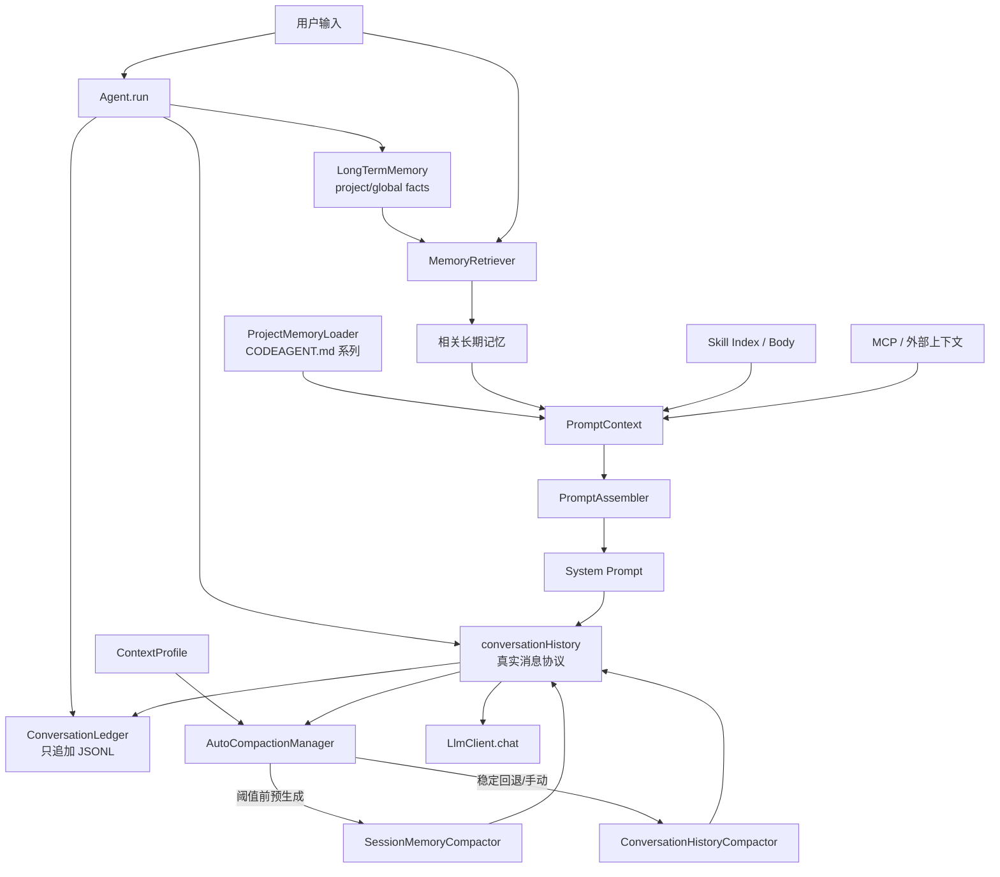
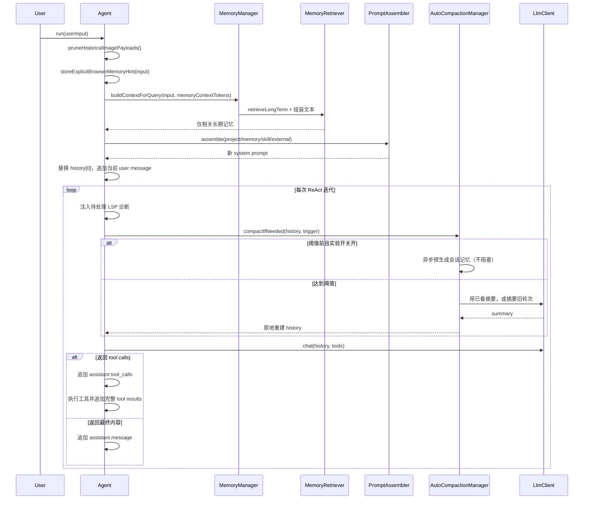

# 记忆与上下文管理

## 1. 功能定位

记忆与上下文管理模块回答一个核心问题：**一次 LLM 请求到底该携带什么，以及携带不下时先丢什么**。门面是 `MemoryManager`（`src/main/java/com/codeagent/memory/MemoryManager.java:19`），但它只统管**长期记忆、检索与 Token 统计**；当前会话的短期上下文**不再由它保存第二份**，而是各 Agent 自己的 `conversationHistory`（`List<LlmClient.Message>`），并由 `AutoCompactionManager` 直接压缩（`MemoryManager.java:16-17`、`src/main/java/com/codeagent/memory/AutoCompactionManager.java:15`）。

这次重构的关键结论一句话：真正决定下一轮请求体长度的是 `Agent.conversationHistory` 加工具 schema，而且现在只有**一条**压缩路径作用在这份真实历史上——不存在「压一份影子短期记忆、真实请求却不变」的第二本账。

- 门面入口：`MemoryManager` — `memory/MemoryManager.java:19`
- 短期上下文载体与压缩触发：`Agent.maybeCompactHistory()` — `agent/Agent.java:436`；调用点 `agent/Agent.java:194`
- 压缩协调器：`AutoCompactionManager.compactIfNeeded / compactNow` — `memory/AutoCompactionManager.java:43`、`61`
- 完整对话摘要压缩器：`ConversationHistoryCompactor` — `memory/ConversationHistoryCompactor.java:29`
- 实验性会话记忆压缩器：`SessionMemoryCompactor` — `memory/SessionMemoryCompactor.java:26`
- 消息 token 估算：`TokenBudget.estimateMessagesTokens(List)` — `memory/TokenBudget.java:98`
- 阈值派生：`ContextProfile` — `context/ContextProfile.java:18`
- 原始消息账本（只追加）：`ConversationLedger` — `history/ConversationLedger.java:40`
- Prompt 组装：`PromptAssembler.assemble(PromptMode, PromptContext)` — `prompt/PromptAssembler.java`；上下文载体 `prompt/PromptContext.java:6`

## 2. 设计意图

### 2.1 四类上下文不能混淆

「记忆」这个词在本项目里被几种生命周期完全不同的数据共用。分清它们的来源、生命周期和注入位置，才能解释为什么长期记忆要分 scope、为什么压缩只压一条路径。

| 数据 | 主要载体 | 生命周期 | 是否持久化 | 如何进入 LLM |
|---|---|---|---|---|
| 会话消息历史 | `List<LlmClient.Message>`（`Agent.conversationHistory`） | 当前 Agent 会话 | 默认内存，可导出 | 直接作为 `messages` 发送 |
| 原始消息账本 | `ConversationLedger`（JSONL，只追加） | 当前会话，落盘 | 是 | **不注入**，仅审计 |
| 长期记忆 | `LongTermMemory` | 跨会话 | JSON 文件 | 按当前查询检索后注入 system prompt |
| 项目记忆 | `CODEAGENT.md` 系列文件 | 项目/用户配置 | 文件本身持久化 | 每次组装 system prompt 时加载 |

早期版本还有一层「短期记忆」`ConversationMemory`，以及一个只压这份影子结构的 `ContextCompressor`。本重构把两者删除：短期上下文就是 `conversationHistory` 本身，压缩直接作用其上（`ConversationHistoryCompactor.java:12-21` 的类注释明确记录了这次度量错位）。

### 2.2 每一层记忆存在的理由

- **会话消息历史**：它同时是「发给 provider 的真实协议」和「Agent 的工作状态」。因此对它的任何改动都必须满足 provider 的成对约束（assistant `tool_calls` 与 tool `tool_call_id` 必须成对），这也是压缩只能切在 user 边界的原因（`ConversationHistoryCompactor.java:102`）。
- **原始消息账本**：`conversationHistory` 是**投递视图（delivery view）**——图片裁剪、`/clear`、压缩都会替换或删除其中条目，所以它无法忠实还原「模型最初看到过什么」。`ConversationLedger` 独立于该视图、只追加 JSONL，专门记录未经改写的原始消息（`history/ConversationLedger.java:30-38`、`Agent.java:918-921`）。
- **长期记忆**：只有跨会话仍成立的事实才值得持久化。项目约束是**显式保存**，`storeFact` 默认写 project 作用域并把规范化项目路径放进 metadata（`MemoryManager.java:72-85`）。
- **项目记忆**：`CODEAGENT.md` 管团队可版本化的项目规则，和长期记忆不能互相替代；`ProjectMemoryLoader` 在组装 system prompt 时按文件顺序加载（`ProjectMemoryLoader.java:66-76`）。

### 2.3 压缩策略为什么分层

自动压缩有一条**稳定路径**和一条**实验快路径**：

- 稳定路径 = `ConversationHistoryCompactor`：达到阈值时，把「system 之后、最近若干 user 轮次之前」的整段消息一次性交给 LLM 摘要，再用「摘要 user/assistant 对 + 原始尾部」重建。它是手动 `/compact` 和所有回退场景的最终保证（`ConversationHistoryCompactor.java:29-28`、`AutoCompactionManager.java:52-56`、`61-67`）。
- 实验快路径 = `SessionMemoryCompactor`：在**阈值之前**（约阈值 60% 处）就异步预生成/增量更新一份会话记忆，等真正撞阈值时直接用已备好的摘要替换，避免在临界点同步等一次 LLM 调用。它默认关闭，需要显式开启（`AutoCompactionManager.java:16-17`、`89-97`；`SessionMemoryCompactor.java:95-169`）。

两条路径最终都重建**同一份** `conversationHistory`，且快路径只有在「重建后确实更短且仍在阈值下」时才生效，否则返回失败、交回完整摘要（`SessionMemoryCompactor.java:197`）。这样实验特性再激进也不会把上下文改大或改坏。

## 3. 总体架构与关键流程

### 3.1 总体架构



核心对象与职责：

- `MemoryManager` — 门面，只持有长期记忆、检索器、`TokenBudget` 和 `ContextProfile`（`MemoryManager.java:20-24`）
- `LongTermMemory` — 跨会话事实，实现 `Memory` 接口，JSON 持久化（`LongTermMemory.java:25-33`）
- `MemoryDeduplicator` — 长期记忆的确定性去重（`MemoryDeduplicator.java:14`）
- `MemoryRetriever` — 相关度评分与 system prompt 注入文本（`MemoryRetriever.java:14`）
- `AutoCompactionManager` — 压缩协调器，决定走 session-memory 还是 full-summary（`AutoCompactionManager.java:15`）
- `ConversationHistoryCompactor` — 稳定完整摘要路径（`ConversationHistoryCompactor.java:29`）
- `SessionMemoryCompactor` — 实验性异步会话记忆快路径（`SessionMemoryCompactor.java:26`）
- `TokenBudget` — 静态预算拆分、用量统计、消息估算（`TokenBudget.java:15`）
- `ContextProfile` — 从 `maxContextWindow` 派生的参数集合（`ContextProfile.java:18`）

### 3.2 一轮请求的完整时序



三个关键时间点：

1. 每个新用户轮次开始前先 `pruneHistoricalImagePayloads()` 移除历史图片二进制（`Agent.java:163`、`454-471`），避免旧图反复计费。
2. 相关长期记忆按当前输入重新检索，并整体替换 `conversationHistory[0]`（`Agent.java:166-169`、`419-424`）。
3. 压缩检查发生在**每次 ReAct 内部 LLM 调用之前**，不只是用户轮次入口（`Agent.java:194`、`436-452`）。

### 3.3 两道压缩路径对照

| 维度 | `SessionMemoryCompactor`（实验） | `ConversationHistoryCompactor`（稳定） |
|---|---|---|
| 触发时机 | 阈值之前异步预生成，撞阈值时直接套用（`SessionMemoryCompactor.java:95-169`） | 达到阈值（或手动）才同步摘要 |
| 默认开关 | 关闭，需系统属性/环境变量/`.env` 开启（`AutoCompactionManager.java:89-97`） | 始终可用 |
| 摘要方式 | 先首轮生成，后续增量更新（`SessionMemoryCompactor.java:219-231`） | 每次把旧段整体摘要一次 |
| 生成线程 | 后台守护线程，不阻塞主循环（`SessionMemoryCompactor.java:59-60`、`139-150`） | 主线程同步 `chat`（`ConversationHistoryCompactor.java:165`） |
| 接受条件 | 重建后必须**更短且仍低于阈值**，否则放弃（`SessionMemoryCompactor.java:197`） | 拿到非空摘要即重建（`ConversationHistoryCompactor.java:115-133`） |
| 手动 `/compact` | 不使用（手动一律走完整摘要，`AutoCompactionManager.java:61-67`） | 使用，且只保留最近一轮（`ConversationHistoryCompactor.java:84-86`） |
| 状态隔离 | 每份 history 独立状态，WeakReference 绑定，避免 ReAct/Plan/Team 互相污染（`SessionMemoryCompactor.java:289-309`） | 无状态 |
| 摘要失败 | 静默放弃，回退完整摘要（`SessionMemoryCompactor.java:146-149`） | 放弃压缩，原 history 不变（`ConversationHistoryCompactor.java:111-118`） |

两者都遵守同一条硬约束：**只在 user 边界切割**，避免切断 assistant `tool_calls` 与 tool `tool_call_id` 的成对协议（`ConversationHistoryCompactor.java:102`、`SessionMemoryCompactor.java:233-253`）。重建结构统一为 `[system] + [user(摘要)] + [assistant(确认)] + [原始尾部]`（`ConversationHistoryCompactor.java:188-201`）。

### 3.4 Token 估算

`MemoryEntry.estimateTokens` 把 CJK 与其他字符分开估算（`MemoryEntry.java:48-53`）：

- 用一个**严格 code-point 区间**判定「中文」，区间之外（含日文假名、全角标点、emoji）一律按其他字符计（`MemoryEntry.java:50`）。
- 其他字符数 = `text.length() - chineseChars`，而 `String.length()` 按 UTF-16 计，因此 **surrogate pair（如 emoji）会被算成两个字符**（`MemoryEntry.java:51`）。
- 两类字符各用一个固定比率折算后向上取整（`MemoryEntry.java:52`）。

`TokenBudget.estimateMessagesTokens` 在消息层再叠加（`TokenBudget.java:98-126`）：

- 若 `msg.contentParts()` 非 null，则**完全忽略 `msg.content()`**，只遍历 parts（`TokenBudget.java:102-113`）；文本 part 走同一个 `estimateTokens`，图片 part 走 `estimateImageTokens`。
- tool call 的 `arguments` 单独计入（`TokenBudget.java:117-121`）。
- 每条消息再加一笔固定的 role/separator 开销（`TokenBudget.java:124`）。

图片估算的特征：先按 base64 长度折算为近似字节数，再除以一个 bytes-per-token 除数，结果被夹在一个下限与上限之间；没有 base64 时取一个固定回退值（`TokenBudget.java:128-134`）。具体数值以源码为准。

工具 schema 不在这个方法里，`Agent` 在算 ctx 状态时另行估算并加上（`Agent.java:573`、`615-622`）。

### 3.5 压缩阈值怎么来的

阈值不是固定的 80%，而是从 provider 的 `maxContextWindow` 派生的：

```
trigger = window − 摘要输出预留 − 自动压缩缓冲
摘要输出预留 = min(上限, max(下限, window/4))
自动压缩缓冲 = min(上限, max(下限, window/8))
```

三项都在 `ContextProfile.autoCompactTriggerTokens(int)` 内（`ContextProfile.java:91-97`），并最终夹在 `[最小, window-1]` 之间。大窗口下两项预留触顶，小窗口按比例缩小。`compressionTriggerRatio()` 只是把该绝对阈值换算回比率，并额外受一个下限约束（`ContextProfile.java:86-89`）。

**以 200k 窗口为例，阈值约 167k**（200k − 20k − 13k）；`AGENTS.md` 亦记录了同一口径（1M 窗口约 967k）。

### 3.6 CODEAGENT.md 加载与导入

`ProjectMemoryLoader` 依次读取五个来源：用户配置目录 `CODEAGENT.md`、项目根 `CODEAGENT.md`、项目根 `.codeagent/CODEAGENT.md`、项目根 `CODEAGENT.local.md`、项目根 `.codeagent/CODEAGENT.local.md`（`ProjectMemoryLoader.java:66-76`）。所有存在且非空的来源按此顺序拼接并标注绝对路径，**不是后者覆盖前者的键值合并**。

单独一行 `@relative/path.md` 触发导入（`ProjectMemoryLoader.java:116-126`），安全规则：必须是相对路径、不能含空格、不能含 `..`、normalize 后必须仍在来源允许根内、必须是普通文件、限制递归深度、用 `importStack` 检测循环（`ProjectMemoryLoader.java:78-114`）。

总注入内容有字符预算，超限时截断并附提示；截断保留的是**固定字符预算减去一个余量**（`ProjectMemoryLoader.java:128-132`，余量与上限在同文件常量处）。

### 3.7 数据一致性与线程安全

`LongTermMemory` 的 entries 是 `ConcurrentHashMap`、tokenCounter 是 `AtomicInteger`（`LongTermMemory.java:30-31`），`store` 是 `synchronized`；但「查重 → put → 计数 → 写整个文件」仍不是一个跨进程的原子事务（`LongTermMemory.java:56-71`）。`SessionMemoryCompactor` 用 `WeakReference` 槽位绑定每份 history 的独立状态，并对状态加锁以避免 ReAct、Plan 并行任务和 Team worker 之间互相污染（`SessionMemoryCompactor.java:289-309`）。

### 3.8 可观测性

`MemoryManager.getSystemStatus()` 汇总 ContextProfile、短期上下文来源、长期状态和 Token 报告（`MemoryManager.java:134-139`）。`Agent.getContextStatus()` 额外按 role 分类估算 system/tool/对话消息，显示 ctx 百分比、压缩阈值、距压缩剩余量、当前自动压缩策略（session memory 或完整摘要）以及 MCP/cache 状态（`Agent.java:555-608`）。

## 4. 设计意图 vs 实际实现

以下是文档意图与代码实际行为存在差异的地方。每条给出源码位置，具体数值以源码为准。

| 主题 | 设计意图 | 实际实现 | 源码位置 |
|---|---|---|---|
| 短期记忆载体 | 以为 `MemoryManager` 维护一份短期记忆结构 | **已删除**。门面类注释明确「这里不再复制保存第二份消息列表」，短期上下文就是各 Agent 的 `conversationHistory`；旧构造签名仍保留但短期预算参数被忽略 | `MemoryManager.java:16-17`、`31`、`36` |
| 两本账压缩 | 以为存在「压影子短期记忆」的第二个压缩器 | `ContextCompressor` / `ConversationMemory` 已删除；只有 `AutoCompactionManager` 作用在真实 `conversationHistory` 上 | `AutoCompactionManager.java:43-58`、`ConversationHistoryCompactor.java:12-21` |
| Agent 单次运行预算 | 以为 `ContextProfile.agentTokenBudget` 是强制的单次运行预算 | **算出来但无人消费**。`agentTokenBudget` 由窗口按比例派生（`ContextProfile.java:39`、`77-80`），但生产代码中没有任何调用方；`AgentBudget.fromLlmClient` 的硬限默认取 `Integer.MAX_VALUE`，只有显式系统属性才覆盖。交叉见 `01-react-agent.md` §4 | `ContextProfile.java:39`、`AgentBudget.java` |
| 图片 token 估算 | 以为按图片尺寸/分辨率估算 | 实际从 base64 字符串长度反推近似字节数，再除以一个 bytes-per-token 除数，并用上下限夹取；无 base64 时取固定回退值 | `TokenBudget.java:128-134` |
| CJK token 估算 | 以为「中文」判定宽松 | 用严格 code-point 区间判定（`MemoryEntry.java:50`），且按 `String.length()` 计字符，**surrogate pair 算两个字符**（`MemoryEntry.java:51`） | `MemoryEntry.java:50-51` |
| 多模态消息估算 | 以为 `content` 与 `contentParts` 会一起计入 | 只要 `contentParts()` 非 null，`msg.content()` 被**完全忽略** | `TokenBudget.java:102-113` |
| 长期记忆去重 | 以为只按正文相等，或以为能跨作用域升级 | 去重域 = 类型 + 作用域（project 还要项目路径相等），域内先做 Unicode 规范化、大小写与标点归一，再允许「只多出中文语法助词」的近似变体；数字/代码符号/实质用词不同则**继续保留**两份 | `MemoryDeduplicator.java:34-73`、`129-154` |
| 长期记录 tokenCount | 以为加载时沿用保存值 | 若存储记录缺 `tokenCount`，`mapToEntry` 回退为 `estimateTokens(content)` 重新估算 | `LongTermMemory.java:238` |
| 切换模型/作用域 | 以为只会更新 profile | `applyContextProfile` 会**重建一个新的 `TokenBudget`**，因此累计 usage 统计被清零 | `MemoryManager.java:53-56`、`TokenBudget.java:27-46` |
| 会话记忆快路径 | 以为实验快路径总能省一次同步摘要 | 它只在「阈值之前预生成成功 + 重建后确实更短且仍低于阈值」时才生效，否则放弃并回退完整摘要；默认关闭 | `SessionMemoryCompactor.java:95-101`、`197`、`AutoCompactionManager.java:49-56` |
| 工具结果回灌 | 以为回灌给模型的是截断版 | 回灌进 `conversationHistory` 的是**完整结果**；旧文档描述的 `MemoryManager.addToolResult` 截断副本已随短期记忆一并删除 | `Agent.java:247-251` |
| 原始消息可追溯 | 以为 `conversationHistory` 就是完整原始记录 | 它是投递视图：图片裁剪、`/clear`、压缩都会改写它；完整原始消息只存在于只追加的 `ConversationLedger` | `history/ConversationLedger.java:30-38`、`Agent.java:918-921` |
| CODEAGENT.md 截断 | 以为截到固定字符数 | 实际保留「固定字符预算 **减去一个余量**」再追加截断提示，余量用于提示文本本身 | `ProjectMemoryLoader.java:128-132` |

## 5. 设计取舍

### 5.1 JSON 长期记忆还是 SQLite

JSON 文件人可读、可直接备份，适合少量个人事实；代价是每次全量重写、并发一致性弱，不适合高频多进程写入（`LongTermMemory.java:167-176`）。规模与并发上升后 SQLite 更合适。

### 5.2 关键词检索还是向量检索

长期事实数量少，jieba 关键词检索部署简单、结果可解释、不依赖 Embedding 服务（`MemoryQueryTokenizer.java:17-41`、`MemoryRetriever.java:42-51`）。缺点是语义改写召回弱；事实规模扩大后可加向量，但仍要保留 scope 过滤和可删除性。

### 5.3 动态相关注入还是全量注入

只注入相关长期事实节省 token，也降低无关偏好干扰当前任务（`MemoryRetriever.java:60-78`）。风险是分词未命中导致有用事实缺席。

### 5.4 摘要还是滑动窗口直接丢弃

直接丢弃最省成本但会失去早期目标和决策；摘要保留语义连续性，需要额外 LLM 调用，也可能概括出错。真实 history 选择「摘要失败不修改原文」，优先一致性（`ConversationHistoryCompactor.java:111-133`）。

### 5.5 同步摘要还是阈值前异步预生成

同步摘要在临界点阻塞主循环一次 LLM 调用；异步预生成把这次调用挪到阈值之前，但引入后台线程、状态隔离和「摘要过期」的复杂度。项目把后者做成**默认关闭的实验特性**，失败时无条件回退同步路径——用可控的复杂度换临界点延迟（`SessionMemoryCompactor.java:19-24`、`AutoCompactionManager.java:43-58`）。

### 5.6 固定消息数还是 user 轮次边界

固定消息数实现简单，但一轮工具调用的消息数不固定。按 user 起点保留能把一个 ReAct 轮次整体留下，是协议正确性优先的选择（`ConversationHistoryCompactor.java:96-102`）。

### 5.7 精确 tokenizer 还是启发式估算

多 provider 项目很难统一精确 tokenizer，启发式无需模型专用依赖（`MemoryEntry.java:48-53`）。代价是误差，需要更大的预留和实际 usage 校准。

## 6. 失败与边界矩阵

| 场景 | 当前行为 | 风险或说明 | 源码位置 |
|---|---|---|---|
| 记忆正文重复（同域） | 长期记忆跳过 | 域内近似变体也会被合并 | `LongTermMemory.java:59-61`、`MemoryDeduplicator.java:34-39` |
| 记忆正文仅差数字/符号/实词 | 保留两份 | 有意不合并，交给用户审计删除 | `MemoryDeduplicator.java:125-154` |
| project 域但缺 project key | 不判重 | 无法确定同一项目，保守保留 | `MemoryDeduplicator.java:52-58` |
| 长期 JSON 写失败 | 日志 warn，内存保留 | 重启可能丢记忆 | `LongTermMemory.java:172-175` |
| 长期 JSON 损坏 | 日志 warn，继续启动 | 可能加载为空 | `LongTermMemory.java:206-208` |
| 单条反序列化失败 | 返回 null 并跳过 | 不阻断加载 | `LongTermMemory.java:240-242` |
| 项目路径不存在 | 使用 normalize 绝对路径 | 不执行 `toRealPath` | `MemoryManager.java:160-170` |
| CODEAGENT.md 不存在 | 返回空上下文 | 不阻断 Agent | `ProjectMemoryLoader.java:44-45`、`60-62` |
| CODEAGENT.md 越界导入 | 跳过并 warn | 防止逃逸允许根 | `ProjectMemoryLoader.java:84-87` |
| CODEAGENT.md 循环导入 | `importStack` 跳过 | 其他内容继续 | `ProjectMemoryLoader.java:88-91` |
| CODEAGENT.md 超字符预算 | 截断并提示 | 可能丢尾部规则 | `ProjectMemoryLoader.java:128-132` |
| 查询无相关长期记忆 | 注入空字符串 | 不创建空章节 | `MemoryRetriever.java:61-62` |
| 单条记忆超过注入预算 | 在该条处停止 | 后续较小条也不再考虑 | `MemoryRetriever.java:68-69` |
| 完整摘要 IO 失败 | 放弃压缩 | 原 history 完整保留 | `ConversationHistoryCompactor.java:111-114` |
| 完整摘要为空 | 放弃压缩 | 不写空摘要 | `ConversationHistoryCompactor.java:115-118` |
| user 轮次太少 | 即使超阈值也不压缩 | 交给窗口上限兜底 | `ConversationHistoryCompactor.java:96-100` |
| 会话记忆预生成失败 | 静默放弃 | 回退完整摘要 | `SessionMemoryCompactor.java:146-149` |
| 会话记忆状态失效（history 被替换） | 清空快路径状态 | 退回完整摘要 | `SessionMemoryCompactor.java:185-189`、`266-271` |
| 会话记忆重建后并未变短 | 放弃快路径 | 避免把上下文改大 | `SessionMemoryCompactor.java:197-201` |
| 工具调用在分割附近 | 从 user 边界保留 | call/result 对不被中切 | `ConversationHistoryCompactor.java:102` |
| Token 估算偏低 | 仍可能被 provider 拒绝 | 需要安全预留和 usage 校准 | `TokenBudget.java:98-126` |
| 切换 LLM | 重建 ContextProfile/Budget | 累计 TokenBudget 统计被重置 | `MemoryManager.java:53-56` |

## 7. 测试策略与证据

### 7.1 压缩路径

`ConversationHistoryCompactorTest` 覆盖：低于阈值不压缩、手动 `compactNow` 跳过阈值并保留最近轮次、user 轮次不足时跳过、保留最近轮次、tool call/result 边界不被切断、空摘要不压缩、LLM `IOException` 不破坏 history（`ConversationHistoryCompactorTest.java:16-175`）。`SessionMemoryCompactorTest` 覆盖：关闭时从不预生成、阈值前预生成并在阈值处套用、保留尾部从 user 边界并保住 tool 对、边界失效时快路径不可用且不改动 history（`SessionMemoryCompactorTest.java:16-74`）。`AutoCompactionManagerTest` 覆盖：优先已就绪的会话记忆、不可用时回退完整摘要、手动压缩始终走完整摘要、系统属性启用实验路径（`AutoCompactionManagerTest.java:15-55`）。

### 7.2 MemoryManager

`MemoryManagerTest` 覆盖：把 `conversationHistory` 报告为唯一短期上下文、只在显式调用时清空长期记忆、默认 project scope、仅搜当前项目与 global、压缩触发比率对所有模型一致（`MemoryManagerTest.java:17-62`）。旧的 `ConversationMemoryTest` 已随类删除。

### 7.3 LongTermMemory 与去重

`LongTermMemoryTest` 覆盖：存取、同内容去重、同域内规范化格式变体去重、保守的中文语法变体去重、不跨类型去重、不跨 global/project 去重、不跨项目去重、project 域缺 key 不判重、保留冲突数字/代码符号/实词、并发重复写入的原子性、替换同 id 时 token 计数正确、关键词/多关键词/无空格中文检索、删除、类型过滤、落盘重载、时间戳保持、project/global 可见性、legacy 无 scope 按 global（`LongTermMemoryTest.java:29-403`）。

### 7.4 MemoryRetriever、TokenBudget 与 ExplicitMemoryHints

`MemoryRetrieverTest` 覆盖：长期检索、上下文构建、**当前轮对话不被当作历史记忆注入**、无命中返回空、中文短语片段召回、只注入 global 与当前项目（`MemoryRetrieverTest.java:24-57`）。`TokenBudgetTest` 覆盖可用预算、用量累计、消息估算、报告输出（`TokenBudgetTest.java:13-45`）。`ExplicitMemoryHintsTest` 覆盖：从显式记忆请求中抽取语雀/Chrome 登录偏好、无显式记忆意图时不抽取、站点未知时回退到通用登录偏好（`ExplicitMemoryHintsTest.java:13-33`）。`MemoryEntryTest` 覆盖中/英/混合/空的 token 估算、metadata 与字符串表示（`MemoryEntryTest.java:12-48`）。

### 7.5 Prompt 与 CODEAGENT.md

`ProjectMemoryLoaderTest` 覆盖多来源按序拼接（测试覆盖其中四个来源）、项目内相对导入、越界导入被拒、无文件返回空（`ProjectMemoryLoaderTest.java:17-63`）。`PromptAssemblerTest` 覆盖动态段组装与顺序、项目覆盖 mode prompt、无工具模式移除工具章节、`## Language` 完整性校验（`PromptAssemblerTest.java:18-91`）。

### 7.6 回归命令

```bash
mvn test -Dtest=MemoryManagerTest,LongTermMemoryTest,MemoryRetrieverTest,ConversationHistoryCompactorTest,SessionMemoryCompactorTest,AutoCompactionManagerTest,ExplicitMemoryHintsTest,MemoryEntryTest,TokenBudgetTest,PromptAssemblerTest,ProjectMemoryLoaderTest
```

未覆盖的空白：图片 part、surrogate pair 的估算误差，以及长期 JSON 并发写入的一致性。

## 8. 面试讲解模板

### 8.1 30 秒版本

我实现了 Agent 的分层记忆与上下文治理。当前消息协议本身就保存在 `conversationHistory`，不再维护第二份影子短期记忆；长期事实按 project/global 作用域持久化到本地，并按当前查询做 jieba 关键词与时间衰减检索，再按固定层次组装进 system prompt。上下文接近模型阈值时，按 user 轮次边界压缩真实消息历史，确保 assistant `tool_calls` 与 tool results 不被切断；压缩有一条稳定完整摘要路径和一条默认关闭的异步会话记忆快路径，摘要失败一律保留原历史。

### 8.2 2 分钟版本

这套设计首先解决「记忆」和「消息历史」混淆的问题。Agent 真正发给模型的是 `List<Message>`，长期记忆保存显式稳定事实，`CODEAGENT.md` 保存团队规则，另有一份只追加的 `ConversationLedger` 保留未经裁剪的原始消息（因为 `conversationHistory` 是投递视图）。当前输入只检索长期事实，避免把已经存在于 history 的短期消息再次注入 system prompt。

窗口策略从 provider 的 `maxContextWindow` 派生，阈值是「窗口减去摘要输出预留和安全缓冲」；以 200k 窗口为例约 167k 触发。压缩协调器 `AutoCompactionManager` 先尝试已预生成的会话记忆，失败则回退到完整摘要；两者都统计 user 起点，只摘要 system 之后到最近若干轮之前的完整消息，重建为 system、摘要 user/assistant 对和原始尾部，因此不会在 tool call 和 result 中间切割。手动 `/compact` 一律走稳定路径并只保留最近一轮。

边界包括启发式 token 估算、JSON 并发写入、摘要信息损失，以及长期检索仍是关键词而非语义向量。

## 9. 高频面试问答

### Q1：为什么不再维护一份短期记忆？

它和 `conversationHistory` 会双写、容易不一致，而且压缩影子结构并不能缩短真正发给模型的请求。重构后短期上下文就是 `conversationHistory`，压缩直接作用其上（`MemoryManager.java:16-17`）。

### Q2：真正防止上下文超窗的是哪一个？

`AutoCompactionManager` 协调的两条路径，最终都由 `ConversationHistoryCompactor` 的重建逻辑作用在真实 `messages` 上（`AutoCompactionManager.java:43-58`、`ConversationHistoryCompactor.java:88-133`）。

### Q3：为什么长期记忆不自动提取？

模型可能把临时请求、猜测或错误结论永久化。只接受 `save_memory` 工具、`/save` 命令或明确记忆意图，更可控、可审计，也能通过 list/search/delete 管理。

### Q4：长期记忆写入有哪些入口？

三条：`save_memory` 工具、CLI/TUI 的 `/save`（`CliCommandParser.java:166`、`Main.java:556`），以及浏览器登录复用启发式（`Agent.storeExplicitBrowserMemoryHint` — `Agent.java:544-553`，规则在 `ExplicitMemoryHints.java:15-31`）。没有自动事实抽取。

### Q5：project scope 如何隔离？

保存时记录规范化项目 real path，查询时只允许 global 或 project key 精确相等的条目（`LongTermMemory.java:147-154`）。legacy 无 scope 条目按 global 保持可见（`LongTermMemory.java:156-162`）。

### Q6：长期记忆如何去重？

去重域 = 类型 + 作用域（project 域还要项目路径相等）；域内先做 Unicode NFKC、大小写、标点归一，再允许「只多出中文语法助词」的保守近似（`MemoryDeduplicator.java:41-73`）。数字、代码符号或实质用词不同则保留两份，不做冲突消解（`MemoryDeduplicator.java:125-154`）。

### Q7：相关性如何计算？

完整查询子串命中得满分，否则按 jieba token 命中比例乘时间衰减（24 小时内从 1.0 衰减到 0.5，且有下限）；长期条目再乘一个大于 1 的权重（`MemoryRetriever.java:83-111`、`45`）。它是可解释启发式，不是向量语义检索。

### Q8：为什么只注入长期记忆？

当前输入和会话历史已经在 `messages` 中，再注入 system 会重复并可能把请求误标成旧事实（`MemoryRetriever.java:32-51`）。

### Q9：为什么从 user 边界切历史？

一次 user 轮次可能包含多个 assistant `tool_calls` 和 tool results。按固定条数容易切断协议对，从 user 起点保留可以保存完整尾部轮次（`ConversationHistoryCompactor.java:96-102`）。

### Q10：摘要失败会怎样？

两条路径都「先拿到非空摘要才重建」。完整摘要 IO 失败或空摘要直接返回 false，原 history 不变；会话记忆预生成失败静默放弃并回退完整摘要（`ConversationHistoryCompactor.java:111-118`、`SessionMemoryCompactor.java:146-149`）。

### Q11：为什么摘要后插一对 user/assistant 消息？

使用标准角色兼容不同 provider，同时把摘要作为已知上下文并用 assistant 确认完成对话结构过渡（`ConversationHistoryCompactor.java:197-198`）。

### Q12：自动 compact 和手动 compact 有何差别？

自动达到阈值才执行并保留默认轮次数，且可能走会话记忆快路径；手动 `compactNow` 跳过阈值、只保留最近一轮、**始终**走完整摘要路径（`ConversationHistoryCompactor.java:74-86`、`AutoCompactionManager.java:61-67`）。

### Q13：200K 窗口为什么约 167K 触发？

阈值是「窗口减去摘要输出预留，再减安全缓冲」，大窗口下两项预留有上限，小窗口按比例缩小。以 200k 窗口为例，20k + 13k 两项预留后结果约 167k（`ContextProfile.java:91-97`、`AGENTS.md`）。

### Q14：Token 估算准确吗？

不精确。中文按严格 code-point 区间与其他字符分开折算，实现按 `String.length()` 计数，因此 surrogate pair 会被算成两个字符；多模态消息只要有 `contentParts()`，`content` 会被整体忽略（`MemoryEntry.java:50-51`、`TokenBudget.java:102-113`）。它只用于低成本预警，必须配合安全预留和 provider usage。

### Q15：工具 schema 算在哪里？

`TokenBudget.estimateMessagesTokens` 不含 schema，`Agent` 在计算 ctx 状态时用 `estimateToolsSchemaTokens()` 单独估算并加上（`Agent.java:573`、`615-622`）。

### Q16：为什么要移除历史图片？

base64 图片成本高，后续每轮重复携带会迅速挤满窗口。新轮开始前去掉旧 payload，只保留文本结论（`Agent.java:163`、`454-471`）。

### Q17：会话记忆快路径为什么默认关闭？

它引入后台线程、状态隔离和摘要过期的复杂度，收益只是在临界点少一次同步 LLM 调用。项目把它做成实验特性，失败无条件回退稳定路径（`SessionMemoryCompactor.java:19-24`、`AutoCompactionManager.java:43-58`）。

### Q18：CODEAGENT.md 如何防路径逃逸？

只解析无空格的相对 `@path`，拒绝绝对路径和 `..`，normalize 后还要位于允许根，并限制深度和循环（`ProjectMemoryLoader.java:78-126`）。

### Q19：长期 JSON 写失败为什么危险？

内存已经更新但文件可能没写成功，当前进程查询正常，重启后丢失（`LongTermMemory.java:56-71`、`172-175`）。更可靠的实现应临时文件原子替换或迁移 SQLite 事务。

### Q20：`ConversationLedger` 和 `conversationHistory` 什么关系？

后者是投递视图，会被图片裁剪、`/clear`、压缩改写；前者只追加、不做任何裁剪，保留模型最初看到过的原始消息，用于审计与回溯（`history/ConversationLedger.java:30-38`、`Agent.java:918-921`）。

## 10. 简历条陈与源码证据

| 简历原句 | 代码证据 |
|---|---|
| 实现短期记忆 | 短期上下文即 `Agent.conversationHistory`，由 `AutoCompactionManager` 直接压缩 — `MemoryManager.java:16-17`、`Agent.java:436-452` |
| 项目级/全局长期记忆 | `MemoryManager.storeFact` 默认 project 并写规范化路径 — `MemoryManager.java:72-85`；可见性过滤 `LongTermMemory.java:147-154`；JSON 持久化 `LongTermMemory.java:167-176` |
| 上下文预算管理 | `TokenBudget` 拆分 system/tools/response/对话可用 — `TokenBudget.java:27-29`、`51-53` |
| 按 system prompt、工具定义、历史消息和回复预留分配 Token | 三块固定预留 + `getAvailableForConversation()` — `TokenBudget.java:27-29`、`51-53` |
| 上下文接近阈值时自动压缩历史 | `Agent.maybeCompactHistory` 调 `compactIfNeeded(history, trigger)` — `Agent.java:436-452`；阈值来源 `ContextProfile.compressionTriggerTokens()` — `ContextProfile.java:66-68`、`91-97` |
| 保留 tool call/tool result 消息边界 | 分割点取第 N 个 user message 索引，尾部整体保留 — `ConversationHistoryCompactor.java:96-102`、`188-201`；测试证据 `ConversationHistoryCompactorTest.java:97-135` |

## 11. 当前实现边界

- **只有一条真实压缩路径**：`AutoCompactionManager` 协调「实验会话记忆 + 稳定完整摘要」，两者最终都重建同一份 `conversationHistory`；旧的影子短期记忆与 `ContextCompressor` 已删除。
- `ContextProfile.agentTokenBudget` 算出来但没有生产消费方；`AgentBudget` 的 token 硬限默认实质不限，仅系统属性可启用。
- Token 是启发式估算值，CJK 判定严格、surrogate pair 双计、多模态消息只算 parts，不能等同于 provider 精确 usage。
- 长期记忆是 JSON 全量重写，缺乏事务与多进程一致性；去重域限定了类型与作用域，不做冲突消解，也不会自动升级作用域。
- 相关度检索是关键词 + 时间衰减 + 长期权重，不是语义向量召回。
- 会话记忆快路径默认关闭，且依赖实例身份（`WeakReference`）绑定 history，history 被整体替换后状态即失效。
- 摘要压缩依赖 LLM 调用，存在信息损失；完整摘要路径只对摘要 IO 失败与空摘要做防护。
- 历史图片一旦被 `pruneHistoricalImagePayloads` 移除，后续无法再让模型观察原图像素。
- 系统不会自动学习全部对话：长期记忆只从显式入口写入。
