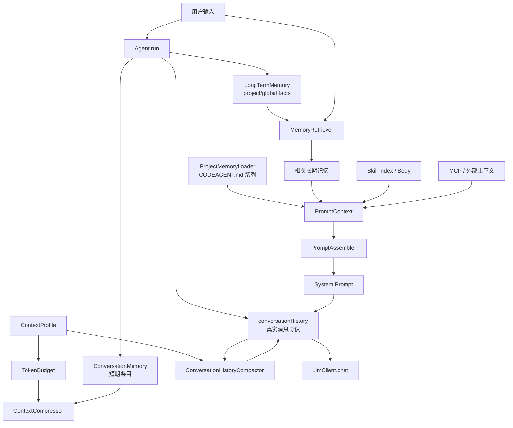
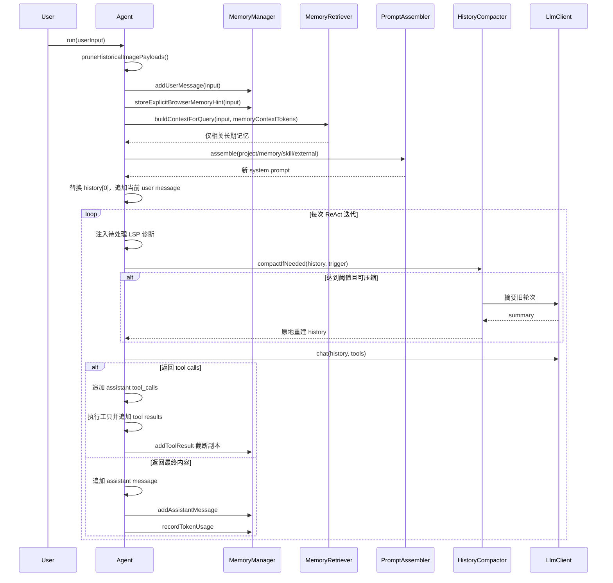

# 记忆与上下文管理

## 1. 功能定位

记忆与上下文管理模块回答一个核心问题：**一次 LLM 请求到底该携带什么，以及携带不下时先丢什么**。`MemoryManager` 是该模块的门面（`src/main/java/com/codeagent/memory/MemoryManager.java:19`），把短期记忆、长期记忆、相关度检索、Token 预算和两套压缩机制聚合到一处，Agent 只通过这一层完成写入、检索、预算判断与压缩触发。它同时维护一个常被混淆的事实边界：真正发送给模型的是 `Agent.conversationHistory`（`List<LlmClient.Message>`），而不是 `ConversationMemory`；前者由 `ConversationHistoryCompactor` 负责压缩，后者由 `ContextCompressor` 负责压缩。

- 门面入口：`MemoryManager` — `src/main/java/com/codeagent/memory/MemoryManager.java:19`
- Agent 侧调用链：`Agent.run(String)` — `src/main/java/com/codeagent/agent/Agent.java:127`；写入短期记忆 `Agent.java:131`；检索长期记忆并重建 system prompt `Agent.java:135-137`；压缩真实历史 `Agent.java:323-334`
- 消息估算：`TokenBudget.estimateMessagesTokens(List)` — `src/main/java/com/codeagent/memory/TokenBudget.java:113`
- 真实消息历史压缩：`ConversationHistoryCompactor` — `src/main/java/com/codeagent/memory/ConversationHistoryCompactor.java:32`
- Prompt 组装：`PromptAssembler.assemble(PromptMode, PromptContext)` — `src/main/java/com/codeagent/prompt/PromptAssembler.java:20`

## 2. 设计意图

### 2.1 五类上下文不能混淆

「记忆」这个词在本项目里被五种生命周期完全不同的数据共用。如果不先分清它们的来源、生命周期和注入位置，就无法解释为什么存在两套压缩、为什么有些压缩不缩短请求。

| 数据 | 主要载体 | 生命周期 | 是否持久化 | 如何进入 LLM |
|---|---|---|---|---|
| ReAct 消息历史 | `List<LlmClient.Message>` | 当前 Agent 会话 | 默认内存，可导出 | 直接作为 `messages` 发送 |
| 短期记忆 | `ConversationMemory` | 当前会话 | 否 | **不直接注入**，仅用于预算、状态和摘要 |
| 长期记忆 | `LongTermMemory` | 跨会话 | JSON 文件 | 按当前查询检索后注入 system prompt |
| 项目记忆 | `CODEAGENT.md` 系列文件 | 项目/用户配置 | 文件本身持久化 | 每次组装 system prompt 时加载 |
| 动态上下文 | Skill、MCP、LSP 诊断等 | 当前轮或当前会话 | 由各模块决定 | 经 `PromptContext` 或追加 message 注入 |

最关键的区别是：决定下一次请求体长度的是 `conversationHistory` 加工具 schema，**不是** `ConversationMemory` 的条目数（`Agent.java:135-137`、`Agent.java:327`）。

### 2.2 每一层记忆存在的理由

- **短期记忆**：给 Agent 提供「不看原始协议也能快速估算占用、按关键词检索、必要时摘要」的旁路结构。它被 `MemoryManager` 在每次写入用户/助手/工具消息时同步更新（`MemoryManager.java:77`、`92`、`110`），并在写入后立即检查压缩阈值（`MemoryManager.java:86`、`101`、`123`）。
- **长期记忆**：只有跨会话仍成立的事实才值得持久化。项目约束是显式保存，`storeFact` 默认写 project 作用域并把规范化项目路径放进 metadata（`MemoryManager.java:129-146`）。
- **项目记忆**：`CODEAGENT.md` 管团队可版本化的项目规则，和长期记忆不能互相替代；`ProjectMemoryLoader` 在组装 system prompt 时按文件顺序加载（`PromptAssembler.java:39`、`ProjectMemoryLoader.java:66-76`）。
- **动态上下文**：检索结果、Skill 索引、外部 MCP 上下文都是「当前这一轮才成立」的内容，因此通过 `PromptContext` 注入并随每轮重建（`PromptContext.java:6-14`）。

### 2.3 两套压缩的分工

早期设计假设「LLM 调用从 shortTermMemory 重建消息」，但 Agent 实际直接维护并发送 `conversationHistory`（`ConversationHistoryCompactor.java:12-21` 的类注释明确记录了这次度量错位）。因此：

- `ContextCompressor` 压 `ConversationMemory`，只治理记忆结构自身的预算，**不缩短下一轮请求体**。
- `ConversationHistoryCompactor` 直接压 `List<LlmClient.Message>`，是**唯一真正防止窗口溢出的机制**（`ConversationHistoryCompactor.java:13-21`、`77`）。

## 3. 总体架构与关键流程

### 3.1 总体架构



核心对象与职责：

- `MemoryManager` — 门面，持有短期、长期、压缩器、检索器和 `TokenBudget`（`MemoryManager.java:21-27`）
- `ConversationMemory` — 短期条目容器，`LinkedHashMap` 保序，持有 token 计数与预算（`ConversationMemory.java:14-18`）
- `LongTermMemory` — 跨会话事实，JSON 持久化（`LongTermMemory.java:25-33`）
- `MemoryRetriever` — 相关度评分与 system prompt 注入文本（`MemoryRetriever.java:14`）
- `ContextCompressor` — 短期记忆 Map-Reduce 摘要（`ContextCompressor.java:19`）
- `ConversationHistoryCompactor` — 真实消息历史压缩（`ConversationHistoryCompactor.java:32`）
- `TokenBudget` — 静态预算拆分、用量统计、消息估算（`TokenBudget.java:15`）
- `ContextProfile` — 从 `maxContextWindow` 派生的参数集合（`ContextProfile.java:19`）

### 3.2 一轮请求的完整时序



三个关键时间点：

1. 每个新用户轮次开始前先 `pruneHistoricalImagePayloads()` 移除历史图片二进制（`Agent.java:129`、`336`），避免旧图反复计费。
2. 相关长期记忆按当前输入重新检索，并整体替换 `conversationHistory[0]`（`Agent.java:136-137`、`309-311`）。
3. 压缩检查发生在**每次 ReAct 内部 LLM 调用之前**，不只是用户轮次入口（`Agent.java:323-334`）。

### 3.3 两道压缩对照

| 维度 | `ContextCompressor` | `ConversationHistoryCompactor` |
|---|---|---|
| 输入 | `ConversationMemory` 条目 | `List<LlmClient.Message>` |
| 目标 | 控制短期旁路记忆 | 控制真实 LLM 请求历史 |
| 自动保留 | 最近若干条 entry（默认值见 `ContextCompressor.java:83`） | 最近若干 user 轮次（默认值见 `ConversationHistoryCompactor.java:36`） |
| 手动入口 | 无独立 CLI | `/compact` 只保留最近一轮（`ConversationHistoryCompactor.java:87-89`） |
| 算法 | Map-Reduce（`ContextCompressor.java:195-247`） | 一次摘要旧消息（`ConversationHistoryCompactor.java:150-179`） |
| 工具协议保护 | 不直接处理协议消息 | 按 user 边界切割（`ConversationHistoryCompactor.java:98-112`） |
| 摘要失败 | Map/Reduce 有文本降级（`ContextCompressor.java:216-221`、`242-246`） | 放弃压缩，原 history 不变（`ConversationHistoryCompactor.java:118-127`） |
| 是否防 window 溢出 | **否** | **是** |

简历中的「上下文接近阈值自动压缩，并保留 tool call/tool result 边界」特指右侧。左侧 `ContextCompressor` 只修改 `ConversationMemory`（`ContextCompressor.java:127-140`），不改变 `conversationHistory`。

### 3.4 Token 估算

`MemoryEntry.estimateTokens` 把 CJK 与其他字符分开估算（`MemoryEntry.java:48-53`）：

- 用一个**严格 code-point 区间**判定「中文」，区间之外（含日文假名、全角标点、emoji）一律按其他字符计（`MemoryEntry.java:50`）。
- 其他字符数 = `text.length() - chineseChars`，而 `String.length()` 按 UTF-16 计，因此 **surrogate pair（如 emoji）会被算成两个字符**（`MemoryEntry.java:51`）。
- 两类字符各用一个固定比率折算后向上取整（`MemoryEntry.java:52`）。

`TokenBudget.estimateMessagesTokens` 在消息层再叠加（`TokenBudget.java:113-141`）：

- 若 `msg.contentParts()` 非 null，则**完全忽略 `msg.content()`**，只遍历 parts（`TokenBudget.java:117-130`）；文本 part 走同一个 `estimateTokens`，图片 part 走 `estimateImageTokens`。
- tool call 的 `arguments` 单独计入（`TokenBudget.java:132-136`）。
- 每条消息再加一笔固定的 role/separator 开销（`TokenBudget.java:139`）。

图片估算的特征：先按 base64 长度折算为近似字节数（`TokenBudget.java:145`），再除以一个 bytes-per-token 除数（`TokenBudget.java:146`），结果被夹在一个下限与上限之间；没有 base64 时取一个固定回退值（`TokenBudget.java:148`）。具体数值以源码为准。

工具 schema 不在这个方法里，`Agent` 在算 ctx 状态时另行估算并加上（`Agent.java:486-489`）。

### 3.5 CODEAGENT.md 加载与导入

`ProjectMemoryLoader` 依次读取五个来源：用户配置目录 `CODEAGENT.md`、项目根 `CODEAGENT.md`、项目根 `.codeagent/CODEAGENT.md`、项目根 `CODEAGENT.local.md`、项目根 `.codeagent/CODEAGENT.local.md`（`ProjectMemoryLoader.java:66-76`）。所有存在且非空的来源按此顺序拼接并标注绝对路径，**不是后者覆盖前者的键值合并**。

单独一行 `@relative/path.md` 触发导入（`ProjectMemoryLoader.java:116-126`），安全规则：必须是相对路径、不能含空格、不能含 `..`、normalize 后必须仍在来源允许根内、必须是普通文件、限制递归深度、用 `importStack` 检测循环（`ProjectMemoryLoader.java:78-91`）。

总注入内容有字符预算，超限时截断并附提示；截断保留的是**固定字符预算减去一个余量**（`ProjectMemoryLoader.java:128-132`，余量在同函数内）。

### 3.6 数据一致性与线程安全

`ConversationMemory` 用普通 `LinkedHashMap`，方法没有 `synchronized`（`ConversationMemory.java:15`、`31-39`），面向单 Agent 会话线程。`LongTermMemory` 的 entries 是 `ConcurrentHashMap`、tokenCounter 是 `AtomicInteger`（`LongTermMemory.java:40-41`），但「查重 → put → 计数 → 写整个文件」不是一个原子事务（`LongTermMemory.java:57-68`）。

### 3.7 可观测性

`MemoryManager.getSystemStatus()` 汇总 ContextProfile、短期状态、长期状态和 Token 报告（`MemoryManager.java:224-229`）。`Agent.getContextStatus()` 额外按 role 分类估算 system/user/assistant/tool 消息和工具 schema，显示 ctx 百分比与距压缩阈值剩余量（`Agent.java:431-479`）。

## 4. 设计意图 vs 实际实现

以下是文档意图与代码实际行为存在差异的地方。每条给出源码位置，具体数值以源码为准。

| 主题 | 设计意图 | 实际实现 | 源码位置 |
|---|---|---|---|
| Agent 单次运行预算 | 以为 `ContextProfile.agentTokenBudget` 是强制的单次运行预算 | **算出来但无人消费**。`agentTokenBudget` 由窗口按比例派生（`ContextProfile.java:39`、`77-80`），但生产代码中没有任何调用方——`/context` 实现也未使用它；`AgentBudget.fromLlmClient` 的硬限默认取 `Integer.MAX_VALUE`，只有显式系统属性才覆盖。`AgentBudget` 的类注释称其用于「软提示显示」，但当前没有对应展示点。交叉见 `01-react-agent.md` §4 | `ContextProfile.java:39`、`AgentBudget.java:76-83` |
| Token 预算硬限 | 以为 Agent 默认受 token 预算约束 | 与上一条同源：默认实质不限，仅 `-Dcodeagent.react.token.budget` 生效 | `AgentBudget.java:80` |
| 图片 token 估算 | 以为按图片尺寸/分辨率估算 | 实际从 base64 字符串长度反推近似字节数，再除以一个 bytes-per-token 除数，并用上下限夹取；无 base64 时取固定回退值 | `TokenBudget.java:143-149` |
| CJK token 估算 | 以为「中文」判定宽松 | 用严格 code-point 区间判定（`MemoryEntry.java:50`），且按 `String.length()` 计字符，**surrogate pair 算两个字符**（`MemoryEntry.java:51`） | `MemoryEntry.java:50-51` |
| 多模态消息估算 | 以为 `content` 与 `contentParts` 会一起计入 | 只要 `contentParts()` 非 null，`msg.content()` 被**完全忽略** | `TokenBudget.java:117-130` |
| 压缩触发比率 | 以为只有一套阈值 | 存在旧重载 `needsCompression(memory)`，它用**自己的默认比率**（`TokenBudget.java:74-76`），与主流程传入的 `ContextProfile.compressionTriggerRatio()` 不同；该旧重载只在测试中被使用 | `TokenBudget.java:74-76`、`MemoryManager.java:192` |
| `extractFacts` | 文档只写「方法未被调用」 | 方法本身有**完整的事实过滤流水线**：`EPHEMERAL_FACT_PREFIXES` 前缀剔除、`SPECULATION_CUES` 猜测线索剔除、最小长度门槛、冒号快捷通道 `isPersistentFactCandidate`、`DURABLE_FACT_HINTS` 白名单（`ContextCompressor.java:64-76`、`284-313`）。但 `extractFacts` 在主流程中确实没有调用方 | `ContextCompressor.java:148`、`284-313` |
| 长期记录 tokenCount | 以为加载时沿用保存值 | 若存储记录缺 `tokenCount`，`mapToEntry` 回退为 `estimateTokens(content)` 重新估算 | `LongTermMemory.java:235` |
| 短期预算缩容 | 以为 `setMaxTokens` 只改数字 | 缩容后会**立即淘汰**最旧条目直到回到预算内（且至少保留一条） | `ConversationMemory.java:91-99` |
| 切换模型/作用域 | 以为只会更新 profile | `applyContextProfile` 会**重建一个新的 `TokenBudget`**，因此累计 usage 统计被清零 | `MemoryManager.java:61-65`、`TokenBudget.java:42-45` |
| CODEAGENT.md 截断 | 以为截到固定字符数 | 实际保留「固定字符预算 **减去一个余量**」再追加截断提示，余量用于提示文本本身 | `ProjectMemoryLoader.java:128-132` |
| 短期压缩能否防超窗 | 容易以为压缩短期记忆就安全了 | 短期压缩只改 `ConversationMemory`，**不缩短下一轮请求体**；真正防溢出的是 `ConversationHistoryCompactor` | `ContextCompressor.java:127-140`、`ConversationHistoryCompactor.java:13-21` |
| 工具结果截断 | 以为回灌给模型的是截断版 | 回灌进 `conversationHistory` 的是完整结果；截断只发生在写入短期记忆的副本上 | `Agent.java:217-220`、`MemoryManager.java:105-113` |
| 长期记忆去重 | 以为会按 scope/类型区分 | 只比较**正文完全相等**，scope、类型、metadata 都不参与，因此不能把同一事实从 project 升级为 global | `LongTermMemory.java:57-63` |
| `injectSummary` | 以为压缩后用回注 API | `injectSummary` 无调用方；`ContextCompressor` 重建时用的是 `clear()` + `store()` | `ConversationMemory.java:124-130`、`ContextCompressor.java:127-140` |

## 5. 设计取舍

### 5.1 JSON 长期记忆还是 SQLite

JSON 文件人可读、可直接备份，适合少量个人事实；代价是每次全量重写、并发一致性弱，不适合高频多进程写入。规模与并发上升后 SQLite 更合适（`LongTermMemory.java:164-173`）。

### 5.2 关键词检索还是向量检索

长期事实数量少，Jieba 关键词检索部署简单、结果可解释、不依赖 Embedding 服务（`MemoryRetriever.java:119-136`）。缺点是语义改写召回弱；事实规模扩大后可加向量，但仍要保留 scope 过滤和可删除性。

### 5.3 动态相关注入还是全量注入

只注入相关长期事实节省 token，也降低无关偏好干扰当前任务（`MemoryRetriever.java:86-104`）。风险是分词未命中导致有用事实缺席。

### 5.4 摘要还是滑动窗口直接丢弃

直接丢弃最省成本但会失去早期目标和决策；摘要保留语义连续性，需要额外 LLM 调用，也可能概括出错。真实 history 选择「摘要失败不修改原文」，优先一致性（`ConversationHistoryCompactor.java:118-139`）。

### 5.5 固定消息数还是 user 轮次边界

固定消息数实现简单，但一轮工具调用的消息数不固定。按 user 起点保留能把一个 ReAct 轮次整体留下，是协议正确性优先的选择（`ConversationHistoryCompactor.java:98-112`、注释 `30`）。

### 5.6 精确 tokenizer 还是启发式估算

多 provider 项目很难统一精确 tokenizer，启发式无需模型专用依赖（`MemoryEntry.java:48-53`）。代价是误差，需要更大的预留和实际 usage 校准。

## 6. 失败与边界矩阵

| 场景 | 当前行为 | 风险或说明 | 源码位置 |
|---|---|---|---|
| 记忆正文重复 | 长期记忆跳过 | scope 变化也不会更新 | `LongTermMemory.java:59-63` |
| 长期 JSON 写失败 | 日志 warn，内存保留 | 重启可能丢记忆 | `LongTermMemory.java:170-172` |
| 长期 JSON 损坏 | 日志 warn，继续启动 | 可能加载为空 | `LongTermMemory.java:203-205` |
| 单条反序列化失败 | 返回 null 并跳过 | 不阻断加载 | `LongTermMemory.java:237-239` |
| 项目路径不存在 | 使用 normalize 绝对路径 | 不执行 `toRealPath` | `MemoryManager.java:251-261` |
| CODEAGENT.md 不存在 | 返回空上下文 | 不阻断 Agent | `ProjectMemoryLoader.java:60-63` |
| CODEAGENT.md 越界导入 | 跳过并 warn | 防止逃逸允许根 | `ProjectMemoryLoader.java:84-87` |
| CODEAGENT.md 循环导入 | `importStack` 跳过 | 其他内容继续 | `ProjectMemoryLoader.java:88-91` |
| CODEAGENT.md 超字符预算 | 截断并提示 | 可能丢尾部规则 | `ProjectMemoryLoader.java:128-132` |
| 查询无相关长期记忆 | 注入空字符串 | 不创建空章节 | `MemoryRetriever.java:88` |
| 单条记忆超过注入预算 | 在该条处停止 | 后续较小条也不再考虑 | `MemoryRetriever.java:94-100` |
| 短期条目超预算 | 淘汰最旧，至少留一条 | 淘汰列表不是真摘要 | `ConversationMemory.java:36-38`、`104-112` |
| 短期 Map 摘要 IO 失败 | 取片段文本前缀降级 | 信息损失增加 | `ContextCompressor.java:216-221` |
| 短期 Reduce IO 失败 | 分号拼接各片摘要 | 不做语义合并 | `ContextCompressor.java:242-246` |
| 历史摘要 IO 失败 | 放弃压缩 | 原 history 完整保留 | `ConversationHistoryCompactor.java:120-123` |
| 历史摘要为空 | 放弃压缩 | 不写空摘要 | `ConversationHistoryCompactor.java:124-127` |
| user 轮次太少 | 即使超阈值也不压缩 | 交给预算上限兜底 | `ConversationHistoryCompactor.java:105-109` |
| 工具调用在分割附近 | 从 user 边界保留 | call/result 对不被中切 | `ConversationHistoryCompactor.java:111-112` |
| Token 估算偏低 | 仍可能被 provider 拒绝 | 需要安全预留和 usage 校准 | `TokenBudget.java:113-141` |
| 切换 LLM | 重建 ContextProfile/Budget | 累计 TokenBudget 统计被重置 | `MemoryManager.java:61-65` |

## 7. 测试策略与证据

### 7.1 ConversationHistoryCompactorTest

覆盖：低于阈值不压缩、手动 `compactNow` 跳过阈值并保留最近轮次、user 轮次不足时跳过、保留最近轮次、tool call/result 边界不被切断、空摘要不压缩、LLM `IOException` 不破坏 history（`ConversationHistoryCompactorTest.java:15-175`）。这组测试直接证明「保留工具协议边界」与「压缩失败不损坏历史」。

### 7.2 MemoryManager 与 ConversationMemory

`MemoryManagerTest` 覆盖：压缩触发后产生 SUMMARY 条目、只在显式调用时清空长期记忆、默认 project scope、仅搜当前项目与 global、压缩触发比率对所有模型一致（`MemoryManagerTest.java:22-97`）。`ConversationMemoryTest` 覆盖：存取、预算淘汰、关键词搜索、删除、清空、token 计数、使用率（`ConversationMemoryTest.java:11-88`）。

### 7.3 LongTermMemory

覆盖：存取、精确去重、中文/多关键词检索、删除、类型过滤、落盘重载、时间戳保持、project/global 可见性、legacy 无 scope 按 global（`LongTermMemoryTest.java:24-128`）。

### 7.4 MemoryRetriever 与 TokenBudget

`MemoryRetrieverTest` 覆盖短期/长期检索、上下文构建、**当前轮短期对话不被当作历史记忆注入**、project/global 过滤（`MemoryRetrieverTest.java:27-104`）。`TokenBudgetTest` 覆盖可用预算、用量累计、消息估算、默认与自定义压缩触发比率、报告输出（`TokenBudgetTest.java:12-75`）。

### 7.5 Prompt 与 CODEAGENT.md

`ProjectMemoryLoaderTest` 覆盖多来源按序拼接（测试覆盖其中四个来源）、项目内相对导入、越界导入被拒、无文件返回空（`ProjectMemoryLoaderTest.java:17-63`）。`PromptAssemblerTest` 覆盖动态段组装与顺序、项目覆盖 mode prompt、无工具模式移除工具章节、`## Language` 完整性校验（`PromptAssemblerTest.java:18-91`）。

### 7.6 回归命令

```bash
mvn test -Dtest=MemoryManagerTest,ConversationMemoryTest,LongTermMemoryTest,MemoryRetrieverTest,ConversationHistoryCompactorTest,TokenBudgetTest,PromptAssemblerTest,ProjectMemoryLoaderTest
```

未覆盖的空白：图片 part、tool arguments、surrogate pair 的估算误差，以及长期 JSON 并发写入一致性。

## 8. 面试讲解模板

### 8.1 30 秒版本

我实现了 Agent 的分层记忆与上下文治理：当前消息协议保存在 `conversationHistory`，短期记忆维护会话条目和工具结果摘要，长期事实按 project/global 作用域持久化到本地并按当前查询做关键词与时间衰减检索；Prompt 端按固定层次组装项目规则、相关记忆和 Skill。上下文接近模型阈值时，按 user 轮次边界压缩真实消息历史，确保 assistant tool_calls 与 tool results 不被切断，摘要失败则保留原历史。

### 8.2 2 分钟版本

这套设计首先解决「记忆」和「消息历史」混淆的问题。Agent 真正发给模型的是 `List<Message>`，另有 `ConversationMemory` 做短期旁路，`LongTermMemory` 保存显式稳定事实，`CODEAGENT.md` 保存团队规则。当前输入只检索长期事实，避免把已经存在于 history 的短期消息再次注入 system prompt。

窗口策略从 provider 的 `maxContextWindow` 派生。以 200k 窗口为例，约 167k 触发自动压缩（`AGENTS.md` 记录的推导为「窗口减去摘要输出预留和安全缓冲」）。`ConversationHistoryCompactor` 统计 user 起点，只摘要 system 之后到最近若干轮之前的完整消息，重建为 system、摘要 user/assistant 对和原始尾部；这样不会在 tool call 和 result 中间切割。另有 Map-Reduce 压缩只治理短期 Memory，两者职责不同，**只有前者真正防止窗口溢出**。

边界包括启发式 token 估算、JSON 并发写入、摘要信息损失，以及长期检索仍是关键词而非语义向量。

## 9. 高频面试问答

### Q1：为什么要同时维护 conversationHistory 和 ConversationMemory？

`conversationHistory` 是 provider 协议事实，包含 role、tool_calls、tool results 和图片；`ConversationMemory` 是轻量旁路，便于预算、检索和摘要。两者用途不同，但也带来一致性复杂度。

### Q2：真正防止上下文超窗的是哪一个？

`ConversationHistoryCompactor`，因为它直接缩短下一次发送的 `messages`（`ConversationHistoryCompactor.java:77`）。短期 `ContextCompressor` 只修改 `ConversationMemory`（`ContextCompressor.java:127-140`）。

### Q3：为什么长期记忆不自动提取？

模型可能把临时请求、猜测或错误结论永久化。只接受 `/save` 或明确记忆意图，更可控、可审计，也能通过 list/search/delete 管理。注意代码里确实存在 `extractFacts` 及其过滤流水线，但主流程没有调用它。

### Q4：project scope 如何隔离？

保存时记录规范化项目 real path，查询时只允许 global 或 project key 精确相等的条目（`LongTermMemory.java:144-151`）。

### Q5：为什么 legacy 无 scope 条目按 global？

保持旧数据可见性和兼容性，避免升级后用户已有记忆突然消失（`LongTermMemory.java:153-159`）。代价是旧数据可能比新规则更宽松。

### Q6：长期记忆如何去重？

当前按正文完全相等去重，scope、类型都不参与（`LongTermMemory.java:59-63`），不能自动把同一事实从 project 升级为 global。

### Q7：相关性如何计算？

完整查询子串命中得满分，否则按 Jieba token 命中比例乘时间衰减；长期条目再乘一个大于 1 的权重（`MemoryRetriever.java:109-137`、`46`）。它是可解释启发式，不是向量语义检索。

### Q8：为什么只注入长期记忆？

当前输入和短期历史已经在 `messages` 中，再注入 system 会重复并可能把请求误标成旧事实（`MemoryRetriever.java:59-77`）。

### Q9：为什么从 user 边界切历史？

一次 user 轮次可能包含多个 assistant tool_calls 和 tool results。按固定条数容易切断协议对，从 user 起点保留可以保存完整尾部轮次（`ConversationHistoryCompactor.java:98-112`）。

### Q10：摘要失败会怎样？

`ConversationHistoryCompactor` 先复制并请求摘要，只有拿到非空 summary 后才清空并重建；IO 失败或空摘要直接返回 false，原 history 不变（`ConversationHistoryCompactor.java:114-139`）。

### Q11：为什么摘要后插一对 user/assistant 消息？

使用标准角色兼容不同 provider，同时把摘要作为已知上下文并用 assistant 确认完成对话结构过渡（`ConversationHistoryCompactor.java:133-134`）。

### Q12：自动 compact 和手动 compact 有何差别？

自动达到阈值才执行并保留默认轮次数；手动 `compactNow` 跳过阈值并只保留最近一轮。两者都遵守 user 边界和非空摘要保护（`ConversationHistoryCompactor.java:77-89`）。

### Q13：200K 窗口为什么约 167K 触发？

阈值是「窗口减去摘要输出预留，再减安全缓冲」，大窗口下两项预留有上限，小窗口按比例缩小；触发比率还受上下限约束（`ContextProfile.java:90-101`）。以 200k 窗口为例，结果约为 167k（`MemoryManagerTest.java:96`、`AGENTS.md`）。

### Q14：Token 估算准确吗？

不精确。中文按严格 code-point 区间与其他字符分开折算，实现按 `String.length()` 计数，因此 surrogate pair 会被算成两个字符；多模态消息只要有 `contentParts()`，`content` 会被整体忽略（`MemoryEntry.java:50-51`、`TokenBudget.java:117-130`）。它只用于低成本预警，必须配合安全预留和 provider usage。

### Q15：工具 schema 算在哪里？

`TokenBudget.estimateMessagesTokens` 不含 schema，Agent 在计算 ctx 状态时单独估算工具定义并加上（`Agent.java:448-450`、`486-489`）。

### Q16：为什么要移除历史图片？

base64 图片成本高，后续每轮重复携带会迅速挤满窗口。新轮开始前去掉旧 payload，只保留文本结论（`Agent.java:129`、`336`）。

### Q17：CODEAGENT.md 和长期记忆有什么区别？

`CODEAGENT.md` 是团队可版本化的项目规则，按文件顺序加载；长期记忆是用户显式保存的个人或项目事实，按查询相关性动态注入（`ProjectMemoryLoader.java:66-76`、`MemoryManager.java:129-146`）。

### Q18：CODEAGENT.md 如何防路径逃逸？

只解析无空格的相对 `@path`，拒绝绝对路径和 `..`，normalize 后还要位于允许根，并限制深度和循环（`ProjectMemoryLoader.java:78-126`）。

### Q19：长期 JSON 写失败为什么危险？

内存已经更新但文件可能没写成功，当前进程查询正常，重启后丢失（`LongTermMemory.java:57-68`、`170-172`）。更可靠的实现应临时文件原子替换或迁移 SQLite 事务。

### Q20：下一步最值得改进什么？

首先统一或减少双历史数据源，使用 provider tokenizer 校准估算；其次给长期记忆提供事务持久化、作用域更新和更可观测的召回；最后对摘要质量做评测。

## 10. 简历条陈与源码证据

| 简历原句 | 代码证据 |
|---|---|
| 实现短期记忆 | `ConversationMemory` LinkedHashMap 条目容器与预算淘汰 — `ConversationMemory.java:14`、`31-39`；门面写入 `MemoryManager.java:77`、`92`、`110` |
| 项目级/全局长期记忆 | `MemoryManager.storeFact` 默认 project 并写规范化路径 — `MemoryManager.java:133-146`；可见性过滤 `LongTermMemory.java:144-151`；JSON 持久化 `LongTermMemory.java:164-173` |
| 上下文预算管理 | `TokenBudget` 拆分 system/tools/response/对话可用 — `TokenBudget.java:27-29`、`51-53` |
| 按 system prompt、工具定义、历史消息和回复预留分配 Token | 三块固定预留 + `getAvailableForConversation()` — `TokenBudget.java:27-29`、`51-53` |
| 上下文接近阈值时自动压缩历史 | `Agent.maybeCompactHistory` 调 `compactIfNeeded(history, trigger)` — `Agent.java:323-334`；阈值来源 `ContextProfile.compressionTriggerTokens()` — `ContextProfile.java:65-67` |
| 保留 tool call/tool result 消息边界 | 分割点取第 N 个 user message 索引，尾部整体保留 — `ConversationHistoryCompactor.java:98-112`；测试证据 `ConversationHistoryCompactorTest.java:97-135` |

## 11. 当前实现边界

- **两道压缩职责不同**：只有 `ConversationHistoryCompactor` 真正防止窗口溢出；短期 `ContextCompressor` 不缩短下一轮请求体。
- `ContextProfile.agentTokenBudget` 算出来但没有生产消费方；`AgentBudget` 的 token 硬限默认实质不限，仅系统属性可启用。
- Token 是启发式估算值，CJK 判定严格、surrogate pair 双计、多模态消息只算 parts，不能等同于 provider 精确 usage。
- 长期记忆是 JSON 全量重写，缺乏事务与多进程一致性；去重不看 scope，不能升级作用域。
- 相关度检索是关键词 + 时间衰减 + 长期权重，不是语义向量召回。
- 摘要压缩依赖 LLM 调用，存在信息损失；短期 Map/Reduce 的降级路径只捕获 `IOException`，空响应与运行时异常没有统一防护。
- 历史图片一旦被 `pruneHistoricalImagePayloads` 移除，后续无法再让模型观察原图像素。
- `extractFacts` 有完整的事实过滤流水线，但当前主流程未接入，系统不会自动学习全部对话。
- `ConversationMemory` 与 `MemoryManager` 面向单会话主线程，不是通用并发容器。
