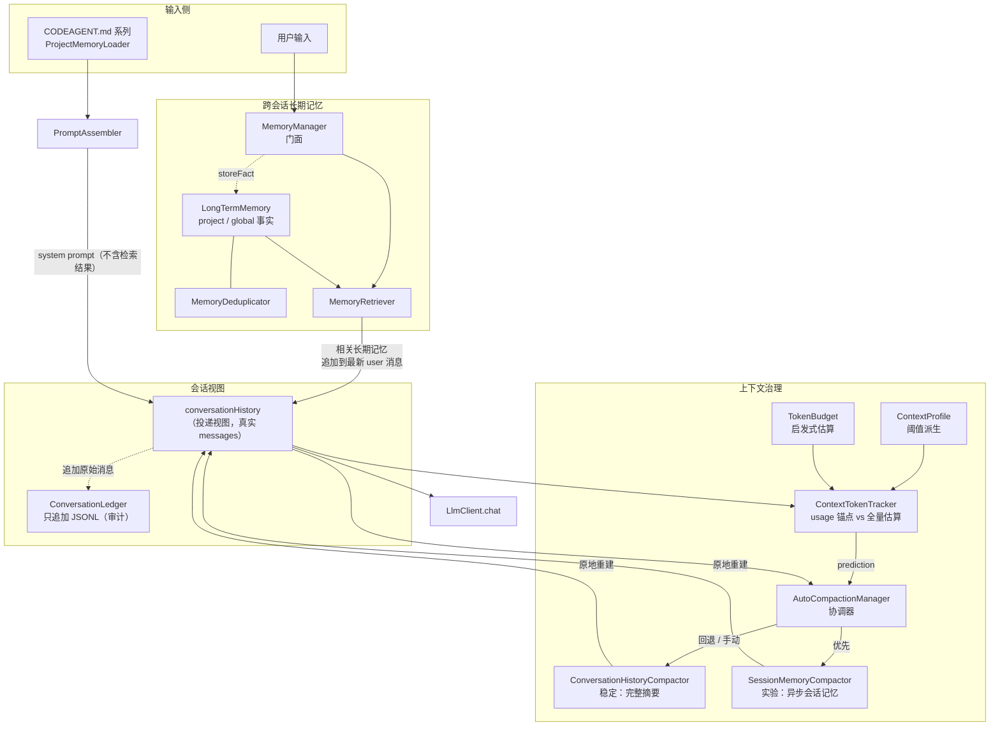
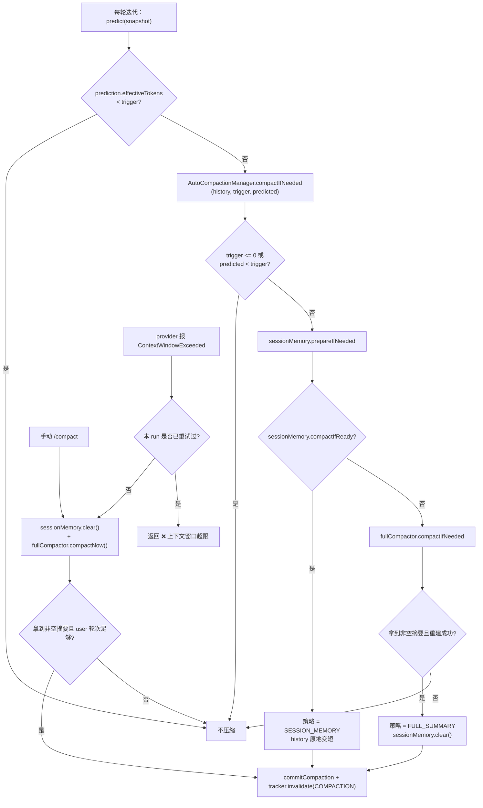
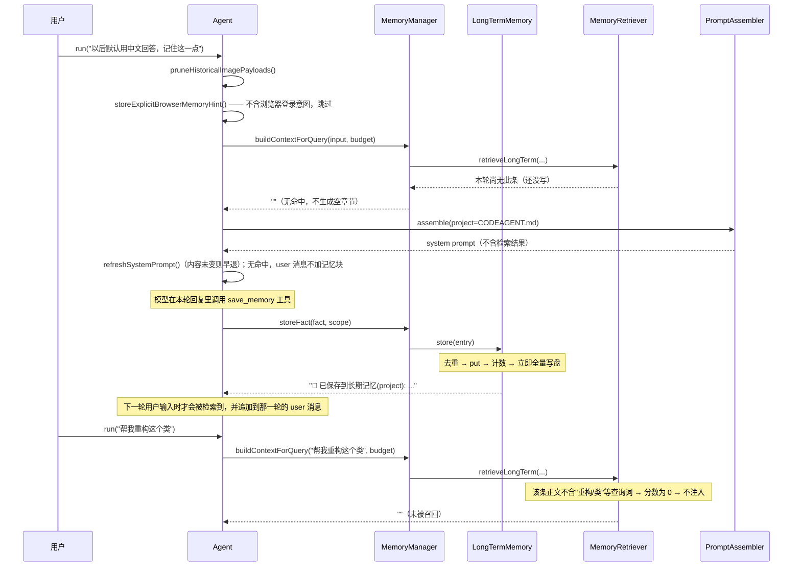

# 记忆与上下文管理

> **本文怎么读**
>
> - 假设你会写 Java、懂基本工程常识，但**没有**做过 LLM 上下文窗口管理、分层记忆或对话摘要压缩。所以第 0 部分从概念讲起，不假设你熟悉这个领域。
> - 本文**只描述代码实际行为**，包括缺陷和名不副实的地方。凡是「注释/意图这么说、代码其实那样做」的，都会明确写出来。
> - 代码位置统一写成 `相对路径:行号`。行号以当前主工作树为准；仓库曾做过一次包名重命名（`com.paicli` → `com.codeagent`），历史文档里的行号大多已失效，本文的行号全部是重新打开源码核对的。
> - **本文不写具体常量数值**（例如「保留最近 N 轮」「阈值 N token」）。规则是「描述行为 + 给出 `file:line`」，精确数字请点开源码看常量定义。唯一的例外是简历原句里出现的数字（`200k → 约 167k` 触发、`50%` 阈值），这些必须保留。
> - 事实 / 推断 / 建议三种语气会分开写。凡是「只读代码推出来的、没有实际跑过」的结论，都会标注「**推断**」。

---

# 第 0 部分 前置知识

## 0.1 什么是上下文窗口

大模型每一次回答，都要把**这一轮要看的全部文本**重新塞给模型一次（LLM 是无状态的，它不记得上一轮）。这些文本包括：

- system prompt（角色设定、项目规则、工具说明）
- 到目前为止的整段对话（用户说了什么、助手回了什么、调了哪些工具、工具返回了什么）
- 工具（function calling）的 schema 描述

模型能一次接受的最大 token 数，就是**上下文窗口（context window）**。200k 窗口意味着这次请求的输入 + 本次输出的总长度不能超过 200k token。

关键点：**窗口不是存档，是每次都要重发的输入。** 对话越长，每一次新请求的输入就越长，成本越高、延迟越大。

## 0.2 窗口为什么会满

在一个「会自己调工具的 Agent」里，窗口增长得比普通聊天快得多：

1. 一轮用户提问，Agent 可能连续调十几次工具（读文件、搜索、跑命令），每次调用和每次结果都进历史。
2. 工具结果往往很长。读一个文件就可能几万 token。
3. 图片、PDF 这类多模态内容以 base64 编码塞在消息里，体积是文本的几十倍。
4. 历史消息**每轮都会重复发送**，早期的一条大消息会一路跟着你到会话结束。

所以窗口几乎一定会满，问题只是「什么时候满」。

## 0.3 满了为什么不能简单截断

最省事的做法是「把最早的消息删掉」。这在聊天里勉强能用，在 Agent 里会直接坏掉，原因有两个：

**原因一：协议配对不能拆。** OpenAI 兼容的 function calling 协议里，助手发出的 `tool_calls` 消息和随后工具返回的 `tool` 消息是**成对**的：`tool` 消息必须带着 `tool_call_id` 指向前面那个调用。如果你按「删最早 N 条」硬切，很可能切在两者中间，留下一个没有对应调用的 `tool_call_id`，或者一个没有结果的 `tool_calls`——provider 会直接报 400。

代码里对这件事的处理是：**只在 user 消息边界切**。因为一次 user 提问到下一次 user 提问之间，正好是一整轮「提问 → 若干次工具调用 → 回答」。见 `src/main/java/com/codeagent/memory/ConversationHistoryCompactor.java:96-102`。

**原因二：语义会断。** 用户第一次提问里往往带着整个任务的目标和约束。直接删掉它，模型就不知道自己在干什么了。

于是项目选择：**把旧消息交给模型总结成一段摘要，用摘要替换旧消息**，而不是直接丢弃。这就是「压缩」。（当然也可以选「滑动窗口直接丢弃」，只是这个项目没选，取舍见第 10 部分。）

## 0.4 分层记忆是什么意思

「记忆」不是一个东西，而是几种**生命周期完全不同**的数据被混称。本项目分成这样几层，各有各的载体和用途：

| 层 | 通俗说法 | 生命周期 | 进不进 prompt |
|---|---|---|---|
| 会话消息历史 | 这次对话的全部消息，就是发给模型的 `messages` | 当前会话 | **就是它本身** |
| 原始消息账本 | 未经任何裁剪的原始流水，只追加 | 当前会话，落盘 | 不进（审计用） |
| 长期记忆 | 跨会话仍然成立的事实、偏好 | 跨会话，落盘 | 检索后追加到本轮 user 消息 |
| 项目记忆 | `CODEAGENT.md` 系列文件 | 跟随仓库，可版本化 | 每次组装 system prompt 时加载 |
| 会话记忆（实验） | 压缩用的异步预生成摘要状态 | 绑在某个 history 对象上，不落盘 | 压缩时用来替换旧消息 |

分清这五层，是理解后面所有设计的前提。第 2 部分逐层展开。

## 0.5 token 是怎么被数出来的

「token」是模型计费和限长的单位，大致等于「一小段文字」（英文约几个字符，中文约一到两个字）。要判断「窗口还剩多少」，就得先数 token。

严格数 token 需要**模型自己的分词器**（tokenizer），每个 provider、每个模型都不一样。本项目没有为每个模型打包分词器，而是用一套**启发式估算**：把中文字符和其他字符分开，各乘一个经验比率再相加。见 `src/main/java/com/codeagent/memory/MemoryEntry.java:48-53`。

启发式的优点是零依赖、跨 provider 通用；代价是**不精确**，而且是**偏乐观（偏少）**的——具体理由和证据见第 4 部分。偏少的直接后果是：你以为还没到阈值，实际可能已经超了。

## 0.6 名词速查

| 名词 | 含义 | 主要位置 |
|---|---|---|
| 投递视图（delivery view） | 真正发给模型的那份 `messages`，会被裁剪、压缩改写 | `Agent.conversationHistory` |
| 压缩（compaction） | 把旧对话总结成摘要，用摘要替换旧消息，从而缩短历史 | `ConversationHistoryCompactor` |
| 触发阈值 | 历史估算 token 达到它就该压缩 | `ContextProfile.compressionTriggerTokens()` |
| usage 锚点 | 用 provider 上一轮返回的真实 token 数，加增量推算本轮 | `ContextTokenTracker` |
| scope | 长期记忆的可见范围：`project` 或 `global` | `LongTermMemory.isVisibleInProject` |

---

# 第 1 部分 整体地图

## 1.1 整体架构



一句话概括数据流：**输入 → 检索长期记忆 → 组装不含检索结果的 system prompt → 把检索结果拼进本轮 user 消息并追加到 `conversationHistory` → 每轮迭代前判断是否压缩 → 发给模型。**

## 1.2 分层职责表

| 组件 | 职责 | 位置 |
|---|---|---|
| `MemoryManager` | 门面。只管长期记忆、检索、token 统计；**不再持有短期记忆** | `memory/MemoryManager.java:19` |
| `LongTermMemory` | 跨会话事实的存储、检索、去重、JSON 持久化 | `memory/LongTermMemory.java:25` |
| `MemoryDeduplicator` | 长期记忆的确定性去重（不做冲突消解） | `memory/MemoryDeduplicator.java:14` |
| `MemoryQueryTokenizer` | jieba 分词 + 子串匹配 | `memory/MemoryQueryTokenizer.java:17` |
| `MemoryRetriever` | 相关度打分、生成要注入的「相关长期记忆」文本 | `memory/MemoryRetriever.java:14` |
| `TokenBudget` | 启发式 token 估算、静态预算拆分、用量统计 | `memory/TokenBudget.java:17` |
| `ContextProfile` | 从 `maxContextWindow` 派生所有上下文参数 | `context/ContextProfile.java:18` |
| `ContextTokenTracker` | 决定本轮用「usage 锚点 + 增量」还是「全量估算」 | `context/ContextTokenTracker.java:6` |
| `AutoCompactionManager` | 压缩协调器：先试会话记忆，失败回退完整摘要 | `memory/AutoCompactionManager.java:15` |
| `ConversationHistoryCompactor` | 稳定路径：达到阈值时把旧段整体摘要 | `memory/ConversationHistoryCompactor.java:29` |
| `SessionMemoryCompactor` | 实验路径：阈值前异步预生成摘要 | `memory/SessionMemoryCompactor.java:26` |
| `ProjectMemoryLoader` | 加载 `CODEAGENT.md` 系列并处理 `@import` | `prompt/ProjectMemoryLoader.java:19` |
| `PromptAssembler` | 把项目记忆、skill、外部上下文拼进 system prompt（**不含长期记忆检索结果**） | `prompt/PromptAssembler.java:9` |
| `ConversationLedger` | 只追加的原始消息账本 | `history/ConversationLedger.java:40` |
| `SessionStore` | 持久化会话事件流，支持重启后恢复 | `history/SessionStore.java` |

## 1.3 外部接线点：谁在什么时候调用这些组件

这是理解本模块最重要的一张表。**记忆系统没有自己的主循环，它全部挂在 Agent 的调用点上。**

| 触发点 | 调用 | 位置 |
|---|---|---|
| 每个用户轮次开始前 | 裁剪历史图片二进制 | `agent/Agent.java:222` |
| 每个用户轮次开始前 | 抽取「浏览器登录复用」启发式事实 | `agent/Agent.java:223` |
| 每个用户轮次开始前 | 检索长期记忆并追加到本轮 user 消息末尾 | `agent/Agent.java:227-235` |
| **每次 ReAct 迭代**（不是每轮用户输入） | 压缩检查 | `agent/Agent.java:264` |
| provider 报上下文超限时 | 一次性手动压缩后重试 | `agent/Agent.java:378-396` |
| `/clear` | 清空会话历史 + 会话记忆状态 + skill buffer | `agent/Agent.java:472-497` |
| `/compact` | 手动压缩（跳过阈值） | `agent/Agent.java:502-517` |
| `/memory`（status/list/search/delete/clear） | 长期记忆管理 | `cli/Main.java:608-653` |
| `/save` | 写入长期记忆 | `cli/Main.java:654-663` |
| `save_memory` 工具 | 模型主动写长期记忆 | `tool/ToolRegistry.java:726-748` |
| 统一 `/plan` 的每个执行任务 | 检索长期记忆 + 压缩 | `agent/PlanExecuteAgent.java:645-652`、`226-259` |
| `/plan` 的 Reviewer `SubAgent` | 只压缩并加载项目 `CODEAGENT.md`，**不检索长期记忆，也不暴露工具** | `agent/SubAgent.java:126`、`:141-189`、`:557-562` |

最后一行是个需要留意的差异，第 9 部分会展开。

## 1.4 边界：本模块不负责什么

- **不负责代码库检索（RAG）。** 长期记忆仍不复用代码 RAG 的 `VectorStore` / SQLite 索引；但检索层现在复用 `rag.embedding.EmbeddingProvider` 与随 JAR 分发的 `InProcessBgeEmbeddingProvider` 作为本地语义信号。长期记忆 JSON 仍是唯一事实源，向量只做进程内派生缓存。代码库检索仍是另一套生命周期（见 `04-code-rag-graph.md`）。
- **不负责单轮 ReAct 循环本身。** 「什么时候该继续调工具、什么时候该结束」是 `01-react-agent.md` 的话题；本文只讲**循环里与上下文体积有关的那一步**（压缩判断）。
- **不负责对话协议解析。** 消息怎么序列化成 provider 的 JSON，在 `llm` 包里。
- **不做自动事实抽取。** 长期记忆只在显式入口写入（3.4）。

## 1.5 容易混淆的几组东西

**长期记忆 vs 代码库 RAG。** 两者都是「检索后塞进 prompt」，数据源、生命周期和事实存储仍然不同：长期记忆存少量用户偏好/项目约定，JSON 跨会话持久化；RAG 存代码切片并维护可重建索引。两者只共享 `EmbeddingProvider` / 本地 BGE 这一基础能力，不共享 `VectorStore`、SQLite 表或索引生命周期。

**长期记忆 vs `CODEAGENT.md`。** 长期记忆是「Agent 运行时攒下来的」，通过 `/save`、`save_memory`、启发式写入，颗粒是「一条事实」；`CODEAGENT.md` 是「人写给 Agent 的」，跟着仓库走、能进 Git、团队共享，颗粒是「一篇文档」。**两者注入位置不同**：`CODEAGENT.md` 进 system prompt 的 `## Project Context`（`prompt/PromptAssembler.java:38`），长期记忆追加在本轮 user 消息末尾（`agent/Agent.java:233-235`）。区别的由来见 10.3，不能互相替代。

**`conversationHistory` vs `ConversationLedger`。** 前者是投递视图，会被图片裁剪、`/clear`、压缩改写；后者只追加、永不改写，存的是模型**最初看到过什么**。见 `history/ConversationLedger.java:28-38`。

**`conversationHistory` vs `SessionStore` 的投影。** 前者是内存里的 `List<Message>`；后者是把会话事件写进 `events.jsonl`，重放（replay）出来的等价投影。挂了 `SessionStore` 之后，内存里的 `conversationHistory` 是投影的一份副本，一致性由 `SessionStore` 维护。见第 6 部分。

---

# 第 2 部分 分层记忆

## 2.1 第一层：`conversationHistory` 就是投递视图

`Agent` 里有一个 `List<LlmClient.Message> conversationHistory`。它同时扮演两个角色：

1. **发给 provider 的真实协议**——`llmClient.chat(conversationHistory, tools)` 直接把它当 `messages` 用（`agent/Agent.java:283-284`）。
2. **Agent 的工作状态**——循环每轮往里追加助手消息、工具调用、工具结果。

早期版本还有一层独立的「短期记忆」结构（`ConversationMemory`）和一个只压这份影子结构的 `ContextCompressor`。重构把它们删了，理由是：**压影子结构并不能缩短真正发给模型的请求**，而且两份数据双写容易不一致。

`MemoryManager` 的类注释把这件事写得很直白（`memory/MemoryManager.java:16-17`）：

> 当前会话的短期上下文由各 Agent 自己的 conversationHistory 维护，并由 `AutoCompactionManager` 直接压缩；这里不再复制保存第二份消息列表。

旧的构造签名还留着（`memory/MemoryManager.java:31`、`36`），但短期预算参数被显式标记为 `ignoredShortTermBudget`、不再参与任何计算。`MemoryManager.getSystemStatus()` 里也直接输出「短期上下文: 由当前 Agent conversationHistory 维护」（`memory/MemoryManager.java:136`）。

**结论：不存在「压一份影子短期记忆、真实请求却不变」的第二本账。**

## 2.2 第二层：`ConversationLedger` 保留原始流水

因为 `conversationHistory` 会被改写（裁图、`/clear`、压缩都会替换或删除条目），它**无法忠实回答「模型最初看到了什么」**。审计、回溯、排查「模型当时是不是看到了错的参数」都需要这个能力。

`ConversationLedger` 独立于投递视图，只追加 JSONL（每行一条 JSON 记录），从不重写。类注释明确写了这个定位（`history/ConversationLedger.java:28-38`）。它还会记录一些投递视图里没有的事件，例如 `/clear` 时的 `history_clear` 事件，附带被丢弃的消息条数（`agent/Agent.java:474-479`）。

由于原始记录可能包含完整 prompt、工具参数与结果、reasoning 文本甚至图片 base64，默认目录和文件权限被限制为仅当前用户可读写（`history/ConversationLedger.java:46-49`）。

**关键：ledger 不注入任何 prompt。** 它纯粹是审计通道。

## 2.3 第三层：`LongTermMemory` 跨会话事实

存的是「用户偏好、项目约定、稳定决策」这类**跨会话仍然成立**的少量事实。

### 存储与作用域

- JSON 文件仍是唯一事实源；进程内由 `LongTermMemory` 维护 `MemoryEntry`。
- `scope=global` 对所有项目可见；`scope=project` 还要匹配规范化 workspace 路径。
- legacy 条目没有 `metadata.status` 时按 `active` 处理。
- `/memory list` 保留 active 与 superseded 历史供审计；正常自动检索与 `/memory search` 只使用 active 条目。

### 检索：词法 + 本地 BGE + 确认时间乘法衰减

`MemoryRetriever` 的普通检索链路是：

```text
scope/status 过滤
    ↓
lexical score
+
local BGE semantic cosine
    ↓
0.45 * lexical + 0.55 * semantic
    ↓
按 lastConfirmedAt 计算 [0.6, 1.0] decay
    ↓
final = hybrid * decay
    ↓
稳定排序 + Token 预算打包
```

普通语义召回阈值为 `0.475`，写入候选阈值为更宽松的 `0.45`。这两个值由随 JAR 分发的真实 BGE 对方案黄金集的正负样例分布确定；本地 embedding 不可用时回退 lexical-only，不阻断 ReAct / Plan。MemoryEntry 向量由 `MemoryEmbeddingCache` 以 `id + content hash + embeddingSpaceId` 做进程内懒缓存；query 每次检索重新 embedding，向量不写回 JSON。

时间衰减公式：

```text
decay = 0.6 + 0.4 * 2^(-ageDays / 30)
finalScore = hybridRelevance * decay
```

其中 age 以 `metadata.lastConfirmedAt` 为基准；legacy 条目缺失或非法时回退不可变的 creation `timestamp`。这里的 30 天半衰期是“高于 0.6 下限的部分每 30 天减半”：0 / 30 / 60 / 90 天的 factor 分别为 1.0 / 0.8 / 0.7 / 0.65，最终趋近 0.6。

`lastConfirmedAt` 只会在用户显式长期记忆写入中刷新：CREATE/SUPERSEDE 的新 active memory 初始化为创建时间；exact DUPLICATE 或 classifier DUPLICATE 会刷新已有记忆的确认时间。普通检索命中、prompt 注入、Plan Task 使用和工具执行都不会自动确认，避免“越常被检索越不衰减”的自我强化循环。

事实是否仍有效依旧由 active/superseded 生命周期决定；时间只影响 active memory 的检索强度，不会自动让事实失效。写入关系候选召回不应用 decay，避免很旧的 active memory 因年龄而找不到 DUPLICATE / SUPERSEDE 目标。

### 写入：统一 CREATE / DUPLICATE / SUPERSEDE

`save_memory` 与 `/save` 最终都进入 `MemoryWriteResolver`。写入不再依赖旧的“中文助词差异”近似去重：

1. 先在同 type/scope/project 域内做确定性 canonical equality fast-path：NFKC、大小写、空白与普通句读归一；`C++`、版本号、URL 等有意义符号仍保留。
2. 若不是显而易见的 exact duplicate，则只在同域 active memory 中用 lexical + 本地 embedding 找 Top-K 候选。embedding **只负责候选召回**，不能用 cosine 阈值直接删除或覆盖记忆。
3. `MemoryRelationClassifier` 复用当前 `LlmClient` 做一次**无工具**严格 JSON 分类：
   - `CREATE`：新事实/补充事实；
   - `DUPLICATE`：同一稳定事实的同义表达；
   - `SUPERSEDE`：用户明确说旧事实已改变、失效或应替换。
4. `SUPERSEDE` 必须带 evidence，且 evidence 必须是**当前顶层 submittedUserInput 的原文子串**。分类器异常、非法 JSON、target 不存在或 evidence 不合法，都不能让旧事实失效。
5. supersede 成功后旧条目写 `status=superseded` / `supersededBy=<new-id>`，新条目保持 `status=active` 并记录 `supersedes=<old-id>`。多记录持久化失败时回滚内存修改，旧事实继续 active。

这个边界把“同义去重”和“事实更新”统一成一次写入关系解析，同时保留一个零歧义的确定性 fast-path，避免所有保存都额外调用 LLM。

## 2.4 第四层：`CODEAGENT.md` 项目记忆

`ProjectMemoryLoader` 按固定顺序读取五个来源（`prompt/ProjectMemoryLoader.java:66-76`）：

1. 用户配置目录 `~/.codeagent/CODEAGENT.md`
2. 项目根 `CODEAGENT.md`
3. 项目根 `.codeagent/CODEAGENT.md`
4. 项目根 `CODEAGENT.local.md`
5. 项目根 `.codeagent/CODEAGENT.local.md`

存在且非空的来源按这个顺序**拼接**，每段标注绝对路径。**不是后者覆盖前者的键值合并**——是文本块累加（`prompt/ProjectMemoryLoader.java:43-64`）。

**`@import` 机制**：单独一行 `@relative/path.md` 会触发文件导入（`prompt/ProjectMemoryLoader.java:116-126`）。安全规则逐条都在 `readWithImports` 里（`prompt/ProjectMemoryLoader.java:78-114`）：必须是相对路径、不含空格、不含 `..`、normalize 后必须仍在来源的允许根内、必须是普通文件、限制递归深度、用 `importStack` 检测循环。

**总注入量有字符预算**，超限时截断并附提示。注意截断保留的是「字符预算**减去一个余量**」，余量留给提示文本本身（`prompt/ProjectMemoryLoader.java:128-132`）。

**推断（未实际验证）**：允许根判断用的是 `normalized.startsWith(importRoot)`，其中 `importRoot` 来自 `toAbsolutePath().normalize()` 而不是 `toRealPath()`（`prompt/ProjectMemoryLoader.java:28-31`、`84`）。因此符号链接如果指向允许根之外，`startsWith` 检查仍可能通过。要确证需要构造 symlink 实测。

## 2.5 第五层：`SessionMemoryCompactor` 的会话记忆状态（实验，默认关闭）

这一层容易被误解成「另一种持久化记忆」，其实它**什么都不是**：

- 它是**绑在某个特定 `List<Message>` 对象上的异步摘要状态**，用 `WeakReference` 做键（`memory/SessionMemoryCompactor.java:289-309`）。
- 不落盘、不跨进程、不跨会话。
- `history` 被整体替换（例如压缩重建、`/clear`、从磁盘恢复）后，`WeakReference` 指不到原对象，状态即失效（`memory/SessionMemoryCompactor.java:185-189`）。
- 每份 history 有独立状态，避免 ReAct、`/plan` 并行任务与 Reviewer 之间互相污染（`memory/SessionMemoryCompactor.java:19-24`）。

它的作用只有一个：在真正撞到阈值**之前**，提前把「要总结的那段对话」异步总结好，等撞阈值时直接用，省掉临界点上那一次同步 LLM 调用。详见 5.3。

---

# 第 3 部分 检索与注入

## 3.1 注入时机：每个用户轮次开始前一次

`Agent.run` 的开头依次做这几件事（`agent/Agent.java:221-238`）：

```text
pruneHistoricalImagePayloads()          // 裁掉历史图片二进制
storeExplicitBrowserMemoryHint(input)   // 抽取「浏览器登录复用」事实（有严格前置条件）
buildContextForQuery(input, budget)     // 检索长期记忆，生成待注入文本
refreshSystemPrompt()                   // 刷新 system prompt（不含检索结果，相等则早退）
prependSkillBodies(input)               // 前置一次性 skill 正文
→ 把检索文本拼到用户原文之后            // agent/Agent.java:233-235
appendConversationMessage(...)          // 追加本轮 user 消息
```

检索结果**不再进入 system prompt**，而是作为本轮用户消息的一部分随该消息发出，因此历史消息一经写入就不再被改写。原因见 10.3。

**注意这里有一个顺序上的细节**：浏览器登录 fact 是在**检索之前**写入的（`agent/Agent.java:223` 在 `228` 之前）。所以如果这一轮输入同时触发了「保存」和「命中检索」，这一轮就可能检索到自己刚写进去的那条 fact。这是**推断**（从调用顺序推出），没有实测。

而 `save_memory` 工具是在模型已经开始工作之后才被调用的，写入结果通常供**后续轮次**使用，不会回写当前这一条已经发出的请求。

**跨会话恢复时，本轮不重新检索**：`attachSession` 直接把磁盘投影装回 `conversationHistory` 并让 tracker 失效（`agent/Agent.java:118-150`、`139`）。下一次 `run` 才会重新检索。

## 3.2 只注入长期记忆，不注入会话历史

`MemoryRetriever` 的注释解释了原因（`memory/MemoryRetriever.java:32-37`）：

> 当前轮用户输入和短期对话已经在 message history 里，不应再次以「相关记忆」身份注入给模型，否则容易让模型把当前请求误读成历史事实。

这解决了早期版本的一个真实 bug：把「当前轮对话」当作「历史记忆」再注入一遍 system prompt，模型会把用户**刚刚提出的新请求**理解成一条**过去发生过的旧事实**。

一个佐证：`MemoryRetriever.ScoredEntry` 有一个 `fromShortTerm` 字段（`memory/MemoryRetriever.java:113`），但在当前代码里**永远是 `false`**——构造它的地方只传 `false`（`memory/MemoryRetriever.java:45`）。这是重构留下的**残留字段**，说明「从短期记忆检索」这条路已经彻底不存在了。

## 3.3 打分、确认时间衰减与注入预算

当前 MemoryRetriever 对 scope/status 过滤后的 active 记忆统一计算：

```text
lexicalScore
semanticScore
    ↓
hybridRelevance = 0.45 * lexical + 0.55 * semantic
    ↓
lastConfirmedAt（legacy 回退 timestamp）
    ↓
decay = 0.6 + 0.4 * 2^(-ageDays / 30)
    ↓
finalScore = hybridRelevance * decay
```

词法层仍由 jieba 切分 query，并用 query token 在 Memory 正文中的覆盖率打分；正文包含完整 query 时 lexicalScore=1。语义层使用进程内 BGE cosine；本地 embedding 不可用时只保留 lexicalScore。

普通语义召回要求 lexicalScore>0 或 semanticScore 达到阈值。时间只作用在通过相关性门槛后的排序分数上，不改变一条记忆是否语义相关。

确认时间规则：

- 新 CREATE / SUPERSEDE 的 active memory：lastConfirmedAt=创建时间；
- 用户显式再次保存同一事实，exact DUPLICATE 或 classifier DUPLICATE：刷新已有 memory 的 lastConfirmedAt；
- 普通 retrieval、prompt 注入、Plan Task 使用和工具调用不会刷新确认时间；
- legacy / 非法 lastConfirmedAt 回退创建 timestamp；
- 写入关系候选召回只按 hybridRelevance 排序，不应用 decay。

最终排序按 finalScore、hybridRelevance、lastConfirmedAt、timestamp、id 稳定决胜。

buildContextForQuery 取排好序的候选后按 tokenCount 装入预算；某条过大时跳过并继续尝试后续条目，而不是让单个大 Memory 饿死后续短记忆。注入 token 预算仍来自 ContextProfile.memoryContextTokens()。

## 3.4 长期记忆的写入入口只有三个

这是本模块的一条硬规则：**不会自动把对话变成事实。**

1. `save_memory` 工具（`tool/ToolRegistry.java:726-748`）。工具描述本身就要求「当且仅当用户明确说"记一下""记住""以后记得"或要求保存长期偏好/稳定事实时调用」，`scope` 默认 `project`，跨项目偏好才用 `global`（`tool/ToolRegistry.java:729`、`743`）。
2. `/save <事实>` 或 `/save --global <事实>`（`cli/Main.java:654-663`；解析在 `cli/CliCommandParser.java:185-191`）。
3. **浏览器登录复用启发式**（`agent/Agent.java:696-705`）——这是唯一一个「自动」入口，但前置条件非常严：必须**同时**检测到显式记忆意图（「记一下 / 记住 / 保存到长期记忆」这类措辞）**和**提到浏览器/Chrome 登录态复用（`memory/ExplicitMemoryHints.java:17`、`33-49`）。命中后写一条 `global` fact，内容是关于「访问某个站点时优先复用已登录的 Chrome」的模板句（`memory/ExplicitMemoryHints.java:20-30`）。

**三条路径最终都汇聚到 `MemoryManager.storeFact`**（`memory/MemoryManager.java:72-85`），它创建一条 `FACT` 类型的 `MemoryEntry`，id 是 `fact-` 加随机片段。

**为什么不做自动抽取？** 让模型自己决定「什么值得记」，它会把临时请求、猜测、甚至错误结论永久化。显式入口换来的是可控、可审计（能 list/search/delete）。

## 3.5 CLI 搜索走的是另一条路径，顺序可能和注入不一样

`/memory search <关键词>` 直接调用 `MemoryManager.searchLongTerm`（`cli/Main.java:626-636`），底层是 `LongTermMemory.search`：

- 它用 jieba token 对**正文或 metadata** 做大小写不敏感的子串匹配（`memory/LongTermMemory.java:83-97`）。
- 返回顺序是 `ConcurrentHashMap` 的**迭代顺序**截断到条数上限，**不做相关度排序、不做时间衰减**（`memory/LongTermMemory.java:86-96`）。
- 它**不使用** `MemoryRetriever`。

所以：**CLI 搜索结果的顺序，和 Agent 自动注入的顺序可能不同。** 前者用于人工管理，后者用于提示词召回。这是一个真实的行为差异，不是 bug。

## 3.6 注入的最终落点

长期记忆与项目记忆的**落点不同**，这是本节最重要的结论。

**项目记忆 + 外部上下文**进 system prompt 的同一个 `## Project Context` 章节（`prompt/PromptAssembler.java:38`）：

```java
append(prompt, dynamicSection("Project Context",
        ctx.projectMemoryContext(), ctx.externalContext()));
```

`dynamicSection` 会跳过空值（`prompt/PromptAssembler.java:79-93`），所以两块都为空时整个章节消失。

**长期记忆检索结果**则追加到本轮用户消息内容的末尾（`agent/Agent.java:233-235`），拼接顺序为 `skill 正文 → 用户原文 → 相关长期记忆`：

```java
String userMessageContent = prependSkillBodies(userInput);
if (!memoryContext.isEmpty()) {
    userMessageContent = userMessageContent + "\n\n" + memoryContext;
}
```

`memoryContext` 由 `MemoryRetriever.buildContextForQuery` 生成，自带 `## 相关长期记忆` 标题（`memory/MemoryRetriever.java:65`），因此模型仍能把它与用户原文区分开。

与 `PlanExecuteAgent` 的一致性：PLAN 路径本来就是这么做的——先按不含记忆的上下文拼 system prompt，再把记忆追加到 `taskInput`（`agent/PlanExecuteAgent.java:578-595`）。改动后 ReAct 与 PLAN 的注入形态统一。

---

# 第 4 部分 token 估算与压缩触发

## 4.1 三层估算口径（不能混用）

项目里同时存在三种「token 数」，混用会导致「为什么状态栏说还有空间，却报超限」这类困惑：

| 口径 | 是什么 | 用途 | 位置 |
|---|---|---|---|
| 上下文预测（ctx） | 请求前冻结实际 `messages + tools`，给出本轮会占用多少 | 压缩触发、状态栏 | `ContextTokenTracker.predict` |
| provider usage | provider 返回的真实 `inputTokens` / `outputTokens` | 成本统计、锚点校准 | `TokenBudget.recordUsage` |
| 记忆条目 `tokenCount` | 每条长期记忆自己的估算 token | 注入预算累加 | `MemoryEntry.estimateTokens` |

三者中只有第二种是**真实值**。

## 4.2 启发式估算是怎么算的

**字符层**（`memory/MemoryEntry.java:48-53`）：

- 用一个**严格的 CJK code-point 区间**判定「中文」。区间之外的一切——包括日文假名、全角标点、emoji——都归入「其他字符」。
- 「其他字符数」= `text.length() - chineseChars`。而 `String.length()` 按 **UTF-16 code unit** 计数，所以**一个 emoji（surrogate pair）会被算成两个字符**。
- 两类字符各乘一个经验比率后向上取整相加。

**消息层**（`memory/TokenBudget.estimateMessageTokens`，`memory/TokenBudget.java:115-140`）：

- 每条消息先加一笔固定开销，再加上 `role`、`reasoningContent`、`toolCallId` 的文本估算（`memory/TokenBudget.java:117-120`）。注意：这**不只是**「role 和分隔符的固定开销」，reasoning 文本也一起算了——早期文档把这里说成「固定 role/separator 开销」，低估了它。
- **多模态分支**：只要 `contentParts()` **非 null 且非空**，就**完全忽略 `content()`**，只遍历 parts（`memory/TokenBudget.java:121-127`）。这里有一个细节：判断条件是「非 null **且非空**」，所以一个空的 `contentParts` 列表会**落回** `content()` 分支。（这是比早期文档更精确的表述——早期文档只说了「非 null」。）
- 工具调用的 `arguments` 单独计入（`memory/TokenBudget.java:128-138`）。

**图片层**（`memory/TokenBudget.java:184-190`）：先按 base64 字符串长度折算近似字节数，再除以一个 bytes-per-token 除数，结果被**夹在一个下限与上限之间**（`Math.max(256, Math.min(4096, ...))`）。没有 base64 时取固定回退值。

**工具 schema 不在消息估算里**：`estimateToolsTokens` 单独序列化整个 tools 数组再估（`memory/TokenBudget.java:143-151`），`estimateRequestTokens` 把两者相加（`memory/TokenBudget.java:154-158`）。

## 4.3 估算偏乐观还是偏保守

**结论：整体偏乐观（偏少）。** 理由（**推断**，从代码性质推出，未做逐样本实测）：

| 情形 | 方向 | 原因 |
|---|---|---|
| emoji / 罕见字符（surrogate pair） | **偏少** | 按 UTF-16 长度算 2 个「其他字符」，约等于半个 token，实际通常更多 |
| 中文全角标点（，。！？「」） | **偏少** | 不在严格 CJK 区间内，按「其他字符」的比率算 |
| 图片 | 可能偏少 | 被显式夹了上限 |
| `role` / `reasoningContent` / `toolCallId` 文本 | 偏多 | 这些其实也是 prompt 的一部分，算进去是对的 |
| 固定消息开销 | 略偏多 | 但量级很小 |

偏少意味着**会推迟压缩触发**。这正好被另外两个机制补偿：

1. `ContextTokenTracker` 在预测值上再加一个**安全余量**（`context/ContextTokenTracker.java:30-36`）。
2. provider 真实 usage 会通过锚点机制**校准**后续预测（4.4）。

## 4.4 两种预测模式：全量估算 vs usage 锚点

`ContextTokenTracker` 内部只保存**一个**「锚点」——上一次成功的 provider usage 及其对应的请求指纹（`context/ContextTokenTracker.java:5`）。

`predict` 的逻辑（`context/ContextTokenTracker.java:38-51`）：

- 如果没有可用锚点 → **FULL_ESTIMATE**：用 `TokenBudget.estimateRequestTokens` 全量本地估算。
- 如果有可用锚点 → **USAGE_ANCHORED_DELTA**：用「锚点那轮的真实 input token + 本轮 surface 相对锚点的**有符号增量**」。

「锚点可用」的条件相当严（`context/ContextTokenTracker.java:74-82`）：

- 锚点存在，且 provider usage 是 trusted；
- 锚点请求和当前请求都不含不支持的 part；
- **provider / model / callConfig / toolSchema 四个指纹全部相等**（`context/ContextTokenTracker.java:98-103`）——换个模型、改个工具 schema，锚点立刻作废；
- 而且「锚点记录的真实 usage」必须 **≥ 本地算出来的锚点 surface 估算**（`context/ContextTokenTracker.java:79-81`）。如果真实 usage 比本地估的还小，说明本地算错了，锚点不可信，回退全量估算。

**记录锚点时的防御**（`context/ContextTokenTracker.java:53-67`）：只有 usage 标记为 trusted、`inputScope` 不是 UNKNOWN、且**明确包含 system 和 tools** 时才记录；否则直接作废锚点。这是为了防止把「只算了用户消息的那部分 token」当成完整输入。

**失效原因枚举**（`InvalidationReason`）在多个地方被显式触发：切换 provider（`agent/Agent.java:158`）、会话恢复（`agent/Agent.java:139`）、压缩后（`agent/Agent.java:584`）、清空历史（`agent/Agent.java:489`）、图片裁剪（`agent/Agent.java:615`）、超限恢复（`agent/Agent.java:386`）。

**结论：usage 锚点不是一劳永逸的校准，任何结构变化都会让它失效，退回全量估算。** 这是有意的：宁可回退到偏乐观的估算，也不要拿一个已经不匹配的真实值去外推。

## 4.5 压缩阈值是怎么算出来的

阈值不是固定的百分比，而是从 provider 的 `maxContextWindow` 派生（`context/ContextProfile.java:91-97`）：

```text
trigger = window − 摘要输出预留 − 自动压缩缓冲
摘要输出预留 = min(上限, max(下限, window/4))
自动压缩缓冲 = min(上限, max(下限, window/8))
最终 trigger = clamp(trigger, 下限, window - 1)
```

派生逻辑本身有一个关键设计原则，写在类注释里（`context/ContextProfile.java:8-9`）：

> 没有"长 / 短 / 平衡"模式分档。所有参数都是 `maxContextWindow` 的简单函数，全模型走同一套行为，只是 window 大小不同导致触发时机和容量不同。

**以 200k 窗口为例，阈值约 167k**（= 200k − 20k − 13k）；1M 窗口约 967k。两个数字都有测试断言：`src/test/java/com/codeagent/context/ContextProfileTest.java:20-23`、`33-34`，以及 `src/test/java/com/codeagent/memory/MemoryManagerTest.java:64-66`。

`compressionTriggerRatio()` 只是把这个绝对阈值换算回比率，并**额外受一个下限约束**（`context/ContextProfile.java:86-89`）——这个下限就是简历里说的「50% 阈值」口径。下限的作用是：窗口特别小时，按公式算出的比率可能很小，但压缩仍需要有一个有意义的触发点。

**一个必须说清的坑**：`TokenBudget.getAvailableForConversation()` 算的是「`window − 三个固定预留`」（`memory/TokenBudget.java:58-60`），这和上面这个压缩阈值**不是同一个数字**，而且**不驱动压缩**。它只被 `isWithinBudget`（无生产调用方）和用量报告字符串用到（`memory/TokenBudget.java:65-68`、`87-94`）。把两者当成一回事是理解错误的常见来源。

## 4.6 算出来但没有人用的预算（`agentTokenBudget`）

`ContextProfile.agentTokenBudget` = `max(下限, window × 0.8)`（`context/ContextProfile.java:77-80`）。

**它在生产代码里没有任何消费方。** 全局搜索 `agentTokenBudget` 只命中：record 组件声明（`context/ContextProfile.java:20`）、构造调用、以及测试断言（`ContextProfileTest.java:21`、`33`）。

而 `AgentBudget.java:79` 的注释声称它「用于 `/context` 与 token stats 的『软提示』显示」——但实际检查 `Agent.getContextStatus()`（`agent/Agent.java:707-760`）和 `ContextProfile.summary()`（`context/ContextProfile.java:70-75`），**都没有引用 `agentTokenBudget`**。这是一处**注释与实现不符**。

那 `AgentBudget` 自己的 token 硬限呢？**默认是 `Integer.MAX_VALUE`，实质不限**（`agent/AgentBudget.java:26`、`84`）——只有显式传 `-Dcodeagent.react.token.budget=N` 才生效。这一点早期文档是对的：`AgentBudget` 的 token 预算确实「默认形同不限」，与 `ContextProfile.agentTokenBudget` 那个没人用的字段是**两回事**，不要混为一谈。

`AgentBudget` 剩余的两个安全阀是：连续 N 次工具调用签名完全相同判为死循环（默认 N 在 `agent/AgentBudget.java:44`）、以及可选的硬轮数上限（默认无限，`agent/AgentBudget.java:46`）。三者按「先到先触发」判定（`agent/AgentBudget.java:127-138`）。这些属于 `01-react-agent.md` 的话题。

---

# 第 5 部分 压缩

## 5.1 触发点：每次 ReAct 迭代，不只是每轮用户输入

这是最容易被忽略的一点。压缩检查在 `while(true)` 循环**内部**、每次 `chat` 之前（`agent/Agent.java:264`）：

```java
RequestSnapshot requestSnapshot = requestSnapshotFactory.capture(
        llmClient, conversationHistory, toolExposure.definitions(), historyVersion);
ContextTokenTracker.ContextPrediction prediction = contextTokenTracker.predict(requestSnapshot);
if (maybeCompactHistory(requestSnapshot, prediction)) { /* 重新冻结快照、重新预测 */ }
```

所以**一次用户输入触发多个工具迭代时，压缩可能被判断多次**。压缩成功后必须重新冻结快照并重新预测（`agent/Agent.java:265-268`），因为历史变了。

`maybeCompactHistory` 的入口判断是 `prediction.effectiveTokens() < trigger` 就直接返回（`agent/Agent.java:574-576`）——**用的是带安全余量的预测值**，不是裸估算。

## 5.2 协调器怎么选路径



协调器本体很短（`memory/AutoCompactionManager.java:48-64`）：先 `prepareIfNeeded`，再 `compactIfReady`，成功就返回 `SESSION_MEMORY`；否则走 `fullCompactor.compactIfNeeded`，成功就 `sessionMemory.clear(history)` 并返回 `FULL_SUMMARY`；都不行返回 `NONE`。

**手动 `/compact` 永远走完整摘要**，并且会先 `sessionMemory.clear()`（`memory/AutoCompactionManager.java:67-73`）。所以手动压缩和实验路径完全无关。

## 5.3 稳定路径：完整对话摘要

`ConversationHistoryCompactor.compact` 的步骤（`memory/ConversationHistoryCompactor.java:88-133`）：

1. 估算当前 history 的 token。非强制模式下低于阈值直接返回 false（`:91`）。
2. 找出 `system` 之后所有的 user 消息下标（`memory/ConversationHistoryCompactor.java:94`，`173-186`）。
3. **如果 user 轮次数 ≤ 保留轮次数，直接跳过**（`:96-100`）。这是「即使超阈值也不压缩」的兜底——避免把仅有的一两轮也压没了。
4. 切点 = 「从末尾数保留轮次」那个 user 的下标（`:102`）。**切点必然落在 user 边界。**
5. 把 `[systemEnd, splitIdx)` 这段**整体**交给 LLM 摘要（`:105-114`）。
6. 摘要为空或 LLM 抛 `IOException` → **放弃压缩，原 history 一字不改**（`:111-118`）。
7. 拿到非空摘要才重建，并**原地**改 `history`（`:120-132`）。

**重建结构**（`memory/ConversationHistoryCompactor.java:188-201`）：

```text
[原 system prompt]
[user: "[已压缩的历史对话摘要]\n" + 摘要]
[assistant: "好的，我已了解之前的上下文，请继续。"]
[从切点开始的原始尾部消息]
```

为什么插入一对 user/assistant 消息而不是只用一条？——用标准角色兼容所有 provider，同时让 `user` 承载摘要、`assistant` 确认，形成一次合法的对话交替（这是**推断**的理由，代码里没写）。

**摘要 prompt 的要求**（`memory/ConversationHistoryCompactor.java:36-49`）明确列了要保留的四类信息：用户诉求与目标、已完成的关键操作与结果、已达成的结论、未解决问题。同时要求「不要复述原文、不要列举所有工具调用、不要保留闲聊」。

**摘要输入有字符上限**，超过就截断并追加「超长内容已截断」标记然后 `break`（`memory/ConversationHistoryCompactor.java:155-158`）。

**小缺陷**：`:130` 那行日志里「压缩前消息数」用的表达式带了个 `/* 估值 */` 注释，它算的是 `userIndices.size() + systemEnd`——这是**近似的消息条数**，和真实的 `history.size()` 不等（忽略了 assistant/tool 消息）。日志数字会偏小。

## 5.4 实验路径：异步会话记忆（默认关闭）

**开关**：`sessionMemoryEnabledByConfiguration()` 按「系统属性 → 环境变量 → 项目 `.env` → 用户 `~/.env`」的顺序读取，全都不存在时**默认关闭**（`memory/AutoCompactionManager.java:95-103`）。注意读取链的最后一步：`readDotEnv` 找不到文件返回 `null`，`truthy(null)` 返回 `false`，所以「没配置」= 关闭。

**它的预生成条件**（`memory/SessionMemoryCompactor.java:95-103`）：

- 必须已启用；
- 计算一个预生成水位（阈值的某个比例）；
- **当且仅当**当前历史**落在这个水位和阈值之间**时才调度。如果已经 `>= 阈值`，直接返回 false。

调度后走后台守护线程池异步执行（`memory/SessionMemoryCompactor.java:59-60`、`139-150`），成功则把摘要存进 `state.ready`（`:154-166`）。首次生成用「初始摘要 prompt」，之后用「增量更新 prompt」把新片段合并进旧摘要（`:34-57`、`:219-231`）。

**接受条件极严**（`memory/SessionMemoryCompactor.java:174-209`）：

1. 必须有已就绪的摘要；
2. 必须能在当前 history 里**用对象身份**找回「当时保留的第一条消息」（`:185-189`）；找不到就 `clear` 并返回 false——这处理「history 被整体替换」的情况；
3. 重建后必须**确实更短**（`afterTokens < beforeTokens`）**且**仍低于阈值（`:197-201`）。否则放弃，**不改动 history**。

保留尾部的计算是**按 token 预算 + 最少文本消息数**倒推的，起点仍取 user 边界（`memory/SessionMemoryCompactor.java:233-253`）。

**一个必须说清的缺陷（推断，未实测）**：这条实验路径在**自动流程里几乎不可达**。理由：

- `prepareIfNeeded` 的唯一生产调用点是 `memory/AutoCompactionManager.java:54`，而它前面 `:53` 已经要求 `measuredOrPredicted >= trigger`。
- `prepareIfNeeded` 内部用的是**只算消息的估算**（`TokenBudget.estimateMessagesTokens(history)`，不含 tool schema、不含安全余量），并在此**≥ 阈值时拒绝调度**（`memory/SessionMemoryCompactor.java:99-103`）。
- 而调用方传进来的 `predicted` 是**请求级预测**（含 tools + 安全余量），通常**大于**消息级估算。

于是常见情形是：请求级预测已超阈值，而消息级估算也超阈值 → `prepareIfNeeded` 拒绝调度 → `compactIfReady` 因为状态从未创建而返回 false（`memory/SessionMemoryCompactor.java:176-177`）→ 永远走完整摘要。

只有当「请求级预测 ≥ 阈值，但消息级估算还在水位与阈值之间」这个**窄带**成立时，才会调度异步预生成；而且同一轮里 `compactIfReady` 紧接着就被调用，异步任务**不可能已经完成**，所以这一轮仍然走完整摘要。等下一轮 `compactIfReady` 有可能命中时，如果上一轮完整摘要成功了，`memory/AutoCompactionManager.java:60` 会把会话记忆状态 `clear` 掉（取消 pending）。

**结论：实验路径在自动流程里只在很窄的条件下可能生效，且被完整摘要的清理动作反复抹掉。** 单元测试之所以能覆盖它，是因为 `SessionMemoryCompactorTest` **直接调用** `prepareIfNeeded` / `compactIfReady` 并传自定义阈值、用同步 executor（`src/test/java/com/codeagent/memory/SessionMemoryCompactorTest.java:109-124`）；`AutoCompactionManagerTest` 则用了**完全 stub 掉** `prepareIfNeeded` / `compactIfReady` 的子类（`src/test/java/com/codeagent/memory/AutoCompactionManagerTest.java:99-118`），并没有走真实门控逻辑。所以这是一条**集成层面几乎没被验证的路径**。

## 5.5 压缩失败与超限恢复

| 情形 | 行为 | 位置 |
|---|---|---|
| 完整摘要 LLM 抛 `IOException` | 记录 warn，返回 false，**history 不变** | `memory/ConversationHistoryCompactor.java:111-114` |
| 摘要为空/空白 | 记录 warn，返回 false，**history 不变** | `memory/ConversationHistoryCompactor.java:115-118` |
| user 轮次不足保留数 | 记录 info，跳过（即使超阈值） | `memory/ConversationHistoryCompactor.java:96-100` |
| 会话记忆预生成失败 | 记录 warn，摘要置 null，调用方回退完整摘要 | `memory/SessionMemoryCompactor.java:146-149` |
| 会话记忆重建后没变短 | 记录 info，放弃，**history 不变** | `memory/SessionMemoryCompactor.java:197-201` |
| provider 报上下文超限 | 若本 run 未重试过 → `compactNow` 后 `continue` 重试；已重试过 → 返回错误 | `agent/Agent.java:378-396` |

**超限恢复的细节**（`agent/Agent.java:378-396`）：捕获 `ContextWindowExceededException` 后，用一个**本 run 内的一次性计数器**限制重试次数为 1；压缩成功会 `invalidate(OVERFLOW_RECOVERY)` 并打印「provider 报告上下文超限，已压缩后重试」。压缩本身抛异常时只记 warn，然后走「返回 ❌ 上下文窗口超限」。

**这意味着：如果历史里 user 轮次太少（压缩会跳过的情形），超限恢复也救不回来**——`compactNow` 同样受「user 轮次 > 保留轮次」约束。这是设计上的必然，不是遗漏。

## 5.6 压缩在持久会话里记了什么

非持久模式下，压缩只改内存里的 `conversationHistory`，并向 ledger 追加一条 `compaction` 事件，带 `beforeMessages / afterMessages / beforeTokens / afterTokens`（`agent/Agent.java:1213-1224`）。

挂了 `SessionStore` 时，压缩必须**作为一组事件**写进会话流（`agent/Agent.java:1226-1277`）：

```text
compaction/start      { compactionId, source, beforeTokens }
compaction/summary    { compactionId, afterTokens }
user_message          surface = replace(第一条被压消息 .. 最后一条被压消息)
assistant_message     surface = append
compaction/end        { compactionId, status = "completed" }
```

重放端（`SessionReplayer.completeCompaction`）**只有看到 `status == "completed"` 才会真正应用这组替换**（`history/SessionReplayer.java:208-231`）。如果会话在压缩中途崩了，`compaction/end` 没写或状态不是 completed，重放时那组消息**被整段忽略**，只留下一条「incomplete compaction ignored」警告（`history/SessionReplayer.java:65-67`、`88-90`）。

**这是补偿日志（saga）模式**：要么整组生效，要么完全不生效，不会留下半压缩的坏历史。

另外，`commitCompaction` 有个前置保护：如果候选历史与当前历史相同，直接返回不写事件（`agent/Agent.java:1228-1230`）；如果压缩结果的形状不符合预期（例如候选太短、无法定位被替换的范围），**抛 `SessionPersistenceException`**（`agent/Agent.java:1241-1244`）。

## 5.7 历史图片裁剪：另一种「缩短上下文」的手段

`pruneHistoricalImagePayloads`（`agent/Agent.java:598-623`）在每个用户轮次开始前，把历史消息里的图片二进制**换成一个只有文本的版本**（`message.withoutImageContent()`），保留文本结论。

为什么放在轮次入口而不是每轮迭代？因为 base64 图片每轮都会重新计费，越早裁越省钱（**推断**）；但同一个轮次内的多次工具迭代如果需要重新看那张图，载荷还在——直到下一轮才被裁。

持久模式下，裁剪也会作为 `image_pruned` 事件 + `replace` surface 操作写进会话流（`agent/Agent.java:608-612`），所以重启恢复后图片**不会**回来。

---

# 第 6 部分 持久化与会话恢复

## 6.1 三个落盘位置

| 数据 | 位置 | 写法 |
|---|---|---|
| 长期记忆 | `~/.codeagent/memory/long_term_memory.json` | 每次写入后**全量重写** |
| 原始消息账本 | `~/.codeagent/history/raw/<sessionId>.jsonl` | 只追加，永不重写 |
| 持久会话 | 会话目录下的 `events.jsonl` + `manifest.json` + `checkpoints/` | 只追加 + 原子替换 manifest |

长期记忆的目录可用系统属性 `codeagent.memory.dir` 或环境变量 `CODEAGENT_MEMORY_DIR` 覆盖（`memory/LongTermMemory.java:178-187`，默认值在 `:186`）。

**长期记忆的写入是「立即 + 全量」**：不是退出时批量保存，也不是定时刷盘。`store`、`delete`、`clear` 成功后在同一个 `synchronized` 方法里立刻 `saveToDisk()`（`memory/LongTermMemory.java:56-71`、`110-126`）。JSON 是一个数组，每项含 `id / content / type / timestamp / metadata / tokenCount`（`memory/LongTermMemory.java:211-220`）。

**写盘失败只记 warn，内存保留新值**（`memory/LongTermMemory.java:167-176`）。后果：当前进程查询正常，重启后丢失最后几次写入。实现里**没有临时文件原子替换，也没有跨进程锁**——多进程同时写会互相覆盖。

**加载时的容错**（`memory/LongTermMemory.java:193-209`、`223-243`）：

- 文件不存在 → 静默返回；
- 整个文件反序列化失败 → 记 warn，继续启动（可能加载为空）；
- 单条记录转换失败 → 返回 `null` 并跳过，不阻断加载；
- 缺 `tokenCount` 的旧记录 → 用 `estimateTokens(content)` 重新估算（`memory/LongTermMemory.java:238`）。

## 6.2 持久会话：事件流 + 投影

`SessionStore` 的模型是**事件溯源**：

- 每个会话一个目录，含 `manifest.json`、`events.jsonl`、`session.lock`、`attachments/`、`checkpoints/`（`history/SessionStore.java:54-85`）。
- `events.jsonl` **只追加**，每个事件带单调递增的 `sequence`、schema 版本、surface 操作（append / replace / clear / none）和 payload（`history/SessionStore.java:520-560`）。
- 内存里的 `conversationHistory` 是「把事件流重放出来的投影」（`history/SessionStore.java:542`）。
- `manifest.json` 记录会话元数据、最后序列号、是否已关闭、是否 `resumeUnsafe`，用「临时文件 + 原子 move」写入（`history/SessionStore.java:313`）。

**一个性能特征值得知道**：每次 `append` 都会用 `SessionReplayer.replay(manifest, events)` **把整个事件流从头重放一遍**来重算投影（`history/SessionStore.java:542`）。也就是说写入成本随事件数**线性增长**，不是增量更新。checkpoint 就是为了缓解这个：满足条件时把当前投影和事件前缀哈希一起存进 `checkpoints/`，恢复时可以先校验哈希再增量重放（`history/SessionStore.java:551-558`、`562-571`）。

**checkpoint 的写入时机**（`history/SessionStore.java:562-571`）：有未完成请求时不写、有「incomplete compaction」警告时不写、`session_end` 和「成功完成的 compression/end」时写、其余情况按序列号周期写。这几个「不写」条件都是为了只对**干净状态**建检查点。

## 6.3 恢复与中断修复

`resumeWritable`（`history/SessionStore.java:118-140`）：

1. 校验 workspace **必须完全匹配**（比较 `toRealPath` 后的路径），否则抛 `WorkspaceMismatchException`；
2. 如果 manifest 标记了 `resumeUnsafe` → 抛 `ResumeUnsafeException`；
3. 打开历史后调用 `recoverInterruptedState()`。

`recoverInterruptedState`（`history/SessionStore.java:482-518`）处理「上次进程死在半路」：如果投影里有**未完成的请求**或**悬空的工具调用**，就补写：

- 一条 `session/interrupt` 事件；
- 对每个未完成请求补一条 `request_failed`（reason = interrupted before recovery）；
- 对每个悬空工具调用补一条 `tool_result`，内容是「Tool call was interrupted before completion and was not retried: <名字>」。

**注意最后一条的含义：中断的工具调用不会自动重试**，而是明确告诉模型「这个调用没完成，也没重试」。这是刻意的选择——重试可能带来副作用（比如重跑一次写操作）。

**checkpoint 的安全校验**：`SessionCheckpointStore` 用 SHA-256 校验「事件前缀哈希」，任何不匹配都**回退到全量重放**（`history/SessionCheckpointStore.java`）。所以损坏的 checkpoint 只会慢一点，不会给出错误状态。

## 6.4 持久化失败的严重程度不一致（重要差异）

这是本模块里一处**刻意的但值得注意的不对称**：

| 写入 | 失败时的行为 | 位置 |
|---|---|---|
| 会话事件（`SessionStore`） | 抛 `SessionPersistenceException`，**整个 run 被中止**，返回「Failed to persist conversation state」 | `agent/Agent.java:235-238`、`374-377` |
| 长期记忆 JSON（`LongTermMemory`） | 只记 `log.warn`，内存保留，**继续运行** | `memory/LongTermMemory.java:167-176` |
| checkpoint | 只记 `log.warn` | `history/SessionStore.java:554-557` |
| manifest 更新 | 只记 `log.warn`（评论明确说「事件已提交，manifest 更新失败」） | `history/SessionStore.java:547-550` |

理由（**推断**）：会话事件是**投递视图的一致性来源**，写失败会导致内存与磁盘发散，继续跑只会放大不一致；而长期记忆是附加价值，丢了不致命。但结果是——**「保存长期记忆失败」对用户是静默的**（只进日志），而「会话事件写失败」会让这一轮直接失败。

---

# 第 7 部分 运行时精确时机

> 本部分按「什么时候发生、保存什么、下一步谁会读取」重新列出运行时事实，便于排查「记忆是否已经保存」「为什么本轮没有召回」这类问题。

## 7.1 长期记忆的写入时机与文件内容

**只有显式入口会写入长期记忆：**

1. `/save <事实>` 或 `/save --global <事实>`（`cli/Main.java:654-663`）；
2. Agent 调用 `save_memory` 工具（工具描述要求用户明确表达记忆意图，`scope` 只能是 `project` / `global`，`tool/ToolRegistry.java:726-748`）；
3. 浏览器登录复用的特殊启发式——只有检测到「记住/保存」等明确意图，**并且**同时提到 Chrome/浏览器登录复用时，才生成一条 `global` fact（`memory/ExplicitMemoryHints.java:15-31`）。

`MemoryManager.storeFact` 创建的 `MemoryEntry`（`memory/MemoryManager.java:72-85`）包含：

- `id`：`fact-` 加 8 位随机 UUID 片段（`memory/MemoryManager.java:78`）；
- `content`：事实正文；
- `type`：`FACT`；
- `metadata`：`source=fact`、`scope`；project 作用域额外带规范化项目路径 `project`（`memory/MemoryManager.java:74-76`）；
- `tokenCount`：写入时用 `MemoryEntry.estimateTokens` 计算（`memory/MemoryManager.java:82`）。

`LongTermMemory.store` 在内存中完成去重、写入和 token 累加后**立即全量重写** `long_term_memory.json`（`memory/LongTermMemory.java:56-71`）；不是退出时批量保存，也不是定时刷盘。`delete` 与 `clear` 同样在操作成功后立即重写文件（`memory/LongTermMemory.java:110-126`）；**重复条目被去重时不会触发写盘**（`memory/LongTermMemory.java:59-63`）。

默认文件为：

```text
~/.codeagent/memory/long_term_memory.json
```

可用系统属性 `codeagent.memory.dir` 或环境变量 `CODEAGENT_MEMORY_DIR` 覆盖目录（`memory/LongTermMemory.java:178-187`）。JSON 是数组，每项保存 `id`、`content`、`type`、ISO-8601 `timestamp`、`metadata` 和 `tokenCount`（`memory/LongTermMemory.java:211-220`）。进程启动构造 `LongTermMemory` 时创建目录并加载文件；缺少 `tokenCount` 的旧记录会重新估算，无法反序列化的坏记录会跳过（`memory/LongTermMemory.java:238-242`）。写盘失败只记录 warning，当前进程内存仍保留新值，因此重启后可能丢失最近写入；实现没有临时文件原子替换或跨进程事务。

## 7.2 哪些数据永远不写入长期记忆

- 普通用户输入、assistant 回复、tool call、tool result 不会因为「出现过」而自动转成事实；
- 自动上下文压缩产生的 `[会话记忆摘要]` 或 `[已压缩的历史对话摘要]` 只作为当前会话消息，**不会调用** `LongTermMemory.store`；
- `ConversationLedger` 保存的是原始会话审计记录，和长期记忆文件完全分离；
- `/clear` 只清理当前 `conversationHistory`、会话记忆状态和 skill buffer，**不删除长期记忆**（`agent/Agent.java:472-497`）。

## 7.3 检索发生在哪些时机

Agent 每次 `run` 开始时，在追加本轮 user message 前执行一次长期记忆检索：

```text
pruneHistoricalImagePayloads
→ storeExplicitBrowserMemoryHint
→ buildContextForQuery(userInput, memoryContextTokens)
→ refreshSystemPrompt()（system prompt 不含检索结果）
→ 把检索结果拼到本轮 user message 末尾，再追加该消息
```

（`agent/Agent.java:221-238`。）因此，本轮新写入的浏览器登录 fact 可能会在同一轮被下一步检索到；普通 `save_memory` 工具是在模型已经开始工作后调用的，写入结果通常供后续轮次使用，而不是回写当前已经发送的那一条请求。

Agent 注入路径使用 `MemoryRetriever.buildContextForQuery`：先从当前项目可见的 global/project 条目中打分排序，取一个固定的条数上限，再按 `maxTokens` 累加条目的 `tokenCount`，**超预算就在第一条放不下时停止**（`memory/MemoryRetriever.java:60-78`）。无命中返回空字符串，不生成空的「相关长期记忆」章节（`memory/MemoryRetriever.java:62`）。

统一 Plan-and-Execute 路径使用同一套检索：为具体计划任务用任务描述调用 `buildContextForQuery`（`agent/PlanExecuteAgent.java:645-652`），并且**不会**把 ReAct 的短期 history 复制到 `MemoryManager`。

**当前 Reviewer `SubAgent` 是个例外：它不检索、不注入长期记忆。** `SubAgent` 只持有自己的 `AutoCompactionManager`（`agent/SubAgent.java:64`、`81`）并加载 `CODEAGENT.md`（`agent/SubAgent.java:126`、`235-239`）；它构建 prompt 时不调用 `memoryManager.buildContextForQuery`。生产路径里它只承担 Reviewer 角色，而 `shouldUseTools()` 仅对已不可达的 `WORKER` 角色返回 `true`（`agent/SubAgent.java:557-562`），所以 Reviewer 也不能调用 `save_memory`。相对地，`PlanExecuteAgent` 自己执行的任务既会读取长期记忆，也可通过共享 `ToolRegistry` 写入；saver 由 `Agent` 与 `PlanExecuteAgent` 分别在构造时接线（`agent/Agent.java:94`、`agent/PlanExecuteAgent.java:189`）。

CLI/TUI 的 `/memory search <关键词>` 是另一条管理查询路径：它直接调用 `MemoryManager.searchLongTerm`（`cli/Main.java:626-636`；TUI 在 `tui/TuiSessionController.java:143`），底层是 `LongTermMemory.search(query, limit, currentProject)`，用 jieba token 对正文或 metadata 做大小写不敏感的子串匹配，按底层集合迭代顺序截断 `limit`，**不使用 `MemoryRetriever` 的相关度排序和时间衰减**。所以 CLI 搜索结果与 Agent 自动注入结果的顺序可能不同；前者用于人工管理，后者用于提示词召回。

## 7.4 短期记忆、会话摘要和持久化的关系

短期记忆不是一个可单独落盘的 `MemoryEntry` 集合，而是 `Agent.conversationHistory` 本身。它包含 system、user、assistant、tool 消息以及必要的多模态内容，是下一次 `LlmClient.chat` 的直接输入视图。`SessionMemoryCompactor` 的「会话记忆」只是绑定到某个 history 对象的异步摘要状态（`WeakReference` + pending/ready），不写文件、不跨进程、不跨会话复用；history 被替换或 `/clear` 后该状态会失效并清理（`memory/SessionMemoryCompactor.java:211-217`、`289-309`）。

真正可跨会话复用的只有两类内容：

- `LongTermMemory` 中显式保存的事实；
- `CODEAGENT.md` 系列项目记忆文件。

`ConversationLedger` 虽然也持久化，但用途是审计/回溯，**不会**在新请求启动时自动重放进 `conversationHistory`。

## 7.5 压缩发生在何处以及压缩后保存什么

ReAct、Plan task 和 SubAgent 每次调用 LLM 前都会冻结实际 `messages + tools`，通过 `ContextTokenTracker` 判断是否压缩（`agent/Agent.java:261-268`、`agent/PlanExecuteAgent.java:226-259`、`agent/SubAgent.java:141-189`）；一次用户输入触发多个 tool-call 迭代时，压缩检查可能发生多次。只有快照生成或 usage 语义无法安全确认时，Plan/SubAgent 才回退旧的 history-only 估算（`agent/SubAgent.java:148-152`、`176-187`）。自动压缩只改内存中的 delivery view，并向 ledger 追加一条 `compaction` 事件（`agent/Agent.java:1213-1224`）；**不会重写旧 JSONL 原始消息**。

压缩前的旧消息由 LLM 总结为目标、约束、关键操作/工具结果、已达成结论和未解决事项（`memory/ConversationHistoryCompactor.java:36-49`）。重建后的 history 固定包含：

```text
[原 system prompt]
[user: 摘要]
[assistant: 已了解上下文的确认]
[从某个 user 边界开始保留的原始尾部]
```

（`memory/ConversationHistoryCompactor.java:188-201`。）切点按 user 轮次而不是固定消息条数，因此不会把 assistant `tool_calls` 和对应的 tool result 拆开。完整摘要路径默认保留最近若干个 user 轮次（默认值见 `memory/ConversationHistoryCompactor.java:33`）；手动 `/compact` 强制执行完整摘要并把保留轮次降到最少（`memory/ConversationHistoryCompactor.java:84-86`）。摘要失败、返回空文本、user 轮次不足或会话快路径重建后没有变短时，原 history 保持不变或回退完整摘要。

## 7.6 Token 的三种口径

项目同时存在三种不能混用的 token 数：

1. **上下文预测（ctx）**：请求前冻结实际 `messages + tools` 并生成 `RequestSnapshot`。有可信且 envelope 可比的 provider usage 时，使用「上一轮 input + output + 当前 surface 有符号增量」；否则使用 `TokenBudget.estimateRequestTokens(messages, tools)` 完整本地估算（`context/ContextTokenTracker.java:38-51`）。DeepSeek 和 GLM 当前已完成真实 usage 契约验证；其他 provider 仍走安全回退。两条路径都只用于压缩触发和状态栏预测。
2. **单次调用 usage**：provider 返回的 `inputTokens`、`outputTokens`、`cachedInputTokens`，由 `AgentBudget` 记录并汇总到 `MemoryManager.TokenBudget`（`memory/TokenBudget.java:73-82`）；这是最近任务的真实/准真实用量统计。
3. **长期记忆条目 tokenCount**：保存于每个 `MemoryEntry`，主要用于构建「相关长期记忆」注入预算，不代表一次 LLM 请求的完整输入 token。

`TokenBudget` 的消息估算包括文本 part、图片近似成本、tool-call arguments，以及每条消息固定约 4 token 的角色/分隔开销（`memory/TokenBudget.java:117-120`）；`contentParts` 非 null **且非空**时只计算 parts（`memory/TokenBudget.java:121-127`）。`estimateToolsTokens` 单独估算工具 schema，`estimateRequestTokens` 将消息与工具两部分合并（`memory/TokenBudget.java:143-158`）。

DeepSeek 和 GLM 已通过真实 API 验证：`prompt_tokens` 包含 system 和 tools schema，`completion_tokens` 包含 reasoning / assistant tool call，因此 tool call 不能额外重复相加；DeepSeek 的 cached prefix 已包含在 prompt 总量中，也不能重复相加。其他 provider 仍走完整本地估算（**依据**：`context/ContextTokenTracker.java:53-67` 的 trusted/scope 校验正是为这个契约服务的；逐 provider 的实测结论属于项目运行期验证，本文未复跑）。

上下文可用预算默认按「窗口减去三个固定预留」计算（`memory/TokenBudget.java:34-36`、`58-60`）；`ContextProfile` 的自动压缩阈值则使用独立的「摘要输出预留 + 安全缓冲」公式（`context/ContextProfile.java:91-97`），**不能把二者视为同一个数字**。

---

# 第 8 部分 跟着真实场景走一遍

## 8.1 场景 A：用户说「以后默认用中文回答」并显式要求记住



这个场景要记住两点：

1. **写入不发生在当前这一轮请求里**。`save_memory` 是模型在已经收到本轮请求之后才调用的工具，所以它的效果对**当前这条请求**不可见。
2. **写进去 ≠ 一定召得回**。当前检索同时使用词法与本地语义信号，并有语义最低阈值；如果查询与事实在两种信号上都不够相关，仍不会注入。这是相关性过滤的有意边界，而不再是“没有共同关键词就必然漏召回”。

想立即验证保存是否成功，用 `/memory list` 或 `/memory search 中文`（7.3）。

## 8.2 场景 B：一个长任务把窗口撑满

1. 用户在同一个会话里连续让 Agent 做了十几轮文件修改。每轮包含好几条工具结果，历史稳步增长。
2. 每一轮迭代开始前，`Agent` 冻结快照（`messages + tools`），`ContextTokenTracker.predict` 给出预测值。
3. 最初没有锚点 → 走 `FULL_ESTIMATE`。在某个 provider 返回了完整 usage 之后 → 有锚点，改走 `USAGE_ANCHORED_DELTA`，预测值贴近真实。
4. 预测值带上安全余量后 ≥ 触发阈值 → `maybeCompactHistory` 进入协调器。
5. 协调器先试会话记忆（默认关闭 → 直接 false），然后走完整摘要：
   - 找到所有 user 消息下标，切点落在倒数第若干个 user 上；
   - 把切点之前的旧对话拼成一段文本（有字符上限），请 LLM 总结；
   - 拿到非空摘要 → 原地重建 `history`：`[system] + [摘要 user] + [确认 assistant] + [原始尾部]`。
6. 压缩成功后 tracker 锚点被 `invalidate(COMPACTION)`（`agent/Agent.java:584`）——因为历史结构已经变了，旧锚点不再匹配。下一个请求会退回全量估算，等下一次 provider usage 回来才重新建立锚点。
7. 如果此时挂了持久会话，压缩会写一组 `compaction/*` 事件（5.6）。

**「压缩后第一轮预测会变差」是可以解释的**：锚点刚被作废，退回偏乐观的本地估算，直到下一次真实 usage 回来。

## 8.3 场景 C：`/clear` 之后重启进程，再 `/resume`

1. 用户输入 `/clear` → `Agent.clearHistory`（`agent/Agent.java:472-497`）：
   - `autoCompactionManager.clear()` 清掉会话记忆状态；
   - 往 ledger 写一条 `history_clear`，记下被丢弃的消息条数；
   - 若有持久会话：写一条 `surface/clear` 事件 + 一条新的 `system` 消息（append）；
   - 内存 history 清空，重建一条干净的 system prompt；tracker `invalidate(CLEAR)`；
   - 清空 skill buffer；
   - **长期记忆完全不动。**
2. 进程退出，稍后重启。
3. `/resume` → `SessionStore.resumeWritable`：
   - 校验 workspace（必须完全匹配）；
   - 校验 `resumeUnsafe`（legacy 迁移过来的、含 `compaction` 记录的会话会被标记，拒绝恢复）；
   - `recoverInterruptedState`：如果退出时有未完成请求，补写 `request_failed`；有悬空工具调用，补写「interrupted, not retried」的 tool result；
   - 用 checkpoint（哈希校验通过时）或全量重放得到投影。
4. `Agent.attachSession` 把投影装回 `conversationHistory`，并 `invalidate(SESSION_RESTORED)`（`agent/Agent.java:139`）。
5. 恢复后的 history **只有一条 system**（因为 `/clear` 之后就是这样），与 `SessionCompactionRecoveryTest` 的断言一致（`src/test/java/com/codeagent/history/SessionCompactionRecoveryTest.java:54-58`）。

**这里能看出三种持久化数据的角色差异**：长期记忆跨进程存活且与 `/clear` 无关；会话事件流跨进程存活、受 `/clear` 影响；ledger 只记录、永不回放。

---

# 第 9 部分 设计意图 vs 实际实现

以下是文档意图、类注释或直觉与代码实际行为不一致的地方。

| 主题 | 设计意图 / 常见误解 | 实际实现 | 源码位置 |
|---|---|---|---|
| 短期记忆载体 | 以为 `MemoryManager` 维护一份短期记忆 | **已删除**。类注释明确「这里不再复制保存第二份消息列表」；短期上下文就是 Agent 的 `conversationHistory`，旧构造参数的短期预算被忽略 | `memory/MemoryManager.java:16-17`、`31`、`36` |
| 两本账压缩 | 以为存在「压影子短期记忆」的第二个压缩器 | `ContextCompressor` / `ConversationMemory` 已删除；只有 `AutoCompactionManager` 作用在真实 `conversationHistory` 上 | `memory/AutoCompactionManager.java:43-64` |
| Agent 单次运行预算 | 以为 `ContextProfile.agentTokenBudget` 是强制的单次运行预算 | **算出来但无生产消费方**；`AgentBudget.java:79` 注释声称它用于 `/context` 显示，但 `getContextStatus` 与 `ContextProfile.summary` 都没引用它 | `context/ContextProfile.java:77-80`；`agent/AgentBudget.java:79` |
| `AgentBudget` token 硬限 | 时而被说成「80% 窗口硬限」 | **默认 `Integer.MAX_VALUE`，实质不限**；只有显式系统属性才生效 | `agent/AgentBudget.java:26`、`84` |
| 旧文档对 `AgentBudget` 的描述 | 「默认形同不限」 | **这条是对的**，不要与上面那个没消费方的 `agentTokenBudget` 混淆 | `agent/AgentBudget.java:17` |
| CJK token 估算 | 以为「中文」判定宽松 | 用**严格 code-point 区间**；区间外的全角标点、假名、emoji 都按「其他字符」计 | `memory/MemoryEntry.java:50` |
| 代理对字符 | 以为按字符计 | 按 `String.length()`（UTF-16）计，**surrogate pair 算两个字符** | `memory/MemoryEntry.java:51` |
| 多模态消息估算 | 以为 `content` 与 `contentParts` 会一起计入 | 只要 `contentParts()`**非 null 且非空**，`content()` 被完全忽略；空列表会回落到 `content()` | `memory/TokenBudget.java:121-127` |
| 每条消息的固定开销 | 以为只是 role / 分隔符 | 除固定开销外**还计入** `role`、`reasoningContent`、`toolCallId` 的文本 | `memory/TokenBudget.java:117-120` |
| 图片 token 估算 | 以为按分辨率 | 从 base64 长度反推字节数再除以除数，并用**上下限夹取**；无 base64 时取固定值 | `memory/TokenBudget.java:184-190` |
| `TokenBudget` 的可用预算 | 以为它就是压缩阈值 | 是**另一个数字**（窗口减三个固定预留），且**不驱动压缩** | `memory/TokenBudget.java:58-60` |
| `isWithinBudget` | 以为它在主循环里守着预算 | **无生产调用方** | `memory/TokenBudget.java:65-68` |
| 长期记忆写入关系 | 以为仍靠“的/地/得/是”近似去重 | `MemoryDeduplicator` 只保留同域 canonical exact-equivalence fast-path；真正同义重复/事实替换由 `MemoryWriteResolver` 候选召回 + 无工具 `MemoryRelationClassifier` 判 CREATE / DUPLICATE / SUPERSEDE | `memory/MemoryDeduplicator.java`；`memory/MemoryWriteResolver.java`；`memory/MemoryRelationClassifier.java` |
| 重复写入 | 以为 DUPLICATE 完全 no-op | 内容不会重复创建，但显式 DUPLICATE 会刷新已有 active memory 的 `lastConfirmedAt` 并持久化；普通 retrieval 不会刷新 | `memory/MemoryWriteResolver.java`；`memory/LongTermMemory.java` |
| 从磁盘加载 | 以为加载也会判重 | `loadFromDisk` 只做 `put` + 计数，**不判重**；读写路径不对称 | `memory/LongTermMemory.java:193-209` |
| 长期记录 tokenCount | 以为加载时沿用保存值 | 缺 `tokenCount` 时回退为 `estimateTokens(content)` | `memory/LongTermMemory.java:238` |
| 切换模型 / profile | 以为只更新配置 | `applyContextProfile` **重建一个新的 `TokenBudget`**，累计 usage 统计被清零 | `memory/MemoryManager.java:53-56` |
| 检索排序 | 以为 CLI 搜索和自动注入仍是两套逻辑 | `/memory search` 与自动注入都委托 `MemoryRetriever`，共享 lexical + local semantic + confirmation-decay 排名；普通检索只返回 active 且当前 scope 可见记忆 | `memory/MemoryManager.java`；`memory/MemoryRetriever.java` |
| 时间衰减 | 以为时间会直接让旧事实失效 | 普通检索按 `lastConfirmedAt` 使用 `0.6 + 0.4 * 2^(-age/30)` 乘法衰减；缺失时回退 creation timestamp；事实有效性仍由 active/superseded 决定 | `memory/MemoryRetriever.java`；`memory/LongTermMemory.java` |
| 注入预算裁剪 | 以为第一条放不下就停止 | 已改为跳过超预算条目并继续尝试后续较短候选，最终仍保持相关度排序顺序 | `memory/MemoryRetriever.java` |

| 会话记忆快路径 | 以为它总能省一次同步摘要 | 默认关闭；仅在窄带条件下可能生效，且会被完整摘要的 `clear()` 抹掉（见 5.4） | `memory/SessionMemoryCompactor.java:99-103`、`197-201`；`memory/AutoCompactionManager.java:53-60` |
| 实验路径的测试 | 以为端到端被覆盖 | `SessionMemoryCompactorTest` 直接调内部方法；`AutoCompactionManagerTest` 用 stub 替换了门控方法 | `SessionMemoryCompactorTest.java:109-124`；`AutoCompactionManagerTest.java:99-118` |
| 记忆注入位置 | 旧文档称「替换 `conversationHistory[0]`，下一轮容易覆盖上一轮」 | **已改**：检索结果追加到本轮 user 消息末尾（`agent/Agent.java:233-235`），system prompt 不再逐轮承载检索结果；历史消息永不被改写。**代价**：旧记忆不再被覆盖，改为随历史累积、由自动压缩消化 | `agent/Agent.java:227-238`、`agent/Agent.java:543-562`；`docs/dev/11-prompt-cache-friendly-context-injection.md` |
| system prompt 段序 | 旧文档称 `... → runtime_context → project_context → ...` | **已改**：`runtime_context` 移到 system prompt **末尾**（`prompt/PromptAssembler.java:43`），使跨日变化只影响它自己 | `prompt/PromptAssembler.java:30-44` |
| Reviewer `SubAgent` 的记忆 | 以为所有 Agent 共享长期记忆注入 | Reviewer **不检索/不注入长期记忆**，只加载 `CODEAGENT.md`；其角色不暴露工具，因此也不能调用 `save_memory`。执行任务由 `PlanExecuteAgent` 自身承担，会读长期记忆且可写入 | `agent/SubAgent.java:126`、`:557-562`；`agent/PlanExecuteAgent.java:189`、`:645-652` |
| 工具结果回灌 | 以为回灌给模型的是截断版 | 回灌进 `conversationHistory` 的是**完整结果**（`LlmClient.Message.tool(id, result)` 原样追加）；旧文档描述的 `MemoryManager.addToolResult` 截断副本已随短期记忆一并删除 | `agent/Agent.java:330-335` |
| 原始消息可追溯 | 以为 `conversationHistory` 就是完整原始记录 | 它是投递视图，会被裁图、`/clear`、压缩改写；完整原始消息只在只追加的 ledger | `history/ConversationLedger.java:28-38` |
| `CODEAGENT.md` 截断 | 以为截到固定字符数 | 保留「字符预算**减去一个余量**」再追加提示，余量给提示文本 | `prompt/ProjectMemoryLoader.java:128-132` |
| 压缩日志的消息数 | 以为日志里的条数是真实的 | `:130` 的表达式带 `/* 估值 */`，只按 user 数推算，会偏小于真实条数 | `memory/ConversationHistoryCompactor.java:128-131` |
| `ConversationLedger.Entry` | —— | 是 `record`，但 JSON 反序列化靠 Jackson（`@JsonIgnoreProperties`），与 `SessionEvent` 的另一套事件模型并存 | `history/ConversationLedger.java:54-67` |

---

# 第 10 部分 设计取舍

## 10.1 为什么删掉影子短期记忆

早期有两份状态：`conversationHistory`（真的发出去的）和一份「短期记忆」结构（被压缩器压的）。问题是**压缩影子结构不会缩短真实请求**——压缩了 A，发出去的 B 一点没变。删掉后只剩一条真实路径，不存在度量错位。代价是：压缩器必须直接操作 `List<Message>` 并原地重建，接口更「脏」，但正确性可验证。

## 10.2 为什么采用词法 + 本地语义混合检索

旧实现只做 jieba + 子串匹配，优点是简单、可解释，但同义改写的召回明显不足。仓库后来已经具备随 JAR 分发的 `InProcessBgeEmbeddingProvider`，所以“增加语义检索必然依赖远程 embedding 服务”这个旧前提已经不存在。

当前取舍是：

1. **不建设新的向量数据库。** 长期记忆规模仍然很小，JSON 是事实源，entry embedding 仅做进程内缓存；本地全量 cosine 足够。
2. **保留词法信号。** exact/关键词命中可解释，而且对版本号、框架名等精确实体很重要。
3. **语义信号只补足 paraphrase。** 普通检索按 lexical + local BGE 融合；本地 embedding 出错就 lexical-only。
4. **embedding 不直接决定去重或覆盖。** 写入时它只负责找可能相关的旧 active memory；DUPLICATE / SUPERSEDE 由无工具 LLM 关系分类器判定，并由确定性 scope/target/evidence 校验兜底。
5. **长期记忆正文不发远程 embedding。** 当前 Memory 检索固定使用 in-process provider，不复用代码 RAG 的远程 embedding 授权。

因此 Memory 和代码 RAG 共享的是 embedding 基础抽象与本地模型，而不是数据存储、索引或生命周期。

## 10.3 记忆注入为什么从 system prompt 改成追加到用户消息

**改前的做法**（`updateSystemPromptWithMemory`）：每轮把检索结果拼进 system prompt，然后原地替换 `conversationHistory[0]`。当时的理由是「角色语义稳定，下一轮也容易覆盖掉上一轮的记忆注入」。

**问题**：provider 的自动前缀缓存（DeepSeek 的 `prompt_cache_hit_tokens` 等）按「第一个不同的 token 之后全部失效」工作。而系统提示词是消息序列的第 0 条，是整段 prompt 的前缀起点。于是每轮检索结果一变（几乎必然与上一轮不同），不只 system 内部后续段失效，**后面整段历史对话也一起失效**——缓存收益基本归零。

**改后的做法**：system prompt 只留会话级稳定内容；检索结果追加到本轮 user 消息末尾。历史消息一经写入永不被改写，缓存前缀因此能一路延伸到倒数第二条消息。

**代价（真实存在，不是零成本）**：不再覆盖上一轮的记忆注入。第 N 轮检索到的记忆永久留在第 N 轮的用户消息里，历史会累积历次检索结果，token 占用随之增长，靠既有的自动压缩（第 5 部分）自然消化。换来的是语义更准确——第 N 轮的检索是针对第 N 轮问题的，留在原处比事后被覆盖更可解释。

**为什么不选另外两种做法**：

- 只把 `## Project Context` 整段移到 system prompt 末尾、仍原地替换：段还在 system 里，替换仍使其后（含全部历史）失效，没解决问题。
- 每轮 append 一条独立的「记忆消息」：需要新增事件 source 约定，且对话中出现连续两条 `user` 消息存在 provider 兼容风险，相对追加进同一条消息没有净收益。

**顺带的改动**：`runtimeContext()`（含当前日期）也从 system prompt 中段移到末尾。它每天变一次，频率低但失效半径和上面一样大，放在末尾后跨日只影响它自己。

完整设计依据、影响面与验收标准见 `docs/dev/11-prompt-cache-friendly-context-injection.md`。缓存收益的具体数值尚未实测，度量方法在该文档第 5 部分。

jieba 分词 + 子串匹配的选择（`memory/MemoryQueryTokenizer.java:26-58`）也带来了两个明确约束：只保留长度 ≥ 2 且非纯标点的 token，且匹配是**子串**而非词边界——所以短查询的召回会比较粗。

## 10.3 动态相关注入还是全量注入

只注入相关事实（`memory/MemoryRetriever.java:60-78`）省 token，也降低「无关偏好污染当前任务」的风险。代价是**分词未命中就漏召回**（8.1 场景 A 的坑）。另一种做法是把所有长期记忆都塞进 system prompt——更简单、召回率 100%，但会持续烧 token 并干扰模型。

## 10.4 摘要还是滑动窗口直接丢弃

直接丢弃最省成本，但会丢掉早期的目标和决策，模型会「忘记自己在干什么」。摘要保留了语义连续性，代价是多一次 LLM 调用、多一份信息损失风险（概括可能出错）。项目的选择是「**摘要失败不修改原文**」（`memory/ConversationHistoryCompactor.java:111-118`），把一致性放在第一位：宁可不压缩，也不要留一份坏历史。

## 10.5 同步摘要还是阈值前异步预生成

同步摘要在临界点阻塞主循环一次完整的 LLM 调用，用户会看到明显卡顿。异步预生成把这次调用挪到阈值之前，但引入后台线程、`WeakReference` 状态绑定、「摘要过期/边界失效」的复杂度。

项目的做法是：**把异步路径做成默认关闭的实验特性**，失败时无条件回退同步路径（`memory/SessionMemoryCompactor.java:19-24`、`memory/AutoCompactionManager.java:48-64`）。用可控的复杂度换临界点延迟。至于这条路径在自动流程里几乎走不到（5.4），可以理解为「特性先在代码里落地、门控条件还没调通」，是一个**开放的未完成项**，而不是有意隐藏。

## 10.6 固定消息数还是 user 轮次边界

固定消息数实现简单，但一轮工具调用的消息条数不固定（可能 2 条，也可能 20 条），很容易切在 `tool_calls` 和 `tool_result` 中间。按 user 起点保留能把一个完整轮次整体留下（`memory/ConversationHistoryCompactor.java:96-102`）。这是**协议正确性优先**的选择，代价是切点位置不可控、压缩粒度更粗。

## 10.7 精确 tokenizer 还是启发式估算

多 provider 项目很难统一打包每个模型的分词器，而且分词器版本会随模型更新而变化。启发式（`memory/MemoryEntry.java:48-53`）零依赖、跨 provider 通用，代价是误差。项目的补偿手段是三层：安全余量（`context/ContextTokenTracker.java:30-36`）、阈值里的输出预留与缓冲（`context/ContextProfile.java:91-97`）、以及用真实 usage 反向校准的锚点机制（4.4）。

## 10.8 JSON 还是 SQLite

JSON 文件人可读、可直接备份、可手工编辑，适合少量个人事实（`memory/LongTermMemory.java:167-176`）。代价是**每次全量重写**、并发一致性弱、不适合高频多进程写入。规模或并发上升后应迁移到 SQLite 并引入事务。

## 10.9 事件溯源会话还是直接存快照

`SessionStore` 选择只追加事件 + 重放（`history/SessionStore.java:520-560`），而不是每次覆盖写一份完整历史。好处：崩溃可恢复、审计可回溯、压缩/裁剪都能表达为 surface 操作。代价：**每次 append 全量重放**的成本（6.2），以及需要 checkpoint、哈希校验、中断修复这一整套机制来兜底。checkpoint 用哈希前缀校验而不是「信任最新文件」，就是为了「损坏只会慢，不会错」。

---

# 第 11 部分 失败与边界矩阵

| 场景 | 当前行为 | 风险或说明 | 源码位置 |
|---|---|---|---|
| 记忆正文重复（同域） | 去重跳过，**不写盘** | 域内近似变体也会被合并 | `memory/LongTermMemory.java:59-63`；`memory/MemoryDeduplicator.java:34-39` |
| 记忆正文仅差数字/符号/实词 | 保留两份 | 有意不合并，交给用户审计删除 | `memory/MemoryDeduplicator.java:125-154` |
| project 域但缺 project key | 不判重 | 无法确定同一项目，保守保留 | `memory/MemoryDeduplicator.java:52-58` |
| 长期 JSON 写失败 | 日志 warn，内存保留 | 重启可能丢记忆 | `memory/LongTermMemory.java:167-176` |
| 长期 JSON 损坏 | 日志 warn，继续启动 | 可能加载为空 | `memory/LongTermMemory.java:206-208` |
| 单条记录反序列化失败 | 返回 null 并跳过 | 不阻断加载 | `memory/LongTermMemory.java:240-242` |
| 项目路径不存在 | 使用 normalize 绝对路径 | 不执行 `toRealPath` | `memory/MemoryManager.java:160-170` |
| `CODEAGENT.md` 不存在 | 返回空上下文 | 不阻断 Agent | `prompt/ProjectMemoryLoader.java:44-46`、`60-62` |
| `CODEAGENT.md` 越界导入 | 跳过并 warn | 防逃逸允许根；但根判断用 normalize 而非 real path（**推断可被 symlink 绕过**） | `prompt/ProjectMemoryLoader.java:84-87` |
| `CODEAGENT.md` 循环导入 | `importStack` 跳过 | 其他内容继续 | `prompt/ProjectMemoryLoader.java:88-91` |
| `CODEAGENT.md` 超字符预算 | 截断并提示 | 可能丢尾部规则 | `prompt/ProjectMemoryLoader.java:128-132` |
| 查询无相关长期记忆 | 注入空字符串 | 不创建空章节 | `memory/MemoryRetriever.java:62` |
| 单条记忆超过注入预算 | 在该条处**整体停止** | 后续较小条也不再考虑 | `memory/MemoryRetriever.java:68-69` |
| 完整摘要 IO 失败 | 放弃压缩 | 原 history 完整保留 | `memory/ConversationHistoryCompactor.java:111-114` |
| 完整摘要为空 | 放弃压缩 | 不写空摘要 | `memory/ConversationHistoryCompactor.java:115-118` |
| user 轮次太少 | 即使超阈值也不压缩 | 交给窗口上限兜底；超限恢复同样救不回来 | `memory/ConversationHistoryCompactor.java:96-100` |
| 会话记忆预生成失败 | 静默放弃 | 回退完整摘要 | `memory/SessionMemoryCompactor.java:146-149` |
| 会话记忆边界失效 | 清空快路径状态 | 退回完整摘要 | `memory/SessionMemoryCompactor.java:113-120`、`185-189` |
| 会话记忆重建后并未变短 | 放弃快路径 | 避免把上下文改大 | `memory/SessionMemoryCompactor.java:197-201` |
| 会话记忆中的摘要不完整（压缩中途崩溃） | 重放时整组忽略 + 警告 | 不会留半压缩历史 | `history/SessionReplayer.java:208-231`；`65-67` |
| 工具调用在分割点附近 | 从 user 边界保留 | call/result 对不被中切 | `memory/ConversationHistoryCompactor.java:102` |
| 压缩结果形状异常 | 抛 `SessionPersistenceException` | 中止写入而不是写坏历史 | `agent/Agent.java:1241-1244` |
| provider 报上下文超限 | 允许一次 `compactNow` 后重试 | 两次仍超限则返回错误 | `agent/Agent.java:378-396` |
| 会话事件写失败 | 抛异常，**中止本轮 run** | 与长期记忆写失败（仅 warn）严重度不同 | `agent/Agent.java:235-238`、`374-377` |
| manifest 更新失败 | 日志 warn | 事件已提交，下次修复 | `history/SessionStore.java:545-550` |
| checkpoint 写失败 | 日志 warn | 不影响正确性，只影响恢复速度 | `history/SessionStore.java:551-558` |
| checkpoint 哈希不匹配 | 回退全量重放 | 只慢不错 | `history/SessionCheckpointStore.java` |
| 恢复时 workspace 不匹配 | 抛 `WorkspaceMismatchException` | 防止把 A 项目的会话恢复到 B 项目 | `history/SessionStore.java:122-127` |
| 恢复 legacy 不安全会话 | 抛 `ResumeUnsafeException` | 含 compaction 记录的 v1 会话拒绝恢复 | `history/SessionStore.java:128-130` |
| 退出时有未完成请求 | 补写 `request_failed` | 明确告诉模型该请求未完成 | `history/SessionStore.java:496-503` |
| 退出时有悬空工具调用 | 补写「interrupted, not retried」的 tool result | **不自动重试**（避免副作用重放） | `history/SessionStore.java:504-515` |
| Token 估算偏低 | 仍可能被 provider 拒绝 | 需要安全预留、阈值缓冲和 usage 校准 | `memory/TokenBudget.java:105-140` |
| 切换 LLM | 重建 `ContextProfile` / `TokenBudget` | 锚点失效 + 累计统计被重置 | `agent/Agent.java:156-163`；`memory/MemoryManager.java:53-56` |
| 历史图片被裁剪后 | 后续无法再让模型看原图 | 只有文本结论留存 | `agent/Agent.java:598-623` |
| 系统不做自动事实抽取 | 普通对话不会进长期记忆 | 只从三个显式入口写入 | `memory/MemoryManager.java:72-85`；`agent/Agent.java:696-705` |

---

# 第 12 部分 测试策略与证据

> 本节列出的测试断言都是打开测试文件核对的（不是照抄旧文档的概述）。

## 12.1 压缩路径

`ConversationHistoryCompactorTest`（`src/test/java/com/codeagent/memory/ConversationHistoryCompactorTest.java`）覆盖：

- 低于阈值不动、不调摘要（`:16-27`）；
- 手动 `compactNow` 忽略阈值并保留最近轮次（`:29-46`）；
- **user 轮次不足保留数时即使超阈值也跳过**（`:48-64`）；
- 压缩旧轮次、保留最近轮次、重建后结构与摘要文本正确（`:66-94`）；
- **切点落在 user 边界、紧随的 `tool_call` / `tool` 配对完整保留**（`:96-135`）；
- 空摘要放弃压缩且 history 不变（`:137-152`）；
- 摘要 LLM 抛 `IOException` 不破坏 history（`:154-175`）。

`SessionMemoryCompactorTest`（`src/test/java/com/codeagent/memory/SessionMemoryCompactorTest.java`）覆盖：

- 关闭时从不预生成也不压缩（`:15-23`）；
- **阈值前预生成、阈值处套用**，且重建后 token 确实下降（`:25-47`）；
- 保留尾部的起点在 user 边界且保住 tool 配对（`:49-71`）；
- **边界失效时快路径不可用且不改动 history**（`:73-90`）。
  注意它用同步 executor（`Runnable::run`）和自定义阈值直接调内部方法（`:109-124`），不是端到端。

`AutoCompactionManagerTest`（`src/test/java/com/codeagent/memory/AutoCompactionManagerTest.java`）覆盖：

- 优先使用已就绪的会话记忆、此时不调完整摘要（`:14-26`）；
- 会话记忆不可用时回退完整摘要（`:28-39`）；
- **手动压缩始终走完整摘要**（`:41-52`）；
- 系统属性可启用实验路径（`:54-66`）。
  前三个用例把 `prepareIfNeeded` / `compactIfReady` / 两个 compact 方法**全部 stub 掉**（`:76-118`），因此**没有验证真实门控逻辑**（见 5.4）。

`SessionCompactionRecoveryTest`（`src/test/java/com/codeagent/history/SessionCompactionRecoveryTest.java`）验证 `/clear` 与手动压缩能跨重启存活：压缩后投影与内存历史一致（`:39-40`），重启后能读到含摘要的投影（`:45-46`），`/clear` 后重启仍是单条 system（`:54-58`）。

`SessionReplayerTest`（`src/test/java/com/codeagent/history/SessionReplayerTest.java`）在重放层验证 5.6 那组事件的语义：**完成的** compaction 事件组会原子替换区间并递增 `compactionGeneration`（`:51-68`），只写了 `compaction/start` 而未完成的事件组**不会**改动 surface，只留下一条带 compactionId 的警告（`:70-84`）。

## 12.2 `MemoryManager` 的契约

`MemoryManagerTest`（`src/test/java/com/codeagent/memory/MemoryManagerTest.java`）覆盖：

- 状态里报告「短期上下文由当前 Agent `conversationHistory` 维护」（`:16-21`）——把「没有第二份短期记忆」固化成了测试；
- **只在显式请求时清空长期记忆**（`:23-32`）；
- **默认写 project 作用域**，并断言 metadata 里的项目路径、以及 `global` 条目的 scope（`:34-45`）；其中项目路径断言硬编码了 Unix 分隔符 `/repo/current`，在 Windows 上会失败，属于测试可移植性问题，不代表生产路径丢失 project scope；
- 只搜当前项目与 global（`:47-59`）；
- **压缩触发比率对所有模型一致**，并断言 200k 窗口下比率约 0.835、阈值 167000（`:61-67`）。

## 12.3 `LongTermMemory` 与去重

`LongTermMemoryTest`（`src/test/java/com/codeagent/memory/LongTermMemoryTest.java`）是一个大测试类，覆盖：存取、同内容去重、同域内规范化格式变体去重、保守的中文语法变体去重、不跨类型去重、不跨 global/project 去重、不跨项目去重、project 域缺 key 不判重、保留冲突数字/代码符号/实词、**并发重复写入的原子性**、替换同 id 时 token 计数正确、关键词/多关键词/无空格中文检索、删除、类型过滤、**落盘重载**、时间戳保持、project/global 可见性、**legacy 无 scope 按 global**（`:29-403`）。

## 12.4 检索、分词与 token 估算

- `MemoryRetrieverTest`：长期检索有/无命中、上下文构建、**当前轮对话不被当作历史记忆注入**、中文短语片段召回、只注入 global 与当前项目（`src/test/java/com/codeagent/memory/MemoryRetrieverTest.java:24-57`）。
- `TokenBudgetTest`：可用预算（断言「窗口减三个固定预留」的具体结果）、用量累计、消息估算、报告输出、**`estimateRequestTokens` = 消息 + 工具 schema**、**tool-call arguments 计入消息估算**（`src/test/java/com/codeagent/memory/TokenBudgetTest.java:13-83`）。
- `MemoryEntryTest`：中/英/混合/空的 token 估算、metadata 与字符串表示（`src/test/java/com/codeagent/memory/MemoryEntryTest.java:11-53`）。
- `ExplicitMemoryHintsTest`：从显式记忆请求中抽取语雀/Chrome 登录偏好、**无显式记忆意图时不抽取**、站点未知时回退到通用登录偏好（`src/test/java/com/codeagent/memory/ExplicitMemoryHintsTest.java:12-40`）。

## 12.5 阈值派生与预测

- `ContextProfileTest`：200k 窗口 → 阈值 167000（`:16-26`）；1M 窗口 → 阈值 967000（`:28-37`）；**任何窗口大小都有正的触发率**（`:39-49`）；< 32k 关闭 MCP 资源索引注入（`:51-56`）；128k → 95000（`:58-64`）；`null` client 回退 128k（`:66-72`）。
- `ContextTokenTrackerTest`：无锚点时用全量估算（`:22-31`）；可信锚点时用有符号 surface 增量（`:33-47`）；**工具 schema 变了就回退全量估算**（`:49-60`）；失效后锚点不可用（`:62-73`）；会话恢复后需要新锚点（`:75-87`）。

## 12.6 Prompt 与 `CODEAGENT.md`

- `ProjectMemoryLoaderTest`：多来源按序拼接、项目内相对导入、越界导入被拒、无文件返回空（`src/test/java/com/codeagent/prompt/ProjectMemoryLoaderTest.java`）。
- `PromptAssemblerTest`：动态段组装与顺序、项目覆盖 mode prompt、无工具模式移除工具章节、`## Language` 完整性校验（`src/test/java/com/codeagent/prompt/PromptAssemblerTest.java`）。

## 12.7 回归命令

```bash
mvn test -Dtest=MemoryManagerTest,LongTermMemoryTest,MemoryRetrieverTest,ConversationHistoryCompactorTest,SessionMemoryCompactorTest,AutoCompactionManagerTest,ExplicitMemoryHintsTest,MemoryEntryTest,TokenBudgetTest,PromptAssemblerTest,ProjectMemoryLoaderTest,ContextProfileTest,ContextTokenTrackerTest,SessionCompactionRecoveryTest
```

## 12.8 已知覆盖空白

1. **实验会话记忆路径与真实门控的组合没有端到端测试**（`AutoCompactionManagerTest` 全 stub）——5.4 那个「几乎不可达」的判断正是因为缺这个测试才只能靠读代码推断。
2. 图片 part 的估算误差、surrogate pair 的估算误差没有测试。
3. 长期 JSON 的**并发写入**没有跨进程测试（只有单进程内的并发去重原子性）。
4. 持久会话下 `commitCompaction` 的**持久化分支**（`agent/Agent.java:1226-1277`）只被 `SessionCompactionRecoveryTest` 通过**手动** `compactHistoryNow()` 覆盖；**自动**触发路径（`maybeCompactHistory` → `commitCompaction`）在该测试里没有走到，重放层则是 `SessionReplayerTest` 用构造事件单独测的。
5. Reviewer `SubAgent` 不注入长期记忆且不暴露工具这一行为没有专门的记忆边界测试约束——属于「现状即事实」。
6. `MemoryManagerTest.shouldStoreProjectScopedFactsByDefault` 用 `endsWith("/repo/current")` 断言规范化路径，在 Windows 上会因反斜杠失败；回归命令目前不是跨平台全绿基线。

---

# 第 13 部分 面试讲解模板

## 13.1 30 秒版本

我实现了 Agent 的分层记忆与上下文治理。发给模型的真实消息协议本身就保存在 `conversationHistory`，我们没有维护第二份影子短期记忆——早期那套「压影子结构但真实请求不变」的设计被删掉了，压的是真实历史。跨会话的稳定事实按 project/global 作用域持久化到本地 JSON，用关键词与时间衰减检索，再追加到当轮用户消息末尾；系统提示词只保留会话级稳定内容，避免逐轮改写消息 0 而让 provider 的前缀缓存连同整段历史一起失效。上下文接近模型窗口阈值时，按 user 轮次边界压缩真实消息历史，保证 assistant `tool_calls` 和 tool results 不被切断；压缩有一条稳定完整摘要路径和一条默认关闭的异步预生成实验路径，任何摘要失败都保留原历史。

## 13.2 2 分钟版本

这套设计首先解决「记忆」和「消息历史」混淆的问题。Agent 真正发给模型的是 `List<Message>`（投递视图），跨会话的显式事实存在 `LongTermMemory`，团队规则在 `CODEAGENT.md`，另有一份只追加的 `ConversationLedger` 保留未经裁剪的原始消息——因为投递视图会被裁图、`/clear`、压缩改写，它回答不了「模型最初看到了什么」。当前输入只检索长期事实，不把已经在 history 里的短期消息再注入一遍，否则模型会把新请求误读成旧事实。

窗口策略全部从 provider 的 `maxContextWindow` 派生，没有「长/短模式」分档。触发阈值是「窗口减去摘要输出预留和安全缓冲」，以 200k 窗口为例约 167k 触发，且任何窗口大小都有正的触发率。token 数是启发式的：中文按严格 code-point 区间和其他字符分开估算，因此偏乐观，我们靠安全余量、阈值缓冲和 provider usage 锚点三层来补偿——锚点只有在 provider/model/工具 schema 指纹全等、且 usage 声明包含 system 和 tools 时才可信，任何结构变化都会让它失效并退回全量估算。

压缩协调器先尝试已预生成的会话记忆，失败回退完整摘要；两者都统计 user 起点，只摘要 system 之后到最近若干轮之前的完整消息，重建为 system、摘要 user/assistant 对和原始尾部，因此不会在 tool call 和 result 中间切割。手动 `/compact` 一律走稳定路径。持久会话用 append-only 事件流 + 哈希校验的 checkpoint 存盘，压缩写成一组 `compaction/start → summary → replace → append → end` 事件，重放端只在 `status=completed` 时整组生效，所以崩溃不会留下半压缩历史。

边界也很明确：长期记忆靠关键词而非语义向量、不做自动事实抽取；JSON 全量重写没有事务；实验快路径默认关闭且在自动流程里几乎走不到；统一 `/plan` 的执行任务会读写长期记忆，但 Reviewer `SubAgent` 既不检索长期记忆也不暴露工具。

---

# 第 14 部分 高频面试问答

## Q1：为什么不再维护一份短期记忆？

它会和 `conversationHistory` 双写、容易不一致，而且**压缩影子结构并不能缩短真正发给模型的请求**。重构后短期上下文就是 `conversationHistory`，压缩直接作用其上（`memory/MemoryManager.java:16-17`）。

## Q2：真正防止上下文超窗的是哪一个组件？

`AutoCompactionManager` 协调的两条路径，最终都由 `ConversationHistoryCompactor` 的重建逻辑作用在真实 `messages` 上（`memory/AutoCompactionManager.java:43-64`、`memory/ConversationHistoryCompactor.java:88-133`）。

## Q3：为什么长期记忆不自动提取？

模型可能把临时请求、猜测或错误结论永久化。只接受 `save_memory`、`/save` 或明确的记忆意图，更可控、可审计，也能通过 list/search/delete 管理（3.4）。

## Q4：长期记忆写入有哪些入口？

三条：`save_memory` 工具（`tool/ToolRegistry.java:726-748`）、`/save`（`cli/Main.java:654-663`）、浏览器登录复用启发式（`agent/Agent.java:696-705`，规则在 `memory/ExplicitMemoryHints.java:15-31`）。**没有自动事实抽取。**

## Q5：project scope 如何隔离？

保存时把规范化项目路径写进 metadata（`memory/MemoryManager.java:74-76`），查询时只允许 global 或 project key 精确相等的条目（`memory/LongTermMemory.java:147-154`）。legacy 无 scope 条目按 global 保持可见（`memory/LongTermMemory.java:156-162`）。

## Q6：长期记忆如何去重？为什么不做冲突消解？

去重域 = 类型 + 作用域（project 域还要项目路径相等）；域内先 NFKC、大小写、标点归一，再允许「只多出中文语法助词」的保守近似（`memory/MemoryDeduplicator.java:41-73`）。数字、代码符号或实词不同则保留两份——这是**故意的**：宁可留一条冗余，也不要误删一条「刚更新、结论相反」的事实（`memory/MemoryDeduplicator.java:125-154`）。

## Q7：相关性如何计算？是向量检索吗？

不是。完整查询子串命中得满分；否则按 jieba token 命中比例乘时间衰减（有下限）；长期条目再乘一个略大于 1 的权重（`memory/MemoryRetriever.java:45`、`83-111`）。它是**可解释的启发式**，不是语义相似度。

## Q8：为什么只注入长期记忆，不注入会话历史？

当前轮输入和会话历史已经在 `messages` 里，再注入 system 会重复，并可能让模型把**当前请求**误读成**历史事实**（`memory/MemoryRetriever.java:32-37`）。

## Q9：为什么从 user 边界切历史？

一次 user 轮次可能包含多个 assistant `tool_calls` 和 tool results。按固定条数容易切断 `tool_call` / `tool_call_id` 的配对，provider 会直接报错；从 user 起点保留能保住完整尾部轮次（`memory/ConversationHistoryCompactor.java:96-102`）。

## Q10：摘要失败会怎样？

两条路径都是「**先拿到非空摘要才重建**」。完整摘要 IO 失败或空摘要直接返回 false，原 history 不变；会话记忆预生成失败静默放弃并回退完整摘要（`memory/ConversationHistoryCompactor.java:111-118`、`memory/SessionMemoryCompactor.java:146-149`）。

## Q11：摘要后为什么插一对 user/assistant 消息？

用标准角色兼容不同 provider；把摘要作为 user 承载、让 assistant 确认，形成一次合法的对话交替，自然地过渡到后续上下文（`memory/ConversationHistoryCompactor.java:188-201`）。这是从代码结构推出的理由，注释没有直接说明。

## Q12：自动 compact 和手动 compact 有何差别？

自动：达到阈值才执行、保留默认轮次数、可能走会话记忆快路径。手动 `compactNow`：跳过阈值、把保留轮次降到最少、**始终**走完整摘要路径，并且会先清掉会话记忆状态（`memory/ConversationHistoryCompactor.java:74-86`、`memory/AutoCompactionManager.java:67-73`）。

## Q13：200K 窗口为什么约 167K 触发？

阈值 = 窗口 − 摘要输出预留 − 自动压缩缓冲。大窗口下两项预留触顶，小窗口按比例缩小。200k 窗口下是 20k + 13k 两项预留，结果约 167k（`context/ContextProfile.java:91-97`；断言在 `ContextProfileTest.java:23`、`MemoryManagerTest.java:66`）。1M 窗口对应约 967k（`ContextProfileTest.java:34`）。

## Q14：Token 估算准确吗？

不精确，而且**整体偏乐观**。中文按严格 code-point 区间与其他字符分开折算，按 UTF-16 长度计字符，所以 **surrogate pair 会被算成两个字符**；全角标点也不在 CJK 区间内。多模态消息只要 `contentParts()` 非 null 且非空，`content()` 会被整体忽略（`memory/MemoryEntry.java:50-51`、`memory/TokenBudget.java:121-127`）。它只用于低成本预警，必须配合安全预留、阈值缓冲和 provider usage 校准。

## Q15：工具 schema 算在哪里？

`TokenBudget.estimateMessagesTokens` / `estimateMessageTokens` **不含** schema。`estimateToolsTokens` 单独估算（`memory/TokenBudget.java:143-151`），`estimateRequestTokens` 把两者相加（`:154-158`）。`Agent.getContextStatus` 里也单独估一次并加上（`agent/Agent.java:725-726`、`767-774`）。

## Q16：为什么要移除历史图片？

base64 图片成本高，而且后续每一轮都会重复携带，会迅速挤满窗口。新轮开始前去掉旧图片载荷，只保留文本结论（`agent/Agent.java:598-623`）。持久模式下这一步也写事件，所以重启不会把图带回来。

## Q17：会话记忆快路径为什么默认关闭？

它引入后台线程、`WeakReference` 状态隔离和「摘要过期/边界失效」的复杂度，收益只是临界点上少一次同步 LLM 调用。项目把它做成实验特性，失败无条件回退稳定路径（`memory/SessionMemoryCompactor.java:19-24`、`memory/AutoCompactionManager.java:95-103`）。

## Q18：那这条实验路径真的生效过吗？

从代码看，**在自动流程里几乎不可达**：它的唯一生产调用点在协调器里，而那里已经要求「请求级预测 ≥ 阈值」；`prepareIfNeeded` 内部却用**只算消息的估算**，并在「消息级估算 ≥ 阈值」时拒绝调度。所以常见情形下它根本不会调度。即便调度了，同一轮紧接着的 `compactIfReady` 也拿不到还没完成的异步结果，而完整摘要一旦成功就会 `clear()` 掉它（`memory/SessionMemoryCompactor.java:99-103`；`memory/AutoCompactionManager.java:53-60`）。**这是我从代码推断的，没有实测**；对应的单元测试也是直接调内部方法或用 stub，没有端到端覆盖。

## Q19：CODEAGENT.md 如何防路径逃逸？

只解析无空格的相对 `@path`，拒绝绝对路径和 `..`，normalize 后还要位于允许根内，并限制深度和用 `importStack` 防循环（`prompt/ProjectMemoryLoader.java:78-126`）。**但允许根判断用的是 normalize 而不是 real path，理论上 symlink 可以绕过**——这是推断，未实测。

## Q20：长期 JSON 写失败为什么危险？

内存已经更新但文件可能没写成功。当前进程查询正常，重启后丢失（`memory/LongTermMemory.java:56-71`、`167-176`）。而且这个失败**只记 warn，用户看不到**——这一点和「会话事件写失败直接中止本轮 run」形成鲜明对比（`agent/Agent.java:235-238`）。更可靠的实现应做临时文件原子替换，或迁移到 SQLite 事务。

## Q21：`ConversationLedger` 和 `conversationHistory` 什么关系？

后者是投递视图，会被图片裁剪、`/clear`、压缩改写；前者只追加、不做任何裁剪，保留模型最初看到过的原始消息，用于审计与回溯（`history/ConversationLedger.java:28-38`）。ledger 永远不注入 prompt。

## Q22：持久会话的压缩崩在半路会怎样？

压缩在持久模式里写成一组事件（`compaction/start → summary → replace → append → end`）。重放端**只在 `status=completed` 时整组应用**，否则整组忽略并留一条警告（`history/SessionReplayer.java:208-231`、`65-67`）。这是补偿日志（saga）模式：要么全生效，要么全不生效。

## Q23：为什么恢复时中断的工具调用不重试？

重试可能带来副作用（比如重跑一次写操作）。所以补写的是一条明确说明「interrupted before completion and was not retried」的 tool result，让模型知道事实是「没做完也没重试」，而不是假装成功（`history/SessionStore.java:504-515`）。

## Q24：`ContextProfile.agentTokenBudget` 是硬预算吗？

不是。它按窗口比例算出来，但**生产代码里没有任何消费方**——连 `AgentBudget.java:79` 注释声称的 `/context` 显示都没用它。真正管住循环的是 `AgentBudget`，而它的 token 硬限**默认是 `Integer.MAX_VALUE`（实质不限）**，只有显式系统属性才生效（`context/ContextProfile.java:77-80`；`agent/AgentBudget.java:26`、`79-87`）。

## Q25：为什么 `/plan` 的 Reviewer `SubAgent` 不注入长期记忆？

代码现状如此：`SubAgent` 只持有 `AutoCompactionManager` 并加载 `CODEAGENT.md`，构建 prompt 时不调用 `buildContextForQuery`（`agent/SubAgent.java:64`、`126`）。生产只构造 Reviewer，而 Reviewer 不暴露工具（`:557-562`），所以它既不读取长期记忆，也不能调用 `save_memory`。执行任务不再由 Worker `SubAgent` 承担，而由 `PlanExecuteAgent.executeTaskWithPolicy` 完成；该路径会按任务描述检索长期记忆（`agent/PlanExecuteAgent.java:645-652`），共享工具的 saver 也已在构造时接线（`:189`）。

---

# 第 15 部分 简历条陈与源码证据

| 简历原句 | 代码证据 |
|---|---|
| 实现分层记忆 / 短期记忆即真实消息历史 | `MemoryManager` 类注释「不再复制保存第二份消息列表」— `memory/MemoryManager.java:16-17`；状态输出「由当前 Agent conversationHistory 维护」— `memory/MemoryManager.java:136`；测试固化 — `MemoryManagerTest.java:16-21` |
| 项目级 / 全局长期记忆 | `storeFact` 默认 project 并写规范化路径 — `memory/MemoryManager.java:72-85`；可见性过滤 — `memory/LongTermMemory.java:147-154`；scope 缺省按 global — `memory/LongTermMemory.java:156-162`；JSON 持久化 — `memory/LongTermMemory.java:167-176` |
| 确定性去重 | 去重域 = 类型 + scope (+project) — `memory/MemoryDeduplicator.java:41-60`；NFKC 规范化保留有意义的符号 — `memory/MemoryDeduplicator.java:75-115`；保守的中文语法变体 — `memory/MemoryDeduplicator.java:129-154` |
| 上下文预算管理 / 按 system、工具、历史、回复分配 Token | 三块固定预留 + `getAvailableForConversation()` — `memory/TokenBudget.java:34-36`、`58-60`；页面显示 — `memory/TokenBudget.java:87-94`（注意：这是**另一条**口径，不驱动压缩，见 4.5） |
| 上下文接近阈值时自动压缩历史 | `Agent.maybeCompactHistory` 每次迭代调 `compactIfNeeded` — `agent/Agent.java:264`、`569-596`；阈值来源 `ContextProfile.compressionTriggerTokens()` — `context/ContextProfile.java:66-68`、`91-97`；200k → 约 167k 有断言 — `ContextProfileTest.java:23`、`MemoryManagerTest.java:66` |
| 保留 tool call / tool result 消息边界 | 分割点取第 N 个 user message 索引，尾部整体保留 — `memory/ConversationHistoryCompactor.java:96-102`、`188-201`；测试证据 — `ConversationHistoryCompactorTest.java:96-135` |
| 压缩策略分层（稳定 + 实验） | 协调器优先实验、回退稳定 — `memory/AutoCompactionManager.java:48-64`；实验路径默认关闭 — `memory/AutoCompactionManager.java:95-103`；接受条件「更短且低于阈值」— `memory/SessionMemoryCompactor.java:197-201` |
| 摘要失败不破坏历史 | 完整摘要 IO 失败 / 空摘要均返回 false 且不改 history — `memory/ConversationHistoryCompactor.java:111-118`；测试 — `ConversationHistoryCompactorTest.java:137-175` |
| 原始消息审计账本 | 投递视图 vs 只追加账本 — `history/ConversationLedger.java:28-38`；仅当前用户可读写 — `history/ConversationLedger.java:46-49` |
| 会话持久化与崩溃恢复 | 事件流 + 原子 manifest — `history/SessionStore.java:520-560`、`313`；中断修复补 `request_failed` 与「not retried」tool result — `history/SessionStore.java:482-518`；压缩整组生效 — `history/SessionReplayer.java:208-231`；跨重启测试 — `SessionCompactionRecoveryTest.java:26-59` |
| 只注入相关长期记忆（不重复注入会话历史） | `MemoryRetriever` 注释说明 — `memory/MemoryRetriever.java:32-37`；注入预算逐条累加、超预算停止 — `memory/MemoryRetriever.java:60-78`；测试「当前轮不作为历史记忆注入」— `MemoryRetrieverTest.java:24-57` |
| 项目记忆 `CODEAGENT.md` | 五个来源按序拼接 — `prompt/ProjectMemoryLoader.java:66-76`；`@import` 安全规则 — `prompt/ProjectMemoryLoader.java:78-126`；字符预算截断留余量 — `prompt/ProjectMemoryLoader.java:128-132` |
| 长期记忆注入落点（追加到用户消息） | 检索与拼接 — `agent/Agent.java:227-235`；system prompt 只含项目记忆与外部上下文 — `prompt/PromptAssembler.java:38`；system 逐轮稳定有测试 — `AgentClearHistoryTest` 的 `systemPromptStaysIdenticalAcrossTurnsWhileRetrievedMemoryVaries`；设计依据 — `docs/dev/11-prompt-cache-friendly-context-injection.md` |
| 上下文状态可观测 | `getContextStatus` 分类估算并按 role 展示、显示阈值与剩余 — `agent/Agent.java:707-760` |

---

# 第 16 部分 当前实现边界

- **只有一条真实压缩路径。** `AutoCompactionManager` 协调「实验会话记忆 + 稳定完整摘要」，两者最终都重建同一份 `conversationHistory`；旧的影子短期记忆与 `ContextCompressor` 已删除。
- **实验快路径在自动流程里几乎不可达。** 门控条件互相抵消（协调器要求请求级预测 ≥ 阈值，`prepareIfNeeded` 在消息级估算 ≥ 阈值时拒绝调度），且被完整摘要的 `clear()` 抹掉。这是**读代码推断**，缺端到端测试。
- **`ContextProfile.agentTokenBudget` 算出来但没有生产消费方**；`AgentBudget.java:79` 关于它「用于 /context 显示」的注释与实现不符。
- **`AgentBudget` 的 token 硬限默认实质不限**（`Integer.MAX_VALUE`），只有显式系统属性才启用。
- **Token 是启发式估算**，CJK 判定严格、surrogate pair 双计、全角标点按拉丁比率、多模态只算 parts，且整体**偏乐观**。不能等同于 provider 精确 usage。
- **长窗口下压缩触发阈值有上限预留**，200k → 约 167k 是「输出预留 + 缓冲」的结果，不是固定 80%。且「50%」是比率下限，不是触发比例本身。
- **`TokenBudget.getAvailableForConversation` 是另一条口径**，不驱动压缩；把它和压缩阈值混用会算错。
- **长期记忆仍是 JSON 全量重写**，不支持多进程事务协调；普通 store 延续“写盘失败仅 warn”的旧语义。SUPERSEDE 属于多记录一致性操作，因此额外使用临时文件 + atomic move，并在失败时回滚内存状态。
- **相关度检索已经是 lexical + 本地 BGE 混合召回**；entry 向量只做进程内缓存，重启后首次语义检索需要重新计算。语义阈值必须由真实 bundled BGE golden test 持续校准，不能把任意正 cosine 当相关。
- **事实更新依赖无工具 LLM 关系分类。** embedding 只负责同域候选召回；分类器失败/非法输出不会自动 supersede。SUPERSEDE 还要求当前 submittedUserInput 的原文 evidence，因此历史推理不能自行改写用户事实。
- **`MemoryManager.retrieveRelevant` 现在使用当前 project scope**，与自动注入的可见性一致；`/memory search` 也复用同一 `MemoryRetriever` 排名。
- `TokenBudget.isWithinBudget` 仍无生产调用方（`memory/TokenBudget.java:65-68`）。
- **统一 `/plan` 的记忆边界按角色不同**：执行任务由 `PlanExecuteAgent` 自身承担，会检索长期记忆且可通过工具写入；Reviewer `SubAgent` 不检索长期记忆，也不暴露工具。
- **`SessionStore` 每次 append 全量重放事件流**，写入成本随事件数线性增长；checkpoint 是性能兜底，哈希不匹配时回退全量重放（只慢不错）。
- **摘要压缩依赖 LLM 调用**，存在信息损失；完整摘要路径只对「IO 失败」和「空摘要」做防护，不校验摘要质量。
- **历史图片一旦被 `pruneHistoricalImagePayloads` 移除**，后续轮次无法再让模型观察原图像素。
- **系统不会自动学习全部对话**：长期记忆只从三个显式入口写入。
- **`CODEAGENT.md` 的允许根判断用 normalize 而非 real path**，理论上是 symlink 逃逸面（推断，未实测）。
- **压缩日志里的消息条数是估算值**（`memory/ConversationHistoryCompactor.java:130` 带 `/* 估值 */`），会小于真实条数。
