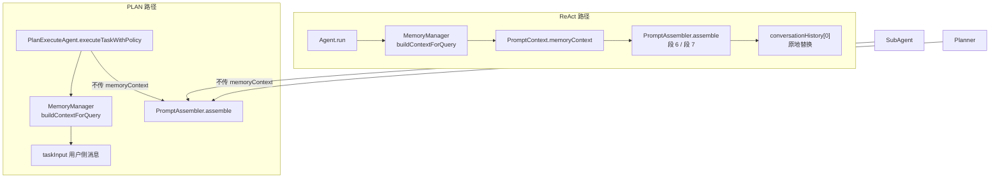
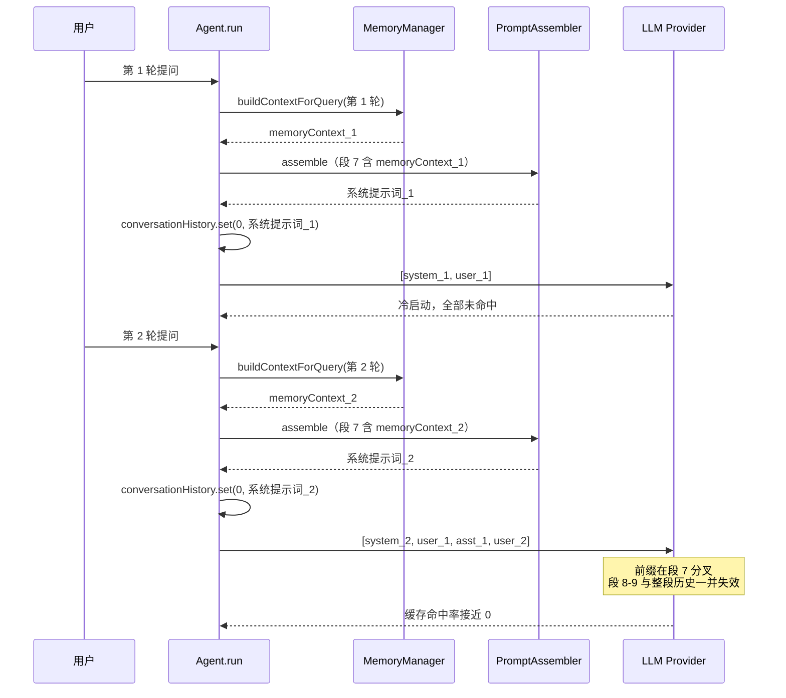
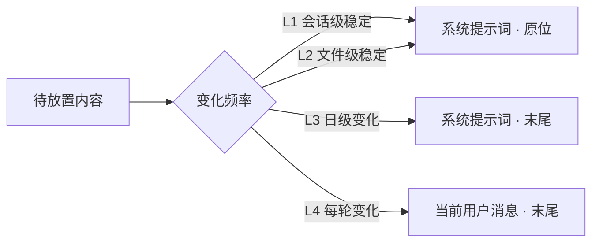

# 前缀缓存友好的上下文注入

> **执行状态（2026-09-17）：** 已按 §4 任务顺序实现。改动 1 与改动 2 均已落地，§2 保留改动前的事实记录。验证结果见文末「验收记录」。
>
> **原执行要求：** 先写失败测试，再写最小实现。每个任务完成后运行该任务的定向测试；全部完成后运行 `mvn test -Pquick` 和全量测试。

## 1. 背景、目标与非目标

### 1.1 背景

系统提示词被设计为“会话级稳定契约”：身份、语言、工具策略、模式、审批、项目记忆。每轮可变的内容（检索结果）本应只影响本轮新增的消息，从而让 provider 的自动前缀缓存（DeepSeek 的 `prompt_cache_hit_tokens` 等）尽可能命中已完成的前缀。

实际实现与之相反。`Agent.java:225-228` 在每轮 `run()` 进入 ReAct 循环前检索长期记忆，`updateSystemPromptWithMemory`（`Agent.java:538-557`）在内容变化时执行三步：写一条 `SYSTEM_MESSAGE` 事件（surface 为单节点 replacement）、**原地覆盖 `conversationHistory.set(0, systemMessage)`**、`historyVersion++`。而这批文本落在系统提示词的中段（`PromptAssembler.java:39-40`），系统提示词又位于消息序列最前。因此每轮检索结果一变，缓存前缀就在该处断掉，其后的全部内容——包括整段历史对话——一起失效。

对照 `docs/dev/01-react-agent.md:250` 记录的原始意图（“角色语义稳定，下一轮也容易覆盖掉上一轮的记忆注入”），可以确认：**“覆盖上一轮注入”是当时刻意选择的特性，不是疏漏**。本次改动要改变的正是一个有意的设计决定，因此 §3 必须给出取舍依据，而不是当作 bug 修复。

同一类问题还有一个小号版本：`runtimeContext()`（`PromptAssembler.java:62-67`）含 `LocalDate.now(zone)`，位于系统提示词第 6 段（`PromptAssembler.java:38`）。它在跨日时改变，失效半径与上述相同，只是频率低（每日一次）。

**证据边界：** 段序、调用点、替换语义均有源码行号支撑（§2）。缓存收益的具体数值尚未实测，§5 给出度量方法；在未取得数据前，“命中率提升”属于预期而非已验证结论。

### 1.2 目标

1. 让系统提示词在“同一自然日 + 同一项目”内逐字节稳定，使其与历史对话共同构成可命中的缓存前缀。
2. 把每轮变化的检索结果移出系统提示词，注入位置改为消息序列尾部，只污染本轮新增的 token。
3. 缩小 `runtimeContext()` 的失效半径：后移到系统提示词末尾。
4. 保持历史消息 append-only：任何已有消息节点不得被原地改写。
5. 让 ReAct 路径的注入形态与已存在的 PLAN 路径一致，减少一套心智模型。

### 1.3 非目标

- 不实现 Anthropic `cache_control`，不向 GLM / DeepSeek 请求体注入未确认兼容的私有 cache 字段（沿用 `docs/phase-12-long-context.md:39-41` 的既有决策）。
- 不改变长期记忆的检索时机、打分算法、预算参数与 `MemoryRetriever` 的任何行为。
- 不改变 `PlanExecuteAgent` / `SubAgent` / `Planner` 的注入位置。
- 不新增记忆去重、衰减或历史裁剪逻辑；历史中累积的旧检索结果交由既有自动压缩处理。
- 不重构 `PromptAssembler` 的段拼接机制（`append` / `dynamicSection`）。
- 不改变 `TurnToolPolicy`、工具可见性与工具定义冻结时机。

## 2. 现状分析（源码证据、已知约束）

### 2.1 架构位置

注入路径涉及两个入口、两个注入位置：



关键证据：

| 事实 | 证据 |
|---|---|
| 系统提示词由 `PromptAssembler` 单点拼装，共九段 | `PromptAssembler.java:30-43` |
| `runtimeContext()` 位于第 6 段 | `PromptAssembler.java:38` |
| 承载 `memoryContext` 的 `## Project Context` 位于第 7 段 | `PromptAssembler.java:39-40` |
| `runtimeContext()` 含 `LocalDate.now(zone)` | `PromptAssembler.java:62-67` |
| ReAct 每轮检索并注入一次 | `Agent.java:225-228` |
| 注入方式为原地替换消息 0 | `Agent.java:540-542`（相等早退）、`Agent.java:553-554`（`set(0, …)` + `historyVersion++`） |
| 会话落盘为 `SYSTEM_MESSAGE` + 单节点 replace | `Agent.java:543-552` |
| PLAN 已把检索结果追加到 `taskInput` | `PlanExecuteAgent.java:587-595` |
| `memoryContext` 的唯一设置点是 ReAct | `Agent.java:562`；`PlanExecuteAgent.java:578-585`、`SubAgent.java:125`、`Planner.java:68` 均未设置 |

已有先例：`Agent.java:647-654` 的 `prependSkillBodies` 已在不改写历史的前提下，把检索到的 skill 正文拼进当前用户消息内容，分隔符为 `\n用户输入：\n`。本次改动复用同一机制。

### 2.2 数据/状态模型

**系统提示词段序与变化频率：**

| 序号 | 内容 | 来源 | 变化频率 |
|---|---|---|---|
| 1 | `base.md`（身份 / 语言 / Tools / Tool Policy / Browser Policy） | 静态资源 | 稳定 |
| 2 | 无工具时的 `Tool Availability` 替代段 | 静态内联 | 稳定 |
| 3 | `personalities/calm.md` | 静态资源 | 稳定 |
| 4 | 模式提示词（`modes/agent.md` 等） | 静态资源 + 变量替换 | 稳定 |
| 5 | `approvals/<mode>.md` | 静态资源 | 稳定 |
| 6 | **`runtimeContext()`** | 计算值（含当前日期） | 日级变化 |
| 7 | **`## Project Context`（含 `memoryContext`）** | 项目记忆 + **长期记忆检索结果** + MCP 资源 | **每轮变化** |
| 8 | `## Skills` 索引 | 计算值 | 文件级稳定 |
| 9 | `context/context-management.md`、`handoff.md` | 静态资源 | 稳定 |

按“变化频率”归并出四个层级，是本次改动的决策依据：

| 层 | 内容 | 变化触发 | 目标位置 |
|---|---|---|---|
| L1 会话级稳定 | 段 1–5、9 | 用户改项目 prompt 覆盖 | 系统提示词，原位 |
| L2 文件级稳定 | 段 7 的项目记忆 / MCP 资源、段 8 Skills 索引 | 文件被编辑、skill 集合变化、MCP 重连 | 系统提示词，原位 |
| L3 日级变化 | 段 6 当前日期 | 跨自然日 | 系统提示词**末尾**（改动 1） |
| L4 每轮变化 | 段 7 的长期记忆检索结果 | 每次用户提问 | **消息序列尾部**（改动 2） |

L2 不迁走的理由：由磁盘文件驱动，会话内通常不变；迁到尾部会让系统提示词失去“项目契约”语义，收益接近零。若会话中真的编辑了 `CODEAGENT.md`，下一次刷新正常生效，属低频事件。

**相关状态量：**

| 状态 | 位置 | 本轮改动是否触碰 |
|---|---|---|
| `conversationHistory`（发送视图） | `Agent.java` | 注入位置改变，append 语义不变 |
| `historyVersion` | `Agent.java:554`、`Agent.java:1096` | 语义不变 |
| session surface（`append` / `replace`） | `SessionEvent.java:63-83` | 不新增操作类型 |
| `ContextProfile.memoryContextTokens` | `ContextProfile.java:82-84` | 不改（是检索**预算**上限，非实测占用） |
| `compressed` 触发阈值 | `ContextProfile.java:66-68` | 不改 |

### 2.3 核心时序与失败路径

**正常路径（两轮，展示失效范围）：**



**失败路径：** 若 `updateSystemPromptWithMemory` 抛 `SessionPersistenceException`（`Agent.java:543-552` 落盘失败），由 `Agent.java:235-238` 捕获，`run()` 直接返回错误文本、**不调用 LLM**。这是既有行为，本次改动必须保留：注入位置变更后，“落盘失败即中止”这一不变量不得被削弱。

**缓存失效的判定规则：** 自动前缀缓存的失效单位是“第一个不同的 token 之后的一切”。段 7 位于系统提示词内部、系统提示词又位于消息序列最前，故失效集合 = {段 8, 段 9} ∪ {全部历史消息}。

**现有度量手段（无需新增埋点）：**

| 指标 | 位置 |
|---|---|
| `prompt_cache_hit_tokens` 解析 | `AbstractOpenAiCompatibleClient.java:318` |
| 单次调用 `cachedInputTokens` 累计 | `Agent.java:297` → `AgentBudget.recordTokens` |
| 会话事件持久化 `cachedInputTokens` | `Agent.java:1130` |
| `/context` 输出 `prompt cache: <mode>` | `Agent.java:756`，来源 `ContextProfile.java:41-42`、`ContextProfile.java:74` |

## 3. 方案设计

### 3.1 接口与数据结构

**决策规则：**



**改动 1：`runtimeContext()` 后移。** `PromptAssembler.assemble`（`PromptAssembler.java:20-48`）改为：

```java
StringBuilder prompt = new StringBuilder();
append(prompt, base);
if (!ctx.toolsEnabled()) {
    append(prompt, noToolsSection());
}
append(prompt, repository.loadRequired("personalities/calm.md"));
append(prompt, applyVariables(repository.loadRequired(mode.resourcePath()), ctx));
append(prompt, repository.loadRequired("approvals/" + approvalMode(ctx) + ".md"));
append(prompt, dynamicSection("Project Context",
        ctx.projectMemoryContext(), ctx.externalContext()));   // 不再包含 memoryContext
append(prompt, dynamicSection("Skills", ctx.skillIndex()));
append(prompt, repository.loadRequired("context/context-management.md"));
append(prompt, repository.loadRequired("handoff.md"));
append(prompt, runtimeContext());                              // 移到末尾
```

`runtimeContext()`（`PromptAssembler.java:62-67`）实现不变，仅改调用位置。保留该段本身：`PromptAssemblerTest.java:30-31` 依赖输出中包含 `## Runtime Context` 与 `当前日期`，删除既无必要也会破坏既有契约。

**改动 2：`memoryContext` 移出系统提示词，拼进当前用户消息。**

`PromptContext`（`PromptContext.java:6-14`）删除 `memoryContext` 字段与 `Builder.memoryContext(String)`（`PromptContext.java:51-54`），`PromptAssembler.java:39-40` 同步去掉该实参。

`Agent.java:225-234` 改为：

```java
ContextProfile contextProfile = memoryManager.getContextProfile();
String memoryContext = memoryManager.buildContextForQuery(userInput, contextProfile.memoryContextTokens());
refreshSystemPrompt();   // 原 updateSystemPromptWithMemory，不再接收记忆文本

String userMessageContent = prependSkillBodies(userInput);
if (!memoryContext.isEmpty()) {
    userMessageContent = userMessageContent + "\n\n" + memoryContext;
}
appendConversationMessage(ImageReferenceParser.userMessage(
        userMessageContent, Path.of(toolRegistry.getProjectPath())), "user_input");
```

拼接顺序说明：`prependSkillBodies`（`Agent.java:647-654`）把 skill 正文放在“用户输入：”**之前**，记忆追加在用户原文**之后**，故块内顺序为 `skill 正文 → 用户输入 → 检索到的长期记忆`。用户原文位置不变，记忆作为补充材料出现在同一消息末尾。

`updateSystemPromptWithMemory`（`Agent.java:538-557`）重命名为 `refreshSystemPrompt()`，去掉形参，内部调用 `buildSystemPrompt()`（删除 `Agent.java:562` 的 `.memoryContext(...)`）。三步语义全部保留：

| 步骤 | 现状 | 是否保留 |
|---|---|---|
| 内容相等则早退 | `Agent.java:540-542` | 保留 |
| `SYSTEM_MESSAGE` + 单节点 replace 落盘 | `Agent.java:543-552` | 保留 |
| `set(0, …)` + `historyVersion++` | `Agent.java:553-554` | 保留 |

保留理由：系统提示词虽不再含每轮变化的记忆，仍会因跨日（段 6）或 `CODEAGENT.md` / MCP 资源变化而需要刷新；`/clear` 后的重建也走这里。改动后的实际效果是大多数轮次命中 `Agent.java:540-542` 的早退分支，系统提示词与轮次解耦。

**接受的语义回退（本改动真正的代价）：** 不再“覆盖上一轮的记忆注入”。第 N 轮检索到的记忆永久留在第 N 轮的用户消息里，成为历史的一部分。代价是历史累积历次检索结果、token 随时间增长，由既有自动压缩（`maybeCompactHistory`，`Agent.java:569-596`）自然消化；收益是语义更准确——第 N 轮的检索针对第 N 轮的问题，留在原处比事后被覆盖更可解释。

### 3.2 策略、安全、并发与恢复

| 维度 | 结论 | 依据 |
|---|---|---|
| append-only 不变量 | 注入改为随 `USER_MESSAGE` 追加，历史节点零改写，强化了既有约束 | AGENTS §3「Ledger/Memory：原始消息 append-only」 |
| 并发 | 无新增并发面。注入发生在 `run()` 单线程入口，先于 ReAct 循环 | `Agent.java:221-238` |
| 安全 / 敏感内容 | 未扩大暴露面。记忆文本此前已进入 system 消息并落盘，现在进入 user 消息并落盘，两者同属 raw session JSONL | AGENTS §6「raw session JSONL 可能含敏感内容」 |
| 权限 | 不涉及路径 / URL 授权，不触碰 `TurnToolPolicy` | 无 |
| 持久化恢复 | 用户消息写入路径不变（`appendConversationMessage` → `append`，`Agent.java:1091-1098`），记忆随 payload 落盘；resume 后每条用户消息自带当轮检索结果，与崩溃前内存逐字节一致 | `SessionEvent.java:63-83` 不变 |
| system surface 刷新 | 语义不变，仍须从 projection 查找 active system node 的 sequence，不得假定 system 位于 sequence 0；`Agent.java:543-552` 按 role 查找，已满足 | `docs/dev/10-persistent-session-implementation-plan.md` §5.4 |
| 失败路径 | 落盘失败仍中止本轮、不调 LLM | `Agent.java:235-238` |
| 压缩交互 | 记忆随用户消息进入历史后正常计入 `estimateCurrentContextTokens()`，压缩行为一致，无“估算看不见”的偏差 | `Agent.java:569-596` |

### 3.3 兼容性、迁移与回滚

**旧 session 兼容：** 事件格式与 surface 语义均不变，无需迁移。旧日志中的 `SYSTEM_MESSAGE` 事件仍按原语义 replay；历史用户消息本就不含记忆块，恢复后行为与写入时一致。**不存在**需要重写旧 JSONL 的场景。

**测试改动清单：**

| 测试 | 现状 | 改动 |
|---|---|---|
| `AgentClearHistoryTest.java:39` | 断言首个请求的**第 0 条（system）**含 `CLEAR_MARKER` | 改为断言首个请求的**最后一条 user 消息**含 `CLEAR_MARKER`；新增断言 system 消息**不含**该文本 |
| `AgentClearHistoryTest.java:47-50` | `/clear` 后历史仅剩 system 且不含记忆 | 保持不变（应继续通过；这是本方案核心收益之一，需确认） |
| `PromptAssemblerTest.java:22-39` | 传入 `.memoryContext(...)` 并断言输出含该文本 | 删除该调用；`用户偏好中文` 的存在性断言改为否定断言；保留 `项目规则` / `demo://resource` / `web-access` 断言 |
| `PromptAssemblerTest.java:30-31` | 断言含 `## Runtime Context`、`当前日期` | 保留；**新增**位置契约断言 |
| `AgentConversationLedgerTest.java:105` | `history.get(0).role()` 为 `system` | 保留（不变） |
| `SessionCompactionRecoveryTest.java:57` | 恢复后 `messages().get(0).role()` 为 `system` | 保留（不变） |

**回滚粒度：** 改动 1（段 6 后移）与改动 2（记忆移出系统提示词）互相独立，可分别回滚。若改动 2 出问题，回滚它即可退回原行为，改动 1 仍然有效。

**风险登记：**

| 风险 | 判断 | 缓解 |
|---|---|---|
| 记忆中出现在用户消息里，模型可能误当作用户陈述 | 低。PLAN 路径已运行此形态；记忆块自带标题 | 若观察到误用，在块首补归属说明，不改架构 |
| 历史累积旧检索结果导致 token 增长 | 中。原本被覆盖的文本现在留存 | 依赖既有自动压缩；必要时后续在压缩中对记忆块加标记以便裁剪（不在本次范围） |
| `PromptContext` 删字段破坏未发现的调用点 | 低。唯一设置点为 `Agent.java:562` | 编译期强制暴露 |
| 缓存收益不达预期（provider 不支持或分段策略不同） | 中。属未验证部分 | §5 规定先度量；`ContextProfile.java:41` 为 false 时退化为稳定性断言并注明未取得数据 |

### 3.4 候选方案对比与取舍

| 方案 | 内容 | 判定 |
|---|---|---|
| **A 选定** | 记忆拼进当前用户消息内容，复用 `prependSkillBodies` 机制 | 零新增协议、缓存安全、`/clear` 天然正确、provider 兼容无风险、与 PLAN 一致 |
| B | 仅把 `## Project Context` 整段移到系统提示词末尾，仍原地替换 | 否决：段仍在系统提示词内，替换仍使其后（含全部历史）失效，未解决根本问题 |
| C | 每轮 append 一条独立 user 角色记忆消息，置于用户消息之前 | 否决：需新增事件 source 约定；连续两条 `user` 消息有 provider 兼容风险；为同一信息增加一条消息，相对 A 无净收益 |
| D | 在接近尾部的位置放一个“记忆节点”，每轮 replace 该节点 | 否决：该节点位于上一轮 assistant / tool 消息之前，替换它仍会连带其后历史失效，收益不稳定且实现复杂 |

方案 A 的代价已在 §3.1 显式记录（放弃“覆盖上一轮注入”），这是本方案唯一需要用户确认的取舍点。

## 4. 实现任务与测试矩阵

### 任务 1：`runtimeContext()` 后移

**涉及文件：** `src/main/java/com/codeagent/prompt/PromptAssembler.java`

**测试必须覆盖：** `## Runtime Context` 仍存在于系统提示词中；位于 `handoff` 段之后；段 1–8 的相对顺序不变。

```bash
mvn test -DskipTests=false -Dtest=PromptAssemblerTest
git commit -m "refactor: move runtime context to the tail of the system prompt"
```

### 任务 2：`PromptContext` 移除 `memoryContext`

**涉及文件：** `src/main/java/com/codeagent/prompt/PromptContext.java`、`src/main/java/com/codeagent/prompt/PromptAssembler.java`、`src/test/java/com/codeagent/prompt/PromptAssemblerTest.java`

**测试必须覆盖：** `## Project Context` 只由项目记忆与外部资源构成；记忆文本无处可去（字段已删，编译期即失败）。

```bash
mvn test -DskipTests=false -Dtest=PromptAssemblerTest
git commit -m "refactor: drop per-turn memory context from the system prompt"
```

### 任务 3：`Agent` 把记忆注入用户消息

**涉及文件：** `src/main/java/com/codeagent/agent/Agent.java`、`src/test/java/com/codeagent/agent/AgentClearHistoryTest.java`

**测试必须覆盖：** 首轮 system 消息不含检索内容、最后一条 user 消息含检索内容；连续两轮的 system 消息逐字节相同；`/clear` 后历史仅剩 system 且不含检索内容；`/clear` 后 skill 缓冲被清空（既有断言保留）。

```bash
mvn test -DskipTests=false -Dtest=AgentClearHistoryTest
git commit -m "feat: inject long-term memory into the user message instead of the system prompt"
```

### 任务 4：统一命名与文档同步

**涉及文件：** `src/main/java/com/codeagent/agent/Agent.java`（重命名 `refreshSystemPrompt`）、`docs/dev/01-react-agent.md`（记忆注入章节补充调整说明）、`AGENTS.md`、`README.md`（若其中描述了注入位置）。

**测试必须覆盖：** 重命名后所有定向测试通过；文档描述与 `Agent.java` 实际行为一致。

```bash
mvn test -DskipTests=false -Dtest=AgentClearHistoryTest,AgentConversationLedgerTest,SessionCompactionRecoveryTest
git commit -m "docs: align memory injection docs with cache-friendly placement"
```

### 任务 5：全量回归

```bash
mvn test -Pquick
mvn test -DskipTests=false
```

### 测试矩阵

| 任务 | 目标行为 | 测试类 | 命令 |
|---|---|---|---|
| 1 | 段 6 后移且段序正确 | `PromptAssemblerTest` | `mvn test -DskipTests=false -Dtest=PromptAssemblerTest` |
| 2 | `PromptContext` 不再承载记忆 | `PromptAssemblerTest` | `mvn test -DskipTests=false -Dtest=PromptAssemblerTest` |
| 3 | 记忆在用户消息、system 逐轮稳定 | `AgentClearHistoryTest` | `mvn test -DskipTests=false -Dtest=AgentClearHistoryTest` |
| 3 | 历史仍以 system 开头 | `AgentConversationLedgerTest` | `mvn test -DskipTests=false -Dtest=AgentConversationLedgerTest` |
| 3 | 恢复后 surface 首位仍为 system | `SessionCompactionRecoveryTest` | `mvn test -DskipTests=false -Dtest=SessionCompactionRecoveryTest` |
| 4 | 无回归 | 全部 | `mvn test -Pquick` |

## 5. 验收清单

- [x] 同一自然日内连续多轮提问，第 2 轮起系统提示词逐字节不变。由 `AgentClearHistoryTest.systemPromptStaysIdenticalAcrossTurnsWhileRetrievedMemoryVaries` 覆盖：断言两轮 `system` 消息相等，且上一轮请求整体是下一轮请求的逐字节前缀。
- [x] 历史消息一律 append，无任何 `replace` 事件作用在已有的 user / assistant / tool 节点上。同上测试的前缀相等断言间接覆盖（`replace` 会改写历史）。
- [x] `/clear` 后不残留任何上一轮检索内容。`AgentClearHistoryTest.clearHistoryRebuildsSystemPromptAndDropsPendingSkillContext` 通过。
- [x] `/clear` 后 system surface 重建，恢复路径不重复写 system。`SessionCompactionRecoveryTest`、`AgentSessionResumeTest` 通过；`Agent.java:482-486` 的 `SURFACE_CLEAR` + append 路径未改动。
- [x] 落盘失败仍中止本轮且不调用 LLM（`Agent.java:239-242` 语义不变）。
- [x] `## Runtime Context` 仍存在且位于系统提示词末尾。`PromptAssemblerTest.runtimeContextTrailsEveryStableSection` 通过。
- [x] 记忆检索的预算、打分、返回条数与改动前一致（`MemoryRetriever` 未被触碰，`git diff` 无该文件）。
- [x] `mvn test -Pquick` 已运行：915 个测试、10 个失败、2 个跳过。基线（同一机器、同一命令、`git stash` 掉本次 src 改动）为 913 个测试、10 个失败、2 个跳过，**失败集合逐条相同**，均为 Windows 环境相关的既有失败（`ImageReferenceParserTest` 路径 URI ×3、`CodeIndexTest` ×2、`MemoryManagerTest` 路径分隔符、`CodeRetrieverTest`、`InlineRendererTest`、`CodeSearchGoldenSetTest`、`TerminalMarkdownRendererTest`）。本次改动**零新增失败**，测试数 +2 即两个新用例。
- [x] `git diff --check` 通过（仅有 LF→CRLF 提示，无空白错误）。
- [x] `docs/dev/01-react-agent.md`、`docs/dev/06-memory-context.md`、`docs/agents-reference.md`、`README.md` 中关于注入位置的描述已同步。`AGENTS.md` 未提及注入位置，无需改动。

### 缓存收益度量（未执行，待补）

在真实 provider 上，改造前与改造后各跑一次同一多轮会话：

1. 准备固定的多轮提问序列，预先写入若干条长期记忆，使各轮命中不同条目。
2. 逐轮记录 `cachedInputTokens` 与 `inputTokens`（来源：会话事件，`Agent.java` 的 `provider/usage` 事件；或 `/context`，`Agent.java:756`）。
3. 对比逐轮 `cachedInputTokens / inputTokens`：改造前该比值从第 2 轮起应显著偏低且随轮次抖动；改造后应从第 2 轮起趋近于“系统提示词 + 历史消息”占输入的比例。
4. 若 provider 不支持缓存上报（`ContextProfile.java:41` 为 false），退化为稳定性断言，并注明未取得量化数据。

### 未取得数据的部分（诚实边界）

**缓存收益的量化数值没有实测。** 上面的验收全部是「行为正确性」证据（前缀稳定性、append-only、`/clear` 语义），不是「缓存命中率提升多少」的度量。本次未执行上节的度量流程。因此“命中率提升”在本项目中仍是**预期**，不是已验证结论；`supportsPromptCaching` 为 false 的 provider 上更无从度量。

**被推翻的旧意图已显式记录。** 原设计「替换消息 0 以便覆盖上一轮注入」在 `docs/dev/01-react-agent.md` 与 `docs/dev/06-memory-context.md` 中均已标注为已反转，并写明代价（旧记忆不再被覆盖、随历史累积）。
