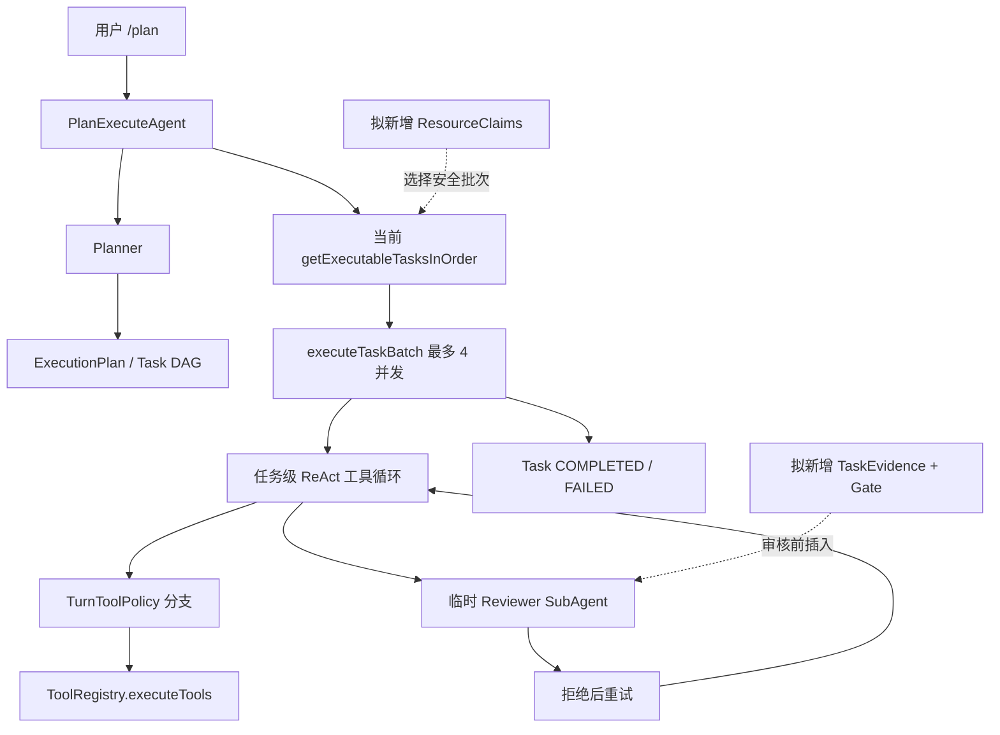
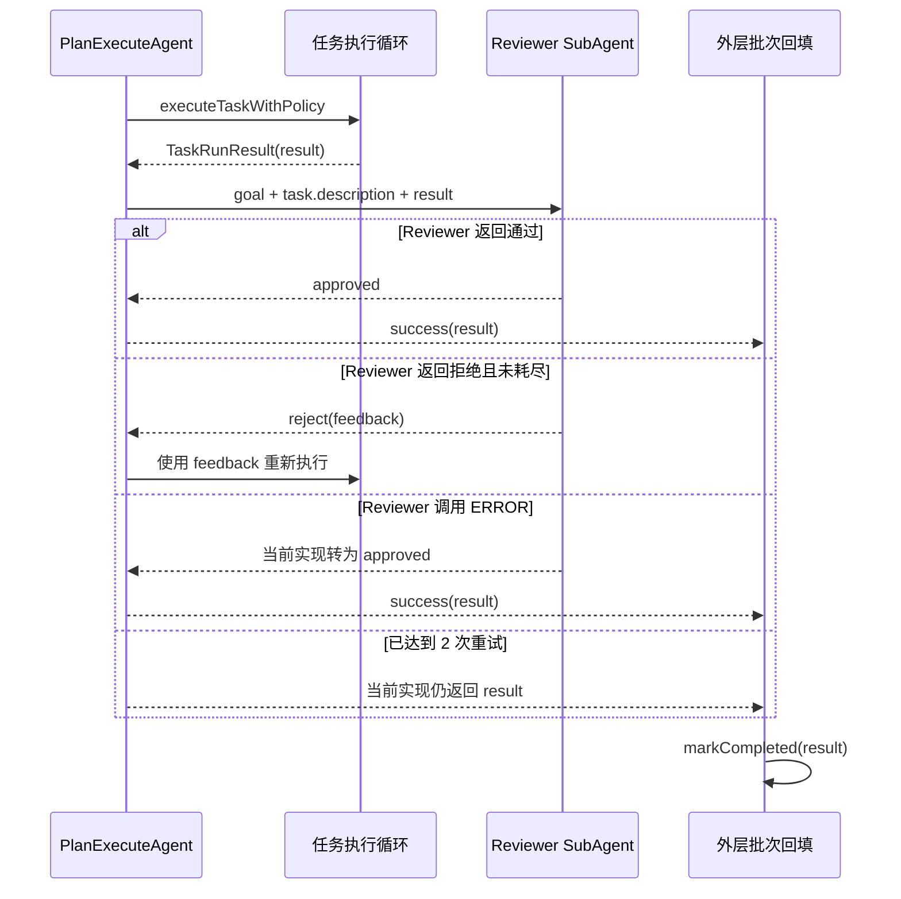
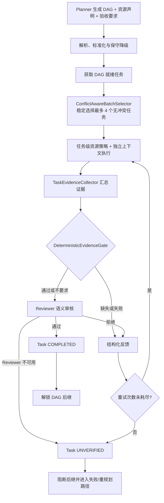
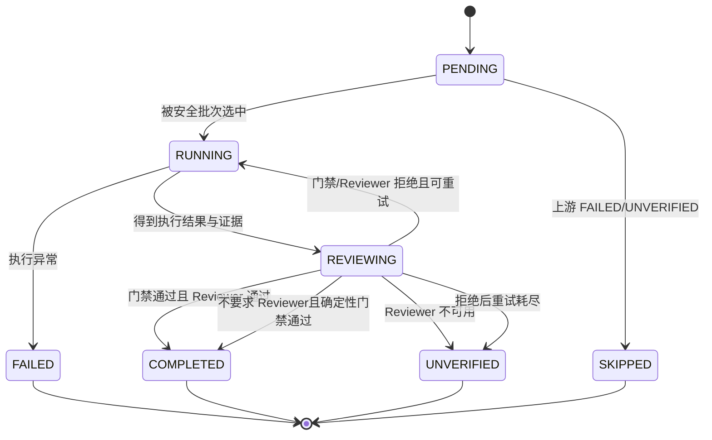
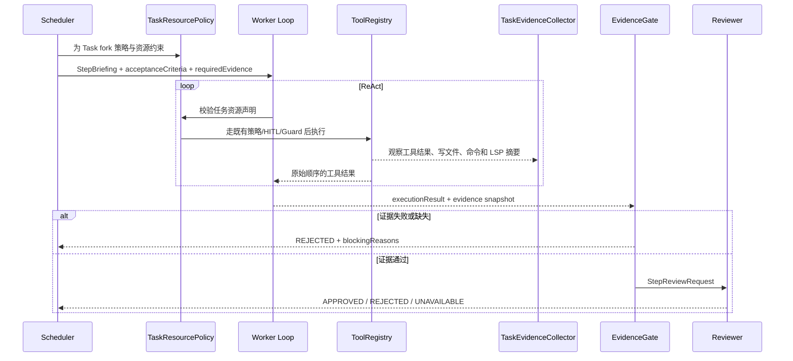

# Plan-and-Execute 证据审核与冲突感知调度方案

> 状态：设计评审稿，尚未实现。
>
> 本文只描述拟议改造，不代表当前代码已经具备这些能力。当前已交付行为仍以 `03-multi-agent-collaboration.md` 和源码为准；实现完成后必须把最终行为回填文档 03。

## 1. 背景、目标与非目标

### 1.1 背景

当前 `/plan` 由 `PlanExecuteAgent` 统一完成计划审阅、DAG 调度、任务执行、步骤审核、失败重试和重规划，入口使用 `PipelineOptions.FULL_PRESET`。现有实现已经具备以下基础：

- `Planner` 把复杂目标解析为含依赖关系的 `ExecutionPlan`；
- 调度器按拓扑顺序选择就绪任务，同一批最多 4 路并行；
- 每个任务拥有独立消息列表、`TurnToolPolicy` 分支和可选 child session；
- 每个任务创建独立 Reviewer `SubAgent`，审核拒绝后最多额外重试 2 次；
- 工具调用统一经过 `ToolRegistry.executeTools()`，权限链保持 `TurnToolPolicy → HitlToolRegistry → ToolRegistry → PathGuard/CommandGuard`。

但当前“审核可信度”和“并行写安全”仍存在两个真实缺口：

1. Reviewer 只收到总目标、当前任务描述和执行结果文本，没有结构化 diff、测试、编译或 LSP 证据；Reviewer 调用异常会直接批准，重试耗尽后仍返回当前结果，外层随后把任务标记为 `COMPLETED`。
2. 并行批次只判断 DAG 依赖，不判断任务是否读写同一文件。两个逻辑上无依赖的任务可能同时修改共享工作区，形成丢失更新或基于旧内容生成结果。

### 1.2 目标

本方案包含两个相互配合但边界独立的能力：

1. **证据驱动审核门禁**
   - 为计划任务声明验收标准和所需证据类型；
   - 从任务真实工具执行中收集结构化证据；
   - 先运行确定性门禁，再进行 Reviewer 语义审核；
   - Reviewer 异常、证据缺失和重试耗尽都不能伪装成成功；
   - 只有审核完成的任务才能解锁 DAG 后继。
2. **冲突感知批次调度**
   - 为计划任务声明项目内读路径、写路径和工作区独占标记；
   - 在不改变 DAG 的前提下，从就绪任务中选择最多 4 个互不冲突的任务；
   - 缺失、非法或无法静态界定的写操作安全降级为工作区独占；
   - 资源声明只能收紧并发和工具暴露，不能扩大任何路径、命令、URL 或 HITL 权限。

### 1.3 非目标

- 不把 `Planner`、执行循环和 Reviewer 重构成三个自治 Agent。
- 不引入 Agent 自由对话、共享完整 conversation history、消息队列或分布式 Worker。
- 不在本期引入每任务 Git worktree、自动 patch 合并或文件级乐观锁。
- 不实现 DAG、Task 和 Artifact 的完整持久化恢复；只记录必要审计事件。
- 不允许 Planner 直接生成并绕过安全链执行“验证命令”。
- 不改变 `/plan` 命令、人工计划门、最多 4 路并发、最多 2 次步骤重试和最多 1 次重规划的既有入口语义。
- 不把 LLM Reviewer 当成编译、测试或静态检查的替代品。

### 1.4 影响范围

预计涉及以下边界，最终文件名可在实现阶段按现有包结构微调：

| 范围 | 主要影响 |
|---|---|
| `plan/Task`、`Planner`、planner prompt | 任务资源声明、验收标准、所需证据及兼容解析 |
| `agent/PlanExecuteAgent` | 冲突感知组批、证据门禁、审核状态与失败路径 |
| `agent/StepReviewer`、`SubAgentStepReviewer` | 结构化证据输入、三态审核结果、异常不再自动通过 |
| `tool/TurnToolPolicy`、`ToolRegistry` | 任务级资源约束、证据观察接口，不改变底层权限顺序 |
| `lsp/`、`snapshot/`、`history/` | 复用诊断、变更摘要和 ledger 事件，不复制实现 |
| 测试与文档 | 新增冲突矩阵、状态机、门禁、兼容和安全回归测试；实现后更新文档 03 |

## 2. 现状分析（源码证据、已知约束）

### 2.1 架构位置



当前核心调用链的源码位置：

- `Planner.createPlan` 与 JSON 解析：`Planner.java:59-89`、`:105-159`；
- 就绪任务获取与批次执行：`PlanExecuteAgent.java:402-412`、`:479-487`、`:490-565`；
- 单任务工具策略分支：`PlanExecuteAgent.java:571-590`；
- Reviewer 与重试循环：`PlanExecuteAgent.java:603-628`；
- 外层成功回填：`PlanExecuteAgent.java:413-428`；
- Reviewer 结果解析：`SubAgentStepReviewer.java:23-34`；
- 工具统一执行入口：`ToolRegistry.java:1301`。

### 2.2 当前数据与状态模型

`Task` 当前只保存：

```text
id / description / type
status / result / error
dependencies / dependents
startTime / endTime
```

`TaskStatus` 只有 `PENDING / RUNNING / COMPLETED / FAILED / SKIPPED`（`Task.java:29-35`）。任务是否可执行只检查所有直接依赖是否为 `COMPLETED`（`:111-122`）。当前没有以下结构化字段：

- 验收标准；
- 所需证据类型；
- 实际证据及审核状态；
- 计划读路径、写路径或工作区独占声明；
- 实际访问路径及声明漂移。

Planner 当前输出契约只有 `id / description / type / dependencies`（`prompts/modes/planner.md:13-26`），解析器忽略其它字段。任务结果以一个 `String result` 承载，无法区分模型结论、变更文件、测试证据和诊断信息。

### 2.3 当前审核时序与失败路径



已经验证的风险：

1. `SubAgentStepReviewer` 的注释称结论无法解析时失败关闭，但 `AgentMessage.Type.ERROR` 分支明确返回 `approve()`（`SubAgentStepReviewer.java:28-30`），审核基础设施故障是失败开放。
2. `applyStepReview` 在达到最大重试次数后返回当前 `TaskRunResult`（`PlanExecuteAgent.java:619-621`），没有表达“执行成功但未通过审核”。
3. 外层只判断 `TaskExecutionResult.failed()`；没有异常就调用 `task.markCompleted(...)`（`PlanExecuteAgent.java:413-428`）。因此 Reviewer 持续拒绝仍可能成为 `COMPLETED`，并解锁后继任务。
4. Reviewer 输入只由 `goal + task.description + stepResult` 组成（`SubAgentStepReviewer.java:23-25`），没有独立证据对象。

### 2.4 当前并发时序与冲突路径

`executePlan` 每轮取出全部 DAG 就绪任务，`executeTaskBatch` 在数量大于 1 时创建 `min(size, 4)` 的线程池并全部提交（`PlanExecuteAgent.java:490-535`）。结果等待和输出按输入顺序归并（`:537-562`），但“保持结果顺序”不等于“工作区写入安全”。

典型失败路径：

```text
task_1 与 task_2 在 DAG 上无依赖
→ 同批执行
→ 两者都读取 Agent.java 的旧版本
→ task_1 写入修改 A
→ task_2 基于旧版本写入修改 B
→ 修改 A 被覆盖，两个任务仍可能分别报告成功
```

现有 `volatile Task.status/result` 只能保证 Java 字段可见性，不能保护共享文件。`ToolRegistry` 的并行结果顺序保证也不能解决跨任务丢失更新。

### 2.5 已知约束

- Planner 输出不可信：字段可能缺失、路径可能非法、类型可能与实际工具行为不一致。
- 所有资源声明都必须经过本地解析和标准化；声明不是权限凭据。
- `execute_command`、`create_project`、`revert_turn` 可能产生无法静态枚举的写入，必须保守处理。
- 不能为验证阶段建立绕过 `TurnToolPolicy`、HITL、`PathGuard` 或 `CommandGuard` 的旁路。
- Reviewer 与任务执行可能并行发生，新增收集器和报告必须任务隔离且线程安全。
- raw ledger 可能含敏感信息，证据事件只记录摘要、类型、状态、相对路径和计数，不记录文件正文、完整命令输出或 secret。

## 3. 方案设计

### 3.1 总体架构

保留 `PlanExecuteAgent` 作为唯一状态写入者，在现有执行循环前后插入两个确定性组件：



设计原则：

1. **控制面确定性**：DAG 状态、冲突判定、证据门禁和终态由 Java 代码决定。
2. **模型只提供候选声明**：Planner 给出资源与验收提示，本地代码负责验证、默认值和安全降级。
3. **先证据、后语义**：Reviewer 不能覆盖确定性失败；只有门禁通过后才评估任务是否满足语义目标。
4. **隔离而非共享历史**：每个任务、每次重试和每个 Reviewer 继续使用独立发送视图。
5. **安全链只收紧不放宽**：新增策略位于现有工具授权链之前或作为 `TurnToolPolicy` 的附加限制。

### 3.2 接口与数据结构

#### 3.2.1 任务资源声明

建议新增不可变值对象：

```java
public record TaskResourceClaims(
        List<String> readPaths,
        List<String> writePaths,
        boolean workspaceWrite
) {}
```

语义：

- `readPaths`：任务需要稳定读取的项目内文件或目录；
- `writePaths`：任务允许修改的项目内文件或目录；
- `workspaceWrite=true`：任务可能执行无法静态界定写集的操作，必须独占项目工作区；
- 目录使用规范化的项目相对路径并以 `/` 结尾；首期不支持 glob，避免不同平台匹配语义漂移；
- `.`、空路径、绝对路径、`..`、项目外路径、符号链接逃逸或解析失败不能成为普通 claim。

Planner JSON 扩展为：

```json
{
  "id": "task_2",
  "description": "修改支付服务事务边界",
  "type": "FILE_WRITE",
  "dependencies": ["task_1"],
  "resources": {
    "readPaths": ["src/main/java/com/example/payment/"],
    "writePaths": ["src/main/java/com/example/payment/PaymentService.java"],
    "workspaceWrite": false
  },
  "acceptanceCriteria": [
    "PaymentService 编译通过",
    "事务失败路径有测试覆盖"
  ],
  "requiredEvidence": ["DIFF", "BUILD", "TEST"]
}
```

兼容默认：

| 情况 | 本地归一化结果 |
|---|---|
| 合法且完整 | 使用规范化 claims |
| `FILE_WRITE` 缺少 `resources` 或写路径为空 | `workspaceWrite=true` |
| `COMMAND` / `PLANNING` 可能产生未知写入 | 默认 `workspaceWrite=true` |
| `FILE_READ` / `ANALYSIS` 缺少声明 | 允许只读执行；隐藏或拒绝本地变更工具 |
| 任一路径非法或逃逸 | 计划解析失败，要求重新规划；不得静默授权 |
| `writePaths` 包含项目根 | 归一化为 `workspaceWrite=true` |

#### 3.2.2 验收要求与证据

建议定义：

```java
public enum EvidenceType {
    DIFF,
    BUILD,
    TEST,
    LSP,
    TOOL_RESULT
}

public enum EvidenceStatus {
    PASSED,
    FAILED,
    MISSING,
    NOT_APPLICABLE
}

public record TaskEvidence(
        EvidenceType type,
        EvidenceStatus status,
        String summary,
        List<String> relatedPaths,
        String source,
        long observedAt
) {}

public record TaskVerificationReport(
        VerificationOutcome outcome,
        List<String> acceptanceCriteria,
        List<TaskEvidence> evidence,
        List<String> blockingReasons
) {}

public enum VerificationOutcome {
    VERIFIED,
    REJECTED,
    UNAVAILABLE,
    NOT_REQUIRED
}
```

证据来源必须是系统观察到的事实，而不是执行 Agent 在最终文本中自称“测试通过”：

| 证据 | 来源 | 最小可信内容 |
|---|---|---|
| `DIFF` | `SnapshotService` 或 `write_file` observer | 变更文件相对路径、是否存在变更、摘要哈希；不写正文到 ledger |
| `BUILD` | 经现有工具链执行并分类为 build 的命令结果 | 命令类别、成功/失败、退出状态摘要 |
| `TEST` | 经现有工具链执行并分类为 test 的命令结果 | 测试命令类别、通过/失败、可解析计数或摘要 |
| `LSP` | 现有写后 LSP 诊断 | error/warning 计数、相关相对路径 |
| `TOOL_RESULT` | `ToolExecutionResult` | 工具名、成功标志、结果摘要，不保存敏感正文 |

Planner 只能声明 `requiredEvidence` 的枚举类型，不能提供绕过策略的自由 shell 命令。Worker 为满足证据要求，仍需通过正常工具调用选择命令；命令继续经过 `TurnToolPolicy`、HITL 和 `CommandGuard`。未实际执行就不能产生 `PASSED` 证据。

#### 3.2.3 任务状态

在现有 `TaskStatus` 中新增：

```java
REVIEWING,
UNVERIFIED
```

保留 `COMPLETED` 作为“执行和要求的审核均已完成”的成功终态，避免同时引入第二套成功状态。状态机如下：



依赖就绪条件仍只接受 `COMPLETED`。`UNVERIFIED` 不解锁后继；外层将其视为可触发既有重规划逻辑的非成功终态，同时在最终结果中明确区分“执行失败”和“无法验证”。

#### 3.2.4 审核接口

将 Reviewer 接口从文本三元组收敛为结构化请求：

```java
public record StepReviewRequest(
        String goal,
        Task task,
        String executionResult,
        TaskVerificationReport verificationReport
) {}

public record StepReviewDecision(
        ReviewOutcome outcome,
        String feedback
) {}

public enum ReviewOutcome {
    APPROVED,
    REJECTED,
    UNAVAILABLE
}
```

规则：

- 确定性门禁 `REJECTED` 时不调用 Reviewer，直接生成可执行的缺证据/失败反馈；
- Reviewer 输出无法解析仍按 `REJECTED`，保持现有 fail-closed 解析语义；
- Reviewer 调用异常、超时或返回 `AgentMessage.Type.ERROR` 为 `UNAVAILABLE`，不得转换成 `APPROVED`；
- Reviewer 只能在门禁已通过时判断语义完整性，不能覆盖测试失败或 LSP error；
- Reviewer prompt 明确区分“证据事实”和“执行器陈述”，要求引用证据摘要给出结论。

### 3.3 冲突判定与稳定组批

#### 3.3.1 冲突规则

设任务 A、B 的规范化声明分别为 `read(A)`、`write(A)`：

```text
conflict(A, B) =
    A.workspaceWrite
    OR B.workspaceWrite
    OR overlaps(write(A), write(B))
    OR overlaps(write(A), read(B))
    OR overlaps(write(B), read(A))
```

`overlaps` 在路径相等或一方是另一方目录祖先时成立。例如：

```text
src/main/java/com/codeagent/agent/
```

与：

```text
src/main/java/com/codeagent/agent/PlanExecuteAgent.java
```

冲突。两个只读任务不冲突。

#### 3.3.2 组批算法

新增纯函数组件 `ConflictAwareBatchSelector`：

```text
输入：按现有拓扑执行顺序排列的 DAG 就绪任务、最大并发数 4
输出：稳定顺序的安全批次

selected = []
for task in readyTasks:
    if selected.size == 4: break
    if task 与 selected 中所有任务均不冲突:
        selected.add(task)

若 selected 为空：
    选择 readyTasks[0] 单独执行，避免调度停滞
```

性质：

- 保留 `ExecutionPlan.executionOrder` 的稳定顺序；
- 不修改 DAG，不伪造依赖；
- 冲突任务保持 `PENDING`，下一轮重新选择；
- 排在前面的任务优先，不会因后续小任务无限饥饿；
- `workspaceWrite` 任务只能形成单任务批次；
- 结果仍按选中任务的输入顺序归并和输出。

示例：

| 任务 | 声明 | 结果 |
|---|---|---|
| A | 写 `Agent.java` | 与 B 冲突 |
| B | 读 `agent/` | 与 A 冲突，推迟 |
| C | 写 `README.md` | 可与 A 并行 |
| D | `workspaceWrite=true` | 独占后续批次 |

第一批为 A + C，第二批为 B，第三批为 D。

#### 3.3.3 任务级资源策略

仅靠 Planner 声明组批不足以保证安全，因此执行时增加 `TaskResourcePolicy`，作为任务 `TurnToolPolicy` 的附加限制：

- `write_file` 的目标必须落在 `writePaths` 内；
- 未声明写权限的任务不暴露或拒绝 `write_file`；
- `execute_command`、`create_project`、`revert_turn` 仅对 `workspaceWrite=true` 的任务开放；
- 首期不尝试推断任意 shell 命令的精确写集；命令任务以降低并发换取正确性；
- 对读路径可先记录实际访问并验证声明；若要严格限制，必须允许目录 claim，避免正常代码探索无法进行；
- MCP 或未来新增的本地变更工具必须显式注册资源影响分类，未知本地副作用工具默认要求 `workspaceWrite=true`；
- 资源策略拒绝不会进入 HITL，因为用户不能批准一个已违反调度隔离的操作。

这条策略不替代 `PathGuard`：即使路径在 `writePaths` 中，只要原有路径策略拒绝，仍然拒绝。

### 3.4 证据收集与审核时序



`TaskEvidenceCollector` 必须按任务实例创建，不得注册为共享可变单例。并行任务各自收集，批次主线程只接收不可变 snapshot。

重试语义：

- 每次重试新建执行消息列表和证据收集器；
- Reviewer 反馈与确定性门禁阻断原因一起写入新的 `StepBriefing`；
- 不把失败尝试的完整消息历史复制给下一次执行；
- 历次 `TaskVerificationReport` 作为审计事件保留摘要，但只有最后一次报告决定终态；
- 任务级 `TurnToolPolicy` 继续复用，不能因重试恢复已消耗的授权或扩大 URL 凭据。

### 3.5 策略、安全、并发与恢复

#### 3.5.1 安全边界

新增调用顺序概念上为：

```text
TaskResourcePolicy
→ TurnToolPolicy
→ HitlToolRegistry
→ ToolRegistry
→ PathGuard / CommandGuard
```

若实现上通过 `TurnToolPolicy` 组合而非新增 wrapper，也必须保持以下不变量：

1. 资源 claim 不能授权用户原文未授权的 URL。
2. 资源 claim 不能授权项目外路径或符号链接逃逸。
3. 资源 claim 不能跳过命令检查、HITL 或 AuditLog。
4. Planner 输出不能直接成为路径或命令权限凭据。
5. Reviewer 不获得执行工具，不能修改任务产物或补造证据。
6. Evidence ledger 只保存摘要与哈希，不保存源码正文、完整命令输出、图片 payload、Memory 正文或 secret。

#### 3.5.2 并发一致性

- `TaskResourceClaims`、`TaskEvidence`、`TaskVerificationReport` 必须不可变；
- `TaskEvidenceCollector` 仅由对应任务线程写入，结束后冻结；
- `Task` 状态仍由批次主线程统一回填；工作线程只返回 `TaskExecutionResult`；
- 并行组批在提交线程池前完成，不允许运行中修改 claims；
- Planner 声明与运行期实际工具不一致时失败，不允许运行中扩大 claim 后继续，从而避免已经并行启动的任务失去隔离保证。

#### 3.5.3 取消、失败与恢复

| 场景 | 处理 |
|---|---|
| 用户取消 | 沿用现有取消检查；未完成证据不生成虚假通过记录 |
| Planner claim 非法 | 计划解析失败，返回人工计划门前重新规划或明确错误 |
| 资源策略拒绝 | 作为本次执行失败反馈；可在额度内重试，但 claim 不自动扩大 |
| 确定性证据失败/缺失 | Reviewer 不运行，反馈 Worker 补齐或修复 |
| Reviewer 输出拒绝 | 反馈 Worker，最多额外重试 2 次 |
| Reviewer 异常/超时 | 立即标记 `UNVERIFIED`，不消耗“语义拒绝”重试伪装成功 |
| 重试耗尽 | `UNVERIFIED`，阻断后继，进入现有失败/重规划路径 |
| 进程中断 | 本期不恢复 DAG；child session/ledger 只提供审计，不宣称可续跑 |

### 3.6 兼容性、迁移与回滚

#### 3.6.1 计划 JSON 兼容

- 新 parser 接受旧计划 JSON；
- 缺失 `resources` 时按 TaskType 保守默认，不因兼容而误并行写任务；
- 缺失 `acceptanceCriteria` / `requiredEvidence` 时使用本地最低要求：
  - `FILE_WRITE` 至少需要 `DIFF`，LSP 启用时需要 `LSP`；
  - `VERIFICATION` 至少需要一条真实 `BUILD`、`TEST` 或等价验证证据；
  - 纯读取/分析任务默认 `NOT_REQUIRED`，仍可接受 Reviewer 语义审核；
- 项目覆盖的旧 planner prompt 仍可运行，但并发度可能因安全降级下降，并输出一次可诊断提示。

#### 3.6.2 Java API 兼容

- 保留现有 `Task` 构造器，内部填入安全默认值；
- 新增完整构造器或 builder 供 Planner 和测试使用；
- `StepReviewer` 若改签名，所有生产实现和测试 stub 必须一次迁移，禁止并存两套含义不同的审核接口；
- `TaskStatus.COMPLETED` 仍保留，新增 `UNVERIFIED` 不改变已有序列化名称；当前 Task 未结构化持久化，不需要磁盘迁移。

#### 3.6.3 灰度与回滚

新增独立的 `PlanExecutionSafetyOptions`，不要继续向 `PipelineOptions` 追加不相关布尔值：

```java
public record PlanExecutionSafetyOptions(
        boolean evidenceGateEnabled,
        boolean conflictAwareSchedulingEnabled
) {}
```

- `/plan` 默认两个开关都开启；
- 测试可分别关闭以对照旧行为；
- 紧急回滚可以关闭对应开关，但不得让 Reviewer ERROR 恢复为自动批准；该修复属于正确性底线，不设回退开关；
- 若冲突调度关闭，资源策略仍可保留为附加防线，或明确整体关闭并打印风险提示，不能处于“误以为隔离已生效”的半开状态。

### 3.7 可观测性

新增 ledger/AuditLog 摘要事件：

| 事件 | 关键字段 |
|---|---|
| `plan_resource_claims_normalized` | taskId、readCount、writeCount、workspaceWrite、fallbackReason |
| `plan_batch_selected` | 候选任务、选中任务、因冲突推迟的任务及冲突类型 |
| `plan_resource_policy_denied` | taskId、toolName、相对路径摘要、reason |
| `plan_evidence_collected` | taskId、证据类型与状态计数 |
| `plan_evidence_gate` | taskId、outcome、blockingReasonCodes |
| `plan_step_review` | taskId、outcome、retryIndex，不记录完整反馈正文 |
| `plan_task_unverified` | taskId、原因类型、是否触发重规划 |

日志必须能回答：为什么两个就绪任务没有并行、为什么任务没有被视为成功、Reviewer 是否真正运行、哪个确定性证据阻断了任务。

## 4. 实现任务与测试矩阵

### 4.1 实现顺序

实现必须测试先行，并按依赖方向分阶段提交：

1. **数据模型与解析**
   - 新增资源声明、验收标准、证据类型和安全默认；
   - 更新 planner prompt 与 JSON parser；
   - 先补 Planner/Task 单测。
2. **纯冲突算法**
   - 新增路径标准化、冲突判定和稳定组批组件；
   - 不接执行器前完成纯单元测试。
3. **任务资源策略**
   - 为本地读写和未知副作用工具定义影响分类；
   - 接到任务 `TurnToolPolicy` 分支，不修改全局工具循环。
4. **证据模型与收集器**
   - 接入 write observer、工具结果、LSP 和 Snapshot 摘要；
   - 保持每任务隔离并输出不可变报告。
5. **确定性门禁与 Reviewer 协议**
   - 新增三态审核结果；
   - 修复 Reviewer ERROR 自动批准；
   - Reviewer prompt 注入结构化证据摘要。
6. **状态机与编排集成**
   - 新增 `REVIEWING / UNVERIFIED`；
   - 重试耗尽不再 `markCompleted`；
   - 后继只依赖 `COMPLETED`，失败/未验证接入重规划。
7. **输出、审计与文档**
   - Renderer 输出区分执行失败、证据拒绝和审核不可用；
   - 更新文档 03、AGENTS 运行时约束和测试矩阵；
   - 若增加配置，同步 `.env.example` / README。

### 4.2 测试矩阵

| 层级 | 用例 | 预期 |
|---|---|---|
| Parser | 完整新 JSON | claims、criteria、evidence 正确解析 |
| Parser | 旧 JSON 无新字段 | 成功解析并使用安全默认 |
| Parser | 绝对路径、`..`、项目外路径 | 拒绝计划，不产生授权 |
| Parser | `FILE_WRITE` 无写集 | 降级 `workspaceWrite=true` |
| Conflict | read/read 同路径 | 可并行 |
| Conflict | write/write 同路径 | 冲突 |
| Conflict | write/read 同路径 | 冲突 |
| Conflict | 目录与子文件 | 冲突 |
| Conflict | 不相交文件 | 可并行 |
| Conflict | 任一 workspaceWrite | 只能单独成批 |
| Batch | 超过 4 个无冲突任务 | 稳定选择前 4 个 |
| Batch | 前序冲突、后序可兼容 | 跳过冲突项并选择后序项，次轮不饥饿 |
| Policy | 未声明写路径调用 write_file | 策略拒绝，HITL 不弹窗 |
| Policy | 非独占任务调用 execute_command | 拒绝并给出可反馈原因 |
| Policy | claim 内路径但 PathGuard 拒绝 | 仍拒绝，不能扩大权限 |
| Evidence | 执行器声称测试通过但无工具证据 | `MISSING`，门禁拒绝 |
| Evidence | 测试工具成功 | 生成 `TEST/PASSED` |
| Evidence | LSP 有 error | 门禁拒绝，Reviewer 不运行 |
| Evidence | 文件写任务没有 diff | 门禁拒绝 |
| Review | 确定性门禁通过、Reviewer 通过 | `COMPLETED` |
| Review | Reviewer 文本拒绝 | 携带反馈重试 |
| Review | Reviewer 输出无法解析 | fail-closed 拒绝 |
| Review | Reviewer ERROR/超时 | `UNVERIFIED`，不得完成 |
| Retry | 连续拒绝达到 2 次额外重试 | `UNVERIFIED`，后继不执行 |
| Replan | 早期任务 UNVERIFIED | 至多触发 1 次既有重规划 |
| Ledger | 证据和冲突事件 | 只含摘要，无正文/secret |
| Concurrency | 两个不相交写任务 | 实际并行且输出顺序稳定 |
| Concurrency | 两个冲突写任务 | 分到不同批次，无覆盖 |
| Cancellation | 收集/审核期间取消 | 不生成 VERIFIED/COMPLETED |

### 4.3 建议验证命令

实现阶段至少执行：

```text
mvn test -DskipTests=false -Dtest=TaskTest,PlannerTest,ExecutionPlanTest,ConflictAwareBatchSelectorTest,TaskResourcePolicyTest,TaskEvidenceCollectorTest,DeterministicEvidenceGateTest,SubAgentStepReviewerTest,PlanExecuteAgentTest
mvn test -DskipTests=false -Dtest=ToolRegistryTest,TurnToolPolicyTest,ApprovalPolicyTest,PathGuardTest,CommandGuardTest
mvn test -Pquick -DskipTests=false
mvn test -DskipTests=false
mvn clean package
git diff --check
```

实现状态：资源声明、冲突感知组批、任务级工具资源作用域、工具/LSP 证据收集、确定性证据门禁和 Reviewer 三态终态已经落地；完整回归中的平台相关失败仍按验证记录单独披露。

若仓库实际测试类名不同，实现计划必须先用 `rg --files src/test` 核对，不能为了凑命令创建空测试类。

### 4.4 评估指标

不能只证明“测试能过”，还应对同一组代表性任务比较改造前后：

- DAG 任务完成率与最终项目测试通过率；
- Reviewer 误放行率、证据缺失检出率；
- 冲突任务被正确串行化的比例；
- 非冲突任务保留的平均并发度和墙钟时间；
- 每任务重试次数、UNVERIFIED 比例；
- token、LLM 调用次数和验证命令开销；
- 权限拒绝、claim 漂移和重规划次数。

只有在正确性提升且并发退化可接受时，才能在简历中声称该设计带来收益；没有真实测量不得编造百分比。

## 5. 验收清单

### 5.1 功能与正确性

- [ ] Planner 新契约包含资源声明、验收标准和证据类型，并兼容旧 JSON。
- [ ] 资源路径经过规范化，绝对路径、`..`、项目外路径和符号链接逃逸不能进入普通 claim。
- [ ] DAG 就绪且资源不冲突的任务最多 4 路并行。
- [ ] write/write、write/read、目录/子文件冲突被拆到不同批次。
- [ ] 缺失或不可信写集安全降级为工作区独占。
- [ ] 未声明本地写入被任务资源策略拒绝，不能通过 HITL 绕过。
- [ ] 执行器文本不能伪造 BUILD/TEST/LSP/DIFF 通过证据。
- [ ] 确定性证据失败时 Reviewer 不运行。
- [ ] Reviewer ERROR、超时和重试耗尽进入 `UNVERIFIED`，不再 `COMPLETED`。
- [ ] `FAILED/UNVERIFIED` 不解锁后继任务，并接入既有重规划上限。
- [ ] 并行输出与工具结果仍按原始任务/调用顺序归并。

### 5.2 安全与审计

- [ ] 原有 `TurnToolPolicy → HitlToolRegistry → ToolRegistry → PathGuard/CommandGuard` 权限语义不被放宽。
- [ ] URL 凭据仍只按声明的 DAG 依赖继承，step review 不改变授权范围。
- [ ] `execute_command/create_project/revert_turn` 等未知写集工具只在工作区独占任务中开放。
- [ ] ledger/AuditLog 能解释组批、阻断和审核结论，但不泄露源码正文、完整命令结果、Memory 或 secret。
- [ ] 取消、异常和线程中断不能产生虚假的 VERIFIED/COMPLETED 状态。

### 5.3 兼容与交付

- [ ] 旧 Planner 输出和现有 Task 构造器有明确安全默认。
- [ ] `/plan`、人工计划门、并发上限、重试上限和重规划上限保持兼容。
- [ ] 现有计划、工具、策略、HITL、session 和 TUI/CLI 测试回归通过。
- [ ] 实现后同步 `03-multi-agent-collaboration.md`、AGENTS.md 及必要配置示例。
- [ ] 完成针对性测试、`-Pquick`、全量测试、构建和 `git diff --check`，如实记录环境相关失败。
- [ ] 简历只描述实际完成并验证的能力，不把本方案中的设计写成已交付事实。

## 6. 实现后可采用的简历表述

仅在上述验收完成后，可将这一部分表述为：

> **Plan-and-Execute 任务编排与证据审核：**构建基于 DAG 的复杂任务规划与执行能力，通过拓扑分层和冲突感知批次调度实现无依赖、无资源冲突任务最多 4 路并行；引入结构化任务证据和 `UNVERIFIED` 失败语义，将 diff、编译、测试与 LSP 诊断作为确定性门禁，并结合 Reviewer 语义审核、失败反馈和最多 2 次自动重试，形成可验证的“规划—执行—审查—重试”闭环。

这句话不能在实现前使用，也不能在没有测量的情况下追加“提升 xx%”之类数字。
