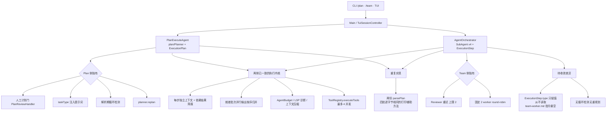
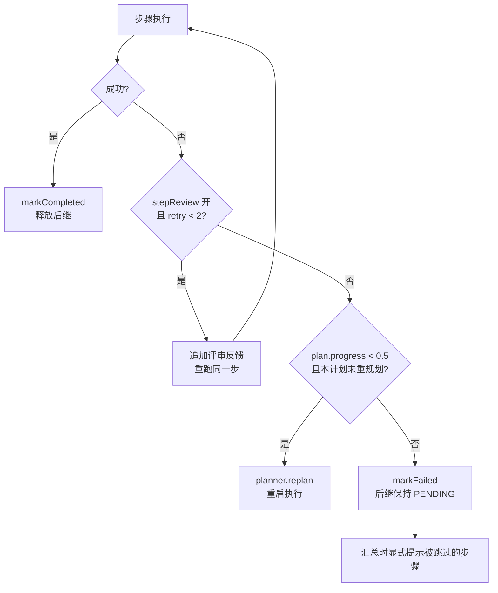
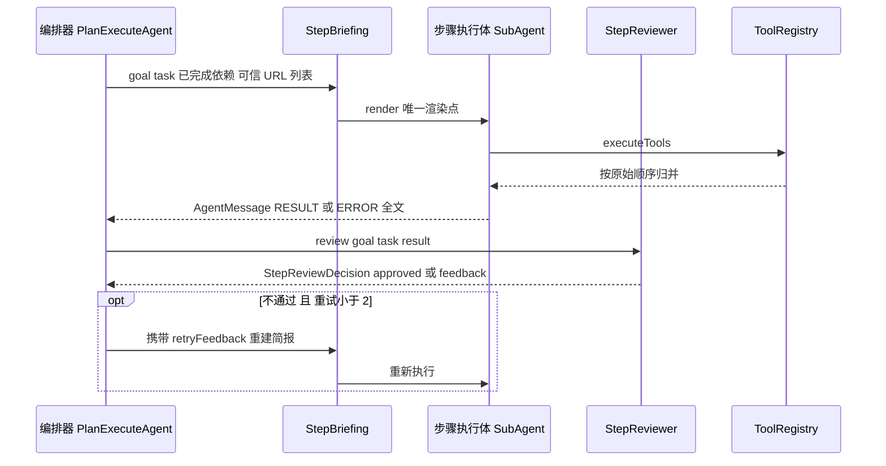
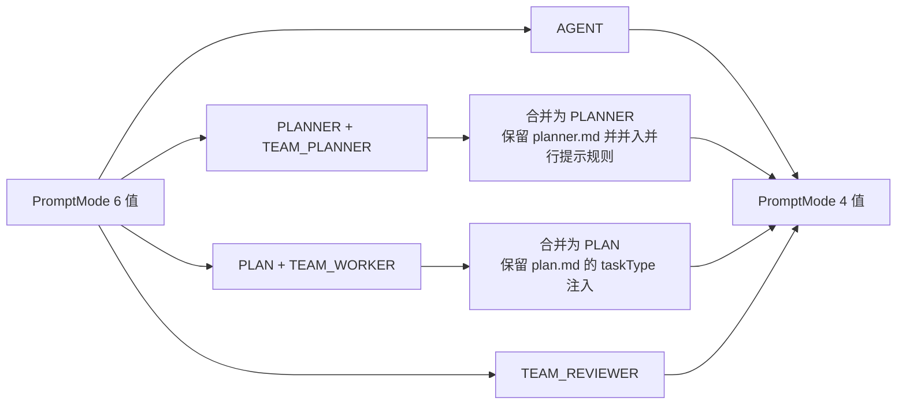
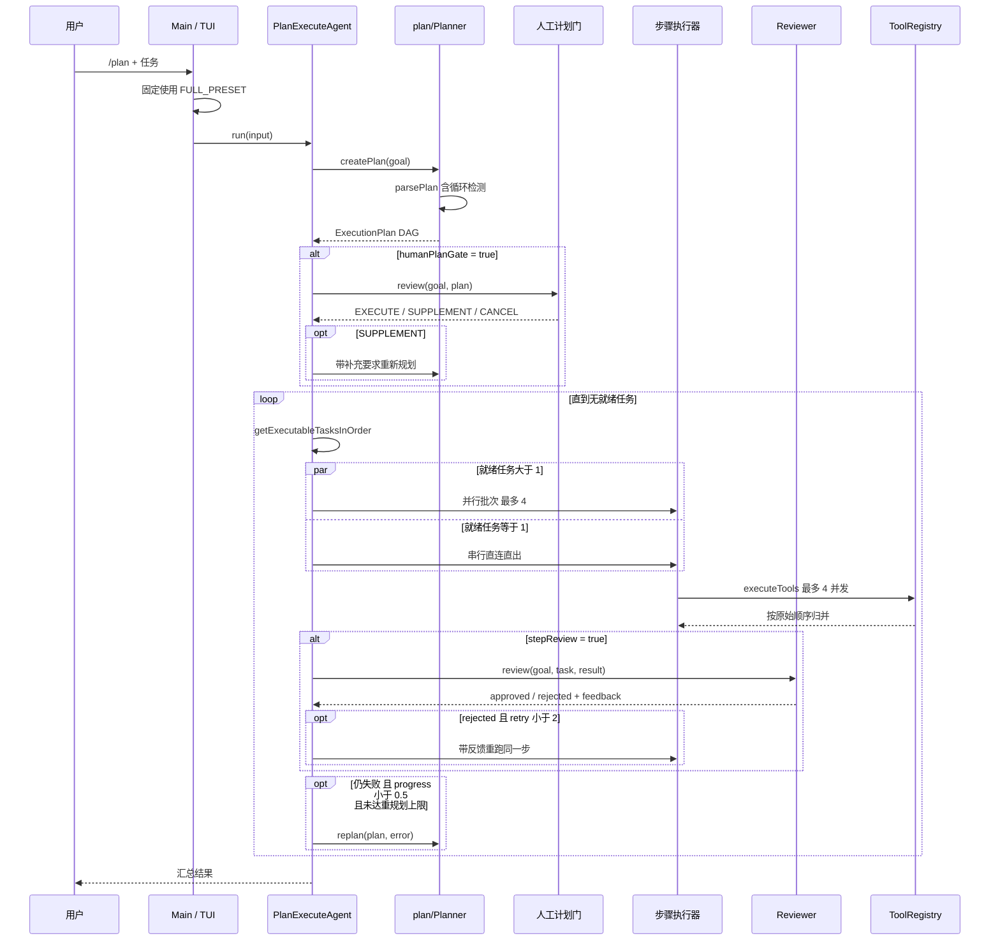

# 12 多 Agent 协作 Plan-and-Execute 统一模式

## 1. 背景、目标与非目标

### 1.1 背景

当前主路径有三条：ReAct（`Agent`）、Plan-and-Execute（`PlanExecuteAgent`）、Multi-Agent（`AgentOrchestrator` + `SubAgent`）。后两条常被描述为"两套规划框架"，但源码显示二者在执行期已经是同一个模型：

- 两边都**每步新建独立上下文**，通过依赖结果简报注入信息——`PlanExecuteAgent.java:598` 新建 `messages`，`SubAgent` 复用 `conversationHistory` 但每步后 `clearHistory()`（`AgentOrchestrator.java:189`、`:238`）。
- 两边都**支持就绪批次并行**——`PlanExecuteAgent.java:482-540` 用 `newFixedThreadPool(min(size, 4))`，`AgentOrchestrator.java:239-244` 走 worker 池。
- 两边都具备 `AgentBudget`、LSP 诊断注入、`RequestSnapshotFactory` + `ContextTokenTracker` 压缩。

因此"两个模式"的实质差异集中在少数几处，而不是两套架构。

### 1.2 目标

1. 把 Plan 模式与 Team 模式合并为**单一实现**，两个入口共用同一条代码路径。
2. 完整保留两侧现有能力，不留行为缺口。
3. 把主子 Agent 的消息传递从「字符串拼接」收敛为**显式契约**（§3.2），消除两侧下行渲染的分叉与上行类型的死枚举。
4. 把 `PromptMode` 与提示词文件按角色收敛（§3.3），消除两套并行的计划/执行提示词及其输出契约冲突。
5. 消除真正的重复实现：两份 `parsePlan`、两份下行渲染、就绪集合与拓扑判定、逐字节相同的工具打印辅助方法。

### 1.3 非目标

- **不合并 ReAct 路径**（`Agent.java`）。ReAct 没有计划阶段，与本次目标无关；其独有的是完整 surface-op 持久化与 `commitCompaction` 序列计算（`Agent.java:1230-1281`）。
- **不改变授权语义**。`TurnToolPolicy` → `HitlToolRegistry` → `ToolRegistry` → `PathGuard`/`CommandGuard` 链条保持不动。
- **不引入图抽象**。`ROADMAP.md:648` 把三模式统一到 LangGraph4J 的工作放在主线之后的分支上，本次不涉及。
- **不新增并行写冲突保护**（见 §3.4 已知限制）。

## 2. 现状分析

### 2.1 架构位置



### 2.2 数据/状态模型

两侧的任务数据结构是同一概念的两份定义：

| | Plan 侧 | Team 侧 |
|---|---|---|
| 任务类型 | `plan/Task`（含 `TaskType`、`dependencies`、`dependents`） | `record ExecutionStep`（`AgentOrchestrator.java:63-81`）+ `enum StepStatus`（`:83-85`） |
| 容器 | `plan/ExecutionPlan`（拓扑排序 + 反向边） | `List<ExecutionStep>`（无容器类型） |
| 状态枚举 | `TaskStatus` | `StepStatus`（`PENDING/RUNNING/COMPLETED/FAILED`） |

**源码证据：`ExecutionStep.type` 是死字段。** 全文只在四处出现——`:63`、`:66`、`:298`、`:317`——全部是赋值，从未被读取。因此 `prompts/modes/team-worker.md` 中依赖 `type` 区分 ANALYSIS / VERIFICATION 的指令是**悬空引用**。

**源码证据：`type` 在 Plan 侧是活的。** `PlanExecuteAgent.java:580` 把 `task.getType()` 注入 prompt 变量 `taskType`。

**源码证据：`SubAgent` 的唯一生产调用方是 `AgentOrchestrator`。** 全仓库 `new SubAgent` 仅出现在 `AgentOrchestrator.java:108/110/111/113/481-482` 与测试文件。这决定了合并后 `SubAgent` 的去留策略。

### 2.3 核心时序与失败路径

执行期差异对照（其余维度已一致）：

| 维度 | Plan 模式 | Team 模式 | 统一后取 |
|---|---|---|---|
| 每步上下文 | 新建 `messages`（`PlanExecuteAgent.java:598`） | `conversationHistory` + `clearHistory()`（`AgentOrchestrator.java:189/:238`） | Plan 侧显式重建 |
| 上下文注入 | `buildTaskContext(goal, plan, task, deps)`（`:591`） | `buildStepContext(steps, step, deps)`（`:648-677`） | Plan 侧（含 goal 与完整依赖结果） |
| 并行度 | 按就绪数，最多 4（`:488`） | 固定 2 worker round-robin（`:230`） | Plan 侧动态批 |
| `taskType` 注入 | 有（`:580`） | 无 | Plan 侧（顺带修掉 Team 侧悬空 type） |
| memoryContext / skillIndex | 有（`:588`、`:595`） | 无 | Plan 侧 |
| 工具门控 | 全部工具 | 仅 `role == WORKER`（`SubAgent.java:561`） | 按角色保留 |
| 计划期人工门 | 有（`PlanReviewHandler`，`PlanExecuteAgent.java:92-114`） | 无 | 开关控制 |
| 解析期循环检测 | 有（`Planner.java:155-157` 抛异常） | 无 | Plan 侧（Team 侧因此获得保护） |
| 失败恢复 | `planner.replan`（`:417-421`，`progress < 0.5`） | Reviewer 重试 ≤2（`runStepWithPolicy`，`:547-646`） | 串联，见 §3.1.3 |
| 账本 actor | `plan` / `task:<id>` | `team` / `<name>` | 统一为 Plan 侧 |
| budget / LSP / 压缩 | 有 | 有 | 已一致 |

## 3. 方案设计

### 3.1 接口与数据结构

#### 3.1.1 命令入口与预设

> **修订（2026-09-17，实现后）**：本节初版保留 `/plan` 与 `/team` 两个入口。定稿后决定**删除 `/team` 入口**，只保留 `/plan`，并把 `/plan` 的预设由 `PLAN_PRESET` 改为 `FULL_PRESET`。理由：两个模式既然已合并为一个实现，就不该再有两个入口；人工计划门与步骤自动评审作为两个独立开关**保留在 `PipelineOptions` 构造层**，但 CLI 不再为单开关组合提供入口。以下预设定义不变，入口表已按新决策重写。

```java
public record PipelineOptions(boolean humanPlanGate, boolean stepReview) {
    public static final PipelineOptions PLAN_PRESET = new PipelineOptions(true,  false);
    public static final PipelineOptions TEAM_PRESET = new PipelineOptions(false, true);
    public static final PipelineOptions FULL_PRESET = new PipelineOptions(true,  true);
}
```

| 入口 | 预设 | 行为 |
|---|---|---|
| `/plan <任务>` | `FULL_PRESET` | 人工审核计划 → 每个任务结果由 Reviewer 自动评审，未通过重试（`MAX_RETRIES_PER_STEP = 2`） |
| `/plan`（无载荷） | `FULL_PRESET` | 置「下一条任务走计划模式」标记，执行完成后自动回 ReAct；ESC 可取消 |

**删除 `/team` 后的命令解析**：`/team` 不再有专门的 `CommandType`，会落到 `CliCommandParser` 的兜底分支（`CliCommandParser.java:334-336`）返回 `UNKNOWN_COMMAND`，由 CLI 层报错而不回退给 Agent（§7 门禁）。`CliCommandParserTest` 中有两条断言固化这个行为。

**为什么保留 `PLAN_PRESET` / `TEAM_PRESET`**：删除 CLI 入口后，这两个常量在生产代码中已无引用点（仅 `PipelineOptionsTest` 与面向单开关路径的 `PlanExecuteAgentTest` 使用）。保留它们的原因：「两个独立开关」是需求本身，构造层保留单开关注入点是后续用配置或 flag 重新暴露的接入点；删除会让 `PipelineOptions` 退化为单一布尔组合，与目标相悖。**当前能力边界**：CLI 只能触达 `FULL_PRESET`，单开关组合需直接使用构造器。

#### 3.1.2 评审层接口

Reviewer 复用 `SubAgent(AgentRole.REVIEWER)`——`SubAgent.java:561` 的 `shouldUseTools()` 对 REVIEWER 返回 `false`，正好就是"无工具的判断者"语义，无需新建执行体。

```java
public interface StepReviewer {
    StepReviewDecision review(String goal, Task task, String stepResult);
}

public record StepReviewDecision(boolean approved, String feedback) {

    public static StepReviewDecision approve() {
        return new StepReviewDecision(true, "");
    }

    public static StepReviewDecision reject(String feedback) {
        return new StepReviewDecision(false, feedback == null ? "" : feedback);
    }
}
```

**工厂命名约束**：工厂方法**不能**命名为 `approved()`——record 的访问器 `approved()` 已返回 `boolean`，同名静态工厂会构成返回类型冲突（编译错误）。故取动词形式 `approve()` / `reject(String)` 与访问器区分（`StepReviewDecision.java:8`、`:12`）。

解析沿用 Team 侧既有的失败关闭策略（`parseReviewApproval`，解析失败默认不通过）。

#### 3.1.3 失败恢复：串联



**串联的理由**：`stepReview=false` 时 `retryCount` 恒为 0，控制流直接落到 replan 分支，等价于今天 Plan 的行为；`stepReview=true` 时先做步内重试，重试耗尽再重规划，等价于 Team 的行为加一层保护。两侧语义都被保留，且不需额外开关。

**注意流程图里 `F` 判断的第二个条件**（「且本计划未重规划」）不是装饰：没有它，replan 会不断触发自身，因为触发条件只看进度、不看已经重规划过几次。落地时这条约束一度缺失并导致栈溢出，见 §3.4 的实现后修订。

### 3.2 主子 Agent 消息契约

统一后，编排器与步骤执行体之间的传递收敛为**下行简报 / 上行结果**两条显式契约，替代今天的两处字符串拼接与三份重复渲染。

#### 3.2.1 下行：StepBriefing

```java
public record StepBriefing(
        String goal,
        Task task,
        List<Task> completedDependencies,
        List<String> trustedDependencyUrls,
        String retryFeedback) {

    public String render() { /* 唯一渲染点 */ }
}
```

- **持有 `Task` 而非投影字段**。统一后数据模型只剩 `plan/Task` 加 `ExecutionPlan`（`ExecutionStep` / `StepStatus` 删除），所以 `stepId` / `description` / `type` 不再单列——直接引用 `Task`，既避免制造它的投影，也让 §3.1.2 的 `StepReviewer.review(goal, task, result)` 与执行体拿到同一份数据。
- **`completedDependencies` 同样持有 `Task` 引用**。依赖的 id / description / status / result 都已挂在 `Task` 上，无需再包一层。
- **`trustedDependencyUrls` 不可省略**。两侧 builder 今天都渲染该列表（`PlanExecuteAgent.java:1147-1153`、`AgentOrchestrator.java:667-674`），它是 `TurnToolPolicy.forkWithTrustedUrls` 授权结果给模型看的副本，直接对应 AGENTS.md §6 的 URL 授权链，不是纯展示字段。
- **单一渲染点**。替代 `PlanExecuteAgent.buildTaskContext`（`PlanExecuteAgent.java:1122-1155`）与 `AgentOrchestrator.buildStepContext`（`AgentOrchestrator.java:648-677`）两份实现，消掉二者在「是否含 goal」与「截断阈值」上的分叉。
- **`goal` 必填**。Team 侧今天缺失（`:650-651` 只有一个标题行），worker 只能靠步骤描述反推用户意图。
- **`type` 复用 `Task.getType()`**。Team 侧 `ExecutionStep.type` 是死字段，`team-worker.md` 中依赖 type 的 ANALYSIS / VERIFICATION 指令因此悬空；统一后该字段真正进入提示词。
- **`retryFeedback` 可选**。承载 Reviewer 拒绝原因，替代 `AgentOrchestrator.java:608` 的第三次字符串拼接（`context + "\n\n之前的执行结果被审查拒绝，原因：\n" + issues`）。
- 下行今天走两个平行通道（`AgentMessage.content` 加裸 `context` 参数，再于 `SubAgent.java:490-495` 拼成 `context + "\n\n当前任务：" + task.content()`），计划身份在拼接中丢失。`StepBriefing` 把它收成一个结构化对象。

渲染骨架，统一两侧既有的两种格式（`retryFeedback` 段仅重试时出现）：

```text
总目标：<goal>
当前任务：<task.id> / <task.description> / 类型=<task.type>
依赖任务结果：
- <dep.id> / <dep.description> / 状态=<dep.status>
<dep.result 全文>
依赖分支经 web_search 验证的 URL（可供当前任务抓取/导航）：
- <url>
之前的结果被审查拒绝，原因：
<retryFeedback>
```

**依赖结果不截断。** Plan 侧今天注入全文（`:1142`），Team 侧硬截 500 字符（`:658-660`）。统一取前者：worker 自身有 `ContextTokenTracker` + `maybeCompactHistory`（`SubAgent.java:343`）兜底溢出，而固定 500 字符是**有依据地丢信息**——对代码 diff 太短，对长文档又形不成实际约束。此处取全文是刻意选择，不是沿用某一侧的默认。

#### 3.2.2 上行：结果与错误

```java
public record AgentMessage(String fromAgent, AgentRole fromRole, String content, Type type) {
    public enum Type { TASK, RESULT, ERROR }   // 删除 FEEDBACK / APPROVAL / REJECTION
}
```

- **删除三个死枚举值**。`FEEDBACK` / `APPROVAL` / `REJECTION` 的工厂方法（`AgentMessage.java:46-62`）在主代码中从未被调用；审查结论今天以字符串形式躺在 `RESULT` 的 `content` 里，靠 `parseReviewApproval` 二次解析。统一后结论走 `StepReviewDecision`（§3.1.2）结构化通道。
- **保留失败关闭的判定标准**。`StepReviewer` 内部仍调 `parseReviewApproval`（`AgentOrchestrator.java:351-384`），解析失败默认不通过。改变的是结论的表达方式，不是判定松紧。
- `TASK` 消息的 `fromRole` 恒为 `null`（`AgentMessage.java:33`），该约定保留。

**不强制上行摘要。** Claude Code 的子 Agent 以「探索」为主——读五十个文件换回 1–2k 摘要，摘要是净收益。本项目的步骤以「执行」为主，其返回内容（改了哪些文件、命令输出是什么）本身就是下游依赖的产物，强制摘要会丢真实信息。因此上行保持结果全文，长度风险登记为已知限制（§3.4）。

#### 3.2.3 消息流全景



### 3.3 提示词层收敛

`PromptMode` 现有 6 个值，其中 4 个分属两套并行模式。合并后必须收敛为 4 个，否则计划提示词与解析器的输出契约不兼容。

| PromptMode | 现状 | 统一后 |
|---|---|---|
| `AGENT` | ReAct | 保留 |
| `PLANNER` / `TEAM_PLANNER` | 两套计划提示词 | 合并为 `PLANNER` |
| `PLAN` / `TEAM_WORKER` | 两套执行提示词 | 合并为 `PLAN` |
| `TEAM_REVIEWER` | Reviewer | 保留 |



**计划提示词必须收敛，这是正确性要求而非风格问题。** `planner.md:13-27` 要求模型输出 `"tasks"` 数组，`team-planner.md:7-20` 要求输出 `"steps"`。统一后唯一存活的解析器 `Planner.parsePlan` 只读 `tasks`（`Planner.java:113`），且**没有** `steps` 兜底——`AgentOrchestrator.parsePlan:277-280` 那层兜底随类删除。若沿用 `team-planner.md`，`/team` 的计划解析会整体失效。

合并保留 `planner.md`，并入 `team-planner.md` 的并行提示（其规则 7：可独立完成的步骤不要加依赖，让编排器并行分配）。`planner.md` 原有的反过度拆解规则保留（规则 5、7、8：简单任务 1–3 步、不为保存中间结果额外建 `FILE_WRITE`/`FILE_READ`、一步能完成就保持最短计划）——这几条 `team-planner.md` 没有。

**执行提示词同样关乎正确性。** `plan.md` 是模板化的，声明 `{{taskType}}` 与 `{{taskDescription}}` 两个变量，由 `PlanExecuteAgent.java:580-581` 注入。`team-worker.md` 是静态文本，其中「如果是 `ANALYSIS` 或 `VERIFICATION` 类型任务…」这条指令**从未被告知任务类型是什么**——`SubAgent` 路径上没有任何 `variable("taskType", ...)` 注入。即 Team 侧今天要求模型按类型分支，却从不给它类型。合并取 `plan.md`，该指令随之变得可执行。

**Reviewer 提示词保留不动。** `team-reviewer.md` 输出 `{approved, summary, issues, suggestions}`，与 `parseReviewApproval` 读 `approved`、`parseReviewIssues` 读 `issues` 一致。

`{{taskType}}` / `{{taskDescription}}` 统一取自 `StepBriefing` 持有的 `Task`（§3.2.1），与 `render()` 中「类型=」字段严格同源，避免同一信息在系统提示词与用户消息里出现两种表述。

**注入点只有一个，且只在 worker 路径上。** 删掉 `AgentOrchestrator` 后 main 代码里不再有任何 `new SubAgent(...)`（现全部位于 `AgentOrchestrator.java:108-113` 与 `:481-482`），唯一存活的 `SubAgent` 是 Reviewer；于是 `SubAgent.promptMode()` 的 `WORKER -> PLAN` 与 `PLANNER -> PLANNER` 两个分支仅剩测试在用。`plan.md` 在生产中的唯一消费者是 `PlanExecuteAgent` 的 worker 路径，而它已经注入这两个变量（`PlanExecuteAgent.java:580-581`），因此 §3.3 的「该指令随之变得可执行」在生产路径上成立。

若还要让测试路径的 WORKER `SubAgent` 语义自洽，需另行补注入：`SubAgent.getSystemPrompt()` 构建的 `PromptContext`（`SubAgent.java:124-131`）不含这两个变量，而 `PromptContext.variable()` 对缺失键返回空串（`PromptContext.java:26`），占位符会**静默**渲染为空而不报错。此项是否处理见 §6 待确认事项。

**默认任务类型随之变化。** Team 侧 `stepNode.path("type").asText("COMMAND")`（`AgentOrchestrator.java:298`）在字段缺失时给 `COMMAND`，而统一后缺字段会走 `parseTaskType("")` 的 default 分支得到 `ANALYSIS`（`Planner.java:172`）。仅在模型漏写 `type` 时生效，但属行为变化，登记在 §3.5。

### 3.4 策略、安全、并发与恢复

- **授权链不变**。统一后步骤仍通过 `TurnToolPolicy.forkWithTrustedUrls(dependencyUrls)` 分叉（`PlanExecuteAgent.java:553`），URL 凭据继承规则与今天一致。
- **账本契约变更**。Team 路径的 `team` / `<name>` actor 不再产生，统一为 `plan` / `task:<id>`。raw session 是 append-only，旧记录不受影响，但解析账本的下游需要同步（见 §3.5）。
- **循环检测纯增益**。Team 路径此前无循环检测，统一后获得 `Planner.java:155-157` 的保护。
- **实现后修订（2026-09-18）：并行步骤评审曾共享一个 Reviewer 实例，已修复。** 本设计的初版落地把 `SubAgentStepReviewer` 建成 `PlanExecuteAgent` 的构造期字段，于是**所有并行任务共用一个 `SubAgent` 实例**；而 `SubAgent.conversationHistory` 是普通 `ArrayList`（`SubAgent.java:80`）、`historyVersion` 是普通 `long`（`:67`），类内没有任何 `synchronized`，并行批次同时进入 `applyStepReview` 即构成数据竞争（并发修改异常、审查输入串台、历史被别的线程清空）。§2.2 记录的旧实现「为每个并行步骤各建一个 reviewer」正是为避免这一点，合并时该保护没有随代码搬移。现状改为任务内现建实例：开关读 `pipelineOptions.stepReview()`（`PlanExecuteAgent.java:587`），实例在 `applyStepReview` 内构造（`:610-611`），任务内的重试串行复用该实例（`SubAgentStepReviewer.review` 每轮 `clearHistory()`，跨任务干净）。回归测试 `PlanExecuteAgentTest.parallelStepReviewDoesNotShareReviewerHistory`（`:432`）。
- **实现后修订（2026-09-18）：失败重规划曾无深度上限，已封顶。** §3.1.3 的失败恢复流程图已把「本计划未重规划」写成重规划的前提，但落地时该约束缺失：`executePlan` 失败后调 `replan` 再回到 `reviewAndExecutePlan`，深度无界；每轮真实打一次 LLM，且 `Planner.replan` 拼出的 goal 含旧 goal 原文而逐层嵌套，触发条件（`getProgress() < 0.5`）又不随失败次数改变，实测可把栈打穿。现由 `MAX_REPLANS_PER_RUN`（`PlanExecuteAgent.java:136`）封顶为每轮 1 次（`:442-445`），达到上限后把失败记进摘要并继续推进剩余可执行任务。回归测试 `PlanExecuteAgentTest.capsReplanningWhenEarlyFailureKeepsRecurring`（`:484`）。
- **已知限制：并行写冲突未处理**。Plan 侧 4 线程、Team 侧 2 worker 今天都已并行且都没有写冲突保护；统一后并行度取 Plan 侧动态批，暴露面从 2 略增到 4。本次**不新增**防护（超出需求范围），但需在文档中显式登记为已知限制。
- **已知限制：上行结果无长度约束**（§3.2.2）。子 Agent 返回全文，Plan 侧再全文注入下游，长链任务的简报体积随依赖数线性叠加。今天两侧都已如此，本次不引入摘要或 token 预算约束；若实际出现上下文放大问题，优先在下游 `maybeCompactHistory` 侧处理，而非在上行强制截断。
- **单步 ReAct 循环的溢出恢复语义不动**（`PlanExecuteAgent` 现有路径）。

### 3.5 兼容性、迁移与回滚

- **命令**：删除 `/team`，只保留 `/plan`，其预设为 `FULL_PRESET`（见 §3.1.1 修订说明）。`CliCommandParser` 中 `SWITCH_TEAM` 枚举值与两处 `/team` 解析、`Main` 的 `nextTaskUseTeamMode` 标记与分发分支及 `createTeamAgent` 工厂、TUI 的 `RunMode.TEAM` 分支与 `/team` 命令均已移除。原 `/team` 输入落到兜底分支返回 `UNKNOWN_COMMAND`。
- **类删除**：`AgentOrchestrator` 的调度职责并入 `PlanExecuteAgent` 后删除；`ExecutionStep` 与 `StepStatus`（`AgentOrchestrator.java:63-85`）随其类型统一为 `plan/Task` 后删除。`SubAgent`、`AgentRole`、`AgentMessage` 保留（Reviewer 使用）。
- **测试迁移**：`AgentOrchestratorTest`（574 行）中 `parsePlan` 用例并入 `Planner` 测试；调度与评审用例改为面向统一实现的 `PlanExecuteAgentTest`。`SubAgentTest`、`AgentRoleTest` 不受影响。
- **提示词删除**：`prompts/modes/team-planner.md` 与 `prompts/modes/team-worker.md` 成为死文件，随 `PromptMode.TEAM_PLANNER` / `TEAM_WORKER` 一并删除（§3.3）。`PromptMode` 由 6 值收敛为 4 值，`SubAgent.promptMode()`（`SubAgent.java:135-137`）的角色映射同步收敛。
- **账本**：actor 串变化见 §3.4。`AgentConversationLedgerTest` 需要同步断言。
- **回滚**：改动集中在 `PlanExecuteAgent`、`AgentMessage`、`PromptMode`、`Main`、`TuiSessionController` 与两个提示词文件，git revert 单次提交即可。

### 3.6 统一后的核心时序



## 4. 实现任务与测试矩阵

| # | 任务 | 产物 | 测试 |
|---|---|---|---|
| T1 | 新增 `PipelineOptions` 与 `StepReviewer` / `StepReviewDecision` | `agent/PipelineOptions.java`、`agent/StepReviewer.java` | `PipelineOptionsTest`（预设组合） |
| T2 | 新增 `StepBriefing` 统一下行渲染，替换 `buildTaskContext` 与 `buildStepContext` 两份实现 | `agent/StepBriefing.java` | `StepBriefingTest`：渲染骨架逐段断言、含 goal、含 type、依赖结果不截断、可信 URL 段、`retryFeedback` 段仅在重试时出现 |
| T3 | 收敛上行契约：删除 `AgentMessage.Type` 三个死枚举值，接收 `StepReviewDecision` 的判定改为结构化 | `AgentMessage.java` | `AgentMessageTest` 同步；`StepReviewer` 解析失败仍默认不通过 |
| T4 | 提示词层收敛：`planner.md` 并入 `team-planner.md` 的并行提示规则；`PromptMode` 收敛为 4 值；删除两份死提示词 | `prompts/modes/planner.md`、`PromptMode.java`、`SubAgent.java` | `PromptModeTest`（若存在）或新增断言；`planner.md` 关键字检查 |
| T5 | 把 `AgentOrchestrator.runStepWithPolicy` 的评审重试循环移植为 `PlanExecuteAgent` 的可选层 | `PlanExecuteAgent.java` | `PlanExecuteAgentTest`：评审通过 / 拒绝后重试 / 重试耗尽 |
| T6 | 在 `executePlan` 失败分支接入串联恢复 | `PlanExecuteAgent.java` | 断言 `stepReview=false` 时回到 replan；`true` 时先重试 |
| T7 | 删除 `AgentOrchestrator.parsePlan` 副本；确认 `Planner.parsePlan` 覆盖其全部用例后迁移差异项 | `Planner.java` | `PlannerTest`、`ExecutionPlanTest` |
| T8 | 接线：删除 `/team`，`/plan` 与 TUI 指向统一实现并使用 `FULL_PRESET` | `Main.java`、`TuiSessionController.java`、`CliCommandParser.java` | `CliCommandParserTest`、`MainPlanAgentFactoryTest` |
| T9 | 删除 `AgentOrchestrator`、`ExecutionStep`、`StepStatus`，迁移其测试 | — | `AgentOrchestratorTest` 拆解迁移 |
| T10 | 同步 `AGENTS.md §3` 架构图与 §6 运行时约束、`ROADMAP.md`、`docs/dev/03` §3.5、`docs/agents-reference.md` | 文档 | — |

### 4.1 落地文件结构

新建：

| 文件 | 职责 |
|---|---|
| `src/main/java/com/codeagent/agent/PipelineOptions.java` | 两个开关的不可变值对象 + 三个预设 |
| `src/main/java/com/codeagent/agent/ReviewResponseParser.java` | Reviewer 输出的文本/JSON 解析，从 `AgentOrchestrator` 迁出 |
| `src/main/java/com/codeagent/agent/StepReviewDecision.java` | 审查结论值对象 |
| `src/main/java/com/codeagent/agent/StepReviewer.java` | 审查层接口 |
| `src/main/java/com/codeagent/agent/SubAgentStepReviewer.java` | 用 `SubAgent(REVIEWER)` 实现 `StepReviewer` |
| `src/main/java/com/codeagent/agent/StepBriefing.java` | 下行简报唯一渲染点 |
| `src/test/java/com/codeagent/agent/PipelineOptionsTest.java` | 预设组合 |
| `src/test/java/com/codeagent/agent/ReviewResponseParserTest.java` | 审查解析与失败关闭 |
| `src/test/java/com/codeagent/agent/StepReviewDecisionTest.java` | 结论工厂 |
| `src/test/java/com/codeagent/agent/StepBriefingTest.java` | 渲染骨架逐段断言 |
| `src/test/java/com/codeagent/agent/SubAgentStepReviewerTest.java` | 审查层端到端（用 stub LLM） |

修改：`AgentMessage.java`（删三个死枚举值与工厂）、`AgentMessageTest.java`、`prompts/modes/planner.md`（并入并行提示规则）、`PlanExecuteAgent.java`（持有开关与审查层、评审重试循环、下行改用 `StepBriefing`）、`SubAgent.java`（角色到 `PromptMode` 的映射收敛）、`PromptMode.java`（6 值收敛为 4 值）、`cli/Main.java` 与 `tui/TuiSessionController.java`（接线指向统一实现）、`PlanExecuteAgentTest.java`（新增评审与串联恢复用例）。

删除：`AgentOrchestrator.java`（职责并入 `PlanExecuteAgent`）、`prompts/modes/team-planner.md`（输出契约冲突：`steps` vs `tasks`）、`prompts/modes/team-worker.md`（指令悬空：从未注入 `taskType`）、`AgentOrchestratorTest.java`（用例拆解迁移）。

### 4.2 实现级细化

**串联恢复不需要新增分支。** §3.1.3 的失败恢复流程图暗示串联需要分支代码；实际把重试循环放进 `executeTask` 内部后，`stepReview=false` 时开关为假、`applyStepReview` 整体不被调用，控制流自然落到既有 replan 分支，行为逐字节不变。

**实现后修订（2026-09-18）**：初版用「构造期 `stepReviewer` 字段是否为 `null`」表达这个开关。该字段的问题不在于表达力，而在于它是**实例级共享状态**——并行批次会同时进入 `applyStepReview`，多条线程写同一个 `SubAgent` 会话历史（详见 §3.4）。现已改为任务内在 `applyStepReview` 里现建实例（`PlanExecuteAgent.java:587`、`:610-611`），开关本身仍只是那一个布尔。

### 4.3 验证命令

本仓库有两处会静默吞掉测试的陷阱，**每次运行测试都必须同时绕开**：

1. `pom.xml:21` 把 `<skipTests>true</skipTests>` 设为默认值。不传 `-DskipTests=false` 时 Maven 返回退出码 0 但**执行零个测试**。
2. 默认 `JAVA_HOME` 指向 JDK 8，而测试类编译自 Java 17（class file version 61.0），fork 会以零个测试告终。

判断测试**真的跑了**的标准：输出含 `Tests run: N` 且 N > 0。若只看到 `BUILD SUCCESS` 而无 `Tests run`，说明命中陷阱 1。

```text
命令解析：JAVA_HOME="/c/Program Files/Java/jdk-17" mvn test -DskipTests=false -Dtest=CliCommandParserTest,MainPlanAgentFactoryTest
消息契约：JAVA_HOME="/c/Program Files/Java/jdk-17" mvn test -DskipTests=false -Dtest=StepBriefingTest,AgentMessageTest,PipelineOptionsTest
计划/多 Agent：JAVA_HOME="/c/Program Files/Java/jdk-17" mvn test -DskipTests=false -Dtest=ExecutionPlanTest,PlanExecuteAgentTest,SubAgentTest
账本：JAVA_HOME="/c/Program Files/Java/jdk-17" mvn test -DskipTests=false -Dtest=AgentConversationLedgerTest
常规回归：JAVA_HOME="/c/Program Files/Java/jdk-17" mvn test -DskipTests=false -Pquick
构建：JAVA_HOME="/c/Program Files/Java/jdk-17" mvn clean package
```

## 5. 验收清单

- [ ] `/plan` 使用 `FULL_PRESET`，行为与合并前逐项一致：人工门、`taskType` 注入、循环检测、replan、动态并行度，并叠加步骤自动评审。
- [ ] `/team` 入口已删除：输入 `/team` 得到 `UNKNOWN_COMMAND` 并在 CLI 层报错；`CommandType.SWITCH_TEAM`、`Main.createTeamAgent`、`TuiSessionController.RunMode.TEAM` 均不存在。
- [ ] 合并把 Team 侧既有行为差异**限定在已登记的六处**，其余保持一致（Reviewer 重试 ≤2）：
  - 并行度由固定 2 worker 变为按就绪数最多 4；
  - 账本 actor 由 `team`/`<name>` 变为 `plan`/`task:<id>`；
  - 新增解析期循环检测（纯增益）；
  - `type` 由悬空字段变为注入提示词（纯增益）；
  - 计划/执行提示词由 `team-planner.md` / `team-worker.md` 换为 `planner.md` / `plan.md`（纯增益，含反过度拆解规则与 `taskType` 注入）；
  - 任务类型字段缺失时的兜底由 `COMMAND` 变为 `ANALYSIS`（`Planner.java:172`）。
- [ ] `PLAN_PRESET` / `TEAM_PRESET` 保留在构造层但 CLI 不可触达，已在 §3.1.1 登记为已知能力边界。
- [ ] 统一后只有一份计划解析实现，`ExecutionStep.type` 的悬空引用被消除。
- [ ] 下行只剩 `StepBriefing.render()` 一个渲染点，两份 builder 已删除；简报含 goal、task 身份与类型、已完成依赖结果、可信 URL 列表与可选 retryFeedback。
- [ ] `PromptMode` 仅剩 `AGENT` / `PLAN` / `PLANNER` / `TEAM_REVIEWER`；`team-planner.md` 与 `team-worker.md` 已删除；`planner.md` 输出 `tasks` 字段并含并行提示规则。
- [ ] `AgentMessage.Type` 仅剩 `TASK` / `RESULT` / `ERROR`，无调用方构造已删除的三个值。
- [ ] 审查结论经 `StepReviewDecision` 传递，不再从返回文本反推类型；解析失败仍默认不通过。
- [ ] 账本 actor 串变化已同步文档与测试断言。
- [ ] 未修改 ReAct 路径、授权链与 `Agent` 的持久化契约。
- [ ] `git diff --check` 通过，全量测试与 `mvn clean package` 通过。

## 6. 待确认事项

1. **失败恢复串联**（§3.1.3）为本次自行决策，替代方案是"只保留 replan"或"只保留重试"。
2. **并行写冲突**（§3.4）登记为已知限制而非本次实现，替代方案是引入同批次路径交集检测后强制串行。
3. **计划解析的两个既有缺陷**不在本次范围：`Planner.java:141-151` 静默丢弃未知依赖；`tasks` 字段缺失时 Plan 侧端到端返回"✅ 计划执行完成！"（假成功）。是否顺带修复需单独确认。
4. **依赖结果不截断**（§3.2.1）取 Plan 侧全文，替代方案是按 token 预算截断；Team 侧现有的 500 字符硬截断将被移除。
5. **不强制上行摘要**（§3.2.2）。理由见该节，替代方案是要求子 Agent 产出压缩摘要后再回传。
6. **删除 `AgentMessage.Type` 的三个死枚举值**（§3.2.2）会使 `AgentMessageTest` 中 `feedback` / `approval` / `rejection` 相关断言失效，需随 T3 一并更新。
7. **`StepBriefing` 的目标序列化形态**：本次按纯文本渲染（对齐两侧现状），替代方案是渲染成结构化 JSON 块以获得更稳定的模型解析，代价是提示词改动面更大。
8. **计划提示词以 `planner.md` 为基底合并**（§3.3），替代方案是以 `team-planner.md` 为基底并给 `Planner.parsePlan` 补 `steps` 兜底——后者会同时保留两套字段名，与"消除重复"的目标相悖。
9. **任务类型缺字段的兜底取 `ANALYSIS`**（§3.3）沿用 `parseTaskType` 现有 default 分支，替代方案是改为 `COMMAND` 以完全保持 Team 侧现状。仅影响模型漏写 `type` 的计划。
10. **是否让测试路径的 WORKER `SubAgent` 补注入 `{{taskType}}`**（§3.3）。生产路径不受影响（唯一消费者是已注入的 `PlanExecuteAgent` worker 路径），本项只关乎 `SubAgentTest` 中 WORKER 用例的语义自洽。替代方案是把 `plan.md` 的两处占位符改为静态表述，代价是失去「按类型分支」的指令能力，与 §3.3 的收益相冲突。
11. **删除 `/team` 入口**（§3.1.1 修订）为定稿后的决策，替代方案是保留 `/team` 映射 `TEAM_PRESET`，或引入 `/plan --review` flag。当前选择的代价是 `PLAN_PRESET` / `TEAM_PRESET` 在 CLI 不可触达、步骤评审无法单独关闭；若后续要恢复单开关入口，需改 `CliCommandParser` 的 payload 约定（现有实现把 `/plan ` 之后的内容整体当作任务文本）。
12. **`SubAgent` 内的 `"team"` 字面量未清理**（`SubAgent.java:109,163,217,278,398,444,520,548,614,633`）。生产路径下唯一存活的 `SubAgent` 是 Reviewer（`PlanExecuteAgent.java:186-187`），其 `conversationLedger` 保持 `ConversationLedger.disabled()` 且未注入 `parentSession`，因此这些 origin 串不可达，§3.4 的账本结论仍成立。本次**不清理**：改动零功能收益，且会让 session 事件 origin 出现新旧两种取值。`PromptMode.TEAM_REVIEWER`（`PromptMode.java:7` → `modes/team-reviewer.md`）是活路径，改名涉及提示词文件重命名，同样不在本次范围。
13. **【已关闭，实现后补充】并行步骤评审的实例共享**。设计阶段未识别这一项：它不属于两侧任一既有实现（旧 Team 实现每并行步骤各建一个 reviewer），是合并过程中丢掉的保护。已在 2026-09-18 修复为「每任务现建 Reviewer」并补回归测试，结论见 §3.4。
14. **【已关闭，实现后补充】失败重规划的次数上限**。§3.1.3 的流程图原本就把「本计划未重规划」写进前提，但落地时未实现，导致递归无界、实测栈溢出。已在 2026-09-18 补上 `MAX_REPLANS_PER_RUN` 并加回归测试，结论见 §3.4。
