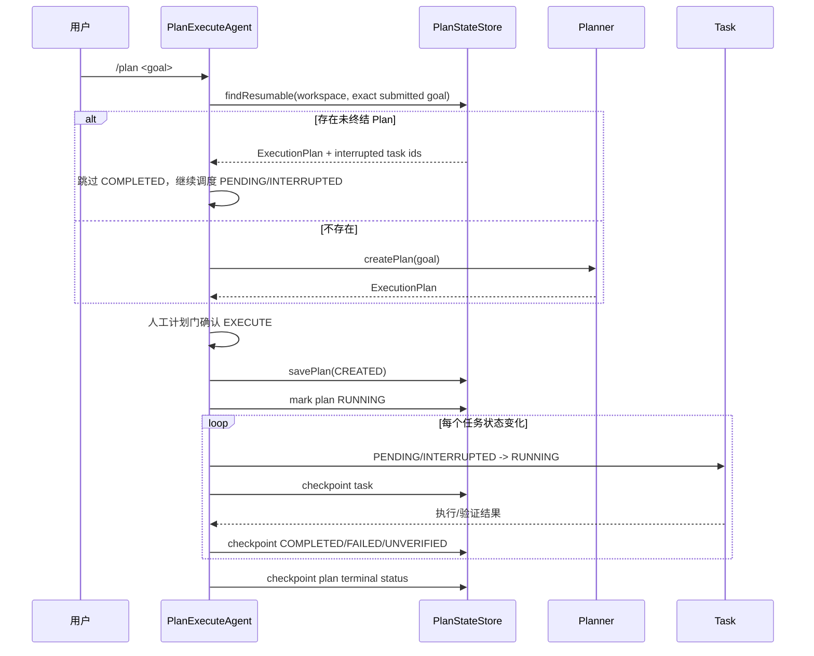
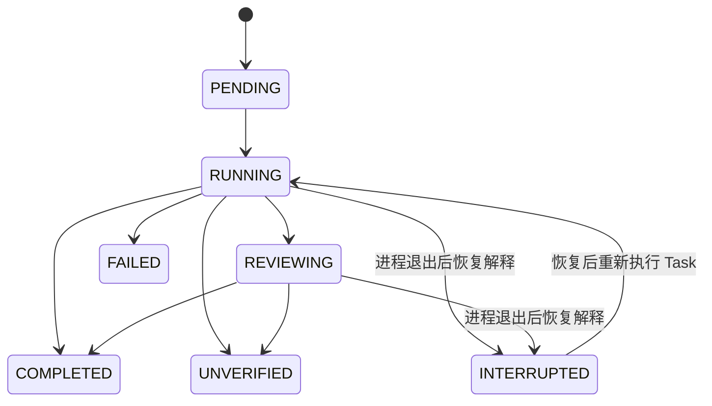

# Plan-and-Execute 持久化 DAG 与中断恢复

## 1. 背景、目标与非目标

当前 `PlanExecuteAgent` 的 `ExecutionPlan`、DAG 依赖和 `Task.status/result/error` 都是 JVM 内存状态；每个任务虽然会创建 child session，并把模型消息、工具结果及 child result 写入 SessionStore / ConversationLedger，但进程退出后不能重建原 DAG 并从未完成节点继续调度。

本改造目标：

1. 将 Plan 的结构和 Task 的运行状态持久化到 SQLite。
2. 同一 workspace 再次提交**完全相同的顶层 /plan 原始输入**时，优先恢复最近一个未终结 Plan，而不是重新调用 Planner；`@path` 展开后的执行内容不作为匹配键。
3. 已完成节点保持 `COMPLETED` 并跳过；中断时处于 `RUNNING/REVIEWING` 的节点恢复为 `INTERRUPTED`，依赖满足后从该 Task 边界重新执行。
4. 每次关键状态迁移后同步 checkpoint，使崩溃后的恢复边界尽量接近最后一个已确认状态。
5. 保留现有 child session、ConversationLedger、ToolPolicy、Evidence Gate、Reviewer 和资源冲突调度，不复制执行逻辑。

非目标：

- 不实现 Task 内部某个 tool call 位置的精确续跑；恢复粒度是 Task 边界。
- 不保证非幂等外部副作用的 exactly-once。中断 Task 重跑前会显式注入恢复提示，要求先检查当前资源状态、已存在产物和验证证据，避免重复副作用；真正 exactly-once 需要工具级幂等键/事务支持，超出本次范围。
- 不新增 `/plan resume` 等 CLI 命令；第一版只在用户重新提交相同 goal 时自动恢复。
- 不改变 `DurableTaskManager` 的后台任务语义。

## 2. 现状分析（源码证据、已知约束）

### 2.1 架构位置

当前链路：

`Main /plan` → `PlanExecuteAgent.run` → `Planner.createPlan` → `ExecutionPlan` → `executePlan` → `executeTaskBatch` → 单 Task ReAct → Evidence Gate → Reviewer。

现有持久化只覆盖：

- `ConversationLedger`：append-only 原始消息账本。
- `SessionStore`：主会话与 Plan Task child session。
- `DurableTaskManager`：另一套后台任务队列，SQLite 保存队列状态，与 Plan DAG 无关。

缺口是：没有一份可重建 `ExecutionPlan` 的持久化状态。

### 2.2 数据/状态模型

新增 `PlanStateStore`，默认数据库：

`~/.codeagent/plans/plans.db`

支持：

- 系统属性 `codeagent.plan.dir`
- 环境变量 `CODEAGENT_PLAN_DIR`

两张表：

- `plan_runs`：plan id、workspace、resume key（用户原始提交文本）、完整执行 goal、plan status、summary、时间。
- `plan_tasks`：plan id + task id、ordinal、description、type、status、dependencies、resource claims、acceptance criteria、required evidence、result、error、时间。

`TaskStatus` 新增 `INTERRUPTED`。恢复时只把上次处于 `RUNNING` 或 `REVIEWING` 的任务转为 `INTERRUPTED`；`COMPLETED` 保持完成。

### 2.3 核心时序与失败路径

崩溃发生在 `RUNNING` Task 时，数据库中的最后状态可能仍是 `RUNNING`。下次恢复读取时将其解释为 `INTERRUPTED`，并在重新执行该 Task 时给 Worker 注入“先检查当前状态，避免重复副作用”的恢复提示。

## 3. 方案设计

### 3.1 接口与数据结构

`PlanStateStore` 提供：

- `savePlan(workspace, resumeKey, plan)`
- `checkpointPlan(plan)`
- `checkpointTask(planId, task)`
- `findResumable(workspace, goal)`

`findResumable` 返回恢复后的 `ExecutionPlan` 与 `interruptedTaskIds`。Plan 只按 workspace + exact submitted goal 匹配，避免用户提交新任务时误恢复旧工作流；完整执行 goal 单独保存，用于恢复 Task 上下文。

恢复重建时重新执行 `computeExecutionOrder()`，持久化数据若形成非法 DAG 则拒绝恢复。

### 3.2 策略、安全、并发与恢复

- 资源声明、ToolResourceScope、TurnToolPolicy、HITL、PathGuard、CommandGuard 均保持原链路。
- Plan Task 并行仍由 `ConflictAwareBatchSelector` 选批，状态写入在主调度线程完成；开始执行前先 checkpoint `RUNNING`。
- 并行 Worker 内仍只负责运行并返回结果，不直接决定最终 Task 状态。
- 恢复 Task 不继承上一次进程内的 `TrustedUrlContext`；URL authority 必须重新由顶层用户原文或新一轮成功搜索建立，避免把不可验证的进程内凭据序列化成长期授权。
- `COMPLETED` 节点直接作为依赖结果继续使用其持久化 `result`。
- `RUNNING/REVIEWING` 恢复为 `INTERRUPTED`，允许在依赖满足时重新进入 Task ReAct；首次 briefing 注入恢复提示。
- 用户主动取消会把 Plan 标记为 `CANCELLED`，不作为自动恢复候选。
- `FAILED/COMPLETED/CANCELLED` Plan 均不自动恢复。

恢复状态图：

### 3.3 兼容性、迁移与回滚

- SQLite 使用 `CREATE TABLE IF NOT EXISTS`，无旧数据迁移；POSIX 文件系统下状态目录收紧为 `0700`、数据库收紧为 `0600`。
- 无法初始化 PlanStateStore 时记录 warning，并退化为当前内存态行为，不能因为持久化目录故障阻断 Agent。
- 不修改 Planner JSON schema，不影响现有 Plan prompt。
- 不修改 CLI 命令语法。
- 回滚时删除 PlanStateStore 接线即可；数据库文件是独立缓存/状态，不影响 SessionStore、Memory 或 Side-Git。

## 4. 实现任务与测试矩阵

1. 增加 `TaskStatus.INTERRUPTED` 和恢复执行语义。
2. 新增 SQLite `PlanStateStore`。
3. `PlanExecuteAgent`：
   - 新计划保存；
   - 相同 goal 的未终结计划恢复；
   - 关键 Task / Plan 状态 checkpoint；
   - 中断 Task 恢复提示；
   - 取消时持久化 `CANCELLED`。
4. 更新 `docs/agents-reference.md` 持久化路径与 Plan 行为说明。
5. 测试：
   - PlanStore round-trip 保留 DAG、资源声明、验收条件、证据、结果和状态。
   - `RUNNING/REVIEWING` 恢复为 `INTERRUPTED`。
   - 已完成依赖不重跑；中断节点继续执行。
   - goal 不同不误恢复。
   - terminal Plan 不作为恢复候选。

## 5. 验收清单

- [ ] 相同 workspace + exact submitted goal 能恢复未终结 Plan。
- [ ] `COMPLETED` Task 不重复执行。
- [ ] 上次 `RUNNING/REVIEWING` Task 被识别为 `INTERRUPTED` 并从 Task 边界重试。
- [ ] 后继仍只在依赖 `COMPLETED` 后解锁。
- [ ] 资源冲突、Evidence Gate、Reviewer、ToolPolicy 行为不回退。
- [ ] 取消、失败和完成 Plan 正确持久化为终态。
- [ ] 持久化失败能安全退化。
- [ ] 定向测试通过。
- [ ] `mvn test -Pquick -DskipTests=false` 通过。
- [ ] `git diff --check` 通过。
