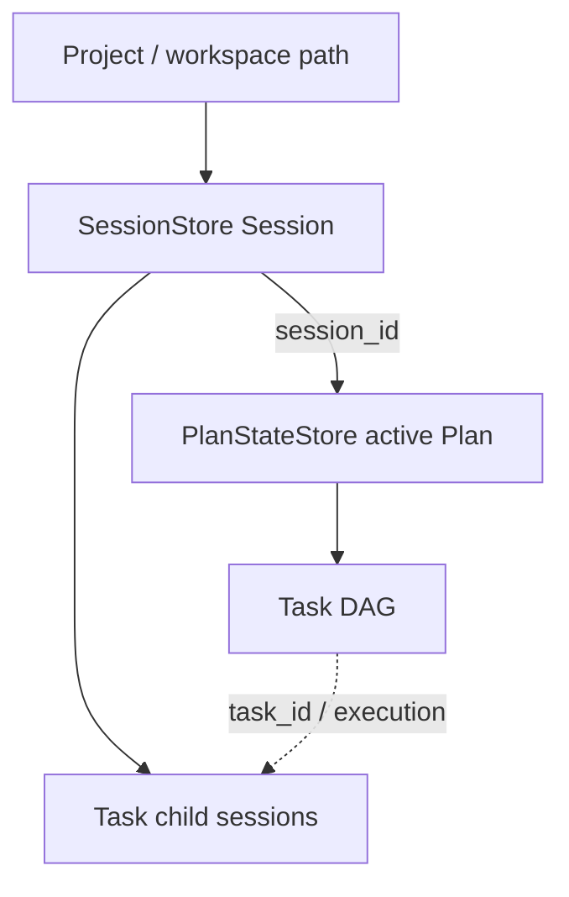
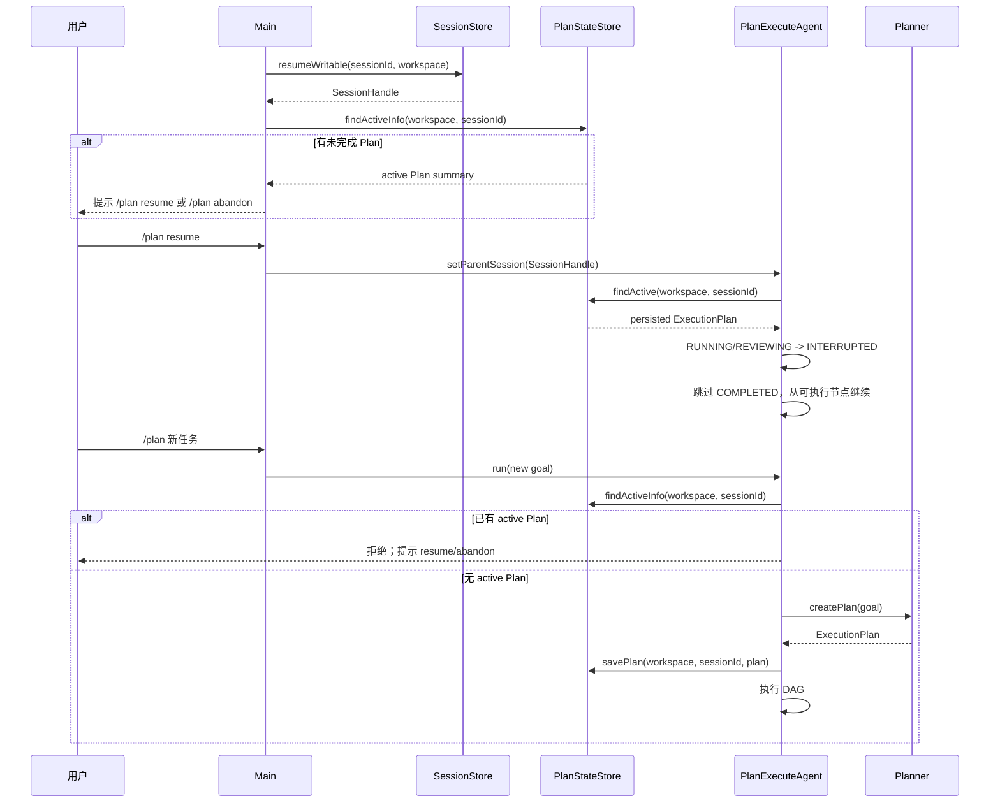
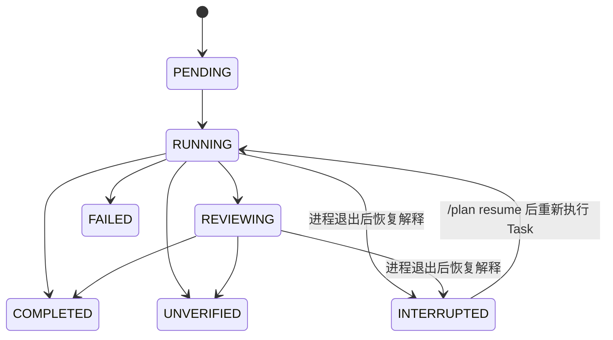

# Plan-and-Execute 持久化 DAG 与 Session 绑定恢复

## 1. 背景、目标与非目标

`PlanStateStore` 已经能把 Plan DAG、Task 状态、资源声明、验收条件和执行结果 checkpoint 到 SQLite，并在进程退出后把遗留 `RUNNING/REVIEWING` Task 恢复为 `INTERRUPTED`。当前恢复身份使用 `workspace + resume_key`，其中 `resume_key` 是用户原始 Plan prompt。

该身份模型存在根本问题：**prompt 是任务内容，不是一次执行实例的身份**。同一用户在同一项目里两次提交完全相同 prompt，应当允许 Planner 生成两个不同 Plan；反之，一个已中断 Plan 的恢复也不应该要求用户重新输入完全相同的 prompt。

项目已有 `SessionStore`，其 `SessionHandle.sessionId()` 已经提供稳定的会话身份，并且 Session 本身绑定 workspace。CLI 默认会恢复当前项目最近未关闭 Session，手动也支持 `/resume <session-id>`。因此 Plan 恢复应当建立在现有 Session 身份之上，而不是重复发明 prompt-based identity。

本次改造目标：

1. 将 Plan 与当前父 Session 建立稳定关联：`Session -> active Plan -> Task DAG`。
2. 废弃 `workspace + prompt` 自动恢复；新 Plan 不再因为 prompt 相同而复用旧 Plan。
3. 一个 Session 同一时间最多存在一个非终态 Plan（`CREATED/RUNNING`）。
4. 提供显式 `/plan resume`，恢复当前 Session 的未完成 Plan；`COMPLETED` 节点跳过，遗留 `RUNNING/REVIEWING` 节点转为 `INTERRUPTED` 后从 Task 边界继续。
5. 提供显式 `/plan abandon`，将当前 Session 的 active Plan 标记为 `CANCELLED`，之后才允许创建新 Plan。
6. 启动自动恢复 Session 或执行 `/resume <session-id>` 后，如果该 Session 存在 active Plan，只做提示，不自动执行有副作用的 Task。
7. 保留现有 child session、ConversationLedger、ToolPolicy、Evidence Gate、Reviewer、资源冲突调度和 Task 级 checkpoint。

非目标：

- 不实现 Task 内某个 tool call 的精确续跑；恢复粒度仍为整个 Task。
- 不保证外部副作用 exactly-once。中断 Task 恢复时仍必须先检查 workspace / 外部资源当前状态和已有产物。
- 不根据自然语言“继续”猜测是否恢复 Plan；恢复必须是确定性的 `/plan resume`。
- 不把 DAG 状态塞进 SessionStore event log；SessionStore 负责会话恢复，PlanStateStore 继续负责工作流状态。
- 不改变 `DurableTaskManager` 的后台任务语义。

## 2. 现状分析（源码证据、已知约束）

### 2.1 已有 Session 身份模型

CLI 启动时已经取得规范化项目目录：

```java
Path workspace = Path.of(".").toRealPath().normalize();
```

`SessionStore` 提供：

- `latestUnclosed(workspace)`：找到当前项目最近未关闭 Session。
- `resumeWritable(sessionId, workspace)`：恢复指定 Session，并校验 Session 的 workspace。
- `SessionHandle.sessionId()`：稳定会话 ID。
- `SessionHandle.createChild(...)`：Plan Task 子会话已经天然挂在父 Session 下。

默认情况下 `codeagent.session.resume` 未设置为 off 时，CLI 启动会自动恢复当前 workspace 最近未关闭 Session；手动 `/resume <session-id>` 也会切换 `reactAgent` 当前 Session。

这说明项目已经存在正确的“工作实例身份”：

```text
project/workspace path
        |
        v
    session_id
```

### 2.2 当前 Plan 恢复模型的问题

当前 `plan_runs`：

```text
id
workspace
resume_key   <- 原始 prompt
goal
status
summary
...
```

当前查询：

```text
workspace + exact resume_key + CREATED/RUNNING
```

问题包括：

1. 相同 prompt 的两次独立任务会错误命中旧 Plan。
2. 恢复旧 Session 后输入“继续”无法命中，因为 prompt 已变化。
3. 同一 workspace 的两个 Session 如果提交相同 prompt，无法区分到底属于哪个 Session。
4. prompt 文本承担了实例 ID 的职责，数据模型语义错误。
5. Plan 与其已经存在的 parent Session 没有持久化关联。

### 2.3 目标架构



身份职责：

- workspace：安全范围与项目归属校验，不承担“是哪一次任务”的身份。
- session_id：哪一次连续工作/对话，是 Plan 恢复的主关联键。
- plan_id：当前 Session 内某次复杂工作流实例。
- task_id：Plan DAG 内节点。

## 3. 方案设计

### 3.1 数据模型与迁移

`plan_runs` 新增：

```text
session_id TEXT NULL
```

保留现有 `resume_key` 字段作为 legacy schema 兼容，但**新写入和新查询不再使用它进行恢复**。

新版逻辑：

```text
plan_runs
--------------------------------
id
workspace
session_id       <- 新恢复身份
resume_key       <- legacy，不再参与恢复
policy_input     <- 原始顶层授权输入，只用于重建工具策略
goal
status
summary
created_at
updated_at
```

初始化数据库时：

1. `CREATE TABLE IF NOT EXISTS` 仍支持全新安装。
2. 对已存在数据库用 `PRAGMA table_info(plan_runs)` 检查 `session_id`。
3. 缺失时执行 `ALTER TABLE plan_runs ADD COLUMN session_id TEXT`。
4. 缺失 `policy_input` 时追加该列，旧记录默认空串。
5. 创建 session 查询索引。
6. 旧记录的 `session_id = NULL`，视为 **legacy unbound plan**，不得根据 prompt 猜测关联到某个 Session，也不得自动恢复。

约束：一个 Session 最多一个 active Plan。代码层先检查；数据库层增加 partial unique index 作为并发兜底：

```sql
CREATE UNIQUE INDEX IF NOT EXISTS idx_plan_runs_one_active_per_session
ON plan_runs(workspace, session_id)
WHERE session_id IS NOT NULL
  AND status IN ('CREATED', 'RUNNING');
```

### 3.2 PlanStateStore 接口

核心接口调整为：

```java
savePlan(Path workspace, String sessionId, String policyInput, ExecutionPlan plan)

Optional<ActivePlanInfo> findActiveInfo(
    Path workspace,
    String sessionId
)

Optional<ResumeCandidate> findActive(
    Path workspace,
    String sessionId
)

boolean abandonActive(
    Path workspace,
    String sessionId
)
```

`findActiveInfo` 是只读查询，用于启动提示和“是否已有 active Plan”的判定；它不能改写 Task 状态。

`findActive` 只用于真正的 `/plan resume`：

- 必须同时匹配 workspace + session_id。
- 只返回 `CREATED/RUNNING`。
- 重建 DAG 后重新执行 `computeExecutionOrder()`。
- 只有在真实恢复时，持久化的 `RUNNING/REVIEWING` Task 才转换成 `INTERRUPTED`。
- `COMPLETED` Task 保留 result，不再执行。

`resume_key` 查询入口删除，防止未来代码又退回 prompt identity。

`policy_input` 与身份严格分离：它保存的是当时用户真实提交的顶层文本，只用于恢复 `TurnToolPolicy` 的 no-web、原始 URL 等来源约束。用户执行 `/plan resume` 本身提供“继续执行”的显式授权，因此恢复时使用 `TurnToolPolicy.forExplicitTask(policy_input, ...)`；不会把旧进程内搜索得到的 `TrustedUrlContext` 序列化回来。

### 3.3 PlanExecuteAgent 行为

`PlanExecuteAgent.run(...)` 表示“创建并执行一个新的 Plan”，不再隐式恢复旧 Plan。

执行新 Plan 前：

```text
当前有 active Plan？
    |
    +-- 是 --> 拒绝创建，提示 /plan resume 或 /plan abandon
    |
    +-- 否 --> Planner.createPlan -> 人工计划门 -> 保存 session_id -> 执行
```

新增显式操作：

```java
String resumeActivePlan()
String abandonActivePlan()
Optional<PlanResumeInfo> activePlanInfo()
```

`resumeActivePlan()` 不重新调用 Planner，也不要求原始 prompt。它通过当前 `parentSession.sessionId()` 找到 active Plan，并直接进入已有 DAG 调度。因为 `/plan resume` 本身就是用户显式确认，不重复触发“新计划人工确认门”。

`abandonActivePlan()` 将 active Plan 标成 `CANCELLED`，不执行 Task。

如果 `parentSession == null`：

- 新 Plan 仍可按现有内存态执行。
- 不保存可恢复 Plan。
- `/plan resume` / `/plan abandon` 返回“当前没有可绑定的持久化 Session”。

### 3.4 CLI / TUI 命令

CLI parser 增加明确命令类型，避免把管理命令当作普通 Plan prompt：

```text
/plan <任务>     创建新 Plan
/plan resume     恢复当前 Session 的 active Plan
/plan abandon    放弃当前 Session 的 active Plan
```

裸 `/plan` 继续保留现有“下一条普通输入使用 Plan 模式”的语义。

`/plan resume` 与 `/plan abandon` 是保留子命令；如果用户真的要让 Planner 处理字面任务“resume”，应写完整自然语言任务，而不是依赖保留词。

TUI 同步支持上述两个子命令，并在构造 PlanExecuteAgent 时注入：

```java
planAgent.setParentSession(reactAgent.getSessionHandle());
```

### 3.5 Session 恢复后的提示，而不是自动执行

启动时已有流程：

```text
workspace
  -> latestUnclosed(workspace)
  -> resumeWritable(sessionId, workspace)
  -> reactAgent.attachSession(...)
```

在 Session 恢复成功后，仅查询该 sessionId 是否有 active Plan。

有则启动提示追加：

```text
已恢复会话 session_xxx
检测到未完成 Plan plan_yyy（2/5 已完成）
使用 /plan resume 继续，或 /plan abandon 放弃。
```

手动 `/resume <session-id>` 成功后同样打印提示。

**禁止** Session 一恢复就自动执行 Plan，因为恢复的 Task 可能写文件、执行命令或触发外部副作用。

### 3.6 核心时序



### 3.7 状态、安全与副作用

Task 状态恢复仍保持：



安全约束保持：

- `TrustedUrlContext` 不跨进程序列化；恢复时只重建原始顶层 `policy_input` 中已有的 URL/no-web 边界，旧进程内搜索发现的 URL authority 必须重新由可信来源建立。
- 中断 Task briefing 明确要求先检查已有产物/当前资源状态，避免假设上次副作用未发生。
- HITL、TurnToolPolicy、PathGuard、CommandGuard、ToolResourceScope 不绕过。
- `COMPLETED` 是后继依赖解锁的唯一成功状态（结合现有验证逻辑）。
- `FAILED/COMPLETED/CANCELLED` Plan 均不是 active Plan。

## 4. 实现任务与测试矩阵

1. **PlanStateStore migration**
   - 新 schema 含 `session_id`。
   - 老 schema 自动 `ALTER TABLE`。
   - legacy `session_id = NULL` 行不被自动恢复。
   - session active-plan 查询与唯一约束。

2. **PlanStateStore 行为**
   - 保存 Plan 时绑定 sessionId，并把原始顶层输入作为 policyInput 单独保存（不参与身份匹配）。
   - workspace 相同但 sessionId 不同不得串 Plan。
   - prompt/goal 相同但不同 Session 是两个独立 Plan。
   - abandon 后不再作为 active Plan。

3. **PlanExecuteAgent**
   - 新 Plan 不再按 prompt 自动恢复。
   - 当前 Session 有 active Plan 时拒绝创建第二个 Plan。
   - `resumeActivePlan()` 不调用 Planner，跳过已完成节点并继续中断节点。
   - `abandonActivePlan()` 标记取消。
   - 没有 parent Session 时安全降级。

4. **CLI / TUI**
   - parser 钉住 `/plan resume` / `/plan abandon`。
   - 自动 Session resume 后显示 active Plan 提示。
   - 手动 `/resume` 后显示 active Plan 提示。
   - TUI 注入 parent Session 并支持两个命令。

5. **文档同步**
   - `AGENTS.md`
   - `docs/agents-reference.md`
   - `docs/dev/03-multi-agent-collaboration.md`
   - `README.md`
   - 命令提示/completer（若存在独立枚举）。

## 5. 验收清单

- [ ] 新 Plan 恢复身份不再依赖 prompt / resume_key；原始 prompt 只作为 policy_input 权限来源保存。
- [ ] 同 workspace、同 prompt、不同 Session 可以创建两个独立 Plan。
- [ ] 同一 Session 同时最多一个 active Plan。
- [ ] Session 恢复后能确定性找到自己的 active Plan。
- [ ] Session 恢复只提示，不自动执行副作用。
- [ ] `/plan resume` 不调用 Planner，并从持久化 DAG 的未完成节点继续。
- [ ] `COMPLETED` Task 不重复执行。
- [ ] `RUNNING/REVIEWING` Task 恢复为 `INTERRUPTED`。
- [ ] `/plan abandon` 后允许当前 Session 创建新 Plan。
- [ ] legacy prompt-bound Plan 不会被错误绑定到 Session。
- [ ] CLI 与 TUI 行为一致。
- [ ] 定向测试通过。
- [ ] `mvn test -Pquick -DskipTests=false` 通过。
- [ ] `git diff --check` 通过。
