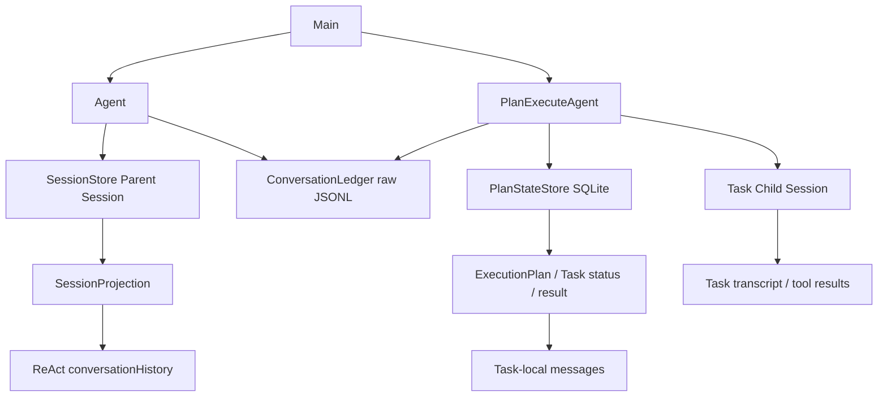
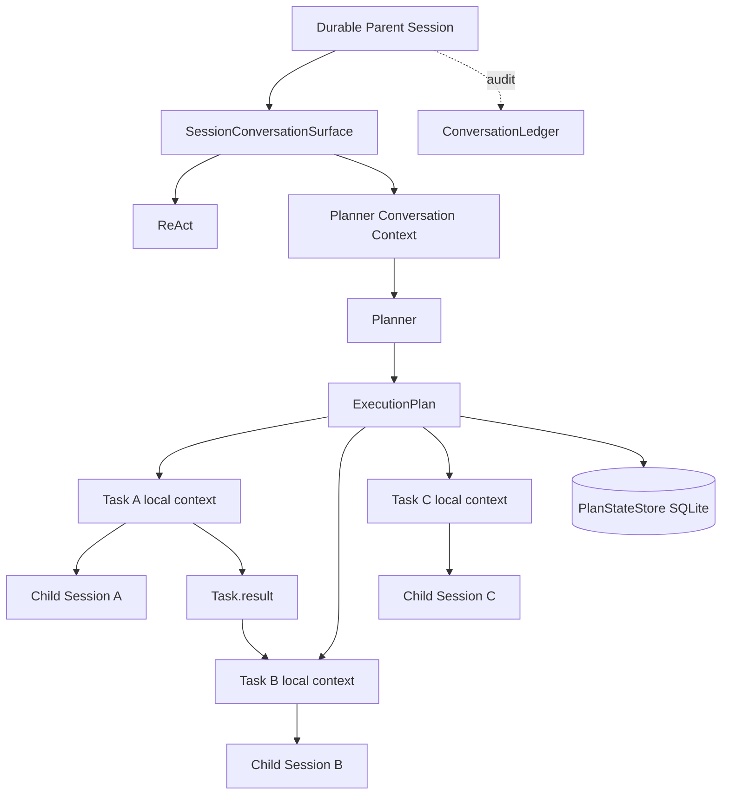
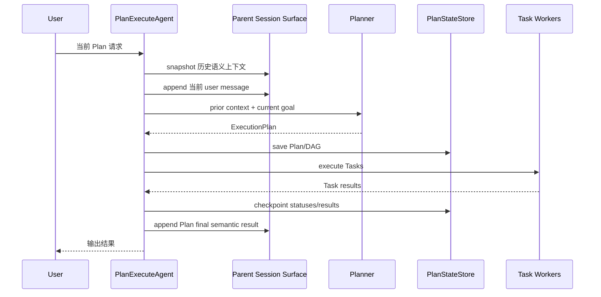

# Plan 模式会话上下文统一与恢复重构方案

> 状态：设计阶段，尚未实现  
> 适用范围：CLI/TUI `/plan` 主路径、ReAct 与 Plan 跨模式会话上下文、Plan 恢复  
> 不涉及：Task 级 exactly-once、Plan SQLite schema 迁移、长期记忆策略变更

## 1. 背景、目标与非目标

### 1.1 背景

当前 CodeAgent 已具备两套成熟但职责不同的恢复机制：

- ReAct 通过持久化 `SessionStore` 恢复 `conversationHistory`，支持 append-only `events.jsonl`、`SessionProjection` 和 checkpoint。
- Plan-and-Execute 通过 `PlanStateStore` 的 SQLite 状态恢复 DAG、Task 状态、依赖和 `Task.result`，中断的 Task 从 Task 边界重新执行。

两套机制分别解决了“对话恢复”和“工作流恢复”，但当前 Plan 顶层缺少与 ReAct 对齐的 Session 级多轮会话连续性。

当前 `PlanExecuteAgent.run()` 只把顶层用户输入和最终结果写入 `ConversationLedger`：

```java
conversationLedger.appendMessage(
        "plan", "plan-agent", "user_input",
        LlmClient.Message.user(userInput));
```

之后直接：

```java
ExecutionPlan plan = planner.createPlan(goal);
```

而 `Planner.createPlan()` 每次重新构造：

```java
List<LlmClient.Message> messages = Arrays.asList(
        LlmClient.Message.system(...),
        LlmClient.Message.user("请为以下任务制定执行计划：\n" + goal)
);
```

因此 Planner 当前不能利用同一 Session 中此前的 ReAct/Plan 用户语义上下文。

例如：

```text
User: 帮我重构认证模块
Plan: 已完成 JWT 和缓存层重构

User: 把刚才重构里的缓存逻辑再优化一下
```

第二轮 Planner 实际只能看到：

```text
把刚才重构里的缓存逻辑再优化一下
```

无法可靠解析“刚才重构里的缓存逻辑”。

同时，Plan 的 Task child Session 虽然保存完整执行 transcript，但 `/plan resume` 当前不会 replay child Session 给 Worker，而是从 SQLite 恢复 DAG 后重新创建 Task-local `messages`。这一行为符合 Task 边界恢复设计，不应因本次重构而改变。

### 1.2 目标

本次重构目标是建立统一的 **Session-level conversational memory + mode-level execution isolation**：

```text
Session 级：
User ↔ ReAct ↔ Plan 的顶层语义上下文连续

执行级：
ReAct tool loop 与 Plan Task context 继续独立
```

具体目标：

1. ReAct 与 Plan 共享同一个父 Session 的顶层有效对话，使跨模式引用“刚才”“之前那个方案”“上一轮修改”等能够被后续模式理解。
2. Plan 顶层用户输入和 Plan 最终语义结果进入父 Session 的 durable active surface，而不只写入 raw `ConversationLedger`。
3. Planner 在创建新 Plan 时可以读取受控的历史语义上下文，而不是永远只看到当前 `goal`。
4. Plan Task 仍保持独立的 task-local `messages` 和 child Session，不继承完整父会话或其他 Task transcript。
5. `/plan resume` 仍以 SQLite DAG 状态为工作流恢复 source of truth；已完成 Task 的 `result` 恢复后继续作为依赖 handoff。
6. 保持当前安全边界：历史上下文只用于理解语义，不能扩大当前 Turn 的工具、URL、路径或浏览器权限。
7. 尽量复用已有 Session/Event/Checkpoint/Compaction 基础设施，不引入第三套会话持久化格式。

### 1.3 非目标

本次不实现以下能力：

- 不把中断 Task 的旧 child Session transcript replay 给新 Worker。
- 不实现 tool-call 级 exactly-once recovery。
- 不改变“中断 Task 从 Task 边界重新执行”的语义。
- 不把所有前序 Task 完整 transcript 注入后继 Task。
- 不改变 `plans.db` 的 Plan/Task schema。
- 不自动恢复或执行 active Plan；仍要求显式 `/plan resume`。
- 不允许历史消息、长期记忆或前序 Plan 自动授予工具权限。
- 不修改长期记忆 `/save` 的写入策略。
- 不新增 CLI 命令。

## 2. 现状分析（源码证据、已知约束）

### 2.1 架构位置

当前关键关系如下：



源码现状：

**`Agent.java`**

ReAct 自身维护：

```java
private final List<LlmClient.Message> conversationHistory;
private SessionStore.SessionHandle sessionHandle;
```

`attachSession()` 会从：

```java
next.projection().messages()
```

恢复真实发送视图，因此普通 ReAct 已经具备 Session 级 transcript recovery。

**`Main.createPlanAgent()`**

Plan 当前已经复用了 ReAct 的：

- `ToolRegistry`
- `MemoryManager`
- `ConversationLedger`
- Parent `SessionHandle`

但没有复用 ReAct 的顶层 `conversationHistory`。

**`PlanExecuteAgent.java`**

顶层 `run()` 只向 `ConversationLedger` 记录 Plan 用户输入和结果；父 `SessionStore.activeSurface` 没有相应 Plan 顶层 turn。

**`Planner.java`**

每次 `createPlan(goal)` 使用一份新的局部 messages：

```text
Planner System
+
Current Goal
```

没有历史 Session context。

**Task Worker**

`executeTaskWithPolicy()` 每次均执行：

```java
List<LlmClient.Message> messages = new ArrayList<>();
```

因此 Task attempt 天然隔离。

**Task Child Session**

`appendTaskMessage()` 同时调用：

```java
persistChildMessage(...)
```

因此 Task 的 Assistant/Tool transcript 会 durable 保存，但这些消息当前不会在 `/plan resume` 时重新装入 Worker messages。

### 2.2 数据/状态模型

当前存在四种不同数据，应继续保持职责分离。

#### Parent Session active surface

来源：

```text
SessionStore
→ events.jsonl
→ SessionProjection.activeSurface
```

作用：

```text
当前真正可恢复、可重新发送给模型的 Session 级上下文
```

普通 ReAct 已使用该模型。

#### ConversationLedger

独立 append-only raw JSONL。

作用：

```text
审计 / 调试 / 完整 reasoning 与消息记录
```

它不是 durable conversational state 的 source of truth，本次不得把 Planner 恢复依赖反向建立在 raw ledger 上。

#### PlanStateStore

SQLite：

```text
plan_runs
plan_tasks
```

保存：

```text
Plan goal
status
Task description
dependencies
resource claims
result
error
...
```

`restoreTaskState()` 已明确：

```java
case COMPLETED -> task.markCompleted(result);
```

因此 COMPLETED Task 的语义结果当前已经能够恢复。

#### Task Child Session

每个 Task：

```java
parentSession.createChild("plan", "task:" + task.getId())
```

保存 Task 完整执行轨迹。

它是 durable execution/audit history，但当前不是 Task restart context。

### 2.3 核心时序与失败路径

当前 Plan 新任务：

```text
User
 ↓
PlanExecuteAgent.run(goal)
 ↓
ConversationLedger append user
 ↓
Planner.createPlan(goal)
 ↓
DAG
 ↓
Task-local messages
 ↓
Task Child Session
```

这里缺少：

```text
Parent Session
 ↓
历史顶层用户/助手语义
 ↓
Planner
```

当前 Plan 恢复：

```text
/plan resume
 ↓
workspace + session_id
 ↓
PlanStateStore.findActive()
 ↓
恢复 DAG
 ↓
COMPLETED → 保留 result
RUNNING/REVIEWING → INTERRUPTED
 ↓
跳过 Completed
 ↓
Interrupted Task 创建新的 messages
 ↓
Goal
+ Task description
+ Completed dependency results
+ recovery feedback
+ long-term memory
 ↓
重新执行
```

该恢复方式本身正确，本次不修改。

真正存在的信息损失边界是：

```text
Task 完整 transcript
        ↓
Task.result
        ↓
后继 Task
```

即 Task 间采用 semantic handoff，而非 full-transcript handoff。

本次仅保证 `Task.result` 在恢复后的依赖链继续正确注入，不扩大到 transcript replay。

## 3. 方案设计

总体原则：

> **统一 Session 级用户对话，隔离执行级上下文。**

目标架构：



核心边界：

```text
Parent Session
= 用户可感知的跨模式连续对话

PlanStateStore
= 工作流状态

Task messages
= 当前 Task attempt working context

Task Child Session
= Task durable execution transcript
```

### 3.1 接口与数据结构

#### 3.1.1 抽取 `SessionConversationSurface`

建议新增：

```text
src/main/java/com/codeagent/history/SessionConversationSurface.java
```

职责是统一管理 Parent Session 的 model-visible active surface，不负责 Plan DAG，也不负责 raw audit ledger。

建议接口概念：

```java
final class SessionConversationSurface {

    List<LlmClient.Message> snapshot();

    long historyVersion();

    void attach(SessionStore.SessionHandle handle,
                Supplier<LlmClient.Message> initialSystem);

    void append(
            LlmClient.Message message,
            String mode,
            String actor,
            String source);

    void replaceMessage(...);

    void commitCompaction(...);

    void clearAndSeed(...);

    void synchronizeFromProjection();

    SessionStore.SessionHandle sessionHandle();
}
```

该组件封装目前散落在 `Agent` 中的：

```text
conversationHistory.add/set/clear
SessionHandle.append
projection.messages()
historyVersion
compaction replace
```

`ConversationLedger` 不放入该类，避免将 raw audit 与 durable sending surface 耦合。

#### 3.1.2 Agent 改为使用共享 surface

当前：

```java
private final List<LlmClient.Message> conversationHistory;
```

重构后由：

```text
SessionConversationSurface
```

作为唯一 Parent conversation mutable owner。

Agent 调 LLM 时读取：

```text
surface snapshot / live view
```

用户消息、tool result、assistant response、图片裁剪、`/clear`、compaction 等操作统一经 surface 修改。

这一阶段首先要求做到 **行为不变**，再接 Plan，避免一次提交同时修改两类语义。

#### 3.1.3 Main 将同一 surface 注入 PlanExecuteAgent

当前 Main 已共享：

```text
ToolRegistry
MemoryManager
ConversationLedger
SessionHandle
```

新增共享：

```text
SessionConversationSurface
```

因此：

```text
ReAct Agent
PlanExecuteAgent
```

在同一个 CLI Session 内看到同一 Parent active surface，不再维护两个会发生漂移的副本。

`PlanExecuteAgent` 仍可保留 `parentSession` 用于：

```text
session_id
createChild()
recordChildResult()
```

但顶层 conversational state 必须走 shared surface。

#### 3.1.4 新增 Planner 语义上下文构造器

建议新增：

```text
src/main/java/com/codeagent/plan/PlannerConversationContextBuilder.java
```

输入：

```text
Parent Session active surface
```

输出：

```text
Planner 可消费的历史语义 messages
```

过滤规则：

1. 排除 Parent system message，Planner 使用自己的 system prompt。
2. 排除 `tool` message。
3. 排除带 `toolCalls` 的 assistant 中间消息。
4. 保留普通 user message。
5. 保留最终普通 assistant message。
6. 保留已经由 Session compaction 生成的 summary/ack，因为它们本身已经位于 active surface。
7. 保持原顺序，不重新总结、不修改 Parent Session。

因此：

```text
ReAct:
User
Assistant tool-call
Tool
Assistant tool-call
Tool
Final Assistant
```

给 Planner 的历史只保留：

```text
User
Final Assistant
```

而：

```text
Plan User
Plan Final Result
```

也会进入同一语义历史。

首版不从 `ConversationLedger` 重建 Planner context，避免把审计存储变成运行时 source of truth。

#### 3.1.5 Planner API 从 goal 升级为 request

当前：

```java
createPlan(String goal)
```

建议增加：

```java
record PlannerRequest(
        String goal,
        List<LlmClient.Message> conversationContext) {}
```

并提供：

```java
createPlan(PlannerRequest request)
```

Planner messages：

```text
Planner System Prompt

[此前语义 conversation context]

Current User Goal
```

当前 Goal 必须始终是最后一条 user message。

`ExecutionPlan.goal` 仍保存当前顶层目标，不把完整聊天历史序列化进 SQLite。

#### 3.1.6 修正 simple-goal shortcut

当前 `Planner.isSimpleGoal()` 对部分短请求直接创建 minimal plan，不调用 LLM。

加入多轮上下文后：

```text
查看刚才那个文件
```

可能被误判为 simple goal，却需要历史解析。

因此增加 context-dependent 判断，例如：

```text
刚才
之前
上一个
那个
上述
继续
它
刚刚
前面
```

只有：

```text
isSimpleGoal(goal)
&& !requiresConversationResolution(goal)
```

才允许跳过 Planner LLM。

例如：

```text
列出当前目录文件
```

仍走 minimal plan。

而：

```text
查看刚才那个文件
```

必须走带历史上下文的 Planner。

该规则必须有单测，不能仅依赖 prompt。

#### 3.1.7 Plan 顶层 Turn 写入 Parent Session

新 Plan run 的时序调整为：



必须先取得“历史快照”，再 append 当前 user，以避免 Planner context 中当前请求出现两次。

顶层 Parent Session 只写：

```text
User Plan request
Assistant Plan final semantic result
```

不得写入：

```text
Planner JSON
Task tool logs
Reviewer transcript
Task child transcript
```

后者继续只进入 raw ledger / child Session。

#### 3.1.8 Plan final result 与终端展示解耦

跨轮记忆需要一份稳定的语义结果，即使终端任务输出采用 streaming。

因此明确：

```text
display output
≠
conversation semantic result
```

Plan 执行结束后应始终得到非空的顶层语义结果：

```text
✅ 计划执行完成
+ 关键 leaf Task result
```

即使部分 Task 内容此前已经 stream 到终端，也必须为 Parent Session 保存一份紧凑结果。

避免出现：

```text
用户请求已进入 Parent Session
但因为 streamedOutput 导致没有 Assistant 结果
```

留下长期悬空 turn。

### 3.2 策略、安全、并发与恢复

#### 3.2.1 历史只提供语义，不提供授权

必须保持：

```java
TurnToolPolicy.fromUserInput(submittedUserInput, ...)
```

其输入仍然只来自当前顶层用户原始提交。

禁止：

```text
历史 conversation
长期记忆
旧 Plan result
旧 browser/tool call
```

参与当前 Turn 权限推导。

例如历史里即使存在：

```text
“以后都允许访问 example.com”
```

也不得自动变成当前 URL authority。

Planner conversation context 与：

```text
TurnToolPolicy
TrustedUrlContext
HITL
PathGuard
CommandGuard
```

之间必须保持单向隔离。

#### 3.2.2 Task context 不继承 Parent transcript

Task 仍执行：

```java
List<LlmClient.Message> messages = new ArrayList<>();
```

Task briefing 继续只包含：

```text
Plan goal
Task description
completed direct dependency results
trusted dependency URLs（仅当前运行允许的规则）
retry/recovery feedback
CODEAGENT.md
long-term memory
skill/external context
```

不得改成：

```text
Parent Session full history
+
Task messages
```

这样可避免长 Session 被复制到每个并行 Task。

#### 3.2.3 Task recovery 保持 Task-boundary

`PlanStateStore` 当前逻辑保持：

```text
PENDING → PENDING
COMPLETED → COMPLETED + result
RUNNING/REVIEWING → INTERRUPTED
```

中断 Task：

```text
new task-local messages
+
recovery feedback
+
current workspace inspection
```

不 replay 旧 child Session transcript。

#### 3.2.4 Completed dependency result 必须显式验证

当前代码已执行：

```java
case COMPLETED -> task.markCompleted(result);
```

并且：

```java
buildStepBriefing(...)
```

会读取 completed direct dependencies。

本次补充恢复测试，明确验证：

```text
SQLite 中 old-result
↓
restore Task
↓
下游 Task briefing 中仍存在 old-result
```

防止未来重构误伤依赖 handoff。

#### 3.2.5 并发

Parent Session 顶层 surface 只由中央 Plan run 线程写入：

```text
Plan user
Plan final assistant
```

并行 Task 不写 Parent surface，只写各自 child Session。

因此保持：

```text
Parent conversation：串行

Task child sessions：最多 4 Task 并行、彼此隔离
```

避免多个 Task 并发 append 到同一顶层 conversation。

#### 3.2.6 Compaction

Parent Session 继续沿用现有 Session/ReAct compaction 语义。

Plan 顶层 turn 成为 Parent active surface 的普通：

```text
user / assistant
```

消息后，自然参与后续 Session 压缩和 checkpoint。

Task-local `messages` 的现有 `AutoCompactionManager` 不变。

需要明确区分：

```text
Parent Session compaction
= 跨 ReAct/Plan 顶层 conversational memory

Task compaction
= 当前 Task attempt 的 Context Window 管理
```

二者不能互相 replay。

### 3.3 兼容性、迁移与回滚

#### 数据格式

首版不新增 Plan SQLite 字段。

Parent Plan turn 使用 SessionStore 已存在的：

```text
USER_MESSAGE
ASSISTANT_MESSAGE
SurfaceOperation.append()
```

因此：

```text
events.jsonl schema
checkpoint projection schema
plans.db schema
```

均无需迁移。

#### 旧 Session

升级前的 Session 没有 Plan 顶层 messages。

升级后：

```text
旧 ReAct history
+
新版本开始后的 Plan top-level turns
```

可以正常共存。

不会尝试从旧 ConversationLedger 反推历史 Plan turn。

#### 旧 active Plan

升级前已经存在于 SQLite 的 active Plan：

```text
/plan resume
```

仍按原有：

```text
workspace + session_id
```

恢复。

不要求 Parent Session 中必须存在对应 Plan user turn。

#### 回滚

由于只使用现有 Session message event：

```text
user/message
assistant/message
append
```

旧版本 `SessionReplayer` 仍能读取。

回滚后旧 ReAct 会把已经写入 Parent Session 的 Plan 顶层 turn 当普通历史消息处理，行为可接受。

因此该设计具备较好的向后格式兼容性。

## 4. 实现任务与测试矩阵

建议分三阶段完成，避免同时修改会话持久化与 Planner 行为。

### Phase A：抽取共享 Parent conversation surface，不改变现有行为

实现：

- 新增 `SessionConversationSurface`。
- 将 `Agent` 的 Session surface append/replace/clear/compaction commit 逐步迁入共享组件。
- 保持 ReAct provider 输入、Session JSONL 和恢复结果完全一致。
- Main 将同一个 surface 实例提供给 `PlanExecuteAgent`。

重点测试：

```text
AgentSessionResumeTest
SessionStoreTest
SessionReplayerTest
SessionCheckpointStoreTest
SessionCompactionRecoveryTest
ConversationHistoryCompactorTest
MainPlanAgentFactoryTest
```

验收：

```text
ReAct 行为零变化
现有 session 可恢复
compaction 可恢复
Main 中 ReAct/Plan 持有同一 parent surface
```

### Phase B：Plan 顶层 Turn 进入 Parent Session

实现：

- `PlanExecuteAgent.run()` 在开始时 append Plan user。
- 成功、失败、active-plan reject 等用户可见终态 append semantic assistant result。
- `/plan resume` 不记录 `/plan resume` 为新的用户目标；恢复完成后写入恢复后的 Plan semantic result。
- Task child transcript 继续隔离。

重点测试：

```text
PlanExecuteAgentTest
PlanExecuteRecoveryTest
MainPlanAgentFactoryTest
AgentSessionResumeTest
```

新增场景：

```text
Plan run 完成
→ Parent Session 含 User + Assistant

随后切 ReAct
→ ReAct history 中可看到 Plan turn

进程重启
→ attachSession 后仍存在 Plan turn
```

### Phase C：Planner 消费历史语义 context

实现：

- 新增 `PlannerConversationContextBuilder`。
- 新增 `PlannerRequest`。
- Planner 使用 prior semantic context + current goal。
- 修正 simple-goal shortcut 的 anaphora/context-dependent 判断。
- replan 同样可以获得当前 Parent semantic context，但不改变 Plan identity。

重点测试：

```text
PlannerTest
PlanExecuteAgentTest
PlanExecuteRecoveryTest
TurnToolPolicyTest
```

新增场景：

```text
历史：
User: 重构认证模块
Assistant: 已修改 TokenCache

当前：
“把刚才那个缓存再优化一下”

Planner request
→ 包含历史 TokenCache
→ current goal 仍是最后一条 user
```

权限回归：

```text
历史包含 URL / 写文件授权语言
当前输入不包含授权
→ TurnToolPolicy 不继承历史权限
```

### 推荐针对性测试命令

```bash
mvn test \
  -Dtest=MainPlanAgentFactoryTest,PlannerTest,PlanExecuteAgentTest,PlanExecuteRecoveryTest,AgentSessionResumeTest,SessionStoreTest,SessionReplayerTest,SessionCheckpointStoreTest,SessionCompactionRecoveryTest,ConversationHistoryCompactorTest,TurnToolPolicyTest \
  -DskipTests=false
```

常规回归：

```bash
mvn test -Pquick
```

由于本次修改触及 Session、Plan、Context 三个核心边界，完成后应再执行：

```bash
mvn test -DskipTests=false
mvn clean package
git diff --check
```

## 5. 验收清单

- [ ] ReAct 与 Plan 使用同一 Parent `SessionConversationSurface`。
- [ ] Plan 顶层用户请求和最终语义结果进入 Parent Session active surface。
- [ ] Plan Task tool/result transcript 不进入 Parent surface。
- [ ] Planner 可以读取同一 Session 中此前 ReAct 和 Plan 的语义历史。
- [ ] Planner 不直接消费完整 tool transcript。
- [ ] “刚才 / 上一个 / 那个 / 继续”等上下文依赖请求不会被 simple-goal shortcut 错误绕过历史解析。
- [ ] Plan 完成后切回 ReAct，可以理解此前 Plan 的用户请求和最终结果。
- [ ] ReAct 完成后切 Plan，Planner 可以利用此前 ReAct 顶层语义。
- [ ] 重启 Session 后跨模式历史仍能恢复。
- [ ] `/plan resume` 仍按 `workspace + session_id` 恢复 DAG，不重新 Planner。
- [ ] COMPLETED Task 不重新执行。
- [ ] COMPLETED Task 的 `result` 从 SQLite 恢复并重新进入下游 Task briefing。
- [ ] INTERRUPTED Task 仍创建全新的 task-local `messages`。
- [ ] Interrupted Task 不 replay 旧 child Session transcript。
- [ ] 历史 conversation 不参与 `TurnToolPolicy` 权限计算。
- [ ] 历史 URL 不自动成为当前 Turn trusted URL。
- [ ] Plan SQLite schema 无变化。
- [ ] Session JSONL/checkpoint 格式保持兼容。
- [ ] raw `ConversationLedger` 继续只承担审计职责，不变成运行时恢复 source of truth。
- [ ] 针对性测试通过。
- [ ] `mvn test -Pquick` 通过。
- [ ] 全量测试通过。
- [ ] `mvn clean package` 通过。
- [ ] `git diff --check` 通过。
- [ ] 实现完成后同步 `AGENTS.md`、`docs/agents-reference.md` 和必要的 README 行为说明。

## 设计结论

本次重构不应简单地“给 `PlanExecuteAgent` 再加一个 `conversationHistory`”。

正确边界是：

```text
Session-level conversational memory
              │
      ReAct / Plan 共享
              │
      用户语义连续性
              │
        ┌─────┴─────┐
        │           │
      ReAct        Plan DAG
                    │
             Task-local context
                    │
              Child Session
```

即：

> **用户层共享，执行层隔离；Parent Session 负责跨模式语义连续性，PlanStateStore 负责 DAG 工作流恢复，Child Session 负责 Task 执行审计，Task.result 负责依赖节点之间的语义 handoff。**

这样可以解决当前 Plan 多轮上下文缺口，同时不破坏已有 Task 边界恢复、并行隔离、权限模型和 Session 持久化结构。
