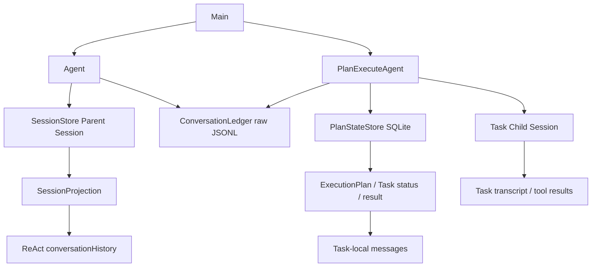
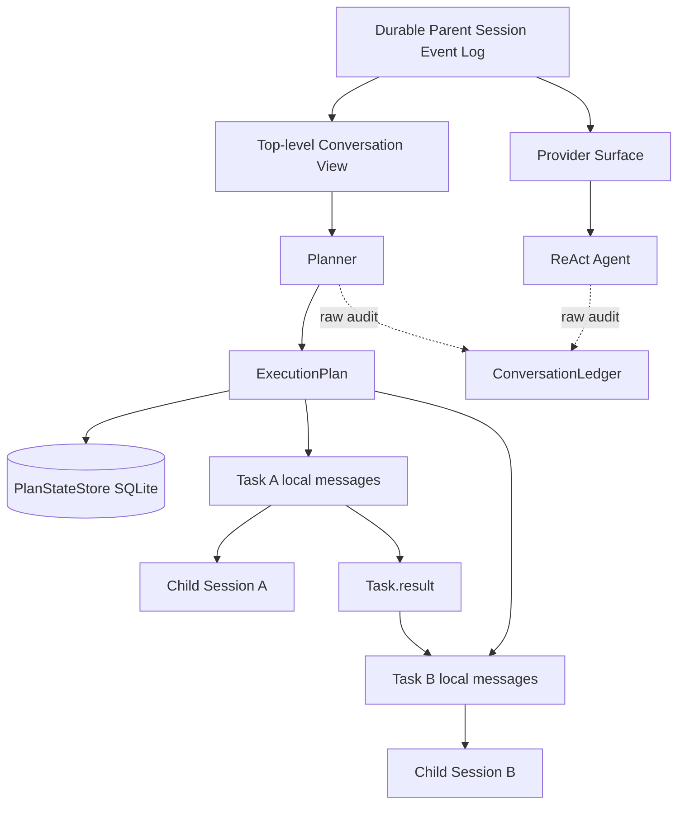

# Plan 模式会话上下文统一与恢复重构方案

> 状态：已实现，最终验证中
> 适用范围：CLI/TUI `/plan` 主路径、ReAct 与 Plan 跨模式会话上下文、Plan 恢复
> 不涉及：Task 级 exactly-once、Plan SQLite schema 迁移、长期记忆策略变更

## 1. 背景、目标与非目标

### 1.1 背景

当前 CodeAgent 已具备两套成熟但职责不同的恢复机制：

- ReAct 通过持久化 `SessionStore` 恢复 `conversationHistory`，支持 append-only `events.jsonl`、`SessionProjection` 和 checkpoint。
- Plan-and-Execute 通过 `PlanStateStore` 的 SQLite 状态恢复 DAG、Task 状态、依赖和 `Task.result`，中断的 Task 从 Task 边界重新执行。

两套机制分别解决了“对话恢复”和“工作流恢复”，但当前 Plan 顶层缺少与 ReAct 对齐的 Session 级多轮会话连续性。

当前 `PlanExecuteAgent.run()` 只把顶层用户输入和最终结果写入 `ConversationLedger`：

```java
conversationLedger.appendMessage(
        "plan", "plan-agent", "user_input",
        LlmClient.Message.user(userInput));
```

之后直接：

```java
ExecutionPlan plan = planner.createPlan(goal);
```

而 `Planner.createPlan()` 每次重新构造：

```java
List<LlmClient.Message> messages = Arrays.asList(
        LlmClient.Message.system(...),
        LlmClient.Message.user("请为以下任务制定执行计划：\n" + goal)
);
```

因此 Planner 当前不能利用同一 Session 中此前的 ReAct/Plan 用户语义上下文。

例如：

```text
User: 帮我重构认证模块
Plan: 已完成 JWT 和缓存层重构

User: 把刚才重构里的缓存逻辑再优化一下
```

第二轮 Planner 实际只能看到：

```text
把刚才重构里的缓存逻辑再优化一下
```

无法可靠解析“刚才重构里的缓存逻辑”。

同时，Plan 的 Task child Session 虽然保存完整执行 transcript，但 `/plan resume` 当前不会 replay child Session 给 Worker，而是从 SQLite 恢复 DAG 后重新创建 Task-local `messages`。这一行为符合 Task 边界恢复设计，不应因本次重构而改变。

### 1.2 目标

本次重构目标是建立统一的 **Session-level conversational memory + mode-level execution isolation**：

```text
Session 级：
User ↔ ReAct ↔ Plan 的顶层语义上下文连续

执行级：
ReAct tool loop 与 Plan Task context 继续独立
```

具体目标：

1. ReAct 与 Plan 共享同一个 Parent Session 中的 **Top-level Conversation View**，使跨模式引用“刚才”“之前那个方案”“上一轮修改”等能够被后续模式理解；该语义视图与 ReAct 的 Provider Surface 明确分离。
2. Plan 顶层用户输入和 Plan 最终语义结果写入 Parent Session 的 append-only Event Log，并同时进入 Provider Surface 与 Top-level Conversation View；不再只写 raw `ConversationLedger`。
3. Planner 只读取 Top-level Conversation View，不读取完整 Provider Surface，也不通过 role 过滤猜测“哪些消息是用户语义”。
4. Plan Task 仍保持独立的 task-local `messages` 和 child Session，不继承完整父会话或其他 Task transcript。
5. `/plan resume` 仍以 SQLite DAG 状态为工作流恢复 source of truth；已完成 Task 的 `result` 恢复后继续作为依赖 handoff。
6. 保持当前安全边界：历史上下文只用于理解语义，不能扩大当前 Turn 的工具、URL、路径或浏览器权限。
7. 尽量复用已有 Session/Event/Checkpoint/Compaction 基础设施，不引入第三套会话持久化格式。

### 1.3 非目标

本次不实现以下能力：

- 不把中断 Task 的旧 child Session transcript replay 给新 Worker。
- 不实现 tool-call 级 exactly-once recovery。
- 不改变“中断 Task 从 Task 边界重新执行”的语义。
- 不把所有前序 Task 完整 transcript 注入后继 Task。
- 不改变 `plans.db` 的 Plan/Task schema。
- 不自动恢复或执行 active Plan；仍要求显式 `/plan resume`。
- 不允许历史消息、长期记忆或前序 Plan 自动授予工具权限。
- 不修改长期记忆 `/save` 的写入策略。
- 不新增 CLI 命令。

## 2. 现状分析（源码证据、已知约束）

### 2.1 架构位置

当前关键关系如下：



源码现状：

**`Agent.java`**

ReAct 自身维护：

```java
private final List<LlmClient.Message> conversationHistory;
private SessionStore.SessionHandle sessionHandle;
```

`attachSession()` 会从：

```java
next.projection().messages()
```

恢复真实发送视图，因此普通 ReAct 已经具备 Session 级 transcript recovery。

**`Main.createPlanAgent()`**

Plan 当前已经复用了 ReAct 的：

- `ToolRegistry`
- `MemoryManager`
- `ConversationLedger`
- Parent `SessionHandle`

但没有复用 ReAct 的顶层 `conversationHistory`。

**`PlanExecuteAgent.java`**

顶层 `run()` 只向 `ConversationLedger` 记录 Plan 用户输入和结果；父 `SessionStore.activeSurface` 没有相应 Plan 顶层 turn。

**`Planner.java`**

每次 `createPlan(goal)` 使用一份新的局部 messages：

```text
Planner System
+
Current Goal
```

没有历史 Session context。

**Task Worker**

`executeTaskWithPolicy()` 每次均执行：

```java
List<LlmClient.Message> messages = new ArrayList<>();
```

因此 Task attempt 天然隔离。

**Task Child Session**

`appendTaskMessage()` 同时调用：

```java
persistChildMessage(...)
```

因此 Task 的 Assistant/Tool transcript 会 durable 保存，但这些消息当前不会在 `/plan resume` 时重新装入 Worker messages。

### 2.2 数据/状态模型

当前存在四种不同数据，应继续保持职责分离。

#### Parent Session active surface

来源：

```text
SessionStore
→ events.jsonl
→ SessionProjection.activeSurface
```

作用：

```text
当前真正可恢复、可重新发送给模型的 Session 级上下文
```

普通 ReAct 已使用该模型。

#### ConversationLedger

独立 append-only raw JSONL。

作用：

```text
审计 / 调试 / 完整 reasoning 与消息记录
```

它不是 durable conversational state 的 source of truth，本次不得把 Planner 恢复依赖反向建立在 raw ledger 上。

#### PlanStateStore

SQLite：

```text
plan_runs
plan_tasks
```

保存：

```text
Plan goal
status
Task description
dependencies
resource claims
result
error
...
```

`restoreTaskState()` 已明确：

```java
case COMPLETED -> task.markCompleted(result);
```

因此 COMPLETED Task 的语义结果当前已经能够恢复。

#### Task Child Session

每个 Task：

```java
parentSession.createChild("plan", "task:" + task.getId())
```

保存 Task 完整执行轨迹。

它是 durable execution/audit history，但当前不是 Task restart context。

### 2.3 核心时序与失败路径

当前 Plan 新任务：

```text
User
 ↓
PlanExecuteAgent.run(goal)
 ↓
ConversationLedger append user
 ↓
Planner.createPlan(goal)
 ↓
DAG
 ↓
Task-local messages
 ↓
Task Child Session
```

这里缺少：

```text
Parent Session
 ↓
历史顶层用户/助手语义
 ↓
Planner
```

当前 Plan 恢复：

```text
/plan resume
 ↓
workspace + session_id
 ↓
PlanStateStore.findActive()
 ↓
恢复 DAG
 ↓
COMPLETED → 保留 result
RUNNING/REVIEWING → INTERRUPTED
 ↓
跳过 Completed
 ↓
Interrupted Task 创建新的 messages
 ↓
Goal
+ Task description
+ Completed dependency results
+ recovery feedback
+ long-term memory
 ↓
重新执行
```

该恢复方式本身正确，本次不修改。

真正存在的信息损失边界是：

```text
Task 完整 transcript
        ↓
Task.result
        ↓
后继 Task
```

即 Task 间采用 semantic handoff，而非 full-transcript handoff。

本次仅保证 `Task.result` 在恢复后的依赖链继续正确注入，不扩大到 transcript replay。

## 3. 目标架构与核心不变量

本次重构不再把 Parent Session 的 `activeSurface` 等同于“用户语义对话”。最终明确维护四层状态：

```text
1. Provider Surface
   = ReAct 真正发送给模型并可恢复的 provider-facing context

2. Top-level Conversation View
   = User ↔ Assistant 的跨 ReAct / Plan 顶层语义历史

3. Plan Workflow State
   = SQLite 中的 Plan / DAG / Task / status / result

4. Task Child Session
   = 单个 Task 的 durable execution transcript
```

核心不变量：

- Provider Surface 是 ReAct provider request 的 durable source of truth。
- Top-level Conversation View 是 Planner 多轮语义上下文的唯一 source of truth。
- Planner 不读取 Tool Result、synthetic user、Skill body、长期记忆注入或 Reviewer/Task transcript。
- PlanStateStore 仍是 workflow recovery 的 source of truth。
- Task Child Session 仍只承担 Task 执行审计；中断恢复不 replay child transcript。
- 当前 Turn 的 authority 仍只来自当前 `submittedUserInput`。

目标结构：



---

## 4. Session Event 与双 Projection 设计

### 4.1 不新增第三套持久化文件

继续使用 Parent Session 现有的：

```text
events.jsonl
+
checkpoints/
```

不新建 `conversation.jsonl`，也不使用 `ConversationLedger` 反向恢复语义历史。

### 4.2 Message Event 增加可选 conversation 元数据

现有 `payload.message` 继续表示 provider-facing message。新增可选字段：

```json
{
  "message": { "...": "provider-facing LlmClient.Message" },
  "conversation": {
    "turnId": "turn-...",
    "planId": "plan-... or null",
    "mode": "react | plan",
    "role": "user | assistant",
    "content": "top-level semantic content"
  }
}
```

语义规则是确定的：

- 没有 `conversation`：只影响 Provider Surface。
- 有 `conversation`：除 Provider Surface 外，同时进入 Top-level Conversation View。

**ReAct User**：Provider message 保持现有 `Skill + userInput + long-term memory` 内容；`conversation.content` 必须保存用户实际提交的 `submittedUserInput`，不得带 Skill 或长期记忆。

**ReAct Final Assistant**：最终无 tool-call 的 committed assistant message 同时作为 conversation assistant；中间 tool-call assistant 不带 conversation 元数据。

**Plan User**：只有 Review 最终为 EXECUTE 且 Plan 已 durable 保存后才写入；语义内容使用最终 `submittedPolicyInput`，Review SUPPLEMENT 已合并在其中。

**Plan Final Assistant**：Provider message 与 conversation message 都使用确定性的 `conversationResult`。

Tool result、synthetic image user、Planner JSON、Reviewer transcript、Task child transcript 一律不带 conversation 元数据。

### 4.3 SessionProjection 增加 Top-level Conversation View

新增：

```java
record ConversationNode(
        long sequence,
        String turnId,
        String planId,
        String mode,
        LlmClient.Message message,
        ConversationKind kind) {}

enum ConversationKind { USER, ASSISTANT, SUMMARY }
```

`SessionProjection` 新增：

```java
List<ConversationNode> topLevelConversation
Map<String, OpenTurn> openTurns
```

`OpenTurn` 固定保存：

```java
record OpenTurn(
        String turnId,
        String rootPlanId,
        String activePlanId,
        List<String> planIds) {}
```

一个用户顶层 Plan turn 可以经历多个 execution replan，因此 **turnId 是用户会话轮次身份，planId 是工作流 attempt 身份，二者不是一一对应**。

并提供：

```java
List<LlmClient.Message> conversationMessages()
Optional<OpenTurn> openPlanTurn(String planId)
```

现有 `messages()` 仍只返回 `activeSurface`，保持 ReAct 行为不变。

### 4.4 使用现有 TURN_START / TURN_END 管理 Plan 顶层生命周期

不新增 required event type。Plan turn 固定为：

```text
TURN_START(surface=none, payload={turnId, planId, mode:"plan"})
USER_MESSAGE(surface=append, conversation=...)
...
ASSISTANT_MESSAGE(surface=append, conversation=...)
TURN_END(surface=none, payload={turnId, planId, status})
```

`SessionReplayer` 用 TURN_START/TURN_END 维护 `openTurns`。首次 TURN_START 创建 open turn；如果同一个 `turnId` 后续因 execution replan 绑定新的 planId，则允许追加另一个 TURN_START，payload 标记 `continuation=true`，只更新该 turn 的 `activePlanId/planIds`，**不新增第二条 semantic user message**。ReAct 首版无需强制补 TURN_START/TURN_END。

### 4.5 Checkpoint

Checkpoint 的 projection 新增：

```json
{
  "conversationProjectionVersion": 1,
  "topLevelConversation": [],
  "openTurns": []
}
```

**不提升 `SessionEvent.CURRENT_SCHEMA_VERSION`。** 新数据只是现有 event payload/checkpoint 的可选字段。

新版本加载 checkpoint 时：

- 有 `conversationProjectionVersion=1`：正常使用。
- 没有该字段：该 checkpoint 不足以证明 semantic projection 完整，丢弃 checkpoint 并从 event log 全量 replay。

这样即使经历“新版本 → 旧版本 → 新版本”，也不会因为旧版本重写 checkpoint 而丢掉 event log 中已经存在的 conversation metadata。

### 4.6 Legacy Session

升级前的事件没有 conversation metadata，无法可靠区分真实用户输入与 memory/skill-enhanced/synthetic user。

因此明确禁止基于 role/content 猜测回填：

> **Top-level Conversation View 只从新版本产生的显式 conversation metadata 构建。升级前历史仍保留在 Provider Surface 中，但不进入 Planner semantic history。**

---

## 5. ParentConversationContext：共享但只有一个可变所有者

新增：

```text
src/main/java/com/codeagent/history/ParentConversationContext.java
```

它不是简单共享一个 mutable `List<Message>`，而是 Parent provider context 的唯一 mutation coordinator。

职责固定为：

```text
稳定的 providerMessages list identity
SessionHandle
historyVersion
append / replace / clear
compaction commit
从 SessionProjection 同步
读取 Top-level Conversation View
Parent AutoCompactionManager 生命周期
```

概念接口：

```java
final class ParentConversationContext {
    List<LlmClient.Message> providerMessages();
    List<LlmClient.Message> conversationMessages();
    long historyVersion();
    long compactionGeneration();

    void appendProviderOnly(...);
    void appendTopLevel(...);
    void commitCompaction(...);
    void clearAndSeed(...);
    void synchronizeFromProjection();
    SessionStore.SessionHandle sessionHandle();
}
```

`Agent` 与 `PlanExecuteAgent` 必须持有 **同一个** ParentConversationContext 实例。

`Agent.getConversationHistory()` 为兼容测试/API，可返回 provider messages 的只读视图或快照；不再存在第二份可变 Parent history。

并行 Task 不得写 ParentConversationContext，只能写各自 child Session。

### 5.1 ContextTokenTracker 失效规则

普通 append 不强制 invalidate，现有 usage-anchor delta 仍可工作。

以下 Parent mutation 必须使 ReAct tracker 在下一次请求前失效：

```text
compactionGeneration 改变 -> COMPACTION
clear                       -> CLEAR
Session restore/switch      -> SESSION_RESTORED
provider/model change       -> PROVIDER_CHANGED
```

`Agent` 在构造 RequestSnapshot 前比较 ParentConversationContext 的 generation 与自己最后观察值。

Plan 估算 Planner request 时不得复用 ReAct measured usage anchor，只使用完整本地估算。

---

## 6. Planner Context 的确定规则

### 6.1 Planner 只读取 Top-level Conversation View

新增 `PlannerConversationContextBuilder`，输入 `SessionProjection.topLevelConversation`，不再对 Provider Surface 做 role-based 过滤。Builder 不直接返回 provider message 列表，而是确定性序列化成一个纯文本历史块：

```text
[历史会话上下文]
[User] ...
[Assistant] ...
[Summary] ...
```

只保留节点顺序和语义内容，不包含 turnId/planId 等内部字段。

### 6.2 Current goal 不得重复

新增：

```java
record PlannerRequest(
        String goal,
        String priorConversationContext) {}
```

Planner 最终仍只构造两条 provider message：

```text
System:
Planner system prompt

User:
<若非空，先放 priorConversationContext>

[当前任务]
<current goal>

请为当前任务制定执行计划。
```

current goal 在整个 Planner request 中只出现一次。Top-level SUMMARY 只作为 `[Summary]` 文本存在，不需要制造 synthetic assistant ack，也不存在连续 user-role 的 provider 兼容问题。

### 6.3 Simple Goal Shortcut

取消“刚才/那个/它”等关键词枚举。

确定规则：

```text
priorConversationContext 为空 AND isSimpleGoal(goal)
→ 允许 createMinimalPlan()

priorConversationContext 非空
→ 统一走 LLM Planner
```

这是有意用少量额外 planner 调用换取多轮语义正确性。

### 6.4 Review Supplement / Replan

初始 Planning 前保存已经序列化完成的不可变 `priorConversationContextSnapshot`。

- Plan Review SUPPLEMENT：继续使用同一 priorConversationContextSnapshot，只更新 goal/submittedPolicyInput。
- execution failure replan：继续使用同一 priorConversationContextSnapshot，显式加入 failure reason 与已完成结果；新 Plan 必须先通过 `savePlanDurably`，随后用同一 `turnId` 追加 continuation TURN_START，把 open turn 的 `activePlanId` rebind 到新 planId，不创建新的 user conversation node。
- 本次 Plan 自己的 top-level turn 不得重新作为历史注入本轮 replan。
- `/plan resume` 不重新 Planner，所以不需要恢复 prior snapshot。

---

## 7. Parent Context 的 Token Budget 与 Compaction

### 7.1 Parent 与 Task compaction 严格分离

```text
Parent compaction
= ReAct/Plan 跨模式 Session 上下文管理

Task compaction
= 单个 Task attempt 的 working context 管理
```

Task `AutoCompactionManager` 不参与 Parent Session 恢复。

### 7.2 Plan-only 会话也必须触发 Parent compaction

不能依赖“下次进入 ReAct 时再压缩”。每次 Planner LLM 请求前：

1. 通过 PlannerConversationContextBuilder 序列化当前 Top-level Conversation View，并估算 `Planner system + priorConversationContext + current goal`。
2. 若接近 Planner context profile 的 compression trigger，要求 ParentConversationContext 对 Provider Surface 执行 durable compaction。
3. compaction 完成后重新读取 Top-level Conversation View。
4. 重新估算 Planner request。
5. 若仍超过安全阈值，request-local fallback 只保留：最近一个 SUMMARY（若有）+ 最近 3 个完整 top-level user turns/assistant + current goal。

第 5 步不修改 durable Session，只用于保证当前 Planner 请求可发送。

### 7.3 Provider compaction 必须同步更新 Conversation View

`SessionReplayer.completeCompaction()` 在应用现有 replacement range 时，同时：

1. 删除 Top-level Conversation View 中 sequence 位于 replacement range 的节点。
2. 若该范围包含至少一个 conversation node，则插入一个 `ConversationKind.SUMMARY`。
3. SUMMARY 内容直接使用现有 compaction replacement summary message。
4. compaction ack assistant 不进入 Top-level Conversation View。

这样不维护第二套独立 summary LLM，同时保证 semantic history 随 durable compaction 收敛。

---

## 8. Plan 顶层 Turn：durable 时序与崩溃一致性

### 8.1 新 Plan 的固定时序

Plan user 不能在刚收到输入时就写 Parent semantic conversation。

固定顺序：

```text
1. 读取并冻结 priorConversationContextSnapshot
2. Planner.createPlan(prior + current goal)
3. HITL Plan Review / supplement
4. 用户最终选择 EXECUTE
5. savePlanDurably(plan, sessionId, final submittedPolicyInput)
6. 确认 Plan durable 写入 SQLite
7. TURN_START(planId, turnId)
8. USER_MESSAGE(top-level, final submittedPolicyInput)
9. executePlan(...)
10. ASSISTANT_MESSAGE(top-level, conversationResult)
11. TURN_END(planId, turnId, terminalStatus)
```

只有步骤 6 成功的 Plan 才进入 Top-level Conversation View。

这里的“成功”不是当前 `savePlanSafely()` 的 best-effort 语义。实现时必须新增严格的 initial persistence gate `savePlanDurably(...)`。SQLite 写入失败时抛错/返回失败，**不得调用 `executePlan()`，不得创建 TURN_START，也不得把该 Plan 当成可恢复工作流**。所有能够进入 `executePlan()` 的新 Plan 路径（包括 Review EXECUTE、空 supplement fallback、execution replan 后的新 Plan）都必须先通过这一 gate。

终态也采用同样原则：只有 terminal Plan 状态成功 checkpoint 到 SQLite 后，才允许写 top-level assistant + TURN_END；若 terminal checkpoint 失败，保持 turn open，向用户返回持久化失败，后续由 active Plan recovery/reconciliation 收敛，而不是把 Session 先标记成已完成。

Task checkpoint 仍保持现有 best-effort/Task-boundary recovery 语义，本次不提升为 exactly-once；因此 crash 后 reconciliation 只能基于已经成功持久化的 Task.result 构造结果，不得声称未落盘结果一定可恢复。

以下情况只写 CLI/raw ledger，不进入 semantic conversation：

- Planner 失败；
- Review CANCEL；
- 已有 active Plan 导致新请求被拒绝；
- SQLite save 失败。

### 8.2 为什么 SQLite 在前、Session turn 在后

SQLite 是 workflow source of truth。先写 user turn 再 save Plan 会制造“有 durable 对话、没有可恢复 Plan”的悬空状态，因此顺序固定为 PlanStateStore first。

### 8.3 两套存储不是同一事务：新增 PlanConversationReconciler

新增 `PlanConversationReconciler`，在以下时机运行：

- CLI attach/resume Parent Session 后；
- `/session switch` 后；
- 创建/使用 PlanExecuteAgent 前保证当前 Session 已 reconcile。

#### A. SQLite 有 active Plan，但没有对应 open Plan turn

表示可能 crash 在 SQLite save 后、TURN_START 前。

处理：

1. 读取 planId、policy_input、goal。
2. semantic user 优先用 `policy_input`，为空才 fallback goal。
3. append TURN_START + USER_MESSAGE。
4. **不自动执行 Plan**，仍等待显式 `/plan resume`。

#### B. Parent 有 open Plan turn，SQLite Plan 仍 active

正常中断状态。若 `openTurn.activePlanId == activePlan.id`，不修改；`/plan resume` 复用同一 turnId。

若二者不同，典型场景是 execution replan 的新 Plan 已保存但进程在 continuation TURN_START 前崩溃。由于当前设计保证同一 Session 同时只有一个 active Plan，reconciler 将该 open turn rebind 到唯一 active planId，并追加 `TURN_START(continuation=true)`；不新增 user message，不自动执行。

#### C. Parent 有 open Plan turn，且当前 Session 已没有 active Plan

表示可能 crash 在最终 active Plan 的 SQLite terminal checkpoint 后、assistant/TURN_END 前。不要仅看到 `rootPlanId` 已 FAILED 就关闭 turn，因为它可能已经 execution replan 到后续 planId。

处理：

1. 使用 `openTurn.activePlanId` 读取最终 terminal Plan/Task 状态；`activePlanId` 为空属于 projection 损坏，按 orphaned 路径处理，不再用 planIds 猜测。
2. `buildConversationResult(restoredPlan)`。
3. append top-level assistant。
4. TURN_END。
5. 不重跑任何 Task。

#### D. open Plan turn 对应 SQLite Plan 不存在

视为跨存储损坏/旧异常状态。关闭本轮：

```text
⚠️ 该计划的持久化工作流状态不可用，本轮已关闭，未自动重试。
```

并写 TURN_END(status=orphaned) + warning。禁止凭 transcript 推测并执行任务。

---

## 9. `/plan resume` 与 `/plan abandon`

### 9.1 `/plan resume`

`/plan resume` 是控制命令，不作为新的 top-level user goal。

```text
findActive(workspace, sessionId)
→ 恢复 DAG
→ COMPLETED 保留 result
→ RUNNING/REVIEWING -> INTERRUPTED
→ 找到/由 reconciler 创建 planId 对应 open turn
→ executePlan(restoredPlan)
→ append conversationResult + TURN_END
```

legacy active Plan 没有 turn 时，reconciler 用 `policy_input`/goal 创建 recovered turn。

### 9.2 `/plan abandon`

如果被 abandon 的 Plan 存在 open turn：

```text
append assistant: "✅ 已放弃当前 Session 的未完成 Plan。"
+
TURN_END(status=abandoned)
```

如果 legacy/inconsistent Plan 没有 turn，不为单纯 abandon 命令额外创建 synthetic user turn。

---

## 10. `displayResult` 与 `conversationResult` 分离

当前 `buildFinalResult(plan, streamedTaskOutputs)` 会跳过已经 stream 到终端的 Task result，因此不能直接作为 durable conversation result。

将 PlanRunOutcome 明确为：

```java
record PlanRunOutcome(
        String displayResult,
        String conversationResult,
        TerminalStatus status) {}
```

### 10.1 displayResult

保持当前 CLI/TUI 行为，继续沿用 `streamedTaskOutputs` 的过滤逻辑，避免已经流式输出的 Task result 再打印一次。

### 10.2 conversationResult

必须非空、确定性生成、不依赖 streaming、不额外调用 LLM。

COMPLETED 固定算法：

1. 按 execution order 找所有 leaf tasks。
2. 取其中所有非空 `Task.result`。
3. 拼成 `✅ 计划执行完成！` + `[task_id] result`。
4. 若 leaf 都无 result，取最后一个 COMPLETED 且 result 非空的 Task。
5. 再无结果时仅保存 `✅ 计划执行完成！`。

FAILED / UNVERIFIED / CANCELLED 使用当前确定性的状态、`Task.result`、error 生成；不读取 child transcript，不调用总结 LLM。

---

## 11. Task 恢复与依赖 Handoff 保持现状

COMPLETED Task 继续：

```java
case COMPLETED -> task.markCompleted(result);
```

下游 `StepBriefing` 继续注入 completed direct dependency results。

INTERRUPTED Task 继续创建全新的 task-local messages：

```text
Plan goal
+ Task description
+ completed dependency results
+ recovery feedback
+ CODEAGENT.md
+ long-term memory
```

旧 child Session transcript 不 replay。

Task 不读取 Parent full Provider Surface，也不直接读取 Top-level Conversation View；多轮语义在 Planning 阶段解析为当前 Plan/DAG。

---

## 12. 安全边界

必须继续以当前显式提交计算 authority：

```java
TurnToolPolicy.fromUserInput(submittedUserInput, ...)
```

历史 conversation、SUMMARY、长期记忆、旧 Plan result 均不得成为 authority source。

历史 URL 不自动成为当前 trusted URL。当前 Plan 内 trusted URL 仍只来自当前 submitted input 和本次 run 内显式允许传播的 dependency context。

Planner 可以“理解”历史权限文本，但 runtime tool exposure/PathGuard/CommandGuard/HITL 不得因此改变。

---

## 13. 并发规则

ParentConversationContext 只允许中央 Session/Plan runner 串行修改。

并行 Task：

- 最多 4 worker；
- 只写各自 child Session；
- 不写 Parent Provider Surface；
- 不写 Top-level Conversation View。

ParentConversationContext mutation 方法仍应同步/串行保护，避免未来调用方破坏该不变量。

---

## 14. 兼容性与迁移

### 14.1 Plan SQLite

不修改 schema。新增只读 API `findById(planId)`，用于 reconciliation；现有 `findActiveInfo(workspace, sessionId)` / `findActive(...)` 继续负责 active Plan 查询。

### 14.2 Event Log

继续使用现有 message event 类型和 schemaVersion=2，只增加可选 payload 字段；旧版本会忽略未知 payload。

### 14.3 Checkpoint

增加 conversation projection 字段和版本标记。新版本遇到没有 marker 的 checkpoint 时 full replay。

### 14.4 升级前历史

不从旧 Provider Surface 猜测 semantic conversation。Planner 的干净跨模式语义记忆从新版本首个显式 top-level turn 开始。

### 14.5 回滚

因为不增加旧版本未知的 required event type，也不提升 event schemaVersion：

- 旧版本仍可读取 `payload.message`；
- conversation payload 被忽略；
- checkpoint 额外字段被旧 decoder 忽略；
- Provider Surface 仍可恢复。

---

## 15. 实现阶段

### Phase A：双 Projection，ReAct provider 行为零变化

- SessionProjection 增加 Top-level Conversation View/openTurns。
- SessionReplayer 解析 optional conversation metadata。
- checkpoint round-trip 支持 semantic projection。
- legacy checkpoint 缺 marker 时 full replay。
- ReAct user/final assistant 写 conversation metadata。
- Provider Surface 内容和顺序不得改变。

### Phase B：ParentConversationContext

- 抽取 Agent 的 Parent list、historyVersion、append/replace/clear/compaction commit。
- 保持稳定 list identity，兼容 SessionMemoryCompactor。
- ReAct tracker 对外部 compaction/clear/session switch 正确失效。
- Main 将同一实例注入 PlanExecuteAgent。

### Phase C：Plan 顶层 Turn + Reconciliation

- 新增严格 `savePlanDurably` / terminal checkpoint gate；任何新 Plan 未持久化成功不得执行。
- accepted Plan 在 SQLite save 后写 TURN_START + user。
- terminal Plan 写 conversationResult + TURN_END。
- PlanConversationReconciler 覆盖所有跨存储 crash window。
- `/plan resume` 复用 open turn。
- `/plan abandon` 关闭已有 open turn。

### Phase D：Planner 使用 Top-level Conversation View

- PlannerRequest + PlannerConversationContextBuilder。
- prior 非空时不走 minimal shortcut。
- review/replan 使用固定 prior snapshot。
- Planner 调用前执行 Parent budget/compaction。

---

## 16. 测试矩阵

### 16.1 Session / Projection

必须覆盖：

```text
SessionReplayerTest
SessionStoreTest
SessionCheckpointStoreTest
SessionCompactionRecoveryTest
AgentSessionResumeTest
```

新增断言：

- provider message 与 semantic message 内容可不同；
- tool/synthetic user 不进入 Conversation View；
- checkpoint round-trip 保留 Conversation View/openTurns；
- 缺 marker 的旧 checkpoint full replay；
- compaction replace 同步压缩 Conversation View；
- compaction ack 不进入 Conversation View。

### 16.2 Context / Compaction

必须覆盖：

```text
ContextTokenTrackerTest
ConversationHistoryCompactorTest
AutoCompactionManagerTest
SessionMemoryCompactorTest
```

新增：

- Plan 触发 Parent compaction 后 ReAct anchor 正确失效；
- 连续只运行 Plan 也能触发 Parent durable compaction；
- Planner durable compaction 后重建 semantic context；
- 仍超预算时 fallback 为 summary + 最近 3 turns。

### 16.3 Planner

```text
PlannerTest
PlannerPromptTest
```

新增：

- prior 在 current goal 之前；
- current goal 只出现一次；
- prior 非空时不走 minimal shortcut；
- 空历史简单任务仍保留当前优化；
- replan 不重复当前 Plan turn。

### 16.4 Plan Workflow / Recovery

```text
PlanExecuteAgentTest
PlanExecuteRecoveryTest
PlanStateStoreTest
MainPlanAgentFactoryTest
```

必须新增：

1. initial SQLite durable save 失败 → 不执行、不创建 turn。
2. SQLite save 成功、TURN_START 前 crash → reconcile 创建 open turn，不自动执行。
3. TURN_START 后执行中断 → resume 复用相同 turnId。
4. execution replan 产生新 planId → 同一 turn rebind activePlanId，不新增 user node。
5. replan 新 Plan save 成功、continuation TURN_START 前 crash → reconciler rebind 到唯一 active Plan。
6. terminal checkpoint 失败 → 不写 TURN_END，turn 保持 open。
7. SQLite terminal checkpoint 成功、TURN_END 前 crash → reconcile 构造 result，不重跑 Task。
8. legacy active Plan 无 turn → policy_input/goal recovered turn。
9. Completed dependency old-result 恢复并进入 downstream briefing。
10. streamed Task：display 可避免重复，但 conversationResult 仍含 Task.result。
11. active Plan reject / review cancel 不进入 Conversation View。

### 16.5 Security

在现有以下测试类中新增安全回归：

```text
TurnToolPolicyTest
ToolRegistryTest
```

在上述测试类中新增场景：历史有 URL/写权限语言而当前输入没有时，不继承 authority；Planner 可见历史文本也不能改变 runtime trusted URL。若实现过程中拆出独立 trusted-url policy 类，再为该新类新增对应测试文件。

### 16.6 验证命令

针对性：

```bash
mvn test \
  -Dtest=SessionReplayerTest,SessionStoreTest,SessionCheckpointStoreTest,SessionCompactionRecoveryTest,AgentSessionResumeTest,ContextTokenTrackerTest,ConversationHistoryCompactorTest,AutoCompactionManagerTest,SessionMemoryCompactorTest,PlannerTest,PlannerPromptTest,PlanExecuteAgentTest,PlanExecuteRecoveryTest,PlanStateStoreTest,MainPlanAgentFactoryTest,TurnToolPolicyTest,ToolRegistryTest \
  -DskipTests=false
```

然后：

```bash
mvn test -Pquick
mvn test -DskipTests=false
mvn clean package
git diff --check
```

---

## 17. 验收标准

- [ ] Provider Surface 与 Top-level Conversation View 是两个明确 projection。
- [ ] ReAct provider-facing history 行为与改造前一致。
- [ ] ReAct semantic user 保存原始 submitted input，不含 Skill/Memory 注入。
- [ ] Tool result / synthetic user / tool-call assistant 不进入 Top-level Conversation View。
- [ ] Plan 只在 Review EXECUTE 且严格 SQLite durable save 成功后创建 top-level turn。
- [ ] 任一新 Plan 执行路径都不能绕过 initial persistence gate。
- [ ] terminal Plan checkpoint 失败时不得提前写 TURN_END。
- [ ] turnId 与 planId 语义明确分离：一个用户 turn 可以关联多个 replan planId，但任一时刻只有一个 activePlanId。
- [ ] execution replan 不创建第二个 semantic user turn。
- [ ] 所有 SQLite ↔ Session crash window 都能由 reconciler 收敛。
- [ ] `/plan resume` 不重新 Planner，不新增第二个 user goal。
- [ ] `/plan resume` 复用 open turn；legacy active Plan 可创建 recovered turn。
- [ ] terminal Plan 一定产生非空 conversationResult。
- [ ] displayResult 与 conversationResult 不共享 streamed-output 过滤规则。
- [ ] Planner 只读取 Top-level Conversation View。
- [ ] current goal 在 Planner request 中只出现一次。
- [ ] prior conversation 非空时不走 context-free minimal shortcut。
- [ ] 连续 Plan-only 会话也会触发 Parent durable compaction。
- [ ] Parent compaction 后 Top-level Conversation View 同步压缩。
- [ ] Plan 触发 Parent compaction 后 ReAct ContextTokenTracker 不使用失效 anchor。
- [ ] Task 仍使用独立 task-local messages。
- [ ] Child Session transcript 仍不 replay 给 resumed Worker。
- [ ] COMPLETED Task.result 从 SQLite 恢复并进入下游 briefing。
- [ ] 历史 conversation 不参与工具/URL authority。
- [ ] Plan SQLite schema 不变化。
- [ ] 不新增第三套 conversation persistence file。
- [ ] event schemaVersion 不提升，旧 Provider Surface 可回滚读取。
- [ ] 针对性测试、quick、全量测试、package、diff-check 全部通过。
- [ ] 实现完成后同步 `AGENTS.md`、`docs/agents-reference.md` 与必要 README。

---

## 18. 最终设计结论

本次重构不是“给 PlanExecuteAgent 增加一个 conversationHistory”，也不是“把 ReAct activeSurface 全部传给 Planner”。

最终模型：

```text
                    Durable Parent Session
                             │
            ┌────────────────┴────────────────┐
            │                                 │
     Provider Surface                 Top-level Conversation
     provider-facing                  user-facing semantic
            │                                 │
          ReAct                             Planner
                                              │
                                          Plan/DAG
                                              │
                     ┌────────────────────────┼──────────────────────┐
                     │                        │                      │
                  Task A                   Task B                 Task C
                local context            local context          local context
                     │                        │                      │
               Child Session             Child Session          Child Session
```

> **Provider Surface 负责 ReAct 的真实模型上下文；Top-level Conversation View 负责 ReAct/Plan 跨模式语义连续性；PlanStateStore 负责 durable workflow recovery；Task.result 负责依赖 handoff；Child Session 负责 Task 审计轨迹。**

共享的是用户层会话语义，不共享执行层 transcript；恢复的是正确层级的状态，不把不同目的的上下文混为一体。
