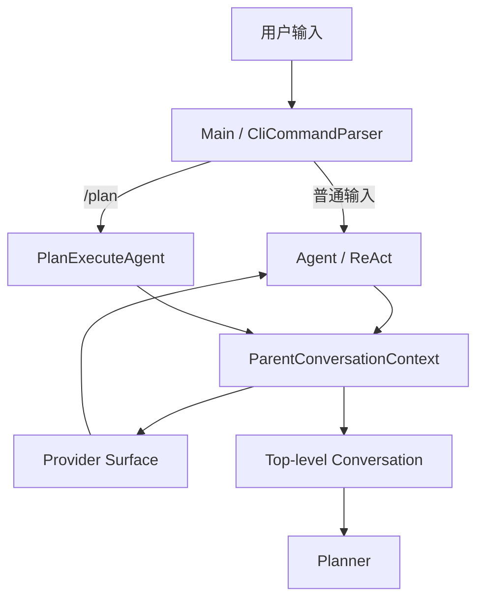
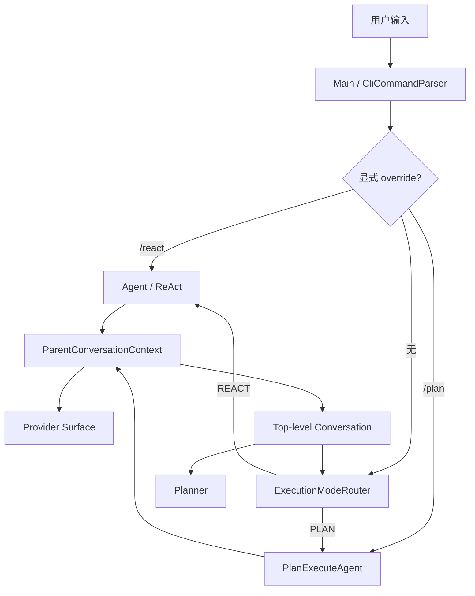
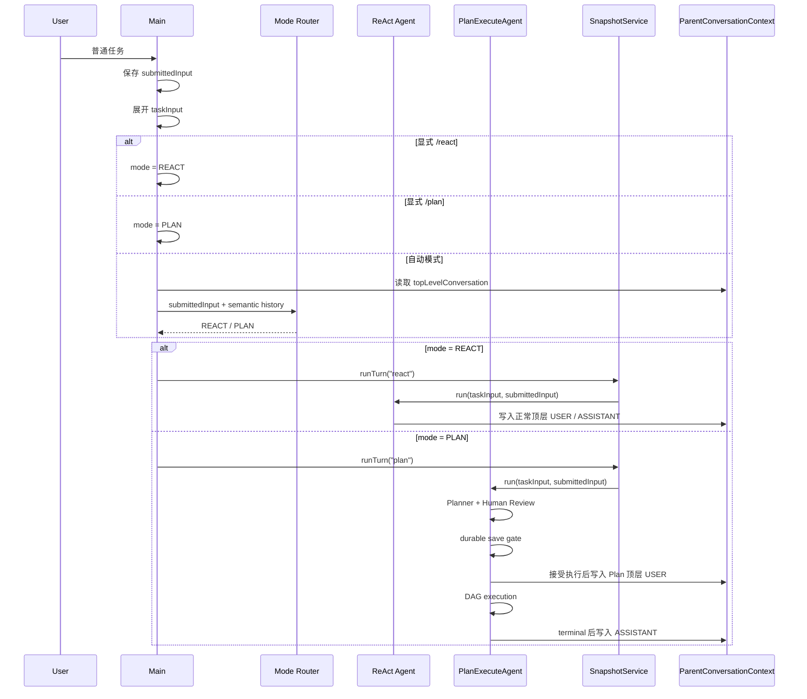

# ReAct / Plan 自动执行模式路由方案

> 状态：待实现  
> 适用范围：CLI/TUI 普通顶层任务的 ReAct / Plan-and-Execute 自动选择  
> 依赖前置：`docs/dev/14-plan-session-conversation-continuity.md` 已完成的 Parent Session / Top-level Conversation 统一  
> 不涉及：运行中跨模式迁移、Plan 自动恢复、Task Worker 上下文共享、长期记忆策略变更

## 1. 背景、目标与非目标

### 1.1 背景

当前 CodeAgent 已具备两条成熟但适用场景不同的执行路径：

- `Agent`：ReAct 模式，适合问答、代码调查、局部修改、调试以及普通顺序任务。
- `PlanExecuteAgent`：Plan-and-Execute 模式，通过 Planner、DAG Task、Worker、Reviewer、证据门禁和持久化恢复处理复杂多阶段任务。

当前 CLI/TUI 的模式选择由用户显式控制。

`Main.java` 中普通输入默认进入 ReAct：

```java
if (nextTaskUsePlanMode
        || command.type() == CliCommandParser.CommandType.SWITCH_PLAN) {
    snapshotMode = "plan";
    ...
} else {
    snapshotMode = "react";
    runTask = () -> reactAgent.run(taskInput, submittedInput);
}
```

`/plan` 不带任务时只影响下一轮：

```java
case SWITCH_PLAN -> {
    if (command.payload() == null || command.payload().isEmpty()) {
        nextTaskUsePlanMode = true;
        ...
        continue;
    }
    input = command.payload();
}
```

执行结束后：

```java
nextTaskUsePlanMode = false;
```

因此目前实际语义是：

```text
普通输入       -> ReAct
/plan          -> 下一轮强制 Plan
/plan <task>   -> 当前任务强制 Plan
```

这种设计要求用户提前理解两种 Agent 架构，并自行判断任务是否值得进入 Plan。

此前这一限制还有合理性：ReAct 与 Plan 的会话上下文不完全连续，自动切换模式可能导致语义丢失。

`docs/dev/14-plan-session-conversation-continuity.md` 完成后，这一前提已经改变。

当前 ReAct 与 Plan 共用：

```text
ParentConversationContext
        |
        +-- Provider Surface
        |      -> ReAct 完整模型上下文
        |
        +-- Top-level Conversation
               -> ReAct / Plan 共享顶层语义
```

其中 Top-level Conversation 只包含：

```text
USER
ASSISTANT
SUMMARY
```

不会向 Planner 暴露 tool result、Task transcript、Skill/Memory 注入等执行细节。

因此当前架构已经具备在顶层 Turn 开始时自动选择执行策略的基础条件。

### 1.2 目标

本次改造目标是把 ReAct 和 Plan 从“用户手动选择的两个入口”进一步收敛为“同一个 Agent Harness 下的两种执行策略”。

普通任务默认经过自动路由：

```text
用户输入
   |
   v
Mode Router
   |
   +---- ReAct
   |
   +---- Plan-and-Execute
```

具体目标：

1. 普通顶层任务默认由模型在 ReAct 与 Plan 之间自动选择执行模式。
2. 路由只发生在每个顶层用户 Turn 开始之前，本轮一旦选定模式不再动态切换。
3. Mode Router 只读取当前用户原始输入与 Parent Session 的 Top-level Conversation，不读取完整 ReAct tool history。
4. `/plan` 保留，语义改为“显式强制本轮使用 Plan”。
5. 新增 `/react`，用于显式强制本轮使用 ReAct。
6. 显式用户选择优先级高于自动路由。
7. Router 自身不得调用工具、修改文件、扩大 URL/路径/命令权限，也不得写入 Parent Conversation。
8. Router 调用失败、输出非法或无法解析时，确定性回退 ReAct，保持当前默认行为的兼容性。
9. 自动选择 Plan 后仍完整经过当前人工计划确认、Plan durable save gate、Task 验证和恢复机制。
10. 保留可关闭自动路由的兼容开关，便于出现模型路由回归时恢复旧行为。

### 1.3 非目标

本次不实现：

- 不允许 ReAct 执行到一半后自动切换 Plan。
- 不允许 Plan 执行到一半自动切换 ReAct。
- 不实现 tool-call 级模式迁移。
- 不自动执行 `/plan resume`。
- 不把 active Plan 当作普通输入自动恢复。
- 不改变 Plan SQLite schema。
- 不改变 Session Event schema。
- 不改变 ParentConversationContext 的语义。
- 不把 Router 的 prompt 或响应写入 Top-level Conversation。
- 不让 Router 读取 tool result、reasoning、Task child transcript。
- 不让 Router 获得工具能力。
- 不允许路由结果授予当前 Turn 额外权限。
- 不修改 Planner、Worker、Reviewer 的核心执行语义。
- 第一阶段不改变 Runtime API / 微信入口的默认执行策略；Router 实现需可复用，但先只接入当前具有 `/plan` 产品语义的 CLI/TUI 主路径。
- 不单独引入新的廉价模型配置；第一版复用当前活动 `LlmClient`。

## 2. 现状分析（源码证据、已知约束）

### 2.1 架构位置

当前模式选择发生在 `src/main/java/com/codeagent/cli/Main.java`。



当前不存在独立的 Mode Router。

模式选择完全依赖：

```java
boolean nextTaskUsePlanMode
```

以及：

```java
CliCommandParser.CommandType.SWITCH_PLAN
```

本次改造后目标关系为：



Router 与 Planner 都消费 Session 级语义信息，但职责不同：

```text
Router：
判断“这一轮应该采用哪种执行策略”

Planner：
已经确定使用 Plan 后，生成 DAG
```

Router 不能生成 ExecutionPlan，也不能替代 Planner。

### 2.2 数据/状态模型

#### 当前 Parent Session

`SessionProjection` 已维护：

```java
List<SurfaceNode> activeSurface;
List<ConversationNode> topLevelConversation;
```

其中：

```java
public enum ConversationKind {
    USER,
    ASSISTANT,
    SUMMARY
}
```

Router 应只使用：

```java
topLevelConversation
```

不得使用：

```java
activeSurface
```

原因是 `activeSurface` 包含：

```text
system
user + Skill/Memory expansion
assistant tool_call
tool result
synthetic user
...
```

这些内容适合 ReAct 执行，却不适合作为“用户想做什么”的模式判断依据。

#### 新增执行模式类型

新增：

```java
public enum ExecutionMode {
    REACT,
    PLAN
}
```

新增路由来源：

```java
public enum RoutingSource {
    EXPLICIT,
    AUTO_MODEL,
    AUTO_FALLBACK,
    CONFIGURED
}
```

路由结果：

```java
public record RoutingDecision(
        ExecutionMode mode,
        RoutingSource source,
        MeasuredUsage usage
) {}
```

不引入模型生成的 `confidence`。

LLM 自报置信度没有可靠校准意义，不应使用类似：

```text
confidence > 0.8 -> PLAN
```

的逻辑影响确定性控制流。

Router 输出只允许：

```json
{"mode":"react"}
```

或者：

```json
{"mode":"plan"}
```

不要求模型生成解释文本。

#### 显式 override

当前：

```java
boolean nextTaskUsePlanMode;
```

建议替换为明确类型，例如：

```java
ExecutionMode nextTaskOverride;
```

`null` 表示：

```text
无显式 override -> 使用默认 AUTO 路由
```

`/plan`：

```text
nextTaskOverride = PLAN
```

`/react`：

```text
nextTaskOverride = REACT
```

执行或取消本轮后清空。

### 2.3 Router 输入

Router 只接收两类信息：

```text
1. 当前用户实际提交的 submittedInput
2. Parent Session 的 Top-level Conversation
```

例如 Parent Session：

```text
User:
帮我分析认证模块

Assistant:
认证、缓存和数据库状态存在三个耦合点

User:
先把 JWT 的问题修掉

Assistant:
JWT 已修复并通过测试
```

当前用户：

```text
剩下的缓存和数据库部分也一起重构掉
```

Router 请求应类似：

```text
[历史会话上下文]
[User] 帮我分析认证模块
[Assistant] 认证、缓存和数据库状态存在三个耦合点
[User] 先把 JWT 的问题修掉
[Assistant] JWT 已修复并通过测试

[当前任务]
剩下的缓存和数据库部分也一起重构掉
```

Router 不应看到：

```text
read_file 输出
grep 输出
execute_command 输出
tool calls
reasoning
Skill body
Memory retrieval
MCP resource 展开正文
Task Worker transcript
Reviewer transcript
```

特别需要区分：

```java
submittedInput
```

与：

```java
taskInput
```

当前 Main 会在执行前进行：

```java
input = mentionExpander.expand(input);
input = localPathMentionExpander.expand(input);
```

Router 必须使用展开前的：

```java
submittedInput
```

不能使用包含 `@path`、MCP resource 展开正文的 `taskInput`。

否则文件正文或外部 resource 内容可能反过来影响模式判断，被错误解释为用户意图。

### 2.4 Router 上下文窗口

Mode Router 不需要 Planner 那么完整的历史。

为了避免普通 ReAct Turn 每次额外携带大量历史，Router 只读取近期顶层语义：

```text
最近最多 3 个 USER Turn
+
它们之间/之后对应的 ASSISTANT
+
必要时最近一个 SUMMARY
```

顺序保持不变。

例如：

```text
SUMMARY
USER
ASSISTANT
USER
ASSISTANT
USER
ASSISTANT
```

该窗口仅用于模式分类。

Planner 现有上下文策略不因此改变。

为避免 Router 与 Planner 分别实现一套 `[User] / [Assistant] / [Summary]` 序列化规则，应把当前：

```text
PlannerConversationContextBuilder
```

中的通用序列化能力抽成历史层共享组件，例如：

```text
TopLevelConversationFormatter
```

建议放置：

```text
com.codeagent.history
```

Planner 与 Router 均依赖该组件。

### 2.5 当前 Plan 失败和恢复约束

`PlanExecuteAgent.runWithPlan()` 已在真正规划前检查 active Plan：

```java
Optional<PlanStateStore.ActivePlanInfo> activePlan = findActivePlanInfo();

if (activePlan.isPresent()) {
    return PlanRunOutcome.rejected(
        "当前会话已有未完成计划..."
    );
}
```

因此自动 Router 选择 PLAN 后，如果当前 Session 已存在 unfinished Plan：

```text
不得自动 resume
不得自动 abandon
不得静默切换成 ReAct
```

仍返回现有提示：

```text
/plan resume
/plan abandon
```

这是重要的恢复和副作用边界。

## 3. 方案设计

### 3.1 模式选择规则

普通输入的优先级定义为：

```text
显式 /plan 或 /react
        >
配置级默认模式
        >
AUTO Mode Router
        >
Router 失败时 REACT fallback
```

默认配置：

```text
AUTO
```

增加兼容配置：

```text
CODEAGENT_EXECUTION_MODE=auto|react
```

同时支持系统属性：

```text
-Dcodeagent.execution.mode=auto|react
```

默认：

```text
auto
```

设置：

```text
react
```

时恢复当前版本行为：

```text
普通输入 -> ReAct
/plan    -> 强制 Plan
```

不增加持久化配置 schema。

#### Router 判断原则

Router Prompt 明确要求：

优先选择 `REACT` 的情况：

```text
- 普通问答或解释
- 阅读、搜索、定位代码
- Bug 调查
- 单点或局部修改
- 单模块修改
- 顺序执行即可完成
- 用户目标仍不清楚，需要进一步询问
- 没有明显 DAG / 并行 / 分阶段验证价值
- 无法明确判断时
```

选择 `PLAN` 需要存在明显结构化收益，例如：

```text
- 多个可独立验证的子目标
- 多模块协调修改
- 子任务之间存在依赖关系
- 多个任务有实际并行价值
- 大规模重构或迁移
- 需要分阶段实施和验证
- 执行时间较长，中断恢复价值明显
- 单个 ReAct tool loop 容易因上下文或执行长度变得不稳定
```

禁止仅因为以下表面特征选择 Plan：

```text
- 用户用了“重构”两个字
- 输入文本很长
- 历史对话很多
- 需要调用多个工具
- 需要执行测试
```

判断原则是：

```text
Plan 是否带来真实的任务分解、调度、验证或恢复收益
```

而不是：

```text
任务看起来“比较大”
```

### 3.2 新增 ExecutionModeRouter

建议新增：

```text
src/main/java/com/codeagent/agent/ExecutionModeRouter.java
```

核心接口：

```java
public final class ExecutionModeRouter {

    public RoutingDecision route(
            String submittedInput,
            List<SessionProjection.ConversationNode> history
    ) throws IOException {
        ...
    }
}
```

Router 持有：

```java
LlmClient
PromptAssembler
TopLevelConversationFormatter
```

不持有：

```text
ToolRegistry
MemoryManager
TurnToolPolicy
PlanStateStore
SessionStore.SessionHandle 写能力
```

这样可以从结构上保证 Router 是纯分类器。

调用：

```java
llmClient.chat(messages, null)
```

第二个参数固定：

```java
null
```

即 Router 永远没有 tools。

### 3.3 Router Prompt

新增：

```text
PromptMode.ROUTER
```

以及：

```text
src/main/resources/prompts/modes/router.md
```

输出契约必须严格限制为：

```json
{"mode":"react"}
```

或：

```json
{"mode":"plan"}
```

禁止 Markdown code fence，禁止额外正文。

解析器严格接受：

```text
react
plan
```

其他情况全部视为路由失败。

例如：

```text
PLAN
"plan"
{"mode":"team"}
{"mode":"plan","confidence":0.93}
普通自然语言解释
```

是否接受大小写可由 parser 统一 normalize，但不得接受未定义模式。

### 3.4 Router 失败策略

Router 是优化层，不应成为普通 ReAct 的可用性单点。

以下情况：

```text
IOException
Provider timeout
空响应
非法 JSON
缺 mode
未知 mode
```

统一：

```text
RoutingDecision(
    REACT,
    AUTO_FALLBACK,
    usage
)
```

原因是当前稳定默认路径本来就是 ReAct。

因此 Router 故障时回退 ReAct属于兼容行为，而不是安全降级到新的未知路径。

但要区分：

```text
Router 失败
```

与：

```text
Router 已成功选择 PLAN，但 Plan 初始化/持久化失败
```

后一种情况不得自动回退 ReAct。

例如：

```text
Router -> PLAN
PlanStateStore 不可用
```

应继续由现有 Plan durable gate fail closed。

禁止：

```text
PlanStateStore 失败
        ->
偷偷改成 ReAct 执行
```

否则可能绕过用户本应看到的 Plan review 和结构化执行边界。

### 3.5 CLI 命令

保留现有：

```text
/plan
/plan <task>
/plan resume
/plan abandon
```

语义：

```text
/plan
-> 下一条任务强制 PLAN

/plan <task>
-> 当前任务强制 PLAN
```

新增：

```text
/react
/react <task>
```

语义：

```text
/react
-> 下一条任务强制 REACT

/react <task>
-> 当前任务强制 REACT
```

显式 override 只影响一个顶层 Turn。

之后重新回到：

```text
AUTO
```

不新增持久化 `/mode` 状态，避免 Session 恢复时还需要恢复用户模式偏好。

### 3.6 Main 调度时序

Router 是一次真实 LLM 请求，因此必须纳入现有取消机制。

不能先同步调用：

```java
router.route(...)
```

然后才进入：

```java
runWithCancelSupport(...)
```

否则 Router 网络请求期间 ESC 无法取消。

建议把“路由 + 实际 Agent 执行”放进同一个 cancellable callable。

核心时序：



注意：

Router 本身：

```text
不 append USER
不 append ASSISTANT
不创建 Plan turn
```

实际 Session 对话仍只由最终被选择的执行模式维护。

这样不会出现：

```text
Router 写一次 user
ReAct 又写一次 user
```

的重复消息。

### 3.7 单 Turn 模式固定

模式只允许在这里决定一次：

```text
Top-level Turn Start
        |
        v
Mode Decision
        |
        v
整个 Turn 固定执行
```

禁止第一版实现：

```text
ReAct
  -> tool
  -> tool
  -> “发现复杂”
  -> 转 Plan
```

也禁止：

```text
Plan Task
  -> “发现简单”
  -> 转 ReAct
```

原因是运行中迁移会立即引入：

```text
工具副作用归属
TurnToolPolicy 迁移
request snapshot
snapshot 边界
Plan SQLite 状态
Session turn 身份
已执行 tool call
取消与恢复
```

等新的跨模式状态机。

当前没有必要为了自动模式选择同时解决这些问题。

### 3.8 权限与安全边界

Mode Router 只能决定：

```text
REACT
PLAN
```

不能决定：

```text
允许联网
允许写文件
允许执行命令
允许访问某个 URL
允许访问项目外路径
```

实际权限仍由当前 Turn 的：

```text
submittedInput
```

重新构造。

ReAct：

```text
TurnToolPolicy.fromUserInput(...)
```

Plan：

```text
TurnToolPolicy.fromUserInput(...)
```

继续保持现有逻辑。

Router 历史上下文绝不能作为权限来源。

例如上一轮用户说：

```text
可以访问 example.com
```

下一轮：

```text
帮我继续
```

即使 Router 理解两轮语义关系，也不得因此让当前 Turn 自动继承 URL 授权。

这与现有 Parent Conversation 设计保持一致：

```text
历史只用于理解
当前 submittedInput 决定权限
```

### 3.9 Active Plan

当前 Session 已存在：

```text
CREATED / RUNNING Plan
```

时，AUTO Router 仍可以得出：

```text
PLAN
```

但进入 `PlanExecuteAgent` 后必须沿用现有检查并停止：

```text
当前会话已有未完成计划。
使用 /plan resume 或 /plan abandon。
```

不得自动：

```text
resume
abandon
覆盖旧 Plan
创建第二个 active Plan
fallback ReAct
```

尤其不能把普通自然语言：

```text
继续
```

解释为：

```text
/plan resume
```

恢复副作用必须继续要求显式命令。

### 3.10 路由可观测性

Router 是额外的 Provider 请求，不能隐藏其成本。

自动路由完成后向 `ConversationLedger` 追加只含元数据的事件，例如：

```text
event = execution_mode_selected
mode = router
actor = mode-router
source = auto_model | auto_fallback | explicit
selectedMode = react | plan
```

不得为了可观测性重复保存完整历史或 Router prompt。

Router 返回的 provider usage 应通过 `RoutingDecision.usage` 保留下来，供后续状态栏/调用统计纳入真实 Token 与成本。

Router usage 不属于 ReAct conversationHistory，也不进入 Parent Session token pressure。

第一版至少要求：

```text
usage 可观测
不被错误计入 Parent Session 上下文
```

如果当前 UI usage 聚合接口不足，可先在 ledger 中独立记录，并在实现 review 时决定是否扩展现有状态统计；不得静默把 Router 调用算成 0 成本。

### 3.11 用户可见行为

普通简单任务：

```text
> 修一下这个空指针

ReAct 正常执行
```

不额外打印：

```text
自动选择 ReAct
```

避免每轮增加噪声。

AUTO 选择 Plan 时应明确提示一次：

```text
🧭 任务已自动选择 Plan-and-Execute 模式
```

之后仍使用现有：

```text
📋 正在规划任务...
```

和 Human Review。

用户如果认为 Router 判断错误，可以：

```text
/react <task>
```

显式重试。

### 3.12 兼容性、迁移与回滚

本方案不修改：

```text
Session Event schema
Session checkpoint schema
Plan SQLite schema
ParentConversationContext schema
ConversationNode schema
```

旧 Session 无需迁移。

旧 active Plan 无需迁移。

原有：

```text
/plan
/plan resume
/plan abandon
```

保持兼容。

主要行为变化只有：

```text
之前：
普通输入 -> ReAct

之后：
普通输入 -> AUTO -> ReAct / Plan
```

紧急回滚不需要回滚数据。

设置：

```text
CODEAGENT_EXECUTION_MODE=react
```

即可恢复：

```text
普通输入 -> ReAct
```

同时 `/plan` 仍可显式使用。

## 4. 实现任务与测试矩阵

### 4.1 实现任务

建议按以下依赖顺序实现。

#### Task 1：定义模式模型

新增：

```text
ExecutionMode
RoutingSource
RoutingDecision
```

不接 CLI，不调用 LLM。

先完成对应单元测试。

#### Task 2：抽取顶层语义格式化能力

从：

```text
PlannerConversationContextBuilder
```

抽取通用：

```text
TopLevelConversationFormatter
```

保证 Planner 输出在重构前后完全一致。

Router 增加独立近期窗口选择逻辑：

```text
latest SUMMARY + latest 3 USER turns
```

不得改变 Planner 当前 history 语义。

#### Task 3：实现 ExecutionModeRouter

实现：

```text
PromptMode.ROUTER
router.md
ExecutionModeRouter
strict response parser
REACT fallback
usage capture
```

Router 不注册工具。

#### Task 4：增加 CLI override

修改：

```text
CliCommandParser
CodeAgentCompleter
Main
```

增加：

```text
/react
/react <task>
```

把：

```java
nextTaskUsePlanMode
```

替换为明确的 one-turn override。

#### Task 5：接入 Main 普通任务路径

普通输入：

```text
AUTO
```

显式命令：

```text
/plan  -> PLAN
/react -> REACT
```

模式确定后再调用对应：

```text
SnapshotService.runTurn("react", ...)
SnapshotService.runTurn("plan", ...)
```

Router 与实际执行必须处于同一个 cancellation run 内。

#### Task 6：增加兼容开关

支持：

```text
-Dcodeagent.execution.mode=auto|react
CODEAGENT_EXECUTION_MODE=auto|react
```

优先级遵循项目现有 system property / environment 约定。

#### Task 7：增加可观测性

至少记录：

```text
routing source
selected mode
router provider usage
```

不得写 Parent Session semantic conversation。

#### Task 8：同步文档

实现完成后检查并同步：

```text
AGENTS.md
README.md
docs/agents-reference.md
docs/dev/15-auto-execution-mode-routing.md
```

`AGENTS.md` 中当前：

```text
MODE -> REACT / PLAN
```

架构图可继续保留，但正文需要改成：

```text
普通顶层任务默认由 Mode Router 决定；
/plan 与 /react 为 one-turn override。
```

### 4.2 测试矩阵

| 场景 | 预期 |
|---|---|
| Router 返回 `react` | 调用 ReAct，不创建 Plan |
| Router 返回 `plan` | 调用 PlanExecuteAgent |
| Router 输出非法 JSON | 回退 ReAct |
| Router 抛 IOException | 回退 ReAct |
| Router 返回未知 mode | 回退 ReAct |
| `/plan task` | 不调用 Router，直接 Plan |
| `/react task` | 不调用 Router，直接 ReAct |
| `/plan` 后下一条任务 | 只该 Turn 强制 Plan |
| `/react` 后下一条任务 | 只该 Turn 强制 ReAct |
| override Turn 结束 | 下一轮恢复 AUTO |
| `/plan resume` | 不调用 Router |
| `/plan abandon` | 不调用 Router |
| `CODEAGENT_EXECUTION_MODE=react` | 普通任务不调用 Router |
| Router history | 只包含 USER / ASSISTANT / SUMMARY |
| ReAct tool result | 不进入 Router |
| Plan Task transcript | 不进入 Router |
| Skill / Memory 注入 | 不进入 Router |
| `@path` 展开正文 | 不进入 Router |
| MCP resource 展开正文 | 不进入 Router |
| 当前 submittedInput | Router 中只出现一次 |
| Router 选择 Plan 且存在 active Plan | 不自动恢复，返回现有 resume/abandon 提示 |
| Router 选择 Plan 但 PlanStateStore 不可用 | fail closed，不 fallback ReAct |
| Router 选择 Plan 后用户取消人工计划 | 不执行 Task，不 fallback ReAct |
| Router 请求期间 ESC | 能取消当前 Turn |
| Router 自动选择 Plan | 用户可见模式提示 |
| Router usage | 有独立可观测记录 |
| Parent Session | 不出现 Router prompt/response |
| 后续 ReAct | 仍可读取此前 Plan 顶层结果 |
| 后续 Plan | 仍可读取此前 ReAct 顶层结果 |

### 4.3 建议新增/修改测试

新增：

```text
ExecutionModeRouterTest
ExecutionModeRoutingContextTest
MainExecutionModeRoutingTest
```

修改：

```text
CliCommandParserTest
MainInputNormalizationTest
MainPlanAgentFactoryTest
PlannerTest
PlannerConversationContextBuilderTest
```

已有 Plan 恢复测试继续作为回归：

```text
PlanExecuteRecoveryTest
PlanConversationReconcilerTest
SessionReplayerTest
```

实现过程中针对性命令：

```bash
mvn test -Dtest=ExecutionModeRouterTest,ExecutionModeRoutingContextTest

mvn test -Dtest=CliCommandParserTest,MainExecutionModeRoutingTest,MainInputNormalizationTest

mvn test -Dtest=PlannerTest,PlanExecuteAgentTest,PlanExecuteRecoveryTest,PlanConversationReconcilerTest,MainPlanAgentFactoryTest
```

最终按 `AGENTS.md` 执行：

```bash
mvn test -Pquick
mvn test -DskipTests=false
mvn clean package
git diff --check
```

## 5. 主要风险与设计取舍

### 5.1 每轮多一次 LLM 请求

AUTO 模式会给普通 Turn 增加一次 Router 请求。

代价包括：

```text
延迟
Token
Provider 成本
额外失败点
```

因此 Router Prompt 和历史窗口必须保持很小，且不暴露工具。

第一版暂不增加独立廉价 Router 模型，以避免引入新的 provider/model 配置面。

后续真实使用数据证明 Router 成本明显后，再单独设计：

```text
routing model
```

不能在本次实现中顺带扩张范围。

### 5.2 模式误判

错误分两种：

```text
简单任务 -> PLAN
复杂任务 -> REACT
```

前者主要导致成本和交互增加。

后者可能损失 DAG、并行、恢复和分阶段验证收益。

因此第一版 Router Prompt 采用：

```text
不确定 -> REACT
```

的保守规则。

同时保留：

```text
/plan
/react
```

作为用户确定性覆盖入口。

### 5.3 自动 Plan 与人工计划门

AUTO 只自动决定：

```text
是否值得进入 Plan
```

不能代表：

```text
用户已经批准这个 Plan
```

所以当前 Plan review 必须保留。

流程仍是：

```text
AUTO -> PLAN
       |
       v
Planner
       |
       v
Human Review
       |
       v
Durable Save
       |
       v
Execution
```

不能为了“自动模式”删除 Human Review。

### 5.4 Router 不承担权限判断

复杂度判断与授权判断必须分离。

错误设计：

```text
Router:
这个任务很复杂，所以允许联网/写文件
```

正确设计：

```text
Router:
这个任务使用 PLAN

TurnToolPolicy:
根据当前 submittedInput 独立决定权限
```

### 5.5 不自动恢复 active Plan

这是必须保持的恢复边界。

普通文本：

```text
继续
```

即使语义上可能指旧 Plan，也只能作为普通新 Turn 处理。

恢复 Plan 必须继续：

```text
/plan resume
```

因为 resume 可能重新执行中断 Task 并产生副作用。

## 6. 验收清单

- [ ] 普通 CLI/TUI 任务默认进入 AUTO 模式。
- [ ] AUTO Router 只读取当前 `submittedInput` 和 Top-level Conversation。
- [ ] Router 不读取 Provider Surface、Tool Result、Task transcript、Skill/Memory 注入。
- [ ] Router 不注册任何工具。
- [ ] Router 不写 Parent Session 的 USER / ASSISTANT。
- [ ] Router 不改变 Session / Plan 持久化 schema。
- [ ] Router 成功返回 `REACT` 时走现有 ReAct 路径。
- [ ] Router 成功返回 `PLAN` 时走完整现有 Plan 路径。
- [ ] Router 失败时确定性回退 ReAct。
- [ ] 已选择 Plan 后的持久化失败不得回退 ReAct。
- [ ] `/plan` 保留为 one-turn Plan override。
- [ ] `/react` 可 one-turn 强制 ReAct。
- [ ] `/plan resume` 与 `/plan abandon` 语义不变。
- [ ] active Plan 不会被 AUTO 自动恢复、覆盖或放弃。
- [ ] 模式在一个顶层 Turn 内固定，不发生运行中迁移。
- [ ] Router 调用支持当前 Turn 的 ESC / cancellation。
- [ ] AUTO 选择 Plan 时终端明确显示实际模式。
- [ ] Router usage 可观测，不被错误计入 Parent Session 上下文。
- [ ] ReAct / Plan 原有 Parent Conversation 连续性测试全部通过。
- [ ] Plan Task isolation 和权限边界没有变化。
- [ ] `CliCommandParserTest` 覆盖 `/react`。
- [ ] `README.md`、`AGENTS.md`、`docs/agents-reference.md` 已同步。
- [ ] `mvn test -Pquick` 通过。
- [ ] `mvn test -DskipTests=false` 通过。
- [ ] `mvn clean package` 通过。
- [ ] `git diff --check` 通过。

## 7. 实现后的目标架构

最终用户不需要预先理解 ReAct 与 Plan 的内部区别。

默认体验：

```text
用户提出任务
     |
     v
自动判断执行策略
     |
     +-- 普通任务 ------> ReAct
     |
     +-- 复杂任务 ------> Plan-and-Execute
```

同时仍保留确定性控制：

```text
/plan  -> 用户明确要求 Plan
/react -> 用户明确要求 ReAct
```

底层保持：

```text
                 Parent Session
                       |
              Top-level Conversation
                       |
              +--------+--------+
              |                 |
              v                 v
         Mode Router         Planner
              |
        +-----+-----+
        |           |
        v           v
      ReAct        Plan
        |           |
        +-----+-----+
              |
              v
        Parent Session
```

本次改造的核心边界不是“让模型随时决定自己怎么跑”，而是：

```text
在每个顶层 Turn 开始前，
基于统一的 Session 语义上下文，
选择一次最合适的执行策略；
之后仍由现有 ReAct 或 Plan 状态机完整负责这一轮。
```

这样能够利用已经完成的跨模式会话统一，又不会把执行状态、权限和恢复机制重新耦合在一起。
