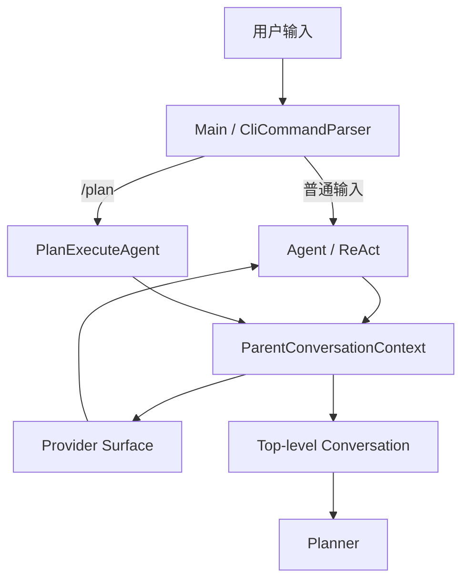
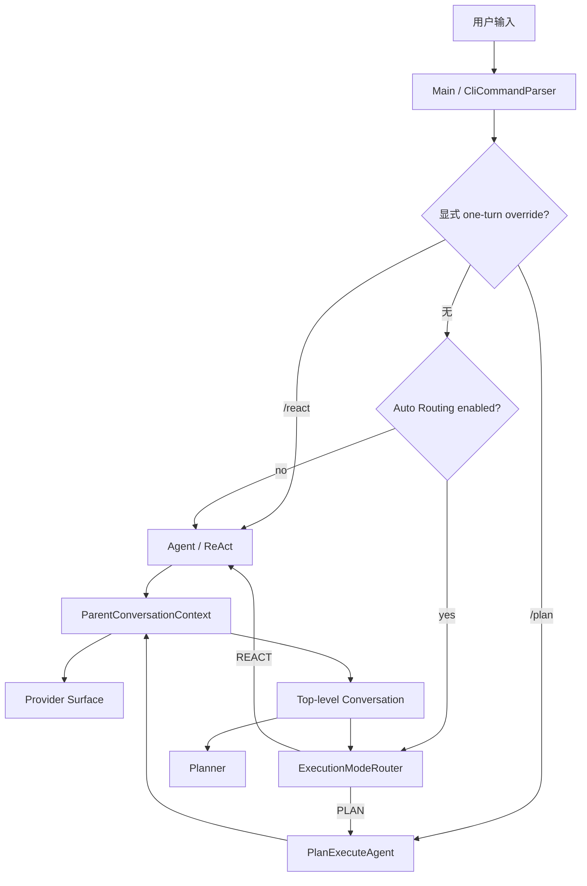
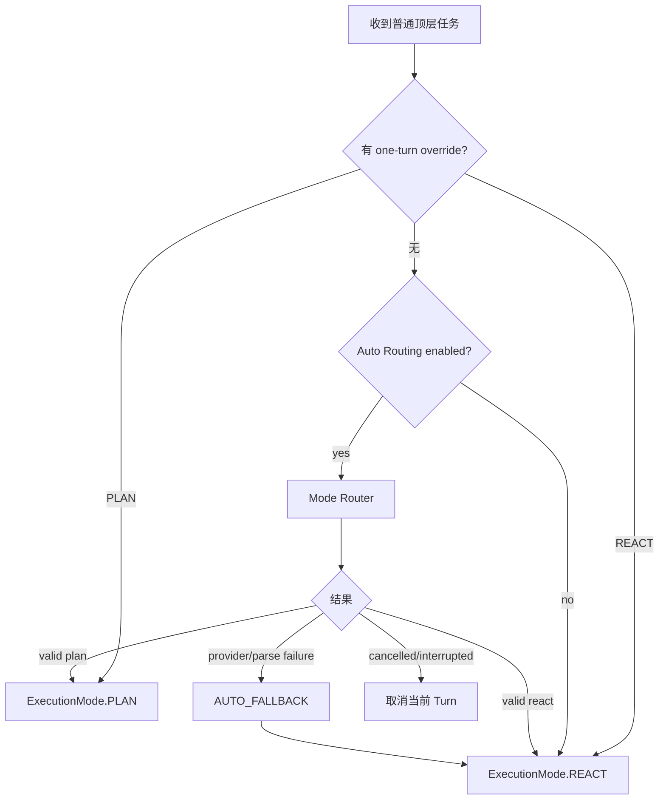
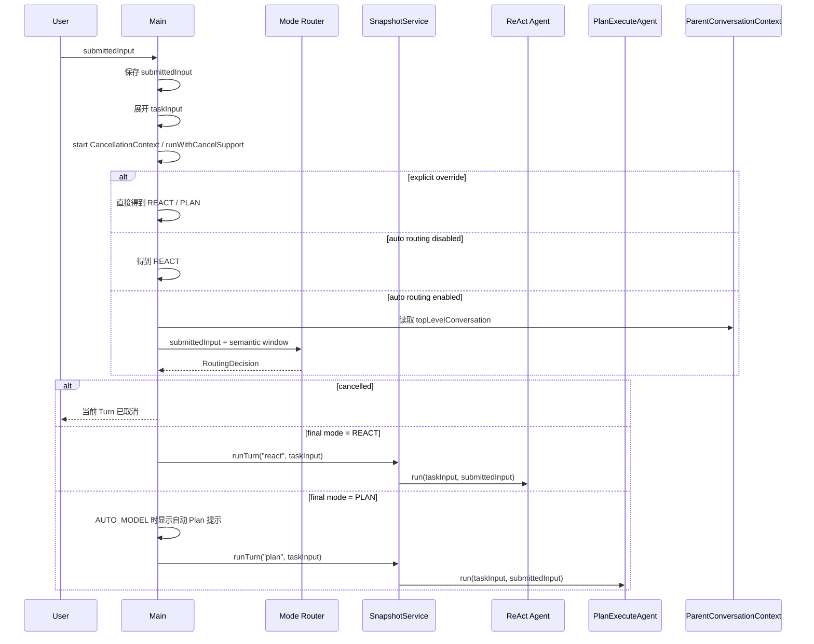

# ReAct / Plan 自动执行模式路由方案

> 状态：待实现（已完成方案评审修订）  
> 适用范围：默认终端主路径（`Main` + inline/plain Renderer）的普通顶层任务  
> 依赖前置：`docs/dev/14-plan-session-conversation-continuity.md` 已完成的 Parent Session / Top-level Conversation 统一  
> 明确不包含：Lanterna 全屏 TUI、Runtime API、WeChat、运行中跨模式迁移、Plan 自动恢复、Task Worker 上下文共享、长期记忆策略变更

## 1. 背景、目标与非目标

### 1.1 背景

当前 CodeAgent 已具备两条成熟但适用场景不同的执行路径：

- `Agent`：ReAct 模式，适合问答、代码调查、局部修改、调试以及普通顺序任务。
- `PlanExecuteAgent`：Plan-and-Execute 模式，通过 Planner、DAG Task、Worker、Reviewer、证据门禁和持久化恢复处理复杂多阶段任务。

当前默认终端主路径的模式选择由用户显式控制。

`Main.java` 中普通输入默认进入 ReAct：

```java
if (nextTaskUsePlanMode
        || command.type() == CliCommandParser.CommandType.SWITCH_PLAN) {
    snapshotMode = "plan";
    ...
} else {
    snapshotMode = "react";
    runTask = () -> reactAgent.run(taskInput, submittedInput);
}
```

`/plan` 不带任务时只影响下一轮：

```java
case SWITCH_PLAN -> {
    if (command.payload() == null || command.payload().isEmpty()) {
        nextTaskUsePlanMode = true;
        ...
        continue;
    }
    input = command.payload();
}
```

执行结束后：

```java
nextTaskUsePlanMode = false;
```

因此目前实际语义是：

```text
普通输入       -> ReAct
/plan          -> 下一轮强制 Plan
/plan <task>   -> 当前任务强制 Plan
```

这种设计要求用户提前理解两种 Agent 架构，并自行判断任务是否值得进入 Plan。

此前这一限制还有合理性：ReAct 与 Plan 的会话上下文不完全连续，自动切换模式可能导致语义丢失。

`docs/dev/14-plan-session-conversation-continuity.md` 完成后，这一前提已经改变。

当前 ReAct 与 Plan 共用：

```text
ParentConversationContext
        |
        +-- Provider Surface
        |      -> ReAct 完整模型上下文
        |
        +-- Top-level Conversation
               -> ReAct / Plan 共享顶层语义
```

其中 Top-level Conversation 只包含：

```text
USER
ASSISTANT
SUMMARY
```

不会向 Planner 暴露 tool result、Task transcript、Skill/Memory 注入等执行细节。

因此当前默认终端架构已经具备在顶层 Turn 开始时自动选择执行策略的基础条件。

### 1.2 目标

本次改造目标是把默认终端主路径中的 ReAct 和 Plan 从“用户手动选择的两个入口”进一步收敛为“同一个 Agent Harness 下的两种执行策略”。

普通任务默认经过自动路由：

```text
用户输入
   |
   v
Mode Router
   |
   +---- ReAct
   |
   +---- Plan-and-Execute
```

具体目标：

1. 默认终端主路径的普通顶层任务默认由模型在 ReAct 与 Plan 之间自动选择执行模式。
2. 路由只发生在每个顶层用户 Turn 开始之前，本轮一旦选定模式不再动态切换。
3. Mode Router 只读取当前用户原始输入与 Parent Session 的 Top-level Conversation，不读取完整 ReAct tool history。
4. `/plan` 保留，作为显式 one-turn Plan override。
5. 新增 `/react`，作为自动路由所需的对称 one-turn ReAct override。
6. 显式用户选择优先级高于自动路由。
7. Router 自身不得调用工具、修改文件、扩大 URL/路径/命令权限，也不得写入 Parent Conversation。
8. Router 的非取消性 Provider/解析故障确定性回退 ReAct，保持当前默认行为的可用性。
9. 用户取消、线程中断或 CancellationContext 已取消时必须终止当前 Turn，不得回退 ReAct。
10. 自动选择 Plan 后仍完整经过当前默认终端路径的人工计划确认、Plan durable save gate、Task 验证和恢复机制。
11. 保留关闭自动路由的兼容开关，便于模型路由出现回归时恢复“普通输入直接 ReAct”的旧行为。
12. Router 的模型调用成本可观测，但不进入 Parent Session 的短期上下文与 token pressure。

### 1.3 非目标

本次不实现：

- 不允许 ReAct 执行到一半后自动切换 Plan。
- 不允许 Plan 执行到一半自动切换 ReAct。
- 不实现 tool-call 级模式迁移。
- 不自动执行 `/plan resume`。
- 不把 active Plan 当作普通输入自动恢复。
- 不改变 Plan SQLite schema。
- 不改变 Session Event schema。
- 不改变 ParentConversationContext 的语义。
- 不把 Router 的 prompt 或响应写入 Top-level Conversation。
- 不让 Router 读取 tool result、reasoning、Task child transcript。
- 不让 Router 获得工具能力。
- 不允许路由结果授予当前 Turn 额外权限。
- 不修改 Planner、Worker、Reviewer 的核心执行语义。
- 不接入 `TuiBootstrap -> TuiSessionController` 的 Lanterna 全屏 TUI 路径。
- 不修改 Lanterna TUI 当前的 `/plan` 命令语义、自动通过 Plan review 的行为或其独立历史展示逻辑。
- 不接入 Runtime API / WeChat / DurableTaskManager 的模式选择。
- 不单独引入廉价 Router 模型配置；第一版复用当前 Turn 的活动 `LlmClient`。
- 不把 Router usage 强行聚合进现有状态栏；第一版只要求在 routing decision / ledger 中可追踪。

> 说明：Lanterna TUI 当前通过 `TuiSessionController` 独立调度，且其 Plan 创建、review 与 ParentConversationContext 接线与默认终端路径并不完全相同。本次如果顺带统一该路径，会扩大为另一项 TUI/Plan 连续性重构，因此明确留作后续工作。

## 2. 现状分析（源码证据、已知约束）

### 2.1 架构位置与范围边界

本次模式选择只接入：

```text
Main
  -> CliCommandParser
  -> inline/plain Renderer 默认终端循环
```

当前关系：



目标关系：



Router 只判断“这一轮采用 REACT 还是 PLAN”；Planner 只在已经确定使用 PLAN 后生成可执行 DAG。Router 不能生成 ExecutionPlan，也不能替代 Planner。

Lanterna 全屏 TUI 仍保持：

```text
TuiBootstrap
  -> TuiSessionController
  -> 当前既有 RunMode.REACT / RunMode.PLAN
```

本次不修改该路径。

### 2.2 数据/状态模型

#### 当前 Parent Session

`SessionProjection` 已维护：

```java
List<SurfaceNode> activeSurface;
List<ConversationNode> topLevelConversation;
```

Router 只允许读取 `topLevelConversation`，不得读取 `activeSurface`。后者包含 system、Skill/Memory 展开、assistant tool_call、tool result、synthetic user 等执行细节，不适合作为模式分类输入。

#### 最终执行模式

新增：

```java
public enum ExecutionMode {
    REACT,
    PLAN
}
```

`ExecutionMode` 只表示本轮已经确定的执行路径。**AUTO 不是 ExecutionMode。** AUTO 只表示是否启用自动路由的选择策略，不得与真正执行模式混成第三种 mode。

#### 自动路由开关

第一版不新增持久化配置 schema，也不增加 AUTO/REACT/PLAN 三态配置对象，只增加运行时兼容开关：

```text
-Dcodeagent.auto.routing=on|off
CODEAGENT_AUTO_ROUTING=on|off
```

解析优先级：

```text
system property > environment variable > 默认 on
```

合法值只接受大小写不敏感的 `on` / `off`。缺失时为 `on`；非法值打印一次 warning，并按默认 `on` 处理。

`off` 的语义严格等价于旧默认：

```text
普通输入 -> ReAct
/plan    -> 显式 Plan
/react   -> 显式 ReAct
```

#### one-turn override

当前 `boolean nextTaskUsePlanMode` 替换为：

```java
ExecutionMode nextTaskOverride;
```

约定：

```text
null  -> 没有显式 override，按 auto-routing 开关决定是否调用 Router
PLAN  -> 下一条顶层任务强制 Plan
REACT -> 下一条顶层任务强制 ReAct
```

执行完成或取消后必须清空。

#### 路由来源与结果

新增：

```java
public enum RoutingSource {
    EXPLICIT,
    CONFIGURED_REACT,
    AUTO_MODEL,
    AUTO_FALLBACK
}
```

路由结果：

```java
public record RoutingDecision(
        ExecutionMode mode,
        RoutingSource source,
        Optional<MeasuredUsage> usage
) {}
```

usage 语义固定为：

```text
EXPLICIT           -> Optional.empty()
CONFIGURED_REACT   -> Optional.empty()
AUTO_MODEL         -> normalizeUsage(response)
AUTO_FALLBACK      -> provider 已返回但内容非法时可保留 response usage；请求未获得 response 则 empty
```

不引入模型自报 confidence，也不基于 confidence 改变控制流。

### 2.3 Router 输入

Router 只接收：

```text
1. 当前用户真正提交的 submittedInput
2. Parent Session 的 Top-level Conversation
```

必须区分：

```text
submittedInput
    = 用户原始输入，Router 使用

taskInput
    = @path / MCP resource 展开后的执行输入，ReAct/Plan 使用
```

当前 Main 会在执行前调用 mention/path expander；Router 禁止读取展开后的 `taskInput`，否则文件正文、MCP resource 或外部内容可能被错误解释为用户意图。

Router 不得读取：

```text
read_file / grep / execute_command 输出
tool calls / tool results
reasoning
Skill body
Memory retrieval
MCP resource 展开正文
Task Worker transcript
Reviewer transcript
```

### 2.4 Router 上下文窗口

Router 的历史窗口必须使用确定性算法，不允许实现者自行解释“最近几轮”：

1. 输入只取 `topLevelConversation` 中按 sequence 升序排列的 `USER / ASSISTANT / SUMMARY`。
2. 找到最新一个 `SUMMARY`；若存在，它是历史语义下界，任何更早节点都不得进入 Router。
3. 在该下界之后统计 USER 节点。
4. 如果 USER 节点不超过 3 个，保留下界之后全部语义节点；若存在 SUMMARY，则 SUMMARY 一并保留。
5. 如果 USER 节点超过 3 个，从倒数第 3 个 USER 节点开始保留到尾部。
6. 若步骤 5 前存在最新 SUMMARY，则把该 SUMMARY 作为窗口第一项，再拼接倒数 3 个 USER Turn 的切片；SUMMARY 与第三个 USER 之间被裁掉的旧轮次不再重复发送。
7. 不要求 USER/ASSISTANT 必须成对；未闭合 Turn 按实际节点顺序保留。
8. Router 不得跨越最新 SUMMARY 重新引入已经被压缩替代的旧 USER/ASSISTANT。

目标形态：

```text
[Summary] ...              # 如果存在
[User] 最近第 3 个用户轮次
[Assistant] ...
[User] 最近第 2 个用户轮次
[Assistant] ...
[User] 最近第 1 个用户轮次
[Assistant] ...
```

为避免 Router 与 Planner 各实现一套 `[User]/[Assistant]/[Summary]` 序列化规则，从现有 `PlannerConversationContextBuilder` 抽取 `com.codeagent.history.TopLevelConversationFormatter`。该组件只负责 ConversationNode -> 标签文本；窗口裁剪属于 Router，不得改变 Planner 当前使用完整 Top-level Conversation snapshot 的行为。

### 2.5 当前 Plan 失败和恢复约束

`PlanExecuteAgent.runWithPlan()` 已在真正规划前检查 active Plan。

因此最终选择 PLAN 后，如果当前 Session 已存在 unfinished Plan：

```text
不得自动 resume
不得自动 abandon
不得覆盖旧 Plan
不得因为 Plan 被拒绝而 fallback ReAct
```

仍返回现有 `/plan resume` / `/plan abandon` 提示。

如果最终选择 REACT，即使当前 Session 有 active Plan，也按当前既有行为执行独立 ReAct Turn。

普通自然语言 `继续` 绝不能被 Router 或 Main 翻译成 `/plan resume`；恢复副作用继续要求显式命令。

## 3. 方案设计

### 3.1 模式选择规则

每个普通顶层 Turn 的决策顺序固定为：

```text
1. 是否存在 one-turn explicit override?
      yes -> /plan => PLAN
             /react => REACT

2. auto routing 是否被配置关闭?
      yes -> REACT

3. 调用 Mode Router
      valid plan  -> PLAN
      valid react -> REACT
      非取消性失败 -> REACT fallback
      取消/中断 -> 整个 Turn 取消
```



#### Router 判断原则

优先选择 REACT：普通问答/解释、代码阅读/搜索、Bug 调查、局部修改、单模块任务、强顺序任务、目标仍不清楚的任务，以及没有明显 DAG/并行/分阶段验证收益的任务。

选择 PLAN 需要存在明确结构化收益，例如：多个可独立验证的子目标、多模块协调修改、显式依赖关系、真实并行价值、大规模迁移/重构、分阶段验证或明显的中断恢复价值。

禁止仅因为“出现重构关键词、输入很长、历史很多、需要多个工具或需要跑测试”就选择 Plan；无法明确判断时选择 REACT。

### 3.2 新增 ExecutionModeRouter

新增 `src/main/java/com/codeagent/agent/ExecutionModeRouter.java`。

建议核心接口：

```java
public final class ExecutionModeRouter {
    public RoutingDecision route(
            String submittedInput,
            List<SessionProjection.ConversationNode> history
    ) {
        ...
    }
}
```

Router 每个 AUTO Turn 必须使用**当时正在生效的 `LlmClient`**，不得在应用启动时永久缓存初始 client。第一版优先在 Main 每轮捕获 `LlmClient activeClient = llmClient`，再基于该 client 创建 Router；这样 `/model` 切换后的下一轮不会继续调用旧模型。

Router 不持有 ToolRegistry、MemoryManager、TurnToolPolicy、PlanStateStore、可写 SessionHandle、ParentConversationContext 写能力或 Renderer。

模型调用固定：

```java
llmClient.chat(messages, null)
```

tools 必须为 null。

### 3.3 Router Prompt 与输出契约

#### 轻量 Prompt

Router 不能直接复用完整 `PromptAssembler.assemble(PromptMode.ROUTER, ...)`。当前 PromptAssembler 会自动拼接 base、personality、approval、context-management、handoff、runtime context 等通用 Agent 内容；这与“每个普通 Turn 增加一次轻量二分类请求”的目标冲突，也可能干扰严格 JSON 输出。

新增 prompt 层组件，例如 `com.codeagent.prompt.ModeRouterPromptBuilder`，只允许：

```text
PromptRepository.loadRequired("modes/router.md")
+ 确定性拼接 Router semantic window
+ 确定性拼接当前 submittedInput
```

禁止在 `ExecutionModeRouter` 中硬编码大段 system prompt。仍通过 PromptRepository 加载，因此保留现有 user/project prompt override 机制。

新增 `src/main/resources/prompts/modes/router.md`。

#### 严格响应协议

Router 只接受一种响应格式。`response.content()` trim 后必须是 JSON object：

```json
{"mode":"react"}
```

或：

```json
{"mode":"plan"}
```

解析规则固定为：

1. 用 Jackson ObjectMapper 解析完整 content。
2. 根节点必须是 object。
3. 必须存在且只存在一个字段 `mode`。
4. `mode` 必须是 JSON string。
5. 值只能精确为小写 `react` 或 `plan`。
6. 允许外层空白。
7. Markdown code fence、解释文字、额外字段、裸字符串、数组、未知值全部非法。

因此 `react`、`PLAN`、`"plan"`、`{"mode":"plan","confidence":0.9}` 都必须走 AUTO_FALLBACK。

Provider 单独返回的 reasoningContent 不参与解析，也不写入 Parent Session。

### 3.4 Router 失败与取消策略

以下属于可回退故障：Provider IOException/timeout、空 content、非法 JSON、缺 mode、额外字段或未知 mode。

但只有在 `CancellationContext` 未取消且当前线程未 interrupted 时，才返回 `REACT + AUTO_FALLBACK`。

以下情况**绝不能 fallback**：

```text
CancellationContext.isCancelled() == true
Thread.currentThread().isInterrupted() == true
CancellationException
由当前取消导致的 provider/IO 异常
```

实现必须在 Router 调用前、Provider 返回后、异常 catch 中都重新检查取消/interrupt。

一旦确认取消：

```text
终止整个当前 Turn
不执行 ReAct
不执行 Plan
不创建 execution snapshot
不写 Parent Conversation USER/ASSISTANT
```

还必须区分：

```text
Router 非取消性失败 -> 可以 fallback ReAct

Router 已成功选择 PLAN，之后 Plan 初始化/durable save/execution 失败
    -> 沿用 Plan 原有失败语义
    -> 绝不能 fallback ReAct
```

### 3.5 CLI 命令

保留 `/plan`、`/plan <task>`、`/plan resume`、`/plan abandon`；新增 `/react` 与 `/react <task>`。

语义固定为：

```text
/plan          -> 下一条顶层任务 one-turn 强制 PLAN
/plan <task>   -> 当前顶层任务直接强制 PLAN
/react         -> 下一条顶层任务 one-turn 强制 REACT
/react <task>  -> 当前顶层任务直接强制 REACT
```

显式 override 不调用 Router。执行完成或用户取消该 Turn 后 override 清空。

当前 `/plan` 文案“执行完成后自动回到默认 ReAct”必须同步修改，因为默认已不再固定 ReAct。推荐统一说“该轮结束后恢复默认执行策略”，避免 auto-routing=off 时文案失真。

Lanterna TUI 本次不新增 `/react`，也不改变其 `/plan` 语义。

### 3.6 Main 调度、取消与 Snapshot 时序

Router 是一次真实 LLM 请求，必须与真正执行共享当前 `CancellationContext`；但 Router 自身只读、无工具，不属于 Side-Git execution Turn，不创建自己的 snapshot。

改造后的固定顺序：

```text
runWithCancelSupport
    |
    +-- resolve RoutingDecision
    |      +-- explicit / configured / auto router
    |
    +-- 如果已取消 -> 终止当前 Turn
    |
    +-- 根据 final ExecutionMode 更新状态
    |
    +-- SnapshotService.runTurn(finalMode, taskInput, actualAgentCall)
```



关键边界：

- Router 在 Side-Git execution snapshot 之前运行。
- Router 阶段取消不创建 execution snapshot。
- 真正执行仍完整位于原有 `SnapshotService.runTurn()` 边界。
- snapshot mode 必须来自最终 ExecutionMode，不能预先写死为 react。
- Router 不 append USER/ASSISTANT，因此实际 Agent 仍只写一次真实顶层用户轮次。
- 同一个顶层 Turn 内，Router 与随后创建的 Plan Agent 使用同一份 activeClient snapshot，避免 `/model` 生命周期不一致。

### 3.7 单 Turn 模式固定

模式只允许在这里决定一次：

```text
Top-level Turn Start
        |
        v
Mode Decision
        |
        v
整个 Turn 固定执行
```

禁止第一版实现：

```text
ReAct
  -> tool
  -> tool
  -> “发现复杂”
  -> 转 Plan
```

也禁止：

```text
Plan Task
  -> “发现简单”
  -> 转 ReAct
```

原因是运行中迁移会立即引入：

```text
工具副作用归属
TurnToolPolicy 迁移
request snapshot
snapshot 边界
Plan SQLite 状态
Session turn 身份
已执行 tool call
取消与恢复
```

等新的跨模式状态机。

当前没有必要为了自动模式选择同时解决这些问题。

### 3.8 权限与安全边界

Mode Router 只能决定：

```text
REACT
PLAN
```

不能决定：

```text
允许联网
允许写文件
允许执行命令
允许访问某个 URL
允许访问项目外路径
```

实际权限仍由当前 Turn 的：

```text
submittedInput
```

重新构造。

ReAct：

```text
TurnToolPolicy.fromUserInput(...)
```

Plan：

```text
TurnToolPolicy.fromUserInput(...)
```

继续保持现有逻辑。

Router 历史上下文绝不能作为权限来源。

例如上一轮用户说：

```text
可以访问 example.com
```

下一轮：

```text
帮我继续
```

即使 Router 理解两轮语义关系，也不得因此让当前 Turn 自动继承 URL 授权。

这与现有 Parent Conversation 设计保持一致：

```text
历史只用于理解
当前 submittedInput 决定权限
```

### 3.9 Active Plan

当前 Session 存在 active Plan 时：

- 最终选择 PLAN：进入 `PlanExecuteAgent` 后沿用现有 active-plan gate，提示 `/plan resume` 或 `/plan abandon`。
- 最终选择 REACT：按当前既有行为执行独立 ReAct Turn。
- Router/Main 不自动 resume。
- Router/Main 不自动 abandon。
- Router/Main 不覆盖已有 Plan。
- Plan 路径被 gate 拒绝或后续失败都不 fallback ReAct。

普通文本 `继续` 不等价于 `/plan resume`。

### 3.10 路由可观测性

每次最终模式决策向 `ConversationLedger` 追加 metadata event：

```text
event = execution_mode_selected
mode = router
actor = mode-router
source = explicit | configured_react | auto_model | auto_fallback
selectedMode = react | plan
provider/model = ...                 # 有 Router provider 调用时
input/output/cached tokens = ...     # 有 usage 时
usageTrusted = ...
```

不得把 Router prompt、历史正文、用户全文、Router reasoning 或 Router content 复制进 metadata。

Router usage 不进入 `ParentConversationContext.providerMessages()`、不进入 `SessionProjection.activeSurface`、不参与 Parent Session 上下文压缩阈值。第一版不要求修改现有 Renderer 状态栏总 Token 统计，但必须能通过 ledger 或测试证明 Router Provider 调用的 usage 被真实记录。

### 3.11 用户可见行为

AUTO_MODEL 选择 ReAct：正常进入 ReAct，不额外打印“自动选择 ReAct”。

AUTO_MODEL 选择 Plan 时显示一次：

```text
🧭 任务已自动选择 Plan-and-Execute 模式
```

随后继续默认终端现有 Planner -> Human Review -> durable save gate -> DAG execution 流程。

显式 `/plan` 不显示“自动选择 Plan”。AUTO_FALLBACK 默认只记 ledger/debug log，不在正常终端打印错误噪声。

### 3.12 兼容性、迁移与回滚

本方案不修改 Session Event schema、Session checkpoint schema、Plan SQLite schema、ParentConversationContext schema、ConversationNode schema、Lanterna TUI state、Runtime API contract 或 WeChat contract。

旧 Session 和旧 active Plan 均无需迁移。

紧急关闭自动路由：

```text
CODEAGENT_AUTO_ROUTING=off
```

或：

```text
-Dcodeagent.auto.routing=off
```

即可恢复旧默认：

```text
普通输入 -> ReAct
/plan    -> 显式 Plan
/react   -> 显式 ReAct
```

不需要回滚 Session / SQLite 数据。

## 4. 实现任务与测试矩阵

### 4.1 实现任务

严格按依赖方向实现，并先补对应测试。

#### Task 1：定义模式模型与 auto-routing 开关

新增 `ExecutionMode`、`RoutingSource`、`RoutingDecision` 和配置解析 helper。覆盖 property > env > default、on/off、非法值 warning、Optional usage 语义。

#### Task 2：抽取 Top-level formatter，并锁定 Router 窗口

从 `PlannerConversationContextBuilder` 抽取 `TopLevelConversationFormatter`，保证 Planner 重构前后输出完全一致；Router 独立实现第 2.4 节确定性窗口算法。

#### Task 3：实现轻量 Router Prompt

新增：

```text
src/main/java/com/codeagent/prompt/ModeRouterPromptBuilder.java
src/main/resources/prompts/modes/router.md
```

测试必须证明 Router prompt 不包含完整 Agent 的 Tool Policy、Approval、Handoff 或 Skill/Memory 动态正文。

#### Task 4：实现 ExecutionModeRouter

实现严格 JSON parser、AUTO_MODEL/AUTO_FALLBACK、normalized usage capture 和取消传播。fake LLM 测试必须断言 tools == null。

#### Task 5：增加默认 CLI one-turn override

修改 `CliCommandParser`、`CodeAgentCompleter`、`Main`，增加 `/react` 与 `/react <task>`，并把 `nextTaskUsePlanMode` 替换为 `ExecutionMode nextTaskOverride`。

#### Task 6：接入 Main 调度/取消/Snapshot 边界

把 route -> final mode -> SnapshotService.runTurn -> actual Agent 放进同一个 `runWithCancelSupport` 域。保证 Router 取消不启动 Agent、不创建 execution snapshot；Plan 失败不 fallback；每 Turn 使用当前 active LlmClient。

#### Task 7：增加可观测性

通过 `ConversationLedger.appendEvent(...)` 记录 source、selected mode、provider/model 和可用的 normalized usage，不记录 Router 正文。

#### Task 8：同步文档

实现后同步：

```text
AGENTS.md
README.md
docs/agents-reference.md
docs/dev/15-auto-execution-mode-routing.md
```

文档必须明确：默认终端普通任务可自动路由；`/plan` 与 `/react` 是 one-turn override；`/plan resume`/`abandon` 继续显式控制恢复；Lanterna TUI 尚未接入自动路由。

### 4.2 测试矩阵

| 场景 | 预期 |
|---|---|
| Router content = `{"mode":"react"}` | AUTO_MODEL / ReAct |
| Router content = `{"mode":"plan"}` | AUTO_MODEL / Plan |
| Router content = `react` | 非法，AUTO_FALLBACK / ReAct |
| Router content = `"plan"` | 非法，AUTO_FALLBACK / ReAct |
| Router content 有额外字段 | 非法，AUTO_FALLBACK / ReAct |
| Router content 有 code fence | 非法，AUTO_FALLBACK / ReAct |
| Router content 未知 mode | 非法，AUTO_FALLBACK / ReAct |
| Provider 非取消性 IOException | AUTO_FALLBACK / ReAct |
| Provider 异常且 CancellationContext 已取消 | 当前 Turn 取消，不 fallback |
| Router 返回后 CancellationContext 已取消 | 当前 Turn 取消，不执行 Agent |
| Router tools 参数 | 必须为 null |
| `/plan task` | 不调用 Router，直接 Plan |
| `/react task` | 不调用 Router，直接 ReAct |
| 裸 `/plan` 后下一条任务 | 只该 Turn 强制 Plan |
| 裸 `/react` 后下一条任务 | 只该 Turn 强制 ReAct |
| override Turn 成功结束 | override 清空 |
| override Turn 取消 | override 清空 |
| `/plan resume` / `/plan abandon` | 不调用 Router |
| auto routing = off | 普通任务不调用 Router，直接 ReAct |
| 最新 SUMMARY 前的历史 | 不进入 Router |
| 超过 3 个 USER Turn | SUMMARY + 最近 3 个 USER Turn 切片 |
| 少于等于 3 个 USER Turn | 保留语义下界后的全部 |
| 未闭合顶层 Turn | 按实际节点顺序保留 |
| Skill/Memory/tool result/Task transcript | 不进入 Router |
| `@path` / MCP 展开正文 | 不进入 Router |
| Router 当前输入 | 使用 submittedInput，不使用 taskInput |
| `/model` 切换后的下一轮 | Router 使用新 client |
| Router 选择 Plan 且存在 active Plan | 返回现有 resume/abandon 提示 |
| Router 选择 ReAct 且存在 active Plan | 执行独立 ReAct Turn |
| Router 选择 Plan 但 durable gate 失败 | Plan fail closed，不 fallback |
| Router 选择 Plan 后用户取消 Plan review | 不执行 Task，不 fallback |
| Router 阶段取消 | 不创建 execution snapshot |
| AUTO_MODEL 选择 Plan | 显示一次自动 Plan 提示 |
| AUTO_MODEL 选择 ReAct | 不额外打印模式提示 |
| Router usage | ledger 可见，不进入 Parent Session |
| Parent Session | 不出现 Router prompt/response |
| Lanterna TUI | 行为保持现状，不受本次改造影响 |

此外增加一组**非 CI 的真实 Provider smoke**验证 Prompt 分类质量。确定性单测只能证明 wiring，不能证明模型路由本身合理。

至少覆盖：

```text
应倾向 ReAct：
- 解释一个方法
- 定位 NPE
- 单文件局部修改
- 补一个边界测试

应倾向 Plan：
- JWT + Redis + DB + tests 的跨模块重构
- Session 持久化/恢复/压缩/跨模式上下文统一重构
- 多阶段 client 迁移并做回归验证

边界：
- “帮我重构这个很短的方法”不能只因重构关键词选择 Plan
- 历史已说明多个模块需要协调，当前说“剩下的也一起改掉”应能利用历史倾向 Plan
```

真实 Provider smoke 只记录行为证据，不作为 CI 硬断言。

### 4.3 建议新增/修改测试

新增：

```text
ExecutionModeRouterTest
ExecutionModeRoutingContextTest
ModeRouterPromptBuilderTest
MainExecutionModeRoutingTest
```

修改：

```text
CliCommandParserTest
MainInputNormalizationTest
MainPlanAgentFactoryTest
PlannerTest
PlannerConversationContextBuilderTest
CodeAgentCompleterTest（若现有测试存在）
```

已有恢复/上下文测试继续作为回归：

```text
PlanExecuteRecoveryTest
PlanConversationReconcilerTest
SessionReplayerTest
ParentConversationContextTest（若现有测试存在）
```

针对性测试示例：

```bash
mvn test -Dtest=ExecutionModeRouterTest,ExecutionModeRoutingContextTest,ModeRouterPromptBuilderTest

mvn test -Dtest=CliCommandParserTest,MainExecutionModeRoutingTest,MainInputNormalizationTest

mvn test -Dtest=PlannerTest,PlanExecuteAgentTest,PlanExecuteRecoveryTest,PlanConversationReconcilerTest,MainPlanAgentFactoryTest
```

最终按 `AGENTS.md` 执行：

```bash
mvn test -Pquick
mvn test -DskipTests=false
mvn clean package
git diff --check
```

## 5. 主要风险与设计取舍

### 5.1 每个 AUTO Turn 多一次 LLM 请求

AUTO 会增加延迟、Token、Provider 成本和一个额外网络失败点。

因此本方案明确：

- Router 使用轻量专用 prompt，不走完整 Agent PromptAssembler。
- Router 只携带最近顶层语义窗口。
- Router 不携带 tools。
- 非取消性故障回退 ReAct。
- usage 必须可观测。
- 第一版不新增第二套 Router Provider/Model 配置。

后续只有真实数据证明成本值得优化时，再单独设计 routing model。

### 5.2 模式误判

错误分两种：

```text
简单任务 -> PLAN
复杂任务 -> REACT
```

前者主要导致成本和交互增加。

后者可能损失 DAG、并行、恢复和分阶段验证收益。

因此第一版 Router Prompt 采用：

```text
不确定 -> REACT
```

的保守规则。

同时保留：

```text
/plan
/react
```

作为用户确定性覆盖入口。

### 5.3 自动 Plan 与默认终端人工计划门

AUTO 只自动决定：

```text
是否值得进入 Plan
```

不能代表：

```text
用户已经批准这个 Plan
```

所以默认终端当前 Plan review 必须保留。

流程仍是：

```text
AUTO -> PLAN
       |
       v
Planner
       |
       v
Human Review
       |
       v
Durable Save
       |
       v
Execution
```

不能为了“自动模式”删除 Human Review。

### 5.4 Router 不承担权限判断

复杂度判断与授权判断必须分离。

错误设计：

```text
Router:
这个任务很复杂，所以允许联网/写文件
```

正确设计：

```text
Router:
这个任务使用 PLAN

TurnToolPolicy:
根据当前 submittedInput 独立决定权限
```

### 5.5 不自动恢复 active Plan

这是必须保持的恢复边界。普通文本 `继续` 即使语义上可能指旧 Plan，也只能作为普通新 Turn 处理；恢复 Plan 必须继续使用 `/plan resume`。

### 5.6 Lanterna TUI 为什么本次不接入

Lanterna TUI 当前普通输入在 `TuiSessionController` 内固定走 ReAct，`/plan` 命令形态、Plan review 和 ParentConversationContext 接线又与默认 CLI 不完全一致。

如果本次同时接入，会把范围扩大为 TUI 命令统一、Plan review 语义统一、Parent Session 接线修复、Router 接入和 TUI 测试扩展。该工作应单独设计，而不是隐式混入本次自动路由实现。

## 6. 验收清单

- [ ] 本次改造范围仅为默认 `Main` inline/plain 终端主路径。
- [ ] Lanterna `TuiSessionController`、Runtime API、WeChat 行为保持不变。
- [ ] 普通默认终端任务在 auto-routing=on 时进入 AUTO Router。
- [ ] `ExecutionMode` 只有 REACT / PLAN，不把 AUTO 当第三种执行模式。
- [ ] auto-routing=off 时普通任务恢复旧的直接 ReAct 行为。
- [ ] AUTO Router 只读取 `submittedInput` 和 Top-level Conversation。
- [ ] Router 不读取 Provider Surface、Tool Result、Task transcript、Skill/Memory 注入。
- [ ] Router 使用确定性的 SUMMARY + 最近最多 3 个 USER Turn 窗口算法。
- [ ] Router 使用专用轻量 prompt，不复用完整 Agent PromptAssembler。
- [ ] Router 不注册任何工具。
- [ ] Router 响应严格要求单字段 JSON object。
- [ ] 非取消性 Provider/解析故障确定性回退 ReAct。
- [ ] 用户取消或线程中断绝不 fallback ReAct。
- [ ] Router 阶段取消后不启动实际 Agent、不创建 execution snapshot。
- [ ] Router 不写 Parent Session USER / ASSISTANT。
- [ ] Router 不改变 Session / Plan 持久化 schema。
- [ ] Router 每 Turn 使用当前活动 LlmClient；`/model` 后不会继续使用旧 client。
- [ ] Router 成功返回 REACT 时走现有 ReAct 路径。
- [ ] Router 成功返回 PLAN 时走完整现有默认终端 Plan 路径。
- [ ] 已选择 Plan 后的持久化/执行失败不得回退 ReAct。
- [ ] `/plan` 保留为 one-turn Plan override。
- [ ] `/react` 提供对称 one-turn ReAct override。
- [ ] override 成功或取消后均清空。
- [ ] `/plan resume` 与 `/plan abandon` 不经过 Router。
- [ ] active Plan 不会被 AUTO 自动恢复、覆盖或放弃。
- [ ] 模式在一个顶层 Turn 内固定，不发生运行中迁移。
- [ ] actual execution 仍完整位于原有 `SnapshotService.runTurn` 边界。
- [ ] AUTO_MODEL 选择 Plan 时终端明确显示一次实际模式。
- [ ] AUTO_MODEL 选择 ReAct 时不增加用户可见噪声。
- [ ] Router usage 可观测，不被错误计入 Parent Session 上下文。
- [ ] 模型行为 smoke 覆盖简单任务、复杂任务、历史依赖任务和“重构”关键词边界。
- [ ] ReAct / Plan 原有 Parent Conversation 连续性测试全部通过。
- [ ] Plan Task isolation 和权限边界没有变化。
- [ ] `README.md`、`AGENTS.md`、`docs/agents-reference.md` 已同步。
- [ ] `mvn test -Pquick` 通过。
- [ ] `mvn test -DskipTests=false` 通过。
- [ ] `mvn clean package` 通过。
- [ ] `git diff --check` 通过。

## 7. 实现后的目标架构

默认终端用户不再需要预先理解 ReAct 与 Plan 的内部区别：

```text
用户提出任务
     |
     v
显式 override?
     |
     +-- /react ------> ReAct
     |
     +-- /plan -------> Plan
     |
     +-- 无
          |
          v
   Auto Routing enabled?
          |
          +-- no ------> ReAct
          |
          +-- yes
                |
                v
           Mode Router
             /    \
          ReAct   Plan
```

底层上下文关系：

```text
                 Parent Session
                       |
              Top-level Conversation
                       |
              +--------+--------+
              |                 |
              v                 v
         Mode Router         Planner
              |
        +-----+-----+
        |           |
        v           v
      ReAct        Plan
        |           |
        +-----+-----+
              |
              v
        Parent Session
```

本次改造的核心边界是：

```text
在默认终端每个顶层 Turn 开始前，
基于统一的 Session 顶层语义，
只选择一次 REACT 或 PLAN；

Router 无工具、无权限授予、无 Parent Session 写入；
选择完成后仍由现有 ReAct 或 Plan 状态机完整负责该 Turn。
```

这利用了已经完成的跨模式会话统一，同时避免重新耦合执行状态、权限、快照和恢复机制。
