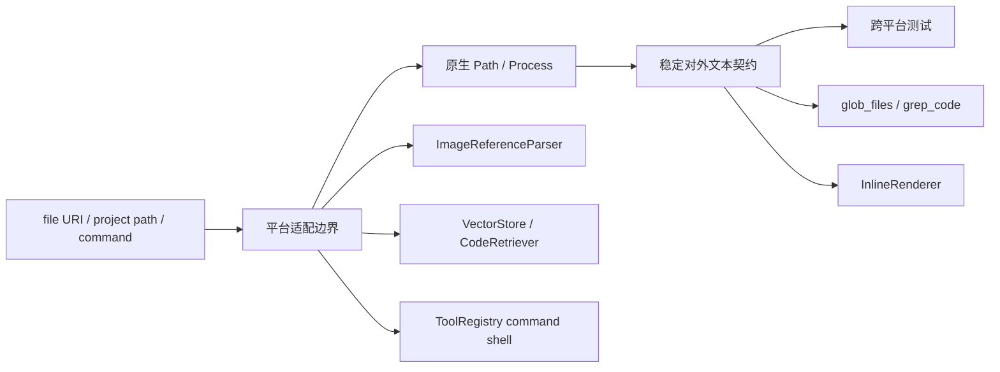

# Windows 跨平台兼容性修复方案

> 状态：已实现，待提交
> 分支：`fix/windows-cross-platform-tests`

## 1. 背景、目标与非目标

### 1.1 背景

Mode Router 针对性测试和项目打包已经通过，但 Windows 环境的 quick/full 回归仍暴露出路径、换行符、项目身份和 Shell 选择不一致：

- `ImageReferenceParserTest` 的 Windows `file://` 路径解析失败。
- `MemoryManagerTest`、`CodeSearchGoldenSetTest`、`ToolRegistryTest` 将 Unix `/` 写死为断言。
- `CodeRetrieverTest` 使用原始项目路径写入、规范化路径读取，导致 SQLite 项目键不相等。
- `InlineRendererTest` 将 `\n` 写死，未考虑 Windows `\r\n`。
- `ToolRegistry.execute_command` 固定启动 `bash`，普通 Windows 环境无法执行。

### 1.2 目标

1. Windows、Linux 和 macOS 使用相同的稳定工具输出契约。
2. 内部文件访问继续使用平台原生 `Path`，仅在模型/用户可见的相对路径中统一使用 `/`。
3. 正确解析 Windows 本地文件 URI、空格、中文和 percent encoding。
4. RAG 写入与读取始终使用同一个规范化项目键。
5. 命令执行在 Windows 使用 PowerShell，在类 Unix 系统使用 Bash，并保持现有安全检查、超时和审计链。
6. 消除当前 quick/full 回归中的相关失败。

### 1.3 非目标

- 不引入 Git Bash、WSL 或其他外部运行时依赖。
- 不改变工具授权链、CommandGuard 规则或 HITL 语义。
- 不修改 RAG 数据库 schema；旧索引允许通过 `/index` 重建。
- 不把所有终端输出强制转换为单一平台换行符。
- 不处理 IDE 占用 `target/classes` 导致的文件锁；这是构建进程外部状态。

## 2. 现状分析（源码证据、已知约束）

### 2.1 架构位置

### 2.2 数据/状态模型

- 文件系统内部路径：平台原生绝对或相对 `Path`，不以字符串替代路径运算。
- 工具输出路径：项目相对路径，分隔符统一为 `/`。
- RAG 项目键：绝对、规范化后的平台路径字符串；存在时优先使用 real path。
- 命令执行 shell：由操作系统选择，不从模型输入或环境变量动态覆盖。

### 2.3 核心失败路径

1. `file://D:\...` 当前被转换为 `/D:\...`，文件检测失败。
2. `VectorStore("/tmp/...")` 与 `CodeRetriever` 内部的绝对规范化路径形成不同 SQL key。
3. `Path.toString()` 在 Windows 输出反斜杠，但工具契约测试要求稳定的正斜杠。
4. `PrintStream.println()` 使用系统换行符，测试固定期待 `\n`。
5. Windows 找不到 `bash`，命令在进入超时逻辑前即启动失败。

## 3. 方案设计

### 3.1 接口与数据结构

#### 稳定路径显示

在现有工具实现边界增加小型路径格式化方法，将项目相对路径中的 `\\` 转换为 `/`。该方法只用于 `glob_files`、Java/ripgrep 搜索结果和 suggested reads，不改变 `PathGuard` 或实际文件访问路径。

#### Windows 文件 URI

`ImageReferenceParser.fileUriToLocalPath` 区分：

- `file:///D:/path`：标准 Windows drive URI。
- `file://D:\path`：宽容支持的非标准本地路径。
- `file://server/share/path`：UNC 路径。
- POSIX `file:///tmp/path`：保持现有语义。

percent decoding 继续使用 UTF-8，未编码空格和中文原样保留。

#### RAG 项目键

抽取单一规范化入口，由 `VectorStore` 构造函数统一处理项目路径；`CodeRetriever`、索引和测试不再分别决定字符串形式。旧数据库无需 schema migration，但规范化前写入的项目键需要重新 `/index`。

#### Shell 选择

命令执行仍先经过 `CommandGuard`。通过平台检测生成固定 argv：

- Windows：`powershell.exe -NoProfile -NonInteractive -Command <command>`。
- Linux/macOS：`bash -c <command>`。

若目标 shell 不存在，返回明确的启动失败消息；超时后仍强制终止进程。

### 3.2 策略、安全、并发与恢复

- shell 选择发生在策略检查之后，不允许输入指定可执行文件来绕过策略。
- `ProcessBuilder.directory`、环境清理、输出读取线程和超时保持现状。
- 路径显示格式化不参与授权；授权仍基于 `PathGuard` 解析后的原生路径。
- RAG 索引可重建，因此不增加数据库迁移和回滚复杂度。

### 3.3 兼容性、迁移与回滚

- 对外路径统一为 `/`，与当前测试、prompt 和 JSON 示例一致。
- Windows 命令语法改为 PowerShell；类 Unix 行为不变。
- 旧 RAG 索引如因项目键格式不同无法读取，执行 `/index` 重建。
- 所有修改保持局部，可逐模块回滚。

## 4. 实现任务与测试矩阵

| 边界 | 先行测试 | 验收行为 |
|---|---|---|
| 图片 URI | `ImageReferenceParserTest` | Windows drive、空格、中文、`%20` 均可解析 |
| Memory 路径 | `MemoryManagerTest` | 使用 `Path` 比较，不写死分隔符 |
| RAG 项目键 | `CodeRetrieverTest`, `VectorStoreTest` | 写入和检索使用相同 canonical key |
| Renderer 换行 | `InlineRendererTest` | 断言系统换行符或等价文本语义 |
| Glob/Grep 输出 | `ToolRegistryTest`, `CodeSearchGoldenSetTest` | 对外路径统一为 `/` |
| 命令 Shell | `ToolRegistryTest` | Windows PowerShell、Unix Bash 均支持超时 |

验证顺序：逐边界 RED/GREEN、相关测试组、`mvn test -Pquick`、`mvn test -DskipTests=false`、`mvn clean package`、`git diff --check`。

## 5. 验收清单

- [x] 不要求安装 Git Bash 或 WSL。
- [x] Windows 本地图片 URI 全部通过。
- [x] RAG 项目路径写入/读取规范化一致。
- [x] 工具输出路径跨平台稳定为 `/`。
- [x] Renderer 测试不再写死 Unix 换行符。
- [x] Windows 使用 PowerShell，类 Unix 使用 Bash。
- [x] CommandGuard、HITL、审计和超时语义保持不变。
- [ ] quick/full、普通 package 和 `git diff --check` 已通过；`mvn clean package` 仍因外部进程锁定 `target/classes/prompts` 无法删除目录。
