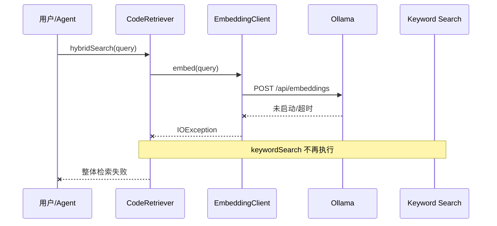
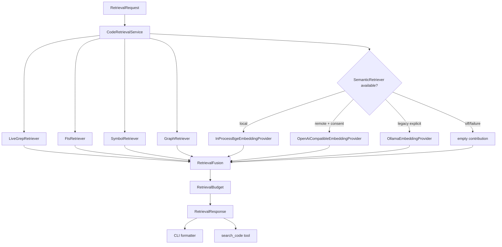
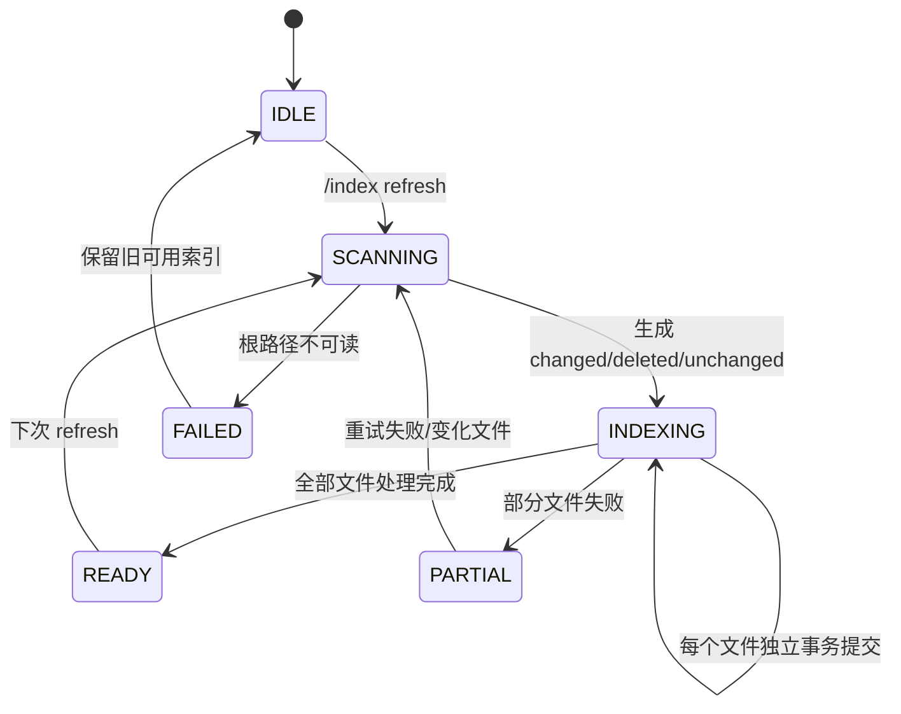

# Local-First 分层代码检索实现计划

> **For agentic workers:** REQUIRED SUB-SKILL: 使用 `subagent-driven-development`（推荐）或 `executing-plans` 逐任务实施。所有步骤用 checkbox 跟踪；每个生产代码边界先写失败测试，再写最小实现。未经用户明确允许不得 commit、push、创建 PR 或合并。

**Goal:** 将当前依赖 Ollama 的代码 RAG 改造成零外部服务即可工作的本地优先分层检索：FTS5、精确搜索和 Java 结构关系始终可用，JAR 内量化 ONNX Embedding 作为默认语义增强，远程 Embedding 与 Ollama 仅显式启用。

**Architecture:** 检索拆成“索引存储、候选召回、可选语义、确定性融合、展示/Agent 接线”五层。SQLite 保存内容哈希、代码块、FTS5、符号、关系、向量和索引 manifest；所有召回器独立失败，融合器只消费成功结果，任何 Embedding 故障都不得阻断本地检索。

**Tech Stack:** Java 17、JUnit 5、SQLite/FTS5、JavaParser、OkHttp、Jackson、LangChain4j in-process BGE-small-zh-v1.5 quantized `1.18.0-beta28`、ONNX Runtime、Maven Shade。

## 1. 背景、目标与非目标

### 1.1 背景

当前实现把 `EmbeddingClient` 默认配置为 Ollama + `nomic-embed-text:latest`。`CodeIndex` 为每个 chunk 同步请求 Embedding，`CodeRetriever.hybridSearch()` 又先执行语义查询，因此 Ollama 不可用时，所谓“混合检索”会在关键词结果产生前失败。

这与成熟编码 Harness 的主流实践不一致：

- Aider 用 Tree-sitter、依赖图和 token-budget repo map 提供结构上下文，不把 Embedding 作为启动依赖：<https://aider.chat/docs/repomap.html>。
- Cline 和 OpenCode 的基础搜索以 ripgrep/glob/read 为主，Agent 通过确定性工具逐步收集证据：<https://github.com/cline/cline/blob/main/docs/tools-reference/all-cline-tools.mdx>、<https://opencode.ai/docs/tools/>。
- Continue 同时维护 Tree-sitter snippets、SQLite FTS5 和可选 LanceDB 向量索引，并用内容哈希做增量索引：<https://github.com/continuedev/continue/blob/main/core/indexing/README.md>。
- Sourcegraph Cody 企业版移除 Embedding，原因包括代码外发、维护成本和索引刷新复杂度，转而组合关键词搜索和代码图：<https://sourcegraph.com/docs/cody/faq>。

结论不是“Embedding 没有价值”，而是“Embedding 必须是可替换、可降级的召回器，不能定义 Harness 是否可用”。

### 1.2 目标

1. 删除 Ollama 的默认依赖，保留显式兼容模式。
2. 引入始终可用的 SQLite FTS5 与结构化关系召回。
3. 把量化 `BGE-small-zh-v1.5` 模型随主 JAR 分发，在 JVM 内进程推理。
4. 把远程 Embedding 纳入与 LLM provider 一致的预设与 Key 管理。
5. 支持内容哈希增量索引、事务 checkpoint 和模型版本隔离。
6. 用确定性融合、去重和 token 预算统一 CLI 与 Agent 返回。
7. 在 Embedding 超时、加载失败、配置错误或熔断时返回本地检索结果。

### 1.3 非目标

- 不在本阶段引入独立向量数据库、守护进程或 sidecar。
- 不自动下载未随 JAR 分发的模型。
- 不静默上传整个代码库到当前聊天 provider。
- 不实现跨仓库、组织级或云端集中索引。
- 不实现 GPU 推理；内置模型只使用 CPU。
- 不在本阶段新增真实 LSP JSON-RPC client；保留 `CodeNavigationProvider` 扩展点。
- 不让 RAG 替代 `grep_code`、`glob_files`、`read_file` 的实时精确定位职责。

### 1.4 验收口径

- 全新用户只配置聊天 LLM Key 即可使用 CodeAgent；不需要安装 Ollama。
- 删除/关闭所有 Embedding provider 后，`/search` 仍能返回 FTS、符号和关系结果。
- 本地模式不会发出 Embedding HTTP 请求。
- 远程模式第一次对某项目索引前必须确认，拒绝后无网络请求且本地检索继续工作。
- 同一文件未变化时 `/index` 不重新切块或生成向量；变化后只替换该文件数据。
- 结果包含路径、行号、符号、命中来源和可解释分数，不返回不可追溯的纯文本摘要。

### 1.5 全局约束

- 只有 JDK 17、没有 Ollama、没有 Embedding API Key 时，CLI、`/index`、`/search` 和 `search_code` 必须可用。
- 默认不启动外部进程、不监听端口、不访问网络；本地 ONNX 模型只在索引或语义查询真正需要时懒加载。
- `grep_code` 继续承担最新磁盘内容的精确定位；`search_code` 是模糊语义、FTS 和结构关系的辅助入口。
- 远程 Embedding 只有项目级显式同意后才能接收代码；历史对话、LLM 推断或其他项目同意不能作为授权来源。
- Embedding provider、模型 ID、向量维度或 chunker 版本变化时不得混用旧向量。
- 索引只读取项目根内、满足忽略规则的文件；不得索引 `.env`、密钥、raw session、`.git`、构建产物和符号链接逃逸目标。
- 所有 Agent 调用仍经 `ToolRegistry.executeTools()`；不得在 Agent/Plan/SubAgent 复制检索执行循环。
- 本阶段不把现有 `LspManager` 描述成真实 LSP 客户端；它目前只做 JavaParser 语法诊断。definition/reference 检索保留接口扩展点，但不作为本次验收前提。
- 现有 `~/.codeagent/rag/codebase.db` 不原地破坏；v2 schema 在事务内创建，旧数据只读识别并提示重建。
- 不自动提交代码；每个任务结束以测试和 diff review 作为 checkpoint。

## 2. 现状分析（源码证据、已知约束）

### 2.1 架构位置

当前主链：

```mermaid
flowchart LR
    CLI[/index /search] --> CI[CodeIndex]
    TOOL[search_code] --> CR[CodeRetriever]
    CI --> CC[CodeChunker]
    CI --> EC[EmbeddingClient]
    CI --> VS[(VectorStore SQLite)]
    CR --> EC
    CR --> VS
    VS --> JSON[embedding_json 全表读取]
    JSON --> COS[Java 余弦计算]
```

源码证据：

- `EmbeddingClient.java:27-29` 默认 `ollama`、`nomic-embed-text:latest`、`localhost:11434`。
- `CodeIndex.java:87-90` 对每个代码块调用 Embedding。
- `CodeRetriever.java:48-63` 先语义搜索，再关键词搜索；语义异常会终止整个方法。
- `VectorStore.java:175-198` 全表读取 JSON 向量并在 Java 中逐条计算相似度。
- `Main.java:967-1001` CLI 直接 new `CodeIndex`/`CodeRetriever`，没有配置注入和统一检索门面。
- `ToolRegistry.java` 的 `search_code` 也直接 new `CodeRetriever`，CLI 与 Agent 接线重复。

### 2.2 数据/状态模型

当前 `code_chunks` 同表保存正文和 `embedding_json`，缺少：

- 文件内容哈希与增量状态；
- 模型 ID、维度和 chunker 版本；
- 行号和符号类型的稳定索引；
- FTS5 虚表；
- 索引运行状态、部分失败和恢复 checkpoint；
- Embedding provider 可用性与失败隔离。

当前 `/index` 是内存中全量构建后 `clearProject()` + 全量插入。大型仓库会同时持有全部正文、关系和向量，且中断后无法从文件边界恢复。

### 2.3 核心时序与失败路径



该失败路径是本次必须优先消除的行为缺陷。

### 2.4 依赖与打包约束

- 当前 Shade JAR 约 33MB，主类为 `com.codeagent.cli.Main`。
- `langchain4j-embeddings-bge-small-zh-v15-q:1.18.0-beta28` 在 Maven Central 提供 in-process 量化模型，依赖自身 Apache-2.0；模型 BGE-small-zh-v1.5 为 MIT。实现时必须将第三方 NOTICE/许可证纳入发行审查。
- ONNX Runtime 使用 native library；Shade 后必须在 Windows x64、Linux x64、macOS x64 实际启动验证。未验证的平台必须自动关闭语义层，不得阻断 CLI。

## 3. 方案设计

### 3.1 接口与数据结构

#### 3.1.1 总体架构



唯一公开门面：

```java
public interface CodeRetrievalService extends AutoCloseable {
    RetrievalResponse search(RetrievalRequest request);
    IndexRefreshResult refresh(IndexRefreshRequest request);
    RetrievalIndexStatus status();
}
```

CLI 和 `ToolRegistry` 只依赖该接口；不得直接 new provider/store/retriever。

#### 3.1.2 核心模型

```java
public record RetrievalRequest(
        Path projectRoot,
        String query,
        int topK,
        int maxChars,
        boolean includeLiveSearch
) {}

public enum RetrievalSource {
    LIVE_GREP,
    FTS,
    SYMBOL,
    GRAPH,
    SEMANTIC_LOCAL,
    SEMANTIC_REMOTE,
    SEMANTIC_OLLAMA
}

public record RetrievalHit(
        String filePath,
        int startLine,
        int endLine,
        String chunkType,
        String symbol,
        String content,
        double score,
        Set<RetrievalSource> sources
) {}

public record RetrievalResponse(
        List<RetrievalHit> hits,
        RetrievalDiagnostics diagnostics,
        boolean partial
) {}
```

`RetrievalDiagnostics` 只记录 provider ID、各召回器耗时、命中数、降级原因和索引版本，不记录查询正文、代码正文、API Key 或向量 payload。

#### 3.1.3 Embedding provider 边界

```java
public interface EmbeddingProvider extends AutoCloseable {
    String id();
    String modelId();
    int dimension();
    EmbeddingLocality locality();
    List<float[]> embedAll(List<String> inputs) throws EmbeddingException;
}

public enum EmbeddingLocality {
    IN_PROCESS,
    REMOTE,
    EXTERNAL_PROCESS
}
```

实现：

- `InProcessBgeEmbeddingProvider`：懒创建 `BgeSmallZhV15QuantizedEmbeddingModel`，固定 `modelId=bge-small-zh-v1.5-q`、`dimension=512`。
- `OpenAiCompatibleEmbeddingProvider`：批量调用 `/embeddings`，用于 GLM、Jina、OpenAI-compatible。
- `OllamaEmbeddingProvider`：保留 `/api/embeddings` 兼容路径，但只能显式选择。
- `DisabledEmbeddingProvider`：不抛异常，返回 unavailable capability；索引只跳过向量层。

`EmbeddingProviderFactory` 输入 `CodeAgentConfig`、项目根和 consent store，返回 `EmbeddingResolution`：

```java
public record EmbeddingResolution(
        Optional<EmbeddingProvider> provider,
        String reason,
        boolean consentRequired
) {}
```

默认 `embedding.mode=local`。`auto` 不得偷偷选择远程；它等价于“local 可用则 local，否则 off”。

#### 3.1.4 Provider 配置与隐私授权

`CodeAgentConfig` 新增：

```java
public static class EmbeddingConfig {
    private String mode = "local";       // local | remote | ollama | off
    private String provider;
    private String model;
    private String baseUrl;
    private String apiKey;
}
```

优先级：

1. `~/.codeagent/config.json` 的 `embedding`；
2. `EMBEDDING_*` 环境变量兼容层；
3. 默认 `local`。

内置 remote descriptor：

| ID | Base URL | 默认模型 | Key 来源 |
|---|---|---|---|
| `glm` | `https://open.bigmodel.cn/api/paas/v4` | `embedding-3` | 复用 `providers.glm.apiKey` |
| `jina` | `https://api.jina.ai/v1` | `jina-code-embeddings-1.5b` | `providers.jina.apiKey` / `JINA_API_KEY` |
| `openai-compatible` | 必填覆盖 | 必填覆盖 | `embedding.apiKey` |

远程授权记录：

```java
public record RemoteEmbeddingConsent(
        String projectFingerprint,
        String providerId,
        String modelId,
        Instant grantedAt
) {}
```

`projectFingerprint` 为真实项目根规范化后 SHA-256；配置中不保存代码路径和代码内容。provider/model 任一变化必须重新询问。拒绝授权只关闭远程语义层，不能中止 `/index`。

#### 3.1.5 SQLite v2 schema

数据库仍使用 `~/.codeagent/rag/codebase.db`，新增 versioned v2 tables：

```sql
CREATE TABLE IF NOT EXISTS rag_schema (
    version INTEGER NOT NULL
);

CREATE TABLE IF NOT EXISTS indexed_files_v2 (
    project_path TEXT NOT NULL,
    file_path TEXT NOT NULL,
    content_hash TEXT NOT NULL,
    size_bytes INTEGER NOT NULL,
    modified_millis INTEGER NOT NULL,
    language TEXT NOT NULL,
    index_status TEXT NOT NULL,
    last_error TEXT,
    PRIMARY KEY (project_path, file_path)
);

CREATE TABLE IF NOT EXISTS code_chunks_v2 (
    id INTEGER PRIMARY KEY AUTOINCREMENT,
    project_path TEXT NOT NULL,
    file_path TEXT NOT NULL,
    start_line INTEGER NOT NULL,
    end_line INTEGER NOT NULL,
    chunk_type TEXT NOT NULL,
    symbol TEXT NOT NULL,
    content TEXT NOT NULL,
    content_hash TEXT NOT NULL
);

CREATE VIRTUAL TABLE IF NOT EXISTS code_chunks_fts_v2 USING fts5(
    symbol,
    content,
    content='code_chunks_v2',
    content_rowid='id',
    tokenize='unicode61'
);

CREATE TABLE IF NOT EXISTS code_relations_v2 (
    project_path TEXT NOT NULL,
    file_path TEXT NOT NULL,
    from_name TEXT NOT NULL,
    to_name TEXT NOT NULL,
    relation_type TEXT NOT NULL,
    line_number INTEGER NOT NULL
);

CREATE TABLE IF NOT EXISTS chunk_embeddings_v2 (
    chunk_id INTEGER NOT NULL,
    model_id TEXT NOT NULL,
    dimension INTEGER NOT NULL,
    vector_blob BLOB NOT NULL,
    PRIMARY KEY (chunk_id, model_id),
    FOREIGN KEY (chunk_id) REFERENCES code_chunks_v2(id) ON DELETE CASCADE
);

CREATE TABLE IF NOT EXISTS index_manifest_v2 (
    project_path TEXT PRIMARY KEY,
    schema_version INTEGER NOT NULL,
    chunker_version INTEGER NOT NULL,
    embedding_model_id TEXT,
    embedding_dimension INTEGER,
    state TEXT NOT NULL,
    updated_at TEXT NOT NULL
);
```

向量以 little-endian float32 BLOB 保存。读取时先校验 `dimension * Float.BYTES == blob.length`；不匹配的数据跳过并记录 diagnostics，不得参与计算。

### 3.2 策略、安全、并发与恢复

#### 3.2.1 增量索引与恢复



算法：

1. 路径经过现有 PathGuard 等价规则约束并转 real path。
2. 遵守 `.gitignore`，再叠加固定敏感/构建目录排除表。
3. 先用 `size + modified_millis` 快速判断；变化时计算 SHA-256。
4. `content_hash` 相同则不切块、不分析、不生成向量。
5. 每个文件在单个 SQLite transaction 中删除旧 chunks/relations/embeddings，再插入新数据。
6. FTS external-content 索引与 chunk 表在同一 transaction 更新。
7. 单文件失败写 `index_status=FAILED` 和脱敏错误摘要，继续其他文件。
8. 删除文件在单独 transaction 清理所有关联记录。
9. 最终 manifest 写 `READY` 或 `PARTIAL`；进程崩溃时已提交文件无需重做。

#### 3.2.2 检索融合

召回器独立返回有序列表，不共享异常：

```java
public interface CodeRetrieverStage {
    RetrievalSource source();
    List<RetrievalCandidate> retrieve(RetrievalContext context) throws Exception;
}
```

默认召回：

- FTS5：`bm25(code_chunks_fts_v2)`，取 `max(topK * 4, 20)`。
- Symbol：类名、方法名、文件名 exact/prefix/case-insensitive，取 20。
- Graph：以 symbol 命中为种子，扩一跳 `contains/calls/extends/implements/imports`，取 20。
- Semantic：若 provider 可用且 manifest 模型一致，精确余弦 top-k；否则贡献空列表。
- Live grep：只从查询 tokenizer 产生的标识符 token 中选择最多 3 个，使用现有搜索引擎，避免把自然语言整句当正则。

融合使用 RRF。对候选项 `d`，其融合分数定义为：

```text
RRF(d) = Σ 1 / (60 + rank_i(d))
```

其中 `rank_i(d)` 是候选项 `d` 在第 `i` 个召回器结果中的名次；未命中的召回器不贡献分数。

再应用稳定 boost：

- symbol 大小写精确命中：`+0.20`
- 定义型 chunk（class/method）：`+0.10`
- graph 与另一来源同时命中：`+0.05`
- 两种及以上独立来源命中：`+0.05`

最终按 `score desc, filePath asc, startLine asc` 排序；同一文件最多 3 条。`RetrievalBudget` 同时执行 `topK` 和 `maxChars`，不得从代码点中截断一行；若首条结果就超限，保留其前 `maxChars` 并标记 `partial=true`。

#### 3.2.3 Repo map 与 Harness 上下文

新增 `RepositoryMapBuilder`，从 `symbols + relations` 生成紧凑 map：

```text
src/main/java/com/codeagent/rag/CodeRetriever.java
  class CodeRetriever
    hybridSearch(String query, int topK)
    semanticSearch(String query, int topK)
```

Repo map 不自动全量注入每个 turn。只有以下情况使用：

- Planner 需要项目全局结构且没有明确文件；
- `search_code` 的查询是架构性问题；
- 用户显式 `/graph` 或未来 `/map` 请求。

`RepositoryMapSelector` 使用 query token、关系入度和文件路径相关性选择片段，默认预算 1,500 tokens。它只选择已有确定性索引，不调用 Embedding，因此不会引入新的权限或网络边界。

#### 3.2.4 CLI 与工具行为

保持已有命令兼容：

```text
/index [路径]          增量 refresh，默认当前项目
/search <查询>         分层检索，不要求 Embedding
/graph <符号>          查询结构关系
```

新增 `/index` 子命令：

```text
/index status
/index refresh [路径]
/index rebuild [路径]
/index clear [路径]
```

Embedding 配置复用 `/config`，不新增新的顶级斜杠命令：

```text
/config embedding status
/config embedding local
/config embedding off
/config embedding provider glm
/config embedding provider jina
/config embedding ollama
```

`search_code` 输出 JSON 文本应包含：

```json
{
  "query": "上下文在哪里压缩",
  "partial": false,
  "degraded": ["semantic_remote_timeout"],
  "results": [
    {
      "file": "src/main/java/com/codeagent/memory/ConversationHistoryCompactor.java",
      "start_line": 42,
      "end_line": 78,
      "symbol": "compactIfNeeded",
      "sources": ["FTS", "SYMBOL"],
      "score": 0.143,
      "content": "..."
    }
  ]
}
```

#### 3.2.5 安全、并发与恢复

- 索引为只读文件访问，不触发 HITL；`/index clear/rebuild` 只删除 CodeAgent 自己的派生索引，但必须精确绑定 project fingerprint。
- remote consent 由 CLI/HITL handler 获取；Runtime API 和 WeChat 默认禁止远程全库索引，除非已有项目级授权。
- 单项目同一时刻只允许一个 writer；查询使用独立只读连接并看到最近一次提交。
- 本地 Embedding executor 最大线程数为 `min(availableProcessors, 4)`，避免抢占 ToolRegistry 的并发池。
- remote batch 默认 32 个 chunk；`408/429/5xx` 最多 3 次，读取 `Retry-After`。任何已经成功写入的文件 transaction 不回滚。
- 连续 3 次远程失败后对该 provider 熔断 60 秒；熔断期间直接走本地检索，不阻塞等待。
- diagnostics 和日志不得记录 API Key、Authorization、代码正文、向量和查询全文。

### 3.3 兼容性、迁移与回滚

- 读取到只有旧 `code_chunks` 表的数据库时，`status()` 返回 `LEGACY_REBUILD_REQUIRED`。
- 第一次 `/index` 创建 v2 tables；成功后查询切到 v2。旧表不删除，便于回滚旧版本。
- `CODEAGENT_RAG_SCHEMA=v1` 不是公开开关，不引入双写；回滚通过运行旧 JAR 继续读取旧表。
- 原 `EMBEDDING_PROVIDER/MODEL/BASE_URL/API_KEY` 继续读取一个发布周期，但启动时不因 `ollama` 默认值而主动探测。
- `.env.example` 删除未注释的 Ollama 默认配置，改为高级兼容示例。

## 4. 实现任务与测试矩阵

### 4.1 新增文件

```text
src/main/java/com/codeagent/rag/
├── RetrievalRequest.java
├── RetrievalResponse.java
├── RetrievalHit.java
├── RetrievalSource.java
├── RetrievalDiagnostics.java
├── CodeRetrievalService.java
├── DefaultCodeRetrievalService.java
├── RetrievalFusion.java
├── RetrievalBudget.java
├── RetrievalIndexStatus.java
├── IndexRefreshRequest.java
├── IndexRefreshResult.java
├── SqliteRetrievalIndex.java
├── RepositoryMapBuilder.java
├── RepositoryMapSelector.java
├── embedding/
│   ├── EmbeddingProvider.java
│   ├── EmbeddingLocality.java
│   ├── EmbeddingException.java
│   ├── EmbeddingResolution.java
│   ├── EmbeddingProviderFactory.java
│   ├── InProcessBgeEmbeddingProvider.java
│   ├── OpenAiCompatibleEmbeddingProvider.java
│   ├── OllamaEmbeddingProvider.java
│   └── RemoteEmbeddingConsentStore.java
└── stage/
    ├── CodeRetrieverStage.java
    ├── FtsRetriever.java
    ├── SymbolRetriever.java
    ├── GraphRetriever.java
    ├── SemanticRetriever.java
    └── LiveGrepRetriever.java
```

### 4.2 修改文件

```text
pom.xml
.env.example
AGENTS.md
CODEAGENT.md
README.md
docs/agents-reference.md
docs/dev/04-code-rag-graph.md
src/main/java/com/codeagent/config/CodeAgentConfig.java
src/main/java/com/codeagent/cli/CliCommandParser.java
src/main/java/com/codeagent/cli/CodeAgentCompleter.java
src/main/java/com/codeagent/cli/Main.java
src/main/java/com/codeagent/tool/ToolRegistry.java
src/main/java/com/codeagent/prompt/PromptAssembler.java（仅在 repo map 接线确有现有注入点时修改）
src/main/resources/prompts/base.md
```

### 4.3 旧类处置

- `EmbeddingClient`：Task 3 后标记 deprecated，所有调用迁移完成后删除；不保留 default-to-Ollama 分支。
- `VectorStore`：Task 2/4 期间作为 v1 兼容读取器保留；v2 查询全部迁移后改名为 `LegacyVectorStore`，只用于识别旧 schema。
- `CodeRetriever`：保留薄适配器一个发布周期，内部委托 `CodeRetrievalService`，避免一次性破坏测试和调用方。
- `CodeIndex`：保留 CLI 兼容 facade，内部委托 `refresh()`。

依赖方向必须是：

```text
CLI / ToolRegistry
        ↓
CodeRetrievalService
        ↓
Retriever stages / Index coordinator
        ↓
EmbeddingProvider / SqliteRetrievalIndex / existing code search engine
```

底层不得反向依赖 `Main`、Renderer、Agent 或 HITL UI。

### 4.4 分步实现任务

#### Task 1：配置模型、provider 契约与远程授权

**Files:**

- Create: `src/main/java/com/codeagent/rag/embedding/EmbeddingProvider.java`
- Create: `src/main/java/com/codeagent/rag/embedding/EmbeddingLocality.java`
- Create: `src/main/java/com/codeagent/rag/embedding/EmbeddingException.java`
- Create: `src/main/java/com/codeagent/rag/embedding/EmbeddingResolution.java`
- Create: `src/main/java/com/codeagent/rag/embedding/RemoteEmbeddingConsentStore.java`
- Modify: `src/main/java/com/codeagent/config/CodeAgentConfig.java`
- Test: `src/test/java/com/codeagent/config/CodeAgentEmbeddingConfigTest.java`
- Test: `src/test/java/com/codeagent/rag/embedding/RemoteEmbeddingConsentStoreTest.java`

**Interfaces:**

- Produces `EmbeddingProvider.embedAll(List<String>)` for Tasks 3-5.
- Produces `CodeAgentConfig.getEmbedding()` with `mode=local` default.
- Produces project/provider/model-scoped consent without raw path persistence.

- [ ] **Step 1:** 写配置 JSON 向后兼容、默认 local、环境变量兼容、Key 不回显测试。
- [ ] **Step 2:** 写 consent fingerprint、provider/model 变化失效、拒绝不持久化测试。
- [ ] **Step 3:** 运行：

  ```powershell
  mvn test -DskipTests=false "-Dtest=CodeAgentEmbeddingConfigTest,RemoteEmbeddingConsentStoreTest"
  ```

  预期：因新类型不存在而 FAIL。

- [ ] **Step 4:** 实现上节接口和配置序列化；`EmbeddingException` 必须包含稳定 `reasonCode`，不得塞响应正文。
- [ ] **Step 5:** 重跑上述命令，预期全部 PASS；检查临时 config 不含测试 API Key 明文输出。
- [ ] **Step 6:** Review checkpoint：`git diff --check`，审查配置兼容与敏感信息边界。

#### Task 2：SQLite v2 schema、BLOB 编码与增量文件事务

**Files:**

- Create: `src/main/java/com/codeagent/rag/SqliteRetrievalIndex.java`
- Create: `src/main/java/com/codeagent/rag/RetrievalIndexStatus.java`
- Create: `src/main/java/com/codeagent/rag/IndexRefreshRequest.java`
- Create: `src/main/java/com/codeagent/rag/IndexRefreshResult.java`
- Create: `src/test/java/com/codeagent/rag/SqliteRetrievalIndexTest.java`
- Modify: `src/main/java/com/codeagent/rag/CodeChunk.java`（补稳定行号/符号辅助方法，不改变 record 序列化字段）

**Interfaces:**

```java
public final class SqliteRetrievalIndex implements AutoCloseable {
    public FileSnapshot findFile(Path projectRoot, Path relativePath);
    public void replaceFile(FileIndexBatch batch);
    public void deleteFile(Path projectRoot, Path relativePath);
    public List<RetrievalCandidate> searchFts(Path projectRoot, String query, int limit);
    public List<RetrievalCandidate> searchSymbols(Path projectRoot, String query, int limit);
    public List<RetrievalCandidate> searchVector(Path projectRoot, String modelId, float[] query, int limit);
    public RetrievalIndexStatus status(Path projectRoot);
}
```

- [ ] **Step 1:** 写 schema 创建、FTS trigger/同步、float32 BLOB round-trip、维度损坏跳过测试。
- [ ] **Step 2:** 写单文件 replace transaction、删除级联、失败 rollback、legacy schema detection 测试。
- [ ] **Step 3:** 运行：

  ```powershell
  mvn test -DskipTests=false "-Dtest=SqliteRetrievalIndexTest"
  ```

  预期：FAIL，新存储类不存在。

- [ ] **Step 4:** 实现 v2 schema 和 prepared statements；SQLite connection 启用 foreign keys 和 busy timeout。
- [ ] **Step 5:** 实现 BLOB codec，使用 `ByteBuffer.order(ByteOrder.LITTLE_ENDIAN)`；禁止 JSON fallback 写入 v2。
- [ ] **Step 6:** 重跑测试并追加现有 `VectorStoreTest`，预期全部 PASS。
- [ ] **Step 7:** Review checkpoint：用测试数据库执行 `PRAGMA integrity_check`，预期 `ok`。

#### Task 3：本地、远程与 Ollama provider

**Files:**

- Modify: `pom.xml`
- Create: `src/main/java/com/codeagent/rag/embedding/InProcessBgeEmbeddingProvider.java`
- Create: `src/main/java/com/codeagent/rag/embedding/OpenAiCompatibleEmbeddingProvider.java`
- Create: `src/main/java/com/codeagent/rag/embedding/OllamaEmbeddingProvider.java`
- Create: `src/main/java/com/codeagent/rag/embedding/EmbeddingProviderFactory.java`
- Test: `src/test/java/com/codeagent/rag/embedding/InProcessBgeEmbeddingProviderTest.java`
- Test: `src/test/java/com/codeagent/rag/embedding/OpenAiCompatibleEmbeddingProviderTest.java`
- Test: `src/test/java/com/codeagent/rag/embedding/EmbeddingProviderFactoryTest.java`
- Modify: `src/test/java/com/codeagent/rag/EmbeddingClientTest.java`

**Dependency:**

```xml
<dependency>
    <groupId>dev.langchain4j</groupId>
    <artifactId>langchain4j-embeddings-bge-small-zh-v15-q</artifactId>
    <version>1.18.0-beta28</version>
</dependency>
```

**Interfaces:**

- Local provider batch API仍逐项推理，但只创建一个共享模型实例。
- Remote provider 支持 `List<String>` 原生 batch request。
- Factory 不做网络探测；只解析配置和授权，第一次 `embedAll` 才实际初始化。

- [ ] **Step 1:** 写本地 provider `id/model/dimension/locality` 和中英文确定性 smoke test。
- [ ] **Step 2:** 用 MockWebServer 写 remote batch、Authorization、429 Retry-After、错误脱敏测试。
- [ ] **Step 3:** 写 factory 默认 local、remote 无授权 unavailable、显式 ollama、off 测试。
- [ ] **Step 4:** 运行对应测试，确认因实现缺失 FAIL。
- [ ] **Step 5:** 添加依赖与最小 provider 实现；executor 最大 4 线程并在 close 时释放。
- [ ] **Step 6:** 重跑测试，预期 PASS；执行：

  ```powershell
  mvn package -DskipTests
  & 'C:\Program Files\Java\jdk-17\bin\jar.exe' tf target\codeagent-1.0-SNAPSHOT.jar | Select-String 'bge|onnxruntime'
  ```

  预期：fat JAR 含模型与 ONNX runtime 资源。
- [ ] **Step 7:** 在无 Ollama 进程的环境运行本地 provider smoke test，预期不访问 `localhost:11434`。
- [ ] **Step 8:** Review checkpoint：记录 JAR 体积增量、冷启动模型加载耗时和单条推理耗时，不把测量值硬编码为 SLA。

#### Task 4：增量索引协调器与敏感文件排除

**Files:**

- Modify: `src/main/java/com/codeagent/rag/CodeIndex.java`
- Create: `src/main/java/com/codeagent/rag/IndexFileScanner.java`
- Create: `src/main/java/com/codeagent/rag/IndexCoordinator.java`
- Test: `src/test/java/com/codeagent/rag/IndexFileScannerTest.java`
- Modify: `src/test/java/com/codeagent/rag/CodeIndexTest.java`
- Create: `src/test/java/com/codeagent/rag/IndexCoordinatorTest.java`

**Interfaces:**

```java
public final class IndexCoordinator {
    public IndexRefreshResult refresh(IndexRefreshRequest request);
    public IndexRefreshResult rebuild(IndexRefreshRequest request);
    public void clear(Path projectRoot);
}
```

- [ ] **Step 1:** 写 `.gitignore`、固定目录、`.env`、raw session、symlink escape 和项目外路径排除测试。
- [ ] **Step 2:** 写 unchanged/changed/deleted、单文件失败 PARTIAL、崩溃后已提交文件不重做测试。
- [ ] **Step 3:** 写 embedding off 仍建立 chunks/FTS/relations、provider 失败只缺向量测试。
- [ ] **Step 4:** 运行测试确认 FAIL。
- [ ] **Step 5:** 实现 scanner、内容哈希和文件级 transaction；索引错误只保存错误类型与文件相对路径。
- [ ] **Step 6:** 把旧 `CodeIndex.index()` 改成 facade，默认调用 `refresh()` 并保留原进度 listener。
- [ ] **Step 7:** 重跑 `CodeIndexTest,IndexFileScannerTest,IndexCoordinatorTest,VectorStoreTest`，预期 PASS。
- [ ] **Step 8:** Review checkpoint：创建包含未跟踪 `.env` 和符号链接的临时项目，确认数据库无敏感正文。

#### Task 5：独立召回器、融合与无 Embedding 降级

**Files:**

- Create: `src/main/java/com/codeagent/rag/RetrievalRequest.java`
- Create: `src/main/java/com/codeagent/rag/RetrievalResponse.java`
- Create: `src/main/java/com/codeagent/rag/RetrievalHit.java`
- Create: `src/main/java/com/codeagent/rag/RetrievalSource.java`
- Create: `src/main/java/com/codeagent/rag/RetrievalDiagnostics.java`
- Create: `src/main/java/com/codeagent/rag/RetrievalFusion.java`
- Create: `src/main/java/com/codeagent/rag/RetrievalBudget.java`
- Create: `src/main/java/com/codeagent/rag/stage/CodeRetrieverStage.java`
- Create: `src/main/java/com/codeagent/rag/stage/FtsRetriever.java`
- Create: `src/main/java/com/codeagent/rag/stage/SymbolRetriever.java`
- Create: `src/main/java/com/codeagent/rag/stage/GraphRetriever.java`
- Create: `src/main/java/com/codeagent/rag/stage/SemanticRetriever.java`
- Create: `src/main/java/com/codeagent/rag/stage/LiveGrepRetriever.java`
- Test: `src/test/java/com/codeagent/rag/RetrievalFusionTest.java`
- Test: `src/test/java/com/codeagent/rag/RetrievalBudgetTest.java`
- Test: `src/test/java/com/codeagent/rag/RetrieverStageIsolationTest.java`
- Test: `src/test/java/com/codeagent/rag/RagQueryTokenizerTest.java`

**Interfaces:** 使用 3.1.2、3.2.2 的精确类型和 RRF 常量。

- [ ] **Step 1:** 为每个 stage 写命中来源、稳定排序和 limit 测试。
- [ ] **Step 2:** 写 semantic 抛异常但 FTS/symbol 结果仍返回且 `partial=true` 的核心回归测试。
- [ ] **Step 3:** 写 RRF、boost、去重、每文件最多 3 条、字符预算测试。
- [ ] **Step 4:** 运行测试确认 FAIL。
- [ ] **Step 5:** 实现 stage 和纯函数 fusion；stage diagnostics 不得包含代码内容。
- [ ] **Step 6:** 新建 `RagQueryTokenizerTest` 固化中文、驼峰、下划线和去重行为；重跑 Task 5 全部测试，预期 PASS。
- [ ] **Step 7:** Review checkpoint：固定输入多跑 20 次，结果顺序必须完全一致。

#### Task 6：统一服务门面与 CLI/ToolRegistry 接线

**Files:**

- Create: `src/main/java/com/codeagent/rag/CodeRetrievalService.java`
- Create: `src/main/java/com/codeagent/rag/DefaultCodeRetrievalService.java`
- Modify: `src/main/java/com/codeagent/rag/CodeRetriever.java`
- Modify: `src/main/java/com/codeagent/tool/ToolRegistry.java`
- Modify: `src/main/java/com/codeagent/cli/Main.java`
- Modify: `src/main/java/com/codeagent/rag/SearchResultFormatter.java`
- Test: `src/test/java/com/codeagent/rag/DefaultCodeRetrievalServiceTest.java`
- Modify: `src/test/java/com/codeagent/rag/CodeRetrieverTest.java`
- Modify: `src/test/java/com/codeagent/tool/ToolRegistryTest.java`
- Create: `src/test/java/com/codeagent/cli/MainRetrievalCommandTest.java`

**Interfaces:**

- `DefaultCodeRetrievalService` 是唯一组装点。
- `ToolRegistry` 通过 constructor/setter 注入共享 service，不得每次调用打开新的 provider/model。
- CLI 与 Agent 使用同一 `RetrievalResponse`，只格式化方式不同。

- [ ] **Step 1:** 写无索引 live fallback、无 Embedding FTS、provider 超时降级、close 生命周期测试。
- [ ] **Step 2:** 写 CLI 与 tool 对同一请求返回相同文件顺序的契约测试。
- [ ] **Step 3:** 写 ToolRegistry `search_code` JSON 包含 sources/lines/partial/degraded 测试。
- [ ] **Step 4:** 运行测试确认 FAIL。
- [ ] **Step 5:** 实现 service 组装并迁移 `CodeRetriever`、Main、ToolRegistry。
- [ ] **Step 6:** 确保 ReAct、PlanExecuteAgent、SubAgent 继续共享 ToolRegistry 路径，不新增 Agent 侧分支。
- [ ] **Step 7:** 运行：

  ```powershell
  mvn test -DskipTests=false "-Dtest=DefaultCodeRetrievalServiceTest,CodeRetrieverTest,ToolRegistryTest,MainRetrievalCommandTest"
  ```

  预期全部 PASS。
- [ ] **Step 8:** Review checkpoint：搜索 `new CodeRetriever`、`new EmbeddingClient`，除兼容 facade/test 外生产代码不得残留。

#### Task 7：命令解析、配置体验与远程确认

**Files:**

- Create: `src/main/java/com/codeagent/cli/IndexCommandParser.java`
- Create: `src/main/java/com/codeagent/cli/EmbeddingConfigCommandParser.java`
- Modify: `src/main/java/com/codeagent/cli/CliCommandParser.java`
- Modify: `src/main/java/com/codeagent/cli/CodeAgentCompleter.java`
- Modify: `src/main/java/com/codeagent/cli/Main.java`
- Modify: `src/test/java/com/codeagent/cli/CliCommandParserTest.java`
- Modify: `src/test/java/com/codeagent/cli/CodeAgentCompleterTest.java`
- Create: `src/test/java/com/codeagent/cli/EmbeddingConfigCommandParserTest.java`
- Create: `src/test/java/com/codeagent/cli/RemoteEmbeddingConsentFlowTest.java`

**Interfaces:**

```java
record IndexCommand(Action action, String path) {
    enum Action { STATUS, REFRESH, REBUILD, CLEAR }
}

record EmbeddingConfigCommand(Action action, String provider) {
    enum Action { STATUS, LOCAL, OFF, REMOTE_PROVIDER, OLLAMA }
}
```

- [ ] **Step 1:** 写所有合法命令、空参数、未知子命令、Windows 路径和旧 `/index [路径]` 兼容测试。
- [ ] **Step 2:** 写补全与帮助文本测试。
- [ ] **Step 3:** 写 remote 首次确认、拒绝、同项目复用、provider/model 变化重问、WeChat/Runtime 非交互拒绝测试。
- [ ] **Step 4:** 运行测试确认 FAIL。
- [ ] **Step 5:** 实现 parser、completer 和 Main handler；确认必须通过已有 HITL/Renderer 通道，不直接 `System.out.println`。
- [ ] **Step 6:** 重跑命令解析矩阵，预期 PASS。
- [ ] **Step 7:** Review checkpoint：未知 `/index xyz` 的兼容解释必须明确——已有路径按路径处理，不存在且匹配已知 action 才按子命令处理。

#### Task 8：Repo map 与结构上下文预算

**Files:**

- Create: `src/main/java/com/codeagent/rag/RepositoryMapBuilder.java`
- Create: `src/main/java/com/codeagent/rag/RepositoryMapSelector.java`
- Test: `src/test/java/com/codeagent/rag/RepositoryMapBuilderTest.java`
- Test: `src/test/java/com/codeagent/rag/RepositoryMapSelectorTest.java`
- Modify: `src/main/resources/prompts/base.md`
- Modify: `src/test/java/com/codeagent/prompt/PromptAssemblerTest.java`（仅验证工具契约文本；不默认注入全量 map）

**Interfaces:**

```java
public record RepositoryMap(String text, int estimatedTokens, boolean partial) {}

public final class RepositoryMapSelector {
    public RepositoryMap select(Path projectRoot, String query, int tokenBudget);
}
```

- [ ] **Step 1:** 写类/接口/record/enum/method 输出和稳定顺序测试。
- [ ] **Step 2:** 写关系入度、query token、1,500 token 预算和 partial 测试。
- [ ] **Step 3:** 运行测试确认 FAIL。
- [ ] **Step 4:** 实现 builder/selector；token 使用现有估算器，不新增 tokenizer 依赖。
- [ ] **Step 5:** 更新 prompt：精确定位仍先 grep；架构性模糊查询可使用 search_code 返回的 repo map/结构证据。
- [ ] **Step 6:** 重跑 prompt 和 repo map 测试，预期 PASS。
- [ ] **Step 7:** Review checkpoint：确认 map 不含方法正文、注释、字符串字面量或 secret。

#### Task 9：迁移、文档、许可证与发布验证

**Files:**

- Modify: `.env.example`
- Modify: `AGENTS.md`
- Modify: `CODEAGENT.md`
- Modify: `README.md`
- Modify: `docs/agents-reference.md`
- Modify: `docs/dev/04-code-rag-graph.md`
- Create: `THIRD_PARTY_NOTICES.md`
- Test: `src/test/java/com/codeagent/rag/LegacyRagMigrationTest.java`
- Test: `src/test/java/com/codeagent/rag/RetrievalPackagingTest.java`

- [ ] **Step 1:** 写 legacy DB 检测、v2 建库、旧表不删除、旧 JAR 可回退的数据测试。
- [ ] **Step 2:** 写 fat JAR 中模型资源、ONNX native resource、Main-Class manifest 测试。
- [ ] **Step 3:** 删除 README 的“运行必须启动 Ollama”，同步新默认、隐私边界、命令和故障降级。
- [ ] **Step 4:** 在 `docs/dev/04-code-rag-graph.md` 明确 v1 历史行为，并链接本实现文档；实现完成后再把实际行为章节更新为 v2。
- [ ] **Step 5:** 核对 LangChain4j、ONNX Runtime、BGE 模型许可证及远程 provider 商用条款，补 `THIRD_PARTY_NOTICES.md`；未经核对不得发布含模型 JAR 或默认启用对应远程 provider。
- [ ] **Step 6:** 运行针对性矩阵：

  ```powershell
  mvn test -DskipTests=false "-Dtest=EmbeddingClientTest,CodeIndexTest,CodeRetrieverTest,VectorStoreTest,SqliteRetrievalIndexTest,IndexCoordinatorTest,RetrievalFusionTest,DefaultCodeRetrievalServiceTest,ToolRegistryTest,CliCommandParserTest,CodeAgentCompleterTest,LegacyRagMigrationTest,RetrievalPackagingTest"
  ```

- [ ] **Step 7:** 运行常规回归和构建：

  ```powershell
  mvn test -Pquick
  mvn test -DskipTests=false
  mvn clean package
  git diff --check
  ```

- [ ] **Step 8:** 在 Windows x64、Linux x64、macOS x64 分别执行：启动 CLI、`/index`、本地 `/search`、关闭 Embedding 后 `/search`、远程拒绝路径。未验证的平台不得标记支持。
- [ ] **Step 9:** Review checkpoint：检查 diff 无 `.env`、API Key、模型缓存、target、数据库、raw session 和审计正文。

### 4.5 测试矩阵

| 维度 | 场景 | 预期 |
|---|---|---|
| 零依赖 | 无 Ollama、无 Embedding Key | CLI、index、FTS/symbol/graph search 可用 |
| 本地语义 | JAR 内 BGE | 无网络请求，返回 512 维向量 |
| 本地故障 | ONNX 加载失败 | semantic unavailable，其他结果正常 |
| 远程授权 | 首次 remote | 确认前零请求；拒绝后本地结果正常 |
| 远程重试 | 429/Retry-After | 有界重试，不重复写索引 |
| 远程熔断 | 连续三次失败 | 60 秒内快速降级 |
| 索引增量 | 单文件变化 | 只重建该文件 |
| 索引删除 | 文件删除 | chunks/FTS/relations/vectors 一并删除 |
| 索引恢复 | 中途崩溃 | 已提交文件不重做 |
| 模型切换 | local → remote | 旧向量不参与，新向量层重建 |
| 维度损坏 | BLOB 长度不符 | 跳过并诊断，不崩溃 |
| 融合 | semantic stage 异常 | FTS/symbol/graph/live 仍返回 |
| 确定性 | 同输入重复运行 | 结果顺序一致 |
| 预算 | 超过 maxChars/topK | 稳定裁剪并 partial=true |
| 隐私 | `.env`、session、symlink escape | 不进入索引 |
| 并发 | 查询与单文件提交同时发生 | 查询看到完整旧版或完整新版，不见半写状态 |
| 打包 | Shade JAR | Main-Class、模型、native 资源存在 |
| 回滚 | 旧表保留 | 旧版本仍可读取 v1 数据 |

### 4.6 发布与观测

#### 4.6.1 指标

只记录聚合指标：

- 各 stage 耗时与命中数量；
- refresh 的 changed/unchanged/deleted/failed 文件数；
- local model 加载成功/失败原因码；
- remote provider 重试、熔断和授权状态；
- fusion 前后候选数量和预算裁剪数量。

不得记录查询、代码、文件绝对路径、向量或认证信息。

#### 4.6.2 分阶段启用

1. 先交付 FTS5 + AST/graph + Embedding 失败降级，移除 Ollama 启动前置。
2. 再启用内嵌模型，但保留 `embedding.mode=off` 回滚路径。
3. 最后开放 remote provider 与 consent UI。
4. 至少完成 30 条中文自然语言到 Java 代码的离线检索样例，比较 `FTS+symbol+graph` 与加入 local semantic 后的 Recall@5；语义层不得降低精确标识符查询的最终排名。

#### 4.6.3 已知风险

- LangChain4j 模型模块仍使用 beta 版本；必须锁定版本、生成依赖树并做 CVE/许可证检查。
- ONNX native 加载对平台和 Shade 资源合并敏感；失败必须可恢复。
- BGE-small-zh 是通用中英文语义模型，不是专用代码模型；最终质量必须以本项目检索集评估，不能用通用榜单替代。
- SQLite FTS5 中文 tokenization 不等于中文语义分词；RagQueryTokenizer 与 symbol/graph 是必要补充。
- 当前 `LspManager` 不是真实 LSP；未来接入 definition/reference 时应实现 `CodeNavigationProvider`，不能继续扩张现有诊断类职责。

## 5. 验收清单

- [ ] 默认配置不包含 Ollama 地址和模型。
- [ ] 无 Embedding provider 时 `/search` 与 `search_code` 可用。
- [ ] Embedding stage 失败不会阻断其他 stage。
- [ ] 内嵌模型随 JAR 分发并懒加载。
- [ ] 远程 provider 使用内置 endpoint/model 预设，用户只提供 Key 和选择。
- [ ] 远程代码上传有项目/provider/model 级明确授权。
- [ ] v2 schema 支持 FTS5、增量文件事务、BLOB 向量与 manifest。
- [ ] 模型、维度、chunker 变化不会混用索引。
- [ ] CLI 与 Agent 共用 `CodeRetrievalService`。
- [ ] 结果包含文件、行号、symbol、sources、score 和 partial/degraded 信息。
- [ ] Repo map 受 token 预算控制且不含正文。
- [ ] 旧 v1 数据不被破坏，回滚路径清楚。
- [ ] 针对性、quick、全量、package 和跨平台 smoke 均有真实结果。
- [ ] README、AGENTS、CODEAGENT、agents-reference、`.env.example` 与命令补全同步。
- [ ] 许可证与第三方 NOTICE 已核对。
- [ ] `git diff --check` 通过且没有敏感或生成文件。

### 5.1 计划自检

- **规格覆盖：** 零服务启动、确定性检索、结构检索、本地 ONNX、远程 provider、Ollama 兼容、隐私授权、增量索引、融合、预算、迁移、打包和文档均有对应任务。
- **类型一致性：** CLI、ToolRegistry 和兼容 facade 统一依赖 `CodeRetrievalService`；Embedding 实现统一依赖 `EmbeddingProvider`。
- **架构边界：** 没有在 Agent 层创建检索循环，没有让底层依赖 Renderer/Main，没有把历史对话当远程上传授权。
- **范围控制：** 真实 LSP navigation、ANN 专用索引、GPU、跨仓库服务明确排除，不阻塞本次主目标。
- **完整性检查：** 所有任务均给出明确文件、接口、命令和预期行为，不保留未决占位项。
