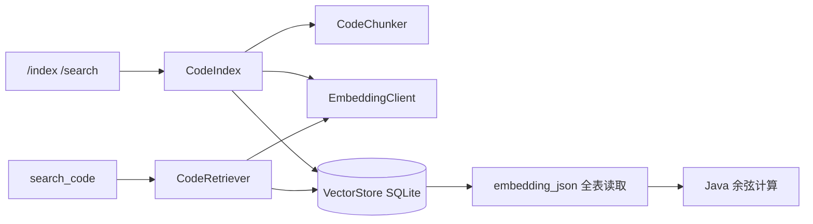
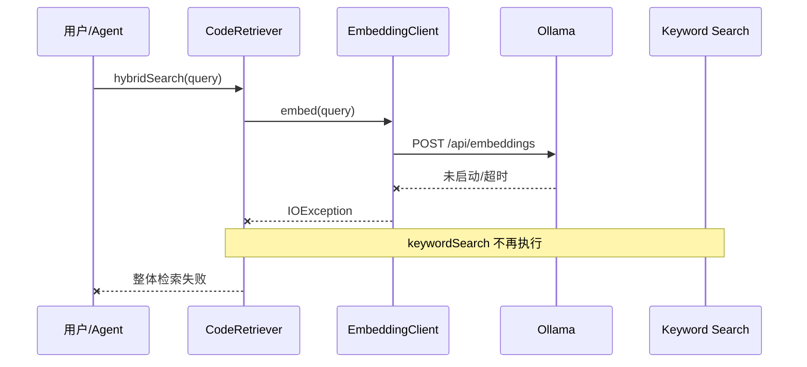
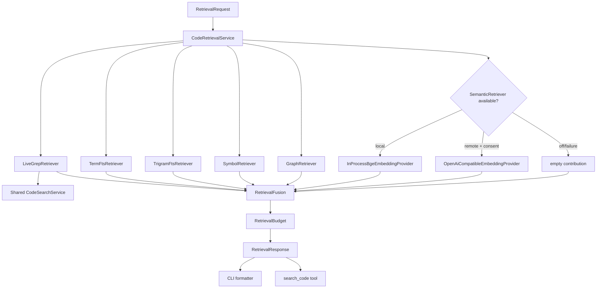
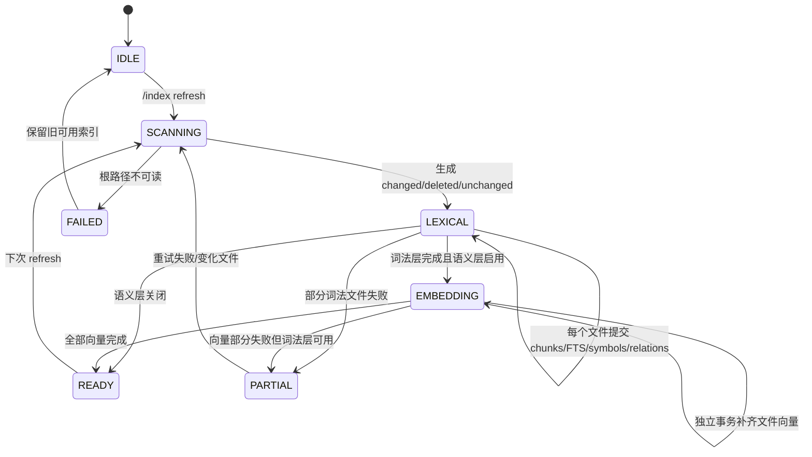

# Local-First 分层代码检索实现计划

> **For agentic workers:** REQUIRED SUB-SKILL: 使用 `subagent-driven-development`（推荐）或 `executing-plans` 逐任务实施。所有步骤用 checkbox 跟踪；每个生产代码边界先写失败测试，再写最小实现。未经用户明确允许不得 commit、push、创建 PR 或合并。

**Goal:** 将当前依赖 Ollama 的代码 RAG 改造成零外部服务即可工作的本地优先分层检索：FTS5、精确搜索和 Java 结构关系始终可用，JAR 内量化 ONNX Embedding 作为默认语义增强，远程 Embedding 仅在显式授权后启用；彻底删除 Ollama provider、配置选项和 HTTP 实现。

**Architecture:** 检索拆成“索引存储、候选召回、可选语义、确定性融合、展示/Agent 接线”五层。SQLite v2 独立数据库保存内容哈希、代码块、规范化词项 FTS、trigram FTS、稳定符号、关系、向量空间和索引 manifest；词法/结构索引先提交，Embedding 在独立事务补齐。所有召回器独立失败，融合器只消费成功结果，任何 Embedding 故障都不得阻断本地检索。

**Tech Stack:** Java 17、JUnit 5、SQLite/FTS5、JavaParser、OkHttp、Jackson、LangChain4j in-process BGE-small-zh-v1.5 quantized `1.18.0-beta28`、ONNX Runtime、Maven Shade。

## 1. 背景、目标与非目标

### 1.1 背景

当前实现把 `EmbeddingClient` 默认配置为 Ollama + `nomic-embed-text:latest`。`CodeIndex` 为每个 chunk 同步请求 Embedding，`CodeRetriever.hybridSearch()` 又先执行语义查询，因此 Ollama 不可用时，所谓“混合检索”会在关键词结果产生前失败。

这与成熟编码 Harness 的主流实践不一致：

- Aider 用 Tree-sitter、依赖图和 token-budget repo map 提供结构上下文，不把 Embedding 作为启动依赖：<https://aider.chat/docs/repomap.html>。
- Cline 和 OpenCode 的基础搜索以 ripgrep/glob/read 为主，Agent 通过确定性工具逐步收集证据：<https://github.com/cline/cline/blob/main/docs/tools-reference/all-cline-tools.mdx>、<https://opencode.ai/docs/tools/>。
- Continue 同时维护 Tree-sitter snippets、SQLite FTS5 和可选 LanceDB 向量索引，并用内容哈希做增量索引：<https://github.com/continuedev/continue/blob/main/core/indexing/README.md>。
- Sourcegraph Cody 企业版移除 Embedding，原因包括代码外发、维护成本和索引刷新复杂度，转而组合关键词搜索和代码图：<https://sourcegraph.com/docs/cody/faq>。

结论不是“Embedding 没有价值”，而是“Embedding 必须是可替换、可降级的召回器，不能定义 Harness 是否可用”。

### 1.2 目标

1. 完全删除 Ollama provider、配置选项和 `/api/embeddings` HTTP 实现，不保留可启用的兼容模式。
2. 引入始终可用的 SQLite 规范化词项 FTS5、trigram 子串检索与结构化关系召回。
3. 把量化 `BGE-small-zh-v1.5` 模型随主 JAR 分发，在 JVM 内进程推理。
4. 把远程 Embedding 纳入与 LLM provider 一致的预设与 Key 管理。
5. 支持内容哈希增量索引、词法/向量分层 checkpoint 和完整向量空间版本隔离。
6. 用确定性融合、去重和 token 预算统一 CLI 与 Agent 返回。
7. 在 Embedding 超时、加载失败、配置错误或熔断时返回本地检索结果。

### 1.3 非目标

- 不在本阶段引入独立向量数据库、守护进程或 sidecar。
- 不自动下载未随 JAR 分发的模型。
- 不静默上传整个代码库到当前聊天 provider。
- 不实现跨仓库、组织级或云端集中索引。
- 不实现 GPU 推理；内置模型只使用 CPU。
- 不在本阶段新增真实 LSP JSON-RPC client；保留 `CodeNavigationProvider` 扩展点。
- 不让 RAG 替代 `grep_code`、`glob_files`、`read_file` 的实时精确定位职责。

### 1.4 验收口径

- 全新用户只配置聊天 LLM Key 即可使用 CodeAgent；不需要安装 Ollama。
- 删除/关闭所有 Embedding provider 后，`/search` 仍能返回中文词项 FTS、trigram、符号和关系结果。
- 本地模式不会发出 Embedding HTTP 请求。
- 远程模式第一次对某项目索引前必须确认，拒绝后无网络请求且本地检索继续工作。
- 同一文件及其 chunker/preprocessing 版本未变化时 `/index` 不重新切块；Embedding 空间未变化时不重新生成向量。文件变化后只替换该文件的词法/结构数据，再独立补齐向量。
- 结果包含路径、行号、符号、命中来源和可解释分数，不返回不可追溯的纯文本摘要。

### 1.5 全局约束

- 只有 JDK 17、没有 Ollama、没有 Embedding API Key 时，CLI、`/index`、`/search` 和 `search_code` 必须可用。
- 默认不启动外部进程、不监听端口、不访问网络；本地 ONNX 模型只在索引或语义查询真正需要时懒加载。
- `grep_code` 继续承担最新磁盘内容的精确定位；`search_code` 是模糊语义、FTS 和结构关系的辅助入口。
- 远程 Embedding 只有项目级显式同意后才能接收代码；历史对话、LLM 推断或其他项目同意不能作为授权来源。
- Embedding provider 类型、endpoint 指纹、模型 ID、模型制品修订、向量维度、pooling/normalization、预处理版本或 chunker 版本变化时不得混用旧向量。
- 索引只读取项目根内、满足忽略规则的文件；不得索引 `.env`、密钥、raw session、`.git`、构建产物和符号链接逃逸目标。
- 所有 Agent 调用仍经 `ToolRegistry.executeTools()`；不得在 Agent/Plan/SubAgent 复制检索执行循环。
- 本阶段不把现有 `LspManager` 描述成真实 LSP 客户端；它目前只做 JavaParser 语法诊断。definition/reference 检索保留接口扩展点，但不作为本次验收前提。
- 现有 `~/.codeagent/rag/codebase.db` 不原地修改；v2 使用 `~/.codeagent/rag/codebase-v2.db`。旧数据只读识别并提示重建，旧 JAR 回滚时只能读取冻结的 v1 快照，不能承诺获得 v2 运行后的最新索引。
- 不自动提交代码；每个任务结束以测试和 diff review 作为 checkpoint。

## 2. 现状分析（源码证据、已知约束）

### 2.1 架构位置

当前主链：



源码证据：

- `EmbeddingClient.java:27-29` 默认 `ollama`、`nomic-embed-text:latest`、`localhost:11434`。
- `CodeIndex.java:87-90` 对每个代码块调用 Embedding。
- `CodeRetriever.java:48-63` 先语义搜索，再关键词搜索；语义异常会终止整个方法。
- `VectorStore.java:175-198` 全表读取 JSON 向量并在 Java 中逐条计算相似度。
- `Main.java:967-1001` CLI 直接 new `CodeIndex`/`CodeRetriever`，没有配置注入和统一检索门面。
- `ToolRegistry.java` 的 `search_code` 也直接 new `CodeRetriever`，CLI 与 Agent 接线重复。

### 2.2 数据/状态模型

当前 `code_chunks` 同表保存正文和 `embedding_json`，缺少：

- 文件内容哈希与增量状态；
- 模型 ID、维度和 chunker 版本；
- 行号和符号类型的稳定索引；
- FTS5 虚表；
- 索引运行状态、部分失败和恢复 checkpoint；
- Embedding provider 可用性与失败隔离。

当前 `/index` 是内存中全量构建后 `clearProject()` + 全量插入。大型仓库会同时持有全部正文、关系和向量，且中断后无法从文件边界恢复。

### 2.3 核心时序与失败路径



该失败路径是本次必须优先消除的行为缺陷。

### 2.4 依赖与打包约束

- 当前 Shade JAR 约 33MB，主类为 `com.codeagent.cli.Main`。
- `langchain4j-embeddings-bge-small-zh-v15-q:1.18.0-beta28` 在 [Maven Central](https://central.sonatype.com/artifact/dev.langchain4j/langchain4j-embeddings-bge-small-zh-v15-q/1.18.0-beta28) 提供 in-process 量化模型，依赖自身 Apache-2.0；模型 [BGE-small-zh-v1.5](https://huggingface.co/BAAI/bge-small-zh-v1.5) 为 MIT、hidden size 512、最大序列 512。实现时必须将第三方 NOTICE/许可证纳入发行审查。
- SQLite 官方说明 `unicode61` 把连续 token 字符作为一个 token，而 `trigram` 用于子串匹配；因此中文本地召回不能只做查询侧分词，见 [FTS5 tokenizer 文档](https://www.sqlite.org/fts5.html#tokenizers)。
- ONNX Runtime 使用 native library；Shade 后必须在 Windows x64、Linux x64、macOS x64、macOS arm64 实际启动验证。未验证或无 native 的平台必须自动关闭语义层，不得阻断 CLI。

## 3. 方案设计

### 3.1 接口与数据结构

#### 3.1.1 总体架构



唯一公开门面：

```java
public interface CodeRetrievalService extends AutoCloseable {
    RetrievalResponse search(RetrievalRequest request);
    IndexRefreshResult refresh(IndexRefreshRequest request);
    RetrievalIndexStatus status();
    void reconfigureEmbedding(EmbeddingResolution resolution);
}
```

CLI 和 `ToolRegistry` 只依赖该接口；不得直接 new provider/store/retriever。

#### 3.1.2 核心模型

```java
public record RetrievalRequest(
        Path projectRoot,
        String query,
        int topK,
        int maxChars,
        boolean includeLiveSearch,
        RetrievalIntent intent
) {}

public enum RetrievalIntent {
    CHUNKS,
    ARCHITECTURE
}

public enum RetrievalSource {
    LIVE_GREP,
    FTS_TERMS,
    FTS_TRIGRAM,
    SYMBOL,
    GRAPH,
    SEMANTIC_LOCAL,
    SEMANTIC_REMOTE
}

public record RetrievalHit(
        String filePath,
        int startLine,
        int endLine,
        String chunkType,
        String symbol,
        String content,
        double score,
        Set<RetrievalSource> sources
) {}

public record RetrievalResponse(
        List<RetrievalHit> hits,
        Optional<RepositoryMap> repositoryMap,
        RetrievalDiagnostics diagnostics,
        boolean partial
) {}
```

`RetrievalDiagnostics` 只记录 provider ID、各召回器耗时、命中数、稳定降级 reason code 和索引版本，不记录查询正文、代码正文、API Key、原始异常响应或向量 payload。`partial` 只表示结果因 `topK/maxChars` 被裁剪，或至少一个本应启用的 stage 失败；正常配置为 `embedding.mode=off` 不算失败。

#### 3.1.3 Embedding provider 边界

```java
public interface EmbeddingProvider extends AutoCloseable {
    String id();
    String modelId();
    EmbeddingSpaceDescriptor space();
    EmbeddingLocality locality();
    List<float[]> embedAll(List<String> inputs) throws EmbeddingException;
}

public record EmbeddingSpaceDescriptor(
        String embeddingSpaceId,
        String providerId,
        String modelId,
        String endpointFingerprint,
        String artifactRevision,
        int dimension,
        String pooling,
        boolean normalized,
        int preprocessingVersion,
        int chunkerVersion
) {}

public enum EmbeddingLocality {
    IN_PROCESS,
    REMOTE
}
```

实现：

- `InProcessBgeEmbeddingProvider`：懒创建 `BgeSmallZhV15QuantizedEmbeddingModel`，固定 `modelId=bge-small-zh-v1.5-q`、`dimension=512`，依赖版本进入 `artifactRevision`。
- `OpenAiCompatibleEmbeddingProvider`：批量调用 `/embeddings`，用于 GLM、Jina、OpenAI-compatible。
- `DisabledEmbeddingProvider`：不抛异常，返回 unavailable capability；索引只跳过向量层。

`EmbeddingProviderFactory` 输入 `CodeAgentConfig`、项目根和 consent store，返回 `EmbeddingResolution`：

```java
public record EmbeddingResolution(
        Optional<EmbeddingProvider> provider,
        String reason,
        boolean consentRequired
) {}
```

默认 `embedding.mode=local`。`auto` 不得偷偷选择远程；它等价于“local 可用则 local，否则 off”。

`embeddingSpaceId` 必须由 descriptor 的规范化 JSON 计算 SHA-256。endpoint 只保存规范化 URL 的 SHA-256，不保存含凭据 URL；仅凭 `modelId + dimension` 不足以证明两个向量空间兼容。

`EmbeddingInputPolicy` 统一生成查询和文档输入。本地 BGE 的模型上限为 512 tokens；实现使用现有 token 估算器的保守上限 384 tokens，方法过长时按行切成带重叠的子块。禁止依赖模型内部静默截断；query/document 前缀、文本规范化和分块规则都计入 `preprocessingVersion/chunkerVersion`。

#### 3.1.4 Provider 配置与隐私授权

`CodeAgentConfig` 新增：

```java
public static class EmbeddingConfig {
    private String mode = "local";       // local | remote | off
    private String provider;
    private String model;
    private String baseUrl;
    private String apiKey;
}
```

优先级：

1. `~/.codeagent/config.json` 的 `embedding`；
2. `EMBEDDING_*` 环境变量兼容层；
3. 默认 `local`。

内置 remote descriptor：

| ID | Base URL | 默认模型 | Key 来源 |
|---|---|---|---|
| `glm` | `https://open.bigmodel.cn/api/paas/v4` | `embedding-3` | 复用 `providers.glm.apiKey` |
| `jina` | `https://api.jina.ai/v1` | `jina-code-embeddings-1.5b` | `providers.jina.apiKey` / `JINA_API_KEY` |
| `openai-compatible` | 必填覆盖 | 必填覆盖 | `embedding.apiKey` |

远程授权记录：

```java
public record RemoteEmbeddingConsent(
        String projectFingerprint,
        String providerId,
        String modelId,
        String endpointFingerprint,
        int consentPolicyVersion,
        Instant grantedAt
) {}
```

`projectFingerprint` 为真实项目根规范化后 SHA-256；配置中不保存代码路径和代码内容。provider/model/endpoint/授权文案版本任一变化必须重新询问。授权记录保存在 `~/.codeagent/rag/remote-consents.json`，按平台收紧为仅当前用户可读写；`/config embedding revoke` 删除当前项目授权。批准、拒绝和撤销写入 AuditLog，但不记录项目路径、查询或代码正文。拒绝授权只关闭远程语义层，不能中止 `/index`。

入口层负责取得授权并构造不可伪造的 `RemoteEmbeddingCapability`，`EmbeddingProviderFactory` 只消费 capability，不依赖 Renderer、Main 或 HITL UI。CLI 可以在用户显式选择 remote 或执行 `/index` 时询问；Agent 的只读 `search_code`、Runtime API 和 WeChat 在 capability 缺失时只能降级，不能在工具执行中临时弹出审批。授权说明必须同时覆盖“索引代码块”和“为查询生成向量”两类远程发送。

#### 3.1.5 SQLite v2 schema

v2 使用独立的 `~/.codeagent/rag/codebase-v2.db`，避免新旧 JAR 同时操作一份 schema。数据库包含：

```sql
CREATE TABLE IF NOT EXISTS rag_schema (
    singleton INTEGER PRIMARY KEY CHECK (singleton = 1),
    version INTEGER NOT NULL
);

CREATE TABLE IF NOT EXISTS indexed_files_v2 (
    project_path TEXT NOT NULL,
    file_path TEXT NOT NULL,
    content_hash TEXT NOT NULL,
    size_bytes INTEGER NOT NULL,
    modified_millis INTEGER NOT NULL,
    language TEXT NOT NULL,
    index_status TEXT NOT NULL,
    last_error TEXT,
    PRIMARY KEY (project_path, file_path)
);

CREATE TABLE IF NOT EXISTS code_chunks_v2 (
    id INTEGER PRIMARY KEY AUTOINCREMENT,
    project_path TEXT NOT NULL,
    file_path TEXT NOT NULL,
    start_line INTEGER NOT NULL,
    end_line INTEGER NOT NULL,
    chunk_type TEXT NOT NULL,
    symbol TEXT NOT NULL,
    symbol_id TEXT,
    content TEXT NOT NULL,
    search_terms TEXT NOT NULL,
    content_hash TEXT NOT NULL,
    FOREIGN KEY (project_path, file_path)
        REFERENCES indexed_files_v2(project_path, file_path) ON DELETE CASCADE
);

CREATE TABLE IF NOT EXISTS code_symbols_v2 (
    symbol_id TEXT PRIMARY KEY,
    project_path TEXT NOT NULL,
    file_path TEXT NOT NULL,
    qualified_name TEXT NOT NULL,
    simple_name TEXT NOT NULL,
    signature TEXT NOT NULL,
    symbol_kind TEXT NOT NULL,
    owner_symbol_id TEXT,
    start_line INTEGER NOT NULL,
    end_line INTEGER NOT NULL,
    UNIQUE(project_path, file_path, qualified_name, signature),
    FOREIGN KEY (project_path, file_path)
        REFERENCES indexed_files_v2(project_path, file_path) ON DELETE CASCADE
);

CREATE VIRTUAL TABLE IF NOT EXISTS code_chunks_terms_fts_v2 USING fts5(
    symbol,
    search_terms,
    content='code_chunks_v2',
    content_rowid='id',
    tokenize="unicode61 tokenchars '_-'"
);

CREATE VIRTUAL TABLE IF NOT EXISTS code_chunks_trigram_fts_v2 USING fts5(
    content,
    content='code_chunks_v2',
    content_rowid='id',
    tokenize='trigram'
);

CREATE TABLE IF NOT EXISTS code_relations_v2 (
    id INTEGER PRIMARY KEY AUTOINCREMENT,
    project_path TEXT NOT NULL,
    file_path TEXT NOT NULL,
    from_symbol_id TEXT NOT NULL,
    to_symbol_id TEXT,
    target_text TEXT NOT NULL,
    relation_type TEXT NOT NULL,
    line_number INTEGER NOT NULL,
    FOREIGN KEY (project_path, file_path)
        REFERENCES indexed_files_v2(project_path, file_path) ON DELETE CASCADE,
    FOREIGN KEY (from_symbol_id) REFERENCES code_symbols_v2(symbol_id) ON DELETE CASCADE,
    FOREIGN KEY (to_symbol_id) REFERENCES code_symbols_v2(symbol_id) ON DELETE SET NULL
);

CREATE TABLE IF NOT EXISTS embedding_spaces_v2 (
    embedding_space_id TEXT PRIMARY KEY,
    provider_id TEXT NOT NULL,
    model_id TEXT NOT NULL,
    endpoint_fingerprint TEXT NOT NULL,
    artifact_revision TEXT NOT NULL,
    dimension INTEGER NOT NULL,
    pooling TEXT NOT NULL,
    normalized INTEGER NOT NULL,
    preprocessing_version INTEGER NOT NULL,
    chunker_version INTEGER NOT NULL
);

CREATE TABLE IF NOT EXISTS chunk_embeddings_v2 (
    chunk_id INTEGER NOT NULL,
    embedding_space_id TEXT NOT NULL,
    dimension INTEGER NOT NULL,
    vector_blob BLOB NOT NULL,
    source_content_hash TEXT NOT NULL,
    PRIMARY KEY (chunk_id, embedding_space_id),
    FOREIGN KEY (chunk_id) REFERENCES code_chunks_v2(id) ON DELETE CASCADE,
    FOREIGN KEY (embedding_space_id) REFERENCES embedding_spaces_v2(embedding_space_id)
);

CREATE TABLE IF NOT EXISTS index_manifest_v2 (
    project_path TEXT PRIMARY KEY,
    schema_version INTEGER NOT NULL,
    chunker_version INTEGER NOT NULL,
    preprocessing_version INTEGER NOT NULL,
    lexical_state TEXT NOT NULL,
    embedding_state TEXT NOT NULL,
    active_embedding_space_id TEXT,
    updated_at TEXT NOT NULL
);
```

`symbol_id` 由项目相对路径、symbol kind、qualified name 和 signature 的规范形式计算 SHA-256，不包含行号，因此纯行移动不会改变 ID。`target_text` 始终保存 AST 中的原始目标；能在当前索引中唯一解析时再填写 `to_symbol_id`。目标符号删除会把 `to_symbol_id` 置空但保留 `target_text`；Graph/Repo map 必须把这种记录标记为未解析近似关系，不能伪装成已解析引用。

每个文件至少生成一个 `FILE` symbol，imports 从该 symbol 发出；类、嵌套类和方法使用包名、owner 链与完整参数签名生成 qualified name/signature，确保同名类和重载方法不冲突。非 Java 文件也必须生成从 1 开始的真实行号，修复当前小文件 `startLine/endLine=0` 的行为。

`search_terms` 在索引侧统一写入 Jieba 中文词项、camelCase/snake_case 拆分词、完整标识符和小写规范形；查询侧调用同一个 `LexicalTextNormalizer`。trigram 表负责中文子串和分词漏召回，短于 3 个 Unicode 字符的查询回退到 symbol/规范化词项/受限 LIKE，不做全库无界扫描。FTS `MATCH` 参数只由转义后的规范词项构造，用户原文不得直接作为 FTS 表达式。

两个 external-content FTS 表都必须由显式 insert/update/delete trigger 维护，并在创建或迁移后执行 FTS `rebuild`；trigger、正文表修改和 FTS 更新属于同一事务。向量以 little-endian float32 BLOB 保存，读取时同时校验 `source_content_hash`、space、dimension 和 `dimension * Float.BYTES == blob.length`；不匹配的数据跳过并记录 diagnostics，不得参与计算。

schema 初始化同时创建 `(project_path, file_path)`、`(project_path, simple_name)`、`from_symbol_id`、`to_symbol_id`、`(embedding_space_id, chunk_id)` 等查询索引。每个数据库连接都执行 `PRAGMA foreign_keys=ON`；删除测试必须证明 chunks、两个 FTS、symbols、relations 和 embeddings 一起清理。

### 3.2 策略、安全、并发与恢复

#### 3.2.1 增量索引与恢复



算法：

1. 路径经过现有 PathGuard 等价规则约束并转 real path。
2. 遵守 `.gitignore`，再叠加固定敏感/构建目录排除表。
3. 先用 `size + modified_millis` 快速判断；变化时计算 SHA-256。快速判断只用于避免不必要哈希，不能把时间戳相同视为内容必然相同。
4. `content_hash + chunkerVersion + preprocessingVersion` 相同则不重新切块、规范化和分析；`content_hash + embeddingSpaceId` 相同则不重新生成向量。
5. 每个文件先在词法事务中删除旧 chunks/FTS/symbols/relations，再插入新数据并提交；这个事务不调用 Embedding provider。
6. 词法提交成功后，再生成向量并在独立事务写入 `chunk_embeddings_v2`。向量失败只更新 `embedding_state/errorCode`，不得回滚或删除可用词法数据。
7. 两个 FTS external-content 索引、chunk、symbol 和 relation 在同一词法事务更新。
8. 单文件词法失败写 `index_status=FAILED` 和脱敏错误摘要，保留该文件上一次完整可用版本；不得先删除旧数据再在失败后提交空状态。
9. 删除文件在单独 transaction 清理所有关联记录；只有扫描完整成功后才应用 deleted 集合，避免权限/IO 扫描异常被误判成批量删除。
10. 最终 manifest 分别写 `lexical_state` 与 `embedding_state`；进程崩溃时已提交词法文件无需重做，缺失向量可按 `embeddingSpaceId + source_content_hash` 补齐。

#### 3.2.2 检索融合

召回器独立返回有序列表，不共享异常：

```java
public interface CodeRetrieverStage {
    RetrievalSource source();
    List<RetrievalCandidate> retrieve(RetrievalContext context) throws Exception;
}
```

默认召回：

- Term FTS5：检索 `symbol + search_terms`，按 `bm25()` 数值升序，取 `max(topK * 4, 20)`。
- Trigram FTS5：只对包含中文、空格自然语言或 term FTS 低召回的查询启用，按 `bm25()` 数值升序，取 `max(topK * 3, 15)`。
- Symbol：类名、方法名、文件名 exact/prefix/case-insensitive，取 20。
- Graph：以稳定 `symbol_id` 命中为种子，扩一跳 `contains/calls/extends/implements/imports`，只把已解析 `to_symbol_id` 当确定关系；未解析目标仅作低权重提示，取 20。
- Semantic：若 provider 可用且 manifest 模型一致，精确余弦 top-k；否则贡献空列表。
- Live grep：只从查询 tokenizer 产生的标识符 token 中选择最多 3 个，通过共享 `CodeSearchService` 使用现有搜索引擎，避免把自然语言整句当正则。`rag` 包不得依赖 `tool` 包。

融合使用 RRF。对候选项 `d`，其融合分数定义为：

```text
weightedRRF(d) = Σ weight_i / (60 + rank_i(d))
```

其中 `rank_i(d)` 是候选项 `d` 在第 `i` 个召回器结果中的名次；未命中的召回器不贡献分数。初始权重为：symbol 1.5、live grep 1.4、term FTS 1.2、semantic 1.0、trigram FTS 0.8、graph 0.7。权重是待离线检索集校准的配置常量，不作为未经评测的永久 API。

再应用同量级的乘法因子，避免常量直接淹没 RRF：

- symbol 大小写精确命中：`×1.15`
- 定义型 chunk（class/method）：`×1.05`
- graph 与另一来源同时命中：`×1.03`
- 两种及以上独立来源命中：`×1.05`

最终按 `score desc, filePath asc, startLine asc` 排序；同一文件最多 3 条。`RetrievalBudget` 同时执行 `topK` 和 `maxChars`，不得从代码点中截断一行；若首条结果就超限，保留其前 `maxChars` 并标记 `partial=true`。

候选去重键为 `projectFingerprint + normalizedRelativePath + startLine + endLine + symbolId`，不能只用文件名或简单 symbol。融合质量门禁至少包含 Recall@5、MRR、精确标识符 Top-1、无结果率和 P95 延迟；精确标识符场景不得因 semantic/trigram 加入而降低 Top-1。

#### 3.2.3 共享实时搜索边界

现有 `CodeSearchEngine`、`CodeSearchRequest`、`CodeSearchResult` 和 ripgrep/Java fallback 从 `com.codeagent.tool` 下沉到 `com.codeagent.search`，形成公开的 `CodeSearchService`。`grep_code` 与 `LiveGrepRetriever` 都通过构造器注入同一服务；`ToolRegistry` 继续负责工具注册和策略接线，不再拥有搜索引擎实现。依赖方向固定为：

```text
ToolRegistry ─┐
              ├──> CodeSearchService / RipgrepCodeSearchService
RAG stages ───┘
```

`CodeSearchService` 不依赖 ToolRegistry、Renderer、Agent 或 HITL；这样不会产生 `tool -> rag -> tool` 循环。

#### 3.2.4 Repo map 与 Harness 上下文

新增 `RepositoryMapBuilder`，从 `symbols + relations` 生成紧凑 map：

```text
src/main/java/com/codeagent/rag/CodeRetriever.java
  class CodeRetriever
    hybridSearch(String query, int topK)
    semanticSearch(String query, int topK)
```

Repo map 不自动全量注入每个 turn。只有以下情况使用：

- Planner 需要项目全局结构且没有明确文件；
- `search_code` 的查询是架构性问题；
- 用户显式 `/graph` 或未来 `/map` 请求。

`RepositoryMapSelector` 使用 query token、已解析关系入度和文件路径相关性选择片段，默认预算 1,500 tokens。它只选择已有确定性索引，不调用 Embedding，因此不会引入新的权限或网络边界。未解析 relation 必须带 `unresolved` 标记且不计入入度。`RetrievalIntent.ARCHITECTURE` 才返回 `repositoryMap`；普通 CHUNKS 查询不靠关键词启发式偷偷注入 map。

#### 3.2.5 CLI 与工具行为

保持已有命令兼容：

```text
/index [路径]          增量 refresh，默认当前项目
/search <查询>         分层检索，不要求 Embedding
/graph <符号>          查询结构关系
```

新增 `/index` 子命令：

```text
/index status
/index refresh [路径]
/index rebuild [路径]
/index clear [路径]
```

Embedding 配置复用 `/config`，不新增新的顶级斜杠命令：

```text
/config embedding status
/config embedding local
/config embedding off
/config embedding provider glm
/config embedding provider jina
/config embedding revoke
```

`/config embedding ollama` 不再是合法命令，CLI 必须按未知子命令拒绝，不能传入 Agent 或检索服务。旧环境变量或配置文件中的 `ollama` 也不触发专用兼容分支，而是和任意不受支持的 provider 值一样由通用校验器告警并解析为 `local`。

`search_code` 输出 JSON 文本应包含：

```json
{
  "query": "上下文在哪里压缩",
  "partial": false,
  "degraded": ["semantic_remote_timeout"],
  "results": [
    {
      "file": "src/main/java/com/codeagent/memory/ConversationHistoryCompactor.java",
      "start_line": 42,
      "end_line": 78,
      "symbol": "compactIfNeeded",
      "sources": ["FTS_TERMS", "SYMBOL"],
      "score": 0.143,
      "content": "..."
    }
  ]
}
```

`search_code` 增加可选参数 `intent=chunks|architecture`，默认 `chunks`；`architecture` 时响应额外包含受预算约束的 `repository_map`。`/graph` 显式使用 architecture，普通 `/search` 默认 chunks。Embedding 配置命令通过 `CodeRetrievalService.reconfigureEmbedding()` 原子切换后续请求使用的 provider；旧 provider 等已在途调用结束后关闭，不能要求重启 CLI 才生效。

#### 3.2.6 安全、并发与恢复

- 索引为只读文件访问，不触发 HITL；`/index clear/rebuild` 只删除 CodeAgent 自己的派生索引，但必须精确绑定 project fingerprint。
- remote consent 由入口层的 `RemoteEmbeddingConsentCoordinator` 通过已有 HITL/Renderer 通道获取并签发 capability；Runtime API、WeChat 和 Agent 工具执行不得临时询问，缺少 capability 时直接关闭远程层。
- 单项目同一时刻只允许一个 writer；查询使用独立只读连接并看到最近一次提交。
- 本地 Embedding executor 最大线程数为 `min(availableProcessors, 4)`，避免抢占 ToolRegistry 的并发池。
- remote batch 默认 32 个 chunk；`408/429/5xx` 最多 3 次，读取 `Retry-After`。词法事务不得包含远程调用；任何已经成功写入的文件词法 transaction 不回滚。
- 连续 3 次远程失败后对该 provider 熔断 60 秒；熔断期间直接走本地检索，不阻塞等待。
- diagnostics 和日志不得记录 API Key、Authorization、代码正文、向量和查询全文。

### 3.3 兼容性、迁移与回滚

- 若只有旧 `codebase.db` 且没有 v2 数据库，`status()` 返回 `LEGACY_REBUILD_REQUIRED`；新版本不从 v1 数据推断 v2 已就绪。
- 第一次 `/index` 在独立 `codebase-v2.db` 事务创建 schema；成功提交首个完整 lexical manifest 后查询才切到 v2。旧 `codebase.db` 永不修改。
- `CODEAGENT_RAG_SCHEMA=v1` 不是公开开关，不引入双写。回滚运行旧 JAR 时读取的是冻结的 v1 快照，可能过期；用户必须用旧 JAR 重新 `/index` 才能得到当前代码索引。文档和测试不得把“能够打开旧库”表述成“索引内容无损回滚”。
- 原 `EMBEDDING_MODEL/BASE_URL/API_KEY` 继续读取一个发布周期；`EMBEDDING_PROVIDER=ollama` 或旧配置中的 `embedding.mode=ollama` 不设专用兼容逻辑，和其他未知值一样输出稳定的 `unsupported_embedding_provider` 警告并解析为本地 BGE。解析过程不得创建 HTTP client、探测端口或访问 `localhost:11434`。
- `.env.example` 删除全部 Ollama 配置和示例，只保留本地 BGE、关闭语义层及受授权的远程 provider 示例。

## 4. 实现任务与测试矩阵

### 4.1 新增文件

```text
src/main/java/com/codeagent/rag/
├── RetrievalRequest.java
├── RetrievalResponse.java
├── RetrievalHit.java
├── RetrievalSource.java
├── RetrievalDiagnostics.java
├── CodeRetrievalService.java
├── DefaultCodeRetrievalService.java
├── RetrievalFusion.java
├── RetrievalBudget.java
├── RetrievalIndexStatus.java
├── IndexRefreshRequest.java
├── IndexRefreshResult.java
├── SqliteRetrievalIndex.java
├── LexicalTextNormalizer.java
├── StableSymbolId.java
├── RepositoryMapBuilder.java
├── RepositoryMapSelector.java
├── embedding/
│   ├── EmbeddingProvider.java
│   ├── EmbeddingLocality.java
│   ├── EmbeddingException.java
│   ├── EmbeddingResolution.java
│   ├── EmbeddingSpaceDescriptor.java
│   ├── EmbeddingInputPolicy.java
│   ├── EmbeddingProviderFactory.java
│   ├── InProcessBgeEmbeddingProvider.java
│   ├── OpenAiCompatibleEmbeddingProvider.java
│   ├── RemoteEmbeddingConsentStore.java
│   ├── RemoteEmbeddingConsentCoordinator.java
│   └── RemoteEmbeddingCapability.java
└── stage/
    ├── CodeRetrieverStage.java
    ├── TermFtsRetriever.java
    ├── TrigramFtsRetriever.java
    ├── SymbolRetriever.java
    ├── GraphRetriever.java
    ├── SemanticRetriever.java
    └── LiveGrepRetriever.java

src/main/java/com/codeagent/search/
├── CodeSearchService.java
├── CodeSearchRequest.java
├── CodeSearchResult.java
├── GrepMatch.java
├── ContextLine.java
├── RipgrepCodeSearchService.java
└── JavaCodeSearchService.java
```

### 4.2 修改文件

```text
pom.xml
.env.example
AGENTS.md
CODEAGENT.md
README.md
docs/agents-reference.md
docs/dev/04-code-rag-graph.md
src/main/java/com/codeagent/config/CodeAgentConfig.java
src/main/java/com/codeagent/cli/CliCommandParser.java
src/main/java/com/codeagent/cli/CodeAgentCompleter.java
src/main/java/com/codeagent/cli/Main.java
src/main/java/com/codeagent/tool/ToolRegistry.java
src/main/java/com/codeagent/tool/CodeSearchEngine.java（迁移后删除）
src/main/java/com/codeagent/tool/RipgrepCodeSearchEngine.java（迁移后删除）
src/main/java/com/codeagent/tool/JavaCodeSearchEngine.java（迁移后删除）
src/main/java/com/codeagent/prompt/PromptAssembler.java（仅在 repo map 接线确有现有注入点时修改）
src/main/resources/prompts/base.md
```

### 4.3 旧类处置

- `EmbeddingClient`：Task 3 后标记 deprecated，所有调用迁移完成后删除；连同 Ollama 请求、`/api/embeddings` 路径和 `localhost:11434` 默认值一并删除。
- `VectorStore`：Task 2/4 期间作为 v1 只读识别器保留；v2 查询全部迁移后改名为 `LegacyVectorStore`。v2 不在旧数据库中建表。
- `CodeRetriever`：保留薄适配器一个发布周期，内部委托 `CodeRetrievalService`，避免一次性破坏测试和调用方。
- `CodeIndex`：保留 CLI 兼容 facade，内部委托 `refresh()`。

依赖方向必须是：

```text
CLI / ToolRegistry
        ↓
CodeRetrievalService
        ↓
Retriever stages / Index coordinator ──> shared CodeSearchService
        ↓
EmbeddingProvider / SqliteRetrievalIndex / existing code search engine
```

底层不得反向依赖 `Main`、Renderer、Agent 或 HITL UI。

### 4.4 分步实现任务

#### Task 1：配置模型、provider 契约与远程授权

**Files:**

- Create: `src/main/java/com/codeagent/rag/embedding/EmbeddingProvider.java`
- Create: `src/main/java/com/codeagent/rag/embedding/EmbeddingLocality.java`
- Create: `src/main/java/com/codeagent/rag/embedding/EmbeddingException.java`
- Create: `src/main/java/com/codeagent/rag/embedding/EmbeddingResolution.java`
- Create: `src/main/java/com/codeagent/rag/embedding/EmbeddingSpaceDescriptor.java`
- Create: `src/main/java/com/codeagent/rag/embedding/RemoteEmbeddingConsent.java`
- Create: `src/main/java/com/codeagent/rag/embedding/RemoteEmbeddingConsentRequest.java`
- Create: `src/main/java/com/codeagent/rag/embedding/RemoteEmbeddingConsentStore.java`
- Create: `src/main/java/com/codeagent/rag/embedding/RemoteEmbeddingConsentCoordinator.java`
- Create: `src/main/java/com/codeagent/rag/embedding/RemoteEmbeddingCapability.java`
- Modify: `src/main/java/com/codeagent/config/CodeAgentConfig.java`
- Test: `src/test/java/com/codeagent/config/CodeAgentEmbeddingConfigTest.java`
- Test: `src/test/java/com/codeagent/rag/embedding/EmbeddingContractsTest.java`
- Test: `src/test/java/com/codeagent/rag/embedding/RemoteEmbeddingConsentStoreTest.java`
- Test: `src/test/java/com/codeagent/rag/embedding/RemoteEmbeddingConsentCoordinatorTest.java`

**Interfaces:**

- Produces `EmbeddingProvider.embedAll(List<String>)` for Tasks 3-5.
- Produces `CodeAgentConfig.getEmbedding()` with `mode=local` default.
- Produces project/provider/model/endpoint/policy-version-scoped consent and capability without raw path persistence.

- [x] **Step 1:** 写配置 JSON 向后兼容、默认 local、环境变量兼容、Key 不回显测试。
- [x] **Step 2:** 写 consent fingerprint、provider/model/endpoint/policy-version 变化失效、拒绝不持久化、撤销、仅当前用户权限和 AuditLog 脱敏测试。
- [x] **Step 3:** 运行：

  ```powershell
  mvn test -DskipTests=false "-Dtest=CodeAgentEmbeddingConfigTest,RemoteEmbeddingConsentStoreTest,RemoteEmbeddingConsentCoordinatorTest"
  ```

  预期：因新类型不存在而 FAIL。

- [x] **Step 4:** 实现上节接口和配置序列化；`EmbeddingException` 必须包含稳定 `reasonCode`，不得塞响应正文。Coordinator 只存在于入口接线层，provider/factory 不得依赖 Renderer/HITL。
- [x] **Step 5:** 重跑上述命令，预期全部 PASS；检查临时 config 不含测试 API Key 明文输出。
- [x] **Step 6:** Review checkpoint：`git diff --check`，审查配置兼容与敏感信息边界。

#### Task 2：SQLite v2 schema、BLOB 编码与增量文件事务

**Files:**

- Create: `src/main/java/com/codeagent/rag/SqliteRetrievalIndex.java`
- Create: `src/main/java/com/codeagent/rag/RetrievalIndexStatus.java`
- Create: `src/main/java/com/codeagent/rag/IndexRefreshRequest.java`
- Create: `src/main/java/com/codeagent/rag/IndexRefreshResult.java`
- Create: `src/main/java/com/codeagent/rag/FileSnapshot.java`
- Create: `src/main/java/com/codeagent/rag/FileIndexBatch.java`
- Create: `src/main/java/com/codeagent/rag/FileEmbeddingBatch.java`
- Create: `src/main/java/com/codeagent/rag/IndexedChunk.java`
- Create: `src/main/java/com/codeagent/rag/IndexedSymbol.java`
- Create: `src/main/java/com/codeagent/rag/IndexedRelation.java`
- Create: `src/main/java/com/codeagent/rag/ChunkEmbedding.java`
- Create: `src/main/java/com/codeagent/rag/RetrievalCandidate.java`
- Create: `src/test/java/com/codeagent/rag/SqliteRetrievalIndexTest.java`
- Create: `src/main/java/com/codeagent/rag/LexicalTextNormalizer.java`
- Create: `src/main/java/com/codeagent/rag/StableSymbolId.java`
- Modify: `src/main/java/com/codeagent/rag/CodeChunk.java`（补稳定行号/符号辅助方法，不改变 record 序列化字段）

**Interfaces:**

```java
public final class SqliteRetrievalIndex implements AutoCloseable {
    public FileSnapshot findFile(Path projectRoot, Path relativePath);
    public void replaceLexicalFile(FileIndexBatch batch);
    public void replaceFileEmbeddings(FileEmbeddingBatch batch);
    public void deleteFile(Path projectRoot, Path relativePath);
    public List<RetrievalCandidate> searchTerms(Path projectRoot, String normalizedQuery, int limit);
    public List<RetrievalCandidate> searchTrigram(Path projectRoot, String query, int limit);
    public List<RetrievalCandidate> searchSymbols(Path projectRoot, String query, int limit);
    public List<RetrievalCandidate> searchRelations(Path projectRoot, Set<String> seedSymbolIds, int limit);
    public List<RetrievalCandidate> searchVector(Path projectRoot, String embeddingSpaceId, float[] query, int limit);
    public RetrievalIndexStatus status(Path projectRoot);
}
```

- [x] **Step 1:** 写独立 `codebase-v2.db` schema 创建、单行 `rag_schema`、term/trigram FTS trigger/rebuild、float32 BLOB round-trip、维度/内容哈希损坏跳过测试。
- [x] **Step 2:** 写 FILE symbol、稳定 symbol ID、同名类/嵌套类/重载方法、非 Java 小文件真实行号、resolved/unresolved relation、单文件 replace transaction、删除级联、失败 rollback 和 legacy database detection 测试。
- [x] **Step 3:** 运行：

  ```powershell
  mvn test -DskipTests=false "-Dtest=SqliteRetrievalIndexTest"
  ```

  预期：FAIL，新存储类不存在。

- [x] **Step 4:** 实现 v2 schema 和 prepared statements；SQLite 每个 connection 启用 foreign keys、WAL 和 busy timeout。FTS 查询按 `bm25/rank` 升序并对 MATCH token 做安全转义。
- [x] **Step 5:** 实现 BLOB codec，使用 `ByteBuffer.order(ByteOrder.LITTLE_ENDIAN)`；禁止 JSON fallback 写入 v2。
- [x] **Step 6:** 重跑测试并追加现有 `VectorStoreTest`，预期全部 PASS。
- [x] **Step 7:** Review checkpoint：用测试数据库执行 `PRAGMA integrity_check`，预期 `ok`。

#### Task 3：本地与远程 Embedding provider

**Files:**

- Modify: `pom.xml`
- Create: `src/main/java/com/codeagent/rag/embedding/InProcessBgeEmbeddingProvider.java`
- Create: `src/main/java/com/codeagent/rag/embedding/EmbeddingInputPolicy.java`
- Create: `src/main/java/com/codeagent/rag/embedding/OpenAiCompatibleEmbeddingProvider.java`
- Create: `src/main/java/com/codeagent/rag/embedding/EmbeddingProviderFactory.java`
- Test: `src/test/java/com/codeagent/rag/embedding/InProcessBgeEmbeddingProviderTest.java`
- Test: `src/test/java/com/codeagent/rag/embedding/OpenAiCompatibleEmbeddingProviderTest.java`
- Test: `src/test/java/com/codeagent/rag/embedding/EmbeddingProviderFactoryTest.java`
- Modify: `src/test/java/com/codeagent/rag/EmbeddingClientTest.java`

**Dependency:**

```xml
<dependency>
    <groupId>dev.langchain4j</groupId>
    <artifactId>langchain4j-embeddings-bge-small-zh-v15-q</artifactId>
    <version>1.18.0-beta28</version>
</dependency>
```

**Interfaces:**

- Local provider batch API仍逐项推理，但只创建一个共享模型实例。
- Remote provider 支持 `List<String>` 原生 batch request。
- Factory 不做网络探测；只解析配置和授权，第一次 `embedAll` 才实际初始化。

- [x] **Step 1:** 写本地 provider descriptor/space ID/locality 和中英文确定性 smoke test；覆盖 provider/endpoint/artifact/preprocessing/chunker 任一变化都会改变 space ID。
- [x] **Step 2:** 用 MockWebServer 写 remote batch、Authorization、429 Retry-After、错误脱敏测试。
- [x] **Step 3:** 写 factory 默认 local、remote 无授权 unavailable、off 测试；不受支持的 provider 值（测试样例包含旧值 `ollama`）必须走同一通用校验路径，产生 `unsupported_embedding_provider` 警告并解析为 local，且全程零 HTTP 请求。
- [x] **Step 4:** 运行对应测试，确认因实现缺失 FAIL。
- [x] **Step 5:** 添加依赖与最小 provider 实现；实现 384-token 保守输入策略、过长方法按行分块、相邻分片保留 2 行重叠和 query/document 一致预处理；executor 最大 4 线程并在 close 时释放。为避免重复正文产生不可区分向量，分片加入稳定序号；该预处理行为由 `chunkerVersion` 隔离。
- [x] **Step 6:** 重跑测试，预期 PASS；执行：

  ```powershell
  mvn package -DskipTests
  & 'C:\Program Files\Java\jdk-17\bin\jar.exe' tf target\codeagent-1.0-SNAPSHOT.jar | Select-String 'bge|onnxruntime'
  ```

  预期：fat JAR 含模型与 ONNX runtime 资源。
- [x] **Step 7:** 用 MockWebServer 请求计数和生产源码静态扫描验证本地/旧配置路径；生产源码不存在已删除 provider 名称、`/api/embeddings` 或 `localhost:11434`，本地 provider 没有 HTTP 依赖。
- [x] **Step 8:** Review checkpoint：Windows x64 上包含 Maven 启动与模型冷加载的真实中英文 smoke 测试约 16.4 秒；fat JAR 161.12 MiB，相对计划记录的旧 33 MiB 基线约增加 128 MiB。该测量仅作本机观测，不作为 SLA。

#### Task 4：增量索引协调器与敏感文件排除

**Files:**

- Modify: `src/main/java/com/codeagent/rag/CodeIndex.java`
- Create: `src/main/java/com/codeagent/rag/IndexFileScanner.java`
- Create: `src/main/java/com/codeagent/rag/IndexCoordinator.java`
- Test: `src/test/java/com/codeagent/rag/IndexFileScannerTest.java`
- Modify: `src/test/java/com/codeagent/rag/CodeIndexTest.java`
- Create: `src/test/java/com/codeagent/rag/IndexCoordinatorTest.java`

**Interfaces:**

```java
public final class IndexCoordinator {
    public IndexRefreshResult refresh(IndexRefreshRequest request);
    public IndexRefreshResult rebuild(IndexRefreshRequest request);
    public void clear(Path projectRoot);
}
```

- [x] **Step 1:** 写 `.gitignore`、固定目录、`.env`、raw session、symlink escape 和项目外路径排除测试。
- [x] **Step 2:** 写 unchanged/changed/deleted、扫描失败不误删、词法单文件失败保留旧版本、崩溃后已提交文件不重做测试。
- [x] **Step 3:** 写 embedding off 仍建立 chunks/双 FTS/symbols/relations、provider 失败只缺向量、后续按 space/content hash 补齐向量测试。
- [x] **Step 4:** 运行测试确认 FAIL。
- [x] **Step 5:** 实现 scanner、内容哈希、词法文件事务和独立向量事务；索引错误只暴露稳定 reason code。`.gitignore` 使用 JGit `IgnoreNode`，固定敏感文件和构建目录在遍历前排除。
- [x] **Step 6:** 把旧 `CodeIndex.index()` 改成 facade，默认调用 `refresh()` 并保留原进度 listener。
- [x] **Step 7:** 重跑 `CodeIndexTest,IndexFileScannerTest,IndexCoordinatorTest,VectorStoreTest`：12 tests PASS。
- [x] **Step 8:** Review checkpoint：临时项目测试包含未跟踪 `.env`、raw session、构建目录和 `.gitignore` 命中项，均未进入扫描结果；符号链接使用 `NOFOLLOW_LINKS` 且 real path 必须位于项目根内。

#### Task 5：下沉共享实时代码搜索服务

**Files:**

- Create: `src/main/java/com/codeagent/search/CodeSearchService.java`
- Create: `src/main/java/com/codeagent/search/CodeSearchRequest.java`
- Create: `src/main/java/com/codeagent/search/CodeSearchResult.java`
- Create: `src/main/java/com/codeagent/search/GrepMatch.java`
- Create: `src/main/java/com/codeagent/search/ContextLine.java`
- Create: `src/main/java/com/codeagent/search/RipgrepCodeSearchService.java`
- Create: `src/main/java/com/codeagent/search/JavaCodeSearchService.java`
- Modify: `src/main/java/com/codeagent/tool/ToolRegistry.java`
- Delete after migration: `src/main/java/com/codeagent/tool/CodeSearchEngine.java`
- Delete after migration: `src/main/java/com/codeagent/tool/RipgrepCodeSearchEngine.java`
- Delete after migration: `src/main/java/com/codeagent/tool/JavaCodeSearchEngine.java`
- Move/modify: `src/test/java/com/codeagent/tool/CodeSearchGoldenSetTest.java` → `src/test/java/com/codeagent/search/CodeSearchGoldenSetTest.java`
- Create: `src/test/java/com/codeagent/search/CodeSearchServiceArchitectureTest.java`
- Modify: `src/test/java/com/codeagent/tool/ToolRegistryTest.java`

**Interfaces:**

```java
public interface CodeSearchService {
    CodeSearchResult search(CodeSearchRequest request);
}
```

- [x] **Step 1:** 把现有 ripgrep/fallback 契约测试复制到新公开接口，增加服务不得依赖 `ToolRegistry`/Renderer/HITL 的架构测试。
- [x] **Step 2:** 运行新测试确认因类型不存在 FAIL。
- [x] **Step 3:** 迁移实现到 `com.codeagent.search`，保持 8 秒超时、排除目录、稳定结果顺序和 Java fallback 行为。
- [x] **Step 4:** 通过 setter 把共享 `CodeSearchService` 注入 ToolRegistry；默认实例在 registry 生命周期只创建一次，旧 package-private 实现已删除。
- [x] **Step 5:** 重跑 search 黄金集与 `ToolRegistryTest`：26 tests PASS；生产 `rag` 包不存在 `com.codeagent.tool` import。
- [x] **Step 6:** Review checkpoint：`git diff --check` 通过；`grep_code` 输出契约由原黄金集继续覆盖。

#### Task 6：独立召回器、融合与无 Embedding 降级

**Files:**

- Create: `src/main/java/com/codeagent/rag/RetrievalRequest.java`
- Create: `src/main/java/com/codeagent/rag/RetrievalResponse.java`
- Create: `src/main/java/com/codeagent/rag/RetrievalHit.java`
- Create: `src/main/java/com/codeagent/rag/RetrievalSource.java`
- Create: `src/main/java/com/codeagent/rag/RetrievalDiagnostics.java`
- Create: `src/main/java/com/codeagent/rag/RetrievalFusion.java`
- Create: `src/main/java/com/codeagent/rag/RetrievalBudget.java`
- Create: `src/main/java/com/codeagent/rag/stage/CodeRetrieverStage.java`
- Create: `src/main/java/com/codeagent/rag/stage/TermFtsRetriever.java`
- Create: `src/main/java/com/codeagent/rag/stage/TrigramFtsRetriever.java`
- Create: `src/main/java/com/codeagent/rag/stage/SymbolRetriever.java`
- Create: `src/main/java/com/codeagent/rag/stage/GraphRetriever.java`
- Create: `src/main/java/com/codeagent/rag/stage/SemanticRetriever.java`
- Create: `src/main/java/com/codeagent/rag/stage/LiveGrepRetriever.java`
- Test: `src/test/java/com/codeagent/rag/RetrievalFusionTest.java`
- Test: `src/test/java/com/codeagent/rag/RetrievalBudgetTest.java`
- Test: `src/test/java/com/codeagent/rag/RetrieverStageIsolationTest.java`
- Test: `src/test/java/com/codeagent/rag/RagQueryTokenizerTest.java`
- Test: `src/test/java/com/codeagent/rag/LexicalTextNormalizerTest.java`

**Interfaces:** 使用 3.1.2、3.2.2 的精确类型、加权 RRF 常量和 Task 5 的 `CodeSearchService`。

- [x] **Step 1:** 为每个 stage 写命中来源、稳定排序和 limit 测试；term FTS 覆盖中文分词、camelCase、snake_case，trigram 覆盖中文子串和短于 3 字符的安全 fallback。
- [x] **Step 2:** 写 semantic 抛异常但 FTS/symbol 结果仍返回且 `partial=true` 的核心回归测试。
- [x] **Step 3:** 写 weighted RRF、乘法因子、稳定候选键、每文件最多 3 条、字符预算测试；断言单个 boost 不会压过多个高排名独立来源的共识。
- [x] **Step 4:** 运行测试确认 FAIL。
- [x] **Step 5:** 实现 stage 和纯函数 fusion；stage diagnostics 不得包含代码内容。
- [x] **Step 6:** 用同一 `LexicalTextNormalizer` 固化索引侧与查询侧的中文、驼峰、下划线、FTS 保留字/引号转义和去重行为；重跑 Task 6 全部测试，预期 PASS。
- [x] **Step 7:** Review checkpoint：固定输入多跑 20 次，结果顺序必须完全一致。

#### Task 7：统一服务门面与 CLI/ToolRegistry 接线

**Files:**

- Create: `src/main/java/com/codeagent/rag/CodeRetrievalService.java`
- Create: `src/main/java/com/codeagent/rag/DefaultCodeRetrievalService.java`
- Modify: `src/main/java/com/codeagent/rag/CodeRetriever.java`
- Modify: `src/main/java/com/codeagent/tool/ToolRegistry.java`
- Modify: `src/main/java/com/codeagent/cli/Main.java`
- Modify: `src/main/java/com/codeagent/rag/SearchResultFormatter.java`
- Test: `src/test/java/com/codeagent/rag/DefaultCodeRetrievalServiceTest.java`
- Modify: `src/test/java/com/codeagent/rag/CodeRetrieverTest.java`
- Modify: `src/test/java/com/codeagent/tool/ToolRegistryTest.java`
- Create: `src/test/java/com/codeagent/cli/MainRetrievalCommandTest.java`

**Interfaces:**

- `DefaultCodeRetrievalService` 是唯一组装点。
- `ToolRegistry` 通过 constructor/setter 注入共享 service，不得每次调用打开新的 provider/model。
- CLI 与 Agent 使用同一 `RetrievalResponse`，只格式化方式不同。

- [x] **Step 1:** 写无索引 live fallback、无 Embedding FTS、provider 超时降级、close 生命周期测试。
- [x] **Step 2:** 写 CLI 与 tool 对同一请求返回相同文件顺序的契约测试。
- [x] **Step 3:** 写 ToolRegistry `search_code` JSON 包含 sources/lines/partial/degraded 测试，并覆盖 `intent=architecture` 返回受预算约束的 repository_map、默认 chunks 不返回 map。
- [x] **Step 4:** 运行测试确认 FAIL。
- [x] **Step 5:** 实现 service 组装并迁移 `CodeRetriever`、Main、ToolRegistry；`reconfigureEmbedding` 使用原子 provider holder，保证切换不关闭在途请求。
- [x] **Step 6:** 确保 ReAct、PlanExecuteAgent、SubAgent 继续共享 ToolRegistry 路径，不新增 Agent 侧分支。
- [x] **Step 7:** 运行：

  ```powershell
  mvn test -DskipTests=false "-Dtest=DefaultCodeRetrievalServiceTest,CodeRetrieverTest,ToolRegistryTest,MainRetrievalCommandTest"
  ```

  预期全部 PASS。
- [x] **Step 8:** Review checkpoint：搜索 `new CodeRetriever`、`new EmbeddingClient`，除兼容 facade/test 外生产代码不得残留。

#### Task 8：命令解析、配置体验与远程确认

**Files:**

- Create: `src/main/java/com/codeagent/cli/IndexCommandParser.java`
- Create: `src/main/java/com/codeagent/cli/EmbeddingConfigCommandParser.java`
- Modify: `src/main/java/com/codeagent/cli/CliCommandParser.java`
- Modify: `src/main/java/com/codeagent/cli/CodeAgentCompleter.java`
- Modify: `src/main/java/com/codeagent/cli/Main.java`
- Modify: `src/test/java/com/codeagent/cli/CliCommandParserTest.java`
- Modify: `src/test/java/com/codeagent/cli/CodeAgentCompleterTest.java`
- Create: `src/test/java/com/codeagent/cli/EmbeddingConfigCommandParserTest.java`
- Create: `src/test/java/com/codeagent/cli/RemoteEmbeddingConsentFlowTest.java`

**Interfaces:**

```java
record IndexCommand(Action action, String path) {
    enum Action { STATUS, REFRESH, REBUILD, CLEAR }
}

record EmbeddingConfigCommand(Action action, String provider) {
    enum Action { STATUS, LOCAL, OFF, REMOTE_PROVIDER, REVOKE }
}
```

- [x] **Step 1:** 写所有合法命令、空参数、未知子命令、Windows 路径和旧 `/index [路径]` 兼容测试；明确断言 `/config embedding ollama` 是未知命令且不会进入 service。
- [x] **Step 2:** 写补全与帮助文本测试。
- [x] **Step 3:** 写 remote 首次确认、拒绝、撤销、同项目复用、provider/model/endpoint/policy-version 变化重问，以及 Agent tool/WeChat/Runtime 非交互降级测试。
- [x] **Step 4:** 运行测试确认 FAIL。
- [x] **Step 5:** 实现 parser、completer 和 Main handler；确认必须通过已有 HITL/Renderer 通道，不直接 `System.out.println`。配置成功后调用共享 service 的 `reconfigureEmbedding`，后续操作立即生效。
- [x] **Step 6:** 重跑命令解析矩阵，预期 PASS。
- [x] **Step 7:** Review checkpoint：未知 `/index xyz` 的兼容解释必须明确——已有路径按路径处理，不存在且匹配已知 action 才按子命令处理。

#### Task 9：Repo map 与结构上下文预算

**Files:**

- Create: `src/main/java/com/codeagent/rag/RepositoryMapBuilder.java`
- Create: `src/main/java/com/codeagent/rag/RepositoryMapSelector.java`
- Test: `src/test/java/com/codeagent/rag/RepositoryMapBuilderTest.java`
- Test: `src/test/java/com/codeagent/rag/RepositoryMapSelectorTest.java`
- Modify: `src/main/resources/prompts/base.md`
- Modify: `src/test/java/com/codeagent/prompt/PromptAssemblerTest.java`（仅验证工具契约文本；不默认注入全量 map）

**Interfaces:**

```java
public record RepositoryMap(String text, int estimatedTokens, boolean partial) {}

public final class RepositoryMapSelector {
    public RepositoryMap select(Path projectRoot, String query, int tokenBudget);
}
```

- [x] **Step 1:** 写类/接口/record/enum/method 输出和稳定顺序测试。
- [x] **Step 2:** 写仅 resolved relation 计入关系入度、unresolved 显式标记、query token、1,500 token 预算和 partial 测试。
- [x] **Step 3:** 运行测试确认 FAIL。
- [x] **Step 4:** 实现 builder/selector；token 使用现有估算器，不新增 tokenizer 依赖。
- [x] **Step 5:** 更新 prompt：精确定位仍先 grep；架构性模糊查询可使用 search_code 返回的 repo map/结构证据。
- [x] **Step 6:** 重跑 prompt 和 repo map 测试，预期 PASS。
- [x] **Step 7:** Review checkpoint：确认 map 不含方法正文、注释、字符串字面量或 secret。

#### Task 10：迁移、文档、许可证与发布验证

**Files:**

- Modify: `.env.example`
- Modify: `AGENTS.md`
- Modify: `CODEAGENT.md`
- Modify: `README.md`
- Modify: `docs/agents-reference.md`
- Modify: `docs/dev/04-code-rag-graph.md`
- Create: `THIRD_PARTY_NOTICES.md`
- Test: `src/test/java/com/codeagent/rag/LegacyRagMigrationTest.java`
- Test: `src/test/java/com/codeagent/rag/RetrievalPackagingTest.java`
- Create: `src/test/java/com/codeagent/rag/RetrievalQualityTest.java`
- Create: `src/test/resources/rag/retrieval-golden-set.json`

- [x] **Step 1:** 写 legacy DB 检测、独立 v2 建库、v1 文件字节不变和冻结 v1 回滚语义测试；明确旧 JAR 只能读取过期快照，不能验证成“内容无损回滚”。
- [x] **Step 2:** 写 fat JAR 中模型资源、ONNX native resource、Main-Class manifest 测试。
- [x] **Step 3:** 删除 README、`.env.example` 和配置文档中的 Ollama 安装、启动、provider、模型及 endpoint 示例；同步本地 BGE 默认、远程隐私边界、命令、旧配置迁移警告和故障降级。
- [x] **Step 4:** 在 `docs/dev/04-code-rag-graph.md` 明确 v1 历史行为，并链接本实现文档；实现完成后再把实际行为章节更新为 v2。
- [x] **Step 5:** 核对 LangChain4j、ONNX Runtime、BGE 模型许可证及远程 provider 商用条款，补 `THIRD_PARTY_NOTICES.md`；未经核对不得发布含模型 JAR 或默认启用对应远程 provider。
- [x] **Step 6:** 建立至少 30 条中文自然语言、精确标识符和架构问题混合样例；测试分别报告 lexical-only 与 lexical+local-semantic 的 Recall@5、MRR、Top-1、无结果率和 P95，断言精确标识符 Top-1 不回退。样例只引用仓库内可提交源码，不包含用户目录或 session 内容。
- [x] **Step 7:** 运行针对性矩阵：

  ```powershell
  mvn test -DskipTests=false "-Dtest=EmbeddingClientTest,EmbeddingProviderFactoryTest,RemoteEmbeddingConsentCoordinatorTest,CodeIndexTest,CodeRetrieverTest,VectorStoreTest,SqliteRetrievalIndexTest,IndexCoordinatorTest,LexicalTextNormalizerTest,RetrievalFusionTest,DefaultCodeRetrievalServiceTest,ToolRegistryTest,CliCommandParserTest,CodeAgentCompleterTest,LegacyRagMigrationTest,RetrievalPackagingTest,RetrievalQualityTest"
  ```

- [x] **Step 8:** 运行常规回归和构建：

  ```powershell
  mvn test -Pquick
  mvn test -DskipTests=false
  mvn clean package
  git diff --check
  ```

- [ ] **Step 9:** 在 Windows x64、Linux x64、macOS x64 与 macOS arm64 分别执行：启动 CLI、`/index`、本地 `/search`、关闭 Embedding 后 `/search`、远程拒绝路径。Windows x64 已在隔离 home/微型工程完成上述实机 smoke；fat JAR 已确认包含 Linux x64、Linux arm64、macOS x64、macOS arm64 native，但当前环境没有 Docker、WSL 或 macOS runner，其余平台仍保持“未实机验证”，不得据此标记支持。
- [x] **Step 10:** Review checkpoint：检查 diff 无 `.env`、API Key、模型缓存、target、数据库、raw session 和审计正文。

### 4.5 测试矩阵

| 维度 | 场景 | 预期 |
|---|---|---|
| 零外部服务 | 仅 JDK 17、无 Ollama、无 Embedding Key | CLI、index、term/trigram FTS、symbol、graph search 可用 |
| 本地语义 | JAR 内 BGE | 无网络请求，返回 512 维向量 |
| 已删除的 provider 值 | `EMBEDDING_PROVIDER=ollama` 或 `embedding.mode=ollama` | 走通用未知值校验，警告 `unsupported_embedding_provider`，使用本地 BGE，零 HTTP 请求 |
| 本地故障 | ONNX 加载失败 | semantic unavailable，其他结果正常 |
| 中文词法 | “上下文在哪里压缩”等中文自然语言 | term/trigram 至少一条本地召回，不依赖整句完全相同 |
| FTS 安全 | 引号、括号、AND/OR/NOT、短于 3 字符 | 不产生语法错误或无界全表扫描 |
| 远程授权 | 首次 remote | 确认前零请求；拒绝后本地结果正常 |
| 远程重试 | 429/Retry-After | 有界重试，不重复写索引 |
| 远程熔断 | 连续三次失败 | 60 秒内快速降级 |
| 索引增量 | 单文件变化 | 只重建该文件词法层，再独立补向量 |
| 索引删除 | 文件删除且扫描完整 | chunks/双 FTS/symbols/relations/vectors 一并删除 |
| 扫描故障 | 目录暂时不可读 | 不把未扫描文件误判为删除 |
| 索引恢复 | 中途崩溃 | 已提交文件不重做 |
| 模型切换 | local → remote 或 endpoint/preprocessing 变化 | space ID 变化，旧向量不参与，新向量层补建 |
| 维度损坏 | BLOB 长度不符 | 跳过并诊断，不崩溃 |
| 融合 | semantic stage 异常 | FTS/symbol/graph/live 仍返回 |
| 确定性 | 同输入重复运行 | 结果顺序一致 |
| 预算 | 超过 maxChars/topK | 稳定裁剪并 partial=true |
| 隐私 | `.env`、session、symlink escape | 不进入索引 |
| 并发 | 查询与单文件提交同时发生 | 查询看到完整旧版或完整新版，不见半写状态 |
| 打包 | Shade JAR | Main-Class、模型、native 资源存在 |
| 回滚 | 独立 v1/v2 数据库 | 旧版本可读取冻结 v1；文档明确其可能过期并要求重建 |

### 4.6 发布与观测

#### 4.6.1 指标

只记录聚合指标：

- 各 stage 耗时与命中数量；
- refresh 的 changed/unchanged/deleted/failed 文件数；
- local model 加载成功/失败原因码；
- remote provider 重试、熔断和授权状态；
- fusion 前后候选数量和预算裁剪数量。

不得记录查询、代码、文件绝对路径、向量或认证信息。

#### 4.6.2 分阶段启用

1. 先交付规范化 term FTS + trigram FTS + 稳定 symbol/graph + Embedding 失败降级，并删除 Ollama provider、配置入口和请求实现。
2. 再启用内嵌模型，但保留 `embedding.mode=off` 回滚路径。
3. 最后开放 remote provider 与 consent UI。
4. 至少完成 30 条中文自然语言到 Java 代码的离线检索样例，比较 `term+trigram+symbol+graph` 与加入 local semantic 后的 Recall@5、MRR、精确标识符 Top-1、无结果率和 P95 延迟；语义层不得降低精确标识符查询的最终排名。

#### 4.6.3 已知风险

- LangChain4j 模型模块仍使用 beta 版本；必须锁定版本、生成依赖树并做 CVE/许可证检查。
- ONNX native 加载对平台和 Shade 资源合并敏感；失败必须可恢复。
- BGE-small-zh 是通用中英文语义模型，不是专用代码模型；最终质量必须以本项目检索集评估，不能用通用榜单替代。
- SQLite `unicode61` 会把连续中文视作长 token，因此 v2 必须使用索引/查询同源的 `LexicalTextNormalizer`，并以 trigram 覆盖中文子串；不能只在查询侧分词。
- 当前 `LspManager` 不是真实 LSP；未来接入 definition/reference 时应实现 `CodeNavigationProvider`，不能继续扩张现有诊断类职责。

## 5. 验收清单

- [x] 生产代码、配置命令和 provider 枚举均不包含 Ollama；不存在 `/api/embeddings`、`localhost:11434` 或 Ollama client 回退路径。
- [x] 无 Embedding provider 时 `/search` 与 `search_code` 可用。
- [x] 中文索引与查询使用同一个 `LexicalTextNormalizer`，trigram 覆盖分词漏召回与子串场景。
- [x] Embedding stage 失败不会阻断其他 stage。
- [x] 内嵌模型随 JAR 分发并懒加载。
- [x] 远程 provider 使用内置 endpoint/model 预设，用户只提供 Key 和选择。
- [x] 远程代码与查询上传有项目/provider/model/endpoint/policy-version 级明确授权，支持撤销和审计。
- [x] v2 独立数据库支持双 FTS、稳定 symbols、resolved/unresolved relations、分层文件事务、BLOB 向量与 manifest。
- [x] provider、endpoint、模型制品、维度、pooling/normalization、预处理或 chunker 变化不会混用索引。
- [x] BGE 输入受 384-token 保守预算约束，超长方法分块而不是依赖静默截断。
- [x] CLI 与 Agent 共用 `CodeRetrievalService`。
- [x] `grep_code` 与 LiveGrep 共用 `CodeSearchService`，不存在 `rag -> tool` 依赖。
- [x] 结果包含文件、行号、symbol、sources、score 和 partial/degraded 信息。
- [x] Repo map 受 token 预算控制且不含正文。
- [x] 旧 v1 数据库字节不被修改，回滚只能读取冻结快照且过期风险写清楚。
- [ ] 针对性、quick、全量、package 和跨平台 smoke 均有真实结果。
- [x] README、AGENTS、CODEAGENT、agents-reference、`.env.example` 与命令补全同步。
- [x] 许可证与第三方 NOTICE 已核对。
- [x] `git diff --check` 通过且没有敏感或生成文件。

### 5.1 计划自检

- **规格覆盖：** 零服务启动、确定性检索、结构检索、本地 ONNX、远程 provider、旧配置拒绝与本地迁移、隐私授权、增量索引、融合、预算、迁移、打包和文档均有对应任务。
- **类型一致性：** CLI、ToolRegistry 和兼容 facade 统一依赖 `CodeRetrievalService`；Embedding 实现统一依赖 `EmbeddingProvider/EmbeddingSpaceDescriptor`；grep 与 RAG live stage 统一依赖 `CodeSearchService`。
- **架构边界：** 没有在 Agent 层创建检索循环，没有让底层依赖 Renderer/Main，没有形成 `tool -> rag -> tool` 循环，没有把历史对话当远程上传授权。
- **范围控制：** 真实 LSP navigation、ANN 专用索引、GPU、跨仓库服务明确排除，不阻塞本次主目标。
- **完整性检查：** 所有任务均给出明确文件、接口、命令和预期行为，不保留未决占位项。
