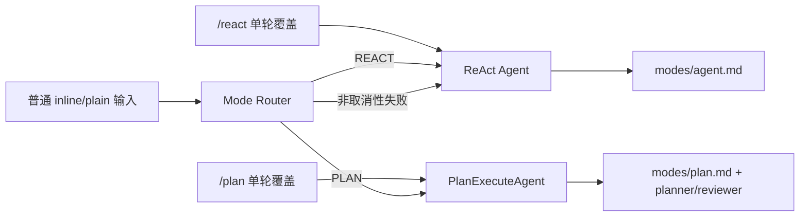

# 自动模式路由内容一致性修复

## 1. 背景、目标与非目标

### 1.1 背景

提交 `b1adc1a` 已把默认 inline/plain 终端改为 Mode Router 自动选择 ReAct 或统一的多 Agent 协作 Plan-and-Execute，`/react` 与 `/plan` 只对单轮提供显式覆盖。但部分当前有效内容仍声称“默认模式是 ReAct”，或继续把已经合并的 Plan-and-Execute 与 Multi-Agent 描述成三套独立执行模式。

### 1.2 目标

- 让内置 ReAct prompt 准确描述自身是“被路由或显式选择后的执行器”，而不是产品默认模式。
- 修正 CLI 启动提示、`/init` 模板、项目记忆、README、当前参考文档及内置 Skill 中的同类陈旧表述。
- 增加回归断言，防止用户可见文案和生成模板再次退回“默认 ReAct / 三套独立模式”。
- 修复审计过程中暴露的 Windows CRLF prompt 分段问题，确保无工具 provider 不会收到 Tools/Tool Policy。

### 1.3 非目标

- 不修改 Mode Router、ReAct、PlanExecuteAgent 的运行时选择和执行逻辑。
- 不重写明确记录历史阶段的方案背景、旧时序或已完成里程碑。
- 不恢复已经删除的 `/team` 命令或独立 Team 执行路径。

## 2. 现状分析（源码证据、已知约束）

### 2.1 架构位置

`Main` 在普通 inline/plain 顶层任务开始时调用 `ExecutionModeRouter`，路由结果为 ReAct 或 Plan；显式 `/react`、`/plan` 绕过 Router 并只覆盖当前轮。Lanterna TUI、Runtime API 和 WeChat 仍可直接进入 ReAct。所有这些入口最终由 `Agent` 组装 `PromptMode.AGENT`，因此 `modes/agent.md` 只能描述当前 ReAct 执行路径，不能断言该轮必然来自 Router 或显式覆盖，更不能把 ReAct 写成产品默认模式。

### 2.2 数据/状态模型

本次没有数据结构或持久化格式变化。受影响内容分为五类：

1. 运行时用户文案：`Main.startupHints()`。
2. 模型指令：`src/main/resources/prompts/modes/agent.md` 与相关内置 Skill。
3. 新项目记忆模板：`ProjectMemoryInitializer` 及仓库自身 `CODEAGENT.md`。
4. 当前产品说明：README、`docs/agents-reference.md` 以及带“当前状态”语义的路线图/阶段说明。
5. Prompt 跨平台组装：`PromptAssembler.stripToolSections()` 必须同时识别 LF 与 CRLF。

### 2.3 核心时序与失败路径

失败风险主要是把“Router 失败时回退 ReAct”误写成“默认 ReAct”，或把 Plan 内部的 Worker/Reviewer 角色误写成独立的第三套用户执行模式。

## 3. 方案设计

### 3.1 接口与数据结构

不新增接口。统一使用以下术语：

- 产品入口：普通 inline/plain 顶层任务“自动路由”。
- 显式选择：`/react` 与 `/plan` 是 one-turn override。
- 执行路径：ReAct 与“统一的多 Agent 协作 Plan-and-Execute”两条路径。
- 内部角色：Planner、Task Worker、Reviewer 属于 Plan 路径内部协作，不是独立顶层模式。

### 3.2 策略、安全、并发与恢复

本次主要修改文案和测试，并把 `stripToolSections()` 的换行匹配从仅 LF 扩展为 LF/CRLF；不改变授权链、URL provenance、工具并发、Plan checkpoint 或恢复语义。涉及策略的文字仍必须说明 ReAct 与 Plan 的每个执行分支都受 `TurnToolPolicy` 约束。

### 3.3 兼容性、迁移与回滚

没有配置和存储迁移。项目级或用户级自定义 prompt 覆盖不受影响；只更新 JAR 内置默认 prompt。所有改动均可通过单文件文本回滚。

## 4. 实现任务与测试矩阵

| 任务 | 主要文件 | 验证 |
|---|---|---|
| 锁定正确文案 | `PromptAssemblerTest`、`MainInputNormalizationTest`、`ProjectMemoryInitializerTest` | 新断言在修复前失败 |
| 修复运行时内容 | `agent.md`、`Main.java`、`ProjectMemoryInitializer.java`、`PromptAssembler.java` | 针对性测试通过 |
| 修复当前说明 | `CODEAGENT.md`、`README.md`、`docs/agents-reference.md`、相关 Skill/状态说明 | 陈旧短语审计无当前态误报 |
| 审核历史文档 | `ROADMAP.md`、`docs/phase-*.md`、`docs/dev/*.md` | 只改错误的“当前状态”，保留历史语境 |
| 回归与交付 | 全部变更 | `mvn test -Pquick`、必要全量测试、`git diff --check` |

## 5. 验收清单

- [x] 内置 ReAct prompt 不再声称 ReAct 是产品默认模式。
- [x] CLI 启动提示明确普通 inline/plain 任务由 Router 自动选择。
- [x] `/init` 生成的 CodeAgent 项目记忆不再生成“三套执行模式/三条执行路径”。
- [x] 当前 README、项目记忆、参考文档和内置 Skill 与两条顶层路径一致。
- [x] 历史方案仍可辨识当时状态，没有被改写成伪造的当前设计。
- [x] 针对性测试、快速回归、全量测试和 `git diff --check` 通过。

验证记录（2026-09-25）：

- 联合针对性测试：50 tests，0 failures，0 errors。
- `mvn test -Pquick`：1090 tests，0 failures，0 errors，4 skipped。
- `mvn test -DskipTests=false`：1140 tests，0 failures，0 errors，10 skipped。
