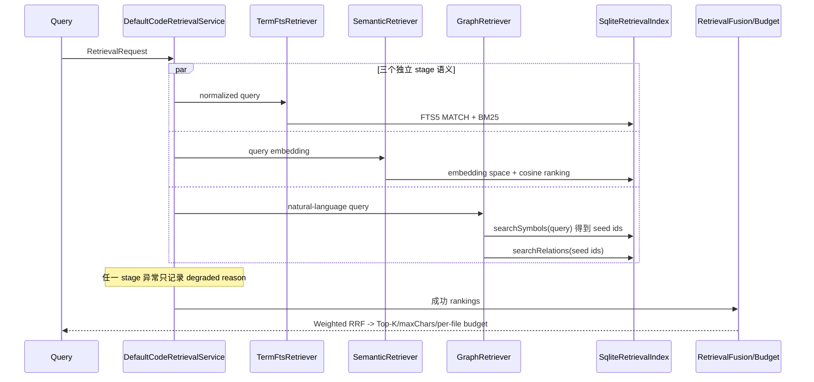
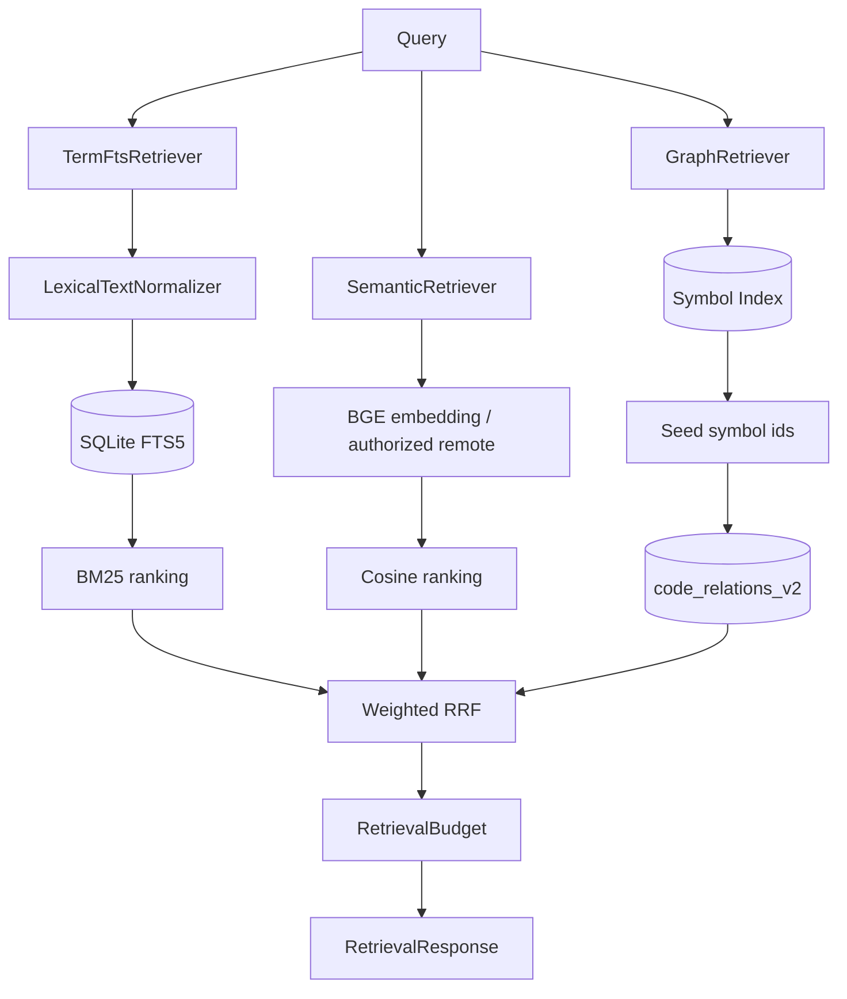

# 精简代码 RAG 三路检索设计

## 1. 背景、目标与非目标

### 1.1 背景

Local-First Layered Retrieval 已将代码检索迁移到 SQLite v2、本地 BGE 和独立失败的召回阶段，但当前 `DefaultCodeRetrievalService` 同时组装六个业务 stage：

```text
LIVE_GREP / FTS_TERMS / FTS_TRIGRAM / SYMBOL / GRAPH / SEMANTIC
```

这些 stage 存在职责重叠：实时 grep 与独立 `grep_code` 重复；trigram 与规范化 term FTS 同属词法召回；Symbol 既直接参与融合，又被 Graph 用作 seed。结果是同一信号可能多次进入 Weighted RRF，运行时、诊断、测试和架构说明都需要维护六套语义。

### 1.2 目标

1. 将 `search_code` / RAG 收敛为 `TermFtsRetriever`、`SemanticRetriever`、`GraphRetriever` 三类召回。
2. 词法层固定为 `LexicalTextNormalizer -> SQLite FTS5 MATCH -> BM25`。
3. 保持本地 BGE、远程授权、向量空间隔离、增量 embedding 和语义失败降级不变。
4. 保持 Graph 内部以 Symbol Index 匹配 seed，再查询关系表；Symbol 不再独立返回 RRF candidates。
5. 保持 `grep_code`、ripgrep 优先/Java fallback、`glob_files`、`read_file` 的独立实时定位职责。
6. 简化 `RetrievalSource`、Weighted RRF、诊断和测试，使现行文档与源码一致。

### 1.3 非目标

- 不修改 Code Chunking、Embedding 模型、输入策略、远程 consent 或增量索引设计。
- 不引入 ANN、其他搜索库、数据库或配置开关。
- 不把 `grep_code` 合并到 RAG，也不让 `search_code` 回退到实时 grep。
- 不删除 `code_symbols_v2`、`StableSymbolId`、`IndexedSymbol` 或 `searchSymbols(...)`。
- 不承诺 `PlanExec -> PlanExecuteAgent` 这类不完整子串召回。
- 不做 SQLite schema version 升级或破坏性迁移。

### 1.4 验收标准

- 默认 stage 只包含 Term FTS、Graph、Semantic；diagnostics 不再出现 `LIVE_GREP`、`FTS_TRIGRAM`、`SYMBOL`。
- `RetrievalSource` 只保留 `FTS_TERMS`、`GRAPH`、`SEMANTIC_LOCAL`、`SEMANTIC_REMOTE`。
- `GraphRetriever` 继续调用 Symbol Index 获得 seed，并能返回 resolved/unresolved relation candidates。
- Term FTS 继续覆盖中文 jieba normalization、camelCase、identifier、多关键词 MATCH 和 BM25 排序。
- Semantic provider 不可用或失败时，FTS/Graph 结果仍可返回并给出降级诊断。
- `grep_code` 不依赖 RAG index；ripgrep 不可用时 Java fallback 仍通过回归测试。
- Top-K、`maxChars`、每文件最多三条等预算行为不变。

## 2. 现状分析（源码证据、已知约束）

### 2.1 架构位置

`DefaultCodeRetrievalService` 是唯一 stage 组装点，当前依次创建：

```java
List.of(
    new LiveGrepRetriever(),
    new TermFtsRetriever(),
    new TrigramFtsRetriever(),
    new SymbolRetriever(),
    new GraphRetriever(),
    new SemanticRetriever()
)
```

`RetrievalStageRunner` 逐 stage 隔离异常，并根据实际 provider 将 Semantic 记为 `SEMANTIC_LOCAL` 或 `SEMANTIC_REMOTE`。`RetrievalFusion` 遍历 `RetrievalSource.values()` 做 Weighted RRF，当前还包含 Symbol 精确匹配加成和 Graph 共识加成。

### 2.2 当前六路检索与重叠

| 当前 stage | 实际数据源 | 问题 | 调整 |
|---|---|---|---|
| `LiveGrepRetriever` | 当前磁盘 + `CodeSearchService` | 与独立 `grep_code` 重复，并把未索引实时结果混入 RAG | 从 RAG 删除；保留 `CodeSearchService` 与 `grep_code` |
| `TermFtsRetriever` | `code_chunks_terms_fts_v2` | 规范化词法主通道 | 保留 |
| `TrigramFtsRetriever` | `code_chunks_trigram_fts_v2` | 与 term FTS 重叠，专门支持不完整子串会增加解释与维护成本 | 删除运行时 stage 和查询 API |
| `SymbolRetriever` | `code_symbols_v2` | Symbol 信号既独立融合又给 Graph 提供 seed | 删除独立 stage；保留 Symbol Index 给 Graph |
| `GraphRetriever` | Symbol seed + `code_relations_v2` | 结构补充通道 | 保留并明确内部 Symbol 依赖 |
| `SemanticRetriever` | BGE / remote embedding + cosine | 自然语言语义主通道 | 原样保留 |

### 2.3 数据与状态模型

- `code_chunks_terms_fts_v2` 是 contentless FTS5 表，由 chunk INSERT/UPDATE/DELETE trigger 同步。
- `code_chunks_trigram_fts_v2` 与 term FTS 共用三条 trigger；现有 SQLite v2 数据库已经包含该表。
- `code_symbols_v2` 保存稳定 symbol id、限定名、简单名、签名、kind、owner 和行号。
- `code_relations_v2.from_symbol_id` 外键依赖 Symbol 表；`to_symbol_id` 可为空，用于未解析关系。
- `GraphRetriever` 已经先调用 `searchSymbols(...)`，提取非空 `symbolId` 集合，再调用 `searchRelations(...)`。因此删除 `SymbolRetriever` 不要求改动 Graph 的基础数据模型。

### 2.4 核心时序与失败路径



失败边界保持为 stage 级隔离：Semantic 加载、远程调用或 embedding 失败不影响 FTS/Graph；Graph seed 或关系查询失败不影响 FTS/Semantic；FTS 失败不影响 Graph/Semantic。不存在 RAG 内部 live grep fallback。

## 3. 方案设计

### 3.1 最终三路架构



`DefaultCodeRetrievalService` 的默认组装顺序使用：

```java
List.of(
    new TermFtsRetriever(),
    new GraphRetriever(),
    new SemanticRetriever()
)
```

顺序只影响 diagnostics map 的可读顺序；融合按 `RetrievalSource` 的确定性顺序处理。三者仍由 `RetrievalStageRunner` 分别执行和隔离失败，本次不引入并行执行模型。

### 3.2 词法检索

保留现有链路：

```text
query
  -> LexicalTextNormalizer
     -> jieba 中文分词
     -> identifier 保留
     -> camelCase / snake_case 拆分
     -> lowercase + 去重
  -> FTS5 MATCH
  -> bm25(code_chunks_terms_fts_v2)
  -> 稳定排序候选
```

`TermFtsRetriever` 继续只调用 `searchTerms(...)`。不会新增 `LIKE`、substring scan 或 grep fallback。多关键词继续由 `ftsMatch(...)` 转为带引号 token 的 `AND` 查询。

### 3.3 Semantic Retrieval 边界

`SemanticRetriever`、`EmbeddingInputPolicy`、`EmbeddingProvider`、本地 BGE、远程 consent、embedding space descriptor、chunk embedding 增量写入及 cosine 排序均不改变。`SEMANTIC_LOCAL` 与 `SEMANTIC_REMOTE` 继续作为同一 stage 的 provider diagnostics 标记，而不是两条同时执行的 stage。

### 3.4 Graph Retrieval 与 Symbol 基础设施

Symbol 从公开 RRF source 降级为 Graph 内部基础设施：

```text
GraphRetriever
  -> SqliteRetrievalIndex.searchSymbols(query)
  -> seed symbol ids
  -> SqliteRetrievalIndex.searchRelations(seed ids)
  -> RetrievalSource.GRAPH candidates
```

保留 `code_symbols_v2`、`IndexedSymbol`、`StableSymbolId`、symbol 索引及增量维护。删除的是 `SymbolRetriever` 这个独立 stage，不是 Symbol Index。Graph 的输出只标记 `GRAPH`。

### 3.5 RetrievalFusion 与权重

删除 `LIVE_GREP`、`FTS_TRIGRAM`、`SYMBOL` 权重及 Symbol 精确匹配乘法加成。保留 chunk type、跨来源共识和 Graph 结构补充因子。最终权重：

| Source | 权重 | 依据 |
|---|---:|---|
| `FTS_TERMS` | 1.2 | 延续现有值，词法是主要 relevance signal |
| `SEMANTIC_LOCAL` | 1.0 | 延续现有值，语义是主要 relevance signal |
| `SEMANTIC_REMOTE` | 1.0 | 与 local 同类，provider 不改变融合语义 |
| `GRAPH` | 0.8 | 从现有 0.7 小幅调整到需求建议值，作为结构补充低于词法与语义 |

不对 BM25 或 cosine 原始分数做直接跨源比较；各路只提供内部排名，Weighted RRF 负责融合。

### 3.6 SQLite schema 兼容策略

采用“停用运行时、保留兼容 schema”的最小风险方案：

- 删除 `TrigramFtsRetriever` 与 `SqliteRetrievalIndex.searchTrigram(...)` 业务查询 API。
- 暂时保留 `code_chunks_trigram_fts_v2` 的建表、rebuild 和联合维护 trigger。
- 不提升 `SCHEMA_VERSION=2`，不删除用户已有表，不增加迁移。

原因是 term/trigram 当前共用同名 INSERT/UPDATE/DELETE triggers。替换 trigger 虽然代码量不大，但会改变旧 JAR 回滚后的 trigger 恢复语义；直接 drop table 更会让旧版本运行失败。保留兼容表使新旧 JAR 都能安全打开同一 v2 数据库。该表在新版本中不被查询、不进入 diagnostics、不参与 RRF；代价是 chunk 写入仍维护一份惰性 trigram 索引。后续若升级 schema，可在独立迁移中删除。

### 3.7 CLI 与 Agent 工具职责

| 入口 | 职责 | 数据新鲜度 |
|---|---|---|
| `/search`、`search_code` | FTS5/BM25 + Semantic + Graph | 预建/增量 SQLite index，可能落后于磁盘 |
| `grep_code` | 已知类名、方法名、精确字符串或正则 | 直接读取当前磁盘；ripgrep 优先、Java fallback |
| `glob_files` | 已知路径模式 | 当前磁盘 |
| `read_file` | 读取候选源码并形成最终证据 | 当前磁盘 |

`RetrievalRequest.includeLiveSearch` 现有字段在删除 live stage 后不再影响检索。为避免扩大协议/序列化变更，本次保留该字段作为兼容占位，不增加替代行为；调用点可在后续独立清理中移除。

`DefaultCodeRetrievalService` 原三参构造器和 `RetrievalContext` 原四参构造器作为 deprecated overload 保留，旧 `CodeSearchService` 参数被明确忽略；新组装路径使用不含该参数的构造器。这样保持已有源码/字节码调用兼容，同时不把 live search 重新接回 RAG。

### 3.8 删除与保留清单

删除：

- `LiveGrepRetriever`
- `TrigramFtsRetriever`
- `SymbolRetriever`
- `RetrievalSource.LIVE_GREP`
- `RetrievalSource.FTS_TRIGRAM`
- `RetrievalSource.SYMBOL`
- `SqliteRetrievalIndex.searchTrigram(...)`
- 对上述 source 的融合权重、boost、测试断言和现行文档说明

保留：

- `CodeSearchService`、`RipgrepCodeSearchService`、`JavaCodeSearchService` 与 `grep_code`
- `TermFtsRetriever`、`LexicalTextNormalizer`、term FTS5 与 BM25
- `SemanticRetriever` 及所有 embedding 策略
- `GraphRetriever`、`searchSymbols(...)`、`searchRelations(...)`
- `code_symbols_v2`、`StableSymbolId`、`IndexedSymbol`
- v2 trigram 兼容表和 triggers（不再有运行时读取者）

### 3.9 安全、并发、恢复与回滚

- 不改变 ToolRegistry、HITL、路径授权或远程 embedding consent；没有新增外发路径。
- 不改变 `ReentrantReadWriteLock` 的 provider 切换行为，也不改变 SQLite 查询/写入并发模型。
- 不改变文件级词法事务和 embedding 独立事务，incremental index 语义保持。
- 代码回滚到旧提交时，保留的 trigram schema 和 triggers 允许旧 stage 继续工作。
- 数据回滚不需要迁移；新版本写入的 v2 数据仍可被旧版本读取。

## 4. 实现任务与测试矩阵

### 4.1 TDD 实现任务

1. 先调整 `DefaultCodeRetrievalServiceTest` / 新增 stage 组成断言，使其要求无索引且 `includeLiveSearch=true` 时也不执行实时 grep；运行并确认因现有 `LIVE_GREP` 命中而失败。
2. 调整 `RetrievalFusionTest`，用 FTS + Semantic 共识和 Graph 补充验证新权重/source；运行并确认因旧 enum/boost 语义失败。
3. 增补 Graph 集成测试，写入 symbols/relations 后直接执行 `GraphRetriever`，证明其内部 symbol seed 仍工作；同时检查 symbol schema 仍存在。
4. 调整 `SqliteRetrievalIndexTest`：保留 term FTS/MATCH/BM25、多关键词、替换与删除覆盖；将 trigram 断言改为“兼容 schema 存在但无业务查询入口”。
5. 删除三个 stage、三个 enum、trigram 查询 API，并更新默认组装与 Fusion；逐组运行 targeted tests 到绿色。
6. 更新 ToolRegistry stub、格式化相关断言和所有编译引用；不改 `grep_code` 实现。
7. 同步现行文档及历史文档顶部指向本设计。

### 4.2 测试矩阵

| 领域 | 用例 | 预期 |
|---|---|---|
| Pipeline | 默认 service diagnostics/source 集合 | 只可能出现 FTS、Graph、一个 Semantic provider source |
| Pipeline | `includeLiveSearch=true` 且未建索引 | 不读取磁盘 grep，不返回 live hit |
| Term FTS | 中文 jieba、camelCase、snake_case、identifier | 索引/查询规范化一致并能 MATCH |
| Term FTS | 多关键词 | 生成 AND MATCH，BM25 + 稳定 tie-break 排序 |
| Term FTS | 文件替换/删除 | term FTS 与 chunk 同步，无旧命中 |
| Graph | query 匹配 Symbol | 内部生成 seed ids 并返回 relation chunks |
| Graph | Symbol schema/index | `code_symbols_v2` 与 symbol 查询仍可用 |
| Semantic | local BGE/vector ranking | 原测试保持通过 |
| Semantic | provider failure | FTS/Graph 保留，diagnostics 标记 degraded |
| Semantic | remote consent/space | 原授权与隔离测试保持通过 |
| grep_code | ripgrep path | 独立工具正常 |
| grep_code | 禁用/不可用 ripgrep | Java fallback 正常且不依赖 RAG DB |
| Fusion | FTS + Semantic 共识 | 共识候选高于单路候选 |
| Fusion | Graph 补充 | Graph 结果参与 RRF，权重低于主 relevance signal |
| Budget | Top-K/maxChars/per-file | 行为保持，稳定设置 `partial` |
| Failure | 任一 stage 抛异常 | 其余 stage 继续返回 |

### 4.3 验证命令

```powershell
mvn test -DskipTests=false "-Dtest=RetrievalFusionTest,SqliteRetrievalIndexTest,DefaultCodeRetrievalServiceTest,RetrieverStageIsolationTest,LexicalTextNormalizerTest,GraphRetrieverTest,SemanticRetrieverTest,CodeSearchServiceArchitectureTest,CodeSearchGoldenSetTest,ToolRegistryTest"
mvn test -Pquick
mvn test -DskipTests=false
mvn clean package
git diff --check
```

若仓库不存在 `GraphRetrieverTest` 或 `SemanticRetrieverTest`，实现阶段创建对应测试或使用实际等价测试类，并在交付报告列出最终执行的真实命令。

## 5. 文档同步

- `AGENTS.md`：将 RAG 现行说明改为 term FTS + semantic + graph，明确 Symbol 是 Graph 内部设施。
- `README.md`：把“词法 FTS、符号和关系召回”改为三路架构与工具职责。
- `docs/agents-reference.md`：补充 RAG stage 与 `grep_code` 的边界。
- `docs/dev/20-local-first-layered-retrieval-implementation-plan.md`：保留历史实现正文，在顶部增加“已被 25 号设计进一步精简”的现状注记和链接。
- `docs/dev/04-code-rag-graph.md`：保持 v1 历史正文，在顶部将现行架构链接更新为 25 号设计，并避免读者把六路说明当现状。

`CODEAGENT.md` 当前只描述“本地优先 SQLite v2 + BGE 可降级 + 精确定位走 grep”，没有六路断言；实现 review 时仍检查是否需要最小措辞同步。

## 6. 回滚方案

1. 代码回滚：恢复三个 stage、三个 enum、旧 Fusion 权重和默认 stage 列表。
2. 数据库无需回滚：trigram 表与 triggers 始终保留，旧版本可直接继续查询；Symbol 表从未删除。
3. 若新实现出现召回质量下降，可先回滚功能提交，不需要重建索引或迁移用户数据库。
4. 不通过偷偷恢复 live grep 兜底解决质量问题；质量问题应分别从 Term FTS normalization、Semantic 或 Graph seed 证据定位。

## 7. 验收清单

- [x] 默认 RAG 只有 Term FTS、Semantic、Graph 三类召回。
- [x] `LIVE_GREP`、`FTS_TRIGRAM`、`SYMBOL` 不再是 `RetrievalSource`。
- [x] FTS5 + BM25 是唯一 lexical RAG 通道。
- [x] Graph 内部 Symbol seed 和 relation 查询通过集成测试。
- [x] Symbol Index 与 trigram 兼容 schema 未被破坏。
- [x] Semantic 本地/远程、失败降级、向量空间和增量行为未改变。
- [x] `grep_code` 的 ripgrep/Java fallback 与 RAG index 解耦通过回归。
- [x] Fusion、Top-K、字符预算、每文件预算和失败隔离通过测试。
- [x] AGENTS、README、agents-reference、20 号和 04 号文档已同步。
- [x] targeted、quick、full、package、`git diff --check` 均有真实成功证据。
- [x] 分支相对最新 `main` behind=0，提交只包含本次 RAG 精简。

## 8. 方案自检

- **占位检查：** 无 TBD/TODO；兼容 schema 的保留范围和未来删除条件已明确。
- **一致性检查：** Mermaid、stage 列表、source enum、权重、测试矩阵和回滚方案均为三类召回。
- **范围检查：** 不重写 Semantic、Chunking、增量索引、ToolRegistry 或数据库版本。
- **歧义检查：** `SEMANTIC_LOCAL/REMOTE` 明确是同一 stage 的 provider 标记；Symbol 明确只作为 Graph 内部设施；trigram 明确保留 schema 但无运行时 reader。
