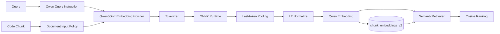

# Qwen3-Embedding-0.6B 代码 RAG Embedding 迁移待办

## 1. 背景、目标与非目标

### 1.1 背景

当前 CodeAgent 代码 RAG 的默认本地语义检索使用 `InProcessBgeEmbeddingProvider`，底层通过 LangChain4j 的量化 `BGE-small-zh-v1.5` ONNX 模型在 JVM 进程内生成向量：

```text
Code Chunk / Query
        ↓
EmbeddingInputPolicy
        ↓
InProcessBgeEmbeddingProvider
        ↓
BGE-small-zh-v1.5-q
        ↓
512d normalized embedding
        ↓
SQLite chunk_embeddings_v2
        ↓
exact cosine search
```

当前方案具备本地、无外部服务、启动和资源成本较低等优点，但代码 RAG 的主要真实查询形态是：

```text
中文自然语言用户问题
        ↓
英文类名 / 方法名 / 标识符 / 源代码
```

例如：

```text
Query:
“Plan 模式崩溃以后怎么恢复未完成任务？”

Code:
resumePendingTasks()
reconcileInterruptedExecution()
restorePlanState()
```

`BGE-small-zh-v1.5` 是中文通用文本 Embedding 模型，并非专门面向“跨语言自然语言 -> 源代码”检索训练。当前 Semantic Retrieval 能工作，但中文意图与英文代码之间的跨语言、代码语义对齐不是该模型的核心目标。

Qwen 官方将 `Qwen3-Embedding-0.6B` 定位为通用 Text Embedding 模型，并明确支持 100+ 语言（包含编程语言）、multilingual / cross-lingual retrieval 和 code retrieval；同时支持 instruction-aware retrieval 和 32～1024 的自定义输出维度。因此它与 CodeAgent 的“中文自然语言 -> 英文代码”语义检索场景更匹配。

本文件将“代码 RAG 默认本地 Embedding 从 BGE-small-zh-v1.5 迁移到 Qwen3-Embedding-0.6B”记录为后续待办，不在本分支实现源码修改。

### 1.2 目标

1. 将代码 RAG 默认本地 Embedding 模型从 `BGE-small-zh-v1.5-q` 替换为 `Qwen3-Embedding-0.6B`。
2. 保持 local-first：模型必须继续在 JVM 进程内运行，不依赖 Python、Ollama 或远程 Embedding API。
3. 采用 ONNX Runtime 执行 Qwen3 Embedding，并固定可追溯的模型 artifact/revision。
4. 提升中文自然语言 Query 与英文代码 Chunk 之间的跨语言语义召回能力。
5. 利用 Qwen3 对 programming languages / code retrieval 的训练定位，使自然语言与源码之间的语义表示更匹配。
6. 保持现有 `EmbeddingProvider`、`EmbeddingSpaceDescriptor`、SQLite 向量存储、cosine 检索和 RRF 融合边界不变。
7. 通过 embedding space 变化自然触发 Qwen3 向量 backfill，不复用 BGE 生成的旧向量。
8. 用中文 Query -> 英文 Java 代码的 golden set 验证迁移收益，而不是仅凭模型规格决定上线。

### 1.3 非目标

- 本待办不调整 FTS5/BM25、Graph Retrieval、Weighted RRF、Top-K 或检索候选预算。
- 不重写 `CodeChunker`。
- 不引入远程 Embedding 服务。
- 不在首版引入 reranker。
- 不因为 Qwen3 支持更长上下文就立即扩大 Chunk 大小。
- 不在本待办中同步替换长期记忆的 Embedding 模型。

特别说明：长期记忆当前的 `MemoryEmbeddingCache` 会直接创建 `InProcessBgeEmbeddingProvider`。因此实现代码 RAG 的 Qwen3 迁移时，必须先保证 RAG provider 与 Memory provider 的构造边界清晰，不能通过“直接修改现有 BGE provider 实现”让长期记忆无意切换模型。Memory 是否迁移到 Qwen3 应作为独立任务评估。

---

## 2. 现状分析（源码证据、已知约束）

### 2.1 当前架构位置

代码 RAG 的语义链路为：

```text
IndexCoordinator
  -> EmbeddingInputPolicy.prepareDocumentParts(...)
  -> EmbeddingProvider.embedAll(...)
  -> FileEmbeddingBatch
  -> chunk_embeddings_v2

SemanticRetriever
  -> EmbeddingInputPolicy.prepareQuery(...)
  -> EmbeddingProvider.embedAll(...)
  -> SqliteRetrievalIndex.searchVector(...)
  -> cosine ranking
```

当前默认本地 provider：

```text
InProcessBgeEmbeddingProvider
providerId = local-bge
modelId = bge-small-zh-v1.5-q
dimension = 512
locality = IN_PROCESS
```

底层依赖 LangChain4j：

```text
langchain4j-embeddings-bge-small-zh-v15-q
```

并由 `BgeSmallZhV15QuantizedEmbeddingModel` 完成本地推理。

### 2.2 当前 BGE 与目标 Qwen3 对比

| 维度 | 当前 BGE-small-zh-v1.5 | 目标 Qwen3-Embedding-0.6B |
|---|---|---|
| 定位 | 中文通用文本 Embedding | multilingual / cross-lingual / code retrieval Embedding |
| 主要语言能力 | 中文为主 | 100+ 语言，包含编程语言 |
| 中文 Query -> 英文代码 | 可产生语义匹配，但不是核心训练目标 | 明确覆盖 cross-lingual 与 code retrieval |
| Code Retrieval | 非专用目标 | 官方明确支持 |
| 参数规模 | small BERT 级，当前运行成本较低 | 0.6B，资源成本明显更高 |
| 当前/原生维度 | 512 | 最大 1024，支持 32～1024 自定义输出维度 |
| 上下文 | 当前实现按约 384 estimated tokens 保守切分 | 模型上下文上限 32K |
| Query instruction | 当前固定中文 retrieval prefix | instruction-aware；官方建议 Query 使用任务 instruction |
| Document instruction | 当前加入 `代码文档：` 前缀 | 官方 retrieval 示例无需给 document 添加 instruction |
| Pooling | 由当前 LangChain4j BGE wrapper 封装 | last-token pooling |
| Normalize | 当前 provider/model 输出按 embedding space 标记 normalized | Qwen 官方示例在 pooling 后做 L2 normalize |
| JVM 集成 | LangChain4j 已有专用封装，接入简单 | 预计需要自定义 ONNX provider / tokenizer / pooling |
| 本地部署 | 已实现 | 必须保持 ONNX + JVM in-process |

Qwen3 的优势不能简单归结为“1024 维比 512 维更大”。本次迁移的主要理由是训练目标与实际任务更匹配：

1. 用户 Query 大量为中文，而项目源码标识符和主体代码大量为英文；
2. Query 与 Document 不只是跨语言文本，而是“自然语言意图 -> 源代码”；
3. Qwen3 Embedding 明确支持 cross-lingual retrieval 和 code retrieval；
4. Qwen3 instruction-aware，可以用软件工程检索任务描述约束 Query embedding。

### 2.3 当前 Embedding Space 已具备迁移基础

`EmbeddingSpaceDescriptor` 已把以下字段纳入 `embeddingSpaceId`：

```text
providerId
modelId
endpointFingerprint
artifactRevision
dimension
pooling
normalized
preprocessingVersion
chunkerVersion
```

因此切换到 Qwen3 后，只要正确声明新的 provider/model/artifact/dimension/pooling，新的 `embeddingSpaceId` 就会与旧 BGE 空间不同。

现有 `IndexCoordinator` 会通过：

```text
hasCompleteEmbeddings(
  project,
  file,
  newEmbeddingSpaceId,
  chunkCount
)
```

发现 Qwen3 空间没有完整向量，并对已有 Chunk 做 embedding backfill。

因此不需要把 BGE 向量“转换”为 Qwen3 向量，也不能混用两种模型的向量。

### 2.4 长期记忆共享 BGE 的约束

当前：

```text
MemoryEmbeddingCache()
  -> new InProcessBgeEmbeddingProvider()
```

长期记忆的语义阈值、混合分数和测试均建立在当前 BGE 行为之上。

所以 RAG 替换方案不能简单把 `InProcessBgeEmbeddingProvider` 的内部模型从 BGE 改成 Qwen3，否则会同时改变：

```text
Code RAG semantic retrieval
+
Long-term Memory semantic retrieval
```

首版实现应创建独立的 Qwen3 provider，并只切换代码 RAG 的默认 provider wiring。

---

## 3. 为什么 Qwen3-Embedding-0.6B 适合当前项目

### 3.1 中英文跨语言映射

CodeAgent 的真实交互通常是：

```text
中文：
“工具执行失败以后在哪里重试？”

英文代码：
retryToolExecution(...)
ToolExecutionRetryPolicy
recoverFailedToolCall(...)
```

FTS5/BM25 依赖词面重合，对这类查询帮助有限；Semantic Retrieval 才负责把中文意图映射到英文代码。

Qwen3 Embedding 官方明确支持 multilingual 和 cross-lingual retrieval，因此其模型目标比中文通用文本 BGE 更直接覆盖该场景。

### 3.2 自然语言与代码兼容

代码检索不是普通的中英翻译：

```text
“恢复中断任务”
!=
简单翻译成某一句英文
```

相关代码可能使用：

```text
reconcileInterruptedExecution
restorePendingState
resumePlan
```

模型需要把软件工程自然语言意图与程序标识符、代码结构和方法体建立语义联系。

Qwen3 Embedding 明确将 code retrieval 作为支持任务，并把 programming languages 纳入多语言能力范围，因此更符合 CodeAgent Semantic Retrieval 的输入分布。

### 3.3 Instruction-aware Retrieval

Qwen3 官方建议 Query 使用一条描述检索任务的 instruction，并指出 instruction 能针对具体 task / language / scenario 调整检索表示。

CodeAgent 可以固定一个稳定的英文任务 instruction，例如：

```text
Instruct: Given a natural-language software-engineering query, retrieve source-code chunks that implement or explain the described behavior.
Query: <submitted query>
```

Document 侧保持代码 Chunk 本身，不添加 Query instruction。

这比当前通用中文前缀：

```text
为这个句子生成表示以用于检索相关文章：
```

更贴合“自然语言 -> 代码”的检索目标。

### 3.4 Local-first 仍可保持

迁移目标不是调用 Qwen 云 API，而是：

```text
CodeAgent JVM
    ↓
Qwen3OnnxEmbeddingProvider
    ↓
ONNX Runtime Java
    ↓
Qwen3-Embedding-0.6B artifact
    ↓
local CPU inference
```

因此以下设计原则保持不变：

- 不要求 Python runtime；
- 不要求 Ollama；
- 不默认联网；
- embedding 内容不离开本地进程；
- provider 故障时 Semantic Retrieval 降级，不中止 FTS / Graph。

---

## 4. 方案设计

### 4.1 目标架构



### 4.2 新增 Qwen3 Provider

建议新增：

```text
com.codeagent.rag.embedding.Qwen3OnnxEmbeddingProvider
```

继续实现现有：

```java
EmbeddingProvider
```

Provider 负责：

1. lazy load Qwen3 tokenizer；
2. lazy create ONNX Runtime session；
3. 构造 `input_ids` / `attention_mask` 等模型输入；
4. 使用和参考实现一致的 padding / truncation；
5. 执行 ONNX inference；
6. 对 `last_hidden_state` 做 last-token pooling；
7. L2 normalize；
8. 返回固定维度 `float[]`；
9. 管理 ONNX session 生命周期；
10. 把底层异常统一映射到 `EmbeddingException`。

首版不要把 Qwen3 ONNX 细节泄漏到 `SemanticRetriever` 或 `IndexCoordinator`。

### 4.3 ONNX Artifact 策略

实现时必须选用可重复构建/验证的 Qwen3 ONNX artifact。

要求：

- 基于官方 `Qwen/Qwen3-Embedding-0.6B` 权重；
- 固定 artifact revision；
- 在构建或分发侧记录 checksum；
- 不运行时静默下载不可控的“latest”模型；
- ONNX 输入/输出名称、dtype、opset 和 tokenizer 版本必须进入兼容性测试；
- 如使用量化 artifact，必须明确量化方式并和 reference embedding 做误差测试。

首版可以使用经过验证的现成 ONNX artifact，也可以从官方模型固定 revision 导出 ONNX；最终仓库必须固定来源和版本，不能依赖浮动版本。

### 4.4 Pooling 与 Normalize

Qwen3 官方参考实现使用：

```text
last hidden state
    ↓
last non-padding token
    ↓
L2 normalize
```

因此新的 embedding space 应明确：

```text
pooling = last-token
normalized = true
```

不能继续假设 BGE 的 pooling 行为，也不能直接用不等价的 CLS / MEAN pooling 替代。

ONNX Provider 测试需要使用固定输入，与官方参考实现产生的 embedding 做数值近似校验。

### 4.5 Query / Document Input Policy

当前 `EmbeddingInputPolicy` 与 BGE 绑定较强，包含：

```text
QUERY_PREFIX = 为这个句子生成表示以用于检索相关文章：
DOCUMENT_PREFIX = 代码文档：
```

迁移时建议把“切分策略”和“模型输入格式”解耦。

目标：

```text
Query:
Instruct: <stable software-engineering retrieval instruction>
Query:<raw query>

Document:
<raw code chunk>
```

首版继续保留现有长 Chunk 分段、两行 overlap、多 part embedding 平均和最终 normalize 的行为，避免“换模型”和“重做 Chunk/long-context 策略”同时发生。

Qwen3 虽支持更长上下文，但首版不以扩大单次输入长度为目标；后续应单独通过质量/性能测试决定是否调整 384/360 的当前保守预算。

### 4.6 输出维度策略

Qwen3-Embedding-0.6B 的最大 embedding dimension 为 1024，并支持 32～1024 自定义输出维度。

迁移实现应优先验证两种配置：

```text
A. 512 dimensions
- 与当前 SQLite 存储和 exact cosine 成本接近
- 适合作为桌面/local-first 默认候选

B. 1024 dimensions
- 使用完整原生维度
- 存储和 exact cosine 成本约为当前 512d 的两倍
```

首版默认值不应只根据“维度越大越好”决定。

建议采用以下决策：

1. 先验证官方支持的 512d 输出在 JVM ONNX 路径下与参考实现一致；
2. 使用同一中文 Query -> 英文代码 golden set 比较 Qwen3 512d 和 1024d；
3. 如果 512d 的 Recall@K / MRR 与 1024d 差距可接受，则默认 512d，保持当前本地成本级别；
4. 如果 1024d 带来明确质量收益，再接受存储与 cosine 成本翻倍。

禁止在没有参考实现等价性验证的情况下自行随意截断向量。

### 4.7 Embedding Space 与增量迁移

Qwen provider 建议使用新的 descriptor，例如概念上：

```text
providerId = local-qwen3
modelId = qwen3-embedding-0.6b-onnx
artifactRevision = <pinned revision>
dimension = 512 or 1024
pooling = last-token
normalized = true
preprocessingVersion = <new version>
chunkerVersion = current
```

因为 `embeddingSpaceId` 会改变：

```text
旧 BGE embeddings
        ↓
继续属于旧 space

新 Qwen provider
        ↓
hasCompleteEmbeddings(newSpace) == false
        ↓
对已有 chunks backfill Qwen embeddings
```

不需要重新做 FTS / Graph，也不需要因为换 Embedding 模型重新切代码 Chunk。

首版允许旧 BGE embedding space 留在 SQLite 中，以保证回滚安全。清理 obsolete embedding spaces 可以作为后续维护任务，不与模型迁移绑定。

### 4.8 RAG Wiring

目标 wiring：

```text
代码 RAG 默认本地 provider
InProcessBgeEmbeddingProvider
        ↓
Qwen3OnnxEmbeddingProvider
```

保持：

```text
SemanticRetriever
IndexCoordinator
SqliteRetrievalIndex.searchVector
RetrievalFusion
```

接口和主流程不变。

远程 embedding consent / provider 机制也不应因为本地默认模型迁移而改变。

### 4.9 Memory 隔离

首版明确：

```text
Code RAG
→ Qwen3OnnxEmbeddingProvider

Long-term Memory
→ 继续使用 InProcessBgeEmbeddingProvider
```

原因：

- Memory 有独立的 semantic threshold；
- Memory 使用词法 + semantic 固定权重；
- Memory embedding 只做进程内缓存；
- 直接换模型可能改变已有 threshold 的含义和召回分布。

如果未来决定 Memory 也迁移 Qwen3，应重新评测 Memory 的 semantic thresholds、hybrid weight 和写入候选阈值，并单独形成设计任务。

### 4.10 失败与回滚

本地 Qwen3 模型加载或推理失败时：

```text
Semantic stage
→ degraded

FTS / Graph
→ 继续返回
```

不得因为模型体积更大而改变现有独立失败语义。

回滚时只需把代码 RAG 默认 provider 切回 BGE；旧 BGE embedding space 保留时无需重新生成旧向量。

---

## 5. 实现任务与测试矩阵

### 5.1 实现任务

1. 增加固定版本 Qwen3 ONNX artifact / tokenizer 获取与校验方案。
2. 新增 `Qwen3OnnxEmbeddingProvider`。
3. 实现 tokenizer -> ONNX inference -> last-token pooling -> L2 normalize。
4. 为 Qwen3 拆出独立 Query instruction / Document input policy。
5. 创建新的 `EmbeddingSpaceDescriptor` 参数。
6. 把代码 RAG 默认本地 provider wiring 切换到 Qwen3。
7. 保持 `MemoryEmbeddingCache` 继续显式使用 BGE。
8. 更新 pom 依赖，避免依赖 LangChain4j 的 BGE 专用 wrapper 作为 RAG 必需项。
9. 保留 BGE dependency，直到确认 Memory 仍需要它。
10. 更新 AGENTS、README、agents-reference 和 RAG 相关 docs 的当前模型描述。

### 5.2 测试矩阵

| 领域 | 用例 | 预期 |
|---|---|---|
| ONNX Provider | 固定文本 embedding | 输出维度正确、数值有限、非全零 |
| ONNX Provider | 相同输入重复编码 | deterministic |
| ONNX Provider | pooling parity | 与 Qwen 官方参考实现近似一致 |
| ONNX Provider | normalize | L2 norm 约等于 1 |
| ONNX Provider | artifact/tokenizer mismatch | 明确失败，不产生错误空间向量 |
| Query Policy | 中文自然语言 Query | 使用稳定英文 software-engineering instruction |
| Document Policy | Java code chunk | 不错误复用 Query instruction |
| Embedding Space | BGE -> Qwen | space id 改变，旧向量不被新查询读取 |
| Incremental Index | 文件内容未变、模型切换 | 复用 Chunk，只 backfill Qwen embedding |
| Failure Isolation | Qwen load/inference failure | FTS / Graph 正常，Semantic 标记 degraded |
| Memory | RAG 默认切 Qwen 后 | Memory 仍使用 BGE，现有测试不漂移 |
| Quality | 中文 Query -> 英文 Java code | Recall@5 / Recall@10 / MRR 不低于基线，目标显著优于 BGE |
| Performance | 首次模型加载 | 记录 wall time / peak memory |
| Performance | 单 query embedding | 记录 P50/P95 latency |
| Performance | index backfill | 记录 chunks/sec 和 JVM memory |
| Dimension | Qwen 512 vs 1024 | 用真实 benchmark 决定默认维度 |

### 5.3 Golden Set

必须增加面向项目真实场景的中文 Query，例如：

```text
“Plan 模式崩溃之后如何恢复未完成任务？”
“工具执行超时在哪里处理？”
“长期记忆如何用新事实替换旧事实？”
“同一轮多个工具是怎么调度执行的？”
“RAG 的语义向量在哪里做相似度排序？”
```

每条 Query 人工标注相关 file / class / method，至少统计：

```text
Recall@5
Recall@10
MRR
```

对比对象只需要：

```text
当前 BGE-small-zh-v1.5
vs
Qwen3-Embedding-0.6B
```

本待办不引入其他模型横向评测。

---

## 6. 兼容性、成本与风险

### 6.1 资源成本

Qwen3-Embedding-0.6B 明显大于当前 small BGE。

需要真实测量：

- artifact 体积；
- JVM 启动后首次加载延迟；
- CPU 单 query 延迟；
- index backfill 吞吐；
- peak RSS / heap / native memory；
- 512d 与 1024d SQLite 向量体积；
- exact cosine 搜索延迟。

如果本地桌面体验无法接受，不能仅凭 benchmark 质量更高就直接替换默认模型。

### 6.2 ONNX 等价性

Qwen3 的正确推理行为依赖：

- tokenizer；
- padding side；
- attention mask；
- last-token pooling；
- normalize；
- output dimension；
- instruction format。

任意一项与参考实现不一致，都可能让“模型已替换”但实际检索质量下降。

因此 ONNX parity test 是迁移门禁，不是可选测试。

### 6.3 输入策略迁移

当前 `EmbeddingInputPolicy` 是 BGE-oriented。迁移 Qwen3 时如果仍机械复用：

```text
为这个句子生成表示以用于检索相关文章：
代码文档：
```

会偏离目标模型官方 retrieval 用法。

因此 Query instruction 和 Document formatting 必须作为模型 adapter 的一部分一起迁移。

### 6.4 Memory 意外迁移风险

`MemoryEmbeddingCache` 当前直接依赖 BGE provider。

如果实现者为了“替换模型”直接重写 `InProcessBgeEmbeddingProvider` 的内部实现，会让 Memory 同时切到 Qwen3，而 Memory 的阈值没有重新标定。

此风险必须通过独立 provider 类和测试隔离。

---

## 7. 验收清单

- [ ] 代码 RAG 默认本地 Embedding 已从 BGE 切到 `Qwen3-Embedding-0.6B`。
- [ ] Qwen3 通过固定 ONNX artifact 在 JVM 内运行，不依赖 Python/Ollama/远程 API。
- [ ] Query 使用经过固定版本管理的 software-engineering retrieval instruction。
- [ ] Document 输入不错误复用 Query instruction。
- [ ] last-token pooling 与 L2 normalize 与参考实现一致。
- [ ] Qwen3 使用独立 `embeddingSpaceId`，不读取 BGE vectors。
- [ ] 模型切换只触发 embedding backfill，不重建无关 FTS / Graph。
- [ ] Semantic failure 继续独立降级。
- [ ] 长期 Memory 首版仍保持 BGE，不发生隐式行为漂移。
- [ ] 中文 Query -> 英文代码 golden set 完成 BGE / Qwen3 对比。
- [ ] 默认 512d 或 1024d 的选择有 Recall / latency / memory 数据依据。
- [ ] targeted tests、RAG regression、Memory regression、quick/full/package 与 diff check 有真实成功证据。

---

## 8. 外部模型事实来源

只记录本待办涉及的两个模型：

- Qwen3-Embedding-0.6B 官方模型页：<https://huggingface.co/Qwen/Qwen3-Embedding-0.6B>
  - 100+ languages；
  - 包含 programming languages；
  - multilingual / cross-lingual / code retrieval；
  - 0.6B 参数；
  - 32K context；
  - 最大 1024 维，支持 32～1024 自定义输出维度；
  - instruction-aware；
  - 官方参考实现采用 last-token pooling + L2 normalize。
- BGE-small-zh-v1.5 官方模型页：<https://huggingface.co/BAAI/bge-small-zh-v1.5>
  - 当前 CodeAgent 使用其量化 JVM in-process 版本；
  - 当前项目固定输出 512 维；
  - 主要作为中文通用文本 Embedding 基线。

---

## 9. TODO 状态

**状态：待实现。**

本分支只记录迁移方案，不修改生产代码、不切换默认模型、不重建用户索引。

后续实现时应从当时最新 `main` 新建实现分支，并以本文件作为设计输入重新核对当前源码，不能假定本文记录的类名、依赖版本或模型 artifact 永久不变。
