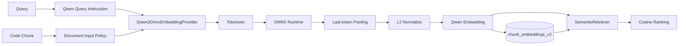
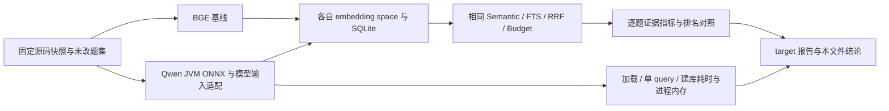
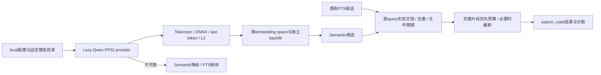
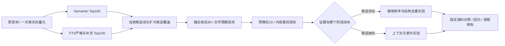
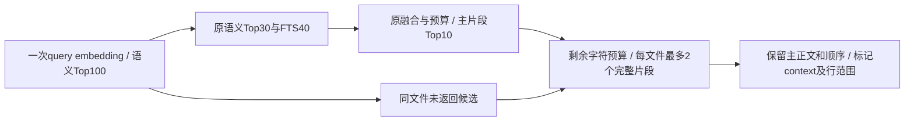

# Qwen3-Embedding-0.6B 代码 RAG Embedding 迁移与融合改进

> 当前状态：已在 `feat/qwen3-embedding-hybrid-retrieval` 完成生产替换、融合修正及冷/暖验证。第 1—9 节是初始迁移设计，第 10 节保留改动前实验事实，生产当前行为以第 11 节和源码为准。

## 1. 背景、目标与非目标

### 1.1 背景

当前 CodeAgent 代码 RAG 的默认本地语义检索使用 `InProcessBgeEmbeddingProvider`，底层通过 LangChain4j 的量化 `BGE-small-zh-v1.5` ONNX 模型在 JVM 进程内生成向量：

```text
Code Chunk / Query
        ↓
EmbeddingInputPolicy
        ↓
InProcessBgeEmbeddingProvider
        ↓
BGE-small-zh-v1.5-q
        ↓
512d normalized embedding
        ↓
SQLite chunk_embeddings_v2
        ↓
exact cosine search
```

当前方案具备本地、无外部服务、启动和资源成本较低等优点，但代码 RAG 的主要真实查询形态是：

```text
中文自然语言用户问题
        ↓
英文类名 / 方法名 / 标识符 / 源代码
```

例如：

```text
Query:
“Plan 模式崩溃以后怎么恢复未完成任务？”

Code:
resumePendingTasks()
reconcileInterruptedExecution()
restorePlanState()
```

`BGE-small-zh-v1.5` 是中文通用文本 Embedding 模型，并非专门面向“跨语言自然语言 -> 源代码”检索训练。当前 Semantic Retrieval 能工作，但中文意图与英文代码之间的跨语言、代码语义对齐不是该模型的核心目标。

Qwen 官方将 `Qwen3-Embedding-0.6B` 定位为通用 Text Embedding 模型，并明确支持 100+ 语言（包含编程语言）、multilingual / cross-lingual retrieval 和 code retrieval；同时支持 instruction-aware retrieval 和 32～1024 的自定义输出维度。因此它与 CodeAgent 的“中文自然语言 -> 英文代码”语义检索场景更匹配。

本文件将“代码 RAG 默认本地 Embedding 从 BGE-small-zh-v1.5 迁移到 Qwen3-Embedding-0.6B”记录为后续待办，不在本分支实现源码修改。

### 1.2 目标

1. 将代码 RAG 默认本地 Embedding 模型从 `BGE-small-zh-v1.5-q` 替换为 `Qwen3-Embedding-0.6B`。
2. 保持 local-first：模型必须继续在 JVM 进程内运行，不依赖 Python、Ollama 或远程 Embedding API。
3. 采用 ONNX Runtime 执行 Qwen3 Embedding，并固定可追溯的模型 artifact/revision。
4. 提升中文自然语言 Query 与英文代码 Chunk 之间的跨语言语义召回能力。
5. 利用 Qwen3 对 programming languages / code retrieval 的训练定位，使自然语言与源码之间的语义表示更匹配。
6. 保持现有 `EmbeddingProvider`、`EmbeddingSpaceDescriptor`、SQLite 向量存储、cosine 检索和 RRF 融合边界不变。
7. 通过 embedding space 变化自然触发 Qwen3 向量 backfill，不复用 BGE 生成的旧向量。
8. 用中文 Query -> 英文 Java 代码的 golden set 验证迁移收益，而不是仅凭模型规格决定上线。

### 1.3 非目标

- 本待办不调整 FTS5/BM25、Weighted RRF、Top-K 或检索候选预算。
- 不重写 `CodeChunker`。
- 不引入远程 Embedding 服务。
- 不在首版引入 reranker。
- 不因为 Qwen3 支持更长上下文就立即扩大 Chunk 大小。
- 不在本待办中同步替换长期记忆的 Embedding 模型。

特别说明：长期记忆当前的 `MemoryEmbeddingCache` 会直接创建 `InProcessBgeEmbeddingProvider`。因此实现代码 RAG 的 Qwen3 迁移时，必须先保证 RAG provider 与 Memory provider 的构造边界清晰，不能通过“直接修改现有 BGE provider 实现”让长期记忆无意切换模型。Memory 是否迁移到 Qwen3 应作为独立任务评估。

---

## 2. 现状分析（源码证据、已知约束）

### 2.1 当前架构位置

代码 RAG 的语义链路为：

```text
IndexCoordinator
  -> EmbeddingInputPolicy.prepareDocumentParts(...)
  -> EmbeddingProvider.embedAll(...)
  -> FileEmbeddingBatch
  -> chunk_embeddings_v2

SemanticRetriever
  -> EmbeddingInputPolicy.prepareQuery(...)
  -> EmbeddingProvider.embedAll(...)
  -> SqliteRetrievalIndex.searchVector(...)
  -> cosine ranking
```

当前默认本地 provider：

```text
InProcessBgeEmbeddingProvider
providerId = local-bge
modelId = bge-small-zh-v1.5-q
dimension = 512
locality = IN_PROCESS
```

底层依赖 LangChain4j：

```text
langchain4j-embeddings-bge-small-zh-v15-q
```

并由 `BgeSmallZhV15QuantizedEmbeddingModel` 完成本地推理。

### 2.2 当前 BGE 与目标 Qwen3 对比

| 维度 | 当前 BGE-small-zh-v1.5 | 目标 Qwen3-Embedding-0.6B |
|---|---|---|
| 定位 | 中文通用文本 Embedding | multilingual / cross-lingual / code retrieval Embedding |
| 主要语言能力 | 中文为主 | 100+ 语言，包含编程语言 |
| 中文 Query -> 英文代码 | 可产生语义匹配，但不是核心训练目标 | 明确覆盖 cross-lingual 与 code retrieval |
| Code Retrieval | 非专用目标 | 官方明确支持 |
| 参数规模 | small BERT 级，当前运行成本较低 | 0.6B，资源成本明显更高 |
| 当前/原生维度 | 512 | 最大 1024，支持 32～1024 自定义输出维度 |
| 上下文 | 当前实现按约 384 estimated tokens 保守切分 | 模型上下文上限 32K |
| Query instruction | 当前固定中文 retrieval prefix | instruction-aware；官方建议 Query 使用任务 instruction |
| Document instruction | 当前加入 `代码文档：` 前缀 | 官方 retrieval 示例无需给 document 添加 instruction |
| Pooling | 由当前 LangChain4j BGE wrapper 封装 | last-token pooling |
| Normalize | 当前 provider/model 输出按 embedding space 标记 normalized | Qwen 官方示例在 pooling 后做 L2 normalize |
| JVM 集成 | LangChain4j 已有专用封装，接入简单 | 预计需要自定义 ONNX provider / tokenizer / pooling |
| 本地部署 | 已实现 | 必须保持 ONNX + JVM in-process |

Qwen3 的优势不能简单归结为“1024 维比 512 维更大”。本次迁移的主要理由是训练目标与实际任务更匹配：

1. 用户 Query 大量为中文，而项目源码标识符和主体代码大量为英文；
2. Query 与 Document 不只是跨语言文本，而是“自然语言意图 -> 源代码”；
3. Qwen3 Embedding 明确支持 cross-lingual retrieval 和 code retrieval；
4. Qwen3 instruction-aware，可以用软件工程检索任务描述约束 Query embedding。

### 2.3 当前 Embedding Space 已具备迁移基础

`EmbeddingSpaceDescriptor` 已把以下字段纳入 `embeddingSpaceId`：

```text
providerId
modelId
endpointFingerprint
artifactRevision
dimension
pooling
normalized
preprocessingVersion
chunkerVersion
```

因此切换到 Qwen3 后，只要正确声明新的 provider/model/artifact/dimension/pooling，新的 `embeddingSpaceId` 就会与旧 BGE 空间不同。

现有 `IndexCoordinator` 会通过：

```text
hasCompleteEmbeddings(
  project,
  file,
  newEmbeddingSpaceId,
  chunkCount
)
```

发现 Qwen3 空间没有完整向量，并对已有 Chunk 做 embedding backfill。

因此不需要把 BGE 向量“转换”为 Qwen3 向量，也不能混用两种模型的向量。

### 2.4 长期记忆共享 BGE 的约束

当前：

```text
MemoryEmbeddingCache()
  -> new InProcessBgeEmbeddingProvider()
```

长期记忆的语义阈值、混合分数和测试均建立在当前 BGE 行为之上。

所以 RAG 替换方案不能简单把 `InProcessBgeEmbeddingProvider` 的内部模型从 BGE 改成 Qwen3，否则会同时改变：

```text
Code RAG semantic retrieval
+
Long-term Memory semantic retrieval
```

首版实现应创建独立的 Qwen3 provider，并只切换代码 RAG 的默认 provider wiring。

---

## 3. 为什么 Qwen3-Embedding-0.6B 适合当前项目

### 3.1 中英文跨语言映射

CodeAgent 的真实交互通常是：

```text
中文：
“工具执行失败以后在哪里重试？”

英文代码：
retryToolExecution(...)
ToolExecutionRetryPolicy
recoverFailedToolCall(...)
```

FTS5/BM25 依赖词面重合，对这类查询帮助有限；Semantic Retrieval 才负责把中文意图映射到英文代码。

Qwen3 Embedding 官方明确支持 multilingual 和 cross-lingual retrieval，因此其模型目标比中文通用文本 BGE 更直接覆盖该场景。

### 3.2 自然语言与代码兼容

代码检索不是普通的中英翻译：

```text
“恢复中断任务”
!=
简单翻译成某一句英文
```

相关代码可能使用：

```text
reconcileInterruptedExecution
restorePendingState
resumePlan
```

模型需要把软件工程自然语言意图与程序标识符、代码结构和方法体建立语义联系。

Qwen3 Embedding 明确将 code retrieval 作为支持任务，并把 programming languages 纳入多语言能力范围，因此更符合 CodeAgent Semantic Retrieval 的输入分布。

### 3.3 Instruction-aware Retrieval

Qwen3 官方建议 Query 使用一条描述检索任务的 instruction，并指出 instruction 能针对具体 task / language / scenario 调整检索表示。

CodeAgent 可以固定一个稳定的英文任务 instruction，例如：

```text
Instruct: Given a natural-language software-engineering query, retrieve source-code chunks that implement or explain the described behavior.
Query: <submitted query>
```

Document 侧保持代码 Chunk 本身，不添加 Query instruction。

这比当前通用中文前缀：

```text
为这个句子生成表示以用于检索相关文章：
```

更贴合“自然语言 -> 代码”的检索目标。

### 3.4 Local-first 仍可保持

迁移目标不是调用 Qwen 云 API，而是：

```text
CodeAgent JVM
    ↓
Qwen3OnnxEmbeddingProvider
    ↓
ONNX Runtime Java
    ↓
Qwen3-Embedding-0.6B artifact
    ↓
local CPU inference
```

因此以下设计原则保持不变：

- 不要求 Python runtime；
- 不要求 Ollama；
- 不默认联网；
- embedding 内容不离开本地进程；
- provider 故障时 Semantic Retrieval 降级，不中止 FTS。

---

## 4. 方案设计

### 4.1 目标架构


```mermaid
flowchart LR
    Q[Query] --> P[Qwen Query Instruction]
    P --> E[Qwen3OnnxEmbeddingProvider]
    C[Code Chunk] --> D[Document Input Policy]
    D --> E
    E --> T[Tokenizer]
    T --> O[ONNX Runtime]
    O --> H[Last-token Pooling]
    H --> N[L2 Normalize]
    N --> V[Qwen Embedding]
    V --> S[(chunk_embeddings_v2)]
    V --> R[SemanticRetriever]
    S --> R
    R --> X[Cosine Ranking]
```

### 4.2 新增 Qwen3 Provider

建议新增：

```text
com.codeagent.rag.embedding.Qwen3OnnxEmbeddingProvider
```

继续实现现有：

```java
EmbeddingProvider
```

Provider 负责：

1. lazy load Qwen3 tokenizer；
2. lazy create ONNX Runtime session；
3. 构造 `input_ids` / `attention_mask` 等模型输入；
4. 使用和参考实现一致的 padding / truncation；
5. 执行 ONNX inference；
6. 对 `last_hidden_state` 做 last-token pooling；
7. L2 normalize；
8. 返回固定维度 `float[]`；
9. 管理 ONNX session 生命周期；
10. 把底层异常统一映射到 `EmbeddingException`。

首版不要把 Qwen3 ONNX 细节泄漏到 `SemanticRetriever` 或 `IndexCoordinator`。

### 4.3 ONNX Artifact 策略

实现时必须选用可重复构建/验证的 Qwen3 ONNX artifact。

要求：

- 基于官方 `Qwen/Qwen3-Embedding-0.6B` 权重；
- 固定 artifact revision；
- 在构建或分发侧记录 checksum；
- 不运行时静默下载不可控的“latest”模型；
- ONNX 输入/输出名称、dtype、opset 和 tokenizer 版本必须进入兼容性测试；
- 如使用量化 artifact，必须明确量化方式并和 reference embedding 做误差测试。

首版可以使用经过验证的现成 ONNX artifact，也可以从官方模型固定 revision 导出 ONNX；最终仓库必须固定来源和版本，不能依赖浮动版本。

### 4.4 Pooling 与 Normalize

Qwen3 官方参考实现使用：

```text
last hidden state
    ↓
last non-padding token
    ↓
L2 normalize
```

因此新的 embedding space 应明确：

```text
pooling = last-token
normalized = true
```

不能继续假设 BGE 的 pooling 行为，也不能直接用不等价的 CLS / MEAN pooling 替代。

ONNX Provider 测试需要使用固定输入，与官方参考实现产生的 embedding 做数值近似校验。

### 4.5 Query / Document Input Policy

当前 `EmbeddingInputPolicy` 与 BGE 绑定较强，包含：

```text
QUERY_PREFIX = 为这个句子生成表示以用于检索相关文章：
DOCUMENT_PREFIX = 代码文档：
```

迁移时建议把“切分策略”和“模型输入格式”解耦。

目标：

```text
Query:
Instruct: <stable software-engineering retrieval instruction>
Query:<raw query>

Document:
<raw code chunk>
```

首版继续保留现有长 Chunk 分段、两行 overlap、多 part embedding 平均和最终 normalize 的行为，避免“换模型”和“重做 Chunk/long-context 策略”同时发生。

Qwen3 虽支持更长上下文，但首版不以扩大单次输入长度为目标；后续应单独通过质量/性能测试决定是否调整 384/360 的当前保守预算。

### 4.6 输出维度策略

Qwen3-Embedding-0.6B 的最大 embedding dimension 为 1024，并支持 32～1024 自定义输出维度。

迁移实现应优先验证两种配置：

```text
A. 512 dimensions
- 与当前 SQLite 存储和 exact cosine 成本接近
- 适合作为桌面/local-first 默认候选

B. 1024 dimensions
- 使用完整原生维度
- 存储和 exact cosine 成本约为当前 512d 的两倍
```

首版默认值不应只根据“维度越大越好”决定。

建议采用以下决策：

1. 先验证官方支持的 512d 输出在 JVM ONNX 路径下与参考实现一致；
2. 使用同一中文 Query -> 英文代码 golden set 比较 Qwen3 512d 和 1024d；
3. 如果 512d 的 Recall@K / MRR 与 1024d 差距可接受，则默认 512d，保持当前向量存储与相似度计算成本级别；
4. 如果 1024d 带来明确质量收益，再接受存储与 cosine 成本翻倍。

禁止在没有参考实现等价性验证的情况下自行随意截断向量。

### 4.7 Embedding Space 与增量迁移

Qwen provider 建议使用新的 descriptor，例如概念上：

```text
providerId = local-qwen3
modelId = qwen3-embedding-0.6b-onnx
artifactRevision = <pinned revision>
dimension = 512 or 1024
pooling = last-token
normalized = true
preprocessingVersion = <new version>
chunkerVersion = current
```

因为 `embeddingSpaceId` 会改变：

```text
旧 BGE embeddings
        ↓
继续属于旧 space

新 Qwen provider
        ↓
hasCompleteEmbeddings(newSpace) == false
        ↓
对已有 chunks backfill Qwen embeddings
```

不需要重新做 FTS，也不需要因为换 Embedding 模型重新切代码 Chunk。

首版允许旧 BGE embedding space 留在 SQLite 中，以保证回滚安全。清理 obsolete embedding spaces 可以作为后续维护任务，不与模型迁移绑定。

### 4.8 RAG Wiring

目标 wiring：

```text
代码 RAG 默认本地 provider
InProcessBgeEmbeddingProvider
        ↓
Qwen3OnnxEmbeddingProvider
```

保持：

```text
SemanticRetriever
IndexCoordinator
SqliteRetrievalIndex.searchVector
RetrievalFusion
```

接口和主流程不变。

远程 embedding consent / provider 机制也不应因为本地默认模型迁移而改变。

### 4.9 Memory 隔离

首版明确：

```text
Code RAG
→ Qwen3OnnxEmbeddingProvider

Long-term Memory
→ 继续使用 InProcessBgeEmbeddingProvider
```

原因：

- Memory 有独立的 semantic threshold；
- Memory 使用词法 + semantic 固定权重；
- Memory embedding 只做进程内缓存；
- 直接换模型可能改变已有 threshold 的含义和召回分布。

如果未来决定 Memory 也迁移 Qwen3，应重新评测 Memory 的 semantic thresholds、hybrid weight 和写入候选阈值，并单独形成设计任务。

### 4.10 失败与回滚

本地 Qwen3 模型加载或推理失败时：

```text
Semantic stage
→ degraded

FTS
→ 继续返回
```

不得因为模型体积更大而改变现有独立失败语义。

回滚时只需把代码 RAG 默认 provider 切回 BGE；旧 BGE embedding space 保留时无需重新生成旧向量。

---

## 5. 实现任务与测试矩阵

### 5.1 实现任务

1. 增加固定版本 Qwen3 ONNX artifact / tokenizer 获取与校验方案。
2. 新增 `Qwen3OnnxEmbeddingProvider`。
3. 实现 tokenizer -> ONNX inference -> last-token pooling -> L2 normalize。
4. 为 Qwen3 拆出独立 Query instruction / Document input policy。
5. 创建新的 `EmbeddingSpaceDescriptor` 参数。
6. 把代码 RAG 默认本地 provider wiring 切换到 Qwen3。
7. 保持 `MemoryEmbeddingCache` 继续显式使用 BGE。
8. 更新 pom 依赖，避免依赖 LangChain4j 的 BGE 专用 wrapper 作为 RAG 必需项。
9. 保留 BGE dependency，直到确认 Memory 仍需要它。
10. 更新 AGENTS、README、agents-reference 和 RAG 相关 docs 的当前模型描述。

### 5.2 测试矩阵

| 领域 | 用例 | 预期 |
|---|---|---|
| ONNX Provider | 固定文本 embedding | 输出维度正确、数值有限、非全零 |
| ONNX Provider | 相同输入重复编码 | deterministic |
| ONNX Provider | pooling parity | 与 Qwen 官方参考实现近似一致 |
| ONNX Provider | normalize | L2 norm 约等于 1 |
| ONNX Provider | artifact/tokenizer mismatch | 明确失败，不产生错误空间向量 |
| Query Policy | 中文自然语言 Query | 使用稳定英文 software-engineering instruction |
| Document Policy | Java code chunk | 不错误复用 Query instruction |
| Embedding Space | BGE -> Qwen | space id 改变，旧向量不被新查询读取 |
| Incremental Index | 文件内容未变、模型切换 | 复用 Chunk，只 backfill Qwen embedding |
| Failure Isolation | Qwen load/inference failure | FTS 正常，Semantic 标记 degraded |
| Memory | RAG 默认切 Qwen 后 | Memory 仍使用 BGE，现有测试不漂移 |
| Quality | 中文 Query -> 英文 Java code | Recall@5 / Recall@10 / MRR 不低于基线，目标显著优于 BGE |
| Performance | 首次模型加载 | 记录 wall time / peak memory |
| Performance | 单 query embedding | 记录 P50/P95 latency |
| Performance | index backfill | 记录 chunks/sec 和 JVM memory |
| Dimension | Qwen 512 vs 1024 | 用真实 benchmark 决定默认维度 |

### 5.3 Golden Set

必须增加面向项目真实场景的中文 Query，例如：

```text
“Plan 模式崩溃之后如何恢复未完成任务？”
“工具执行超时在哪里处理？”
“长期记忆如何用新事实替换旧事实？”
“同一轮多个工具是怎么调度执行的？”
“RAG 的语义向量在哪里做相似度排序？”
```

每条 Query 人工标注相关 file / class / method，至少统计：

```text
Recall@5
Recall@10
MRR
```

对比对象只需要：

```text
当前 BGE-small-zh-v1.5
vs
Qwen3-Embedding-0.6B
```

本待办不引入其他模型横向评测。

---

## 6. 兼容性、成本与风险

### 6.1 资源成本

Qwen3-Embedding-0.6B 明显大于当前 small BGE。

需要真实测量：

- artifact 体积；
- JVM 启动后首次加载延迟；
- CPU 单 query 延迟；
- index backfill 吞吐；
- peak RSS / heap / native memory；
- 512d 与 1024d SQLite 向量体积；
- exact cosine 搜索延迟。

如果本地桌面体验无法接受，不能仅凭 benchmark 质量更高就直接替换默认模型。

### 6.2 ONNX 等价性

Qwen3 的正确推理行为依赖：

- tokenizer；
- padding side；
- attention mask；
- last-token pooling；
- normalize；
- output dimension；
- instruction format。

任意一项与参考实现不一致，都可能让“模型已替换”但实际检索质量下降。

因此 ONNX parity test 是迁移门禁，不是可选测试。

### 6.3 输入策略迁移

当前 `EmbeddingInputPolicy` 是 BGE-oriented。迁移 Qwen3 时如果仍机械复用：

```text
为这个句子生成表示以用于检索相关文章：
代码文档：
```

会偏离目标模型官方 retrieval 用法。

因此 Query instruction 和 Document formatting 必须作为模型 adapter 的一部分一起迁移。

### 6.4 Memory 意外迁移风险

`MemoryEmbeddingCache` 当前直接依赖 BGE provider。

如果实现者为了“替换模型”直接重写 `InProcessBgeEmbeddingProvider` 的内部实现，会让 Memory 同时切到 Qwen3，而 Memory 的阈值没有重新标定。

此风险必须通过独立 provider 类和测试隔离。

---

## 7. 验收清单

- [ ] 代码 RAG 默认本地 Embedding 已从 BGE 切到 `Qwen3-Embedding-0.6B`。
- [ ] Qwen3 通过固定 ONNX artifact 在 JVM 内运行，不依赖 Python/Ollama/远程 API。
- [ ] Query 使用经过固定版本管理的 software-engineering retrieval instruction。
- [ ] Document 输入不错误复用 Query instruction。
- [ ] last-token pooling 与 L2 normalize 与参考实现一致。
- [ ] Qwen3 使用独立 `embeddingSpaceId`，不读取 BGE vectors。
- [ ] 模型切换只触发 embedding backfill，不重建无关 FTS。
- [ ] Semantic failure 继续独立降级。
- [ ] 长期 Memory 首版仍保持 BGE，不发生隐式行为漂移。
- [ ] 中文 Query -> 英文代码 golden set 完成 BGE / Qwen3 对比。
- [ ] 默认 512d 或 1024d 的选择有 Recall / latency / memory 数据依据。
- [ ] targeted tests、RAG regression、Memory regression、quick/full/package 与 diff check 有真实成功证据。

---

## 8. 外部模型事实来源

只记录本待办涉及的两个模型：

- Qwen3-Embedding-0.6B 官方模型页：<https://huggingface.co/Qwen/Qwen3-Embedding-0.6B>
  - 100+ languages；
  - 包含 programming languages；
  - multilingual / cross-lingual / code retrieval；
  - 0.6B 参数；
  - 32K context；
  - 最大 1024 维，支持 32～1024 自定义输出维度；
  - instruction-aware；
  - 官方参考实现采用 last-token pooling + L2 normalize。
- BGE-small-zh-v1.5 官方模型页：<https://huggingface.co/BAAI/bge-small-zh-v1.5>
  - 当前 CodeAgent 使用其量化 JVM in-process 版本；
  - 当前项目固定输出 512 维；
  - 主要作为中文通用文本 Embedding 基线。

---

## 9. TODO 状态

**状态：`test/qwen3-embedding-evaluation` 的受控质量实验已完成，量化一致性门槛未通过；默认模型迁移仍待实现。**

本实验分支补充 test-only provider 与受控评测，不修改生产代码、不切换默认模型、不重建用户索引。

后续实现时应从当时最新 `main` 新建实现分支，并以本文件作为设计输入重新核对当前源码，不能假定本文记录的类名、依赖版本或模型 artifact 永久不变。

## 10. 本次受控质量实验：方案、任务与实施记录

### 10.1 目标、边界与方案评审

用户要求新建分支、完整测试 Qwen3 的实际检索效果。实验不等同于默认模型迁移：不改默认 provider、Memory、FTS、RRF、代码分块、授权或用户索引。所有模型、缓存、实验数据库与报告在被忽略的 target 目录，代码与文档保持未提交；本任务仅维护本文件，不另建计划文档。

比较过三种方式：远程 API 会改变数据出境与授权边界；先写完整生产迁移再测会扩大尚未验证的改动；本次选用 test-only JVM ONNX provider，复用真实生产索引、召回、融合与预算流水线。独立 provider 对现有 BGE 格式的 query/document 输入作明确适配，query 改为固定英文软件工程 instruction，document 移除 BGE 前缀，分段数量、overlap 与多段向量平均规则不变。这是模型及其必需输入适配的比较，不声称只改变权重。

语料固定为既有 368 个生产 Java 文件、3,226 个 chunk 的仓库内快照，SHA-256 `a55c320f0e9897b1115dcdde4e8ee798c59300c12f0716f42370a7c5acd1fe4c`。沿用 69 道主集（63 正例、6 无答案）与 6 道独立调用者探针，问题及 marker/requiredText 不修改。分别报告纯语义和双路 P@5、Recall@5/10、MRR@10、无答案误返回及分类指标；关键词作为不变对照。新模型独立 space，不能读取旧 BGE 向量。目标是测量收益，质量低于基线也如实交付，不按题目调指令或权重。


```mermaid
flowchart LR
    C[固定源码快照与未改题集] --> B[BGE 基线]
    C --> Q[Qwen JVM ONNX 与模型输入适配]
    B --> I[各自 embedding space 与 SQLite]
    Q --> I
    I --> S[相同 Semantic / FTS / RRF / Budget]
    S --> M[逐题证据指标与排名对照]
    Q --> P[加载 / 单 query / 建库耗时与进程内存]
    M --> R[target 报告与本文件结论]
    P --> R
```

### 10.2 Artifact、成本与验收

首个候选为 `onnx-community/Qwen3-Embedding-0.6B-ONNX` 的固定 revision `c25a394dd583836952667c12f008335071b3f43d`，INT8 `onnx/model_quantized.onnx`，613,527,631 bytes，SHA-256 `87cd124e0ef1fd1f223ebc283efccbaeac386d0b08344701c46975d0657b591f`；tokenizer SHA-256 `def76fb086971c7867b829c23a26261e38d9d74e02139253b38aeb9df8b4b50a`。来源与量化明确进入报告，不能把社区量化结果自动当作官方原精度结果。将核对真实 ONNX 输入/输出、token IDs、last-token pooling、L2 norm 与重复编码；尽可能与原精度参考比较并记录误差，未验证部分明确披露。

512 维只降低向量存储与 cosine 成本，不保证 0.6B 推理成本接近 small BGE。先测完整 1024 维；512 维使用完整向量前缀再归一化，并保持独立空间。可缓存 document 的完整向量复用第二种维度，query 时延必须真实重新推理，缓存耗时不得冒充模型推理耗时。索引与查询时延分开，首次加载与暖查询分开；测量 JVM heap/native 及进程工作集能获取的真实信息，无法测量的项目不编造。

六样本量化对照（两条 query、两条短 document、两段真实生产文件的编号分段）完成后，INT8 与同一 export FP32 的向量 cosine 为 0.855～0.924，未达到实施前预设的每样本 >0.95 门槛。保留该失败，不降低门槛；两条配对 query/document 相似度虽然接近，也不能证明全库排序无漂移。实验因此补充完整 FP32 1024 维语料及题集对照，不能用社区 INT8 单独代表原精度 Qwen。FP32 主图 SHA-256 `bf27b2f3f9ef9c32ca337d75b361fa99439deaeaefe82e4701b2dbd8439197cc`，外部权重 SHA-256 `f0a61604465929a27e68aa6217c8c89ec6186572f0209fdb7711adda48a9b9a9`，分别 307,161,415 与 2,093,436,928 bytes。该对照仍是同一社区 ONNX export，不等于独立官方 PyTorch parity。

### 10.3 实现任务与测试矩阵

`>0.95` 是本实验事先设定的一致性门槛，非厂商标准；未达到它不直接等价于检索质量失败。完整 FP32 与 INT8 题集对照用于判断实际排序差异，门槛失败本身保持可追溯。

- [x] 先写输入适配、最后有效 token、维度截取/归一化、无有效 token 与 artifact 校验测试，观察失败后实现。
- [x] 固定模型下载与 checksum，检查真实 ONNX/tokenizer 契约；失败不得当作降级语义实验。
- [x] test-only Qwen provider，复用既有 ONNX/tokenizer 依赖，所有 native 资源明确关闭。
- [x] 参数化现有真实语料评测的 provider、输出目录及维度，报告记录实际模型空间与输入策略。
- [x] 在相同快照上完成 BGE、Qwen1024、Qwen512 及 FP32 四组检索实验，逐条核对共同问题与证据。
- [x] 针对性回归、quick 与 diff 检查；同步报告入口和本文件的实测结果、限制与是否值得迁移的结论。

### 10.4 复现命令与报告口径

固定 revision 的四个 artifact 放在 `target/qwen-evaluation/model/`，每次 provider 初始化都验证 SHA-256；测试不自行访问网络下载模型。沿用现有 `onnxruntime 1.20.0`、DJL tokenizers `0.36.0`，不修改 pom 或生产接线。PowerShell 的 Maven 属性含点时必须加引号。

```powershell
$env:JAVA_HOME='C:\Program Files\Java\jdk-17'
$env:Path="$env:JAVA_HOME\bin;$env:Path"
$corpus='D:\IDEAworkSpace\zsxq\paicli\target\rag-evaluation\corpus-a55c320f0e9897b1115dcdde4e8ee798c59300c12f0716f42370a7c5acd1fe4c'

# BGE；Qwen INT8 的 1024/512；同一 export FP32 的 1024。
# 每组独立输出目录及 embedding space，顺序运行。
foreach ($run in @(
    @{name='bge'; model='bge'; dimension=512; fp32='false'},
    @{name='qwen1024'; model='qwen'; dimension=1024; fp32='false'},
    @{name='qwen512'; model='qwen'; dimension=512; fp32='false'},
    @{name='qwen-fp32'; model='qwen'; dimension=1024; fp32='true'}
)) {
    mvn test -DskipTests=false '-Dtest=RepositoryRetrievalEvaluationTest' `
      '-Drag.repository.eval=true' "-Drag.repository.model=$($run.model)" `
      "-Drag.qwen.dimension=$($run.dimension)" "-Drag.qwen.fp32=$($run.fp32)" `
      "-Drag.repository.output=target/qwen-evaluation/$($run.name)" `
      "-Drag.repository.corpus=$corpus"
    if ($LASTEXITCODE -ne 0) { throw "Evaluation failed: $($run.name)" }
}

mvn test -DskipTests=false '-Dtest=Qwen3EvaluationProviderTest,Qwen3ArtifactTest,Qwen3ComparisonReportTest,RetrievalEvaluationMetricsTest,RepositoryEvaluationDatasetTest,RetrievalFusionTest,RetrievalBudgetTest,SqliteRetrievalIndexTest,DefaultCodeRetrievalServiceTest,MemoryEmbeddingCacheTest,InProcessBgeEmbeddingProviderTest' '-Drag.qwen.artifact=true' '-Drag.qwen.compare=true'
# 独立质量门槛；本次已发生失败，不能视作代码回归成功。
mvn test -DskipTests=false '-Dtest=Qwen3QuantizationParityTest' '-Drag.qwen.parity=true'
mvn test -Pquick
git diff --check
```

各目录下 `results.json`、`report.md` 为完整检索明细；BGE、INT8 1024 和 FP32 的 `cold-results.json` 保留首次实际模型建库证据，最终暖复核不能覆盖它。INT8 512 首次建库复用了完整分段向量缓存，只有缓存回填成本，不称冷模型编码。`comparison.json` 包含逐题 Recall/MRR 得失与分类汇总，`comparison.md` 为可读表；`parity.json` 为六样本量化漂移。模型和报告不提交 git，本文保存关键可追溯结果。

比较器要求四组各 225 行、COMPLETE、相同语料/题集/生产流水线/冻结测试 harness 哈希、相同参数、问题与证据，以及四个独立空间。关键词结果逐字段一致；无符号 chunk 的 fallback `symbol` 内含各自输出目录，只将指定 corpus 根归一化为 `<CORPUS>`，不放宽内容、行号、排名、hash 或证据检查。主集指标只在 63 正例计算，无答案六题和调用者六探针分开报告。各 query/mode 一次预热、三次串行计时，时延包含真实 query 推理与组件检索，不包含首次建库及 service 外层开销。

已观察到 INT8 冷/暖 225 行的所有命中与质量分数完全一致；资源审查发现并修正首次预热失败时资源未接管、FP32 统计误报 INT8 权重 SHA 两处问题。真实 artifact 测试进一步验证跨 provider 的 1024→512 document 缓存复用、query 不缓存及重复关闭。Java memory-pool 峰值仅作辅助记录，进程工作集采样单独保存，不能把 heap 当作全进程内存。

### 10.5 全语料实测质量与瓶颈结论

四组均完整索引 368 文件、3,226 chunk，各执行 75 问题 × 3 modes = 225 行。以下是主集 63 正例的 macro 平均；P@5 的分母固定为 5，标注不是所有相关 chunk 的穷尽列表，不能将该值直接宣传为用户回答准确率。

| 模型与维度 | 路径 | P@5 | Recall@5 | Recall@10 | MRR@10 |
|---|---|---:|---:|---:|---:|
| BGE 512 | 纯语义 | 0.63% | 3.17% | 6.35% | 0.0258 |
| Qwen INT8 1024 | 纯语义 | 10.48% | 49.21% | 61.90% | 0.2986 |
| Qwen INT8 512 | 纯语义 | 10.16% | 47.62% | 56.35% | 0.2802 |
| Qwen FP32 1024 | 纯语义 | 13.02% | 59.52% | 67.46% | 0.3401 |
| BGE 512 | 双路 | 6.35% | 31.75% | 38.10% | 0.2041 |
| Qwen INT8 1024 | 双路 | 8.25% | 40.48% | 40.48% | 0.2487 |
| Qwen INT8 512 | 双路 | 7.62% | 37.30% | 38.89% | 0.2698 |
| Qwen FP32 1024 | 双路 | 7.62% | 37.30% | 38.89% | 0.2515 |

关键词对照的主集 Recall@5/10 均为 36.51%，MRR@10 为 0.2513。六道无答案题在四组的各路径中都返回了候选（6/6）；这表示检索误返回，不能推导 Agent 最终一定输出错误答案。换模型未解决无答案识别。

纯语义按问题类别的 Recall@10：

| 类别（正例数） | BGE | INT8 1024 | INT8 512 | FP32 1024 |
|---|---:|---:|---:|---:|
| 标识符（19） | 10.53% | 84.21% | 78.95% | 84.21% |
| 语义描述（19） | 10.53% | 73.68% | 63.16% | 78.95% |
| 同义改写（19） | 0.00% | 31.58% | 31.58% | 42.11% |
| 跨模块双证据（6） | 0.00% | 50.00% | 41.67% | 58.33% |

与 BGE 逐题配对比较 Recall@10：INT8 1024 纯语义为 37 题提升、1 题下降、25 题不变，双路为 2/0/61；INT8 512 纯语义为 33/0/30，双路为 2/1/60；FP32 纯语义为 40/1/22，双路为 2/1/60。题集中的同义问题不是独立随机样本，本实验不据此声称跨仓库统计显著性。

**已验证事实：Qwen 的模型及必需输入适配大幅改善当前中文问题到 Java 代码的语义召回；仅换模型不能充分改善当前双路检索。** FP32 纯语义 Recall@10 比 BGE 提高 61.11 个百分点，双路却只提高 0.79 个百分点；更强的 FP32 双路还低于 INT8 1024，因此模型向量更接近原精度并不保证固定融合后的指标单调提高。

源码与逐题证据指向融合和预算限制：[RetrievalFusion](../../src/main/java/com/codeagent/rag/RetrievalFusion.java) 使用 RRF K=60、FTS 权重 1.2、semantic 权重 1.0，另有类型/多路加分及每文件最多 3 条；[RetrievalBudget](../../src/main/java/com/codeagent/rag/RetrievalBudget.java) 按排名消耗字符预算，遇到截断即结束。在同等类型修正、单路命中时，FTS 的前 13 名得分仍高于 semantic 第 1 名。INT8 1024 有 18 道主集题、512 有 15 道、FP32 有 21 道在纯语义命中后被双路丢失证据；其中 `tokens-semantic` 的 INT8 纯语义第 5 名命中，双路仅保留 3 条、15,977 字符；`parent-semantic` 纯语义第 2 名命中，双路返回 10 条、8,420 字符仍未命中，说明不能把所有损失都归于字符预算。

**建议：Qwen 值得作为语义模型升级候选，但不建议按本文旧迁移 TODO 直接切换默认模型并宣称 RAG 问题已解决。** 后续应独立评估 query 类型/融合权重、候选配额与证据预算，结合未见题集验证；本次不调权、不改分块、不加入 reranker。INT8 512 节省向量空间但损失语义 Recall，FP32 提升较大且资源成本较高；选型必须同时考虑最终流水线收益与成本。独立官方 PyTorch parity、生产故障/恢复集成及默认迁移仍未交付。

### 10.6 实测成本、验证证据与交付边界

环境为 Windows 11 amd64、Java 17.0.12、8 个可用处理器；Qwen 使用 ONNX CPU、4 intra-op / 1 inter-op threads，BGE 使用已有默认配置。各实验串行，查询不使用向量缓存。以下暖时延来自最终冻结 harness 的主集 69 题 × 3 次测量，含 query 推理与组件检索，不含建库、首次加载及 service 外层开销；不可直接外推其他 CPU、GPU 或生产请求分布。

| 模型 | 纯语义 P50/P95（ms） | 双路 P50/P95（ms） |
|---|---:|---:|
| BGE 512 | 55.11 / 68.29 | 58.06 / 67.69 |
| Qwen INT8 1024 | 268.11 / 380.89 | 251.12 / 344.13 |
| Qwen INT8 512 | 246.14 / 321.02 | 255.39 / 390.12 |
| Qwen FP32 1024 | 313.88 / 441.35 | 326.58 / 507.61 |

首次模型加载及首条预热 query：BGE 4.563 s、INT8 1024 7.605 s、FP32 16.426 s，包含 artifact 校验和初始化，不是纯模型加载时间。首次实际建库：BGE 85.296 s、INT8 1,745.340 s（29.09 min）、FP32 2,113.027 s（35.22 min）。INT8 512 首次缓存回填为 39.103 s，不能和冷推理直接比较；最终已有索引 refresh 只表示索引复用。两组 Qwen 冷运行最终各 4,169 次 nativeCalls，其中 676 次是预热及 query、3,493 次是未命中文档分段缓存的真实编码；最终暖运行仍各 676 次真实 query 编码。512 维仍执行完整模型推理，本机没有稳定的查询减半收益。

512 的 39.103 s 取自首次运行时直接读取 metadata 的观察值；其原始 metadata 后被暖复核覆盖，未保留独立副本，该单项仅作参考，不作为可独立复核的冷成本证据。其余上述冷建库数据来自保留的 `cold-results.json`，最终查询时延来自完整报告。

INT8 主权重约 613.53 MB，FP32 主图及外部权重合计约 2,400.60 MB。冷运行的观测峰值进程工作集分别为 INT8 1,921,437,696 bytes、FP32 3,056,111,616 bytes（十进制约 1.92/3.06 GB），来自同一进程的 `PeakWorkingSet64` 采样，包含 heap/native；不等于 ONNX 单独分配量、峰值 heap 或全系统 RAM。BGE 未采集完整进程工作集，不能编造其对照内存值。

最终四组报告的 corpus、dataset、pipeline、harness 哈希分别一致：

- corpus：`a55c320f0e9897b1115dcdde4e8ee798c59300c12f0716f42370a7c5acd1fe4c`；
- dataset（报告使用 Windows 工作区 CRLF 原始字节）：`842bf3544c7cb7367c496588ffb286674c65eeba51c6fd61ce12a7be35ca53e2`；同一内容归一为 Git LF 的哈希为 `bc2b39d219ae25dd34b06d6a4a3d75c4f20eb116a95d79fb07ef66ff9dfbd685`，两者不能混用；
- pipeline：`dd99193e260c7a37bdb1d9e061c0f4a101f629b16af1ed8515a9471f71679e4d`；
- harness：`0b4fc5d3e3e477db63d770b7471cc72db9af78c6293590385c8b3bc88adb6c66`。

`Qwen3ComparisonReportTest` 已通过四组各 225 行、关键词逐字段对照和所有共同问题/证据/参数检查。BGE、INT8 1024、FP32 冷/暖 225 行的质量分数相同。针对性命令见 10.4：41 tests，0 failures、0 errors、0 skipped；包含真实 artifact、缓存/维度/关闭、报告公平性、指标、题集、融合、预算、SQLite、服务及 BGE/Memory 缓存回归。量化一致性门槛单独记录为未通过，不能混入“全部测试通过”的表述。

最终 `mvn test -Pquick`：1,323 tests，0 failures、0 errors、8 skipped，BUILD SUCCESS，43.821 s；重实验 opt-in 在日常回归中跳过，已在上述专门命令真实执行。单独 `mvn test -DskipTests=false '-Dtest=Qwen3QuantizationParityTest' '-Drag.qwen.parity=true'`：1 test、1 failure、0 errors，原因仍为预设量化一致性门槛，不是编译/资源/回归错误，日志保留在 `target/qwen-evaluation/quantization-gate.log`。早期比较器的绝对 fallback symbol 差异已按指定 corpus 根归一化解决；冻结 harness 后四组全部重跑，不改写旧结果哈希。

`git diff --check` 通过；没有生产代码、pom、配置或默认模型变更，没有提交模型、target、secret 或 raw session。本次唯一开发文档为本文件，参考文档仅增加入口链接；所有改动保留在实验分支未提交。实验完成不代表第 7 节的生产迁移验收完成，后续必须单独设计/验证生产接线与失败恢复，并补独立参考一致性及未见题集。

## 11. 生产替换与融合修正：设计、任务及验收

### 11.1 目标、范围与设计评审

用户明确要求在当前分支实现替换并改名，沿用未提交实验改动；分支名为 feat/qwen3-embedding-hybrid-retrieval。选择固定 FP32 1024 维 ONNX（第10节已校验权重），不采用未过一致性门槛的INT8作为默认。Memory仍显式BGE；不改变远程授权、chunker、SQLite schema或工具集。第1/9节的“后续待办/本分支不实现”是旧阶段状态，本节的新授权与最终实施状态优先。

比较了单纯增加semantic RRF权重、确定性双路交错、额外reranker三种方式：RRF仍会把弱词法共识抬到强语义之前；reranker扩大部署及延迟。因此采用保留各路原排序的双路交错：自然语言以semantic为主、每4位一个FTS补充；明确标识符以FTS为主。标识符规则为单个 ASCII identifier，或所有词都是 identifier 且至少一个有内部大小写变化、连续大写、点/下划线/$/()，覆盖“类名 + 方法名”；普通全小写英文短句仍以语义为主。共同命中合并来源但不额外压过主路排名，跨路按chunk去重、每文件最多3条，单路故障使用剩余一路并保留原来的rank/type分值规则。规则只使用query形态和候选排名，禁止根据测试id/marker/答案分类选择策略。

预算优先完整片段：首条保留最高排名，后续放不下的片段暂存并继续寻找可完整装入的后继；仍有容量/名额时才截断最高排名的暂存片段。保持TopK、字符上限、行边界和partial语义，不用标注证据做裁剪。

Qwen通过独立lazy provider + ONNX engine接入工厂。模型目录配置embedding.localModelDirectory / EMBEDDING_LOCAL_MODEL_DIR，默认~/.codeagent/models/qwen3-embedding-0.6b/<revision>。显式安装脚本固定revision/hash，支持复制已有实验artifact；运行时不静默联网下载。缺失/校验错误/推理失败仅降级semantic，不能停止FTS；初始化失败缓存到provider关闭/重配，避免逐文件重复重试加载。可显式local provider=bge回滚；新space自然backfill已有chunk，不重建未变化FTS。


```mermaid
flowchart LR
    CF[local配置与固定模型目录] --> Q[Lazy Qwen FP32 provider]
    Q --> N[Tokenizer / ONNX / last token / L2]
    N --> V[新embedding space与独立backfill]
    V --> S[Semantic候选]
    F[既有FTS候选] --> M[按query形态交错 / 去重 / 文件限额]
    S --> M
    M --> B[完整片段优先预算 / 必要时截断]
    B --> R[search_code结果与诊断]
    Q -->|不可用| D[Semantic降级 / FTS继续]
```

### 11.2 任务、影响面与测试矩阵

- [x] 分支改名；保存改动前实验报告作为对照，继续仅维护本文档。
- [x] 先写factory默认模型/rollback、配置优先级、lazy失败/关闭、输入/pooling/向量有效性与跨space backfill测试，观察RED后实现。
- [x] 增加Qwen provider/engine、固定模型安装脚本和本地目录配置；在本机完成安装及真实ONNX契约验证。
- [x] 先写自然语言主路保护、关键词补充、标识符优先、单路降级/重复chunk/文件限额测试，再实现融合。
- [x] 先写超大中间片段不能阻塞后续完整证据的预算测试，再实现完整片段优先分配。
- [x] 固定旧语料/题集，实测生产provider与融合；记录pure/full质量、逐题得失、时延、降级与成本；不改题集来提高指标。
- [x] 针对性、Memory、配置、quick及必要全量/构建、diff检查；只读评审；同步README/.env.example/AGENTS/agents-reference和本文件。

验收：默认local真正使用Qwen FP321024；Memory BGE不变；FTS未变文件不重建；空间不混用；模型缺失/损坏/关闭可解释且FTS继续；查询不缓存；融合收益必须实测而非只通过单测。目标双路主集Recall@10达到至少60%，尽力保持标识符19/19，所有负向变化如实记录；若未达目标继续诊断，不按题调参。未见题集及独立官方PyTorch parity仍作为证据边界，不声称完成了它们。

### 11.3 实施证据与审查修正

生产默认接线覆盖 `EmbeddingProviderFactory`、`ToolRegistry.getCodeRetrievalService()`、`/embedding local` 与 `CodeIndex` 默认构造。ToolRegistry 读取实际配置后经工厂解析，remote 无匹配 capability 仍失败关闭。`CodeIndex` 增加 `AutoCloseable`：默认构造拥有并关闭模型，显式注入 provider/legacy client 由调用者管理，默认实例应使用 try-with-resources。Memory 缓存及 deprecated `EmbeddingClient` 的 BGE 兼容默认保持不变。

只读审查发现并修正：①双路若调用单路融合，旧 type 加分会将第二名 method 提到第一名 file 之前；现直接构建原序 lane，只在交错后统一去重与文件限额。②非法本地目录原在lazy边界外抛出，现捕获 `InvalidPathException` 返回 `local_embedding_directory_invalid`，服务报告具体诊断并保持FTS。③大模型兼容索引入口原缺资源释放路径，现明确默认/注入的所有权及关闭语义。相关回归均保留；模型缺失、语义失败和跨空间回填也有集成测试。

三个固定 FP32 文件已用 `scripts/install-qwen3-model.ps1 -SourceDirectory target/qwen-evaluation/model` 离线安装到默认用户目录，校验全部匹配；运行时没有隐式下载。真实原型对照、最终质量和验证命令在完成后继续记入本节。

### 11.4 最终质量、成本与验证记录

生产 provider 的冷、暖全库评测均完成 225 行：368 文件、3,226 chunk，Top10 / 16,000 字符，原题集及证据均未改动。冷报告独立保存在 `target/qwen-migration/production/cold-results.json` 与 `cold-report.md`，旧四组报告没有覆盖。冷回填期间继续进行了代码修正，冷报告的 source/harness 哈希是启动快照，因此只用作首次回填成本及初步质量记录；最终交付质量使用全部源码冻结后新 JVM 执行的 `production/results.json`，未改写冷报告中的哈希。冷/暖 225 行的 at5/at10 分数、stage 数、query/evidence、返回片段/内容哈希全部相同（来源集合排序归一），timing 与启动元数据独立保留。

| 主集 63 正例 | P@5 | Recall@5 | Recall@10 | MRR@10 |
|---|---:|---:|---:|---:|
| 改动前 BGE 双路 | 6.35% | 31.75% | 38.10% | 0.2041 |
| 改动前 Qwen FP32 双路 | 7.62% | 37.30% | 38.89% | 0.2515 |
| 新生产 Qwen FP32 双路（最终冷/暖一致） | 13.33% | 61.90% | 72.22% | 0.4167 |

关键词单路 Recall@10 36.51%、纯语义单路 67.46%，与改动前对照一致。新双路明确标识符 19/19，语义描述 16/19，同义转述 7/19，跨模块 macro Recall@10 58.33%；六个 caller probe 单独报告，双路 6/6。相对旧 FP32 双路，63 正例 Recall@10 为 22 提升 / 0 下降 / 41 相同；MRR@10 为 26 提升 / 6 下降 / 31 相同。排名退步包括 `mode-semantic`、`path-semantic`、`memoryread-identifier`、`memorywrite-semantic`、`memorywrite-paraphrase`、`fusion-semantic`，不因宏观指标提升而省略。

六个无答案问题仍全部返回候选，当前检索没有经过独立校准的拒答阈值。`structured-paraphrase` 在纯语义第 10 条有标注证据，交错后的两条 FTS 补充使其退出双路 Top10；旧 FP32 双路也未命中该题。保留该失败，禁止按题特判；后续需要未见题集来决定是否改变补充比例或引入重排。当前收益是融合、预算与生产接线的整体效果，不将 P@5 宣传为回答准确率。

首次加载加预热 17,946 ms；首次实际回填 2,230,329 ms（约 37.17 分钟），生产不使用实验的 document part 缓存；回填中观测到进程 peak working set 约 3.33 GB。回填期间运行过轻量编译/回归，因此这次耗时是本机观察值，不是隔离的硬件性能基准。最终暖 JVM 加载加预热 12,868 ms，未变更索引刷新 1,477 ms（0 changed / 368 unchanged / 0 failed），查询阶段观测 peak working set 约 2.67 GB。JAR 约 169.19 MB，确认包含 Qwen 实现和 Windows ONNX/tokenizer DLL；三个权重文件约 2.41 GB 独立预装。首次回填成本不能用 warm refresh 代替。

最终主集 69 问题的 warm component pipeline 延迟：FTS P50/P95 3.32/6.09 ms，纯语义 295.93/366.03 ms，双路 300.21/372.55 ms；每题每路一次预热、三次真实计算，查询没有缓存，不包含模型加载、索引或完整 Agent 回答。源码与 harness 的工作区哈希独立重新计算，均匹配最终报告：pipeline `3b7f07db55701fe7a4e2b638d3540ce141989e4246762ab32ddef306d6d51a27`，harness `e1c85ff8c0a314519b7208099e8c21c3c053752f922cb0267af091419326cc41`；corpus/dataset 哈希与第 10 节原始报告一致。

已执行验证：

```powershell
mvn test -DskipTests=false '-Dtest=RetrievalFusionTest,RetrievalBudgetTest,EmbeddingProviderFactoryTest,InProcessQwen3EmbeddingProviderTest,CodeAgentEmbeddingConfigTest,MainLocalEmbeddingTest,CodeIndexTest,IndexCoordinatorTest,DefaultCodeRetrievalServiceTest,ToolRegistryTest,CliCommandParserTest,EmbeddingConfigCommandParserTest,MemoryEmbeddingGoldenTest,MemoryEmbeddingCacheTest'
mvn test -DskipTests=false '-Dtest=Qwen3ProductionArtifactTest' '-Drag.qwen.production.artifact=true'
mvn test -DskipTests=false '-Dtest=RepositoryRetrievalEvaluationTest' '-Drag.repository.eval=true' '-Drag.repository.model=production' '-Drag.repository.output=target/qwen-migration/production' '-Drag.repository.corpus=D:\IDEAworkSpace\zsxq\paicli\target\rag-evaluation\corpus-a55c320f0e9897b1115dcdde4e8ee798c59300c12f0716f42370a7c5acd1fe4c'
mvn test -DskipTests=false '-Dtest=Qwen3MigrationComparisonTest' '-Drag.qwen.migration.compare=true'
mvn test -Pquick
mvn test -DskipTests=false
mvn package -DskipTests
git diff --check
```

针对性组 142 tests、0 failures、0 errors；之后多标识符与 CodeIndex 生命周期回归随最终 quick/full 验证。真实 artifact 2 tests、0 failures、0 errors，验证了默认 ToolRegistry 直接使用 Qwen，以及 query/document 输出与固定 FP32 实验实现逐维误差在 `1e-6` 内；这不是独立官方 PyTorch parity。最终 quick：1,345 tests、0 failures、0 errors、11 skipped；全量：1,416 tests、0 failures、0 errors、17 skipped。专门 opt-in 的真实模型/质量评测另行执行，INT8 量化参考门槛历史失败仍保持第 10 节记录。打包与 diff 检查通过；使用 `package` 保留 target 内模型、冻结语料及报告，未执行 `clean`。未提交或推送。

冷/暖真实评测各 1 test、0 failures、0 errors；最终暖评测总计 3 分 40 秒，并逐题断言实验双路与实际 `DefaultCodeRetrievalService.search()` 相同且无降级。迁移比较器 1 test、0 failures、0 errors，检查共同语料、原始题集哈希、所有 query/evidence 与参数，验证主集 Recall@10 ≥60% 及标识符 19/19，生成 `target/qwen-migration/comparison.json`、`comparison.md`；所有逐题变化都在 pairedRows 中。与旧 BGE 双路相比 Recall@10 提升 34.13 个百分点，与旧 FP32 双路相比提升 33.33 个百分点。README、配置示例、AGENTS 和参考文档已同步，只读审查发现的三项问题均修正并复核通过。

验收范围完成：生产默认接线、模型安装、失败降级、空间迁移、资源关闭、融合与预算回归，以及固定语料质量门槛均通过。证据边界仍包括小样本且标注不穷尽、无答案误返回、部分首位排名退化与语义尾部被补充候选挤出、首次大模型加载/回填成本、未见题集和独立官方 PyTorch parity；不将这些未完成项写成已验证。

### 11.5 CodeIndexTest 编辑器诊断清理

目标仅为修复该测试的资源关闭警告并核对接口诊断，不改变检索、向量化或 provider 所有权行为。用户提供的 `java2` 诊断称三参数构造及 `close()` 不存在；当前源码和 `javap` 均确认这两个接口已存在，修改前 `mvn test -DskipTests=false '-Dtest=CodeIndexTest'` 也通过，因此不能据此新增重复接口或改成 public。`java1` 对三个未关闭 indexer 的警告符合源码事实。

最小方案：所有测试中的 CodeIndex 使用 try-with-resources；显式注入的 FakeEmbeddingClient 仍为 borrowed，由测试调用者自动关闭；保留 owned 只关闭一次、borrowed 不被索引器关闭、关闭后拒绝索引的断言。主类仅补所有权 Javadoc，文件更新可触发编辑器重新分析。修正后 CodeIndexTest 4 tests、0 failures、0 errors；最终 `mvn test -Pquick`：1,345 tests、0 failures、0 errors、11 skipped，BUILD SUCCESS；`git diff --check` 通过。没有可直接操作当前编辑器语言服务的工具，若仍保留 java2 旧诊断，需要在编辑器执行 Java: Clean Java Language Server Workspace 后重新加载。

第 11.4 节的源码/harness 哈希保留为当时真实质量评测快照；本次注释与测试生命周期修改会改变工作区字节哈希，不改写历史报告，也不据此声称重新进行了模型质量评测。

## 12. 候选池诊断与下一轮召回改进

### 12.1 授权、目标与非目标

用户要求先分批提交当前改动，再按候选池、排序和代码表示方向继续提升召回。已完成三笔本地提交：`b319d8f`（冻结语料与 Qwen 实验）、`686c1d6`（生产默认 Qwen 与资源管理）、`d643424`（融合预算及文档）；提交前 quick 1,345 tests、0 failures、0 errors、11 skipped，diff 检查通过。最终核对origin分支与HEAD同为d643424，remote reflog记录2026-10-07 14:26:09 update by push；这三笔已经同步远端。以下新增改动默认保留未提交，沿用当前分支及本任务唯一文档。

目标是在第 11 节 72.22% 基线上提升同题 Recall@10，同时保护 19/19 标识符，记录逐题退化、MRR、时延及六个无答案误返回。非目标：打包模型入 JAR、恢复 Graph、改变 remote 授权、改 Memory、修改原题集/证据、宣称达到回答准确率。保留固定语料与已完成的向量空间，诊断阶段不重新索引。

### 12.2 设计与决策边界

先新增 opt-in 候选诊断：记录 FTS 与 semantic 的 raw Top30/50/100 证据覆盖、当前生产 FTS40/semantic30 联合候选覆盖、融合后30和预算后10覆盖；按每个 evidence 的消失阶段归因，正文与 marker/requiredText 必须同时匹配，不使用元数据命中。每题真实计算一次 query embedding，在同一请求内部复用给各候选深度统计，不作为缓存查询时延基准；额外实际 service 调用核对当前最终输出。

候选已存在却丢失时，优先比较结构去重/文件限额与语义排序；候选不足时再考虑代码上下文、分块及更强模型。新增 cross-encoder 需要固定本地模型、明确额外部署/CPU成本；不为了单个测试问题写特殊规则。分阶段报告本身不能当作生产提升，必须实现一般策略后重新运行原75题三路评测与逐题比较。未见题集用于检测优化是否只适配原题集，原题集不变。


```mermaid
flowchart LR
    Q[原查询 / 一次真实向量化] --> S[Semantic Top100]
    Q --> F[FTS严格与补充 Top100]
    S --> C[当前候选池与扩大候选覆盖]
    F --> C
    C --> M[融合前后30 / 文件限额损失]
    M --> B[预算后10 / 内容裁剪损失]
    B --> D{证据在哪个阶段消失}
    D -->|候选存在| R[通用排序与结构去重实验]
    D -->|候选缺失| I[上下文与表示实验]
    R --> E[固定语料对照 / 回归 / 逐题得失]
    I --> E
```

### 12.3 任务与验收

- [x] 分批提交第 10—11 节已有改动并确认工作区干净。
- [x] 新增真实候选池与分阶段报告，在既有索引上量化瓶颈。
- [x] 根据诊断补一般策略回归，先观察 RED，再最小生产改动。
- [x] 冻结代码后重新跑75题三路，核对实际 service 与测试链路一致；报告全部得失和独立补充题。
- [x] 针对性、quick、必要全量/构建、diff及只读评审；同步行为文档。

验收门槛：主集 Recall@10 高于72.22%，标识符19/19，原题集不变，无未解释的语义降级或数据空间混用；候选覆盖与最终召回分开呈现。若某一实验没有收益，保留实验事实而不启用该策略；继续依据阶段证据寻找可验证改进。

### 12.4 候选诊断与重排实验边界

`RepositoryCandidateRecallTest` 在原生产索引上运行，不刷新文件、不重算文档向量；75 题逐题校验诊断最终 hits 与实际 service 一致。主集语义 Top30/50/100 证据覆盖分别为 81.75% / 89.68% / 96.83%，当前双路候选池覆盖 84.92%，融合后30覆盖 78.57%，最终10为72.22%。同义转述语义 Top30/100 覆盖 52.63% / 89.47%，最终只有36.84%。这些是候选覆盖上限，不能称作最终检索召回率。

已捕获原始候选以便离线比较。仅扩大30至100而保留原排序不会改变Top10；每文件限额降至1/2分别使双路召回降至57.94% / 69.84%；取消词法补充仍为72.22%，产生一得一失。没有启用这些没有收益的策略。类 chunk 正文仅含头部而其行范围覆盖整类，因此不能根据区间包含关系删除方法 chunk。

下一步先验证官方 [cross-encoder/mmarco-mMiniLMv2-L12-H384-v1 固定文件](https://huggingface.co/cross-encoder/mmarco-mMiniLMv2-L12-H384-v1/tree/1427fd652930e4ba29e8149678df786c240d8825/onnx) 的本地 FP32 ONNX，固定 revision `1427fd652930e4ba29e8149678df786c240d8825`；模型470,883,696字节，SHA-256 `3e9a03ed1e966f7c5288dd4230e3d6a9bf5e3a170a06f1f4241c5bca12c6487c`；tokenizer17,082,660字节，SHA-256 `62c24cdc13d4c9952d63718d6c9fa4c287974249e16b7ade6d5a85e7bbb75626`。只下载官方固定文件，不向外发送查询/代码。输入为query与path/symbol/content配对，最大512 tokens，输出单个有限logit；CPU4线程。它按多语言文本训练，代码检索收益未知，先做测试专用实验再决定是否生产接线。

预先比较的通用策略：原始语义顺序、cross-encoder顺序、二者排序融合；精确标识符保留FTS优先。Top10/16000字符、正文证据与原题集不变；报告所有得失及时间，不按query ID设置规则。重排只处理现有候选，不可能恢复未进入Top100的证据。若启用，必须懒加载、哈希校验、资源关闭、故障回退原融合且给出诊断；默认运行时不联网下载。另补未参与参数选择的自然语言问题，承认源码知情且小样本，不宣称外部独立基准。

### 12.5 最小生产方案：保留主片段、利用剩余预算补上下文

中间 cross-encoder 结果存在显著排序退化，因此暂不生产接入，也不改变用户模型安装流程。另一个通用实验以原Top10/16000正文为不可缩减的基线，在剩余字符内补充同文件的完整语义候选；每文件最多2个，候选不超过Top100。离线63题达到79.37%，4题完整提升、1题跨模块部分提升、0题下降。只补1个为77.78%，补3个没有继续收益。该实验属于原题集上选择策略，后续用事先冻结的12个其他模块问题验证；不把这12题声称为外部盲测。

实现目标是改善返回的代码上下文覆盖；非目标是提高原始chunk排序。语义stage扩大到 `max(topK*10,30)`；共同pipeline先截取原 `max(topK*3,15)` 语义候选执行原融合和预算，保证原主片段不减少、不重排。然后仅将扩展语义候选中已选文件的未返回chunk附到该文件第一条hit上，所有追加都完整且总字符不超maxChars，每文件最多2个；不新增输出槽位、不读取未索引文件、不重新向量化、不调用远端重排。明确标识符不补上下文。追加时标出indexed chunk起止行，并把hit类型标为context、行范围扩至所有片段，sources合并；跳过已选或正文已包含的重复chunk。

因此新Top10是最多10条含主片段的上下文结果，可含额外方法，而旧Top10是单chunk结果；相同证据、Top10槽位与16000总字符仍可比较正文证据召回，但P@5的检索单位已变，不能称作纯chunk排序精度提升。保留原主片段指标与context后指标分别报告。Memory、FTS、Embedding输入/空间、schema、Graph、远程授权及安装脚本不改。


```mermaid
flowchart LR
    S[一次query embedding / 语义Top100] --> P[原语义Top30与FTS40]
    P --> F[原融合与预算 / 主片段Top10]
    S --> X[同文件未返回候选]
    F --> A[剩余字符预算 / 每文件最多2个完整片段]
    X --> A
    A --> O[保留主正文和顺序 / 标记context及行范围]
```

设计评审：追加只消费原预算余量，不能裁掉已有证据；单路语义同样适用，FTS-only保持原行为；模型失败时stage无语义候选，继续原FTS；候选数量提高只增加已计算cosine结果的保留数量，不增加模型调用。源码类chunk行范围与正文不一致时不作区间去重，去重使用chunk身份与正文包含。测试矩阵覆盖预算不足、完整追加、重复、同文件限额、不同文件隔离、标识符、单路/失败及实际service一致性。

### 12.6 评审、负实验与证据边界

首次只读评审发现工具输出仍把每条hit截为240字符，追加正文会被裁掉，service覆盖提升不能可靠传到Agent。先补真实SQLite→service→`ToolRegistry.executeTools(search_code)`及长正文formatter回归，观察2个断言失败，再修正 `formatForTool(RetrievalResponse)` 输出完整预算正文与原换行；`formatForCli`仍保留240字符预览。针对性50项通过，评审复查无新增Critical/Important。最终75题full逐题校验formatter包含每条完整body。工具默认Top5/24000正文字符，固定benchmark为Top10/16000，指标不能直接用于默认工具配置或最终回答。

本地 cross-encoder 完整实验75题/9433个pair，模型及tokenizer哈希匹配，单logit维度与有限值检查通过，约16分21秒。捕获候选上的主集63题重排：全候选直接cross排序Recall@10 55.56%，与语义等权RRF(k=60)为67.46%，仅重排语义为57.14%，保护语义首3条后重排剩余为69.05%，均未超过72.22%。直接cross排序2题提升、14题退化（含跨模块部分证据损失）；不能据实验测试执行成功宣称质量门槛通过。pair打分每题P50/P95为12.802/19.054秒，实验期间另跑过轻量测试与短补充候选诊断，故仅为本机观测成本，不是隔离的生产延迟基准。这一路没有生产接线、没有新增安装依赖；模型来源多语言文本检索训练，代码域适配及独立官方实现parity未验证，不能把这次失败归纳为所有重排模型均无效。

补充12题在策略选择前冻结，覆盖重试、LSP、Step URL、Skill、审批、路径、Execution恢复、会话压缩和Side-Git；SHA-256 `7d49b0a5b5319c4d67ff575a178273560db3ad365b5624682d859705faa58e4c`。旧pipeline正文Recall@10为10/12=83.33%，后续仅验证已选策略，不据此调参数；源码知情、小样本、没有外部标注者，因此不称为严格独立盲测。

### 12.7 最终真实评测与验收证据

原 corpus/dataset SHA 与第11节一致，368文件/3226chunk，75题三路共225行COMPLETE。`rag.repository.reuseIndex`严格核对原冻结corpus根、检查源数据库无未checkpoint的WAL后复制到新输出目录；只在隔离副本刷新，0 changed/368 unchanged/0 failed，旧72.22%报告与原索引均保留。新报告在 `target/qwen-recall-optimization/production/results.json` / `report.md`；配对报告 `paired-comparison.json`。

| 主集63正例 / 固定Top10与16000正文字符 | P@5（结果单位不同） | Recall@5 | Recall@10 | MRR@10 |
|---|---:|---:|---:|---:|
| 保留的原双路主chunk | 13.33% | 61.90% | 72.22% | 0.4167 |
| 新双路完整上下文结果 | 15.24% | 69.84% | 80.16% | 0.4776 |
| 保留的原纯语义主chunk | 13.02% | 59.52% | 67.46% | 0.3401 |
| 新纯语义完整上下文结果 | 14.29% | 65.08% | 73.02% | 0.3798 |

FTS-only仍为Recall@10 36.51%。双路标识符19/19，语义描述18/19（94.74%），同义转述9/19（47.37%），跨模块macro75.00%；caller probes6/6。主集Recall@10较72.22%提高7.94个百分点；6题提升/0下降/57相同，MRR同样6题提升/0下降。提升清单：`planstore-paraphrase`、`structured-semantic`、`structured-paraphrase`、`scan-semantic`从0到1，`cross-1`从0.5到1，`cross-6`从0到0.5。最终80.16%不同于早期离线79.37%：真实实现还跳过正文已包含的重复候选，剩余预算使cross-1补齐。没有按题写规则。

比较器逐条核验225行原primary的at5/at10全部分数、每条hit的path/行范围/symbol/正文长度/SHA/marker offsets/matchedEvidence均与旧报告完全一致，且新结果正文总量≤16000、槽位≤10。全75题actual service无降级、hits等于共同pipeline输出；工具formatter完整保留每条预算正文。指标改善来自同文件上下文覆盖，不是原chunk排序变好；P@5单位改变不能直接宣传为纯chunk精度提升，更不是回答准确率。

12个预冻结补充题从10/12提升至11/12（83.33%→91.67%），1题提升/0下降；找回`holdout-mcp-approval`，`holdout-missing-path`仍未命中，未据此改策略。`holdout-candidates.json`中final10表示旧主chunk、context10表示新上下文；新service逐题校验通过。

本次模型加载预热12.366秒、隔离副本无变更refresh1.682秒，没有新增文档向量化。warm主集P50/P95：FTS3.42/6.82ms、语义318.32/407.90ms、双路317.96/449.47ms；三次实际计算、一次warmup，无query缓存，模型加载/indexing/Agent回答不计入。旧双路300.21/372.55ms来自不同时间运行，不能把全部差异归因于候选扩展。没有额外Embedding请求或生产cross-encoder；更完整的工具正文会增加LLM上下文token，仍受正文预算约束，元信息另计。

最终源码字节哈希手工独立复核匹配报告：pipeline `b7bb7b76c0e5b4483d6850b85d10e0fd1a331f2cd603bb4070ad941cf1f9e73f`，harness `4ff4e41d7c3b6fd25b6ccb492c5e5601c25e1cdcc8b631a8b49474e367839393`，原题集 `842bf3544c7cb7367c496588ffb286674c65eeba51c6fd61ce12a7be35ca53e2`。后续仅同步文档，未更改评测源码。

实际命令（Java17，所有模型/报告均留在target或既有安装目录）：

```powershell
mvn test -DskipTests=false '-Dtest=RepositoryCandidateRecallTest' '-Drag.candidate.eval=true'
mvn test -DskipTests=false '-Dtest=RepositoryRerankingExperimentTest' '-Drag.rerank.experiment=true'
mvn test -DskipTests=false '-Dtest=RetrievalContextAssemblyTest,RetrievalFusionTest,RetrievalBudgetTest,DefaultCodeRetrievalServiceTest,SemanticRetrieverTest'
mvn test -DskipTests=false '-Dtest=SearchResultFormatterTest,RetrievalContextAssemblyTest,ToolRegistryTest,CodeSearchServiceArchitectureTest'
mvn test -DskipTests=false '-Dtest=RepositoryRetrievalEvaluationTest' '-Drag.repository.eval=true' '-Drag.repository.model=production' '-Drag.repository.output=target/qwen-recall-optimization/production' '-Drag.repository.corpus=D:\IDEAworkSpace\zsxq\paicli\target\qwen-migration\production\corpus-a55c320f0e9897b1115dcdde4e8ee798c59300c12f0716f42370a7c5acd1fe4c' '-Drag.repository.reuseIndex=target/qwen-migration/production'
mvn test -DskipTests=false '-Dtest=RepositoryRecallOptimizationComparisonTest,RepositoryCandidateRecallTest' '-Drag.recall.compare=true' '-Drag.candidate.eval=true' '-Drag.candidate.holdout=true'
mvn test -Pquick
mvn test -DskipTests=false
mvn package -DskipTests
git diff --check
```

候选诊断1项通过；cross-encoder真实评分实验1项通过但质量负实验不启用；context回归先1失败/0错误后24项通过；formatter/真实tool输出回归先2失败/0错误后50项通过；最终75题评测1项通过，配对/补充题2项通过。最终quick 1,355 tests、0 failures、0 errors、14 skipped；全量1,426 tests、0 failures、0 errors、20 skipped（真实模型/评测opt-in另行执行）。`mvn package -DskipTests` BUILD SUCCESS，JAR169,213,669字节，确认含新增RetrievalContextAssembler/RetrievalPipeline类；未打入重排实验模型或Embedding权重。`git diff --check`通过；README/AGENTS/agents-reference及本任务唯一开发文档同步。只读评审发现的工具输出问题已修复且复查无新增Critical/Important。未提交.env/secret/target/raw session，未执行clean；本轮新增优化未commit或push。

已知限制仍包括6个无答案问题全部返回候选、同义转述与跨模块尚有遗漏、索引内容时效性、冷启动与首次回填成本、小样本和不穷尽标注。Top100候选覆盖96.83%不是最终80.16%召回率。先前三笔已授权提交已同步远端（最终核对reflog更正早期未push记录）；本轮新增优化保留未提交、未push。

### 12.8 TopK 与正文预算敏感性评测方案

用户询问Top15/20召回率。本轮只新增opt-in评测与记录，不改生产默认、不调策略、不提交。沿用原75题/368文件/3226chunk及既有冻结索引，比较实际topK=10/15/20在16000、24000正文字符下的三路结果，另测默认工具Top5/24000。topK参数同时改变语义候选池100/150/200、主候选30/45/60和FTS40/60/80；这是实际参数效果，不能宣称只改变输出槽位。每题真实query embedding一次取200后按真实pool深度切片，仅在同题内部复用；不作为延迟基准。对三个16000预算设置逐题独立调用实际service，核对hits与无降级；Top10/16000须与原80.16%基线逐题一致。验收检查输出槽位/总正文预算、formatter完整性、主集63正例宏平均证据召回、标识符、6无答案及全部配对得失。字符预算不变时更多主片段可能占用补充上下文余量，不预设召回必然单调增加。流程沿用第12.5节图，仅改变request参数；没有架构或持久化变更。

评测完成：75题×7组request设置×3路=1575行COMPLETE，原题集SHA与baseline一致，Top10/16000三路逐题at5/at10全部分数与第12.7节相同；Top10/15/20在16000下的实际service逐题hits等于评测pipeline、无降级，formatter完整包含预算正文，所有设置返回槽位与正文字符均不超限。报告 `target/qwen-recall-optimization/topk/results.json`，63题双路对照 `paired-rows.json`。只新增测试文件改变harness快照，第12.7节原source/harness哈希仍保留为历史评测；本轮生产pipeline SHA独立复核仍为b7bb7b76c0e5b4483d6850b85d10e0fd1a331f2cd603bb4070ad941cf1f9e73f，无生产修改。

| 最终最多返回结果数 | 双路正文证据Recall@K / 16000字符 | 双路正文证据Recall@K / 24000字符 |
|---|---:|---:|
| 10 | 80.16% | 80.16% |
| 15 | 76.98% | 81.75% |
| 20 | 77.78% | 83.33% |

这三组各自标识符均19/19、六个无答案全部误返回。Top15/16000较Top10基线0提升/3下降/60相同（planstore-paraphrase、cross-1、cross-6）；Top20/16000为2提升/4下降/57相同（下降还包括structured-semantic）；Top15/24000为1提升/0下降/62相同；Top20/24000为3提升/1下降/59相同（cross-1退化）。纯语义16000下Top10/15/20分别73.02%/74.60%/75.40%，24000下73.81%/78.57%/78.57%；FTS对应16000下36.51%/38.10%/39.68%，24000下36.51%/38.10%/41.27%。增加TopK不能当成对原完整context结果的简单追加：主片段选择与剩余预算重新计算，更多主片段会挤占同文件补充余量；更大预算的对照支持预算分配是重要变量，不把所有变化仅归因于关键词融合。

更大K的MRR也未改善：双路Top10为0.4776；16000下Top15/20为0.4417/0.4207，24000下为0.4640/0.4381。更大预算/更多结果增加Agent上下文，不代表回答准确率提高。实际工具默认Top5/24000本轮测得69.84%，它与Top10基准必须区分；本轮没有改默认值。

执行：`mvn test -DskipTests=false '-Dtest=RepositoryTopKRecallTest' '-Drag.topk.eval=true'`，1 test、0 failures、0 errors、0 skipped，BUILD SUCCESS（107秒测试、1分57秒总计）；`mvn test -Pquick`：1356 tests、0 failures、0 errors、15 skipped，BUILD SUCCESS；`git diff --check`通过。没有重复文档、新索引、文档重新向量化、commit或push。

### 12.9 统一用户选定的默认Top10/16000

用户选择保持Top10/16000；现状源码ToolRegistry.search_code和Main./search实际均为Top5/24000，因此只保留评测配置不足以落实选择。最小方案在RetrievalRequest定义公共默认常量10/16000，工具与CLI共同引用；工具top_k显式参数和1–30边界继续保留，预算固定16000，不改grep_code默认24000或其他检索策略、模型、索引、授权。同步工具描述、参数说明、README/AGENTS/reference。验收：默认与非法top_k回退10，显式值正确、上下界正确，全部search_code请求预算16000，/search引用同一常量；先观察回归RED再实现，针对性、quick、diff并记录结果。流程/图复用12.5节，仅调整入口request参数；不新增开发文档、不提交。

已实现两个入口引用统一默认常量，工具描述与README、AGENTS、agents-reference同步。先运行`mvn test -DskipTests=false -Dtest=ToolRegistryTest#searchCodeUsesChosenDefaultsAndPreservesExplicitTopK`，1项断言按预期失败（默认值预期10、实际5）；修改后`mvn test -DskipTests=false -Dtest=ToolRegistryTest,CliCommandParserTest,CodeSearchServiceArchitectureTest,RetrievalContextAssemblyTest`共102项通过，0失败/错误。默认参数、非法参数回退、显式参数及上下界、正文预算均经工具执行入口验证；CLI源码复核引用相同常量，无命令语法或权限变化。第12.6–12.8节的Top5/24000描述保留为当时的历史配置；当前默认为Top10/16000。此次没有重新执行75题质量评测，80.16%仍引用先前显式Top10/16000的冻结评测，不宣称为本轮新测结果。

交付验证：`mvn test -Pquick`共1356项、0失败/错误、15跳过；`mvn package -DskipTests` BUILD SUCCESS，已更新`target/codeagent-1.0-SNAPSHOT.jar`；`git diff --check`通过。构建保留既有shade依赖重叠警告，不影响本次构建成功。初次交付保留未提交状态；用户随后明确要求提交当前修改，本轮召回优化、评测、默认参数与联动文档一起提交，模型权重、target报告与构建产物不纳入版本控制。
