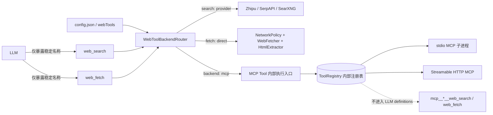
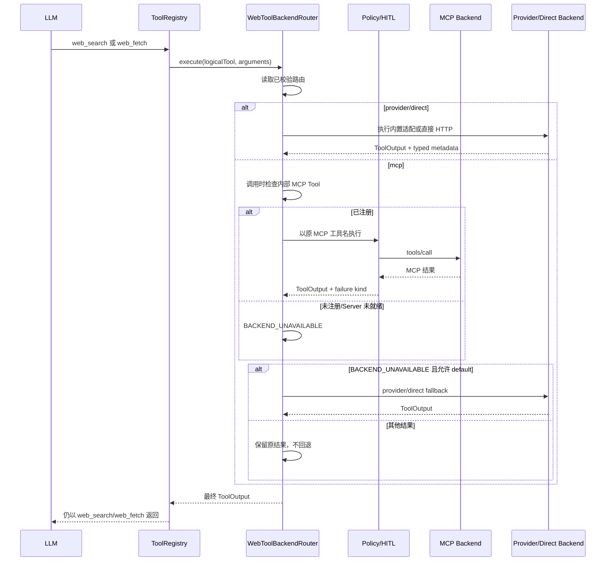

# 统一 Web Tool 暴露与后端路由

## 1. 背景、目标与非目标

### 1.1 背景

当前 `ToolRegistry` 同时向模型暴露固定入口 `web_search` / `web_fetch`，以及 MCP Server 动态注册的
`mcp__{server}__{tool}`。当 `step_search` MCP 暴露同名的 `web_search` / `web_fetch` 时，模型会看到两套语义重复的工具：

- `web_search` 与 `mcp__step_search__web_search`；
- `web_fetch` 与 `mcp__step_search__web_fetch`。

与此同时，固定入口内部已根据当前 LLM provider/model 判断是否优先调用 Step Search MCP，但该选择逻辑与工具暴露耦合，产生三个问题：

1. 模型需要在逻辑能力和具体后端之间做本不应由模型承担的选择；
2. 缺少统一配置入口，无法覆盖或清晰审计模型感知的默认选择；
3. MCP 调用失败或被拒绝后，当前文本启发式回退可能把请求改走另一条联网通道，弱化显式配置和用户决策。

这里所称的“内置 `web_search`”不是本地搜索引擎。它是 CodeAgent 内的统一适配入口，实际仍调用智谱 Web Search、
SerpAPI 或 SearXNG。SearXNG 可以在本机部署，但仍会访问上游搜索引擎。`web_fetch` 的默认实现则由 CodeAgent 直接发起
HTTP 请求并提取正文，不依赖搜索 Provider。

### 1.2 目标

1. 模型始终只看到两个稳定逻辑工具：`web_search` 和 `web_fetch`。
2. 搜索后端可显式配置为 SearchProvider 或指定 MCP Tool；抓取后端可显式配置为直接 HTTP 或指定 MCP Tool。
3. 底层 MCP 搜索/抓取工具保留在内部 Registry，可被统一入口、安全策略、诊断命令和审计链使用，但不进入 LLM Tool definitions。
4. 未配置新路由时保持兼容：Step 3.7 Flash 自动使用 StepSearch MCP，其他模型使用现有 SearchProvider/direct 实现。
5. 把模型感知选择收敛到 Router；显式配置优先于自动选择，且底层选择不改变模型看到的工具集合。
6. 回退只发生在明确配置允许且属于基础设施不可用的场景；策略拒绝、HITL 拒绝、取消和业务错误不得触发回退。
7. 不改变 stdio/Streamable HTTP MCP 的生命周期、安全策略、URL 授权和审计边界。

### 1.3 非目标

- 不在本期实现本地互联网索引、爬虫或离线搜索引擎。
- 不把所有内置工具推广为通用 Tool Alias 系统。
- 不从 MCP 返回的普通文本中正则提取 URL 并授予访问权限。
- 不改变 Chrome DevTools MCP 的页面自动化、登录态复用或浏览器安全策略。
- 不让 Runtime API/headless 任务自动启动 MCP；该差异在本期只记录，不扩大改造范围。
- 不修改 MCP 协议、stdio/HTTP transport 或 Server 配置格式。

## 2. 现状分析（源码证据、已知约束）

### 2.1 架构位置

`ToolRegistry` 构造阶段固定注册 `web_search` 和 `web_fetch`：

- `ToolRegistry.java:690-711`：固定工具名、参数 Schema 和执行入口；
- `ToolRegistry.java:929-963`：`web_search` 先尝试 Step MCP，再回落到 `SearchProvider`；
- `ToolRegistry.java:1017-1054`：`web_fetch` 先尝试 Step MCP，再回落到直接 HTTP；
- `ToolRegistry.java:1058-1060`：Step MCP 是否优先由当前 provider/model 决定；
- `ToolRegistry.java:1135-1139`：当前 `getToolDefinitions()` 无差别返回所有已注册工具；
- `ToolRegistry.java:1149-1167`：MCP Tool 同时进入 `mcpTools` 和通用 `tools` 表；
- `ToolRegistry.java:1220-1263`：MCP Tool 通过注册时的 invoker 执行，并进入浏览器保护和审计。

SearchProvider 当前包含三种实现：

| Provider | 实现 | 外部依赖 |
|---|---|---|
| `zhipu` | `ZhipuSearchProvider` | `GLM_API_KEY` + 智谱 Web Search API |
| `serpapi` | `SerpApiSearchProvider` | `SERPAPI_KEY` + SerpAPI |
| `searxng` | `SearxngSearchProvider` | 可访问的 `SEARXNG_URL`；实例继续访问上游搜索引擎 |

`SearchProviderFactory.java:17-54` 的现有选择顺序是：显式 `SEARCH_PROVIDER` > `GLM_API_KEY` >
`SERPAPI_KEY` > `SEARXNG_URL` > 未就绪的智谱占位 Provider。`ToolRegistry` 的工具描述仍声称 SerpAPI 是默认值，
与实际 Factory 行为不一致，实现时必须同步修正。

MCP 工具在 Server 初始化后动态加入：

- `McpServerManager.java:401-439`：创建 transport、执行 initialize、读取 `tools/list` 和 resources；
- `McpServerManager.java:442-446`：把 Server 工具替换注册到 `ToolRegistry`；
- `McpToolDescriptor.java:12-14`：名称统一为 `mcp__{server}__{tool}`；
- `McpConfigLoader.java:71-83`：检测到 `STEP_API_KEY` 时自动增加 `step_search` HTTP MCP Server。

### 2.2 MCP 启动与生命周期

交互式 CLI 启动时会读取 MCP 配置并启动全部未禁用 Server：

1. `Main.java:308-314` 调用 `loadConfiguredServers()` 和 `startAll(ui, mcpStartupWait())`；
2. `McpServerManager.java:79-119` 最多并行启动 8 个 Server；
3. CLI 默认只等待约 8 秒，超时后先进入交互界面，未完成的 daemon 启动任务继续运行；
4. stdio transport 在 `StdioTransport.java:32-49` 中通过 `ProcessBuilder.start()` 创建子进程；
5. CodeAgent 退出时 shutdown hook 关闭 Manager；stdio transport 先关闭 stdin 并等待优雅退出，随后 `destroy()`，最后
   `destroyForcibly()`。

因此，**配置为 stdio 的 MCP Server 会随交互式 CodeAgent CLI 启动而启动**，但其工具可能在 CLI 首个 prompt 出现后才注册完成。
路由不能只在启动时解析一次“工具是否存在”，必须在每次调用时检查内部 Registry 的最新状态。

`Main.java:1235-1245` 的 `runHeadlessTask()` 只创建 `ToolRegistry` 和 `Agent`，没有创建 `McpServerManager`。因此当前后台/headless
路径不会启动 MCP，也不会获得 MCP Tool；显式选择 MCP 后端时应按不可用策略失败或回退。

### 2.3 数据/状态模型

当前 `CodeAgentConfig` 只持有默认 LLM Provider、Provider 配置和 Embedding 配置。Web 搜索 Provider 主要由环境变量、系统属性和
`.env` 选择；MCP Server 连接配置则位于用户级 `~/.codeagent/mcp.json` 和项目级 `.codeagent/mcp.json`。

本方案把职责划分为：

- `mcp.json`：Server 地址、命令、参数、环境、Header、启停等连接与生命周期配置；
- `config.json`：CodeAgent 逻辑能力选择，包括 `web_search` / `web_fetch` 使用哪个实现；
- `.env` / 环境变量：保留现有 Provider 密钥和兼容性选择入口。

### 2.4 核心时序与失败路径

当前 Step MCP 返回内容按非结构化文本处理。`ToolRegistry.java:939-943` 明确不从该文本生成 `discoveredUrls`。这符合 URL 授权规则：
只有顶层用户原文或成功 `web_search` 的结构化 URL 元数据才能产生后续 `web_fetch` / 浏览器导航授权。

当前 `isUsableMcpOutput()` 依赖文本前缀判断 MCP 结果是否可用。任何不可用结果都会继续执行内置后端，无法可靠区分：

- MCP Server/transport 不可用；
- 策略拒绝；
- HITL 拒绝或跳过；
- 用户取消；
- MCP 业务错误；
- 成功但正文为空。

新的路由实现必须使用类型化失败原因，禁止依赖展示文本判断是否回退。

## 3. 方案设计

### 3.1 总体架构



`WebToolBackendRouter` 是逻辑工具与具体实现之间的唯一选择点。它不负责 MCP 生命周期、不自行发送 JSON-RPC，也不绕开
`ToolRegistry.executeToolOutput()`。`TurnToolPolicy` 只授权模型实际调用的稳定门面，并在路由前完成 no-web、URL provenance 和
resource scope 校验；内部 MCP 名称不是第二个模型调用，不重复进入 `TurnToolPolicy`，但仍通过动态分派进入
`HitlToolRegistry → ToolRegistry → BrowserGuard/AuditLog`。Router 只能原样映射已经授权的 query/URL 参数，不能扩权。

### 3.2 配置接口与数据结构

在 `CodeAgentConfig` 增加 `WebToolsConfig` 和 `WebToolRouteConfig`。建议 JSON：

```json
{
  "webTools": {
    "search": {
      "backend": "provider",
      "provider": "zhipu"
    },
    "fetch": {
      "backend": "direct"
    }
  }
}
```

MCP 后端示例：

```json
{
  "webTools": {
    "search": {
      "backend": "mcp",
      "tool": "mcp__step_search__web_search",
      "onUnavailable": "default"
    },
    "fetch": {
      "backend": "mcp",
      "tool": "mcp__step_search__web_fetch",
      "onUnavailable": "default"
    }
  }
}
```

语义约束：

| 逻辑工具 | `backend` | 必填字段 | 实现 |
|---|---|---|---|
| `web_search` | `auto` | 无 | Step 3.7 Flash 使用 StepSearch MCP，其他模型使用 Provider |
| `web_search` | `provider` | 可选 `provider` | `SearchProviderFactory` 或显式 zhipu/serpapi/searxng |
| `web_search` | `mcp` | `tool` | 指定的内部 MCP Tool |
| `web_fetch` | `auto` | 无 | Step 3.7 Flash 使用 StepSearch MCP，其他模型使用 direct |
| `web_fetch` | `direct` | 无 | `NetworkPolicy + WebFetcher + HtmlExtractor` |
| `web_fetch` | `mcp` | `tool` | 指定的内部 MCP Tool |

`onUnavailable` 取值：

- `fail`：返回明确的 `BACKEND_UNAVAILABLE`，不切换通道；
- `default`：搜索回退到 Provider 路径，抓取回退到 direct 路径。

默认值与兼容性：

1. 缺少 `webTools` 时，search/fetch 默认 `auto`，保留当前 LLM 模型感知行为；
2. auto 在 provider=`step` 且 model 以 `step-3.7-flash` 开头时路由到 StepSearch MCP，否则分别使用 Provider/direct；
3. search 未指定 `provider` 时继续使用现有 `SEARCH_PROVIDER` 和密钥自动选择顺序；
4. 显式 `backend=mcp` 而未写 `onUnavailable` 时默认 `fail`；
5. `tool` 必须以 `mcp__` 开头，必须不是 `web_search` / `web_fetch` 本身；
6. 配置格式错误不阻止 CodeAgent 启动，但对应逻辑工具返回 `INVALID_CONFIGURATION`，不得悄悄采用其他后端；
7. API Key 继续只放在 Provider 配置、环境变量或 MCP Header 中，不进入路由对象和日志。

### 3.3 工具暴露与内部执行

`ToolRegistry` 保留完整内部工具表，并增加模型可见性判断。`getToolDefinitions()` 应排除：

1. MCP descriptor 原始名称为 `web_search` 或 `web_fetch` 的工具；
2. 当前 `webTools` 路由显式引用的 MCP 工具，即使原始名称不同。

固定的 `web_search` / `web_fetch` 永远可见。隐藏仅影响发送给 LLM 的 Tool definitions，不影响：

- MCP 工具注册和热更新；
- `/mcp` 状态、日志、resources 和 prompts；
- 统一入口的内部执行；
- HITL、审计和策略识别；
- MCP Server 的 `notifications/tools/list_changed` 处理。

不应在 `McpServerManager` 中丢弃这些工具，否则统一入口无法调用，诊断信息也会失真。

### 3.4 执行时序



### 3.5 类型化失败与回退

为 `ToolOutput` 增加向后兼容的失败分类字段，旧构造方法默认映射为 `NONE` 或 `EXECUTION_ERROR`：

```java
enum ToolFailureKind {
    NONE,
    INVALID_CONFIGURATION,
    BACKEND_UNAVAILABLE,
    TOOL_NOT_FOUND,
    POLICY_DENIED,
    HITL_REJECTED,
    CANCELLED,
    EXECUTION_ERROR
}
```

只有 `BACKEND_UNAVAILABLE` 可以根据 `onUnavailable=default` 回退。以下情况必须原样终止：

- `POLICY_DENIED`：策略拒绝先于人工审批，不能换后端绕过；
- `HITL_REJECTED`：用户已明确拒绝或跳过；
- `CANCELLED`：取消立即结束当前调用；
- `INVALID_CONFIGURATION`：要求用户修复配置；
- `EXECUTION_ERROR`：后端已经接收并执行，自动换通道可能重复产生费用或副作用。

配置的 MCP 工具不存在时，Registry 先返回 `TOOL_NOT_FOUND`，Router 再把该绑定后端的结果收敛为
`BACKEND_UNAVAILABLE`；这样可覆盖工具检查与热注销之间的竞态。MCP transport 的连接、HTTP、stdio 和请求超时故障也归为
`BACKEND_UNAVAILABLE`，JSON-RPC 业务错误仍为 `EXECUTION_ERROR`。

### 3.6 URL 授权与结构化结果

Provider 路径继续把 `SearchResult.url()` 的合法 HTTP(S) URL 写入 `ToolOutput.discoveredUrls`。MCP 路径遵循以下规则：

1. MCP 仅返回文本时，文本中的 URL 只供阅读，不产生授权；
2. 通用 MCP 路由无条件丢弃 `discoveredUrls`；未来如增加专用可信 adapter，必须另行校验来源与 HTTP(S) URL 后才能传播；
3. 不得通过正则、Markdown 链接解析或 LLM reasoning 推断 URL；
4. `web_fetch` 和浏览器导航继续由 `TurnToolPolicy` 校验顶层用户 URL 与结构化 discovered URLs。

当前 Step Search MCP 被视为非结构化文本，因此其结果不会自动授权后续抓取。这是安全约束，不应为了体验便利放宽。

### 3.7 stdio MCP 启动、并发与恢复

- 交互式 CLI 继续在启动阶段并行拉起所有未禁用 stdio MCP 子进程；本方案不增加第二套启动器。
- 启动等待超时后 MCP 仍可能变为 READY，路由在调用时查询 Registry，因此无需重启 CodeAgent。
- MCP Server `tools/list_changed` 后重新注册工具，暴露过滤按 descriptor 和路由重新计算。
- `/mcp restart|enable|disable` 后统一入口自动观察最新注册状态。
- CodeAgent 关闭时沿用现有 Manager shutdown hook 和 stdio 子进程清理流程。
- headless 路径没有 MCP Manager：`backend=mcp` 返回 `BACKEND_UNAVAILABLE`，只有显式允许才回退。
- Plan 恢复不持久化 MCP 进程或工具列表；恢复后的调用以当前运行时 Registry 为准。

### 3.8 兼容性、迁移与回滚

兼容策略：

1. 旧配置不含 `webTools` 时，默认 auto 保留 Step 3.7 Flash 自动优先 MCP、其他模型 Provider/direct 的行为；
2. 显式 `provider`、`direct` 或 `mcp` 路由覆盖模型感知选择；
3. `STEP_API_KEY` 仍可自动配置并启动 `step_search` Server，并供默认 auto 路由使用；
4. `SEARCH_PROVIDER`、`GLM_API_KEY`、`SERPAPI_KEY`、`SEARXNG_URL` 继续生效；
5. MCP 原始工具仍可在 `/mcp` 诊断中看到，但不会发送给模型；
6. Tool definitions 改变会改变 request snapshot/envelope，应同步验证 token 估算与 prompt cache fingerprint。

回滚时可以删除 `webTools` 配置并恢复旧代码。由于没有迁移持久化数据、修改 MCP 配置格式或改写 session ledger，回滚不需要数据迁移。

## 4. 实现任务与测试矩阵

### 4.1 预计影响文件

| 文件 | 变更 |
|---|---|
| `config/CodeAgentConfig.java` | 增加 Web route 配置模型、默认值和校验 |
| `tool/ToolRegistry.java` | 接入 router、删除 model 特判、过滤 LLM definitions |
| `tool/ToolOutput.java` | 增加向后兼容的类型化失败分类 |
| `web/WebToolBackendRouter.java` | 新增统一后端选择与受控回退 |
| `mcp/McpServerManager.java` | 原则上不改注册；如需暴露 descriptor 查询，只增加只读接口 |
| `cli/Main.java` | 把 `CodeAgentConfig.webTools` 注入共享 ToolRegistry |
| `.env.example` | 修正 SearchProvider 说明，记录新配置与兼容关系 |
| `README.md` | 更新 Web/MCP 暴露、stdio 启动和配置示例 |
| `AGENTS.md` | 更新运行时约束：模型只见统一 Web 工具 |
| `docs/agents-reference.md` | 更新工具数量、路由、失败与启动细节 |

### 4.2 测试先行任务

1. `CodeAgentConfigTest`
   - 缺少 `webTools` 时 search/fetch=auto；
   - MCP route 缺少 tool、递归指向逻辑工具、非法 `onUnavailable` 时校验失败；
   - 显式 Provider 和 MCP 配置可稳定序列化/反序列化；
   - 配置与日志不泄露 API Key/Header。
2. `ToolRegistryTest`
   - 模型 definitions 始终包含 `web_search` / `web_fetch`；
   - 动态注册任意 Server 的原始 `web_search` / `web_fetch` 后不进入 definitions；
   - 隐藏工具仍可由内部完整名称执行；
   - 非 Web MCP Tool 继续暴露；
   - auto 随当前模型选择，显式 route 不随 `/model` 切换改变。
3. `WebToolBackendRouterTest`
   - provider/direct/MCP 三条成功路径；
   - MCP 未注册 + fail；
   - MCP 未注册 + default；
   - HITL 拒绝、策略拒绝、取消、执行错误均不回退；
   - MCP 晚注册后无需重建 router 即可调用；
   - 非结构化 MCP 文本不生成 `discoveredUrls`。
4. `McpToolRegistrationTest`
   - tools/list_changed 替换后可见性规则保持；
   -隐藏不等于反注册；
   - resource 虚拟工具和其他 MCP 工具不受影响。
5. `Main` 接线测试
   - 交互式共享 Registry 获得 Web route 配置；
   - headless 未启动 MCP 时遵守 fail/default；
   - `/model` 切换不改变显式 Web route。
6. 安全回归
   - MCP 搜索普通文本 URL 不获得授权；
   - Provider 结构化 URL 继续获得授权；
   - MCP 后端仍触发 HITL 和 AuditLog；
   - 策略拒绝不能通过 fallback 绕过。

### 4.3 验证命令

```text
mvn test -DskipTests=false -Dtest=CodeAgentConfigTest,ToolRegistryTest,McpToolRegistrationTest,TurnToolPolicyTest
mvn test -DskipTests=false -Dtest=McpServerManagerTest,StdioTransportTest,StreamableHttpTransportTest
mvn test -Pquick
mvn test -DskipTests=false
mvn clean package -DskipTests
git diff --check
```

`-Pquick` 当前会排除部分 MCP、ToolRegistry 和 Web 慢测试，因此不能替代显式的针对性测试与必要的全量测试。

## 5. 验收清单

- [ ] 任意 LLM 请求中只出现 `web_search` 和 `web_fetch` 两个 Web 逻辑工具。
- [ ] `mcp__*__web_search`、`mcp__*__web_fetch` 和显式绑定的 MCP 后端不会进入 LLM Tool definitions。
- [ ] 隐藏的 MCP 后端仍可由统一入口调用，并可被 `/mcp` 诊断观察。
- [ ] `web_search` 可显式选择 Provider 或 MCP；`web_fetch` 可显式选择 direct 或 MCP。
- [ ] 缺少新配置时保持 Step 3.7 Flash → StepSearch、其他模型 → SearchProvider/direct 的兼容行为。
- [ ] 当前 LLM provider/model 仅影响 auto；显式 route 不随模型切换改变。
- [ ] stdio MCP 随交互式 CLI 启动，超时后可后台就绪，统一入口无需重启即可使用。
- [ ] headless 未启动 MCP 的限制有明确错误和受控回退。
- [ ] 只有 `BACKEND_UNAVAILABLE` 且显式允许时才发生回退。
- [ ] 策略拒绝、HITL 拒绝、取消和执行错误不会切换联网通道。
- [ ] 非结构化 MCP 文本中的 URL 不会获得后续抓取或导航授权。
- [ ] README、AGENTS、`.env.example`、agents-reference 与实际行为一致。
- [ ] 针对性测试、quick、全量测试、构建和 `git diff --check` 全部通过。
