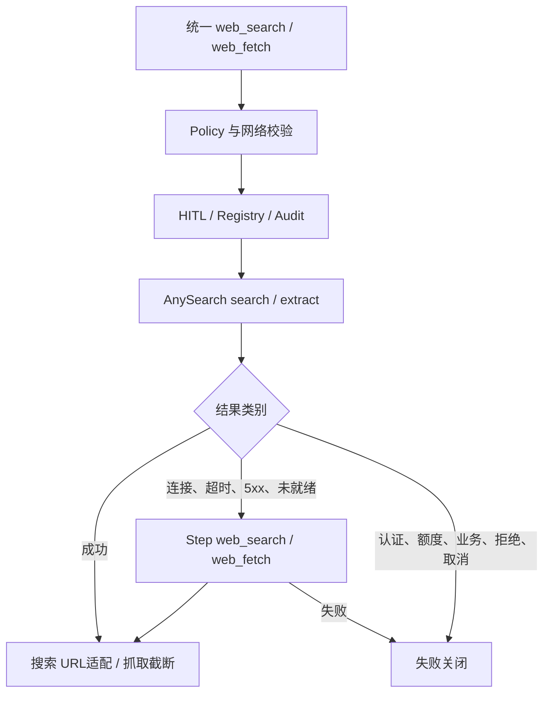

# AnySearch 主用、Step 降级的搜索与抓取 MCP 重构

> 用户已确认：默认 AnySearch，仅基础设施不可用时降级 Step。本文件合并设计、实施计划、测试与验收；历史单搜索阶段证据在末尾，不能当成本次验证。

## 1. 背景、目标与非目标

模型只看到 web_search(query, top_k) 与 web_fetch(url, max_chars)。两者分别默认调用 AnySearch MCP search/extract，连接失败、超时、HTTP 5xx 或未就绪时各自最多降级一次到 Step MCP web_search/web_fetch。认证、额度、业务错误、策略拒绝、HITL拒绝和取消禁止降级。没有模型选择，也不保留 direct HTTP 或 SearchProvider 搜索路径。

不增加 CLI 命令、全局后端切换状态、熔断缓存或后台线程；不改变 Runtime/headless 的 MCP 生命周期，不重新引入已删除 Provider。开发验证阶段保留未提交改动；随后用户明确授权分批本地提交，保留当前分支，不推送或合并。

## 2. 现状分析（源码证据、已知约束）

### 2.1 架构位置

ToolRegistry 的稳定门面统一经过 Policy/HITL/Audit。WebToolBackendRouter 原先固定 AnySearch 搜索但 fetch 仍按模型选择 Step/direct；本次统一为两个 MCP 路由。McpConfigLoader 已内置 AnySearch，配置 STEP_API_KEY 时内置 Step，用户/项目同名配置优先。HitlToolRegistry 已检查主用与降级全部候选审批。McpServerManager 注册工具并负责调用错误分类；启动错误需单独传递类别，不能因工具未注册而把认证错误误判成可降级。

### 2.2 数据/状态模型

2026-10-05 真实 tools/list 验证：AnySearch search 参数 query/max_results，extract 参数只有 url，抓取成功同时返回 JSON 文本和 structuredContent={url,title,content}。Step web_search 参数 query/n（1–20），web_fetch 只有 url。Step真实抓取成功，structuredContent={code:0,page:{url,title,markdown,...}}；搜索HTTP400返回无有效Step Plan订阅，不能从schema发现写成完整搜索链路已通过。

[官方 AnySearch MCP 文档](https://github.com/anysearch-ai/anysearch-mcp-server)说明抽取正文为 Markdown。搜索返回 Markdown摘要，现有 AnySearchResultParser 完整格式校验保持。Step 搜索只接受实际 MCP structuredContent 的明确结果字段产生 URL 元数据，普通正文不授信；实测格式未核对前不扩展 Markdown例外。

### 2.3 核心时序与失败路径



HTTP 4xx 均不可降级，5xx可降级；JSON-RPC错误及isError均不可降级；取消优先，不能重新请求。启动、禁用、重启和READY转换同步当前server失败状态，禁止残留认证错误。无MCP入口明确不可用。

## 3. 方案设计

### 3.1 接口与数据结构

Router保留配置对象；auto默认与模型无关，主用固定AnySearch并允许Step回退。显式mcp允许对应AnySearch或Step工具；显式onUnavailable=fail可关闭回退，step允许AnySearch→Step，旧default映射Step兼容；Step工具不再回退。direct/provider/其他服务器工具配置明确迁移失败，不悄悄改配置。

ToolRegistry每次调用局部选择实际后端，传原始规范参数，再按该后端schema映射；搜索top_k限制1–10，AnySearch max_results，Step n。返回标记实际服务。抓取保留NetworkPolicy校验，在成功后解析AnySearch content、统一本地max_chars截断；抓取输出不产生URL授权。显示原始请求URL与服务返回URL，避免审批改参后将新正文错标为旧来源。远端MCP处理页面重定向/DNS，本地不能约束；max_chars只限制模型正文，不限制网络响应。Step搜索仅实际MCP structuredContent.results[].url经HTTP/HTTPS合法URL检查转为discoveredUrls，保持失败不授信、忽略原始MCP任意URL元数据。

增加类型化MCP HTTP异常和失败分类器，检查异常cause链，不从错误文本猜状态。Registry记录server启动失败类别供缺失工具路由判断。McpCallToolResult支持structuredContent但不自动授信；仅固定服务/工具消费已知字段，其他MCP行为不变。

### 3.2 策略、安全、并发与恢复

可触发审批的AnySearch和Step候选均纳入独占批次判断。真正执行后端仍经同一HITL入口及审计，拒绝不得切换。审批修改参数只用于实际批准的后端；若主用不可用且审批改参，禁止拿旧门面参数自动降级，以免退回未批准参数。每调用无共享路由状态，搜索和抓取可分别降级；Plan分支URL隔离和声明后继继承保持。

AnySearch Markdown严格包络解析例外沿用用户已批准契约，仍有完整伪造包络不能证明来源的风险。Step structuredContent只消费固定结果字段，不扫描摘要或抓取链接。错误文本脱敏，两家初始化及调用错误不泄露远端正文或密钥；不自动注册账户或更换认证。

### 3.3 兼容性、迁移与回滚

默认无需配置webTools。可选ANYSEARCH_API_KEY；降级需要STEP_API_KEY及Step服务就绪，缺少时返回不可用。显式disabled同名server覆盖内置配置，不自动启用。删除活跃direct抓取门面但保留独立WebFetcher类及其既有测试，避免扩大范围。

```json
{"webTools":{"search":{"backend":"auto","onUnavailable":"step"},"fetch":{"backend":"auto","onUnavailable":"step"}}}
```

显式Step工具可用于诊断/回滚主服务；不会按当前LLM重新路由。回滚代码及配置，不保留第三种HTTP路径。

## 4. 实现任务与测试矩阵

|边界|修改|测试与验收|
|---|---|---|
|路由和配置|WebToolBackendRouter、CodeAgentConfig|两模型相同默认、显式fail/Step、非法direct/provider、仅不可用回退|
|门面与结果|ToolRegistry、McpClient、McpCallToolResult、Step解析器|AnySearch优先、Step一次、n映射、JSON链接与摘要隔离、extract正文截断、无新抓取授权|
|错误与生命周期|HTTP transport、Manager、Registry启动状态|401/402/403/429不回退、503回退、RPC/isError不回退、启动认证失败与重启清理|
|审批并发|HitlToolRegistry|主用已自动批准但Step仍需审批时独占、拒绝无回退、参数修改安全|
|联动交付|AGENTS、README、reference、env、prompt、本文件|针对性+quick+必要全量、diff检查、公开协议实测与限制记录|

每个边界先补测试并观察失败，再实现。唯一文档不另建计划。命令：下方针对性测试命令、`mvn test -Pquick -DskipTests=false`、`mvn test -DskipTests=false`、`mvn package -DskipTests`、`git diff --check`。

## 5. 验收清单

- [x] 目标、非目标、默认链路及降级范围经用户确认。
- [x] 两个门面的两套MCP路径实现与针对性测试通过（Step真实搜索验收受订阅限制）。
- [x] 错误分类、启动失败、取消、审批、URL授权边界验证。
- [x] 配置、文档和提示词一致。
- [x] 回归、构建和diff结果真实记录；后续按用户明确授权分批本地提交。

### 本次实施记录

配置补充：项目私有 `.env` 原先没有 AnySearch 项，已追加空的 `ANYSEARCH_API_KEY=`，保留原有配置。`.env.example` 已有示例；McpConfigLoader 原有读取逻辑无需修改。检查仅一个配置项、空值及 `.env` 被 Git 忽略，未将测试密钥持久化。

1. 路由/HTTP分类首轮红测17项中4失败；门面集成红测59项中3失败；结构化授权与审批改参网络边界红测2项均失败；审查改参/业务码溢出/失败会话关闭红测3项均失败；抓取来源红测1项失败。随后对应修复已通过。
2. 最终针对性命令如下，共169项，0失败、0错误、0跳过。覆盖两个门面的降级、拒绝/取消、结构化URL、结果截断、审批隔离/改参、初始化错误与资源释放。

```powershell
mvn test -DskipTests=false "-Dtest=WebToolBackendRouterTest,CodeAgentWebToolsConfigTest,McpConfigLoaderTest,AnySearchResultParserTest,StepSearchResultParserTest,ToolOutputTest,ToolRegistryTest,TurnToolPolicyTest,HitlToolRegistryTest,MainConfigBootstrapTest,McpClientTest,McpServerManagerTest,StreamableHttpTransportTest,JsonRpcClientTest"
```

3. `mvn test -Pquick -DskipTests=false`：1301项，1失败、0错误、4跳过。唯一失败既有NetworkPolicyTest.allowsPublicHttps，本机example.com DNS解析失败；没有放宽生产策略或改既有测试隐藏失败。
4. Python公开协议探测确认AnySearch extract结构化正文成功、Step web_fetch实际成功且含page.markdown；Step search HTTP400脱敏原因是没有有效Step Plan订阅。Step真实搜索与results结构尚不能验证，仅实现严格结构化适配并用本地夹具覆盖，形状不符停止授权。
5. 当前Java17项目McpClient+ToolRegistry实测：AnySearch search成功，discovered_urls=2；example.com两套抓取门面均被本机DNS策略拒绝；固定公网IP https://1.1.1.1/cdn-cgi/trace 的AnySearch抓取门面成功（0新授权），Step同链接EXECUTION_ERROR。没有将原始Step抓取成功等同于完整门面链路验收，也不把服务单次成功推为长期稳定。
6. 独立只读审查发现改参后缺失工具降级丢参、业务code整数截断、抓取来源错标；均有红测和修复，最终复核无阻塞问题。ToolOutput结构化数据防御拷贝保持，抓取实际参数复核网络策略。
7. `mvn test -DskipTests=false`：1372项，1失败、0错误、10跳过。唯一失败同样为NetworkPolicyTest.allowsPublicHttps的example.com DNS解析，不宣称全绿。
8. `mvn package -DskipTests`：BUILD SUCCESS。`git diff --check`通过；临时Java公开验证源码已删除，测试日志留在忽略的target中；没有提交密钥、raw session或构建产物。验证完成时refactor/anysearch-mcp-search保留未提交；后续用户授权的提交记录见下节。
9. 交付仍有外部验收限制：当前Step密钥无有效搜索订阅，不能实测搜索结果及授权链；需有效订阅后验证实际structuredContent形状，若不是results[]则保持不授信并按真实契约更新适配，不允许从正文猜链接。Runtime/headless无MCP仍不可用；远端抓取重定向/DNS由服务负责。下列为上一阶段历史证据。

### 分批提交记录

用户明确要求分批提交，本次只创建当前功能分支的本地提交，不推送、创建PR或合并：

1. `77e9b8a`：MCP结构化结果、防御性拷贝和类型化传输失败基础设施。
2. `22eccca`：AnySearch默认搜索/抓取、Step一次降级、错误生命周期、审批及URL授权、旧Provider删除与对应测试。
3. 文档与配置示例同步：README、AGENTS、agents-reference、.env.example及本文件。

提交前逐批检查暂存范围与 `git diff --cached --check`。`.env`被Git忽略，候选文件密钥扫描没有实际AnySearch密钥；未跟踪临时验证文件。代码自上述169项针对性验证及回归构建后未改动；DNS失败和Step订阅限制保持原记录，不将提交描述成全量测试通过。

### 实施记录与验证证据

1. 路由红测5项中3项预期失败；解析器缺失红测确认；初始化错误泄露的专属红测1项失败，修复后通过。
2. 最终针对性命令增加 McpServerManagerTest：共142项，0失败、0错误、0跳过。包含实际稳定门面 → Policy.observeResult → fetch授权链测试及摘要链接拒绝。测试使用公开IP字面量隔离环境DNS，未放宽生产网络策略。
3. `mvn test -Pquick -DskipTests=false`：1292项，1失败、0错误、4跳过。`mvn test -DskipTests=false`：1351项，1失败、0错误、10跳过。两次唯一失败均为既有 NetworkPolicyTest.allowsPublicHttps 无法解析 example.com；独立DNS检查也失败。上述回归在最终初始化脱敏补丁前执行，该补丁由最终针对性测试覆盖；不宣称回归全绿。
4. `mvn clean package -DskipTests`：clean不能删除target/classes，失败；改用 `mvn package -DskipTests`，BUILD SUCCESS。产物jar检查包含AnySearchResultParser且无旧SearchProvider/SearchResult类。
5. 用Java17及构建产物调用项目McpClient、StreamableHttpTransport、ToolRegistry，匿名发送固定公开查询Java 17 official documentation，输出 `tools=4, search_success=true, discovered_urls=2`，退出0。临时验证源码已删除；没有发送项目文件或密钥。仅验证一次英文通用搜索，不代表中文搜索质量、长期稳定性或所有入口覆盖。
6. 独立只读审查发现AnySearch初始化/工具列表更新错误可能展示凭据。新增safeServerError及回归测试，审查复核通过；最终142项测试通过。
7. 文档、AGENTS、提示词、配置示例同步，旧Provider删除。当前refactor/anysearch-mcp-search未提交；没有新增其他计划文档。

### 剩余限制

- Runtime/headless未启动MCP时不能搜索；本期不改变生命周期。
- Markdown没有不可伪造字段边界，依赖AnySearch结果格式契约；异常格式不授信，完整格式伪造的剩余风险不能宣称完全消除。
- 匿名访问受服务限额约束；认证失败不退回匿名，也不自动注册账户。
- 全量/quick的DNS失败和clean目录删除失败未通过修改无关代码掩盖。
