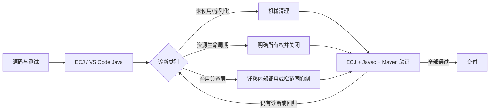

# Java 诊断警告清理

## 1. 背景、目标与非目标

### 1.1 背景

VS Code 的 Red Hat Java 扩展使用 Eclipse 编译器（ECJ）分析当前工程，现可稳定复现 167 条 warning 和 6 条 info。它们主要由资源未关闭、弃用兼容 API、未使用声明和缺少 `serialVersionUID` 构成；Maven/Javac 默认输出较少，因此此前只看 Maven 构建会漏掉这些编辑器诊断。

### 1.2 目标

- 以与 VS Code 相同的 ECJ 编译器建立可重复基线，并把 warning/info 清零。
- 修复生产代码中的真实资源生命周期问题。
- 清理无效 import、局部变量、私有成员和不必要的抑制声明。
- 对刻意保留的兼容 API 使用最小范围、带理由的弃用抑制，不删除兼容入口。
- 保持 Java 17、CLI/TUI、RAG、Memory、MCP 和 Renderer 的现有行为不变。

### 1.3 非目标

- 不重构模块架构，不新增功能或命令。
- 不删除 `EmbeddingClient`、旧 RAG 构造器等已记录的兼容 API。
- 不通过全局关闭 VS Code/ECJ 告警来隐藏问题。
- 不修改用户级 IDE 设置或依赖版本。

### 1.4 影响面与验收标准

影响面限于已有 Java 源码、测试资源生命周期和本方案文档。验收标准：ECJ 诊断为 0 warning/0 info，Javac `-Xlint:all` 为 0 warning，针对性测试和 `mvn test -Pquick` 通过，`git diff --check` 通过。

## 2. 现状分析（源码证据、已知约束）

### 2.1 架构位置

诊断跨越入口、Agent、RAG/Memory、MCP、Renderer 和测试代码，但不改变这些模块的依赖关系。`docs/dev/25-simplify-code-rag-retrieval.md` 明确要求保留旧 RAG 构造器作为兼容 overload；因此弃用诊断不能靠删除公共兼容面解决。

### 2.2 数据/状态模型

当前 ECJ 基线共 173 条诊断：167 条 warning、6 条 info。其中包括 80 条资源生命周期、26 条弃用、25 条未使用 import、17 条 `serialVersionUID`、10 条未使用字段/局部变量、8 条未使用方法/构造器和 1 条不必要抑制。资源对象主要实现 `AutoCloseable`，应由创建方或测试夹具在确定的生命周期边界关闭。

### 2.3 核心时序与失败路径

主要失败路径是误删反射/兼容入口、提前关闭由异步任务持有的资源、测试夹具关闭顺序错误，以及用宽泛 `@SuppressWarnings` 掩盖真实泄漏。实施时先用引用搜索确认可删除项，再按“最内层资源先关闭”的逆序释放；兼容测试只抑制 `deprecation`，资源告警不以弃用抑制替代。

## 3. 方案设计

### 3.1 接口与数据结构

不新增业务接口或持久化数据结构。异常类补充固定 `serialVersionUID = 1L`；测试优先使用 try-with-resources 或 `@AfterEach` 维护的资源集合。Jackson 的旧式 mapper 配置迁移到 builder API，但保持序列化配置值不变。

### 3.2 策略、安全、并发与恢复

- 删除成员前用全仓引用搜索验证，仅直接删除无引用的 private/package-private 实现细节。
- 生产资源在现有请求/会话边界关闭；不改变并发池、异步回调和共享 provider 的所有权。
- 生产资源在每个生命周期边界真实关闭；仅对无外部句柄、且需要在 open-state 下断言的测试夹具使用测试类级 `resource` 抑制，并写明原因。
- 弃用兼容测试使用方法级或类级最小抑制，并保留兼容行为断言。
- 每批变更后运行对应测试和 ECJ 计数；出现回归时可按批次从未提交 diff 中回滚。

### 3.3 兼容性、迁移与回滚

公共兼容 API 不删除，CLI 命令、配置、数据库 schema 和外部协议不变。改动保持为未提交状态；若某类修复改变生命周期语义，可单独撤销该文件而不影响其他批次。

## 4. 实现任务与测试矩阵

1. [x] 固化 ECJ/Javac 失败基线，确认与 VS Code Problems 一致。
2. [x] 清理未使用 import、局部变量、私有成员、不必要抑制，并补齐异常序列 UID。
3. [x] 修复生产代码资源关闭，运行 WeChat/Renderer/MCP 相关测试。
4. [x] 对无外部句柄的 open-state 测试夹具增加带理由的测试类级 `resource` 抑制。
5. [x] 迁移非兼容路径的弃用调用，对兼容测试使用窄范围抑制。
6. [x] 拆分 LLM retry 辅助异常、收窄 embedding `close()` 异常契约，消除 Javac 额外诊断。
7. [x] 运行 ECJ、Javac `-Xlint:all`、针对性测试、quick 回归和 diff 检查。

| 领域 | 验证 | 预期 |
|---|---|---|
| 静态诊断 | ECJ 全量 main+test | 0 warning，0 info |
| 编译诊断 | Javac 17 `-Xlint:all` | 0 warning |
| MCP/资源 | MCP JSON-RPC、Client、Transport 测试 | 通过且无资源告警 |
| Memory/RAG | Memory、CodeIndex/Retrieval、Embedding 测试 | 行为不变 |
| Renderer/WeChat | Plain、WeChat Renderer/Loop 测试 | 输出和关闭语义不变 |
| 全局回归 | `mvn test -Pquick` | 通过 |
| 交付检查 | `git diff --check` | 通过 |

## 5. 验收清单

- [x] ECJ 0 warning / 0 info。
- [x] Javac 17 `-Xlint:all` 0 warning。
- [x] 生产资源均有明确关闭边界。
- [x] 兼容 API 保留，弃用抑制范围最小且有依据。
- [x] 针对性测试通过：172 个测试，0 失败、0 错误。
- [x] `mvn test -Pquick` 通过：1140 个测试，0 失败、0 错误、4 个跳过。
- [x] `git diff --check` 通过，无构建产物进入 diff。

### 5.1 实施记录

- ECJ 基线：主代码与测试合计 167 warning、6 info；完成后两者均无输出、退出码 0。
- Javac `-Xlint:all` 基线：主代码 11 warning、测试 5 warning；完成后两者均无输出、退出码 0。
- `WechatMessageLoop` 的临时 `WechatRenderer` 改为 try-with-resources；Jackson mapper 改用 `JsonMapper.builder()`。
- `EmbeddingProvider.close()` 收窄为不抛受检异常，`CodeRetriever.close()` 收窄为 `SQLException`；原有兼容 API 仍保留。
- JLine `CmdDesc` 仅服务于未接线的 tail-tip helper，已连同对应死测试删除；现有斜杠命令提示与 palette 行为不变。
- 三个 LLM retry 包级异常拆为独立源文件，避免 Javac auxiliary-class 诊断，不改变可见性或构造契约。
- `mvn package -DskipTests` 构建成功；`mvn clean package -DskipTests` 因 Windows 进程占用 `target` 而在 clean 删除阶段失败，未进入编译阶段。
