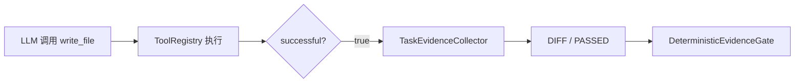
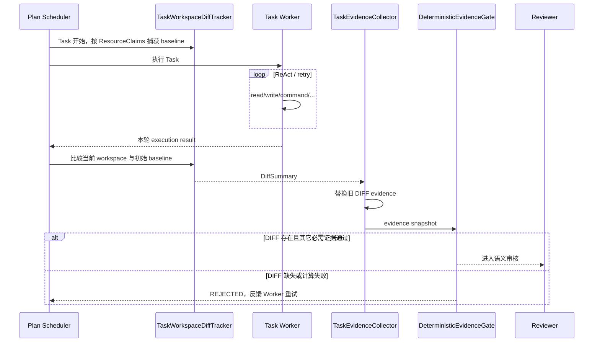

# Plan DIFF Evidence 真实工作区差异校验

> 状态：实现与审查问题修复完成；针对性、quick、全量测试、package 和 diff check 均已验证。
>
> 本文是本次“将 Plan 的 DIFF evidence 从 write_file 成功标记升级为真实 before/after 工作区差异”改造的独立设计、实施与审计文档。后续审查本次修改时，应以本文结合源码和提交记录为准。
>
> 基线：`main@5a0bedbbd695d1ed4cefe5c39cc724b898cc9ff5`
>
> 功能分支：`feat/plan-diff-evidence-jgit`

## 1. 背景、目标与非目标

### 1.1 背景

现有 Plan-and-Execute 已支持 `EvidenceType.DIFF`，但改造前的实际实现并没有进行真正的代码差异计算。

改造前 `TaskEvidenceCollector.observeTools(...)` 的语义是：

```text
观察到 write_file ToolExecutionResult
        ↓
successful = true
        ↓
直接生成 DIFF / PASSED
```

因此旧语义实际只能证明：

> 某次 `write_file` 调用被工具层报告为成功。

它不能证明：

- 文件最终内容相对 Task 开始前真的发生变化；
- 写入是否只是把同样的内容重新覆盖了一次；
- 后续重试是否把前一次改动撤销；
- `execute_command` 等非 `write_file` 工具是否间接修改了工作区；
- 最终工作区的真实差异范围和规模。

这会导致 `DIFF` 这个证据名称比实际语义更强，确定性门禁可能将“写调用成功”误当成“存在真实差异”。

### 1.2 目标

本次改造目标：

1. 将 `DIFF` evidence 的事实来源从“成功的 `write_file` 调用”改为“Task 初始基线与当前工作区的真实 before/after 差异”。
2. 复用项目已存在的 JGit 依赖，不自行实现文本 diff 算法。
3. 使用 JGit `HistogramDiff` 计算文本文件的行级新增/删除统计。
4. 为并行 Plan Task 限定 diff scope，避免一个 Task 把另一个并行 Task 的修改计入自己的证据。
5. 对 `workspaceWrite=true` 的独占 Task 允许扫描整个项目工作区，同时沿用 Side-Git 的 exclude 规则。
6. DIFF evidence 只保存有界摘要、相关路径和摘要哈希，不保存源码正文或完整 diff。
7. 每次 evidence retry / Reviewer retry 后重新基于 Task 初始 baseline 计算累计 diff，旧的 DIFF evidence 必须被替换，不能残留 stale PASSED。
8. 保持现有 `DeterministicEvidenceGate`、Reviewer、DAG 状态机和权限链语义不变，只提升 DIFF 证据真实性。

### 1.3 非目标

本次不做：

- 不改变 Planner 的 `EvidenceType` 枚举或计划 JSON 契约。
- 不新增系统 Git 依赖；继续使用项目现有 JGit。
- 不把完整 unified diff 写入 Session ledger、AuditLog 或 Reviewer 请求。
- 不实现 AST 级语义 diff。
- 不把文件 diff 结果作为新的模型工具。
- 不修改 `ToolRegistry` 的 `write_file` 返回协议。
- 不改变冲突感知调度算法。
- 不尝试给并行 Task 扫描整个共享 workspace。
- 不改变 Side-Git 的 snapshot / restore 语义。

## 2. 现状与源码证据

### 2.1 改造前证据链

改造前：



核心问题：`D → E` 没有读取或比较真实文件状态。

旧实现还会把同一次 `write_file` 同时记录为：

- `DIFF`
- `TOOL_RESULT`

其中 `DIFF` 只是由 Tool 调用状态推导，并非 workspace fact。

### 2.2 可复用基础设施

仓库已经包含：

```xml
org.eclipse.jgit:org.eclipse.jgit:7.6.0.202603022253-r
```

Side-Git 使用 JGit 维护独立于用户系统 Git 的工作区快照。

因此本次不引入新的 diff 依赖，而是复用 JGit：

- `RawText`
- `RawTextComparator.DEFAULT`
- `HistogramDiff`
- `EditList`
- `Edit`

### 2.3 并行约束

Plan 当前支持多个无冲突 Task 最多 4 路并行。

如果每个 Task 都简单执行：

```text
Task start → snapshot entire workspace
Task end   → diff entire workspace
```

那么两个并行 Task A/B 即使写不同文件，也可能出现：

```text
A baseline
B baseline
A 修改 A.java
B 修改 B.java
A diff → A.java + B.java   ×
B diff → A.java + B.java   ×
```

这会污染证据归属。

因此 DIFF scope 必须与现有资源声明一致：

- 普通写 Task：只观察其 `writePaths`；
- `workspaceWrite=true`：整个 workspace，但该 Task 由冲突调度保证独占。

## 3. 方案设计

### 3.1 总体数据流



### 3.2 新组件：TaskWorkspaceDiffTracker

新增：

```text
src/main/java/com/codeagent/agent/TaskWorkspaceDiffTracker.java
```

职责：

1. Task 启动时捕获一次 baseline。
2. baseline 生命周期覆盖整个 Task，包括 evidence retry 和 Reviewer retry。
3. 调用 `diff()` 时重新读取当前作用域文件。
4. 比较 baseline/current，返回结构化 `DiffSummary`。

核心输出：

```java
public record DiffSummary(
    boolean changed,
    int changedFiles,
    int additions,
    int deletions,
    int lineStatsUnavailableFiles,
    List<String> changedPaths,
    String digest
) {}
```

### 3.3 Diff scope

#### 普通声明写集

当：

```text
workspaceWrite = false
writePaths = [...]
```

tracker 只捕获 `writePaths`。

支持：

- 单文件 claim；
- 目录 claim；
- 新增文件；
- 删除文件；
- 修改文件。

不会观察 `writePaths` 外的变化。

这既降低扫描成本，也隔离同批并行 Task 的证据。

#### workspaceWrite

当：

```text
workspaceWrite = true
```

tracker 捕获整个 project root。

由于现有 `ConflictAwareBatchSelector` 会让 workspaceWrite Task 独占批次，因此不存在并行 Task 证据串扰。

全工作区扫描沿用 `SnapshotConfig.fromEnvironment().excludes()` 的排除列表，例如：

- `.git`
- `.codeagent/snapshots`
- `target`
- `node_modules`
- `dist`
- `.idea`
- `*.class`
- `*.jar`

### 3.4 文件快照模型

tracker 不创建额外 Git commit；durable Plan 仅把 source-free 的 path/hash baseline 保存到状态库。

每个观察文件只在 Task 内存中保存：

```text
relativePath
sha256
可选 text bytes
textComparable
```

规则：

- 所有文件都通过 SHA-256 判断内容是否真正变化；
- 小于等于 2 MiB 且不含 NUL 字节的文件可进行行级文本 diff；
- 进程内 baseline 文本缓存设置 16 MiB 总上限，超过预算的文件仍保留 hash，但不提供行级统计；
- durable Plan 把 path/hash baseline 写入 `plan_tasks.diff_baseline_json`，不持久化源码 bytes；恢复后可证明内容变化，但由于没有原文，恢复任务的既有变化计入 `lineStatsUnavailableFiles` 而不伪造行数；
- 大文件仍计算流式 SHA-256，但不保留全文；
- 二进制文件只记录 changed file，不计算行数；
- symlink 本身不按普通文件递归跟随，避免 scope 逃逸。

### 3.5 JGit HistogramDiff

对于可比较文本：

```java
EditList edits = new HistogramDiff().diff(
    RawTextComparator.DEFAULT,
    beforeText,
    afterText
);
```

每个 `Edit`：

```text
deletions += endA - beginA
additions += endB - beginB
```

因此类似：

```text
before:
a
b
c

after:
a
x
b
c
```

结果应为：

```text
+1 / -0
```

而不是按固定行号错误地认为后续所有行都发生替换。

### 3.6 摘要哈希

DIFF evidence 不保存完整 diff 正文。

对每个真实变化路径按稳定顺序加入：

```text
path
before hash / <missing>
after hash / <missing>
```

计算一个整体 SHA-256 digest。

Evidence 摘要只展示短前缀，例如：

```text
files=2, +18, -6, hash=0123456789ab
```

完整 digest 保留在 `DiffSummary` 内存对象中，但 `TaskEvidence.summary` 保持有界。

### 3.7 TaskEvidenceCollector 语义调整

删除旧逻辑：

```text
write_file successful → DIFF/PASSED
```

保留：

```text
write_file successful → TOOL_RESULT/PASSED
```

新增：

```java
observeDiff(DiffSummary)
observeDiffFailure(String)
```

`observeDiff` 每次执行前先：

```text
removeIf(type == DIFF)
```

再写入最新 DIFF evidence。

这是必要的，因为 Task retry 使用同一个初始 baseline。

例如：

```text
baseline = A
retry 1: A → B      => DIFF PASSED
retry 2: B → A      => 当前最终状态重新等于 baseline
```

如果 append 而不是 replace：

```text
PASSED + FAILED
```

`DeterministicEvidenceGate` 当前只要找到任意 PASSED 就会放行，形成 stale evidence bug。

因此必须保证同一 Task 任意时刻最多一条当前 DIFF evidence。

### 3.8 PlanExecuteAgent 接线

Task 创建 `TaskEvidenceCollector` 后，如果该 Task 声明：

```text
requiredEvidence contains DIFF
```

则同时创建：

```text
TaskWorkspaceDiffTracker
```

baseline 创建失败时：

```text
DIFF / FAILED
source = workspace_diff
summary = baseline capture failed ...
```

每次进入 `DeterministicEvidenceGate` 前统一走：

```text
evaluateEvidence(...)
    ↓
diffTracker.diff()
    ↓
evidenceCollector.observeDiff(...)
    ↓
DeterministicEvidenceGate.evaluate(...)
```

适用位置：

1. 首次 Task 执行完成；
2. 确定性 evidence retry 后；
3. Reviewer 反馈重试后。

因此所有重试均基于同一个 Task 初始 baseline 重新观察“最终累计差异”。

### 3.9 失败语义

| 场景 | DIFF Evidence |
|---|---|
| scope 内发生真实文本修改 | PASSED |
| 新增文件 | PASSED |
| 删除文件 | PASSED |
| 二进制/大文件内容 hash 变化 | PASSED，行统计不计入 |
| write_file 成功但内容与 baseline 相同 | FAILED |
| 修改发生在当前 Task writePaths 外 | 不计入 |
| baseline 捕获失败 | FAILED |
| 当前 workspace 读取/diff 失败 | FAILED |
| retry 最终撤销所有变化 | 最新 evidence 为 FAILED |

DIFF 计算错误必须 fail-closed，不能回退到旧的 `write_file successful` 语义。

### 3.10 审查后加固设计

代码审查确认原实现还需要以下收敛：

1. **终态优先级**：存在 `UNVERIFIED` Task 时，Plan 最终展示必须保留“未验证”及其 blocking reason，不能落入通用“依赖未满足”提示。
2. **目录级排除**：`workspaceWrite` 使用 `walkFileTree`，在进入 `.git`、`target`、`node_modules` 等目录前直接 `SKIP_SUBTREE`，禁止先遍历再过滤。
3. **内存上限**：baseline 始终保留内容哈希，但进程内文本正文缓存设置 16 MiB 总上限；current 文本只在 hash 变化后按 2 MiB 单文件阈值临时读取，避免 baseline/current 同时无界常驻源码。持久化 baseline 只包含 path/hash。
4. **有界路径证据**：DIFF 保存完整 changed file 数量和 digest，但 `relatedPaths` 最多保留固定数量的稳定排序路径，并在摘要中标明省略数量。
5. **异常归一化**：文件树惰性遍历产生的 `UncheckedIOException` 必须在 tracker 边界转回 `IOException`，由 evidence collector 记录为 `DIFF/FAILED`。
6. **恢复基线**：durable Plan 在 Task 首次执行前将仅含相对路径和 SHA-256 的 baseline JSON 写入 `plans.db`；中断恢复必须读取该 baseline，不能以恢复后的 workspace 重新建基线。baseline 不保存源码正文。
7. **执行前硬门禁**：baseline 捕获、解析或持久化失败时，直接生成 `DIFF evidence failed` blocking reason；不得标记 Task 为 RUNNING，不得调用 Worker/LLM/工具，也不得进入执行失败重规划。

```mermaid
flowchart TD
    A[Task 首次执行] --> B[捕获 path + SHA-256 baseline]
    B --> C{durable Plan?}
    C -- 是 --> D[写入 plan_tasks.diff_baseline_json]
    C -- 否 --> E[仅保留内存 hash 与有界文本缓存]
    D -- 失败 --> X[UNVERIFIED: DIFF evidence failed]
    B -- 失败 --> X
    D --> F[执行 Worker]
    E --> F
    F --> G[按目录剪枝扫描当前状态]
    G --> H[hash 判定变化]
    H --> I[仅对变化且受阈值保护的文本临时做 HistogramDiff]
    I --> J[有界 paths + counts + digest]
    K[/plan resume] --> L[读取 durable baseline]
    L -- 缺失或损坏 --> X
    L --> G
```

## 4. 安全、并发、隐私与性能

### 4.1 权限边界

tracker 是只读观察器，不产生新的工具权限。

它不能：

- 扩大 `writePaths`；
- 授权 URL；
- 绕过 HITL；
- 绕过 PathGuard / CommandGuard；
- 修改 workspace；
- 触发新的 LLM Tool Call。

工具执行权限链仍保持现有行为。

### 4.2 并发一致性

`TaskWorkspaceDiffTracker` 为每个 Task 独立实例。

普通并行 Task 只观察自己的 `writePaths`，避免共享 workspace 的证据串扰。

`workspaceWrite=true` 依赖现有冲突调度保持批次独占；本次不新增第二套锁。

### 4.3 源码与敏感信息

不向：

- raw ledger
- AuditLog
- Planner
- Reviewer prompt

写入完整 before/after 源码。

`TaskEvidence` 仅携带：

- 变化路径；
- 文件数量；
- 新增/删除行统计；
- 无法提供行级统计的文件数量（binary、large、缓存预算外或 hash-only 恢复）；
- digest 短摘要。

### 4.4 性能边界

普通 Task 扫描范围由 `writePaths` 限制。

workspaceWrite 任务可能扫描整个项目，因此：

- 复用 Snapshot exclude；
- baseline 文本缓存总量最多 16 MiB，大文件不把完整 bytes 常驻内存；
- 只对 <= 2 MiB 的文本执行 HistogramDiff。

本次未引入全局缓存或增量文件 watcher，避免扩大实现范围。

## 5. 测试设计

### 5.1 TaskWorkspaceDiffTrackerTest

| 用例 | 预期 |
|---|---|
| 声明文件插入一行 | changed=true，+1/-0 |
| 声明目录内新增+删除文件 | 2 files，新增/删除统计正确 |
| writePaths 外文件同时变化 | 不进入 changedPaths |
| workspaceWrite 扫描 target 变化 | target 被 Side-Git excludes 忽略 |
| digest | 非空且基于稳定路径/内容哈希 |

### 5.2 TaskEvidenceCollectorTest

| 用例 | 预期 |
|---|---|
| 成功 write_file | 只有 TOOL_RESULT，不产生 DIFF |
| observeDiff(real change) | DIFF/PASSED，携带路径和统计 |
| PASSED 后观察 no-change | 旧 PASSED 被替换，只保留 FAILED |

### 5.3 PlanDiffEvidenceIntegrationTest

端到端构造：

```text
文件初始 = "same"
Task requiredEvidence = DIFF
LLM 连续调用 write_file 写回完全相同内容
```

预期：

1. `write_file` 调用本身成功；
2. workspace relative to baseline 没有真实变化；
3. DIFF evidence 为 FAILED；
4. deterministic gate 拒绝；
5. Worker 按既有上限重试；
6. 重试耗尽后 Task 进入未验证路径，而不是 COMPLETED。

该测试专门防止旧语义回归。

### 5.4 建议验证命令

完成实现后至少运行：

```bash
mvn test -DskipTests=false -Dtest=TaskWorkspaceDiffTrackerTest,TaskEvidenceCollectorTest,PlanDiffEvidenceIntegrationTest,DeterministicEvidenceGateTest
mvn test -DskipTests=false -Dtest=PlanExecuteAgentTest,ConflictAwareBatchSelectorTest
mvn test -Pquick
mvn test -DskipTests=false
mvn clean package
git diff --check
```

### 5.5 审查问题回归矩阵

| 问题 | 先失败的测试 | 验收结果 |
|---|---|---|
| UNVERIFIED 被展示为依赖阻塞 | `PlanDiffEvidenceIntegrationTest` | 返回文本包含“未验证”和 DIFF blocking reason |
| excludes 过滤过晚/嵌套目录漏排 | `TaskWorkspaceDiffTrackerTest` | `walkFileTree` 在目录入口剪枝；无斜杠规则匹配任意路径组件，路径 glob 匹配完整相对路径 |
| baseline/current 双份正文常驻 | `TaskWorkspaceDiffTrackerTest` | durable baseline 只序列化 path/hash；进程内 baseline 文本缓存有 16 MiB 总上限 |
| changedPaths 无上限 | `TaskEvidenceCollectorTest` | relatedPaths 有固定上限且摘要含省略数量 |
| 惰性遍历异常逃逸 | `TaskWorkspaceDiffTrackerTest` | 统一转为 `IOException` 并由 Plan 记录失败证据 |
| 恢复后重新建 baseline | `PlanExecuteRecoveryTest`、`PlanStateStoreTest` | 恢复使用首次执行前的持久化 hash baseline |
| baseline 初始化失败后仍执行 Worker | `PlanExecuteRecoveryTest`、`PlanDiffEvidenceIntegrationTest` | 形成明确的 DIFF blocking reason，且 Worker/LLM/工具调用次数为 0 |

实施顺序：先让上述测试在当前实现上稳定失败，再按“终态 → tracker → evidence 边界 → durable baseline → 文档”依赖顺序做最小修复；每个边界单独运行对应测试，最后执行 Plan 针对性回归、`mvn test -Pquick`、全量测试、构建和 `git diff --check`。

如果环境导致某条命令无法执行，必须记录真实失败原因，不得写成通过。

## 6. 实际实施记录

### 6.1 分支

```text
feat/plan-diff-evidence-jgit
```

基于：

```text
main@5a0bedbbd695d1ed4cefe5c39cc724b898cc9ff5
```

### 6.2 已产生提交

#### 1. `144db492ab1cdf8251f0890a5d5dc4bdc6956120`

```text
feat(plan): add task workspace diff tracker
```

内容：

- 新增 `TaskWorkspaceDiffTracker`；
- 新增 `TaskWorkspaceDiffTrackerTest`；
- JGit HistogramDiff；
- task scope / workspace scope；
- Side-Git excludes；
- hash / text/binary/large-file 处理。

#### 2. `3f1345acc10f2ffba3e185026bc67d16ae823e03`

```text
feat(plan): verify DIFF evidence from workspace changes
```

内容：

- 移除 `write_file successful → DIFF`；
- `TaskEvidenceCollector` 接收真实 `DiffSummary`；
- DIFF evidence 使用 replace 而不是 append；
- `PlanExecuteAgent` 建立 Task baseline；
- 首次执行/evidence retry/reviewer retry 前刷新真实 DIFF；
- 新增 `PlanDiffEvidenceIntegrationTest`；
- 更新 `TaskEvidenceCollectorTest`。

#### 3. `50d1e8b8ede5589082e4742cce429cf48be19310`

```text
docs(plan): document real DIFF evidence
```

内容：

- 更新既有 Plan 多 Agent / evidence 文档，反映真实 DIFF 行为。

#### 4. `ecf66e70226c35c6bbed8be44a30b7247af35f57`

```text
docs(plan): add DIFF evidence validation coverage
```

内容：

- 更新 AGENTS 验证矩阵/开发约束中的 DIFF evidence 覆盖说明。

### 6.3 本次实际代码影响文件

截至本文创建时，本功能分支相对基线涉及：

```text
src/main/java/com/codeagent/agent/TaskWorkspaceDiffTracker.java
src/main/java/com/codeagent/agent/TaskEvidenceCollector.java
src/main/java/com/codeagent/agent/PlanExecuteAgent.java

src/test/java/com/codeagent/agent/TaskWorkspaceDiffTrackerTest.java
src/test/java/com/codeagent/agent/TaskEvidenceCollectorTest.java
src/test/java/com/codeagent/agent/PlanDiffEvidenceIntegrationTest.java

docs/dev/03-multi-agent-collaboration.md
docs/dev/12-plan-evidence-and-conflict-aware-scheduling.md
AGENTS.md
```

本文自身：

```text
docs/dev/30-plan-real-diff-evidence.md
```

### 6.4 流程偏差说明

本次开发在会话中断恢复后出现流程偏差：

- 先产生了核心实现提交；
- 后补了既有 docs/dev 与 AGENTS 同步；
- 用户随后明确要求保留一份本次修改专属、完整、可审计的单独设计文档，因此新增本文。

提交顺序不影响代码语义，但本文必须完整记录该事实，避免把事后文档伪装成实现前设计。

## 7. 当前验证状态

2026-09-28 在本地分支最终源码上完成：

- 扩展针对性测试：65 项，0 failure，0 error，1 skipped；
- 新增边界测试：13 项，0 failure，0 error；覆盖 16 MiB 文本缓存上限和非法 exclude 的执行前硬门禁；
- `mvn test -Pquick -DskipTests=false`：1159 项，0 failure，0 error，4 skipped；
- `mvn test -DskipTests=false`：1217 项，0 failure，0 error，10 skipped；
- `mvn package -DskipTests`：BUILD SUCCESS；
- `git diff --check` 与 `git diff --check main`：通过。

`mvn clean package -DskipTests` 曾在 clean 阶段因 VS Code Java 语言服务占用 `target/classes` 而失败，尚未进入编译；随后在同一最终源码上执行不删除被占用目录的 `mvn package -DskipTests`，编译、测试编译、jar 与 shade 均成功。该环境限制不属于源码或测试失败。

## 8. 已知限制与后续风险

1. **文件类型识别是启发式**
   当前以 NUL 字节判断 binary；不是 MIME/charset 完整识别。

2. **大文本文件不做行级 diff**
   超过阈值只比较 SHA-256，因此能证明内容变化，但 `additions/deletions` 不包含该文件。

3. **workspaceWrite 扫描成本与项目规模相关**
   已排除常见构建目录，但超大源码仓库仍可能有扫描开销。

4. **EvidenceType.DIFF 仍代表“workspace content diff”而非 Git patch**
   它证明观察 scope 内有真实内容变化，不保证变化语义正确；语义正确性仍由 TEST/BUILD/LSP/Reviewer 等其它门禁共同完成。

5. **重试使用 Task 初始 baseline**
   这是有意设计：最终证据回答的是“这个 Task 最终相对开始时改变了什么”，而不是“最近一次 retry 改了什么”。

6. **writePaths 准确性仍依赖 Planner 声明与现有资源治理**
   普通 Task 的 tracker 只观察声明写集；若未来允许某种工具绕过 writePaths 修改其它文件，则 DIFF tracker 不应被用来掩盖该权限缺陷，应由资源策略本身拒绝。

## 9. 审计检查清单

### 设计与行为

- [x] DIFF 不再由 `write_file.successful` 直接生成。
- [x] 真实 before/after 使用 JGit HistogramDiff。
- [x] 普通并行 Task 只观察自己的 writePaths。
- [x] workspaceWrite Task 可观察整个项目且依赖独占调度。
- [x] Side-Git excludes 在全工作区 scope 复用。
- [x] retry 后重新基于初始 baseline 计算。
- [x] 最新 DIFF 替换旧 DIFF，避免 stale PASSED。
- [x] DIFF 失败保持 fail-closed。
- [x] evidence 不保存源码正文。

### 测试

- [x] Tracker 单元测试已编写。
- [x] Collector 单元测试已更新。
- [x] Plan no-op write 集成测试已编写。
- [x] 针对性 Maven 测试实际通过。
- [x] Plan 回归测试实际通过。
- [x] quick 回归实际通过。
- [x] 全量测试实际通过。
- [x] build 实际通过。
- [x] diff check 实际通过。

### 交付

- [x] 单独功能分支。
- [x] 分阶段提交。
- [x] 独立审计文档。
- [x] 最终验证结果回填本文。
- [ ] 最终与 main 合并由用户自行决定。

## 10. 验收标准

只有以下条件全部满足，才能将本功能标记为“完成”：

1. no-op `write_file` 不能满足 required DIFF；
2. 真实新增/删除/修改能稳定生成 DIFF/PASSED；
3. 并行不相交 writePaths 的 Task 证据互不污染；
4. retry 撤销变更后不能残留旧 PASSED；
5. DIFF 采集异常不能 fail-open；
6. 原有 TEST/BUILD/LSP/TOOL_RESULT evidence 行为不回归；
7. Plan 的 Reviewer 与 UNVERIFIED 终态行为不回归；
8. 针对性测试、quick 回归、全量测试和构建结果被真实记录；
9. 文档与最终源码保持一致。
