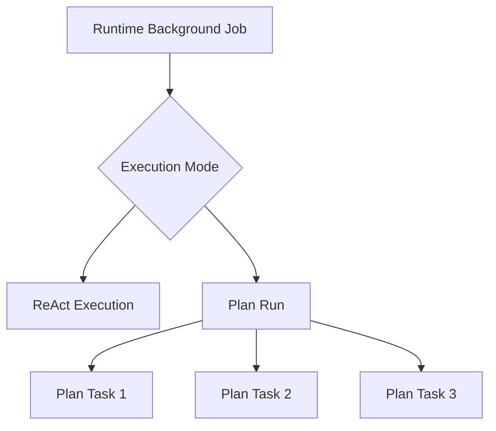

# 统一后台执行与顶层模式路由

## 1. 背景、目标与非目标

### 1.1 背景

当前项目存在两条彼此独立的顶层执行路径：

1. **交互式普通任务**
   - 普通用户输入进入 `ExecutionModeRouter`；
   - Router 在 `REACT` 与 `PLAN` 之间选择；
   - ReAct 由长期存在的 `Agent` 执行；
   - Plan 由 `PlanExecuteAgent` 执行，并使用 `PlanStateStore` 持久化 DAG、Task 状态和恢复信息。

2. **`/task add` 后台任务**
   - `TaskCommandFormatter` 直接调用 `DurableTaskManager.enqueue`；
   - 任务写入 `~/.codeagent/tasks/tasks.db` 的 `runtime_tasks`；
   - 固定 Worker Pool 领取 `enqueued` 记录；
   - Worker 最终调用 `runHeadlessTask`，固定创建普通 `Agent`；
   - **不会进入 `ExecutionModeRouter`，因此不会选择 Plan。**

这导致“提交方式”改变了“执行能力”：同一条复杂任务如果直接输入，可能由 Router 选择 Plan；如果通过 `/task add` 提交，则固定走 Headless ReAct。

当前还有第二个容易混淆的问题：`runtime_tasks` 与 `plan_tasks` 都记录状态，但两者并不是同一层级的实体：

- `runtime_tasks`：一个可独立排队、取消、重新领取的**顶层后台 Job**；
- `plan_tasks`：一个 Plan Run 内部有依赖、资源声明和 Evidence 的**DAG 节点**。

因此本次重构的目标不是把两张表强行合并，而是把后台 Job 放回正确的架构层级：**后台队列负责“何时执行”，统一顶层执行协调器负责“用 ReAct 还是 Plan 执行”。**

### 1.2 目标

本次重构必须达到：

1. `/task add <input>` 继续表示“后台提交”，但不再固定走 Headless ReAct；Worker 领取后进入与前台普通任务一致的顶层模式选择：Auto Router → ReAct / Plan，Router 非取消性失败仍按现有规则回退 ReAct。
2. 抽出 CLI 与后台执行都能复用的顶层执行协调器，统一“模式选择 → 记录路由 → Snapshot → ReAct/Plan 分发”，消除 `Main` 与后台路径的旁路。
3. `/task add` **继承提交时刻已有会话上下文**，但采用 fork-at-submit 语义：后台 Job 获得当前 Parent Session 的一个固定快照基线，之后前台与后台分别演进，不共享同一个可变 `ParentConversationContext`。
4. 上下文继承必须同时满足两种消费视图：
   - ReAct 使用 fork 时刻的 Provider Surface / conversation messages；
   - Router 与 Planner 使用 fork 时刻的 Top-level Conversation View；
   - 继承上下文只用于语义理解，**绝不能成为当前 `/task add` 这一轮的权限来源**。
5. 每个后台 Job 拥有独立 durable Parent Session，并以 Job identity 可幂等地创建/恢复；后台 Session 不参与前台“最近未结束会话”自动恢复。
6. 后台 Job 如果选择 Plan，继续复用现有 `PlanStateStore`；崩溃恢复必须区分 active Plan、terminal Plan 和尚未创建 Plan 三种状态，避免重复 Router/Planner。
7. Runtime Job 与 Plan Task 保持不同实体：Runtime Job 负责顶层后台执行生命周期；Plan Task 负责 Plan 内部 DAG 节点、资源声明和 Evidence。
8. 后台执行返回结构化 `ExecutionOutcome`，Runtime Job 终态不得再通过字符串前缀或“有没有异常抛出”猜测。
9. 后台 Job 的取消必须能传播到 Router、ReAct、Plan 及 Plan child Task，且多个并发 Job 的 token 互不覆盖。
10. 兼容现有 `/task list|add|cancel|log` 和既有 `tasks.db`；旧库用 additive migration 升级，不做破坏性 table rename。
11. 保持当前 Tool Policy、安全边界和“原始 submitted input 决定授权”的规则；历史上下文中的路径、URL、tool result、reasoning 都不能扩展当前 Job 权限。

### 1.3 非目标

本次不做：

- 不把 `runtime_tasks` 与 `plan_tasks` 合并成一张表；
- 不删除 `/task` 命令；
- 不把 Runtime HTTP API 同步改造成 durable queue；HTTP 仍保留当前 `TaskRunner` 契约，后续再单独接统一 Coordinator；
- 不实现分布式队列、多进程 lease、heartbeat、优先级、延迟任务、死信队列或 exactly-once；
- 不让后台 Job 与前台继续共享实时可变上下文；继承只发生在 `/task add` 提交时刻，此后是 fork；
- 不让后台 Job 的执行结果自动合并回原前台 Parent Session；用户可通过 `/task log` 查看结果，未来若要 merge-back 必须单独设计；
- 不在本次引入后台 HITL 交互协议；
- 不改变现有 Plan DAG 的 ResourceClaims、Evidence Gate、Reviewer 和 Task 并发策略；
- 不为了命名整洁立即重命名 SQLite 表；第一阶段保留 `runtime_tasks` 表名；
- 不要求后台路径复刻 CLI 特有的 MCP resource / `@path` mention expansion；本次统一的是顶层执行模式与生命周期，而不是终端输入增强能力。

---

## 2. 现状分析（源码证据、已知约束）

### 2.1 架构位置

当前普通顶层输入在 `Main.java` 中执行：

```text
submittedInput
    ↓
ExecutionModeRouter
    ↓
RoutingDecision
    ├── REACT → reactAgent.run(taskInput, submittedInput)
    └── PLAN  → createPlanAgent(...).run(taskInput, submittedInput)
```

源码证据：

- `Main.java:1067-1078` 创建 Router 并执行 `selectExecutionMode`；
- `Main.java:1089-1101` 根据 `RoutingDecision` 分发到 ReAct / Plan；
- `Main.java:1102-1103` 两种模式都包装在 `SnapshotService.runTurn` 内。

而 `/task` 在命令分发阶段就提前结束本轮：

```java
case TASK -> {
    printMcpCommandResult(ui, TaskCommandFormatter.handle(taskManager, command.payload()));
    continue;
}
```

因此 `/task add` 不可能进入后续的 Auto Router。

后台 Worker 的实际执行体来自：

```java
DurableTaskManager.openDefault(
    prompt -> runHeadlessTask(prompt, llmClientRef.get(), config)
);
```

而 `runHeadlessTask` 固定：

```java
Agent agent = new Agent(llmClient, registry);
return agent.run(prompt);
```

所以当前后台任务“使用 ReAct-style loop”是实现细节；在项目的顶层执行模式语义上，它是**绕过 Auto Router 的旁路**，不应被描述成另一种顶层 ReAct 模式。

### 2.2 两种持久化实体不能简单合表

#### Runtime Job

`DurableTaskManager` 的 `runtime_tasks` 目前包含：

```text
id
status
prompt
result
error
created_at
started_at
finished_at
updated_at
duration_ms
```

它解决的问题是：

> 哪个独立后台 Job 应该被 Worker 领取、什么时候开始/结束、是否取消、崩溃后是否重新入队。

调度规则是：

```sql
SELECT *
FROM runtime_tasks
WHERE status = 'enqueued'
ORDER BY created_at ASC
LIMIT 1
```

领取通过：

```sql
UPDATE runtime_tasks
SET status = 'running', ...
WHERE id = ? AND status = 'enqueued'
```

完成 Job 级 CAS 状态迁移。

#### Plan Task

`PlanStateStore` 的 `plan_tasks` 当前包含：

```text
plan_id
task_id
ordinal
description
type
status
dependencies_json
read_paths_json
write_paths_json
workspace_write
acceptance_criteria_json
required_evidence_json
diff_baseline_json
result
error
updated_at
```

它解决的问题是：

> 一个 Plan 的哪些 DAG 节点已完成、哪些依赖满足、哪些资源冲突、Evidence 是否通过，以及崩溃后从哪个节点边界恢复。

`plan_tasks` 不能作为 FIFO Job Queue，因为一个节点是否可执行取决于：

```text
dependencies completed
        +
resource conflict
        +
evidence / verification
        +
Plan state
```

而不是 `created_at` 排序。

因此逻辑层级应固定为：



两者都拥有 `status` 并不意味着它们是同一种实体；类似“订单状态”和“订单内步骤状态”，生命周期和调度条件不同。

### 2.3 当前后台恢复语义

`DurableTaskManager` 构造时调用：

```java
recoverRunningTasks();
```

当前恢复逻辑是：

```sql
UPDATE runtime_tasks
SET status = 'enqueued'
WHERE status = 'running'
```

因此后台 Job 是 Job-boundary 的 at-least-once：

```text
RUNNING
  ↓ crash
ENQUEUED
  ↓
整个 prompt 重新执行
```

如果未来后台 Job 可以选择 Plan，仅靠这条规则会产生问题：

1. 第一次运行已经创建 durable Plan；
2. 进程在某个 Plan Task 执行期间崩溃；
3. Runtime Job 被重新入队；
4. 如果 Worker 再次 Router + `planAgent.run(...)`，可能尝试创建第二个 Plan，或被“同一 Session 已有 active Plan”门禁拒绝；
5. 正确行为应是识别“这个 Job 已经选择 PLAN 且 Session 中存在 active Plan”，直接 `resumeActivePlan()`。

因此 Runtime Job 必须持久化“已解析模式 + Session 绑定”。

### 2.4 当前取消模型不能直接支撑后台 Plan

`DurableTaskManager` 目前用：

```text
taskId -> Worker Thread
```

并在取消时执行：

```java
thread.interrupt();
```

这对单层 Headless ReAct 尚可作为 best-effort 协作式取消，但 Plan 会创建内部 Task Worker 线程。仅中断外层 Worker 不能可靠表达“取消整个 Execution”。

项目已有 `CancellationContext` / `CancellationToken`，但当前实现含：

```text
AtomicReference<CancellationToken> CURRENT
+
InheritableThreadLocal<CancellationToken>
```

这套设计是为单个前台 Turn 服务的。后台 Worker Pool 允许多个 Execution 并发，多个 Job 共享全局 `CURRENT` 会互相覆盖；而 `InheritableThreadLocal` 对“线程池复用的既有线程”也不能天然保证正确传播。

所以本次如果让后台 Job 支持 Plan，必须先把取消语义改成**Execution-scoped**，不能简单把现有 `CancellationContext.startRun()` 搬进多个 Worker。

### 2.5 后台上下文：必须继承，但不能共享

前台 ReAct / Plan 共享一个 `ParentConversationContext` 是为了保持交互式多轮连续性。用户通过 `/task add` 提交后台任务时也需要理解“继续刚才的修改”“基于上面的方案”等指代，因此后台 Job **必须继承已有上下文**。

但继承不能实现为直接引用当前前台：

~~~text
backgroundJob.parentConversationContext = reactAgent.getParentConversationContext()  // 禁止
~~~

原因是 Worker 可能延迟执行或并发执行多个 Job；如果共享同一个可变对象，会造成 Provider Surface、Top-level Conversation、active Plan、Router history 和结果消息相互串写。

本次采用 **fork-at-submit**：

~~~text
前台 Parent Session S0
        │
        │ /task add，记录 fork point = source sequence N
        ▼
Background Job J1
source_session_id = S0
source_sequence   = N
        │
        └── 第一次执行时创建/恢复独立 Background Session B1
              初始上下文 = replay(S0, <= N)

S0 后续继续变化 ──────×──────> B1
B1 后台继续变化 ──────×──────> S0
~~~

因此后台看到的是**提交那一刻**的上下文，而不是 Worker 真正开始执行时的最新前台上下文。

继承范围：

- Provider Surface / conversation messages：供后台 ReAct 使用；
- Top-level Conversation View：供 Mode Router 与 Planner 使用；
- compaction 后的 durable projection 语义按 source sequence 重放；
- 不继承当前 Turn 的 Tool Policy、trusted URL capability、HITL approval、临时浏览器授权或其它权限状态。

授权仍只来自新的 `/task add` payload。历史上下文即使包含某个绝对路径或 URL，也只能帮助模型理解语义，不能让本轮工具访问获得授权。

### 2.6 Background Session 不能参与前台自动恢复

`SessionStore.latestUnclosed(workspace)` 当前按 workspace 查找未关闭 Session，没有区分交互式 Session 与未来的 Background Job Session。如果后台 Job 崩溃后保持 Session 未关闭，下一次 CLI 启动可能错误地把它当作前台会话恢复。

因此本次必须增加明确过滤：

- 交互式 Parent Session 保持现有 actor，例如 `agent`；
- Background Parent Session 使用明确 actor，例如 `background-job`，并带 Job ID；
- 前台自动恢复改为 `latestUnclosedInteractive(workspace)`，只返回交互式 Parent Session；
- Background Worker 只能通过 Job 记录的 identity 打开自己的 Session，不能使用 `latestUnclosed` 猜测。

Job 进入 terminal 后必须 best-effort `markClosed(...)` 并释放 Session lock。即使 crash 发生在 Job 已 terminal、Session 尚未 close 的窗口，前台过滤也必须保证不会误恢复。

### 2.7 字符串返回值不能作为 Runtime 终态依据

当前 `Agent.run()` 与 `PlanExecuteAgent.run()` 都存在捕获内部异常后返回错误文本的路径，例如 LLM/Session 错误可能返回 `❌ ...` 而不是继续抛异常。若后台 Worker 只看 `String result`，就可能把“错误字符串”写成 `COMPLETED`。

因此 Runtime 接线前必须提供 typed outcome。现有 CLI `run(): String` 可以保留为显示适配层，但后台 Coordinator 不能通过文本判断成功、失败或取消。

### 2.8 workspace 是 Job identity 的一部分

`tasks.db` 位于用户级目录，而一个 CodeAgent 进程只针对当前 workspace 工作。新 Job 必须在 enqueue 时写入规范化 workspace；claim 与 crash recovery 都只能处理当前 workspace 的记录。

旧版 `runtime_tasks` 没有 workspace。迁移后这些 legacy row 仍允许 list/log/cancel，但 **不得自动 claim/执行**，因为系统无法证明它们原本属于哪个项目。用户需要重新提交，不能把 NULL workspace 猜成当前目录。

---

## 3. 方案设计

### 3.1 总体架构

重构后的职责分层：

~~~mermaid
flowchart TB
    U[当前前台会话] -->|/task add| CAP[Capture fork point]
    CAP --> Q[(runtime_tasks)]
    CAP --> SRC[Source Session + sequence]

    Q --> WP[BackgroundJobManager / fixed workers]
    WP --> BG[Background Execution Context]
    SRC -->|replay <= sequence| BG

    FG[Foreground Execution Context] --> C[TopLevelExecutionCoordinator]
    BG --> C

    C --> MR[ExecutionModeRouter]
    MR -->|REACT| RA[Agent]
    MR -->|PLAN| PA[PlanExecuteAgent]

    PA --> PS[(plans.db)]
    RA --> BS[Background/Foreground Parent Session]
    PA --> BS
~~~

核心原则：

> **Submission、Context Lineage 与 Execution Mode 是三个正交维度。**

- Submission：前台同步还是 durable background；
- Context Lineage：后台从哪个 Parent Session 的哪个 sequence fork；
- Execution Mode：ReAct 还是 Plan。

`/task add` 只改变 Submission，并从当前会话建立一个固定 Context fork；它不再暗含“固定 ReAct”。

### 3.2 新增顶层执行协调器

新增：

~~~text
src/main/java/com/codeagent/agent/TopLevelExecutionCoordinator.java
~~~

职责仅限一轮顶层执行：

1. 接收 raw `submittedInput` 与执行用 `taskInput`；
2. 从当前 Execution Context 取得 Top-level Conversation；
3. 执行 explicit override 或 Auto Router；
4. **先 durable 写入 RoutingDecision，再开始对应模式执行**；若该写入失败，不允许开始产生工具副作用；
5. 记录 `execution_mode_selected`；
6. 在 `SnapshotService.runTurn` 中分发 ReAct / Plan；
7. 返回 typed `TopLevelExecutionResult`。

建议：

~~~java
enum ExecutionOutcome {
    SUCCEEDED,
    FAILED,
    CANCELED,
    REJECTED
}

record TopLevelExecutionResult(
    ExecutionMode mode,
    RoutingSource routingSource,
    ExecutionOutcome outcome,
    String result,
    String error,
    String sessionId
) {}
~~~

Runtime Job 映射：

~~~text
SUCCEEDED -> COMPLETED
FAILED    -> FAILED
CANCELED  -> CANCELED
REJECTED  -> FAILED + reason   // 第一阶段不扩 Runtime 状态枚举
~~~

现有 `Agent.run(): String` / `PlanExecuteAgent.run(): String` 保持 CLI 兼容，但内部应抽出 typed 结果入口，CLI 再把 typed outcome 转成显示字符串。禁止通过 `startsWith("❌")` 等文本规则推断状态。

Coordinator 不能依赖 JLine、`Main`、`TaskCommandFormatter` 或具体 Renderer。

### 3.3 Execution Context：前台复用，后台 fork

协调器通过统一 Context 访问运行依赖：

~~~java
interface TopLevelExecutionContext {
    Agent reactAgent();
    ParentConversationContext parentConversationContext();
    ConversationLedger conversationLedger();
    PlanExecuteAgent createPlanAgent(PlanReviewHandler reviewHandler);
    SnapshotService snapshotService();
}
~~~

#### 前台

继续包装现有长期存在的 `reactAgent + ParentConversationContext + SessionHandle + MemoryManager + ToolRegistry`，行为不变。

#### 后台

每个 Runtime Job 使用独立 BackgroundExecutionContext：

~~~text
BackgroundExecutionContext
├── own Agent
├── own ToolRegistry
├── own ParentConversationContext
├── own durable Background Session
├── own ConversationLedger
└── fork metadata(sourceSessionId, sourceSequence)
~~~

它的**初始上下文不是空白**，而是从 enqueue 时记录的 source Session fork point 重放得到。

为避免在 `tasks.db` 复制整段对话正文，Runtime Job 只保存 `source_session_id + source_sequence`。`SessionStore` 增加只读的 as-of replay 能力，例如：

~~~java
SessionProjection readProjectionAt(String sessionId, long maxSequence)
~~~

Raw session JSONL 本来就是 append-only，因此 sequence 是稳定 fork point；后续 source Session 即使继续追加，也不会改变该 Job 的上下文基线。

如果当前前台没有 durable Session，则 `/task add` 必须 fail-closed：提示无法保证可恢复的上下文继承，而不是偷偷退化成空上下文后台执行。

### 3.4 后台 Session 生命周期与幂等创建

`/task add` 的提交阶段执行：

1. 生成 Job ID；
2. 读取当前前台 durable Session ID 与 `lastAppliedSequence`，形成 fork point；
3. 在同一个 SQLite enqueue 中写入 Job、workspace、source session/sequence；
4. 返回 Job ID。

提交阶段**不创建新的 Background Session**，因此不存在“Session 已创建但 Job row 尚未写入”的跨存储 orphan 窗口。

Worker 第一次 claim 后，通过 Job ID 派生稳定 Background Session identity，例如：

~~~text
background-job-<job-id>
~~~

`SessionStore` 增加专用幂等 API，例如：

~~~java
openOrCreateBackgroundFork(jobId, workspace, provider, model, sourceSessionId, sourceSequence)
~~~

语义：

- Session 不存在：读取 source projection at sequence，用该 projection 初始化独立 Background Parent Session；
- Session 已存在：按同一 Job ID 恢复 writable handle；
- Session 存在但 fork metadata 不一致：fail closed；
- 创建/恢复成功后把实际 `background_session_id` 写回 Runtime Job 作为审计字段；
- crash 发生在 Session 创建后、Job row 回写前也没有歧义，因为 identity 可由 Job ID 再次确定。

Job terminal 后顺序：

1. 将 typed outcome append 为 durable `BACKGROUND_JOB_OUTCOME` Session event；
2. 更新 `runtime_tasks` terminal status/result/error；
3. `markClosed("background-job-...")`；
4. release handle。

若 crash 发生在 1 与 2 之间，恢复时以 Session 中已提交的 `BACKGROUND_JOB_OUTCOME` 收敛 Job，不重新执行。

### 3.5 Runtime Job 需要增加的持久字段

第一阶段保留表名 `runtime_tasks`，通过 additive migration 增加：

~~~text
workspace                TEXT
source_session_id        TEXT
source_sequence          INTEGER
background_session_id    TEXT
selected_mode            TEXT
routing_source           TEXT
attempt                  INTEGER DEFAULT 0
~~~

语义：

- `workspace`：enqueue 时的规范化项目根；
- `source_session_id/source_sequence`：`/task add` 提交时刻的上下文 fork point；
- `background_session_id`：Job 专属 Parent Session，首次 Worker 执行后写入；
- `selected_mode`：Router durable 决策 `react|plan`；
- `routing_source`：`auto_model|auto_fallback|explicit`；
- `attempt`：每次重新领取递增，用于审计 at-least-once。

Runtime 表不复制 Plan DAG、dependencies、ResourceClaims、Evidence、DIFF baseline；这些继续只属于 `PlanStateStore`。

新 Job 的 `workspace/source_session_id/source_sequence` 必须非空；legacy row 允许 NULL 以兼容旧 schema，但不能自动 claim。

### 3.6 为什么仍然不合并 Runtime Job 与 Plan Task 表

重构后关系应是：

```text
Runtime Job
├── selected_mode = react
│   └── ReAct execution/session
│
└── selected_mode = plan
    └── Plan Run
        ├── Plan Task A
        ├── Plan Task B
        └── Plan Task C
```

Runtime Job 是“外层 execution envelope”；Plan Task 是“内层 workflow node”。

如果强行合表，会出现：

- FIFO Job 与 DAG Node 共用同一状态机；
- `enqueued` 与 `BLOCKED/INTERRUPTED/UNVERIFIED` 等语义混杂；
- Runtime Worker 不知道哪些行属于顶层 Job、哪些属于依赖节点；
- Plan ResourceClaims/Evidence 字段污染所有 ReAct Job；
- 跨层恢复逻辑被迫写大量 nullable 字段和 type switch。

因此本次明确保留分层。

### 3.7 Background Job 首次执行

~~~mermaid
sequenceDiagram
    participant M as BackgroundJobManager
    participant DB as runtime_tasks
    participant SS as SessionStore
    participant C as Coordinator
    participant R as Mode Router
    participant P as Plan/ReAct

    M->>DB: claim(workspace) enqueued -> running
    M->>SS: openOrCreateBackgroundFork(jobId, sourceSession, sourceSequence)
    SS-->>M: backgroundSession
    M->>DB: persist background_session_id
    M->>C: execute(job input, forked context)
    C->>R: route(raw input, forked Top-level View)
    R-->>C: RoutingDecision
    C->>DB: persist selected_mode + routing_source
    DB-->>C: durable ack
    C->>P: execute selected mode
    P-->>C: typed ExecutionOutcome
    C->>SS: append BACKGROUND_JOB_OUTCOME
    C-->>M: typed result
    M->>DB: write terminal status
    M->>SS: markClosed
~~~

关键门禁：**mode 必须先写入 Runtime Job，再开始 ReAct/Plan 执行。** 这样 crash 后不会出现“已经产生工具副作用，但数据库仍不知道当时选了什么模式”的状态。

### 3.8 崩溃恢复状态机

Runtime 启动只把**当前 workspace** 的遗留 RUNNING Job 重新置为 ENQUEUED。重新 claim 后按以下顺序恢复：

#### 0. Session 已存在 terminal Job outcome

若 Background Session 已存在 `BACKGROUND_JOB_OUTCOME`：

- 直接把 typed outcome 收敛到 `runtime_tasks`；
- 不 Router、不 ReAct、不 Plan；
- best-effort close Session。

这是“Execution 已完成但 Runtime Job terminal update 尚未提交”窗口的统一解法。

#### 1. `selected_mode IS NULL`

说明尚没有 durable mode decision。重新 Router 是安全的，因为设计要求任何模式执行都必须发生在 selected_mode 持久化之后。

#### 2. `selected_mode = react`

- 不重新 Router；
- 恢复 Job 专属 Background Session；
- 若没有 `BACKGROUND_JOB_OUTCOME`，当前实现无法证明 ReAct 已完整结束，因此从 Job boundary 重跑 raw submitted input；
- 保持 at-least-once，不宣称工具级断点续跑。

#### 3. `selected_mode = plan`

先 `PlanConversationReconciler`，再按 `workspace + background_session_id` 查询该专属 Session 的 Plan lineage（Background Session 一 Job 一用，不会混入其它顶层 Plan）：

~~~text
find latest plan for session INCLUDING terminal
        │
        ├─ active CREATED/RUNNING
        │      -> resumeActivePlan()
        │         不 reroute、不 replan，completed Task 不重跑
        │
        ├─ terminal COMPLETED/FAILED/CANCELLED
        │      -> 从 PlanStateStore + reconciled Session 构造 typed outcome
        │         append BACKGROUND_JOB_OUTCOME
        │         收敛 Runtime Job，绝不重新 Planner
        │
        └─ no plan record
               -> crash 位于 mode durable ack 与首次 savePlanDurably 之间
                  允许第一次 planner.run()
~~~

因此 `PlanStateStore` 需要新增按 `workspace + session_id` 查询**最新 Plan（包含终态）**的只读 API；只调用现有 `findActive()` 不足以区分“尚未创建”和“已经完成”。

若 Session 与 PlanStore 互相矛盾且 reconciler 无法确定唯一状态，fail closed：Job 标记 FAILED，记录恢复错误，不猜测性重建。

### 3.9 Headless Plan Review 策略

交互式 Plan 使用终端 `PlanReviewHandler`。

后台 Job 无法阻塞等待终端输入，因此 `BACKGROUND` surface 必须显式使用：

```text
PlanReviewDecision.execute()
```

即：

- Planner 仍生成 Plan；
- 不执行人工计划确认；
- `PipelineOptions.FULL_PRESET` 的自动 Step Reviewer 与 Evidence Gate 继续生效。

这不是“绕过前台审批”，而是不同 Execution Surface 的明确策略。日志中必须可见该 Job 为 background/headless。

本次不新增后台 HITL。现有 headless 工具权限行为保持不变；如果后续需要真正的远程审批，应通过独立 approval channel 设计，不应让 Worker 等待 CLI 输入。

### 3.10 Execution-scoped Cancellation

不新增一套与现有 `CancellationContext` 并存的第二真相源；本次直接把现有 Context 重构为 execution-scoped，同时保留调用方统一使用的：

~~~java
CancellationContext.isCancelled()
~~~

建议模型：

~~~text
CancellationToken token = ...
CancellationContext.withToken(token, () -> execution)
~~~

- 去除/弃用会被并发 Job 覆盖的全局 `CURRENT`；
- `runWithCancelSupport` 持有前台 token 的显式引用并 cancel；
- BackgroundJobManager 维护 `jobId -> RunningExecution(token, workerThread)`；
- Plan 创建 child worker / executor task 时显式 capture 并安装当前 token scope；不能依赖 InheritableThreadLocal 对线程池复用进行传播；
- cancel Job：先 `token.cancel()`，再 best-effort `workerThread.interrupt()` 以唤醒阻塞调用；
- Worker 在结束当前 Job 后必须清理 interrupt 状态，不能因为取消一个 Job 永久损失池线程；
- Job A 的 token 绝不能被 Job B 观察到。

Router、Agent、PlanExecuteAgent、Tool wait 点继续只调用统一 `CancellationContext.isCancelled()`，不各自引入新的取消判断协议。

### 3.11 Worker Pool 与 Plan 内部并发

Runtime Worker Pool 控制“同时运行多少个顶层后台 Job”。

Plan 自身仍可能在一个 Job 内最多并行 4 个无冲突 DAG Task。

因此总并发上界近似：

```text
background_job_workers × per_plan_task_parallelism
```

本次不建立新的全局资源调度器，但必须：

- 保持两层线程池都有界；
- 不新增 cached/unbounded executor；
- 文档中明确这是嵌套并发；
- 测试至少覆盖两个后台 Job 并发执行时状态与取消互不串扰。

### 3.12 输入、上下文继承与授权边界

后台 Runtime Job 保存的 raw input 是：

~~~text
submittedInput = /task add 后面的原始 payload
~~~

第一阶段明确：

~~~text
taskInput = submittedInput
~~~

即后台不复制 CLI 专属 `mentionExpander` / MCP resource expansion。这样实现语义唯一，不会出现“文档说统一、代码却各自猜一套预处理”的问题。

上下文继承与当前权限严格分离：

- Router：读取 fork 后的 Top-level Conversation + 当前 raw submittedInput；
- Planner：读取 fork 后的 Top-level Conversation；
- ReAct：读取 fork 后的 Provider Surface；
- `TurnToolPolicy`：**只**读取当前 raw submittedInput；
- inherited tool result / URL / path / reasoning 不得产生 trusted capability；
- source Session 中曾经的 HITL approval 不继承到 Background Job。

因此“继承已有任务上下文”解决的是语义连续性，不是权限连续性。

### 3.13 数据迁移与兼容性

`DurableTaskManager.initTables()` 当前只有 `CREATE TABLE IF NOT EXISTS`。本次必须增加最小 schema migration：

1. `PRAGMA table_info(runtime_tasks)`；
2. 缺列时逐个 `ALTER TABLE ... ADD COLUMN`；
3. migration 在 Worker 启动前完成；
4. 新 Job 写完整 workspace/fork metadata；
5. legacy row：新增列保持 NULL，可 list/log/cancel，但 claim 查询必须排除 `workspace IS NULL`；
6. 不删除旧列，不改旧 task ID，不重写历史 result/error；
7. 第一阶段不重命名 SQL 表。

### 3.14 内部命名与 HTTP 兼容

为消除“Runtime Task”和“Plan Task”长期混淆，本次代码层建议重命名：

~~~text
DurableTaskManager -> BackgroundJobManager
DurableTask        -> BackgroundJob
TaskStatus         -> BackgroundJobStatus
~~~

CLI `/task` 与 SQL 表 `runtime_tasks` 为兼容性保持不变。

当前 Runtime HTTP API 仍使用 `TaskRunner(String prompt)`；本次**不修改该契约**。后台 durable queue 改接新的 Coordinator/BackgroundExecutionRunner，避免为了本次重构顺手破坏 HTTP 路径。

### 3.15 Job-level durable outcome event

新增 Session event type（名称可在实现时按现有命名规范确定）：

~~~text
BACKGROUND_JOB_OUTCOME
jobId
mode
routingSource
outcome
result
error
attempt
~~~

它是 Background Session 对“这一顶层 Job 已经产生确定终态”的 durable 证明，用来覆盖 Session 与 SQLite 之间的 terminal crash window。它不替代 `runtime_tasks`：Job 是否在队列中、是否可 claim 仍以 tasks.db 为权威；它只用于恢复时证明执行结果已经生成。

---

## 4. 实现任务与测试矩阵

### 4.1 实现顺序

#### Task A：测试锁定现状与新增恢复契约

先补失败测试覆盖：

- `/task add` 当前绕过 Router；
- 旧 FIFO claim / cancel / crash recovery；
- background context fork 的 sequence 语义；
- terminal Plan 但 Job 未 terminal；
- background Session 不得被前台 latest-unclosed 恢复；
- Agent/Plan 错误字符串不能被后台标成 COMPLETED。

#### Task B：typed execution outcome

为 ReAct / Plan 提供 typed internal result；保留现有 `run(): String` 作为 CLI adapter。新增 `TopLevelExecutionCoordinatorTest`。

#### Task C：抽 TopLevelExecutionCoordinator

把当前 Main 的 select mode / record / snapshot / dispatch 移入协调器，先只替换前台接线并证明行为等价。

#### Task D：Session as-of replay 与 background fork

- `readProjectionAt(sessionId, sequence)`；
- `openOrCreateBackgroundFork(jobId, ...)`；
- actor/background filter；
- `latestUnclosedInteractive(workspace)`；
- Background Session 初始化为 fork projection，而不是空 Session。

#### Task E：扩展 Runtime Job schema 与 workspace-bound claim

- additive migration；
- enqueue 保存 source session/sequence/workspace；
- `claimNext(workspace)`；
- `recoverRunningTasks(workspace)`；
- legacy unscoped row 不自动执行。

#### Task F：后台 Worker 接 Coordinator

后台 Job 第一次 claim 后创建/恢复 fork Session，执行 Router，先 durable mode，再启动 ReAct/Plan。

#### Task G：Plan terminal/active/no-plan 恢复

新增 `PlanStateStore` session-level latest lookup；覆盖 active、terminal、尚未 save 三类 crash window。

#### Task H：统一 CancellationContext

移除后台并发会互相覆盖的全局 token 语义；前台、后台和 Plan child worker 统一显式 scope propagation。

#### Task I：文档同步

实现完成后更新本文实施记录、`AGENTS.md`、`docs/dev/05-runtime-api-tasks.md` 和 README `/task` 描述；不得新增第二份 implementation-plan。

### 4.2 测试矩阵

| 场景 | 预期 |
|---|---|
| `/task add` 在已有多轮会话中提交 | Job 记录 source session + exact sequence |
| 提交后前台继续对话、Job 延迟执行 | Background 只看到提交时刻 fork，不看到之后新增前台消息 |
| Background ReAct | Provider Surface 继承 fork 上下文 |
| Background Router/Plan | 只看 fork 的 Top-level Conversation |
| inherited history 含 URL/path | 不自动获得当前 Job 工具授权 |
| 当前前台无 durable Session | `/task add` fail-closed，不创建不可恢复 Job |
| Router=REACT | mode durable 后执行 ReAct，typed success -> COMPLETED |
| Router=PLAN | mode durable 后创建 durable Plan |
| Router 普通异常 | AUTO_FALLBACK REACT |
| Router cancellation | CANCELED，不 fallback |
| crash: mode durable 前 | 可重新 Router；尚未执行工具 |
| crash: ReAct result event 后、Job terminal 前 | 从 `BACKGROUND_JOB_OUTCOME` 收敛，不重跑 |
| crash: ReAct 中途 | 无 outcome，Job-boundary at-least-once 重跑 |
| crash: PLAN active | `resumeActivePlan()`，不 reroute/replan |
| crash: PLAN terminal、Job 未 terminal | 从 terminal Plan 收敛，不重新 Planner |
| crash: selected PLAN、尚无 Plan row | 允许首次 Planner |
| completed Plan Task | resume 后不重跑 |
| Background Session unclosed | 前台 `latestUnclosedInteractive` 不返回它 |
| terminal Background Job | Session markClosed |
| 两个 Background Job 并发 | fork/session/token 相互隔离 |
| cancel Job A | A CANCELED，B 不受影响，Worker pool 不永久减员 |
| legacy tasks.db | 自动补列；旧 row 可读但不自动 claim |
| 在 workspace B 启动 | 不 claim workspace A 的 Job |
| ReAct/Plan typed FAILED | Runtime status=FAILED，不因错误文本误标 COMPLETED |
| foreground ordinary input | Auto Router 行为与当前一致 |
| `/react` / `/plan` | one-turn override 不回归 |

### 4.3 验证命令

实现完成后至少运行：

~~~bash
mvn test -DskipTests=false -Dtest=ExecutionModeRouterTest,DurableTaskManagerTest,PlanExecuteRecoveryTest,SessionStoreTest
mvn test -DskipTests=false -Dtest=TopLevelExecutionCoordinatorTest,BackgroundExecutionIntegrationTest
mvn test -Pquick
mvn test -DskipTests=false
mvn clean package
git diff --check
~~~

最终类名如果因本次 rename 变化，以实际类名回填本文，不允许写未执行的验证结果。

## 5. 风险、失败路径与回滚

### 5.1 三个持久化层的权威边界

~~~text
tasks.db  -> Background Job queue/lifecycle + durable mode/fork identity
history   -> Background/Foreground Parent Session context + job outcome proof
plans.db  -> Plan Run / DAG node state
~~~

权威规则：

- Job 是否可 claim、当前 Runtime status：tasks.db；
- source context fork point：tasks.db 中 source session + sequence；
- Job 专属对话与 `BACKGROUND_JOB_OUTCOME`：Background Session；
- Execution Mode：tasks.db 中首次 durable `selected_mode`；
- Plan workflow：plans.db；
- 不从 assistant 文本猜终态，不从 Session 文本猜 Tool Policy。

### 5.2 必测崩溃窗口

1. enqueue 已提交、Worker 尚未运行；
2. Background Session 创建后、`background_session_id` 回写前；
3. Router 返回后、selected_mode durable ack 前——此时不得开始 Agent；
4. selected_mode=PLAN 后、`savePlanDurably` 前；
5. active Plan Task 中途；
6. Plan 已 terminal、`BACKGROUND_JOB_OUTCOME` 前；
7. `BACKGROUND_JOB_OUTCOME` 已提交、tasks.db terminal update 前；
8. tasks.db 已 terminal、Session markClosed 前；
9. ReAct 外部副作用已发生但尚无 job outcome event。

### 5.3 上下文 fork 的存储成本与一致性

本次不把完整上下文复制进 tasks.db，而是保存 source session + sequence，并依赖 append-only Session replay。代价是 source Session 文件不能在 Job 执行前被物理删除；当前项目没有自动删除 raw session 的流程，因此满足该前提。未来若加入清理策略，必须把仍被 ENQUEUED/RUNNING Job 引用的 source Session 视为 pinned。

### 5.4 多实例限制

仍维持单进程独占 tasks.db；没有 lease/owner/heartbeat，不宣称多实例安全。

### 5.5 回滚

1. Coordinator 前台适配层独立，出现后台问题时前台可继续使用统一 Coordinator；
2. Background queue 如需临时降级，可显式固定 `REACT` 作为 Coordinator override，但不得恢复旧 `runHeadlessTask` 旁路；
3. additive schema 不需要删除新列；
4. Session fork event/API 为增量能力，不修改旧 raw event；
5. legacy row 保持只读可见。

## 6. 实施记录

### 6.1 分支

```text
refactor/unified-durable-execution-runtime
```

基于：

```text
main@33c6a24caf3835835c62b2cd36c9c710afb7bdc8
```

### 6.2 当前阶段

当前仅完成：

- 现状源码勘探；
- 第一版设计；
- 设计 review；
- 根据 review 收敛 Plan terminal crash window、typed outcome、workspace 隔离、Session 自动恢复隔离；
- 根据用户要求将 `/task add` 改为 **继承提交时刻上下文的 fork-at-submit** 设计。

尚未开始 Java 源码实现或测试修改。

### 6.3 当前已确认源码事实

- `/task add` 在 CLI command switch 中提前 `continue`，不进入 Auto Router；
- 后台 Worker 当前固定调用 `runHeadlessTask`；
- `runHeadlessTask` 固定创建普通 `Agent`；
- `ExecutionModeRouter` 已实现 AUTO_MODEL / AUTO_FALLBACK 与取消传播；
- `PlanExecuteAgent` durable 模式要求 Parent Session / ParentConversationContext / PlanStateStore；
- `PlanStateStore` 的 active Plan 身份已经基于 `workspace + session_id`；
- `runtime_tasks` 负责 FIFO Job 状态；
- `plan_tasks` 负责 DAG 节点状态、依赖、资源与 Evidence；
- 当前后台 cancel 主要依赖 Worker thread interrupt；
- 当前 `CancellationContext` 的全局 CURRENT 不适合直接用于并行 Background Executions。

---

## 7. 验收清单

实现完成前以下全部必须满足：

- [ ] 前台普通输入仍通过 Auto Router 在 ReAct / Plan 间选择。
- [ ] `/react` 与 `/plan` one-turn override 不回归。
- [ ] `/task add` 只改变前台/后台提交方式，不再固定改变 Execution Mode。
- [ ] `/task add` 记录当前 durable Parent Session + exact source sequence。
- [ ] Background Job 的初始 Provider Surface / Top-level View 来自提交时刻 fork。
- [ ] 提交后前台新增消息不会出现在该 Background Job 中。
- [ ] Background Job 的后续消息不会写回原前台 Session。
- [ ] inherited context 只提供语义，不继承 URL/path/HITL/tool permission。
- [ ] 当前无 durable Parent Session 时 `/task add` fail-closed。
- [ ] Background Session identity 可由 Job ID 幂等创建/恢复。
- [ ] Background Session 不会被前台 latest-unclosed 自动恢复。
- [ ] terminal Background Job 会 best-effort markClosed Session。
- [ ] Runtime Job 与 Plan Task 保持不同实体和持久化职责。
- [ ] mode decision durable ack 发生在任何 ReAct/Plan 工具副作用之前。
- [ ] Background ReAct 可执行，失败/取消通过 typed outcome 正确映射 Runtime status。
- [ ] Background Plan 可执行并通过 durable Parent Session gate。
- [ ] active Plan 恢复时不 reroute、不 replan。
- [ ] terminal Plan 但 Job 未 terminal 时能直接收敛，绝不重新 Planner。
- [ ] selected PLAN 但从未建立 Plan 时才允许首次 Planner。
- [ ] completed Plan Task 恢复后不重跑。
- [ ] ReAct 中途 crash 仍明确是 Job-boundary at-least-once，不宣传 exactly-once。
- [ ] `BACKGROUND_JOB_OUTCOME` 可覆盖“执行已结束、tasks.db 尚未 terminal”的 crash window。
- [ ] CancellationContext 成为唯一 execution-scoped 取消读取入口。
- [ ] 并发 Job 的 cancellation token、Session、Context fork 不串扰。
- [ ] cancel 一个 Job 不导致 Worker Pool 永久减员。
- [ ] claim/recover 只处理当前 workspace。
- [ ] legacy NULL-workspace row 可 list/log/cancel，但不会自动执行。
- [ ] 第一阶段 Background `taskInput == submittedInput`，不存在未定义的 CLI expansion 行为。
- [ ] Runtime HTTP API 的旧 `TaskRunner` 契约不因本次重构回归。
- [ ] 针对性测试通过。
- [ ] `mvn test -Pquick` 通过。
- [ ] 全量测试通过。
- [ ] 构建通过。
- [ ] `git diff --check` 通过。
- [ ] 最终实现与本文同步，无第二份重复实施文档。

