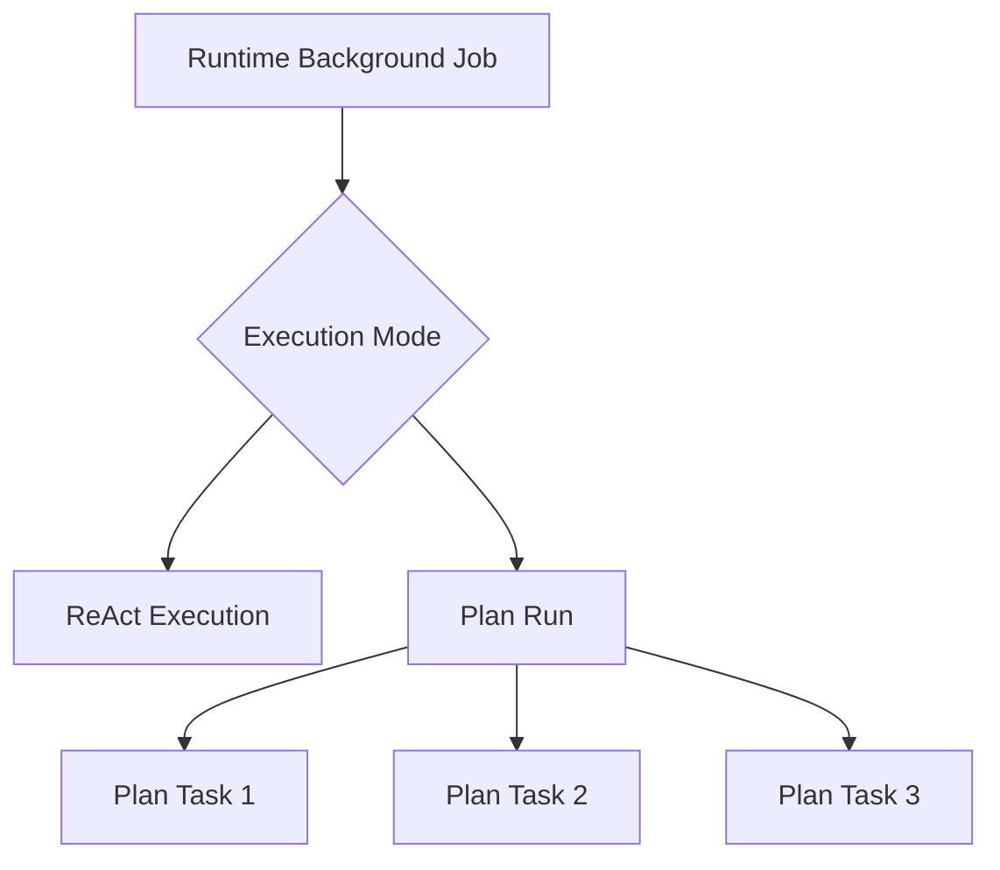
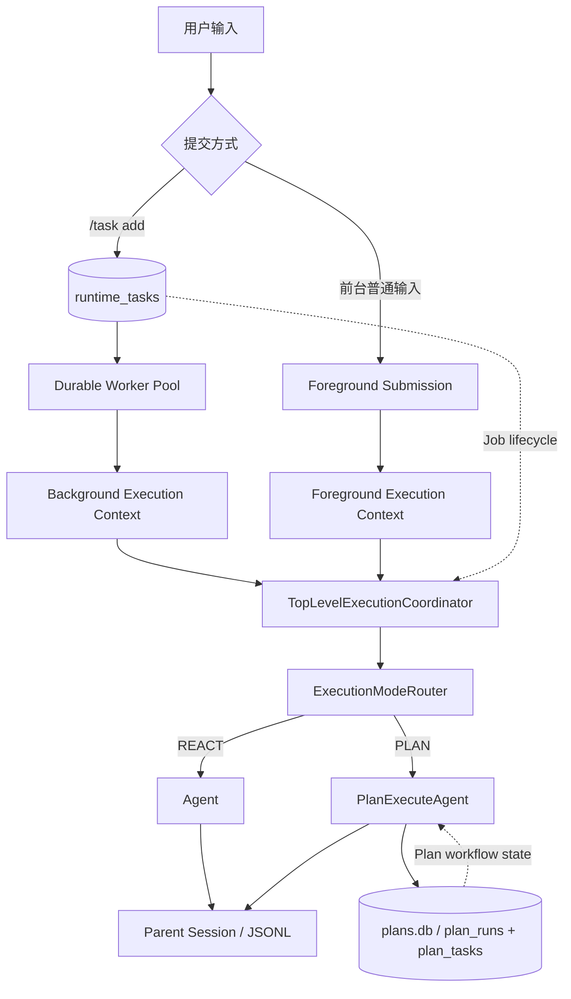
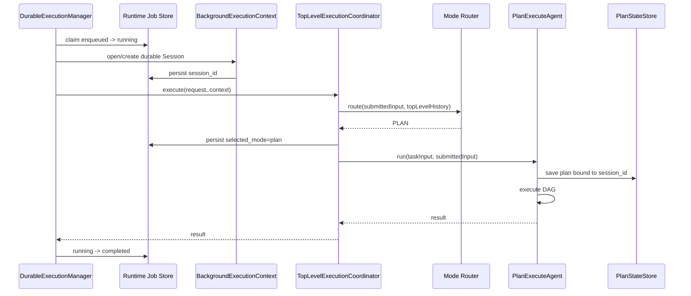

# 统一后台执行与顶层模式路由

## 1. 背景、目标与非目标

### 1.1 背景

当前项目存在两条彼此独立的顶层执行路径：

1. **交互式普通任务**
   - 普通用户输入进入 `ExecutionModeRouter`；
   - Router 在 `REACT` 与 `PLAN` 之间选择；
   - ReAct 由长期存在的 `Agent` 执行；
   - Plan 由 `PlanExecuteAgent` 执行，并使用 `PlanStateStore` 持久化 DAG、Task 状态和恢复信息。

2. **`/task add` 后台任务**
   - `TaskCommandFormatter` 直接调用 `DurableTaskManager.enqueue`；
   - 任务写入 `~/.codeagent/tasks/tasks.db` 的 `runtime_tasks`；
   - 固定 Worker Pool 领取 `enqueued` 记录；
   - Worker 最终调用 `runHeadlessTask`，固定创建普通 `Agent`；
   - **不会进入 `ExecutionModeRouter`，因此不会选择 Plan。**

这导致“提交方式”改变了“执行能力”：同一条复杂任务如果直接输入，可能由 Router 选择 Plan；如果通过 `/task add` 提交，则固定走 Headless ReAct。

当前还有第二个容易混淆的问题：`runtime_tasks` 与 `plan_tasks` 都记录状态，但两者并不是同一层级的实体：

- `runtime_tasks`：一个可独立排队、取消、重新领取的**顶层后台 Job**；
- `plan_tasks`：一个 Plan Run 内部有依赖、资源声明和 Evidence 的**DAG 节点**。

因此本次重构的目标不是把两张表强行合并，而是把后台 Job 放回正确的架构层级：**后台队列负责“何时执行”，统一顶层执行协调器负责“用 ReAct 还是 Plan 执行”。**

### 1.2 目标

本次重构必须达到：

1. `/task add <input>` 仍表示“后台提交”，但 Worker 领取后进入与前台普通任务一致的顶层模式选择：
   - Auto Router → ReAct；
   - Auto Router → Plan；
   - Router 非取消性失败继续按现有规则回退 ReAct。
2. 抽出一个 CLI 与后台执行都能复用的**顶层执行协调器**，消除 `Main` 与 Headless 路径对模式选择/分发的重复或旁路。
3. 后台 Job 使用**独立 durable Parent Session**，不与当前前台交互式 `ParentConversationContext` 共享可变上下文。
4. 后台 Job 如果被 Router 选为 Plan：
   - 创建/绑定自己的 durable Session；
   - 使用现有 `PlanStateStore`；
   - 崩溃恢复时优先恢复同一 Session 下的 active Plan，而不是重新规划一个新 Plan。
5. 保留 `runtime_tasks` 与 `plan_tasks` 的职责分离，并在代码/文档中明确：
   - Runtime Job = 顶层执行实体；
   - Plan Task = Plan 内部 workflow node。
6. 后台 Job 的取消必须能传播到 Router、ReAct、Plan 及 Plan Task，而不依赖“只中断最外层 Worker Thread”。
7. 兼容现有 `/task list|add|cancel|log` 命令和已存在的 `tasks.db` 数据。
8. 保持当前 Tool Policy、安全边界和“原始 submitted input 决定授权”的规则，不因后台执行扩大权限。

### 1.3 非目标

本次不做：

- 不把 `runtime_tasks` 与 `plan_tasks` 合并成一张表；
- 不删除 `/task` 命令；
- 不把 Runtime HTTP API 同步改造成 durable queue；HTTP 入口后续可以复用本次抽出的顶层执行协调器，但不纳入本次实施范围；
- 不实现分布式队列、多进程 lease、heartbeat、优先级、延迟任务、死信队列或 exactly-once；
- 不让后台 Job 继承正在变化的前台对话历史；
- 不在本次引入后台 HITL 交互协议；
- 不改变现有 Plan DAG 的 ResourceClaims、Evidence Gate、Reviewer 和 Task 并发策略；
- 不为了命名整洁立即重命名 SQLite 表。第一阶段继续保留 `runtime_tasks` 作为兼容表名，避免把行为重构与破坏性数据迁移绑在一起。

---

## 2. 现状分析（源码证据、已知约束）

### 2.1 架构位置

当前普通顶层输入在 `Main.java` 中执行：

```text
submittedInput
    ↓
ExecutionModeRouter
    ↓
RoutingDecision
    ├── REACT → reactAgent.run(taskInput, submittedInput)
    └── PLAN  → createPlanAgent(...).run(taskInput, submittedInput)
```

源码证据：

- `Main.java:1067-1078` 创建 Router 并执行 `selectExecutionMode`；
- `Main.java:1089-1101` 根据 `RoutingDecision` 分发到 ReAct / Plan；
- `Main.java:1102-1103` 两种模式都包装在 `SnapshotService.runTurn` 内。

而 `/task` 在命令分发阶段就提前结束本轮：

```java
case TASK -> {
    printMcpCommandResult(ui, TaskCommandFormatter.handle(taskManager, command.payload()));
    continue;
}
```

因此 `/task add` 不可能进入后续的 Auto Router。

后台 Worker 的实际执行体来自：

```java
DurableTaskManager.openDefault(
    prompt -> runHeadlessTask(prompt, llmClientRef.get(), config)
);
```

而 `runHeadlessTask` 固定：

```java
Agent agent = new Agent(llmClient, registry);
return agent.run(prompt);
```

所以当前后台任务“使用 ReAct-style loop”是实现细节；在项目的顶层执行模式语义上，它是**绕过 Auto Router 的旁路**，不应被描述成另一种顶层 ReAct 模式。

### 2.2 两种持久化实体不能简单合表

#### Runtime Job

`DurableTaskManager` 的 `runtime_tasks` 目前包含：

```text
id
status
prompt
result
error
created_at
started_at
finished_at
updated_at
duration_ms
```

它解决的问题是：

> 哪个独立后台 Job 应该被 Worker 领取、什么时候开始/结束、是否取消、崩溃后是否重新入队。

调度规则是：

```sql
SELECT *
FROM runtime_tasks
WHERE status = 'enqueued'
ORDER BY created_at ASC
LIMIT 1
```

领取通过：

```sql
UPDATE runtime_tasks
SET status = 'running', ...
WHERE id = ? AND status = 'enqueued'
```

完成 Job 级 CAS 状态迁移。

#### Plan Task

`PlanStateStore` 的 `plan_tasks` 当前包含：

```text
plan_id
task_id
ordinal
description
type
status
dependencies_json
read_paths_json
write_paths_json
workspace_write
acceptance_criteria_json
required_evidence_json
diff_baseline_json
result
error
updated_at
```

它解决的问题是：

> 一个 Plan 的哪些 DAG 节点已完成、哪些依赖满足、哪些资源冲突、Evidence 是否通过，以及崩溃后从哪个节点边界恢复。

`plan_tasks` 不能作为 FIFO Job Queue，因为一个节点是否可执行取决于：

```text
dependencies completed
        +
resource conflict
        +
evidence / verification
        +
Plan state
```

而不是 `created_at` 排序。

因此逻辑层级应固定为：



两者都拥有 `status` 并不意味着它们是同一种实体；类似“订单状态”和“订单内步骤状态”，生命周期和调度条件不同。

### 2.3 当前后台恢复语义

`DurableTaskManager` 构造时调用：

```java
recoverRunningTasks();
```

当前恢复逻辑是：

```sql
UPDATE runtime_tasks
SET status = 'enqueued'
WHERE status = 'running'
```

因此后台 Job 是 Job-boundary 的 at-least-once：

```text
RUNNING
  ↓ crash
ENQUEUED
  ↓
整个 prompt 重新执行
```

如果未来后台 Job 可以选择 Plan，仅靠这条规则会产生问题：

1. 第一次运行已经创建 durable Plan；
2. 进程在某个 Plan Task 执行期间崩溃；
3. Runtime Job 被重新入队；
4. 如果 Worker 再次 Router + `planAgent.run(...)`，可能尝试创建第二个 Plan，或被“同一 Session 已有 active Plan”门禁拒绝；
5. 正确行为应是识别“这个 Job 已经选择 PLAN 且 Session 中存在 active Plan”，直接 `resumeActivePlan()`。

因此 Runtime Job 必须持久化“已解析模式 + Session 绑定”。

### 2.4 当前取消模型不能直接支撑后台 Plan

`DurableTaskManager` 目前用：

```text
taskId -> Worker Thread
```

并在取消时执行：

```java
thread.interrupt();
```

这对单层 Headless ReAct 尚可作为 best-effort 协作式取消，但 Plan 会创建内部 Task Worker 线程。仅中断外层 Worker 不能可靠表达“取消整个 Execution”。

项目已有 `CancellationContext` / `CancellationToken`，但当前实现含：

```text
AtomicReference<CancellationToken> CURRENT
+
InheritableThreadLocal<CancellationToken>
```

这套设计是为单个前台 Turn 服务的。后台 Worker Pool 允许多个 Execution 并发，多个 Job 共享全局 `CURRENT` 会互相覆盖；而 `InheritableThreadLocal` 对“线程池复用的既有线程”也不能天然保证正确传播。

所以本次如果让后台 Job 支持 Plan，必须先把取消语义改成**Execution-scoped**，不能简单把现有 `CancellationContext.startRun()` 搬进多个 Worker。

### 2.5 后台上下文不能直接复用前台 Parent Session

前台 ReAct / Plan 共享同一个 `ParentConversationContext` 是为了保持交互式多轮连续性。

后台 Worker 则可能同时执行多个 Job。若后台 Job 直接复用当前前台：

```text
reactAgent.getParentConversationContext()
```

会产生：

- 多个 Job 同时 append Provider Surface；
- 后台结果进入当前用户对话；
- Router 历史在 Job 执行期间发生竞争；
- 一个后台 Plan 的 active Plan 约束污染前台 Session；
- 恢复身份无法稳定绑定。

因此后台 Job 必须拥有**独立 durable Parent Session + ParentConversationContext**。第一阶段后台任务默认是隔离执行，不继承当前交互历史；未来若需要“基于当前会话后台继续”，必须设计显式 snapshot/fork，而不能共享可变对象。

---

## 3. 方案设计

### 3.1 总体架构

重构后的职责分层：



核心原则：

> **Submission 与 Execution Mode 正交。**

提交方式决定：

- 前台同步等待；
- 后台持久排队。

Execution Mode 决定：

- ReAct；
- Plan。

后台 Job 不再等价于“固定 ReAct”。

### 3.2 新增顶层执行协调器

建议新增：

```text
src/main/java/com/codeagent/agent/TopLevelExecutionCoordinator.java
```

职责仅限于一轮顶层执行：

1. 接收原始 `submittedInput`；
2. 接收当前 Execution Context 的 Top-level Conversation；
3. 执行 explicit override（如果有）或 Auto Router；
4. 记录 `execution_mode_selected`；
5. 在 `SnapshotService.runTurn` 内分发 ReAct / Plan；
6. 返回结构化结果。

建议输入：

```java
record TopLevelExecutionRequest(
    String submittedInput,
    String taskInput,
    ExecutionMode explicitMode,
    ExecutionSurface surface
) {}
```

其中：

```java
enum ExecutionSurface {
    INTERACTIVE,
    BACKGROUND
}
```

建议输出：

```java
record TopLevelExecutionResult(
    ExecutionMode mode,
    RoutingSource routingSource,
    String result,
    String sessionId
) {}
```

协调器不能依赖 JLine、`Main`、`TaskCommandFormatter` 或 Renderer 具体实现。

### 3.3 Execution Context：前台复用，后台隔离

协调器需要一个运行上下文，建议抽象：

```java
interface TopLevelExecutionContext {
    Agent reactAgent();
    ParentConversationContext parentConversationContext();
    ConversationLedger conversationLedger();
    PlanExecuteAgent createPlanAgent(PlanReviewHandler reviewHandler);
    SnapshotService snapshotService();
}
```

#### 前台

前台 Context 继续包装现有长期存在的：

```text
reactAgent
ParentConversationContext
SessionHandle
MemoryManager
ToolRegistry
```

因此现有多轮行为不变。

#### 后台

每个 Runtime Job 创建独立：

```text
BackgroundExecutionContext
├── own Agent
├── own ToolRegistry
├── own ParentConversationContext
├── own durable SessionHandle
└── own ConversationLedger
```

后台 Context 不引用当前 CLI 的 `reactAgent`。

### 3.4 后台 Session 生命周期

`/task add` 只负责持久化 raw submitted input，不在提交线程创建 Agent。

Worker 第一次真正开始执行 Job 时：

1. claim Job；
2. 若 `session_id IS NULL`：
   - 创建 durable Parent Session；
   - 将 `session_id` 写回 Runtime Job；
3. 构造 BackgroundExecutionContext；
4. Router 选择模式；
5. 将 `selected_mode` 与 `routing_source` 写回 Runtime Job；
6. 执行对应模式；
7. 写 completed / failed / canceled。

后台 Session 默认独立，不复制前台 Conversation View。

### 3.5 Runtime Job 需要增加的持久字段

第一阶段继续使用现有表名 `runtime_tasks`，但通过 additive migration 增加：

```text
workspace          TEXT
session_id         TEXT
selected_mode      TEXT
routing_source     TEXT
attempt            INTEGER DEFAULT 0
```

语义：

- `workspace`：恢复时校验 Job 是否仍在同一 workspace；
- `session_id`：绑定该 Job 自己的 Parent Session；
- `selected_mode`：Router 成功后写入 `react|plan`；
- `routing_source`：记录 `auto_model|auto_fallback|explicit`；
- `attempt`：每次 RUNNING → ENQUEUED 恢复后再次领取时递增，用于审计 at-least-once。

不在 Runtime 表复制：

- Plan DAG；
- dependencies；
- ResourceClaims；
- Evidence；
- DIFF baseline。

这些仍属于 `PlanStateStore`。

### 3.6 为什么仍然不合并 Runtime Job 与 Plan Task 表

重构后关系应是：

```text
Runtime Job
├── selected_mode = react
│   └── ReAct execution/session
│
└── selected_mode = plan
    └── Plan Run
        ├── Plan Task A
        ├── Plan Task B
        └── Plan Task C
```

Runtime Job 是“外层 execution envelope”；Plan Task 是“内层 workflow node”。

如果强行合表，会出现：

- FIFO Job 与 DAG Node 共用同一状态机；
- `enqueued` 与 `BLOCKED/INTERRUPTED/UNVERIFIED` 等语义混杂；
- Runtime Worker 不知道哪些行属于顶层 Job、哪些属于依赖节点；
- Plan ResourceClaims/Evidence 字段污染所有 ReAct Job；
- 跨层恢复逻辑被迫写大量 nullable 字段和 type switch。

因此本次明确保留分层。

### 3.7 Background Plan 的首次执行

首次 Job：



### 3.8 Background Plan 的崩溃恢复

Runtime 启动仍可把遗留 `running` Job 重新变成 `enqueued`，但 Worker 再次领取后不能无条件重新 Router。

规则：

#### 未完成 Router

如果：

```text
selected_mode IS NULL
```

说明崩溃发生在 Router 完成并持久化之前：

```text
重新执行 Router
```

该语义仍是 at-least-once，但 Router 不产生工具副作用。

#### 已选择 ReAct

如果：

```text
selected_mode = react
```

则：

- 恢复该 Job 的 Session；
- 调用 Session interrupted-state reconciliation；
- 从顶层 Job 边界重新执行该 submitted input；
- 不再次 Router。

当前 ReAct 不承诺工具级 exactly-once，因此仍是 at-least-once；文档与简历不得把它描述成“断点续跑”。

#### 已选择 Plan

如果：

```text
selected_mode = plan
```

则：

1. 恢复 Job 的 durable Session；
2. 用 `PlanStateStore.findActive(workspace, session_id)` 检查 active Plan；
3. 若存在 active Plan：
   - **直接 `resumeActivePlan()`**；
   - 不重新 Router；
   - 不重新 Planner；
4. 若不存在 active Plan：
   - 检查 Session / Plan reconciliation 状态；
   - 只有确认第一次 Plan 尚未 durable 创建时，才允许重新进入 `run(...)`；
   - 若状态矛盾，fail closed，Job 标记 failed 并记录恢复错误，不能猜测性重建。

这使两层恢复语义形成组合：

```text
Runtime Job recovery
        ↓
selected_mode = PLAN
        ↓
PlanStateStore recovery
        ↓
DAG Task boundary resume
```

### 3.9 Headless Plan Review 策略

交互式 Plan 使用终端 `PlanReviewHandler`。

后台 Job 无法阻塞等待终端输入，因此 `BACKGROUND` surface 必须显式使用：

```text
PlanReviewDecision.execute()
```

即：

- Planner 仍生成 Plan；
- 不执行人工计划确认；
- `PipelineOptions.FULL_PRESET` 的自动 Step Reviewer 与 Evidence Gate 继续生效。

这不是“绕过前台审批”，而是不同 Execution Surface 的明确策略。日志中必须可见该 Job 为 background/headless。

本次不新增后台 HITL。现有 headless 工具权限行为保持不变；如果后续需要真正的远程审批，应通过独立 approval channel 设计，不应让 Worker 等待 CLI 输入。

### 3.10 Execution-scoped Cancellation

建议不直接让多个后台 Job 调用当前全局 `CancellationContext.startRun()`。

新增或重构为：

```text
ExecutionCancellationToken
ExecutionCancellationScope
```

要求：

1. 每个 Runtime Job 一个 token；
2. `DurableExecutionManager` 维护：
   ```text
   executionId -> token
   ```
3. `cancel(id)`：
   - 先设置 token.cancel；
   - 再 best-effort interrupt 当前 Worker；
   - 数据库写 `canceled`；
4. 所有异步子任务提交到 Executor 时显式包装 token scope；
5. ReAct、Router、Plan、Plan Task、Tool wait 点读取的是当前 Execution token，不读取会被其它 Job 覆盖的全局 token；
6. Job A 取消不能影响 Job B。

如果实现过程中无法在不扩大范围的情况下完全消除现有全局 `CURRENT`，至少必须让 Background Execution 使用独立显式 token 路径，并增加并发隔离测试。

### 3.11 Worker Pool 与 Plan 内部并发

Runtime Worker Pool 控制“同时运行多少个顶层后台 Job”。

Plan 自身仍可能在一个 Job 内最多并行 4 个无冲突 DAG Task。

因此总并发上界近似：

```text
background_job_workers × per_plan_task_parallelism
```

本次不建立新的全局资源调度器，但必须：

- 保持两层线程池都有界；
- 不新增 cached/unbounded executor；
- 文档中明确这是嵌套并发；
- 测试至少覆盖两个后台 Job 并发执行时状态与取消互不串扰。

### 3.12 输入与授权边界

后台 Runtime Job 必须持久化：

```text
submittedInput = 用户原始 /task add payload
```

Router、Memory 写入判断、`TurnToolPolicy` 的授权边界都基于 raw submitted input。

`taskInput` 可以包含执行前的非授权性展开，但不能反向扩大 `submittedInput` 的授权范围。

由于当前后台路径不创建 `McpServerManager`，本次不要求 Background 与 CLI 拥有完全相同的 MCP resource expansion 能力。统一的是**顶层 Router + ReAct/Plan dispatch**，不是伪造不存在的 headless 外部资源。

### 3.13 数据迁移与兼容性

`DurableTaskManager.initTables()` 当前只有 `CREATE TABLE IF NOT EXISTS`，无法给既有数据库补新列。

本次必须增加最小 schema migration：

1. `PRAGMA table_info(runtime_tasks)`；
2. 缺列时依次执行 `ALTER TABLE ... ADD COLUMN`；
3. migration 在 Worker 启动前完成；
4. 旧记录：
   - `selected_mode = NULL`；
   - `session_id = NULL`；
   - 第一次被重新执行时按新规则创建 Session 并 Router；
5. 不删除旧列、不重写用户历史结果。

第一阶段**不重命名** `runtime_tasks`，避免同时做 table rename/copy migration。

---

## 4. 实现任务与测试矩阵

### 4.1 建议实现顺序

#### Task A：先锁定当前行为

补充/扩展：

- `DurableTaskManagerTest`
- `ExecutionModeRouterTest`
- `MainInputNormalizationTest` 或新的 coordinator test

证明当前：

- `/task add` 只 enqueue；
- Worker FIFO claim；
- crash running → enqueued；
- cancel 终态不被 Worker 覆盖。

#### Task B：抽出 TopLevelExecutionCoordinator

先把当前 `Main` 的：

```text
select mode
record mode
SnapshotService.runTurn
ReAct/Plan dispatch
```

迁移到可复用协调器。

前台行为必须保持完全等价。

建议新增：

```text
TopLevelExecutionCoordinatorTest
```

覆盖：

- explicit REACT；
- explicit PLAN；
- AUTO_MODEL REACT；
- AUTO_MODEL PLAN；
- Router failure → AUTO_FALLBACK REACT；
- cancellation 不被 fallback 吞掉。

#### Task C：后台独立 Execution Context

新增后台 Context factory：

- 创建 ToolRegistry；
- 创建 Agent；
- 创建 durable Session；
- attach `ParentConversationContext`；
- 需要 Plan 时创建共享同一 Parent Context 的 `PlanExecuteAgent`；
- background review policy = execute。

测试：

- 两个后台 Job 的 session_id 不同；
- 后台 Job 不写入前台 ParentConversationContext；
- Plan 可通过 durable-session gate。

#### Task D：扩展 runtime_tasks schema

增加 additive migration 与字段读写。

测试：

- 全新 DB schema；
- legacy DB 自动补列；
- legacy row 可读取；
- mode/session metadata 可 durable round-trip。

#### Task E：后台 Worker 接统一 Coordinator

替换当前：

```text
TaskRunner<String prompt> -> runHeadlessTask -> Agent
```

旁路。

Worker 流程改为：

```text
claim
→ prepare/resume background context
→ coordinator / recovery dispatcher
→ persist terminal result
```

建议把“SQLite Store”和“Worker lifecycle”适度拆开，避免 Coordinator 直接依赖 JDBC Connection。

#### Task F：Plan 恢复接线

覆盖三种 crash window：

1. mode 未持久化；
2. mode=PLAN，但 Plan 尚未 durable save；
3. mode=PLAN，active Plan 已存在且部分 Task 完成。

第三种必须证明：

- Planner 不重新调用；
- completed Task 不重跑；
- interrupted Task 按现有 Plan recovery 规则恢复；
- Runtime Job 最终完成后写 terminal 状态。

#### Task G：取消隔离

引入 Execution-scoped token，并补：

- 同时运行 Job A / Job B；
- cancel A；
- A 最终 CANCELED；
- B 不受影响并可 COMPLETED；
- Plan child execution 可观察取消；
- 被取消 Job 后续返回不能覆盖 CANCELED。

#### Task H：文档与命令同步

实现后同步：

- 本文实施记录；
- `AGENTS.md` 对 Runtime headless 的描述；
- `docs/dev/05-runtime-api-tasks.md` 当前行为章节；
- README 中 `/task` 描述（若存在）。

不得另建 implementation-plan 文档。

### 4.2 测试矩阵

| 场景 | 预期 |
|---|---|
| `/task add` + Router=REACT | Job mode=react，执行 ReAct，COMPLETED |
| `/task add` + Router=PLAN | Job mode=plan，创建 durable Plan，DAG 完成 |
| Router 抛普通异常 | mode=react，routing_source=auto_fallback |
| Router cancellation | Job CANCELED，不回退 ReAct |
| 两个后台 Job 并发 | session/context/取消互相隔离 |
| background Plan | 不要求终端人工 review，自动 Step Review/Evidence 仍工作 |
| ReAct Job crash | RUNNING → ENQUEUED，按 Job boundary at-least-once |
| Plan Job crash，active Plan 存在 | 不 reroute、不 replan，`resumeActivePlan` |
| Plan 已完成 Task | resume 后不重跑 |
| Plan interrupted Task | 按现有 Task boundary 恢复 |
| legacy tasks.db | 自动迁移新增列，旧任务仍可 list/log |
| cancel ENQUEUED | 直接 CANCELED，Worker 不领取 |
| cancel RUNNING ReAct | token + interrupt，终态保持 CANCELED |
| cancel RUNNING Plan | Plan/child worker 观察同一 execution token |
| foreground ordinary input | Auto Router 行为与当前完全一致 |
| `/react` / `/plan` | one-turn override 行为不回归 |

### 4.3 验证命令

实现完成后至少执行：

```bash
mvn test -DskipTests=false -Dtest=ExecutionModeRouterTest,DurableTaskManagerTest,PlanExecuteRecoveryTest
mvn test -DskipTests=false -Dtest=TopLevelExecutionCoordinatorTest,BackgroundExecutionIntegrationTest
mvn test -Pquick
mvn test -DskipTests=false
mvn clean package
git diff --check
```

若最终测试类名不同，以实际实现为准，并回填本文。

---

## 5. 风险、失败路径与回滚

### 5.1 双重持久化不是重复，而是层级组合

重构后仍存在：

```text
tasks.db  → 顶层 Background Job 生命周期
plans.db  → Plan Run / DAG Node 生命周期
history   → Parent Session 事件
```

这是有意分层。

真正需要避免的是“同一事实在多处都自称权威”：

- Job 是否被领取：`tasks.db` 权威；
- 当前 Execution Mode：Job 首次 route 后的 `selected_mode` 权威；
- Plan DAG 状态：`plans.db` 权威；
- Parent Conversation：Session Event Log 权威。

恢复代码必须按这个边界判断，不得从 assistant 文本猜状态。

### 5.2 崩溃窗口

重点窗口：

1. claim 后、session_id 写入前崩溃；
2. session_id 写入后、mode 写入前崩溃；
3. mode=PLAN 写入后、Plan save 前崩溃；
4. Plan save 后、Runtime Job terminal 前崩溃；
5. ReAct 产生外部副作用后、terminal 前崩溃。

每个窗口都必须有 deterministic recovery test。

### 5.3 多实例限制

当前 `recoverRunningTasks` 会无条件把所有 RUNNING 重置为 ENQUEUED，没有 owner/lease。

因此本次仍维持：

> 单进程独占 `tasks.db`。

不能把本重构描述成多实例任务队列。

### 5.4 回滚

行为回滚优先：

1. Coordinator 保留前台 path；
2. 后台出现严重问题时可临时让 Worker 显式 `REACT`，但必须通过 Coordinator，而不是恢复 `runHeadlessTask` 旁路；
3. additive schema 不需要删除新列；
4. 旧 `runtime_tasks` 数据保持可读。

---

## 6. 实施记录

### 6.1 分支

```text
refactor/unified-durable-execution-runtime
```

基于：

```text
main@33c6a24caf3835835c62b2cd36c9c710afb7bdc8
```

### 6.2 当前阶段

当前仅完成：

- 现状源码勘探；
- 架构边界确认；
- 本设计文档。

尚未开始源码实现或测试修改。

### 6.3 当前已确认源码事实

- `/task add` 在 CLI command switch 中提前 `continue`，不进入 Auto Router；
- 后台 Worker 当前固定调用 `runHeadlessTask`；
- `runHeadlessTask` 固定创建普通 `Agent`；
- `ExecutionModeRouter` 已实现 AUTO_MODEL / AUTO_FALLBACK 与取消传播；
- `PlanExecuteAgent` durable 模式要求 Parent Session / ParentConversationContext / PlanStateStore；
- `PlanStateStore` 的 active Plan 身份已经基于 `workspace + session_id`；
- `runtime_tasks` 负责 FIFO Job 状态；
- `plan_tasks` 负责 DAG 节点状态、依赖、资源与 Evidence；
- 当前后台 cancel 主要依赖 Worker thread interrupt；
- 当前 `CancellationContext` 的全局 CURRENT 不适合直接用于并行 Background Executions。

---

## 7. 验收清单

实现完成前以下全部必须满足：

- [ ] 前台普通输入仍通过 Auto Router 在 ReAct / Plan 间选择。
- [ ] `/react` 与 `/plan` one-turn override 不回归。
- [ ] `/task add` 只改变“前台/后台提交方式”，不再固定改变 Execution Mode。
- [ ] 后台 Job 可由 Auto Router 选择 ReAct。
- [ ] 后台 Job 可由 Auto Router 选择 Plan。
- [ ] 后台 Job 使用独立 durable Parent Session。
- [ ] 后台 Job 不污染前台 ParentConversationContext。
- [ ] Runtime Job 与 Plan Task 保持不同实体与不同持久化职责。
- [ ] Plan Job 崩溃后存在 active Plan 时直接恢复，不重新 Planner。
- [ ] completed Plan Task 恢复后不重跑。
- [ ] ReAct Job 的恢复语义明确保持 at-least-once，不宣传 exactly-once/工具级断点续跑。
- [ ] cancel 对 Router / ReAct / Plan / Plan child execution 生效。
- [ ] 并发 Job 的 cancellation token 不串扰。
- [ ] legacy `tasks.db` 能自动迁移并继续读取。
- [ ] 原始 submitted input 仍是授权边界，后台执行不扩大 Tool Policy。
- [ ] headless Plan review 策略明确且有测试。
- [ ] 针对性测试通过。
- [ ] `mvn test -Pquick` 通过。
- [ ] 全量测试通过。
- [ ] 构建通过。
- [ ] `git diff --check` 通过。
- [ ] 最终实现与本文同步，无第二份重复实施文档。
