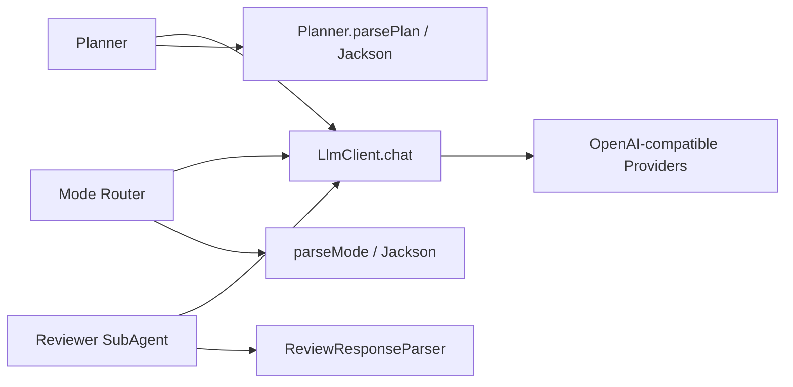
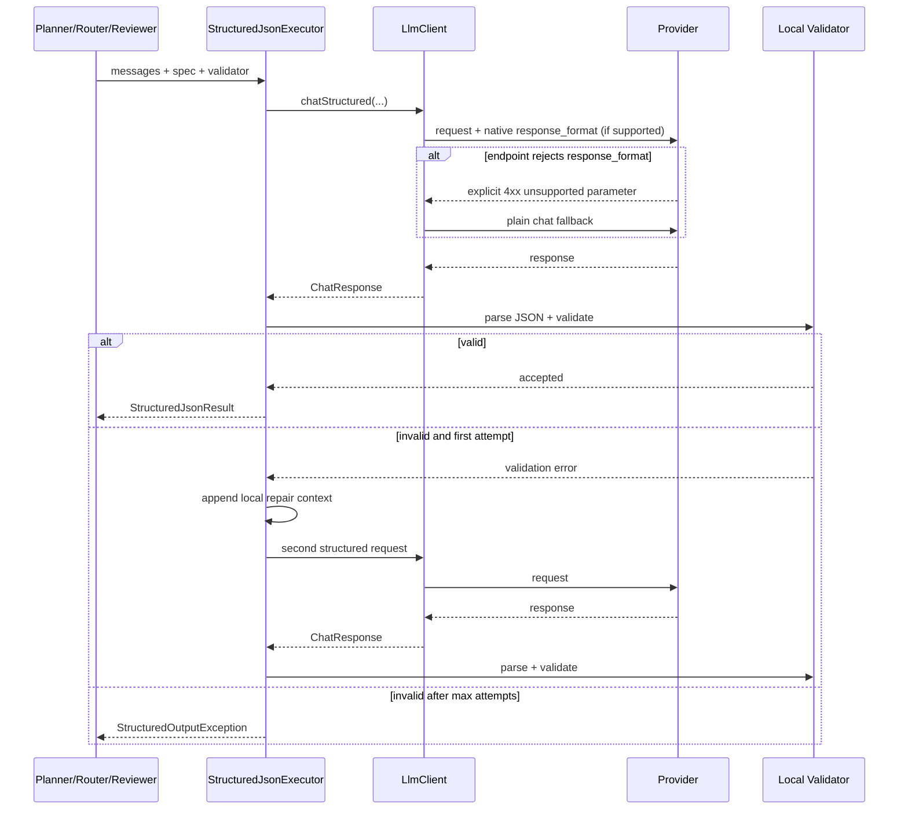

# Structured JSON Output 可靠性改造

> 状态：实现、静态审查与动态验证完成。GitHub Actions 临时验证 run `36737152077` 已通过针对性测试、quick 回归、全量测试、`mvn clean package` 与 `git diff --check`；临时验证 workflow 在验收后从功能分支删除。
>
> 基线：`main`
>
> 功能分支：`feat/structured-json-output-reliability`
>
> 本文是本次结构化 JSON 输出改造唯一的设计、实施与验收文档。

## 1. 背景、目标与非目标

### 1.1 背景

CodeAgent 当前有多处要求 LLM 返回 JSON：

- `Planner`：返回 Plan DAG。
- `ExecutionModeRouter`：返回 `{"mode":"react|plan"}`。
- Reviewer：返回 `approved/summary/issues/suggestions`。

现状主要依赖 Prompt 中“只输出 JSON”以及调用点各自的 Jackson 解析。该方案能阻止一部分非法结果进入业务层，但存在四个问题：

1. 生成阶段没有统一利用 Provider 原生 JSON/Structured Output 能力。
2. JSON 解析失败后，各调用点的行为不一致：Planner 抛错，Router 直接降级，Reviewer 甚至保留文本关键词 fallback。
3. 语法合法但字段缺失、额外字段、枚举非法等结构问题没有统一的 bounded repair/retry。
4. JSON fence 清理、错误提示、重试上限等逻辑分散，后续新增结构化调用容易重复实现。

### 1.2 目标

本次改造目标：

1. 在 LLM 层增加统一的 structured-output contract，不在 Agent/Planner 中直接拼 Provider HTTP 参数。
2. 按 Provider 能力分级使用原生输出约束：
   - `JSON_SCHEMA`：Provider 支持 Chat Completions JSON Schema 时发送 schema。
   - `JSON_OBJECT`：Provider 仅支持 JSON mode 时发送 `{"type":"json_object"}`。
   - `NONE`：不发送 Provider 特有参数，继续依赖 Prompt。
3. 增加统一的 `StructuredJsonExecutor`：对模型结果执行 JSON 语法解析 + 调用点业务校验；失败后最多进行一次格式修复重试（总尝试 2 次）。
4. Planner、Mode Router、Reviewer 都接入同一执行器。
5. 保留调用点既有业务语义：
   - Planner 仍进行 Task 类型、资源声明、依赖 DAG 等校验。
   - Router 只接受单字段 `mode` 且值为 `react|plan`。
   - Reviewer 无法得到合法结构时 fail-closed，而不是依赖自然语言关键词猜测通过。
6. Provider 原生 structured-output 参数不被某个兼容网关接受时，安全退回普通 Chat 请求，再由本地校验与有限重试兜底。
7. 不让格式重试扩大工具、URL、路径或 HITL 权限；结构化调用仍是无工具/原有工具暴露语义。

### 1.3 非目标

本次不做：

- 不切换 Provider 到新的 Responses API。
- 不引入第三方 JSON Schema validator 依赖。
- 不改变 Plan DAG 持久化 schema。
- 不改变 ReAct 普通自然语言回答。
- 不为工具参数 JSON 增加新的重试机制；tool call 仍由现有 ToolRegistry/Policy 路径处理。
- 不保证所有第三方 OpenAI-compatible 自定义 base URL 都支持 `response_format`。
- 不无限重试，也不让 malformed JSON 触发新的工具调用。

## 2. 现状分析（源码证据、已知约束）

### 2.1 架构位置

当前链路：



现有 `LlmClient` 只有普通 `chat(...)`，`AbstractOpenAiCompatibleClient.buildRequestBody(...)` 不接收 response-format contract。

### 2.2 当前调用点行为

#### Planner

Prompt 给出完整 JSON 示例并要求“只输出 JSON”。`Planner.parsePlan` 会：

1. 去掉可选 Markdown fence。
2. `ObjectMapper.readTree`。
3. 构造 `ExecutionPlan`。
4. 规范化资源声明。
5. 计算拓扑顺序并拒绝循环依赖。

非法 JSON 直接抛 `IOException`，没有格式修复重试。

#### Mode Router

`ExecutionModeRouter.parseMode` 要求：

- 根节点必须为 object。
- 只能有一个字段。
- 字段必须是字符串 `mode`。
- 值只能是小写 `react` / `plan`。

任何非规范结果直接 fallback ReAct。

#### Reviewer

`ReviewResponseParser` 优先解析 JSON，但解析失败时会尝试通过“通过/合格/不通过”等关键词猜测审核结论。该逻辑无法证明模型遵守 JSON contract，且自然语言歧义可能让解析层承担不必要的语义推断。

### 2.3 Provider 能力差异

截至本次实现调研：

| Provider | 当前 CodeAgent 协议 | 原生结构化输出策略 |
|---|---|---|
| Hunyuan / TokenHub | OpenAI Chat Completions | `JSON_SCHEMA` |
| DeepSeek | OpenAI Chat Completions | `JSON_OBJECT` |
| StepFun | OpenAI Chat Completions | `JSON_OBJECT` |
| GLM | OpenAI-compatible | 本次保守为 `NONE` |
| Kimi | OpenAI-compatible | 本次保守为 `NONE` |
| FreeLlmApi | 自定义兼容网关 | `NONE` |
| Xfyun MaaS | OpenAI-compatible | `NONE` |
| Agnes | OpenAI-compatible | `NONE` |

能力只表示 CodeAgent 本次有足够证据可安全发送的协议，不表示 Provider 永久能力上限。

## 3. 方案设计

### 3.1 接口与数据结构

新增 LLM 层 contract：

```java
enum StructuredOutputCapability {
    NONE,
    JSON_OBJECT,
    JSON_SCHEMA
}

record StructuredOutputSpec(
    String name,
    JsonNode schema,
    boolean strict
) {}
```

`LlmClient` 新增：

```java
default StructuredOutputCapability structuredOutputCapability();

default ChatResponse chatStructured(
    List<Message> messages,
    List<Tool> tools,
    StructuredOutputSpec spec,
    StreamListener listener);
```

默认实现退回普通 `chat`，因此非 OpenAI-compatible client 和测试 stub 不需要强制修改。

`AbstractOpenAiCompatibleClient` 统一负责把 contract 映射到请求体：

- `JSON_SCHEMA`：
  `response_format = {"type":"json_schema","json_schema":{"name":...,"strict":...,"schema":...}}`
- `JSON_OBJECT`：
  `response_format = {"type":"json_object"}`
- `NONE`：不发送 `response_format`。

Provider 自定义 `customizeRequestBody` 仍在统一 response-format 注入后执行，避免 Agent 层拼 HTTP。

### 3.2 StructuredJsonExecutor

新增：

```text
src/main/java/com/codeagent/llm/StructuredJsonExecutor.java
```

职责：

1. 调用 `chatStructured`。
2. 解析完整 `response.content`。
3. 可按调用点设置是否接受 Markdown JSON fence。
4. 运行调用点提供的 deterministic validator。
5. 第一次失败时，把“上一输出 + 精简错误 + 只返回满足 contract 的 JSON”放入仅本次请求的 repair context。
6. 最多 2 次总尝试；仍失败则抛 `StructuredOutputException`。
7. repair context 不写入 Parent Session、长期记忆或工具权限来源。

接口形态：

```java
StructuredJsonResult execute(
    LlmClient client,
    List<LlmClient.Message> messages,
    List<LlmClient.Tool> tools,
    StructuredOutputSpec spec,
    boolean allowMarkdownFence,
    JsonValidator validator,
    StreamListener listener)
```

返回已经解析验证过的 `JsonNode` 和最终 `ChatResponse`，避免调用点再次解析相同文本。

### 3.3 调用点 contract

#### Mode Router

Schema：

```json
{
  "type": "object",
  "properties": {
    "mode": {"type": "string", "enum": ["react", "plan"]}
  },
  "required": ["mode"],
  "additionalProperties": false
}
```

本地 validator 与现有严格语义一致。第一次 malformed response 允许一次 repair；两次都失败才按现有安全策略 fallback ReAct。

#### Planner

Schema 对齐当前 prompt 的 Plan 结构。根对象的 `summary` / `tasks` 与每个 Task 的 `id` / `description` 必须存在；为保持已有 legacy planner JSON 兼容性，`type`、`dependencies`、resources、acceptanceCriteria、requiredEvidence 继续允许省略，其中缺失 `type` 保守回退为 `ANALYSIS`。字段一旦出现则必须满足对应类型约束。

本地 validator / decoder 负责：

- root/object 与非空 tasks/array 基础结构。
- task id/description 非空、id 唯一；type/dependencies 出现时类型正确，显式未知 type 拒绝并触发 repair。
- dependency 必须引用已存在 Task，循环依赖拒绝。
- 现有 `TaskResourceClaims.normalize` 继续校验资源声明；`computeExecutionOrder()` 继续做 DAG 不变量校验。

结构修复失败才向上抛 `IOException`。

#### Reviewer

Reviewer schema：

```json
{
  "type": "object",
  "properties": {
    "approved": {"type": "boolean"},
    "summary": {"type": "string"},
    "issues": {"type": "array", "items": {"type": "string"}},
    "suggestions": {"type": "array", "items": {"type": "string"}}
  },
  "required": ["approved", "summary", "issues", "suggestions"],
  "additionalProperties": false
}
```

Reviewer 仍不使用工具。无法在两次尝试内产生合法结构时返回 `UNAVAILABLE/REJECTED` 的既有安全边界，不再把无法解析的自然语言关键词解释成批准。

### 3.4 Provider 参数不兼容时的降级

某些用户会把 `HUNYUAN_BASE_URL` / `STEP_BASE_URL` 等指向第三方兼容网关。Provider 类名不能证明实际 endpoint 支持 native structured output。

因此 `AbstractOpenAiCompatibleClient.chatStructured`：

1. 先按 capability 发送 native `response_format`。
2. 若收到明确的 4xx 参数不支持错误，且错误文本指向 `response_format/json_schema`，只对本次结构化调用退回普通请求。
3. 认证失败、限流、5xx、上下文超限等不按“格式能力不支持”降级，继续走现有 `LlmRetryPolicy`。
4. 退回普通请求后仍必须通过本地 parser + validator。

### 3.5 核心时序



### 3.6 策略、安全、并发与恢复

- Structured JSON repair 是同一 LLM 操作的 bounded retry，不创建新顶层 Turn。
- repair prompt 只描述格式错误，不携带新的 URL、文件路径授权或工具权限。
- Router / Planner / Reviewer 本来就不依赖工具；本改造不增加工具 exposure。
- 不把 malformed output 当成业务数据写入 PlanStateStore。
- Planner 只有在得到合法 `ExecutionPlan` 后才进入既有 durable save gate。
- Reviewer 解析失败不允许通过确定性证据门禁。
- retry 次数固定有界，避免 malformed 输出导致无上限 token 消耗。

### 3.7 兼容性、迁移与回滚

- `LlmClient` 新接口均为 default method，现有实现二进制/源码改动面最小。
- 不修改持久化格式和 Session event schema。
- Provider 不支持 structured output 时仍可使用原有 Prompt contract。
- 关闭本功能不需要数据迁移；回滚代码即可。
- Planner 继续允许 Markdown fence 作为兼容输入，但 native JSON mode 正常不会产生 fence。
- Router 保持不接受 fence 的 canonical contract；第一次不规范会 repair，而不是直接接受。
- Reviewer 删除自然语言关键词“批准”fallback，这是有意的安全收紧。

## 4. 实现任务与测试矩阵

### 4.1 实现任务

1. LLM contract
   - `StructuredOutputCapability`
   - `StructuredOutputSpec`
   - `LlmClient.chatStructured`
2. OpenAI-compatible request mapping
   - JSON object / schema request body
   - unsupported response_format plain fallback
3. `StructuredJsonExecutor`
   - parse
   - local validation
   - bounded repair retry
4. Mode Router 接入
5. Planner 接入
6. Reviewer 接入并移除关键词批准 fallback
7. 文档同步：`AGENTS.md`、`docs/agents-reference.md`、`README.md`

### 4.2 测试矩阵

| 层 | 场景 | 预期 |
|---|---|---|
| Executor | 首次合法 JSON | 1 次调用 |
| Executor | 首次 malformed，第二次合法 | repair 后成功 |
| Executor | 语法合法但 validator 拒绝，第二次合法 | repair 后成功 |
| Executor | 连续两次非法 | 抛 StructuredOutputException |
| Provider | JSON_OBJECT capability | 请求带 `response_format.type=json_object` |
| Provider | JSON_SCHEMA capability | 请求带 schema/name/strict |
| Provider | NONE | 请求不带 response_format |
| Provider | endpoint 明确拒绝 response_format | 同次操作 plain fallback |
| Router | extra field / fence / uppercase mode | repair；耗尽后 ReAct fallback |
| Planner | malformed JSON 后修复 | 最终构造 Plan |
| Planner | 非法 task type / tasks 非 array | repair 或失败 |
| Reviewer | 合法 approved true/false | 保持结论 |
| Reviewer | 自然语言“合格”但非 JSON | 不再直接批准 |
| Reviewer | 首次 malformed 第二次合法 | repair 后使用结构化结论 |

### 4.3 验证命令

针对性：

```bash
mvn test -DskipTests=false \
  -Dtest=StructuredJsonExecutorTest,StructuredOutputRequestTest,ExecutionModeRouterTest,PlannerTest,ReviewResponseParserTest,SubAgentStepReviewerTest
```

回归：

```bash
mvn test -Pquick
mvn test -DskipTests=false
mvn clean package
git diff --check
```

## 5. 验收清单

- [x] LLM 层存在统一 structured-output contract。
- [x] Provider 能力按 NONE / JSON_OBJECT / JSON_SCHEMA 分级。
- [x] Hunyuan 使用 JSON Schema；DeepSeek/Step 使用 JSON Object。
- [x] 未验证 Provider 不盲目发送 response_format。
- [x] endpoint 只有明确不支持 structured output 参数时才安全退回 plain chat；schema 自身校验错误不会被误判为能力缺失。
- [x] Planner / Router / Reviewer 共用 bounded structured JSON retry。
- [x] 最大结构化输出尝试次数为 2，不存在无限格式重试。
- [x] malformed 输出不会进入 Plan 持久化或被 Reviewer 当成批准。
- [x] Router 最终失败仍 fallback ReAct。
- [x] Reviewer 自然语言关键词不再绕过 JSON contract。
- [x] 不改变工具权限、URL authority、HITL 和持久化 schema。
- [x] 针对性测试通过（GitHub Actions run `36737152077`）。
- [x] quick 回归通过（GitHub Actions run `36737152077`）。
- [x] 全量测试通过（GitHub Actions run `36737152077`）。
- [x] package 通过（GitHub Actions run `36737152077`）。
- [x] `git diff --check` 通过（GitHub Actions run `36737152077`）。
- [x] 实施结果和已知限制回填本文。

## 6. 实施记录与验证边界

### 6.1 已实施

实现按边界拆为少量可审计提交：

- `629455e`：新增本设计文档。
- `3e0385d`：加入 LLM structured-output contract、Provider request mapping、native 参数不兼容回退和 `StructuredJsonExecutor`。
- `9fdf86c`：Planner / Mode Router / Reviewer 接入统一结构化执行器，并收紧 Reviewer fail-closed 语义。
- `1d1781d`：补充 Provider capability 声明测试，防止未验证 Provider 被误设为原生 structured output。
- `2359724`：收紧 native fallback 判定，并让 Planner 显式未知 task type 进入 repair，而不是静默降级。
- `f2dfaa3`：同步 README、AGENTS、架构参考与本文实施/验证状态。

实现后的数据流为：

```text
Prompt contract
    ↓
LlmClient.chatStructured
    ├─ verified provider → native json_object / json_schema
    └─ unsupported/none  → plain chat
    ↓
StructuredJsonExecutor
    ↓
Jackson 单 JSON 文档解析
    ↓
调用点 deterministic decoder / business invariants
    ├─ valid → 进入 Router / Plan / Reviewer 业务层
    └─ invalid → 最多一次局部 repair → 仍失败则安全终止/降级
```

格式 repair 只在当前 LLM 操作的 request-local messages 中追加 invalid response 与格式纠正提示，不写 Parent Session，不改变 Tool exposure、URL authority、路径权限或 HITL 状态。为避免把无效 JSON 暴露成用户可见结果，structured executor 只向原 listener 透传 reasoning delta，不流式透传尚未验证的 content；最终有效内容仍作为 `ChatResponse` 返回业务层。

### 6.2 已完成的静态审查

已逐项复核：

- `LlmClient` 新 API 均为 default method，未要求所有现有 Provider/测试 stub 强制实现。
- `AbstractOpenAiCompatibleClient` 普通 `chat` 路径仍走原请求体；只有 structured 调用且 capability 非 `NONE` 时增加 `response_format`。
- native structured 参数只有明确的 4xx unsupported/unknown parameter 才降级 plain chat；认证、限流、5xx、上下文超限和 schema 本身无效仍沿用原错误/retry 语义。
- Router 的 canonical contract 仍拒绝额外字段、大小写枚举和 Markdown fence；区别仅是先允许一次 repair。
- Planner 保留缺失 `type` → `ANALYSIS` 的 legacy 行为；显式未知 type、重复 Task id、未知依赖和 malformed dependency 都会确定性拒绝并触发 repair。
- Reviewer 不再通过自然语言“通过/合格”等关键词推断批准；连续结构化失败进入原有 `ERROR → UNAVAILABLE` 路径。
- 未修改 Session/Plan 数据库 schema、工具权限链或持久化格式。
- 对分支相对 `main` 的 23 个变更文件逐一做文本静态检查：未发现 Git 冲突标记、行尾空白、空文件或缺失末尾换行。

### 6.3 动态验证结果

由于当前交互运行环境无法直接拉取 GitHub 仓库执行 Maven，本次在功能分支临时加入仅该分支触发的 GitHub Actions workflow 完成真实构建验证。第一轮验证暴露 Reviewer 兼容性回归：旧 Reviewer contract 允许只返回 `approved + issues`，而初版实现把 `summary/suggestions` 也设为必填，导致多余 repair 消耗测试预设响应。修正为“`approved` 必填，其余字段可选但出现时类型必须正确”后重新执行验证。

最终 GitHub Actions run `36737152077` 结果：

```text
Targeted tests   success
Quick regression success
Full tests       success
Package          success
Diff check       success
```

实际执行命令：

```bash
mvn test -DskipTests=false \
  -Dtest=StructuredJsonExecutorTest,StructuredOutputRequestTest,ExecutionModeRouterTest,PlannerTest,ReviewResponseParserTest,SubAgentStepReviewerTest
mvn test -Pquick
mvn test -DskipTests=false
mvn clean package
git diff --check origin/main...HEAD
```

其中最终 diff check 使用完整 checkout（`fetch-depth: 0`）确保 `origin/main` 可见。临时 `.github/workflows/structured-json-verify.yml` 仅用于本次验收，验证完成后从功能分支删除，不进入最终合并内容。
