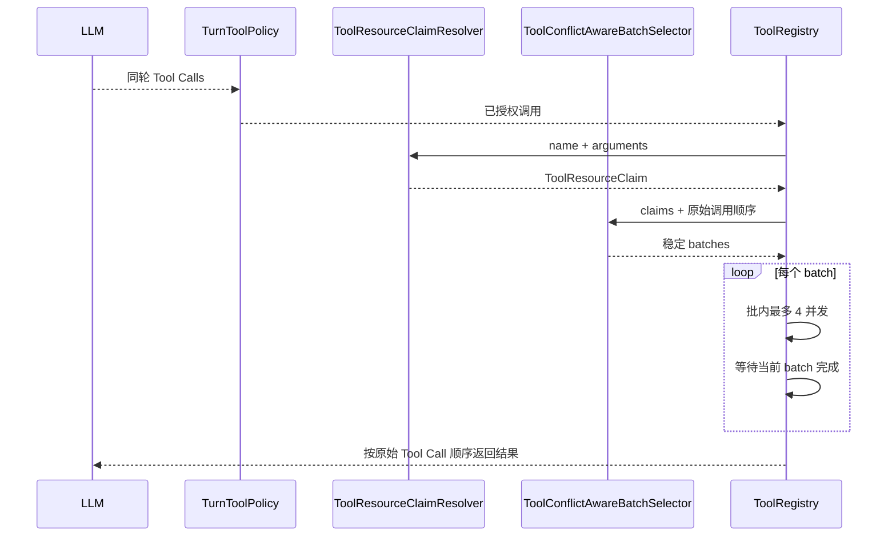

# ReAct 同轮工具资源冲突调度

## 1. 背景、目标与非目标

### 背景

当前 `ToolRegistry.executeTools()` 对同一轮 LLM 返回的多个非 Browser 工具调用直接放入固定线程池并发执行，最多 4 个；结果按原始 tool call 顺序回传。Browser 批次已有整批串行保护。

Plan-and-Execute 路径已经通过 `TaskResourceClaims` + `ConflictAwareBatchSelector` 在 DAG Task 级别避免读写资源冲突，但 ReAct 的 Tool Call 不携带 Planner 生成的 `resources` 声明，因此不能直接复用“由 LLM/Planner 声明资源”的方式。

这会产生一个现实风险：同一轮如果模型同时生成 `write_file(A)` 与 `read_file(A)`、两个重叠路径写入，或 `execute_command` 与文件读写，它们会并行进入执行区，可能观察到中间态或相互覆盖。

### 目标

1. 在 Tool Call 真正执行前，由本地代码根据 `tool name + arguments` 确定性推导资源 claim，不增加任何 LLM 调用。
2. 对能精确判断的文件工具使用路径级 READ/WRITE claim；对无法静态确定影响范围的命令工具采用保守 workspace claim。
3. 将同轮调用切分为稳定、顺序保持的 conflict-aware batches；批内最多 4 并发，批间串行。
4. 保持 ToolExecutionResult 的原始 tool call 顺序、现有取消语义和现有 Browser 整批串行语义。
5. 对资源推导失败采取 fail-safe 降级：读工具扩大为 workspace read，写工具扩大为 workspace write，而不是让调度依赖模型猜测。

### 非目标

- 不做 Shell 命令静态分析，不尝试从 `mvn test` / `python script.py` 精确推导文件集合。
- 不修改 MCP 协议，也不要求第三方 MCP Server 提供资源元数据。
- 不把 ReAct Tool Call 改造成新的 DAG。
- 不改变 Plan Task 的 `TaskResourceClaims` 数据模型。

## 2. 现状分析（源码证据、已知约束）

### 2.1 架构位置

当前核心路径：

- `TurnToolPolicy` 负责授权、URL、路径作用域和 HITL 前置策略。
- `ToolRegistry.executeTools()` 负责同轮 Tool Call 的实际调度。
- 非 Browser 多调用当前统一通过 `ExecutorService.invokeAll(...)` 并发。
- `PathGuard.resolveSafe()` 已能把项目相对路径解析成规范化、安全绝对路径，并拒绝越界/符号链接逃逸。
- Plan 层的 `ConflictAwareBatchSelector` 已验证“写写冲突、写读冲突、目录/子路径重叠、workspaceWrite 独占”这一资源冲突模型。

### 2.2 数据/状态模型

新增 Tool 层本地资源模型：

```text
ToolResourceClaim
- readPaths: List<Path>
- writePaths: List<Path>
- workspaceRead: boolean
- workspaceWrite: boolean
- exclusiveResources: Set<String>
```

资源来源不是 LLM 声明，而是 `ToolResourceClaimResolver` 根据实际 Tool Call 参数推导。

首版内置工具映射：

| Tool | Claim |
|---|---|
| read_file(path) | READ(path) |
| write_file(path) | WRITE(path) |
| list_dir(path) | READ(path subtree) |
| glob_files(path) | READ(path subtree)，默认 path=. 时 WORKSPACE_READ |
| grep_code(path) | READ(path subtree)，默认 path=. 时 WORKSPACE_READ |
| search_code | WORKSPACE_READ |
| execute_command | WORKSPACE_WRITE |
| create_project(name) | WRITE(name subtree) |
| revert_turn | WORKSPACE_WRITE |
| web_search / web_fetch | none |
| load_skill | exclusive: skill-context |
| save_memory | exclusive: long-term-memory |
| browser_connect / browser_disconnect / browser_status | exclusive: browser-session |
| mcp__*（非 Browser） | exclusive: mcp-external |
| 未知非 MCP 名称 | none（实际执行仍会按原逻辑返回 TOOL_NOT_FOUND） |

Browser MCP 仍由现有 `TurnToolPolicy.isBrowserToolName(...)` 检测并走整批串行，不在本次行为变更中放宽。

### 2.3 核心时序与失败路径



资源推导失败时不阻断工具本身：

- 只读文件类工具路径无法安全解析：退化为 `workspaceRead=true`。
- 写入类工具路径无法安全解析：退化为 `workspaceWrite=true`。
- 实际 PathGuard/Policy 拒绝仍发生在原来的工具执行阶段，保持错误类型与审计行为不变。

## 3. 方案设计

### 3.1 接口与数据结构

新增：

- `com.codeagent.tool.ToolResourceClaim`
- `com.codeagent.tool.ToolResourceClaimResolver`
- `com.codeagent.tool.ToolConflictAwareBatchSelector`

`ToolResourceClaimResolver` 不调用 LLM，只读取 Tool Call 的 JSON 参数。文件路径统一复用当前 `PathGuard` 规范化，不复制另一套路由/安全校验逻辑。

冲突规则：

1. `workspaceWrite` 与任何 workspace read/write claim 冲突。
2. `workspaceRead` 与任意路径写或 `workspaceWrite` 冲突。
3. 路径 WRITE/WRITE 冲突。
4. 路径 WRITE/READ 冲突。
5. 路径重叠包括同一路径、祖先/后代路径，以及指向同一物理文件的硬链接；物理身份检查失败时保守判为冲突。
6. 相同 `exclusiveResources` 冲突。
7. READ/READ 不冲突。

### 3.2 策略、安全、并发与恢复

采用“稳定前缀 batch”而不是跳过中间冲突项去挑后续调用：

```text
write A
read A
write B
```

调度为：

```text
Batch 1: write A
Batch 2: read A + write B   (二者资源不冲突)
```

这样后续调用不会越过前面的冲突调用，避免改变 tool call 的可观察顺序语义。

对于：

```text
write A
write B
```

如果路径不重叠则同批并发。

调度只选择当前就绪的首批；每批完成后按当前文件系统状态重新解析剩余调用，避免前一批命令创建链接或改变路径拓扑后沿用旧 claim。

需要人工审批且可能修改参数的调用保守独占一个执行批次。审批得到最终参数后执行，完成后才继续后续调用，因此把 `write A` 改成 `write B` 不会与相邻 `read B` 竞争。HITL 未启用或工具/Server 已自动放行时，继续使用正常的资源冲突并发调度；不会预先批量审批，也不会重复询问。

若组批后自动批准被撤销或 HITL 被启用，工作线程发现需要审批但当前处于并行批次时失败关闭并记录 AuditLog，不在并行区进入可改参审批；重新发起调用后按最新状态独占审批。资源调度只协调当前 executeTools 调用，不提供外部进程文件锁；资源解析计入总预算，但同步文件系统查询不是可强制中断的硬截止。

统一 `web_search` / `web_fetch` 的独占判定同时查看当前路由的实际 MCP 后端及其审批缓存；需要内部 MCP 审批时，顶层 Web 调用也独占批次。Step 自动搜索路由与显式 MCP 配置均不因并行标识误拒绝正常审批，仍保留拒绝不得换通道的规则。

对于：

```text
read A
execute_command("mvn test")
```

`execute_command` 使用 `WORKSPACE_WRITE`，因此分批串行。

多 batch 继续共享一次 `executeTools` 的总 batch timeout 预算，避免因拆批把原本单个超时窗口放大为 N 倍。

### 3.3 兼容性、迁移与回滚

- 不修改 Tool Call JSON 协议。
- 不修改 LLM Prompt，不增加 token 成本。
- 不改变工具返回结构。
- Browser 批次行为不变。
- Plan DAG Task 级资源调度不变；Plan Task 内部同样通过统一 `ToolRegistry.executeTools()` 获得更细粒度的同轮保护。
- 回滚只需移除新增 claim/scheduler，并恢复 `executeTools()` 原非 Browser 并发路径。

## 4. 实现任务与测试矩阵

1. 先增加行为测试，证明当前冲突工具会错误并发：
   - 同一路径 `write_file + read_file` 必须串行。
   - `execute_command + read_file` 必须串行。
   - 不同路径 `write_file + write_file` 仍应并发。
   - 结果顺序保持原 Tool Call 顺序。
2. 增加 `ToolResourceClaim` 和 `ToolResourceClaimResolver`。
3. 增加 `ToolConflictAwareBatchSelector`，实现路径重叠与稳定前缀 batching。
4. 重构 `ToolRegistry.executeTools()` 使用批次调度并共享总 timeout deadline。
5. 同步 `AGENTS.md` 的工具并发约束。
6. 验证：
   - `mvn test -Dtest=ToolResourceSchedulingTest,ToolResourceClaimResolverTest,ToolConflictAwareBatchSelectorTest,ToolRegistryTest`
   - `mvn test -Pquick`
   - `git diff --check`（如执行环境可用）

## 5. 验收清单

- [x] 不新增任何资源判断 LLM 调用。
- [x] 文件路径 claim 来自 Tool Call 参数并经过 PathGuard。
- [x] 同路径写读、重叠路径写写不会并发。
- [x] `execute_command` / `revert_turn` 不与 workspace 文件访问并发。
- [x] 不同路径写入仍可并发。
- [x] 只读调用仍可并发。
- [x] 未知 MCP 默认保守串行外部副作用。
- [x] Browser 原整批串行语义不回退。
- [x] 返回结果保持原 tool call 顺序。
- [x] 取消和 timeout 行为无回归。


## 6. 实施记录

- 已增加 `ToolResourceClaim`：Tool 层独立资源模型，不反向依赖 Plan 包。
- 已增加 `ToolResourceClaimResolver`：只读取工具名和实际 JSON 参数；文件路径复用 `PathGuard`，不增加 LLM 调用。
- 已增加 `ToolConflictAwareBatchSelector`：稳定前缀分批，不允许后续调用越过前面的冲突调用。
- `ToolRegistry.executeTools()` 保留 Browser 整批串行；非 Browser 调用按资源分批，批内最多 4 并发，多个批次共享原有 batch timeout 总预算。
- README 与 AGENTS.md 已同步新的同轮工具并发语义。


## 7. 验证结果

GitHub Actions 临时分支验证 run `36745940725`（完成后临时 workflow 从最终树删除）：

- `mvn -B test -Dtest=ToolResourceSchedulingTest,ToolResourceClaimResolverTest,ToolConflictAwareBatchSelectorTest,ToolRegistryTest`：通过。
- `mvn -B test -Pquick`：通过。
- `git diff --check origin/main...HEAD`：通过。
- Actions 最终状态：`completed / success`。

验证覆盖了同路径 write/read 串行、command 与 workspace read 串行、目录读与后代写串行、不同路径写并发、稳定分批顺序、资源 claim 推导，以及原 ToolRegistry 回归测试。Browser 仍沿用原整批串行分支；取消与 timeout 由既有 ToolRegistry 回归和 quick suite 共同覆盖。
