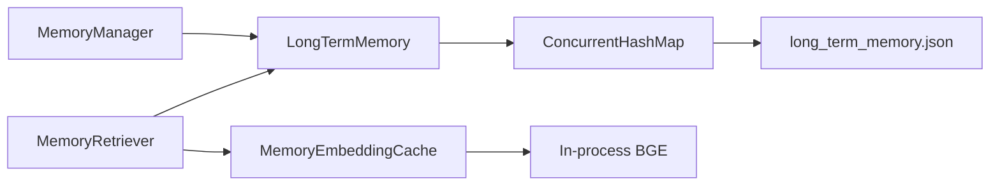
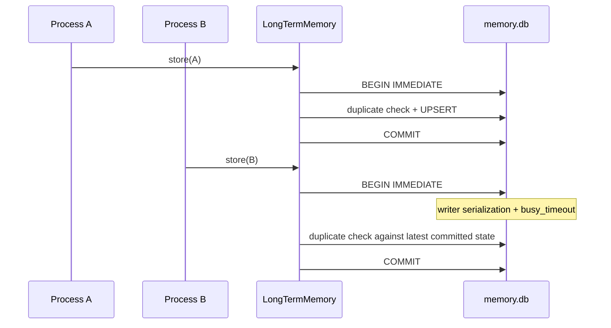

# 长期记忆 SQLite 持久化

## 1. 背景、目标与非目标

### 背景

当前 `LongTermMemory` 以 `~/.codeagent/memory/long_term_memory.json` 作为唯一事实源。进程启动时整文件加载到 `ConcurrentHashMap`，`store/confirm/supersede/delete/clear` 最终都会重新序列化全部条目，再通过临时文件 + rename 覆盖正式 JSON。

该实现适合单进程、小规模记忆，但存在两个已确认的结构性限制：

1. 写放大：任意单条变更都会重写整个 JSON 文件，写成本随长期记忆总量增长。
2. 多进程一致性：每个 JVM 都持有独立内存快照，两个进程先后覆盖同一 JSON 时可能发生 last-writer-wins / lost update；Java `synchronized` 与 `ConcurrentHashMap` 只能保护单 JVM。

语义检索使用的 `MemoryEmbeddingCache` 当前只保存进程内 BGE embedding。本任务只迁移长期记忆事实源，不持久化 embedding，也不改变混合检索与时间衰减算法。

### 目标

1. 将长期记忆唯一事实源迁移为 `~/.codeagent/memory/memory.db`。
2. 每条 `MemoryEntry` 独立持久化为一行，单条新增、更新、删除不再重写全部长期记忆。
3. 使用 SQLite WAL、busy timeout 与写事务解决多进程写入覆盖问题；`SUPERSEDE` 必须在同一事务内完成旧条目失效 + 新条目创建。
4. 保持现有 `LongTermMemory` 对外 API、scope、active/superseded、lastConfirmedAt、token count、词法检索与 MemoryRetriever 行为。
5. 首次升级时自动一次性导入旧 `long_term_memory.json`，迁移成功后 SQLite 成为唯一事实源。
6. 保持 `MemoryEmbeddingCache` 为可重建的进程内派生缓存，不在本任务新增向量表。

### 非目标

- 不新增 HNSW/IVF/ANN 等向量索引。
- 不把长期记忆 embedding 写入 SQLite。
- 不修改 `MemoryRetriever` 的 lexical/BGE 权重、阈值或 0.6 衰减下限。
- 不修改 `MemoryWriteResolver` 的 CREATE / DUPLICATE / SUPERSEDE 判定协议。
- 不把 Memory 数据与 Plan/RAG 数据库合并；长期记忆继续使用独立数据库文件。
- 不引入新的数据库依赖；复用现有 `org.xerial:sqlite-jdbc`。

## 2. 现状分析（源码证据、已知约束）

### 2.1 架构位置

当前数据流：



现有关键行为：

- `LongTermMemory(File)` 在构造时读取全部 JSON。
- `storeIfNovel` 先在当前进程 Map 中做 deterministic duplicate 判断，再整体保存。
- `confirm` 与 `supersede` 会在持久化失败时回滚当前进程内存状态。
- `getActiveVisible` 为 `MemoryRetriever` 提供 scope 可见的 active 记忆。
- `MemoryEmbeddingCache` key = memory id + content hash + embedding space，只存在当前 JVM 内存。
- SQLite JDBC 已是项目现有依赖，RAG 已采用 `WAL + busy_timeout=5000`。

### 2.2 数据/状态模型

新增 SQLite 文件：

```text
~/.codeagent/memory/memory.db
```

主表：

```sql
CREATE TABLE long_term_memories (
    id                TEXT PRIMARY KEY,
    content           TEXT NOT NULL,
    type              TEXT NOT NULL,
    scope             TEXT NOT NULL,
    project_key       TEXT,
    status            TEXT NOT NULL,
    created_at        TEXT NOT NULL,
    last_confirmed_at TEXT NOT NULL,
    supersedes        TEXT,
    superseded_by     TEXT,
    token_count       INTEGER NOT NULL,
    metadata_json     TEXT NOT NULL,
    canonical_content TEXT NOT NULL,
    updated_at        TEXT NOT NULL,
    version           INTEGER NOT NULL DEFAULT 0
);
```

核心生命周期字段提升为列，是因为它们参与过滤、事务和唯一性控制；完整 metadata 仍保留在 `metadata_json`，读取时由结构化列覆盖核心字段，保证现有 `MemoryEntry.getMetadata()` 语义。

额外维护：

```sql
CREATE TABLE memory_meta (
    key   TEXT PRIMARY KEY,
    value TEXT NOT NULL
);
```

用于记录 schema 版本与 legacy JSON 迁移状态。

确定性 duplicate 继续使用 `MemoryDeduplicator.canonicalize`。数据库增加 active 域唯一约束：

- global：`type + canonical_content`
- project：`type + project_key + canonical_content`，仅 project_key 非空时生效

与现有行为一致：缺失 project key 的 project-scope 记忆不做确定性去重。

### 2.3 核心时序与失败路径



不再存在“两个 JVM 各自持有完整事实快照并整体覆盖文件”的写路径。

`SUPERSEDE`：

```text
BEGIN IMMEDIATE
  SELECT old active memory
  validate same domain / replacement id
  UPDATE old -> superseded
  INSERT replacement -> active
COMMIT
```

任一步失败则 ROLLBACK，旧条目不会留下半失效状态。

## 3. 方案设计

### 3.1 接口与数据结构

保留 `LongTermMemory implements Memory`，对调用方不引入新接口迁移成本。内部改为：

```text
LongTermMemory
    |
    +--> SqliteLongTermMemoryRepository
             |
             +--> memory.db
```

新增：

- `SqliteLongTermMemoryRepository`：负责 schema、连接配置、查询、事务写入、legacy JSON 迁移。
- `LongTermMemorySemantics`：集中 active/superseded、scope、lastConfirmedAt 与 metadata 复制规则，避免 SQLite Repository 和 facade 各自复制一套生命周期逻辑。

`LongTermMemory` 不再持有完整 `ConcurrentHashMap` 作为事实源。所有读取以 SQLite 当前状态为准，因此同一进程中的多个实例和不同 JVM 都能观察到其他已提交写入。

连接策略采用“每个公开操作获取独立 JDBC Connection，用完关闭”，避免给现有 `LongTermMemory` 增加必须显式 close 的生命周期约束。初始化时配置：

```sql
PRAGMA foreign_keys=ON;
PRAGMA journal_mode=WAL;
PRAGMA busy_timeout=5000;
```

普通连接至少设置 `foreign_keys` 与 `busy_timeout`。

### 3.2 策略、安全、并发与恢复

#### 写事务

所有会改变长期记忆事实源的操作使用 `BEGIN IMMEDIATE`，在读取当前状态前先获得 SQLite writer reservation：

- `storeIfNovel`
- `confirm`
- `supersede`
- `delete`
- `clear`

这样 deterministic duplicate 的“检查 + 写入”在跨进程场景也是单一原子区间，而不只是 JVM 内的 `synchronized`。

数据库层 partial unique index作为第二道防线，避免两个写者留下两个 active exact-duplicate。

#### 读取

`retrieve/getAll/getActiveVisible/getByType/size/getTokenCount` 都直接查询 SQLite，不维护需要跨进程失效的全量 Map cache。

`MemoryRetriever` 仍调用 `getActiveVisible(projectKey)`，因此上层检索算法无需修改。

#### 持久化失败

SQLite 是唯一事实源后，不再先改内存再尝试落盘，因此不存在“方法返回成功但进程重启后数据消失”的 Map/磁盘分叉。写事务失败时回滚并返回失败；`storeIfNovel` 的 duplicate 与写失败都会保持数据库不变，错误会记录日志。

#### Embedding

`MemoryEmbeddingCache` 完全不改：

```text
memory.db -> MemoryEntry text
               |
               v
      MemoryEmbeddingCache
               |
         missing only -> BGE
```

embedding 仍是可重建派生数据，不属于本次事实源迁移。

### 3.3 兼容性、迁移与回滚

#### Legacy JSON 一次性迁移

启动时初始化 schema 后检查 `memory_meta.legacy_json_migration`：

1. 已有迁移标记：不再读取 legacy JSON。
2. 无标记且 `long_term_memory.json` 不存在：写入 `absent` 标记。
3. 无标记且 JSON 存在：
   - 完整解析 legacy JSON；
   - 在单个 SQLite 写事务中导入合法条目；
   - 写入 `migrated` 标记；
   - COMMIT 后尝试把旧文件重命名为 `long_term_memory.json.migrated.bak`。

若 JSON 解析或数据库导入失败，不写迁移完成标记，启动失败或保持可重试状态，不能静默切换到空数据库。

迁移只导入文本、metadata、生命周期与 token 计数，不生成 embedding。

#### 兼容语义

- legacy 无 `scope` 继续视为 global。
- legacy 无 `status` 继续视为 active。
- legacy 无/非法 `lastConfirmedAt` 继续回退 creation timestamp。
- superseded 历史仍保留并计入 `size/tokenCount`，普通 retrieval 只看 active。
- 相同 id 的新内容继续允许替换原行，与旧 Map `put(id,...)` 行为一致。

#### 回滚

代码回滚前，SQLite 中的新写入不会自动回写旧 JSON，因此如果确实需要降级到旧版本，应先提供/执行显式 SQLite -> JSON 导出；本任务不把双写作为常态，因为双写会重新引入跨事实源一致性问题。

## 4. 实现任务与测试矩阵

1. 先补行为测试：
   - 两个 `LongTermMemory` 实例先后写不同条目，最终两条都保留，证明不再 lost update。
   - 两个实例并发写 exact duplicate，只保留一条 active 事实。
   - `SUPERSEDE` 事务后旧条目 superseded、新条目 active。
   - fresh directory 只创建 `memory.db`，不再写新的 `long_term_memory.json`。
   - legacy JSON 自动迁移且只执行一次，迁移后重新打开数据库数据一致。
2. 新增 SQLite Repository 与生命周期语义 helper。
3. 重构 `LongTermMemory` 只通过 Repository 读写，不保留事实 Map。
4. 保持 `MemoryRetriever` / `MemoryEmbeddingCache` 接口和算法不变。
5. 同步 `AGENTS.md`、README 与本文档实施记录。
6. 验证：
   - `mvn test -Dtest=LongTermMemoryTest,MemoryManagerTest,MemoryRetrieverTest,MemoryWriteResolverTest,MemoryEmbeddingCacheTest`
   - `mvn test -Pquick`
   - `git diff --check origin/main...HEAD`

## 5. 验收清单

- [ ] 长期记忆唯一事实源为 `memory.db`。
- [ ] 单条写入不再整体重写全部长期记忆。
- [ ] 两个独立 `LongTermMemory` 实例不会互相覆盖已提交写入。
- [ ] exact duplicate 的检查 + 写入具备跨进程原子性。
- [ ] `SUPERSEDE` 在单个 SQLite transaction 内完成。
- [ ] WAL 与 busy timeout 已配置。
- [ ] 旧 JSON 可一次性迁移且失败时不会静默丢数据。
- [ ] scope/status/lastConfirmedAt/supersede 兼容原语义。
- [ ] `MemoryEmbeddingCache` 仍仅为进程内缓存。
- [ ] 不新增 embedding 表或向量索引。
- [ ] Memory targeted tests、quick regression 与 diff check 通过。

## 6. 实施记录

待实现后补充。

## 7. 验证结果

待实现后补充。
