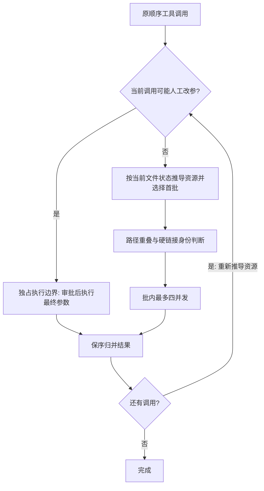

# 运行时一致性修复

## 1. 背景、目标与非目标

修复 main@9860e60 文档 32–34 对应功能审查中已复现的缺口：记忆写入失败假成功、审批改参后的资源竞争、Planner 字段校验不足、迁移去重断链与确认时间丢失、硬链接冲突漏判，并同步相关文档。

非目标：后台任务队列、真实用户数据迁移操作、DNS 环境修复、全局串行化、架构重构、提交或推送。所有数据测试使用临时目录。

## 2. 现状分析（源码证据、已知约束）

### 2.1 架构位置

- MemoryWriteResolver 空域分支忽略 storeIfNovel 返回值；SQLite 写入失败仍可返回 CREATED。
- ToolRegistry 预先计算所有批次，HitlToolRegistry 执行前才取得人工修改后的参数。
- ToolConflictAwareBatchSelector 只比较路径字符串，不能识别硬链接。
- Planner 的 asText 和数组解析容忍错误类型，使验收条件与证据要求静默丢失。
- SqliteLongTermMemoryRepository 迁移直接跳过重复 active 条目，不重映射生命周期关系，不合并确认时间。

### 2.2 数据/状态模型

保持现有 ToolInvocation、ToolExecutionResult、Plan 和 SQLite schema；不新增持久化格式。迁移采用临时 ID 映射，去重后的关系引用必须指向保留条目；确认时间取重复集合的最新值。

### 2.3 核心时序与失败路径



## 3. 方案设计

### 3.1 接口与数据结构

- 记忆空域与普通 CREATE 使用统一写入结果处理：成功才 CREATED；失败重新查找确定性重复并确认，否则明确失败。
- HITL 可改参调用保守独占，而不是提前批量询问用户或重复审批；已自动批准/无需审批的普通工具仍保持冲突感知并发。调度每完成一批后重新推导剩余资源，避免命令改变路径拓扑后使用旧 claim。
- 批次执行上下文标识是否并行；组批后审批缓存撤销或 HITL 启用导致重新需要审批时，在并行区失败关闭并审计，重新发起调用再独占审批，不冻结旧授权绕过撤销。
- 统一 Web 调用的审批隔离须使用实际 MCP 后端身份，兼容 Step 自动搜索与显式 MCP 搜索/抓取，不绕过审批或用 fallback 消除拒绝。
- 路径字面重叠检测之后，对现存路径检查物理文件身份；无法确定身份时保守冲突。
- Planner 对已出现的字段执行类型、枚举、对象属性校验；保留文档 32 允许省略的 legacy 字段，不静默丢弃非法证据要求。
- 迁移先选择重复条目的保留 ID、合并确认时间，再重写 supersedes/supersededBy，最后在现有事务内导入并设置迁移标记。
- 多个不同有效历史目标无法无损合并时明确回滚并保留原 JSON；当前执行批次不提供跨进程文件锁，同步文件身份查询没有硬中断保证。
- 数据库与 legacy 来源出现同 ID 时明确冲突回滚，不用旧快照覆盖数据库事实与确认时间；不自动修复输入自身既有悬空引用。

### 3.2 策略、安全、并发与恢复

不改变 TurnToolPolicy → HITL → ToolRegistry → PathGuard/CommandGuard 授权链；审批不得扩大原有策略权限。取消、超时、Browser 整批串行和结果原顺序不变。迁移失败不提交完成标记，数据库写失败不产生成功响应。真实用户 JSON/SQLite 不读取、不复制。

### 3.3 兼容性、迁移与回滚

不新增依赖或数据库 schema。已迁移数据库不自动重放 legacy JSON；本修复只改善首次迁移，已存在的断链需要另行审计与用户确认恢复。保留 legacy Planner 的可省略字段，但已出现的非法类型明确拒绝。

## 4. 实现任务与测试矩阵

每项先补测试并记录预期失败，再实现最小修复。任务之间禁止并发运行 Maven，以免共享 target 互相覆盖。

- [x] Memory：锁超时不得 CREATED；空域并发重复应确认已存条目；迁移重复链重映射并保留最新确认时间。MemoryWriteResolverTest、LongTermMemoryTest。
- [x] Planner：数字 id/description、非法数组/元素/枚举、资源字段类型和未知属性拒绝；legacy 字段省略兼容。PlannerTest、StructuredJsonExecutorTest。
- [x] Tool：审批改参写 B 后读取 B 必须看到新值；硬链接读写/写写串行而读读可并行；每批重新解析资源。HitlToolRegistryTest、ToolConflictAwareBatchSelectorTest、ToolRegistryTest。
- [x] 文档：同步 32 的 Reviewer 必填字段与 Planner 校验、33 的审批边界与硬链接、34 的迁移规则、agents-reference 的 SQLite 事实源。
- [x] 集成验证：针对性测试、mvn test -Pquick -DskipTests=false、mvn test -DskipTests=false、git diff --check 已执行；quick/full 因既有环境 DNS 用例失败，未全绿，详见下方验证记录。

## 5. 验收清单

- [x] 五个代码缺口有回归测试，已观察修复前失败、修复后通过。
- [x] 权限不扩大、读写结果保序、最多四并发、Browser 行为不变。
- [x] 迁移保持事务原子性、关系完整性和确认时间语义（不修复输入既有悬空引用，歧义或同 ID 冲突失败关闭）。
- [x] 文档与源码契约一致，无无关变更、secret 或 raw session。
- [x] 记录真实验证命令、结果和环境限制，保留未提交变更。

方案评审：用户已确认定点修复并要求开始修改；相较全局串行，审批边界独占牺牲少量待审批调用的并行度，但无需拆分授权/执行流程，避免重复审批和审批后参数的 TOCTOU 竞争。测试运行仍需区分环境 DNS 故障与功能回归。

### 5.1 实施与复审记录

分支：`fix/runtime-consistency`，基线 `9860e60`。实现与验证阶段未提交；用户随后明确授权提交，不推送、不合并。

- Tool 初始 RED：改参读旧值、硬链接漏判、前批创建链接后旧 claim，共 3 项全部失败；修复后通过。
- Planner 初始 RED：61 项、37 失败、0 错误，拒绝测试未抛异常、repair 丢失 TEST 证据；修复后 61 项全部通过。
- Memory 初始 RED：44 项、5 失败、0 错误，锁超时假成功、并发重复假 CREATE、错误确认未存条目、迁移确认时间与链关系丢失；修复后通过。
- 独立复审补充并复现审批缓存撤销（1 项失败），修复为并行区失败关闭；统一 Web 的内部 MCP 审批（3 项失败），修复为根据实际后端身份隔离。
- 独立复审补充并复现数据库/legacy 同 ID 覆盖（2 项失败），修复为写入前明确冲突回滚。不同有效历史关系歧义、迁移异常与重试、六种输入排列、重复集合交叉引用均有测试。
- 工具、Planner、Memory 分别独立复审；跨模块最终复审未发现剩余阻断性问题。静态复审不替代下方运行时证据。

### 5.2 最终验证（2026-10-03，Windows / JDK 17）

所有 Maven 命令在以下环境执行：

```powershell
$env:JAVA_HOME='C:\Program Files\Java\jdk-17'
$env:Path="$env:JAVA_HOME\bin;$env:Path"
```

| 命令 | 结果 |
|---|---|
| `mvn test -DskipTests=false "-Dtest=HitlToolRegistryTest,ToolRegistryTest,ToolConflictAwareBatchSelectorTest,ToolResourceClaimResolverTest,TurnToolPolicyTest,ApprovalPolicyTest,WebToolBackendRouterTest"` | 128 项，0 失败，0 错误，0 跳过，exit 0 |
| `mvn test -DskipTests=false "-Dtest=PlannerTest,StructuredJsonExecutorTest,StructuredOutputRequestTest,ExecutionModeRouterTest,ReviewResponseParserTest,SubAgentStepReviewerTest"` | 96 项，0 失败，0 错误，1 跳过，exit 0 |
| `mvn test -DskipTests=false "-Dtest=MemoryWriteResolverTest,LongTermMemoryTest,MemoryManagerTest,MemoryRetrieverTest"` | 74 项，0 失败，0 错误，0 跳过，exit 0 |
| `mvn test -Pquick -DskipTests=false` | 1262 项，1 失败，0 错误，4 跳过，exit 1 |
| `mvn test -DskipTests=false` | 1321 项，1 失败，0 错误，10 跳过，exit 1 |
| `mvn package -DskipTests` | BUILD SUCCESS，exit 0；此命令不运行测试，不能代替上两项验证 |
| `git diff --check` | 通过；Git 仅提示 LF/CRLF 转换 |

quick 和 full 唯一失败均为未修改的 `NetworkPolicyTest.allowsPublicHttps:58`：Java 无法解析 `example.com`，与修复前全量失败相同。没有禁用该测试、替换网络策略或把环境失败伪装为通过。全量跳过 10 项包含真实 Provider usage 契约条件未启用、Windows 排除的 stdio 测试以及已有禁用的 legacy 测试，不代表这些路径已验证。

最新打包产物为 `target/codeagent-1.0-SNAPSHOT.jar`，构建保留原有 Shade 重复资源警告；测试日志在忽略的 `target/review-probes/` 下，未加入版本控制。

### 5.3 交付限制

- 已迁移数据库不自动重放 legacy JSON，已有断链/确认时间丢失需用户确认后单独恢复。
- 不同有效历史目标或跨来源同 ID（即使内容相同）会阻止迁移并回滚，需显式处理冲突后重试。
- 只协调当前 executeTools 批次，不提供外部进程文件锁；同步文件身份查询不能保证硬截止。
- 未修改后台任务队列、DNS 环境、真实用户 Memory 或 raw session；提交仅按用户明确授权执行，不推送、不合并。
