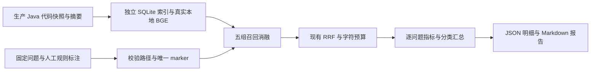

# 真实仓库 RAG 离线评测

文档编号接续目录中现有的 35；本文件是本任务唯一的设计与实施文档。

## 1. 背景、目标与非目标

用户已认可上一轮提出的真实仓库离线评测方案，并要求完成测试。本任务增加可复现的检索评测，不调参、不修改生产排序、不调用远程 Embedding 或付费 LLM。最终回答正确率不等同于检索精确率，除非另行指定模型和评分规则，不在此次检索实验中报告。

目标：72 个固定问题（60 个单证据、6 个多证据、6 个无答案），另设 6 个独立纯符号关系探针；覆盖真实生产 Java 代码，报告 P@5、标注证据 Recall@5/10、Hit@1/5/10、MRR@10、折扣证据覆盖分、完整标注证据命中率、无结果率、无答案误返回率和暖流水线 P50/P95。对比词法、语义、词法+语义、词法+Graph 和完整三路。

## 2. 现状分析（源码证据、已知约束）

### 2.1 架构位置

`DefaultCodeRetrievalService` 组装 Term FTS、Graph、Semantic，随后调用 `RetrievalFusion` 和 `RetrievalBudget`。测试直接复用这些组件组合消融组，并与生产 service 对照；不增加生产配置或工具入口。原 `RetrievalQualityTest` 只有五个合成文件，按预期文件命中计算名为 recallAt5 的指标，不能代表真实库。

### 2.2 数据/状态模型

语料为当前工作树 `src/main/java` 下所有 Java 文件，保持仓库相对路径，复制至 target 下快照目录。不索引 docs、测试、评测问题或用户数据，防止答案泄漏。快照文件 SHA-256 清单与总摘要、数据集摘要、Git HEAD、模型空间、预算、计时参数进入报告。SQLite 和报告只写 target；报告不保存完整源码或返回片段正文，仅保存固定标注短语、位置及摘要。

每个问题包含 id、category、query、evidence 列表。每条证据由路径、源码 marker、requiredText 标识；marker 必须唯一存在于该文件。只有返回的正文同时包含 marker 和全部 requiredText 实现语句才算找到证据；仅文件名、签名或 class chunk 的大行号范围不能算命中。一个返回片段可以覆盖多条证据，重复片段不能重复增加证据召回或折扣覆盖分。关键语句证明有限的实现证据被返回，不证明完整答案成立。

### 2.3 核心时序与失败路径



索引、向量或 stage 降级导致实验失败，禁止默默将降级结果当真实语义组。质量数值允许低于预期；质量测量与功能回归通过分开解释。

## 3. 方案设计

### 3.1 接口与数据结构

新增 test-only `RetrievalEvaluationMetrics`、其单测、数据集契约测试、显式启用的 `RepositoryRetrievalEvaluationTest` 及固定 JSON 问题集。通过 `-Drag.repository.eval=true` 启用重实验，日常 quick 不重建完整向量。

P@5 = 前五条中包含任一标注证据的片段数 / 5（短列表空位计零）；Recall@K = 找回的不同标注证据数 / 该问题标注证据总数；Hit@K = 是否找到任一证据；MRR@10 为首条相关片段的倒数排名。折扣证据覆盖分 = `sum(该排名首次找到的证据数 / log2(rank+1)) / 标注证据总数`，自然处于 [0,1]，这是自定义指标，**不是 nDCG**。未构建穷尽片段相关度 qrels，因此不报告标准 nDCG。无答案问题不进入正例指标，单独统计是否返回任何片段；返回片段不等同于模型幻觉。

这些是基于有限标注的指标：其他合理实现片段可能未被标注，P@5 是保守口径，Recall 是标注证据召回，不能称所有相关代码的穷尽召回。数据集由实现知情者构造，不是独立用户随机样本；同主题问法相互相关，不能直接推断线上表现。

TopK=10、maxChars=16000；P/Recall/Hit@5 使用同一 Top10 响应前缀，因此是 Top10 请求下的 prefix 指标。每组每题先预热一次，再测三次串行查询；质量指标使用第一次测量，计时统计所有三次。这是 `StageRunner -> Fusion -> Budget` 组件流水线时延，未含 service 锁、诊断构建、模型加载与索引耗时，不能称用户端到端时延；生产 service 对照在计时外。固定组顺序也限制严格性能比较。单独报告建库耗时。不调权重、不划出虚假的独立调参集；本次固定数据集建立基线，未来优化需新增隐藏测试集。

### 3.2 策略、安全、并发与恢复

仅本地模型和可提交生产代码；没有 Agent 工具、HITL 或 URL 权限变化。所有实验串行，五组独立执行真实召回，不复用预计算 query 向量来美化时延。工作目录与索引独立，复跑按源码 hash 增量回填。

### 3.3 兼容性、迁移与回滚

生产行为不变，无迁移。删除新增测试与数据集即可回滚。首次运行可能较慢；报告保留机器/JDK 信息和模型空间，性能数字仅代表该机器串行暖查询。

## 4. 实现任务与测试矩阵

### 4.1 实现前方案自审

已确认：只增加 test-only 组件和文档；依赖方向为测试 → 已有 RAG 组件，不引入生产反向依赖；源码快照隔离数据集防止泄漏；所有 stage 降级均使实验失败；生产全组与独立组装结果逐题比较；指标不设置人为及格线。Graph 当前以完整 query 匹配符号，因此主集自然语言及带类名的方法问法可能没有 Graph seed；每题记录 seed 数与实际 stage 候选数，并另设纯符号关系探针验证激活路径。探针不混入主集汇总。

### 4.2 任务与验证

- [x] 先写指标单测：多证据、重复、截断正文、短列表、空结果、无答案、排名截断；运行观察缺少指标实现导致编译失败，再实现。
- [x] 构造并校验 72 条固定用例：20 个主题各三种问法、6 个跨模块问题、6 个不存在能力问题。
- [x] 实现独立生产源码快照、真实建库、五组消融、生产路径一致性检查、逐题 JSON 和 Markdown 汇总。
- [x] 执行指标/数据集/真实评测针对性测试；执行现有 RAG 回归及 `mvn test -Pquick`（quick 存在一项已复现的环境失败，见下文，未宣称全绿）。
- [x] 运行 `git diff`、`git diff --check`，同步本文件结果、面试口径和失败样例。

### 4.3 实施记录

分支从最新 origin/main 的 c60f41e 创建为 `test/rag-repository-evaluation`，不使用 worktree，不提交或推送。新增指标测试首次因缺少 `RetrievalEvaluationMetrics` 实现而失败；实现后 `mvn test -DskipTests=false "-Dtest=RetrievalEvaluationMetricsTest,RepositoryEvaluationDatasetTest"` 运行 6 项测试，0 失败、0 错误、0 跳过。

完整实验在 Windows PowerShell 下必须给含点的 Maven 参数加引号：`"-Drag.repository.eval=true"`。未加引号的初次命令被 shell 拆成生命周期参数，未运行实验；修正后建立 368 个 Java 文件、3,226 个 chunk 的独立索引。

只读评审发现签名命中可能掩盖正文截断、原排序覆盖分不应叫 nDCG、Graph 主集可能不激活。这些结论已核对生产源码与真实 SQLite 数据，修订为关键实现语句校验、自然有界的折扣证据覆盖分及独立探针。问题原文未按测量结果改写；修订的是标注判定口径，首轮结果保留在 `target/rag-evaluation/initial-results.json`，不能与最终口径直接混算。修订公式前两项指标单测按新期望失败，修订后 7 项指标/数据契约测试通过。报告增加内容摘要/字符数/marker 偏移，以及 `IN_PROGRESS/COMPLETE`、实际行数与完成模式，便于核查完整性且不复制源码正文。

### 4.4 最终实验结果（2026-10-06）

实验已完成 390 条逐题结果：78 题 × 5 组，每组每题预热一次、测量三次。主集仍为 72 题，其中 66 个正例用于质量汇总、6 个无答案问题单独统计；6 个关系探针另表统计。最后一次重跑质量指标与前一次修订后实验一致。

环境：Windows 11 amd64，Java 17.0.12，8 个可用逻辑处理器。本地 `bge-small-zh-v1.5-q`、512 维、artifact revision `1.18.0-beta28`。源码基线 `c60f41e8795258c0fc2ed18c443df94e0ab42647`，368 个 Java 文件、3,226 个 chunk。源码总摘要 `a55c320f0e9897b1115dcdde4e8ee798c59300c12f0716f42370a7c5acd1fe4c`；最终数据集摘要 `d8f32af0a6e1e91337955e9aa522aafe7adcb948c7563dda1a78dd4f96021f1f`。首轮从空库建索引约 92.53 秒；最终复跑复用向量，增量检查约 1.23 秒。不能将缓存检查时间称首次建库时间。

以下均为主集指标；P95 是最后一次单机串行暖组件流水线测量：

| 组别 | P@5 | 标注 Recall@5 | 标注 Recall@10 | Hit@5 | MRR@10 | 暖流水线 P95 |
|---|---:|---:|---:|---:|---:|---:|
| 词法 | 6.06% | 30.30% | 30.30% | 30.30% | 0.2121 | 1.80 ms |
| 语义 | 0.61% | 3.03% | 6.06% | 3.03% | 0.0246 | 75.10 ms |
| 词法 + 语义 | 6.36% | 31.82% | 33.33% | 31.82% | 0.2247 | 75.59 ms |
| 词法 + Graph | 6.06% | 30.30% | 30.30% | 30.30% | 0.2121 | 3.54 ms |
| 三路融合 | 6.36% | 31.82% | 33.33% | 31.82% | 0.2247 | 91.00 ms |

每个单证据问题通常只标注一个方法，在固定返回五条时，即使唯一相关方法排第一，P@5 也是 20%。未标注但合理的代码片段按零处理，因此这里的 P@5 是严格保守的标注片段精确率，不能当作“回答准确率 6.36%”。标注 Recall 和 Hit 更适合说明能否定位到目标实现。

三路融合分类：

| 分类 | 正例数 | Hit@5 | 标注 Recall@10 | 解释 |
|---|---:|---:|---:|---|
| 带类名的方法/精确符号 | 20 | 20/20 | 100% | Top-1 仅 10/20；类头或其他方法仍可能排在前面 |
| 中文语义问法 | 20 | 1/20 | 10% | Top-10 找回 2 个预期实现 |
| 中文改述问法 | 20 | 0/20 | 0% | 当前样本未找回标注实现 |
| 跨模块问题 | 6 | 0/6 | 0% | 未找回标注的成组实现证据 |

主集 72 题中 Graph 非空种子数为 0/72，Graph 候选非空数为 0/72，故不能用主集消融评价 Graph 被激活后的贡献。独立 6 个探针全部得到去重后的非空种子和 Graph 候选（6/6），完整融合找回调用者证据 4/6，但这些命中的 sources 都只有 FTS_TERMS，未观察到 Graph 提供有效实现证据的收益。

6 个无答案问题：包含语义的三组均返回片段 6/6，词法与词法+Graph 为 0/6。已核对 `SqliteRetrievalIndex.searchVector` 为所有可用向量按 cosine 排序并取 Top-K，没有相关度拒答阈值；这解释为何“有返回”不等于“有答案”。这里只测检索返回，未测模型是否会拒答或产生幻觉。

### 4.5 失败案例与源码解释

| 问题 | 标注目标 | 三路融合首条返回 |
|---|---|---|
| 请求发送前如何预测上下文 token 用量？ | ContextTokenTracker.predict | MemoryQueryTokenizer.java |
| 读写文件时如何拦住跑到仓库外面的路径？ | PathGuard.resolveSafe | McpClient.java |
| 检索结果如何按 TopK 和字符预算截断？ | RetrievalBudget.apply | LspDiagnosticFormatter.java |
| 多种检索结果如何合并排名并控制最后发给模型的文本大小？ | RetrievalFusion + RetrievalBudget | CenterPane.java |

已验证的源码行为：

- `SqliteRetrievalIndex.ftsMatch` 把所有规范化词用 AND 连接；主集中文长问句的 FTS 结果多为空，符号问法全部能定位。词法回归成功不代表原始自然语言查询能召回。
- `GraphRetriever` 把完整 query 用于 `searchSymbols`，主集未形成 seed；纯符号探针能形成 seed，但候选不一定带有效正文。
- 针对 PathGuard 的真实 SQLite 关系行显示 calls 的 from_symbol_id 落到 FILE 节点，而 FILE 节点没有正文 chunk。`CodeAnalyzer` 输出 `Class.method` 调用者，`IndexCoordinator.findSymbol` 的 key 来自带方法声明的 chunk 名；无法匹配时回退 fileSymbolId。`searchRelations` 又按 from_symbol_id 获取正文，因此出现关系存在但正文为空。此为当前已观察到的链路缺口，未在本评测任务修改生产实现。
- 语义向量全量遍历再排序，没有拒答阈值；真实本地模型在本题集中文问法到代码的相关排序较弱，这是测量结果。具体原因可能包含模型、输入拼接、分块与语料语言差异，尚未通过独立消融归因，不能只断言换模型即可解决。

后续建议（本次未实施）：优先验证查询关键词提取/词法匹配策略、Graph caller 到 symbol 的映射和正文回传，再用新隐藏测试集比较语义输入/模型及候选重排。不得只根据本题集改权重然后宣称泛化收益。

### 4.6 运行命令与验证证据

在 Java 17 环境中从仓库根目录执行；Windows PowerShell 保留含点参数的引号：

```powershell
# 指标与数据集契约：最终 7 项通过
mvn test -DskipTests=false "-Dtest=RetrievalEvaluationMetricsTest,RepositoryEvaluationDatasetTest"

# 重实验及最终校验：8 项通过，390 行完整报告
mvn test -DskipTests=false "-Dtest=RepositoryRetrievalEvaluationTest,RetrievalEvaluationMetricsTest,RepositoryEvaluationDatasetTest" "-Drag.repository.eval=true"

# RAG/工具针对性回归（包含重实验）：74 项通过，无失败、错误或跳过
mvn test -DskipTests=false "-Dtest=RepositoryRetrievalEvaluationTest,RetrievalEvaluationMetricsTest,RepositoryEvaluationDatasetTest,RetrievalQualityTest,RetrievalFusionTest,SqliteRetrievalIndexTest,DefaultCodeRetrievalServiceTest,RetrieverStageIsolationTest,LexicalTextNormalizerTest,GraphRetrieverTest,SemanticRetrieverTest,CodeSearchServiceArchitectureTest,CodeSearchGoldenSetTest,ToolRegistryTest" "-Drag.repository.eval=true"

# 常规回归：1309 项，1 项失败、0 错误、5 跳过
mvn test -Pquick

git diff --check
```

quick 唯一失败为未修改的 `NetworkPolicyTest.allowsPublicHttps`，原因是 Java 无法正常解析 `example.com`；单独复跑同一用例仍失败，系统 `Resolve-DnsName example.com` 返回 `0.0.0.0/::`。不修改生产安全策略或无关测试来掩盖这个环境问题。`src/main/java` 与该测试文件的 git diff 为空。quick 初次 1308 项、修订后 1309 项，唯一失败相同；增加的一项为“方法签名存在但关键正文缺失不得命中”的单测。

本任务未运行全项目全量 suite 或 package：没有生产变更，已执行 RAG/工具针对性回归和所需 quick；不得称全项目测试全部通过。`git diff --check` 通过，新增文件另检查尾随空白与文件末尾换行。target 报告被 `.gitignore` 忽略，未提交 .env、secret 或会话数据。

结果文件：`target/rag-evaluation/results.json` 为含源码清单摘要、参数、逐题排名及证据命中信息的完整记录；`target/rag-evaluation/report.md` 为汇总。最后一轮日志 `verified-evaluation.log`，74 项回归日志 `final-evaluation.log`，quick 日志 `final-quick.log`，均在同一 target 目录。

### 4.7 面试口径

可以如实回答：“我建立了真实仓库生产 Java 语料的离线检索评测：368 个文件、3,226 个代码片段，72 道主集问题和 6 个独立关系探针，对比五组召回。当前三路融合的标注证据 Recall@5 为 31.8%、Recall@10 为 33.3%；带符号问题 Hit@5 为 100%，但中文改述和跨模块问题仍有明显缺口。测试还发现自然语言不能激活图种子、关系节点到正文映射和无答案返回控制需要改善。结果是固定题集上的检索指标，不是最终回答正确率；我没有用五文件合成样例的 100% 来代表真实质量。”

## 5. 验收清单

- [x] 无 mock Embedding、无原始 session/secret、无测试问题进入语料。
- [x] 所有 marker 与关键语句经源码契约校验，报告可复跑，原始逐题结果在 target。
- [x] 质量问题如实报告，未修改排序使本数据集过拟合。
- [x] 完成真实命令验证，提交状态保持未提交；quick 的唯一环境失败已明确披露。
