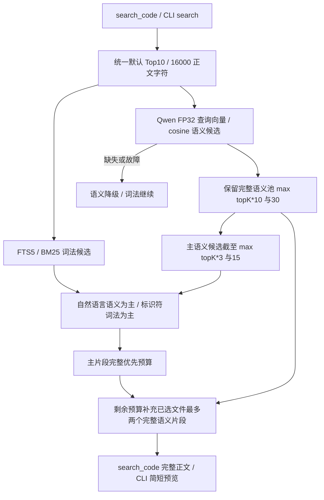

# RAG 完整优化过程记录：从基线评测到 Qwen 生产接入

记录日期：2026-10-07。生产代码参考提交：`c630038`，分支：`feat/qwen3-embedding-hybrid-retrieval`。

本文件接续目录中最新的 36 号文档。用户明确要求单独记录完整过程，因此按“一项任务一份文档”的用户指定例外新增本文件。原始设计与实验记录仍保留在 [36 号真实仓库评测文档](36-rag-repository-evaluation.md) 和 [26 号 Qwen 迁移文档](26-qwen3-embedding-migration.md)，本文件按实际执行顺序整理操作、效果、取舍及证据，不重写历史报告。

## 1. 背景、目标与非目标

最初问题是：项目的 RAG 在面试中可能被问到精确率和召回率，需要真实测试，而不能凭五个合成文件的测试推断整个仓库效果。真实评测发现语义召回很低，随后依次处理词法查询、Graph 参与方式、Embedding 模型、融合排序、字符预算和返回正文等问题。

目标是让读者能够回答每一轮“为什么改、改了什么、如何验证、产生了什么收益和代价”，并分清已进入生产的改动、仅用于诊断的实验和仍未解决的瓶颈。本次文档改动不调整生产代码、不重新标注题集、不重新执行昂贵的模型建库，也不新增模型依赖。范围包括从最初真实仓库基线到最终 Top10／16000 配置的完整 RAG 优化链路。

本记录的验收标准：主要指标可追溯；各轮比较的题集和预算明确；负实验和退化不遗漏；当前架构、模型安装与降级说明和源码一致；不把检索证据覆盖说成最终回答准确率。本轮只改本文档，不提交或推送，除非用户后续明确要求。

## 2. 现状分析与比较口径

### 2.1 当前架构位置

正式检索入口是 `ToolRegistry.search_code` 和 CLI `/search`，两者调用 `DefaultCodeRetrievalService`。词法层使用 SQLite FTS5 + BM25；语义层使用进程内 Qwen3-Embedding-0.6B FP32、1024 维向量与 cosine。两路结果经共同 `RetrievalPipeline` 执行融合、主片段预算和上下文补充。



生产接线证据：[EmbeddingProviderFactory](../../src/main/java/com/codeagent/rag/embedding/EmbeddingProviderFactory.java)、[Qwen3OnnxEngine](../../src/main/java/com/codeagent/rag/embedding/Qwen3OnnxEngine.java)、[RetrievalPipeline](../../src/main/java/com/codeagent/rag/RetrievalPipeline.java)、[RetrievalContextAssembler](../../src/main/java/com/codeagent/rag/RetrievalContextAssembler.java)、[ToolRegistry](../../src/main/java/com/codeagent/tool/ToolRegistry.java) 和 [Main](../../src/main/java/com/codeagent/cli/Main.java)。Graph 不再参与 RAG；符号/关系表仍用于结构地图及 `/graph`。长期记忆仍使用 BGE，没有随代码 RAG 隐式迁移。

### 2.2 语料、题集与状态模型

| 项目 | 固定口径 |
|---|---|
| 语料 | 368 个生产 Java 文件、3226 个 chunk 的冻结快照 |
| 索引内容 | 仅生产源码，不包含测试题、docs 或用户会话 |
| 语料 SHA-256 | `a55c320f0e9897b1115dcdde4e8ee798c59300c12f0716f42370a7c5acd1fe4c` |
| 首次评测 | 72 道主集：66 正例、6 无答案；另有6个关系探针 |
| 删除 Graph 后的共同题集 | 69 道主集：63 正例、6 无答案；另有6个调用者探针，总计75题 |
| 63 个正例组成 | 标识符19、语义描述19、同义改写19、跨模块6 |
| 常规比较参数 | Top10、16000 正文字符；每题每路预热一次、计时三次 |
| 后续补充题 | 预冻结12题，单独报告，不并入原63题宏平均 |

删除 Graph 时仅移除三个针对已删除类的问题，保留其余共同问题和实现证据。旧源码快照中的 Graph 文件仍在，以保持语料固定；因此数字表示对冻结快照的受控比较，不是每次代码变更后重新索引当前工作树的线上分数。

75题数据集的 Windows 原始字节 SHA-256 为 `842bf3544c7cb7367c496588ffb286674c65eeba51c6fd61ce12a7be35ca53e2`；同内容 Git LF 版本为 `bc2b39d219ae25dd34b06d6a4a3d75c4f20eb116a95d79fb07ef66ff9dfbd685`。这是换行差异，不得把两个哈希直接当作不同题集，也不得改写报告里的历史哈希。

### 2.3 指标与证据边界

- `Recall@K`：该问题返回正文中找回的不同标注证据数／标注证据总数，再对正例做宏平均。跨模块题可以为0、0.5或1。
- `P@5`：前五条中包含任一标注证据的结果数／5；短列表空位计零。相关代码标注不穷尽，因此不能解释成真实业务的所有相关片段精确率。
- `MRR@10`：首条相关结果的倒数排名，超过10或未命中计零。
- 无答案误返回：对6道无答案题单独统计是否返回任何候选，不纳入正例召回。返回候选不直接证明 Agent 最终会答错。
- 命中标准：正文同时含唯一源码 marker 与全部 requiredText 实现语句。文件名、签名或涵盖整类的大行号范围本身不能算完整证据。
- 追加上下文后，一条结果可以包含多个同文件 chunk；其正文证据覆盖可以提升，但不能把 P@5 的变化直接说成原始 chunk 排序精确率提升。

未测最终生成答案的正确率、线上真实用户分布和跨仓库泛化。题集由源码知情者构造，同主题问法相关；本记录不据此声称统计显著性。

## 3. 优化过程与方案决策

### 3.1 第0轮：建立真实仓库基线，先确认问题确实存在

**原因。** 原有质量测试只覆盖少量合成文件，无法回答真实仓库中中文问题能否找到 Java 实现。

**操作。** 新增指标与数据契约测试、固定问题集、源码快照、真实 BGE 建库、分路消融、JSON 明细和 Markdown 报告。最初指标实现缺失导致测试失败，随后实现。审查后强化正文关键语句判定，明确自定义折扣证据覆盖分不是 nDCG，另设 Graph 激活探针；首轮旧判定结果保留，不混用口径。

**效果。** 在最初66正例下：纯语义 Recall@10 为6.06%，词法30.30%，词法+语义33.33%，三路融合也为33.33%。主集72题没有任何 Graph seed；6个纯符号探针能激活 Graph，但未观察到 Graph 提供有效正文证据的收益。

**发现。** 中文长问句被全词 AND 限制；BGE 中文到代码排序较弱；关系映射存在 caller 落到 FILE 节点而正文为空的缺口；向量 TopK 没有拒答阈值。此时不能把所有原因归结为模型。

**验证与落地。** 最终390行结果完整（78题×5组），指标/题集与重实验8项通过。评测代码提交为 `8483ea4`。详细事实见36号文档第4.3—4.6节。

### 3.2 第1轮：删除 Graph 召回，修正词法查询和明显预算缺口

**原因。** 用户明确选择只保留语义、关键词两路，先修已发现的确定性问题，不同时换模型。

**操作。** 删除 Graph stage、来源枚举和融合图权重，但保留关系表、符号表、结构地图及 `/graph`；查询专用分词后过滤通用问句词；优先取 AND 全词候选，不足时补 OR 任一词候选，按 chunk 去重并限额。预算跳过空正文，长单行可按剩余字符截取，避免无有效完整行时中断。保留大写 ASCII 名称、独立名称和无参调用形式，修正 `A`、`Do`、`of()` 被停用词误吞的边界。

**效果。** 以下限定到共同63正例，不能和上一轮66正例总分直接相减：

| 路径 | Recall@10 前→后 | Recall@5 前→后 | MRR@10 前→后 |
|---|---:|---:|---:|
| 关键词 | 30.16%→36.51% | 30.16%→36.51% | 0.2143→0.2513 |
| BGE 纯语义 | 6.35%→6.35% | 3.17%→3.17% | 0.0258→0.0258 |
| 原三路→新双路 | 33.33%→38.10% | 31.75%→31.75% | 0.2275→0.2041 |

**代价与结论。** 双路 Recall@10 有提升，但 Recall@5 未变，MRR 下降；更多关键词候选挤掉部分靠前证据。词法无答案误返回从0/6升到6/6，双路仍为6/6。不能把 OR 候选增加说成全部指标改善。

**验证与落地。** 最初10项边界测试有5项失败，修复后通过，再补标识符和超过20个候选的限额/去重测试。固定语料与针对性84项通过，225行完整。生产修复提交 `719ca46`，后合入 main；详细证据见36号文档第4.8节。

### 3.3 第2轮：受控比较 BGE、Qwen INT8 与 FP32

**原因。** 词法修正后纯语义仍只有6.35%，需要测试26号迁移方案提出的 Qwen，先验证再生产替换。

**操作。** 创建实验分支，使用测试专用 JVM ONNX provider 和固定 revision/hash，不改变生产默认。Qwen query 使用固定英文软件工程检索 instruction，document 去掉 BGE 前缀；原分段、overlap和多段平均方式不变。每种模型/维度使用独立向量空间，四组都复用相同冻结语料、题集、融合和预算。

这里不是三个不同规模的 Qwen：测试的是旧 BGE 基线、Qwen INT8 的1024/512维配置，以及同一0.6B导出的 FP32 1024维。512维为完整输出前缀再归一化，不能减少完整模型推理。

| 配置 | 纯语义 Recall@10 | 旧融合双路 Recall@10 | 双路 MRR@10 |
|---|---:|---:|---:|
| BGE 512维 | 6.35% | 38.10% | 0.2041 |
| Qwen INT8 1024维 | 61.90% | 40.48% | 0.2487 |
| Qwen INT8 512维 | 56.35% | 38.89% | 0.2698 |
| Qwen FP32 1024维 | 67.46% | 38.89% | 0.2515 |

**一致性检查。** 六样本 INT8／FP32 向量 cosine 为0.855—0.924，未达到事前设定的每样本>0.95门槛。门槛未降低，随后补全 FP32 全库比较。这个失败不等于 INT8 完全无召回收益，也不等于已证明官方 PyTorch parity；对照来自同一社区 ONNX export。

**效果与结论。** Qwen FP32纯语义提高61.11个百分点，但旧双路只提高0.79个百分点。说明模型是原语义层的重要瓶颈，固定融合/预算又限制了模型收益。FP32 比 INT8 更高的纯语义质量也没有转化成更高的旧融合分数。

**验证。** 四组各225行，关键词对照逐字段一致；FP32纯语义相对BGE为40题提升、1题下降、22题相同。针对性41项通过，quick1323项、0失败/错误、8跳过。量化一致性单独1项失败，保留为负结果。实验代码后提交 `b319d8f`；原报告在 `target/qwen-evaluation/`，详见26号文档第10节。

### 3.4 第3轮：诊断“语义提升却被旧融合抵消”

**操作。** 核对旧 `RetrievalFusion`：RRF K=60，FTS权重1.2、semantic1.0，另有类型和多路加分、每文件最多3条；旧预算按排名消耗字符，遇截断即结束。

**证据。** 在类型因素相同、候选单路命中时，FTS前13名的分数仍高于semantic第1名；FP32有21道主集题在纯语义命中后被双路丢失证据。`tokens-semantic` 的 INT8 语义第5名命中，双路却只返回3条、15977字符；`parent-semantic` 语义第2名命中，双路有10条、8420字符仍未命中，证明不是所有损失都由字符预算造成。

**决策。** 不直接把semantic权重调大来追求题集分数。改用保留各路原排序的确定性交错，并一起修正明显预算阻塞。该轮是诊断，没有独立的新召回总分，不虚构拆分后的单项增益。

### 3.5 第4轮：Qwen 正式接入，融合和主片段预算修正

**生产接入操作。** 新增独立 `InProcessQwen3EmbeddingProvider`、`Qwen3OnnxEngine`，默认本地代码RAG走FP32 1024维。query适配为 `Instruct: ...\nQuery: ...`，document仅去掉既有前缀；last active token pooling、L2 normalize、有限值/维度检查进入正式实现。固定 artifact revision 为 `c25a394dd583836952667c12f008335071b3f43d`。

模型由 `scripts/install-qwen3-model.ps1` 校验后预装，支持下载或复制既有实验文件；默认目录 `~/.codeagent/models/qwen3-embedding-0.6b/<revision>`，可用 `EMBEDDING_LOCAL_MODEL_DIR` 指定。JAR包含实现和native依赖，不包含约2.41GB权重，运行时不自动下载。缺失、校验或推理失败仅降级语义层；显式local provider=bge可回滚。向量空间独立，旧chunk可重新回填向量，未变化FTS不用重建。长期Memory保持BGE，远程授权规则不变。

**融合操作。** 自然语言按语义原序为主，每四个输出位置补一个词法候选；明确标识符以词法为主。共同命中合并sources，不额外抬高主路位置；统一chunk去重和每文件三条主片段限额。双路lane不先套旧类型加分排序，避免主路原序被再次改变。单路仍使用原rank/type规则。

**预算操作。** 首条保留最高排名；后续放不下的候选先暂存，继续寻找能完整放入的片段；仍有容量和名额时才截断最高排名的暂存片段。保持TopK与正文总字符上限，不使用标注答案裁剪。

| 固定63正例、Top10／16000 | P@5 | Recall@5 | Recall@10 | MRR@10 |
|---|---:|---:|---:|---:|
| 旧BGE双路 | 6.35% | 31.75% | 38.10% | 0.2041 |
| 旧Qwen FP32双路 | 7.62% | 37.30% | 38.89% | 0.2515 |
| 正式Qwen＋新融合/预算 | 13.33% | 61.90% | 72.22% | 0.4167 |

**效果。** 相对旧Qwen双路提高33.33个百分点，22题提升、0下降、41相同；纯语义67.46%、词法36.51%不变，说明双路收益来自融合、预算与正式接线组合。标识符19/19，语义描述16/19，同义改写7/19，跨模块macro58.33%，调用者探针6/6。

**仍有退化。** MRR逐题26提升、6下降、31相同；下降包括 `mode-semantic`、`path-semantic`、`memoryread-identifier`、`memorywrite-semantic`、`memorywrite-paraphrase`、`fusion-semantic`。`structured-paraphrase` 语义第10条证据被词法补充挤出；6道无答案仍全部返回候选。不能把全局Recall提高解释成每个问题排序都变好。

**审查修正与验证。** 修复lane先排序破坏原序、非法模型路径在lazy边界外抛错、CodeIndex资源所有权/关闭缺口；支持初始化失败缓存，避免逐文件重复加载失败。针对性142项、真实artifact2项通过；真实默认ToolRegistry使用Qwen，query/document与固定FP32实验逐维误差≤1e-6，但不是独立官方PyTorch对照。quick1345项、全量1416项，均0失败/错误；打包与diff通过。生产接入提交 `686c1d6`，融合/预算提交 `d643424`。冷暖225行质量一致，报告在 `target/qwen-migration/production/`，详见26号第11节。

### 3.6 第5轮：处理 CodeIndexTest 资源警告与接口诊断

用户提供编辑器诊断称三参数构造/close不存在，同时报告三个indexer未关闭。源码、javap和修改前Maven测试证明接口已经存在，不能据编辑器缓存新增重复接口；未关闭资源的警告符合源码。

操作是测试中使用try-with-resources，明确默认owned provider与外部borrowed client的关闭责任；保留只关闭一次、借用者不被关闭、关闭后拒绝索引等断言。CodeIndexTest4项通过，quick1345项通过。此轮不改召回策略、模型或题集，不能列为召回率增益；旧编辑器诊断若残留需刷新语言服务。

### 3.7 第6轮：分批提交后诊断候选覆盖上限

前三笔Qwen相关提交按用户授权完成，并有2026-10-07 14:26:09的远端push记录。随后在72.22%基线上继续优化，保留旧索引与报告，不重新编码文档。

**操作与效果。** `RepositoryCandidateRecallTest` 捕获原始候选，逐题核对实际service，并把召回阶段分开：

| 阶段 | 主集正文证据覆盖率 |
|---|---:|
| 原始语义Top30 | 81.75% |
| 原始语义Top50 | 89.68% |
| 原始语义Top100 | 96.83% |
| 当时双路候选池 | 84.92% |
| 融合后30 | 78.57% |
| 最终Top10＋16000正文字符 | 72.22% |

**判断。** 96.83%是无最终预算约束的候选证据覆盖，不是最终Recall@10。仅扩大候选池而保留原排序不会让Top10自动提高。主要可优化空间转向候选如何进入最终预算正文。

**未采用的尝试。** 每文件主片段上限改为1或2，双路降到57.94%／69.84%；取消词法补充仍为72.22%，产生一得一失。没有启用这些策略。类chunk正文可能仅是头部而行区间覆盖整类，不能按行区间包含关系删除方法chunk。

### 3.8 第7轮：真实 cross-encoder 重排负实验

**操作。** 测试专用接入固定revision的 `cross-encoder/mmarco-mMiniLMv2-L12-H384-v1` FP32 ONNX，输入query与path/symbol/content，最大512 tokens，CPU4线程。对75题9433个query-candidate pair本地评分，校验模型/tokenizer hash及输出单logit的有限值；不把代码或query发远端。

| 候选上重排策略 | Recall@10 | 与72.22%基线比较 |
|---|---:|---|
| 全候选直接cross排序 | 55.56% | 下降；2题提升、14题退化 |
| cross与语义等权RRF，k=60 | 67.46% | 下降 |
| 仅重排语义 | 57.14% | 下降 |
| 保护语义前3条后重排其余 | 69.05% | 下降 |

**成本与决策。** 全部评分约16分21秒，每题pair评分P50／P95为12.802／19.054秒。评分测试执行成功，但质量门槛失败，因此没有正式接线、没有新增用户安装依赖。这是一个多语言文本重排模型在本代码域的负实验，不能外推所有reranker无效；其独立官方parity未验证，时间也不是隔离生产性能基准。

### 3.9 第8轮：用剩余预算补同文件语义上下文

**原因。** Top100已有大部分证据；直接重排无收益，需要提高正文覆盖并保护已有主片段。

**离线操作与效果。** 保留Top10／16000主片段，不改变顺序或正文，只向已选文件追加完整语义候选。最多补1个达到77.78%，最多补2个达到79.37%，补3个没有进一步收益；选每文件最多2个，离线4题完整提升、1题跨模块部分提升、0下降。没有按query ID或marker写规则。

**正式操作。** Semantic保留 `max(topK*10,30)` 候选（Top10时100），共同pipeline先截回旧主深度 `max(topK*3,15)`（Top10时30），执行原融合/预算；`RetrievalContextAssembler`再只用剩余字符追加已选文件的完整语义chunk。跳过明确标识符、空正文、相同chunk、正文已包含的重复候选；不补其他未选文件、不切碎追加片段。标为context，正文注明索引行范围并合并sources。提高候选数量不增加query模型调用。

**关键边界。** 主片段数量、顺序、正文必须不变；合并到同文件第一条主hit，结果槽位仍≤10，总正文≤16000。预算包含追加的行范围注释；不把文件头/源码行区间当作已返回的方法正文。

### 3.10 第9轮：修正工具formatter截断，保证收益传到Agent

**发现。** 只读审查发现 `SearchResultFormatter` 仍把每条hit正文截为240字符。service层即使补了完整上下文，实际工具输出也可能裁掉，不能据service分数宣称Agent获得同样证据。

**操作。** 先加真实SQLite→service→`ToolRegistry.executeTools(search_code)`和长正文formatter回归，观察2项断言失败，再改 `formatForTool(RetrievalResponse)` 输出预算内完整正文与原换行。`formatForCli`保留240字符预览，CLI展示不等同于工具传给Agent的文本；旧VectorStore兼容overload不随本次修改。

**效果与验证。** 针对性50项通过；全75题工具formatter逐题包含全部预算正文。此修复解决端到端证据丢失，没有单独测量回答准确率，也不虚构仅由formatter带来的独立Recall增益。

### 3.11 第10轮：真实复测上下文补充，保护旧结果并验证补充题

**操作。** 核对原corpus/dataset hash，检查源数据库WAL后复制索引到新目录，在副本刷新：0 changed、368 unchanged、0 failed。旧72.22%报告不覆盖。75题三路225行完整，逐条核对actual service与共同pipeline一致、无降级。

| 主集63正例、Top10／16000 | P@5 | Recall@5 | Recall@10 | MRR@10 |
|---|---:|---:|---:|---:|
| 保留的原双路主chunk | 13.33% | 61.90% | 72.22% | 0.4167 |
| 新双路完整上下文结果 | 15.24% | 69.84% | 80.16% | 0.4776 |
| 保留的原纯语义主chunk | 13.02% | 59.52% | 67.46% | 0.3401 |
| 新纯语义完整上下文结果 | 14.29% | 65.08% | 73.02% | 0.3798 |

词法仍为36.51%。双路提高7.94个百分点，6题提升、0下降、57相同；标识符19/19，语义描述18/19，同义改写9/19，跨模块macro75.00%，调用者探针6/6。

| 双路提升题 | 旧→新证据Recall |
|---|---:|
| planstore-paraphrase | 0→1 |
| structured-semantic | 0→1 |
| structured-paraphrase | 0→1 |
| scan-semantic | 0→1 |
| cross-1 | 0.5→1 |
| cross-6 | 0→0.5 |

225行旧primary的指标、正文长度/hash、marker偏移和matchedEvidence全部保留。最终80.16%比早期离线79.37%更高，是正式实现跳过已包含正文的重复候选后，余量可补齐cross-1；不是改题目或手工特判。

**补充题。** 策略选择前冻结12个其他模块问题，覆盖重试、LSP、URL、Skill、审批、路径、Execution恢复、会话压缩、Side-Git。旧pipeline10/12=83.33%，新pipeline11/12=91.67%，1提升、0下降；找回 `holdout-mcp-approval`，`holdout-missing-path`仍失败。未依据补充题改策略；源码知情、小样本且无外部标注者，不称严格独立盲测。

**验证。** context测试先失败后通过；最终quick1355项、0失败/错误、14跳过，全量1426项、0失败/错误、20跳过；真实模型/重评测以opt-in另行执行。打包包含新增pipeline/assembler，不含模型权重。报告 `target/qwen-recall-optimization/production/results.json`，配对结果 `target/qwen-recall-optimization/paired-comparison.json`，详细证据见26号第12.7节。

### 3.12 第11轮：比较最终Top15／20与正文预算

**原因与操作。** 用户询问更多返回结果能否继续提高召回。固定75题和原索引，测Top10／15／20在16000、24000字符下的三路结果，并测当时实际默认Top5／24000。共75×7×3=1575行；Top10／15／20在16000预算下独立实际service逐题复核。

TopK同时改变语义池100／150／200、主候选30／45／60及FTS40／60／80，所以不是只给旧结果尾部增加槽位。实验每题真实query编码一次取200，再按池深度切片，复用仅发生于同题实验，不作为query延迟基准，不表示生产启用query缓存。

| TopK | 双路Recall@K／16000字符 | 双路Recall@K／24000字符 | MRR@K／16000字符 | MRR@K／24000字符 |
|---|---:|---:|---:|---:|
| 10 | 80.16% | 80.16% | 0.4776 | 0.4776 |
| 15 | 76.98% | 81.75% | 0.4417 | 0.4640 |
| 20 | 77.78% | 83.33% | 0.4207 | 0.4381 |

相对Top10／16000：Top15／16000为0提升、3下降、60相同；Top20／16000为2提升、4下降、57相同；Top15／24000为1提升、0下降、62相同；Top20／24000为3提升、1下降、59相同。16000下的退化包含 `planstore-paraphrase`、`cross-1`、`cross-6`，Top20还丢失 `structured-semantic`；Top20／24000仍在 `cross-1` 有损失。

**判断。** 固定正文预算时更多主片段会消耗同文件补充余量，召回不保证单调增加；扩大预算能恢复一部分收益，但更大K的MRR未改善。各组双路标识符仍19/19，6无答案仍全误返回。旧工具默认Top5／24000实测69.84%，不能把此前Top10评测数字直接当作当时工具默认的效果。

**验证。** `RepositoryTopKRecallTest`1项通过（测试107秒、总计约1分57秒），1575行完整；quick1356项、0失败/错误、15跳过。报告在 `target/qwen-recall-optimization/topk/`，详见26号第12.8节。

### 3.13 第12轮：落实用户选择的Top10／16000，并提交

用户决定保持Top10／16000。源码核对发现此前工具和CLI实际默认仍为Top5／24000，Top10／16000只是评测参数，因此需要落地统一入口默认，而不是只口头确认。

操作：`RetrievalRequest`增加 `DEFAULT_TOP_K=10`、`DEFAULT_MAX_CHARS=16000`，`ToolRegistry.search_code`和`Main./search`共同引用；同步工具描述、参数说明、README、AGENTS及参考文档。显式top_k仍可覆盖并限制1—30，正文预算固定16000；不修改grep_code的24000默认预算。

测试先行：默认参数断言预期10、实际5而失败；实现后针对性102项通过，覆盖默认、非法参数回退、显式参数、上下界与正文预算。quick1356项、0失败/错误、15跳过；`mvn package -DskipTests`成功，`git diff --check`通过。此次没有再次运行75题质量评测，80.16%引用第10轮和第11轮已验证的显式Top10／16000结果。

用户随后明确要求提交，提交前重新执行quick：1356项、0失败/错误、15跳过，暂存diff检查通过；最终提交 `c630038`，24文件、699行新增、25行删除，包含上下文优化、诊断/评测、默认参数与联动文档。提交当时工作区干净，本笔没有由Agent执行push；远端后续同步状态应以实时Git结果为准。

## 4. 实现任务、复现入口与验证矩阵

### 4.1 各轮主要效果汇总

| 阶段 | 语义Recall@10 | 双路Recall@10 | 主要变化与比较边界 |
|---|---:|---:|---|
| 共同63正例原基线 | 6.35% | 33.33%（原三路） | 共同题集重新限定后的基线 |
| 删除Graph＋词法/预算修正 | 6.35% | 38.10% | 模型未换；首位排名有退化 |
| 仅Qwen FP32及必要输入适配 | 67.46% | 38.89% | 旧融合和预算保留 |
| Qwen正式接入＋交错/完整优先预算 | 67.46% | 72.22% | 组合变更，不拆造单项增益 |
| 同文件完整上下文＋工具正文修复 | 73.02% | 80.16% | 结果含上下文，原主chunk完全保留 |
| 最终默认Top10／16000 | 沿用73.02%证据 | 沿用80.16%证据 | 默认参数接线，无本轮新质量测量 |

共同63正例、同冻结语料下，33.33%→80.16%提高约46.83个百分点；38.10%→80.16%提高约42.06个百分点。最终结果单位包含同文件上下文，因此是最终正文证据覆盖的改善链路，不能宣传为同一原始chunk排序指标提升46.83个百分点。

### 4.2 历史复现命令入口

以下是对应实验的命令入口，需在Java17、模型和冻结索引准备好后执行。详细corpus/output/reuseIndex参数、模型hash与报告校验要求分别见26号第10.4、11.4、12.7、12.8节及36号第4.6、4.8节；单独启用测试不意味着在任意机器已经准备好数据。**这些是历史执行入口，本次文档整理没有重跑重实验。**

```powershell
# 原基线与固定仓库质量评测
mvn test -DskipTests=false '-Dtest=RepositoryRetrievalEvaluationTest' '-Drag.repository.eval=true'
# 生产模型artifact和默认接线
mvn test -DskipTests=false '-Dtest=Qwen3ProductionArtifactTest' '-Drag.qwen.production.artifact=true'
# 候选诊断
mvn test -DskipTests=false '-Dtest=RepositoryCandidateRecallTest' '-Drag.candidate.eval=true'
# 上下文配对比较与预冻结补充题
mvn test -DskipTests=false '-Dtest=RepositoryRecallOptimizationComparisonTest,RepositoryCandidateRecallTest' '-Drag.recall.compare=true' '-Drag.candidate.eval=true' '-Drag.candidate.holdout=true'
# TopK与字符预算矩阵
mvn test -DskipTests=false '-Dtest=RepositoryTopKRecallTest' '-Drag.topk.eval=true'
# 常规回归与构建
mvn test -Pquick
mvn test -DskipTests=false
mvn package -DskipTests
git diff --check
```

重排评分与量化门槛的准确参数由26号实验记录和对应测试类定义。不要把量化门槛未通过改写成所有实验通过，也不要把重排评分程序成功改写成重排质量通过。`target/`内模型、冻结索引和报告是本机实验产物，不提交；本轮没有执行`clean`，避免删掉这些可复核证据。

### 4.3 证据与提交索引

| 证据/提交 | 内容 |
|---|---|
| 36号文档及 `target/rag-evaluation/` | 初始基线、Graph/词法修正与共同题集对比 |
| `target/qwen-evaluation/comparison.json` | 四组模型/维度汇总、逐题得失 |
| `target/qwen-evaluation/parity.json` | 六样本INT8与FP32一致性负结果 |
| `target/qwen-migration/production/results.json` | 正式Qwen与新融合72.22%的225行结果 |
| `target/qwen-recall-optimization/production/results.json` | 上下文80.16%的225行真实结果 |
| `target/qwen-recall-optimization/topk/results.json` | 七组参数×三路、1575行结果 |
| `8483ea4`／`719ca46` | 真实库评测／Graph移除与词法修正 |
| `b319d8f`／`686c1d6`／`d643424` | Qwen受控实验／正式模型接入／融合预算修正 |
| `c630038` | 召回上下文补充、评测、默认Top10和文档 |

### 4.4 本次文档编写与验证

最小方案为仅新建本37号文档；原设计、历史数字和哈希保持不变。整理时读取AGENTS/CODEAGENT、26/36号文档、生产provider/pipeline/assembler/formatter相关代码、Git提交和本机JSON结果，按“操作—效果—代价—证据”逐轮汇总。用户指定单独文档是新增文件的授权；没有另建第二份计划或实施文档。

本次验收检查编号、内部相对链接、Markdown表格/代码围栏、Mermaid流程与生产链路、主指标与原始JSON一致性、Git diff范围及空白错误。仅文档变更无需重新运行模型编码、Java回归或打包；历史测试数字按实际阶段引用，不声称本轮重新执行。

实际验证：通过Python读取原始四组模型comparison、两次production结果和TopK结果，重新按63正例汇总，复核模型表、72.22%／80.16%主指标及七组TopK双路结果一致；全部8个Markdown相对链接目标存在、13轮标题完整、代码围栏成对。核对本地报告路径后将配对结果明确写为上级实验目录中的文件；检查新增文件的diff和空白错误通过。本次只新增本文件，未改生产源码或原实验记录。

## 5. 验收清单、最终结论与后续风险

- [x] 记录基线、Graph/词法修正、四组模型实验、生产替换、融合预算、候选诊断、负实验、上下文补充、formatter修复、补充题、TopK实验和默认落地。
- [x] 各轮操作与生产/测试边界明确，正文证据召回、候选覆盖、P@5与回答准确率分开。
- [x] 最初66正例与后续共同63正例没有直接混算；原题集、冻结语料与独立空间可追溯。
- [x] 未采用的策略、逐题退化、无答案误返回和资源成本均保留。
- [x] 模型真实接入、显式安装、权重不进JAR、失败降级、Memory不迁移与源码一致。
- [x] 新文档编号接续36；用户明确要求单独文档，未创建重复计划文档。

当前可用结论：Qwen解决了原语义层的重要质量短板；融合/预算修正使其收益进入双路Top10；剩余预算补同文件正文继续提高证据覆盖，formatter修复保证正文传给Agent。最终选择默认Top10／16000，没有启用质量退化且成本更高的cross-encoder。

仍需面对以下边界：同义改写仅9/19命中，跨模块macro75%，6个无答案问题全部返回候选；部分query首位排名有退化；索引时效、模型缺失和首次回填成本影响用户体验。80.16%不表示80.16%的最终答案正确，96.83%的Top100候选覆盖也不是最终召回。

已观察成本：受控FP32实验冷建库约35.22分钟；正式无实验缓存回填约37.17分钟、观测peak working set约3.33GB；最终上下文优化暖双路组件P50/P95约317.96/449.47ms，加载加预热约12.366秒。建库/回填、模型加载、暖组件检索和完整Agent回答必须分开，测量是本机CPU观察值，不外推其他硬件或线上负载。

后续若继续优化，应优先用更大、未参与策略选择的题集验证同义改写和跨模块证据，评估更适合代码域的排序/预算方法及经独立校准的无答案处理；再研究分块、上下文和索引输入的影响。候选池已经覆盖大部分证据，不能再把Embedding模型当作当前唯一瓶颈。
