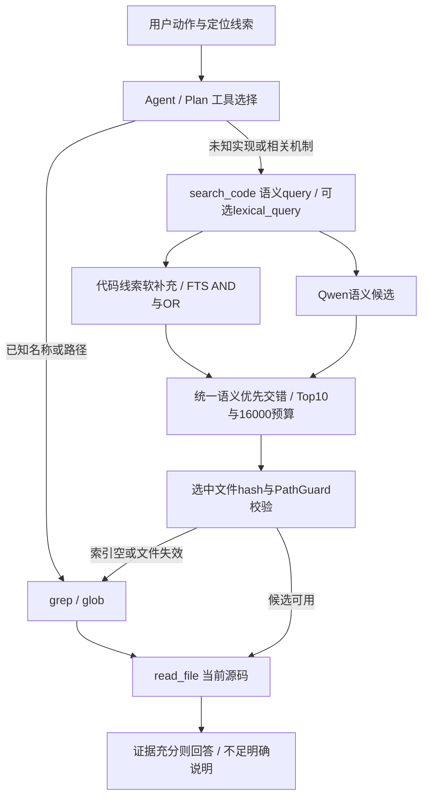

# 实时代码定位与双路 RAG 协作优化

## 1. 背景、目标与非目标

从最新main（1552b22，与origin/main同步）创建feat/code-search-rag-coordination，无worktree。用户授权实现上一轮讨论方案：grep实时定位、RAG发现相关实现，混合问句不按整体字符串形状误分类，检索候选需当前源码验证，新增真实用户输入的评测。上一轮80.16%是固定query的证据召回，不是Agent端到端正确率；排除19个标识符题的44正例，双路71.59%、纯语义68.18%。

目标：工具/prompt默认一致、显式词法线索作为软补充、混合问句自动提取代码线索、索引缺失与候选文件时效可见、受控Agent协作回归与显式启用的真实LLM评测、融合消融保护语义题。非目标：合并grep进入RAG、恢复Graph、换模型/重排器、把正则匹配称作精确调用关系、改远程授权/持久化schema/Memory/顶层执行模式。保留Top10/16000；沿用全任务ContextTokenTracker与AgentBudget，以提示词和评测约束逐步读取及重复结果，暂不另造独立的全任务硬字符预算。

本文件是本任务唯一方案及实施记录。使用writing-plans和TDD，所有任务在本文维护，不另建计划、自动commit/push。方案已由用户“实现上述优化”授权，具体边界按最小可回滚变更落实。

## 2. 现状分析（源码证据、已知约束）

### 2.1 架构位置

ToolRegistry提供独立grep_code/glob_files/read_file与search_code；Agent/Plan通过executeTools。base.md示例仍top_k=5，工具实际默认10。RetrievalRequest仅含单query，TermFtsRetriever直接规范化全句并AND/OR；Fusion判断所有词是否identifier决定词法优先，混合中文问句不属于该分支。RAG search不刷新索引；IndexCoordinator已有content hash增量更新，索引状态没有候选时效信息。

### 2.2 数据/状态模型

RetrievalRequest增加可选lexicalQuery并提供原六参数兼容构造；query保持语义描述，lexicalQuery是调用者提供的软线索，无路径/权限语义。新增RetrievalQueryAnalysis从原query提取显式驼峰名、点号调用、下划线名或反引号代码线索，保留query本身给语义模型，不做破坏性语义删除；提取数和输入长度设上限。词法线索候选先走AND并在不足时OR补充，再补原问句词法候选；按chunk去重，总候选池上限不变。

RetrievalDiagnostics增加不可变fileFreshness映射，提供原五参数兼容构造。状态只描述返回候选文件：verified/changed/missing/unavailable；不能证明全库索引新鲜，也不能证明TOCTOU期间没有修改。index_empty、index_file_changed/missing等诊断与无证据返回分开。模型失败维持词法可用。

### 2.3 核心时序与失败路径



grep只产生文本定位线索；对象变量名不证明类名、引用不证明精确调用关系。RAG空索引不得静默起大模型或隐式全库refresh；旧正文可以带失效诊断返回供定位，必须经当前源码确认。越界/符号链接逃逸候选不得读取外部文件。

## 3. 方案设计

### 3.1 接口与数据结构

1. base/Plan工具指引按目标和已有线索选择；删除显式Top5示例，默认Top10，保留自然语言需求；grep命中后读上下文，混合任务可继续RAG，不强制唯一工具轨迹。工具参数新增可选lexical_query，普通query兼容不变。
2. QueryAnalysis + TermFts软线索，只影响词法候选补充顺序，最多占一半词法池，语义候选和范围不被硬过滤。消融后删除按identifier形状切换融合优先级的分支：双路统一保留语义原序，每四位补充词法；剩余预算的同文件语义上下文适用于所有查询。单路降级仍沿用原RRF/type分值。
3. RetrievalFreshnessChecker在返回前只核对选中文件，一文件一次；用PathGuard、索引hash和流式SHA256，不回填模型、不遍历全项目。诊断保持机器可读；formatter增加每文件状态、read_file建议，空命中也保留diagnostics。无候选不输出确认无答案的断言。

### 3.2 策略、安全、并发与恢复

全部实际工具仍executeTools，经现有Policy/HITL。lexical_query仅检索词，不形成路径或URL授权；FTS逐词引用不允许注入操作符。文件时效检查持有service既有read lock；不添加后台线程、没有状态写入及新数据库迁移。PathGuard拒绝候选只标unavailable并降级，不输出外部正文；检查错误不能终止其他候选。不可用Qwen不触发自动下载。真实LLM测试先取得配置与模型目录，再使用临时user.home与Memory目录；发请求前拒绝项目记忆注入，工具仅开放只读检索，不读取/上传用户长期记忆或raw session。

### 3.3 兼容性、迁移与回滚

原请求/诊断构造保留兼容重载；新增可选参数不影响原调用。没有schema和向量space变化，不重建已有模型索引。代码线索仅在存在显式形状时补充；根据下述消融取消特殊标识符融合分支。新索引检查不改变primary选择和原hit正文。回滚可撤销本分支，无需迁移数据库。

## 4. 实现任务与测试矩阵

- [x] A：先补PromptAssembler/ToolRegistry契约回归（混合问句、默认值、lexical_query透传、空响应诊断），观察RED，修改base/Plan与工具说明。
- [x] B：先补QueryAnalysis/TermFts集成回归（中文夹杂store.save()/反引号、一般英文不误提取、AND/OR、软补充、去重/上限、显式提示），观察RED后实现。
- [x] C：先补service时效与资源边界（未建索引不加载模型、改文件同大小同mtime、删除文件、refresh恢复、越界/链接、无命中可诊断），实现请求只校验命中文件；formatter给当前源码建议。
- [x] D：受控Agent执行真实grep/RAG/read_file，scripted LLM只验证工具链；另加opt-in真实LLM从原话选择工具的冻结小集，报告证据覆盖、实际工具轨迹、读源码、请求次数/时延/输出体积、最终回答检查，不把scripted路径声称模型决策质量。评测模型不可用应明确失败/未执行，不伪称通过。
- [x] E：冻结原索引消融（自然语言44题单独统计、标识符19题兼容报告、混合问句单列），比较当前query分支与统一交错，保留全得失；策略变更仅在有验证证据时启用。
- [x] F：针对性、quick、必要full、package与diff；同步README/AGENTS/reference，记录真实命令、结果与限制，保留未提交。

常规回归使用临时小型源码与确定性向量provider验证行为，不以此证明Qwen效果。真实模型/策略质量消融复用target中冻结index，报告置于target/code-search-coordination，不覆盖旧结果；禁止执行clean删掉旧模型/报告。真实LLM使用LlmClientFactory、隔离只读工具集合和临时Memory；只保存汇总/工具名/指标，不保存原始请求/回答正文或secret。

### 4.1 实施与消融证据

2026-10-07，从main创建分支后按测试先行实施。新增请求/诊断契约先出现编译RED；第一次实现后75项针对性测试通过。统一融合/上下文策略先出现3项预期断言失败，再实现取消identifier分支，22项针对性测试通过。评审要求修正真实评测的用户目录隔离、关键正文读取、末尾JSON结论、恢复fixture的真实磁盘读取与过滤，以及最终报告策略标签，均已落实并补负例。

冻结3226个chunk，复用既有Qwen向量索引，语料与dataset SHA-256校验通过。原始75题（63个主指标正例、6个无答案题、6个符号引用题）加19条由标识符题派生的混合问句；派生题不代表独立真实用户分布。初次消融282条策略结果写入`target/code-search-coordination/rag-ablation.json`，最终生产94条结果写入`rag-final.json`。最终评测验证每题指标与选定unified消融一致、实际service与pipeline返回一致、文件hash全部verified、无语义降级、Top10/16000约束。

| 策略 | 自然语言44题Recall@10 | 标识符19题Recall@10 | 派生混合19题Recall@10 | 主63题Recall@10 | 主63题MRR@10 |
|---|---:|---:|---:|---:|---:|
| 原策略（legacy） | 71.59% | 100% | 94.74% | 80.16% | 0.4776 |
| 加软线索、保留原符号优先（hints） | 71.59% | 63.16% | 94.74% | 69.05% | 0.4088 |
| 软线索、统一融合与上下文（unified/最终生产） | 71.59% | 100% | 94.74% | 80.16% | 0.4272 |

软线索与旧符号优先组合使tokens/conflict/index/fusion/structured/lease/scan七条标识符题丢失证据，故没有交付该组合。统一融合保住每题证据覆盖，但不代表所有排名指标都改善：自然语言MRR保持0.3770；标识符MRR从0.7105降至0.5434，混合问句从0.5466升至0.5860。主样本Precision@10仍为0.0873；该指标使用既有稀疏标注，不能解释为完整语义相关精度。选择统一策略的理由是避免问句形状路由、让自然语言与混合意图一致；已知精确符号仍由grep定位。纯符号RAG的首条排名退化是明确的兼容性成本，并非无损改进。6个无答案题在三种策略中均返回候选，falseReturn为6/6；检索候选必须由Agent核实，当前没有实现相关性拒答阈值，此项没有改善。

本轮没有提高自然语言Recall，后续应在独立自然语言真实样本上检验切分、候选质量与重排，而非继续宣称融合能带来覆盖增长。冻结语料的80.16%不是Agent端到端正确率。

### 4.2 验证命令与口径

以下命令使用Java17。真实模型与仓库消融显式启用，其余常规回归默认跳过它们。无需自动下载模型，报告均在忽略的target目录内。

```powershell
mvn test -DskipTests=false '-Dtest=RetrievalQueryAnalysisTest,RetrievalCoordinationTest,PromptAssemblerTest,ToolRegistryTest,DefaultCodeRetrievalServiceTest,TermFtsRetrieverTest,RetrievalFusionTest,SearchResultFormatterTest,RetrievalContextAssemblyTest,CodeSearchEvidenceCheckTest,AgentCodeSearchCoordinationTest,RepositorySearchCoordinationEvaluationTest,TurnToolPolicyTest,ApprovalPolicyTest,CliCommandParserTest' '-Dcodeagent.search.rag.eval=true' '-Dcodeagent.search.rag.final=true'
mvn test -DskipTests=false '-Dtest=LiveCodeSearchCoordinationTest,CodeSearchEvidenceCheckTest' '-Dcodeagent.search.live.eval=true'
mvn test -Pquick
mvn test -DskipTests=false
mvn package -DskipTests
git diff --check
```

最终针对性验证202项通过，0失败/0错误，日志`target/code-search-final-targeted.log`。真实评测使用deepseek/deepseek-v4-flash，7例均执行完，证据检查6/7、末尾JSON事实/格式检查4/7、工具调用均成功。严格全通过断言失败，Maven该次退出1（共5项测试，4项判定器回归通过，1项真实评测失败），报告`target/code-search-coordination/live-agent.json`状态FAILED，日志`target/code-search-live-evaluation-final.log`。

| 真实案例 | 关键正文证据 | 结论检查 | LLM请求数 | 耗时毫秒 |
|---|---|---|---:|---:|
| known-method | 失败（无工具调用） | 失败 | 1 | 1972 |
| unknown-behavior | 通过 | 失败 | 5 | 20533 |
| mixed-intent | 通过 | 通过 | 7 | 21560 |
| ambiguous-save | 通过 | 通过 | 4 | 8497 |
| absent-feature | 通过 | 通过 | 6 | 10248 |
| changed-source | 通过 | 通过 | 5 | 7886 |
| empty-index | 通过 | 失败 | 7 | 218260 |

known-method显示prompt并不能保证模型必须检索；unknown-behavior/empty-index的严格结论检查失败不能仅凭布尔结果区分事实错误与末尾JSON格式问题，没有保存回答正文因而不声称已查明原因。empty-index耗时包含远端流式网络等待，线程栈确认等待在socket/SSE读取而非向量推理。该7题小集是失败暴露工具，不是可信一般准确率估计；保留严格失败，不通过重跑挑选好结果或放宽检查掩盖缺陷。若要求所有代码结论都有强制读取证据，需要另行设计运行时证据门禁，不能仅靠融合策略解决。

真实LLM小集包含7种用户原话：已知方法、未知行为、混合意图、同名方法、无答案、源码修改、空索引。用真实Agent与只读工具执行，配置模型经LlmClientFactory创建；不预置工具路线、不告知期望值。证据要求read_file结果包含关键实现正文，末尾JSON要求严格字段类型和正确值，记录实际工具轨迹、次数、体积、时延及provider报告token。只检查有限事实，不等于完整自然语言回答准确率，单次7题也不能估计一般质量。

试运行发现评测自身的问题并中断重跑：流式Renderer默认不返回最终文本，测试改为显式开启返回；恢复stub原先仅返回常量，现改为真正Files.readAllLines与未完成过滤；最后结论检查改为最后JSON对象，避免正确中间答案掩盖错误结论。早期试运行不作为效果证据，元数据报告保留在target，不保存原始回答或请求。

首次quick回归1371项、17跳过，发现1个旧契约失败：`RetrievalQualityTest`要求语义融合后纯符号Top1不退化。BGE五文件小集实际Recall@5均1.0，Top1从10/10降至2/10，MRR从1.0降至0.8056，符合本次统一策略已知排序成本。同步测试为：词法单路精确Top1不退化、双路精确证据Top5覆盖不退化、自然语言子集召回单列与整体阈值同时检查；自然题和整体保留原10个百分点容差，不是严格零退化断言。仍打印MRR/Top1实际值，不将纯符号排序下降隐藏为质量提升。该测试继续覆盖BGE回滚provider，不能代替真实Qwen消融。重跑quick为1371项、0失败/0错误、17跳过，退出0。

首次全量1444项、23跳过、0断言失败、1错误：既有`ToolRegistryTest.shouldTimeoutLongRunningCommandWithoutHanging`在测试完成后清理Windows临时目录时报`FileSystemException`（目录被进程占用），不是检索断言失败。单独命令`mvn test -DskipTests=false '-Dtest=ToolRegistryTest#shouldTimeoutLongRunningCommandWithoutHanging'`重跑1项通过，退出0，日志`target/code-search-timeout-recheck.log`；未修改命令执行生产逻辑或删除该测试，全量复核最终1444项、0失败/0错误、23跳过、退出0，日志`target/code-search-full-recheck.log`。该环境时序风险仍应在后续命令进程生命周期任务中处理。

### 4.3 分批提交记录

2026-10-08，用户明确要求“分批提交这些修改”。提交前重新执行`mvn test -Pquick`，1371项、0失败/0错误、17跳过，退出0，日志`target/code-search-precommit-quick.log`；检查工作区与各批暂存差异。按依赖方向分三批：检索核心/时效诊断及回归（d5bf9b5）、工具接线/提示词契约（d6f9f0f）、评测与文档。仅本地提交，不推送或创建PR；真实LLM严格门禁失败与纯符号排名成本保持原记录，不将提交状态等同质量门禁通过。

## 5. 验收清单

- [x] grep与RAG互补，RAG内部没有实时grep调用或新权限。
- [x] query保留语义；混合线索在词法候选中补充，未作为硬过滤。
- [x] Top10/16000在工具、CLI、prompt一致；显式top_k继续支持。
- [x] 未建立索引、无证据、模型故障与候选过期明确区分。
- [x] 当前源码校验可观察；索引过期不自动进行昂贵回填。
- [x] 受控与真实LLM评测证据边界明确，混合问句/歧义/过期/无答案覆盖。
- [x] 融合消融有真实数据和逐题得失，历史80.16%不冒充端到端效果。
- [x] targeted/quick/full必要检查、构建及diff完成；文档同步，后续按用户授权提交，不推送发布。


最终检索评测默认入口复核：mvn test -DskipTests=false '-Dtest=RepositorySearchCoordinationEvaluationTest' '-Dcodeagent.search.rag.eval=true'，1项通过、94条最终生产结果校验通过，日志target/code-search-rag-final-recheck.log。mvn package -DskipTests退出0、BUILD SUCCESS，日志target/code-search-package.log。未执行clean，保留冻结语料与模型。最终git diff --check及11个未跟踪文本文件的no-index whitespace检查通过；README/AGENTS/CODEAGENT/reference和任务文档同步。只读评审无待处理Critical/Important问题；初次交付保留未提交状态，后续按用户明确授权分批提交。

工程改造与回归/构建验收完成；真实LLM的7题全通过门禁未通过，属于明确剩余质量限制，不能宣称端到端已可靠，也不能把本轮结果包装为召回增长。
