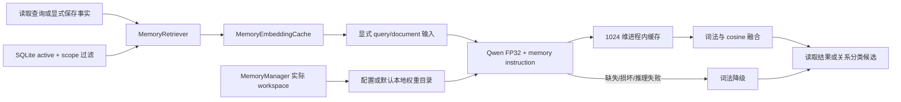

# 长期记忆 Qwen3 Embedding 迁移

## 1. 背景、目标与非目标

用户要求从最新 main 新建分支，将长期记忆的旧 embedding 一并切换为 Qwen。基线 `08c8731`，分支 `feat/long-term-memory-qwen3`。目标是读取记忆与显式保存的候选召回均使用既有 Qwen3-Embedding-0.6B ONNX FP32 1024 维；不修改 SQLite schema、scope、时间衰减、显式保存授权或关系分类器，不新增模型下载、远程请求或向量持久化。

## 2. 现状分析（源码证据、已知约束）

### 2.1 架构位置

源码证据：`MemoryEmbeddingCache()` 直接创建 BGE；`MemoryRetriever` 的普通检索与写入候选共用该缓存，旧阈值 0.475/0.45 来自 BGE golden。当前 Qwen engine 拒绝未标明 query/document 的输入，且查询指令专门面向源码。因此只替换构造函数会让全部记忆 embedding 失败。

### 2.2 数据/状态模型

缓存键已包含 id、正文 hash 与 space；向量只保存在进程内。SQLite 的正文与确认时间保持唯一事实源，不增加向量表或改写用户记忆。

### 2.3 核心时序与失败路径

`MemoryManager.close()` → retriever → cache → provider 的释放链已存在。Qwen 权重已预装，已有 provider 懒加载、固定 hash 校验、缓存初始化失败和关闭语义可以复用。查询向量失败时跳过正文 embedding，返回词法分数；部分正文失败时未命中缓存的条目用词法分数。空可见记忆不触发推理。

## 3. 方案设计

### 3.1 接口与数据结构

选择复用既有 Qwen provider/engine，新增固定 memory instruction 与独立 preprocessingVersion=3；代码 RAG 的 version=2 和原有指令保持不变。相比复制 Qwen engine，可保持唯一的校验、pooling、取消与关闭实现；相比直接复用代码指令，任务语义明确且空间不混用。



### 3.2 策略、安全、并发与恢复

模型目录复用配置文件优先于 `EMBEDDING_LOCAL_MODEL_DIR` 的现有解析；初始基准为 user.dir，`MemoryManager.setProjectPath` 将实际 workspace 传给 retriever/cache（微信等入口可与进程目录不同）。相对目录在项目变化时关闭旧 provider、清理向量缓存并创建新 lazy provider，旧初始化失败也随之清除；绝对目录和默认全局目录不因项目变化重新加载。长期记忆固定本地 Qwen，不跟随 RAG 的 remote/off/bge 模式，避免记忆正文出境；目录解析与 artifact 加载都在首次推理时执行，非法目录同样降级。每个缓存拥有 provider，由现有关闭链释放；缓存重绑、推理和关闭在同一个同步锁内，关闭后不能重绑复活。各 Session 所有权不变。

query 用 `EmbeddingInputPolicy.prepareQuery` 标明边界，engine 适配为固定 memory instruction；正文用 `prepareDocument`，engine 去掉边界前缀后原样编码。真实 golden 使用相同生产路径检查正负例分布，阈值只在证据表明旧值不适用时调整，读阈值与更宽的写候选阈值分别验证。不改变融合权重和时间策略。

### 3.3 兼容性、迁移与回滚

旧 memory.db 无需迁移；旧 BGE 进程缓存自然丢弃。Qwen 比 BGE 的首次加载、推理和内存成本高，不声称性能等价。每个已经使用语义检索的 Session 与代码 RAG 目前独立拥有 ONNX session，多 Session 会增加 native 内存开销；本次不引入共享模型或新的所有权协议。模型安装仍使用现有脚本；修复安装/修改目录后重启以重建 Memory provider。回滚代码变更即可恢复 BGE，不涉及记忆正文迁移。

## 4. 实现任务与测试矩阵

使用 writing-plans 的任务拆分与测试先行流程，用户明确要求本任务新建独立文档；所有计划、实施与验收均在本文。初次交付保留未提交状态；用户后续明确授权提交本次修改。

- [x] 先补 `MemoryEmbeddingCacheTest`：默认空间切 Qwen、query/document 边界、entry 缓存而 query 不缓存；运行观察 RED。
- [x] 最小实现：`InProcessQwen3EmbeddingProvider.forMemory(Path, String)` 返回固定 memory 空间，engine 接受固定查询指令；缓存读取已有目录配置并准备输入。
- [x] provider 契约测试：memory 指令与 RAG 不混用、非法/缺失目录失败关闭、lazy/close 保持现状。
- [x] `MemoryEmbeddingGoldenTest` 改为显式 `memory.qwen.artifact=true` 的真实模型测试，保留原正负样例，测试读取与写候选门槛，记录真实分数并校准。
- [x] 运行 Memory/配置/Qwen/RAG 针对性测试、quick、全量与构建；同步 README、AGENTS、CODEAGENT、agents-reference 和配置示例；检查 diff。

命令：`mvn test -DskipTests=false -Dtest=MemoryEmbeddingCacheTest`；`mvn test -DskipTests=false -Dtest=MemoryEmbeddingGoldenTest -Dmemory.qwen.artifact=true`；针对性组合覆盖 MemoryRetriever/WriteResolver/Manager/LongTermMemory、Qwen provider/输入策略、配置与工厂；`mvn test -Pquick`；`mvn test -DskipTests=false`；`mvn clean package`；`git diff --check`。

## 5. 验收清单与实施记录

- [x] 默认 Memory 两条召回路径使用本地 Qwen 1024 维及专用指令，原 RAG 空间不变。
- [x] 真实模型正负样例、词法降级、scope、时间衰减、写入关系、生命周期测试通过。
- [x] 记忆正文未写入远程 embedding 或向量表，不修改用户真实记忆。
- [x] 联动文档一致、diff 检查通过，保留未提交状态。

### 5.1 测试先行与阈值校准（2026-10-08～09）

先执行 `mvn test -DskipTests=false -Dtest=MemoryEmbeddingCacheTest`：5 tests，2 failures，0 errors。两项失败分别确认默认空间仍为 BGE、输入缺少 query/document 边界。实现后缓存测试 7 项通过。新增测试首次使用了不存在的 `LongTermMemory(String)` 构造，按实际 `LongTermMemory(File)` 修正并清理重编译；此构造错误不是生产缺陷。

第一次真实 Qwen golden 用原有三正例、两负例，通过生产 cache 计算后得到：

| 样例 | cosine | 预期 |
|---|---:|---|
| Plan/SQLite 恢复 | 0.710557 | 相关 |
| 中文回答/汉语沟通 | 0.443206 | 相关 |
| Java 17/JDK 版本 | 0.554992 | 相关 |
| 中文回答/Maven 编译 | 0.237357 | 无关 |
| Java 17/Plan 资源冲突 | 0.224536 | 无关 |

旧 BGE 阈值导致中文改写的读取与写候选共四项断言失败。因此 Qwen 读取阈值设为 0.40，写候选设为更宽的 0.35：二者均低于最弱正例并高于这组负例，保留正例余量而非紧贴单个测量值。写候选仍必须由关系分类器判定，cosine 不能直接更新旧事实。此五例是原有 golden 的回归校准，不是独立随机评测，不能证明通用精确率、召回率或大范围质量提升。

### 5.2 评审修正与针对性验证

只读评审发现，相对模型目录初版只以进程 user.dir 为基准，微信等入口的 actual workspace 未接入。新增 `MemoryManagerTest#projectSwitchRebindsRelativeModelDirectoryAndClearsCachedInitializationFailure` 先观察 RED：1 test、1 failure，实际仍读取 startup 目录。随后通过现有 Manager → Retriever → Cache 依赖链传递项目路径；相对目录切换时关闭旧 provider 并清空缓存，默认/绝对目录保留；同一缓存同步推理/重绑/关闭，closed 后不复活。

初次针对性命令如下，104 tests、0 failures/errors/skipped，BUILD SUCCESS：

```powershell
mvn test -DskipTests=false '-Dtest=MemoryEmbeddingCacheTest,MemoryEmbeddingGoldenTest,MemoryRetrieverTest,MemoryWriteResolverTest,MemoryManagerTest,LongTermMemoryTest,InProcessQwen3EmbeddingProviderTest,EmbeddingInputPolicyTest,EmbeddingProviderFactoryTest,CodeAgentEmbeddingConfigTest' '-Dmemory.qwen.artifact=true'
```

评审修复后执行：

```powershell
mvn test -DskipTests=false '-Dtest=MemoryManagerTest,MemoryEmbeddingCacheTest,MemoryRetrieverTest,MemoryWriteResolverTest,InProcessQwen3EmbeddingProviderTest,MemoryEmbeddingGoldenTest' '-Dmemory.qwen.artifact=true'
```

49 tests、0 failures/errors/skipped，BUILD SUCCESS；真实五例分数与首次运行一致。只读复评确认目录接线、失败重置、同步与生命周期修复，无剩余 Critical/Important。此前 quick 为1376 tests、0 failures/errors、18 skipped；评审后最终 quick 重新执行：`mvn test -Pquick`，1377 tests、0 failures/errors、18 skipped，BUILD SUCCESS（1分45秒）。

### 5.3 最终回归、构建与交付

验证使用 Java 17（`JAVA_HOME=C:\Program Files\Java\jdk-17`）。最终执行：

| 命令 | 结果 |
|---|---|
| `mvn test -Pquick` | 1377 tests，0 failures/errors，18 skipped，BUILD SUCCESS |
| `mvn test -DskipTests=false` | 1450 tests，0 failures/errors，24 skipped，BUILD SUCCESS，2分30秒 |
| `mvn clean package` | 重试 BUILD SUCCESS，373个生产源文件与250个测试源文件重新编译，生成 `target/codeagent-1.0-SNAPSHOT.jar`，1分7秒 |
| `git diff --check` | 通过；新增文档另行检查尾随空白和冲突标记 |

真实 Qwen golden 需 `-Dmemory.qwen.artifact=true` 显式启用，已在两次针对性运行中实际执行并通过，不用默认回归的跳过结果冒充真实模型验证。构建按仓库默认跳过测试，测试结果来自上方单独执行的回归命令。

第一次 clean 仅因 Windows 无法删除 `target/classes` 失败，未进入编译；检查目录和进程后直接重试成功，未终止任何进程，也未确认具体占用来源。shade 保留既有依赖资源/module-info 重叠警告。

联动文件为 README、AGENTS、CODEAGENT、agents-reference、`.env.example`；Memory 源码/测试、Qwen provider/engine/契约测试及本独立方案为全部改动范围。遵从用户要求，旧 `26-qwen3-embedding-migration.md` 已恢复且无内容 diff。模型权重、测试报告、构建产物均不纳入 Git。初次交付未 commit、push、PR 或 merge；2026-10-09 用户随后明确要求提交本次修改，本轮将全部已验收改动提交到 `feat/long-term-memory-qwen3`，不推送、不创建 PR、不合并分支。
