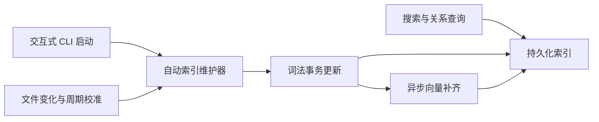
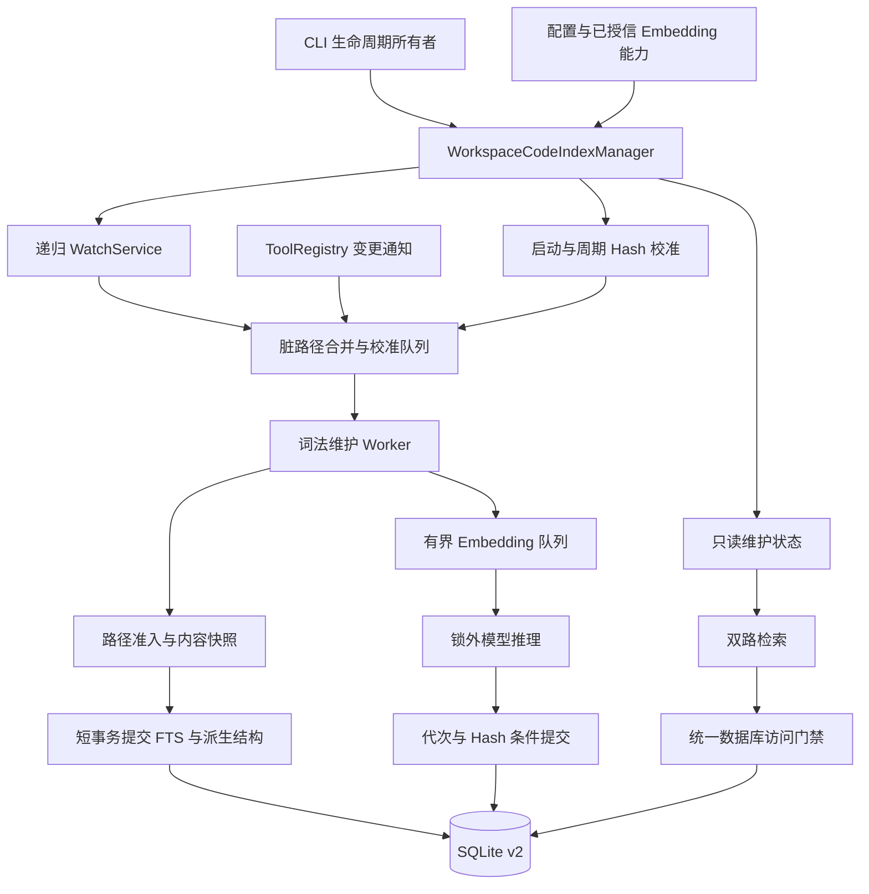
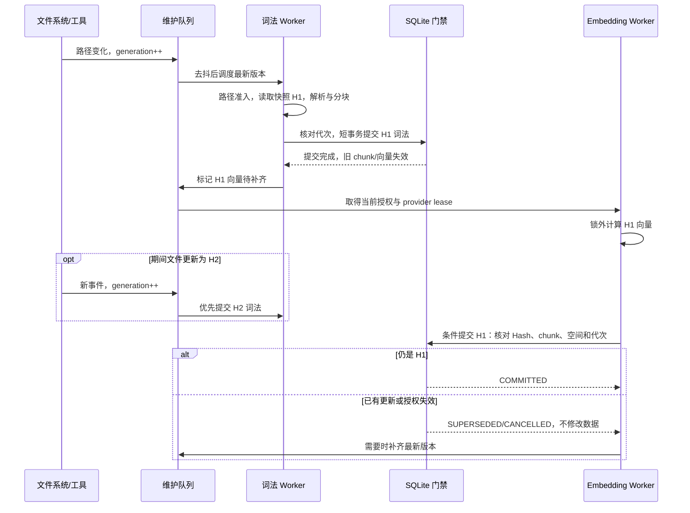

# 40. 代码 RAG 索引自动维护实现设计

## 本次调整：仅保留自动维护入口

- 目标：交互式 CLI 完全通过启动校准、文件监听和周期校准维护代码索引；删除旧手动命令的解析、执行、补全、专用清理 API 和文档说明。
- 非目标：不删除底层增量刷新、重建参数和数据库事务接口，它们继续服务后台维护、隔离评测及非交互集成；不改变检索算法、模型安装和授权边界。
- 影响：CliCommandParser、ExecutionControlPolicy、Main、WorkspaceCodeIndexManager、DefaultCodeRetrievalService、命令/维护测试与现有文档。
- 设计评审：只移除用户入口及无剩余调用者的清理包装；保留程序调用 refresh 的统一并发门禁。关闭自动维护后仅查询既有索引，不再建议用户使用手动命令。非交互入口仍需宿主显式调用底层索引接口。
- 实施顺序：先验证旧命令被拒绝且补全不暴露入口，再删除命令及专用解析器；删除清理包装并验证文件删除后重新创建仍能自动入库；同步全部文档；运行命令/RAG测试、quick回归、构建及diff检查。
- 验收：已删除入口由 CLI 作为未知命令拒绝，绝不进入 Agent；保留搜索与关系查询；自动启动、监听、增量删除和向量补齐回归通过；文档不包含旧命令说明。



本文合并自动索引维护的设计、实施记录与验收证据。初始实现位于 `feat/automatic-code-index-maintenance` 分支；移除手动入口的后续调整位于 `refactor/remove-manual-index-command` 分支。以下设计参数与行为以实施记录中的最终接口为准。

## 1. 背景、目标与非目标

### 1.1 背景

当前代码 RAG 已接入 SQLite FTS5、BM25 与 Qwen3-Embedding-0.6B FP32。查询时会自动计算查询向量，代码文件的词法索引与向量索引通过后台服务自动更新。候选文件 Hash 校验只能发现已返回候选过期，不能发现未建立索引的新文件，也不能替代全库更新。

由进程内后台服务负责代码索引的建立与增量更新，用户不需要执行索引命令。自动维护解决时效与使用成本，不直接改变融合算法；未实测前不能承诺提高既有黄金集召回率。

### 1.2 目标与验收行为

1. 交互式 CLI 启动后后台校准当前项目，无需用户执行索引命令。先建立可用词法索引，再异步补齐向量。
2. IDE 保存、外部命令、Agent 写文件、删除、重命名和分支切换产生的变化最终自动反映到索引。
3. 不变文件不重复解析或生成向量；连续保存合并处理。新文件、删除文件与遗漏监听事件均有恢复路径。
4. 更新期间仍可检索；响应说明后台状态与已知时效限制。旧计算结果不得覆盖新文件版本。
5. 模型缺失、推理失败或未授权远程 Embedding 时保持词法检索可用，不自动下载模型或发起后台授权交互。
6. 退出 CLI 后停止维护；下次启动通过校准恢复。保留默认 Top10、16000 正文字符和现有 grep/RAG 协作契约。

### 1.3 非目标与影响面

本任务不修改召回融合比例、分块粒度、模型权重、长期记忆、grep 实现或顶层任务队列，不增加独立常驻守护进程、跨进程可靠任务队列、远程工作区同步、全新向量数据库或内容寻址的跨文件向量缓存。

首期默认接入交互式 CLI，包括 inline/plain 与 TUI。Runtime API、WeChat、独立测试及 headless 调用不因构造 ToolRegistry 而偷偷启动线程；这些入口由宿主显式调用底层索引接口，后续如接入，必须显式提供生命周期所有者。

影响范围为 `rag/`、配置、ToolRegistry 的变更通知、CLI 生命周期、检索诊断及对应文档和测试。Graph 不参与 RAG 融合；现有符号/关系派生数据仍随词法批次更新。

## 2. 现状分析（源码证据、已知约束）

### 2.1 架构位置

以下路径相对仓库根目录，以本次源码勘探为依据：

| 文件及接口 | 已验证行为 | 改造意义 |
|---|---|---|
| `src/main/java/com/codeagent/cli/Main.java`，交互式启动与退出 | 注入自动维护器并注册当前项目 | 生命周期显式拥有后台服务，退出停止维护 |
| `src/main/java/com/codeagent/tool/ToolRegistry.java`，`getCodeRetrievalService()` | 懒创建并缓存检索服务，默认打开 `~/.codeagent/rag/codebase-v2.db`；支持 `codeagent.rag.dir` | 后台任务不能读取不断重绑的当前项目字段 |
| 同文件，`setProjectPath()` | 重绑 PathGuard、LSP 等协作者；没有自动建立新索引 | 注册项目与权限绑定必须显式处理 |
| `src/main/java/com/codeagent/rag/DefaultCodeRetrievalService.java` | `refresh()` 同步调用 IndexCoordinator；provider 读锁允许并发读路径 | 现有锁不是数据库事务串行化机制 |
| `src/main/java/com/codeagent/rag/IndexCoordinator.java` | 扫描全库，按文件提交词法再计算向量；不完整扫描不清除未见文件 | 拆成词法提交与向量任务，保留安全删除规则 |
| `src/main/java/com/codeagent/rag/IndexFileScanner.java` | Hash 判断变化；排除敏感文件、构建目录及符号链接；读取根 `.gitignore` | 监听与单文件刷新必须复用相同准入规则 |
| `src/main/java/com/codeagent/rag/CodeChunker.java`、`CodeAnalyzer.java` | 文件接口分别读取源码 | 需要接收同一份内容快照，避免 Hash 和正文不对应 |
| `src/main/java/com/codeagent/rag/SqliteRetrievalIndex.java` | 单 JDBC Connection，WAL 与 `busy_timeout=5000`；事务修改 autoCommit | 不能直接把现有 refresh 放进后台并与 search 并发 |
| 同文件，`replaceFileEmbeddings()`、`findChunkId()` | 写向量缺少期望文件 Hash 校验；chunk 以项目、路径、行范围、symbolId 定位 | 同行范围的新代码可能被绑定旧向量，须增加条件提交 |
| `src/main/java/com/codeagent/config/CodeAgentConfig.java` | 配置含 embedding；当前无自动维护配置 | 新能力需显式配置与兼容默认值 |
| `src/main/java/com/codeagent/cli/Main.java`，Embedding 配置命令 | 重配 provider，不等于刷新代码索引 | 模型空间变化应触发向量补齐，不重复词法重建 |

以上描述针对当前实现。本文中的新增类、字段与配置均为设计，不是现存接口。当前扫描器只支持根 `.gitignore`，本任务不宣称已有嵌套忽略文件支持。

### 2.2 数据/状态模型

持久化继续使用 v2 表：文件元信息、代码 chunk、FTS、符号关系、Embedding 空间及向量。文件 Hash 表示已提交内容；Embedding 空间标识隔离模型、维度与预处理版本。词法替换会删除旧 chunk 及关联向量，形成向量待补齐状态。

新增维护状态保存在进程内，不将文件正文、事件日志或任务队列另写到用户数据库。重启后以文件系统、文件 Hash 和当前空间向量完整性重建待办。

| 状态字段 | 用途 |
|---|---|
| canonicalRoot、projectEpoch | 不可变项目身份及注销/重新注册代次 |
| pathGeneration | 同一路径多次变化的代次，拒绝旧任务回写 |
| policyEpoch | 忽略规则、授权变化时淘汰旧任务 |
| providerEpoch、embeddingSpaceId | 模型重配、撤销授权时淘汰旧向量任务 |
| dirtyPaths、reconcileRequired | 有界脏文件集合与遗漏事件校准标志 |
| pendingLexical、pendingEmbedding | 分阶段进度，不能用单一“已完成”混淆状态 |
| watcherState、lastCompleteReconcileAt、lastErrorCode | 监听降级、扫描覆盖与失败诊断 |

`pathGeneration` 必须覆盖正在处理的路径；只有没有待办、运行任务和提交引用时才能回收，避免计数重置导致旧任务误通过。队列满时不保留无限路径状态，转为全库校准标志。

### 2.3 核心时序与失败路径

现在的全库扫描会在每个文件词法提交后等待该文件 Embedding，初次建立其他文件的词法索引也受模型速度影响。新方案以词法任务优先，所有推理在数据库锁外执行。

文件监听是快速提示而非事实源。Java WatchService 可能丢事件、重复通知，收到修改事件时写入也可能尚未结束；网络文件系统行为存在平台差异。启动扫描与定期完整 Hash 校准承担最终一致性。

扫描失败与确认删除不同：权限错误、目录暂时不可读不能导致清空索引。删除只接受安全确认的单文件不存在，或完整扫描的缺失结果。候选时效校验继续保留，自动维护不保证查询时全库完全新鲜。

## 3. 方案设计

### 3.1 模块、接口与数据结构



建议新增以下职责接口，名称可在实现评审时调整，但边界不可混合：

- `WorkspaceCodeIndexManager`：进程级生命周期所有者，注册/注销项目、提供状态、处理 provider 变化、关闭任务与监听器。一个共享数据库对应一个写协调器；项目上下文以规范根路径为键，不以当前 UI Session 为身份。
- `WorkspaceIndexContext`：不可变根路径及受限路径能力、项目代次；任务捕获其引用，不在执行时查询 ToolRegistry 当前 projectPath。不同项目独立状态，数据库写入仍串行。
- `IndexPathPolicy`：从现有扫描器提取并复用目录排除、扩展名、敏感文件、忽略规则、符号链接和根路径校验。不得额外读取项目外路径。
- `WorkspaceFileWatcher`：递归注册准入目录，处理新目录、注册失效及 OVERFLOW；只提交提示，不执行解析或推理。
- `IndexMaintenanceScheduler`：合并事件、去抖、调度校准、有限重试，维护项目公平性和词法优先级。
- `FileContentSnapshot`：一次读取的 bytes/解码内容、Hash、路径、属性与任务代次。CodeChunker、CodeAnalyzer 的内容接口共同消费此快照，现有文件接口保留兼容委托。
- `IndexCoordinator.refreshPaths(context, paths)`：只刷新安全准入路径；完整扫描仍承担删除对账。拆出词法阶段和待补齐向量描述。
- `EmbeddingWorkItem`：项目/路径、文件 Hash、chunk 身份与 Hash、Embedding 空间、provider/policy/path 代次；队列只存元信息，执行时按期望版本取得正文，避免长期缓存全库源码。
- `AutoIndexStatus`：只读维护快照，通过检索诊断与 CLI 状态输出，不引入后台直接打印。

向量提交建议返回 `COMMITTED / SUPERSEDED / CANCELLED`，接口为 `replaceFileEmbeddingsIfCurrent(expectedVersion, batch)`。在同一数据库事务内先核对文件 Hash、chunk Hash 与空间身份，再删除该版本同空间旧向量并插入整批结果；版本不匹配不修改数据。chunk 匹配必须包含内容 Hash，不能只依赖行号和符号。

### 3.2 策略、并发与恢复

#### 3.2.1 生命周期与线程边界

在交互式 CLI 已建立合法 workspace 和配置后显式启动管理器，后台完成初次扫描；不等待模型推理后才允许用户输入。共享 ToolRegistry 注入管理器的通知接口，Session 驱逐不关闭进程级管理器。项目绑定变更时完成注册/注销与代次更新；不得仅修改一个字符串而让旧任务获得新项目权限。

后台服务只派生索引，不能提交顶层 Agent 任务、占用 Session writable lease、修改 ConversationLedger 或调用可交互工具。CLI 的单 Worker 和工具策略链保持原契约。管理器及其数据库访问门禁同时覆盖程序调用的索引刷新与查询。

建议一个词法 Worker、一个 Embedding Worker，并允许监听与定时任务独立唤醒；首期不并发多路本地 Qwen 文档推理。查询和后台文档推理通过 provider 级推理门禁协调，查询任务优先于下一批后台任务；限制文档批次大小，记录排队时间。运行中的单次 ONNX 推理可能无法抢占，不能承诺查询零等待。

关闭顺序为：停止接收通知，取消周期扫描并关闭 WatchService，取消队列并使代次失效，等待活动任务安全退出，最后关闭其 provider 与数据库。建议退出等待上限 5 秒；超过上限不能在仍使用资源时强行关闭连接或模型，资源释放转交最后一个任务 lease，禁止后续提交。不得启动退出后独立运行的服务。

#### 3.2.2 数据库与 provider 并发

第一阶段采用统一可重入数据库访问门禁串行化当前单 Connection 的所有调用，包括 status、search、事务写入与 close。WAL/busy_timeout 处理 SQLite 层竞争，不能代替 Java 层保护同一个连接。

查询向量在数据库门禁外计算；随后在一个读操作窗口内获取词法、向量及必要状态，避免同一次融合跨越 chunk 替换事务。文件候选 Hash 检查在该窗口外执行。词法提交和条件向量提交使用短事务，扫描、解析、文件读取和推理都不持有数据库门禁。

provider 使用可关闭 lease：重配先发布新 epoch，使旧任务不能提交；旧实例在最后一个持有者退出后关闭。锁顺序统一为“项目状态/提交门禁 → 数据库门禁”，provider lease 通过短操作取得，不持有 provider 配置写锁等待推理完成。撤销、代次检查与条件提交共用提交门禁，禁止检查通过后再发生撤销却继续写入。

#### 3.2.3 触发来源与默认调度

下列为拟采用初始参数，不是实测性能承诺：

| 参数 | 建议默认值 | 行为 |
|---|---:|---|
| enabled | true | 仅在显式接入生命周期的交互式 CLI 生效 |
| debounceMillis | 1500 | 合并连续保存；从最后一次事件计时 |
| maxDebounceMillis | 10000 | 防止持续写入无限延迟词法处理 |
| reconcileIntervalSeconds | 300 | 无事件也周期校准；不重叠扫描 |
| maxDirtyPaths | 4096 | 超限改为完整校准，不无限增长 |
| maxPendingEmbeddingFiles | 256 | 超限保留向量补齐标志，由下一轮扫描恢复 |
| embeddingBatchSize | 8 | 限制推理批次，可根据实际延迟调整 |

拟在 CodeAgentConfig 增加 `autoIndex` 对象及验证，示例为 `{"autoIndex":{"enabled":true,"debounceMillis":1500,"maxDebounceMillis":10000,"reconcileIntervalSeconds":300}}`。队列与批次上限先作为内部常量，避免配置面过大；新字段缺失使用默认值，非法数值拒绝启动该后台功能并明确诊断。禁用后保留已有索引，不启动自动更新。

触发规则：

1. 启动：完整对账，优先提交变化文件词法，再补齐当前空间缺失向量。空索引仍先返回 `index_empty` 和正在构建状态，查询本身不启动昂贵全库刷新或加载模型。
2. 监听：创建/修改/删除合并为脏路径；重命名作为旧路径删除与新路径创建。新目录及时注册并扫描该子树。监听注册失败、OVERFLOW 或无效 key 转为完整校准。
3. Agent 工具：成功 `write_file` 提交精确路径；`execute_command` 与 `revert_turn` 按作用 workspace 发出保守校准提示，失败、超时和部分恢复同样可能有文件修改。通知在工具执行结果确定后发出，不改变结果顺序和权限判断。
4. 根 `.gitignore` 变化：更新 policyEpoch，重新加载规则并完整校准；新排除项立即撤销队列资格，安全删除已索引排除项。暂时读规则失败时停止新增读取，保留错误状态，不能采用更宽松规则继续。
5. 分支切换/外部批量修改：通过文件事件快速发现，周期 Hash 对账兜底；不假定 `.git` 内部事件必然可见。
6. provider 或模型空间变化：使旧向量待办失效，仅补齐新空间；已有词法不重复解析。显式关闭语义层时不启动文档推理。

去抖只保证减少重复工作。快照读取前后核对属性，变化时重新排队；提交前再次核对当前文件 Hash 与代次。即使属性相同也以内容 Hash 为最终变化依据。文件可能在核对后再次变化，仍需后续监听和定期校准，因此只承诺最终一致，不承诺读取文件系统的原子全库快照。

#### 3.2.4 分阶段更新时序



已有旧版词法但文件已变化时继续沿用候选 freshness 标记；已知 dirty 状态作为额外诊断，不把旧正文伪装成当前源码。新词法提交后向量尚未完成时，语义候选可能暂缺该文件，响应显示补齐状态，关键词与实时 grep 仍可用。不得返回旧 chunk 的向量来填补新版本缺口。

#### 3.2.5 路径、安全与远程授权

监听路径只是线索，读取和提交前都重新检查受限根路径与符号链接逃逸；敏感文件、raw session JSONL、忽略目录不得读取正文、向量化或排入日志。日志只保留允许的相对路径、计数、耗时及错误码，不记录源码、向量请求正文、API Key 或长期记忆。

远程任务必须携带当前项目/provider/model/endpoint/policy-version 对应的明确授权能力，并在排队、发送前及提交前检查有效性。后台不弹 HITL，不复用其他项目的同意；未授权只维护词法。撤销后不得发送新的请求，已发送内容不能追溯撤回，结果丢弃且不继续补发。模型缺失或校验失败不得自动下载，沿用显式安装脚本与恢复后重启契约。

路径授权仍由现有 PathGuard 和策略链决定；自动索引准入不能扩大用户授权。源码和根 `.gitignore` 共用 IndexRestrictedReader：支持 SecureDirectoryStream 时从文件系统根逐级使用 NOFOLLOW 的相对句柄打开；不支持的平台在最终文件 NOFOLLOW 打开后、消费字节前重验全部祖先与文件身份，读后再重验，检测到置换即丢弃结果。不能以字符串 startsWith 代替安全路径判断。

平台边界：Windows 的 Java17 标准文件通道不能取得已打开文件的身份，也通常不提供 SecureDirectoryStream，因此不能证明恶意并发祖先“换出又恢复”的 ABA 攻击下绝对零字节读取。当前保证静态链接/可观测置换被拒绝、变化结果不进入分块/索引/远端；测试覆盖受控打开后置换。更强的 Windows 原子防御需要额外原生句柄能力，不将本次实现宣称为抵御同机恶意进程的文件系统隔离沙盒。

#### 3.2.6 恢复、重试与完整性

- 单文件读取、解析或数据库提交失败：保留上一个已提交版本及错误诊断，有限重试；删除旧版只在新批次事务成功时发生。Java 语法不完整时采用现有可用降级分块，不把解析失败等同于文件删除。
- 文件删除：确认准入根内路径确实不存在，更新代次并删除派生数据；不可读不当成不存在。
- 不完整扫描：不执行全局缺失删除；已确认安全变更可逐文件提交，保留 reconcileRequired。
- 向量失败：不回滚已经成功的词法；短暂故障按退避重试，确定性模型/授权错误停止自动重试，等待重配或重启。
- 队列溢出、监听失效：标记待校准，单次扫描失败后退避，不能高频重复全库 Hash。
- 重启/中断：队列不持久化，下次启动用文件 Hash 和当前空间向量完整性重建；事务保证不出现半批词法或半批向量。
- 多 CLI 进程：SQLite 事务和 busy_timeout 防止损坏，但首期不承诺跨进程唯一推理和去重；同项目多进程可能重复耗费模型资源，提交仍核对版本。跨进程最新性以文件 Hash 为依据，不能使用仅进程内 generation 冒充全局版本。

### 3.3 诊断、兼容性与回滚

不提供用户手动索引命令。程序调用底层刷新接口时，仍通过统一维护协调器与后台任务串行，完成后触发校准；不得持有状态锁等待后台结果。

检索诊断增补 `maintenance_state`、词法/向量待办数、最后完整校准时间与监听降级原因。文本只表达“后台更新中/语义补齐中/监听降级/自动维护未启用”等真实状态；`idle` 只代表当前没有已知待办，不能解释为全库实时一致。两个搜索入口共享状态，正文预算与融合顺序保持既有契约。查询仍只验证返回候选，修改前 `read_file` 核实当前源码。

未注入维护器或未注册项目时，`maintenance_state` 为 `disabled`；这不代表索引为空，也不提供用户手动维护入口。

优先保持数据库 schema v2：条件写入复用文件及 chunk Hash，新增状态以进程内派生为主；如实施中发现必须持久化代次或增加约束，需要先在本文补充 schema 迁移、旧 JAR 兼容与回滚评审，不能直接覆盖 schema 版本。

禁用 `autoIndex.enabled` 即停止自动维护；停止后台线程后保留已有可用索引。模型回滚继续通过现有 provider/空间机制隔离向量。实现时同步 README、AGENTS、docs/agents-reference.md、配置示例及工具提示词；这些文档在功能完成前不能宣称已经支持自动维护。

## 4. 实现任务与测试矩阵

### 4.1 按依赖顺序实施

每阶段先补测试再实现，设计、实施记录与验收结果继续写入本文件，不再新建计划文档。

| 顺序 | 修改位置 | 交付与针对性验证 |
|---|---|---|
| 1 | `rag/IndexFileScanner.java`、拟新增 IndexPathPolicy/FileContentSnapshot、`CodeChunker.java`、`CodeAnalyzer.java` | 统一准入和快照输入；测试忽略规则、敏感文件、链接、Hash/分块同源与写入竞态 |
| 2 | `rag/SqliteRetrievalIndex.java`、`FileEmbeddingBatch.java`、`ChunkEmbedding.java`、`DefaultCodeRetrievalService.java` | 单连接访问门禁、Hash 条件提交与 provider lease；测试并发事务、旧向量拒绝、关闭竞态 |
| 3 | `rag/IndexCoordinator.java`、拟新增调度与状态类型 | 单路径词法更新、向量补齐、删除对账、有界去抖；测试词法不等待推理、失败恢复 |
| 4 | 拟新增 WorkspaceFileWatcher/WorkspaceCodeIndexManager | 启动校准、递归监听、定期兜底与项目生命周期；测试 OVERFLOW、新目录、隔离与退出 |
| 5 | `config/CodeAgentConfig.java`、`tool/ToolRegistry.java`、`cli/Main.java` | 显式生命周期注入、工具通知、配置与底层索引刷新协调；构造测试 Registry 不自动启动线程 |
| 6 | 检索诊断/格式化类、相关 prompt 与项目文档 | 状态展示一致；空索引不因查询同步回填；Top10/16000 与 grep 协作回归 |
| 7 | Windows 实机与性能记录 | 保存/删除/重命名/分支切换/重启演练；记录延迟、CPU、内存及查询竞争 |

### 4.2 测试矩阵

新增测试类拟放在 `src/test/java/com/codeagent/rag/`；配置与入口测试放在各现有对应包。以下类名为拟新增，不应误报已执行。

| 测试组 | 必须覆盖的断言 |
|---|---|
| IndexPathPolicyTest / FileContentSnapshotTest | 根路径准入、链接逃逸、敏感文件零读取、忽略更新、Hash 与正文同源、连续写入重新排队 |
| SqliteRetrievalIndexConcurrencyTest | search/status/refresh/close 同 Connection 互斥；事务回滚无半批；同行范围但内容变更不能接受旧向量 |
| IndexCoordinatorIncrementalTest | 仅修改文件更新；不变文件不推理；先可检索词法再补齐向量；删除完整级联；不完整扫描不全局删除 |
| IndexMaintenanceSchedulerTest | 去抖和最大等待、队列上限、项目公平性、词法优先、错误退避、文件删除后重新创建、重启补齐 |
| WorkspaceFileWatcherTest | 新目录、重复事件、重命名、key 失效、OVERFLOW；无监听事件也能经周期校准发现变化 |
| WorkspaceCodeIndexManagerTest | 项目 A/B 隔离、Session 驱逐不关闭共享服务、provider 重配/撤销、活动任务关闭与 lease 恰好释放一次 |
| Remote Embedding 契约测试 | 未授权零网络请求、授权作用域匹配、撤销后不再发送/提交、远程失败保留 FTS |
| ToolRegistry / Main / 配置测试 | 写入成功通知，失败命令可能修改时仍通知；没有生命周期注入时零后台线程；默认/禁用/非法配置；程序调用刷新共用协调器 |
| 既有检索黄金集与架构测试 | 同一内容且队列排空后排名和证据覆盖不退化；双入口默认预算一致；空结果诊断及候选时效契约保留 |

去抖、退避与竞态测试使用注入 Clock、FakeWatcher、可控 executor 和 latch；不以真实 sleep 猜测顺序。ONNX/API 用假 provider；默认单测不下载模型、不访问远端、不读取真实用户 memory/session 数据。真实 WatchService 行为另外在 Windows 临时项目做集成演练。

实施后的验证命令按最终新增类名同步，基线包括：

```powershell
mvn test -DskipTests=false "-Dtest=CodeIndexTest,CodeSearchServiceArchitectureTest,CodeSearchGoldenSetTest,ToolRegistryTest,EmbeddingContractsTest"
mvn test -Pquick
mvn test -DskipTests=false
mvn clean package
git diff --check
```

并发与生命周期跨模块，实施完成需全量回归和构建，不能只跑黄金集。文档交付阶段仅做文档结构、路径、差异和空白检查，不把以上计划命令写成测试通过记录。

### 4.3 性能与效果评估

记录首次建立词法/完整向量耗时、保存到词法可见和向量可见的 p50/p95、变更文件数、Embedding 调用次数、队列峰值、后台 CPU/内存、查询耗时及数据库等待。分别测试空索引、稳定文件、单文件连续保存、大批分支切换、模型缺失与远程授权拒绝。

验收硬条件是正确性、最终收敛和未变文件不重复生成向量。延迟阈值先以固定测试仓库和硬件建立基线，再写入本节；1500ms 去抖不等于1500ms内向量可用，300秒校准也不等于300秒内完成全库推理。查询与后台推理竞争、完整 Hash 扫描 I/O 成本是需要实测的主要风险。

比较召回率时使用同一黄金集、同一模型/融合/预算，等待索引就绪后对比；另测“代码改动后自动更新”的时效场景，不能把自动维护收益归因为模型准确率变化。

### 4.4 实施记录与评审修正

1. 从已同步远端的 main 创建 `feat/automatic-code-index-maintenance`；未创建 worktree。文档与功能合并在本文件维护。
2. IndexPathPolicy 统一根忽略规则、扩展名、目录与敏感文件过滤；FileContentSnapshot 以同一内容计算 Hash、分块和解析；IndexRestrictedReader 为源码和忽略文件提供受限读取。
3. SqliteRetrievalIndex 全部公开数据库方法共享可重入 monitor；条件向量提交在取得 SQLite 写事务后核对文件与 chunk Hash。条件 API 拒绝缺失期望 Hash，legacy 四参数入口只用于兼容同步调用并保留 chunk Hash 校验，不供后台任务绕过版本门禁。
4. IndexCoordinator 增加 reconcileLexical、refreshPaths、missingEmbeddingWork、computeEmbeddings、commitEmbeddings 与生命周期提交门禁；任务只存元信息。重建改为强制逐文件事务替换，不预先清空库，单文件失败保留旧版；不完整扫描不全局删除。
5. DefaultCodeRetrievalService 使用 provider lease 与 epoch；查询向量在数据库窗口外计算，后台按最多8个输入分批释放推理门禁，查询优先。模型重配立即发布新代次，活动实例延迟释放；关闭后提交门禁拒绝后续写入。
6. WorkspaceCodeIndexManager 实现有界脏路径、去抖、启动/周期对账、递归监听、词法/向量两个 Worker、项目隔离及程序调用刷新串联。普通构造 ToolRegistry 不启动线程，Main 显式拥有服务并覆盖 TUI、EOF 与 shutdown；启动失败回滚不关闭检索服务。
7. 工具通知成功写入的准确路径；命令执行、快照恢复即使部分失败也保守校准其捕获的 workspace。检索增加维护状态，预算、融合、grep 和 Memory 行为不变。
8. 独立评审发现重建预清空、缺少文件 Hash、协议异常误归为 stale、失败次数未在成功后归零、无向量时路径代次泄漏及发现待办异常无退避。已补专用 stale 异常、连续有限重试、成功重置、词法后元信息回收及失败诊断，并补回归测试。复审又修正监听注册失败导致连续扫描、旧故障污染新 provider 状态，向量发现顺序按项目轮转。取消查询等待者时通知推理门禁，避免后台遗漏唤醒。
9. 黄金集中的敏感文件过滤证据迁移至 IndexPathPolicy，重建正文证据同步强制更新条件；样本数量及问题意图保持一致，标识符问题使用新的职责类名称。旧数字不能直接当作本分支全库质量评测结果。

本次自动维护测试采用临时项目、受控 provider、latch 与注入 Clock，并包含 Windows 原生监听新目录演练；没有自动下载或调用真实远程模型。最终回归及构建结果在第5节记录。

## 5. 验收清单

### 5.1 本次设计文档交付

- [x] 编号40，设计与实施计划合并为一份 docs/dev 文档。
- [x] 区分现存行为、拟新增接口和待验证性能。
- [x] 记录源码依据、模块图、更新时序和安全/并发/恢复边界。
- [x] 定义目标、非目标、测试矩阵、兼容与回滚方式。
- [x] 自动维护实现已接入交互式CLI，最终验证见下列实施验收记录。

### 5.2 实施验收

- [x] 启动可自动建立索引；阻塞向量推理期间词法仍可更新。
- [x] 保存、创建、删除、新目录单测通过；真实 Git checkout、重命名和根忽略规则变化实机演练通过。
- [x] 无通知的周期校准和重启恢复通过；扫描失败不全局误删，监听注册失败按周期降级且不忙循环（源码复审）。
- [x] 文件/模型过期及远程授权撤销后禁止回写，另一已建立词法索引的项目未获得远程能力。
- [x] 数据库 monitor、逐文件事务、重建失败保留与生命周期门禁测试通过。
- [x] 敏感文件与受控链接置换拒绝测试通过；原生符号链接测试因权限跳过，安全保证以第3节平台边界为限。
- [x] 模型与协议故障不回滚词法，连续有限重试、成功重置和旧错误隔离测试通过。
- [x] 原检索预算、融合与 grep 协作回归通过；没有添加自动模型下载。
- [x] 活动 provider 延迟释放、取消待办与关闭提交门禁测试/评审通过；退出不创建独立服务。
- [x] 针对性、quick、全量、构建与 diff 检查完成，文档/配置示例/prompt 已同步。

### 5.3 外部参考及证据边界

- [Cursor：Secure codebase indexing](https://cursor.com/blog/secure-codebase-indexing)：文件 Hash/Merkle 同步、语法分块、异步 Embedding 与缓存支持“变化检测和昂贵计算分离”的设计方向；本文不复制其内部实现。
- [GitHub Copilot：Repository indexing](https://docs.github.com/en/copilot/concepts/context/repository-indexing)：说明会话相关的自动索引和后台构建；不能据此推断其采用本地 WatchService 或本文的定时间隔。
- [Kilo：Codebase indexing is back](https://blog.kilo.ai/p/codebase-indexing-is-back-in-kilo)：介绍文件监听与 Hash 缓存等改进；具体产品默认行为不作为本项目验收标准。
- [Java 17 WatchService](https://docs.oracle.com/en/java/javase/17/docs/api/java.base/java/nio/file/WatchService.html)：OVERFLOW、通知时机与文件系统差异是本方案保留完整校准与去抖的依据。

外部产品只能提供设计参考；本项目的生命周期、权限、数据库结构与验收以当前源码及 AGENTS.md 为准。

### 5.4 最终验证证据（2026-10-09，Windows / Java17）

| 命令/验证 | 结果 |
|---|---|
| `mvn test -DskipTests=false "-Dtest=AutoIndexConfigTest,AutomaticIndexConcurrencyTest,IndexFoundationTest,IndexCoordinatorTest,IndexFileScannerTest,SqliteRetrievalIndexTest,RetrievalProviderLifecycleTest,WorkspaceCodeIndexManagerTest,AutomaticIndexToolIntegrationTest,RepositoryEvaluationDatasetTest"` | 45项，0失败、0错误、1跳过；退出码0 |
| `mvn test -Pquick` | 1397项，0失败、0错误、18跳过；退出码0 |
| `mvn test -DskipTests=false` | 1470项，0失败、0错误、24跳过；退出码0 |
| `mvn clean package` | 首次clean因Java Language Server同时重建target失败；仅清理可再生目录后原命令重试，BUILD SUCCESS |
| JAR条目检查 | WorkspaceCodeIndexManager、IndexRestrictedReader、AutoIndexConfig 已打入新JAR |
| Windows JAR实机演练 | target下合成临时Git仓库，自动启动→双向checkout→重命名→忽略/恢复→关闭后修改→重启补索引全部通过；退出码0，词法组总耗时3174ms |
| `git diff --check` | 通过；仅代码、测试、配置示例及文档变更，无真实.env/密钥/raw session |

全量跳过包含现有需要外部环境/显式开关的测试；新增原生符号链接用例因Windows缺少创建权限跳过。实机Git提交仅用于target内合成夹具，项目功能分支未commit/push，未创建PR或合并。

性能证据边界：3174ms是多个轻量词法场景的合计，不是p50/p95，更不是Qwen Embedding耗时。本次验证真实本地监听和SQLite，但向量并发使用受控provider，没有另跑真实Qwen/远程API吞吐或大型仓库CPU/内存压测。后续可按第4.3节量化默认批次与校准间隔；本次不声称召回率或最终回答准确率提高。

### 5.5 自动维护入口清理验证（2026-10-09，Windows / Java17）

删除 CLI 手动索引命令的枚举、解析、执行分支、帮助补全、专用解析器及其测试；删除维护器与服务无剩余调用者的清理包装。底层刷新接口及统一并发协调保留，自动维护关闭状态改为 `disabled`。文档与提示词统一说明自动维护或非交互宿主调用方式。

| 命令/验证 | 结果 |
|---|---|
| 命令拒绝与补全测试先行 | 删除实现前2项测试按预期失败：命令仍被识别，补全仍显示入口 |
| `mvn test -DskipTests=false "-Dtest=CliCommandParserTest,MainInputNormalizationTest,ExecutionControlPolicyTest,WorkspaceCodeIndexManagerTest,AutomaticIndexConcurrencyTest,AutomaticIndexToolIntegrationTest,IndexCoordinatorTest,RetrievalProviderLifecycleTest"` | 101项，0失败、0错误、0跳过；退出码0 |
| `mvn test -Pquick` | 1396项，0失败、0错误、18跳过；退出码0 |
| `mvn clean package` | IDE Java语言服务并发生成target导致首次clean失败；清理已校验路径内的可再生classes目录后重试成功，退出码0；本命令按项目默认跳过测试，测试结果见上述独立命令 |
| JAR条目与命令枚举检查 | 已删除的解析器及命令枚举值不存在；自动维护器仍存在 |
| 文档引用与 `git diff --check` | 无旧手动命令使用说明；差异格式通过 |

验收范围：旧命令在CLI层作为未知命令拒绝，不发送给Agent；启动、监听、修改、删除后重新创建及并发向量补齐测试通过。没有重新测量召回率或模型吞吐，本次不改变检索算法。修改位于清理分支，经用户明确要求后提交，未推送。
